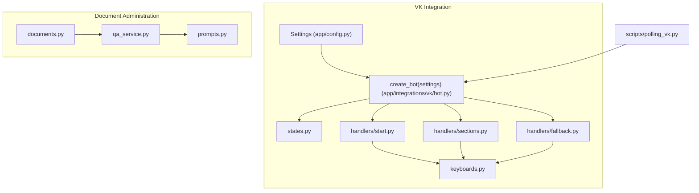
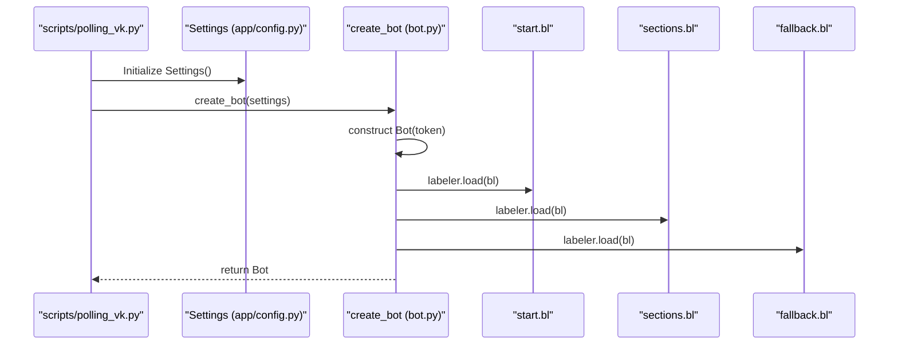
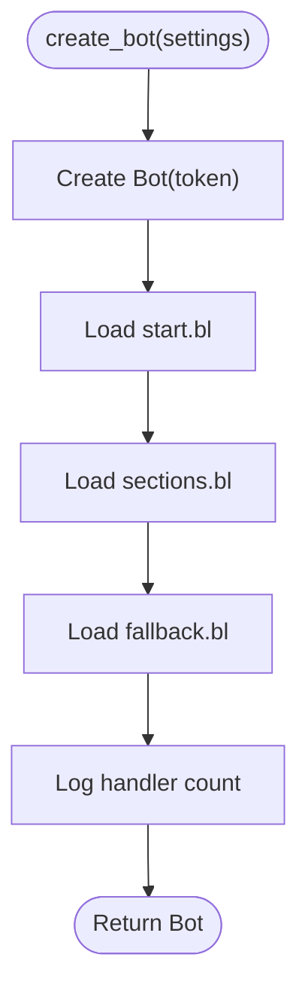
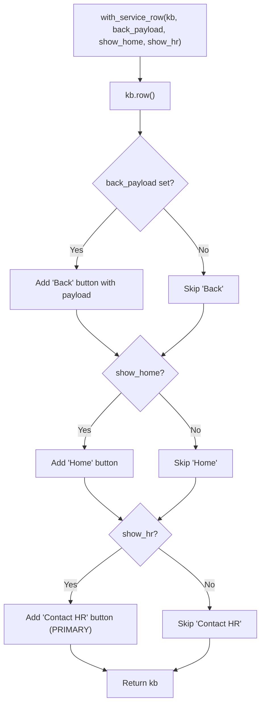
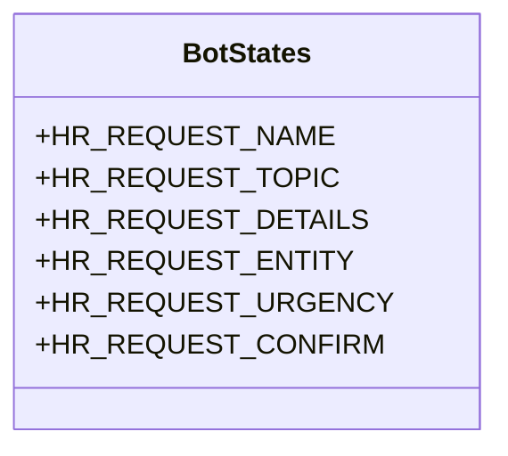
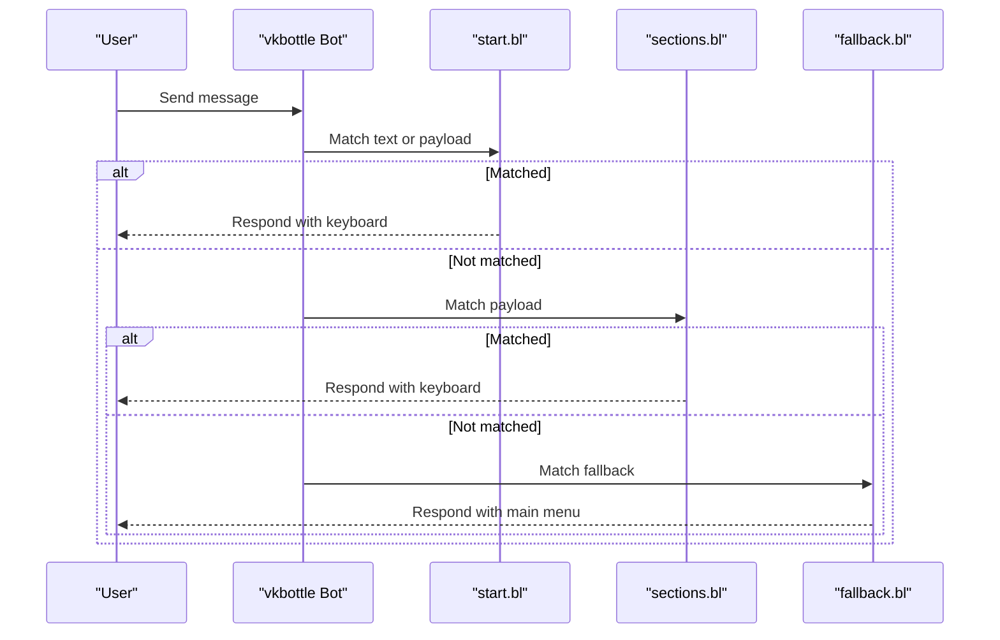
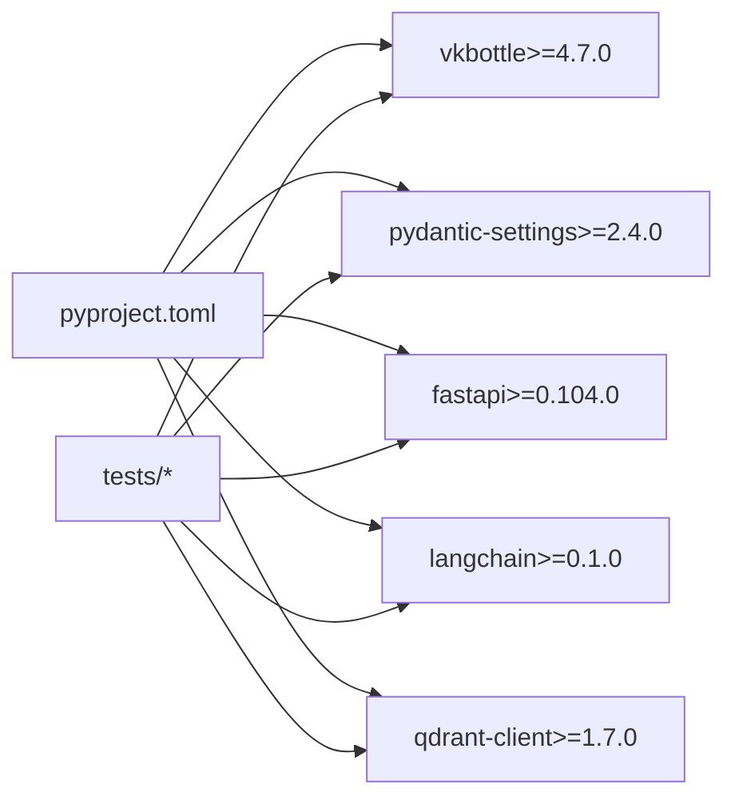

# API Reference

<cite>
**Referenced Files in This Document**
- [app/config.py](file://app/config.py)
- [app/integrations/vk/bot.py](file://app/integrations/vk/bot.py)
- [app/integrations/vk/keyboards.py](file://app/integrations/vk/keyboards.py)
- [app/integrations/vk/states.py](file://app/integrations/vk/states.py)
- [app/integrations/vk/handlers/start.py](file://app/integrations/vk/handlers/start.py)
- [app/integrations/vk/handlers/sections.py](file://app/integrations/vk/handlers/sections.py)
- [app/integrations/vk/handlers/fallback.py](file://app/integrations/vk/handlers/fallback.py)
- [app/api/documents.py](file://app/api/documents.py)
- [app/domain/qa_service.py](file://app/domain/qa_service.py)
- [app/rag/prompts.py](file://app/rag/prompts.py)
- [scripts/polling_vk.py](file://scripts/polling_vk.py)
- [tests/test_config.py](file://tests/test_config.py)
- [tests/test_bot_factory.py](file://tests/test_bot_factory.py)
- [tests/test_keyboards.py](file://tests/test_keyboards.py)
- [tests/test_states.py](file://tests/test_states.py)
- [tests/test_api_documents.py](file://tests/test_api_documents.py)
- [tests/test_qa_service.py](file://tests/test_qa_service.py)
- [pyproject.toml](file://pyproject.toml)
</cite>

## Update Summary
**Changes Made**
- Added new Document Question Answering API section documenting the `/api/documents/{document_id}/ask` endpoint
- Updated Document Admin API section to include the new ask endpoint
- Added validation logic and error handling documentation for document query requests
- Updated architecture overview to include the QA service integration
- Enhanced error handling documentation for document-specific operations

## Table of Contents
1. [Introduction](#introduction)
2. [Project Structure](#project-structure)
3. [Core Components](#core-components)
4. [Architecture Overview](#architecture-overview)
5. [Detailed Component Analysis](#detailed-component-analysis)
6. [Dependency Analysis](#dependency-analysis)
7. [Performance Considerations](#performance-considerations)
8. [Troubleshooting Guide](#troubleshooting-guide)
9. [Conclusion](#conclusion)
10. [Appendices](#appendices)

## Introduction
This document provides a comprehensive API reference for cafetera_hr_bot. It covers:
- Bot configuration API and settings structure
- Keyboard builder API for constructing VK bot keyboards
- State management API for multi-step dialogs
- Handler registration API for routing user interactions
- Configuration settings API and environment-driven loading
- **NEW** Document administration API including document-specific question answering capabilities

It includes parameter specifications, return value descriptions, usage examples, integration patterns, and versioning considerations.

## Project Structure
The VK integration resides under app/integrations/vk/, with the following key modules:
- Configuration: app/config.py
- Bot factory and handler wiring: app/integrations/vk/bot.py
- Keyboard builders: app/integrations/vk/keyboards.py
- States: app/integrations/vk/states.py
- Handlers: app/integrations/vk/handlers/start.py, sections.py, fallback.py
- **NEW** Document administration: app/api/documents.py
- **NEW** QA service: app/domain/qa_service.py
- Local development entrypoint: scripts/polling_vk.py
- Tests validating APIs: tests/test_config.py, tests/test_bot_factory.py, tests/test_keyboards.py, tests/test_states.py, tests/test_api_documents.py, tests/test_qa_service.py
- Project metadata and dependencies: pyproject.toml

**Diagram sources**
- [app/integrations/vk/bot.py:23-31](file://app/integrations/vk/bot.py#L23-L31)
- [app/integrations/vk/keyboards.py:1-108](file://app/integrations/vk/keyboards.py#L1-L108)
- [app/integrations/vk/states.py:1-14](file://app/integrations/vk/states.py#L1-L14)
- [app/integrations/vk/handlers/start.py:1-55](file://app/integrations/vk/handlers/start.py#L1-L55)
- [app/integrations/vk/handlers/sections.py:1-82](file://app/integrations/vk/handlers/sections.py#L1-L82)
- [app/integrations/vk/handlers/fallback.py:1-18](file://app/integrations/vk/handlers/fallback.py#L1-L18)
- [app/api/documents.py:1-1046](file://app/api/documents.py#L1-L1046)
- [app/domain/qa_service.py:1-167](file://app/domain/qa_service.py#L1-L167)
- [app/rag/prompts.py:1-38](file://app/rag/prompts.py#L1-L38)
- [scripts/polling_vk.py:24-28](file://scripts/polling_vk.py#L24-L28)

**Section sources**
- [app/integrations/vk/bot.py:1-32](file://app/integrations/vk/bot.py#L1-L32)
- [app/integrations/vk/keyboards.py:1-108](file://app/integrations/vk/keyboards.py#L1-L108)
- [app/integrations/vk/states.py:1-14](file://app/integrations/vk/states.py#L1-L14)
- [app/integrations/vk/handlers/start.py:1-55](file://app/integrations/vk/handlers/start.py#L1-L55)
- [app/integrations/vk/handlers/sections.py:1-82](file://app/integrations/vk/handlers/sections.py#L1-L82)
- [app/integrations/vk/handlers/fallback.py:1-18](file://app/integrations/vk/handlers/fallback.py#L1-L18)
- [app/api/documents.py:1-1046](file://app/api/documents.py#L1-L1046)
- [app/domain/qa_service.py:1-167](file://app/domain/qa_service.py#L1-L167)
- [app/rag/prompts.py:1-38](file://app/rag/prompts.py#L1-L38)
- [scripts/polling_vk.py:1-33](file://scripts/polling_vk.py#L1-L33)

## Core Components
This section documents the primary APIs exposed by the VK integration and document administration system.

- Configuration settings API
  - Purpose: Load and expose runtime configuration for the VK bot
  - Module: app/config.py
  - Class: Settings
  - Fields:
    - vk_access_token: str
    - vk_group_id: int
  - Behavior:
    - Loads from .env with UTF-8 encoding
    - Defaults apply when environment variables are absent
  - Example usage:
    - Instantiate Settings() to load from environment
    - Pass an instance to create_bot(settings)
  - Related tests: tests/test_config.py

- Bot factory and handler registration API
  - Purpose: Construct a fully wired vkbottle Bot with handlers
  - Module: app/integrations/vk/bot.py
  - Function: create_bot(settings: Settings) -> Bot
  - Behavior:
    - Creates a Bot using vk_access_token
    - Registers handler labelers in a fixed order: start, sections, fallback
    - Logs the number of loaded labelers
  - Integration pattern:
    - Call create_bot(Settings()) from scripts/polling_vk.py
    - Run bot.run_polling() for local development
  - Related tests: tests/test_bot_factory.py

- Keyboard builder API
  - Purpose: Build VK keyboards with standardized service buttons and section buttons
  - Module: app/integrations/vk/keyboards.py
  - Constants:
    - CMD_HOME, CMD_BACK, CMD_CONTACT_HR
    - CMD_HIRE, CMD_FIRE, CMD_VACATION, CMD_PAY, CMD_SICK, CMD_PROBATION, CMD_ASK
  - Functions:
    - with_service_row(kb: Keyboard, back_payload: dict | None = None, show_home: bool = True, show_hr: bool = True) -> Keyboard
      - Appends a service row with Back/Home/Contact HR buttons
      - Returns the same Keyboard instance
    - main_menu_kb() -> Keyboard
      - Builds the main menu with seven functional sections plus Contact HR
      - Not inline, not one-time
    - stub_kb(back_payload: dict | None = None) -> Keyboard
      - Minimal keyboard containing only the service row
  - Related tests: tests/test_keyboards.py

- State management API
  - Purpose: Define states for multi-step dialogs (e.g., HR request wizard)
  - Module: app/integrations/vk/states.py
  - Class: BotStates (inherits from vkbottle BaseStateGroup)
  - States:
    - HR_REQUEST_NAME
    - HR_REQUEST_TOPIC
    - HR_REQUEST_DETAILS
    - HR_REQUEST_ENTITY
    - HR_REQUEST_URGENCY
    - HR_REQUEST_CONFIRM
  - Related tests: tests/test_states.py

- Handler registration API (payload routing)
  - Purpose: Register message handlers using vkbottle BotLabeler and payload routing
  - Modules:
    - app/integrations/vk/handlers/start.py
    - app/integrations/vk/handlers/sections.py
    - app/integrations/vk/handlers/fallback.py
  - Pattern:
    - Each handler module defines a bl = BotLabeler()
    - Handlers decorated with @bl.message(...) for text or payload matching
    - Handlers send responses and attach keyboards via .get_json()

- **NEW** Document administration API
  - Purpose: Manage HR documents and provide document-specific question answering
  - Module: app/api/documents.py
  - Endpoints:
    - POST /api/documents/{document_id}/ask - Ask a question about a specific document
  - Validation logic:
    - Document existence check
    - Status verification (must be "completed")
    - Search enablement check
  - Error handling:
    - 404 for non-existent documents
    - 400 for documents not ready for questions
  - Related tests: tests/test_api_documents.py

- **NEW** QA service API
  - Purpose: Provide document-specific question answering using RAG chain
  - Module: app/domain/qa_service.py
  - Function: ask_about_document(question: str, document_id: str) -> str
  - Features:
    - Document-scoped retrieval using specialized prompt
    - Answer truncation for VK message limits
    - Fallback error handling
  - Related tests: tests/test_qa_service.py

**Section sources**
- [app/config.py:1-9](file://app/config.py#L1-L9)
- [tests/test_config.py:1-28](file://tests/test_config.py#L1-L28)
- [app/integrations/vk/bot.py:23-31](file://app/integrations/vk/bot.py#L23-L31)
- [tests/test_bot_factory.py:23-44](file://tests/test_bot_factory.py#L23-L44)
- [app/integrations/vk/keyboards.py:11-108](file://app/integrations/vk/keyboards.py#L11-L108)
- [tests/test_keyboards.py:49-192](file://tests/test_keyboards.py#L49-L192)
- [app/integrations/vk/states.py:4-14](file://app/integrations/vk/states.py#L4-L14)
- [tests/test_states.py:8-31](file://tests/test_states.py#L8-L31)
- [app/integrations/vk/handlers/start.py:12-55](file://app/integrations/vk/handlers/start.py#L12-L55)
- [app/integrations/vk/handlers/sections.py:17-82](file://app/integrations/vk/handlers/sections.py#L17-L82)
- [app/integrations/vk/handlers/fallback.py:7-18](file://app/integrations/vk/handlers/fallback.py#L7-L18)
- [app/api/documents.py:826-844](file://app/api/documents.py#L826-L844)
- [app/domain/qa_service.py:117-151](file://app/domain/qa_service.py#L117-L151)

## Architecture Overview
The VK integration follows a modular architecture with document administration capabilities:
- Configuration is loaded via Settings and passed to the bot factory
- The bot factory wires three handler labelers in a strict order
- Handlers use keyboard builders to render consistent UI
- States define multi-step dialog steps
- **NEW** Document administration API provides CRUD operations and question answering
- **NEW** QA service integrates with RAG chain for document-specific responses

**Diagram sources**
- [scripts/polling_vk.py:24-28](file://scripts/polling_vk.py#L24-L28)
- [app/config.py:4-9](file://app/config.py#L4-L9)
- [app/integrations/vk/bot.py:23-31](file://app/integrations/vk/bot.py#L23-L31)
- [app/integrations/vk/handlers/start.py:12](file://app/integrations/vk/handlers/start.py#L12)
- [app/integrations/vk/handlers/sections.py:17](file://app/integrations/vk/handlers/sections.py#L17)
- [app/integrations/vk/handlers/fallback.py:7](file://app/integrations/vk/handlers/fallback.py#L7)

## Detailed Component Analysis

### Configuration Settings API
- Class: Settings
  - Fields:
    - vk_access_token: str
    - vk_group_id: int
  - Loading:
    - Reads from .env with UTF-8 encoding
    - Defaults are applied when fields are missing
- Usage:
  - Instantiate Settings() to load from environment
  - Pass to create_bot(settings)
- Example:
  - See scripts/polling_vk.py main() for typical usage
- Related tests:
  - tests/test_config.py validates defaults and environment overrides

**Section sources**
- [app/config.py:4-9](file://app/config.py#L4-L9)
- [tests/test_config.py:6-27](file://tests/test_config.py#L6-L27)
- [scripts/polling_vk.py:24-28](file://scripts/polling_vk.py#L24-L28)

### Bot Factory and Handler Registration API
- Function: create_bot(settings: Settings) -> Bot
  - Constructs a vkbottle Bot with the provided token
  - Registers handlers in this order:
    - start.bl
    - sections.bl
    - fallback.bl (must be last)
  - Returns the configured Bot instance
- Integration:
  - Called from scripts/polling_vk.py
  - Used to run the bot in Long Poll mode
- Handler wiring order:
  - Enforced by _HANDLER_LABELERS list
  - Verified by tests/test_bot_factory.py

**Diagram sources**
- [app/integrations/vk/bot.py:23-31](file://app/integrations/vk/bot.py#L23-L31)

**Section sources**
- [app/integrations/vk/bot.py:23-31](file://app/integrations/vk/bot.py#L23-L31)
- [tests/test_bot_factory.py:8-44](file://tests/test_bot_factory.py#L8-L44)
- [scripts/polling_vk.py:24-28](file://scripts/polling_vk.py#L24-L28)

### Keyboard Builder API
- Payload constants:
  - CMD_HOME, CMD_BACK, CMD_CONTACT_HR
  - CMD_HIRE, CMD_FIRE, CMD_VACATION, CMD_PAY, CMD_SICK, CMD_PROBATION, CMD_ASK
- Functions:
  - with_service_row(kb, back_payload=None, show_home=True, show_hr=True) -> Keyboard
    - Adds Back/Home/Contact HR buttons depending on parameters
    - Returns the same Keyboard instance
  - main_menu_kb() -> Keyboard
    - Builds a five-row keyboard with eight buttons:
      - First row: Hire, Fire
      - Second row: Vacation, Pay
      - Third row: Sick, Probation
      - Fourth row: Ask
      - Fifth row: Contact HR (POSITIVE color)
    - Not inline, not one-time
  - stub_kb(back_payload=None) -> Keyboard
    - Convenience keyboard with only the service row
- Usage examples:
  - start handlers call main_menu_kb().get_json()
  - sections handlers call stub_kb(back_payload=CMD_HOME).get_json()
  - fallback handler calls main_menu_kb().get_json()

**Diagram sources**
- [app/integrations/vk/keyboards.py:29-50](file://app/integrations/vk/keyboards.py#L29-L50)

**Section sources**
- [app/integrations/vk/keyboards.py:11-108](file://app/integrations/vk/keyboards.py#L11-L108)
- [tests/test_keyboards.py:49-192](file://tests/test_keyboards.py#L49-L192)
- [app/integrations/vk/handlers/start.py:23-54](file://app/integrations/vk/handlers/start.py#L23-L54)
- [app/integrations/vk/handlers/sections.py:28-81](file://app/integrations/vk/handlers/sections.py#L28-L81)
- [app/integrations/vk/handlers/fallback.py:15-17](file://app/integrations/vk/handlers/fallback.py#L15-L17)

### State Management API
- Class: BotStates (BaseStateGroup)
  - States for a six-step HR request dialog:
    - HR_REQUEST_NAME
    - HR_REQUEST_TOPIC
    - HR_REQUEST_DETAILS
    - HR_REQUEST_ENTITY
    - HR_REQUEST_URGENCY
    - HR_REQUEST_CONFIRM
- Usage pattern:
  - Intended for state-dependent handlers via vkbottle's state parameter
  - Part of the scaffolding described in PLAN.md for multi-step dialogs

**Diagram sources**
- [app/integrations/vk/states.py:4-14](file://app/integrations/vk/states.py#L4-L14)

**Section sources**
- [app/integrations/vk/states.py:4-14](file://app/integrations/vk/states.py#L4-L14)
- [tests/test_states.py:8-31](file://tests/test_states.py#L8-L31)
- [PLAN.md:20-28](file://PLAN.md#L20-L28)

### Handler Registration API
- Pattern:
  - Each handler module defines a BotLabeler bl
  - Handlers decorated with @bl.message(...) for either text or payload matching
  - Handlers send responses and attach keyboards via .get_json()
- Modules:
  - start.py: /start, Home payload, Contact HR placeholder
  - sections.py: Seven section payloads (Hire, Fire, Vacation, Pay, Sick, Probation, Ask)
  - fallback.py: Unmatched text falls back to main menu
- Wiring order:
  - Fixed by _HANDLER_LABELERS ensuring fallback is last

**Diagram sources**
- [app/integrations/vk/bot.py:16-20](file://app/integrations/vk/bot.py#L16-L20)
- [app/integrations/vk/handlers/start.py:31-54](file://app/integrations/vk/handlers/start.py#L31-L54)
- [app/integrations/vk/handlers/sections.py:28-81](file://app/integrations/vk/handlers/sections.py#L28-L81)
- [app/integrations/vk/handlers/fallback.py:15-17](file://app/integrations/vk/handlers/fallback.py#L15-L17)

**Section sources**
- [app/integrations/vk/handlers/start.py:12-55](file://app/integrations/vk/handlers/start.py#L12-L55)
- [app/integrations/vk/handlers/sections.py:17-82](file://app/integrations/vk/handlers/sections.py#L17-L82)
- [app/integrations/vk/handlers/fallback.py:7-18](file://app/integrations/vk/handlers/fallback.py#L7-L18)
- [app/integrations/vk/bot.py:14-20](file://app/integrations/vk/bot.py#L14-L20)

### **NEW** Document Administration API
- Purpose: Manage HR documents and provide document-specific question answering
- Module: app/api/documents.py
- Endpoints:
  - POST /api/documents/{document_id}/ask - Ask a question about a specific document
- Validation logic:
  - Document existence check using repository.get(document_id)
  - Status verification: doc.status.value != "completed"
  - Search enablement check: not doc.is_search_enabled
- Error handling:
  - 404 for non-existent documents: "Документ не найден"
  - 400 for documents not ready for questions: "Документ не готов для вопросов"
- Response format:
  - JSON object with "answer" field containing the generated response
- Integration pattern:
  - Requires admin authentication cookie
  - Uses QA service for document-specific question answering
  - Returns truncated responses suitable for VK message limits

**Updated** Added comprehensive validation logic and error handling for document query requests

**Section sources**
- [app/api/documents.py:826-844](file://app/api/documents.py#L826-L844)
- [tests/test_api_documents.py:1-751](file://tests/test_api_documents.py#L1-L751)

### **NEW** QA Service API
- Purpose: Provide document-specific question answering using RAG chain
- Module: app/domain/qa_service.py
- Function: ask_about_document(question: str, document_id: str) -> str
- Key features:
  - Document-scoped retrieval using specialized prompt (DOCUMENT_EXPERTS_PROMPT)
  - Answer truncation for VK message limits (4096 characters)
  - Fallback error handling for unavailable services
- System prompt:
  - DOCUMENT_EXPERTS_PROMPT: Specialized prompt for HR document experts
  - Rules emphasize document-specific context and structured responses
- Error handling:
  - Returns ERR_NO_ANSWER when service not initialized
  - Returns ERR_DOCUMENT_UNAVAILABLE on runtime errors
  - Handles empty answers gracefully
- Integration pattern:
  - Built with document-specific retriever and LLM
  - Uses specialized system prompt for HR document context

**Updated** Added new QA service with document-specific question answering capabilities

**Section sources**
- [app/domain/qa_service.py:117-151](file://app/domain/qa_service.py#L117-L151)
- [app/rag/prompts.py:21-37](file://app/rag/prompts.py#L21-L37)
- [tests/test_qa_service.py:1-142](file://tests/test_qa_service.py#L1-L142)

## Dependency Analysis
External dependencies relevant to the VK integration and document administration:
- vkbottle >= 4.7.0 for Bot, BotLabeler, Keyboard, Text, and BaseStateGroup
- pydantic-settings for Settings
- pytest for tests
- **NEW** FastAPI for document administration API endpoints
- **NEW** LangChain for RAG chain integration
- **NEW** Qdrant for vector database operations

**Diagram sources**
- [pyproject.toml:7-22](file://pyproject.toml#L7-L22)

**Section sources**
- [pyproject.toml:1-56](file://pyproject.toml#L1-L56)

## Performance Considerations
- Keyboard construction:
  - Keyboard instances are reused and returned by reference (e.g., with_service_row returns the same kb)
  - Avoid unnecessary allocations by reusing keyboards across handlers
- Handler registration order:
  - Maintaining the correct order prevents redundant handler matching and improves predictability
- Token forwarding:
  - The bot token is forwarded directly to the underlying API client; ensure tokens are managed securely
- **NEW** Document query performance:
  - QA service uses specialized document retrievers for faster document-specific searches
  - Answer truncation prevents large responses that could impact performance
  - Document status checks prevent queries on unprocessed documents

## Troubleshooting Guide
- Configuration not loading:
  - Verify .env presence and encoding (UTF-8)
  - Confirm environment variable names match expected keys
  - See tests/test_config.py for expected behavior
- Handlers not responding:
  - Ensure create_bot registers handlers in the correct order
  - Confirm fallback is last to avoid swallowing messages
  - See tests/test_bot_factory.py for assertions
- Keyboard layout issues:
  - Validate main_menu_kb composition and service row placement
  - Use tests/test_keyboards.py as a reference for expected layouts
- State mismatch:
  - Ensure BotStates values align with handler expectations
  - See tests/test_states.py for validation of state names and uniqueness
- **NEW** Document query failures:
  - Verify document status is "completed" and search is enabled
  - Check that document exists in repository
  - Ensure QA service is properly initialized
  - Validate that document-specific retriever is available

**Section sources**
- [tests/test_config.py:6-27](file://tests/test_config.py#L6-L27)
- [tests/test_bot_factory.py:8-44](file://tests/test_bot_factory.py#L8-L44)
- [tests/test_keyboards.py:49-192](file://tests/test_keyboards.py#L49-L192)
- [tests/test_states.py:8-31](file://tests/test_states.py#L8-L31)
- [tests/test_api_documents.py:1-751](file://tests/test_api_documents.py#L1-L751)
- [tests/test_qa_service.py:1-142](file://tests/test_qa_service.py#L1-L142)

## Conclusion
The cafetera_hr_bot VK integration exposes a clean, modular API with enhanced document administration capabilities:
- Settings loads configuration from environment
- create_bot wires handlers deterministically
- Keyboard builders provide consistent UI
- BotStates supports multi-step dialogs
- Handler registration uses payload routing for predictable UX
- **NEW** Document administration API provides comprehensive document management
- **NEW** QA service enables document-specific question answering with validation and error handling

Adhering to the documented patterns ensures reliable operation and maintainable extensions.

## Appendices

### Versioning and Compatibility Notes
- Project version: 0.1.0
- VK integration relies on vkbottle >= 4.7.0
- Keyboard and state APIs are stable within current implementation
- **NEW** Document administration API is newly introduced
- **NEW** QA service API is newly introduced
- Backward compatibility:
  - Handler registration order is enforced by _HANDLER_LABELERS
  - Keyboard builder functions return the same Keyboard instance to preserve references
  - State names and payloads are validated by tests
  - **NEW** Document administration endpoints maintain backward compatibility with existing authentication

**Section sources**
- [pyproject.toml:3](file://pyproject.toml#L3)
- [pyproject.toml:19](file://pyproject.toml#L19)
- [app/integrations/vk/bot.py:16-20](file://app/integrations/vk/bot.py#L16-L20)
- [app/integrations/vk/keyboards.py:29-50](file://app/integrations/vk/keyboards.py#L29-L50)
- [tests/test_states.py:20-30](file://tests/test_states.py#L20-L30)
- [app/api/documents.py:826-844](file://app/api/documents.py#L826-L844)
- [app/domain/qa_service.py:117-151](file://app/domain/qa_service.py#L117-L151)