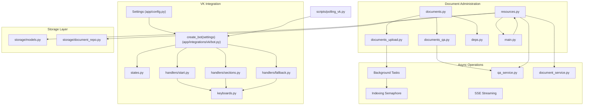
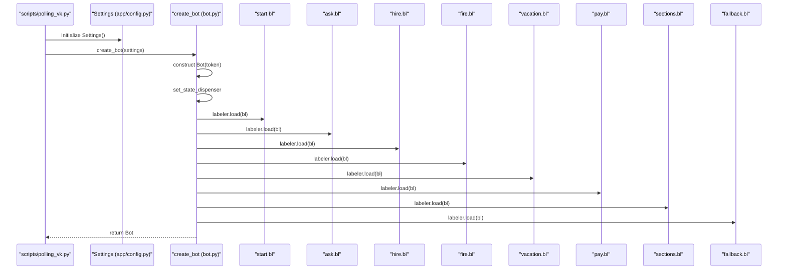
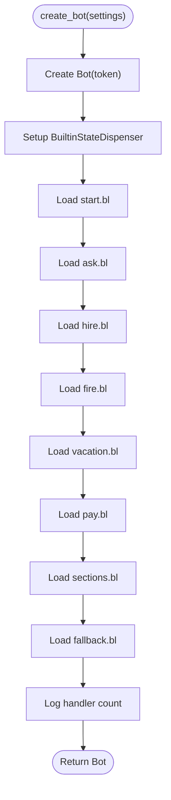
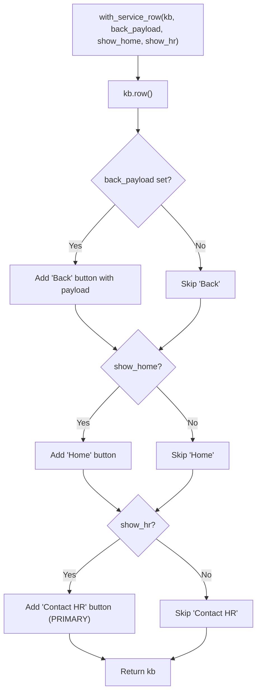
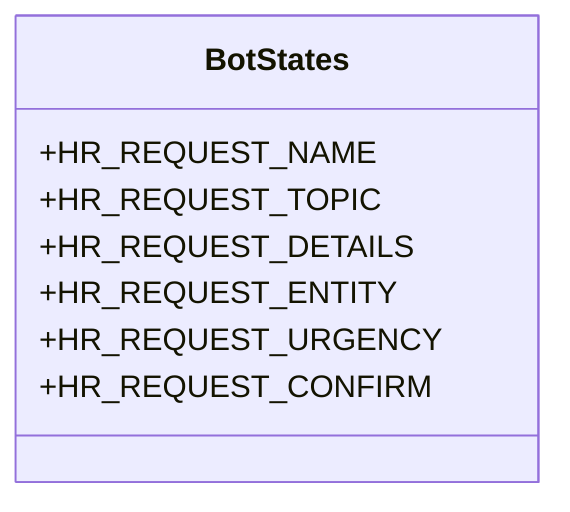
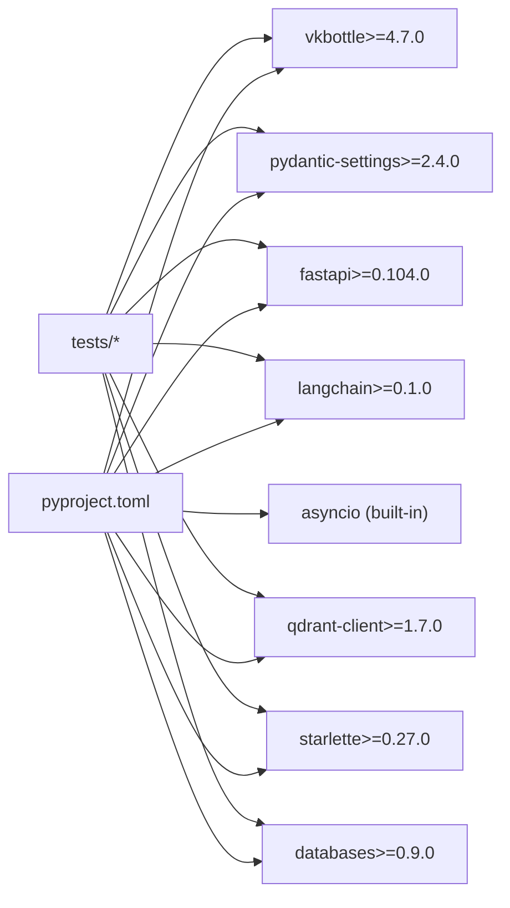

# API Reference

<cite>
**Referenced Files in This Document**
- [app/config.py](file://app/config.py)
- [app/integrations/vk/bot.py](file://app/integrations/vk/bot.py)
- [app/integrations/vk/keyboards.py](file://app/integrations/vk/keyboards.py)
- [app/integrations/vk/states.py](file://app/integrations/vk/states.py)
- [app/integrations/vk/handlers/start.py](file://app/integrations/vk/handlers/start.py)
- [app/integrations/vk/handlers/sections.py](file://app/integrations/vk/handlers/sections.py)
- [app/integrations/vk/handlers/fallback.py](file://app/integrations/vk/handlers/fallback.py)
- [app/api/documents.py](file://app/api/documents.py)
- [app/api/documents_qa.py](file://app/api/documents_qa.py)
- [app/api/documents_upload.py](file://app/api/documents_upload.py)
- [app/api/deps.py](file://app/api/deps.py)
- [app/domain/qa_service.py](file://app/domain/qa_service.py)
- [app/domain/document_service.py](file://app/domain/document_service.py)
- [app/storage/models.py](file://app/storage/models.py)
- [app/storage/document_repo.py](file://app/storage/document_repo.py)
- [app/resources.py](file://app/resources.py)
- [app/main.py](file://app/main.py)
- [app/rag/prompts.py](file://app/rag/prompts.py)
- [templates/documents.html](file://templates/documents.html)
- [scripts/polling_vk.py](file://scripts/polling_vk.py)
- [tests/test_config.py](file://tests/test_config.py)
- [tests/test_bot_factory.py](file://tests/test_bot_factory.py)
- [tests/test_keyboards.py](file://tests/test_keyboards.py)
- [tests/test_states.py](file://tests/test_states.py)
- [tests/test_api_documents.py](file://tests/test_api_documents.py)
- [tests/test_qa_service.py](file://tests/test_qa_service.py)
- [pyproject.toml](file://pyproject.toml)
</cite>

## Update Summary
**Changes Made**
- Enhanced API endpoints with comprehensive async support throughout the document management system
- Improved document administration API with new async operations and background task management
- Updated resource management system with async initialization and graceful degradation
- Added comprehensive Server-Sent Events (SSE) streaming support for real-time question answering
- Enhanced QA service with dual streaming capabilities for both document-specific and global queries
- Implemented async background indexing with semaphore-based concurrency control
- Added comprehensive async testing patterns and resource lifecycle management

## Table of Contents
1. [Introduction](#introduction)
2. [Project Structure](#project-structure)
3. [Core Components](#core-components)
4. [Architecture Overview](#architecture-overview)
5. [Detailed Component Analysis](#detailed-component-analysis)
6. [Dependency Analysis](#dependency-analysis)
7. [Performance Considerations](#performance-considerations)
8. [Troubleshooting Guide](#troubleshooting-guide)
9. [Conclusion](#conclusion)
10. [Appendices](#appendices)

## Introduction
This document provides a comprehensive API reference for cafetera_hr_bot. It covers:
- Bot configuration API and settings structure
- Keyboard builder API for constructing VK bot keyboards
- State management API for multi-step dialogs
- Handler registration API for routing user interactions
- Configuration settings API and environment-driven loading
- Document administration API including document-specific and global question processing capabilities
- Enhanced async resource management system with graceful degradation
- Comprehensive Server-Sent Events streaming for real-time question answering
- Background task management with semaphore-based concurrency control

It includes parameter specifications, return value descriptions, usage examples, integration patterns, and versioning considerations.

## Project Structure
The VK integration resides under app/integrations/vk/, with the following key modules:
- Configuration: app/config.py
- Bot factory and handler wiring: app/integrations/vk/bot.py
- Keyboard builders: app/integrations/vk/keyboards.py
- States: app/integrations/vk/states.py
- Handlers: app/integrations/vk/handlers/start.py, sections.py, fallback.py
- Document administration: app/api/documents.py
- QA endpoints: app/api/documents_qa.py
- Upload operations: app/api/documents_upload.py
- Dependencies: app/api/deps.py
- Resource management: app/resources.py
- Main application: app/main.py
- QA service: app/domain/qa_service.py
- Document service: app/domain/document_service.py
- Storage models: app/storage/models.py
- Document repository: app/storage/document_repo.py
- **NEW** Async resource management with graceful degradation
- **NEW** Background task management with semaphore control
- **NEW** SSE streaming for real-time question answering
- **NEW** Async document operations and validation
- Local development entrypoint: scripts/polling_vk.py
- Tests validating APIs: tests/test_config.py, tests/test_bot_factory.py, tests/test_keyboards.py, tests/test_states.py, tests/test_api_documents.py, tests/test_qa_service.py
- Project metadata and dependencies: pyproject.toml



**Diagram sources**
- [app/integrations/vk/bot.py:23-31](file://app/integrations/vk/bot.py#L23-L31)
- [app/integrations/vk/keyboards.py:1-108](file://app/integrations/vk/keyboards.py#L1-L108)
- [app/integrations/vk/states.py:1-14](file://app/integrations/vk/states.py#L1-L14)
- [app/integrations/vk/handlers/start.py:1-55](file://app/integrations/vk/handlers/start.py#L1-L55)
- [app/integrations/vk/handlers/sections.py:1-82](file://app/integrations/vk/handlers/sections.py#L1-L82)
- [app/integrations/vk/handlers/fallback.py:1-18](file://app/integrations/vk/handlers/fallback.py#L1-L18)
- [app/api/documents.py:1-531](file://app/api/documents.py#L1-L531)
- [app/api/documents_qa.py:1-91](file://app/api/documents_qa.py#L1-L91)
- [app/api/documents_upload.py:1-288](file://app/api/documents_upload.py#L1-L288)
- [app/api/deps.py:1-121](file://app/api/deps.py#L1-L121)
- [app/resources.py:1-364](file://app/resources.py#L1-L364)
- [app/main.py:1-76](file://app/main.py#L1-L76)
- [app/domain/qa_service.py:1-294](file://app/domain/qa_service.py#L1-L294)
- [app/domain/document_service.py:262-288](file://app/domain/document_service.py#L262-L288)
- [app/storage/models.py:1-37](file://app/storage/models.py#L1-L37)
- [app/storage/document_repo.py:64-70](file://app/storage/document_repo.py#L64-L70)

**Section sources**
- [app/integrations/vk/bot.py:1-56](file://app/integrations/vk/bot.py#L1-L56)
- [app/integrations/vk/keyboards.py:1-108](file://app/integrations/vk/keyboards.py#L1-L108)
- [app/integrations/vk/states.py:1-14](file://app/integrations/vk/states.py#L1-L14)
- [app/integrations/vk/handlers/start.py:1-55](file://app/integrations/vk/handlers/start.py#L1-L55)
- [app/integrations/vk/handlers/sections.py:1-82](file://app/integrations/vk/handlers/sections.py#L1-L82)
- [app/integrations/vk/handlers/fallback.py:1-18](file://app/integrations/vk/handlers/fallback.py#L1-L18)
- [app/api/documents.py:1-531](file://app/api/documents.py#L1-L531)
- [app/api/documents_qa.py:1-91](file://app/api/documents_qa.py#L1-L91)
- [app/api/documents_upload.py:1-288](file://app/api/documents_upload.py#L1-L288)
- [app/api/deps.py:1-121](file://app/api/deps.py#L1-L121)
- [app/resources.py:1-364](file://app/resources.py#L1-L364)
- [app/main.py:1-76](file://app/main.py#L1-L76)
- [app/domain/qa_service.py:1-294](file://app/domain/qa_service.py#L1-L294)
- [app/domain/document_service.py:262-288](file://app/domain/document_service.py#L262-L288)
- [app/storage/models.py:1-37](file://app/storage/models.py#L1-L37)
- [app/storage/document_repo.py:64-70](file://app/storage/document_repo.py#L64-L70)
- [templates/documents.html:1-1039](file://templates/documents.html#L1-L1039)
- [scripts/polling_vk.py:1-33](file://scripts/polling_vk.py#L1-L33)

## Core Components
This section documents the primary APIs exposed by the VK integration and document administration system with enhanced async support.

- Configuration settings API
  - Purpose: Load and expose runtime configuration for the VK bot
  - Module: app/config.py
  - Class: Settings
  - Fields:
    - vk_access_token: str
    - vk_group_id: int
  - Behavior:
    - Loads from .env with UTF-8 encoding
    - Defaults apply when environment variables are absent
  - Example usage:
    - Instantiate Settings() to load from environment
    - Pass an instance to create_bot(settings)
  - Related tests: tests/test_config.py

- Bot factory and handler registration API
  - Purpose: Construct a fully wired vkbottle Bot with handlers
  - Module: app/integrations/vk/bot.py
  - Function: create_bot(settings: Settings) -> Bot
  - Behavior:
    - Creates a Bot using vk_access_token
    - Registers handler labelers in a fixed order: start, ask, hire, fire, vacation, pay, sections, fallback
    - Sets up state dispenser for multi-step dialogs
    - Logs the number of loaded labelers
  - Integration pattern:
    - Call create_bot(Settings()) from scripts/polling_vk.py
    - Run bot.run_polling() for local development
  - Related tests: tests/test_bot_factory.py

- Keyboard builder API
  - Purpose: Build VK keyboards with standardized service buttons and section buttons
  - Module: app/integrations/vk/keyboards.py
  - Constants:
    - CMD_HOME, CMD_BACK, CMD_CONTACT_HR
    - CMD_HIRE, CMD_FIRE, CMD_VACATION, CMD_PAY, CMD_SICK, CMD_PROBATION, CMD_ASK
  - Functions:
    - with_service_row(kb: Keyboard, back_payload: dict | None = None, show_home: bool = True, show_hr: bool = True) -> Keyboard
      - Appends a service row with Back/Home/Contact HR buttons
      - Returns the same Keyboard instance
    - main_menu_kb() -> Keyboard
      - Builds the main menu with seven functional sections plus Contact HR
      - Not inline, not one-time
    - stub_kb(back_payload: dict | None = None) -> Keyboard
      - Minimal keyboard containing only the service row
  - Related tests: tests/test_keyboards.py

- State management API
  - Purpose: Define states for multi-step dialogs (e.g., HR request wizard)
  - Module: app/integrations/vk/states.py
  - Class: BotStates (inherits from vkbottle BaseStateGroup)
  - States:
    - HR_REQUEST_NAME
    - HR_REQUEST_TOPIC
    - HR_REQUEST_DETAILS
    - HR_REQUEST_ENTITY
    - HR_REQUEST_URGENCY
    - HR_REQUEST_CONFIRM
  - Related tests: tests/test_states.py

- Handler registration API (payload routing)
  - Purpose: Register message handlers using vkbottle BotLabeler and payload routing
  - Modules:
    - app/integrations/vk/handlers/start.py
    - app/integrations/vk/handlers/sections.py
    - app/integrations/vk/handlers/fallback.py
  - Pattern:
    - Each handler module defines a bl = BotLabeler()
    - Handlers decorated with @bl.message(...) for text or payload matching
    - Handlers send responses and attach keyboards via .get_json()

- **NEW** Document administration API with async support
  - Purpose: Manage HR documents with comprehensive CRUD operations and question answering capabilities
  - Module: app/api/documents.py
  - Endpoints:
    - GET /api/documents - List documents with pagination and filtering
    - GET /api/documents/{document_id} - Get document details
    - PATCH /api/documents/{document_id}/title - Update document title
    - PATCH /api/documents/{document_id}/search - Toggle search participation
    - POST /api/documents/{document_id}/reindex - Reindex document with background task
    - DELETE /api/documents/{document_id} - Delete document
    - GET /api/documents/{document_id}/download - Download document file
    - **NEW** GET /partials/document-table - HTMX partial for document table
    - **NEW** GET /partials/document-row/{document_id} - HTMX partial for single row
    - **NEW** GET /partials/documents-status - Batch status updates for polling
  - Async operations:
    - All endpoints use async/await patterns
    - Background tasks for long-running operations
    - Semaphore-based concurrency control for indexing
  - Validation logic:
    - Document existence check using async repository.get(document_id)
    - Status verification (must be "completed") for document-specific queries
    - Search enablement check for document-specific queries
  - Error handling:
    - 404 for non-existent documents
    - 400 for documents not ready for questions
    - Async error propagation with proper exception handling
  - **NEW** SSE streaming support for both document-specific and global queries
  - Related tests: tests/test_api_documents.py

- **NEW** Async resource management system
  - Purpose: Centralized async resource initialization with graceful degradation
  - Module: app/resources.py
  - Functions:
    - build_resources(settings, with_s3=False, with_db=False) -> AppResources
      - Initializes S3 storage, Qdrant client, embeddings, database, services
      - Handles graceful degradation when services are unavailable
      - Ensures Qdrant collection exists before building retriever
    - close_resources(res) -> None
      - Properly closes all resources in correct order
      - Attempts cleanup even if individual resources fail
  - Features:
    - Async initialization with try/except blocks
    - Graceful degradation for optional services
    - Proper resource cleanup and lifecycle management
    - Hybrid search support with sparse embeddings
  - Integration pattern:
    - Used in app/main.py lifespan manager
    - Supports both standalone and integrated deployment modes

- **NEW** Background task management with semaphore control
  - Purpose: Manage concurrent document indexing operations
  - Module: app/api/documents_upload.py
  - Functions:
    - _index_document_from_s3(service, s3, document_id, s3_key, semaphore, ...) -> None
      - Downloads from S3, parses, and indexes/reindexes documents
      - Runs as background task with semaphore control
      - Handles validation and error reporting
    - _parse_document_chunks(data, s3_key, document_id, ...) -> list
      - Parses document chunks with thread pool for CPU-intensive operations
      - Uses temporary files for processing
  - Features:
    - Semaphore-based concurrency limiting
    - Background task scheduling with BackgroundTasks
    - Thread pool execution for parsing operations
    - Proper error handling and cleanup
  - Integration pattern:
    - Scheduled automatically during upload operations
    - Supports both initial indexing and reindexing

- **NEW** Global Question Answering API with SSE streaming
  - Purpose: Process questions across the entire knowledge base with real-time streaming
  - Module: app/api/documents_qa.py
  - Endpoints:
    - POST /api/qa/ask-global - Ask a question across the entire knowledge base
    - POST /api/documents/{document_id}/ask - Ask a question about a specific document
  - Features:
    - Server-Sent Events (SSE) streaming for real-time token delivery
    - Async generator functions for streaming responses
    - Real-time error handling and completion signaling
    - Client-side SSE event parsing and token concatenation
  - Streaming format:
    - data: {"token": "..." } - individual tokens during generation
    - data: {"done": true} - completion signal
    - data: {"error": "..."} - error notification
  - Async operations:
    - All endpoints use async/await patterns
    - QA service methods support streaming responses
    - Proper error propagation through SSE stream
  - Integration pattern:
    - Requires admin authentication cookie
    - Uses QA service stream_ask() for global processing
    - Supports Ctrl+Enter submission in admin interface

- **NEW** Enhanced QA service API with dual streaming capabilities
  - Purpose: Provide question answering using RAG chain with dual streaming capabilities
  - Module: app/domain/qa_service.py
  - Functions:
    - ask(question: str) -> str - Single answer retrieval
    - ask_about_document(question: str, document_id: str) -> str - Document-specific answer
    - **NEW** stream_ask(question: str) - Async generator for global SSE streaming
    - **NEW** stream_about_document(question: str, document_id: str) - Async generator for document-specific SSE streaming
  - Features:
    - Document-scoped retrieval using specialized prompt
    - Global knowledge base processing with GLOBAL_EXPERTS_PROMPT
    - Real-time token streaming for SSE responses
    - Answer truncation for VK message limits
    - Fallback error handling
    - LRU cache for document chains with max size 50
  - **NEW** Dual prompt system:
    - GLOBAL_EXPERTS_PROMPT: Knowledge base-wide processing
    - DOCUMENT_EXPERTS_PROMPT: Document-specific processing
  - Async operations:
    - All methods use async/await patterns
    - Chain invocation with ainvoke() and astream()
    - Proper error handling with try/except blocks
  - Related tests: tests/test_qa_service.py

**Section sources**
- [app/config.py:1-9](file://app/config.py#L1-L9)
- [tests/test_config.py:1-28](file://tests/test_config.py#L1-L28)
- [app/integrations/vk/bot.py:23-31](file://app/integrations/vk/bot.py#L23-L31)
- [tests/test_bot_factory.py:23-44](file://tests/test_bot_factory.py#L23-L44)
- [app/integrations/vk/keyboards.py:11-108](file://app/integrations/vk/keyboards.py#L11-L108)
- [tests/test_keyboards.py:49-192](file://tests/test_keyboards.py#L49-L192)
- [app/integrations/vk/states.py:4-14](file://app/integrations/vk/states.py#L4-L14)
- [tests/test_states.py:8-31](file://tests/test_states.py#L8-L31)
- [app/integrations/vk/handlers/start.py:12-55](file://app/integrations/vk/handlers/start.py#L12-L55)
- [app/integrations/vk/handlers/sections.py:17-82](file://app/integrations/vk/handlers/sections.py#L17-L82)
- [app/integrations/vk/handlers/fallback.py:7-18](file://app/integrations/vk/handlers/fallback.py#L7-L18)
- [app/api/documents.py:791-853](file://app/api/documents.py#L791-L853)
- [app/api/documents_qa.py:26-91](file://app/api/documents_qa.py#L26-L91)
- [app/api/documents_upload.py:119-167](file://app/api/documents_upload.py#L119-L167)
- [app/resources.py:129-315](file://app/resources.py#L129-L315)
- [app/domain/qa_service.py:152-294](file://app/domain/qa_service.py#L152-294)
- [app/storage/models.py:11-37](file://app/storage/models.py#L11-L37)
- [app/storage/document_repo.py:64-70](file://app/storage/document_repo.py#L64-L70)

## Architecture Overview
The VK integration follows a modular architecture with enhanced document administration, async resource management, and real-time streaming capabilities:
- Configuration is loaded via Settings and passed to the bot factory
- The bot factory wires eight handler labelers in a strict order with state dispenser
- Handlers use keyboard builders to render consistent UI
- States define multi-step dialog steps
- Document administration API provides comprehensive CRUD operations with async support
- Background task management handles long-running operations with semaphore control
- Async resource management system with graceful degradation
- Enhanced QA service integrates with RAG chain for both document-specific and global responses
- Server-Sent Events streaming enables real-time question answering
- SSE streaming supports both global knowledge base processing and document-specific queries



**Diagram sources**
- [scripts/polling_vk.py:24-28](file://scripts/polling_vk.py#L24-L28)
- [app/config.py:4-9](file://app/config.py#L4-L9)
- [app/integrations/vk/bot.py:23-31](file://app/integrations/vk/bot.py#L23-L31)
- [app/integrations/vk/bot.py:30-39](file://app/integrations/vk/bot.py#L30-L39)
- [app/integrations/vk/handlers/start.py:12](file://app/integrations/vk/handlers/start.py#L12)
- [app/integrations/vk/handlers/sections.py:17](file://app/integrations/vk/handlers/sections.py#L17)
- [app/integrations/vk/handlers/fallback.py:7](file://app/integrations/vk/handlers/fallback.py#L7)

## Detailed Component Analysis

### Configuration Settings API
- Class: Settings
  - Fields:
    - vk_access_token: str
    - vk_group_id: int
  - Loading:
    - Reads from .env with UTF-8 encoding
    - Defaults are applied when fields are missing
- Usage:
  - Instantiate Settings() to load from environment
  - Pass to create_bot(settings)
- Example:
  - See scripts/polling_vk.py main() for typical usage
- Related tests:
  - tests/test_config.py validates defaults and environment overrides

**Section sources**
- [app/config.py:4-9](file://app/config.py#L4-L9)
- [tests/test_config.py:6-27](file://tests/test_config.py#L6-L27)
- [scripts/polling_vk.py:24-28](file://scripts/polling_vk.py#L24-L28)

### Bot Factory and Handler Registration API
- Function: create_bot(settings: Settings) -> Bot
  - Constructs a vkbottle Bot with the provided token
  - Sets up BuiltinStateDispenser for state management
  - Registers eight handler labelers in strict order:
    - start.bl
    - ask.bl
    - hire.bl
    - fire.bl
    - vacation.bl
    - pay.bl
    - sections.bl
    - fallback.bl (must be last)
  - Returns the configured Bot instance
- Integration:
  - Called from scripts/polling_vk.py
  - Used to run the bot in Long Poll mode
- Handler wiring order:
  - Enforced by _HANDLER_LABELERS list with explicit ordering
  - Verified by tests/test_bot_factory.py



**Diagram sources**
- [app/integrations/vk/bot.py:42-56](file://app/integrations/vk/bot.py#L42-L56)

**Section sources**
- [app/integrations/vk/bot.py:23-31](file://app/integrations/vk/bot.py#L23-L31)
- [app/integrations/vk/bot.py:30-39](file://app/integrations/vk/bot.py#L30-L39)
- [tests/test_bot_factory.py:8-44](file://tests/test_bot_factory.py#L8-L44)
- [scripts/polling_vk.py:24-28](file://scripts/polling_vk.py#L24-L28)

### Keyboard Builder API
- Payload constants:
  - CMD_HOME, CMD_BACK, CMD_CONTACT_HR
  - CMD_HIRE, CMD_FIRE, CMD_VACATION, CMD_PAY, CMD_SICK, CMD_PROBATION, CMD_ASK
- Functions:
  - with_service_row(kb, back_payload=None, show_home=True, show_hr=True) -> Keyboard
    - Adds Back/Home/Contact HR buttons depending on parameters
    - Returns the same Keyboard instance
  - main_menu_kb() -> Keyboard
    - Builds a five-row keyboard with eight buttons:
      - First row: Hire, Fire
      - Second row: Vacation, Pay
      - Third row: Sick, Probation
      - Fourth row: Ask
      - Fifth row: Contact HR (POSITIVE color)
    - Not inline, not one-time
  - stub_kb(back_payload=None) -> Keyboard
    - Convenience keyboard with only the service row
- Usage examples:
  - start handlers call main_menu_kb().get_json()
  - sections handlers call stub_kb(back_payload=CMD_HOME).get_json()
  - fallback handler calls main_menu_kb().get_json()



**Diagram sources**
- [app/integrations/vk/keyboards.py:29-50](file://app/integrations/vk/keyboards.py#L29-L50)

**Section sources**
- [app/integrations/vk/keyboards.py:11-108](file://app/integrations/vk/keyboards.py#L11-L108)
- [tests/test_keyboards.py:49-192](file://tests/test_keyboards.py#L49-L192)
- [app/integrations/vk/handlers/start.py:23-54](file://app/integrations/vk/handlers/start.py#L23-L54)
- [app/integrations/vk/handlers/sections.py:28-81](file://app/integrations/vk/handlers/sections.py#L28-L81)
- [app/integrations/vk/handlers/fallback.py:15-17](file://app/integrations/vk/handlers/fallback.py#L15-L17)

### State Management API
- Class: BotStates (BaseStateGroup)
  - States for a six-step HR request dialog:
    - HR_REQUEST_NAME
    - HR_REQUEST_TOPIC
    - HR_REQUEST_DETAILS
    - HR_REQUEST_ENTITY
    - HR_REQUEST_URGENCY
    - HR_REQUEST_CONFIRM
- Usage pattern:
  - Intended for state-dependent handlers via vkbottle's state parameter
  - Part of the scaffolding described in PLAN.md for multi-step dialogs



**Diagram sources**
- [app/integrations/vk/states.py:4-14](file://app/integrations/vk/states.py#L4-L14)

**Section sources**
- [app/integrations/vk/states.py:4-14](file://app/integrations/vk/states.py#L4-L14)
- [tests/test_states.py:8-31](file://tests/test_states.py#L8-L31)
- [PLAN.md:20-28](file://PLAN.md#L20-L28)

### Handler Registration API
- Pattern:
  - Each handler module defines a BotLabeler bl
  - Handlers decorated with @bl.message(...) for either text or payload matching
  - Handlers send responses and attach keyboards via .get_json()
- Modules:
  - start.py: /start, Home payload, Contact HR placeholder
  - ask.py: Free-text question handling with state management
  - sections.py: Seven section payloads (Hire, Fire, Vacation, Pay, Sick, Probation, Ask)
  - fallback.py: Unmatched text falls back to main menu
- Wiring order:
  - Fixed by _HANDLER_LABELERS ensuring fallback is last
  - Explicit ordering ensures proper message routing

```mermaid
sequenceDiagram
participant User as "User"
participant Bot as "vkbottle Bot"
participant LB_Start as "start.bl"
participant LB_Ask as "ask.bl"
participant LB_Hire as "hire.bl"
participant LB_Fire as "fire.bl"
participant LB_Vacation as "vacation.bl"
participant LB_Pay as "pay.bl"
participant LB_Sections as "sections.bl"
participant LB_Fallback as "fallback.bl"
User->>Bot : Send message
Bot->>LB_Start : Match text or payload
alt Matched
LB_Start-->>User : Respond with keyboard
else Not matched
Bot->>LB_Ask : Match free-text question
alt Matched
LB_Ask-->>User : Handle question with state
else Not matched
Bot->>LB_Hire : Match hire payload
alt Matched
LB_Hire-->>User : Handle hiring flow
else Not matched
Bot->>LB_Fire : Match fire payload
alt Matched
LB_Fire-->>User : Handle firing flow
else Not matched
Bot->>LB_Vacation : Match vacation payload
alt Matched
LB_Vacation-->>User : Handle vacation flow
else Not matched
Bot->>LB_Pay : Match pay payload
alt Matched
LB_Pay-->>User : Handle payment flow
else Not matched
Bot->>LB_Sections : Match sections payload
alt Matched
LB_Sections-->>User : Handle section flow
else Not matched
Bot->>LB_Fallback : Match fallback
LB_Fallback-->>User : Respond with main menu
end
end
end
end
end
end
end
end
```

**Diagram sources**
- [app/integrations/vk/bot.py:16-20](file://app/integrations/vk/bot.py#L16-L20)
- [app/integrations/vk/handlers/start.py:31-54](file://app/integrations/vk/handlers/start.py#L31-L54)
- [app/integrations/vk/handlers/sections.py:28-81](file://app/integrations/vk/handlers/sections.py#L28-L81)
- [app/integrations/vk/handlers/fallback.py:15-17](file://app/integrations/vk/handlers/fallback.py#L15-L17)

**Section sources**
- [app/integrations/vk/handlers/start.py:12-55](file://app/integrations/vk/handlers/start.py#L12-L55)
- [app/integrations/vk/handlers/sections.py:17-82](file://app/integrations/vk/handlers/sections.py#L17-L82)
- [app/integrations/vk/handlers/fallback.py:7-18](file://app/integrations/vk/handlers/fallback.py#L7-L18)
- [app/integrations/vk/bot.py:14-20](file://app/integrations/vk/bot.py#L14-L20)

### **NEW** Document Administration API with Async Support
- Purpose: Manage HR documents with comprehensive CRUD operations and question answering capabilities
- Module: app/api/documents.py
- Endpoints:
  - GET /api/documents - List documents with pagination and filtering
  - GET /api/documents/{document_id} - Get document details
  - PATCH /api/documents/{document_id}/title - Update document title
  - PATCH /api/documents/{document_id}/search - Toggle search participation
  - POST /api/documents/{document_id}/reindex - Reindex document with background task
  - DELETE /api/documents/{document_id} - Delete document
  - GET /api/documents/{document_id}/download - Download document file
  - **NEW** GET /partials/document-table - HTMX partial for document table
  - **NEW** GET /partials/document-row/{document_id} - HTMX partial for single row
  - **NEW** GET /partials/documents-status - Batch status updates for polling
- Async operations:
  - All endpoints use async/await patterns for database operations
  - Repository methods return awaitable results
  - Background tasks for long-running operations
  - Semaphore-based concurrency control for indexing
- Validation logic:
  - Document existence check using async repository.get(document_id) for document-specific queries
  - Status verification: doc.status.value != "completed" for document-specific queries
  - Search enablement check: not doc.is_search_enabled for document-specific queries
- Error handling:
  - 404 for non-existent documents: "Документ не найден"
  - 400 for documents not ready for questions: "Документ не готов для вопросов"
  - Async error propagation with proper exception handling
- **NEW** SSE streaming support:
  - Both endpoints return Server-Sent Events streams
  - Tokens are JSON-encoded and streamed in real-time
  - Completion signaled by {"done": true}
  - Errors streamed as {"error": "..."}
- Response format:
  - JSON object with "answer" field containing the generated response
  - **NEW** SSE format for streaming responses
- Integration pattern:
  - Requires admin authentication cookie
  - Uses QA service for question answering
  - **NEW** Supports both document-specific and global knowledge base queries
  - Returns truncated responses suitable for VK message limits
  - **NEW** HTMX partials for dynamic UI updates

**Updated** Added comprehensive async support, background task management, and SSE streaming capabilities for both document-specific and global queries

**Section sources**
- [app/api/documents.py:791-853](file://app/api/documents.py#L791-L853)
- [app/api/documents.py:139-275](file://app/api/documents.py#L139-L275)
- [app/api/documents.py:280-494](file://app/api/documents.py#L280-L494)
- [tests/test_api_documents.py:1-751](file://tests/test_api_documents.py#L1-L751)

### **NEW** Async Resource Management System
- Purpose: Centralized async resource initialization with graceful degradation
- Module: app/resources.py
- Functions:
  - build_resources(settings, with_s3=False, with_db=False) -> AppResources
    - Initializes S3 storage, Qdrant client, embeddings, database, services
    - Handles graceful degradation when services are unavailable
    - Ensures Qdrant collection exists before building retriever
    - Supports hybrid search with sparse embeddings
  - close_resources(res) -> None
    - Properly closes all resources in correct order
    - Attempts cleanup even if individual resources fail
    - Excludes QAService from direct closure (managed elsewhere)
- Features:
  - Async initialization with try/except blocks for each component
  - Graceful degradation for optional services (S3, DB, Qdrant)
  - Proper resource cleanup and lifecycle management
  - Hybrid search support with sparse embeddings
  - Collection creation with proper vector configuration
- Integration pattern:
  - Used in app/main.py lifespan manager
  - Supports both standalone and integrated deployment modes
  - Provides AppResources container for dependency injection
- **NEW** AppResources dataclass:
  - Container for all shared application resources
  - All attributes are optional (None) by default
  - Supports graceful degradation when certain services are unavailable

**Updated** Added comprehensive async resource management system with graceful degradation and proper lifecycle management

**Section sources**
- [app/resources.py:129-315](file://app/resources.py#L129-L315)
- [app/resources.py:318-364](file://app/resources.py#L318-L364)
- [app/main.py:21-46](file://app/main.py#L21-L46)

### **NEW** Background Task Management with Semaphore Control
- Purpose: Manage concurrent document indexing operations with proper resource control
- Module: app/api/documents_upload.py
- Functions:
  - _index_document_from_s3(service, s3, document_id, s3_key, semaphore, ...) -> None
    - Downloads from S3, parses, and indexes/reindexes documents
    - Runs as background task with semaphore control
    - Handles validation and error reporting
    - Invalidates QA cache after completion
  - _parse_document_chunks(data, s3_key, document_id, ...) -> list
    - Parses document chunks with thread pool for CPU-intensive operations
    - Uses temporary files for processing
    - Validates DOCX content for .docx files
  - _download_and_validate(s3, document_id, s3_key, service) -> bytes | None
    - Downloads file from S3 and validates DOCX integrity
    - Returns raw bytes on success, or None if validation fails
- Features:
  - Semaphore-based concurrency limiting with settings.max_concurrent_indexing
  - Background task scheduling with BackgroundTasks.add_task()
  - Thread pool execution for parsing operations using asyncio.to_thread()
  - Proper error handling and cleanup with try/finally blocks
  - Temporary file management with automatic cleanup
- Integration pattern:
  - Scheduled automatically during upload operations
  - Supports both initial indexing and reindexing
  - Invalidates QA chain cache after completion
  - Updates document status to processing during indexing

**Updated** Added comprehensive background task management system with semaphore control and proper resource cleanup

**Section sources**
- [app/api/documents_upload.py:119-167](file://app/api/documents_upload.py#L119-L167)
- [app/api/documents_upload.py:73-117](file://app/api/documents_upload.py#L73-L117)
- [app/api/documents_upload.py:44-71](file://app/api/documents_upload.py#L44-L71)

### **NEW** Global Question Answering API with SSE Streaming
- Purpose: Process questions across the entire knowledge base with real-time streaming
- Module: app/api/documents_qa.py
- Endpoints:
  - POST /api/qa/ask-global - Ask a question across the entire knowledge base
  - POST /api/documents/{document_id}/ask - Ask a question about a specific document
- Authentication:
  - Requires admin cookie authentication for both endpoints
  - Uses AdminDep dependency for validation
- Request format:
  - Form-encoded: question=str
  - FormData body with 'question' field
- Response format:
  - Server-Sent Events (SSE) stream
  - Each token delivered as: data: {"token": "..." }
  - Completion signaled by: data: {"done": true}
  - Errors streamed as: data: {"error": "..."}
- Streaming behavior:
  - Real-time token-by-token delivery from LLM using astream()
  - Async generator functions for proper async/await support
  - Client-side event parsing and token concatenation
  - Automatic error handling and completion detection
- Async operations:
  - All endpoints use async/await patterns
  - QA service methods support streaming responses
  - Proper error propagation through SSE stream
  - JSON escaping for special characters in tokens
- Integration pattern:
  - Admin interface provides Ctrl+Enter submission
  - Client-side SSE reader handles streaming responses
  - Supports unlimited knowledge base queries
  - **NEW** Document-specific queries validate document status and search enablement
- **NEW** Prompt system:
  - Uses GLOBAL_EXPERTS_PROMPT for knowledge base-wide processing
  - Emphasizes synthesis across multiple documents
  - Handles cases where complete answers aren't available in single documents

**Updated** Added new Global Question Answering API with comprehensive SSE streaming documentation and async support

**Section sources**
- [app/api/documents_qa.py:26-91](file://app/api/documents_qa.py#L26-L91)
- [app/domain/qa_service.py:209-272](file://app/domain/qa_service.py#L209-L272)
- [app/rag/prompts.py:40-56](file://app/rag/prompts.py#L40-L56)

### **NEW** Enhanced QA Service API with Dual Streaming Capabilities
- Purpose: Provide question answering using RAG chain with dual streaming capabilities
- Module: app/domain/qa_service.py
- Classes:
  - QAService: Manages RAG chain and related resources with async support
- Methods:
  - ask(question: str) -> str - Single answer retrieval using global chain
  - ask_about_document(question: str, document_id: str) -> str - Document-specific answer
  - **NEW** stream_ask(question: str) - Async generator for global SSE streaming
  - **NEW** stream_about_document(question: str, document_id: str) - Async generator for document-specific SSE streaming
- Key features:
  - Document-scoped retrieval using specialized prompt (DOCUMENT_EXPERTS_PROMPT)
  - **NEW** Global knowledge base processing with GLOBAL_EXPERTS_PROMPT
  - **NEW** Real-time token streaming for SSE responses using astream()
  - Answer truncation for VK message limits (4096 characters)
  - Fallback error handling for unavailable services
  - **NEW** LRU cache for document chains with max size 50
- **NEW** Dual prompt system:
  - GLOBAL_EXPERTS_PROMPT: Knowledge base-wide processing with synthesis capability
  - DOCUMENT_EXPERTS_PROMPT: Document-specific processing with contextual focus
- Async operations:
  - All methods use async/await patterns
  - Chain invocation with ainvoke() and astream()
  - Proper error handling with try/except blocks
  - Adaptive k-value estimation based on question complexity
- Error handling:
  - Returns ERR_NO_ANSWER when service not initialized
  - Returns ERR_DOCUMENT_UNAVAILABLE on runtime errors
  - Handles empty answers gracefully
  - **NEW** Streams error messages via SSE for real-time feedback
- Integration pattern:
  - Built with document-specific retriever and LLM
  - Uses specialized system prompt for HR document context
  - **NEW** Supports both single-shot and streaming responses
  - **NEW** Cache invalidation for document chain updates

**Updated** Added new QA service with document-specific and global streaming capabilities and async support

**Section sources**
- [app/domain/qa_service.py:43-294](file://app/domain/qa_service.py#L43-L294)
- [app/rag/prompts.py:21-56](file://app/rag/prompts.py#L21-L56)
- [tests/test_qa_service.py:1-142](file://tests/test_qa_service.py#L1-L142)

## Dependency Analysis
External dependencies relevant to the VK integration and document administration:
- vkbottle >= 4.7.0 for Bot, BotLabeler, Keyboard, Text, and BaseStateGroup
- pydantic-settings for Settings
- pytest for tests
- **NEW** FastAPI >= 0.104.0 for document administration API endpoints
- **NEW** LangChain >= 0.1.0 for RAG chain integration
- **NEW** Qdrant-client >= 1.7.0 for vector database operations
- **NEW** Starlette >= 0.27.0 for StreamingResponse and SSE support
- **NEW** databases for async PostgreSQL operations
- **NEW** asyncio for async/await patterns and semaphore control



**Diagram sources**
- [pyproject.toml:7-22](file://pyproject.toml#L7-L22)

**Section sources**
- [pyproject.toml:1-56](file://pyproject.toml#L1-L56)

## Performance Considerations
- Keyboard construction:
  - Keyboard instances are reused and returned by reference (e.g., with_service_row returns the same kb)
  - Avoid unnecessary allocations by reusing keyboards across handlers
- Handler registration order:
  - Maintaining the correct order prevents redundant handler matching and improves predictability
  - Explicit ordering ensures proper message routing
- Token forwarding:
  - The bot token is forwarded directly to the underlying API client; ensure tokens are managed securely
- **NEW** Document query performance:
  - QA service uses specialized document retrievers for faster document-specific searches
  - **NEW** Global queries leverage knowledge base-wide retrieval with streaming
  - Answer truncation prevents large responses that could impact performance
  - Document status checks prevent queries on unprocessed documents
  - **NEW** LRU cache reduces chain rebuild overhead for document-specific queries
- **NEW** SSE streaming optimization:
  - Real-time token streaming reduces perceived latency
  - Client-side buffering and incremental rendering improve user experience
  - Proper SSE headers ensure efficient connection handling
  - **NEW** JSON escaping prevents SSE parsing errors
- **NEW** Background task management:
  - Semaphore-based concurrency control prevents resource exhaustion
  - Thread pool execution for CPU-intensive operations
  - Proper error handling and cleanup
  - **NEW** Temporary file management with automatic cleanup
- **NEW** Resource management:
  - Async initialization with graceful degradation
  - Proper resource cleanup in correct order
  - **NEW** Hybrid search support with sparse embeddings

## Troubleshooting Guide
- Configuration not loading:
  - Verify .env presence and encoding (UTF-8)
  - Confirm environment variable names match expected keys
  - See tests/test_config.py for expected behavior
- Handlers not responding:
  - Ensure create_bot registers handlers in the correct order
  - Confirm fallback is last to avoid swallowing messages
  - See tests/test_bot_factory.py for assertions
  - **NEW** Verify state dispenser is properly configured
- Keyboard layout issues:
  - Validate main_menu_kb composition and service row placement
  - Use tests/test_keyboards.py as a reference for expected layouts
- State mismatch:
  - Ensure BotStates values align with handler expectations
  - See tests/test_states.py for validation of state names and uniqueness
- **NEW** Document query failures:
  - Verify document status is "completed" and search is enabled
  - Check that document exists in repository
  - Ensure QA service is properly initialized
  - Validate that document-specific retriever is available
  - **NEW** Check LRU cache for document chains
- **NEW** Global question streaming issues:
  - Verify admin authentication cookie is present
  - Check that QA service stream_ask() is properly initialized
  - Ensure SSE headers are correctly set (Cache-Control: no-cache)
  - Validate client-side SSE event parsing logic
  - **NEW** Check JSON escaping for special characters
- **NEW** SSE connection problems:
  - Verify StreamingResponse is properly configured
  - Check that event_generator() yields proper SSE format
  - Ensure proper error handling with {"error": "..."} format
  - **NEW** Validate async generator function syntax
- **NEW** Background task failures:
  - Verify semaphore configuration and availability
  - Check that background tasks are properly scheduled
  - Ensure proper error handling in task functions
  - **NEW** Validate temporary file cleanup
- **NEW** Resource initialization issues:
  - Check that build_resources() completes successfully
  - Verify graceful degradation for optional services
  - Ensure proper resource cleanup on shutdown
  - **NEW** Validate Qdrant collection creation

**Section sources**
- [tests/test_config.py:6-27](file://tests/test_config.py#L6-L27)
- [tests/test_bot_factory.py:8-44](file://tests/test_bot_factory.py#L8-L44)
- [tests/test_keyboards.py:49-192](file://tests/test_keyboards.py#L49-L192)
- [tests/test_states.py:8-31](file://tests/test_states.py#L8-L31)
- [tests/test_api_documents.py:1-751](file://tests/test_api_documents.py#L1-L751)
- [tests/test_qa_service.py:1-142](file://tests/test_qa_service.py#L1-L142)

## Conclusion
The cafetera_hr_bot VK integration exposes a clean, modular API with enhanced document administration, async resource management, and real-time streaming capabilities:
- Settings loads configuration from environment
- create_bot wires eight handlers deterministically with state management
- Keyboard builders provide consistent UI
- BotStates supports multi-step dialogs
- Handler registration uses payload routing for predictable UX
- **NEW** Document administration API provides comprehensive document management with async support
- **NEW** Async resource management system with graceful degradation
- **NEW** Background task management with semaphore-based concurrency control
- **NEW** Global question answering API enables knowledge base-wide queries with real-time streaming
- **NEW** Enhanced QA service enables both document-specific and global question answering with streaming support
- **NEW** Server-Sent Events streaming provides responsive, real-time user experiences
- **NEW** Comprehensive async testing patterns and resource lifecycle management

Adhering to the documented patterns ensures reliable operation and maintainable extensions with robust async support and graceful degradation.

## Appendices

### Versioning and Compatibility Notes
- Project version: 0.1.0
- VK integration relies on vkbottle >= 4.7.0
- Keyboard and state APIs are stable within current implementation
- **NEW** Document administration API is newly introduced with async support
- **NEW** Async resource management system is newly introduced
- **NEW** Background task management with semaphore control is newly introduced
- **NEW** Global question answering API with SSE streaming is newly introduced
- **NEW** Enhanced QA service API with dual streaming capabilities is newly introduced
- Backward compatibility:
  - Handler registration order is enforced by _HANDLER_LABELERS
  - Keyboard builder functions return the same Keyboard instance to preserve references
  - State names and payloads are validated by tests
  - **NEW** Document administration endpoints maintain backward compatibility with existing authentication
  - **NEW** SSE streaming maintains compatibility with existing client-side event handling patterns
  - **NEW** Async resource management provides graceful degradation for optional services
  - **NEW** Background task management maintains compatibility with existing upload operations

**Section sources**
- [pyproject.toml:3](file://pyproject.toml#L3)
- [pyproject.toml:19](file://pyproject.toml#L19)
- [app/integrations/vk/bot.py:16-20](file://app/integrations/vk/bot.py#L16-L20)
- [app/integrations/vk/keyboards.py:29-50](file://app/integrations/vk/keyboards.py#L29-L50)
- [tests/test_states.py:20-30](file://tests/test_states.py#L20-L30)
- [app/api/documents.py:791-853](file://app/api/documents.py#L791-L853)
- [app/api/documents_qa.py:26-91](file://app/api/documents_qa.py#L26-L91)
- [app/api/documents_upload.py:119-167](file://app/api/documents_upload.py#L119-L167)
- [app/domain/qa_service.py:167-218](file://app/domain/qa_service.py#L167-L218)
- [app/resources.py:129-315](file://app/resources.py#L129-L315)