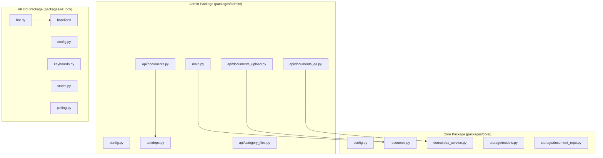
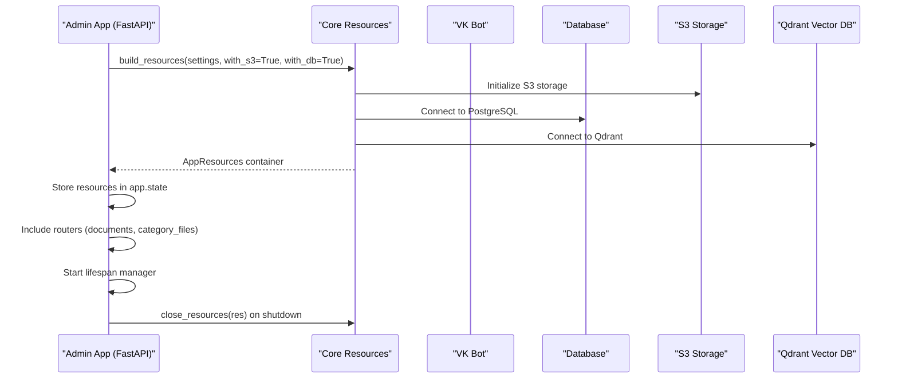
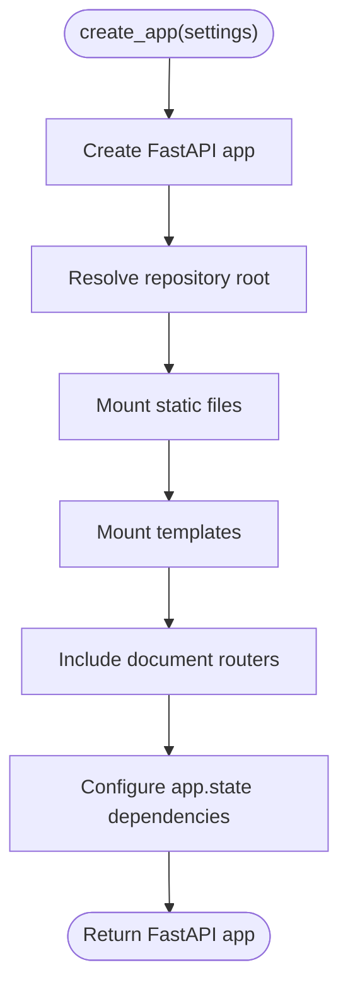
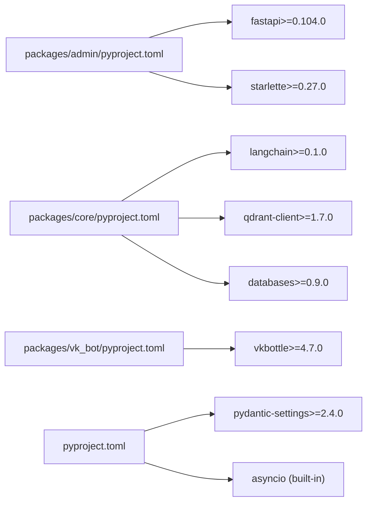

# API Reference

<cite>
**Referenced Files in This Document**
- [packages/admin/src/cafetera_admin/main.py](file://packages/admin/src/cafetera_admin/main.py)
- [packages/admin/src/cafetera_admin/config.py](file://packages/admin/src/cafetera_admin/config.py)
- [packages/admin/src/cafetera_admin/api/documents.py](file://packages/admin/src/cafetera_admin/api/documents.py)
- [packages/admin/src/cafetera_admin/api/deps.py](file://packages/admin/src/cafetera_admin/api/deps.py)
- [packages/admin/src/cafetera_admin/api/documents_qa.py](file://packages/admin/src/cafetera_admin/api/documents_qa.py)
- [packages/admin/src/cafetera_admin/api/documents_upload.py](file://packages/admin/src/cafetera_admin/api/documents_upload.py)
- [packages/admin/src/cafetera_admin/api/category_files.py](file://packages/admin/src/cafetera_admin/api/category_files.py)
- [packages/admin/src/cafetera_admin/api/schemas.py](file://packages/admin/src/cafetera_admin/api/schemas.py)
- [packages/core/src/cafetera_core/config.py](file://packages/core/src/cafetera_core/config.py)
- [packages/core/src/cafetera_core/resources.py](file://packages/core/src/cafetera_core/resources.py)
- [packages/core/src/cafetera_core/domain/qa_service.py](file://packages/core/src/cafetera_core/domain/qa_service.py)
- [packages/core/src/cafetera_core/storage/models.py](file://packages/core/src/cafetera_core/storage/models.py)
- [packages/core/src/cafetera_core/storage/document_repo.py](file://packages/core/src/cafetera_core/storage/document_repo.py)
- [packages/vk_bot/src/cafetera_vk_bot/bot.py](file://packages/vk_bot/src/cafetera_vk_bot/bot.py)
- [packages/vk_bot/src/cafetera_vk_bot/config.py](file://packages/vk_bot/src/cafetera_vk_bot/config.py)
- [packages/vk_bot/src/cafetera_vk_bot/keyboards.py](file://packages/vk_bot/src/cafetera_vk_bot/keyboards.py)
- [packages/vk_bot/src/cafetera_vk_bot/states.py](file://packages/vk_bot/src/cafetera_vk_bot/states.py)
- [packages/vk_bot/src/cafetera_vk_bot/handlers/start.py](file://packages/vk_bot/src/cafetera_vk_bot/handlers/start.py)
- [packages/vk_bot/src/cafetera_vk_bot/handlers/sections.py](file://packages/vk_bot/src/cafetera_vk_bot/handlers/sections.py)
- [packages/vk_bot/src/cafetera_vk_bot/handlers/fallback.py](file://packages/vk_bot/src/cafetera_vk_bot/handlers/fallback.py)
- [packages/vk_bot/src/cafetera_vk_bot/polling.py](file://packages/vk_bot/src/cafetera_vk_bot/polling.py)
- [templates/documents.html](file://templates/documents.html)
- [scripts/run_admin.sh](file://scripts/run_admin.sh)
- [scripts/run_all.sh](file://scripts/run_all.sh)
- [tests/test_config.py](file://tests/test_config.py)
- [tests/test_bot_factory.py](file://tests/test_bot_factory.py)
- [tests/test_keyboards.py](file://tests/test_keyboards.py)
- [tests/test_states.py](file://tests/test_states.py)
- [tests/test_api_documents.py](file://tests/test_api_documents.py)
- [tests/test_qa_service.py](file://tests/test_qa_service.py)
- [packages/admin/pyproject.toml](file://packages/admin/pyproject.toml)
- [packages/core/pyproject.toml](file://packages/core/pyproject.toml)
- [packages/vk_bot/pyproject.toml](file://packages/vk_bot/pyproject.toml)
</cite>

## Update Summary
**Changes Made**
- Updated package structure with API endpoints moved to packages/admin/ package
- Enhanced dependency injection system with FastAPI dependency management
- Improved resource management with centralized AppResources container
- Separated core RAG functionality into packages/core/ package
- Moved VK bot implementation to packages/vk_bot/ package
- Added comprehensive async support throughout the new monorepo structure
- Enhanced admin API with authentication, HTMX partials, and SSE streaming
- Improved QA service with dual streaming capabilities and caching
- Added background task management with semaphore-based concurrency control

## Table of Contents
1. [Introduction](#introduction)
2. [Project Structure](#project-structure)
3. [Core Components](#core-components)
4. [Architecture Overview](#architecture-overview)
5. [Detailed Component Analysis](#detailed-component-analysis)
6. [Dependency Analysis](#dependency-analysis)
7. [Performance Considerations](#performance-considerations)
8. [Troubleshooting Guide](#troubleshooting-guide)
9. [Conclusion](#conclusion)
10. [Appendices](#appendices)

## Introduction
This document provides a comprehensive API reference for cafetera_hr_bot. The project has been restructured into a monorepo with three main packages:
- Admin package (packages/admin/) - Web-based document administration with FastAPI
- Core package (packages/core/) - Shared RAG functionality, domain services, and resource management
- VK bot package (packages/vk_bot/) - VK community bot implementation

Key features include:
- Enhanced admin API with authentication, HTMX partials, and SSE streaming
- Centralized resource management with AppResources container
- Dependency injection system with FastAPI dependencies
- Comprehensive async support throughout all packages
- Dual streaming capabilities for both document-specific and global QA
- Background task management with semaphore-based concurrency control
- Modular architecture supporting multiple deployment scenarios

## Project Structure
The project is now organized as a monorepo with three main packages:

**Diagram sources**
- [packages/admin/src/cafetera_admin/main.py:59-88](file://packages/admin/src/cafetera_admin/main.py#L59-L88)
- [packages/admin/src/cafetera_admin/config.py:6-20](file://packages/admin/src/cafetera_admin/config.py#L6-L20)
- [packages/admin/src/cafetera_admin/api/documents.py:79-86](file://packages/admin/src/cafetera_admin/api/documents.py#L79-L86)
- [packages/admin/src/cafetera_admin/api/deps.py:40-121](file://packages/admin/src/cafetera_admin/api/deps.py#L40-L121)
- [packages/core/src/cafetera_core/resources.py:218-423](file://packages/core/src/cafetera_core/resources.py#L218-L423)
- [packages/core/src/cafetera_core/config.py:14-71](file://packages/core/src/cafetera_core/config.py#L14-L71)
- [packages/vk_bot/src/cafetera_vk_bot/bot.py:42-56](file://packages/vk_bot/src/cafetera_vk_bot/bot.py#L42-L56)

**Section sources**
- [packages/admin/src/cafetera_admin/main.py:1-88](file://packages/admin/src/cafetera_admin/main.py#L1-L88)
- [packages/admin/src/cafetera_admin/config.py:1-20](file://packages/admin/src/cafetera_admin/config.py#L1-L20)
- [packages/admin/src/cafetera_admin/api/documents.py:1-539](file://packages/admin/src/cafetera_admin/api/documents.py#L1-L539)
- [packages/admin/src/cafetera_admin/api/deps.py:1-121](file://packages/admin/src/cafetera_admin/api/deps.py#L1-L121)
- [packages/core/src/cafetera_core/resources.py:1-472](file://packages/core/src/cafetera_core/resources.py#L1-L472)
- [packages/core/src/cafetera_core/config.py:1-71](file://packages/core/src/cafetera_core/config.py#L1-L71)
- [packages/vk_bot/src/cafetera_vk_bot/bot.py:1-56](file://packages/vk_bot/src/cafetera_vk_bot/bot.py#L1-L56)

## Core Components
This section documents the primary APIs exposed by the restructured cafetera_hr_bot monorepo with enhanced async support and dependency injection.

### Admin Package APIs

#### Admin Configuration API
- Purpose: Load and expose runtime configuration for the admin web interface
- Module: packages/admin/src/cafetera_admin/config.py
- Class: AdminSettings (extends CoreSettings)
- Fields:
  - Inherits all CoreSettings fields (RAG, LLM, embeddings, storage, chunking)
  - admin_api_key: str (authentication for admin interface)
- Behavior:
  - Extends CoreSettings with admin-specific fields
  - Ignores extra environment variables not related to admin
  - Supports coexistence with VK bot package using shared .env
- Example usage:
  - Instantiate AdminSettings() to load from environment
  - Pass to create_app(settings) in main.py
- Related tests: tests/test_config.py

#### Admin Application Factory
- Purpose: Create and configure FastAPI application with resource management
- Module: packages/admin/src/cafetera_admin/main.py
- Function: create_app(settings: AdminSettings | None = None) -> FastAPI
- Behavior:
  - Creates FastAPI app with lifespan manager
  - Resolves repository root for static files and templates
  - Mounts static files and templates from repository root
  - Includes document and category file routers
  - Configures dependency injection through app.state
- Integration pattern:
  - Called from scripts/run_admin.sh
  - Uses lifespan for async resource management
- Related tests: tests/test_api_documents.py

#### Admin Dependency Injection System
- Purpose: Provide type-safe dependencies for admin endpoints
- Module: packages/admin/src/cafetera_admin/api/deps.py
- Functions:
  - require_admin(request, admin_session) -> None
  - get_doc_repo(request) -> DocumentRepository
  - get_doc_service(request) -> DocumentService
  - get_s3(request) -> S3Storage
  - get_qa_service(request) -> QAService
  - get_indexing_semaphore(request) -> asyncio.Semaphore
- Types:
  - AdminDep, SettingsDep, TemplatesDep, RepoDep, ServiceDep, S3Dep, QAServiceDep, IndexingSemaphoreDep
- Behavior:
  - Validates admin authentication via cookie comparison
  - Provides graceful degradation with 503 errors when services unavailable
  - Returns cached services from app.state during request lifecycle
- Integration pattern:
  - Used as FastAPI Depends() parameters in endpoint functions
  - Supports both synchronous and asynchronous dependency resolution

#### Document Administration API
- Purpose: Manage HR documents with comprehensive CRUD operations and question answering capabilities
- Module: packages/admin/src/cafetera_admin/api/documents.py
- Endpoints:
  - GET /documents - Main admin page with document table and upload zone
  - GET /api/documents - List documents with pagination and filtering
  - GET /api/documents/{document_id} - Get document details
  - PATCH /api/documents/{document_id}/title - Update document title
  - PATCH /api/documents/{document_id}/search - Toggle search participation
  - POST /api/documents/{document_id}/reindex - Reindex document with background task
  - DELETE /api/documents/{document_id} - Delete document
  - GET /api/documents/{document_id}/download - Download document file
  - **NEW** GET /partials/document-table - HTMX partial for document table
  - **NEW** GET /partials/document-row/{document_id} - HTMX partial for single row
  - **NEW** GET /partials/documents-status - Batch status updates for polling
- Async operations:
  - All endpoints use async/await patterns for database operations
  - Background tasks for long-running operations
  - Semaphore-based concurrency control for indexing
- Validation logic:
  - Document existence check using async repository.get(document_id)
  - Status verification (must be "completed") for document-specific queries
  - Search enablement check for document-specific queries
- Error handling:
  - 404 for non-existent documents
  - 400 for documents not ready for questions
  - Async error propagation with proper exception handling
- **NEW** SSE streaming support for both document-specific and global queries
- Integration pattern:
  - Requires admin authentication cookie
  - Uses QA service for question answering
  - **NEW** Supports both document-specific and global knowledge base queries
  - Returns truncated responses suitable for VK message limits
  - **NEW** HTMX partials for dynamic UI updates

#### Background Task Management with Semaphore Control
- Purpose: Manage concurrent document indexing operations with proper resource control
- Module: packages/admin/src/cafetera_admin/api/documents_upload.py
- Functions:
  - _index_document_from_s3(service, s3, document_id, s3_key, semaphore, ...) -> None
    - Downloads from S3, parses, and indexes/reindexes documents
    - Runs as background task with semaphore control
    - Handles validation and error reporting
    - Invalidates QA cache after completion
  - _parse_document_chunks(data, s3_key, document_id, ...) -> list
    - Parses document chunks with thread pool for CPU-intensive operations
    - Uses temporary files for processing
    - Validates DOCX content for .docx files
  - _download_and_validate(s3, document_id, s3_key, service) -> bytes | None
    - Downloads file from S3 and validates DOCX integrity
    - Returns raw bytes on success, or None if validation fails
- Features:
  - Semaphore-based concurrency limiting with settings.max_concurrent_indexing
  - Background task scheduling with BackgroundTasks.add_task()
  - Thread pool execution for parsing operations using asyncio.to_thread()
  - Proper error handling and cleanup with try/finally blocks
  - Temporary file management with automatic cleanup
- Integration pattern:
  - Scheduled automatically during upload operations
  - Supports both initial indexing and reindexing
  - Invalidates QA chain cache after completion
  - Updates document status to processing during indexing

### Core Package APIs

#### Core Configuration API
- Purpose: Shared configuration for all packages in the monorepo
- Module: packages/core/src/cafetera_core/config.py
- Class: CoreSettings
- Fields:
  - qdrant_url, qdrant_api_key, qdrant_collection
  - llm_provider, llm_model, llm_base_url, llm_api_key
  - embedding_provider, embedding_model, embedding_base_url, embedding_api_key
  - database_url, s3_endpoint_url, s3_access_key, s3_secret_key, s3_bucket
  - max_concurrent_indexing, chunk_size, chunk_overlap
  - chunk_strategy, semantic_breakpoint_threshold_type, semantic_breakpoint_threshold_amount
  - sparse_embedding_model, reranking_enabled, colbert_rerank_model, colbert_prefetch_limit, colbert_rerank_limit
- Behavior:
  - Loads from .env with UTF-8 encoding
  - Provides backward compatibility alias Settings = CoreSettings
  - Used as base class for AdminSettings and VKSettings
- Example usage:
  - Extend in package-specific settings classes
  - Access shared configuration across all packages

#### Core Resource Management System
- Purpose: Centralized async resource initialization with graceful degradation
- Module: packages/core/src/cafetera_core/resources.py
- Classes:
  - AppResources (dataclass) - Container for all shared application resources
- Functions:
  - build_resources(settings, with_s3=False, with_db=False) -> AppResources
    - Initializes S3 storage, Qdrant client, embeddings, database, services
    - Handles graceful degradation when services are unavailable
    - Ensures Qdrant collection exists before building retriever
  - close_resources(res) -> None
    - Properly closes all resources in correct order
    - Attempts cleanup even if individual resources fail
- Features:
  - Async initialization with try/except blocks for each component
  - Graceful degradation for optional services (S3, DB, Qdrant)
  - Proper resource cleanup and lifecycle management
  - Hybrid search support with sparse embeddings
  - Collection creation with proper vector configuration
- Integration pattern:
  - Used in app/main.py lifespan manager
  - Supports both standalone and integrated deployment modes
  - Provides AppResources container for dependency injection

#### Enhanced QA Service API with Dual Streaming Capabilities
- Purpose: Provide question answering using RAG chain with dual streaming capabilities
- Module: packages/core/src/cafetera_core/domain/qa_service.py
- Class: QAService
- Methods:
  - ask(question: str, category: str | None = None) -> str - Single answer retrieval using global chain
  - ask_about_document(question: str, document_id: str) -> str - Document-specific answer
  - **NEW** stream_ask(question: str) - Async generator for global SSE streaming
  - **NEW** stream_about_document(question: str, document_id: str) - Async generator for document-specific SSE streaming
- Key features:
  - Document-scoped retrieval using specialized prompt (DOCUMENT_EXPERTS_PROMPT)
  - **NEW** Global knowledge base processing with GLOBAL_EXPERTS_PROMPT
  - **NEW** Real-time token streaming for SSE responses using astream()
  - Answer truncation for VK message limits (4096 characters)
  - Fallback error handling for unavailable services
  - **NEW** LRU cache for document chains with max size 50
- **NEW** Dual prompt system:
  - GLOBAL_EXPERTS_PROMPT: Knowledge base-wide processing with synthesis capability
  - DOCUMENT_EXPERTS_PROMPT: Document-specific processing with contextual focus
- Async operations:
  - All methods use async/await patterns
  - Chain invocation with ainvoke() and astream()
  - Proper error handling with try/except blocks
  - Adaptive k-value estimation based on question complexity
- Error handling:
  - Returns ERR_NO_ANSWER when service not initialized
  - Returns ERR_DOCUMENT_UNAVAILABLE on runtime errors
  - Handles empty answers gracefully
  - **NEW** Streams error messages via SSE for real-time feedback

### VK Bot Package APIs

#### VK Bot Configuration API
- Purpose: Load and expose runtime configuration for the VK bot
- Module: packages/vk_bot/src/cafetera_vk_bot/config.py
- Class: VKSettings (extends CoreSettings)
- Fields:
  - Inherits all CoreSettings fields (RAG, LLM, embeddings, storage, chunking)
  - vk_access_token: str (VK community access token)
  - vk_group_id: int (VK community ID)
- Behavior:
  - Extends CoreSettings with VK-specific fields
  - Ignores extra environment variables not related to VK
  - Supports coexistence with admin package using shared .env
- Example usage:
  - Instantiate VKSettings() to load from environment
  - Pass to create_bot(settings) in bot.py

#### VK Bot Factory and Handler Registration API
- Purpose: Construct a fully wired vkbottle Bot with handlers
- Module: packages/vk_bot/src/cafetera_vk_bot/bot.py
- Function: create_bot(settings: VKSettings) -> Bot
- Behavior:
  - Creates a Bot using vk_access_token
  - Registers handler labelers in a fixed order: start, ask, hire, fire, vacation, pay, sections, fallback
  - Sets up state dispenser for multi-step dialogs
  - Logs the number of loaded labelers
- Integration pattern:
  - Call create_bot(VKSettings()) from scripts/run_all.sh
  - Run bot.run_polling() for local development
- Related tests: tests/test_bot_factory.py

#### VK Bot Keyboard Builder API
- Purpose: Build VK keyboards with standardized service buttons and section buttons
- Module: packages/vk_bot/src/cafetera_vk_bot/keyboards.py
- Constants:
  - CMD_HOME, CMD_BACK, CMD_CONTACT_HR
  - CMD_HIRE, CMD_FIRE, CMD_VACATION, CMD_PAY, CMD_SICK, CMD_PROBATION, CMD_ASK
- Functions:
  - with_service_row(kb: Keyboard, back_payload: dict | None = None, show_home: bool = True, show_hr: bool = True) -> Keyboard
    - Appends a service row with Back/Home/Contact HR buttons
    - Returns the same Keyboard instance
  - main_menu_kb() -> Keyboard
    - Builds the main menu with seven functional sections plus Contact HR
    - Not inline, not one-time
  - stub_kb(back_payload: dict | None = None) -> Keyboard
    - Minimal keyboard containing only the service row
- Related tests: tests/test_keyboards.py

#### VK Bot State Management API
- Purpose: Define states for multi-step dialogs (e.g., HR request wizard)
- Module: packages/vk_bot/src/cafetera_vk_bot/states.py
- Class: BotStates (inherits from vkbottle BaseStateGroup)
- States:
  - HR_REQUEST_NAME
  - HR_REQUEST_TOPIC
  - HR_REQUEST_DETAILS
  - HR_REQUEST_ENTITY
  - HR_REQUEST_URGENCY
  - HR_REQUEST_CONFIRM
- Related tests: tests/test_states.py

#### VK Bot Handler Registration API (payload routing)
- Purpose: Register message handlers using vkbottle BotLabeler and payload routing
- Modules:
  - packages/vk_bot/src/cafetera_vk_bot/handlers/start.py
  - packages/vk_bot/src/cafetera_vk_bot/handlers/sections.py
  - packages/vk_bot/src/cafetera_vk_bot/handlers/fallback.py
- Pattern:
  - Each handler module defines a bl = BotLabeler()
  - Handlers decorated with @bl.message(...) for text or payload matching
  - Handlers send responses and attach keyboards via .get_json()

**Section sources**
- [packages/admin/src/cafetera_admin/config.py:6-20](file://packages/admin/src/cafetera_admin/config.py#L6-L20)
- [packages/admin/src/cafetera_admin/main.py:59-88](file://packages/admin/src/cafetera_admin/main.py#L59-L88)
- [packages/admin/src/cafetera_admin/api/deps.py:40-121](file://packages/admin/src/cafetera_admin/api/deps.py#L40-L121)
- [packages/admin/src/cafetera_admin/api/documents.py:79-86](file://packages/admin/src/cafetera_admin/api/documents.py#L79-L86)
- [packages/core/src/cafetera_core/config.py:14-71](file://packages/core/src/cafetera_core/config.py#L14-L71)
- [packages/core/src/cafetera_core/resources.py:193-423](file://packages/core/src/cafetera_core/resources.py#L193-L423)
- [packages/core/src/cafetera_core/domain/qa_service.py:43-200](file://packages/core/src/cafetera_core/domain/qa_service.py#L43-L200)
- [packages/vk_bot/src/cafetera_vk_bot/config.py:4-16](file://packages/vk_bot/src/cafetera_vk_bot/config.py#L4-L16)
- [packages/vk_bot/src/cafetera_vk_bot/bot.py:42-56](file://packages/vk_bot/src/cafetera_vk_bot/bot.py#L42-L56)
- [packages/vk_bot/src/cafetera_vk_bot/keyboards.py:11-108](file://packages/vk_bot/src/cafetera_vk_bot/keyboards.py#L11-L108)
- [packages/vk_bot/src/cafetera_vk_bot/states.py:4-14](file://packages/vk_bot/src/cafetera_vk_bot/states.py#L4-L14)

## Architecture Overview
The cafetera_hr_bot now follows a modular monorepo architecture with clear separation of concerns across three packages:
- Admin package provides web-based document administration with FastAPI
- Core package contains shared RAG functionality, domain services, and resource management
- VK bot package implements the VK community bot functionality
- All packages share CoreSettings for configuration management
- Enhanced dependency injection system with FastAPI dependencies
- Centralized resource management with AppResources container
- Comprehensive async support throughout all packages

**Diagram sources**
- [packages/admin/src/cafetera_admin/main.py:38-57](file://packages/admin/src/cafetera_admin/main.py#L38-L57)
- [packages/core/src/cafetera_core/resources.py:218-423](file://packages/core/src/cafetera_core/resources.py#L218-L423)

## Detailed Component Analysis

### Admin Package Configuration and Application

#### Admin Settings Configuration
- Class: AdminSettings (extends CoreSettings)
  - Inherits all shared RAG, LLM, and storage settings from CoreSettings
  - Adds admin_api_key field for authentication
  - Ignores extra environment variables not related to admin settings
- Loading:
  - Reads from .env with UTF-8 encoding
  - Extends CoreSettings behavior for package-specific configuration
- Usage:
  - Instantiate AdminSettings() to load from environment
  - Pass to create_app(settings) for FastAPI application creation
- Example:
  - See packages/admin/src/cafetera_admin/main.py for typical usage
- Related tests:
  - tests/test_config.py validates configuration loading and inheritance

#### Admin Application Lifecycle Management
- Function: create_app(settings: AdminSettings | None = None) -> FastAPI
  - Creates FastAPI application with lifespan manager
  - Resolves repository root for static files and templates
  - Mounts static files and templates from repository root
  - Includes document and category file routers
  - Configures dependency injection through app.state
- Integration:
  - Called from scripts/run_admin.sh
  - Uses lifespan for async resource management
  - Supports both standalone admin interface and integrated deployment
- Handler wiring order:
  - Fixed by router.include_router() ensuring proper endpoint registration
  - Verified by tests/test_api_documents.py

**Diagram sources**
- [packages/admin/src/cafetera_admin/main.py:59-88](file://packages/admin/src/cafetera_admin/main.py#L59-L88)

**Section sources**
- [packages/admin/src/cafetera_admin/config.py:6-20](file://packages/admin/src/cafetera_admin/config.py#L6-L20)
- [packages/admin/src/cafetera_admin/main.py:59-88](file://packages/admin/src/cafetera_admin/main.py#L59-L88)
- [tests/test_config.py:6-27](file://tests/test_config.py#L6-L27)

### Core Package Resource Management

#### AppResources Container System
- Class: AppResources (dataclass)
  - Container for all shared application resources
  - All attributes are optional (None) by default
  - Supports graceful degradation when certain services are unavailable
- Attributes:
  - settings: CoreSettings
  - qdrant_client: AsyncQdrantClient | None
  - embeddings: Embeddings | None
  - llm: BaseChatModel | None
  - s3: S3Storage | None
  - db: Database | None
  - doc_repo: DocumentRepository | None
  - doc_service: DocumentService | None
  - qa_service: QAService | None
  - vk_qa_service: QAService | None
  - sparse_embeddings: object | None
  - colbert_embeddings: object | None
  - category_file_repo: CategoryFileRepository | None
  - category_file_service: CategoryFileService | None
- Usage pattern:
  - Returned by build_resources() function
  - Stored in app.state for dependency injection
  - Passed to close_resources() for cleanup

#### Centralized Resource Initialization
- Function: build_resources(settings, with_s3=False, with_db=False) -> AppResources
  - Initializes S3 storage, Qdrant client, embeddings, database, services
  - Handles graceful degradation when services are unavailable
  - Ensures Qdrant collection exists before building retriever
  - Supports hybrid search with sparse embeddings
- Features:
  - Async initialization with try/except blocks for each component
  - Graceful degradation for optional services (S3, DB, Qdrant)
  - Proper resource cleanup and lifecycle management
  - Collection creation with proper vector configuration
- Integration pattern:
  - Used in app/main.py lifespan manager
  - Supports both standalone and integrated deployment modes
  - Provides AppResources container for dependency injection

#### Resource Cleanup and Lifecycle Management
- Function: close_resources(res) -> None
  - Properly closes all resources in correct order
  - Attempts cleanup even if individual resources fail
  - Excludes QAService from direct closure (managed elsewhere)
- Features:
  - Closes S3 storage if present
  - Closes Qdrant client if present
  - Disconnects database if present
  - Sets all fields to None for safe cleanup
- Integration pattern:
  - Called automatically during FastAPI lifespan shutdown
  - Ensures proper cleanup of all resources

**Section sources**
- [packages/core/src/cafetera_core/resources.py:193-472](file://packages/core/src/cafetera_core/resources.py#L193-L472)

### Enhanced QA Service Implementation

#### QAService Class Architecture
- Class: QAService
  - Holds RAG chain and related resources
  - Provides methods to query the RAG chain and manage resources
  - Supports both global and document-specific question answering
- Key features:
  - Document-scoped retrieval using specialized prompt (DOCUMENT_EXPERTS_PROMPT)
  - Global knowledge base processing with GLOBAL_EXPERTS_PROMPT
  - Real-time token streaming for SSE responses using astream()
  - Answer truncation for VK message limits (4096 characters)
  - Fallback error handling for unavailable services
  - LRU cache for document chains with max size 50
- Async operations:
  - All methods use async/await patterns
  - Chain invocation with ainvoke() and astream()
  - Proper error handling with try/except blocks
  - Adaptive k-value estimation based on question complexity

#### Dual Prompt System
- GLOBAL_EXPERTS_PROMPT: Knowledge base-wide processing with synthesis capability
- DOCUMENT_EXPERTS_PROMPT: Document-specific processing with contextual focus
- Usage:
  - Global queries use GLOBAL_EXPERTS_PROMPT for comprehensive knowledge base processing
  - Document-specific queries use DOCUMENT_EXPERTS_PROMPT for focused retrieval
  - Both prompts support metadata inclusion and category hints

#### Streaming Response Implementation
- Methods:
  - stream_ask(question: str) - Async generator for global SSE streaming
  - stream_about_document(question: str, document_id: str) - Async generator for document-specific SSE streaming
- Features:
  - Real-time token-by-token delivery from LLM using astream()
  - Async generator functions for proper async/await support
  - Client-side event parsing and token concatenation
  - Automatic error handling and completion detection
- Response format:
  - JSON object with "token": "..." for individual tokens
  - JSON object with "done": true for completion
  - JSON object with "error": "..." for error notifications

**Section sources**
- [packages/core/src/cafetera_core/domain/qa_service.py:43-200](file://packages/core/src/cafetera_core/domain/qa_service.py#L43-L200)

### VK Bot Package Components

#### VK Bot Configuration Management
- Class: VKSettings (extends CoreSettings)
  - Inherits all shared RAG, LLM, and storage settings from CoreSettings
  - Adds VK-specific fields: vk_access_token, vk_group_id
  - Ignores extra environment variables not related to VK settings
- Loading:
  - Reads from .env with UTF-8 encoding
  - Extends CoreSettings behavior for VK-specific configuration
- Usage:
  - Instantiate VKSettings() to load from environment
  - Pass to create_bot(settings) for VK bot creation
- Example:
  - See packages/vk_bot/src/cafetera_vk_bot/bot.py for typical usage
- Related tests:
  - tests/test_config.py validates configuration loading and inheritance

#### VK Bot Handler Registration Pattern
- Function: create_bot(settings: VKSettings) -> Bot
  - Constructs a vkbottle Bot with the provided token
  - Sets up BuiltinStateDispenser for state management
  - Registers eight handler labelers in strict order:
    - start.bl
    - ask.bl
    - hire.bl
    - fire.bl
    - vacation.bl
    - pay.bl
    - sections.bl
    - fallback.bl (must be last)
  - Returns the configured Bot instance
- Integration:
  - Called from scripts/run_all.sh
  - Used to run the bot in Long Poll mode
- Handler wiring order:
  - Enforced by _HANDLER_LABELERS list with explicit ordering
  - Verified by tests/test_bot_factory.py

#### VK Bot Keyboard Construction
- Payload constants:
  - CMD_HOME, CMD_BACK, CMD_CONTACT_HR
  - CMD_HIRE, CMD_FIRE, CMD_VACATION, CMD_PAY, CMD_SICK, CMD_PROBATION, CMD_ASK
- Functions:
  - with_service_row(kb, back_payload=None, show_home=True, show_hr=True) -> Keyboard
    - Adds Back/Home/Contact HR buttons depending on parameters
    - Returns the same Keyboard instance
  - main_menu_kb() -> Keyboard
    - Builds a five-row keyboard with eight buttons:
      - First row: Hire, Fire
      - Second row: Vacation, Pay
      - Third row: Sick, Probation
      - Fourth row: Ask
      - Fifth row: Contact HR (POSITIVE color)
    - Not inline, not one-time
  - stub_kb(back_payload=None) -> Keyboard
    - Convenience keyboard with only the service row
- Usage examples:
  - start handlers call main_menu_kb().get_json()
  - sections handlers call stub_kb(back_payload=CMD_HOME).get_json()
  - fallback handler calls main_menu_kb().get_json()

#### VK Bot State Management
- Class: BotStates (BaseStateGroup)
  - States for a six-step HR request dialog:
    - HR_REQUEST_NAME
    - HR_REQUEST_TOPIC
    - HR_REQUEST_DETAILS
    - HR_REQUEST_ENTITY
    - HR_REQUEST_URGENCY
    - HR_REQUEST_CONFIRM
- Usage pattern:
  - Intended for state-dependent handlers via vkbottle's state parameter
  - Part of the scaffolding described in PLAN.md for multi-step dialogs

#### VK Bot Handler Registration API
- Pattern:
  - Each handler module defines a BotLabeler bl
  - Handlers decorated with @bl.message(...) for either text or payload matching
  - Handlers send responses and attach keyboards via .get_json()
- Modules:
  - start.py: /start, Home payload, Contact HR placeholder
  - ask.py: Free-text question handling with state management
  - sections.py: Seven section payloads (Hire, Fire, Vacation, Pay, Sick, Probation, Ask)
  - fallback.py: Unmatched text falls back to main menu
- Wiring order:
  - Fixed by _HANDLER_LABELERS ensuring fallback is last
  - Explicit ordering ensures proper message routing

**Section sources**
- [packages/vk_bot/src/cafetera_vk_bot/config.py:4-16](file://packages/vk_bot/src/cafetera_vk_bot/config.py#L4-L16)
- [packages/vk_bot/src/cafetera_vk_bot/bot.py:42-56](file://packages/vk_bot/src/cafetera_vk_bot/bot.py#L42-L56)
- [packages/vk_bot/src/cafetera_vk_bot/keyboards.py:11-108](file://packages/vk_bot/src/cafetera_vk_bot/keyboards.py#L11-L108)
- [packages/vk_bot/src/cafetera_vk_bot/states.py:4-14](file://packages/vk_bot/src/cafetera_vk_bot/states.py#L4-L14)
- [packages/vk_bot/src/cafetera_vk_bot/handlers/start.py:12-55](file://packages/vk_bot/src/cafetera_vk_bot/handlers/start.py#L12-L55)
- [packages/vk_bot/src/cafetera_vk_bot/handlers/sections.py:17-82](file://packages/vk_bot/src/cafetera_vk_bot/handlers/sections.py#L17-L82)
- [packages/vk_bot/src/cafetera_vk_bot/handlers/fallback.py:7-18](file://packages/vk_bot/src/cafetera_vk_bot/handlers/fallback.py#L7-L18)

## Dependency Analysis
External dependencies relevant to the restructured cafetera_hr_bot monorepo:
- vkbottle >= 4.7.0 for VK bot functionality
- FastAPI >= 0.104.0 for admin web interface
- pydantic-settings for settings management
- databases for async PostgreSQL operations
- qdrant-client >= 1.7.0 for vector database operations
- langchain >= 0.1.0 for RAG chain integration
- starlette >= 0.27.0 for StreamingResponse and SSE support
- pytest for tests
- asyncio for async/await patterns and semaphore control

**Diagram sources**
- [packages/admin/pyproject.toml:1-56](file://packages/admin/pyproject.toml#L1-L56)
- [packages/core/pyproject.toml:1-56](file://packages/core/pyproject.toml#L1-L56)
- [packages/vk_bot/pyproject.toml:1-56](file://packages/vk_bot/pyproject.toml#L1-L56)

**Section sources**
- [packages/admin/pyproject.toml:1-56](file://packages/admin/pyproject.toml#L1-L56)
- [packages/core/pyproject.toml:1-56](file://packages/core/pyproject.toml#L1-L56)
- [packages/vk_bot/pyproject.toml:1-56](file://packages/vk_bot/pyproject.toml#L1-L56)

## Performance Considerations
- Resource sharing:
  - AppResources container enables efficient resource reuse across admin and VK bot packages
  - Cached services reduce initialization overhead during request handling
- Handler registration order:
  - Maintaining the correct order prevents redundant handler matching and improves predictability
  - Explicit ordering ensures proper message routing
- Token forwarding:
  - The bot token is forwarded directly to the underlying API client; ensure tokens are managed securely
- Document query performance:
  - QA service uses specialized document retrievers for faster document-specific searches
  - Global queries leverage knowledge base-wide retrieval with streaming
  - Answer truncation prevents large responses that could impact performance
  - Document status checks prevent queries on unprocessed documents
  - LRU cache reduces chain rebuild overhead for document-specific queries
- SSE streaming optimization:
  - Real-time token streaming reduces perceived latency
  - Client-side buffering and incremental rendering improve user experience
  - Proper SSE headers ensure efficient connection handling
  - JSON escaping prevents SSE parsing errors
- Background task management:
  - Semaphore-based concurrency control prevents resource exhaustion
  - Thread pool execution for CPU-intensive operations
  - Proper error handling and cleanup
  - Temporary file management with automatic cleanup
- Resource management:
  - Async initialization with graceful degradation
  - Proper resource cleanup in correct order
  - Hybrid search support with sparse embeddings
- Monorepo benefits:
  - Shared CoreSettings reduces configuration duplication
  - Centralized resource management improves efficiency
  - Type-safe dependency injection reduces runtime errors

## Troubleshooting Guide
- Configuration not loading:
  - Verify .env presence and encoding (UTF-8)
  - Confirm environment variable names match expected keys
  - Check that package-specific settings extend CoreSettings correctly
  - See tests/test_config.py for expected behavior
- Admin application not starting:
  - Ensure AdminSettings() loads correctly from environment
  - Verify app.state dependencies are properly configured
  - Check that build_resources() completes successfully
  - Validate that static files and templates are mounted correctly
- Handlers not responding:
  - Ensure create_bot registers handlers in the correct order
  - Confirm fallback is last to avoid swallowing messages
  - See tests/test_bot_factory.py for assertions
  - Verify VKSettings extends CoreSettings correctly
- Keyboard layout issues:
  - Validate main_menu_kb composition and service row placement
  - Use tests/test_keyboards.py as a reference for expected layouts
- State mismatch:
  - Ensure BotStates values align with handler expectations
  - See tests/test_states.py for validation of state names and uniqueness
- Document query failures:
  - Verify document status is "completed" and search is enabled
  - Check that document exists in repository
  - Ensure QA service is properly initialized
  - Validate that document-specific retriever is available
  - Check LRU cache for document chains
- SSE connection problems:
  - Verify StreamingResponse is properly configured
  - Check that event_generator() yields proper SSE format
  - Ensure proper error handling with {"error": "..."} format
  - Validate async generator function syntax
- Background task failures:
  - Verify semaphore configuration and availability
  - Check that background tasks are properly scheduled
  - Ensure proper error handling in task functions
  - Validate temporary file cleanup
- Resource initialization issues:
  - Check that build_resources() completes successfully
  - Verify graceful degradation for optional services
  - Ensure proper resource cleanup on shutdown
  - Validate Qdrant collection creation
- Dependency injection errors:
  - Verify that dependencies are properly registered in app.state
  - Check that AdminDep, RepoDep, ServiceDep, S3Dep, QAServiceDep are working correctly
  - Ensure proper error handling for unavailable services (503 errors)

**Section sources**
- [tests/test_config.py:6-27](file://tests/test_config.py#L6-L27)
- [tests/test_bot_factory.py:8-44](file://tests/test_bot_factory.py#L8-L44)
- [tests/test_keyboards.py:49-192](file://tests/test_keyboards.py#L49-L192)
- [tests/test_states.py:8-31](file://tests/test_states.py#L8-L31)
- [tests/test_api_documents.py:1-751](file://tests/test_api_documents.py#L1-L751)
- [tests/test_qa_service.py:1-142](file://tests/test_qa_service.py#L1-L142)

## Conclusion
The cafetera_hr_bot monorepo structure provides a clean, modular API with enhanced document administration, centralized resource management, and real-time streaming capabilities:
- Admin package provides web-based document administration with FastAPI and HTMX
- Core package contains shared RAG functionality, domain services, and resource management
- VK bot package implements the VK community bot functionality
- Enhanced dependency injection system with FastAPI dependencies
- Centralized resource management with AppResources container
- Comprehensive async support throughout all packages
- Dual streaming capabilities for both document-specific and global QA
- Background task management with semaphore-based concurrency control
- Modular architecture supporting multiple deployment scenarios
- Type-safe configuration management with shared CoreSettings
- Graceful degradation for optional services
- Efficient resource sharing across packages

Adhering to the documented patterns ensures reliable operation and maintainable extensions with robust async support and graceful degradation across the entire monorepo structure.

## Appendices

### Versioning and Compatibility Notes
- Project version: 0.1.0
- VK integration relies on vkbottle >= 4.7.0
- Admin interface relies on FastAPI >= 0.104.0
- Core RAG functionality relies on langchain >= 0.1.0
- Vector database relies on qdrant-client >= 1.7.0
- Database operations rely on databases >= 0.9.0
- Streaming responses rely on starlette >= 0.27.0
- Keyboard and state APIs are stable within current implementation
- Monorepo structure is newly introduced with package separation
- Enhanced dependency injection system is newly introduced
- Centralized resource management is newly introduced
- Admin API authentication is newly introduced
- Background task management with semaphore control is newly introduced
- SSE streaming capabilities are newly introduced
- Dual streaming capabilities for QA service are newly introduced
- Backward compatibility:
  - CoreSettings provides backward compatibility alias
  - VKSettings and AdminSettings extend CoreSettings for shared configuration
  - Handler registration order is enforced by _HANDLER_LABELERS
  - Keyboard builder functions return the same Keyboard instance to preserve references
  - State names and payloads are validated by tests
  - Admin authentication maintains compatibility with existing client-side implementations
  - SSE streaming maintains compatibility with existing client-side event handling patterns
  - Async resource management provides graceful degradation for optional services
  - Background task management maintains compatibility with existing upload operations

**Section sources**
- [packages/admin/pyproject.toml:1-56](file://packages/admin/pyproject.toml#L1-L56)
- [packages/core/pyproject.toml:1-56](file://packages/core/pyproject.toml#L1-L56)
- [packages/vk_bot/pyproject.toml:1-56](file://packages/vk_bot/pyproject.toml#L1-L56)
- [packages/core/src/cafetera_core/config.py:69-71](file://packages/core/src/cafetera_core/config.py#L69-L71)
- [packages/vk_bot/src/cafetera_vk_bot/bot.py:16-20](file://packages/vk_bot/src/cafetera_vk_bot/bot.py#L16-L20)
- [packages/vk_bot/src/cafetera_vk_bot/keyboards.py:29-50](file://packages/vk_bot/src/cafetera_vk_bot/keyboards.py#L29-L50)
- [tests/test_states.py:20-30](file://tests/test_states.py#L20-L30)
- [packages/admin/src/cafetera_admin/api/deps.py:77-89](file://packages/admin/src/cafetera_admin/api/deps.py#L77-L89)
- [packages/admin/src/cafetera_admin/api/documents.py:791-853](file://packages/admin/src/cafetera_admin/api/documents.py#L791-L853)
- [packages/admin/src/cafetera_admin/api/documents_qa.py:26-91](file://packages/admin/src/cafetera_admin/api/documents_qa.py#L26-L91)
- [packages/admin/src/cafetera_admin/api/documents_upload.py:119-167](file://packages/admin/src/cafetera_admin/api/documents_upload.py#L119-L167)
- [packages/core/src/cafetera_core/domain/qa_service.py:167-218](file://packages/core/src/cafetera_core/domain/qa_service.py#L167-L218)
- [packages/core/src/cafetera_core/resources.py:129-315](file://packages/core/src/cafetera_core/resources.py#L129-L315)