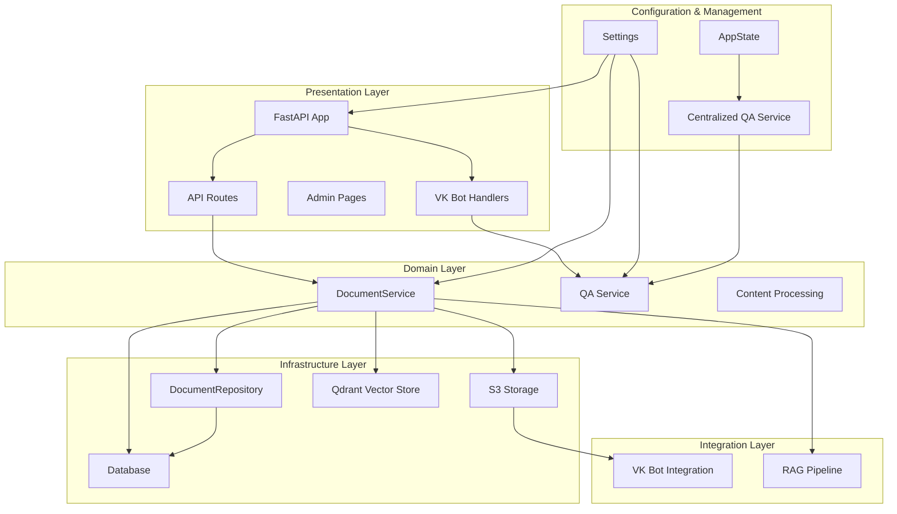
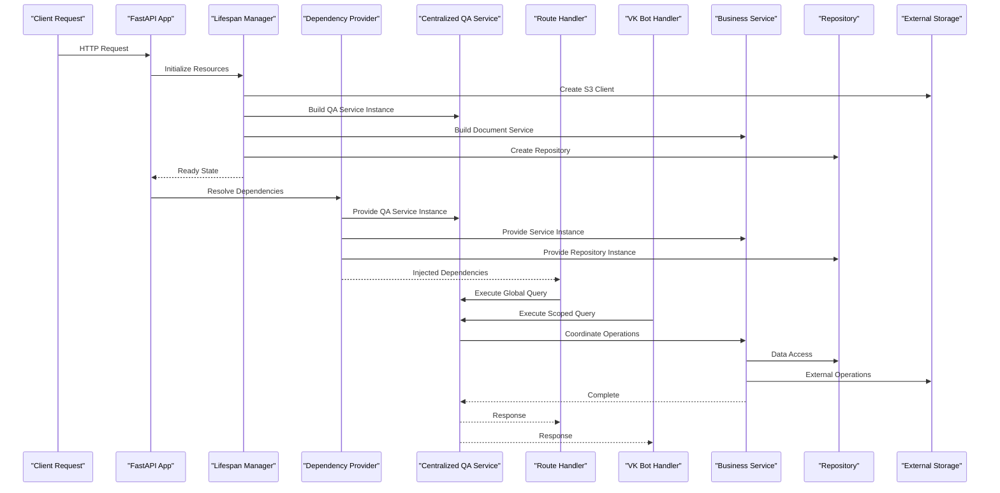
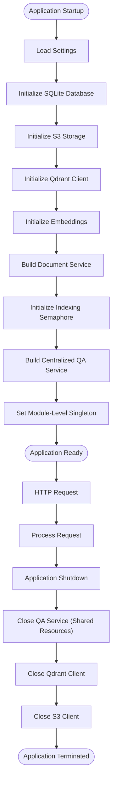
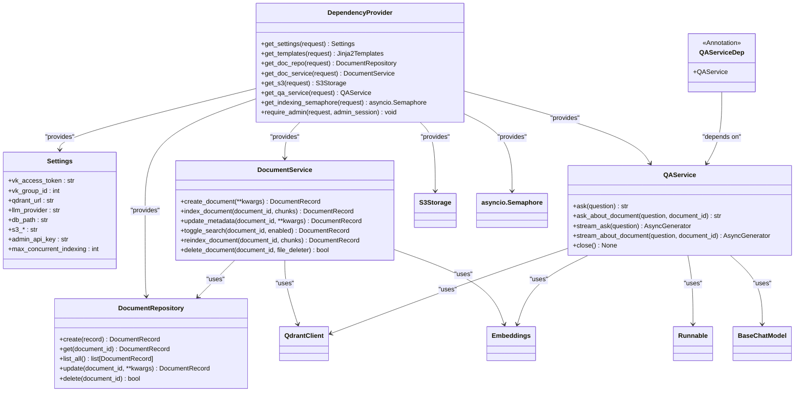
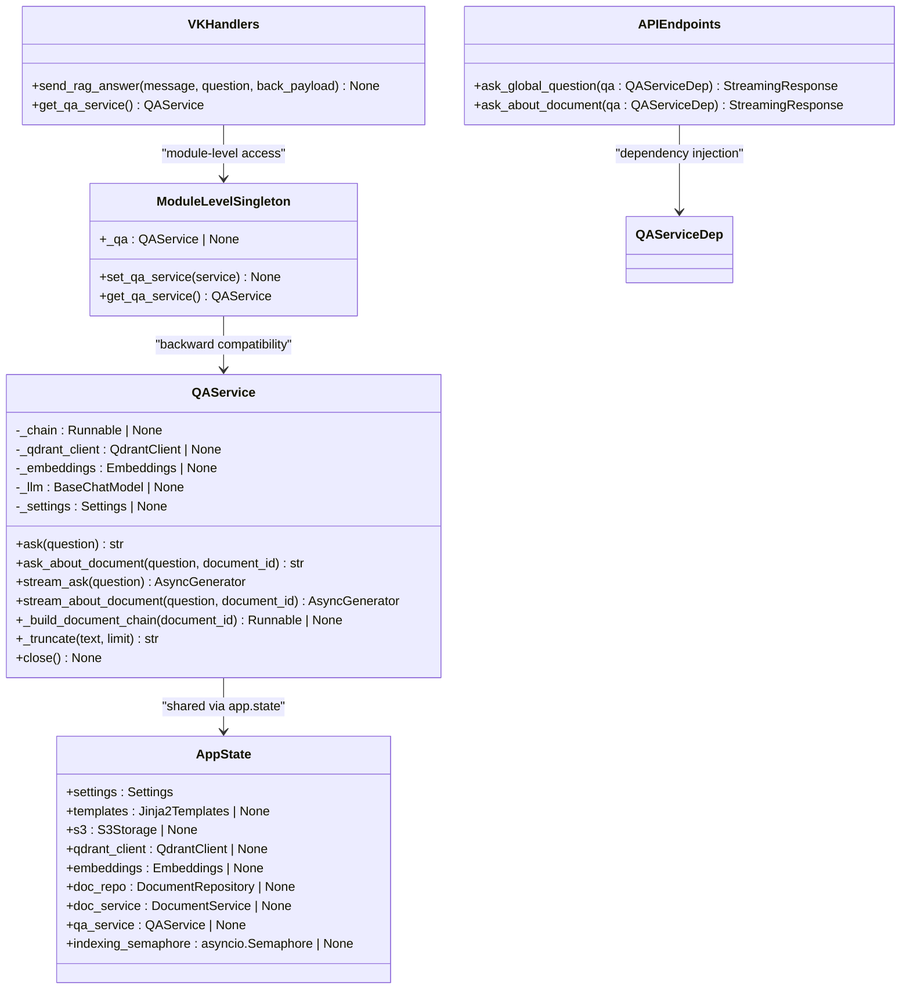
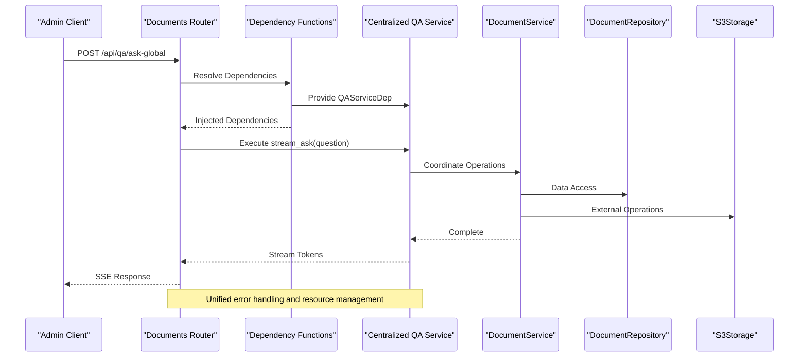
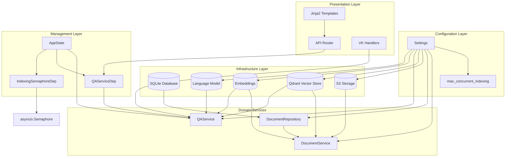
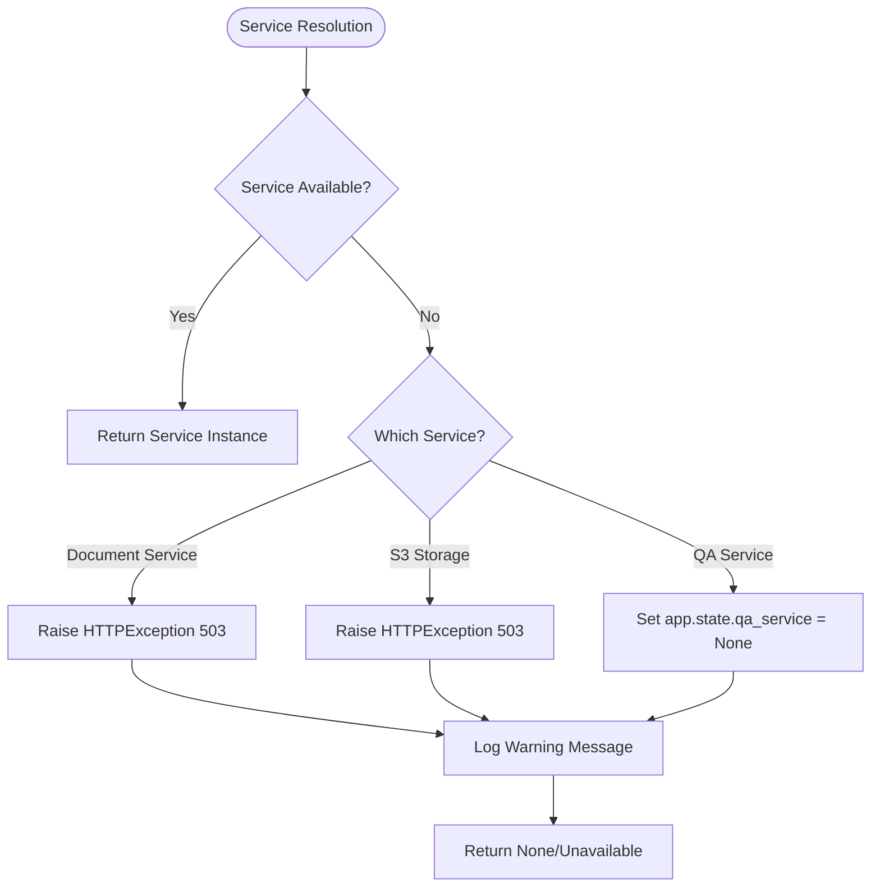

# Dependency Injection System

<cite>
**Referenced Files in This Document**
- [app/main.py](file://app/main.py)
- [app/api/deps.py](file://app/api/deps.py)
- [app/config.py](file://app/config.py)
- [app/domain/qa_service.py](file://app/domain/qa_service.py)
- [app/integrations/vk/handlers/__init__.py](file://app/integrations/vk/handlers/__init__.py)
- [app/integrations/vk/handlers/sections.py](file://app/integrations/vk/handlers/sections.py)
- [app/api/documents.py](file://app/api/documents.py)
- [app/storage/database.py](file://app/storage/database.py)
- [app/storage/document_repo.py](file://app/storage/document_repo.py)
- [app/storage/s3.py](file://app/storage/s3.py)
- [app/storage/models.py](file://app/storage/models.py)
- [app/domain/document_service.py](file://app/domain/document_service.py)
- [app/rag/retriever.py](file://app/rag/retriever.py)
- [app/rag/indexer.py](file://app/rag/indexer.py)
- [app/rag/parser.py](file://app/rag/parser.py)
- [pyproject.toml](file://pyproject.toml)
</cite>

## Update Summary
**Changes Made**
- Added documentation for the new QAServiceDep annotation and centralized QA service management
- Updated architecture diagrams to show unified QA service access throughout the FastAPI application
- Enhanced dependency provider functions section with QA service integration
- Updated lifecycle management to include centralized QA service initialization
- Added centralized error handling for QA service access
- Updated troubleshooting guide with QA service-specific issues

## Table of Contents
1. [Introduction](#introduction)
2. [Project Structure](#project-structure)
3. [Core Components](#core-components)
4. [Architecture Overview](#architecture-overview)
5. [Detailed Component Analysis](#detailed-component-analysis)
6. [Dependency Analysis](#dependency-analysis)
7. [Performance Considerations](#performance-considerations)
8. [Troubleshooting Guide](#troubleshooting-guide)
9. [Conclusion](#conclusion)

## Introduction

The Cafetera HR Bot project implements a sophisticated dependency injection system built on top of FastAPI's dependency management framework. This system enables clean separation of concerns, testability, and modular architecture by managing the lifecycle and provisioning of application services and resources.

The dependency injection pattern in this project follows a hierarchical approach where:
- Application-wide resources are managed in the FastAPI lifespan context
- Service dependencies are provided through FastAPI dependency functions
- Configuration-driven instantiation ensures flexibility across different environments
- **Updated**: Centralized QA service management provides consistent access throughout the application with unified error handling

## Project Structure

The project follows a layered architecture with clear separation between presentation, domain, infrastructure, and integration layers:

**Diagram sources**
- [app/main.py:34-51](file://app/main.py#L34-L51)
- [app/api/deps.py:15-16](file://app/api/deps.py#L15-L16)
- [app/config.py:4-33](file://app/config.py#L4-L33)
- [app/main.py:117-144](file://app/main.py#L117-L144)

**Section sources**
- [app/main.py:1-194](file://app/main.py#L1-L194)
- [app/api/deps.py:1-123](file://app/api/deps.py#L1-L123)
- [app/config.py:1-39](file://app/config.py#L1-L39)

## Core Components

The dependency injection system consists of several key components that work together to manage application resources:

### Application Lifecycle Management

The FastAPI lifespan context manages the application's startup and shutdown procedures, ensuring proper initialization and cleanup of external resources, including **Updated**: centralized QA service initialization and management.

### Dependency Providers

The system uses FastAPI's dependency injection mechanism through annotated dependency functions that provide instances of services and repositories to route handlers, with **Updated**: centralized QA service access through the QAServiceDep annotation.

### Configuration Management

Settings are loaded from environment variables and provide runtime configuration for all components, including **Updated**: centralized QA service configuration and resource sharing.

### **Updated**: Centralized QA Service Management

The system includes a centralized QA service that provides consistent access to RAG capabilities throughout the application, with unified error handling and resource management.

**Section sources**
- [app/main.py:53-166](file://app/main.py#L53-L166)
- [app/api/deps.py:107-122](file://app/api/deps.py#L107-L122)
- [app/config.py:4-39](file://app/config.py#L4-L39)
- [app/domain/qa_service.py:42-211](file://app/domain/qa_service.py#L42-L211)

## Architecture Overview

The dependency injection architecture follows a hierarchical pattern where resources flow from the application level down to individual route handlers, with **Updated**: centralized QA service providing unified access throughout the system:

**Diagram sources**
- [app/main.py:53-166](file://app/main.py#L53-L166)
- [app/api/deps.py:107-122](file://app/api/deps.py#L107-L122)
- [app/api/documents.py:791-855](file://app/api/documents.py#L791-L855)
- [app/integrations/vk/handlers/sections.py:25-45](file://app/integrations/vk/handlers/sections.py#L25-L45)

## Detailed Component Analysis

### Application Lifecycle and Resource Management

The application lifecycle is managed through FastAPI's lifespan context, which handles initialization and cleanup of external resources, including **Updated**: centralized QA service initialization and management:

**Diagram sources**
- [app/main.py:53-166](file://app/main.py#L53-L166)
- [app/main.py:117-144](file://app/main.py#L117-L144)

The lifespan manager creates and maintains instances of:
- SQLite database connection for document metadata
- S3 storage client for file operations
- Qdrant vector database client for RAG operations
- Document service with all its dependencies
- **Updated**: Centralized QA service instance with shared resources
- **Updated**: Module-level singleton for backward compatibility with VK handlers

**Section sources**
- [app/main.py:53-166](file://app/main.py#L53-L166)
- [app/main.py:117-144](file://app/main.py#L117-L144)

### Dependency Provider Functions

The dependency injection system uses FastAPI's dependency functions to provide services to route handlers, including **Updated**: centralized QA service access through the QAServiceDep annotation:

**Diagram sources**
- [app/api/deps.py:107-122](file://app/api/deps.py#L107-L122)
- [app/config.py:4-39](file://app/config.py#L4-L39)
- [app/storage/document_repo.py:61-202](file://app/storage/document_repo.py#L61-L202)
- [app/domain/document_service.py:35-280](file://app/domain/document_service.py#L35-L280)
- [app/domain/qa_service.py:42-211](file://app/domain/qa_service.py#L42-L211)

**Section sources**
- [app/api/deps.py:107-122](file://app/api/deps.py#L107-L122)
- [app/config.py:4-39](file://app/config.py#L4-L39)

### Centralized QA Service Architecture

The QA service acts as a centralized coordinator for RAG operations, providing consistent access throughout the application with **Updated**: unified error handling and resource management:

**Diagram sources**
- [app/domain/qa_service.py:42-211](file://app/domain/qa_service.py#L42-L211)
- [app/main.py:34-51](file://app/main.py#L34-L51)
- [app/integrations/vk/handlers/__init__.py:9-20](file://app/integrations/vk/handlers/__init__.py#L9-L20)
- [app/api/documents.py:791-855](file://app/api/documents.py#L791-L855)

**Section sources**
- [app/domain/qa_service.py:42-211](file://app/domain/qa_service.py#L42-L211)
- [app/main.py:34-51](file://app/main.py#L34-L51)
- [app/integrations/vk/handlers/__init__.py:9-20](file://app/integrations/vk/handlers/__init__.py#L9-L20)

### Route Handler Integration

Route handlers integrate dependencies through FastAPI's dependency injection system, including **Updated**: centralized QA service access for both global and document-specific queries:

**Diagram sources**
- [app/api/documents.py:791-855](file://app/api/documents.py#L791-L855)
- [app/api/deps.py:107-122](file://app/api/deps.py#L107-L122)

**Section sources**
- [app/api/documents.py:791-855](file://app/api/documents.py#L791-L855)
- [app/api/deps.py:107-122](file://app/api/deps.py#L107-L122)

## Dependency Analysis

The dependency injection system creates a clear dependency graph with well-defined relationships, including **Updated**: centralized QA service integration:

**Diagram sources**
- [app/main.py:53-166](file://app/main.py#L53-L166)
- [app/api/deps.py:107-122](file://app/api/deps.py#L107-L122)
- [app/config.py:4-39](file://app/config.py#L4-L39)

The dependency relationships demonstrate:
- **Hierarchical dependency**: Services depend on repositories, which depend on databases
- **External service integration**: S3, Qdrant, and LLM clients are injected into services
- **Configuration-driven instantiation**: All dependencies are created based on settings
- **Resource sharing**: Database connections and shared QA resources are shared through the repository pattern
- **Updated**: **Centralized QA management**: Single QA service instance shared across all components
- **Updated**: **Unified error handling**: Consistent error responses from QA service operations

**Section sources**
- [app/main.py:53-166](file://app/main.py#L53-L166)
- [app/api/deps.py:107-122](file://app/api/deps.py#L107-L122)
- [app/config.py:4-39](file://app/config.py#L4-L39)

## Performance Considerations

The dependency injection system provides several performance benefits, including **Updated**: centralized QA service management for optimal resource utilization:

### Resource Reuse
- Database connections are reused through the repository pattern
- S3 client instances are maintained throughout application lifecycle
- Qdrant client connections are pooled and reused
- **Updated**: Centralized QA service shares LLM and embeddings resources across all operations
- **Updated**: Module-level singleton provides backward compatibility without duplicating resources

### Lazy Initialization
- Optional services (S3, Qdrant) are initialized conditionally
- Background tasks handle heavy operations asynchronously
- Dependencies are only created when needed
- **Updated**: QA service is created only when Qdrant client is available

### Memory Management
- Proper cleanup in lifespan context prevents resource leaks
- Async context managers ensure proper resource disposal
- Background tasks use temporary files efficiently
- **Updated**: Centralized QA service cleanup prevents double-closing of shared resources

### **Updated**: Centralized Resource Management
- **Single QA instance**: Only one QA service instance is created and shared
- **Shared LLM and embeddings**: Both DocumentService and QAService share the same LLM and embeddings instances
- **Consistent error handling**: Unified error handling across all QA operations
- **Backward compatibility**: Module-level singleton maintains compatibility with existing VK handlers

**Section sources**
- [app/main.py:117-144](file://app/main.py#L117-L144)
- [app/main.py:155-165](file://app/main.py#L155-L165)
- [app/domain/qa_service.py:198-211](file://app/domain/qa_service.py#L198-L211)

## Troubleshooting Guide

Common dependency injection issues and their solutions, including **Updated**: centralized QA service-related problems:

### Service Unavailable Errors
When services are not available during application startup:

**Diagram sources**
- [app/api/deps.py:60-79](file://app/api/deps.py#L60-L79)
- [app/api/deps.py:107-112](file://app/api/deps.py#L107-L112)

### Configuration Issues
Missing or incorrect configuration values:

1. **Admin Authentication**: Missing admin API key causes authentication failures
2. **Database Path**: Incorrect database path prevents repository initialization
3. **External Services**: Wrong URLs or credentials break S3/Qdrant connections
4. **Concurrency Settings**: Incorrect `max_concurrent_indexing` value affects throttling behavior
5. **QA Service Dependencies**: Missing LLM or Qdrant configuration breaks QA service initialization

### **Updated**: Centralized QA Service Issues
Centralized QA service-related problems and solutions:

1. **QA Service Unavailable**: Missing or incorrectly configured QA service instance
2. **Resource Conflicts**: Double-closing of shared Qdrant client during shutdown
3. **Backward Compatibility**: VK handlers expecting module-level singleton access
4. **Error Handling**: Inconsistent error responses from QA service operations
5. **Memory Leaks**: Improper cleanup of QA service resources

### Resource Cleanup
Proper shutdown requires:
- Closing S3 client connections
- **Updated**: Proper QA service cleanup with shared resource management
- Ensuring database transactions are committed
- **Updated**: Preventing double-closing of shared Qdrant client

**Section sources**
- [app/api/deps.py:60-79](file://app/api/deps.py#L60-L79)
- [app/api/deps.py:107-112](file://app/api/deps.py#L107-L112)
- [app/main.py:155-165](file://app/main.py#L155-L165)

## Conclusion

The dependency injection system in the Cafetera HR Bot project demonstrates a mature approach to managing application complexity through clear separation of concerns and flexible resource management. The system successfully balances:

- **Testability**: Services can be easily mocked and tested independently
- **Maintainability**: Clear dependency boundaries make code modifications safer
- **Scalability**: Hierarchical dependency management supports growth
- **Reliability**: Proper resource lifecycle management prevents memory leaks
- **Updated**: **Centralized QA Management**: Single QA service instance provides consistent access across all components
- **Updated**: **Unified Error Handling**: Consistent error responses from QA service operations
- **Updated**: **Backward Compatibility**: Module-level singleton maintains compatibility with existing VK handlers

The implementation leverages FastAPI's built-in dependency injection capabilities while adding custom providers for specialized services, including **Updated**: centralized QA service management with unified error handling and resource sharing. This creates a robust foundation for the RAG-based document management system with proper resource control, performance optimization, and consistent access patterns throughout the application.