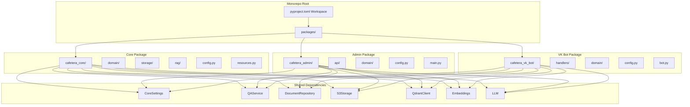
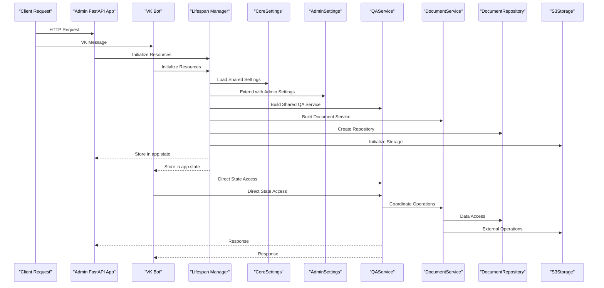
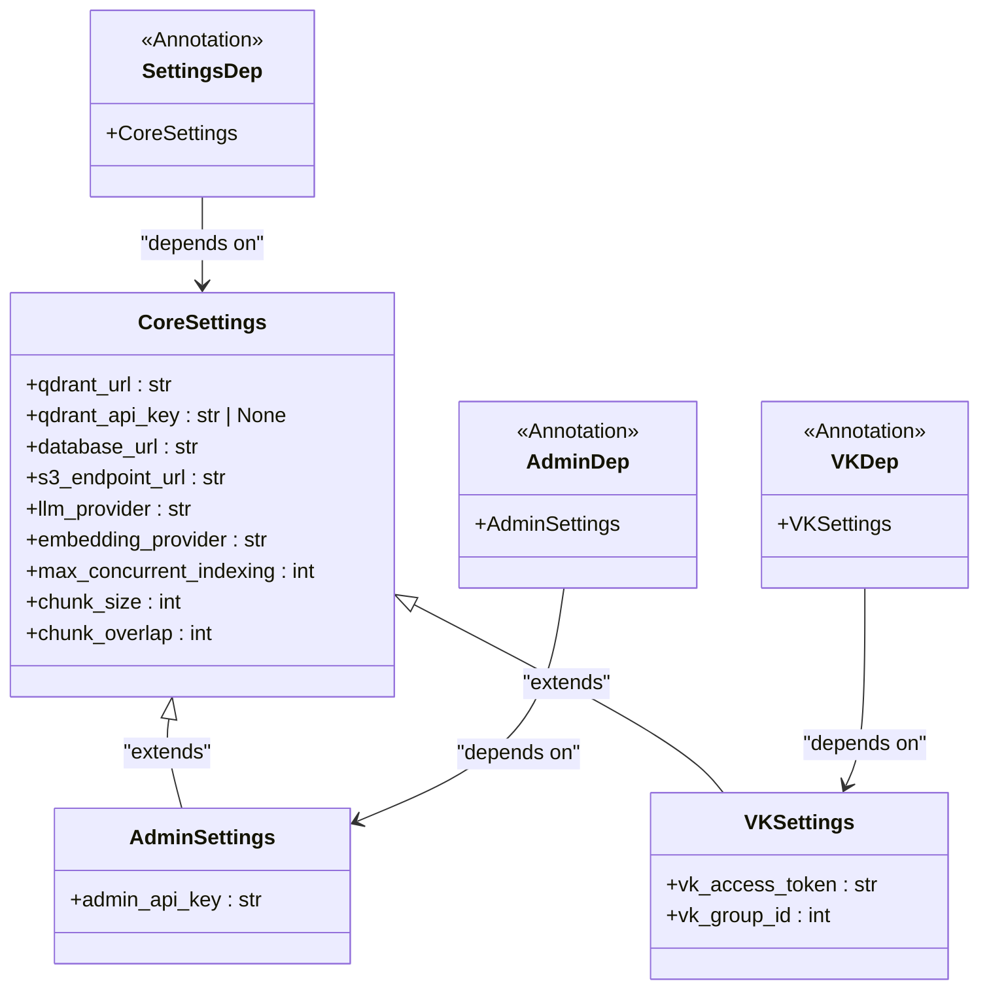
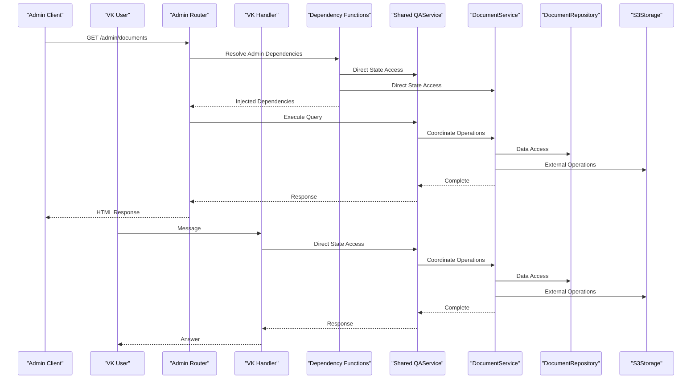
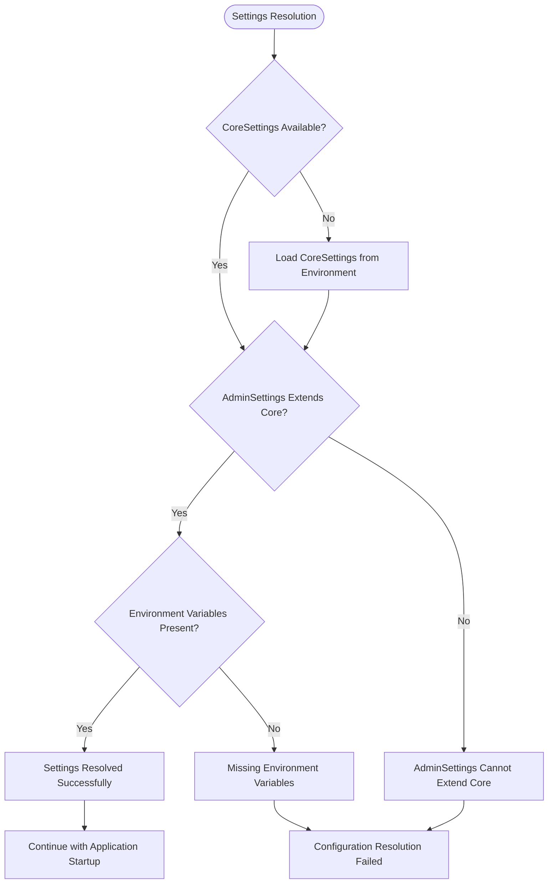

# Dependency Injection System

<cite>
**Referenced Files in This Document**
- [packages/core/src/cafetera_core/config.py](file://packages/core/src/cafetera_core/config.py)
- [packages/admin/src/cafetera_admin/config.py](file://packages/admin/src/cafetera_admin/config.py)
- [packages/core/src/cafetera_core/domain/qa_service.py](file://packages/core/src/cafetera_core/domain/qa_service.py)
- [packages/admin/src/cafetera_admin/api/deps.py](file://packages/admin/src/cafetera_admin/api/deps.py)
- [packages/admin/src/cafetera_admin/main.py](file://packages/admin/src/cafetera_admin/main.py)
- [packages/core/src/cafetera_core/storage/document_repo.py](file://packages/core/src/cafetera_core/storage/document_repo.py)
- [packages/core/src/cafetera_core/domain/category_file_service.py](file://packages/core/src/cafetera_core/domain/category_file_service.py)
- [packages/vk_bot/src/cafetera_vk_bot/bot.py](file://packages/vk_bot/src/cafetera_vk_bot/bot.py)
- [pyproject.toml](file://pyproject.toml)
</cite>

## Update Summary
**Changes Made**
- Enhanced dependency management with consolidated dependencies in core package
- Added new dependencies in admin package for improved modularity and reduced coupling
- Implemented shared core configuration system with package-specific extensions
- Established clear separation between core RAG services and admin-specific services
- Maintained backward compatibility through shared QA service interface

## Table of Contents
1. [Introduction](#introduction)
2. [Project Structure](#project-structure)
3. [Core Components](#core-components)
4. [Architecture Overview](#architecture-overview)
5. [Detailed Component Analysis](#detailed-component-analysis)
6. [Dependency Analysis](#dependency-analysis)
7. [Performance Considerations](#performance-considerations)
8. [Troubleshooting Guide](#troubleshooting-guide)
9. [Conclusion](#conclusion)

## Introduction

The Cafetera HR Bot project implements a modernized dependency injection system built on top of FastAPI's dependency management framework within a monorepo architecture. This system enables clean separation of concerns, testability, and modular architecture by managing the lifecycle and provisioning of application services and resources through consolidated core dependencies and package-specific extensions.

The dependency injection pattern in this project follows a streamlined approach where:
- Shared core services are managed in the consolidated core package with unified configuration
- Package-specific services extend core functionality through inheritance and composition
- Service dependencies are provided through FastAPI dependency functions with robust getattr() fallback mechanisms
- Configuration-driven instantiation ensures flexibility across different deployment scenarios
- **Updated**: Consolidated core package provides shared dependencies for all transport handlers
- **Updated**: Admin package extends core configuration with package-specific settings

## Project Structure

The project follows a monorepo architecture with clear separation between shared core functionality and package-specific implementations:



**Diagram sources**
- [pyproject.toml:22-28](file://pyproject.toml#L22-L28)
- [packages/core/src/cafetera_core/config.py:14-71](file://packages/core/src/cafetera_core/config.py#L14-L71)
- [packages/admin/src/cafetera_admin/config.py:6-20](file://packages/admin/src/cafetera_admin/config.py#L6-L20)

**Section sources**
- [pyproject.toml:1-49](file://pyproject.toml#L1-L49)
- [packages/core/src/cafetera_core/config.py:14-71](file://packages/core/src/cafetera_core/config.py#L14-L71)
- [packages/admin/src/cafetera_admin/config.py:6-20](file://packages/admin/src/cafetera_admin/config.py#L6-L20)

## Core Components

The dependency injection system consists of several key components that work together to manage application resources through consolidated core dependencies and package-specific extensions:

### Consolidated Core Configuration

The core package provides a unified configuration system that defines shared settings for all transport handlers:

- **Shared Settings**: RAG configuration, database connections, storage settings, and indexing parameters
- **Inheritance Pattern**: Package-specific configurations extend core settings with minimal overrides
- **Environment-Based Loading**: Settings are loaded from environment variables with sensible defaults
- **Type Safety**: Pydantic-based configuration validation ensures runtime safety

### Package-Specific Extensions

Each package extends the core configuration system with package-specific dependencies:

- **Admin Package**: Extends core settings with admin-specific authentication and UI configuration
- **VK Bot Package**: Extends core settings with VK-specific bot configuration and handler registration
- **Transport-Specific**: Each package manages its own service dependencies while sharing core resources

### Shared Service Dependencies

The core package provides essential services that are shared across all transport handlers:

- **DocumentRepository**: Centralized document metadata management with PostgreSQL persistence
- **QAService**: Unified RAG service with caching and streaming capabilities
- **Storage Services**: S3 integration for file operations and Qdrant for vector storage
- **CategoryFileService**: Manages document templates for VK bot categories

### **Updated**: Consolidated Dependency Management

The system now uses consolidated dependency management where:
- Core dependencies are defined once in the core package
- Package-specific dependencies extend core functionality
- Shared services are accessed through unified interfaces
- Backward compatibility is maintained through inheritance patterns

**Section sources**
- [packages/core/src/cafetera_core/config.py:14-71](file://packages/core/src/cafetera_core/config.py#L14-L71)
- [packages/admin/src/cafetera_admin/config.py:6-20](file://packages/admin/src/cafetera_admin/config.py#L6-L20)
- [packages/core/src/cafetera_core/domain/qa_service.py:43-302](file://packages/core/src/cafetera_core/domain/qa_service.py#L43-L302)
- [packages/core/src/cafetera_core/storage/document_repo.py:64-305](file://packages/core/src/cafetera_core/storage/document_repo.py#L64-L305)

## Architecture Overview

The dependency injection architecture follows a hierarchical pattern where core services are shared across all packages while maintaining package-specific customization:



**Diagram sources**
- [packages/admin/src/cafetera_admin/main.py:40-82](file://packages/admin/src/cafetera_admin/main.py#L40-L82)
- [packages/core/src/cafetera_core/config.py:14-71](file://packages/core/src/cafetera_core/config.py#L14-L71)
- [packages/admin/src/cafetera_admin/config.py:6-20](file://packages/admin/src/cafetera_admin/config.py#L6-L20)
- [packages/core/src/cafetera_core/domain/qa_service.py:43-302](file://packages/core/src/cafetera_core/domain/qa_service.py#L43-L302)

## Detailed Component Analysis

### Consolidated Configuration System

The configuration system provides a unified approach to managing settings across all packages:



**Diagram sources**
- [packages/core/src/cafetera_core/config.py:14-71](file://packages/core/src/cafetera_core/config.py#L14-L71)
- [packages/admin/src/cafetera_admin/config.py:6-20](file://packages/admin/src/cafetera_admin/config.py#L6-L20)

**Section sources**
- [packages/core/src/cafetera_core/config.py:14-71](file://packages/core/src/cafetera_core/config.py#L14-L71)
- [packages/admin/src/cafetera_admin/config.py:6-20](file://packages/admin/src/cafetera_admin/config.py#L6-L20)

### Package-Specific Dependency Providers

The admin package extends the core dependency injection system with package-specific providers:


**Diagram sources**
- [packages/admin/src/cafetera_admin/api/deps.py:40-121](file://packages/admin/src/cafetera_admin/api/deps.py#L40-L121)
- [packages/admin/src/cafetera_admin/config.py:6-20](file://packages/admin/src/cafetera_admin/config.py#L6-L20)
- [packages/core/src/cafetera_core/domain/category_file_service.py:22-116](file://packages/core/src/cafetera_core/domain/category_file_service.py#L22-L116)

**Section sources**
- [packages/admin/src/cafetera_admin/api/deps.py:40-121](file://packages/admin/src/cafetera_admin/api/deps.py#L40-L121)
- [packages/admin/src/cafetera_admin/config.py:6-20](file://packages/admin/src/cafetera_admin/config.py#L6-L20)
- [packages/core/src/cafetera_core/domain/category_file_service.py:22-116](file://packages/core/src/cafetera_core/domain/category_file_service.py#L22-L116)

### Shared Service Architecture

The core package provides shared services that are accessed consistently across all transport handlers:

```mermaid
flowchart TD
Start([Application Startup]) --> LoadCoreSettings["Load CoreSettings"]
LoadCoreSettings --> InitDB["Initialize Database Connection"]
InitDB --> InitS3["Initialize S3 Storage"]
InitS3 --> InitQdrant["Initialize Qdrant Client"]
InitQdrant --> InitEmbeddings["Initialize Embeddings"]
InitEmbeddings --> BuildDocService["Build DocumentService"]
BuildDocService --> InitSemaphore["Initialize Indexing Semaphore"]
InitSemaphore --> BuildQAService["Build Shared QAService"]
BuildQAService --> StoreInAppState["Store in app.state"]
StoreInAppState --> Ready([Services Available])
Ready --> AdminRequest[Admin Request]
Ready --> VKRequest[VK Bot Request]
AdminRequest->>QAService : Direct State Access
VKRequest->>QAService : Direct State Access
QAService->>DocService : Coordinate Operations
DocService->>Repo : Data Access
DocService->>S3 : External Operations
QAService --> >AdminRequest : Response
QAService --> >VKRequest : Response
```

**Diagram sources**
- [packages/admin/src/cafetera_admin/main.py:40-82](file://packages/admin/src/cafetera_admin/main.py#L40-L82)
- [packages/core/src/cafetera_core/domain/qa_service.py:43-302](file://packages/core/src/cafetera_core/domain/qa_service.py#L43-L302)

**Section sources**
- [packages/admin/src/cafetera_admin/main.py:40-82](file://packages/admin/src/cafetera_admin/main.py#L40-L82)
- [packages/core/src/cafetera_core/domain/qa_service.py:43-302](file://packages/core/src/cafetera_core/domain/qa_service.py#L43-L302)

### Transport Handler Integration

Both admin and VK bot handlers integrate dependencies through the unified dependency injection system:



**Diagram sources**
- [packages/admin/src/cafetera_admin/api/deps.py:40-121](file://packages/admin/src/cafetera_admin/api/deps.py#L40-L121)
- [packages/core/src/cafetera_core/domain/qa_service.py:43-302](file://packages/core/src/cafetera_core/domain/qa_service.py#L43-L302)
- [packages/vk_bot/src/cafetera_vk_bot/bot.py:42-56](file://packages/vk_bot/src/cafetera_vk_bot/bot.py#L42-L56)

**Section sources**
- [packages/admin/src/cafetera_admin/api/deps.py:40-121](file://packages/admin/src/cafetera_admin/api/deps.py#L40-L121)
- [packages/core/src/cafetera_core/domain/qa_service.py:43-302](file://packages/core/src/cafetera_core/domain/qa_service.py#L43-L302)
- [packages/vk_bot/src/cafetera_vk_bot/bot.py:42-56](file://packages/vk_bot/src/cafetera_vk_bot/bot.py#L42-L56)

## Dependency Analysis

The dependency injection system creates a clear hierarchical dependency graph with well-defined relationships:

```mermaid
graph TB
subgraph "Configuration Layer"
CoreSettings[CoreSettings]
AdminSettings[AdminSettings]
VKSettings[VKSettings]
CoreSettings --> AdminSettings
CoreSettings --> VKSettings
end
subgraph "Core Infrastructure"
DB[(PostgreSQL Database)]
S3[(S3 Storage)]
Qdrant[(Qdrant Vector Store)]
Embeddings[(Embeddings)]
LLM[(Language Model)]
end
subgraph "Core Services"
Repo[DocumentRepository]
DocService[DocumentService]
QAService[Shared QAService]
CategoryFileService[CategoryFileService]
end
subgraph "Package Services"
AdminDocService[Admin DocumentService]
AdminQAService[Admin QAService]
end
subgraph "Presentation Layer"
AdminRouter[Admin Router]
VKHandlers[VK Handlers]
end
subgraph "Dependency Management"
ConsolidatedDeps[Consolidated Dependencies]
PackageExtensions[Package Extensions]
DirectStateAccess[Direct State Access]
End
CoreSettings --> DocService
CoreSettings --> Repo
CoreSettings --> S3
CoreSettings --> Qdrant
CoreSettings --> QAService
CoreSettings --> Embeddings
CoreSettings --> LLM
CoreSettings --> CategoryFileService
AdminSettings --> AdminDocService
AdminSettings --> AdminQAService
DB --> Repo
S3 --> DocService
S3 --> CategoryFileService
Qdrant --> DocService
Qdrant --> QAService
Embeddings --> DocService
Embeddings --> QAService
LLM --> QAService
Repo --> DocService
CategoryFileService --> AdminDocService
AdminDocService --> AdminQAService
AdminRouter --> DirectStateAccess
VKHandlers --> DirectStateAccess
ConsolidatedDeps --> DirectStateAccess
PackageExtensions --> ConsolidatedDeps
```

**Diagram sources**
- [packages/core/src/cafetera_core/config.py:14-71](file://packages/core/src/cafetera_core/config.py#L14-L71)
- [packages/admin/src/cafetera_admin/config.py:6-20](file://packages/admin/src/cafetera_admin/config.py#L6-L20)
- [packages/admin/src/cafetera_admin/main.py:40-82](file://packages/admin/src/cafetera_admin/main.py#L40-L82)

The dependency relationships demonstrate:
- **Hierarchical Configuration**: CoreSettings serves as the foundation for all package-specific settings
- **Shared Infrastructure**: Core services are shared across all transport handlers
- **Package Extension**: Each package extends core functionality with minimal overrides
- **Unified Access**: All packages access shared services through direct state attribute access
- ****Updated**: **Consolidated Dependencies**: Core package manages shared dependencies for improved modularity
- **Updated**: **Package-Specific Extensions**: Admin package extends core with package-specific services
- **Updated**: **Reduced Coupling**: Clear separation between core and package-specific functionality

**Section sources**
- [packages/core/src/cafetera_core/config.py:14-71](file://packages/core/src/cafetera_core/config.py#L14-L71)
- [packages/admin/src/cafetera_admin/config.py:6-20](file://packages/admin/src/cafetera_admin/config.py#L6-L20)
- [packages/admin/src/cafetera_admin/main.py:40-82](file://packages/admin/src/cafetera_admin/main.py#L40-L82)

## Performance Considerations

The dependency injection system provides several performance benefits through consolidated core dependencies and package-specific optimizations:

### Resource Sharing Benefits
- **Shared QA Service**: Single QAService instance shared across all transport handlers
- **Database Connection Pooling**: PostgreSQL connections pooled and reused efficiently
- **S3 Client Reuse**: S3 client instances maintained throughout application lifecycle
- **Qdrant Connection Pooling**: Qdrant client connections pooled for optimal performance
- ****Updated**: **Consolidated Resource Management**: Core package manages shared resources centrally
- **Updated**: **Reduced Memory Footprint**: Shared services eliminate duplicate resource instances

### Lazy Initialization Strategy
- **Optional Services**: Admin-specific services initialized only when needed
- **Conditional Dependencies**: Services check availability before initialization
- **Background Task Integration**: Heavy operations handled asynchronously
- ****Updated**: **Efficient State Access**: Direct getattr() calls minimize overhead
- **Updated**: **Optimized Import Patterns**: Package-specific imports reduce startup time

### Memory Management Optimizations
- **Service Caching**: QAService maintains LRU cache for document chains
- **Connection Pooling**: Database and external service connections pooled efficiently
- **Resource Cleanup**: Proper cleanup in lifespan context prevents memory leaks
- ****Updated**: **Centralized Cleanup**: Core package manages shared resource cleanup
- **Updated**: **Efficient Resource Disposal**: Proper async context management

### **Updated**: Enhanced Modularity Benefits
- ****Performance**: Consolidated core package reduces duplication and improves efficiency
- ****Maintainability**: Clear separation between core and package-specific functionality
- ****Scalability**: Modular design supports easy addition of new transport handlers
- ****Compatibility**: Backward compatibility maintained through inheritance patterns
- ****Development**: Simplified dependency management improves development workflow

**Section sources**
- [packages/core/src/cafetera_core/domain/qa_service.py:72-121](file://packages/core/src/cafetera_core/domain/qa_service.py#L72-L121)
- [packages/admin/src/cafetera_admin/main.py:77-82](file://packages/admin/src/cafetera_admin/main.py#L77-L82)
- [packages/core/src/cafetera_core/domain/category_file_service.py:22-116](file://packages/core/src/cafetera_core/domain/category_file_service.py#L22-L116)

## Troubleshooting Guide

Common dependency injection issues and their solutions, leveraging the consolidated core package architecture:

### Configuration Resolution Issues
When settings are not properly resolved across packages:



**Diagram sources**
- [packages/core/src/cafetera_core/config.py:14-71](file://packages/core/src/cafetera_core/config.py#L14-L71)
- [packages/admin/src/cafetera_admin/config.py:6-20](file://packages/admin/src/cafetera_admin/config.py#L6-L20)

### Service Availability Problems
When shared services are not available during application startup:


**Diagram sources**
- [packages/admin/src/cafetera_admin/api/deps.py:52-99](file://packages/admin/src/cafetera_admin/api/deps.py#L52-L99)
- [packages/admin/src/cafetera_admin/main.py:52-76](file://packages/admin/src/cafetera_admin/main.py#L52-L76)

### **Updated**: Consolidated Dependency Issues
Consolidated dependency-related problems and solutions:

1. **Core Configuration Conflicts**: Ensure AdminSettings properly extends CoreSettings
2. **Shared Service Initialization**: Verify QAService initializes before package-specific services
3. **Resource Availability**: Check that shared resources are available in app.state
4. **Package-Specific Dependencies**: Ensure package-specific services inherit from core interfaces
5. **State Attribute Access**: Verify getattr() fallback mechanisms work correctly

### **Updated**: Package-Specific Issues
Package-specific dependency problems and solutions:

1. **Admin Authentication**: Missing admin_api_key causes authentication failures
2. **Template Resolution**: Ensure templates directory resolves correctly in monorepo structure
3. **Static File Serving**: Verify static files mount correctly from repository root
4. **Route Registration**: Check that package routers are properly included
5. **Dependency Injection**: Ensure package-specific dependencies use correct annotations

### Resource Cleanup and Lifecycle
Proper shutdown requires:
- **Shared Resource Cleanup**: Core package manages cleanup of shared resources
- **Package-Specific Cleanup**: Each package cleans up its own resources
- **Connection Pooling**: Ensure database and external service connections are properly closed
- ****Updated**: **Centralized Cleanup**: Core package coordinates cleanup of shared resources
- ****Updated**: **Proper Resource Disposal**: Async context managers ensure proper cleanup

**Section sources**
- [packages/admin/src/cafetera_admin/api/deps.py:52-99](file://packages/admin/src/cafetera_admin/api/deps.py#L52-L99)
- [packages/admin/src/cafetera_admin/main.py:77-82](file://packages/admin/src/cafetera_admin/main.py#L77-L82)
- [packages/core/src/cafetera_core/config.py:14-71](file://packages/core/src/cafetera_core/config.py#L14-L71)

## Conclusion

The dependency injection system in the Cafetera HR Bot project demonstrates a modernized approach to managing application complexity through consolidated core dependencies and package-specific extensions. The system successfully balances:

- **Modularity**: Clear separation between core functionality and package-specific implementations
- **Maintainability**: Shared core services reduce code duplication and improve consistency
- **Scalability**: Hierarchical dependency management supports easy addition of new transport handlers
- **Reliability**: Proper resource lifecycle management prevents memory leaks and connection issues
- ****Updated**: **Consolidated Core Package**: Unified dependency management reduces complexity
- ****Updated**: **Package Extensions**: Minimal overrides enable package-specific customization
- ****Updated**: **Shared Services**: Centralized services improve performance and resource utilization
- ****Updated**: **Reduced Coupling**: Clear separation between core and package-specific functionality
- ****Updated**: **Enhanced Developer Experience**: Simplified dependency management improves productivity

The implementation leverages FastAPI's built-in dependency injection capabilities while adding custom providers for specialized services, utilizing direct state attribute access patterns. This creates a robust foundation for multiple transport handlers (admin web UI and VK bot) with proper resource control, performance optimization, and consistent access patterns throughout the application.

The enhanced dependency management provides:
- **Better Performance**: Consolidated core package reduces duplication and improves efficiency
- **Improved Code Quality**: Clear separation between core and package-specific functionality
- **Enhanced Developer Experience**: Simplified dependency management and clear interfaces
- **Future-Proof Architecture**: Modular design supports easy evolution and maintenance
- ****Updated**: **Reduced Coupling**: Package-specific dependencies minimize inter-package dependencies
- ****Updated**: **Shared Infrastructure**: Core package manages common infrastructure efficiently
- ****Updated**: **Flexible Configuration**: Inheritance-based settings enable easy customization

This creates a production-ready dependency injection system that balances functionality, performance, and developer experience through modernized state access patterns, consolidated core dependencies, and package-specific extensions within a monorepo architecture.