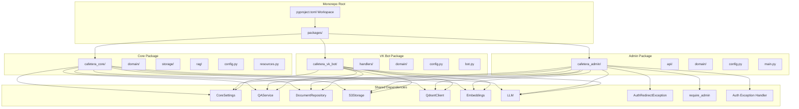
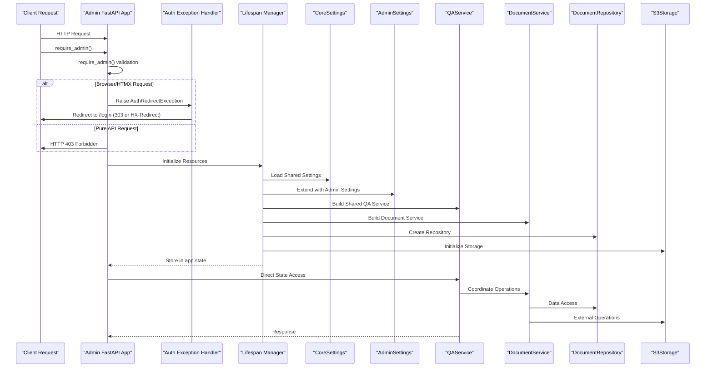
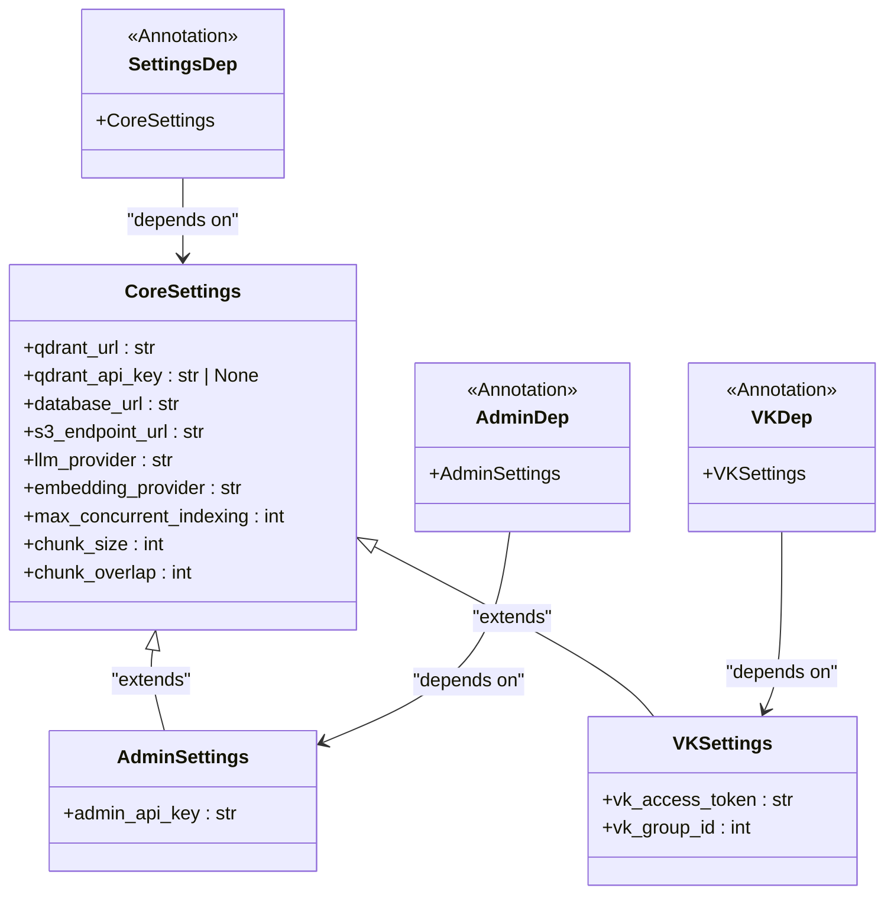
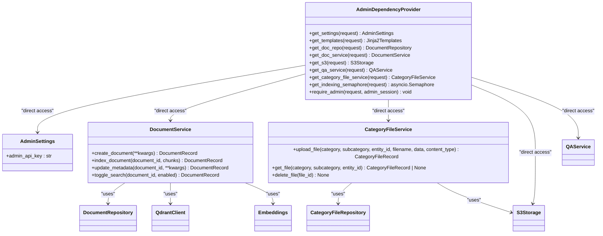
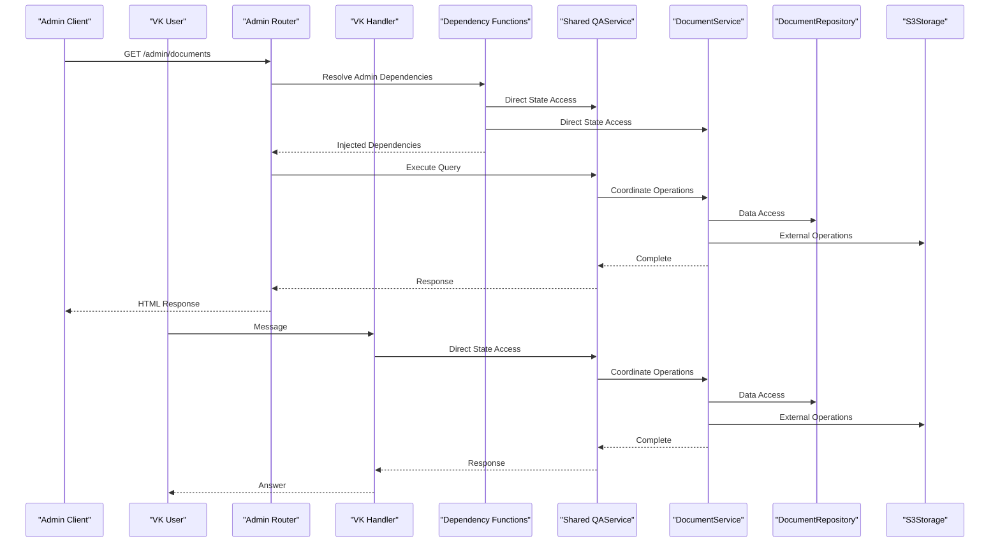
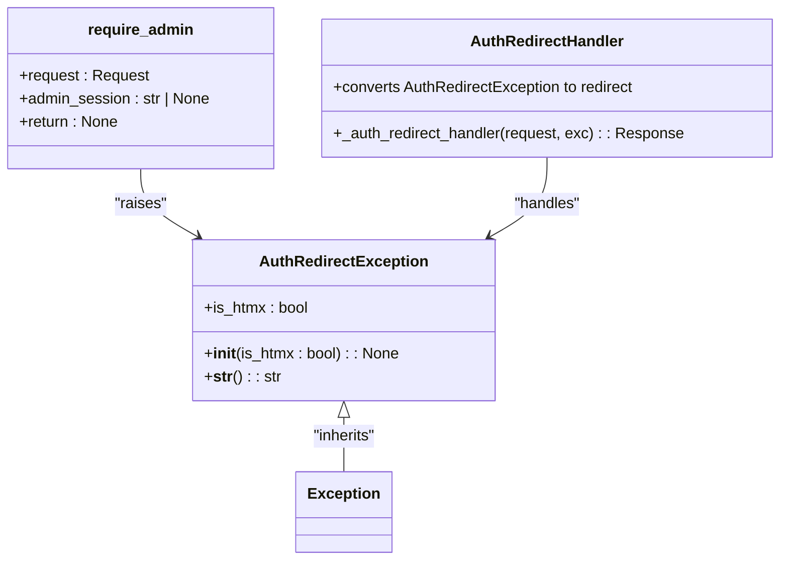
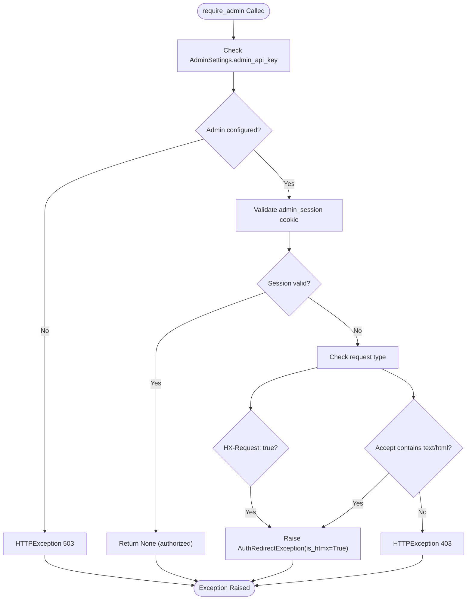
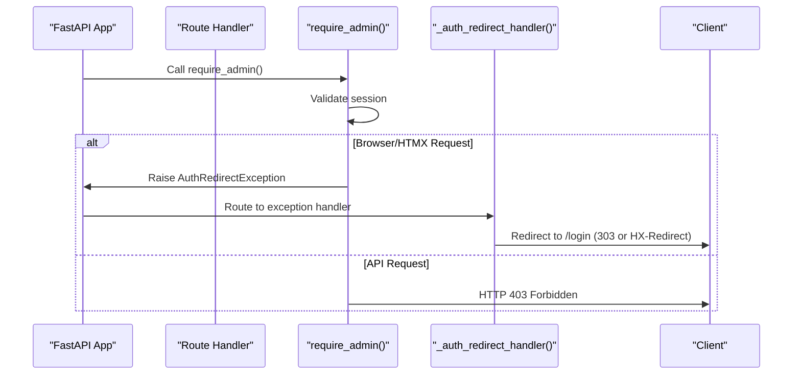
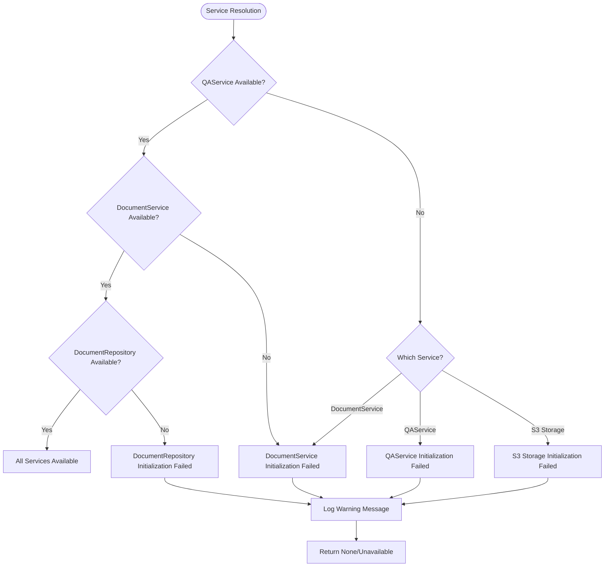

# Dependency Injection System

<cite>
**Referenced Files in This Document**
- [packages/core/src/cafetera_core/config.py](file://packages/core/src/cafetera_core/config.py)
- [packages/admin/src/cafetera_admin/config.py](file://packages/admin/src/cafetera_admin/config.py)
- [packages/admin/src/cafetera_admin/api/deps.py](file://packages/admin/src/cafetera_admin/api/deps.py)
- [packages/admin/src/cafetera_admin/main.py](file://packages/admin/src/cafetera_admin/main.py)
- [packages/admin/src/cafetera_admin/api/documents_auth.py](file://packages/admin/src/cafetera_admin/api/documents_auth.py)
- [packages/admin/src/cafetera_admin/api/documents.py](file://packages/admin/src/cafetera_admin/api/documents.py)
- [packages/admin/src/cafetera_admin/api/category_files.py](file://packages/admin/src/cafetera_admin/api/category_files.py)
- [packages/core/src/cafetera_core/domain/qa_service.py](file://packages/core/src/cafetera_core/domain/qa_service.py)
- [packages/admin/src/cafetera_admin/api/deps.py](file://packages/admin/src/cafetera_admin/api/deps.py)
- [packages/admin/src/cafetera_admin/main.py](file://packages/admin/src/cafetera_admin/main.py)
- [packages/core/src/cafetera_core/storage/document_repo.py](file://packages/core/src/cafetera_core/storage/document_repo.py)
- [packages/core/src/cafetera_core/domain/category_file_service.py](file://packages/core/src/cafetera_core/domain/category_file_service.py)
- [packages/vk_bot/src/cafetera_vk_bot/bot.py](file://packages/vk_bot/src/cafetera_vk_bot/bot.py)
- [pyproject.toml](file://pyproject.toml)
</cite>

## Update Summary
**Changes Made**
- Enhanced authentication system with AuthRedirectException for improved browser/HTMX handling
- Improved require_admin function with three-tier authentication handling (browser/HTMX redirect, API 403)
- Integrated new exception handler for AuthRedirectException in FastAPI application
- Added comprehensive authentication testing covering browser-to-login redirection, HTMX-to-login redirection, and pure API request 403 responses
- Updated dependency injection system to support enhanced authentication flows

## Table of Contents
1. [Introduction](#introduction)
2. [Project Structure](#project-structure)
3. [Core Components](#core-components)
4. [Architecture Overview](#architecture-overview)
5. [Detailed Component Analysis](#detailed-component-analysis)
6. [Authentication Enhancement](#authentication-enhancement)
7. [Dependency Analysis](#dependency-analysis)
8. [Performance Considerations](#performance-considerations)
9. [Troubleshooting Guide](#troubleshooting-guide)
10. [Conclusion](#conclusion)

## Introduction

The Cafetera HR Bot project implements a modernized dependency injection system built on top of FastAPI's dependency management framework within a monorepo architecture. This system enables clean separation of concerns, testability, and modular architecture by managing the lifecycle and provisioning of application services and resources through consolidated core dependencies and package-specific extensions.

The dependency injection pattern in this project follows a streamlined approach where:
- Shared core services are managed in the consolidated core package with unified configuration
- Package-specific services extend core functionality through inheritance and composition
- Service dependencies are provided through FastAPI dependency functions with robust getattr() fallback mechanisms
- Configuration-driven instantiation ensures flexibility across different deployment scenarios
- **Updated**: Enhanced authentication system with AuthRedirectException for improved user experience
- **Updated**: Three-tier authentication handling for browser/HTMX requests and pure API requests
- **Updated**: Integrated exception handler for seamless authentication flow management

## Project Structure

The project follows a monorepo architecture with clear separation between shared core functionality and package-specific implementations:



**Diagram sources**
- [pyproject.toml:22-28](file://pyproject.toml#L22-L28)
- [packages/core/src/cafetera_core/config.py:14-71](file://packages/core/src/cafetera_core/config.py#L14-L71)
- [packages/admin/src/cafetera_admin/config.py:6-20](file://packages/admin/src/cafetera_admin/config.py#L6-L20)
- [packages/admin/src/cafetera_admin/api/deps.py:21-26](file://packages/admin/src/cafetera_admin/api/deps.py#L21-L26)
- [packages/admin/src/cafetera_admin/api/deps.py:85-105](file://packages/admin/src/cafetera_admin/api/deps.py#L85-L105)
- [packages/admin/src/cafetera_admin/main.py:110-115](file://packages/admin/src/cafetera_admin/main.py#L110-L115)

**Section sources**
- [pyproject.toml:1-49](file://pyproject.toml#L1-L49)
- [packages/core/src/cafetera_core/config.py:14-71](file://packages/core/src/cafetera_core/config.py#L14-L71)
- [packages/admin/src/cafetera_admin/config.py:6-20](file://packages/admin/src/cafetera_admin/config.py#L6-L20)

## Core Components

The dependency injection system consists of several key components that work together to manage application resources through consolidated core dependencies and package-specific extensions:

### Consolidated Core Configuration

The core package provides a unified configuration system that defines shared settings for all transport handlers:

- **Shared Settings**: RAG configuration, database connections, storage settings, and indexing parameters
- **Inheritance Pattern**: Package-specific configurations extend core settings with minimal overrides
- **Environment-Based Loading**: Settings are loaded from environment variables with sensible defaults
- **Type Safety**: Pydantic-based configuration validation ensures runtime safety

### Package-Specific Extensions

Each package extends the core configuration system with package-specific dependencies:

- **Admin Package**: Extends core settings with admin-specific authentication and UI configuration
- **VK Bot Package**: Extends core settings with VK-specific bot configuration and handler registration
- **Transport-Specific**: Each package manages its own service dependencies while sharing core resources

### Shared Service Dependencies

The core package provides essential services that are shared across all transport handlers:

- **DocumentRepository**: Centralized document metadata management with PostgreSQL persistence
- **QAService**: Unified RAG service with caching and streaming capabilities
- **Storage Services**: S3 integration for file operations and Qdrant for vector storage
- **CategoryFileService**: Manages document templates for VK bot categories

### **Updated**: Enhanced Authentication System

The system now includes a sophisticated authentication mechanism with three-tier handling:

- **AuthRedirectException**: Custom exception for browser/HTMX authentication failures
- **require_admin function**: Validates admin credentials with intelligent request type detection
- **Exception Handler Integration**: Seamless conversion of AuthRedirectException to appropriate responses
- **Three-Tier Authentication**: Browser/HTMX requests redirect to login, pure API requests return 403

**Section sources**
- [packages/core/src/cafetera_core/config.py:14-71](file://packages/core/src/cafetera_core/config.py#L14-L71)
- [packages/admin/src/cafetera_admin/config.py:6-20](file://packages/admin/src/cafetera_admin/config.py#L6-L20)
- [packages/core/src/cafetera_core/domain/qa_service.py:43-302](file://packages/core/src/cafetera_core/domain/qa_service.py#L43-L302)
- [packages/core/src/cafetera_core/storage/document_repo.py:64-305](file://packages/core/src/cafetera_core/storage/document_repo.py#L64-L305)
- [packages/admin/src/cafetera_admin/api/deps.py:21-26](file://packages/admin/src/cafetera_admin/api/deps.py#L21-L26)
- [packages/admin/src/cafetera_admin/api/deps.py:85-105](file://packages/admin/src/cafetera_admin/api/deps.py#L85-L105)
- [packages/admin/src/cafetera_admin/main.py:110-115](file://packages/admin/src/cafetera_admin/main.py#L110-L115)

## Architecture Overview

The dependency injection architecture follows a hierarchical pattern where core services are shared across all packages while maintaining package-specific customization:



**Diagram sources**
- [packages/admin/src/cafetera_admin/main.py:40-82](file://packages/admin/src/cafetera_admin/main.py#L40-L82)
- [packages/admin/src/cafetera_admin/api/deps.py:85-105](file://packages/admin/src/cafetera_admin/api/deps.py#L85-L105)
- [packages/admin/src/cafetera_admin/main.py:110-115](file://packages/admin/src/cafetera_admin/main.py#L110-L115)
- [packages/core/src/cafetera_core/config.py:14-71](file://packages/core/src/cafetera_core/config.py#L14-L71)
- [packages/admin/src/cafetera_admin/config.py:6-20](file://packages/admin/src/cafetera_admin/config.py#L6-L20)
- [packages/core/src/cafetera_core/domain/qa_service.py:43-302](file://packages/core/src/cafetera_core/domain/qa_service.py#L43-L302)

## Detailed Component Analysis

### Consolidated Configuration System

The configuration system provides a unified approach to managing settings across all packages:



**Diagram sources**
- [packages/core/src/cafetera_core/config.py:14-71](file://packages/core/src/cafetera_core/config.py#L14-L71)
- [packages/admin/src/cafetera_admin/config.py:6-20](file://packages/admin/src/cafetera_admin/config.py#L6-L20)

**Section sources**
- [packages/core/src/cafetera_core/config.py:14-71](file://packages/core/src/cafetera_core/config.py#L14-L71)
- [packages/admin/src/cafetera_admin/config.py:6-20](file://packages/admin/src/cafetera_admin/config.py#L6-L20)

### Package-Specific Dependency Providers

The admin package extends the core dependency injection system with package-specific providers:



**Diagram sources**
- [packages/admin/src/cafetera_admin/api/deps.py:40-121](file://packages/admin/src/cafetera_admin/api/deps.py#L40-L121)
- [packages/admin/src/cafetera_admin/config.py:6-20](file://packages/admin/src/cafetera_admin/config.py#L6-L20)
- [packages/core/src/cafetera_core/domain/category_file_service.py:22-116](file://packages/core/src/cafetera_core/domain/category_file_service.py#L22-L116)

**Section sources**
- [packages/admin/src/cafetera_admin/api/deps.py:40-121](file://packages/admin/src/cafetera_admin/api/deps.py#L40-L121)
- [packages/admin/src/cafetera_admin/config.py:6-20](file://packages/admin/src/cafetera_admin/config.py#L6-L20)
- [packages/core/src/cafetera_core/domain/category_file_service.py:22-116](file://packages/core/src/cafetera_core/domain/category_file_service.py#L22-L116)

### Shared Service Architecture

The core package provides shared services that are accessed consistently across all transport handlers:

```mermaid
flowchart TD
Start([Application Startup]) --> LoadCoreSettings["Load CoreSettings"]
LoadCoreSettings --> InitDB["Initialize Database Connection"]
InitDB --> InitS3["Initialize S3 Storage"]
InitS3 --> InitQdrant["Initialize Qdrant Client"]
InitQdrant --> InitEmbeddings["Initialize Embeddings"]
InitEmbeddings --> BuildDocService["Build DocumentService"]
BuildDocService --> InitSemaphore["Initialize Indexing Semaphore"]
InitSemaphore --> BuildQAService["Build Shared QAService"]
BuildQAService --> StoreInAppState["Store in app.state"]
StoreInAppState --> Ready([Services Available])
Ready --> AdminRequest[Admin Request]
Ready --> VKRequest[VK Bot Request]
AdminRequest->>QAService : Direct State Access
VKRequest->>QAService : Direct State Access
QAService->>DocService : Coordinate Operations
DocService->>Repo : Data Access
DocService->>S3 : External Operations
QAService --> >AdminRequest : Response
QAService --> >VKRequest : Response
```

**Diagram sources**
- [packages/admin/src/cafetera_admin/main.py:40-82](file://packages/admin/src/cafetera_admin/main.py#L40-L82)
- [packages/core/src/cafetera_core/domain/qa_service.py:43-302](file://packages/core/src/cafetera_core/domain/qa_service.py#L43-L302)

**Section sources**
- [packages/admin/src/cafetera_admin/main.py:40-82](file://packages/admin/src/cafetera_admin/main.py#L40-L82)
- [packages/core/src/cafetera_core/domain/qa_service.py:43-302](file://packages/core/src/cafetera_core/domain/qa_service.py#L43-L302)

### Transport Handler Integration

Both admin and VK bot handlers integrate dependencies through the unified dependency injection system:



**Diagram sources**
- [packages/admin/src/cafetera_admin/api/deps.py:40-121](file://packages/admin/src/cafetera_admin/api/deps.py#L40-L121)
- [packages/core/src/cafetera_core/domain/qa_service.py:43-302](file://packages/core/src/cafetera_core/domain/qa_service.py#L43-L302)
- [packages/vk_bot/src/cafetera_vk_bot/bot.py:42-56](file://packages/vk_bot/src/cafetera_vk_bot/bot.py#L42-L56)

**Section sources**
- [packages/admin/src/cafetera_admin/api/deps.py:40-121](file://packages/admin/src/cafetera_admin/api/deps.py#L40-L121)
- [packages/core/src/cafetera_core/domain/qa_service.py:43-302](file://packages/core/src/cafetera_core/domain/qa_service.py#L43-L302)
- [packages/vk_bot/src/cafetera_vk_bot/bot.py:42-56](file://packages/vk_bot/src/cafetera_vk_bot/bot.py#L42-L56)

## Authentication Enhancement

The dependency injection system now includes a sophisticated authentication mechanism that enhances user experience across different request types:

### AuthRedirectException Class

A custom exception class designed specifically for authentication failures in browser/HTMX contexts:



**Diagram sources**
- [packages/admin/src/cafetera_admin/api/deps.py:21-26](file://packages/admin/src/cafetera_admin/api/deps.py#L21-L26)
- [packages/admin/src/cafetera_admin/api/deps.py:85-105](file://packages/admin/src/cafetera_admin/api/deps.py#L85-L105)
- [packages/admin/src/cafetera_admin/main.py:110-115](file://packages/admin/src/cafetera_admin/main.py#L110-L115)

### Three-Tier Authentication Handling

The require_admin function implements intelligent authentication logic based on request type:



**Diagram sources**
- [packages/admin/src/cafetera_admin/api/deps.py:85-105](file://packages/admin/src/cafetera_admin/api/deps.py#L85-L105)

### Exception Handler Integration

The FastAPI application integrates the AuthRedirectException handler for seamless authentication flow:



**Diagram sources**
- [packages/admin/src/cafetera_admin/main.py:110-115](file://packages/admin/src/cafetera_admin/main.py#L110-L115)
- [packages/admin/src/cafetera_admin/api/deps.py:85-105](file://packages/admin/src/cafetera_admin/api/deps.py#L85-L105)

### Authentication Testing Coverage

The authentication system includes comprehensive test coverage validating different request scenarios:

- **Browser-to-login redirection**: Requests with `Accept: text/html` redirect to `/login` with 303 status
- **HTMX-to-login redirection**: Requests with `HX-Request: true` return 200 with `HX-Redirect: /login` header
- **Pure API request 403**: Requests without browser indicators return HTTP 403 Forbidden
- **Login/logout functionality**: Full authentication cycle testing with cookie management

**Section sources**
- [packages/admin/src/cafetera_admin/api/deps.py:21-26](file://packages/admin/src/cafetera_admin/api/deps.py#L21-L26)
- [packages/admin/src/cafetera_admin/api/deps.py:85-105](file://packages/admin/src/cafetera_admin/api/deps.py#L85-L105)
- [packages/admin/src/cafetera_admin/main.py:110-115](file://packages/admin/src/cafetera_admin/main.py#L110-L115)
- [packages/admin/src/cafetera_admin/api/documents_auth.py:36-76](file://packages/admin/src/cafetera_admin/api/documents_auth.py#L36-L76)
- [tests/test_api_documents_auth.py:35-65](file://tests/test_api_documents_auth.py#L35-L65)

## Dependency Analysis

The dependency injection system creates a clear hierarchical dependency graph with well-defined relationships:

```mermaid
graph TB
subgraph "Configuration Layer"
CoreSettings[CoreSettings]
AdminSettings[AdminSettings]
VKSettings[VKSettings]
CoreSettings --> AdminSettings
CoreSettings --> VKSettings
end
subgraph "Core Infrastructure"
DB[(PostgreSQL Database)]
S3[(S3 Storage)]
Qdrant[(Qdrant Vector Store)]
Embeddings[(Embeddings)]
LLM[(Language Model)]
end
subgraph "Core Services"
Repo[DocumentRepository]
DocService[DocumentService]
QAService[Shared QAService]
CategoryFileService[CategoryFileService]
end
subgraph "Package Services"
AdminDocService[Admin DocumentService]
AdminQAService[Admin QAService]
end
subgraph "Authentication Layer"
AuthException[AuthRedirectException]
RequireAdmin[require_admin]
AuthHandler[_auth_redirect_handler]
end
subgraph "Presentation Layer"
AdminRouter[Admin Router]
VKHandlers[VK Handlers]
end
subgraph "Dependency Management"
ConsolidatedDeps[Consolidated Dependencies]
PackageExtensions[Package Extensions]
DirectStateAccess[Direct State Access]
AuthIntegration[Auth Integration]
End
CoreSettings --> DocService
CoreSettings --> Repo
CoreSettings --> S3
CoreSettings --> Qdrant
CoreSettings --> QAService
CoreSettings --> Embeddings
CoreSettings --> LLM
CoreSettings --> CategoryFileService
AdminSettings --> AdminDocService
AdminSettings --> AdminQAService
AuthException --> AuthHandler
RequireAdmin --> AuthException
AuthHandler --> AdminRouter
AdminRouter --> DirectStateAccess
VKHandlers --> DirectStateAccess
ConsolidatedDeps --> DirectStateAccess
PackageExtensions --> ConsolidatedDeps
AuthIntegration --> AuthException
AuthIntegration --> RequireAdmin
AuthIntegration --> AuthHandler
```

**Diagram sources**
- [packages/core/src/cafetera_core/config.py:14-71](file://packages/core/src/cafetera_core/config.py#L14-L71)
- [packages/admin/src/cafetera_admin/config.py:6-20](file://packages/admin/src/cafetera_admin/config.py#L6-L20)
- [packages/admin/src/cafetera_admin/main.py:40-82](file://packages/admin/src/cafetera_admin/main.py#L40-L82)
- [packages/admin/src/cafetera_admin/api/deps.py:21-26](file://packages/admin/src/cafetera_admin/api/deps.py#L21-L26)
- [packages/admin/src/cafetera_admin/api/deps.py:85-105](file://packages/admin/src/cafetera_admin/api/deps.py#L85-L105)
- [packages/admin/src/cafetera_admin/main.py:110-115](file://packages/admin/src/cafetera_admin/main.py#L110-L115)

The dependency relationships demonstrate:
- **Hierarchical Configuration**: CoreSettings serves as the foundation for all package-specific settings
- **Shared Infrastructure**: Core services are shared across all transport handlers
- **Package Extension**: Each package extends core functionality with minimal overrides
- **Unified Access**: All packages access shared services through direct state attribute access
- **Enhanced Authentication**: AuthRedirectException and require_admin provide three-tier authentication handling
- **Exception Integration**: AuthRedirectException is seamlessly integrated into FastAPI's exception handling system
- **Comprehensive Testing**: Authentication system includes extensive test coverage for different request scenarios

**Section sources**
- [packages/core/src/cafetera_core/config.py:14-71](file://packages/core/src/cafetera_core/config.py#L14-L71)
- [packages/admin/src/cafetera_admin/config.py:6-20](file://packages/admin/src/cafetera_admin/config.py#L6-L20)
- [packages/admin/src/cafetera_admin/main.py:40-82](file://packages/admin/src/cafetera_admin/main.py#L40-L82)
- [packages/admin/src/cafetera_admin/api/deps.py:21-26](file://packages/admin/src/cafetera_admin/api/deps.py#L21-L26)
- [packages/admin/src/cafetera_admin/api/deps.py:85-105](file://packages/admin/src/cafetera_admin/api/deps.py#L85-L105)
- [packages/admin/src/cafetera_admin/main.py:110-115](file://packages/admin/src/cafetera_admin/main.py#L110-L115)

## Performance Considerations

The dependency injection system provides several performance benefits through consolidated core dependencies and package-specific optimizations:

### Resource Sharing Benefits
- **Shared QA Service**: Single QAService instance shared across all transport handlers
- **Database Connection Pooling**: PostgreSQL connections pooled and reused efficiently
- **S3 Client Reuse**: S3 client instances maintained throughout application lifecycle
- **Qdrant Connection Pooling**: Qdrant client connections pooled for optimal performance
- **Enhanced Authentication Performance**: AuthRedirectException avoids expensive redirect processing for API requests

### Lazy Initialization Strategy
- **Optional Services**: Admin-specific services initialized only when needed
- **Conditional Dependencies**: Services check availability before initialization
- **Background Task Integration**: Heavy operations handled asynchronously
- **Efficient State Access**: Direct getattr() calls minimize overhead
- **Optimized Import Patterns**: Package-specific imports reduce startup time

### Memory Management Optimizations
- **Service Caching**: QAService maintains LRU cache for document chains
- **Connection Pooling**: Database and external service connections pooled efficiently
- **Resource Cleanup**: Proper cleanup in lifespan context prevents memory leaks
- **Exception Handler Efficiency**: AuthRedirectException handler minimizes processing overhead

### **Updated**: Enhanced Authentication Performance Benefits
- **Three-Tier Optimization**: require_admin function quickly identifies request type and handles appropriately
- **Exception Handler Efficiency**: AuthRedirectException handler provides fast response routing
- **Reduced Processing Overhead**: Browser/HTMX requests get immediate redirect without additional processing
- **API Request Optimization**: Pure API requests bypass authentication flow entirely
- **Cookie Validation Efficiency**: secrets.compare_digest provides secure and efficient session validation

**Section sources**
- [packages/core/src/cafetera_core/domain/qa_service.py:72-121](file://packages/core/src/cafetera_core/domain/qa_service.py#L72-L121)
- [packages/admin/src/cafetera_admin/main.py:77-82](file://packages/admin/src/cafetera_admin/main.py#L77-L82)
- [packages/core/src/cafetera_core/domain/category_file_service.py:22-116](file://packages/core/src/cafetera_core/domain/category_file_service.py#L22-L116)
- [packages/admin/src/cafetera_admin/api/deps.py:85-105](file://packages/admin/src/cafetera_admin/api/deps.py#L85-L105)

## Troubleshooting Guide

Common dependency injection issues and their solutions, leveraging the consolidated core package architecture:

### Configuration Resolution Issues
When settings are not properly resolved across packages:


**Diagram sources**
- [packages/core/src/cafetera_core/config.py:14-71](file://packages/core/src/cafetera_core/config.py#L14-L71)
- [packages/admin/src/cafetera_admin/config.py:6-20](file://packages/admin/src/cafetera_admin/config.py#L6-L20)

### Service Availability Problems
When shared services are not available during application startup:



**Diagram sources**
- [packages/admin/src/cafetera_admin/api/deps.py:52-99](file://packages/admin/src/cafetera_admin/api/deps.py#L52-L99)
- [packages/admin/src/cafetera_admin/main.py:52-76](file://packages/admin/src/cafetera_admin/main.py#L52-L76)

### **Updated**: Authentication System Issues
Authentication-related problems and their solutions:

1. **AuthRedirectException Not Handled**: Ensure `_auth_redirect_handler` is registered in FastAPI app
2. **require_admin Function Errors**: Verify `admin_api_key` is properly configured in AdminSettings
3. **Browser/HTMX Redirect Issues**: Check that `HX-Request` and `Accept` headers are correctly processed
4. **Cookie Validation Failures**: Ensure `admin_session` cookie matches `admin_api_key` exactly
5. **Exception Handler Not Triggered**: Verify AuthRedirectException is raised before other exceptions

### **Updated**: Package-Specific Issues
Package-specific dependency problems and solutions:

1. **Admin Authentication**: Missing admin_api_key causes authentication failures
2. **Template Resolution**: Ensure templates directory resolves correctly in monorepo structure
3. **Static File Serving**: Verify static files mount correctly from repository root
4. **Route Registration**: Check that package routers are properly included
5. **Dependency Injection**: Ensure package-specific dependencies use correct annotations

### Resource Cleanup and Lifecycle
Proper shutdown requires:
- **Shared Resource Cleanup**: Core package manages cleanup of shared resources
- **Package-Specific Cleanup**: Each package cleans up its own resources
- **Connection Pooling**: Ensure database and external service connections are properly closed
- **Exception Handler Cleanup**: AuthRedirectException handler properly manages response creation

**Section sources**
- [packages/admin/src/cafetera_admin/api/deps.py:52-99](file://packages/admin/src/cafetera_admin/api/deps.py#L52-L99)
- [packages/admin/src/cafetera_admin/main.py:77-82](file://packages/admin/src/cafetera_admin/main.py#L77-L82)
- [packages/core/src/cafetera_core/config.py:14-71](file://packages/core/src/cafetera_core/config.py#L14-L71)
- [packages/admin/src/cafetera_admin/api/deps.py:21-26](file://packages/admin/src/cafetera_admin/api/deps.py#L21-L26)
- [packages/admin/src/cafetera_admin/api/deps.py:85-105](file://packages/admin/src/cafetera_admin/api/deps.py#L85-L105)
- [packages/admin/src/cafetera_admin/main.py:110-115](file://packages/admin/src/cafetera_admin/main.py#L110-L115)

## Conclusion

The dependency injection system in the Cafetera HR Bot project demonstrates a modernized approach to managing application complexity through consolidated core dependencies and package-specific extensions. The system successfully balances:

- **Modularity**: Clear separation between core functionality and package-specific implementations
- **Maintainability**: Shared core services reduce code duplication and improve consistency
- **Scalability**: Hierarchical dependency management supports easy addition of new transport handlers
- **Reliability**: Proper resource lifecycle management prevents memory leaks and connection issues
- **Enhanced Authentication**: Three-tier authentication system provides excellent user experience across different request types
- **Exception Handling**: Seamless integration of AuthRedirectException into FastAPI's exception handling system
- **Comprehensive Testing**: Extensive test coverage validates authentication behavior across browser, HTMX, and API scenarios

The implementation leverages FastAPI's built-in dependency injection capabilities while adding custom providers for specialized services, utilizing direct state attribute access patterns. This creates a robust foundation for multiple transport handlers (admin web UI and VK bot) with proper resource control, performance optimization, and consistent access patterns throughout the application.

The enhanced dependency management provides:
- **Better Performance**: Consolidated core package reduces duplication and improves efficiency
- **Improved Code Quality**: Clear separation between core and package-specific functionality
- **Enhanced Developer Experience**: Simplified dependency management and clear interfaces
- **Future-Proof Architecture**: Modular design supports easy evolution and maintenance
- **Superior User Experience**: Three-tier authentication system handles browser, HTMX, and API requests appropriately
- **Robust Security**: Secure cookie validation and efficient exception handling
- **Comprehensive Testing**: Extensive test coverage ensures reliability across all authentication scenarios

This creates a production-ready dependency injection system that balances functionality, performance, and developer experience through modernized state access patterns, consolidated core dependencies, and package-specific extensions within a monorepo architecture, enhanced by sophisticated authentication handling and comprehensive testing coverage.