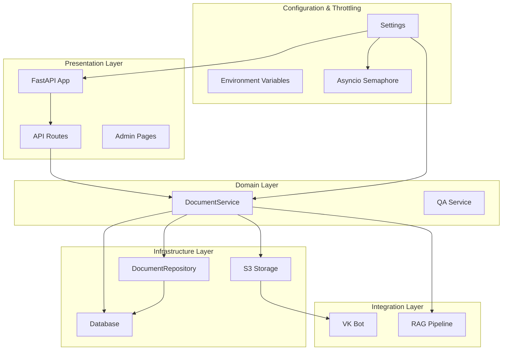
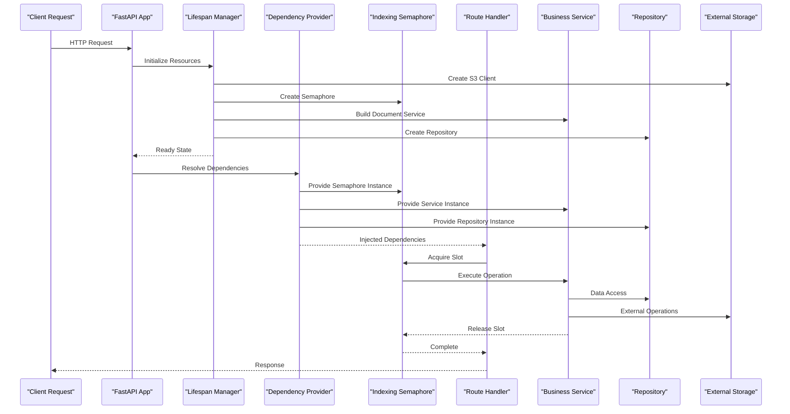
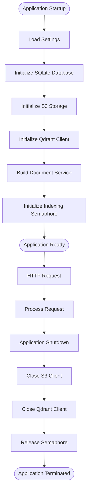
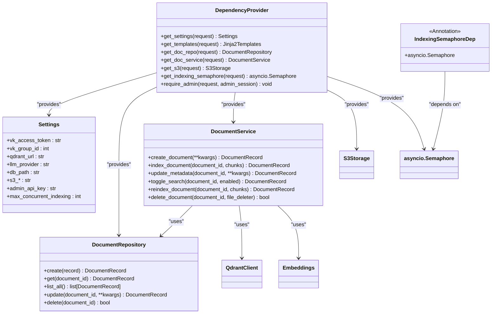
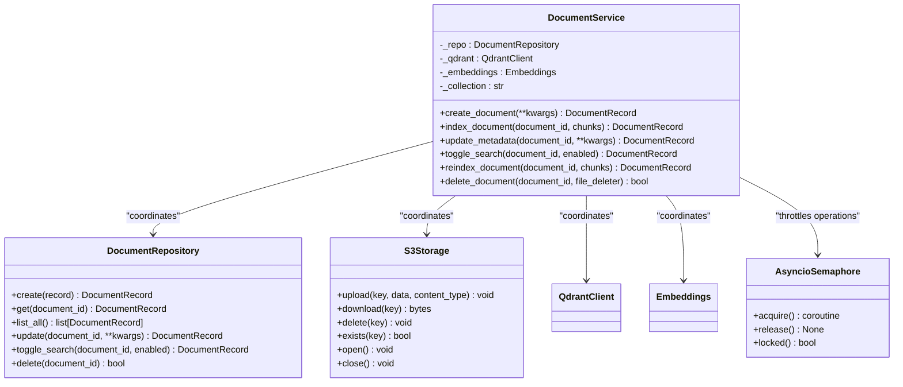
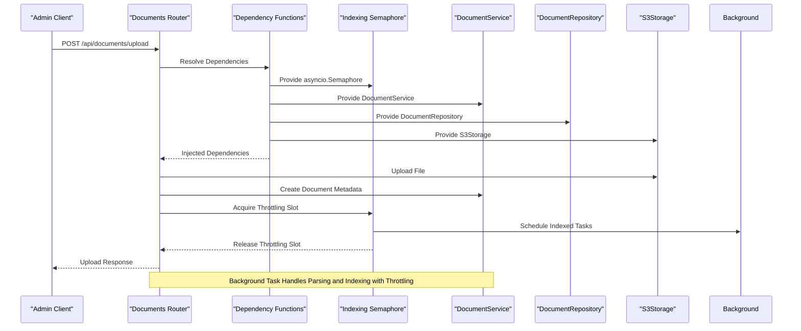
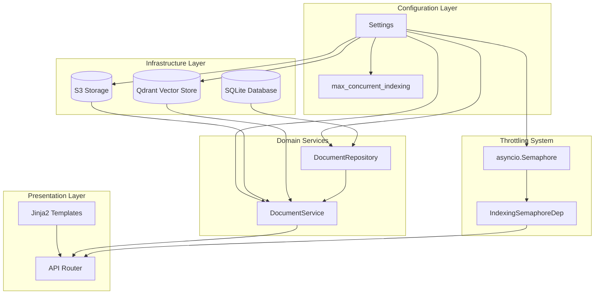
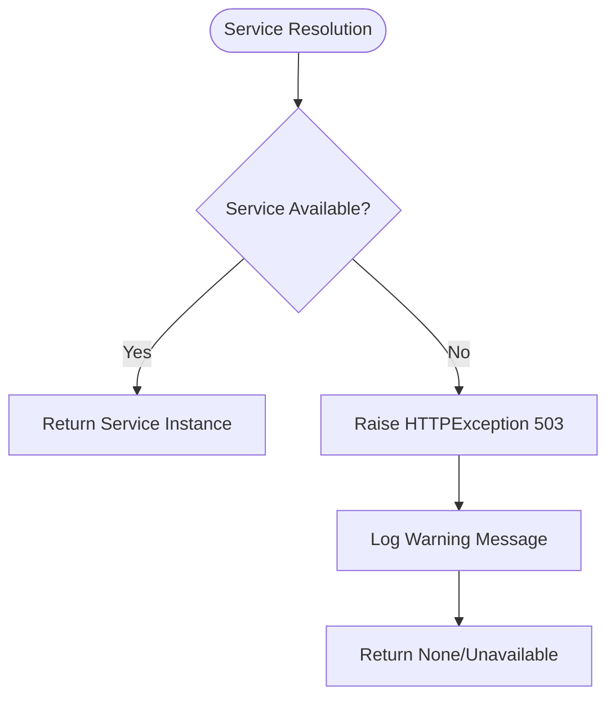

# Dependency Injection System

<cite>
**Referenced Files in This Document**
- [app/main.py](file://app/main.py)
- [app/api/deps.py](file://app/api/deps.py)
- [app/config.py](file://app/config.py)
- [app/storage/database.py](file://app/storage/database.py)
- [app/storage/document_repo.py](file://app/storage/document_repo.py)
- [app/storage/s3.py](file://app/storage/s3.py)
- [app/storage/models.py](file://app/storage/models.py)
- [app/domain/document_service.py](file://app/domain/document_service.py)
- [app/api/documents.py](file://app/api/documents.py)
- [app/rag/retriever.py](file://app/rag/retriever.py)
- [app/rag/indexer.py](file://app/rag/indexer.py)
- [app/rag/parser.py](file://app/rag/parser.py)
- [pyproject.toml](file://pyproject.toml)
</cite>

## Update Summary
**Changes Made**
- Added documentation for the new `get_indexing_semaphore` dependency function
- Updated configuration section to include `max_concurrent_indexing` setting
- Enhanced dependency provider functions section with semaphore integration
- Updated architecture diagrams to show semaphore-based throttling system
- Added performance considerations for concurrent indexing management

## Table of Contents
1. [Introduction](#introduction)
2. [Project Structure](#project-structure)
3. [Core Components](#core-components)
4. [Architecture Overview](#architecture-overview)
5. [Detailed Component Analysis](#detailed-component-analysis)
6. [Dependency Analysis](#dependency-analysis)
7. [Performance Considerations](#performance-considerations)
8. [Troubleshooting Guide](#troubleshooting-guide)
9. [Conclusion](#conclusion)

## Introduction

The Cafetera HR Bot project implements a sophisticated dependency injection system built on top of FastAPI's dependency management framework. This system enables clean separation of concerns, testability, and modular architecture by managing the lifecycle and provisioning of application services and resources.

The dependency injection pattern in this project follows a hierarchical approach where:
- Application-wide resources are managed in the FastAPI lifespan context
- Service dependencies are provided through FastAPI dependency functions
- Configuration-driven instantiation ensures flexibility across different environments
- **Updated**: Throttling mechanisms are managed through asyncio.Semaphore-based dependency injection for concurrent operation control

## Project Structure

The project follows a layered architecture with clear separation between presentation, domain, infrastructure, and integration layers:

**Diagram sources**
- [app/main.py:23-82](file://app/main.py#L23-L82)
- [app/api/deps.py:17-46](file://app/api/deps.py#L17-L46)
- [app/config.py:4-33](file://app/config.py#L4-L33)
- [app/main.py:87-89](file://app/main.py#L87-L89)

**Section sources**
- [app/main.py:1-119](file://app/main.py#L1-L119)
- [app/api/deps.py:1-80](file://app/api/deps.py#L1-L80)
- [app/config.py:1-39](file://app/config.py#L1-L39)

## Core Components

The dependency injection system consists of several key components that work together to manage application resources:

### Application Lifecycle Management

The FastAPI lifespan context manages the application's startup and shutdown procedures, ensuring proper initialization and cleanup of external resources.

### Dependency Providers

The system uses FastAPI's dependency injection mechanism through annotated dependency functions that provide instances of services and repositories to route handlers.

### Configuration Management

Settings are loaded from environment variables and provide runtime configuration for all components, including **Updated**: concurrency throttling settings for document indexing operations.

### **Updated**: Throttling System

The system includes a semaphore-based throttling mechanism that limits concurrent document indexing operations to prevent resource exhaustion and maintain system stability.

**Section sources**
- [app/main.py:23-82](file://app/main.py#L23-L82)
- [app/api/deps.py:17-46](file://app/api/deps.py#L17-L46)
- [app/config.py:4-39](file://app/config.py#L4-L39)
- [app/main.py:87-89](file://app/main.py#L87-L89)

## Architecture Overview

The dependency injection architecture follows a hierarchical pattern where resources flow from the application level down to individual route handlers, with **Updated**: semaphore-based throttling integrated throughout the system:

**Diagram sources**
- [app/main.py:23-82](file://app/main.py#L23-L82)
- [app/api/deps.py:17-46](file://app/api/deps.py#L17-L46)
- [app/api/documents.py:265-352](file://app/api/documents.py#L265-L352)
- [app/main.py:87-89](file://app/main.py#L87-L89)

## Detailed Component Analysis

### Application Lifecycle and Resource Management

The application lifecycle is managed through FastAPI's lifespan context, which handles initialization and cleanup of external resources, including **Updated**: semaphore initialization:

**Diagram sources**
- [app/main.py:23-96](file://app/main.py#L23-L96)
- [app/main.py:87-89](file://app/main.py#L87-L89)

The lifespan manager creates and maintains instances of:
- SQLite database connection for document metadata
- S3 storage client for file operations
- Qdrant vector database client for RAG operations
- Document service with all its dependencies
- **Updated**: asyncio.Semaphore instance for controlling concurrent indexing operations

**Section sources**
- [app/main.py:23-96](file://app/main.py#L23-L96)
- [app/main.py:87-89](file://app/main.py#L87-L89)

### Dependency Provider Functions

The dependency injection system uses FastAPI's dependency functions to provide services to route handlers, including **Updated**: semaphore-based throttling:

**Diagram sources**
- [app/api/deps.py:17-74](file://app/api/deps.py#L17-L74)
- [app/config.py:4-39](file://app/config.py#L4-L39)
- [app/storage/document_repo.py:61-202](file://app/storage/document_repo.py#L61-L202)
- [app/domain/document_service.py:35-280](file://app/domain/document_service.py#L35-L280)

**Section sources**
- [app/api/deps.py:17-74](file://app/api/deps.py#L17-L74)
- [app/config.py:4-39](file://app/config.py#L4-L39)

### Service Layer Architecture

The DocumentService acts as the central coordinator for document operations, managing the interaction between different storage systems, with **Updated**: semaphore integration for throttled operations:

**Diagram sources**
- [app/domain/document_service.py:35-280](file://app/domain/document_service.py#L35-L280)
- [app/storage/document_repo.py:61-202](file://app/storage/document_repo.py#L61-L202)
- [app/storage/s3.py:14-109](file://app/storage/s3.py#L14-L109)
- [app/api/deps.py:69-70](file://app/api/deps.py#L69-L70)

**Section sources**
- [app/domain/document_service.py:35-280](file://app/domain/document_service.py#L35-L280)

### Route Handler Integration

Route handlers integrate dependencies through FastAPI's dependency injection system, including **Updated**: semaphore-based throttling for concurrent operations:

**Diagram sources**
- [app/api/documents.py:265-352](file://app/api/documents.py#L265-L352)
- [app/api/deps.py:25-46](file://app/api/deps.py#L25-L46)
- [app/api/deps.py:69-70](file://app/api/deps.py#L69-L70)

**Section sources**
- [app/api/documents.py:265-352](file://app/api/documents.py#L265-L352)
- [app/api/deps.py:69-70](file://app/api/deps.py#L69-L70)

## Dependency Analysis

The dependency injection system creates a clear dependency graph with well-defined relationships, including **Updated**: semaphore-based throttling integration:

**Diagram sources**
- [app/main.py:23-82](file://app/main.py#L23-L82)
- [app/api/deps.py:17-46](file://app/api/deps.py#L17-L46)
- [app/config.py:4-39](file://app/config.py#L4-L39)
- [app/main.py:87-89](file://app/main.py#L87-L89)

The dependency relationships demonstrate:
- **Hierarchical dependency**: Services depend on repositories, which depend on databases
- **External service integration**: S3 and Qdrant clients are injected into services
- **Configuration-driven instantiation**: All dependencies are created based on settings
- **Resource sharing**: Database connections are shared through the repository pattern
- **Updated**: **Throttling integration**: Semaphore instances are provided to route handlers for concurrent operation control

**Section sources**
- [app/main.py:23-82](file://app/main.py#L23-L82)
- [app/api/deps.py:17-46](file://app/api/deps.py#L17-L46)
- [app/config.py:4-39](file://app/config.py#L4-L39)
- [app/main.py:87-89](file://app/main.py#L87-L89)

## Performance Considerations

The dependency injection system provides several performance benefits, including **Updated**: semaphore-based throttling for concurrent operations:

### Resource Reuse
- Database connections are reused through the repository pattern
- S3 client instances are maintained throughout application lifecycle
- Qdrant client connections are pooled and reused
- **Updated**: Semaphore instances are reused throughout application lifecycle for consistent throttling

### Lazy Initialization
- Optional services (S3, Qdrant) are initialized conditionally
- Background tasks handle heavy operations asynchronously
- Dependencies are only created when needed
- **Updated**: Semaphore instances are created once during application startup

### Memory Management
- Proper cleanup in lifespan context prevents resource leaks
- Async context managers ensure proper resource disposal
- Background tasks use temporary files efficiently
- **Updated**: Semaphore releases are handled automatically through context managers

### **Updated**: Concurrency Control
- **Semaphore-based throttling**: Limits concurrent document indexing operations to `max_concurrent_indexing` (default: 2)
- **Automatic slot management**: Handlers acquire and release semaphore slots automatically
- **Non-blocking operations**: Background tasks continue processing even when slots are unavailable
- **Configurable limits**: Throttling capacity can be adjusted via environment configuration

**Section sources**
- [app/main.py:87-89](file://app/main.py#L87-L89)
- [app/config.py:37-39](file://app/config.py#L37-L39)

## Troubleshooting Guide

Common dependency injection issues and their solutions, including **Updated**: semaphore-related problems:

### Service Unavailable Errors
When services are not available during application startup:

**Diagram sources**
- [app/api/deps.py:29-46](file://app/api/deps.py#L29-L46)

### Configuration Issues
Missing or incorrect configuration values:

1. **Admin Authentication**: Missing admin API key causes authentication failures
2. **Database Path**: Incorrect database path prevents repository initialization
3. **External Services**: Wrong URLs or credentials break S3/Qdrant connections
4. **Concurrency Settings**: Incorrect `max_concurrent_indexing` value affects throttling behavior

### **Updated**: Semaphore Issues
Semaphore-related problems and solutions:

1. **Semaphore Not Available**: Missing or incorrectly configured semaphore instance
2. **Deadlock Prevention**: Ensure semaphore acquisition and release are properly paired
3. **Throttling Too Strict**: High `max_concurrent_indexing` values may cause resource exhaustion
4. **Throttling Too Loose**: Low values may slow down batch operations

### Resource Cleanup
Proper shutdown requires:
- Closing S3 client connections
- Closing Qdrant client connections
- Ensuring database transactions are committed
- **Updated**: Proper semaphore cleanup during application termination

**Section sources**
- [app/api/deps.py:29-46](file://app/api/deps.py#L29-L46)
- [app/main.py:84-96](file://app/main.py#L84-L96)
- [app/main.py:87-89](file://app/main.py#L87-L89)

## Conclusion

The dependency injection system in the Cafetera HR Bot project demonstrates a mature approach to managing application complexity through clear separation of concerns and flexible resource management. The system successfully balances:

- **Testability**: Services can be easily mocked and tested independently
- **Maintainability**: Clear dependency boundaries make code modifications safer
- **Scalability**: Hierarchical dependency management supports growth
- **Reliability**: Proper resource lifecycle management prevents memory leaks
- **Updated**: **Concurrency Control**: Semaphore-based throttling ensures stable operation under load

The implementation leverages FastAPI's built-in dependency injection capabilities while adding custom providers for specialized services, including **Updated**: semaphore-based throttling for concurrent operation management. This creates a robust foundation for the RAG-based document management system with proper resource control and performance optimization.