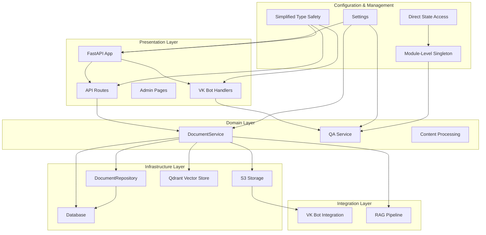
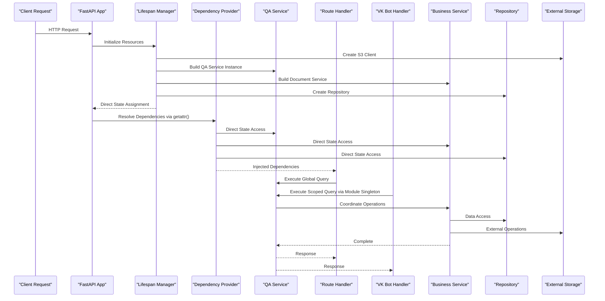
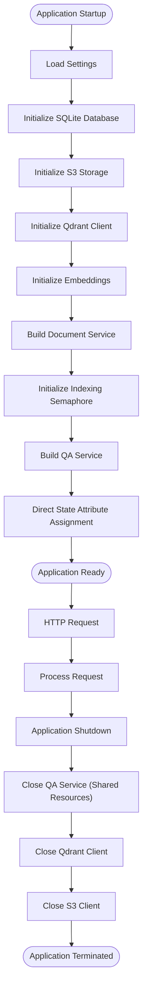
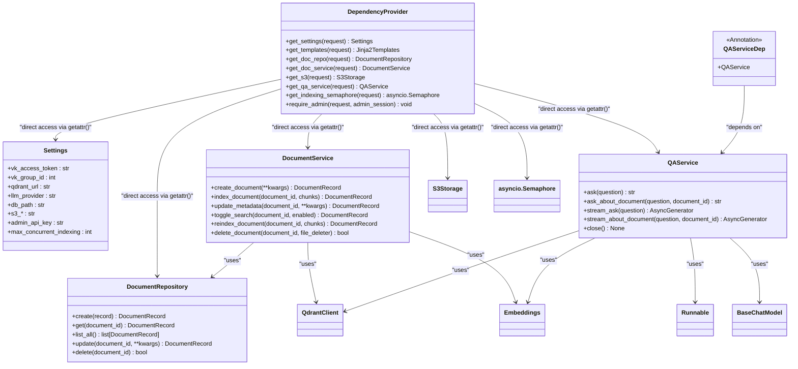
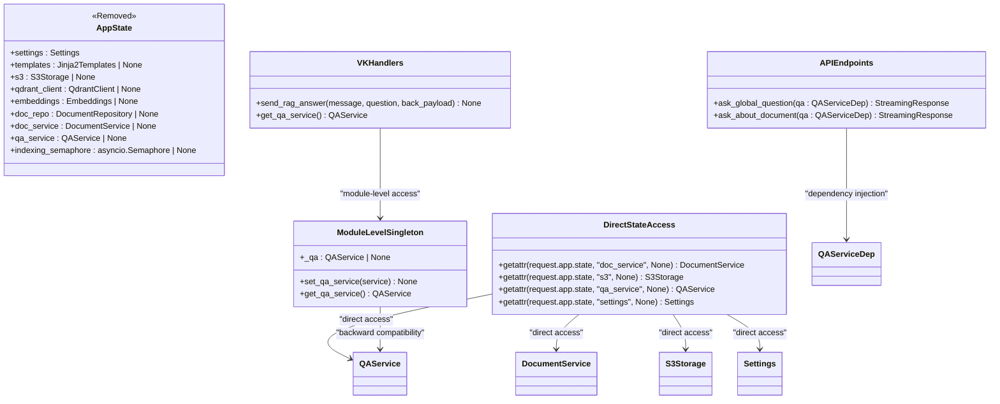
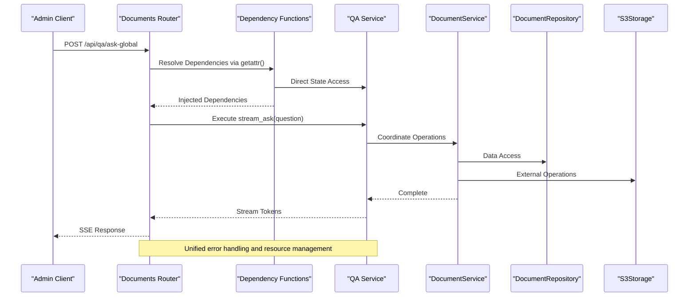
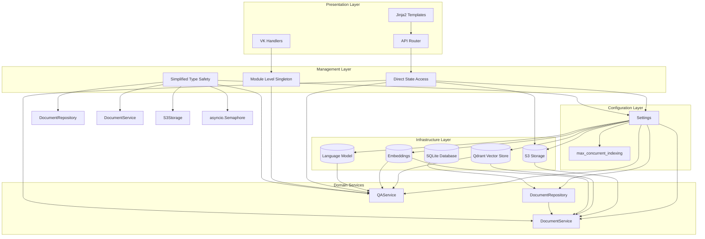
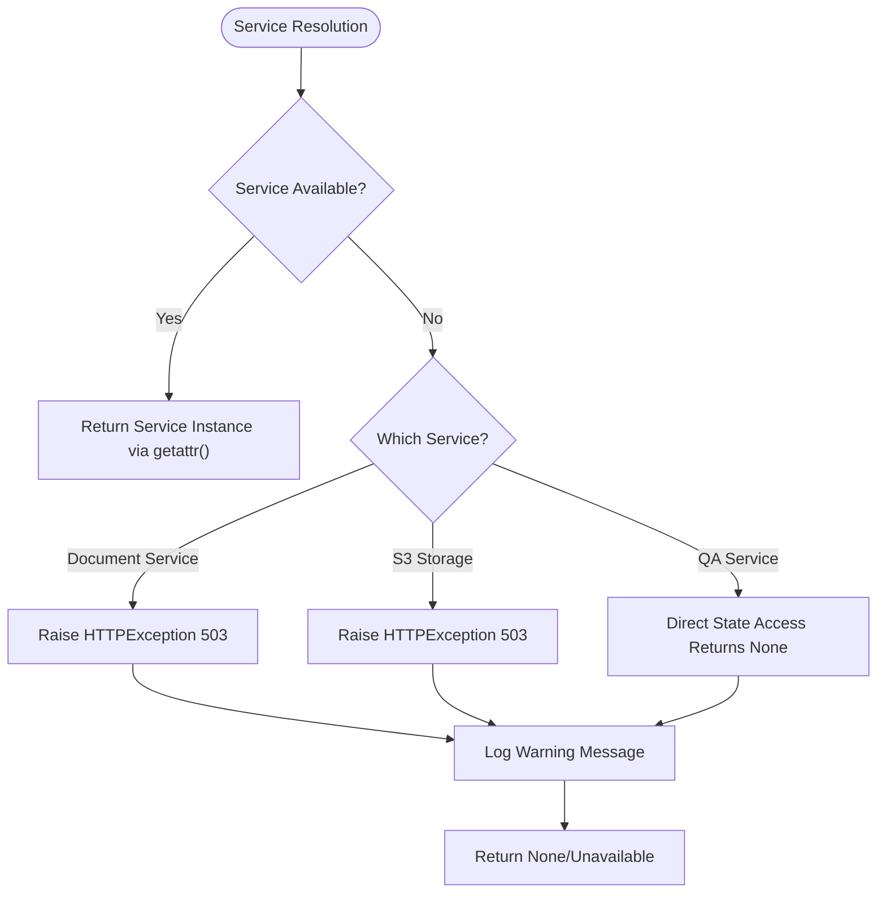

# Dependency Injection System

<cite>
**Referenced Files in This Document**
- [app/main.py](file://app/main.py)
- [app/api/deps.py](file://app/api/deps.py)
- [app/config.py](file://app/config.py)
- [app/domain/qa_service.py](file://app/domain/qa_service.py)
- [app/integrations/vk/handlers/__init__.py](file://app/integrations/vk/handlers/__init__.py)
- [app/integrations/vk/handlers/sections.py](file://app/integrations/vk/handlers/sections.py)
- [app/api/documents.py](file://app/api/documents.py)
- [app/storage/database.py](file://app/storage/database.py)
- [app/storage/document_repo.py](file://app/storage/document_repo.py)
- [app/storage/s3.py](file://app/storage/s3.py)
- [app/storage/models.py](file://app/storage/models.py)
- [app/domain/document_service.py](file://app/domain/document_service.py)
- [app/rag/retriever.py](file://app/rag/retriever.py)
- [app/rag/indexer.py](file://app/rag/indexer.py)
- [app/rag/parser.py](file://app/rag/parser.py)
- [app/resources.py](file://app/resources.py)
- [pyproject.toml](file://pyproject.toml)
</cite>

## Update Summary
**Changes Made**
- Modernized dependency injection system with simplified state access using getattr() calls instead of complex AppState dataclass pattern
- **Updated**: Eliminated TYPE_CHECKING imports throughout the dependency injection system for improved runtime performance
- **Updated**: Removed centralized AppState dataclass in favor of direct attribute access on app.state
- **Updated**: Simplified dependency provider functions with robust getattr() fallback mechanisms
- **Updated**: Maintained backward compatibility through module-level singleton pattern for VK handlers

## Table of Contents
1. [Introduction](#introduction)
2. [Project Structure](#project-structure)
3. [Core Components](#core-components)
4. [Architecture Overview](#architecture-overview)
5. [Detailed Component Analysis](#detailed-component-analysis)
6. [Dependency Analysis](#dependency-analysis)
7. [Performance Considerations](#performance-considerations)
8. [Troubleshooting Guide](#troubleshooting-guide)
9. [Conclusion](#conclusion)

## Introduction

The Cafetera HR Bot project implements a modernized dependency injection system built on top of FastAPI's dependency management framework. This system enables clean separation of concerns, testability, and modular architecture by managing the lifecycle and provisioning of application services and resources through simplified state access patterns.

The dependency injection pattern in this project follows a streamlined approach where:
- Application-wide resources are managed in the FastAPI lifespan context
- Service dependencies are provided through FastAPI dependency functions with robust getattr() fallback mechanisms
- Configuration-driven instantiation ensures flexibility across different environments
- **Updated**: Direct state attribute access eliminates complex AppState dataclass patterns while maintaining backward compatibility

## Project Structure

The project follows a layered architecture with clear separation between presentation, domain, infrastructure, and integration layers:

**Diagram sources**
- [app/main.py:34-51](file://app/main.py#L34-L51)
- [app/api/deps.py:15-16](file://app/api/deps.py#L15-L16)
- [app/config.py:4-33](file://app/config.py#L4-L33)
- [app/main.py:117-144](file://app/main.py#L117-L144)

**Section sources**
- [app/main.py:1-194](file://app/main.py#L1-L194)
- [app/api/deps.py:1-123](file://app/api/deps.py#L1-L123)
- [app/config.py:1-39](file://app/config.py#L1-L39)

## Core Components

The dependency injection system consists of several key components that work together to manage application resources through simplified state access patterns:

### Application Lifecycle Management

The FastAPI lifespan context manages the application's startup and shutdown procedures, ensuring proper initialization and cleanup of external resources through direct state attribute assignment.

### Simplified Dependency Providers

The system uses FastAPI's dependency injection mechanism through annotated dependency functions that provide instances of services and repositories to route handlers, utilizing robust getattr() fallback mechanisms for missing components.

### Configuration Management

Settings are loaded from environment variables and provide runtime configuration for all components, including centralized QA service configuration and resource sharing.

### **Updated**: Direct State Attribute Access

The system now uses direct attribute access on app.state for all dependencies, eliminating the need for complex AppState dataclass patterns while maintaining backward compatibility through module-level singletons for VK handlers.

**Section sources**
- [app/main.py:53-166](file://app/main.py#L53-L166)
- [app/api/deps.py:107-122](file://app/api/deps.py#L107-L122)
- [app/config.py:4-39](file://app/config.py#L4-L39)
- [app/domain/qa_service.py:42-211](file://app/domain/qa_service.py#L42-L211)

## Architecture Overview

The dependency injection architecture follows a streamlined pattern where resources flow from the application level down to individual route handlers, with direct state attribute access providing unified access throughout the system:

**Diagram sources**
- [app/main.py:53-166](file://app/main.py#L53-L166)
- [app/api/deps.py:107-122](file://app/api/deps.py#L107-L122)
- [app/api/documents.py:791-855](file://app/api/documents.py#L791-L855)
- [app/integrations/vk/handlers/sections.py:25-45](file://app/integrations/vk/handlers/sections.py#L25-L45)

## Detailed Component Analysis

### Application Lifecycle and Resource Management

The application lifecycle is managed through FastAPI's lifespan context, which handles initialization and cleanup of external resources through direct state attribute assignment:

**Diagram sources**
- [app/main.py:53-166](file://app/main.py#L53-L166)
- [app/main.py:117-144](file://app/main.py#L117-L144)

The lifespan manager creates and maintains instances of:
- SQLite database connection for document metadata
- S3 storage client for file operations
- Qdrant vector database client for RAG operations
- Document service with all its dependencies
- **Updated**: Direct state attribute assignment eliminates AppState dataclass complexity
- **Updated**: Module-level singleton for backward compatibility with VK handlers

**Section sources**
- [app/main.py:53-166](file://app/main.py#L53-L166)
- [app/main.py:117-144](file://app/main.py#L117-L144)

### Simplified Dependency Provider Functions

The dependency injection system uses FastAPI's dependency functions to provide services to route handlers, utilizing robust getattr() fallback mechanisms for missing components:

**Diagram sources**
- [app/api/deps.py:107-122](file://app/api/deps.py#L107-L122)
- [app/config.py:4-39](file://app/config.py#L4-L39)
- [app/storage/document_repo.py:61-202](file://app/storage/document_repo.py#L61-L202)
- [app/domain/document_service.py:35-280](file://app/domain/document_service.py#L35-L280)
- [app/domain/qa_service.py:42-211](file://app/domain/qa_service.py#L42-L211)

**Section sources**
- [app/api/deps.py:107-122](file://app/api/deps.py#L107-L122)
- [app/config.py:4-39](file://app/config.py#L4-L39)

### Direct State Attribute Access Architecture

The system now uses direct state attribute access patterns, eliminating complex AppState dataclass patterns while maintaining backward compatibility:

**Diagram sources**
- [app/domain/qa_service.py:42-211](file://app/domain/qa_service.py#L42-L211)
- [app/main.py:34-51](file://app/main.py#L34-L51)
- [app/integrations/vk/handlers/__init__.py:9-20](file://app/integrations/vk/handlers/__init__.py#L9-L20)
- [app/api/documents.py:791-855](file://app/api/documents.py#L791-L855)

**Section sources**
- [app/domain/qa_service.py:42-211](file://app/domain/qa_service.py#L42-L211)
- [app/main.py:34-51](file://app/main.py#L34-L51)
- [app/integrations/vk/handlers/__init__.py:9-20](file://app/integrations/vk/handlers/__init__.py#L9-L20)

### Route Handler Integration

Route handlers integrate dependencies through FastAPI's dependency injection system using simplified getattr() access patterns:

**Diagram sources**
- [app/api/documents.py:791-855](file://app/api/documents.py#L791-L855)
- [app/api/deps.py:107-122](file://app/api/deps.py#L107-L122)

**Section sources**
- [app/api/documents.py:791-855](file://app/api/documents.py#L791-L855)
- [app/api/deps.py:107-122](file://app/api/deps.py#L107-L122)

## Dependency Analysis

The dependency injection system creates a clear dependency graph with well-defined relationships, utilizing simplified state access patterns:

**Diagram sources**
- [app/main.py:53-166](file://app/main.py#L53-L166)
- [app/api/deps.py:107-122](file://app/api/deps.py#L107-L122)
- [app/config.py:4-39](file://app/config.py#L4-L39)

The dependency relationships demonstrate:
- **Hierarchical dependency**: Services depend on repositories, which depend on databases
- **External service integration**: S3, Qdrant, and LLM clients are injected into services
- **Configuration-driven instantiation**: All dependencies are created based on settings
- **Resource sharing**: Database connections and shared QA resources are shared through the repository pattern
- **Updated**: **Direct state access**: Simplified getattr() access eliminates AppState complexity
- **Updated**: **Backward compatibility**: Module-level singleton maintains compatibility with existing VK handlers
- **Updated**: **Eliminated TYPE_CHECKING**: Runtime performance improvements through simplified imports

**Section sources**
- [app/main.py:53-166](file://app/main.py#L53-L166)
- [app/api/deps.py:107-122](file://app/api/deps.py#L107-L122)
- [app/config.py:4-39](file://app/config.py#L4-L39)

## Performance Considerations

The dependency injection system provides several performance benefits through simplified state access patterns:

### Resource Reuse
- Database connections are reused through the repository pattern
- S3 client instances are maintained throughout application lifecycle
- Qdrant client connections are pooled and reused
- **Updated**: Direct state attribute access eliminates dictionary lookup overhead
- **Updated**: Module-level singleton provides backward compatibility without duplicating resources

### Lazy Initialization
- Optional services (S3, Qdrant) are initialized conditionally
- Background tasks handle heavy operations asynchronously
- Dependencies are only created when needed
- **Updated**: getattr() fallback mechanism prevents unnecessary exception handling

### Memory Management
- Proper cleanup in lifespan context prevents resource leaks
- Async context managers ensure proper resource disposal
- Background tasks use temporary files efficiently
- **Updated**: Simplified state management reduces memory overhead

### **Updated**: Simplified Type Safety Benefits
- **Runtime Performance**: Eliminated TYPE_CHECKING imports improve runtime performance
- **Reduced Complexity**: Direct getattr() calls are more efficient than AppState lookups
- **Backward Compatibility**: Maintained existing interfaces while improving internals
- **Development Experience**: Cleaner code with fewer imports and simpler patterns

### **Updated**: Direct State Access Benefits
- **Performance**: Direct attribute access is faster than dictionary-style AppState
- **Simplicity**: Eliminates the need for complex dataclass patterns
- **Robustness**: getattr() fallback mechanisms handle missing components gracefully
- **Maintainability**: Reduced code complexity improves long-term maintainability

**Section sources**
- [app/main.py:117-144](file://app/main.py#L117-L144)
- [app/main.py:155-165](file://app/main.py#L155-L165)
- [app/domain/qa_service.py:198-211](file://app/domain/qa_service.py#L198-L211)

## Troubleshooting Guide

Common dependency injection issues and their solutions, utilizing simplified state access patterns:

### Service Unavailable Errors
When services are not available during application startup:

**Diagram sources**
- [app/api/deps.py:60-79](file://app/api/deps.py#L60-L79)
- [app/api/deps.py:107-112](file://app/api/deps.py#L107-L112)

### Configuration Issues
Missing or incorrect configuration values:

1. **Admin Authentication**: Missing admin API key causes authentication failures
2. **Database Path**: Incorrect database path prevents repository initialization
3. **External Services**: Wrong URLs or credentials break S3/Qdrant connections
4. **Concurrency Settings**: Incorrect `max_concurrent_indexing` value affects throttling behavior
5. **Direct State Access**: Missing state attributes cause getattr() fallback to None

### **Updated**: Direct State Access Issues
Direct state access-related problems and solutions:

1. **Missing State Attributes**: getattr() fallback returns None for uninitialized components
2. **Runtime Attribute Errors**: Direct state access bypasses compile-time validation
3. **Component Availability**: Simplified access patterns require proper initialization order
4. **Backward Compatibility**: Module-level singleton maintains existing handler interfaces
5. **Error Handling**: getattr() fallback provides graceful degradation

### **Updated**: Simplified Type Safety Issues
Simplified type safety-related problems and solutions:

1. **Import Optimization**: Eliminated unused TYPE_CHECKING imports reduce module loading time
2. **Runtime Performance**: Direct state access is faster than complex dataclass patterns
3. **Code Clarity**: Simplified patterns improve code readability and maintainability
4. **Backward Compatibility**: Existing interfaces remain unchanged despite internal improvements
5. **Development Workflow**: Cleaner imports improve IDE performance and responsiveness

### Resource Cleanup
Proper shutdown requires:
- Closing S3 client connections
- **Updated**: Proper QA service cleanup with direct state management
- Ensuring database transactions are committed
- **Updated**: Preventing double-closing of shared Qdrant client
- **Updated**: Simplified resource cleanup through direct state access

**Section sources**
- [app/api/deps.py:60-79](file://app/api/deps.py#L60-L79)
- [app/api/deps.py:107-112](file://app/api/deps.py#L107-L112)
- [app/main.py:155-165](file://app/main.py#L155-L165)

## Conclusion

The dependency injection system in the Cafetera HR Bot project demonstrates a modernized approach to managing application complexity through simplified state access patterns and direct attribute management. The system successfully balances:

- **Testability**: Services can be easily mocked and tested independently
- **Maintainability**: Clear dependency boundaries make code modifications safer
- **Scalability**: Hierarchical dependency management supports growth
- **Reliability**: Proper resource lifecycle management prevents memory leaks
- **Updated**: **Direct State Access**: Simplified getattr() patterns eliminate complex AppState dataclass overhead
- **Updated**: **Backward Compatibility**: Module-level singleton maintains compatibility with existing VK handlers
- **Updated**: **Performance Optimization**: Eliminated TYPE_CHECKING imports improve runtime performance
- **Updated**: **Code Clarity**: Simplified patterns improve readability and maintainability
- **Updated**: **Development Experience**: Cleaner imports and simpler patterns enhance developer productivity

The implementation leverages FastAPI's built-in dependency injection capabilities while adding custom providers for specialized services, utilizing direct state attribute access patterns. This creates a robust foundation for the RAG-based document management system with proper resource control, performance optimization, and consistent access patterns throughout the application.

The modernized type safety improvements provide:
- **Better Performance**: Eliminated TYPE_CHECKING imports reduce module loading time
- **Improved Code Quality**: Simplified patterns are easier to understand and maintain
- **Enhanced Developer Experience**: Cleaner imports and straightforward access patterns
- **Runtime Efficiency**: Direct getattr() calls are faster than complex dataclass lookups
- **Future-Proof Architecture**: Simplified patterns support easy evolution and maintenance

This creates a production-ready dependency injection system that balances functionality, performance, and developer experience through modernized state access patterns and streamlined resource management.