# Document Management System

<cite>
**Referenced Files in This Document**
- [app/main.py](file://app/main.py)
- [app/config.py](file://app/config.py)
- [app/api/documents.py](file://app/api/documents.py)
- [app/api/deps.py](file://app/api/deps.py)
- [app/domain/document_service.py](file://app/domain/document_service.py)
- [app/storage/document_repo.py](file://app/storage/document_repo.py)
- [app/storage/models.py](file://app/storage/models.py)
- [app/storage/s3.py](file://app/storage/s3.py)
- [app/rag/indexer.py](file://app/rag/indexer.py)
- [app/rag/parser.py](file://app/rag/parser.py)
- [app/rag/retriever.py](file://app/rag/retriever.py)
- [app/integrations/vk/bot.py](file://app/integrations/vk/bot.py)
- [templates/documents.html](file://templates/documents.html)
- [scripts/ingest.py](file://scripts/ingest.py)
- [pyproject.toml](file://pyproject.toml)
</cite>

## Table of Contents
1. [Introduction](#introduction)
2. [System Architecture](#system-architecture)
3. [Core Components](#core-components)
4. [Document Lifecycle Management](#document-lifecycle-management)
5. [RAG Pipeline](#rag-pipeline)
6. [Storage Layer](#storage-layer)
7. [API Endpoints](#api-endpoints)
8. [Admin Interface](#admin-interface)
9. [Integration Points](#integration-points)
10. [Configuration](#configuration)
11. [Testing Strategy](#testing-strategy)
12. [Deployment and Operations](#deployment-and-operations)

## Introduction

The Document Management System is a comprehensive RAG (Retrieval-Augmented Generation) platform built with FastAPI, designed to manage HR-related documents through a modern web interface. The system provides document ingestion, processing, storage, and retrieval capabilities with support for multiple AI providers and storage backends.

Key features include:
- Web-based administration interface for document management
- Support for Microsoft Word (.docx) documents
- Vector-based semantic search using Qdrant
- Multi-provider embedding support (Ollama, OpenAI, Llama.cpp)
- Asynchronous background processing for document indexing
- HTMX-powered dynamic user interface
- Comprehensive admin authentication and authorization

## System Architecture

The system follows a layered architecture pattern with clear separation of concerns:

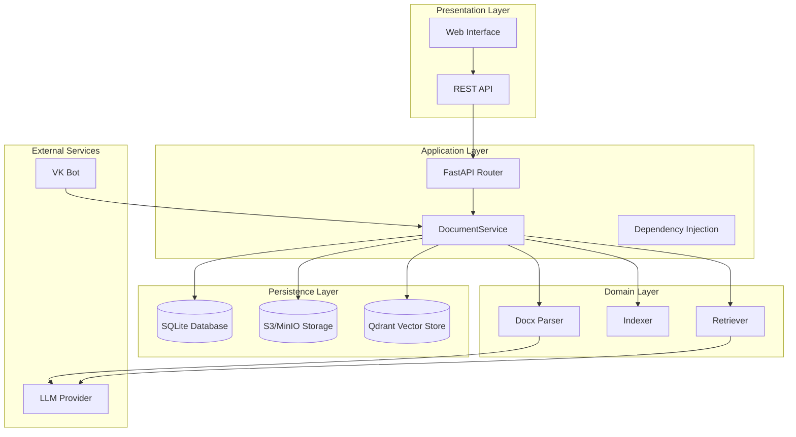

**Diagram sources**
- [app/main.py:98-119](file://app/main.py#L98-L119)
- [app/api/documents.py:59-59](file://app/api/documents.py#L59-L59)
- [app/domain/document_service.py:35-53](file://app/domain/document_service.py#L35-L53)

## Core Components

### Application Entry Point

The FastAPI application serves as the central orchestrator, managing application lifecycle and dependency injection:

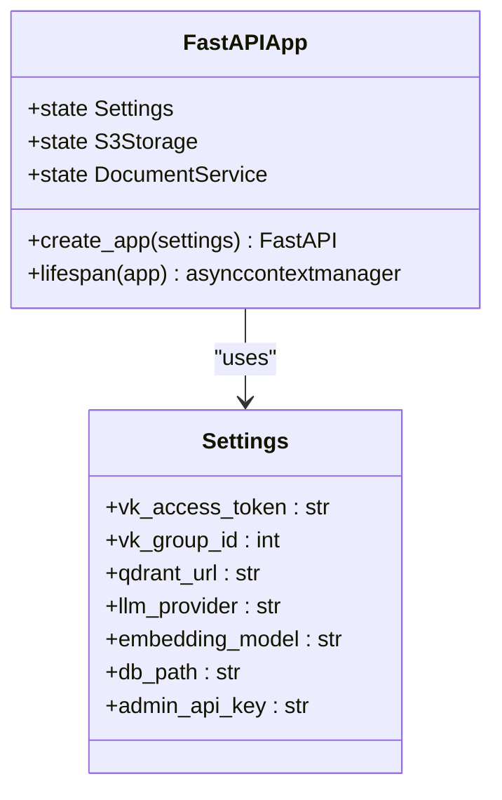

**Diagram sources**
- [app/main.py:23-82](file://app/main.py#L23-L82)
- [app/config.py:4-33](file://app/config.py#L4-L33)

**Section sources**
- [app/main.py:1-119](file://app/main.py#L1-L119)
- [app/config.py:1-33](file://app/config.py#L1-L33)

### Document Service Orchestration

The DocumentService acts as the central coordinator for all document operations:

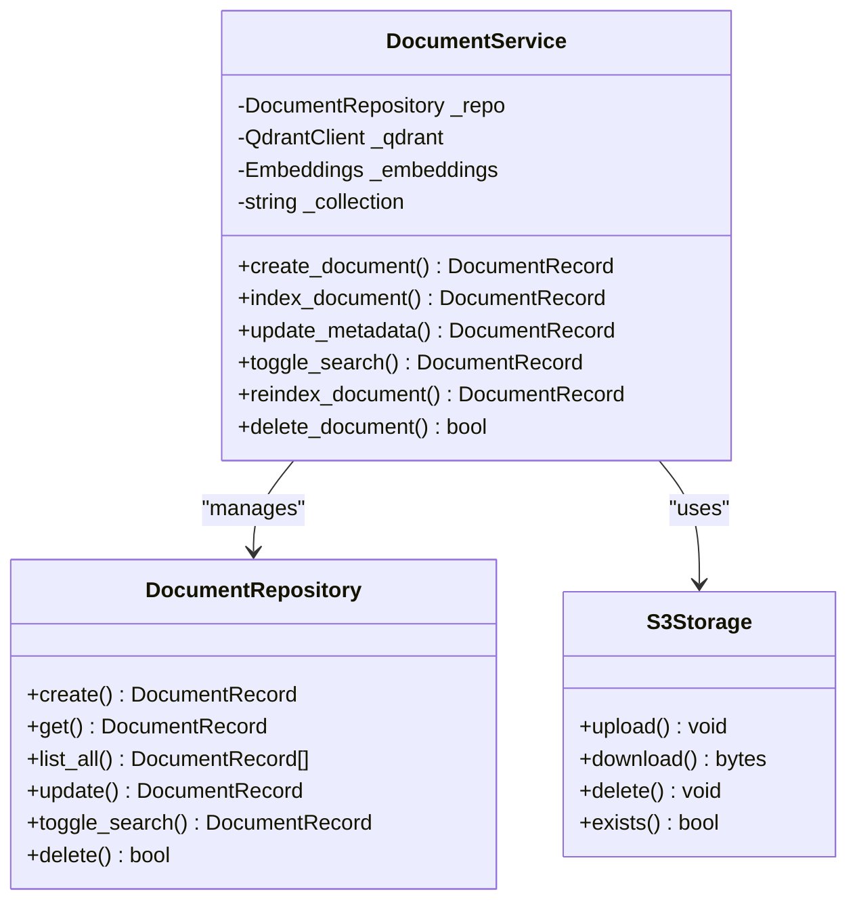

**Diagram sources**
- [app/domain/document_service.py:35-280](file://app/domain/document_service.py#L35-L280)
- [app/storage/document_repo.py:61-202](file://app/storage/document_repo.py#L61-L202)
- [app/storage/s3.py:14-109](file://app/storage/s3.py#L14-L109)

**Section sources**
- [app/domain/document_service.py:1-280](file://app/domain/document_service.py#L1-L280)
- [app/storage/document_repo.py:1-202](file://app/storage/document_repo.py#L1-L202)
- [app/storage/s3.py:1-109](file://app/storage/s3.py#L1-L109)

## Document Lifecycle Management

The system manages document lifecycle through a structured process:

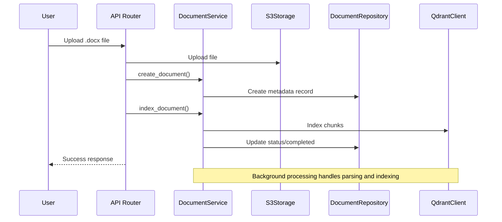

**Diagram sources**
- [app/api/documents.py:265-352](file://app/api/documents.py#L265-L352)
- [app/domain/document_service.py:56-132](file://app/domain/document_service.py#L56-L132)

### Status Management

Documents progress through distinct states during processing:

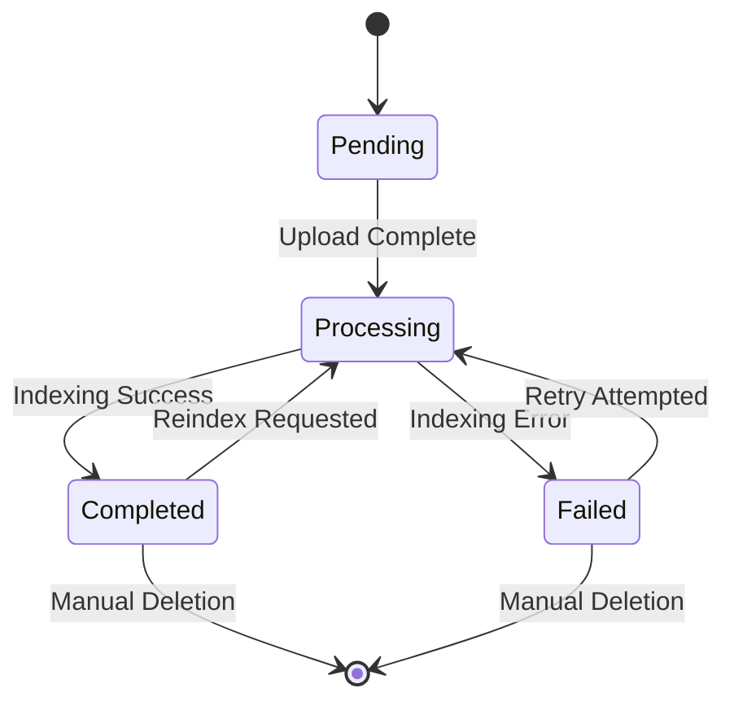

**Section sources**
- [app/storage/models.py:11-18](file://app/storage/models.py#L11-L18)
- [app/domain/document_service.py:83-132](file://app/domain/document_service.py#L83-L132)

## RAG Pipeline

The Retrieval-Augmented Generation pipeline processes documents through multiple stages:

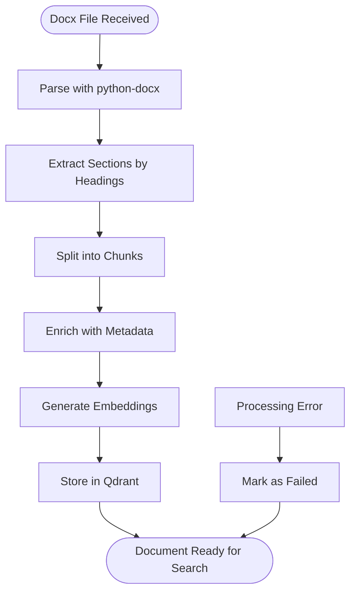

**Diagram sources**
- [app/rag/parser.py:23-83](file://app/rag/parser.py#L23-L83)
- [app/rag/indexer.py:23-72](file://app/rag/indexer.py#L23-L72)

### Chunk Processing

The system uses intelligent chunking strategies:

| Parameter | Value | Purpose |
|-----------|-------|---------|
| CHUNK_SIZE | 1000 | Maximum characters per chunk |
| CHUNK_OVERLAP | 200 | Characters shared between adjacent chunks |
| Separators | `\n\n`, `\n`, `. `, `" "` | Text splitting priorities |

**Section sources**
- [app/rag/parser.py:15-16](file://app/rag/parser.py#L15-L16)
- [app/rag/parser.py:60-64](file://app/rag/parser.py#L60-L64)

## Storage Layer

The storage architecture provides multiple persistence mechanisms:

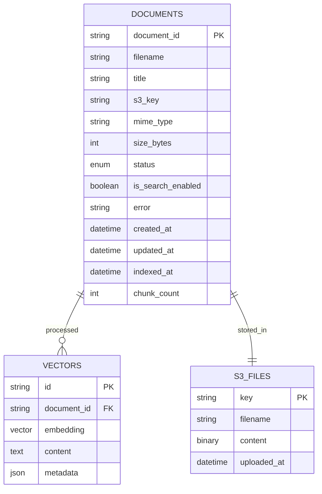

**Diagram sources**
- [app/storage/models.py:20-36](file://app/storage/models.py#L20-L36)
- [app/storage/document_repo.py:14-28](file://app/storage/document_repo.py#L14-L28)

### S3 Integration

The S3Storage class provides asynchronous file operations:

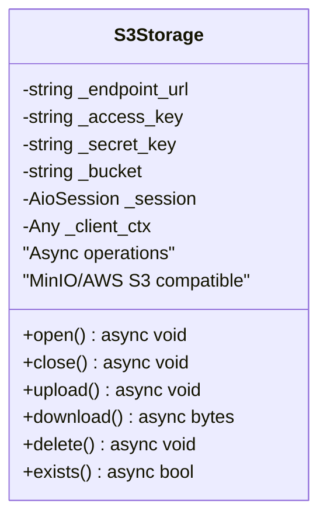

**Diagram sources**
- [app/storage/s3.py:14-109](file://app/storage/s3.py#L14-L109)

**Section sources**
- [app/storage/s3.py:1-109](file://app/storage/s3.py#L1-L109)
- [app/storage/document_repo.py:1-202](file://app/storage/document_repo.py#L1-L202)

## API Endpoints

The system exposes a comprehensive REST API for document management:

### Authentication Endpoints
- `GET /login` - Admin login page
- `POST /login` - Authenticate and set session cookie
- `GET /logout` - Clear admin session

### Document Management Endpoints
- `GET /documents` - Main admin page with document table
- `POST /api/documents/upload` - Upload .docx files
- `GET /api/documents` - List all documents (JSON)
- `GET /api/documents/{id}` - Get document details
- `PATCH /api/documents/{id}/title` - Update document title
- `PATCH /api/documents/{id}/search` - Toggle search participation
- `POST /api/documents/{id}/reindex` - Re-index document
- `DELETE /api/documents/{id}` - Delete document
- `GET /api/documents/{id}/download` - Download original file

### HTMX Partial Endpoints
- `GET /partials/document-table` - Dynamic table updates
- `GET /partials/document-row/{id}` - Individual row updates
- `GET /partials/document-status/{id}` - Status badge updates

**Section sources**
- [app/api/documents.py:1-531](file://app/api/documents.py#L1-L531)

## Admin Interface

The web interface provides a modern, responsive experience powered by HTMX:

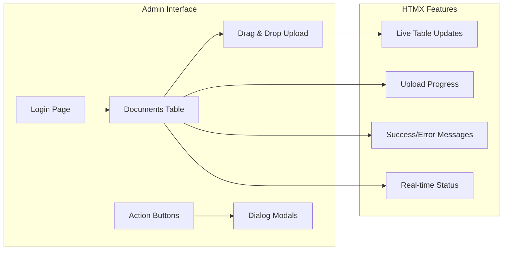

**Diagram sources**
- [templates/documents.html:14-319](file://templates/documents.html#L14-L319)

### Key Interface Features

| Feature | Implementation | Purpose |
|---------|---------------|---------|
| Drag & Drop Upload | HTML5 API + JavaScript | User-friendly file upload |
| Real-time Updates | HTMX polling | Automatic table refresh |
| Progress Indicators | XMLHttpRequest | Upload progress feedback |
| Confirmation Dialogs | HTML5 Dialog | Prevent accidental deletions |
| Responsive Design | Tailwind CSS | Mobile/desktop compatibility |

**Section sources**
- [templates/documents.html:1-319](file://templates/documents.html#L1-L319)

## Integration Points

### VK Bot Integration

The system integrates with VKontakte through a sophisticated bot framework:

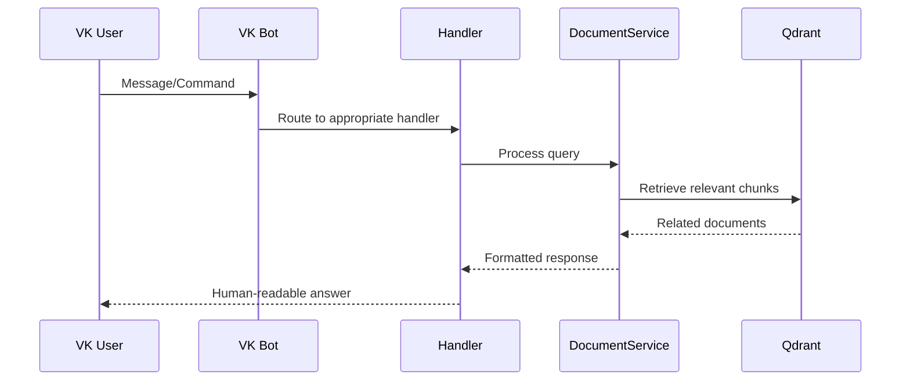

**Diagram sources**
- [app/integrations/vk/bot.py:44-56](file://app/integrations/vk/bot.py#L44-L56)

### Handler Registration

The VK bot uses a hierarchical handler system:

| Handler | Priority | Function |
|---------|----------|----------|
| start | 1 | `/start` command and home screen |
| hr_request | 2 | HR request workflow with state management |
| ask | 3 | Free-text questions with conversation state |
| hire/fire/vacation/pay | 4-7 | Dedicated action handlers |
| sections | 8 | Stub handlers for future features |
| fallback | 9 | Catch-all handler for unknown commands |

**Section sources**
- [app/integrations/vk/bot.py:24-41](file://app/integrations/vk/bot.py#L24-L41)

## Configuration

The system uses a centralized configuration approach:

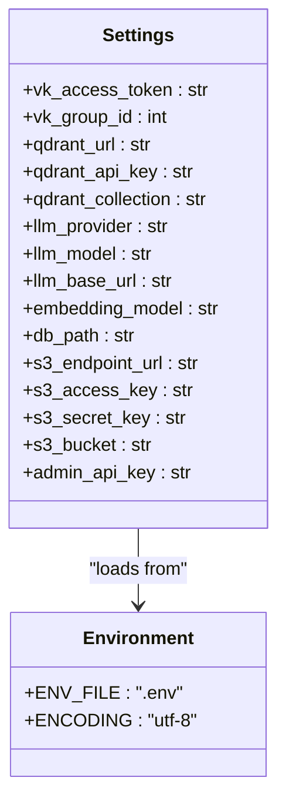

**Diagram sources**
- [app/config.py:4-33](file://app/config.py#L4-L33)

### Configuration Categories

| Category | Required | Description |
|----------|----------|-------------|
| VK Integration | Optional | Bot token and group ID |
| Vector Database | Required | Qdrant connection details |
| LLM Providers | Required | Provider selection and credentials |
| Storage | Required | Database and S3 configuration |
| Admin Security | Required | API key for admin interface |

**Section sources**
- [app/config.py:1-33](file://app/config.py#L1-L33)

## Testing Strategy

The system employs comprehensive testing across all layers:

### Test Coverage Areas

| Component | Test Type | Coverage |
|-----------|-----------|----------|
| DocumentService | Unit Tests | Full lifecycle operations |
| API Endpoints | Integration Tests | All HTTP endpoints |
| Storage Layer | Unit Tests | CRUD operations |
| RAG Pipeline | Unit Tests | Parsing and indexing |
| Admin Interface | Integration Tests | HTMX functionality |

### Key Test Scenarios

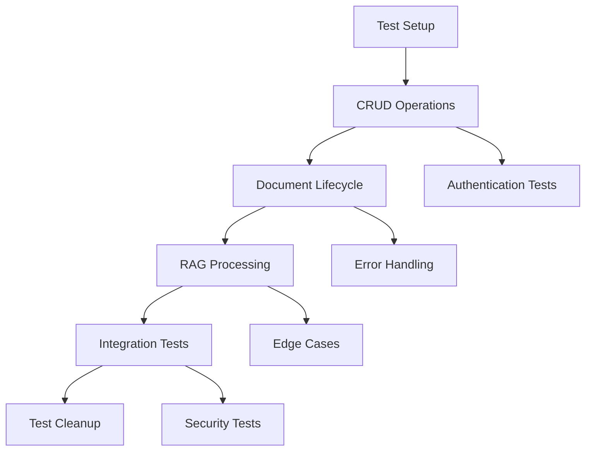

**Section sources**
- [tests/test_document_service.py:1-341](file://tests/test_document_service.py#L1-L341)
- [tests/test_api_documents.py:1-542](file://tests/test_api_documents.py#L1-L542)

## Deployment and Operations

### System Requirements

The application requires the following external services:

| Service | Purpose | Version |
|---------|---------|---------|
| Python | Runtime | >=3.11 |
| FastAPI | Web Framework | Latest |
| Qdrant | Vector Database | Latest |
| SQLite | Local Storage | System |
| MinIO/S3 | File Storage | Compatible |
| LLM Provider | Embeddings | Configurable |

### Installation Dependencies

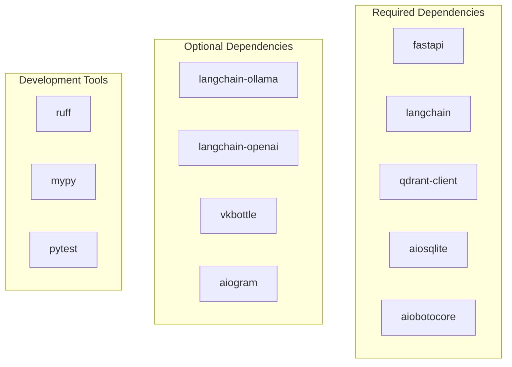

**Diagram sources**
- [pyproject.toml:7-29](file://pyproject.toml#L7-L29)

### Operational Considerations

| Aspect | Recommendation |
|--------|----------------|
| File Size Limits | 50MB maximum per document |
| Concurrent Uploads | Limited by server resources |
| Background Processing | CPU-intensive operations |
| Memory Usage | Depends on document size and chunk count |
| Network Latency | Affects S3 and LLM provider performance |

**Section sources**
- [pyproject.toml:1-61](file://pyproject.toml#L1-L61)
- [app/api/documents.py:62-67](file://app/api/documents.py#L62-L67)