# RAG Client Integration

<cite>
**Referenced Files in This Document**
- [README.md](file://README.md)
- [pyproject.toml](file://pyproject.toml)
- [packages/core/src/cafetera_core/config.py](file://packages/core/src/cafetera_core/config.py)
- [packages/core/src/cafetera_core/rag_client.py](file://packages/core/src/cafetera_core/rag_client.py)
- [packages/core/src/cafetera_core/domain/category_file_service.py](file://packages/core/src/cafetera_core/domain/category_file_service.py)
- [packages/core/src/cafetera_core/storage/category_repo.py](file://packages/core/src/cafetera_core/storage/category_repo.py)
- [packages/core/src/cafetera_core/storage/document_repo.py](file://packages/core/src/cafetera_core/storage/document_repo.py)
- [packages/rag_service/src/cafetera_rag_service/main.py](file://packages/rag_service/src/cafetera_rag_service/main.py)
- [packages/rag_service/src/cafetera_rag_service/api/qa.py](file://packages/rag_service/src/cafetera_rag_service/api/qa.py)
- [packages/rag_service/src/cafetera_rag_service/api/indexing.py](file://packages/rag_service/src/cafetera_rag_service/api/indexing.py)
- [packages/rag_service/src/cafetera_rag_service/api/ingest.py](file://packages/rag_service/src/cafetera_rag_service/api/ingest.py)
- [packages/rag_service/src/cafetera_rag_service/config.py](file://packages/rag_service/src/cafetera_rag_service/config.py)
- [packages/rag_service/src/cafetera_rag_service/models.py](file://packages/rag_service/src/cafetera_rag_service/models.py)
- [packages/rag_service/src/cafetera_rag_service/parser.py](file://packages/rag_service/src/cafetera_rag_service/parser.py)
- [.env.example](file://.env.example)
- [packages/rag_service/src/cafetera_rag_service/rag/chain.py](file://packages/rag_service/src/cafetera_rag_service/rag/chain.py)
- [packages/admin/src/cafetera_admin/domain/document_service.py](file://packages/admin/src/cafetera_admin/domain/document_service.py)
</cite>

## Update Summary
**Changes Made**
- Enhanced RAG client ingest_document method now returns comprehensive metadata including page_count, binary_hash, extracted_title, and status information
- Updated unified document ingestion pipeline documentation to reflect new metadata fields
- Added comprehensive metadata extraction capabilities from document parsing
- Enhanced document indexing configuration with new metadata fields
- Updated API response models to include new metadata fields

## Table of Contents
1. [Introduction](#introduction)
2. [System Architecture](#system-architecture)
3. [Core Components](#core-components)
4. [RAG Client Implementation](#rag-client-implementation)
5. [Integration Points](#integration-points)
6. [API Endpoints](#api-endpoints)
7. [Configuration Management](#configuration-management)
8. [LLM Sampling Parameters](#llm-sampling-parameters)
9. [Data Flow Analysis](#data-flow-analysis)
10. [Performance Considerations](#performance-considerations)
11. [Troubleshooting Guide](#troubleshooting-guide)
12. [Conclusion](#conclusion)

## Introduction

The RAG (Retrieval-Augmented Generation) Client Integration is a critical component of the Cafetera HR Bot ecosystem, serving as the primary interface between the application's frontend services (Admin Panel and VK Bot) and the RAG microservice. This integration enables intelligent document-based question answering capabilities, allowing employees to query HR policies, procedures, and company guidelines through natural language interfaces.

The system operates on a microservices architecture where the RAG Client acts as a thin HTTP client that communicates with a dedicated RAG service running on port 8001. The integration supports both synchronous and streaming responses, enabling real-time conversational experiences while maintaining efficient resource utilization. Recent enhancements include improved error handling for batch operations, new cache invalidation functionality, enhanced streaming response handling, and the addition of unified document ingestion and dynamic search visibility control capabilities.

**Updated** Enhanced RAG client ingest_document method now returns comprehensive metadata including page_count, binary_hash, extracted_title, and status information for improved document tracking and management.

## System Architecture

The RAG Client Integration follows a distributed microservices architecture designed for scalability and maintainability:

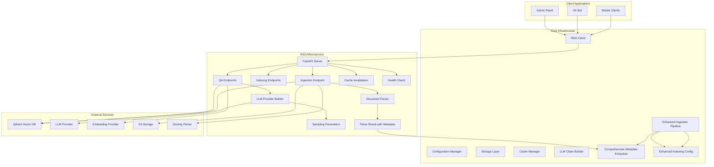

**Diagram sources**
- [packages/core/src/cafetera_core/rag_client.py:15-201](file://packages/core/src/cafetera_core/rag_client.py#L15-L201)
- [packages/rag_service/src/cafetera_rag_service/main.py:39-54](file://packages/rag_service/src/cafetera_rag_service/main.py#L39-L54)
- [packages/rag_service/src/cafetera_rag_service/api/qa.py:22-121](file://packages/rag_service/src/cafetera_rag_service/api/qa.py#L22-L121)
- [packages/rag_service/src/cafetera_rag_service/api/indexing.py:23-222](file://packages/rag_service/src/cafetera_rag_service/api/indexing.py#L23-L222)
- [packages/rag_service/src/cafetera_rag_service/api/ingest.py:21-189](file://packages/rag_service/src/cafetera_rag_service/api/ingest.py#L21-L189)
- [packages/rag_service/src/cafetera_rag_service/rag/chain.py:89-135](file://packages/rag_service/src/cafetera_rag_service/rag/chain.py#L89-L135)
- [packages/rag_service/src/cafetera_rag_service/parser.py:20-28](file://packages/rag_service/src/cafetera_rag_service/parser.py#L20-L28)

The architecture supports three primary LLM providers (Ollama, OpenAI, and llama.cpp) with automatic model downloading capabilities, ensuring flexibility in deployment environments while maintaining consistent API interfaces. The new ingestion pipeline adds S3 storage and Docling parsing capabilities for comprehensive document processing with enhanced metadata extraction.

**Updated** Enhanced with comprehensive metadata extraction pipeline and enhanced indexing configuration capabilities.

## Core Components

### RAG Client Class Structure

The RAG Client implements a comprehensive HTTP client interface with support for multiple interaction patterns and enhanced error handling:

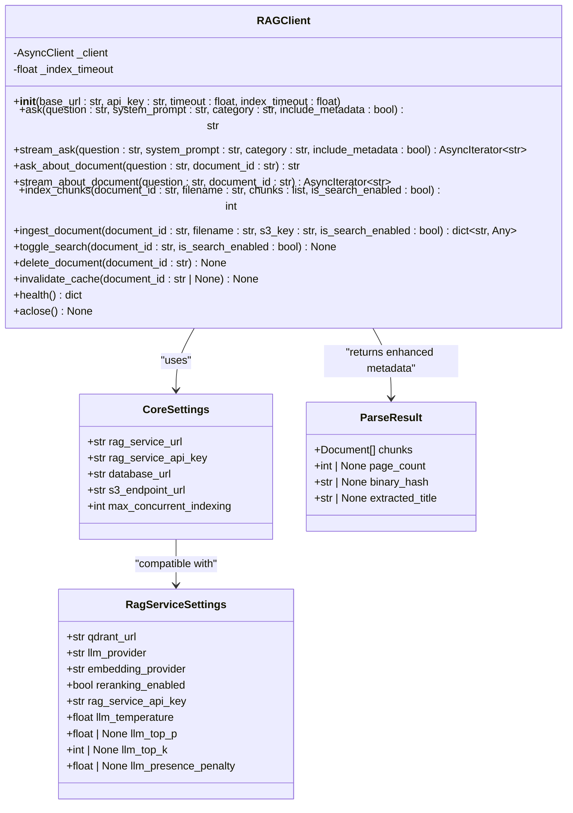

**Diagram sources**
- [packages/core/src/cafetera_core/rag_client.py:15-201](file://packages/core/src/cafetera_core/rag_client.py#L15-L201)
- [packages/core/src/cafetera_core/config.py:14-40](file://packages/core/src/cafetera_core/config.py#L14-L40)
- [packages/rag_service/src/cafetera_rag_service/config.py:8-73](file://packages/rag_service/src/cafetera_rag_service/config.py#L8-L73)
- [packages/rag_service/src/cafetera_rag_service/parser.py:20-28](file://packages/rag_service/src/cafetera_rag_service/parser.py#L20-L28)

### Enhanced Metadata Extraction

The system now provides comprehensive document metadata extraction through the ParseResult dataclass:

| Metadata Field | Type | Description | Availability |
|----------------|------|-------------|--------------|
| `page_count` | int \| None | Total number of pages in the document | Available for supported formats |
| `binary_hash` | str \| None | Unique hash of the document's binary content | Available for all processed documents |
| `extracted_title` | str \| None | Extracted title from document metadata | Available when present in source |
| `chunks` | list[Document] | Processed document chunks with metadata | Always available |

**Updated** Added comprehensive metadata extraction capabilities with new ParseResult dataclass structure.

**Section sources**
- [packages/core/src/cafetera_core/config.py:23-36](file://packages/core/src/cafetera_core/config.py#L23-L36)
- [packages/rag_service/src/cafetera_rag_service/config.py:22-73](file://packages/rag_service/src/cafetera_rag_service/config.py#L22-L73)
- [.env.example:26-41](file://.env.example#L26-L41)
- [packages/rag_service/src/cafetera_rag_service/parser.py:20-28](file://packages/rag_service/src/cafetera_rag_service/parser.py#L20-L28)

## RAG Client Implementation

### HTTP Client Design

The RAG Client utilizes HTTPX for robust asynchronous HTTP communication with configurable timeouts and API key authentication:

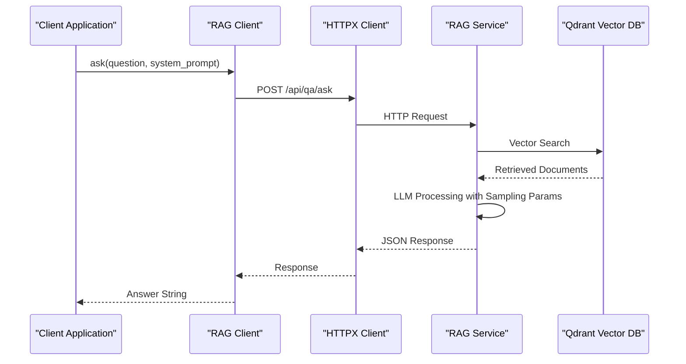

**Diagram sources**
- [packages/core/src/cafetera_core/rag_client.py:34-52](file://packages/core/src/cafetera_core/rag_client.py#L34-L52)
- [packages/rag_service/src/cafetera_rag_service/api/qa.py:54-59](file://packages/rag_service/src/cafetera_rag_service/api/qa.py#L54-L59)

### Enhanced Streaming Response Support

The client implements Server-Sent Events (SSE) for real-time streaming of AI responses with improved error handling:

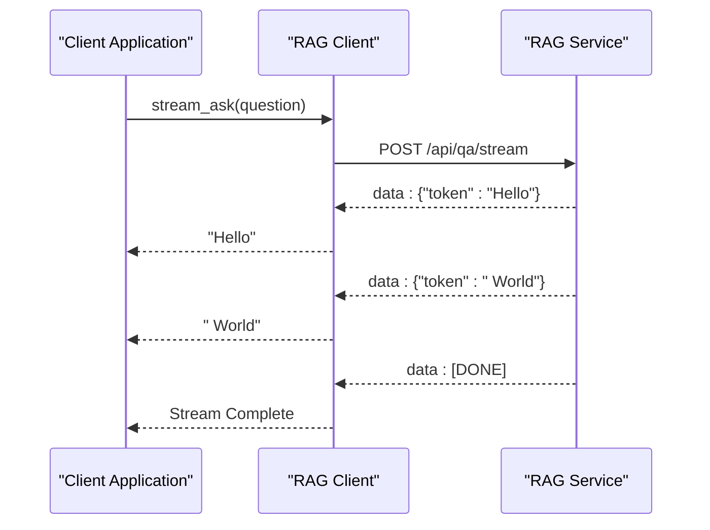

**Diagram sources**
- [packages/core/src/cafetera_core/rag_client.py:54-82](file://packages/core/src/cafetera_core/rag_client.py#L54-L82)
- [packages/rag_service/src/cafetera_rag_service/api/qa.py:62-85](file://packages/rag_service/src/cafetera_rag_service/api/qa.py#L62-L85)

### Unified Document Ingestion Pipeline with Enhanced Metadata

The RAG Client now provides a unified interface for the complete document ingestion pipeline, combining S3 download, parsing, embedding, and indexing into a single operation with comprehensive metadata extraction:

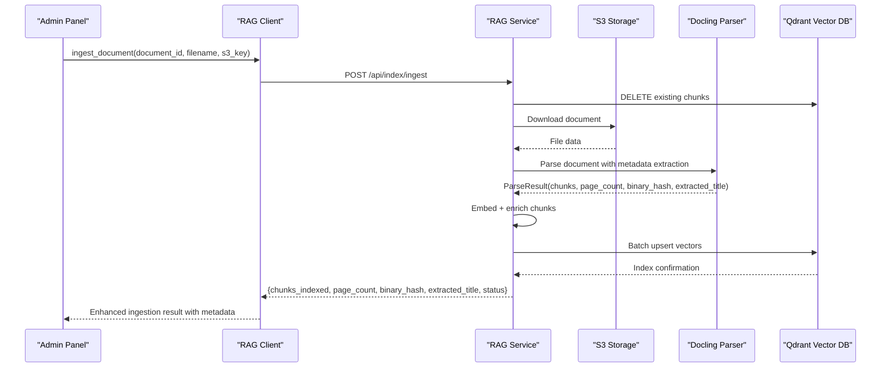

**Diagram sources**
- [packages/core/src/cafetera_core/rag_client.py:133-168](file://packages/core/src/cafetera_core/rag_client.py#L133-L168)
- [packages/rag_service/src/cafetera_rag_service/api/ingest.py:54-189](file://packages/rag_service/src/cafetera_rag_service/api/ingest.py#L54-L189)
- [packages/rag_service/src/cafetera_rag_service/parser.py:20-28](file://packages/rag_service/src/cafetera_rag_service/parser.py#L20-L28)

### Dynamic Search Visibility Control

The RAG Client enables dynamic control over document visibility in search results through the `toggle_search()` method:

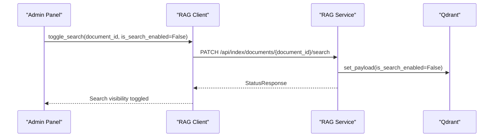

**Diagram sources**
- [packages/core/src/cafetera_core/rag_client.py:170-182](file://packages/core/src/cafetera_core/rag_client.py#L170-L182)
- [packages/rag_service/src/cafetera_rag_service/api/indexing.py:150-199](file://packages/rag_service/src/cafetera_rag_service/api/indexing.py#L150-L199)

**Section sources**
- [packages/core/src/cafetera_core/rag_client.py:15-201](file://packages/core/src/cafetera_core/rag_client.py#L15-L201)

## Integration Points

### Document Management Integration

The RAG Client seamlessly integrates with document management systems through specialized endpoints with enhanced error handling and new unified ingestion capabilities:

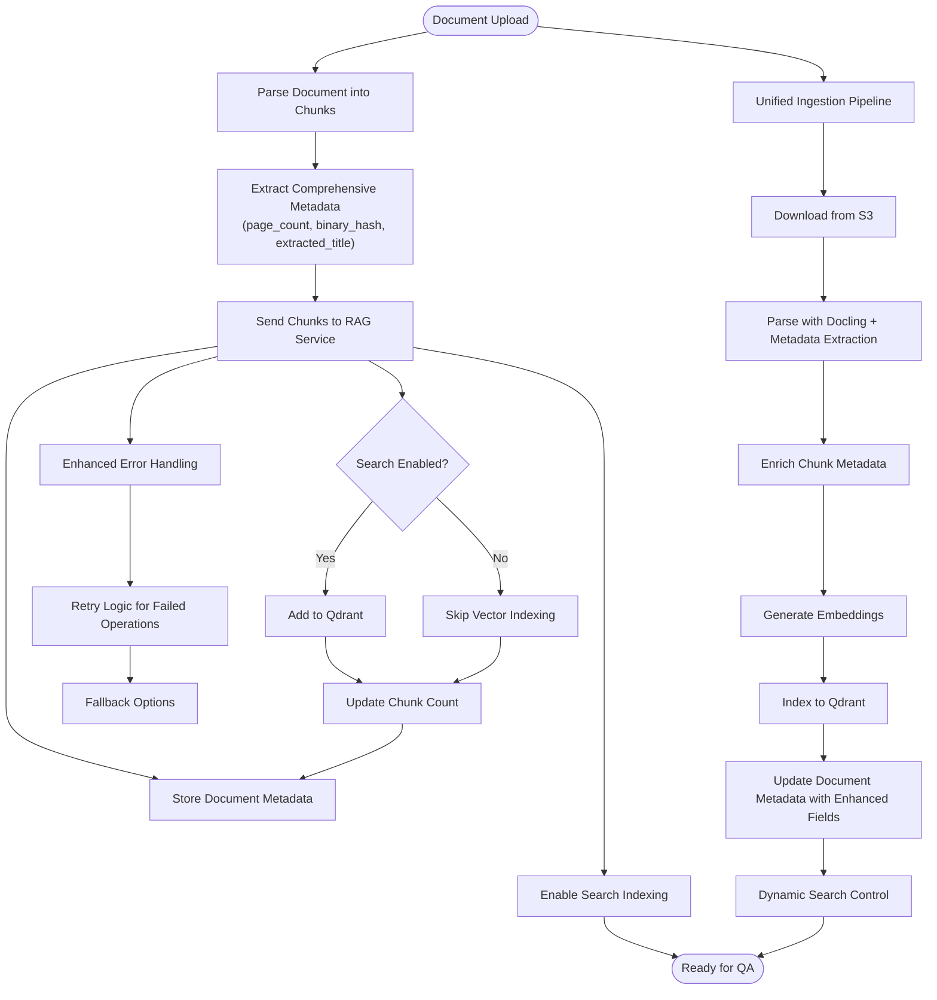

**Diagram sources**
- [packages/core/src/cafetera_core/rag_client.py:112-182](file://packages/core/src/cafetera_core/rag_client.py#L112-L182)
- [packages/core/src/cafetera_core/storage/document_repo.py:75-116](file://packages/core/src/cafetera_core/storage/document_repo.py#L75-L116)
- [packages/rag_service/src/cafetera_rag_service/parser.py:20-28](file://packages/rag_service/src/cafetera_rag_service/parser.py#L20-L28)

### Category File Service Integration

The system integrates with category-based document templates for VK bot functionality:

| Service Method | Purpose | Integration Pattern |
|---------------|---------|-------------------|
| `upload_file()` | Upload category-specific documents | S3 + PostgreSQL coordination |
| `get_file()` | Retrieve template files | Repository lookup + S3 download |
| `delete_file()` | Remove unused templates | Cascade delete (S3 + DB) |
| `download_file()` | Template retrieval | S3 download with error handling |

### Enhanced Indexing Configuration

The Admin Panel now receives comprehensive metadata from the ingestion process:

| Metadata Field | Purpose | Usage in Admin Panel |
|----------------|---------|---------------------|
| `page_count` | Document length indicator | Display document size in UI |
| `binary_hash` | Content uniqueness verification | Detect duplicate documents |
| `extracted_title` | Human-readable document name | Improve document labeling |
| `chunks_indexed` | Processing success indicator | Confirm successful ingestion |

**Section sources**
- [packages/core/src/cafetera_core/domain/category_file_service.py:32-116](file://packages/core/src/cafetera_core/domain/category_file_service.py#L32-L116)
- [packages/admin/src/cafetera_admin/domain/document_service.py:194-216](file://packages/admin/src/cafetera_admin/domain/document_service.py#L194-L216)

## API Endpoints

### QA Service Endpoints

The RAG service exposes four primary endpoints for different interaction patterns with enhanced streaming support:

| Endpoint | Method | Description | Response Format |
|----------|--------|-------------|-----------------|
| `/api/qa/ask` | POST | Single-shot question answering | JSON with answer string |
| `/api/qa/stream` | POST | Streaming question answering | Server-Sent Events |
| `/api/qa/ask-document` | POST | Document-specific queries | JSON with answer string |
| `/api/qa/stream-document` | POST | Streaming document queries | Server-Sent Events |

### Indexing and Cache Management Endpoints

Document processing and cache management endpoints with comprehensive error handling and new unified ingestion capabilities:

| Endpoint | Method | Description | Response Format |
|----------|--------|-------------|-----------------|
| `/api/index/chunks` | POST | Index document chunks | JSON with chunk count |
| `/api/index/ingest` | POST | Full document pipeline (S3 → parse → embed → index) | JSON with enhanced metadata |
| `/api/index/documents/{id}` | DELETE | Remove document from index | No content |
| `/api/index/documents/{id}/search` | PATCH | Toggle document search visibility | StatusResponse |
| `/api/index/cache/invalidate` | POST | Invalidate search cache | StatusResponse |
| `/api/health` | GET | Service health check | JSON status |

### Enhanced Request/Response Models

Enhanced request and response models supporting new functionality:

| Model | Fields | Purpose |
|-------|--------|---------|
| `AskRequest` | `question`, `category`, `system_prompt`, `include_metadata` | QA query parameters |
| `AskDocumentRequest` | `question`, `document_id` | Document-specific QA |
| `IndexChunksRequest` | `document_id`, `filename`, `chunks`, `is_search_enabled` | Document indexing |
| `IngestRequest` | `document_id`, `filename`, `s3_key`, `is_search_enabled` | Unified document ingestion |
| `IngestResponse` | `status`, `chunks_indexed`, `page_count`, `binary_hash`, `extracted_title` | Enhanced ingestion completion |
| `ToggleSearchRequest` | `is_search_enabled` | Search visibility control |
| `InvalidateCacheRequest` | `document_id` | Cache invalidation control |
| `IndexChunksResponse` | `status`, `chunks_indexed` | Indexing completion |
| `StatusResponse` | `status` | Generic operation status |

**Updated** Enhanced IngestResponse model now includes comprehensive metadata fields for improved document tracking.

**Section sources**
- [packages/rag_service/src/cafetera_rag_service/api/qa.py:54-121](file://packages/rag_service/src/cafetera_rag_service/api/qa.py#L54-L121)
- [packages/rag_service/src/cafetera_rag_service/api/indexing.py:25-222](file://packages/rag_service/src/cafetera_rag_service/api/indexing.py#L25-L222)
- [packages/rag_service/src/cafetera_rag_service/api/ingest.py:54-189](file://packages/rag_service/src/cafetera_rag_service/api/ingest.py#L54-L189)
- [packages/rag_service/src/cafetera_rag_service/models.py:10-74](file://packages/rag_service/src/cafetera_rag_service/models.py#L10-L74)
- [packages/core/src/cafetera_core/rag_client.py:133-168](file://packages/core/src/cafetera_core/rag_client.py#L133-L168)

## Configuration Management

### Environment-Based Configuration

The system supports flexible configuration through environment variables with sensible defaults:

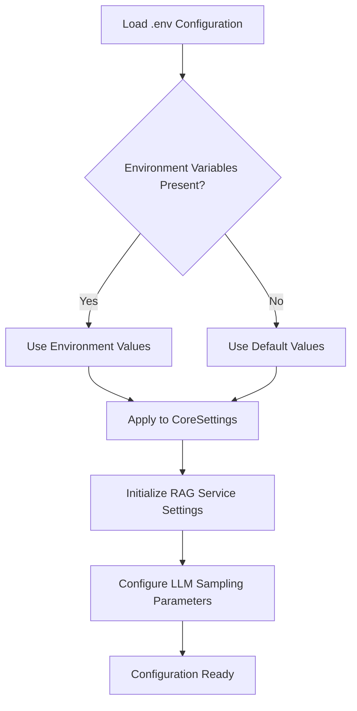

**Diagram sources**
- [packages/core/src/cafetera_core/config.py:21-25](file://packages/core/src/cafetera_core/config.py#L21-L25)
- [packages/rag_service/src/cafetera_rag_service/config.py:16-20](file://packages/rag_service/src/cafetera_rag_service/config.py#L16-L20)

### Provider Configuration Matrix

| Provider | LLM Model | Embedding Model | Base URL | GPU Acceleration |
|----------|-----------|-----------------|----------|------------------|
| Ollama | qwen3.5:4b-q4_K_M | qwen3-embedding:4b-q4_K_M | localhost:11434 | Automatic detection |
| OpenAI | gpt-4o-mini | text-embedding-3-small | api.openai.com | Cloud-based |
| llama.cpp | Custom GGUF | Custom GGUF | localhost:8080/8090 | Manual configuration |

**Updated** Enhanced provider matrix with improved model specifications and GPU acceleration support.

**Section sources**
- [packages/rag_service/src/cafetera_rag_service/config.py:30-48](file://packages/rag_service/src/cafetera_rag_service/config.py#L30-L48)

## LLM Sampling Parameters

### Advanced Generation Controls

The enhanced LLM configuration system now supports comprehensive sampling parameter control for fine-tuned generation quality and behavior:

| Parameter | Type | Default | Provider Support | Description |
|-----------|------|---------|------------------|-------------|
| `llm_temperature` | float | 0.3 | All Providers | Controls randomness (0.0-1.0) |
| `llm_top_p` | float | None | OpenAI, llama.cpp | Nucleus sampling threshold |
| `llm_top_k` | int | None | OpenAI, llama.cpp, Ollama | Top-k sampling limit |
| `llm_presence_penalty` | float | None | OpenAI, llama.cpp | Penalizes repetition |

### Provider-Specific Parameter Handling

Different LLM providers handle sampling parameters differently:

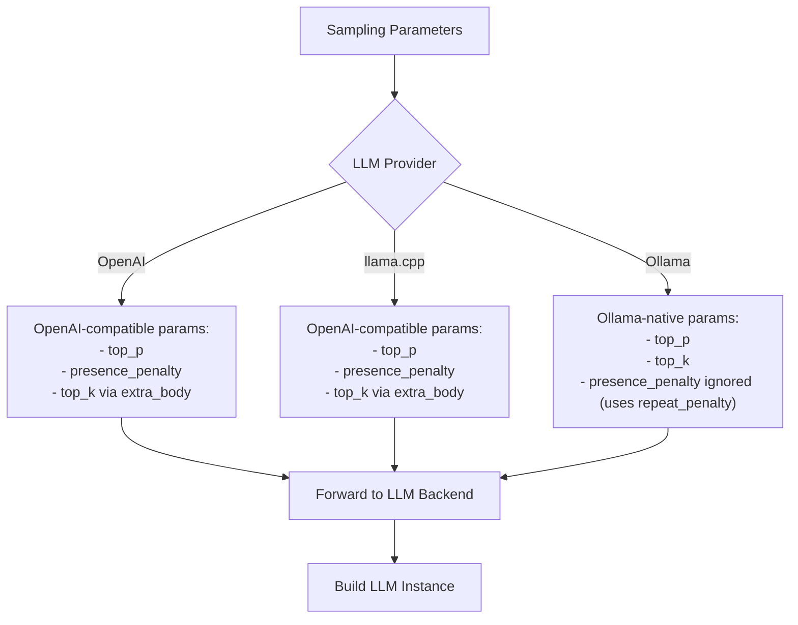

**Diagram sources**
- [packages/rag_service/src/cafetera_rag_service/rag/chain.py:53-86](file://packages/rag_service/src/cafetera_rag_service/rag/chain.py#L53-L86)
- [packages/rag_service/src/cafetera_rag_service/rag/chain.py:89-135](file://packages/rag_service/src/cafetera_rag_service/rag/chain.py#L89-L135)

### Configuration Examples

Example `.env` configurations for different models:

**For T-lite-it-2.1 model:**
```
LLM_TEMPERATURE=0.7
LLM_TOP_P=0.8
LLM_TOP_K=20
LLM_PRESENCE_PENALTY=1.0
```

**For creative content generation:**
```
LLM_TEMPERATURE=0.9
LLM_TOP_P=0.9
LLM_TOP_K=50
```

**For factual responses:**
```
LLM_TEMPERATURE=0.2
LLM_TOP_P=0.7
LLM_PRESENCE_PENALTY=1.5
```

**Section sources**
- [.env.example:26-41](file://.env.example#L26-L41)
- [packages/rag_service/src/cafetera_rag_service/rag/chain.py:53-86](file://packages/rag_service/src/cafetera_rag_service/rag/chain.py#L53-L86)

## Data Flow Analysis

### Question Answering Pipeline

The RAG Client orchestrates a sophisticated data flow for question answering with enhanced caching:

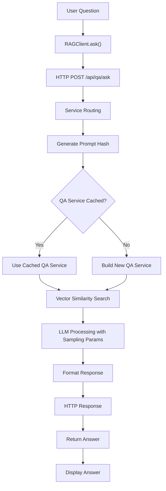

**Diagram sources**
- [packages/core/src/cafetera_core/rag_client.py:34-52](file://packages/core/src/cafetera_core/rag_client.py#L34-L52)
- [packages/rag_service/src/cafetera_rag_service/api/qa.py:25-51](file://packages/rag_service/src/cafetera_rag_service/api/qa.py#L25-L51)

### Unified Document Ingestion Workflow with Enhanced Metadata

The document processing pipeline ensures efficient vector database population with enhanced error handling, comprehensive metadata extraction, and dynamic search control:

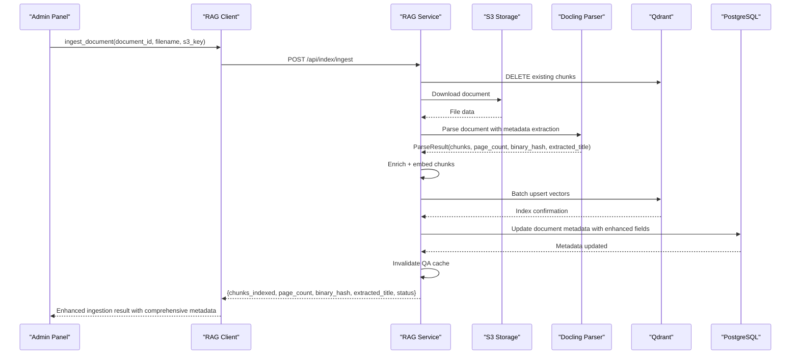

**Diagram sources**
- [packages/core/src/cafetera_core/rag_client.py:133-168](file://packages/core/src/cafetera_core/rag_client.py#L133-L168)
- [packages/rag_service/src/cafetera_rag_service/api/ingest.py:54-189](file://packages/rag_service/src/cafetera_rag_service/api/ingest.py#L54-L189)
- [packages/rag_service/src/cafetera_rag_service/parser.py:20-28](file://packages/rag_service/src/cafetera_rag_service/parser.py#L20-L28)

### Dynamic Search Visibility Workflow

The search visibility control process provides granular control over document discoverability:


**Diagram sources**
- [packages/core/src/cafetera_core/rag_client.py:170-182](file://packages/core/src/cafetera_core/rag_client.py#L170-L182)
- [packages/rag_service/src/cafetera_rag_service/api/indexing.py:150-199](file://packages/rag_service/src/cafetera_rag_service/api/indexing.py#L150-L199)

**Section sources**
- [packages/core/src/cafetera_core/rag_client.py:112-182](file://packages/core/src/cafetera_core/rag_client.py#L112-L182)

## Performance Considerations

### Timeout Configuration

The RAG Client implements tiered timeout strategies to balance responsiveness with processing requirements:

| Operation Type | Standard Timeout | Indexing Timeout | Purpose |
|----------------|------------------|------------------|---------|
| QA Queries | 60.0 seconds | 300.0 seconds | Prevents hanging requests |
| Document Indexing | 300.0 seconds | 600.0 seconds | Handles large document processing with metadata extraction |
| Health Checks | 10.0 seconds | 30.0 seconds | Quick service availability checks |

### Concurrency Management

The system limits concurrent indexing operations to prevent resource exhaustion:

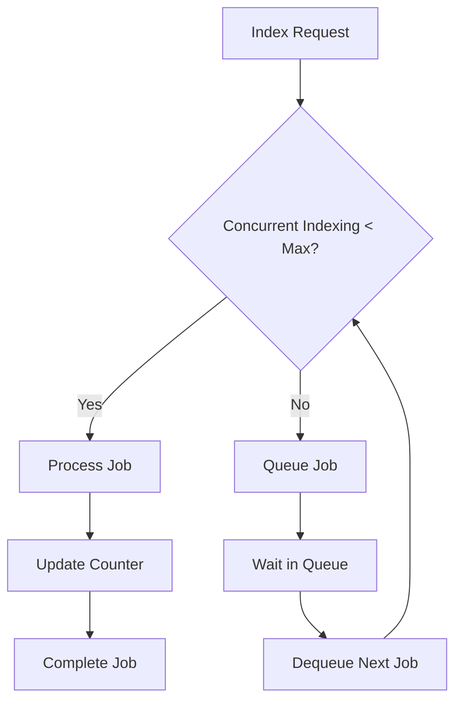

**Diagram sources**
- [packages/core/src/cafetera_core/config.py:35-35](file://packages/core/src/cafetera_core/config.py#L35-L35)

### Enhanced Caching Strategy

The RAG service implements intelligent caching for QA services with improved cache invalidation:

| Cache Type | Key | Eviction Policy | Benefits |
|------------|-----|-----------------|----------|
| QA Service Cache | `(prompt_hash, include_metadata)` | LRU (max 32) | Reduces initialization overhead |
| Vector Cache | Document vectors | TTL-based | Improves search performance |
| Response Cache | Frequently asked questions | Time-based | Reduces repeated processing |

**Updated** Enhanced caching strategy now supports comprehensive metadata-based caching for improved document tracking.

### Metadata Processing Performance

The enhanced metadata extraction process adds minimal overhead to the ingestion pipeline:

- **Page Count Calculation**: O(n) operation on document pages
- **Binary Hash Generation**: Cryptographic hashing with minimal computational cost
- **Title Extraction**: Simple metadata field extraction
- **Chunk Metadata Enrichment**: Adds document-level metadata to each chunk

**Section sources**
- [packages/rag_service/src/cafetera_rag_service/api/qa.py:25-51](file://packages/rag_service/src/cafetera_rag_service/api/qa.py#L25-L51)

## Troubleshooting Guide

### Common Integration Issues

| Issue | Symptoms | Solution |
|-------|----------|----------|
| RAG Service Unavailable | Connection refused on port 8001 | Verify service startup and .env configuration |
| Authentication Failure | 401 errors on API calls | Set RAG_SERVICE_API_KEY environment variable |
| Timeout Errors | Requests taking too long | Adjust timeout values in RAGClient initialization |
| Vector Search Failures | Empty results or slow responses | Check Qdrant connectivity and collection status |
| Cache Invalidation Issues | Stale responses after document updates | Use invalidate_cache endpoint to refresh QA services |
| Ingestion Failures | Document processing errors | Verify S3 credentials and document format compatibility |
| Search Visibility Issues | Documents not appearing in search | Use toggle_search endpoint to enable/disable visibility |
| Sampling Parameter Issues | Unexpected generation behavior | Check provider-specific parameter support and configuration |
| Metadata Extraction Issues | Missing page_count or binary_hash | Verify document format support and parser configuration |

**Updated** Added metadata extraction troubleshooting guidance for new comprehensive metadata fields.

### Debugging Steps

1. **Verify Service Health**: Call `/api/health` endpoint to confirm service availability
2. **Check Network Connectivity**: Ensure port 8001 is accessible from client applications
3. **Validate Authentication**: Confirm API key matches between client and service
4. **Monitor Resource Usage**: Check memory and CPU usage during heavy indexing operations
5. **Test Cache Invalidation**: Use invalidate_cache endpoint to verify cache clearing functionality
6. **Validate Ingestion Pipeline**: Test unified ingestion with small documents first
7. **Check Search Toggles**: Verify search visibility changes propagate correctly
8. **Debug Sampling Parameters**: Verify provider-specific parameter support and configuration
9. **Inspect Metadata Fields**: Verify page_count, binary_hash, and extracted_title are properly extracted
10. **Monitor Ingestion Response**: Check that enhanced metadata is returned in ingest_document responses

### Performance Monitoring

Key metrics to monitor:

- **Response Latency**: Average time for QA queries (target < 2 seconds)
- **Indexing Throughput**: Documents processed per minute during batch operations
- **Vector Database Performance**: Qdrant query response times and collection size
- **Memory Usage**: Monitor client and service memory consumption during peak loads
- **Cache Hit Rate**: Monitor effectiveness of QA service caching strategy
- **Ingestion Pipeline Metrics**: Track S3 download times, parsing performance, metadata extraction, and indexing throughput
- **LLM Generation Quality**: Monitor response consistency with different sampling parameter combinations
- **Metadata Extraction Performance**: Monitor time taken for page_count, binary_hash, and title extraction
- **Enhanced Response Processing**: Monitor time for comprehensive metadata handling in ingestion responses

**Section sources**
- [packages/core/src/cafetera_core/rag_client.py:26-32](file://packages/core/src/cafetera_core/rag_client.py#L26-L32)
- [packages/rag_service/src/cafetera_rag_service/main.py:16-29](file://packages/rag_service/src/cafetera_rag_service/main.py#L16-L29)

## Conclusion

The RAG Client Integration represents a sophisticated solution for enterprise-grade question-answering systems, providing seamless integration between document management, vector databases, and language models. The recent enhancements demonstrate several key architectural improvements:

**Enhanced Reliability**: Improved error handling for batch operations and streaming responses ensures more robust operation under varying load conditions and network conditions.

**Advanced Cache Management**: New cache invalidation functionality provides granular control over QA service caching, enabling administrators to refresh cached responses when document content changes.

**Improved Streaming Support**: Enhanced streaming response handling with better error recovery and SSE event processing provides more reliable real-time conversational experiences.

**Unified Ingestion Pipeline**: New `ingest_document()` method provides a complete document processing workflow from S3 storage to vector database indexing, simplifying document management operations.

**Dynamic Search Control**: New `toggle_search()` method enables real-time control over document visibility in search results, allowing administrators to quickly adjust document discoverability.

**Enhanced LLM Configuration**: New sampling parameters (temperature, top_p, top_k, presence_penalty) provide fine-grained control over generation behavior across different LLM providers.

**Provider-Specific Optimization**: Improved client integration with provider-specific parameter handling ensures optimal performance and behavior across Ollama, OpenAI, and llama.cpp deployments.

**Comprehensive Metadata Extraction**: New ParseResult dataclass provides rich document metadata including page_count, binary_hash, and extracted_title for enhanced document tracking and management.

**Enhanced Indexing Configuration**: Improved indexing configuration with comprehensive metadata fields enables better document organization and search capabilities.

**Scalability**: The microservices architecture allows independent scaling of components based on demand, with the RAG service capable of handling multiple concurrent QA sessions and document processing operations.

**Flexibility**: Support for multiple LLM providers (Ollama, OpenAI, llama.cpp) ensures deployment flexibility across different infrastructure requirements and cost models.

**Maintainability**: Clean separation of concerns between the RAG Client, document management, and service configuration enables easy updates and modifications without disrupting core functionality.

**Enhanced Document Management**: The comprehensive metadata extraction capabilities significantly improve document tracking, duplicate detection, and content organization within the system.

The integration successfully bridges the gap between human-readable HR documentation and intelligent AI-powered search, enabling organizations to leverage their knowledge assets more effectively while maintaining security and performance standards.

**Updated** Enhanced conclusion to highlight the new comprehensive metadata extraction capabilities and enhanced indexing configuration features.

Future enhancements could include advanced caching strategies, distributed indexing capabilities, enhanced monitoring and alerting systems, expanded cache invalidation options for more granular control over the QA service lifecycle, additional document format support for the unified ingestion pipeline, expanded provider-specific optimization for emerging LLM platforms, and integration of the new metadata fields into advanced document analytics and reporting systems.