# RAG Client Integration

<cite>
**Referenced Files in This Document**
- [README.md](file://README.md)
- [pyproject.toml](file://pyproject.toml)
- [packages/core/src/cafetera_core/config.py](file://packages/core/src/cafetera_core/config.py)
- [packages/core/src/cafetera_core/rag_client.py](file://packages/core/src/cafetera_core/rag_client.py)
- [packages/core/src/cafetera_core/domain/category_file_service.py](file://packages/core/src/cafetera_core/domain/category_file_service.py)
- [packages/core/src/cafetera_core/storage/category_repo.py](file://packages/core/src/cafetera_core/storage/category_repo.py)
- [packages/core/src/cafetera_core/storage/document_repo.py](file://packages/core/src/cafetera_core/storage/document_repo.py)
- [packages/rag_service/src/cafetera_rag_service/main.py](file://packages/rag_service/src/cafetera_rag_service/main.py)
- [packages/rag_service/src/cafetera_rag_service/api/qa.py](file://packages/rag_service/src/cafetera_rag_service/api/qa.py)
- [packages/rag_service/src/cafetera_rag_service/api/indexing.py](file://packages/rag_service/src/cafetera_rag_service/api/indexing.py)
- [packages/rag_service/src/cafetera_rag_service/api/ingest.py](file://packages/rag_service/src/cafetera_rag_service/api/ingest.py)
- [packages/rag_service/src/cafetera_rag_service/config.py](file://packages/rag_service/src/cafetera_rag_service/config.py)
- [packages/rag_service/src/cafetera_rag_service/models.py](file://packages/rag_service/src/cafetera_rag_service/models.py)
</cite>

## Update Summary
**Changes Made**
- Added documentation for new `ingest_document()` method providing unified ingestion pipeline
- Added documentation for new `toggle_search()` method enabling dynamic document visibility control
- Updated API endpoint documentation to include new ingestion and search toggle endpoints
- Enhanced document management workflow documentation with complete ingestion pipeline
- Updated data flow analysis to reflect new unified ingestion capabilities

## Table of Contents
1. [Introduction](#introduction)
2. [System Architecture](#system-architecture)
3. [Core Components](#core-components)
4. [RAG Client Implementation](#rag-client-implementation)
5. [Integration Points](#integration-points)
6. [API Endpoints](#api-endpoints)
7. [Configuration Management](#configuration-management)
8. [Data Flow Analysis](#data-flow-analysis)
9. [Performance Considerations](#performance-considerations)
10. [Troubleshooting Guide](#troubleshooting-guide)
11. [Conclusion](#conclusion)

## Introduction

The RAG (Retrieval-Augmented Generation) Client Integration is a critical component of the Cafetera HR Bot ecosystem, serving as the primary interface between the application's frontend services (Admin Panel and VK Bot) and the RAG microservice. This integration enables intelligent document-based question answering capabilities, allowing employees to query HR policies, procedures, and company guidelines through natural language interfaces.

The system operates on a microservices architecture where the RAG Client acts as a thin HTTP client that communicates with a dedicated RAG service running on port 8001. The integration supports both synchronous and streaming responses, enabling real-time conversational experiences while maintaining efficient resource utilization. Recent enhancements include improved error handling for batch operations, new cache invalidation functionality, enhanced streaming response handling, and the addition of unified document ingestion and dynamic search visibility control capabilities.

## System Architecture

The RAG Client Integration follows a distributed microservices architecture designed for scalability and maintainability:

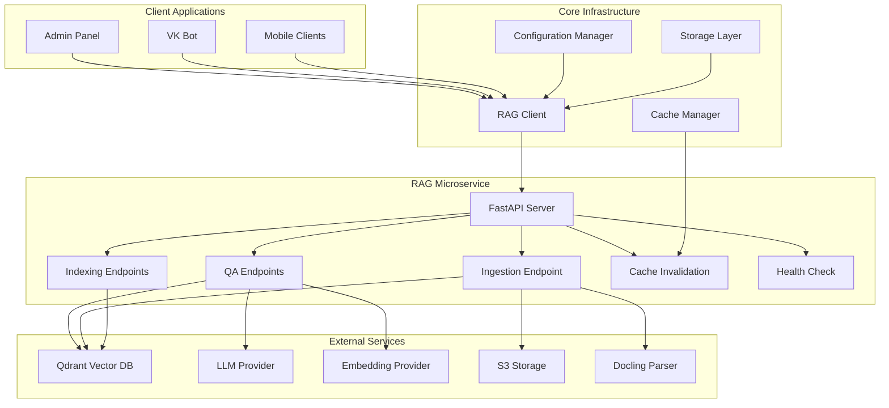

**Diagram sources**
- [packages/core/src/cafetera_core/rag_client.py:15-193](file://packages/core/src/cafetera_core/rag_client.py#L15-L193)
- [packages/rag_service/src/cafetera_rag_service/main.py:39-54](file://packages/rag_service/src/cafetera_rag_service/main.py#L39-L54)
- [packages/rag_service/src/cafetera_rag_service/api/qa.py:22-121](file://packages/rag_service/src/cafetera_rag_service/api/qa.py#L22-L121)
- [packages/rag_service/src/cafetera_rag_service/api/indexing.py:23-222](file://packages/rag_service/src/cafetera_rag_service/api/indexing.py#L23-222)
- [packages/rag_service/src/cafetera_rag_service/api/ingest.py:21-188](file://packages/rag_service/src/cafetera_rag_service/api/ingest.py#L21-188)

The architecture supports three primary LLM providers (Ollama, OpenAI, and llama.cpp) with automatic model downloading capabilities, ensuring flexibility in deployment environments while maintaining consistent API interfaces. The new ingestion pipeline adds S3 storage and Docling parsing capabilities for comprehensive document processing.

## Core Components

### RAG Client Class Structure

The RAG Client implements a comprehensive HTTP client interface with support for multiple interaction patterns and enhanced error handling:

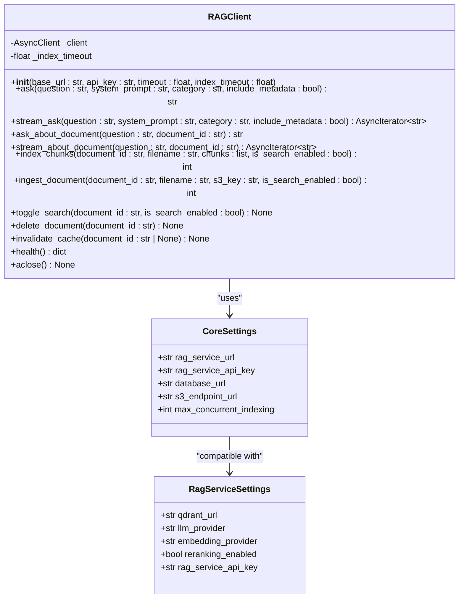

**Diagram sources**
- [packages/core/src/cafetera_core/rag_client.py:15-193](file://packages/core/src/cafetera_core/rag_client.py#L15-L193)
- [packages/core/src/cafetera_core/config.py:14-40](file://packages/core/src/cafetera_core/config.py#L14-L40)
- [packages/rag_service/src/cafetera_rag_service/config.py:8-55](file://packages/rag_service/src/cafetera_rag_service/config.py#L8-L55)

### Configuration Management

The system employs a dual-configuration approach supporting both shared core settings and service-specific configurations:

| Configuration Type | Purpose | Environment Variables | Default Values |
|-------------------|---------|----------------------|----------------|
| Core Settings | Shared across all packages | `RAG_SERVICE_URL`, `RAG_SERVICE_API_KEY` | Localhost:8001, empty |
| RAG Service Settings | Service-specific | `QDRANT_URL`, `LLM_PROVIDER` | Localhost:6333, Ollama |
| Authentication | API security | `RAG_SERVICE_API_KEY` | Empty (unauthenticated) |

**Section sources**
- [packages/core/src/cafetera_core/config.py:23-36](file://packages/core/src/cafetera_core/config.py#L23-L36)
- [packages/rag_service/src/cafetera_rag_service/config.py:22-55](file://packages/rag_service/src/cafetera_rag_service/config.py#L22-L55)

## RAG Client Implementation

### HTTP Client Design

The RAG Client utilizes HTTPX for robust asynchronous HTTP communication with configurable timeouts and API key authentication:

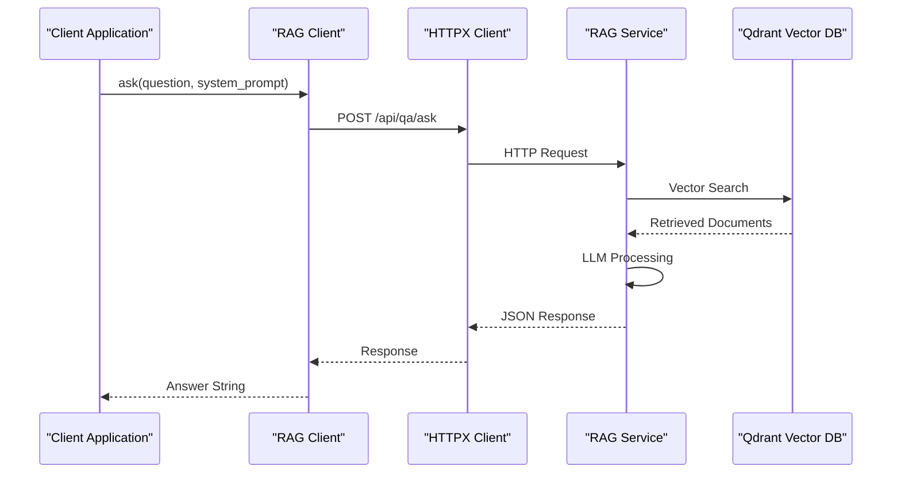

**Diagram sources**
- [packages/core/src/cafetera_core/rag_client.py:34-52](file://packages/core/src/cafetera_core/rag_client.py#L34-L52)
- [packages/rag_service/src/cafetera_rag_service/api/qa.py:54-59](file://packages/rag_service/src/cafetera_rag_service/api/qa.py#L54-L59)

### Enhanced Streaming Response Support

The client implements Server-Sent Events (SSE) for real-time streaming of AI responses with improved error handling:

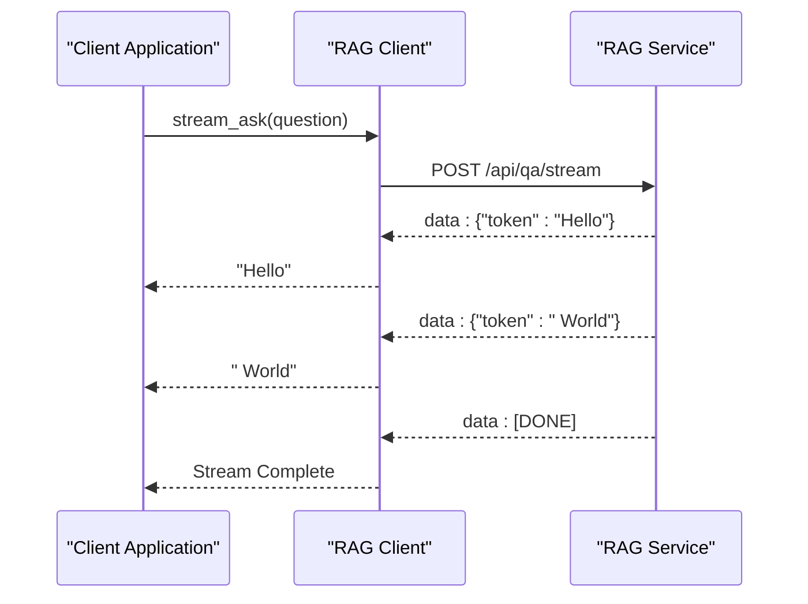

**Diagram sources**
- [packages/core/src/cafetera_core/rag_client.py:54-82](file://packages/core/src/cafetera_core/rag_client.py#L54-L82)
- [packages/rag_service/src/cafetera_rag_service/api/qa.py:62-85](file://packages/rag_service/src/cafetera_rag_service/api/qa.py#L62-L85)

### Unified Document Ingestion Pipeline

The RAG Client now provides a unified interface for the complete document ingestion pipeline, combining S3 download, parsing, embedding, and indexing into a single operation:

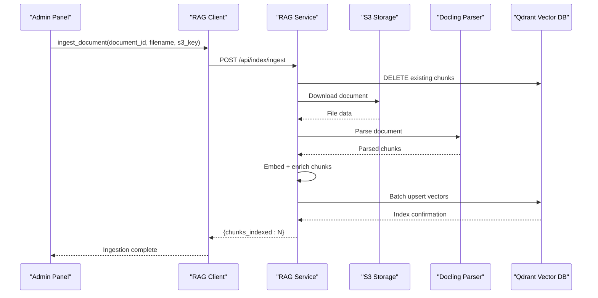

**Diagram sources**
- [packages/core/src/cafetera_core/rag_client.py:133-160](file://packages/core/src/cafetera_core/rag_client.py#L133-L160)
- [packages/rag_service/src/cafetera_rag_service/api/ingest.py:64-188](file://packages/rag_service/src/cafetera_rag_service/api/ingest.py#L64-188)

### Dynamic Search Visibility Control

The RAG Client enables dynamic control over document visibility in search results through the `toggle_search()` method:

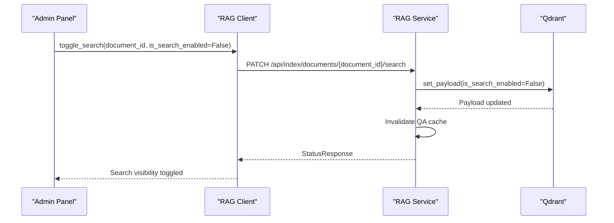

**Diagram sources**
- [packages/core/src/cafetera_core/rag_client.py:162-173](file://packages/core/src/cafetera_core/rag_client.py#L162-L173)
- [packages/rag_service/src/cafetera_rag_service/api/indexing.py:150-199](file://packages/rag_service/src/cafetera_rag_service/api/indexing.py#L150-199)

**Section sources**
- [packages/core/src/cafetera_core/rag_client.py:15-193](file://packages/core/src/cafetera_core/rag_client.py#L15-L193)

## Integration Points

### Document Management Integration

The RAG Client seamlessly integrates with document management systems through specialized endpoints with enhanced error handling and new unified ingestion capabilities:

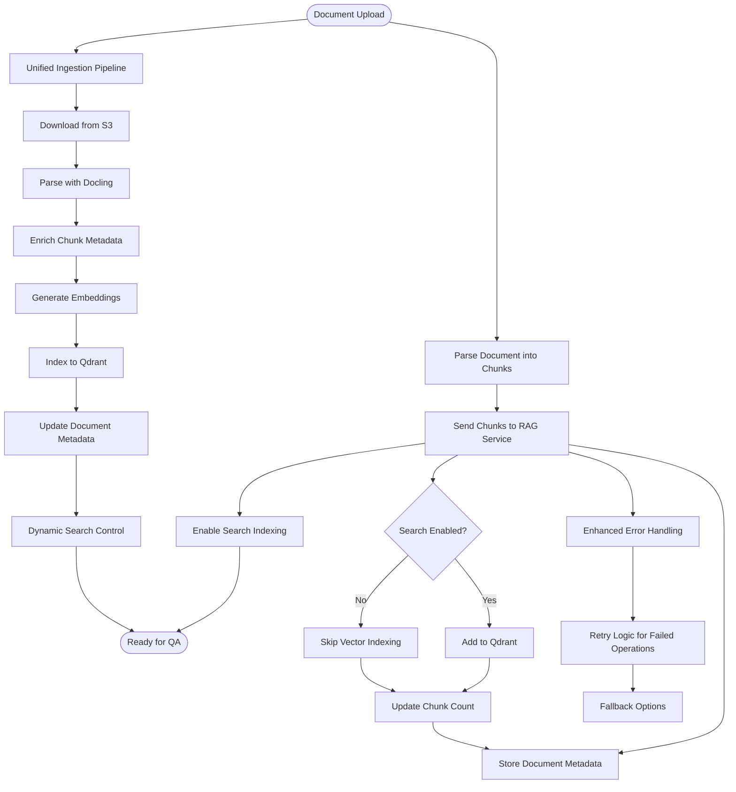

**Diagram sources**
- [packages/core/src/cafetera_core/rag_client.py:112-173](file://packages/core/src/cafetera_core/rag_client.py#L112-L173)
- [packages/core/src/cafetera_core/storage/document_repo.py:75-116](file://packages/core/src/cafetera_core/storage/document_repo.py#L75-L116)

### Category File Service Integration

The system integrates with category-based document templates for VK bot functionality:

| Service Method | Purpose | Integration Pattern |
|---------------|---------|-------------------|
| `upload_file()` | Upload category-specific documents | S3 + PostgreSQL coordination |
| `get_file()` | Retrieve template files | Repository lookup + S3 download |
| `delete_file()` | Remove unused templates | Cascade delete (S3 + DB) |
| `download_file()` | Template retrieval | S3 download with error handling |

**Section sources**
- [packages/core/src/cafetera_core/domain/category_file_service.py:32-116](file://packages/core/src/cafetera_core/domain/category_file_service.py#L32-L116)

## API Endpoints

### QA Service Endpoints

The RAG service exposes four primary endpoints for different interaction patterns with enhanced streaming support:

| Endpoint | Method | Description | Response Format |
|----------|--------|-------------|-----------------|
| `/api/qa/ask` | POST | Single-shot question answering | JSON with answer string |
| `/api/qa/stream` | POST | Streaming question answering | Server-Sent Events |
| `/api/qa/ask-document` | POST | Document-specific queries | JSON with answer string |
| `/api/qa/stream-document` | POST | Streaming document queries | Server-Sent Events |

### Indexing and Cache Management Endpoints

Document processing and cache management endpoints with comprehensive error handling and new unified ingestion capabilities:

| Endpoint | Method | Description | Response Format |
|----------|--------|-------------|-----------------|
| `/api/index/chunks` | POST | Index document chunks | JSON with chunk count |
| `/api/index/ingest` | POST | Full document pipeline (S3 → parse → embed → index) | JSON with chunk count |
| `/api/index/documents/{id}` | DELETE | Remove document from index | No content |
| `/api/index/documents/{id}/search` | PATCH | Toggle document search visibility | StatusResponse |
| `/api/index/cache/invalidate` | POST | Invalidate search cache | StatusResponse |
| `/api/health` | GET | Service health check | JSON status |

### Request/Response Models

Enhanced request and response models supporting new functionality:

| Model | Fields | Purpose |
|-------|--------|---------|
| `AskRequest` | `question`, `category`, `system_prompt`, `include_metadata` | QA query parameters |
| `AskDocumentRequest` | `question`, `document_id` | Document-specific QA |
| `IndexChunksRequest` | `document_id`, `filename`, `chunks`, `is_search_enabled` | Document indexing |
| `IngestRequest` | `document_id`, `filename`, `s3_key`, `is_search_enabled` | Unified document ingestion |
| `ToggleSearchRequest` | `is_search_enabled` | Search visibility control |
| `InvalidateCacheRequest` | `document_id` | Cache invalidation control |
| `IndexChunksResponse` | `status`, `chunks_indexed` | Indexing completion |
| `IngestResponse` | `status`, `chunks_indexed` | Ingestion completion |
| `StatusResponse` | `status` | Generic operation status |

**Section sources**
- [packages/rag_service/src/cafetera_rag_service/api/qa.py:54-121](file://packages/rag_service/src/cafetera_rag_service/api/qa.py#L54-L121)
- [packages/rag_service/src/cafetera_rag_service/api/indexing.py:25-222](file://packages/rag_service/src/cafetera_rag_service/api/indexing.py#L25-L222)
- [packages/rag_service/src/cafetera_rag_service/api/ingest.py:64-188](file://packages/rag_service/src/cafetera_rag_service/api/ingest.py#L64-L188)
- [packages/rag_service/src/cafetera_rag_service/models.py:10-71](file://packages/rag_service/src/cafetera_rag_service/models.py#L10-L71)
- [packages/core/src/cafetera_core/rag_client.py:112-173](file://packages/core/src/cafetera_core/rag_client.py#L112-L173)

## Configuration Management

### Environment-Based Configuration

The system supports flexible configuration through environment variables with sensible defaults:

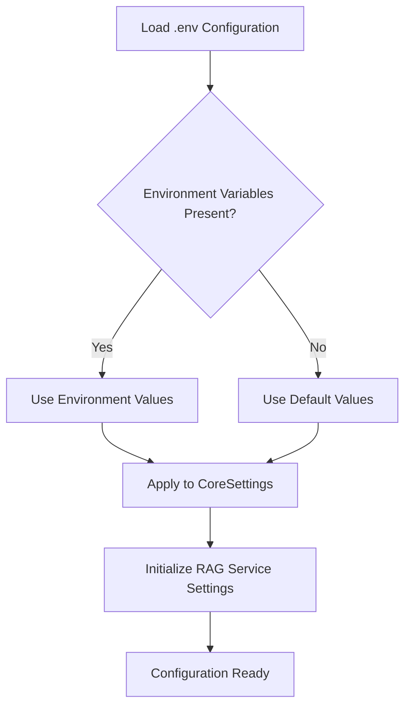

**Diagram sources**
- [packages/core/src/cafetera_core/config.py:21-25](file://packages/core/src/cafetera_core/config.py#L21-L25)
- [packages/rag_service/src/cafetera_rag_service/config.py:16-20](file://packages/rag_service/src/cafetera_rag_service/config.py#L16-L20)

### Provider Configuration Matrix

| Provider | LLM Model | Embedding Model | Base URL | GPU Acceleration |
|----------|-----------|-----------------|----------|------------------|
| Ollama | qwen3.5:4b-q4_K_M | qwen3-embedding:4b-q4_K_M | localhost:11434 | Automatic detection |
| OpenAI | gpt-4o-mini | text-embedding-3-small | api.openai.com | Cloud-based |
| llama.cpp | Custom GGUF | Custom GGUF | localhost:8080/8090 | Manual configuration |

**Section sources**
- [packages/rag_service/src/cafetera_rag_service/config.py:30-48](file://packages/rag_service/src/cafetera_rag_service/config.py#L30-L48)

## Data Flow Analysis

### Question Answering Pipeline

The RAG Client orchestrates a sophisticated data flow for question answering with enhanced caching:

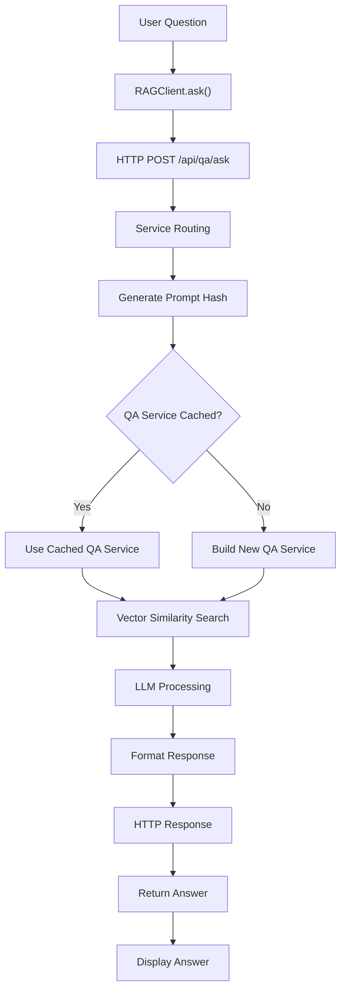

**Diagram sources**
- [packages/core/src/cafetera_core/rag_client.py:34-52](file://packages/core/src/cafetera_core/rag_client.py#L34-L52)
- [packages/rag_service/src/cafetera_rag_service/api/qa.py:25-51](file://packages/rag_service/src/cafetera_rag_service/api/qa.py#L25-L51)

### Unified Document Ingestion Workflow

The document processing pipeline ensures efficient vector database population with enhanced error handling and dynamic search control:

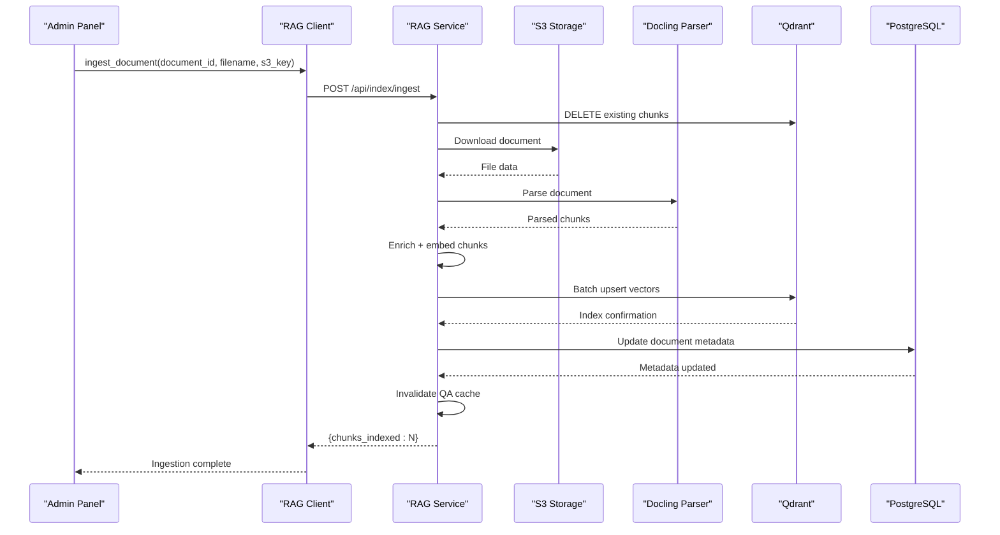

**Diagram sources**
- [packages/core/src/cafetera_core/rag_client.py:133-160](file://packages/core/src/cafetera_core/rag_client.py#L133-L160)
- [packages/rag_service/src/cafetera_rag_service/api/ingest.py:64-188](file://packages/rag_service/src/cafetera_rag_service/api/ingest.py#L64-188)

### Dynamic Search Visibility Workflow

The search visibility control process provides granular control over document discoverability:

**Diagram sources**
- [packages/core/src/cafetera_core/rag_client.py:162-173](file://packages/core/src/cafetera_core/rag_client.py#L162-L173)
- [packages/rag_service/src/cafetera_rag_service/api/indexing.py:150-199](file://packages/rag_service/src/cafetera_rag_service/api/indexing.py#L150-199)

**Section sources**
- [packages/core/src/cafetera_core/rag_client.py:112-173](file://packages/core/src/cafetera_core/rag_client.py#L112-L173)

## Performance Considerations

### Timeout Configuration

The RAG Client implements tiered timeout strategies to balance responsiveness with processing requirements:

| Operation Type | Standard Timeout | Indexing Timeout | Purpose |
|----------------|------------------|------------------|---------|
| QA Queries | 60.0 seconds | 300.0 seconds | Prevents hanging requests |
| Document Indexing | 300.0 seconds | 600.0 seconds | Handles large document processing |
| Health Checks | 10.0 seconds | 30.0 seconds | Quick service availability checks |

### Concurrency Management

The system limits concurrent indexing operations to prevent resource exhaustion:

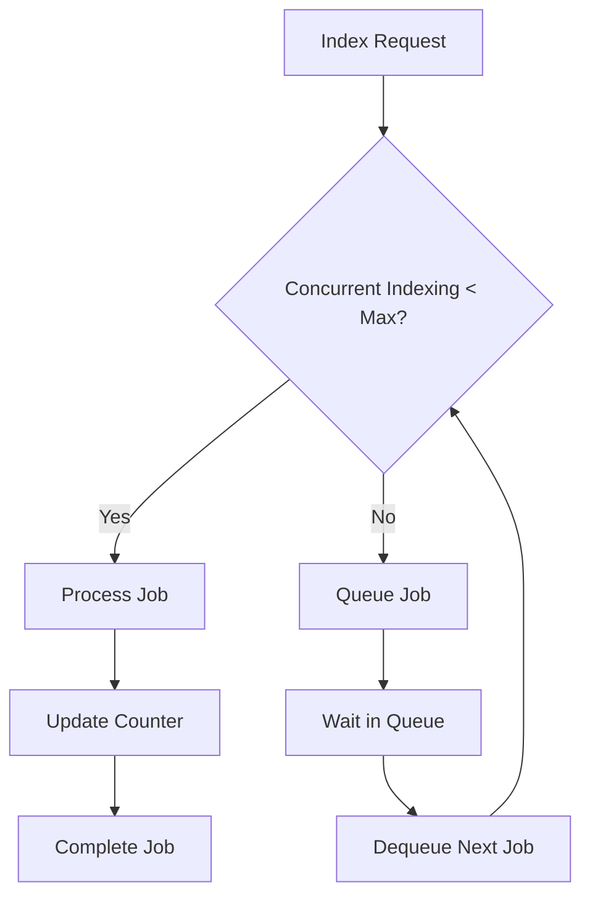

**Diagram sources**
- [packages/core/src/cafetera_core/config.py:35-35](file://packages/core/src/cafetera_core/config.py#L35-L35)

### Enhanced Caching Strategy

The RAG service implements intelligent caching for QA services with improved cache invalidation:

| Cache Type | Key | Eviction Policy | Benefits |
|------------|-----|-----------------|----------|
| QA Service Cache | `(prompt_hash, include_metadata)` | LRU (max 32) | Reduces initialization overhead |
| Vector Cache | Document vectors | TTL-based | Improves search performance |
| Response Cache | Frequently asked questions | Time-based | Reduces repeated processing |

**Section sources**
- [packages/rag_service/src/cafetera_rag_service/api/qa.py:25-51](file://packages/rag_service/src/cafetera_rag_service/api/qa.py#L25-L51)

## Troubleshooting Guide

### Common Integration Issues

| Issue | Symptoms | Solution |
|-------|----------|----------|
| RAG Service Unavailable | Connection refused on port 8001 | Verify service startup and .env configuration |
| Authentication Failure | 401 errors on API calls | Set RAG_SERVICE_API_KEY environment variable |
| Timeout Errors | Requests taking too long | Adjust timeout values in RAGClient initialization |
| Vector Search Failures | Empty results or slow responses | Check Qdrant connectivity and collection status |
| Cache Invalidation Issues | Stale responses after document updates | Use invalidate_cache endpoint to refresh QA services |
| Ingestion Failures | Document processing errors | Verify S3 credentials and document format compatibility |
| Search Visibility Issues | Documents not appearing in search | Use toggle_search endpoint to enable/disable visibility |

### Debugging Steps

1. **Verify Service Health**: Call `/api/health` endpoint to confirm service availability
2. **Check Network Connectivity**: Ensure port 8001 is accessible from client applications
3. **Validate Authentication**: Confirm API key matches between client and service
4. **Monitor Resource Usage**: Check memory and CPU usage during heavy indexing operations
5. **Test Cache Invalidation**: Use invalidate_cache endpoint to verify cache clearing functionality
6. **Validate Ingestion Pipeline**: Test unified ingestion with small documents first
7. **Check Search Toggles**: Verify search visibility changes propagate correctly

### Performance Monitoring

Key metrics to monitor:

- **Response Latency**: Average time for QA queries (target < 2 seconds)
- **Indexing Throughput**: Documents processed per minute during batch operations
- **Vector Database Performance**: Qdrant query response times and collection size
- **Memory Usage**: Monitor client and service memory consumption during peak loads
- **Cache Hit Rate**: Monitor effectiveness of QA service caching strategy
- **Ingestion Pipeline Metrics**: Track S3 download times, parsing performance, and indexing throughput

**Section sources**
- [packages/core/src/cafetera_core/rag_client.py:26-32](file://packages/core/src/cafetera_core/rag_client.py#L26-L32)
- [packages/rag_service/src/cafetera_rag_service/main.py:16-29](file://packages/rag_service/src/cafetera_rag_service/main.py#L16-L29)

## Conclusion

The RAG Client Integration represents a sophisticated solution for enterprise-grade question-answering systems, providing seamless integration between document management, vector databases, and language models. The recent enhancements demonstrate several key architectural improvements:

**Enhanced Reliability**: Improved error handling for batch operations and streaming responses ensures more robust operation under varying load conditions and network conditions.

**Advanced Cache Management**: New cache invalidation functionality provides granular control over QA service caching, enabling administrators to refresh cached responses when document content changes.

**Improved Streaming Support**: Enhanced streaming response handling with better error recovery and SSE event processing provides more reliable real-time conversational experiences.

**Unified Ingestion Pipeline**: New `ingest_document()` method provides a complete document processing workflow from S3 storage to vector database indexing, simplifying document management operations.

**Dynamic Search Control**: New `toggle_search()` method enables real-time control over document visibility in search results, allowing administrators to quickly adjust document discoverability.

**Scalability**: The microservices architecture allows independent scaling of components based on demand, with the RAG service capable of handling multiple concurrent QA sessions and document processing operations.

**Flexibility**: Support for multiple LLM providers (Ollama, OpenAI, llama.cpp) ensures deployment flexibility across different infrastructure requirements and cost models.

**Maintainability**: Clean separation of concerns between the RAG Client, document management, and service configuration enables easy updates and modifications without disrupting core functionality.

The integration successfully bridges the gap between human-readable HR documentation and intelligent AI-powered search, enabling organizations to leverage their knowledge assets more effectively while maintaining security and performance standards.

Future enhancements could include advanced caching strategies, distributed indexing capabilities, enhanced monitoring and alerting systems, expanded cache invalidation options for more granular control over the QA service lifecycle, and additional document format support for the unified ingestion pipeline.