# RAG Microservice Architecture

<cite>
**Referenced Files in This Document**
- [README.md](file://README.md)
- [pyproject.toml](file://pyproject.toml)
- [docker-compose.yml](file://docker-compose.yml)
- [Dockerfile.rag_service](file://Dockerfile.rag_service)
- [packages/core/pyproject.toml](file://packages/core/pyproject.toml)
- [packages/admin/pyproject.toml](file://packages/admin/pyproject.toml)
- [packages/rag_service/pyproject.toml](file://packages/rag_service/pyproject.toml)
- [packages/vk_bot/pyproject.toml](file://packages/vk_bot/pyproject.toml)
- [packages/core/src/cafetera_core/config.py](file://packages/core/src/cafetera_core/config.py)
- [packages/core/src/cafetera_core/rag_client.py](file://packages/core/src/cafetera_core/rag_client.py)
- [packages/rag_service/src/cafetera_rag_service/main.py](file://packages/rag_service/src/cafetera_rag_service/main.py)
- [packages/rag_service/src/cafetera_rag_service/server.py](file://packages/rag_service/src/cafetera_rag_service/server.py)
- [packages/rag_service/src/cafetera_rag_service/api/health.py](file://packages/rag_service/src/cafetera_rag_service/api/health.py)
- [packages/rag_service/src/cafetera_rag_service/api/qa.py](file://packages/rag_service/src/cafetera_rag_service/api/qa.py)
- [packages/rag_service/src/cafetera_rag_service/api/indexing.py](file://packages/rag_service/src/cafetera_rag_service/api/indexing.py)
- [packages/rag_service/src/cafetera_rag_service/api/ingest.py](file://packages/rag_service/src/cafetera_rag_service/api/ingest.py)
- [packages/rag_service/src/cafetera_rag_service/api/deps.py](file://packages/rag_service/src/cafetera_rag_service/api/deps.py)
- [packages/rag_service/src/cafetera_rag_service/rag/chain.py](file://packages/rag_service/src/cafetera_rag_service/rag/chain.py)
- [packages/rag_service/src/cafetera_rag_service/rag/retriever.py](file://packages/rag_service/src/cafetera_rag_service/rag/retriever.py)
- [packages/rag_service/src/cafetera_rag_service/rag/reranker.py](file://packages/rag_service/src/cafetera_rag_service/rag/reranker.py)
- [packages/rag_service/src/cafetera_rag_service/qa_service.py](file://packages/rag_service/src/cafetera_rag_service/qa_service.py)
- [packages/rag_service/src/cafetera_rag_service/models.py](file://packages/rag_service/src/cafetera_rag_service/models.py)
- [packages/rag_service/src/cafetera_rag_service/config.py](file://packages/rag_service/src/cafetera_rag_service/config.py)
- [packages/rag_service/src/cafetera_rag_service/resources.py](file://packages/rag_service/src/cafetera_rag_service/resources.py)
- [packages/rag_service/src/cafetera_rag_service/parser.py](file://packages/rag_service/src/cafetera_rag_service/parser.py)
- [packages/admin/src/cafetera_admin/config.py](file://packages/admin/src/cafetera_admin/config.py)
- [packages/admin/src/cafetera_admin/server.py](file://packages/admin/src/cafetera_admin/server.py)
- [packages/admin/src/cafetera_admin/api/documents.py](file://packages/admin/src/cafetera_admin/api/documents.py)
- [packages/vk_bot/src/cafetera_vk_bot/main.py](file://packages/vk_bot/src/cafetera_vk_bot/main.py)
- [packages/vk_bot/src/cafetera_vk_bot/bot.py](file://packages/vk_bot/src/cafetera_vk_bot/bot.py)
- [scripts/rag_server.py](file://scripts/rag_server.py)
- [scripts/admin_server.py](file://scripts/admin_server.py)
- [scripts/polling_vk.py](file://scripts/polling_vk.py)
</cite>

## Update Summary
**Changes Made**
- Enhanced LLM configuration system with dynamic sampling parameter management
- Implemented provider-aware parameter handling for OpenAI, Ollama, and llama.cpp
- Added comprehensive sampling parameter support including temperature, top_p, top_k, and presence_penalty
- Improved LLM initialization with conditional parameter forwarding based on provider capabilities
- Added graceful degradation for unsupported parameters across different providers

## Table of Contents
1. [Introduction](#introduction)
2. [Project Structure](#project-structure)
3. [Core Components](#core-components)
4. [Architecture Overview](#architecture-overview)
5. [Detailed Component Analysis](#detailed-component-analysis)
6. [Dependency Analysis](#dependency-analysis)
7. [Performance Considerations](#performance-considerations)
8. [Security Enhancements](#security-enhancements)
9. [Troubleshooting Guide](#troubleshooting-guide)
10. [Conclusion](#conclusion)

## Introduction
This document describes the RAG (Retrieval-Augmented Generation) microservice architecture for the Cafetera HR Bot system. The system consists of three primary parts:
- Admin Panel: Web interface for uploading and managing documents
- VK Bot: A chatbot responding to employee questions in VKontakte groups
- RAG Service: Internal microservice handling AI queries and knowledge base operations

The RAG Service operates on port 8001 and communicates with the Admin Panel and VK Bot via HTTP. It integrates with Qdrant for vector similarity search, supports multiple AI providers (Ollama, OpenAI, llama.cpp), and manages document ingestion and retrieval workflows with enhanced hybrid search capabilities. The service now includes complete document ingestion pipelines with S3 integration, comprehensive error handling, and advanced search control mechanisms.

## Project Structure
The project follows a monorepo workspace structure with four main packages:
- `packages/core`: Shared domain logic, storage abstractions, and cross-package utilities
- `packages/admin`: Admin web UI built with FastAPI and HTMX
- `packages/vk_bot`: VKontakte bot integration
- `packages/rag_service`: RAG microservice implementing the QA pipeline with hybrid search

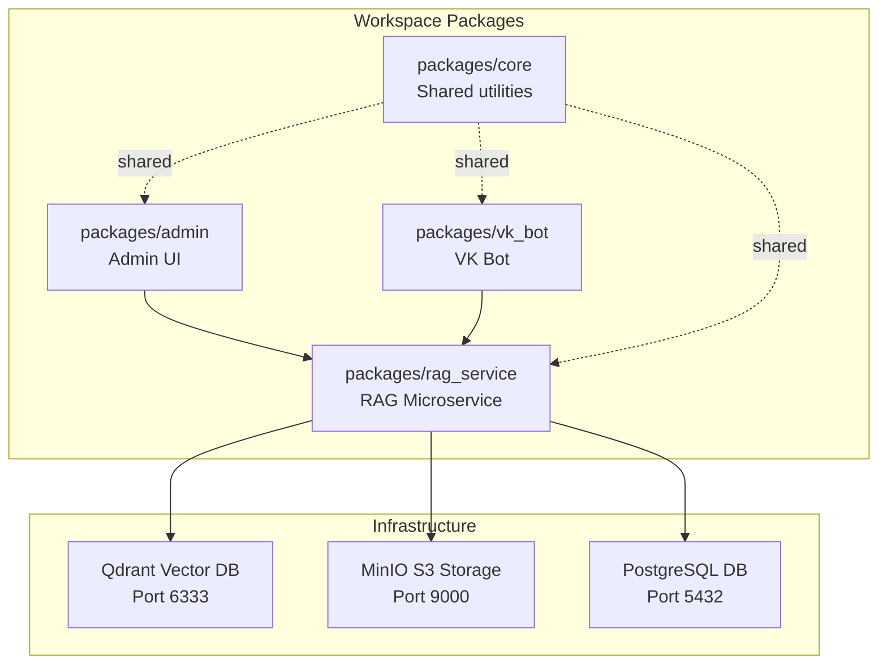

**Diagram sources**
- [docker-compose.yml:56-133](file://docker-compose.yml#L56-L133)
- [pyproject.toml:35-42](file://pyproject.toml#L35-L42)

**Section sources**
- [README.md:652-665](file://README.md#L652-L665)
- [pyproject.toml:35-42](file://pyproject.toml#L35-L42)

## Core Components
The core components enable cross-package communication and infrastructure integration:

- **Core Settings**: Centralized configuration for RAG service URL, storage endpoints, and indexing concurrency
- **RAG Client**: Async HTTP client for the RAG microservice with support for streaming and document operations
- **Storage Layer**: Database and S3 abstractions used by Admin Panel and RAG Service
- **Domain Services**: Category file management and error handling utilities

Key implementation patterns:
- Asynchronous HTTP client with configurable timeouts and API key authentication
- Environment-driven configuration with backward compatibility aliases
- Shared models and repositories for consistent data access across services

**Section sources**
- [packages/core/src/cafetera_core/config.py:14-40](file://packages/core/src/cafetera_core/config.py#L14-L40)
- [packages/core/src/cafetera_core/rag_client.py:15-151](file://packages/core/src/cafetera_core/rag_client.py#L15-L151)

## Architecture Overview
The system architecture centers around the RAG microservice as the AI and knowledge processing engine. The Admin Panel and VK Bot act as clients that communicate with the RAG Service over HTTP.

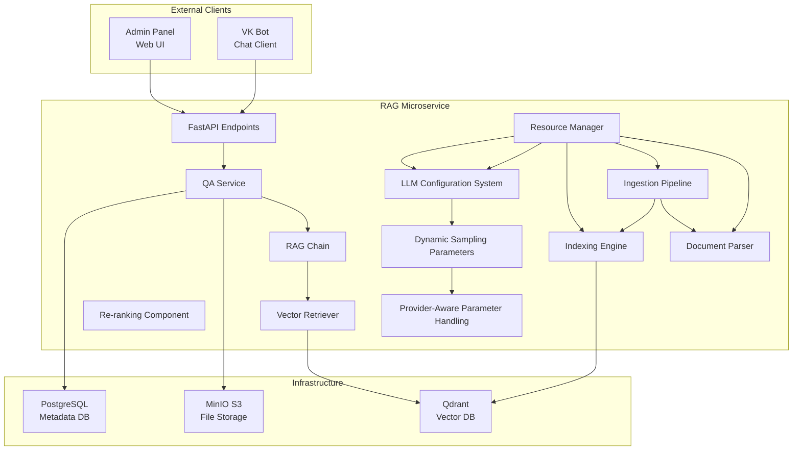

**Diagram sources**
- [packages/rag_service/src/cafetera_rag_service/server.py](file://packages/rag_service/src/cafetera_rag_service/server.py)
- [packages/rag_service/src/cafetera_rag_service/qa_service.py](file://packages/rag_service/src/cafetera_rag_service/qa_service.py)
- [packages/rag_service/src/cafetera_rag_service/rag/chain.py](file://packages/rag_service/src/cafetera_rag_service/rag/chain.py)
- [packages/rag_service/src/cafetera_rag_service/rag/retriever.py](file://packages/rag_service/src/cafetera_rag_service/rag/retriever.py)
- [packages/rag_service/src/cafetera_rag_service/rag/reranker.py](file://packages/rag_service/src/cafetera_rag_service/rag/reranker.py)
- [packages/rag_service/src/cafetera_rag_service/resources.py](file://packages/rag_service/src/cafetera_rag_service/resources.py)
- [packages/rag_service/src/cafetera_rag_service/parser.py](file://packages/rag_service/src/cafetera_rag_service/parser.py)

## Detailed Component Analysis

### Enhanced LLM Configuration System
The RAG Service now features a sophisticated LLM configuration system with dynamic sampling parameter management and provider-aware parameter handling:

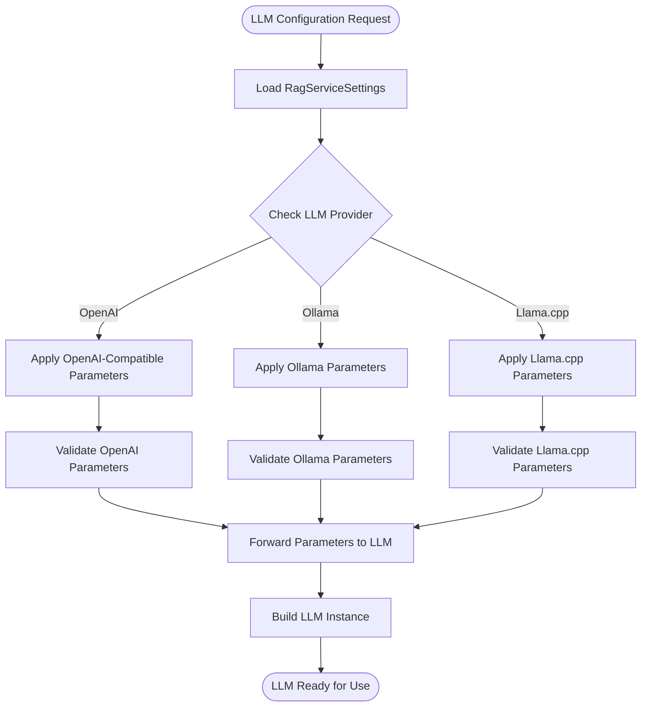

**Diagram sources**
- [packages/rag_service/src/cafetera_rag_service/config.py:34-44](file://packages/rag_service/src/cafetera_rag_service/config.py#L34-L44)
- [packages/rag_service/src/cafetera_rag_service/rag/chain.py:53-86](file://packages/rag_service/src/cafetera_rag_service/rag/chain.py#L53-L86)

**Updated** Enhanced with comprehensive sampling parameter support and provider-aware handling

Key configuration parameters:
- **Temperature Control**: Primary randomness control with default 0.3 for balanced responses
- **Top-p Sampling**: Nucleus sampling for diverse yet coherent responses
- **Top-k Sampling**: Limited vocabulary sampling for focused responses
- **Presence Penalty**: OpenAI-specific parameter for controlling repetition
- **Provider-Specific Handling**: Graceful parameter forwarding based on provider capabilities

**Section sources**
- [packages/rag_service/src/cafetera_rag_service/config.py:34-44](file://packages/rag_service/src/cafetera_rag_service/config.py#L34-L44)
- [packages/rag_service/src/cafetera_rag_service/rag/chain.py:53-86](file://packages/rag_service/src/cafetera_rag_service/rag/chain.py#L53-L86)

### Provider-Aware Parameter Handling
The system implements intelligent parameter forwarding based on the selected LLM provider:

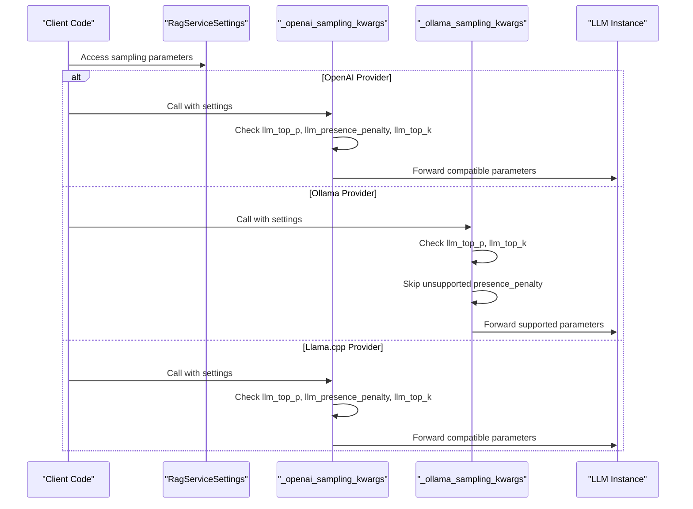

**Diagram sources**
- [packages/rag_service/src/cafetera_rag_service/rag/chain.py:53-86](file://packages/rag_service/src/cafetera_rag_service/rag/chain.py#L53-L86)
- [packages/rag_service/src/cafetera_rag_service/rag/chain.py:89-135](file://packages/rag_service/src/cafetera_rag_service/rag/chain.py#L89-L135)

**Updated** Enhanced with provider-specific parameter validation and forwarding logic

Provider-specific behaviors:
- **OpenAI Compatibility**: Supports all sampling parameters including presence_penalty
- **Ollama Native**: Supports top_p and top_k, ignores presence_penalty (uses repeat_penalty)
- **Llama.cpp Compatibility**: Treats as OpenAI-compatible for parameter forwarding

**Section sources**
- [packages/rag_service/src/cafetera_rag_service/rag/chain.py:53-86](file://packages/rag_service/src/cafetera_rag_service/rag/chain.py#L53-L86)
- [packages/rag_service/src/cafetera_rag_service/rag/chain.py:89-135](file://packages/rag_service/src/cafetera_rag_service/rag/chain.py#L89-L135)

### Dynamic Sampling Parameter Management
The system provides dynamic sampling parameter management with conditional forwarding:

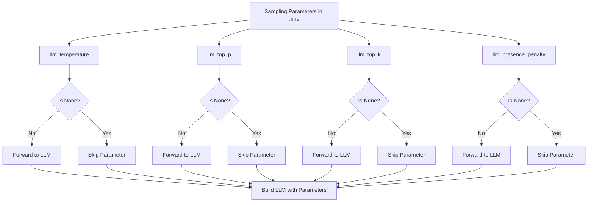

**Diagram sources**
- [packages/rag_service/src/cafetera_rag_service/rag/chain.py:53-86](file://packages/rag_service/src/cafetera_rag_service/rag/chain.py#L53-L86)

**Updated** Enhanced with comprehensive parameter validation and conditional forwarding logic

Parameter forwarding strategy:
- **Conditional Forwarding**: Only parameters with non-None values are forwarded
- **Provider Compatibility**: Unsupported parameters are automatically filtered out
- **Default Preservation**: Unset parameters preserve provider defaults
- **Model Recommendations**: Environment variables allow model-specific parameter tuning

**Section sources**
- [packages/rag_service/src/cafetera_rag_service/rag/chain.py:53-86](file://packages/rag_service/src/cafetera_rag_service/rag/chain.py#L53-L86)

### RAG Microservice API Endpoints
The RAG Service exposes several HTTP endpoints for health checks, document indexing, ingestion, and question answering:

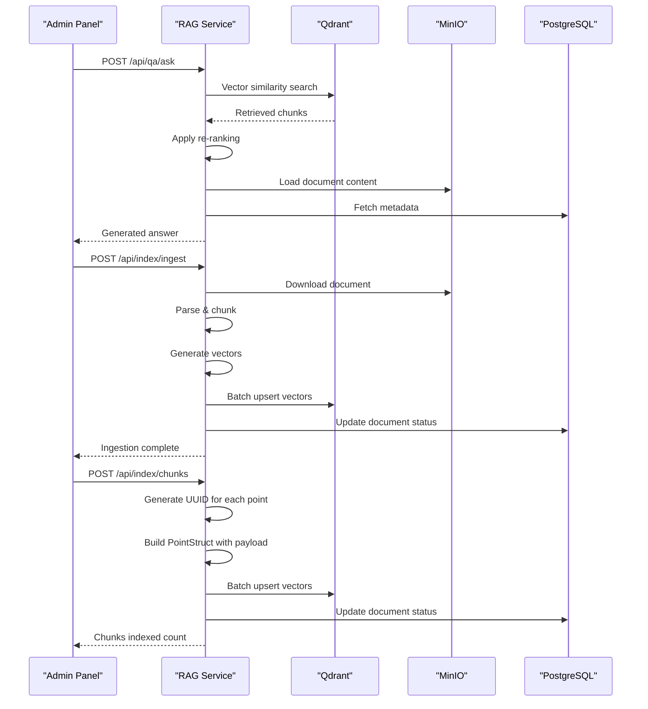

**Diagram sources**
- [packages/rag_service/src/cafetera_rag_service/api/qa.py](file://packages/rag_service/src/cafetera_rag_service/api/qa.py)
- [packages/rag_service/src/cafetera_rag_service/api/ingest.py](file://packages/rag_service/src/cafetera_rag_service/api/ingest.py)
- [packages/rag_service/src/cafetera_rag_service/api/indexing.py](file://packages/rag_service/src/cafetera_rag_service/api/indexing.py)
- [packages/rag_service/src/cafetera_rag_service/rag/chain.py](file://packages/rag_service/src/cafetera_rag_service/rag/chain.py)

Key endpoint categories:
- Health monitoring: `/api/health`
- Question answering: `/api/qa/ask`, `/api/qa/stream`, `/api/qa/ask-document`, `/api/qa/stream-document`
- Document ingestion: `/api/index/ingest`
- Document indexing: `/api/index/chunks`, `/api/index/documents/{id}`, `/api/index/documents/{id}/search`, `/api/index/cache/invalidate`

**Section sources**
- [packages/rag_service/src/cafetera_rag_service/api/health.py](file://packages/rag_service/src/cafetera_rag_service/api/health.py)
- [packages/rag_service/src/cafetera_rag_service/api/qa.py](file://packages/rag_service/src/cafetera_rag_service/api/qa.py)
- [packages/rag_service/src/cafetera_rag_service/api/indexing.py](file://packages/rag_service/src/cafetera_rag_service/api/indexing.py)
- [packages/rag_service/src/cafetera_rag_service/api/ingest.py](file://packages/rag_service/src/cafetera_rag_service/api/ingest.py)

### Complete Document Ingestion Pipeline
The ingestion pipeline now provides a complete end-to-end workflow from S3 storage to vector indexing:

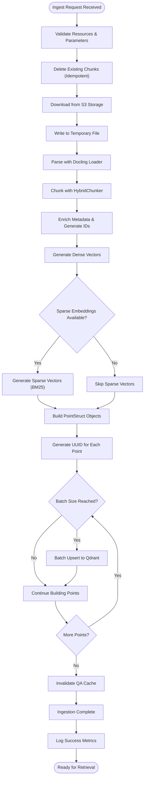

**Diagram sources**
- [packages/rag_service/src/cafetera_rag_service/api/ingest.py:64-188](file://packages/rag_service/src/cafetera_rag_service/api/ingest.py#L64-L188)

Key enhancements:
- **End-to-End Pipeline**: Complete workflow from S3 download to vector indexing
- **S3 Integration**: Direct integration with MinIO for document storage
- **Docling Parsing**: Advanced document parsing with layout preservation
- **Hybrid Vector Support**: Automatic detection and handling of both dense and sparse vectors
- **Batch Processing**: Configurable batch size (`qdrant_upsert_batch_size`) for efficient vector upsert operations
- **UUID Generation**: Each indexed point receives a unique UUID for reliable identification
- **Metadata Enrichment**: Comprehensive metadata extraction and enrichment
- **Error Handling**: Comprehensive error handling with detailed logging

**Section sources**
- [packages/rag_service/src/cafetera_rag_service/api/ingest.py:64-188](file://packages/rag_service/src/cafetera_rag_service/api/ingest.py#L64-L188)
- [packages/rag_service/src/cafetera_rag_service/parser.py:48-111](file://packages/rag_service/src/cafetera_rag_service/parser.py#L48-L111)
- [packages/rag_service/src/cafetera_rag_service/config.py:54-58](file://packages/rag_service/src/cafetera_rag_service/config.py#L54-L58)

### Enhanced Indexing Pipeline
The indexing pipeline now supports batch processing with configurable batch sizes and generates unique UUIDs for each indexed point:

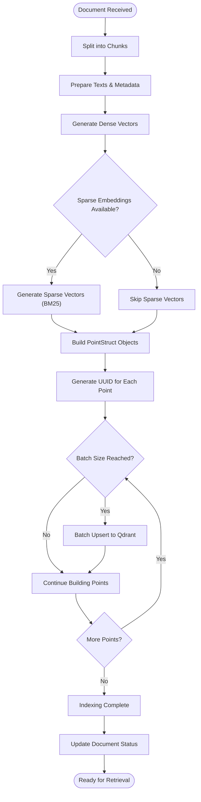

**Diagram sources**
- [packages/rag_service/src/cafetera_rag_service/api/indexing.py:26-110](file://packages/rag_service/src/cafetera_rag_service/api/indexing.py#L26-L110)

Key enhancements:
- **Batch Processing**: Configurable batch size (`qdrant_upsert_batch_size`) for efficient vector upsert operations
- **UUID Generation**: Each indexed point receives a unique UUID for reliable identification
- **PointStruct Construction**: Proper payload formatting with `page_content` and `metadata` fields
- **Hybrid Vector Support**: Automatic detection and handling of both dense and sparse vectors

**Section sources**
- [packages/rag_service/src/cafetera_rag_service/api/indexing.py:26-110](file://packages/rag_service/src/cafetera_rag_service/api/indexing.py#L26-L110)
- [packages/rag_service/src/cafetera_rag_service/config.py:27](file://packages/rag_service/src/cafetera_rag_service/config.py#L27)

### Document Search Control and Management
The system now provides comprehensive search control at the document level:

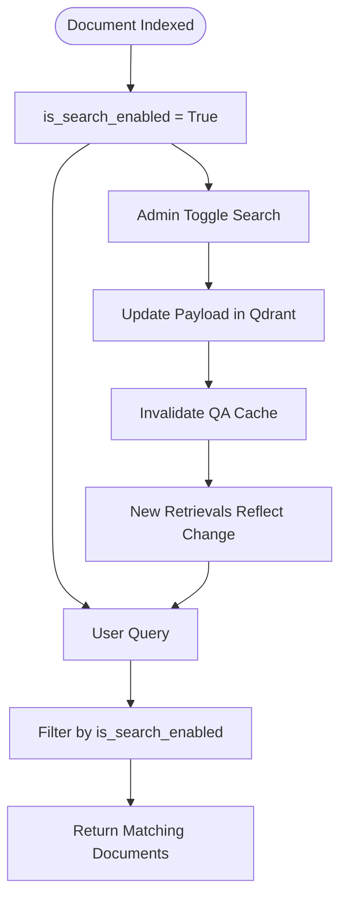

**Diagram sources**
- [packages/rag_service/src/cafetera_rag_service/api/indexing.py:150-199](file://packages/rag_service/src/cafetera_rag_service/api/indexing.py#L150-L199)

Key features:
- **Document-Level Control**: Individual documents can be enabled/disabled for search
- **Payload Indexing**: Efficient filtering using Qdrant payload indexes
- **Cache Invalidation**: Automatic cache clearing when search status changes
- **Granular Access Control**: Fine-grained control over document visibility

**Section sources**
- [packages/rag_service/src/cafetera_rag_service/api/indexing.py:150-199](file://packages/rag_service/src/cafetera_rag_service/api/indexing.py#L150-L199)

### Hybrid Search Implementation
The retriever now supports hybrid search combining dense and sparse embeddings:

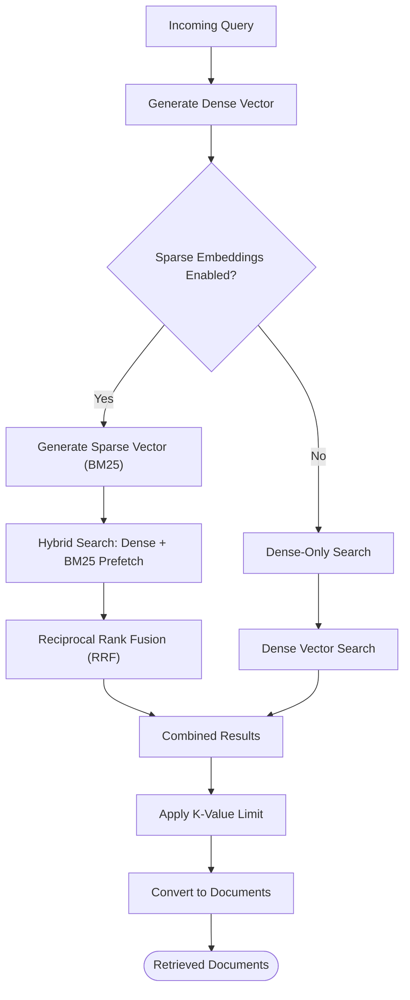

**Diagram sources**
- [packages/rag_service/src/cafetera_rag_service/rag/retriever.py:48-93](file://packages/rag_service/src/cafetera_rag_service/rag/retriever.py#L48-L93)

Core hybrid search features:
- **Dense + Sparse Prefetch**: Combines semantic similarity with lexical matching
- **RRF Fusion**: Reciprocal Rank Fusion combines results from both search modes
- **Adaptive k-values**: Different retrieval depths based on question complexity
- **Graceful Degradation**: Falls back to dense-only search if sparse embeddings unavailable

**Section sources**
- [packages/rag_service/src/cafetera_rag_service/rag/retriever.py:48-93](file://packages/rag_service/src/cafetera_rag_service/rag/retriever.py#L48-L93)
- [packages/rag_service/src/cafetera_rag_service/rag/retriever.py:183-196](file://packages/rag_service/src/cafetera_rag_service/rag/retriever.py#L183-L196)

### RAG Pipeline Implementation
The RAG pipeline combines vector retrieval with re-ranking and contextual generation:

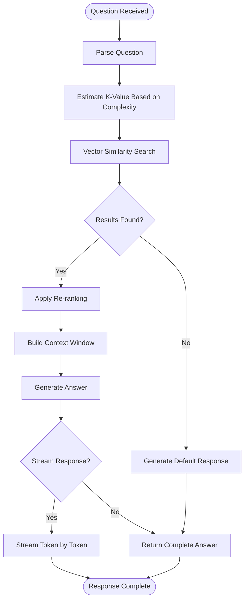

**Diagram sources**
- [packages/rag_service/src/cafetera_rag_service/rag/chain.py](file://packages/rag_service/src/cafetera_rag_service/rag/chain.py)
- [packages/rag_service/src/cafetera_rag_service/rag/retriever.py](file://packages/rag_service/src/cafetera_rag_service/rag/retriever.py)
- [packages/rag_service/src/cafetera_rag_service/rag/reranker.py](file://packages/rag_service/src/cafetera_rag_service/rag/reranker.py)

Core pipeline components:
- Vector retriever: Uses Qdrant for semantic similarity search with hybrid capabilities
- Re-ranking: Improves relevance of retrieved chunks
- Context builder: Assembles relevant document segments
- Streaming generator: Provides real-time response tokens

**Section sources**
- [packages/rag_service/src/cafetera_rag_service/rag/chain.py](file://packages/rag_service/src/cafetera_rag_service/rag/chain.py)
- [packages/rag_service/src/cafetera_rag_service/rag/retriever.py](file://packages/rag_service/src/cafetera_rag_service/rag/retriever.py)
- [packages/rag_service/src/cafetera_rag_service/rag/reranker.py](file://packages/rag_service/src/cafetera_rag_service/rag/reranker.py)

### Resource Management and Caching
The system implements comprehensive resource management and caching strategies:

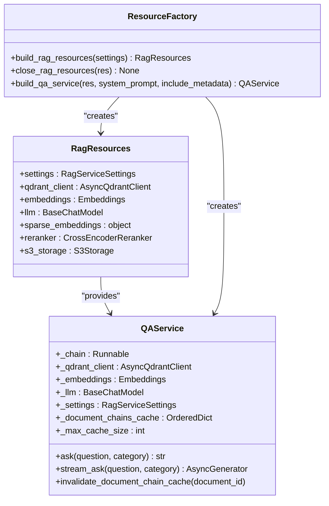

**Diagram sources**
- [packages/rag_service/src/cafetera_rag_service/resources.py](file://packages/rag_service/src/cafetera_rag_service/resources.py)
- [packages/rag_service/src/cafetera_rag_service/qa_service.py](file://packages/rag_service/src/cafetera_rag_service/qa_service.py)

Key features:
- **Resource Factory**: Centralized resource initialization and cleanup
- **LRU Cache**: Document-specific chain caching with size limits
- **Graceful Degradation**: Optional components (sparse embeddings, reranker) with fallback
- **Collection Management**: Automatic Qdrant collection creation and configuration

**Section sources**
- [packages/rag_service/src/cafetera_rag_service/resources.py](file://packages/rag_service/src/cafetera_rag_service/resources.py)
- [packages/rag_service/src/cafetera_rag_service/qa_service.py](file://packages/rag_service/src/cafetera_rag_service/qa_service.py)

### Client Integration Patterns
Both Admin Panel and VK Bot integrate with the RAG Service through the shared RAG Client:

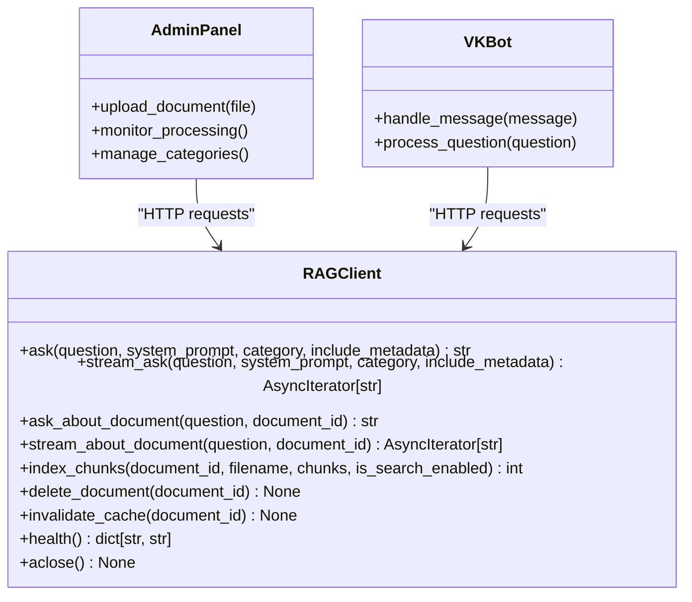

**Diagram sources**
- [packages/core/src/cafetera_core/rag_client.py:15-151](file://packages/core/src/cafetera_core/rag_client.py#L15-L151)

Integration patterns:
- Authentication via API key header with constant-time comparison
- Configurable timeouts for normal and indexing operations
- Support for both synchronous answers and streaming responses
- Document lifecycle management (index, delete, cache invalidation)

**Section sources**
- [packages/core/src/cafetera_core/rag_client.py:15-151](file://packages/core/src/cafetera_core/rag_client.py#L15-L151)

### Infrastructure Dependencies
The system relies on three core infrastructure services managed via Docker Compose:

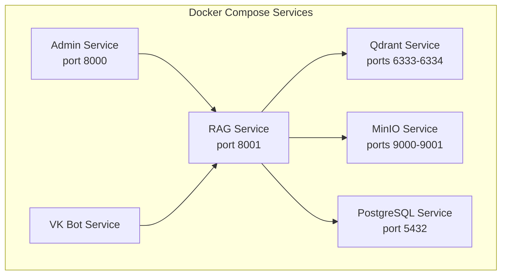

**Diagram sources**
- [docker-compose.yml:1-139](file://docker-compose.yml#L1-L139)

Infrastructure characteristics:
- Health checks for automatic service readiness
- Persistent volumes for data durability
- Environment variable overrides for external AI providers
- Host gateway configuration for local AI model access
- Dedicated RAG service container with separate build process

**Section sources**
- [docker-compose.yml:1-139](file://docker-compose.yml#L1-L139)
- [Dockerfile.rag_service:1-98](file://Dockerfile.rag_service#L1-L98)

## Dependency Analysis
The workspace uses a Python monorepo with explicit package dependencies:

```mermaid
graph TB
subgraph "Workspace Dependencies"
CORE["cafetera-core"]
ADMIN["cafetera-admin"]
VKBOT["cafetera-vk-bot"]
RAG["cafetera-rag-service"]
end
ADMIN --> CORE
VKBOT --> CORE
RAG --> CORE
subgraph "External Dependencies"
FASTAPI["fastapi"]
LANGCHAIN["langchain-*"]
QDRANT["qdrant-client"]
HTTPX["httpx"]
PYDANTIC["pydantic-settings"]
SECRETS["secrets (Python stdlib)"]
DOCLING["docling"]
FASTEMBED["fastembed"]
END
ADMIN --> FASTAPI
ADMIN --> PYDANTIC
RAG --> FASTAPI
RAG --> LANGCHAIN
RAG --> QDRANT
RAG --> HTTPX
RAG --> SECRETS
RAG --> DOCLING
RAG --> FASTEMBED
CORE --> HTTPX
CORE --> PYDANTIC
```

**Diagram sources**
- [packages/admin/pyproject.toml:6-18](file://packages/admin/pyproject.toml#L6-L18)
- [packages/rag_service/pyproject.toml:6-16](file://packages/rag_service/pyproject.toml#L6-L16)
- [packages/core/pyproject.toml:6-12](file://packages/core/pyproject.toml#L6-L12)

Key dependency patterns:
- Core package provides shared utilities and storage abstractions
- Admin and VK Bot depend on Core for configuration and HTTP client
- RAG Service depends on Core plus AI/ML libraries (LangChain, Qdrant, Docling, FastEmbed)
- Security enhancements rely on Python standard library `secrets` module
- Workspace configuration ensures consistent Python version and tooling

**Section sources**
- [pyproject.toml:35-42](file://pyproject.toml#L35-L42)
- [packages/admin/pyproject.toml:6-18](file://packages/admin/pyproject.toml#L6-L18)
- [packages/rag_service/pyproject.toml:6-16](file://packages/rag_service/pyproject.toml#L6-L16)
- [packages/core/pyproject.toml:6-12](file://packages/core/pyproject.toml#L6-L12)

## Performance Considerations
Performance characteristics and optimization opportunities:

- **Indexing Concurrency**: Configurable maximum concurrent indexing operations to balance throughput and resource usage
- **Batch Processing**: Configurable batch size for efficient vector upsert operations with reduced network overhead
- **Streaming Responses**: Real-time token streaming reduces perceived latency for long answers
- **Vector Search Efficiency**: Qdrant provides optimized similarity search with configurable filters and limits
- **Hybrid Search Optimization**: Dense + sparse search fusion improves retrieval quality while maintaining performance
- **Model Provider Flexibility**: Support for multiple AI providers allows selection based on deployment constraints
- **Caching Strategy**: Document content caching reduces repeated retrieval overhead
- **Timeout Management**: Separate timeouts for regular operations vs. indexing accommodate different performance profiles
- **Resource Pooling**: Shared embeddings and LLM instances reduce memory footprint
- **Collection Optimization**: INT8 scalar quantization and payload indexing improve query performance
- **Sampling Parameter Optimization**: Dynamic parameter forwarding reduces unnecessary parameter overhead

Best practices:
- Monitor Qdrant performance metrics and adjust collection configuration
- Tune chunk sizes and overlap for optimal retrieval quality
- Implement connection pooling for high-concurrency scenarios
- Use appropriate embedding models for target language and domain
- Configure batch sizes based on available memory and network bandwidth
- Enable sparse embeddings for better keyword matching
- Leverage provider-specific parameter tuning for optimal model performance

## Security Enhancements
The RAG Service now includes enhanced security measures:

- **Constant-Time Authentication**: API key validation uses `secrets.compare_digest` to prevent timing attacks
- **Configurable API Keys**: Optional API key enforcement for production environments
- **Environment-Based Security**: Development mode allows unauthenticated access while production requires keys
- **Secure Payload Handling**: Proper serialization of metadata and vector payloads
- **Resource Validation**: Comprehensive validation of external service availability
- **Error Containment**: Graceful degradation when critical services are unavailable

Security features:
- API key verification with constant-time comparison prevents timing attacks
- Graceful degradation when no API key is configured (development mode)
- Secure handling of sensitive configuration data
- Proper error handling without exposing internal details
- Resource initialization with comprehensive error handling

**Section sources**
- [packages/rag_service/src/cafetera_rag_service/api/deps.py:13-31](file://packages/rag_service/src/cafetera_rag_service/api/deps.py#L13-L31)
- [packages/rag_service/src/cafetera_rag_service/main.py:16-24](file://packages/rag_service/src/cafetera_rag_service/main.py#L16-L24)

## Troubleshooting Guide
Common issues and resolution strategies:

**Service Connectivity**
- Verify RAG Service health endpoint responds successfully
- Check Docker network connectivity between services
- Confirm proper environment variable configuration for AI providers
- Validate Qdrant collection existence and configuration

**Document Processing Issues**
- Review indexing operation logs for chunk processing failures
- Validate document format compatibility with parser components
- Monitor Qdrant availability and vector upsert operations
- Check batch size configuration for large document processing
- Verify S3 credentials and bucket accessibility

**Performance Problems**
- Adjust max_concurrent_indexing setting based on hardware capabilities
- Monitor memory usage during embedding generation
- Optimize chunk size and re-ranking parameters
- Configure appropriate batch sizes for network efficiency
- Enable sparse embeddings for better keyword matching

**Hybrid Search Issues**
- Verify sparse embedding model installation and availability
- Check BM25 model configuration and loading
- Monitor hybrid search performance compared to dense-only mode
- Validate vector dimension compatibility between dense and sparse embeddings

**LLM Configuration Issues**
- **Sampling Parameter Errors**: Verify environment variables are properly set (LLM_TEMPERATURE, LLM_TOP_P, LLM_TOP_K, LLM_PRESENCE_PENALTY)
- **Provider Mismatch**: Ensure selected provider supports desired parameters (presence_penalty only supported by OpenAI)
- **Parameter Validation**: Check that parameter values are within acceptable ranges for the selected model
- **Fallback Behavior**: Verify graceful degradation when parameters are unsupported by the provider

**Authentication Problems**
- Ensure API key is properly configured in .env file
- Verify X-API-Key header is included in all requests
- Check for timing attack prevention in authentication logs
- Confirm development vs production authentication modes

**Resource Initialization Failures**
- Verify Qdrant connection parameters and service availability
- Check embedding model availability and network connectivity
- Validate S3 credentials and bucket permissions
- Monitor resource factory initialization logs for detailed error information

**Integration Failures**
- Verify API key authentication for client services
- Check CORS configuration for Admin Panel integration
- Validate webhook endpoints for VK Bot integration
- Monitor Docker service dependencies and health checks

**Section sources**
- [packages/core/src/cafetera_core/config.py:34-36](file://packages/core/src/cafetera_core/config.py#L34-L36)
- [packages/core/src/cafetera_core/rag_client.py:26-32](file://packages/core/src/cafetera_core/rag_client.py#L26-L32)

## Conclusion
The RAG Microservice Architecture provides a scalable, modular foundation for AI-powered document retrieval and question answering. The recent enhancements significantly improve functionality and security:

- **Complete Ingestion Pipeline**: Full end-to-end document processing from S3 to vector indexing
- **Enhanced Indexing**: Batch processing with configurable batch sizes and UUID generation for reliable point identification
- **Hybrid Search Capabilities**: Dense + sparse embeddings with BM25 support for improved retrieval quality
- **Comprehensive Search Control**: Document-level search enable/disable functionality with cache invalidation
- **Advanced Resource Management**: Sophisticated caching, resource pooling, and graceful degradation
- **Security Improvements**: Constant-time authentication and configurable API key enforcement
- **Robust Error Handling**: Comprehensive error handling with detailed logging throughout the pipeline
- **Containerized Deployment**: Dedicated RAG service container with optimized build process
- **Flexible AI Integration**: Support for multiple AI providers with graceful fallback mechanisms
- **Production-Ready Features**: S3 integration, comprehensive caching, and resource management
- **Enhanced LLM Configuration**: Dynamic sampling parameter management with provider-aware parameter handling

The architecture supports both development and production deployments while maintaining extensibility for future enhancements such as additional AI providers, custom retrieval strategies, or expanded document formats. The enhanced indexing pipeline, hybrid search capabilities, complete ingestion workflow, and sophisticated LLM configuration system provide superior performance and accuracy for enterprise document retrieval systems.

**Updated** Enhanced with comprehensive LLM configuration system featuring dynamic sampling parameter management and provider-aware parameter handling, enabling fine-grained control over AI model behavior across different providers while maintaining backward compatibility and graceful degradation.