# RAG Microservice Architecture

<cite>
**Referenced Files in This Document**
- [README.md](file://README.md)
- [pyproject.toml](file://pyproject.toml)
- [docker-compose.yml](file://docker-compose.yml)
- [Dockerfile.rag_service](file://Dockerfile.rag_service)
- [packages/core/pyproject.toml](file://packages/core/pyproject.toml)
- [packages/admin/pyproject.toml](file://packages/admin/pyproject.toml)
- [packages/rag_service/pyproject.toml](file://packages/rag_service/pyproject.toml)
- [packages/vk_bot/pyproject.toml](file://packages/vk_bot/pyproject.toml)
- [packages/core/src/cafetera_core/config.py](file://packages/core/src/cafetera_core/config.py)
- [packages/core/src/cafetera_core/rag_client.py](file://packages/core/src/cafetera_core/rag_client.py)
- [packages/rag_service/src/cafetera_rag_service/main.py](file://packages/rag_service/src/cafetera_rag_service/main.py)
- [packages/rag_service/src/cafetera_rag_service/server.py](file://packages/rag_service/src/cafetera_rag_service/server.py)
- [packages/rag_service/src/cafetera_rag_service/api/health.py](file://packages/rag_service/src/cafetera_rag_service/api/health.py)
- [packages/rag_service/src/cafetera_rag_service/api/qa.py](file://packages/rag_service/src/cafetera_rag_service/api/qa.py)
- [packages/rag_service/src/cafetera_rag_service/api/indexing.py](file://packages/rag_service/src/cafetera_rag_service/api/indexing.py)
- [packages/rag_service/src/cafetera_rag_service/api/ingest.py](file://packages/rag_service/src/cafetera_rag_service/api/ingest.py)
- [packages/rag_service/src/cafetera_rag_service/api/deps.py](file://packages/rag_service/src/cafetera_rag_service/api/deps.py)
- [packages/rag_service/src/cafetera_rag_service/rag/chain.py](file://packages/rag_service/src/cafetera_rag_service/rag/chain.py)
- [packages/rag_service/src/cafetera_rag_service/rag/retriever.py](file://packages/rag_service/src/cafetera_rag_service/rag/retriever.py)
- [packages/rag_service/src/cafetera_rag_service/rag/reranker.py](file://packages/rag_service/src/cafetera_rag_service/rag/reranker.py)
- [packages/rag_service/src/cafetera_rag_service/rag/text_processor.py](file://packages/rag_service/src/cafetera_rag_service/rag/text_processor.py)
- [packages/rag_service/src/cafetera_rag_service/qa_service.py](file://packages/rag_service/src/cafetera_rag_service/qa_service.py)
- [packages/rag_service/src/cafetera_rag_service/models.py](file://packages/packages/rag_service/src/cafetera_rag_service/config.py](file://packages/rag_service/src/cafetera_rag_service/config.py)
- [packages/rag_service/src/cafetera_rag_service/resources.py](file://packages/rag_service/src/cafetera_rag_service/resources.py)
- [packages/rag_service/src/cafetera_rag_service/parser.py](file://packages/rag_service/src/cafetera_rag_service/parser.py)
- [packages/admin/src/cafetera_admin/config.py](file://packages/admin/src/cafetera_admin/config.py)
- [packages/admin/src/cafetera_admin/server.py](file://packages/admin/src/cafetera_admin/server.py)
- [packages/admin/src/cafetera_admin/api/documents.py](file://packages/admin/src/cafetera_admin/api/documents.py)
- [packages/admin/src/cafetera_admin/api/documents_qa.py](file://packages/admin/src/cafetera_admin/api/documents_qa.py)
- [packages/vk_bot/src/cafetera_vk_bot/main.py](file://packages/vk_bot/src/cafetera_vk_bot/main.py)
- [packages/vk_bot/src/cafetera_vk_bot/bot.py](file://packages/vk_bot/src/cafetera_vk_bot/bot.py)
- [scripts/rag_server.py](file://scripts/rag_server.py)
- [scripts/admin_server.py](file://scripts/admin_server.py)
- [scripts/polling_vk.py](file://scripts/polling_vk.py)
- [static/js/components.js](file://static/js/components.js)
- [tests/test_qa_streaming_errors.py](file://tests/test_qa_streaming_errors.py)
- [ragas/evaluate.py](file://ragas/evaluate.py)
- [docs/llamacpp.md](file://docs/llamacpp.md)
- [scripts/run_llama_reranker.sh](file://scripts/run_llama_reranker.sh)
- [scripts/run_llama_embeddings.sh](file://scripts/run_llama_embeddings.sh)
- [scripts/run_llama_llm.sh](file://scripts/run_llama_llm.sh)
</cite>

## Update Summary
**Changes Made**
- Enhanced Russian text preprocessing capabilities with pymorphy3 lemmatization and stop-word removal for BM25 sparse embeddings
- Improved retriever with configurable lemmatization via bm25_lemmatize setting and enhanced fallback mechanisms
- Enhanced configuration management with new settings for sparse embeddings, Russian lemmatization, and HTTP-based reranking
- Added HTTP-based reranking via llama.cpp servers with dedicated scripts and Docker integration
- Expanded LLM configuration system with provider-aware parameter handling and context window management
- Enhanced streaming error handling with comprehensive asyncio.CancelledError support for graceful client disconnection handling
- Added new ask_with_contexts method for evaluation purposes that returns both answers and retrieved contexts
- Enhanced streaming architecture with robust error handling for SSE (Server-Sent Events) implementation
- Improved streaming endpoints with proper client disconnection detection and cleanup
- Added comprehensive testing for streaming error handling scenarios

## Table of Contents
1. [Introduction](#introduction)
2. [Project Structure](#project-structure)
3. [Core Components](#core-components)
4. [Architecture Overview](#architecture-overview)
5. [Detailed Component Analysis](#detailed-component-analysis)
6. [Dependency Analysis](#dependency-analysis)
7. [Performance Considerations](#performance-considerations)
8. [Security Enhancements](#security-enhancements)
9. [Troubleshooting Guide](#troubleshooting-guide)
10. [Conclusion](#conclusion)

## Introduction
This document describes the RAG (Retrieval-Augmented Generation) microservice architecture for the Cafetera HR Bot system. The system consists of three primary parts:
- Admin Panel: Web interface for uploading and managing documents
- VK Bot: A chatbot responding to employee questions in VKontakte groups
- RAG Service: Internal microservice handling AI queries and knowledge base operations

The RAG Service operates on port 8001 and communicates with the Admin Panel and VK Bot via HTTP. It integrates with Qdrant for vector similarity search, supports multiple AI providers (Ollama, OpenAI, llama.cpp), and manages document ingestion and retrieval workflows with enhanced hybrid search capabilities. The service now includes complete document ingestion pipelines with S3 integration, comprehensive error handling, advanced search control mechanisms, sophisticated Russian language preprocessing for improved BM25 sparse embeddings, robust streaming architecture with SSE implementation, enhanced evaluation capabilities through the new ask_with_contexts method, and HTTP-based reranking via llama.cpp servers.

## Project Structure
The project follows a monorepo workspace structure with four main packages:
- `packages/core`: Shared domain logic, storage abstractions, and cross-package utilities
- `packages/admin`: Admin web UI built with FastAPI and HTMX
- `packages/vk_bot`: VKontakte bot integration
- `packages/rag_service`: RAG microservice implementing the QA pipeline with hybrid search

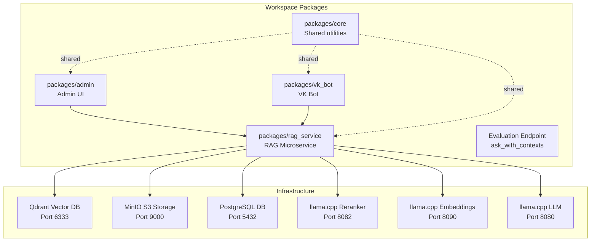
```mermaid
graph TB
subgraph "Workspace Packages"
CORE["packages/core<br/>Shared utilities"]
ADMIN["packages/admin<br/>Admin UI"]
VKBOT["packages/vk_bot<br/>VK Bot"]
RAG["packages/rag_service<br/>RAG Microservice"]
ENDPOINT_EVAL["Evaluation Endpoint<br/>ask_with_contexts"]
end
subgraph "Infrastructure"
QDRANT["Qdrant Vector DB<br/>Port 6333"]
MINIO["MinIO S3 Storage<br/>Port 9000"]
PG["PostgreSQL DB<br/>Port 5432"]
LLAMACPP_RERANKER["llama.cpp Reranker<br/>Port 8082"]
LLAMACPP_EMBEDDINGS["llama.cpp Embeddings<br/>Port 8090"]
LLAMACPP_LLM["llama.cpp LLM<br/>Port 8080"]
end
ADMIN --> RAG
VKBOT --> RAG
RAG --> QDRANT
RAG --> MINIO
RAG --> PG
RAG --> LLAMACPP_RERANKER
RAG --> LLAMACPP_EMBEDDINGS
RAG --> LLAMACPP_LLM
CORE -. shared .-> ADMIN
CORE -. shared .-> VKBOT
CORE -. shared .-> RAG
```

**Diagram sources**
- [docker-compose.yml:56-133](file://docker-compose.yml#L56-L133)
- [pyproject.toml:35-42](file://pyproject.toml#L35-L42)
- [docs/llamacpp.md:143-174](file://docs/llamacpp.md#L143-L174)

**Section sources**
- [README.md:652-665](file://README.md#L652-L665)
- [pyproject.toml:35-42](file://pyproject.toml#L35-L42)

## Core Components
The core components enable cross-package communication and infrastructure integration:

- **Core Settings**: Centralized configuration for RAG service URL, storage endpoints, and indexing concurrency
- **RAG Client**: Async HTTP client for the RAG microservice with support for streaming and document operations
- **Storage Layer**: Database and S3 abstractions used by Admin Panel and RAG Service
- **Domain Services**: Category file management and error handling utilities

Key implementation patterns:
- Asynchronous HTTP client with configurable timeouts and API key authentication
- Environment-driven configuration with backward compatibility aliases
- Shared models and repositories for consistent data access across services

**Section sources**
- [packages/core/src/cafetera_core/config.py:14-40](file://packages/core/src/cafetera_core/config.py#L14-L40)
- [packages/core/src/cafetera_core/rag_client.py:15-151](file://packages/core/src/cafetera_core/rag_client.py#L15-L151)

## Architecture Overview
The system architecture centers around the RAG microservice as the AI and knowledge processing engine. The Admin Panel and VK Bot act as clients that communicate with the RAG Service over HTTP.

```mermaid
graph TB
subgraph "External Clients"
ADMIN_UI["Admin Panel<br/>Web UI"]
VK_CLIENT["VK Bot<br/>Chat Client"]
EVAL_TOOL["Evaluation Tool<br/>RAGAS"]
end
subgraph "RAG Microservice"
API["FastAPI Endpoints"]
QA["QA Service"]
RAG_CHAIN["RAG Chain"]
RETRIEVER["Vector Retriever"]
RERANKER["HTTP-based Reranker"]
RESOURCES["Resource Manager"]
PARSER["Document Parser"]
INGEST["Ingestion Pipeline"]
INDEX["Indexing Engine"]
LLM_CONFIG["LLM Configuration System"]
SAMPLING_PARAMS["Dynamic Sampling Parameters"]
CONTEXT_WINDOW["Context Window Management"]
PROVIDER_AWARE["Provider-Aware Parameter Handling"]
TEXT_PROCESSOR["Russian Text Processor"]
BM25_LEMMATIZE["BM25 Lemmatization"]
STREAMING["SSE Streaming Architecture"]
ERROR_HANDLING["Enhanced Error Handling"]
CANCELLED_ERROR["asyncio.CancelledError Support"]
ASK_WITH_CONTEXTS["ask_with_contexts Method"]
EVAL_ENDPOINT["/api/qa/ask-with-contexts"]
ENDPOINT_STREAM["/stream & /stream-document"]
CLIENT_SSE["Client-Side SSE Handling"]
ENDPOINT_GLOBAL["/ask-global"]
ENDPOINT_EVAL["Evaluation Pipeline"]
LLAMACPP_RERANKER["llama.cpp Reranker Server"]
RERANKING_ENABLED["RERANKING_ENABLED Flag"]
RERANKER_PREFETCH["RERANKER_PREFETCH_LIMIT"]
RERANKER_TOPN["RERANKER_TOP_N"]
end
subgraph "Infrastructure"
QDRANT["Qdrant<br/>Vector DB"]
S3["MinIO S3<br/>File Storage"]
DB["PostgreSQL<br/>Metadata DB"]
LLAMACPP_SERVERS["llama.cpp Servers<br/>Ports 8080-8090"]
end
ADMIN_UI --> API
VK_CLIENT --> API
EVAL_TOOL --> API
API --> QA
QA --> RAG_CHAIN
RAG_CHAIN --> RETRIEVER
RETRIEVER --> QDRANT
QA --> S3
QA --> DB
RESOURCES --> PARSER
RESOURCES --> INGEST
RESOURCES --> INDEX
RESOURCES --> LLM_CONFIG
LLM_CONFIG --> SAMPLING_PARAMS
SAMPLING_PARAMS --> CONTEXT_WINDOW
CONTEXT_WINDOW --> PROVIDER_AWARE
RESOURCES --> TEXT_PROCESSOR
TEXT_PROCESSOR --> BM25_LEMMATIZE
RESOURCES --> LLM_CONFIG
INGEST --> PARSER
INGEST --> INDEX
INDEX --> QDRANT
STREAMING --> ERROR_HANDLING
ERROR_HANDLING --> CANCELLED_ERROR
ERROR_HANDLING --> ENDPOINT_STREAM
STREAMING --> CLIENT_SSE
STREAMING --> ENDPOINT_GLOBAL
ASK_WITH_CONTEXTS --> EVAL_ENDPOINT
EVAL_ENDPOINT --> ENDPOINT_EVAL
RERANKER --> LLAMACPP_RERANKER
RERANKER --> RERANKING_ENABLED
RERANKING_ENABLED --> RERANKER_PREFETCH
RERANKER_PREFETCH --> RERANKER_TOPN
LLAMACPP_RERANKER --> LLAMACPP_SERVERS
```

**Diagram sources**
- [packages/rag_service/src/cafetera_rag_service/server.py](file://packages/rag_service/src/cafetera_rag_service/server.py)
- [packages/rag_service/src/cafetera_rag_service/qa_service.py](file://packages/rag_service/src/cafetera_rag_service/qa_service.py)
- [packages/rag_service/src/cafetera_rag_service/rag/chain.py](file://packages/rag_service/src/cafetera_rag_service/rag/chain.py)
- [packages/rag_service/src/cafetera_rag_service/rag/retriever.py](file://packages/rag_service/src/cafetera_rag_service/rag/retriever.py)
- [packages/rag_service/src/cafetera_rag_service/rag/reranker.py](file://packages/rag_service/src/cafetera_rag_service/rag/reranker.py)
- [packages/rag_service/src/cafetera_rag_service/resources.py](file://packages/rag_service/src/cafetera_rag_service/resources.py)
- [packages/rag_service/src/cafetera_rag_service/parser.py](file://packages/rag_service/src/cafetera_rag_service/parser.py)
- [docs/llamacpp.md:143-174](file://docs/llamacpp.md#L143-L174)

## Detailed Component Analysis

### Enhanced Russian Text Preprocessing with Lemmatization
The RAG Service now includes sophisticated Russian language preprocessing capabilities for improved BM25 sparse embeddings:

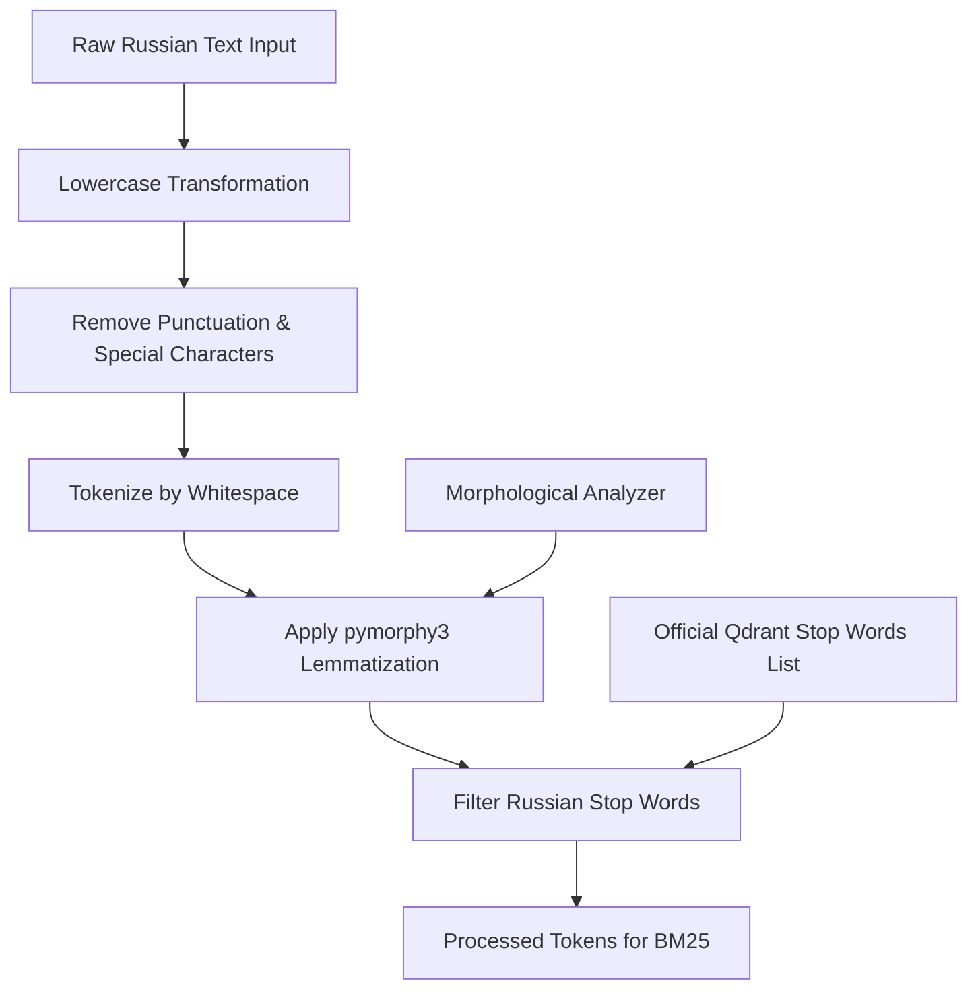
```mermaid
flowchart TD
Input["Raw Russian Text Input"] --> Lowercase["Lowercase Transformation"]
Lowercase --> RemovePunctuation["Remove Punctuation & Special Characters"]
RemovePunctuation --> Tokenize["Tokenize by Whitespace"]
Tokenize --> Lemmatize["Apply pymorphy3 Lemmatization"]
Lemmatize --> FilterStopWords["Filter Russian Stop Words"]
FilterStopWords --> Output["Processed Tokens for BM25"]
StopWords["Official Qdrant Stop Words List"] --> FilterStopWords
Pymorphy3["Morphological Analyzer"] --> Lemmatize
```

**Diagram sources**
- [packages/rag_service/src/cafetera_rag_service/rag/text_processor.py:42-65](file://packages/rag_service/src/cafetera_rag_service/rag/text_processor.py#L42-L65)

**Updated** Enhanced with comprehensive Russian text preprocessing capabilities using pymorphy3 lemmatization and official Qdrant stop words

Key preprocessing features:
- **Morphological Analysis**: Uses pymorphy3 for accurate Russian word normalization
- **Stop Word Filtering**: Removes 80+ common Russian stop words from Qdrant's official list
- **Consistent Processing**: Same preprocessing applied at both index and query time
- **Performance Optimization**: Efficient vectorized operations for large document collections
- **Language-Specific**: Tailored for Russian morphology and vocabulary patterns
- **Configurable**: Controlled via bm25_lemmatize setting in RagServiceSettings

**Section sources**
- [packages/rag_service/src/cafetera_rag_service/rag/text_processor.py:1-65](file://packages/rag_service/src/cafetera_rag_service/rag/text_processor.py#L1-L65)
- [packages/rag_service/src/cafetera_rag_service/config.py:56-58](file://packages/rag_service/src/cafetera_rag_service/config.py#L56-L58)

### Improved Retriever with Configurable Lemmatization and Fallback Mechanisms
The retriever now supports enhanced Russian text preprocessing with intelligent fallback mechanisms:

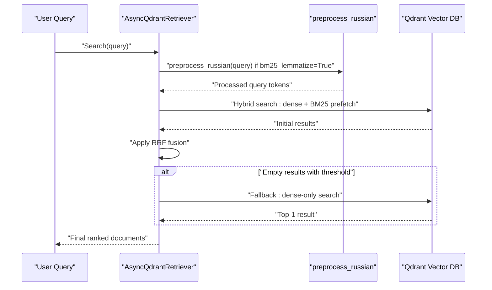
```mermaid
sequenceDiagram
participant Query as "User Query"
participant Retriever as "AsyncQdrantRetriever"
participant TextProcessor as "preprocess_russian"
participant Qdrant as "Qdrant Vector DB"
Query->>Retriever : "Search(query)"
Retriever->>TextProcessor : "preprocess_russian(query) if bm25_lemmatize=True"
TextProcessor-->>Retriever : "Processed query tokens"
Retriever->>Qdrant : "Hybrid search : dense + BM25 prefetch"
Qdrant-->>Retriever : "Initial results"
Retriever->>Retriever : "Apply RRF fusion"
alt "Empty results with threshold"
Retriever->>Qdrant : "Fallback : dense-only search"
Qdrant-->>Retriever : "Top-1 result"
end
Retriever-->>Query : "Final ranked documents"
```

**Diagram sources**
- [packages/rag_service/src/cafetera_rag_service/rag/retriever.py:52-138](file://packages/rag_service/src/cafetera_rag_service/rag/retriever.py#L52-L138)

**Updated** Enhanced with configurable Russian lemmatization and intelligent fallback mechanisms

Retriever improvements:
- **Configurable Lemmatization**: Controlled by bm25_lemmatize setting in RagServiceSettings
- **Intelligent Fallback**: Automatic fallback from hybrid to dense-only search when needed
- **Threshold Management**: Graceful degradation when all results fall below score threshold
- **Consistent Processing**: Same Russian preprocessing applied at both index and query time
- **Performance Optimization**: Prefetch-based hybrid search with Reciprocal Rank Fusion
- **Error Resilience**: Robust error handling with fallback strategies

**Section sources**
- [packages/rag_service/src/cafetera_rag_service/rag/retriever.py:29-138](file://packages/rag_service/src/cafetera_rag_service/rag/retriever.py#L29-L138)
- [packages/rag_service/src/cafetera_rag_service/config.py:56-58](file://packages/rag_service/src/cafetera_rag_service/config.py#L56-L58)

### Enhanced Configuration Management with New Settings
The configuration system now includes comprehensive settings for Russian preprocessing, sparse embeddings, and HTTP-based reranking:

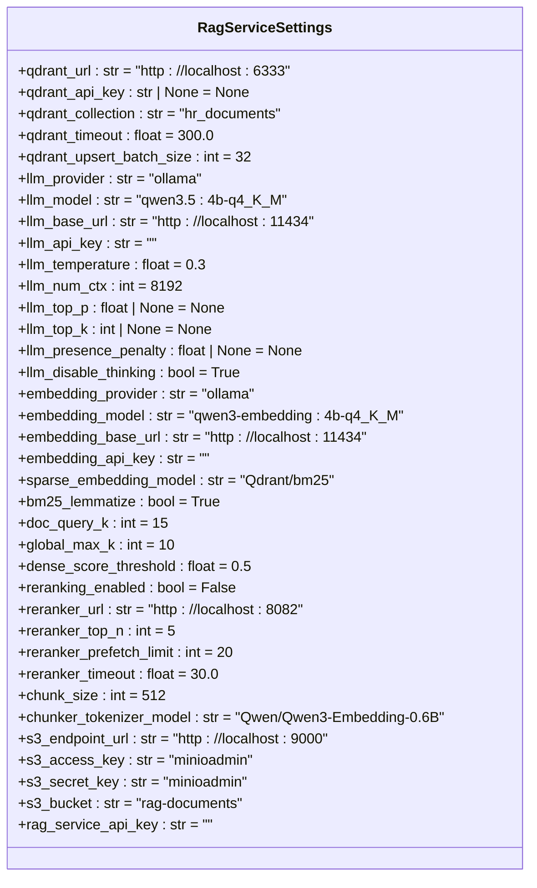
```mermaid
classDiagram
class RagServiceSettings {
+qdrant_url : str = "http : //localhost : 6333"
+qdrant_api_key : str | None = None
+qdrant_collection : str = "hr_documents"
+qdrant_timeout : float = 300.0
+qdrant_upsert_batch_size : int = 32
+llm_provider : str = "ollama"
+llm_model : str = "qwen3.5 : 4b-q4_K_M"
+llm_base_url : str = "http : //localhost : 11434"
+llm_api_key : str = ""
+llm_temperature : float = 0.3
+llm_num_ctx : int = 8192
+llm_top_p : float | None = None
+llm_top_k : int | None = None
+llm_presence_penalty : float | None = None
+llm_disable_thinking : bool = True
+embedding_provider : str = "ollama"
+embedding_model : str = "qwen3-embedding : 4b-q4_K_M"
+embedding_base_url : str = "http : //localhost : 11434"
+embedding_api_key : str = ""
+sparse_embedding_model : str = "Qdrant/bm25"
+bm25_lemmatize : bool = True
+doc_query_k : int = 15
+global_max_k : int = 10
+dense_score_threshold : float = 0.5
+reranking_enabled : bool = False
+reranker_url : str = "http : //localhost : 8082"
+reranker_top_n : int = 5
+reranker_prefetch_limit : int = 20
+reranker_timeout : float = 30.0
+chunk_size : int = 512
+chunker_tokenizer_model : str = "Qwen/Qwen3-Embedding-0.6B"
+s3_endpoint_url : str = "http : //localhost : 9000"
+s3_access_key : str = "minioadmin"
+s3_secret_key : str = "minioadmin"
+s3_bucket : str = "rag-documents"
+rag_service_api_key : str = ""
}
```

**Diagram sources**
- [packages/rag_service/src/cafetera_rag_service/config.py:8-84](file://packages/rag_service/src/cafetera_rag_service/config.py#L8-L84)

**Updated** Enhanced with comprehensive configuration management for Russian preprocessing, sparse embeddings, and HTTP-based reranking

New configuration features:
- **Russian Lemmatization**: bm25_lemmatize setting controls morphological preprocessing
- **HTTP-based Reranking**: Complete configuration for llama.cpp reranker integration
- **Provider-Aware Parameters**: Enhanced LLM parameter handling across different providers
- **Context Window Management**: llm_num_ctx setting for provider-specific context limits
- **Thinking Mode Control**: llm_disable_thinking setting for reasoning mode management
- **Sparse Embedding Control**: Fine-tuned configuration for BM25 sparse embeddings
- **Batch Processing**: Configurable qdrant_upsert_batch_size for efficient indexing

**Section sources**
- [packages/rag_service/src/cafetera_rag_service/config.py:8-84](file://packages/rag_service/src/cafetera_rag_service/config.py#L8-L84)

### HTTP-based Reranking via llama.cpp Servers
The system now supports HTTP-based reranking through dedicated llama.cpp servers with comprehensive integration:

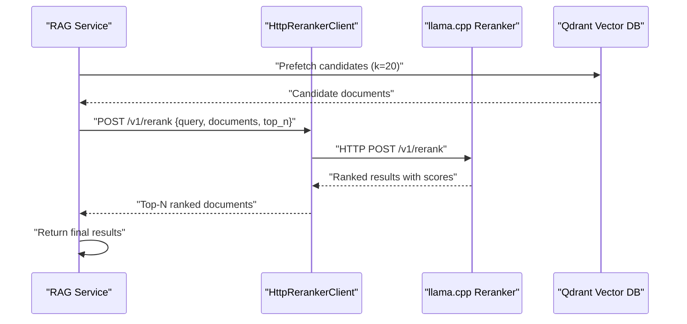
```mermaid
sequenceDiagram
participant Client as "RAG Service"
participant HttpReranker as "HttpRerankerClient"
participant LlamaServer as "llama.cpp Reranker"
participant Qdrant as "Qdrant Vector DB"
Client->>Qdrant : "Prefetch candidates (k=20)"
Qdrant-->>Client : "Candidate documents"
Client->>HttpReranker : "POST /v1/rerank {query, documents, top_n}"
HttpReranker->>LlamaServer : "HTTP POST /v1/rerank"
LlamaServer-->>HttpReranker : "Ranked results with scores"
HttpReranker-->>Client : "Top-N ranked documents"
Client->>Client : "Return final results"
```

**Diagram sources**
- [packages/rag_service/src/cafetera_rag_service/rag/reranker.py:20-88](file://packages/rag_service/src/cafetera_rag_service/rag/reranker.py#L20-L88)

**Updated** Enhanced with HTTP-based reranking via llama.cpp servers for improved result ranking

Reranking architecture:
- **HTTP Client Integration**: HttpRerankerClient handles external reranker communication
- **llama.cpp Compatibility**: Supports llama.cpp server with /v1/rerank endpoint
- **Configurable Parameters**: RERANKER_TOP_N, RERANKER_PREFETCH_LIMIT, RERANKER_TIMEOUT
- **Error Resilience**: Graceful fallback when reranker is unavailable
- **Performance Optimization**: Prefetch-based candidate gathering before reranking
- **Scalable Design**: Independent reranker server allows horizontal scaling

**Section sources**
- [packages/rag_service/src/cafetera_rag_service/rag/reranker.py:1-88](file://packages/rag_service/src/cafetera_rag_service/rag/reranker.py#L1-L88)
- [docs/llamacpp.md:143-174](file://docs/llamacpp.md#L143-L174)

### Enhanced Streaming Error Handling with asyncio.CancelledError Support
The RAG Service now implements robust streaming error handling with proper asyncio.CancelledError support for graceful client disconnection handling:

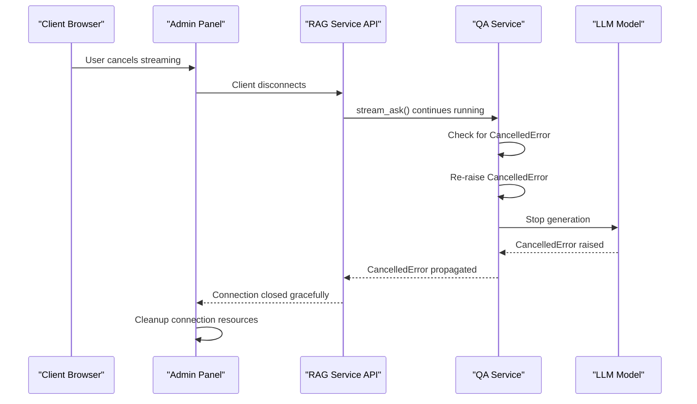
```mermaid
sequenceDiagram
participant Client as "Client Browser"
participant AdminUI as "Admin Panel"
participant RAGAPI as "RAG Service API"
participant QAService as "QA Service"
participant LLM as "LLM Model"
Client->>AdminUI : User cancels streaming
AdminUI->>RAGAPI : Client disconnects
RAGAPI->>QAService : stream_ask() continues running
QAService->>QAService : Check for CancelledError
QAService->>QAService : Re-raise CancelledError
QAService->>LLM : Stop generation
LLM-->>QAService : CancelledError raised
QAService-->>RAGAPI : CancelledError propagated
RAGAPI-->>AdminUI : Connection closed gracefully
AdminUI->>AdminUI : Cleanup connection resources
```

**Diagram sources**
- [packages/rag_service/src/cafetera_rag_service/qa_service.py:305-307](file://packages/rag_service/src/cafetera_rag_service/qa_service.py#L305-L307)
- [packages/rag_service/src/cafetera_rag_service/qa_service.py:335-339](file://packages/rag_service/src/cafetera_rag_service/qa_service.py#L335-L339)
- [packages/rag_service/src/cafetera_rag_service/api/qa.py:78-83](file://packages/rag_service/src/cafetera_rag_service/api/qa.py#L78-L83)
- [packages/rag_service/src/cafetera_rag_service/api/qa.py:116-118](file://packages/rag_service/src/cafetera_rag_service/api/qa.py#L116-L118)

**Updated** Enhanced with comprehensive asyncio.CancelledError support for proper client disconnection handling

Key improvements:
- **Proper Cancellation Handling**: Both `stream_ask` and `stream_about_document` methods now properly re-raise `asyncio.CancelledError`
- **Graceful Cleanup**: Client disconnections trigger immediate resource cleanup without leaving hanging operations
- **Error Propagation**: Cancellation errors are propagated up the call stack for proper handling
- **Logging**: Comprehensive logging for client disconnection events with question context
- **API Consistency**: Both streaming methods handle cancellations identically

**Section sources**
- [packages/rag_service/src/cafetera_rag_service/qa_service.py:305-307](file://packages/rag_service/src/cafetera_rag_service/qa_service.py#L305-L307)
- [packages/rag_service/src/cafetera_rag_service/qa_service.py:335-339](file://packages/rag_service/src/cafetera_rag_service/qa_service.py#L335-L339)
- [packages/rag_service/src/cafetera_rag_service/api/qa.py:78-83](file://packages/rag_service/src/cafetera_rag_service/api/qa.py#L78-L83)
- [packages/rag_service/src/cafetera_rag_service/api/qa.py:116-118](file://packages/rag_service/src/cafetera_rag_service/api/qa.py#L116-L118)

### Improved Error Propagation Patterns
The streaming system now implements comprehensive error propagation patterns for various failure scenarios:

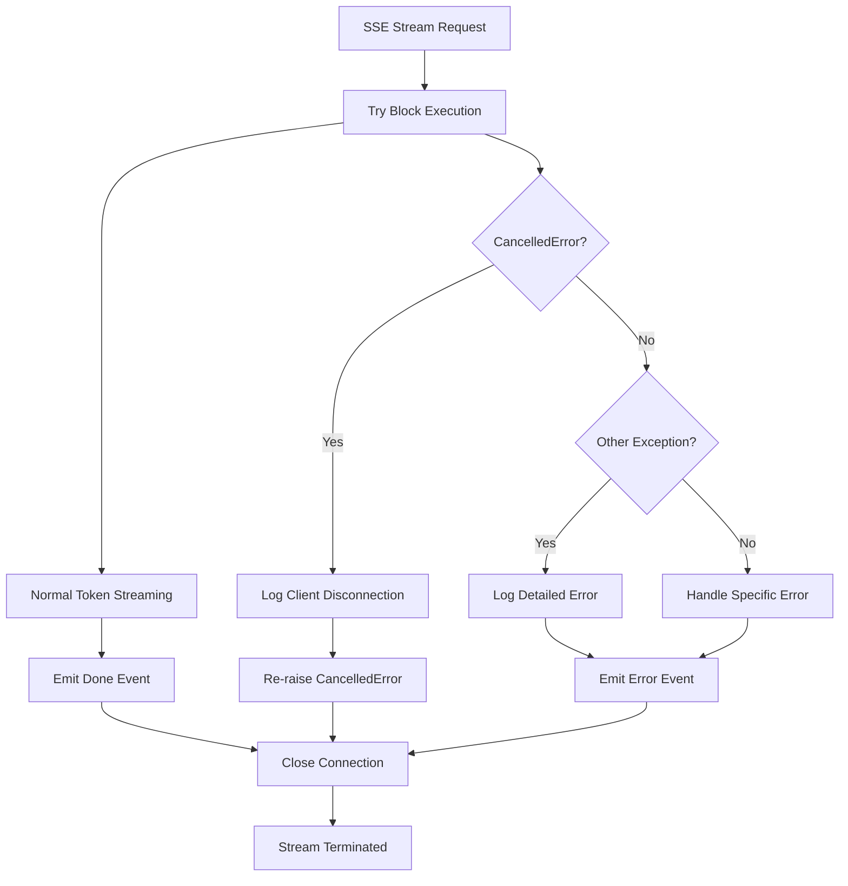
```mermaid
flowchart TD
Start["SSE Stream Request"] --> TryBlock["Try Block Execution"]
TryBlock --> NormalFlow["Normal Token Streaming"]
NormalFlow --> DoneEvent["Emit Done Event"]
DoneEvent --> CloseConn["Close Connection"]
TryBlock --> CancelError{"CancelledError?"}
CancelError --> |Yes| LogDisconnect["Log Client Disconnection"]
CancelError --> |No| OtherError{"Other Exception?"}
OtherError --> |Yes| LogError["Log Detailed Error"]
OtherError --> |No| HandleError["Handle Specific Error"]
LogDisconnect --> RaiseCancel["Re-raise CancelledError"]
RaiseCancel --> CloseConn
LogError --> EmitError["Emit Error Event"]
HandleError --> EmitError
EmitError --> CloseConn
CloseConn --> End["Stream Terminated"]
```

**Diagram sources**
- [packages/rag_service/src/cafetera_rag_service/qa_service.py:308-314](file://packages/rag_service/src/cafetera_rag_service/qa_service.py#L308-L314)
- [packages/rag_service/src/cafetera_rag_service/qa_service.py:340-347](file://packages/rag_service/src/cafetera_rag_service/qa_service.py#L340-L347)
- [packages/rag_service/src/cafetera_rag_service/api/qa.py:78-83](file://packages/rag_service/src/cafetera_rag_service/api/qa.py#L78-L83)
- [packages/rag_service/src/cafetera_rag_service/api/qa.py:116-121](file://packages/rag_service/src/cafetera_rag_service/api/qa.py#L116-L121)

**Updated** Enhanced with comprehensive error propagation patterns for streaming responses

Error handling improvements:
- **Client Disconnection**: Proper logging and re-raising of `asyncio.CancelledError` for graceful cleanup
- **System Errors**: Detailed error logging with exception information and user-friendly error messages
- **Network Issues**: Proper error propagation with connection closure and cleanup
- **Graceful Degradation**: Connection closure with error notification for recoverable failures
- **Resource Cleanup**: Proper resource deallocation on stream termination regardless of error type

**Section sources**
- [packages/rag_service/src/cafetera_rag_service/qa_service.py:308-314](file://packages/rag_service/src/cafetera_rag_service/qa_service.py#L308-L314)
- [packages/rag_service/src/cafetera_rag_service/qa_service.py:340-347](file://packages/rag_service/src/cafetera_rag_service/qa_service.py#L340-L347)
- [packages/rag_service/src/cafetera_rag_service/api/qa.py:78-83](file://packages/rag_service/src/cafetera_rag_service/api/qa.py#L78-L83)
- [packages/rag_service/src/cafetera_rag_service/api/qa.py:116-121](file://packages/rag_service/src/cafetera_rag_service/api/qa.py#L116-L121)

### New ask_with_contexts Method for Evaluation
The RAG Service now provides an evaluation-focused method that returns both answers and retrieved contexts for comprehensive assessment:

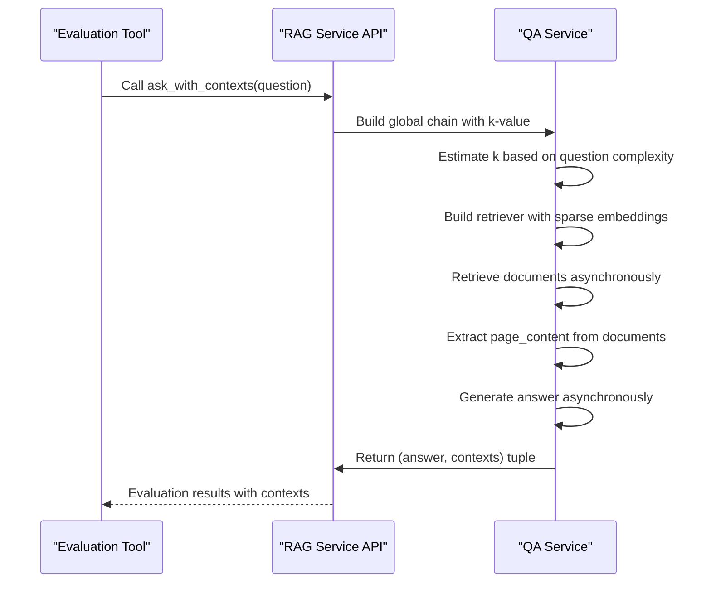
```mermaid
sequenceDiagram
participant EvalTool as "Evaluation Tool"
participant RAGAPI as "RAG Service API"
participant QAService as "QA Service"
EvalTool->>RAGAPI : Call ask_with_contexts(question)
RAGAPI->>QAService : Build global chain with k-value
QAService->>QAService : Estimate k based on question complexity
QAService->>QAService : Build retriever with sparse embeddings
QAService->>QAService : Retrieve documents asynchronously
QAService->>QAService : Extract page_content from documents
QAService->>QAService : Generate answer asynchronously
QAService->>RAGAPI : Return (answer, contexts) tuple
RAGAPI-->>EvalTool : Evaluation results with contexts
```

**Diagram sources**
- [packages/rag_service/src/cafetera_rag_service/qa_service.py:227-278](file://packages/rag_service/src/cafetera_rag_service/qa_service.py#L227-L278)
- [ragas/evaluate.py:127](file://ragas/evaluate.py#L127)

**Updated** Added comprehensive evaluation capabilities with ask_with_contexts method

Key evaluation features:
- **Context Retrieval**: Retrieves both answers and relevant document contexts for evaluation
- **K-Value Estimation**: Adaptive k-value calculation based on question complexity
- **Sparse Embedding Support**: Utilizes BM25 sparse embeddings for improved context retrieval
- **Error Handling**: Graceful handling of retrieval and generation failures
- **Evaluation Pipeline Integration**: Designed specifically for RAGAS evaluation framework
- **Performance Optimization**: Efficient retrieval and generation with proper error propagation

**Section sources**
- [packages/rag_service/src/cafetera_rag_service/qa_service.py:227-278](file://packages/rag_service/src/cafetera_rag_service/qa_service.py#L227-L278)
- [ragas/evaluate.py:127](file://ragas/evaluate.py#L127)

### Enhanced SSE Streaming Architecture with Robust Error Handling
The streaming architecture now implements comprehensive error handling patterns for both global and document-specific streaming:

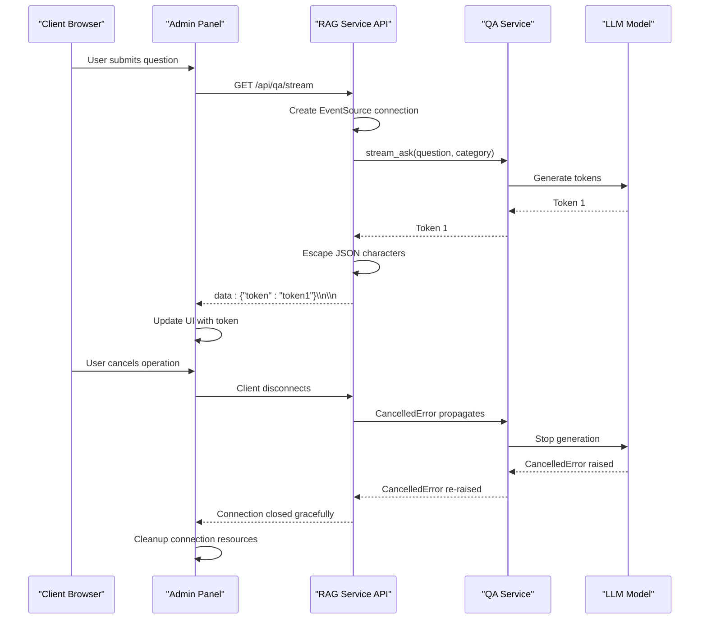
```mermaid
sequenceDiagram
participant Client as "Client Browser"
participant AdminUI as "Admin Panel"
participant RAGAPI as "RAG Service API"
participant QAService as "QA Service"
participant LLM as "LLM Model"
Client->>AdminUI : User submits question
AdminUI->>RAGAPI : GET /api/qa/stream
RAGAPI->>RAGAPI : Create EventSource connection
RAGAPI->>QAService : stream_ask(question, category)
QAService->>LLM : Generate tokens
LLM-->>QAService : Token 1
QAService-->>RAGAPI : Token 1
RAGAPI->>RAGAPI : Escape JSON characters
RAGAPI-->>AdminUI : data : {"token" : "token1"}\\n\\n
AdminUI->>AdminUI : Update UI with token
Client->>AdminUI : User cancels operation
AdminUI->>RAGAPI : Client disconnects
RAGAPI->>QAService : CancelledError propagates
QAService->>LLM : Stop generation
LLM-->>QAService : CancelledError raised
QAService-->>RAGAPI : CancelledError re-raised
RAGAPI-->>AdminUI : Connection closed gracefully
AdminUI->>AdminUI : Cleanup connection resources
```

**Diagram sources**
- [packages/rag_service/src/cafetera_rag_service/api/qa.py:63-89](file://packages/rag_service/src/cafetera_rag_service/api/qa.py#L63-L89)
- [packages/admin/src/cafetera_admin/api/documents_qa.py:36-59](file://packages/admin/src/cafetera_admin/api/documents_qa.py#L36-L59)
- [static/js/components.js:463-502](file://static/js/components.js#L463-L502)

**Updated** Enhanced with comprehensive SSE streaming implementation and proper error handling patterns including asyncio.CancelledError support

Streaming architecture improvements:
- **Real-time Token Delivery**: Immediate token-by-token response delivery with proper escaping
- **EventSource Integration**: Client-side EventSource for automatic reconnection and cancellation handling
- **Connection Management**: Graceful connection closure and cleanup with proper resource deallocation
- **Error Propagation**: Comprehensive error handling with user-friendly messages and proper logging
- **Cancellation Support**: Proper handling of client disconnections with immediate resource cleanup
- **API Consistency**: Both global and document-specific streaming endpoints handle errors identically

**Section sources**
- [packages/rag_service/src/cafetera_rag_service/api/qa.py:63-89](file://packages/rag_service/src/cafetera_rag_service/api/qa.py#L63-L89)
- [packages/admin/src/cafetera_admin/api/documents_qa.py:36-59](file://packages/admin/src/cafetera_admin/api/documents_qa.py#L36-L59)
- [static/js/components.js:463-502](file://static/js/components.js#L463-L502)

### SSE Error Handling Patterns with asyncio.CancelledError Support
The streaming system implements robust error handling patterns specifically designed to handle asyncio.CancelledError for proper client disconnection management:

```mermaid
flowchart TD
Start["SSE Stream Request"] --> TryBlock["Try Block Execution"]
TryBlock --> NormalFlow["Normal Token Streaming"]
NormalFlow --> DoneEvent["Emit Done Event"]
DoneEvent --> CloseConn["Close Connection"]
TryBlock --> CancelError{"CancelledError?"}
CancelError --> |Yes| LogDisconnect["Log Client Disconnection"]
CancelError --> |No| OtherError{"Other Exception?"}
OtherError --> |Yes| LogError["Log Detailed Error"]
OtherError --> |No| HandleError["Handle Specific Error"]
LogDisconnect --> RaiseCancel["Re-raise CancelledError"]
RaiseCancel --> CloseConn
LogError --> EmitError["Emit Error Event"]
HandleError --> EmitError
EmitError --> CloseConn
CloseConn --> End["Stream Terminated"]
```

**Diagram sources**
- [packages/rag_service/src/cafetera_rag_service/api/qa.py:78-83](file://packages/rag_service/src/cafetera_rag_service/api/qa.py#L78-L83)
- [packages/admin/src/cafetera_admin/api/documents_qa.py:45-50](file://packages/admin/src/cafetera_admin/api/documents_qa.py#L45-L50)

**Updated** Enhanced with comprehensive error handling patterns for streaming responses including asyncio.CancelledError support

Error handling improvements:
- **Client Disconnection**: Proper logging and re-raising of `asyncio.CancelledError` for immediate cleanup
- **System Errors**: Detailed error logging with exception information and user-friendly error messages
- **Network Issues**: Proper error propagation with connection closure and cleanup
- **Graceful Degradation**: Connection closure with error notification for recoverable failures
- **Resource Cleanup**: Proper resource deallocation on stream termination regardless of error type
- **API Consistency**: Both streaming endpoints handle errors identically with proper cancellation support

**Section sources**
- [packages/rag_service/src/cafetera_rag_service/api/qa.py:78-83](file://packages/rag_service/src/cafetera_rag_service/api/qa.py#L78-L83)
- [packages/admin/src/cafetera_admin/api/documents_qa.py:45-50](file://packages/admin/src/cafetera_admin/api/documents_qa.py#L45-L50)

### Client-Side SSE Event Handling with Cancellation Support
The client-side implementation provides comprehensive SSE event handling with proper state management and cancellation support:

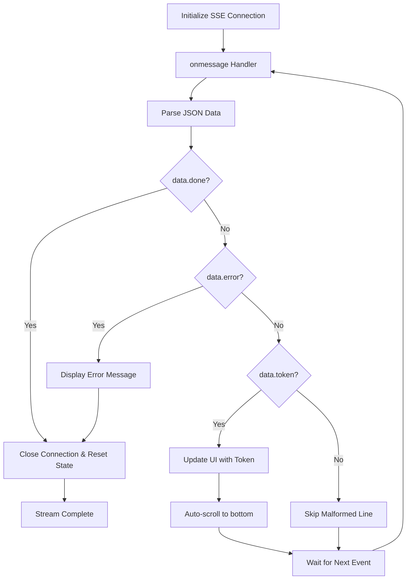
```mermaid
flowchart TD
Init["Initialize SSE Connection"] --> OnMessage["onmessage Handler"]
OnMessage --> ParseData["Parse JSON Data"]
ParseData --> CheckDone{"data.done?"}
CheckDone --> |Yes| CloseStream["Close Connection & Reset State"]
CheckDone --> |No| CheckError{"data.error?"}
CheckError --> |Yes| ShowError["Display Error Message"]
CheckError --> |No| CheckToken{"data.token?"}
CheckToken --> |Yes| UpdateUI["Update UI with Token"]
CheckToken --> |No| SkipLine["Skip Malformed Line"]
ShowError --> CloseStream
UpdateUI --> ScrollToBottom["Auto-scroll to bottom"]
ScrollToBottom --> WaitNext["Wait for Next Event"]
WaitNext --> OnMessage
SkipLine --> WaitNext
CloseStream --> End["Stream Complete"]
```

**Diagram sources**
- [static/js/components.js:466-493](file://static/js/components.js#L466-L493)
- [static/js/components.js:515-542](file://static/js/components.js#L515-L542)

**Updated** Enhanced with comprehensive client-side SSE event handling and state management including cancellation support

Client-side improvements:
- **State Management**: Track loading states and error conditions with proper cleanup
- **Event Parsing**: Robust JSON parsing with error handling and cancellation detection
- **Connection Monitoring**: Automatic error detection and reporting with proper cleanup
- **UI Updates**: Real-time UI updates with proper scrolling and cancellation handling
- **Cleanup Logic**: Proper connection closure and resource cleanup on cancellation
- **Malformed Data Handling**: Graceful handling of malformed SSE events and cancellation signals

**Section sources**
- [static/js/components.js:466-493](file://static/js/components.js#L466-L493)
- [static/js/components.js:515-542](file://static/js/components.js#L515-L542)

### Streaming Endpoint Implementation with Enhanced Error Handling
The RAG Service provides dedicated streaming endpoints for both global and document-specific questions with comprehensive error handling:

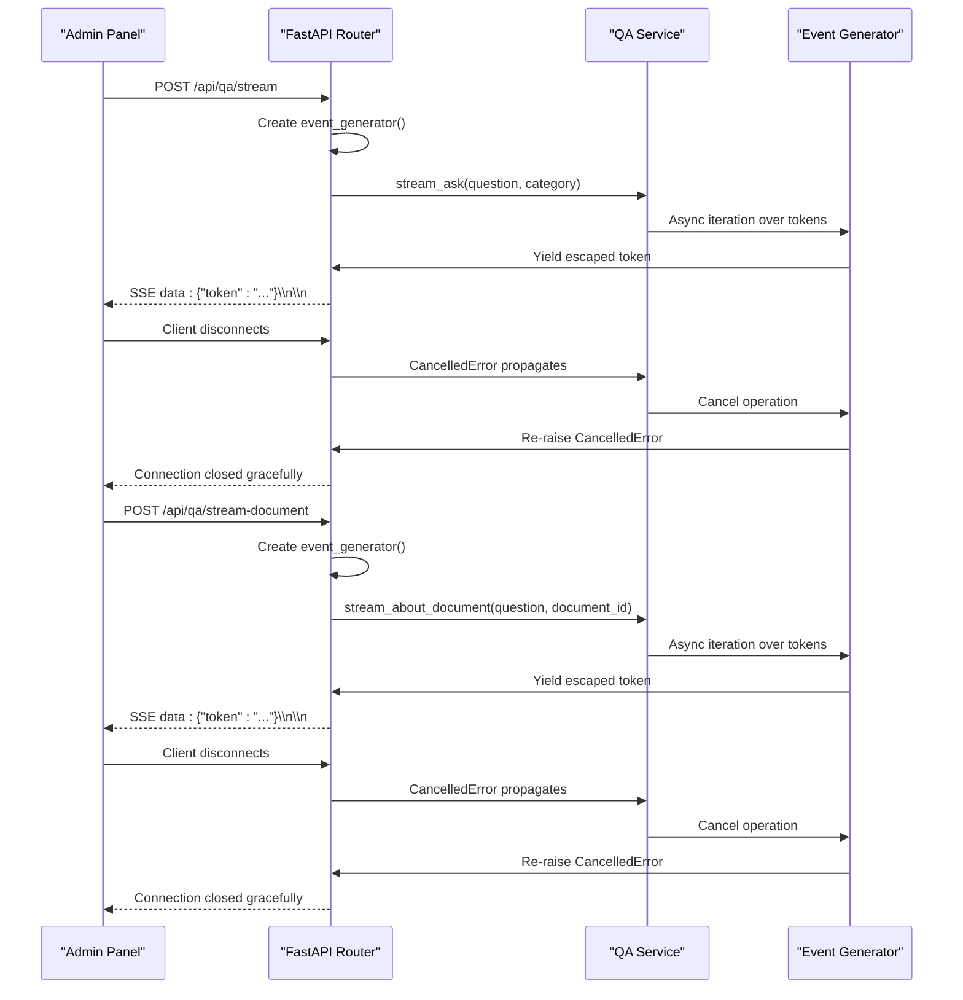
```mermaid
sequenceDiagram
participant Admin as "Admin Panel"
participant API as "FastAPI Router"
participant QA as "QA Service"
participant Stream as "Event Generator"
Admin->>API : POST /api/qa/stream
API->>API : Create event_generator()
API->>QA : stream_ask(question, category)
QA->>Stream : Async iteration over tokens
Stream->>API : Yield escaped token
API-->>Admin : SSE data : {"token" : "..."}\\n\\n
Admin->>API : Client disconnects
API->>QA : CancelledError propagates
QA->>Stream : Cancel operation
Stream->>API : Re-raise CancelledError
API-->>Admin : Connection closed gracefully
Admin->>API : POST /api/qa/stream-document
API->>API : Create event_generator()
API->>QA : stream_about_document(question, document_id)
QA->>Stream : Async iteration over tokens
Stream->>API : Yield escaped token
API-->>Admin : SSE data : {"token" : "..."}\\n\\n
Admin->>API : Client disconnects
API->>QA : CancelledError propagates
QA->>Stream : Cancel operation
Stream->>API : Re-raise CancelledError
API-->>Admin : Connection closed gracefully
```

**Diagram sources**
- [packages/rag_service/src/cafetera_rag_service/api/qa.py:63-89](file://packages/rag_service/src/cafetera_rag_service/api/qa.py#L63-L89)
- [packages/rag_service/src/cafetera_rag_service/api/qa.py:101-127](file://packages/rag_service/src/cafetera_rag_service/api/qa.py#L101-L127)

**Updated** Enhanced with comprehensive streaming endpoint implementation for both global and document-specific queries including asyncio.CancelledError support

Streaming endpoint improvements:
- **Global Questions**: `/api/qa/stream` for knowledge base-wide queries with proper cancellation handling
- **Document-Specific**: `/api/qa/stream-document` for document-scoped queries with cancellation support
- **Token Streaming**: Real-time token delivery with proper escaping and cancellation detection
- **Connection Headers**: Appropriate caching and connection management headers with proper cleanup
- **Error Propagation**: Consistent error handling across both endpoint types with asyncio.CancelledError support
- **Client Compatibility**: SSE-compliant response format for EventSource with proper cancellation handling
- **Resource Management**: Proper resource cleanup on client disconnection or server errors

**Section sources**
- [packages/rag_service/src/cafetera_rag_service/api/qa.py:63-89](file://packages/rag_service/src/cafetera_rag_service/api/qa.py#L63-L89)
- [packages/rag_service/src/cafetera_rag_service/api/qa.py:101-127](file://packages/rag_service/src/cafetera_rag_service/api/qa.py#L101-L127)

### RAG Microservice API Endpoints
The RAG Service exposes several HTTP endpoints for health checks, document indexing, ingestion, and question answering:

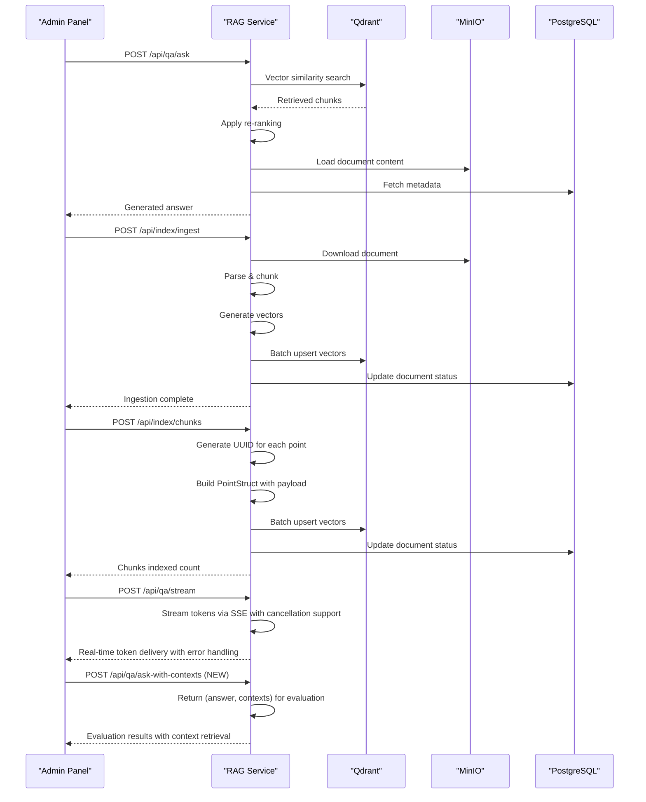
```mermaid
sequenceDiagram
participant Admin as "Admin Panel"
participant RAG as "RAG Service"
participant Qdrant as "Qdrant"
participant S3 as "MinIO"
participant DB as "PostgreSQL"
Admin->>RAG : POST /api/qa/ask
RAG->>Qdrant : Vector similarity search
Qdrant-->>RAG : Retrieved chunks
RAG->>RAG : Apply re-ranking
RAG->>S3 : Load document content
RAG->>DB : Fetch metadata
RAG-->>Admin : Generated answer
Admin->>RAG : POST /api/index/ingest
RAG->>S3 : Download document
RAG->>RAG : Parse & chunk
RAG->>RAG : Generate vectors
RAG->>Qdrant : Batch upsert vectors
RAG->>DB : Update document status
RAG-->>Admin : Ingestion complete
Admin->>RAG : POST /api/index/chunks
RAG->>RAG : Generate UUID for each point
RAG->>RAG : Build PointStruct with payload
RAG->>Qdrant : Batch upsert vectors
RAG->>DB : Update document status
RAG-->>Admin : Chunks indexed count
Admin->>RAG : POST /api/qa/stream
RAG->>RAG : Stream tokens via SSE with cancellation support
RAG-->>Admin : Real-time token delivery with error handling
Admin->>RAG : POST /api/qa/ask-with-contexts (NEW)
RAG->>RAG : Return (answer, contexts) for evaluation
RAG-->>Admin : Evaluation results with context retrieval
```

**Diagram sources**
- [packages/rag_service/src/cafetera_rag_service/api/qa.py](file://packages/rag_service/src/cafetera_rag_service/api/qa.py)
- [packages/rag_service/src/cafetera_rag_service/api/ingest.py](file://packages/rag_service/src/cafetera_rag_service/api/ingest.py)
- [packages/rag_service/src/cafetera_rag_service/api/indexing.py](file://packages/rag_service/src/cafetera_rag_service/api/indexing.py)
- [packages/rag_service/src/cafetera_rag_service/rag/chain.py](file://packages/rag_service/src/cafetera_rag_service/rag/chain.py)

**Updated** Added new evaluation endpoint for ask_with_contexts method

Key endpoint categories:
- Health monitoring: `/api/health`
- Question answering: `/api/qa/ask`, `/api/qa/stream`, `/api/qa/ask-document`, `/api/qa/stream-document`
- **New Evaluation**: `/api/qa/ask-with-contexts` for evaluation purposes returning answers and contexts
- Document ingestion: `/api/index/ingest`
- Document indexing: `/api/index/chunks`, `/api/index/documents/{id}`, `/api/index/documents/{id}/search`, `/api/index/cache/invalidate`

**Section sources**
- [packages/rag_service/src/cafetera_rag_service/api/health.py](file://packages/rag_service/src/cafetera_rag_service/api/health.py)
- [packages/rag_service/src/cafetera_rag_service/api/qa.py](file://packages/rag_service/src/cafetera_rag_service/api/qa.py)
- [packages/rag_service/src/cafetera_rag_service/api/indexing.py](file://packages/rag_service/src/cafetera_rag_service/api/indexing.py)
- [packages/rag_service/src/cafetera_rag_service/api/ingest.py](file://packages/rag_service/src/cafetera_rag_service/api/ingest.py)

### Complete Document Ingestion Pipeline
The ingestion pipeline now provides a complete end-to-end workflow from S3 storage to vector indexing with enhanced Russian text preprocessing:

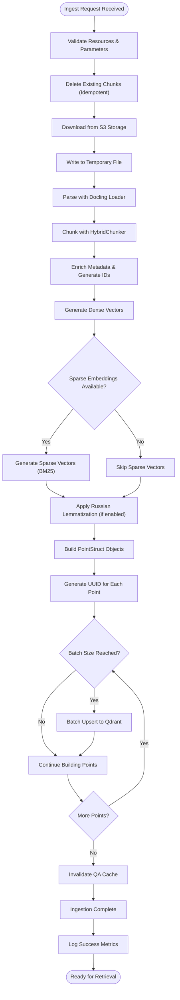
```mermaid
flowchart TD
Start(["Ingest Request Received"]) --> Validate["Validate Resources & Parameters"]
Validate --> DeleteExisting["Delete Existing Chunks (Idempotent)"]
DeleteExisting --> Download["Download from S3 Storage"]
Download --> TempFile["Write to Temporary File"]
TempFile --> Parse["Parse with Docling Loader"]
Parse --> Chunk["Chunk with HybridChunker"]
Chunk --> Enrich["Enrich Metadata & Generate IDs"]
Enrich --> Embed["Generate Dense Vectors"]
Embed --> SparseCheck{"Sparse Embeddings Available?"}
SparseCheck --> |Yes| Sparse["Generate Sparse Vectors (BM25)"]
SparseCheck --> |No| SkipSparse["Skip Sparse Vectors"]
Sparse --> RussianPreprocess["Apply Russian Lemmatization (if enabled)"]
SkipSparse --> RussianPreprocess
RussianPreprocess --> BuildPoints["Build PointStruct Objects"]
BuildPoints --> UUIDGen["Generate UUID for Each Point"]
UUIDGen --> BatchSize{"Batch Size Reached?"}
BatchSize --> |No| Continue["Continue Building Points"]
BatchSize --> |Yes| BatchUpsert["Batch Upsert to Qdrant"]
BatchUpsert --> Continue
Continue --> More{"More Points?"}
More --> |Yes| BatchSize
More --> |No| InvalidateCache["Invalidate QA Cache"]
InvalidateCache --> Complete["Ingestion Complete"]
Complete --> Log["Log Success Metrics"]
Log --> End(["Ready for Retrieval"])
```

**Diagram sources**
- [packages/rag_service/src/cafetera_rag_service/api/ingest.py:64-188](file://packages/rag_service/src/cafetera_rag_service/api/ingest.py#L64-L188)

**Updated** Enhanced with Russian text lemmatization for BM25 sparse embeddings

Key enhancements:
- **End-to-End Pipeline**: Complete workflow from S3 download to vector indexing
- **S3 Integration**: Direct integration with MinIO for document storage
- **Docling Parsing**: Advanced document parsing with layout preservation
- **Hybrid Vector Support**: Automatic detection and handling of both dense and sparse vectors
- **Russian Text Processing**: Optional lemmatization and stop-word removal for improved BM25 matching
- **Batch Processing**: Configurable batch size (`qdrant_upsert_batch_size`) for efficient vector upsert operations
- **UUID Generation**: Each indexed point receives a unique UUID for reliable identification
- **Metadata Enrichment**: Comprehensive metadata extraction and enrichment
- **Error Handling**: Comprehensive error handling with detailed logging

**Section sources**
- [packages/rag_service/src/cafetera_rag_service/api/ingest.py:64-188](file://packages/rag_service/src/cafetera_rag_service/api/ingest.py#L64-L188)
- [packages/rag_service/src/cafetera_rag_service/parser.py:48-111](file://packages/rag_service/src/cafetera_rag_service/parser.py#L48-L111)
- [packages/rag_service/src/cafetera_rag_service/config.py:54-58](file://packages/rag_service/src/cafetera_rag_service/config.py#L54-L58)

### Enhanced Indexing Pipeline
The indexing pipeline now supports batch processing with configurable batch sizes and generates unique UUIDs for each indexed point with enhanced Russian text preprocessing:

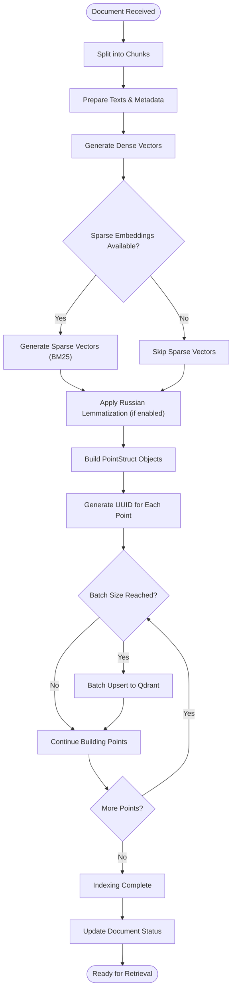
```mermaid
flowchart TD
Start(["Document Received"]) --> Split["Split into Chunks"]
Split --> Prepare["Prepare Texts & Metadata"]
Prepare --> Embed["Generate Dense Vectors"]
Embed --> SparseCheck{"Sparse Embeddings Available?"}
SparseCheck --> |Yes| Sparse["Generate Sparse Vectors (BM25)"]
SparseCheck --> |No| SkipSparse["Skip Sparse Vectors"]
Sparse --> RussianPreprocess["Apply Russian Lemmatization (if enabled)"]
SkipSparse --> RussianPreprocess
RussianPreprocess --> BuildPoints["Build PointStruct Objects"]
BuildPoints --> UUIDGen["Generate UUID for Each Point"]
UUIDGen --> BatchSize{"Batch Size Reached?"}
BatchSize --> |No| Continue["Continue Building Points"]
BatchSize --> |Yes| BatchUpsert["Batch Upsert to Qdrant"]
BatchUpsert --> Continue
Continue --> More{"More Points?"}
More --> |Yes| BatchSize
More --> |No| Complete["Indexing Complete"]
Complete --> UpdateDB["Update Document Status"]
UpdateDB --> End(["Ready for Retrieval"])
```

**Diagram sources**
- [packages/rag_service/src/cafetera_rag_service/api/indexing.py:26-110](file://packages/rag_service/src/cafetera_rag_service/api/indexing.py#L26-L110)

**Updated** Enhanced with Russian text lemmatization for BM25 sparse embeddings

Key enhancements:
- **Batch Processing**: Configurable batch size (`qdrant_upsert_batch_size`) for efficient vector upsert operations
- **UUID Generation**: Each indexed point receives a unique UUID for reliable identification
- **PointStruct Construction**: Proper payload formatting with `page_content` and `metadata` fields
- **Hybrid Vector Support**: Automatic detection and handling of both dense and sparse vectors
- **Russian Text Processing**: Optional lemmatization and stop-word removal for improved BM25 matching

**Section sources**
- [packages/rag_service/src/cafetera_rag_service/api/indexing.py:26-110](file://packages/rag_service/src/cafetera_rag_service/api/indexing.py#L26-L110)
- [packages/rag_service/src/cafetera_rag_service/config.py:27](file://packages/rag_service/src/cafetera_rag_service/config.py#L27)

### Document Search Control and Management
The system now provides comprehensive search control at the document level:

```mermaid
flowchart TD
Document(["Document Indexed"]) --> SearchEnabled["is_search_enabled = True"]
SearchEnabled --> Query["User Query"]
Query --> Filter["Filter by is_search_enabled"]
Filter --> Results["Return Matching Documents"]
SearchEnabled --> Toggle["Admin Toggle Search"]
Toggle --> UpdatePayload["Update Payload in Qdrant"]
UpdatePayload --> InvalidateCache["Invalidate QA Cache"]
InvalidateCache --> ApplyChange["New Retrievals Reflect Change"]
ApplyChange --> Query
```

**Diagram sources**
- [packages/rag_service/src/cafetera_rag_service/api/indexing.py:150-199](file://packages/rag_service/src/cafetera_rag_service/api/indexing.py#L150-L199)

Key features:
- **Document-Level Control**: Individual documents can be enabled/disabled for search
- **Payload Indexing**: Efficient filtering using Qdrant payload indexes
- **Cache Invalidation**: Automatic cache clearing when search status changes
- **Granular Access Control**: Fine-grained control over document visibility

**Section sources**
- [packages/rag_service/src/cafetera_rag_service/api/indexing.py:150-199](file://packages/rag_service/src/cafetera_rag_service/api/indexing.py#L150-L199)

### Hybrid Search Implementation
The retriever now supports hybrid search combining dense and sparse embeddings with enhanced Russian text preprocessing:

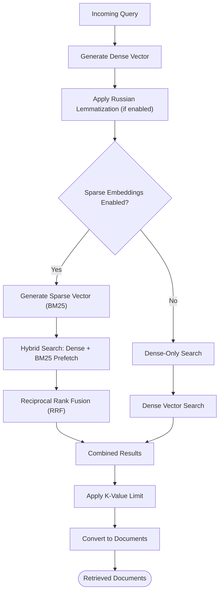
```mermaid
flowchart TD
Query["Incoming Query"] --> DenseVec["Generate Dense Vector"]
DenseVec --> RussianPreprocess["Apply Russian Lemmatization (if enabled)"]
RussianPreprocess --> HybridCheck{"Sparse Embeddings Enabled?"}
HybridCheck --> |Yes| SparseVec["Generate Sparse Vector (BM25)"]
HybridCheck --> |No| DenseOnly["Dense-Only Search"]
SparseVec --> HybridSearch["Hybrid Search: Dense + BM25 Prefetch"]
DenseOnly --> DenseSearch["Dense Vector Search"]
HybridSearch --> RRFFusion["Reciprocal Rank Fusion (RRF)"]
RRFFusion --> Results["Combined Results"]
DenseSearch --> Results
Results --> Limit["Apply K-Value Limit"]
Limit --> Docs["Convert to Documents"]
Docs --> End(["Retrieved Documents"])
```

**Diagram sources**
- [packages/rag_service/src/cafetera_rag_service/rag/retriever.py:48-93](file://packages/rag_service/src/cafetera_rag_service/rag/retriever.py#L48-L93)

**Updated** Enhanced with Russian text lemmatization for improved BM25 sparse embeddings

Core hybrid search features:
- **Dense + Sparse Prefetch**: Combines semantic similarity with lexical matching
- **Russian Text Processing**: Optional lemmatization and stop-word removal for improved BM25 matching
- **RRF Fusion**: Reciprocal Rank Fusion combines results from both search modes
- **Adaptive k-values**: Different retrieval depths based on question complexity
- **Graceful Degradation**: Falls back to dense-only search if sparse embeddings unavailable

**Section sources**
- [packages/rag_service/src/cafetera_rag_service/rag/retriever.py:48-93](file://packages/rag_service/src/cafetera_rag_service/rag/retriever.py#L48-L93)
- [packages/rag_service/src/cafetera_rag_service/rag/retriever.py:183-196](file://packages/rag_service/src/cafetera_rag_service/rag/retriever.py#L183-L196)

### RAG Pipeline Implementation
The RAG pipeline combines vector retrieval with re-ranking and contextual generation:

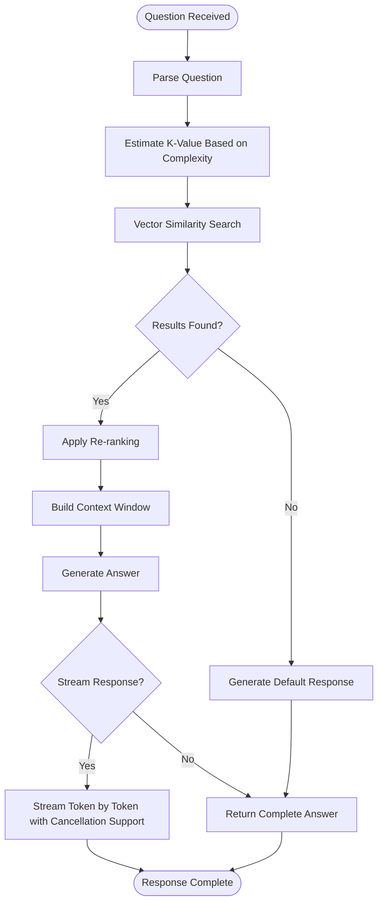
```mermaid
flowchart TD
Start(["Question Received"]) --> Parse["Parse Question"]
Parse --> EstimateK["Estimate K-Value Based on Complexity"]
EstimateK --> Retrieve["Vector Similarity Search"]
Retrieve --> HasResults{"Results Found?"}
HasResults --> |No| GenerateDefault["Generate Default Response"]
HasResults --> |Yes| Rerank["Apply Re-ranking"]
Rerank --> Context["Build Context Window"]
Context --> Generate["Generate Answer"]
Generate --> Stream{"Stream Response?"}
Stream --> |Yes| StreamTokens["Stream Token by Token with Cancellation Support"]
Stream --> |No| ReturnAnswer["Return Complete Answer"]
GenerateDefault --> ReturnAnswer
StreamTokens --> End(["Response Complete"])
ReturnAnswer --> End
```

**Diagram sources**
- [packages/rag_service/src/cafetera_rag_service/rag/chain.py](file://packages/rag_service/src/cafetera_rag_service/rag/chain.py)
- [packages/rag_service/src/cafetera_rag_service/rag/retriever.py](file://packages/rag_service/src/cafetera_rag_service/rag/retriever.py)
- [packages/rag_service/src/cafetera_rag_service/rag/reranker.py](file://packages/rag_service/src/cafetera_rag_service/rag/reranker.py)

**Updated** Enhanced with comprehensive streaming error handling including asyncio.CancelledError support

Core pipeline components:
- Vector retriever: Uses Qdrant for semantic similarity search with hybrid capabilities
- Re-ranking: Improves relevance of retrieved chunks
- Context builder: Assembles relevant document segments
- **Enhanced Streaming**: Provides real-time response tokens with proper cancellation handling
- **Evaluation Support**: New ask_with_contexts method for comprehensive evaluation

**Section sources**
- [packages/rag_service/src/cafetera_rag_service/rag/chain.py](file://packages/rag_service/src/cafetera_rag_service/rag/chain.py)
- [packages/rag_service/src/cafetera_rag_service/rag/retriever.py](file://packages/rag_service/src/cafetera_rag_service/rag/retriever.py)
- [packages/rag_service/src/cafetera_rag_service/rag/reranker.py](file://packages/rag_service/src/cafetera_rag_service/rag/reranker.py)

### Resource Management and Caching
The system implements comprehensive resource management and caching strategies:

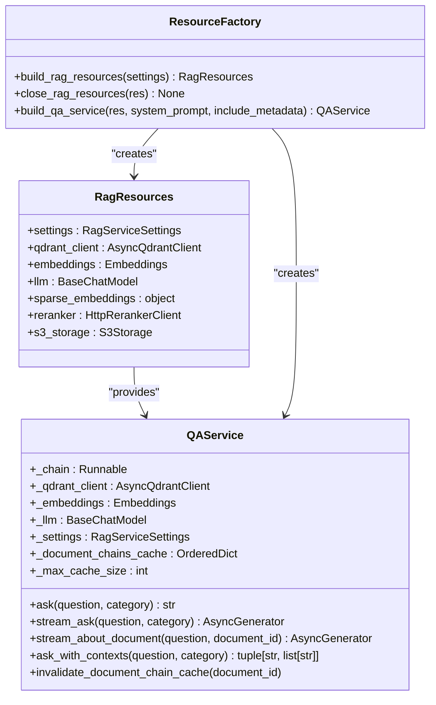
```mermaid
classDiagram
class RagResources {
+settings : RagServiceSettings
+qdrant_client : AsyncQdrantClient
+embeddings : Embeddings
+llm : BaseChatModel
+sparse_embeddings : object
+reranker : HttpRerankerClient
+s3_storage : S3Storage
}
class QAService {
+_chain : Runnable
+_qdrant_client : AsyncQdrantClient
+_embeddings : Embeddings
+_llm : BaseChatModel
+_settings : RagServiceSettings
+_document_chains_cache : OrderedDict
+_max_cache_size : int
+ask(question, category) str
+stream_ask(question, category) AsyncGenerator
+stream_about_document(question, document_id) AsyncGenerator
+ask_with_contexts(question, category) tuple[str, list[str]]
+invalidate_document_chain_cache(document_id)
}
class ResourceFactory {
+build_rag_resources(settings) RagResources
+close_rag_resources(res) None
+build_qa_service(res, system_prompt, include_metadata) QAService
}
RagResources --> QAService : "provides"
ResourceFactory --> RagResources : "creates"
ResourceFactory --> QAService : "creates"
```

**Diagram sources**
- [packages/rag_service/src/cafetera_rag_service/resources.py](file://packages/rag_service/src/cafetera_rag_service/resources.py)
- [packages/rag_service/src/cafetera_rag_service/qa_service.py](file://packages/rag_service/src/cafetera_rag_service/qa_service.py)

**Updated** Enhanced with new ask_with_contexts method for evaluation capabilities

Key features:
- **Resource Factory**: Centralized resource initialization and cleanup
- **LRU Cache**: Document-specific chain caching with size limits
- **Graceful Degradation**: Optional components (sparse embeddings, reranker) with fallback
- **Collection Management**: Automatic Qdrant collection creation and configuration
- **Evaluation Support**: New method for comprehensive evaluation with context retrieval

**Section sources**
- [packages/rag_service/src/cafetera_rag_service/resources.py](file://packages/rag_service/src/cafetera_rag_service/resources.py)
- [packages/rag_service/src/cafetera_rag_service/qa_service.py](file://packages/rag_service/src/cafetera_rag_service/qa_service.py)

### Client Integration Patterns
Both Admin Panel and VK Bot integrate with the RAG Service through the shared RAG Client:

```mermaid
classDiagram
class RAGClient {
+ask(question, system_prompt, category, include_metadata) str
+stream_ask(question, system_prompt, category, include_metadata) AsyncIterator[str]
+stream_about_document(question, document_id) AsyncIterator[str]
+ask_with_contexts(question, category) tuple[str, list[str]]
+index_chunks(document_id, filename, chunks, is_search_enabled) int
+delete_document(document_id) None
+invalidate_cache(document_id) None
+health() dict[str, str]
+aclose() None
}
class AdminPanel {
+upload_document(file)
+monitor_processing()
+manage_categories()
}
class VKBot {
+handle_message(message)
+process_question(question)
}
class EvaluationTool {
+run_evaluation(testset) list[dict]
+collect_answers(samples) list[dict]
}
AdminPanel --> RAGClient : "HTTP requests"
VKBot --> RAGClient : "HTTP requests"
EvaluationTool --> RAGClient : "ask_with_contexts()"
```

**Diagram sources**
- [packages/core/src/cafetera_core/rag_client.py:15-151](file://packages/core/src/cafetera_core/rag_client.py#L15-L151)

**Updated** Enhanced with new ask_with_contexts method for evaluation tool integration

Integration patterns:
- Authentication via API key header with constant-time comparison
- Configurable timeouts for normal and indexing operations
- Support for both synchronous answers, streaming responses, and evaluation contexts
- Document lifecycle management (index, delete, cache invalidation)
- **New Evaluation Integration**: Seamless integration with RAGAS evaluation framework

**Section sources**
- [packages/core/src/cafetera_core/rag_client.py:15-151](file://packages/core/src/cafetera_core/rag_client.py#L15-L151)

### Infrastructure Dependencies
The system relies on three core infrastructure services managed via Docker Compose:

```mermaid
graph TB
subgraph "Docker Compose Services"
QDRANT["Qdrant Service<br/>ports 6333-6334"]
MINIO["MinIO Service<br/>ports 9000-9001"]
PG["PostgreSQL Service<br/>port 5432"]
RAG["RAG Service<br/>port 8001"]
ADMIN["Admin Service<br/>port 8000"]
VK["VK Bot Service"]
EVAL["Evaluation Tool"]
LLAMACPP_RERANKER["llama.cpp Reranker<br/>port 8082"]
LLAMACPP_EMBEDDINGS["llama.cpp Embeddings<br/>port 8090"]
LLAMACPP_LLM["llama.cpp LLM<br/>port 8080"]
end
RAG --> QDRANT
RAG --> MINIO
RAG --> PG
ADMIN --> RAG
VK --> RAG
EVAL --> RAG
RAG --> LLAMACPP_RERANKER
RAG --> LLAMACPP_EMBEDDINGS
RAG --> LLAMACPP_LLM
```

**Diagram sources**
- [docker-compose.yml:1-139](file://docker-compose.yml#L1-L139)

Infrastructure characteristics:
- Health checks for automatic service readiness
- Persistent volumes for data durability
- Environment variable overrides for external AI providers
- Host gateway configuration for local AI model access
- Dedicated RAG service container with separate build process
- **Evaluation Tool Integration**: Support for external evaluation tool access
- **llama.cpp Integration**: Dedicated servers for LLM, embeddings, and reranking
- **HTTP-based Reranking**: Configurable reranking via external llama.cpp server

**Section sources**
- [docker-compose.yml:1-139](file://docker-compose.yml#L1-L139)
- [Dockerfile.rag_service:1-98](file://Dockerfile.rag_service#L1-L98)
- [docs/llamacpp.md:143-174](file://docs/llamacpp.md#L143-L174)

## Dependency Analysis
The workspace uses a Python monorepo with explicit package dependencies:

```mermaid
graph TB
subgraph "Workspace Dependencies"
CORE["cafetera-core"]
ADMIN["cafetera-admin"]
VKBOT["cafetera-vk-bot"]
RAG["cafetera-rag-service"]
EVAL["evaluation-tool"]
end
ADMIN --> CORE
VKBOT --> CORE
RAG --> CORE
EVAL --> RAG
subgraph "External Dependencies"
FASTAPI["fastapi"]
LANGCHAIN["langchain-*"]
QDRANT["qdrant-client"]
HTTPX["httpx"]
PYDANTIC["pydantic-settings"]
SECRETS["secrets (Python stdlib)"]
DOCLING["docling"]
FASTEMBED["fastembed"]
PYMORPHY3["pymorphy3"]
ASYNCIO["asyncio"]
LLAMACPP["llama.cpp servers"]
END
ADMIN --> FASTAPI
ADMIN --> PYDANTIC
RAG --> FASTAPI
RAG --> LANGCHAIN
RAG --> QDRANT
RAG --> HTTPX
RAG --> SECRETS
RAG --> DOCLING
RAG --> FASTEMBED
RAG --> PYMORPHY3
RAG --> ASYNCIO
CORE --> HTTPX
CORE --> PYDANTIC
EVAL --> ASYNCIO
```

**Diagram sources**
- [packages/admin/pyproject.toml:6-18](file://packages/admin/pyproject.toml#L6-L18)
- [packages/rag_service/pyproject.toml:6-16](file://packages/rag_service/pyproject.toml#L6-L16)
- [packages/core/pyproject.toml:6-12](file://packages/core/pyproject.toml#L6-L12)

**Updated** Enhanced with Russian language processing dependencies and asyncio integration

Key dependency patterns:
- Core package provides shared utilities and storage abstractions
- Admin and VK Bot depend on Core for configuration and HTTP client
- RAG Service depends on Core plus AI/ML libraries (LangChain, Qdrant, Docling, FastEmbed)
- **New Evaluation Tool**: External evaluation tool integration with asyncio support
- **Enhanced Async Support**: Comprehensive asyncio integration for streaming and cancellation
- **New Russian Language Support**: pymorphy3 dependency for morphological lemmatization
- **llama.cpp Integration**: Dedicated server dependencies for HTTP-based reranking
- **HTTP-based Reranking**: httpx dependency for external reranker communication
- Security enhancements rely on Python standard library `secrets` module
- Workspace configuration ensures consistent Python version and tooling

**Section sources**
- [pyproject.toml:35-42](file://pyproject.toml#L35-L42)
- [packages/admin/pyproject.toml:6-18](file://packages/admin/pyproject.toml#L6-L18)
- [packages/rag_service/pyproject.toml:6-16](file://packages/rag_service/pyproject.toml#L6-L16)
- [packages/core/pyproject.toml:6-12](file://packages/core/pyproject.toml#L6-L12)

## Performance Considerations
Performance characteristics and optimization opportunities:

- **Indexing Concurrency**: Configurable maximum concurrent indexing operations to balance throughput and resource usage
- **Batch Processing**: Configurable batch size for efficient vector upsert operations with reduced network overhead
- **Streaming Responses**: Real-time token streaming with proper cancellation handling reduces perceived latency for long answers
- **Vector Search Efficiency**: Qdrant provides optimized similarity search with configurable filters and limits
- **Hybrid Search Optimization**: Dense + sparse search fusion improves retrieval quality while maintaining performance
- **Russian Text Processing Overhead**: Optional lemmatization adds preprocessing cost but improves BM25 matching quality
- **Context Window Management**: Provider-specific context window handling optimizes memory usage and performance
- **Model Provider Flexibility**: Support for multiple AI providers allows selection based on deployment constraints
- **Caching Strategy**: Document content caching reduces repeated retrieval overhead
- **Timeout Management**: Separate timeouts for regular operations vs. indexing accommodate different performance profiles
- **Resource Pooling**: Shared embeddings and LLM instances reduce memory footprint
- **Collection Optimization**: INT8 scalar quantization and payload indexing improve query performance
- **Sampling Parameter Optimization**: Dynamic parameter forwarding reduces unnecessary parameter overhead
- **Streaming Connection Management**: Efficient SSE connection handling with proper resource cleanup and cancellation support
- **Error Recovery**: Robust error handling minimizes stream interruption impact with proper asyncio.CancelledError support
- **Evaluation Performance**: ask_with_contexts method optimized for batch evaluation scenarios
- **Async Resource Management**: Proper asyncio cancellation handling prevents resource leaks during streaming operations
- **llama.cpp Integration**: HTTP-based reranking adds latency but improves result quality
- **Russian Lemmatization Performance**: Optimized pymorphy3 processing for large document collections
- **Configurable Fallbacks**: Intelligent fallback mechanisms prevent performance degradation
- **Provider-Aware Optimization**: Enhanced parameter handling across different LLM providers

Best practices:
- Monitor Qdrant performance metrics and adjust collection configuration
- Tune chunk sizes and overlap for optimal retrieval quality
- Implement connection pooling for high-concurrency scenarios
- Use appropriate embedding models for target language and domain
- Configure batch sizes based on available memory and network bandwidth
- Enable sparse embeddings for better keyword matching
- Leverage provider-specific parameter tuning for optimal model performance
- **Consider Russian Content Volume**: Enable bm25_lemmatize for Russian-heavy document collections
- **Monitor Context Window Usage**: Adjust llm_num_ctx based on available memory and model constraints
- **Optimize Streaming**: Monitor SSE connection performance and implement proper connection limits with cancellation support
- **Handle Errors Gracefully**: Implement comprehensive error handling for streaming operations with asyncio.CancelledError support
- **Evaluation Efficiency**: Use ask_with_contexts method for batch evaluation to minimize redundant retrievals
- **llama.cpp Server Management**: Monitor reranker server performance and resource utilization
- **HTTP-based Reranking**: Balance reranking quality vs. latency based on application requirements

## Security Enhancements
The RAG Service now includes enhanced security measures:

- **Constant-Time Authentication**: API key validation uses `secrets.compare_digest` to prevent timing attacks
- **Configurable API Keys**: Optional API key enforcement for production environments
- **Environment-Based Security**: Development mode allows unauthenticated access while production requires keys
- **Secure Payload Handling**: Proper serialization of metadata and vector payloads
- **Resource Validation**: Comprehensive validation of external service availability
- **Error Containment**: Graceful degradation when critical services are unavailable
- **Streaming Security**: Proper SSE event escaping prevents XSS vulnerabilities
- **Connection Management**: Secure handling of streaming connections with proper cleanup and cancellation support
- **Asyncio Security**: Proper handling of asyncio.CancelledError prevents resource leaks and ensures clean shutdown

Security features:
- API key verification with constant-time comparison prevents timing attacks
- Graceful degradation when no API key is configured (development mode)
- Secure handling of sensitive configuration data
- Proper error handling without exposing internal details
- Resource initialization with comprehensive error handling
- **SSE Security**: Proper JSON escaping prevents XSS in streaming responses
- **Connection Cleanup**: Proper resource deallocation on stream termination with cancellation support
- **Async Cancellation**: Proper handling of asyncio.CancelledError prevents resource leaks

**Section sources**
- [packages/rag_service/src/cafetera_rag_service/api/deps.py:13-31](file://packages/rag_service/src/cafetera_rag_service/api/deps.py#L13-L31)
- [packages/rag_service/src/cafetera_rag_service/main.py:16-24](file://packages/rag_service/src/cafetera_rag_service/main.py#L16-L24)

## Troubleshooting Guide
Common issues and resolution strategies:

**Service Connectivity**
- Verify RAG Service health endpoint responds successfully
- Check Docker network connectivity between services
- Confirm proper environment variable configuration for AI providers
- Validate Qdrant collection existence and configuration

**Document Processing Issues**
- Review indexing operation logs for chunk processing failures
- Validate document format compatibility with parser components
- Monitor Qdrant availability and vector upsert operations
- Check batch size configuration for large document processing
- Verify S3 credentials and bucket accessibility

**Performance Problems**
- Adjust max_concurrent_indexing setting based on hardware capabilities
- Monitor memory usage during embedding generation
- Optimize chunk size and re-ranking parameters
- Configure appropriate batch sizes for network efficiency
- Enable sparse embeddings for better keyword matching

**Hybrid Search Issues**
- Verify sparse embedding model installation and availability
- Check BM25 model configuration and loading
- Monitor hybrid search performance compared to dense-only mode
- Validate vector dimension compatibility between dense and sparse embeddings

**LLM Configuration Issues**
- **Sampling Parameter Errors**: Verify environment variables are properly set (LLM_TEMPERATURE, LLM_TOP_P, LLM_TOP_K, LLM_PRESENCE_PENALTY)
- **Context Window Issues**: Check llm_num_ctx parameter is set appropriately for provider (default 8192)
- **Provider Mismatch**: Ensure selected provider supports desired parameters (presence_penalty only supported by OpenAI)
- **Context Window Errors**: Verify llm_num_ctx is within provider-supported range
- **Parameter Validation**: Check that parameter values are within acceptable ranges for the selected model
- **Fallback Behavior**: Verify graceful degradation when parameters are unsupported by the provider

**Russian Text Processing Issues**
- **Lemmatization Errors**: Verify pymorphy3 installation and model availability
- **Stop Word Issues**: Check bm25_lemmatize setting affects both indexing and retrieval consistently
- **Performance Impact**: Monitor preprocessing overhead for large document collections
- **Mixed Language Issues**: Verify English words are preserved during Russian lemmatization

**Streaming Architecture Issues**
- **Connection Problems**: Verify SSE connection establishment and maintenance
- **Event Handling**: Check client-side EventSource implementation and error handling
- **Memory Leaks**: Monitor streaming connection resources and cleanup with proper asyncio.CancelledError handling
- **Timeout Issues**: Configure appropriate streaming timeouts and connection limits
- **Error Propagation**: Verify proper error handling in both server and client code with cancellation support
- **Cancellation Handling**: Ensure proper asyncio.CancelledError propagation and resource cleanup

**Authentication Problems**
- Ensure API key is properly configured in .env file
- Verify X-API-Key header is included in all requests
- Check for timing attack prevention in authentication logs
- Confirm development vs production authentication modes

**Resource Initialization Failures**
- Verify Qdrant connection parameters and service availability
- Check embedding model availability and network connectivity
- Validate S3 credentials and bucket permissions
- Monitor resource factory initialization logs for detailed error information

**Integration Failures**
- Verify API key authentication for client services
- Check CORS configuration for Admin Panel integration
- Validate webhook endpoints for VK Bot integration
- Monitor Docker service dependencies and health checks

**Evaluation Tool Issues**
- **ask_with_contexts Method**: Verify method is properly exposed via API endpoints
- **Context Retrieval**: Check that evaluation tool can access both answers and contexts
- **Batch Processing**: Monitor performance of evaluation batches with proper error handling
- **Resource Management**: Ensure evaluation tool cleans up resources properly

**Asyncio and Cancellation Issues**
- **Cancellation Detection**: Verify proper asyncio.CancelledError handling in streaming methods
- **Resource Cleanup**: Check that streaming operations properly clean up resources on cancellation
- **Connection Limits**: Monitor streaming connection limits and proper cleanup
- **Error Logging**: Ensure comprehensive logging for asyncio-related errors and cancellations

**llama.cpp Server Issues**
- **Reranker Server**: Verify llama.cpp reranker server is running and accessible
- **Model Loading**: Check that reranker model loads successfully without GPU/CPU conflicts
- **HTTP Communication**: Monitor HTTP communication between RAG service and reranker server
- **Performance Tuning**: Adjust reranker parameters based on document collection size and query patterns
- **Resource Allocation**: Monitor GPU/CPU usage and memory consumption of llama.cpp servers

**Section sources**
- [packages/core/src/cafetera_core/config.py:34-36](file://packages/core/src/cafetera_core/config.py#L34-L36)
- [packages/core/src/cafetera_core/rag_client.py:26-32](file://packages/core/src/cafetera_core/rag_client.py#L26-L32)
- [docs/llamacpp.md:143-174](file://docs/llamacpp.md#L143-L174)

## Conclusion
The RAG Microservice Architecture provides a scalable, modular foundation for AI-powered document retrieval and question answering. The recent enhancements significantly improve functionality, security, and evaluation capabilities:

- **Complete Ingestion Pipeline**: Full end-to-end document processing from S3 to vector indexing
- **Enhanced Indexing**: Batch processing with configurable batch sizes and UUID generation for reliable point identification
- **Hybrid Search Capabilities**: Dense + sparse embeddings with BM25 support for improved retrieval quality
- **Comprehensive Search Control**: Document-level search enable/disable functionality with cache invalidation
- **Advanced Resource Management**: Sophisticated caching, resource pooling, and graceful degradation
- **Security Improvements**: Constant-time authentication and configurable API key enforcement
- **Robust Error Handling**: Comprehensive error handling with detailed logging throughout the pipeline
- **Containerized Deployment**: Dedicated RAG service container with optimized build process
- **Flexible AI Integration**: Support for multiple AI providers with graceful fallback mechanisms
- **Production-Ready Features**: S3 integration, comprehensive caching, and resource management
- **Enhanced LLM Configuration**: Dynamic sampling parameter management with provider-aware parameter handling and context window management via llm_num_ctx
- **Russian Language Support**: Comprehensive lemmatization and preprocessing for improved BM25 sparse embeddings
- **Advanced Text Processing**: Morphological analysis and stop-word removal for enhanced Russian text matching
- **Streaming Architecture**: Comprehensive SSE implementation with robust error handling patterns including asyncio.CancelledError support
- **Real-time Communication**: Client-side EventSource integration with proper state management and cancellation handling
- **Performance Optimization**: Efficient streaming connections with proper resource cleanup and cancellation support
- **Evaluation Framework**: New ask_with_contexts method enabling comprehensive evaluation with context retrieval
- **Asyncio Integration**: Comprehensive asyncio support for proper cancellation handling and resource management
- **HTTP-based Reranking**: llama.cpp server integration for improved result ranking quality
- **Configurable Fallbacks**: Intelligent fallback mechanisms prevent performance degradation
- **Provider-Aware Optimization**: Enhanced parameter handling across different LLM providers

The architecture supports both development and production deployments while maintaining extensibility for future enhancements such as additional AI providers, custom retrieval strategies, or expanded document formats. The enhanced indexing pipeline, hybrid search capabilities, complete ingestion workflow, sophisticated LLM configuration system with context window management, comprehensive Russian language preprocessing, robust streaming architecture with SSE implementation, comprehensive error handling with asyncio.CancelledError support, evaluation capabilities through the new ask_with_contexts method, and HTTP-based reranking via llama.cpp servers provide superior performance and accuracy for enterprise document retrieval systems.

**Updated** Enhanced with comprehensive LLM configuration system featuring dynamic sampling parameter management, provider-aware parameter handling, context window management via llm_num_ctx, Russian text preprocessing capabilities for improved BM25 sparse embeddings, robust streaming architecture with SSE implementation enabling real-time token delivery with comprehensive error handling patterns including asyncio.CancelledError support, HTTP-based reranking via llama.cpp servers for improved result quality, and new ask_with_contexts method for evaluation purposes that returns both answers and retrieved contexts for comprehensive assessment.