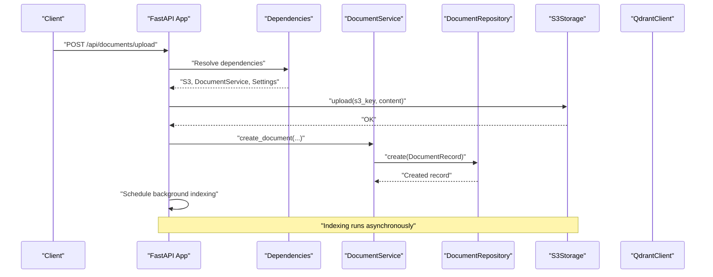
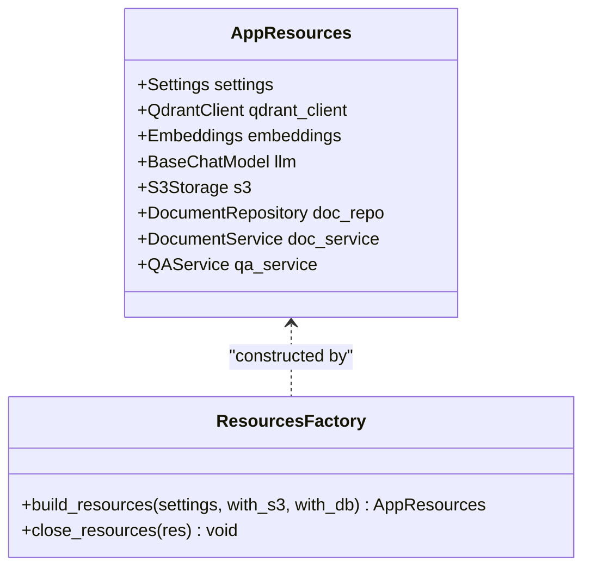
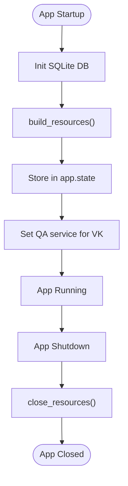
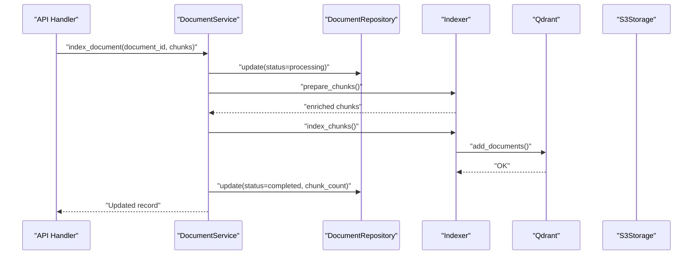
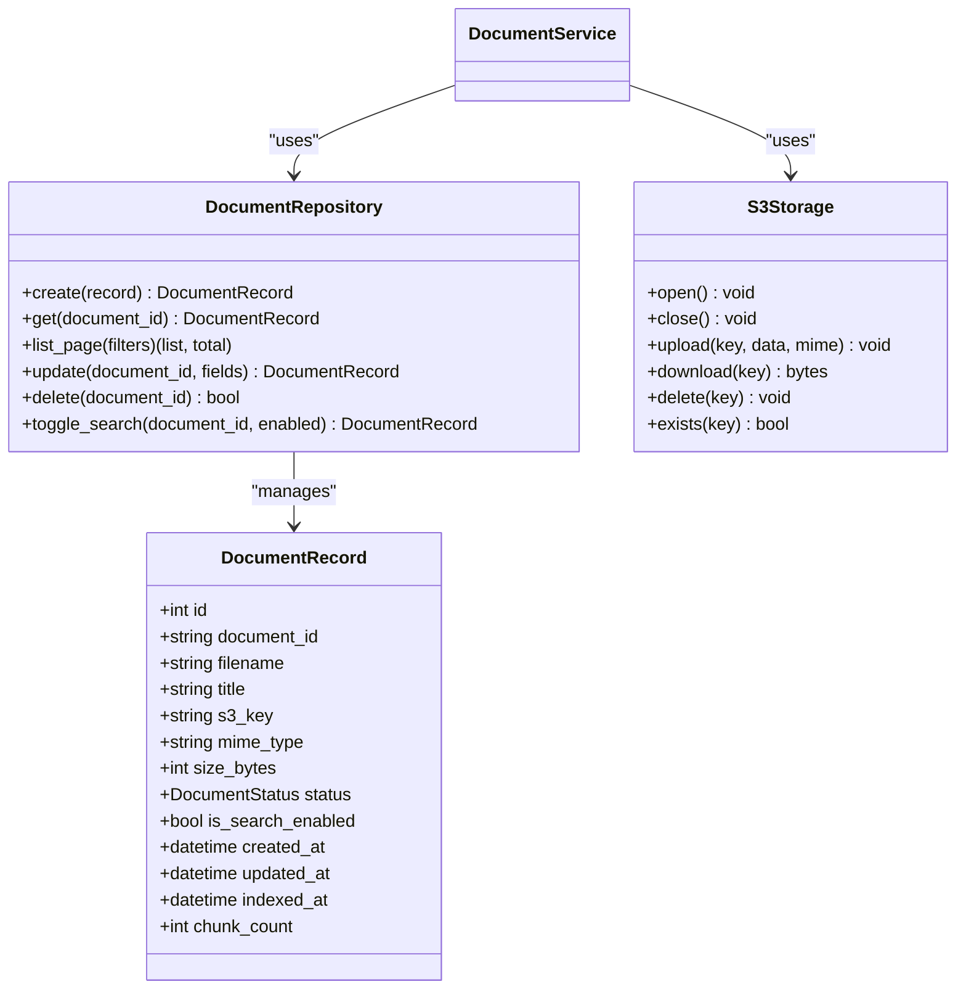
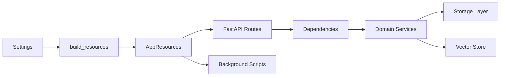

# Resource Management System

<cite>
**Referenced Files in This Document**
- [main.py](file://app/main.py)
- [resources.py](file://app/resources.py)
- [config.py](file://app/config.py)
- [document_service.py](file://app/domain/document_service.py)
- [document_repo.py](file://app/storage/document_repo.py)
- [s3.py](file://app/storage/s3.py)
- [models.py](file://app/storage/models.py)
- [documents.py](file://app/api/documents.py)
- [deps.py](file://app/api/deps.py)
- [bot.py](file://app/integrations/vk/bot.py)
- [indexer.py](file://app/rag/indexer.py)
- [ingest.py](file://scripts/ingest.py)
- [database.py](file://app/storage/database.py)
- [qa_service.py](file://app/domain/qa_service.py)
- [parser.py](file://app/rag/parser.py)
- [docker-compose.yml](file://docker-compose.yml)
- [pyproject.toml](file://pyproject.toml)
</cite>

## Table of Contents
1. [Introduction](#introduction)
2. [Project Structure](#project-structure)
3. [Core Components](#core-components)
4. [Architecture Overview](#architecture-overview)
5. [Detailed Component Analysis](#detailed-component-analysis)
6. [Dependency Analysis](#dependency-analysis)
7. [Performance Considerations](#performance-considerations)
8. [Troubleshooting Guide](#troubleshooting-guide)
9. [Conclusion](#conclusion)

## Introduction
This document describes the Resource Management System that orchestrates shared resources across the Cafetera HR Bot application. The system ensures proper initialization, sharing, and cleanup of critical components such as the database, S3 storage, Qdrant vector store, embeddings, LLM, and domain services. It provides a centralized factory pattern for building resources and a lifecycle manager that coordinates startup and shutdown sequences for both the FastAPI application and background workers.

## Project Structure
The Resource Management System spans several modules:
- Application bootstrap and lifecycle management
- Shared resource factory and container
- Domain services coordinating metadata, vector indexing, and file storage
- API dependencies and routing
- Background ingestion and indexing scripts
- Infrastructure provisioning via Docker Compose

```mermaid
graph TB
subgraph "Application Layer"
A[FastAPI App<br/>lifespan]
B[API Routes<br/>documents.py]
C[Dependencies<br/>deps.py]
end
subgraph "Resource Factory"
D[AppResources<br/>resources.py]
E[build_resources()<br/>resources.py]
F[close_resources()<br/>resources.py]
end
subgraph "Domain Services"
G[DocumentService<br/>document_service.py]
H[QAService<br/>qa_service.py]
end
subgraph "Storage Layer"
I[DocumentRepository<br/>document_repo.py]
J[S3Storage<br/>s3.py]
K[SQLite DB<br/>database.py]
end
subgraph "RAG Pipeline"
L[Parser<br/>parser.py]
M[Indexer<br/>indexer.py]
N[Embeddings/Qdrant<br/>resources.py]
end
subgraph "Infrastructure"
O[Docker Compose<br/>docker-compose.yml]
P[Config<br/>config.py]
end
A --> D
A --> E
A --> F
B --> C
C --> G
C --> H
C --> I
C --> J
G --> I
G --> M
G --> J
H --> N
L --> G
O --> N
P --> A
```

**Diagram sources**
- [main.py:22-46](file://app/main.py#L22-L46)
- [resources.py:51-165](file://app/resources.py#L51-L165)
- [resources.py:168-202](file://app/resources.py#L168-L202)
- [document_service.py:36-291](file://app/domain/document_service.py#L36-L291)
- [document_repo.py:63-301](file://app/storage/document_repo.py#L63-L301)
- [s3.py:14-109](file://app/storage/s3.py#L14-L109)
- [documents.py:49-109](file://app/api/documents.py#L49-L109)
- [deps.py:39-109](file://app/api/deps.py#L39-L109)
- [indexer.py:23-152](file://app/rag/indexer.py#L23-L152)
- [parser.py:127-146](file://app/rag/parser.py#L127-L146)
- [docker-compose.yml:1-34](file://docker-compose.yml#L1-L34)
- [config.py:14-53](file://app/config.py#L14-L53)

**Section sources**
- [main.py:1-75](file://app/main.py#L1-L75)
- [resources.py:1-202](file://app/resources.py#L1-L202)
- [config.py:14-53](file://app/config.py#L14-L53)

## Core Components
The Resource Management System centers on three pillars:
- Centralized resource container and factory
- Application lifecycle management
- Graceful degradation and cleanup

Key elements:
- AppResources dataclass: Holds optional references to all shared resources
- build_resources(): Initializes components with try/except blocks and logs failures
- close_resources(): Ensures orderly shutdown and cleanup
- FastAPI lifespan: Coordinates initialization and teardown
- Semaphore-based concurrency control for indexing

**Section sources**
- [resources.py:32-165](file://app/resources.py#L32-L165)
- [resources.py:168-202](file://app/resources.py#L168-L202)
- [main.py:22-46](file://app/main.py#L22-L46)
- [documents.py:130-171](file://app/api/documents.py#L130-L171)

## Architecture Overview
The system follows a layered architecture with clear separation of concerns:
- Presentation layer: FastAPI routes and templates
- Domain layer: DocumentService and QAService orchestrate business logic
- Storage layer: SQLite repository and S3 storage
- Infrastructure layer: Qdrant vector store and embeddings
- Integration layer: VK bot and background ingestion



**Diagram sources**
- [documents.py:471-576](file://app/api/documents.py#L471-L576)
- [document_service.py:57-82](file://app/domain/document_service.py#L57-L82)
- [document_repo.py:71-103](file://app/storage/document_repo.py#L71-L103)
- [s3.py:81-90](file://app/storage/s3.py#L81-L90)

## Detailed Component Analysis

### Resource Container and Factory
The AppResources container encapsulates all shared resources with optional fields, enabling graceful degradation when services are unavailable. The build_resources() factory method:
- Initializes S3 storage when requested
- Builds Qdrant client and embeddings
- Creates DocumentRepository and DocumentService when DB is available
- Constructs QAService with LLM, retriever, and chain when vector store is ready
- Returns a fully populated container for application use



**Diagram sources**
- [resources.py:32-67](file://app/resources.py#L32-L67)
- [resources.py:51-165](file://app/resources.py#L51-L165)
- [resources.py:168-202](file://app/resources.py#L168-L202)

**Section sources**
- [resources.py:32-165](file://app/resources.py#L32-L165)
- [resources.py:168-202](file://app/resources.py#L168-L202)

### Application Lifecycle Management
The FastAPI lifespan manager coordinates resource initialization and cleanup:
- Initializes SQLite database
- Builds resources with configurable S3 and DB availability
- Stores resources in app.state for dependency injection
- Sets global QA service for VK handlers
- Executes cleanup on shutdown



**Diagram sources**
- [main.py:22-46](file://app/main.py#L22-L46)
- [resources.py:168-202](file://app/resources.py#L168-L202)

**Section sources**
- [main.py:22-46](file://app/main.py#L22-L46)

### Document Management Orchestration
DocumentService coordinates the complete document lifecycle:
- Metadata creation in SQLite
- Vector chunk preparation and indexing in Qdrant
- File storage operations via S3
- Status transitions and error handling
- Search enable/disable synchronization across storage layers



**Diagram sources**
- [document_service.py:85-135](file://app/domain/document_service.py#L85-L135)
- [indexer.py:23-72](file://app/rag/indexer.py#L23-L72)

**Section sources**
- [document_service.py:36-291](file://app/domain/document_service.py#L36-L291)
- [indexer.py:23-152](file://app/rag/indexer.py#L23-L152)

### Storage Abstractions
The storage layer provides:
- DocumentRepository: Async CRUD operations with rich filtering and pagination
- S3Storage: Async client wrapper for MinIO/AWS S3 with bucket management
- SQLite initialization and schema management



**Diagram sources**
- [document_repo.py:63-301](file://app/storage/document_repo.py#L63-L301)
- [s3.py:14-109](file://app/storage/s3.py#L14-L109)
- [models.py:20-37](file://app/storage/models.py#L20-L37)

**Section sources**
- [document_repo.py:63-301](file://app/storage/document_repo.py#L63-L301)
- [s3.py:14-109](file://app/storage/s3.py#L14-L109)
- [models.py:11-37](file://app/storage/models.py#L11-L37)

### API Dependencies and Routing
The dependency system provides secure access to resources:
- Authentication middleware validates admin sessions
- Dependency injection resolves S3, repositories, services, and QA service
- Semaphore controls concurrent indexing operations
- HTMX integration for real-time UI updates

**Section sources**
- [deps.py:76-109](file://app/api/deps.py#L76-L109)
- [documents.py:471-576](file://app/api/documents.py#L471-L576)

### Background Ingestion and QA Services
Background ingestion script demonstrates resource reuse outside the web app:
- Initializes database and builds embeddings
- Processes local files and indexes them into Qdrant
- Updates metadata records with completion status

QAService provides:
- Adaptive retrieval with dynamic k selection
- Document-scoped chains with LRU caching
- Streaming and truncation for messaging platforms

**Section sources**
- [ingest.py:45-158](file://scripts/ingest.py#L45-L158)
- [qa_service.py:43-279](file://app/domain/qa_service.py#L43-L279)

## Dependency Analysis
The system exhibits loose coupling through dependency injection and shared resource containers:
- FastAPI routes depend on resolved dependencies rather than concrete implementations
- Domain services encapsulate business logic and coordinate multiple storage layers
- Resource factory enables conditional initialization and graceful fallback
- Background scripts reuse the same resource construction logic



**Diagram sources**
- [config.py:14-53](file://app/config.py#L14-L53)
- [resources.py:51-165](file://app/resources.py#L51-L165)
- [deps.py:39-109](file://app/api/deps.py#L39-L109)

**Section sources**
- [pyproject.toml:7-28](file://pyproject.toml#L7-L28)
- [docker-compose.yml:1-34](file://docker-compose.yml#L1-L34)

## Performance Considerations
- Concurrency control: Indexing semaphore limits simultaneous background operations
- Asynchronous operations: All storage and vector operations use async patterns
- Caching: QAService maintains an LRU cache of document-specific chains
- Efficient queries: Repository supports pagination and filtered queries
- Graceful degradation: Components can fail independently without affecting others

## Troubleshooting Guide
Common issues and resolutions:
- Resource initialization failures: Check logs for specific exceptions during S3, Qdrant, or DB setup
- Missing admin credentials: Ensure admin_api_key is configured in environment
- Database connectivity: Verify SQLite path permissions and existence
- Vector store unavailability: Confirm Qdrant service health and network connectivity
- S3 bucket issues: Validate endpoint URL, credentials, and bucket permissions

**Section sources**
- [resources.py:70-111](file://app/resources.py#L70-L111)
- [deps.py:76-88](file://app/api/deps.py#L76-L88)
- [docker-compose.yml:11-16](file://docker-compose.yml#L11-L16)

## Conclusion
The Resource Management System provides a robust foundation for the Cafetera HR Bot by centralizing resource initialization, enabling graceful degradation, and ensuring proper cleanup. Its modular design supports both web application and background processing scenarios while maintaining clear separation of concerns across storage, domain, and infrastructure layers.