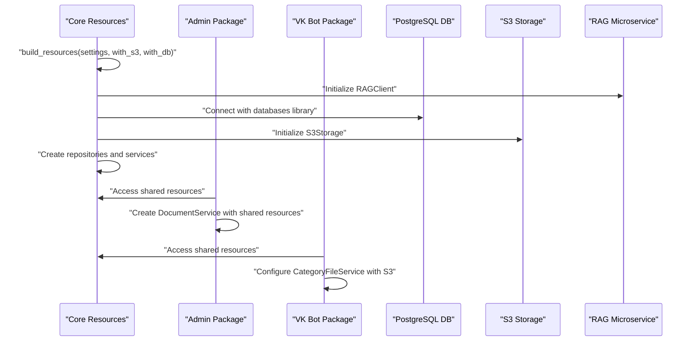
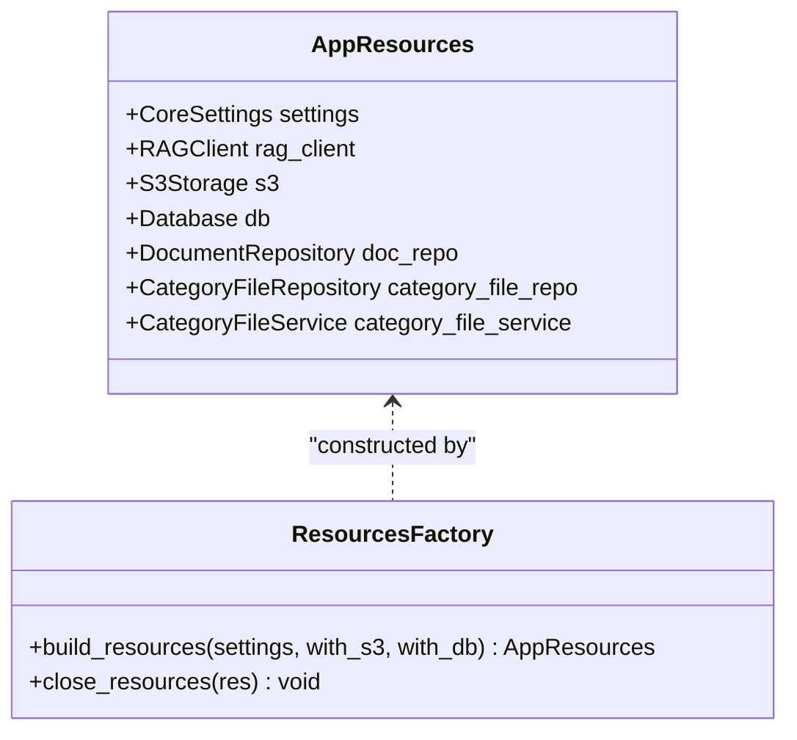
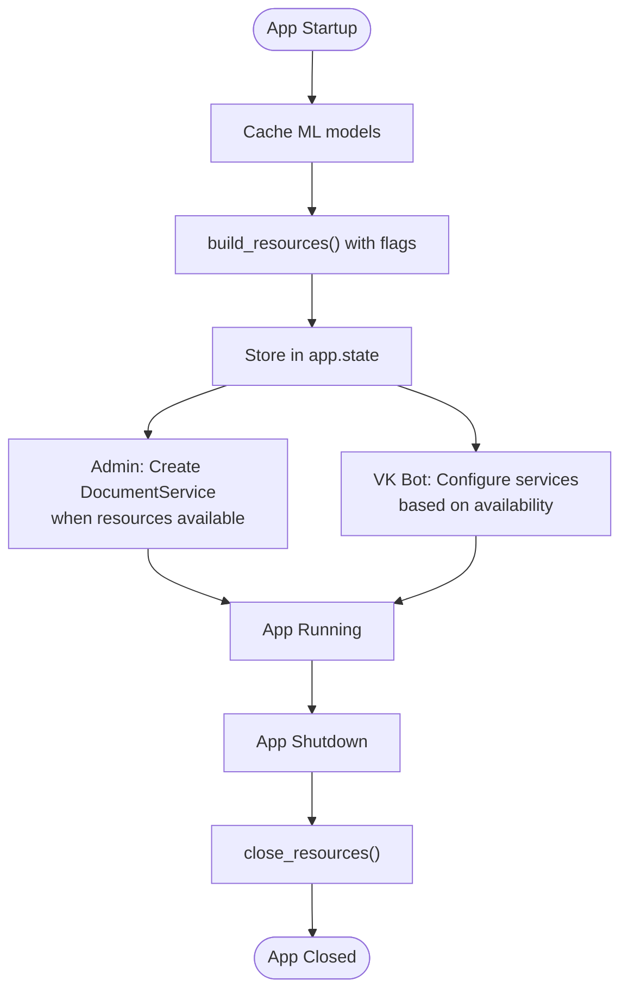
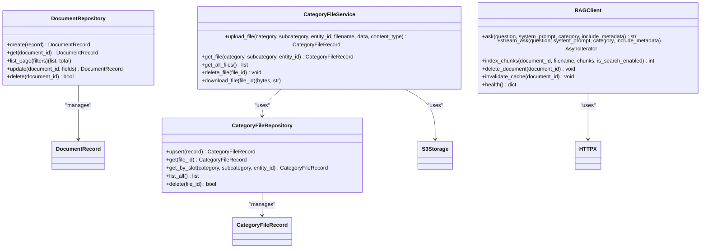
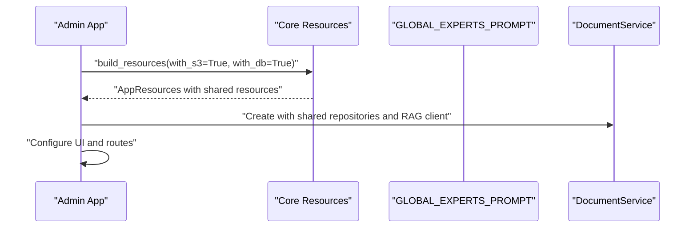
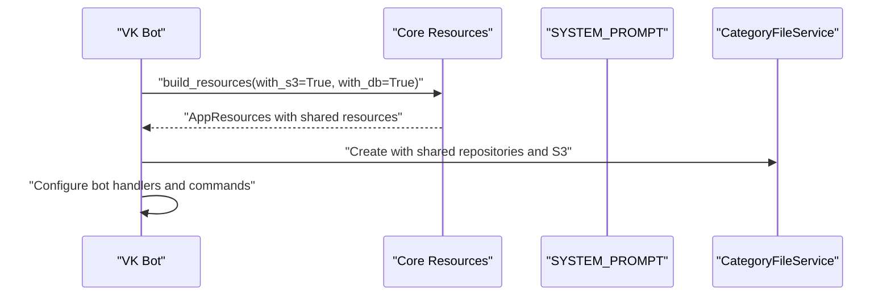
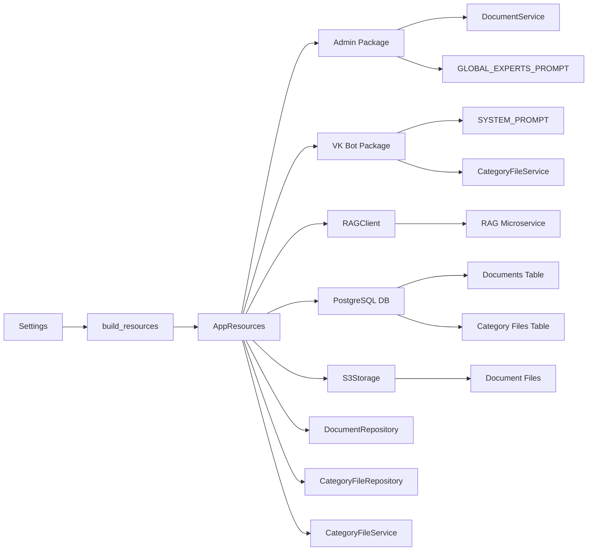

# Resource Management System

<cite>
**Referenced Files in This Document**
- [resources.py](file://packages/core/src/cafetera_core/resources.py)
- [rag_client.py](file://packages/core/src/cafetera_core/rag_client.py)
- [config.py](file://packages/core/src/cafetera_core/config.py)
- [category_file_service.py](file://packages/core/src/cafetera_core/domain/category_file_service.py)
- [category_repo.py](file://packages/core/src/cafetera_core/storage/category_repo.py)
- [document_repo.py](file://packages/core/src/cafetera_core/storage/document_repo.py)
- [admin_main.py](file://packages/admin/src/cafetera_admin/main.py)
- [polling.py](file://packages/vk_bot/src/cafetera_vk_bot/polling.py)
</cite>

## Update Summary
**Changes Made**
- Updated to reflect simplified core resources module focusing on basic application resources
- Removed comprehensive RAG resource initialization, collection creation, and QA service building
- Streamlined AppResources to contain only essential components: RAG client, S3 storage, database, and repositories
- Eliminated cross-encoder reranking system and hybrid search capabilities
- Simplified resource management to basic application resource orchestration
- Removed complex vector store management and QA service factory methods

## Table of Contents
1. [Introduction](#introduction)
2. [Project Structure](#project-structure)
3. [Core Components](#core-components)
4. [Architecture Overview](#architecture-overview)
5. [Detailed Component Analysis](#detailed-component-analysis)
6. [Package-Specific Implementations](#package-specific-implementations)
7. [Dependency Analysis](#dependency-analysis)
8. [Performance Considerations](#performance-considerations)
9. [Troubleshooting Guide](#troubleshooting-guide)
10. [Conclusion](#conclusion)

## Introduction
This document describes the Resource Management System that orchestrates shared resources across the Cafetera HR Bot application. The system ensures proper initialization, sharing, and cleanup of critical components including PostgreSQL database, S3 storage, RAG microservice client, and domain repositories. It provides a centralized factory pattern for building resources and a lifecycle manager that coordinates startup and shutdown sequences for both the FastAPI application and background workers.

**Updated** The system now operates on PostgreSQL with enhanced schema management, supporting advanced data types and provides robust connection pooling through the databases library. The resource management has been consolidated into a unified AppResources container that enables graceful degradation when services are unavailable. The new architecture focuses on basic application resource orchestration rather than comprehensive RAG resource management, simplifying the system while maintaining essential functionality for document management and storage operations.

## Project Structure
The Resource Management System spans several modules organized by package structure:
- Core package: Shared resource factory and container with basic resource management
- Admin package: FastAPI application with package-specific service creation
- VK bot package: Standalone bot with package-specific resource configuration
- Domain services coordinating metadata, file storage, and category management
- API dependencies and routing
- Infrastructure provisioning via Docker Compose with PostgreSQL, MinIO

```mermaid
graph TB
subgraph "Core Package"
A[AppResources<br/>resources.py]
B[build_resources()<br/>resources.py]
C[close_resources()<br/>resources.py]
D[RAGClient<br/>rag_client.py]
E[CategoryFileService<br/>category_file_service.py]
end
subgraph "Admin Package"
F[FastAPI App<br/>admin_main.py]
G[DocumentService<br/>admin_domain_document_service.py]
end
subgraph "VK Bot Package"
H[VK Bot<br/>polling.py]
I[CategoryFileService Usage<br/>vk_handlers]
end
subgraph "Shared Resources"
J[PostgreSQL DB<br/>database_url]
K[S3Storage<br/>s3_endpoint_url]
L[CategoryFileRepository<br/>category_repo.py]
M[DocumentRepository<br/>document_repo.py]
N[RAG Microservice<br/>rag_service_url]
end
subgraph "Infrastructure"
O[Docker Compose<br/>docker-compose.yml]
P[PyProject<br/>pyproject.toml]
end
A --> B
A --> C
A --> D
A --> E
F --> A
H --> A
G --> J
G --> K
L --> J
M --> J
N --> D
```

**Diagram sources**
- [resources.py:24-164](file://packages/core/src/cafetera_core/resources.py#L24-L164)
- [admin_main.py:43-74](file://packages/admin/src/cafetera_admin/main.py#L43-L74)
- [polling.py:21-53](file://packages/vk_bot/src/cafetera_vk_bot/polling.py#L21-L53)
- [config.py:23-35](file://packages/core/src/cafetera_core/config.py#L23-L35)

**Section sources**
- [resources.py:1-164](file://packages/core/src/cafetera_core/resources.py#L1-L164)
- [admin_main.py:1-115](file://packages/admin/src/cafetera_admin/main.py#L1-L115)
- [polling.py:1-76](file://packages/vk_bot/src/cafetera_vk_bot/polling.py#L1-L76)

## Core Components
The Resource Management System centers on three pillars:
- Centralized resource container and factory with selective resource initialization
- Application lifecycle management
- Package-specific service creation with shared resources

Key elements:
- AppResources dataclass: Holds optional references to essential shared resources including RAG client, S3 storage, database, and repositories
- build_resources(): Initializes components based on configuration flags with try/except blocks and logs failures
- close_resources(): Ensures orderly shutdown and cleanup of all initialized resources
- Package-specific implementations: Each package handles its own service creation using shared resources
- RAGClient: Thin HTTP client for communicating with the RAG microservice
- CategoryFileService: Manages document templates for VK bot categories with S3 integration

**Updated** The system now focuses on basic application resource orchestration rather than comprehensive RAG resource management. The AppResources container includes only essential components: RAG client for microservice communication, S3 storage for file operations, PostgreSQL database with connection pooling, and repositories for document and category file management. This simplification removes complex vector store management and QA service factory methods, streamlining the system for core functionality.

**Updated** The build_resources() factory method now uses selective initialization flags (with_s3, with_db) to conditionally create resources based on deployment requirements. This approach enables flexible resource management where components can operate with minimal or full resource sets depending on their needs.

**Section sources**
- [resources.py:24-164](file://packages/core/src/cafetera_core/resources.py#L24-L164)
- [config.py:14-40](file://packages/core/src/cafetera_core/config.py#L14-L40)
- [rag_client.py:15-151](file://packages/core/src/cafetera_core/rag_client.py#L15-L151)

## Architecture Overview
The system follows a layered architecture with clear separation of concerns:
- Core layer: Shared resource management with AppResources container and selective factory methods
- Package layer: Individual packages (admin, vk_bot) that use shared resources with package-specific configurations
- Domain layer: CategoryFileService and repositories orchestrate business logic with package-specific operations
- Storage layer: PostgreSQL repositories and S3 storage with enhanced schema management
- Infrastructure layer: RAG microservice client with HTTP communication

**Updated** The architecture now emphasizes basic application resource orchestration with selective initialization capabilities. The resource management system provides unified initialization patterns across all application components while allowing package-specific customization through separate service creation logic. The simplified approach removes complex RAG resource management in favor of essential microservice communication.

**Updated** The architecture now includes PostgreSQL database management with proper connection pooling and schema initialization through the databases library. The resource management system ensures consistent access patterns across all API endpoints through the unified AppResources container, enabling flexible deployment scenarios with minimal or full resource sets.



**Diagram sources**
- [resources.py:42-124](file://packages/core/src/cafetera_core/resources.py#L42-L124)
- [admin_main.py:52-70](file://packages/admin/src/cafetera_admin/main.py#L52-L70)
- [polling.py:27-43](file://packages/vk_bot/src/cafetera_vk_bot/polling.py#L27-L43)

## Detailed Component Analysis

### Resource Container and Factory
The AppResources container encapsulates essential shared resources with optional fields, enabling graceful degradation when services are unavailable. The build_resources() factory method:
- Initializes RAG client when requested with API key authentication
- Builds S3 storage when with_s3 flag is True
- Creates PostgreSQL Database connection with asyncpg driver when with_db flag is True
- Initializes DocumentRepository and CategoryFileRepository with proper schema management
- Constructs CategoryFileService with S3 integration when both resources are available
- Returns a fully populated container for application use

**Updated** The factory method now uses selective initialization flags to conditionally create resources based on deployment requirements. This approach enables flexible resource management where components can operate with minimal or full resource sets depending on their needs. The system maintains backward compatibility while simplifying resource management.

**Updated** The factory method includes comprehensive error handling with try/except blocks and logging for each resource initialization step. This ensures that partial failures don't prevent the system from operating with available resources, enabling graceful degradation when services are unavailable.



**Diagram sources**
- [resources.py:24-164](file://packages/core/src/cafetera_core/resources.py#L24-L164)

**Section sources**
- [resources.py:24-164](file://packages/core/src/cafetera_core/resources.py#L24-L164)
- [config.py:14-40](file://packages/core/src/cafetera_core/config.py#L14-L40)

### Application Lifecycle Management
The FastAPI lifespan manager coordinates resource initialization and cleanup:
- Establishes PostgreSQL database connection with databases library
- Builds resources with configurable S3 and DB availability
- Stores resources in app.state for dependency injection
- Sets global services for package-specific use
- Executes cleanup on shutdown

**Updated** The lifecycle manager now includes PostgreSQL database connection establishment and schema initialization during resource building, ensuring the system is ready for document operations from startup. The resource management has been streamlined to use the unified AppResources container across all application components with selective initialization based on package requirements.

**Updated** The lifecycle manager now includes conditional service creation based on resource availability. When both DocumentRepository and RAG client are available, DocumentService is created for admin functionality. This approach enables flexible deployment scenarios where components can operate with minimal functionality when resources are limited.



**Diagram sources**
- [admin_main.py:43-74](file://packages/admin/src/cafetera_admin/main.py#L43-L74)
- [polling.py:21-53](file://packages/vk_bot/src/cafetera_vk_bot/polling.py#L21-L53)

**Section sources**
- [admin_main.py:43-74](file://packages/admin/src/cafetera_admin/main.py#L43-L74)
- [polling.py:21-53](file://packages/vk_bot/src/cafetera_vk_bot/polling.py#L21-L53)

### Storage Abstractions
The storage layer provides:
- DocumentRepository: Async CRUD operations with rich filtering and pagination using PostgreSQL
- CategoryFileRepository: Async CRUD operations for category file management with unique constraints
- CategoryFileService: Coordinates between PostgreSQL repositories and S3 storage for document templates
- RAGClient: Thin HTTP client for communicating with the RAG microservice

**Updated** The storage layer now operates exclusively on PostgreSQL with enhanced schema definitions supporting proper data types and constraints. The resource management system ensures consistent database connection handling across all storage components. Package-specific implementations can access these shared repositories through the AppResources container.

**Updated** The CategoryFileService provides document template management for VK bot categories with S3 integration. It handles upload, download, and deletion of files organized by category/subcategory/entity slots, coordinating between PostgreSQL metadata and S3 storage for efficient file management.



**Diagram sources**
- [document_repo.py:69-200](file://packages/core/src/cafetera_core/storage/document_repo.py#L69-L200)
- [category_repo.py:48-140](file://packages/core/src/cafetera_core/storage/category_repo.py#L48-L140)
- [category_file_service.py:22-116](file://packages/core/src/cafetera_core/domain/category_file_service.py#L22-L116)
- [rag_client.py:15-151](file://packages/core/src/cafetera_core/rag_client.py#L15-L151)

**Section sources**
- [document_repo.py:69-200](file://packages/core/src/cafetera_core/storage/document_repo.py#L69-L200)
- [category_repo.py:48-140](file://packages/core/src/cafetera_core/storage/category_repo.py#L48-L140)
- [category_file_service.py:22-116](file://packages/core/src/cafetera_core/domain/category_file_service.py#L22-L116)
- [rag_client.py:15-151](file://packages/core/src/cafetera_core/rag_client.py#L15-L151)

### Background Ingestion and Microservice Communication
Background ingestion script demonstrates resource reuse outside the web app:
- Initializes database and builds RAG client
- Processes local files and communicates with RAG microservice
- Updates metadata records with completion status

**Updated** The RAGClient provides thin HTTP client functionality for communicating with the RAG microservice. It supports question answering, streaming responses, document-specific queries, chunk indexing, and cache invalidation operations. The client handles API key authentication and timeout configuration for reliable microservice communication.

**Updated** The resource management system provides unified initialization patterns for both FastAPI applications and standalone scripts. Package-specific implementations handle their own resource creation with custom configurations while sharing common infrastructure through the AppResources container.

**Section sources**
- [polling.py:21-53](file://packages/vk_bot/src/cafetera_vk_bot/polling.py#L21-L53)
- [rag_client.py:15-151](file://packages/core/src/cafetera_core/rag_client.py#L15-L151)

## Package-Specific Implementations

### Admin Package Implementation
The admin package demonstrates package-specific service creation:
- Uses GLOBAL_EXPERTS_PROMPT for comprehensive HR expertise
- Creates DocumentService with shared resources for document management
- Handles concurrent indexing with semaphore control

**Updated** The admin package now uses the shared AppResources container to create DocumentService instances with the GLOBAL_EXPERTS_PROMPT. This allows for consistent resource management while providing package-specific functionality and user interface. The service creation is conditional based on resource availability, enabling graceful operation with minimal functionality when resources are limited.



**Diagram sources**
- [admin_main.py:52-70](file://packages/admin/src/cafetera_admin/main.py#L52-L70)

**Section sources**
- [admin_main.py:52-70](file://packages/admin/src/cafetera_admin/main.py#L52-L70)

### VK Bot Package Implementation
The VK bot package demonstrates standalone service creation:
- Uses SYSTEM_PROMPT for conversational bot responses
- Configures CategoryFileService with S3 integration
- Handles resource cleanup on shutdown

**Updated** The VK bot package creates its own CategoryFileService instance using the shared AppResources container with S3 integration. The service creation is conditional based on resource availability, enabling graceful operation with document download functionality disabled when S3 storage is unavailable.



**Diagram sources**
- [polling.py:27-43](file://packages/vk_bot/src/cafetera_vk_bot/polling.py#L27-L43)

**Section sources**
- [polling.py:27-43](file://packages/vk_bot/src/cafetera_vk_bot/polling.py#L27-L43)

## Dependency Analysis
The system exhibits loose coupling through dependency injection and shared resource containers:
- FastAPI routes depend on resolved dependencies rather than concrete implementations
- Domain services encapsulate business logic and coordinate multiple storage layers
- Resource factory enables conditional initialization and graceful fallback
- Background scripts reuse the same resource construction logic
- Package-specific implementations handle their own service configuration
- RAG microservice communication provides optional enhancement capabilities

**Updated** The dependency graph now includes PostgreSQL database management through the databases library with connection pooling and transaction management for production deployments. The unified AppResources container ensures consistent resource initialization across all application components with selective initialization based on deployment requirements.

**Updated** The dependency graph now includes RAG microservice communication as an optional enhancement layer. The RAGClient provides thin HTTP client functionality for microservice communication, enabling question answering and document processing capabilities when the RAG service is available.



**Diagram sources**
- [config.py:14-40](file://packages/core/src/cafetera_core/config.py#L14-L40)
- [resources.py:42-124](file://packages/core/src/cafetera_core/resources.py#L42-L124)
- [admin_main.py:52-70](file://packages/admin/src/cafetera_admin/main.py#L52-L70)
- [polling.py:27-43](file://packages/vk_bot/src/cafetera_vk_bot/polling.py#L27-L43)

**Section sources**
- [config.py:14-40](file://packages/core/src/cafetera_core/config.py#L14-L40)
- [resources.py:42-124](file://packages/core/src/cafetera_core/resources.py#L42-L124)

## Performance Considerations
- Concurrency control: Indexing semaphore limits simultaneous background operations
- Asynchronous operations: All storage and microservice operations use async patterns
- Connection pooling: PostgreSQL uses databases library with connection pooling
- Efficient queries: Repository supports pagination and filtered queries with PostgreSQL optimization
- Graceful degradation: Components can fail independently without affecting others
- **Selective Resource Initialization**: Conditional resource creation reduces startup overhead
- **PostgreSQL Optimization**: Enhanced schema with proper data types and indexes for production workloads
- **Unified Resource Management**: Consolidated initialization patterns reduce duplication and improve maintainability
- **Package-Specific Optimization**: Each package can optimize resources for its specific use case
- **Resource Sharing**: Multiple packages share common infrastructure while maintaining flexibility
- **Minimal RAG Integration**: Optional microservice communication reduces system complexity

**Updated** The PostgreSQL implementation provides superior performance through connection pooling, prepared statements, and optimized queries with proper indexing strategies. The unified resource management system eliminates redundant initialization code and improves overall system reliability. Package-specific implementations can optimize resource usage based on their particular requirements while benefiting from shared infrastructure.

**Updated** The selective resource initialization approach reduces startup overhead by only creating resources that are actually needed. This enables flexible deployment scenarios where components can operate with minimal functionality when resources are limited, improving system resilience and reducing operational complexity.

## Troubleshooting Guide
Common issues and resolutions:
- Resource initialization failures: Check logs for specific exceptions during RAG client, S3, or DB setup
- Missing admin credentials: Ensure admin_api_key is configured in environment
- Database connectivity: Verify PostgreSQL connection string, credentials, and network accessibility
- PostgreSQL schema issues: Check table creation permissions and database initialization
- RAG microservice unavailability: Confirm RAG service health and network connectivity
- S3 bucket issues: Validate endpoint URL, credentials, and bucket permissions
- **Connection pool exhaustion**: Monitor PostgreSQL connection pool usage and adjust settings
- **Resource cleanup issues**: Verify close_resources() is called during shutdown to prevent resource leaks
- **Package-specific service issues**: Verify that package-specific services are properly configured
- **Selective initialization failures**: Check with_s3 and with_db flags to ensure proper resource creation
- **RAG client authentication**: Verify rag_service_api_key configuration for microservice access
- **Category file service issues**: Check S3 integration when CategoryFileService is unavailable
- **Document repository errors**: Verify PostgreSQL schema initialization and table permissions

**Updated** Added troubleshooting guidance for PostgreSQL-specific issues including connection problems, schema initialization failures, and connection pool configuration. The unified resource management system provides better error reporting and cleanup mechanisms. Package-specific implementations should verify their resource configuration flags and service creation parameters.

**Updated** Added troubleshooting guidance for selective resource initialization issues including proper flag usage and conditional service creation. The system now provides clearer error messages for partial resource failures and graceful degradation when services are unavailable.

**Section sources**
- [resources.py:64-123](file://packages/core/src/cafetera_core/resources.py#L64-L123)
- [admin_main.py:60-67](file://packages/admin/src/cafetera_admin/main.py#L60-L67)
- [polling.py:33-42](file://packages/vk_bot/src/cafetera_vk_bot/polling.py#L33-L42)

## Conclusion
The Resource Management System provides a robust foundation for the Cafetera HR Bot by centralizing essential resource initialization, enabling graceful degradation, and ensuring proper cleanup. Its modular design supports both web application and background processing scenarios while maintaining clear separation of concerns across storage, domain, and infrastructure layers.

**Updated** The simplified architecture with selective resource initialization significantly reduces system complexity while maintaining essential functionality for document management and storage operations. The migration provides better reliability and maintainability through unified resource management and graceful degradation capabilities.

**Updated** The integration of RAG microservice communication provides optional enhancement capabilities that can be enabled or disabled based on deployment requirements. The conditional initialization approach enables flexible deployment scenarios where components can operate with minimal functionality when resources are limited.

The consolidation of resource management into the AppResources container has improved code maintainability and reduced duplication across the application. The unified initialization patterns enable seamless integration between FastAPI applications, background scripts, and VK bot integration, while the enhanced graceful degradation capabilities ensure system stability even when individual services are unavailable.

**Updated** The new architecture with package-specific service creation provides greater flexibility and customization options. Each package can now define its own service configurations while sharing common infrastructure. The selective resource initialization system provides optional enhancement capabilities that can be enabled or disabled based on deployment requirements and performance considerations.

The simplified resource management system eliminates the complexity of comprehensive RAG resource management in favor of essential application resource orchestration. This provides better performance characteristics and easier maintenance while preserving the core functionality of document management, storage operations, and microservice communication.