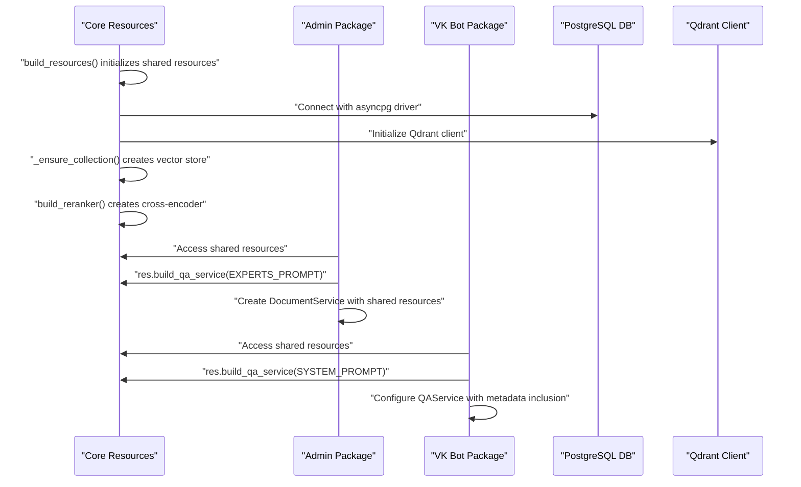
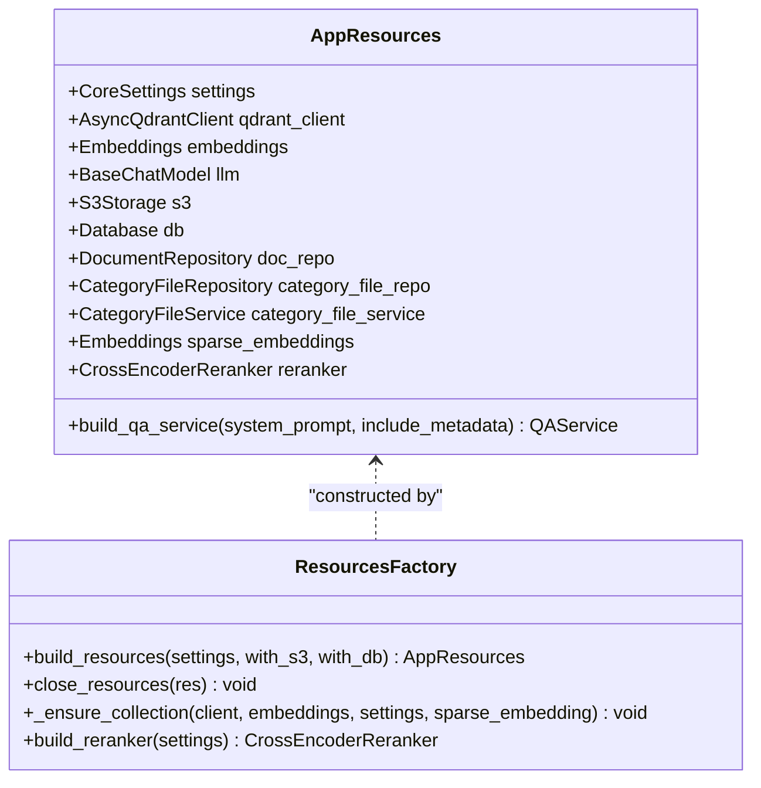
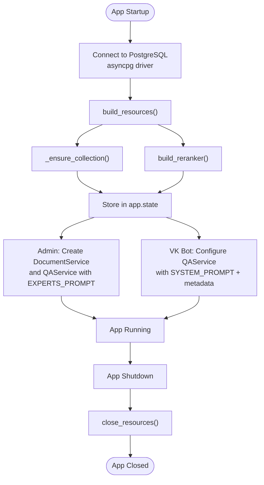
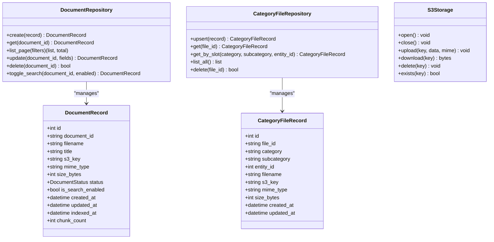
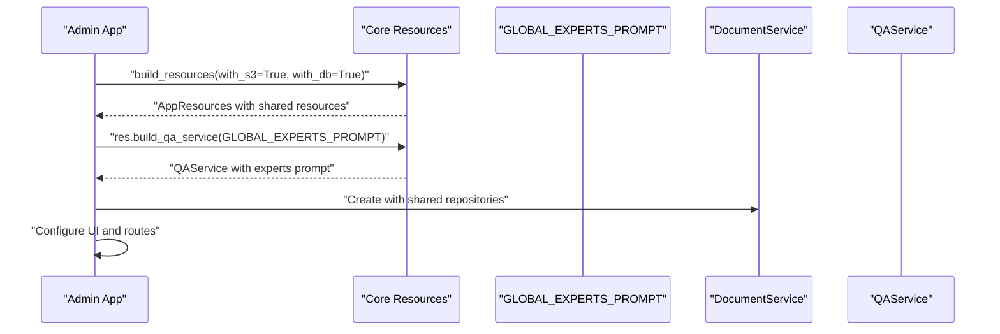
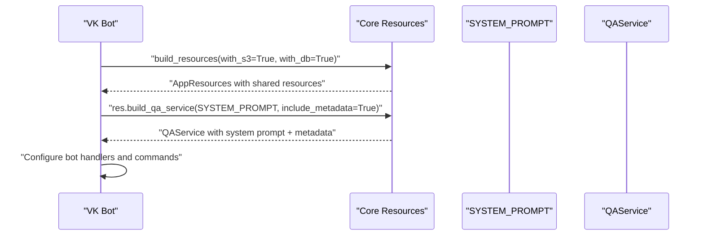
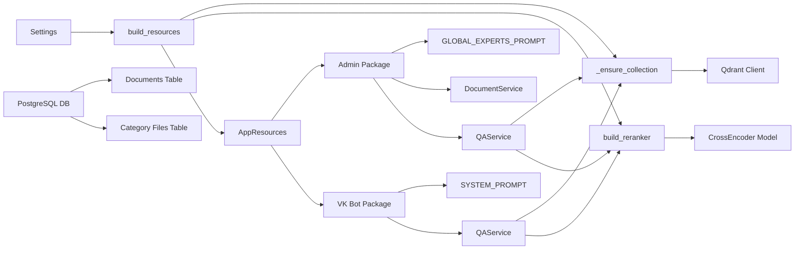

# Resource Management System

<cite>
**Referenced Files in This Document**
- [resources.py](file://packages/core/src/cafetera_core/resources.py)
- [admin_main.py](file://packages/admin/src/cafetera_admin/main.py)
- [vk_polling.py](file://packages/vk_bot/src/cafetera_vk_bot/polling.py)
- [admin_deps.py](file://packages/admin/src/cafetera_admin/api/deps.py)
- [admin_prompts.py](file://packages/admin/src/cafetera_admin/prompts.py)
- [vk_prompts.py](file://packages/vk_bot/src/cafetera_vk_bot/prompts.py)
- [admin_config.py](file://packages/admin/src/cafetera_admin/config.py)
- [vk_config.py](file://packages/vk_bot/src/cafetera_vk_bot/config.py)
- [core_config.py](file://packages/core/src/cafetera_core/config.py)
- [admin_domain_document_service.py](file://packages/admin/src/cafetera_admin/domain/document_service.py)
- [core_domain_qa_service.py](file://packages/core/src/cafetera_core/domain/qa_service.py)
- [core_storage_document_repo.py](file://packages/core/src/cafetera_core/storage/document_repo.py)
- [core_storage_category_repo.py](file://packages/core/src/cafetera_core/storage/category_repo.py)
- [core_storage_s3.py](file://packages/core/src/cafetera_core/storage/s3.py)
- [core_rag_retriever.py](file://packages/core/src/cafetera_core/rag/retriever.py)
- [core_rag_chain.py](file://packages/core/src/cafetera_core/rag/chain.py)
- [core_rag_reranker.py](file://packages/core/src/cafetera_core/rag/reranker.py)
- [docker-compose.yml](file://docker-compose.yml)
- [pyproject.toml](file://pyproject.toml)
</cite>

## Update Summary
**Changes Made**
- Updated to reflect new architecture with simplified hybrid search using dense vectors + BM25 sparse vectors
- Integrated cross-encoder reranking system with new CrossEncoderReranker and RerankingRetriever classes
- Removed ColBERT embedding dependencies and complex multivector setup
- Added new reranking configuration settings and resource management
- Updated _ensure_collection function to use standard dense vector configurations
- Enhanced QAService integration with cross-encoder reranking capabilities

## Table of Contents
1. [Introduction](#introduction)
2. [Project Structure](#project-structure)
3. [Core Components](#core-components)
4. [Architecture Overview](#architecture-overview)
5. [Detailed Component Analysis](#detailed-component-analysis)
6. [Package-Specific Implementations](#package-specific-implementations)
7. [Hybrid Search Configuration and Setup](#hybrid-search-configuration-and-setup)
8. [Cross-Encoder Reranking System](#cross-encoder-reranking-system)
9. [Dependency Analysis](#dependency-analysis)
10. [Performance Considerations](#performance-considerations)
11. [Troubleshooting Guide](#troubleshooting-guide)
12. [Conclusion](#conclusion)

## Introduction
This document describes the Resource Management System that orchestrates shared resources across the Cafetera HR Bot application. The system ensures proper initialization, sharing, and cleanup of critical components such as PostgreSQL database, S3 storage, Qdrant vector store, embeddings, LLM, and domain services. It provides a centralized factory pattern for building resources and a lifecycle manager that coordinates startup and shutdown sequences for both the FastAPI application and background workers.

**Updated** The system now operates on PostgreSQL with enhanced schema management, supporting advanced data types including TIMESTAMPTZ and BOOLEAN, and provides robust connection pooling through the asyncpg driver. The resource management has been consolidated into a unified AppResources container that enables graceful degradation when services are unavailable. The new architecture separates shared resource management from package-specific service creation, allowing each package to define its own prompts and service configurations.

**Updated** The system now includes a simplified hybrid search architecture using dense vectors + BM25 sparse vectors, replacing the previous complex ColBERT multivector setup. A new cross-encoder reranking system has been integrated to provide advanced document ranking capabilities through the CrossEncoderReranker and RerankingRetriever components.

## Project Structure
The Resource Management System spans several modules organized by package structure:
- Core package: Shared resource factory and container with automatic collection management
- Admin package: FastAPI application with package-specific prompts and service creation
- VK bot package: Standalone bot with package-specific prompts and service configuration
- Domain services coordinating metadata, vector indexing, and file storage
- API dependencies and routing
- Background ingestion and indexing scripts
- Infrastructure provisioning via Docker Compose with PostgreSQL, Qdrant, and MinIO

```mermaid
graph TB
subgraph "Core Package"
A[AppResources<br/>resources.py]
B[build_resources()<br/>resources.py]
C[build_qa_service()<br/>resources.py]
D[close_resources()<br/>resources.py]
E[_ensure_collection()<br/>resources.py]
F[build_reranker()<br/>resources.py]
end
subgraph "Admin Package"
G[FastAPI App<br/>admin_main.py]
H[GLOBAL_EXPERTS_PROMPT<br/>admin_prompts.py]
I[DocumentService<br/>admin_domain_document_service.py]
end
subgraph "VK Bot Package"
J[VK Bot<br/>vk_polling.py]
K[SYSTEM_PROMPT<br/>vk_prompts.py]
L[QAService Usage<br/>vk_handlers]
end
subgraph "Shared Resources"
M[PostgreSQL DB<br/>core_config.py]
N[S3Storage<br/>core_storage_s3.py]
O[Qdrant Client<br/>core_rag_retriever.py]
P[Embeddings<br/>core_rag_retriever.py]
Q[LLM<br/>core_rag_chain.py]
R[CrossEncoderReranker<br/>core_rag_reranker.py]
end
subgraph "Infrastructure"
S[Docker Compose<br/>docker-compose.yml]
T[PyProject<br/>pyproject.toml]
end
A --> B
A --> C
A --> D
A --> E
A --> F
G --> A
J --> A
H --> G
K --> J
I --> M
I --> N
O --> P
O --> Q
O --> R
```

**Diagram sources**
- [resources.py:189-252](file://packages/core/src/cafetera_core/resources.py#L189-L252)
- [resources.py:255-402](file://packages/core/src/cafetera_core/resources.py#L255-L402)
- [admin_main.py:40-82](file://packages/admin/src/cafetera_admin/main.py#L40-L82)
- [vk_polling.py:21-47](file://packages/vk_bot/src/cafetera_vk_bot/polling.py#L21-L47)
- [admin_prompts.py:1-50](file://packages/admin/src/cafetera_admin/prompts.py#L1-L50)
- [vk_prompts.py:1-50](file://packages/vk_bot/src/cafetera_vk_bot/prompts.py#L1-L50)

**Section sources**
- [resources.py:1-449](file://packages/core/src/cafetera_core/resources.py#L1-L449)
- [admin_main.py:1-114](file://packages/admin/src/cafetera_admin/main.py#L1-L114)
- [vk_polling.py:1-79](file://packages/vk_bot/src/cafetera_vk_bot/polling.py#L1-L79)

## Core Components
The Resource Management System centers on three pillars:
- Centralized resource container and factory with automatic collection management
- Application lifecycle management
- Package-specific service creation with shared resources

Key elements:
- AppResources dataclass: Holds optional references to all shared resources including sparse embeddings for hybrid search
- build_resources(): Initializes components with try/except blocks and logs failures, automatically creating Qdrant collections
- build_qa_service(): Factory method that creates QAService instances with package-specific prompts and configurations
- close_resources(): Ensures orderly shutdown and cleanup
- Package-specific implementations: Each package handles its own prompt configuration and service instantiation
- build_reranker(): New factory method for creating cross-encoder rerankers when enabled

**Updated** The system now manages PostgreSQL connections through the databases library with asyncpg driver, providing robust connection pooling and transaction management for document metadata operations. The resource management has been consolidated into a unified AppResources container that enables graceful degradation when services are unavailable. Package-specific implementations now handle their own prompt configuration and service creation, allowing for flexible customization across different deployment targets.

**Updated** The system now includes cross-encoder reranking capabilities through the CrossEncoderReranker class, which provides advanced document ranking using sentence-transformers models. The reranker is conditionally initialized based on settings and integrated into the QAService workflow.

**Section sources**
- [resources.py:189-252](file://packages/core/src/cafetera_core/resources.py#L189-L252)
- [resources.py:255-402](file://packages/core/src/cafetera_core/resources.py#L255-L402)
- [resources.py:405-449](file://packages/core/src/cafetera_core/resources.py#L405-L449)
- [resources.py:152-168](file://packages/core/src/cafetera_core/resources.py#L152-L168)

## Architecture Overview
The system follows a layered architecture with clear separation of concerns:
- Core layer: Shared resource management with AppResources container and factory methods
- Package layer: Individual packages (admin, vk_bot) that use shared resources with package-specific configurations
- Domain layer: DocumentService and QAService orchestrate business logic with package-specific prompts
- Storage layer: PostgreSQL repositories and S3 storage with enhanced schema management
- Infrastructure layer: Qdrant vector store with automatic collection management and embeddings

**Updated** The architecture now includes PostgreSQL database management with proper schema initialization, supporting advanced data types and connection pooling for production deployments. The resource management system provides unified initialization patterns across all application components while allowing package-specific customization through separate prompt and service creation logic.

**Updated** The architecture now incorporates a simplified hybrid search system using dense vectors + BM25 sparse vectors, eliminating the need for complex ColBERT multivector configurations. Cross-encoder reranking is handled by a dedicated RerankingRetriever wrapper that enhances the basic hybrid search with advanced ranking capabilities.



**Diagram sources**
- [resources.py:255-402](file://packages/core/src/cafetera_core/resources.py#L255-L402)
- [admin_main.py:44-75](file://packages/admin/src/cafetera_admin/main.py#L44-L75)
- [vk_polling.py:28-47](file://packages/vk_bot/src/cafetera_vk_bot/polling.py#L28-L47)

## Detailed Component Analysis

### Resource Container and Factory
The AppResources container encapsulates all shared resources with optional fields, enabling graceful degradation when services are unavailable. The build_resources() factory method:
- Initializes S3 storage when requested
- Builds Qdrant client and embeddings
- Creates PostgreSQL Database connection with asyncpg driver
- Initializes DocumentRepository and DocumentService with proper schema management
- Constructs QAService with LLM, retriever, and chain when vector store is ready
- Automatically creates Qdrant collections with appropriate vector configurations
- Returns a fully populated container for application use

**Updated** The factory method now includes PostgreSQL database initialization through the databases library, establishing connection pools and creating tables with proper SERIAL primary keys and PostgreSQL-specific data types. The resource management has been consolidated into a unified AppResources container that enables graceful degradation across all components. The new build_qa_service() method allows package-specific QAService creation with custom prompts and configurations.

**Updated** The factory method now includes conditional cross-encoder reranker initialization through the build_reranker() function. When reranking is enabled in settings, a CrossEncoderReranker instance is created and stored in the AppResources container for use by QAService instances.



**Diagram sources**
- [resources.py:189-252](file://packages/core/src/cafetera_core/resources.py#L189-L252)
- [resources.py:255-402](file://packages/core/src/cafetera_core/resources.py#L255-L402)
- [resources.py:37-184](file://packages/core/src/cafetera_core/resources.py#L37-L184)
- [resources.py:152-168](file://packages/core/src/cafetera_core/resources.py#L152-L168)

**Section sources**
- [resources.py:189-252](file://packages/core/src/cafetera_core/resources.py#L189-L252)
- [resources.py:255-402](file://packages/core/src/cafetera_core/resources.py#L255-L402)
- [resources.py:37-184](file://packages/core/src/cafetera_core/resources.py#L37-L184)
- [resources.py:152-168](file://packages/core/src/cafetera_core/resources.py#L152-L168)

### Application Lifecycle Management
The FastAPI lifespan manager coordinates resource initialization and cleanup:
- Establishes PostgreSQL database connection with asyncpg driver
- Builds resources with configurable S3 and DB availability
- Automatically creates Qdrant collections with vector configurations
- Stores resources in app.state for dependency injection
- Sets global QA service for VK handlers using package-specific prompts
- Executes cleanup on shutdown

**Updated** The lifecycle manager now includes PostgreSQL database connection establishment and schema initialization during resource building, ensuring the system is ready for document operations from startup. The resource management has been streamlined to use the unified AppResources container across all application components. Package-specific implementations handle their own QAService creation with custom prompts and configurations.

**Updated** The lifecycle manager now includes cross-encoder reranker initialization when settings.reranking_enabled is True. The reranker is conditionally created and stored in the AppResources container for use by QAService instances throughout the application.



**Diagram sources**
- [admin_main.py:40-82](file://packages/admin/src/cafetera_admin/main.py#L40-L82)
- [vk_polling.py:21-47](file://packages/vk_bot/src/cafetera_vk_bot/polling.py#L21-L47)
- [resources.py:255-402](file://packages/core/src/cafetera_core/resources.py#L255-L402)

**Section sources**
- [admin_main.py:40-82](file://packages/admin/src/cafetera_admin/main.py#L40-L82)
- [vk_polling.py:21-47](file://packages/vk_bot/src/cafetera_vk_bot/polling.py#L21-L47)

### Storage Abstractions
The storage layer provides:
- DocumentRepository: Async CRUD operations with rich filtering and pagination using PostgreSQL
- CategoryFileRepository: Async CRUD operations for category file management with unique constraints
- S3Storage: Async client wrapper for MinIO/AWS S3 with bucket management
- PostgreSQL initialization and schema management with proper data types

**Updated** The storage layer now operates exclusively on PostgreSQL with enhanced schema definitions supporting SERIAL primary keys, TIMESTAMPTZ for precise timestamp tracking, and BOOLEAN for search enablement flags. The resource management system ensures consistent database connection handling across all storage components. Package-specific implementations can access these shared repositories through the AppResources container.



**Diagram sources**
- [core_storage_document_repo.py:63-301](file://packages/core/src/cafetera_core/storage/document_repo.py#L63-L301)
- [core_storage_category_repo.py:48-140](file://packages/core/src/cafetera_core/storage/category_repo.py#L48-L140)
- [core_storage_s3.py:14-109](file://packages/core/src/cafetera_core/storage/s3.py#L14-L109)

**Section sources**
- [core_storage_document_repo.py:63-301](file://packages/core/src/cafetera_core/storage/document_repo.py#L63-L301)
- [core_storage_category_repo.py:48-140](file://packages/core/src/cafetera_core/storage/category_repo.py#L48-L140)
- [core_storage_s3.py:14-109](file://packages/core/src/cafetera_core/storage/s3.py#L14-L109)

### API Dependencies and Routing
The dependency system provides secure access to resources:
- Authentication middleware validates admin sessions
- Dependency injection resolves S3, repositories, services, and QA service
- Semaphore controls concurrent indexing operations
- HTMX integration for real-time UI updates

**Updated** The dependency system now relies on PostgreSQL-backed repositories for document and category file operations, providing ACID transactions and referential integrity. The resource management system ensures consistent access patterns across all API endpoints through the unified AppResources container. Package-specific implementations handle their own QAService dependency resolution with custom prompts.

**Section sources**
- [admin_deps.py:91-120](file://packages/admin/src/cafetera_admin/api/deps.py#L91-L120)

### Background Ingestion and QA Services
Background ingestion script demonstrates resource reuse outside the web app:
- Initializes database and builds embeddings
- Processes local files and indexes them into Qdrant
- Updates metadata records with completion status

**Updated** QAService now operates with PostgreSQL-backed document metadata, enabling complex queries and filtering capabilities through the enhanced repository layer. The resource management system provides unified initialization patterns for both FastAPI applications and standalone scripts like the VK bot integration. Package-specific implementations handle their own QAService creation with custom prompts and configurations.

**Updated** QAService now supports cross-encoder reranking when a reranker is provided in the AppResources container. The reranker is integrated into the RAG chain through a RerankingRetriever wrapper, which enhances the basic hybrid search with advanced ranking capabilities.

**Section sources**
- [vk_polling.py:21-47](file://packages/vk_bot/src/cafetera_vk_bot/polling.py#L21-L47)
- [core_domain_qa_service.py:43-279](file://packages/core/src/cafetera_core/domain/qa_service.py#L43-L279)

## Package-Specific Implementations

### Admin Package Implementation
The admin package demonstrates package-specific service creation:
- Uses GLOBAL_EXPERTS_PROMPT for comprehensive HR expertise
- Creates DocumentService with shared resources for document management
- Configures QAService through build_qa_service() with package-specific prompt
- Handles concurrent indexing with semaphore control

**Updated** The admin package now uses the shared AppResources container to create DocumentService and QAService instances with the GLOBAL_EXPERTS_PROMPT. This allows for consistent resource management while providing package-specific functionality and user interface.



**Diagram sources**
- [admin_main.py:44-75](file://packages/admin/src/cafetera_admin/main.py#L44-L75)
- [admin_prompts.py:1-50](file://packages/admin/src/cafetera_admin/prompts.py#L1-L50)

**Section sources**
- [admin_main.py:44-75](file://packages/admin/src/cafetera_admin/main.py#L44-L75)
- [admin_prompts.py:1-50](file://packages/admin/src/cafetera_admin/prompts.py#L1-L50)

### VK Bot Package Implementation
The VK bot package demonstrates standalone service creation:
- Uses SYSTEM_PROMPT for conversational bot responses
- Configures QAService with include_metadata=True for detailed answers
- Integrates with VK bot framework using vkbottle
- Handles resource cleanup on shutdown

**Updated** The VK bot package creates its own QAService instance using the shared AppResources container with the SYSTEM_PROMPT. The include_metadata=True setting enables more detailed responses with document context, enhancing the conversational experience for users.



**Diagram sources**
- [vk_polling.py:28-47](file://packages/vk_bot/src/cafetera_vk_bot/polling.py#L28-L47)
- [vk_prompts.py:1-50](file://packages/vk_bot/src/cafetera_vk_bot/prompts.py#L1-L50)

**Section sources**
- [vk_polling.py:28-47](file://packages/vk_bot/src/cafetera_vk_bot/polling.py#L28-L47)
- [vk_prompts.py:1-50](file://packages/vk_bot/src/cafetera_vk_bot/prompts.py#L1-L50)

## Hybrid Search Configuration and Setup

### Automatic Collection Creation
The `_ensure_collection()` function provides automatic Qdrant collection management with intelligent vector configuration:

- **Collection Existence Check**: Verifies if the target collection already exists
- **Dynamic Vector Size Detection**: Tests embedding dimensions using a sample document
- **Dense Vector Configuration**: Creates standard vector parameters with cosine distance and INT8 quantization
- **Sparse Vector Support**: Adds sparse vector configuration for hybrid search mode using BM25
- **Simplified Schema**: Eliminates complex ColBERT multivector setup in favor of named dense + BM25 sparse vectors
- **Graceful Error Handling**: Logs warnings and raises exceptions on configuration failures

**Updated** The collection creation process now uses a simplified hybrid search schema with named dense and bm25 sparse vectors. This eliminates the need for complex ColBERT multivector configurations and provides better performance characteristics. The system automatically creates appropriate payload indexes for efficient filtering and querying.

### Hybrid Search Capabilities
The system supports multiple retrieval modes through configuration:

- **Dense Mode**: Standard vector similarity search using dense embeddings
- **Hybrid Mode**: Combined dense vector and sparse BM25 search for improved recall
- **Reranking Mode**: Advanced hybrid search with cross-encoder reranking for improved precision

**Configuration Options**:
- `retrieval_mode`: Set to "dense", "hybrid", or "reranking"
- `sparse_embedding_model`: Model name for sparse embeddings (default: "Qdrant/bm25")
- `reranking_enabled`: Enable advanced reranking with cross-encoder models
- `reranker_model`: Cross-encoder model name (default: "BAAI/bge-reranker-v2-m3")
- `reranker_top_n`: Number of top results to return after reranking
- `reranker_prefetch_limit`: Number of candidates to fetch before reranking

**Section sources**
- [resources.py:37-184](file://packages/core/src/cafetera_core/resources.py#L37-L184)
- [core_rag_retriever.py:92-107](file://packages/core/src/cafetera_core/rag/retriever.py#L92-L107)

## Cross-Encoder Reranking System

### CrossEncoderReranker Implementation
The CrossEncoderReranker provides advanced document ranking capabilities:

- **Sentence Transformers Integration**: Wraps the sentence-transformers CrossEncoder model
- **Asynchronous Processing**: Supports both synchronous and asynchronous reranking
- **Thread Pool Execution**: Uses asyncio.to_thread for CPU-intensive scoring operations
- **Top-N Selection**: Returns the highest scoring documents based on threshold
- **Flexible Configuration**: Configurable model name and top-N selection parameters

### RerankingRetriever Integration
The RerankingRetriever composes a base retriever with cross-encoder reranking:

- **Wrapper Pattern**: Enhances existing retrievers with reranking capabilities
- **Dual API Support**: Supports both sync and async retrieval interfaces
- **Prefetch Limit Control**: Uses settings.reranker_prefetch_limit for optimal performance
- **Transparent Integration**: Works seamlessly with existing retriever implementations

### Configuration and Usage
The reranking system is controlled through CoreSettings:

- **Conditional Initialization**: Only created when reranking_enabled is True
- **Model Selection**: Configurable cross-encoder model for different use cases
- **Performance Tuning**: Adjustable prefetch limits and top-N selections
- **Integration Points**: Available throughout the QAService and retriever pipeline

**Section sources**
- [core_rag_reranker.py:20-73](file://packages/core/src/cafetera_core/rag/reranker.py#L20-L73)
- [core_rag_chain.py:107-142](file://packages/core/src/cafetera_core/rag/chain.py#L107-L142)
- [core_config.py:62-66](file://packages/core/src/cafetera_core/config.py#L62-L66)

## Dependency Analysis
The system exhibits loose coupling through dependency injection and shared resource containers:
- FastAPI routes depend on resolved dependencies rather than concrete implementations
- Domain services encapsulate business logic and coordinate multiple storage layers
- Resource factory enables conditional initialization and graceful fallback
- Background scripts reuse the same resource construction logic
- Automatic collection management reduces external dependencies for first-time setup
- Package-specific implementations handle their own prompt and service configuration
- Cross-encoder reranking provides optional enhancement to basic hybrid search

**Updated** The dependency graph now includes PostgreSQL database management through the databases library with asyncpg driver, providing robust connection pooling and transaction management for production deployments. The unified AppResources container ensures consistent resource initialization across all application components. Package-specific implementations maintain their own prompt configurations while sharing common infrastructure.

**Updated** The dependency graph now includes cross-encoder reranking as an optional enhancement layer. The reranker is conditionally initialized and integrated into the QAService workflow, providing advanced document ranking capabilities when enabled.



**Diagram sources**
- [core_config.py:14-62](file://packages/core/src/cafetera_core/config.py#L14-L62)
- [resources.py:255-402](file://packages/core/src/cafetera_core/resources.py#L255-L402)
- [admin_prompts.py:1-50](file://packages/admin/src/cafetera_admin/prompts.py#L1-L50)
- [vk_prompts.py:1-50](file://packages/vk_bot/src/cafetera_vk_bot/prompts.py#L1-L50)

**Section sources**
- [pyproject.toml:7-28](file://pyproject.toml#L7-L28)
- [docker-compose.yml:1-53](file://docker-compose.yml#L1-L53)

## Performance Considerations
- Concurrency control: Indexing semaphore limits simultaneous background operations
- Asynchronous operations: All storage and vector operations use async patterns
- Connection pooling: PostgreSQL uses asyncpg driver with connection pooling
- Caching: QAService maintains an LRU cache of document-specific chains
- Efficient queries: Repository supports pagination and filtered queries with PostgreSQL optimization
- Graceful degradation: Components can fail independently without affecting others
- **Automatic Collection Creation**: Reduces startup overhead by handling collection setup programmatically
- **PostgreSQL Optimization**: Enhanced schema with proper data types and indexes for production workloads
- **Unified Resource Management**: Consolidated initialization patterns reduce duplication and improve maintainability
- **Package-Specific Optimization**: Each package can optimize resources for its specific use case
- **Resource Sharing**: Multiple packages share common infrastructure while maintaining flexibility
- **Simplified Hybrid Search**: Dense + BM25 sparse vectors provide better performance than complex ColBERT setups
- **Cross-Encoder Reranking**: Optional enhancement that improves precision at the cost of additional computational overhead

**Updated** The PostgreSQL implementation provides superior performance through connection pooling, prepared statements, and optimized queries with proper indexing strategies. The unified resource management system eliminates redundant initialization code and improves overall system reliability. Package-specific implementations can optimize resource usage based on their particular requirements while benefiting from shared infrastructure.

**Updated** The simplified hybrid search architecture using dense + BM25 sparse vectors provides better performance characteristics than the previous ColBERT multivector setup. Cross-encoder reranking adds precision improvements but requires careful tuning of prefetch limits and top-N selections to balance quality and performance.

## Troubleshooting Guide
Common issues and resolutions:
- Resource initialization failures: Check logs for specific exceptions during S3, Qdrant, or DB setup
- Missing admin credentials: Ensure admin_api_key is configured in environment
- Database connectivity: Verify PostgreSQL connection string, credentials, and network accessibility
- PostgreSQL schema issues: Check table creation permissions and database initialization
- Vector store unavailability: Confirm Qdrant service health and network connectivity
- S3 bucket issues: Validate endpoint URL, credentials, and bucket permissions
- **Collection creation failures**: Check Qdrant connection and embedding model availability
- **Hybrid search configuration**: Verify sparse embedding model installation and retrieval mode settings
- **PostgreSQL connection errors**: Verify asyncpg driver installation and connection parameters
- **Schema migration issues**: Check database initialization logs for table creation failures
- **Resource cleanup issues**: Verify close_resources() is called during shutdown to prevent resource leaks
- **Package-specific prompt issues**: Verify that package-specific prompts are properly configured
- **QAService creation failures**: Check that build_qa_service() is called with required parameters
- **Cross-encoder model loading**: Verify that reranker_model is accessible and properly configured
- **Reranking performance issues**: Adjust reranker_prefetch_limit and reranker_top_n settings
- **Memory usage with reranking**: Monitor memory consumption when using cross-encoder models

**Updated** Added troubleshooting guidance for PostgreSQL-specific issues including connection problems, schema initialization failures, and asyncpg driver configuration. The unified resource management system provides better error reporting and cleanup mechanisms. Package-specific implementations should verify their prompt configurations and service creation parameters.

**Updated** Added troubleshooting guidance for cross-encoder reranking issues including model loading failures, performance tuning recommendations, and memory usage considerations. The conditional reranker initialization provides graceful fallback when cross-encoder models are unavailable.

**Section sources**
- [resources.py:70-111](file://packages/core/src/cafetera_core/resources.py#L70-L111)
- [resources.py:405-449](file://packages/core/src/cafetera_core/resources.py#L405-L449)
- [admin_deps.py:95-109](file://packages/admin/src/cafetera_admin/api/deps.py#L95-L109)
- [docker-compose.yml:30-47](file://docker-compose.yml#L30-L47)

## Conclusion
The Resource Management System provides a robust foundation for the Cafetera HR Bot by centralizing resource initialization, enabling graceful degradation, and ensuring proper cleanup. Its modular design supports both web application and background processing scenarios while maintaining clear separation of concerns across storage, domain, and infrastructure layers.

**Updated** The addition of PostgreSQL database management significantly enhances the system's reliability and scalability for production deployments. The migration provides better data integrity, connection pooling, and performance characteristics compared to the previous SQLite implementation. The automatic collection creation through the `_ensure_collection()` function continues to simplify deployment while the PostgreSQL schema ensures proper data types and constraints for enterprise-grade document management.

**Updated** The integration of cross-encoder reranking capabilities through the CrossEncoderReranker and RerankingRetriever components provides advanced document ranking capabilities that significantly improve search quality. The simplified hybrid search architecture using dense + BM25 sparse vectors offers better performance than the previous ColBERT multivector setup while maintaining the benefits of hybrid search.

The consolidation of resource management into the AppResources container has improved code maintainability and reduced duplication across the application. The unified initialization patterns enable seamless integration between FastAPI applications, background scripts, and VK bot integration, while the enhanced graceful degradation capabilities ensure system stability even when individual services are unavailable.

**Updated** The new architecture with package-specific service creation through build_qa_service() provides greater flexibility and customization options. Each package can now define its own prompts and service configurations while sharing common infrastructure. The conditional cross-encoder reranking system provides optional enhancement capabilities that can be enabled or disabled based on deployment requirements and performance considerations.

The simplified hybrid search system eliminates the complexity of ColBERT multivector configurations while maintaining the benefits of hybrid search through dense + BM25 sparse vectors. This provides better performance characteristics and easier maintenance while preserving the core functionality of advanced document retrieval.