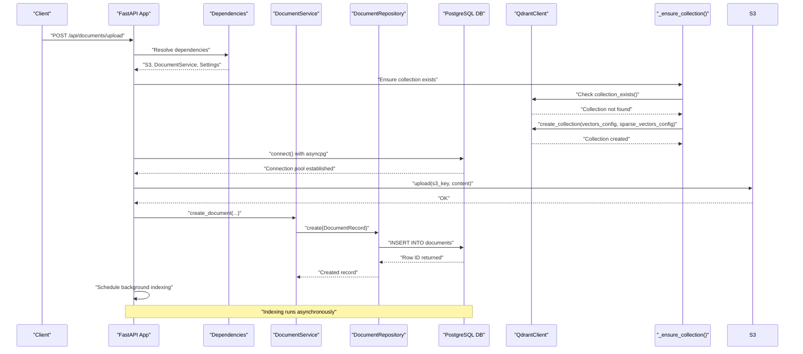
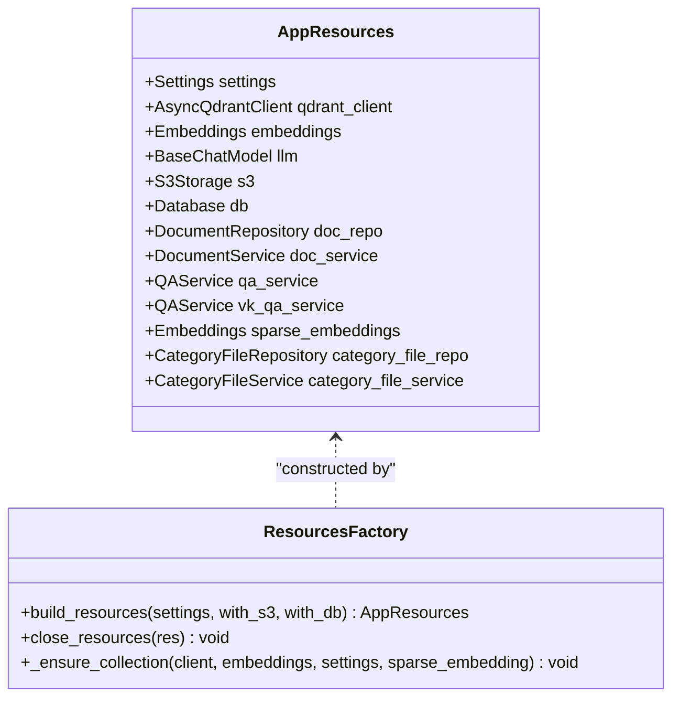
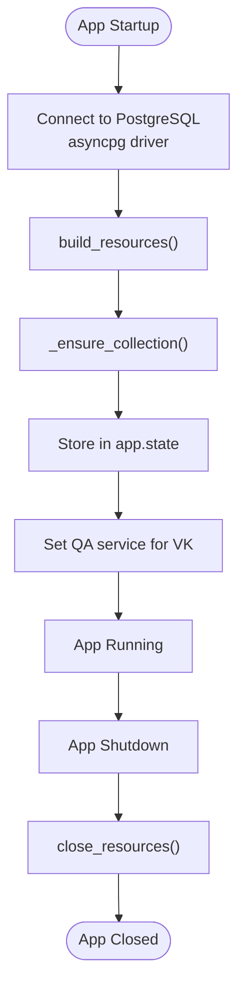
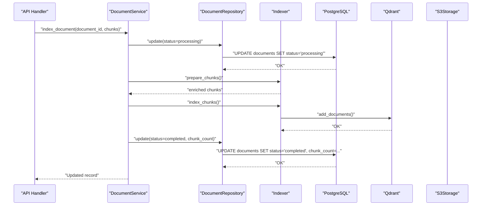
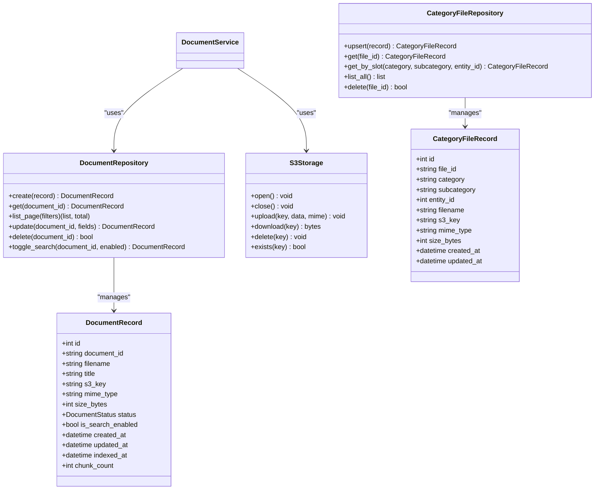
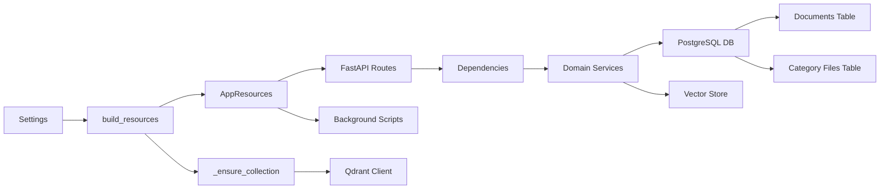

# Resource Management System

<cite>
**Referenced Files in This Document**
- [main.py](file://app/main.py)
- [resources.py](file://app/resources.py)
- [config.py](file://app/config.py)
- [document_service.py](file://app/domain/document_service.py)
- [document_repo.py](file://app/storage/document_repo.py)
- [category_repo.py](file://app/storage/category_repo.py)
- [category_models.py](file://app/storage/category_models.py)
- [s3.py](file://app/storage/s3.py)
- [models.py](file://app/storage/models.py)
- [documents.py](file://app/api/documents.py)
- [deps.py](file://app/api/deps.py)
- [bot.py](file://app/integrations/vk/bot.py)
- [indexer.py](file://app/rag/indexer.py)
- [ingest.py](file://scripts/ingest.py)
- [polling_vk.py](file://scripts/polling_vk.py)
- [database.py](file://app/storage/database.py)
- [qa_service.py](file://app/domain/qa_service.py)
- [parser.py](file://app/rag/parser.py)
- [retriever.py](file://app/rag/retriever.py)
- [docker-compose.yml](file://docker-compose.yml)
- [pyproject.toml](file://pyproject.toml)
</cite>

## Update Summary
**Changes Made**
- Consolidated resource management with AppResources container as the central factory
- Improved async resource initialization patterns with proper lifecycle management
- Enhanced graceful degradation capabilities with optional resource initialization
- Streamlined resource sharing across FastAPI, background scripts, and VK bot integration
- Unified resource cleanup with close_resources() function

## Table of Contents
1. [Introduction](#introduction)
2. [Project Structure](#project-structure)
3. [Core Components](#core-components)
4. [Architecture Overview](#architecture-overview)
5. [Detailed Component Analysis](#detailed-component-analysis)
6. [Hybrid Search Configuration and Setup](#hybrid-search-configuration-and-setup)
7. [Dependency Analysis](#dependency-analysis)
8. [Performance Considerations](#performance-considerations)
9. [Troubleshooting Guide](#troubleshooting-guide)
10. [Conclusion](#conclusion)

## Introduction
This document describes the Resource Management System that orchestrates shared resources across the Cafetera HR Bot application. The system ensures proper initialization, sharing, and cleanup of critical components such as PostgreSQL database, S3 storage, Qdrant vector store, embeddings, LLM, and domain services. It provides a centralized factory pattern for building resources and a lifecycle manager that coordinates startup and shutdown sequences for both the FastAPI application and background workers.

**Updated** The system now operates on PostgreSQL with enhanced schema management, supporting advanced data types including TIMESTAMPTZ and BOOLEAN, and provides robust connection pooling through the asyncpg driver. The resource management has been consolidated into a unified AppResources container that enables graceful degradation when services are unavailable.

## Project Structure
The Resource Management System spans several modules:
- Application bootstrap and lifecycle management
- Shared resource factory and container with automatic collection management
- Domain services coordinating metadata, vector indexing, and file storage
- API dependencies and routing
- Background ingestion and indexing scripts
- Infrastructure provisioning via Docker Compose with PostgreSQL, Qdrant, and MinIO

```mermaid
graph TB
subgraph "Application Layer"
A[FastAPI App<br/>lifespan]
B[API Routes<br/>documents.py]
C[Dependencies<br/>deps.py]
end
subgraph "Resource Factory"
D[AppResources<br/>resources.py]
E[build_resources()<br/>resources.py]
F[close_resources()<br/>resources.py]
G[_ensure_collection()<br/>resources.py]
end
subgraph "Domain Services"
H[DocumentService<br/>document_service.py]
I[QAService<br/>qa_service.py]
end
subgraph "Storage Layer"
J[DocumentRepository<br/>document_repo.py]
K[CategoryFileRepository<br/>category_repo.py]
L[PostgreSQL DB<br/>database.py]
M[S3Storage<br/>s3.py]
end
subgraph "RAG Pipeline"
N[Parser<br/>parser.py]
O[Indexer<br/>indexer.py]
P[Embeddings/Qdrant<br/>resources.py]
Q[Hybrid Search<br/>retriever.py]
end
subgraph "Infrastructure"
R[Docker Compose<br/>docker-compose.yml]
S[Config<br/>config.py]
T[PostgreSQL Schema<br/>database.py]
end
A --> D
A --> E
A --> F
A --> G
B --> C
C --> H
C --> I
C --> J
C --> K
H --> J
H --> N
H --> O
I --> P
I --> Q
N --> H
P --> G
R --> T
R --> P
S --> A
```

**Diagram sources**
- [main.py:21-46](file://app/main.py#L21-L46)
- [resources.py:38-99](file://app/resources.py#L38-L99)
- [resources.py:127-303](file://app/resources.py#L127-L303)
- [resources.py:306-344](file://app/resources.py#L306-L344)
- [document_service.py:36-291](file://app/domain/document_service.py#L36-L291)
- [document_repo.py:63-301](file://app/storage/document_repo.py#L63-L301)
- [category_repo.py:48-140](file://app/storage/category_repo.py#L48-L140)
- [s3.py:14-109](file://app/storage/s3.py#L14-L109)
- [documents.py:49-109](file://app/api/documents.py#L49-L109)
- [deps.py:39-109](file://app/api/deps.py#L39-L109)
- [indexer.py:23-152](file://app/rag/indexer.py#L23-L152)
- [parser.py:127-146](file://app/rag/parser.py#L127-L146)
- [retriever.py:92-107](file://app/rag/retriever.py#L92-L107)
- [docker-compose.yml:1-53](file://docker-compose.yml#L1-L53)
- [config.py:14-62](file://app/config.py#L14-L62)

**Section sources**
- [main.py:1-76](file://app/main.py#L1-L76)
- [resources.py:1-365](file://app/resources.py#L1-L365)
- [config.py:14-62](file://app/config.py#L14-L62)

## Core Components
The Resource Management System centers on three pillars:
- Centralized resource container and factory with automatic collection management
- Application lifecycle management
- Graceful degradation and cleanup

Key elements:
- AppResources dataclass: Holds optional references to all shared resources including sparse embeddings for hybrid search
- build_resources(): Initializes components with try/except blocks and logs failures, automatically creating Qdrant collections
- close_resources(): Ensures orderly shutdown and cleanup
- FastAPI lifespan: Coordinates initialization and teardown
- Semaphore-based concurrency control for indexing
- _ensure_collection(): New function that creates Qdrant collections with appropriate vector configurations

**Updated** The system now manages PostgreSQL connections through the databases library with asyncpg driver, providing robust connection pooling and transaction management for document metadata operations. The resource management has been consolidated into a unified AppResources container that enables graceful degradation when services are unavailable.

**Section sources**
- [resources.py:38-99](file://app/resources.py#L38-L99)
- [resources.py:127-303](file://app/resources.py#L127-L303)
- [resources.py:306-344](file://app/resources.py#L306-L344)
- [main.py:21-46](file://app/main.py#L21-L46)
- [documents.py:130-171](file://app/api/documents.py#L130-L171)

## Architecture Overview
The system follows a layered architecture with clear separation of concerns:
- Presentation layer: FastAPI routes and templates
- Domain layer: DocumentService and QAService orchestrate business logic
- Storage layer: PostgreSQL repositories and S3 storage with enhanced schema management
- Infrastructure layer: Qdrant vector store with automatic collection management and embeddings
- Integration layer: VK bot and background ingestion

**Updated** The architecture now includes PostgreSQL database management with proper schema initialization, supporting advanced data types and connection pooling for production deployments. The resource management system provides unified initialization patterns across all application components.



**Diagram sources**
- [documents.py:471-576](file://app/api/documents.py#L471-L576)
- [document_service.py:57-82](file://app/domain/document_service.py#L57-L82)
- [document_repo.py:71-103](file://app/storage/document_repo.py#L71-L103)
- [s3.py:81-90](file://app/storage/s3.py#L81-L90)
- [resources.py:38-99](file://app/resources.py#L38-L99)

## Detailed Component Analysis

### Resource Container and Factory
The AppResources container encapsulates all shared resources with optional fields, enabling graceful degradation when services are unavailable. The build_resources() factory method:
- Initializes S3 storage when requested
- Builds Qdrant client and embeddings
- Creates PostgreSQL Database connection with asyncpg driver
- Initializes DocumentRepository and DocumentService with proper schema management
- Constructs QAService with LLM, retriever, and chain when vector store is ready
- Automatically creates Qdrant collections with appropriate vector configurations
- Returns a fully populated container for application use

**Updated** The factory method now includes PostgreSQL database initialization through the databases library, establishing connection pools and creating tables with proper SERIAL primary keys and PostgreSQL-specific data types. The resource management has been consolidated into a unified AppResources container that enables graceful degradation across all components.



**Diagram sources**
- [resources.py:104-125](file://app/resources.py#L104-L125)
- [resources.py:127-303](file://app/resources.py#L127-L303)
- [resources.py:38-99](file://app/resources.py#L38-L99)

**Section sources**
- [resources.py:104-125](file://app/resources.py#L104-L125)
- [resources.py:127-303](file://app/resources.py#L127-L303)
- [resources.py:38-99](file://app/resources.py#L38-L99)

### Application Lifecycle Management
The FastAPI lifespan manager coordinates resource initialization and cleanup:
- Establishes PostgreSQL database connection with asyncpg driver
- Builds resources with configurable S3 and DB availability
- Automatically creates Qdrant collections with vector configurations
- Stores resources in app.state for dependency injection
- Sets global QA service for VK handlers
- Executes cleanup on shutdown

**Updated** The lifecycle manager now includes PostgreSQL database connection establishment and schema initialization during resource building, ensuring the system is ready for document operations from startup. The resource management has been streamlined to use the unified AppResources container across all application components.



**Diagram sources**
- [main.py:21-46](file://app/main.py#L21-L46)
- [resources.py:127-303](file://app/resources.py#L127-L303)
- [resources.py:38-99](file://app/resources.py#L38-L99)

**Section sources**
- [main.py:21-46](file://app/main.py#L21-L46)

### Document Management Orchestration
DocumentService coordinates the complete document lifecycle:
- Metadata creation in PostgreSQL with proper data types (TIMESTAMPTZ, BOOLEAN)
- Vector chunk preparation and indexing in Qdrant
- File storage operations via S3
- Status transitions and error handling
- Search enable/disable synchronization across storage layers



**Diagram sources**
- [document_service.py:85-135](file://app/domain/document_service.py#L85-L135)
- [indexer.py:23-72](file://app/rag/indexer.py#L23-L72)

**Section sources**
- [document_service.py:36-291](file://app/domain/document_service.py#L36-L291)
- [indexer.py:23-152](file://app/rag/indexer.py#L23-L152)

### Storage Abstractions
The storage layer provides:
- DocumentRepository: Async CRUD operations with rich filtering and pagination using PostgreSQL
- CategoryFileRepository: Async CRUD operations for category file management with unique constraints
- S3Storage: Async client wrapper for MinIO/AWS S3 with bucket management
- PostgreSQL initialization and schema management with proper data types

**Updated** The storage layer now operates exclusively on PostgreSQL with enhanced schema definitions supporting SERIAL primary keys, TIMESTAMPTZ for precise timestamp tracking, and BOOLEAN for search enablement flags. The resource management system ensures consistent database connection handling across all storage components.



**Diagram sources**
- [document_repo.py:63-301](file://app/storage/document_repo.py#L63-L301)
- [category_repo.py:48-140](file://app/storage/category_repo.py#L48-L140)
- [s3.py:14-109](file://app/storage/s3.py#L14-L109)
- [models.py:20-37](file://app/storage/models.py#L20-L37)
- [category_models.py:9-21](file://app/storage/category_models.py#L9-L21)

**Section sources**
- [document_repo.py:63-301](file://app/storage/document_repo.py#L63-L301)
- [category_repo.py:48-140](file://app/storage/category_repo.py#L48-L140)
- [s3.py:14-109](file://app/storage/s3.py#L14-L109)
- [models.py:11-37](file://app/storage/models.py#L11-L37)
- [category_models.py:1-64](file://app/storage/category_models.py#L1-L64)

### API Dependencies and Routing
The dependency system provides secure access to resources:
- Authentication middleware validates admin sessions
- Dependency injection resolves S3, repositories, services, and QA service
- Semaphore controls concurrent indexing operations
- HTMX integration for real-time UI updates

**Updated** The dependency system now relies on PostgreSQL-backed repositories for document and category file operations, providing ACID transactions and referential integrity. The resource management system ensures consistent access patterns across all API endpoints through the unified AppResources container.

**Section sources**
- [deps.py:76-109](file://app/api/deps.py#L76-L109)
- [documents.py:471-576](file://app/api/documents.py#L471-L576)

### Background Ingestion and QA Services
Background ingestion script demonstrates resource reuse outside the web app:
- Initializes database and builds embeddings
- Processes local files and indexes them into Qdrant
- Updates metadata records with completion status

QAService provides:
- Adaptive retrieval with dynamic k selection
- Document-scoped chains with LRU caching
- Streaming and truncation for messaging platforms
- Support for both dense and sparse vector configurations

**Updated** QAService now operates with PostgreSQL-backed document metadata, enabling complex queries and filtering capabilities through the enhanced repository layer. The resource management system provides unified initialization patterns for both FastAPI applications and standalone scripts like the VK bot integration.

**Section sources**
- [ingest.py:45-158](file://scripts/ingest.py#L45-L158)
- [polling_vk.py:23-42](file://scripts/polling_vk.py#L23-L42)
- [qa_service.py:43-279](file://app/domain/qa_service.py#L43-L279)

## Hybrid Search Configuration and Setup

### Automatic Collection Creation
The `_ensure_collection()` function provides automatic Qdrant collection management with intelligent vector configuration:

- **Collection Existence Check**: Verifies if the target collection already exists
- **Dynamic Vector Size Detection**: Tests embedding dimensions using a sample document
- **Dense Vector Configuration**: Creates standard vector parameters with cosine distance
- **Sparse Vector Support**: Adds sparse vector configuration for hybrid search mode
- **Graceful Error Handling**: Logs warnings and raises exceptions on configuration failures

### Hybrid Search Capabilities
The system supports two retrieval modes through configuration:

- **Dense Mode**: Standard vector similarity search using dense embeddings
- **Hybrid Mode**: Combined dense vector and sparse BM25 search for improved recall

**Configuration Options**:
- `retrieval_mode`: Set to "dense" or "hybrid"
- `sparse_embedding_model`: Model name for sparse embeddings (default: "Qdrant/bm25")

**Section sources**
- [resources.py:38-99](file://app/resources.py#L38-L99)
- [config.py:59-62](file://app/config.py#L59-L62)
- [retriever.py:92-107](file://app/rag/retriever.py#L92-L107)

## Dependency Analysis
The system exhibits loose coupling through dependency injection and shared resource containers:
- FastAPI routes depend on resolved dependencies rather than concrete implementations
- Domain services encapsulate business logic and coordinate multiple storage layers
- Resource factory enables conditional initialization and graceful fallback
- Background scripts reuse the same resource construction logic
- Automatic collection management reduces external dependencies for first-time setup

**Updated** The dependency graph now includes PostgreSQL database management through the databases library with asyncpg driver, providing robust connection pooling and transaction management for production deployments. The unified AppResources container ensures consistent resource initialization across all application components.



**Diagram sources**
- [config.py:14-62](file://app/config.py#L14-L62)
- [resources.py:127-303](file://app/resources.py#L127-L303)
- [resources.py:38-99](file://app/resources.py#L38-L99)
- [deps.py:39-109](file://app/api/deps.py#L39-L109)

**Section sources**
- [pyproject.toml:7-28](file://pyproject.toml#L7-L28)
- [docker-compose.yml:1-53](file://docker-compose.yml#L1-L53)

## Performance Considerations
- Concurrency control: Indexing semaphore limits simultaneous background operations
- Asynchronous operations: All storage and vector operations use async patterns
- Connection pooling: PostgreSQL uses asyncpg driver with connection pooling
- Caching: QAService maintains an LRU cache of document-specific chains
- Efficient queries: Repository supports pagination and filtered queries with PostgreSQL optimization
- Graceful degradation: Components can fail independently without affecting others
- **Automatic Collection Creation**: Reduces startup overhead by handling collection setup programmatically
- **PostgreSQL Optimization**: Enhanced schema with proper data types and indexes for production workloads
- **Unified Resource Management**: Consolidated initialization patterns reduce duplication and improve maintainability

**Updated** The PostgreSQL implementation provides superior performance through connection pooling, prepared statements, and optimized queries with proper indexing strategies. The unified resource management system eliminates redundant initialization code and improves overall system reliability.

## Troubleshooting Guide
Common issues and resolutions:
- Resource initialization failures: Check logs for specific exceptions during S3, Qdrant, or DB setup
- Missing admin credentials: Ensure admin_api_key is configured in environment
- Database connectivity: Verify PostgreSQL connection string, credentials, and network accessibility
- PostgreSQL schema issues: Check table creation permissions and database initialization
- Vector store unavailability: Confirm Qdrant service health and network connectivity
- S3 bucket issues: Validate endpoint URL, credentials, and bucket permissions
- **Collection creation failures**: Check Qdrant connection and embedding model availability
- **Hybrid search configuration**: Verify sparse embedding model installation and retrieval mode settings
- **PostgreSQL connection errors**: Verify asyncpg driver installation and connection parameters
- **Schema migration issues**: Check database initialization logs for table creation failures
- **Resource cleanup issues**: Verify close_resources() is called during shutdown to prevent resource leaks

**Updated** Added troubleshooting guidance for PostgreSQL-specific issues including connection problems, schema initialization failures, and asyncpg driver configuration. The unified resource management system provides better error reporting and cleanup mechanisms.

**Section sources**
- [resources.py:70-111](file://app/resources.py#L70-L111)
- [resources.py:38-99](file://app/resources.py#L38-L99)
- [deps.py:76-88](file://app/api/deps.py#L76-L88)
- [docker-compose.yml:30-47](file://docker-compose.yml#L30-L47)

## Conclusion
The Resource Management System provides a robust foundation for the Cafetera HR Bot by centralizing resource initialization, enabling graceful degradation, and ensuring proper cleanup. Its modular design supports both web application and background processing scenarios while maintaining clear separation of concerns across storage, domain, and infrastructure layers.

**Updated** The addition of PostgreSQL database management significantly enhances the system's reliability and scalability for production deployments. The migration provides better data integrity, connection pooling, and performance characteristics compared to the previous SQLite implementation. The automatic collection creation through the `_ensure_collection()` function continues to simplify deployment while the PostgreSQL schema ensures proper data types and constraints for enterprise-grade document management.

The consolidation of resource management into the AppResources container has improved code maintainability and reduced duplication across the application. The unified initialization patterns enable seamless integration between FastAPI applications, background scripts, and VK bot integration, while the enhanced graceful degradation capabilities ensure system stability even when individual services are unavailable.