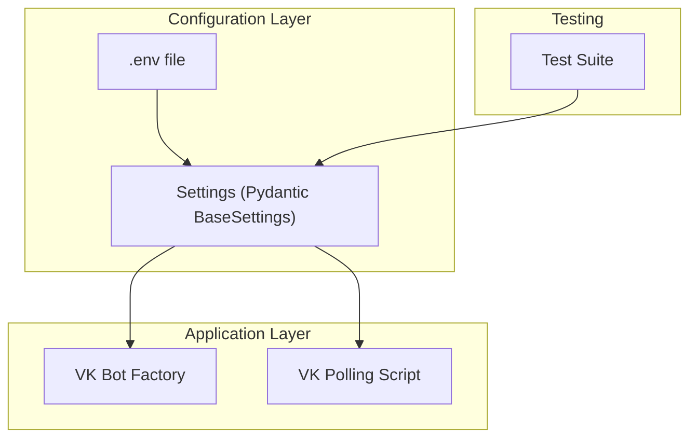
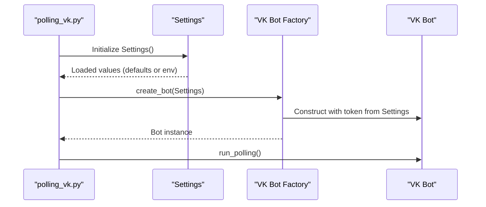
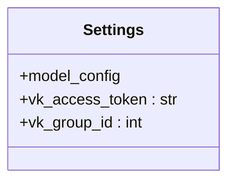
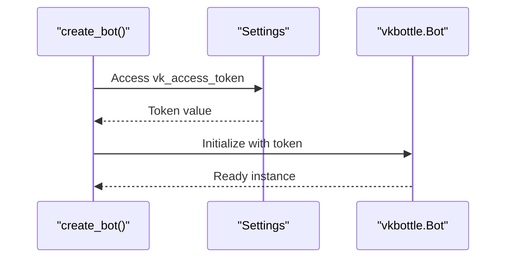
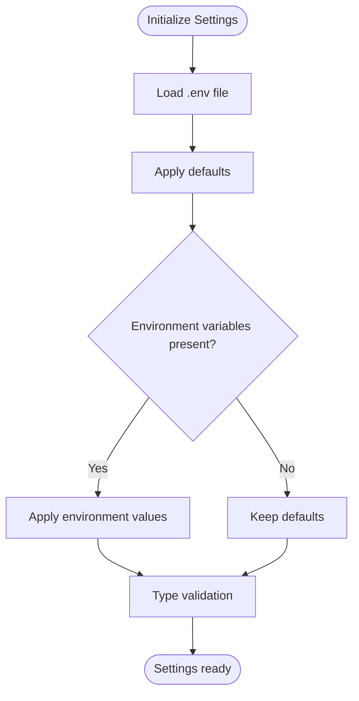
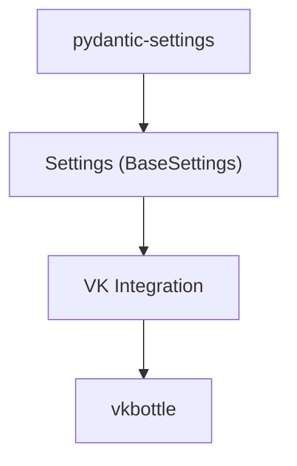

# Configuration Management

<cite>
**Referenced Files in This Document**
- [app/config.py](file://app/config.py)
- [tests/test_config.py](file://tests/test_config.py)
- [scripts/polling_vk.py](file://scripts/polling_vk.py)
- [app/integrations/vk/bot.py](file://app/integrations/vk/bot.py)
- [docker-compose.yml](file://docker-compose.yml)
- [pyproject.toml](file://pyproject.toml)
- [PLAN.md](file://PLAN.md)
- [AGENTS.md](file://AGENTS.md)
</cite>

## Table of Contents
1. [Introduction](#introduction)
2. [Project Structure](#project-structure)
3. [Core Components](#core-components)
4. [Architecture Overview](#architecture-overview)
5. [Detailed Component Analysis](#detailed-component-analysis)
6. [Dependency Analysis](#dependency-analysis)
7. [Performance Considerations](#performance-considerations)
8. [Security Best Practices](#security-best-practices)
9. [Development vs Production Configurations](#development-vs-production-configurations)
10. [Adding New Configuration Variables](#adding-new-configuration-variables)
11. [Troubleshooting Guide](#troubleshooting-guide)
12. [Conclusion](#conclusion)

## Introduction
This document explains the configuration management system used in cafetera_hr_bot. It focuses on the Pydantic Settings implementation, environment variable loading and validation, configuration structure, and security best practices. It documents the current configuration options (VK API credentials), outlines how to extend the system for database connections and future integrations, and provides examples of development versus production configurations along with templates for different deployment environments.

## Project Structure
The configuration system centers around a single Pydantic Settings class that loads environment variables from a .env file. The VK integration consumes these settings to initialize the bot. Tests validate the loading behavior, and scripts demonstrate runtime usage.

**Diagram sources**
- [app/config.py:1-9](file://app/config.py#L1-L9)
- [scripts/polling_vk.py:14-28](file://scripts/polling_vk.py#L14-L28)
- [app/integrations/vk/bot.py:23-31](file://app/integrations/vk/bot.py#L23-L31)
- [tests/test_config.py:1-28](file://tests/test_config.py#L1-L28)

**Section sources**
- [app/config.py:1-9](file://app/config.py#L1-L9)
- [scripts/polling_vk.py:1-33](file://scripts/polling_vk.py#L1-L33)
- [app/integrations/vk/bot.py:1-32](file://app/integrations/vk/bot.py#L1-L32)
- [tests/test_config.py:1-28](file://tests/test_config.py#L1-L28)

## Core Components
- Settings class: Defines typed configuration fields, environment file binding, and default values.
- VK integration: Uses Settings to configure the VK bot token and handler registration.
- Tests: Verify defaults and environment variable precedence.
- Scripts: Demonstrate runtime initialization using Settings.

Key implementation details:
- Settings class inherits from Pydantic BaseSettings and binds to a .env file with UTF-8 encoding.
- Current fields include VK access token and group ID with sensible defaults.
- The VK bot factory reads the token from Settings to construct the bot instance.

**Section sources**
- [app/config.py:4-9](file://app/config.py#L4-L9)
- [app/integrations/vk/bot.py:23-31](file://app/integrations/vk/bot.py#L23-L31)
- [tests/test_config.py:6-27](file://tests/test_config.py#L6-L27)

## Architecture Overview
The configuration architecture follows a layered approach:
- Configuration layer: Settings class encapsulates environment-driven configuration.
- Application layer: Integrations consume Settings to initialize services.
- Runtime layer: Scripts and handlers access Settings at startup or during operation.

**Diagram sources**
- [scripts/polling_vk.py:24-28](file://scripts/polling_vk.py#L24-L28)
- [app/config.py:4-9](file://app/config.py#L4-L9)
- [app/integrations/vk/bot.py:23-31](file://app/integrations/vk/bot.py#L23-L31)

## Detailed Component Analysis

### Settings Class
The Settings class defines the configuration contract:
- Environment file binding: Loads variables from .env with UTF-8 encoding.
- Fields: vk_access_token (str) and vk_group_id (int) with defaults.
- Type safety: Pydantic ensures type conversion and validation.

**Diagram sources**
- [app/config.py:4-9](file://app/config.py#L4-L9)

**Section sources**
- [app/config.py:4-9](file://app/config.py#L4-L9)

### VK Bot Factory and Settings Usage
The VK bot factory constructs a vkbottle Bot using the VK access token from Settings. This demonstrates how configuration flows into application components.

**Diagram sources**
- [app/integrations/vk/bot.py:23-31](file://app/integrations/vk/bot.py#L23-L31)
- [app/config.py:7-8](file://app/config.py#L7-L8)

**Section sources**
- [app/integrations/vk/bot.py:23-31](file://app/integrations/vk/bot.py#L23-L31)
- [app/config.py:7-8](file://app/config.py#L7-L8)

### Configuration Loading and Validation
The test suite validates:
- Default values when no environment variables are set.
- Environment variable precedence over defaults.
- Numeric parsing for integer fields.

**Diagram sources**
- [tests/test_config.py:6-27](file://tests/test_config.py#L6-L27)
- [app/config.py:4-9](file://app/config.py#L4-L9)

**Section sources**
- [tests/test_config.py:6-27](file://tests/test_config.py#L6-L27)
- [app/config.py:4-9](file://app/config.py#L4-L9)

## Dependency Analysis
The configuration system has minimal external dependencies:
- Pydantic Settings: Provides environment file loading and type validation.
- VK integration: Depends on Settings for bot initialization.

**Diagram sources**
- [pyproject.toml:10-11](file://pyproject.toml#L10-L11)
- [app/config.py:1](file://app/config.py#L1)
- [app/integrations/vk/bot.py:7](file://app/integrations/vk/bot.py#L7)

**Section sources**
- [pyproject.toml:10-11](file://pyproject.toml#L10-L11)
- [app/config.py:1](file://app/config.py#L1)
- [app/integrations/vk/bot.py:7](file://app/integrations/vk/bot.py#L7)

## Performance Considerations
- Environment file loading occurs at import-time when Settings is instantiated. This is lightweight and suitable for application startup.
- Type conversion and validation are handled by Pydantic, adding negligible overhead during normal operation.
- Keep the number of environment variables minimal to reduce startup parsing overhead.

## Security Best Practices
- Never hardcode secrets. Use environment variables and the .env file.
- Exclude .env from version control and provide a .env.example template with placeholders.
- Restrict file permissions on .env to minimize exposure.
- Use strong tokens and rotate them periodically.
- Avoid printing sensitive values in logs.

[No sources needed since this section provides general guidance]

## Development vs Production Configurations
- Development: Use long polling mode with VK. The VK polling script initializes Settings and runs the bot locally.
- Production: Use webhook mode via FastAPI lifespan. Avoid long polling in production deployments.

Operational differences:
- VK polling script demonstrates Settings usage at runtime.
- Production requires webhook configuration and transport setup (not shown in current files).

**Section sources**
- [scripts/polling_vk.py:24-28](file://scripts/polling_vk.py#L24-L28)
- [AGENTS.md:16-18](file://AGENTS.md#L16-L18)

## Adding New Configuration Variables
To add new configuration variables:
1. Define the field in the Settings class with a type annotation and default value.
2. Reference the field in the consuming component(s).
3. Add environment variables for the new fields in .env during development.
4. Update tests to validate defaults and environment precedence.
5. Document the new field in the configuration schema.

Example steps:
- Add a new field to the Settings class.
- Update the VK bot factory or other consumers to use the new field.
- Add corresponding environment variables to .env for local testing.
- Extend tests to cover the new field’s behavior.

**Section sources**
- [app/config.py:4-9](file://app/config.py#L4-L9)
- [tests/test_config.py:6-27](file://tests/test_config.py#L6-L27)

## Troubleshooting Guide
Common issues and resolutions:
- Missing .env file: Ensure the .env file exists and is readable. The Settings class expects it at the project root.
- Incorrect environment variable names: Confirm variable names match the field names in Settings.
- Type conversion errors: Ensure environment values match the expected types (e.g., integers for numeric fields).
- VK token invalid: Verify the VK access token is correct and has sufficient permissions.

Validation tips:
- Use the test suite to verify defaults and environment precedence.
- Temporarily log Settings values during startup to confirm loaded values.

**Section sources**
- [tests/test_config.py:6-27](file://tests/test_config.py#L6-L27)
- [app/config.py:4-9](file://app/config.py#L4-L9)

## Conclusion
The configuration management system in cafetera_hr_bot uses Pydantic Settings to load environment variables from a .env file, providing type-safe configuration for the VK integration. The current implementation covers VK API credentials and demonstrates how to extend the system for additional integrations and services. By following the documented patterns and security practices, teams can safely manage configuration across development and production environments while maintaining clarity and reliability.