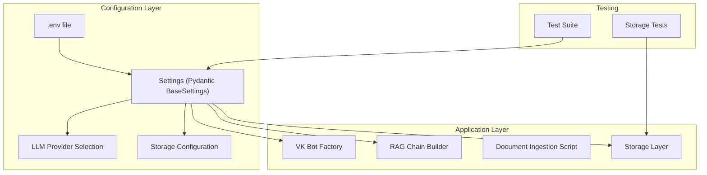
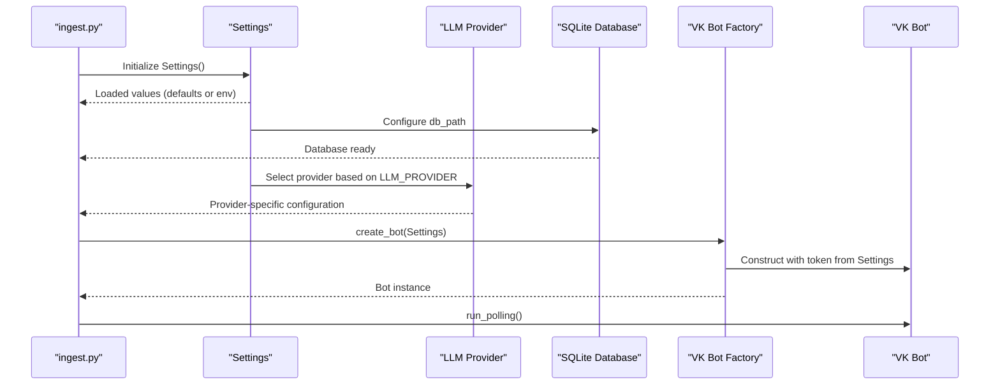
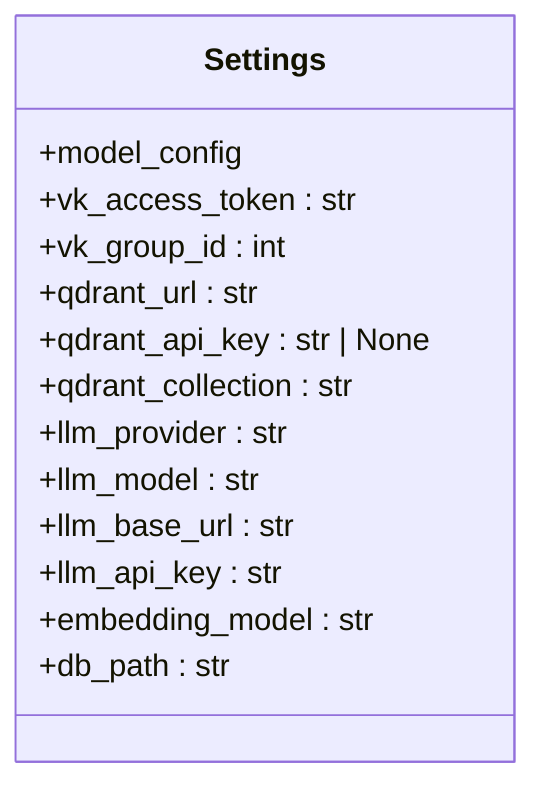
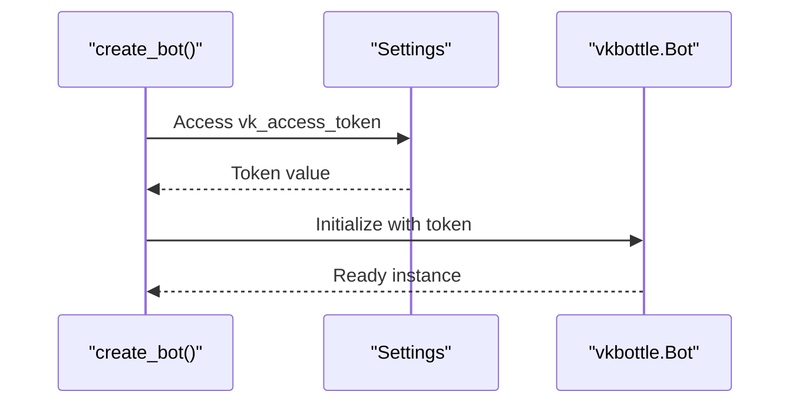
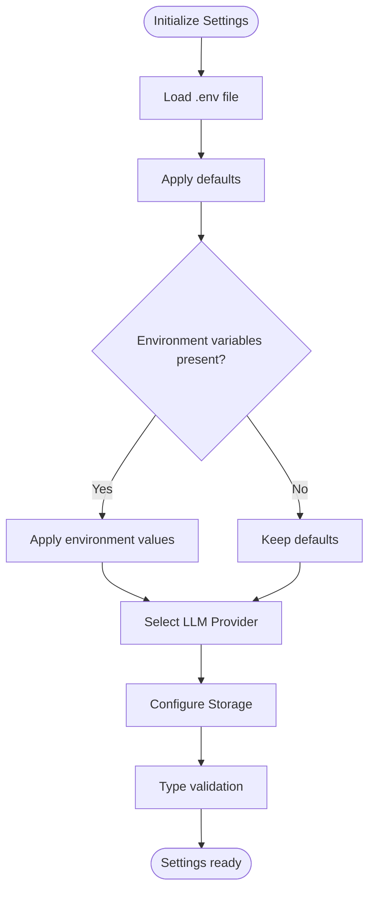
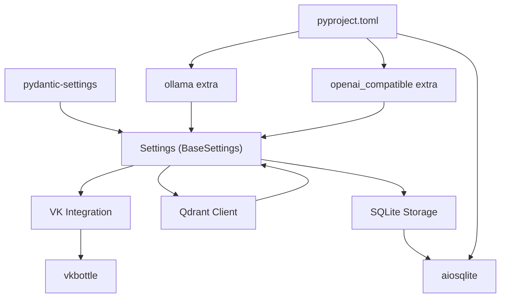
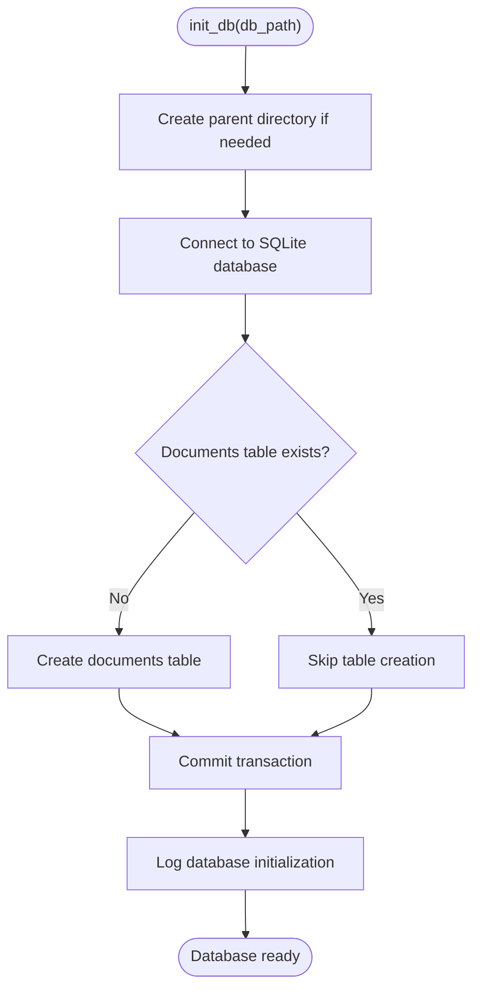

# Configuration Management

<cite>
**Referenced Files in This Document**
- [app/config.py](file://app/config.py)
- [tests/test_config.py](file://tests/test_config.py)
- [tests/test_storage.py](file://tests/test_storage.py)
- [scripts/ingest.py](file://scripts/ingest.py)
- [app/integrations/vk/bot.py](file://app/integrations/vk/bot.py)
- [app/rag/chain.py](file://app/rag/chain.py)
- [app/rag/retriever.py](file://app/rag/retriever.py)
- [app/storage/database.py](file://app/storage/database.py)
- [app/storage/document_repo.py](file://app/storage/document_repo.py)
- [app/storage/models.py](file://app/storage/models.py)
- [scripts/run_llama_qwen.sh](file://scripts/run_llama_qwen.sh)
- [scripts/run_ollama_qwen.sh](file://scripts/run_ollama_qwen.sh)
- [docker-compose.yml](file://docker-compose.yml)
- [pyproject.toml](file://pyproject.toml)
- [PLAN.md](file://PLAN.md)
- [AGENTS.md](file://AGENTS.md)
</cite>

## Update Summary
**Changes Made**
- Added comprehensive documentation for the new `db_path` configuration setting (default: 'data/cafetera.db')
- Documented SQLite database integration for document storage
- Updated storage configuration section with new database settings
- Enhanced dependency analysis to include SQLite and storage modules
- Added new storage-related configuration examples and best practices

## Table of Contents
1. [Introduction](#introduction)
2. [Project Structure](#project-structure)
3. [Core Components](#core-components)
4. [Architecture Overview](#architecture-overview)
5. [Detailed Component Analysis](#detailed-component-analysis)
6. [Dependency Analysis](#dependency-analysis)
7. [Performance Considerations](#performance-considerations)
8. [Security Best Practices](#security-best-practices)
9. [Development vs Production Configurations](#development-vs-production-configurations)
10. [Adding New Configuration Variables](#adding-new-configuration-variables)
11. [Storage Configuration](#storage-configuration)
12. [LLM Provider Configuration](#llm-provider-configuration)
13. [Troubleshooting Guide](#troubleshooting-guide)
14. [Conclusion](#conclusion)

## Introduction
This document explains the configuration management system used in cafetera_hr_bot. It focuses on the Pydantic Settings implementation, environment variable loading and validation, configuration structure, and security best practices. The system now supports multiple LLM providers including llama.cpp with backward compatibility, alongside VK API credentials, Qdrant database connections, and SQLite database integration for document storage. It documents all current configuration options and provides examples of development versus production configurations along with templates for different deployment environments.

## Project Structure
The configuration system centers around a single Pydantic Settings class that loads environment variables from a .env file. The system supports multiple LLM providers (ollama, openai, llama.cpp) with automatic fallback mechanisms, VK API integration, Qdrant vector storage, and SQLite database integration for document metadata. The storage components consume these settings to initialize database connections and manage document lifecycle. Tests validate the loading behavior across different providers and storage configurations, and scripts demonstrate runtime usage.



**Diagram sources**
- [app/config.py:4-26](file://app/config.py#L4-L26)
- [app/storage/database.py:31-37](file://app/storage/database.py#L31-L37)
- [app/storage/document_repo.py:61-66](file://app/storage/document_repo.py#L61-L66)
- [tests/test_storage.py:39-44](file://tests/test_storage.py#L39-L44)

**Section sources**
- [app/config.py:4-26](file://app/config.py#L4-L26)
- [scripts/ingest.py:139-141](file://scripts/ingest.py#L139-L141)
- [app/integrations/vk/bot.py:23-31](file://app/integrations/vk/bot.py#L23-L31)
- [tests/test_config.py:1-28](file://tests/test_config.py#L1-L28)
- [tests/test_storage.py:1-278](file://tests/test_storage.py#L1-L278)

## Core Components
- **Settings class**: Defines typed configuration fields, environment file binding, and default values for all system components including the new storage configuration.
- **LLM Provider System**: Supports multiple providers (ollama, openai, llama.cpp) with automatic fallback and backward compatibility.
- **VK integration**: Uses Settings to configure the VK bot token and handler registration.
- **RAG Components**: Build LLM chains and embeddings based on provider selection.
- **Storage System**: Manages SQLite database for document metadata with comprehensive CRUD operations.
- **Tests**: Verify defaults, environment variable precedence, provider-specific behavior, and storage functionality.
- **Scripts**: Demonstrate runtime initialization using Settings for different providers and storage operations.

Key implementation details:
- Settings class inherits from Pydantic BaseSettings and binds to a .env file with UTF-8 encoding.
- Current fields include VK access token, group ID, Qdrant configuration, comprehensive LLM settings, and new storage configuration.
- The LLM system automatically selects providers based on LLM_PROVIDER environment variable with sensible defaults.
- The storage system uses db_path to configure SQLite database location with automatic table initialization.
- The VK bot factory reads the token from Settings to construct the bot instance.

**Section sources**
- [app/config.py:4-26](file://app/config.py#L4-L26)
- [app/storage/database.py:31-37](file://app/storage/database.py#L31-L37)
- [app/storage/document_repo.py:61-66](file://app/storage/document_repo.py#L61-L66)
- [tests/test_config.py:6-27](file://tests/test_config.py#L6-L27)
- [tests/test_storage.py:1-278](file://tests/test_storage.py#L1-L278)

## Architecture Overview
The configuration architecture follows a layered approach with provider-aware components and integrated storage:
- **Configuration layer**: Settings class encapsulates environment-driven configuration with provider selection and storage settings.
- **Application layer**: Integrations consume Settings to initialize services with appropriate provider backends and database connections.
- **Runtime layer**: Scripts and handlers access Settings at startup or during operation with automatic provider detection and storage initialization.



**Diagram sources**
- [scripts/ingest.py:245-246](file://scripts/ingest.py#L245-L246)
- [app/config.py:15-26](file://app/config.py#L15-L26)
- [app/storage/database.py:31-37](file://app/storage/database.py#L31-L37)
- [app/integrations/vk/bot.py:23-31](file://app/integrations/vk/bot.py#L23-L31)

## Detailed Component Analysis

### Settings Class
The Settings class defines the comprehensive configuration contract:
- **Environment file binding**: Loads variables from .env with UTF-8 encoding.
- **Fields**: vk_access_token (str), vk_group_id (int), Qdrant configuration, LLM settings, embedding configuration, and new storage configuration.
- **Type safety**: Pydantic ensures type conversion and validation.
- **Provider awareness**: LLM_PROVIDER field controls which backend to use.
- **Storage awareness**: db_path field controls SQLite database location.



**Diagram sources**
- [app/config.py:4-26](file://app/config.py#L4-L26)

**Section sources**
- [app/config.py:4-26](file://app/config.py#L4-L26)

### VK Bot Factory and Settings Usage
The VK bot factory constructs a vkbottle Bot using the VK access token from Settings. This demonstrates how configuration flows into application components.



**Diagram sources**
- [app/integrations/vk/bot.py:23-31](file://app/integrations/vk/bot.py#L23-L31)
- [app/config.py:7-8](file://app/config.py#L7-L8)

**Section sources**
- [app/integrations/vk/bot.py:23-31](file://app/integrations/vk/bot.py#L23-L31)
- [app/config.py:7-8](file://app/config.py#L7-L8)

### Configuration Loading and Validation
The test suite validates:
- Default values when no environment variables are set.
- Environment variable precedence over defaults.
- Numeric parsing for integer fields.
- Provider-specific configuration behavior.
- Storage configuration defaults and validation.



**Diagram sources**
- [tests/test_config.py:6-27](file://tests/test_config.py#L6-L27)
- [app/config.py:4-26](file://app/config.py#L4-L26)
- [tests/test_storage.py:39-44](file://tests/test_storage.py#L39-L44)

**Section sources**
- [tests/test_config.py:6-27](file://tests/test_config.py#L6-L27)
- [app/config.py:4-26](file://app/config.py#L4-L26)
- [tests/test_storage.py:1-278](file://tests/test_storage.py#L1-L278)

## Dependency Analysis
The configuration system has minimal external dependencies with provider-specific extras and storage modules:
- **Pydantic Settings**: Provides environment file loading and type validation.
- **VK integration**: Depends on Settings for bot initialization.
- **LLM Providers**: Optional dependencies for different provider backends.
- **Qdrant**: Vector store integration with configurable connection settings.
- **SQLite Storage**: Document metadata persistence with automatic table initialization.
- **Storage Dependencies**: aiosqlite for asynchronous database operations.



**Diagram sources**
- [pyproject.toml:10-11](file://pyproject.toml#L10-L11)
- [pyproject.toml:27-34](file://pyproject.toml#L27-L34)
- [pyproject.toml:23](file://pyproject.toml#L23)
- [app/config.py:1](file://app/config.py#L1)
- [app/integrations/vk/bot.py:7](file://app/integrations/vk/bot.py#L7)

**Section sources**
- [pyproject.toml:10-11](file://pyproject.toml#L10-L11)
- [pyproject.toml:27-34](file://pyproject.toml#L27-L34)
- [pyproject.toml:23](file://pyproject.toml#L23)
- [app/config.py:1](file://app/config.py#L1)
- [app/integrations/vk/bot.py:7](file://app/integrations/vk/bot.py#L7)

## Performance Considerations
- Environment file loading occurs at import-time when Settings is instantiated. This is lightweight and suitable for application startup.
- Type conversion and validation are handled by Pydantic, adding negligible overhead during normal operation.
- Provider selection happens at runtime when building LLM instances, with minimal performance impact.
- SQLite database operations use asynchronous connections to minimize blocking.
- Keep the number of environment variables minimal to reduce startup parsing overhead.
- LLM provider switching is handled efficiently with conditional imports and fallback mechanisms.
- Storage operations are optimized with proper indexing on document_id and timestamps.

## Security Best Practices
- Never hardcode secrets. Use environment variables and the .env file.
- Exclude .env from version control and provide a .env.example template with placeholders.
- Restrict file permissions on .env to minimize exposure.
- Use strong tokens and rotate them periodically.
- Avoid printing sensitive values in logs.
- For LLM providers, consider API key rotation and secure storage for production deployments.
- Validate provider URLs and ensure they use HTTPS in production environments.
- Secure database file permissions and consider encryption for sensitive document metadata.
- Regularly backup database files and implement proper access controls.

## Development vs Production Configurations
- **Development**: Use local LLM providers (ollama, llama.cpp) with localhost URLs and local SQLite database. The VK polling script initializes Settings and runs the bot locally.
- **Production**: Use cloud LLM providers with proper authentication and managed database services. Avoid long polling in production deployments.

Operational differences:
- VK polling script demonstrates Settings usage at runtime.
- Production requires webhook configuration and transport setup.
- LLM provider selection affects dependency requirements and resource allocation.
- Storage configuration requires proper database permissions and backup strategies.
- Production databases should use managed services with proper monitoring and scaling.

**Section sources**
- [scripts/ingest.py:245-246](file://scripts/ingest.py#L245-L246)
- [AGENTS.md:16-18](file://AGENTS.md#L16-L18)

## Adding New Configuration Variables
To add new configuration variables:
1. Define the field in the Settings class with a type annotation and default value.
2. Reference the field in the consuming component(s).
3. Add environment variables for the new fields in .env during development.
4. Update tests to validate defaults and environment precedence.
5. Document the new field in the configuration schema.
6. Consider provider-specific behavior if applicable.
7. For storage-related configurations, ensure proper initialization and cleanup procedures.

Example steps:
- Add a new field to the Settings class.
- Update the VK bot factory or other consumers to use the new field.
- Add corresponding environment variables to .env for local testing.
- Extend tests to cover the new field's behavior.
- Implement proper validation and error handling for the new configuration.

**Section sources**
- [app/config.py:4-26](file://app/config.py#L4-L26)
- [tests/test_config.py:6-27](file://tests/test_config.py#L6-L27)

## Storage Configuration

### Database Configuration
The storage system uses SQLite for document metadata persistence with comprehensive CRUD operations:

- **Default Location**: "data/cafetera.db" (automatically creates parent directories)
- **Automatic Initialization**: Creates database file and tables if they don't exist
- **Asynchronous Operations**: Uses aiosqlite for non-blocking database operations
- **Table Structure**: Documents table with comprehensive metadata tracking

### Storage Schema
The database schema includes comprehensive document tracking:

- **document_id**: Primary key for unique document identification
- **filename**: Original file name
- **title**: Document title derived from filename
- **s3_key**: Storage key for document retrieval
- **mime_type**: File type identifier
- **size_bytes**: File size in bytes
- **status**: Processing state (pending, processing, completed, failed)
- **is_search_enabled**: Boolean flag for search inclusion
- **error**: Error message for failed operations
- **created_at**: Timestamp of document creation
- **updated_at**: Timestamp of last modification
- **indexed_at**: Timestamp of successful indexing
- **chunk_count**: Number of text chunks processed

### Storage Operations
The DocumentRepository provides comprehensive CRUD operations:

- **Create**: Insert new document records with automatic timestamp generation
- **Read**: Retrieve individual documents or list all documents ordered by creation date
- **Update**: Partial updates with selective field modification and timestamp updates
- **Delete**: Remove document records with cascade effects
- **Toggle Search**: Enable/disable document search functionality without changing status

### Configuration Options
Storage configuration options:

- **DB_PATH**: SQLite database file path (default: "data/cafetera.db")
- **Directory Creation**: Automatically creates parent directories if they don't exist
- **Connection Management**: Asynchronous connections with proper resource cleanup

### Environment Variable Configuration

```bash
# Storage configuration
DB_PATH=data/cafetera.db
```

### Storage Initialization Process



**Diagram sources**
- [app/storage/database.py:31-37](file://app/storage/database.py#L31-L37)

**Section sources**
- [app/config.py:24-26](file://app/config.py#L24-L26)
- [app/storage/database.py:12-28](file://app/storage/database.py#L12-L28)
- [app/storage/database.py:31-37](file://app/storage/database.py#L31-L37)
- [app/storage/document_repo.py:61-202](file://app/storage/document_repo.py#L61-L202)
- [app/storage/models.py:20-36](file://app/storage/models.py#L20-L36)

## LLM Provider Configuration

### Provider Selection and Backward Compatibility
The system supports multiple LLM providers through the LLM_PROVIDER environment variable:

- **Default**: "ollama" (backward compatible with existing configurations)
- **Supported values**: "ollama", "openai", "llamacpp"
- **Automatic fallback**: If LLM_PROVIDER is not set, defaults to "ollama"
- **Provider-specific defaults**: Different base URLs and API keys per provider

### Configuration Options by Provider

#### Ollama Provider (Default)
- **LLM_PROVIDER**: "ollama"
- **LLM_BASE_URL**: "http://localhost:11434" (default)
- **LLM_MODEL**: "qwen3.5:4b-q4_K_M" (default)
- **LLM_API_KEY**: "" (no key required)
- **Embedding model**: "nomic-embed-text"

#### OpenAI Provider
- **LLM_PROVIDER**: "openai"
- **LLM_BASE_URL**: Custom OpenAI-compatible endpoint
- **LLM_MODEL**: OpenAI model name (e.g., "gpt-4-turbo")
- **LLM_API_KEY**: Required API key
- **Embedding model**: OpenAI-compatible embeddings

#### Llama.cpp Provider
- **LLM_PROVIDER**: "llamacpp"
- **LLM_BASE_URL**: "http://localhost:8080/v1" (default fallback)
- **LLM_MODEL**: Local model name (e.g., "Qwen3.5-4B-Q4_K_M")
- **LLM_API_KEY**: "no-key" when empty (fallback behavior)
- **Embedding model**: "nomic-embed-text"

### Provider-Specific Behavior

#### Automatic Base URL Resolution
- If LLM_BASE_URL is empty for llama.cpp provider, automatically falls back to "http://localhost:8080/v1"
- For other providers, uses the configured base URL or None
- Ensures backward compatibility with existing configurations

#### API Key Handling
- OpenAI provider requires a valid API key
- Llama.cpp provider uses "no-key" when empty for local development
- Ollama provider typically doesn't require API keys

### Environment Variable Configuration

```bash
# Basic configuration
LLM_PROVIDER=llamacpp
LLM_MODEL=Qwen3.5-4B-Q4_K_M
LLM_BASE_URL=http://localhost:8080/v1
LLM_API_KEY=

# Alternative configuration for Ollama
LLM_PROVIDER=ollama
LLM_MODEL=qwen3.5:4b-q4_K_M
LLM_BASE_URL=http://localhost:11434

# Storage configuration
DB_PATH=data/cafetera.db
```

### Provider Setup Scripts

#### Llama.cpp Setup
The project includes a dedicated script for running llama.cpp models:
- **Model path**: "./models/Qwen3.5-4B-Q4_K_M.gguf" (configurable)
- **Host**: "127.0.0.1" (configurable)
- **Port**: 8080 (configurable)
- **Context size**: 4096 (configurable)
- **GPU layers**: 0 (configurable)
- **Threads**: Auto-detected CPU count (configurable)

#### Ollama Setup
The project includes a script for managing Ollama models:
- **Model name**: "qwen3.5:4b-q4_K_M" (configurable)
- **Ollama host**: "127.0.0.1:11434" (configurable)
- **Auto-start**: Automatically starts Ollama server if not running
- **Model management**: Pulls models if not found locally

**Section sources**
- [app/config.py:15-26](file://app/config.py#L15-L26)
- [app/rag/chain.py:30-60](file://app/rag/chain.py#L30-L60)
- [app/rag/retriever.py:22-62](file://app/rag/retriever.py#L22-L62)
- [tests/test_storage.py:1-278](file://tests/test_storage.py#L1-L278)
- [scripts/run_llama_qwen.sh:1-60](file://scripts/run_llama_qwen.sh#L1-L60)
- [scripts/run_ollama_qwen.sh:1-74](file://scripts/run_ollama_qwen.sh#L1-L74)

## Troubleshooting Guide
Common issues and resolutions:
- **Missing .env file**: Ensure the .env file exists and is readable. The Settings class expects it at the project root.
- **Incorrect environment variable names**: Confirm variable names match the field names in Settings.
- **Type conversion errors**: Ensure environment values match the expected types (e.g., integers for numeric fields).
- **VK token invalid**: Verify the VK access token is correct and has sufficient permissions.
- **LLM provider errors**: Check provider-specific configuration and dependencies.
- **Base URL connectivity**: Verify LLM service is running and accessible at the configured URL.
- **Provider switching issues**: Ensure the correct extras are installed for the selected provider.
- **Database connection issues**: Verify SQLite file permissions and disk space availability.
- **Storage initialization failures**: Check database path permissions and parent directory creation.
- **Document metadata corruption**: Implement proper database backup and recovery procedures.

Validation tips:
- Use the test suite to verify defaults and environment precedence.
- Temporarily log Settings values during startup to confirm loaded values.
- Test LLM provider connectivity separately from the main application.
- Verify provider-specific dependencies are installed.
- Test storage initialization independently from main application.
- Monitor database file growth and implement cleanup procedures.

**Section sources**
- [tests/test_config.py:6-27](file://tests/test_config.py#L6-L27)
- [app/config.py:4-26](file://app/config.py#L4-L26)
- [tests/test_storage.py:1-278](file://tests/test_storage.py#L1-L278)

## Conclusion
The configuration management system in cafetera_hr_bot uses Pydantic Settings to load environment variables from a .env file, providing type-safe configuration for the VK integration, comprehensive LLM provider support, and SQLite database integration for document storage. The system now supports multiple LLM providers (ollama, openai, llama.cpp) with automatic fallback and backward compatibility, covering VK API credentials, Qdrant database connections, flexible LLM configuration, and robust storage management. By following the documented patterns and security practices, teams can safely manage configuration across development and production environments while maintaining flexibility for different LLM backends, reliable operation with clear provider-specific behaviors, and comprehensive document metadata persistence with proper storage configuration and security measures.