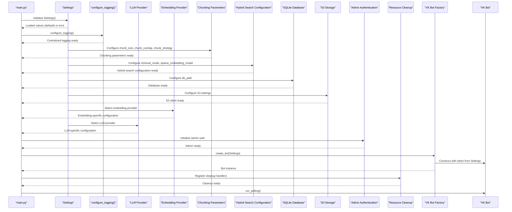
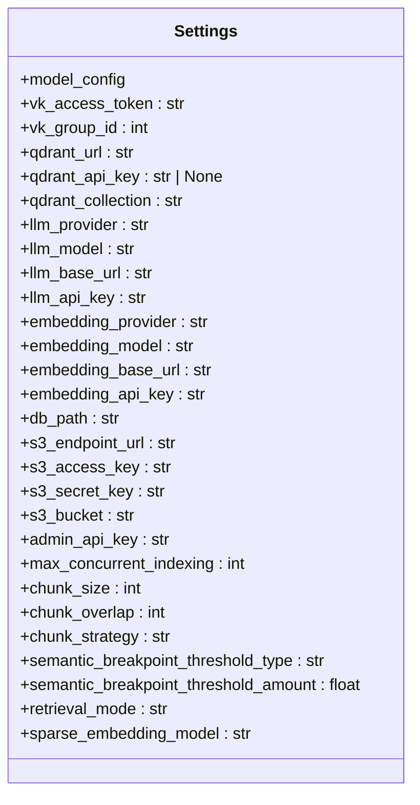
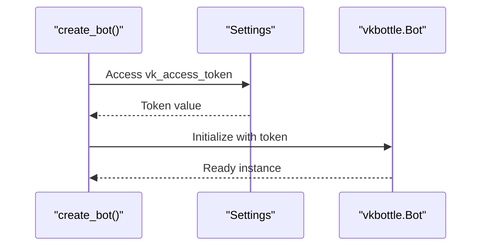
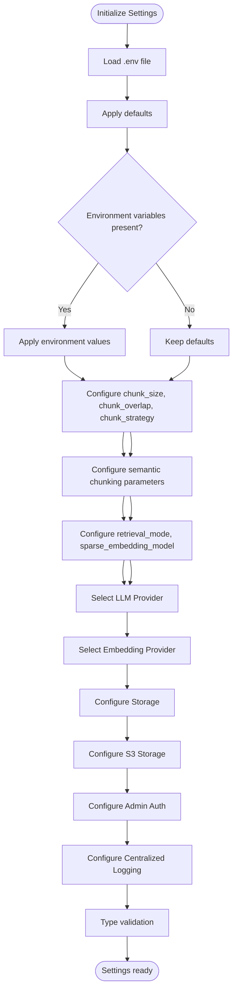
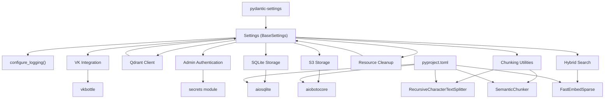
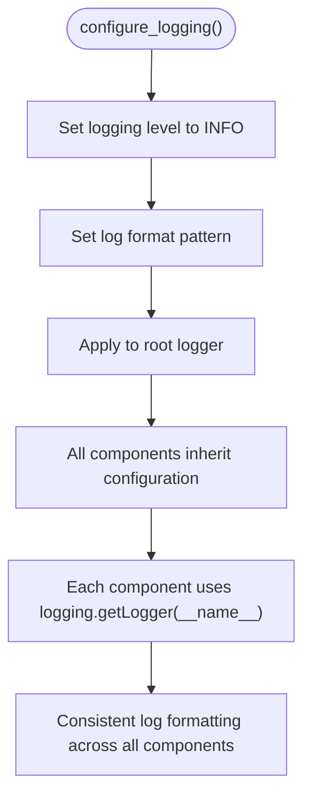
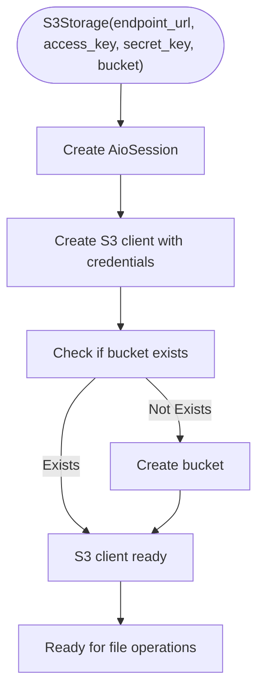
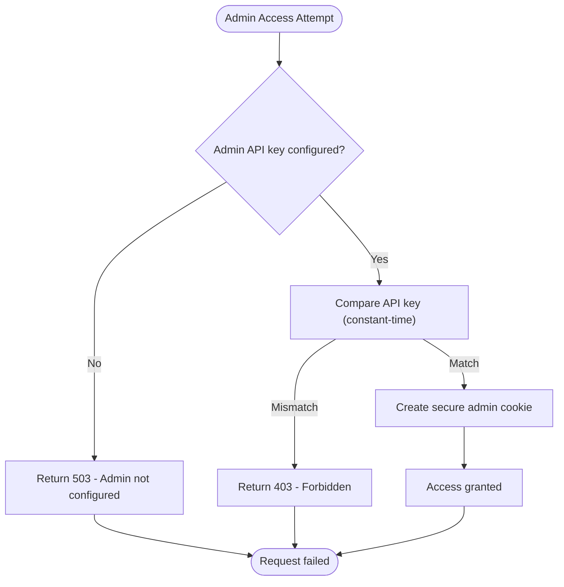
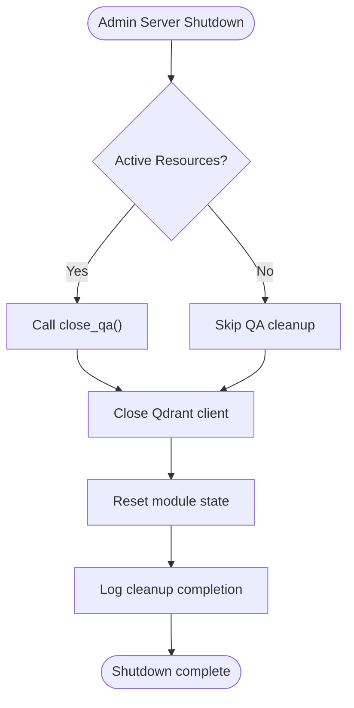

# Configuration Management

<cite>
**Referenced Files in This Document**
- [app/config.py](file://app/config.py)
- [app/storage/s3.py](file://app/storage/s3.py)
- [app/main.py](file://app/main.py)
- [app/api/deps.py](file://app/api/deps.py)
- [app/api/documents.py](file://app/api/documents.py)
- [app/rag/retriever.py](file://app/rag/retriever.py)
- [app/domain/qa_service.py](file://app/domain/qa_service.py)
- [app/rag/parser.py](file://app/rag/parser.py)
- [app/resources.py](file://app/resources.py)
- [scripts/admin_server.py](file://scripts/admin_server.py)
- [scripts/run_admin.sh](file://scripts/run_admin.sh)
- [scripts/ingest.py](file://scripts/ingest.py)
- [tests/test_config.py](file://tests/test_config.py)
- [tests/test_api_documents.py](file://tests/test_api_documents.py)
- [tests/test_hybrid_search.py](file://tests/test_hybrid_search.py)
- [tests/test_semantic_chunker.py](file://tests/test_semantic_chunker.py)
- [templates/login.html](file://templates/login.html)
- [pyproject.toml](file://pyproject.toml)
</cite>

## Update Summary
**Changes Made**
- Added new chunking strategy configuration with chunk_strategy (default 'recursive')
- Introduced semantic chunking with semantic_breakpoint_threshold_type and semantic_breakpoint_threshold_amount
- Added hybrid search functionality with retrieval_mode settings and sparse_embedding_model configuration
- Enhanced chunking system to support both recursive and semantic strategies
- Updated parser module to support semantic chunking with embedding-based breakpoint detection
- Added sparse embeddings support for hybrid search with FastEmbedSparse integration

## Table of Contents
1. [Introduction](#introduction)
2. [Project Structure](#project-structure)
3. [Core Components](#core-components)
4. [Architecture Overview](#architecture-overview)
5. [Detailed Component Analysis](#detailed-component-analysis)
6. [Dependency Analysis](#dependency-analysis)
7. [Performance Considerations](#performance-considerations)
8. [Security Best Practices](#security-best-practices)
9. [Development vs Production Configurations](#development-vs-production-configurations)
10. [Adding New Configuration Variables](#adding-new-configuration-variables)
11. [Logging Configuration](#logging-configuration)
12. [Chunking Configuration](#chunking-configuration)
13. [Hybrid Search Configuration](#hybrid-search-configuration)
14. [Storage Configuration](#storage-configuration)
15. [S3 Storage Configuration](#s3-storage-configuration)
16. [Admin Authentication Configuration](#admin-authentication-configuration)
17. [LLM Provider Configuration](#llm-provider-configuration)
18. [Embedding Provider Configuration](#embedding-provider-configuration)
19. [Resource Management and Cleanup](#resource-management-and-cleanup)
20. [Troubleshooting Guide](#troubleshooting-guide)
21. [Conclusion](#conclusion)

## Introduction
This document explains the configuration management system used in cafetera_hr_bot. It focuses on the Pydantic Settings implementation, environment variable loading and validation, configuration structure, centralized logging configuration, and security best practices. The system now supports separate LLM and embedding provider configurations, multiple LLM providers including llama.cpp with backward compatibility, alongside VK API credentials, Qdrant database connections, SQLite database integration for document storage, S3-compatible storage for document files, admin authentication with API key-based security, configurable document chunking parameters for optimal RAG performance, hybrid search functionality with sparse embeddings, and centralized logging configuration ensuring consistent log formatting across all application components. It documents all current configuration options and provides examples of development versus production configurations along with templates for different deployment environments.

## Project Structure
The configuration system centers around a single Pydantic Settings class that loads environment variables from a .env file. The system supports separate LLM and embedding provider configurations with multiple LLM providers (ollama, openai, llama.cpp) and embedding providers (ollama, openai) with automatic fallback mechanisms, VK API integration, Qdrant vector storage, SQLite database integration for document metadata, S3-compatible storage for document files, admin authentication with API key security, configurable document chunking parameters with support for both recursive and semantic strategies, hybrid search functionality with sparse embeddings, and centralized logging configuration with consistent formatting and level control. The storage components consume these settings to initialize database connections, manage document lifecycle, and handle file uploads/downloads. Tests validate the loading behavior across different providers, storage configurations, authentication systems, chunking parameters, hybrid search functionality, and logging configuration. Scripts demonstrate runtime usage with enhanced cleanup mechanisms and configurable chunking behavior, all using the centralized logging configuration.

```mermaid
graph TB
subgraph "Configuration Layer"
SettingsClass["Settings (Pydantic BaseSettings)"]
EnvFile[".env file"]
LoggingConfig["Centralized Logging Configuration"]
LLMProvider["LLM Provider Configuration"]
EmbeddingProvider["Embedding Provider Configuration"]
StorageConfig["Storage Configuration"]
S3Config["S3 Storage Configuration"]
AdminConfig["Admin Authentication"]
ChunkingConfig["Chunking Configuration"]
HybridSearchConfig["Hybrid Search Configuration"]
CleanupMechanism["Resource Cleanup Mechanism"]
end
subgraph "Application Layer"
VKBot["VK Bot Factory"]
RAGChain["RAG Chain Builder"]
IngestScript["Document Ingestion Script"]
ParserModule["Document Parser Module"]
StorageLayer["Storage Layer"]
AdminAuth["Admin Authentication"]
CleanupServer["Admin Server Cleanup"]
end
subgraph "Testing"
TestConfig["Test Suite"]
TestStorage["Storage Tests"]
TestAuth["Authentication Tests"]
TestEmbeddings["Embedding Tests"]
TestChunking["Chunking Tests"]
TestHybrid["Hybrid Search Tests"]
TestLogging["Logging Configuration Tests"]
end
EnvFile --> SettingsClass
SettingsClass --> LoggingConfig
SettingsClass --> LLMProvider
SettingsClass --> EmbeddingProvider
SettingsClass --> VKBot
SettingsClass --> RAGChain
SettingsClass --> StorageConfig
SettingsClass --> S3Config
SettingsClass --> AdminConfig
SettingsClass --> ChunkingConfig
SettingsClass --> HybridSearchConfig
SettingsClass --> CleanupMechanism
SettingsClass --> StorageLayer
SettingsClass --> AdminAuth
SettingsClass --> CleanupServer
SettingsClass --> ParserModule
TestConfig --> SettingsClass
TestStorage --> StorageLayer
TestAuth --> AdminAuth
TestEmbeddings --> EmbeddingProvider
TestChunking --> ChunkingConfig
TestHybrid --> HybridSearchConfig
TestLogging --> LoggingConfig
```



**Diagram sources**
- [app/config.py:4-62](file://app/config.py#L4-L62)
- [app/storage/database.py:31-37](file://app/storage/database.py#L31-L37)
- [app/storage/s3.py:14-109](file://app/storage/s3.py#L14-L109)
- [app/api/deps.py:54-66](file://app/api/deps.py#L54-L66)
- [app/rag/retriever.py:22-62](file://app/rag/retriever.py#L22-L62)
- [app/domain/qa_service.py:113-125](file://app/domain/qa_service.py#L113-L125)
- [app/rag/parser.py:16-17](file://app/rag/parser.py#L16-L17)
- [app/resources.py:96-131](file://app/resources.py#L96-L131)
- [scripts/admin_server.py:42-68](file://scripts/admin_server.py#L42-L68)
- [scripts/ingest.py:78-82](file://scripts/ingest.py#L78-L82)
- [tests/test_config.py:1-28](file://tests/test_config.py#L1-L28)
- [tests/test_api_documents.py:141-174](file://tests/test_api_documents.py#L141-L174)
- [tests/test_hybrid_search.py:1-169](file://tests/test_hybrid_search.py#L1-L169)
- [tests/test_semantic_chunker.py:1-237](file://tests/test_semantic_chunker.py#L1-L237)

**Section sources**
- [app/config.py:4-62](file://app/config.py#L4-L62)
- [app/main.py:30-47](file://app/main.py#L30-L47)
- [app/api/deps.py:54-66](file://app/api/deps.py#L54-L66)
- [tests/test_config.py:1-28](file://tests/test_config.py#L1-L28)
- [tests/test_api_documents.py:141-174](file://tests/test_api_documents.py#L141-L174)

## Core Components
- **Settings class**: Defines typed configuration fields, environment file binding, and default values for all system components including separate LLM and embedding provider settings, storage configuration, S3 storage settings, admin authentication settings, chunking configuration parameters with support for both recursive and semantic strategies, hybrid search configuration with sparse embeddings, and centralized logging configuration.
- **Centralized Logging Configuration**: Provides unified logging setup via configure_logging() function ensuring consistent log formatting and level control across all application components.
- **LLM Provider System**: Supports multiple providers (ollama, openai, llama.cpp) with automatic fallback and backward compatibility.
- **Embedding Provider System**: Supports separate embedding providers (ollama, openai) with independent configuration from LLM providers.
- **Chunking Configuration**: Provides explicit control over document processing behavior with default values of 500 for chunk_size and 50 for chunk_overlap, plus new semantic chunking parameters for embedding-based breakpoint detection.
- **Hybrid Search Configuration**: Enables dense vector search and hybrid search modes with sparse embeddings support for BM25-based retrieval.
- **VK integration**: Uses Settings to configure the VK bot token and handler registration.
- **RAG Components**: Build LLM chains and embeddings based on provider selection with separate embedding configuration and hybrid search support.
- **Storage System**: Manages SQLite database for document metadata with comprehensive CRUD operations.
- **S3 Storage System**: Provides S3-compatible file storage using MinIO/AWS S3 with async operations.
- **Admin Authentication**: Implements API key-based authentication with secure cookie management.
- **Resource Cleanup**: Enhanced cleanup mechanisms for admin server and QA service resources.
- **Tests**: Verify defaults, environment variable precedence, provider-specific behavior, storage functionality, authentication security, embedding configuration, chunking parameter validation, hybrid search functionality, and centralized logging configuration.
- **Scripts**: Demonstrate runtime initialization using Settings for different providers, storage operations, admin access, cleanup procedures, configurable chunking behavior, hybrid search configuration, and centralized logging configuration.

Key implementation details:
- Settings class inherits from Pydantic BaseSettings and binds to a .env file with UTF-8 encoding.
- Centralized logging configuration uses configure_logging() function with INFO level and standardized format.
- Current fields include VK access token, group ID, Qdrant configuration, separate LLM and embedding provider settings, comprehensive storage configuration, S3 storage settings, admin authentication settings, chunking configuration parameters with semantic chunking support, hybrid search configuration with sparse embeddings, and centralized logging configuration.
- The LLM system automatically selects providers based on LLM_PROVIDER environment variable with sensible defaults.
- The embedding system automatically selects providers based on EMBEDDING_PROVIDER environment variable with independent configuration.
- The chunking system provides configurable chunk_size (default: 500), chunk_overlap (default: 50), chunk_strategy (default: 'recursive'), semantic_breakpoint_threshold_type (default: 'percentile'), and semantic_breakpoint_threshold_amount (default: 95) parameters for document processing optimization.
- The hybrid search system supports dense vector-only search and hybrid dense+sparse BM25 search modes with configurable sparse embedding model.
- The storage system uses db_path to configure SQLite database location with automatic table initialization.
- The S3 storage system uses endpoint_url, access_key, secret_key, and bucket to configure S3-compatible storage.
- The admin authentication system uses admin_api_key for secure access to administrative functions.
- The VK bot factory reads the token from Settings to construct the bot instance.
- The admin server includes enhanced cleanup mechanisms using atexit for proper resource management.
- The document parser module uses both hardcoded defaults and configurable settings for chunking behavior, supporting both recursive and semantic strategies.
- All scripts and modules use centralized logging configuration for consistent log formatting.

**Section sources**
- [app/config.py:4-62](file://app/config.py#L4-L62)
- [app/storage/database.py:31-37](file://app/storage/database.py#L31-L37)
- [app/storage/s3.py:14-109](file://app/storage/s3.py#L14-L109)
- [app/api/deps.py:54-66](file://app/api/deps.py#L54-L66)
- [app/rag/retriever.py:22-62](file://app/rag/retriever.py#L22-L62)
- [app/domain/qa_service.py:113-125](file://app/domain/qa_service.py#L113-L125)
- [app/rag/parser.py:16-17](file://app/rag/parser.py#L16-L17)
- [app/resources.py:96-131](file://app/resources.py#L96-L131)
- [scripts/admin_server.py:42-68](file://scripts/admin_server.py#L42-L68)
- [tests/test_config.py:1-28](file://tests/test_config.py#L1-L28)
- [tests/test_api_documents.py:141-174](file://tests/test_api_documents.py#L141-L174)

## Architecture Overview
The configuration architecture follows a layered approach with provider-aware components, integrated storage, configurable chunking parameters with semantic support, hybrid search functionality, centralized logging configuration, and secure admin access with enhanced cleanup mechanisms:
- **Configuration layer**: Settings class encapsulates environment-driven configuration with separate provider selections, storage settings, S3 configuration, admin authentication, chunking parameters with semantic strategies, hybrid search configuration, and centralized logging configuration.
- **Application layer**: Integrations consume Settings to initialize services with appropriate provider backends, database connections, S3 storage, configurable chunking behavior with semantic support, hybrid search modes, centralized logging configuration, and authentication mechanisms.
- **Runtime layer**: Scripts and handlers access Settings at startup or during operation with automatic provider detection, storage initialization, authentication verification, configurable chunking parameters with semantic strategies, hybrid search configuration, centralized logging configuration, and proper resource cleanup.



**Diagram sources**
- [app/main.py:23-82](file://app/main.py#L23-L82)
- [app/config.py:15-62](file://app/config.py#L15-L62)
- [app/storage/database.py:31-37](file://app/storage/database.py#L31-L37)
- [app/storage/s3.py:38-48](file://app/storage/s3.py#L38-L48)
- [app/api/deps.py:54-66](file://app/api/deps.py#L54-L66)
- [app/integrations/vk/bot.py:23-31](file://app/integrations/vk/bot.py#L23-L31)
- [app/domain/qa_service.py:113-125](file://app/domain/qa_service.py#L113-L125)
- [app/resources.py:96-131](file://app/resources.py#L96-L131)
- [scripts/admin_server.py:64-68](file://scripts/admin_server.py#L64-L68)

## Detailed Component Analysis

### Settings Class
The Settings class defines the comprehensive configuration contract with separate provider configurations, centralized logging configuration, chunking parameters with semantic support, and hybrid search configuration:
- **Environment file binding**: Loads variables from .env with UTF-8 encoding.
- **Fields**: vk_access_token (str), vk_group_id (int), Qdrant configuration, LLM settings, separate embedding configuration, storage configuration, S3 storage configuration, admin authentication settings, chunking configuration parameters with semantic chunking support, hybrid search configuration with sparse embeddings, and centralized logging configuration.
- **Type safety**: Pydantic ensures type conversion and validation.
- **Provider awareness**: LLM_PROVIDER and EMBEDDING_PROVIDER fields control which backend to use independently.
- **Chunking awareness**: chunk_size (int), chunk_overlap (int), chunk_strategy (str), semantic_breakpoint_threshold_type (str), and semantic_breakpoint_threshold_amount (float) control document processing behavior with sensible defaults.
- **Hybrid search awareness**: retrieval_mode (str) and sparse_embedding_model (str) control dense vs hybrid search modes with sparse embeddings.
- **Storage awareness**: db_path field controls SQLite database location.
- **S3 awareness**: s3_endpoint_url, s3_access_key, s3_secret_key, and s3_bucket control S3-compatible storage configuration.
- **Admin awareness**: admin_api_key controls access to administrative functions.
- **Logging awareness**: Centralized logging configuration via configure_logging() function.



**Diagram sources**
- [app/config.py:4-62](file://app/config.py#L4-L62)

**Section sources**
- [app/config.py:4-62](file://app/config.py#L4-L62)

### Centralized Logging Configuration
The centralized logging configuration provides unified logging setup across all application components with consistent formatting and level control:

- **Logging Function**: configure_logging() sets up project-wide logging configuration.
- **Log Level**: INFO level logging for all components.
- **Log Format**: Standardized format showing timestamp, level, logger name, and message.
- **Consistent Application**: All scripts and modules use centralized logging configuration.
- **Component Integration**: VK bot, admin server, ingestion scripts, and domain services all inherit the centralized logging setup.

**Updated** Added centralized logging configuration via configure_logging() function, replacing ad-hoc logging setups across individual scripts and ensuring consistent log formatting and level configuration throughout the application.

**Section sources**
- [app/config.py:6-11](file://app/config.py#L6-L11)
- [scripts/admin_server.py:33](file://scripts/admin_server.py#L33)
- [scripts/ingest.py:38](file://scripts/ingest.py#L38)
- [scripts/polling_vk.py:22](file://scripts/polling_vk.py#L22)

### Chunking Configuration
The chunking configuration provides explicit control over document processing behavior with sensible defaults optimized for local LLM performance and enhanced semantic processing capabilities:

- **Default Values**: chunk_size defaults to 500 characters, chunk_overlap defaults to 50 characters, chunk_strategy defaults to 'recursive'.
- **Semantic Chunking Support**: New semantic_breakpoint_threshold_type (default: 'percentile') and semantic_breakpoint_threshold_amount (default: 95) enable embedding-based breakpoint detection.
- **Purpose**: Controls document splitting behavior for optimal embedding performance and memory usage, with support for both token-based and semantic chunking strategies.
- **Performance Impact**: Smaller chunks improve local model performance but increase processing overhead.
- **Memory Considerations**: Larger chunks reduce memory usage but may exceed local model limits.
- **Quality Trade-offs**: Higher overlap preserves context but increases processing time.
- **Semantic Strategy**: Uses embedding similarity to detect natural breakpoints in text for more meaningful chunk boundaries.

**Updated** Added new chunking strategy configuration with chunk_strategy (default 'recursive'), semantic_breakpoint_threshold_type and semantic_breakpoint_threshold_amount for semantic chunking, and enhanced chunking parameters for embedding-based breakpoint detection.

**Section sources**
- [app/config.py:50-62](file://app/config.py#L50-L62)
- [app/rag/parser.py:58-175](file://app/rag/parser.py#L58-L175)

### Hybrid Search Configuration
The hybrid search configuration enables advanced retrieval modes with sparse embeddings support:

- **Default Values**: retrieval_mode defaults to 'dense', sparse_embedding_model defaults to 'Qdrant/bm25'.
- **Dense Mode**: Vector-only search using embeddings for similarity matching.
- **Hybrid Mode**: Combines dense vector search with sparse BM25-based lexical matching for improved recall and precision.
- **Sparse Embeddings**: Uses FastEmbedSparse model for BM25-like sparse representations.
- **Performance Benefits**: Hybrid search can improve recall for keyword-rich queries while maintaining semantic similarity for content-based queries.
- **Dependency Management**: Requires 'hybrid' extra installation for FastEmbedSparse support.

**Updated** Added hybrid search functionality with retrieval_mode settings and sparse_embedding_model configuration for dense vs hybrid search modes with sparse embeddings support.

**Section sources**
- [app/config.py:59-62](file://app/config.py#L59-L62)
- [app/rag/retriever.py:88-103](file://app/rag/retriever.py#L88-L103)
- [app/resources.py:120-131](file://app/resources.py#L120-L131)
- [tests/test_hybrid_search.py:17-41](file://tests/test_hybrid_search.py#L17-L41)

### VK Bot Factory and Settings Usage
The VK bot factory constructs a vkbottle Bot using the VK access token from Settings. This demonstrates how configuration flows into application components.



**Diagram sources**
- [app/integrations/vk/bot.py:23-31](file://app/integrations/vk/bot.py#L23-L31)
- [app/config.py:17-18](file://app/config.py#L17-L18)

**Section sources**
- [app/integrations/vk/bot.py:23-31](file://app/integrations/vk/bot.py#L23-L31)
- [app/config.py:17-18](file://app/config.py#L17-L18)

### Configuration Loading and Validation
The test suite validates:
- Default values when no environment variables are set.
- Environment variable precedence over defaults.
- Numeric parsing for integer fields.
- Provider-specific configuration behavior.
- Storage configuration defaults and validation.
- S3 storage configuration defaults and validation.
- Admin authentication configuration behavior.
- Separate embedding provider configuration defaults and validation.
- **Chunking configuration defaults and validation** for new chunk_size, chunk_overlap, chunk_strategy, semantic_breakpoint_threshold_type, and semantic_breakpoint_threshold_amount parameters.
- **Hybrid search configuration defaults and validation** for retrieval_mode and sparse_embedding_model parameters.
- **Centralized logging configuration** for consistent log formatting across all components.



**Diagram sources**
- [tests/test_config.py:6-27](file://tests/test_config.py#L6-L27)
- [app/config.py:4-62](file://app/config.py#L4-L62)
- [tests/test_api_documents.py:141-174](file://tests/test_api_documents.py#L141-L174)
- [tests/test_hybrid_search.py:164-169](file://tests/test_hybrid_search.py#L164-L169)
- [tests/test_semantic_chunker.py:223-237](file://tests/test_semantic_chunker.py#L223-L237)

**Section sources**
- [tests/test_config.py:6-27](file://tests/test_config.py#L6-L27)
- [app/config.py:4-62](file://app/config.py#L4-L62)
- [tests/test_api_documents.py:141-174](file://tests/test_api_documents.py#L141-L174)
- [tests/test_hybrid_search.py:164-169](file://tests/test_hybrid_search.py#L164-L169)
- [tests/test_semantic_chunker.py:223-237](file://tests/test_semantic_chunker.py#L223-L237)

## Dependency Analysis
The configuration system has minimal external dependencies with provider-specific extras, storage modules, authentication components, chunking utilities with semantic support, hybrid search dependencies, and centralized logging configuration:
- **Pydantic Settings**: Provides environment file loading and type validation.
- **Centralized Logging**: Universal logging configuration via configure_logging() function.
- **VK integration**: Depends on Settings for bot initialization.
- **LLM Providers**: Optional dependencies for different provider backends.
- **Embedding Providers**: Independent optional dependencies for embedding generation.
- **Qdrant**: Vector store integration with configurable connection settings.
- **SQLite Storage**: Document metadata persistence with automatic table initialization.
- **S3 Storage**: S3-compatible file storage with async operations using aiobotocore.
- **Admin Authentication**: Secure API key-based authentication with cookie management.
- **Resource Cleanup**: Enhanced cleanup mechanisms for proper resource management.
- **Chunking Utilities**: RecursiveCharacterTextSplitter and SemanticChunker for document processing with configurable parameters.
- **Hybrid Search Dependencies**: FastEmbedSparse for BM25-based sparse embeddings.
- **Storage Dependencies**: aiosqlite for asynchronous database operations, aiobotocore for S3 operations.
- **Authentication Dependencies**: secrets module for secure comparison, cryptography for cookie security.



**Diagram sources**
- [pyproject.toml:10-11](file://pyproject.toml#L10-L11)
- [pyproject.toml:23](file://pyproject.toml#L23)
- [pyproject.toml:24](file://pyproject.toml#L24)
- [app/config.py:1](file://app/config.py#L1)
- [app/integrations/vk/bot.py:7](file://app/integrations/vk/bot.py#L7)
- [app/storage/s3.py:9](file://app/storage/s3.py#L9)
- [app/api/deps.py:5](file://app/api/deps.py#L5)
- [app/domain/qa_service.py:113-125](file://app/domain/qa_service.py#L113-L125)
- [app/rag/parser.py:14](file://app/rag/parser.py#L14)
- [app/resources.py:96-131](file://app/resources.py#L96-L131)

**Section sources**
- [pyproject.toml:10-11](file://pyproject.toml#L10-L11)
- [pyproject.toml:23](file://pyproject.toml#L23)
- [pyproject.toml:24](file://pyproject.toml#L24)
- [app/config.py:1](file://app/config.py#L1)
- [app/integrations/vk/bot.py:7](file://app/integrations/vk/bot.py#L7)
- [app/storage/s3.py:9](file://app/storage/s3.py#L9)
- [app/api/deps.py:5](file://app/api/deps.py#L5)
- [app/domain/qa_service.py:113-125](file://app/domain/qa_service.py#L113-L125)
- [app/rag/parser.py:14](file://app/rag/parser.py#L14)
- [app/resources.py:96-131](file://app/resources.py#L96-L131)

## Performance Considerations
- Environment file loading occurs at import-time when Settings is instantiated. This is lightweight and suitable for application startup.
- Type conversion and validation are handled by Pydantic, adding negligible overhead during normal operation.
- Provider selection happens at runtime when building LLM and embedding instances, with minimal performance impact.
- Separate provider configurations allow for independent optimization of LLM and embedding performance.
- **Chunking optimization**: Configurable chunk_size, chunk_overlap, chunk_strategy, semantic_breakpoint_threshold_type, and semantic_breakpoint_threshold_amount parameters allow fine-tuning for different document types and model capabilities.
- **Local model performance**: Default chunk_size of 500 characters balances processing speed and context preservation for local LLMs.
- **Memory management**: Proper chunk_overlap configuration prevents context loss while managing memory usage effectively.
- **Semantic chunking performance**: Embedding-based breakpoint detection adds computational overhead but improves chunk quality.
- **Hybrid search performance**: Sparse embeddings add minimal overhead while improving search effectiveness.
- **Centralized logging performance**: Single logging configuration reduces overhead compared to multiple ad-hoc logging setups.
- SQLite database operations use asynchronous connections to minimize blocking.
- S3 storage operations use async client sessions with connection pooling for efficient file operations.
- Admin authentication uses constant-time comparison to prevent timing attacks.
- Resource cleanup mechanisms ensure proper shutdown of connections and clients.
- Keep the number of environment variables minimal to reduce startup parsing overhead.
- LLM provider switching is handled efficiently with conditional imports and fallback mechanisms.
- Storage operations are optimized with proper indexing on document_id and timestamps.
- S3 operations benefit from connection reuse and proper error handling for network failures.
- Concurrent indexing operations are controlled by max_concurrent_indexing setting.
- Chunking parameters significantly impact processing time and memory usage in document ingestion pipelines.
- **Logging consistency**: Centralized logging configuration ensures uniform logging behavior across all development and production environments.
- **Hybrid search efficiency**: Dense vectors provide fast similarity search, while sparse embeddings offer complementary lexical matching capabilities.

## Security Best Practices
- Never hardcode secrets. Use environment variables and the .env file.
- Exclude .env from version control and provide a .env.example template with placeholders.
- Restrict file permissions on .env to minimize exposure.
- Use strong tokens and rotate them periodically.
- Avoid printing sensitive values in logs.
- For LLM providers, consider API key rotation and secure storage for production deployments.
- For embedding providers, ensure separate API key management for different services.
- Validate provider URLs and ensure they use HTTPS in production environments.
- Secure database file permissions and consider encryption for sensitive document metadata.
- Regularly backup database files and implement proper access controls.
- **S3 Storage Security**: Use HTTPS endpoints, rotate access keys, limit bucket permissions, and implement proper IAM policies.
- **Admin Authentication Security**: Use strong API keys, implement rate limiting, monitor login attempts, and use HTTPS for all admin endpoints.
- **Cookie Security**: Use httponly cookies, secure flags, and proper SameSite settings for admin sessions.
- **Environment Variable Security**: Store sensitive configuration in secure vaults, not in plain text files.
- **Resource Cleanup Security**: Ensure proper cleanup mechanisms prevent resource leaks and unauthorized access.
- **Provider Isolation**: Separate LLM and embedding providers to minimize security impact if one provider is compromised.
- **Chunking Security**: Ensure chunk_size, chunk_overlap, and semantic chunking parameters don't expose sensitive data through improper context boundaries.
- **Hybrid Search Security**: Validate sparse embedding model configuration and ensure proper dependency management.
- **Logging Security**: Centralized logging configuration ensures consistent log formatting and level control across all components.

## Development vs Production Configurations
- **Development**: Use local LLM providers (ollama, llama.cpp) with localhost URLs and local SQLite database. Use local S3-compatible storage with MinIO for development. The VK polling script initializes Settings and runs the bot locally. Separate embedding provider can use Ollama for development. Chunking parameters can be tuned for faster local processing. Hybrid search can be disabled for development simplicity. Centralized logging configuration provides consistent log formatting across all development scripts.
- **Production**: Use cloud LLM providers with proper authentication and managed database services. Use production S3-compatible storage with proper IAM policies and HTTPS endpoints. Use strong admin API keys with rotation policies. Separate embedding provider can use OpenAI for production quality embeddings. Chunking parameters should be optimized for production workload characteristics. Hybrid search can be enabled with appropriate sparse embedding models. Centralized logging configuration ensures consistent log formatting across all production components.

Operational differences:
- VK polling script demonstrates Settings usage at runtime with centralized logging configuration.
- Production requires webhook configuration and transport setup with centralized logging.
- LLM provider selection affects dependency requirements and resource allocation.
- Separate embedding provider configuration allows for independent optimization.
- Storage configuration requires proper database permissions and backup strategies.
- S3 storage configuration requires proper IAM policies and network security groups.
- Admin authentication requires HTTPS enforcement and rate limiting.
- Production databases should use managed services with proper monitoring and scaling.
- S3 storage should use managed services with proper backup and disaster recovery.
- Resource cleanup mechanisms ensure proper shutdown in production environments.
- **Chunking optimization**: Production environments may require different chunk_size, chunk_overlap, chunk_strategy, and semantic chunking parameters based on document types and performance requirements.
- **Hybrid search optimization**: Production environments should enable hybrid search with appropriate sparse embedding models for improved search effectiveness.
- **Logging consistency**: Centralized logging configuration ensures uniform logging behavior across all development and production environments.

**Section sources**
- [app/main.py:23-82](file://app/main.py#L23-L82)
- [app/config.py:26-62](file://app/config.py#L26-L62)
- [app/api/deps.py:54-66](file://app/api/deps.py#L54-L66)

## Adding New Configuration Variables
To add new configuration variables:
1. Define the field in the Settings class with a type annotation and default value.
2. Reference the field in the consuming component(s).
3. Add environment variables for the new fields in .env during development.
4. Update tests to validate defaults and environment precedence.
5. Document the new field in the configuration schema.
6. Consider provider-specific behavior if applicable.
7. For storage-related configurations, ensure proper initialization and cleanup procedures.
8. For security-sensitive configurations, implement proper validation and error handling.
9. For cleanup-related configurations, ensure proper resource management and error handling.
10. **For chunking-related configurations**, consider performance implications and provide sensible defaults.
11. **For hybrid search configurations**, ensure proper dependency management and error handling for sparse embeddings.
12. **For logging-related configurations**, consider centralized logging integration and ensure consistent formatting.

Example steps:
- Add a new field to the Settings class.
- Update the VK bot factory or other consumers to use the new field.
- Add corresponding environment variables to .env for local testing.
- Extend tests to cover the new field's behavior.
- Implement proper validation and error handling for the new configuration.
- For S3 storage, ensure proper bucket management and access control.
- For admin authentication, implement proper cookie security and rate limiting.
- For resource cleanup, implement proper error handling and logging.
- **For chunking parameters**, ensure they integrate with document processing pipelines and consider performance trade-offs.
- **For hybrid search parameters**, ensure proper dependency management and error handling for sparse embeddings.
- **For logging configuration**, ensure centralized logging integration and consistent formatting across all components.

**Section sources**
- [app/config.py:4-62](file://app/config.py#L4-L62)
- [tests/test_config.py:6-27](file://tests/test_config.py#L6-L27)

## Logging Configuration

### Centralized Logging Setup
The centralized logging configuration provides unified logging setup across all application components:

- **Logging Function**: configure_logging() establishes project-wide logging configuration.
- **Log Level**: INFO level logging for all components.
- **Log Format**: Standardized format showing timestamp, level, logger name, and message.
- **Consistent Application**: All scripts and modules use centralized logging configuration.
- **Component Integration**: VK bot, admin server, ingestion scripts, and domain services all inherit the centralized logging setup.

### Logging Configuration Options
Logging configuration options:

- **LOG_LEVEL**: Environment variable to control logging level (default: INFO)
- **LOG_FORMAT**: Standardized format string for log messages
- **Logger Names**: Each component uses logging.getLogger(__name__) for consistent naming
- **Centralized Control**: Single function to configure logging across all components

### Environment Variable Configuration

```bash
# Logging configuration
LOG_LEVEL=INFO
```

### Logging Configuration Process



**Diagram sources**
- [app/config.py:6-11](file://app/config.py#L6-L11)

### Component Logging Integration
All major components use centralized logging configuration:

- **Main Application**: app/main.py uses logger = logging.getLogger(__name__)
- **Admin Server**: scripts/admin_server.py uses logger = logging.getLogger(__name__)
- **Ingestion Scripts**: scripts/ingest.py uses logger = logging.getLogger(__name__)
- **VK Bot**: app/integrations/vk/bot.py uses logger = logging.getLogger(__name__)
- **Document Service**: app/domain/document_service.py uses logger = logging.getLogger(__name__)
- **QA Service**: app/domain/qa_service.py uses logger = logging.getLogger(__name__)
- **API Documents**: app/api/documents.py uses logger = logging.getLogger(__name__)

**Section sources**
- [app/config.py:6-11](file://app/config.py#L6-L11)
- [app/main.py:30-31](file://app/main.py#L30-L31)
- [scripts/admin_server.py:33](file://scripts/admin_server.py#L33)
- [scripts/ingest.py:38](file://scripts/ingest.py#L38)
- [scripts/polling_vk.py:22](file://scripts/polling_vk.py#L22)
- [app/integrations/vk/bot.py:22](file://app/integrations/vk/bot.py#L22)
- [app/domain/document_service.py:32](file://app/domain/document_service.py#L32)
- [app/domain/qa_service.py:22](file://app/domain/qa_service.py#L22)
- [app/api/documents.py:64](file://app/api/documents.py#L64)

## Chunking Configuration

### Chunking Parameters Overview
The chunking configuration provides explicit control over document processing behavior with two key strategies:

- **chunk_size**: Maximum characters per document chunk (default: 500)
- **chunk_overlap**: Characters shared between consecutive chunks (default: 50)
- **chunk_strategy**: Chunking strategy - "recursive" (token-based) or "semantic" (embedding similarity) (default: "recursive")
- **semantic_breakpoint_threshold_type**: Threshold type for semantic chunking ("percentile", "standard_deviation", "interquartile", "gradient") (default: "percentile")
- **semantic_breakpoint_threshold_amount**: Threshold amount for semantic chunking (default: 95)

### Default Values and Rationale
- **chunk_size**: 500 characters - Optimized for local LLM performance while maintaining reasonable context
- **chunk_overlap**: 50 characters - Preserves context between chunks without excessive duplication
- **chunk_strategy**: "recursive" - Backward compatible default using token-based splitting
- **semantic_breakpoint_threshold_type**: "percentile" - Statistical threshold type for breakpoint detection
- **semantic_breakpoint_threshold_amount**: 95 - High threshold for detecting meaningful text boundaries
- **Performance balance**: These defaults provide a good balance between processing speed and contextual integrity for local models

### Configuration Options
Chunking configuration options:

- **CHUNK_SIZE**: Integer value controlling maximum chunk length (default: 500)
- **CHUNK_OVERLAP**: Integer value controlling context overlap between chunks (default: 50)
- **CHUNK_STRATEGY**: String value controlling chunking approach ("recursive" or "semantic")
- **SEMANTIC_BREAKPOINT_THRESHOLD_TYPE**: String value controlling semantic chunking threshold type
- **SEMANTIC_BREAKPOINT_THRESHOLD_AMOUNT**: Float value controlling semantic chunking threshold amount
- **Environment variable mapping**: CHUNK_SIZE, CHUNK_OVERLAP, CHUNK_STRATEGY, SEMANTIC_BREAKPOINT_THRESHOLD_TYPE, and SEMANTIC_BREAKPOINT_THRESHOLD_AMOUNT environment variables map to respective settings

### Environment Variable Configuration

```bash
# Chunking configuration
CHUNK_SIZE=500
CHUNK_OVERLAP=50
CHUNK_STRATEGY=recursive

# Semantic chunking configuration
SEMANTIC_BREAKPOINT_THRESHOLD_TYPE=percentile
SEMANTIC_BREAKPOINT_THRESHOLD_AMOUNT=95

# Alternative configuration for larger documents
CHUNK_SIZE=1000
CHUNK_OVERLAP=100
CHUNK_STRATEGY=semantic

# Alternative configuration for memory-constrained environments
CHUNK_SIZE=250
CHUNK_OVERLAP=25
CHUNK_STRATEGY=recursive
```

### Chunking Strategy Effects
- **Recursive Strategy**: Uses token-based splitting with separators for logical text boundaries
- **Semantic Strategy**: Uses embedding similarity to detect natural text breakpoints for more meaningful chunking
- **Larger chunk_size**: Improves context preservation but increases memory usage and processing time
- **Smaller chunk_size**: Reduces memory usage but may lose important context between chunks
- **Higher chunk_overlap**: Preserves more context but increases processing overhead
- **Lower chunk_overlap**: Reduces processing overhead but may lose important context
- **Semantic threshold types**: Different statistical methods for determining breakpoint sensitivity
- **Semantic threshold amounts**: Control sensitivity of breakpoint detection (higher = more breaks)

### Integration Points
Chunking parameters are used throughout the document processing pipeline:

- **Document ingestion scripts**: Use settings.chunk_size, settings.chunk_overlap, settings.chunk_strategy, settings.semantic_breakpoint_threshold_type, and settings.semantic_breakpoint_threshold_amount for batch processing
- **Admin upload interface**: Pass chunking parameters to background processing tasks
- **Document parser module**: Utilize chunking parameters for individual document processing with support for both recursive and semantic strategies
- **Background indexing tasks**: Apply chunking parameters during document indexing operations
- **API endpoints**: Use chunking parameters for document processing in REST API operations

**Section sources**
- [app/config.py:50-62](file://app/config.py#L50-L62)
- [app/rag/parser.py:58-175](file://app/rag/parser.py#L58-L175)
- [app/api/documents.py:566-570](file://app/api/documents.py#L566-L570)
- [app/api/documents.py:756-760](file://app/api/documents.py#L756-L760)
- [app/api/documents.py:992-996](file://app/api/documents.py#L992-L996)
- [scripts/ingest.py:80-88](file://scripts/ingest.py#L80-L88)

## Hybrid Search Configuration

### Hybrid Search Parameters Overview
The hybrid search configuration enables advanced retrieval modes with sparse embeddings support:

- **retrieval_mode**: Search mode - "dense" (vector-only) or "hybrid" (dense + sparse BM25) (default: "dense")
- **sparse_embedding_model**: Model name for sparse embeddings (default: "Qdrant/bm25")

### Default Values and Rationale
- **retrieval_mode**: "dense" - Default to vector-only search for simplicity and performance
- **sparse_embedding_model**: "Qdrant/bm25" - High-quality BM25 model for lexical matching
- **Performance balance**: Dense search provides fast similarity matching, while hybrid adds complementary lexical matching

### Configuration Options
Hybrid search configuration options:

- **RETRIEVAL_MODE**: String value controlling search mode ("dense" or "hybrid")
- **SPARSE_EMBEDDING_MODEL**: String value controlling sparse embedding model name
- **Environment variable mapping**: RETRIEVAL_MODE and SPARSE_EMBEDDING_MODEL environment variables map to respective settings

### Environment Variable Configuration

```bash
# Dense search configuration (default)
RETRIEVAL_MODE=dense

# Hybrid search configuration
RETRIEVAL_MODE=hybrid
SPARSE_EMBEDDING_MODEL=Qdrant/bm25

# Alternative sparse model
SPARSE_EMBEDDING_MODEL=avsolatorio/GIST-Embedding-v0
```

### Hybrid Search Modes
- **Dense Mode**: Vector-only similarity search using embeddings for semantic matching
- **Hybrid Mode**: Combines dense vector search with sparse BM25-based lexical matching for improved recall and precision
- **Sparse Embeddings**: Uses FastEmbedSparse for BM25-like sparse representations
- **Performance Benefits**: Hybrid search can improve recall for keyword-rich queries while maintaining semantic similarity for content-based queries

### Integration Points
Hybrid search parameters are used throughout the RAG pipeline:

- **Retriever construction**: Use settings.retrieval_mode and settings.sparse_embedding_model to configure search behavior
- **Sparse embeddings**: Build sparse embeddings only when retrieval_mode is "hybrid"
- **Vector store configuration**: Pass sparse embeddings to QdrantVectorStore for hybrid search
- **Indexing operations**: Include sparse embeddings during document indexing for hybrid search capability
- **QA service**: Store sparse embeddings for hybrid search in question answering workflows

**Section sources**
- [app/config.py:59-62](file://app/config.py#L59-L62)
- [app/rag/retriever.py:88-103](file://app/rag/retriever.py#L88-L103)
- [app/resources.py:120-131](file://app/resources.py#L120-L131)
- [tests/test_hybrid_search.py:17-41](file://tests/test_hybrid_search.py#L17-L41)

## Storage Configuration

### Database Configuration
The storage system uses SQLite for document metadata persistence with comprehensive CRUD operations:

- **Default Location**: "data/cafetera.db" (automatically creates parent directories)
- **Automatic Initialization**: Creates database file and tables if they don't exist
- **Asynchronous Operations**: Uses aiosqlite for non-blocking database operations
- **Table Structure**: Documents table with comprehensive metadata tracking

### Storage Schema
The database schema includes comprehensive document tracking:

- **document_id**: Primary key for unique document identification
- **filename**: Original file name
- **title**: Document title derived from filename
- **s3_key**: Storage key for document retrieval
- **mime_type**: File type identifier
- **size_bytes**: File size in bytes
- **status**: Processing state (pending, processing, completed, failed)
- **is_search_enabled**: Boolean flag for search inclusion
- **error**: Error message for failed operations
- **created_at**: Timestamp of document creation
- **updated_at**: timestamp of last modification
- **indexed_at**: timestamp of successful indexing
- **chunk_count**: Number of text chunks processed

### Storage Operations
The DocumentRepository provides comprehensive CRUD operations:

- **Create**: Insert new document records with automatic timestamp generation
- **Read**: Retrieve individual documents or list all documents ordered by creation date
- **Update**: Partial updates with selective field modification and timestamp updates
- **Delete**: Remove document records with cascade effects
- **Toggle Search**: Enable/disable document search functionality without changing status

### Configuration Options
Storage configuration options:

- **DB_PATH**: SQLite database file path (default: "data/cafetera.db")
- **Directory Creation**: Automatically creates parent directories if they don't exist
- **Connection Management**: Asynchronous connections with proper resource cleanup

### Environment Variable Configuration

```bash
# Storage configuration
DB_PATH=data/cafetera.db
```

### Storage Initialization Process


**Diagram sources**
- [app/storage/database.py:31-37](file://app/storage/database.py#L31-L37)

**Section sources**
- [app/config.py:37-38](file://app/config.py#L37-L38)
- [app/storage/database.py:12-28](file://app/storage/database.py#L12-L28)
- [app/storage/database.py:31-37](file://app/storage/database.py#L31-L37)
- [app/storage/document_repo.py:61-202](file://app/storage/document_repo.py#L61-L202)
- [app/storage/models.py:20-36](file://app/storage/models.py#L20-L36)

## S3 Storage Configuration

### S3 Storage System
The S3 storage system provides S3-compatible file storage using MinIO/AWS S3 with comprehensive async operations:

- **Default Endpoint**: "http://localhost:9000" (local MinIO development)
- **Default Credentials**: "minioadmin" for both access key and secret key
- **Default Bucket**: "rag-documents" (automatically created if missing)
- **Async Operations**: Uses aiobotocore for non-blocking S3 operations
- **Bucket Management**: Automatically creates buckets if they don't exist
- **File Operations**: Supports upload, download, delete, and existence checks

### S3 Configuration Options
S3 storage configuration options:

- **S3_ENDPOINT_URL**: S3-compatible endpoint URL (default: "http://localhost:9000")
- **S3_ACCESS_KEY**: Access key for S3 authentication (default: "minioadmin")
- **S3_SECRET_KEY**: Secret key for S3 authentication (default: "minioadmin")
- **S3_BUCKET**: Target bucket name (default: "rag-documents")

### S3 Operations
The S3Storage class provides comprehensive file operations:

- **Upload**: Upload bytes to S3 with configurable content type
- **Download**: Download file content as bytes with async streaming
- **Delete**: Delete files by key with error handling
- **Exists**: Check file existence with proper exception handling
- **Bucket Management**: Ensure bucket exists with automatic creation

### Environment Variable Configuration

```bash
# S3 storage configuration
S3_ENDPOINT_URL=http://localhost:9000
S3_ACCESS_KEY=minioadmin
S3_SECRET_KEY=minioadmin
S3_BUCKET=rag-documents
```

### S3 Initialization Process



**Diagram sources**
- [app/storage/s3.py:38-48](file://app/storage/s3.py#L38-L48)
- [app/storage/s3.py:71-77](file://app/storage/s3.py#L71-L77)

**Section sources**
- [app/config.py:39-42](file://app/config.py#L39-L42)
- [app/storage/s3.py:14-109](file://app/storage/s3.py#L14-L109)
- [app/main.py:30-47](file://app/main.py#L30-L47)

## Admin Authentication Configuration

### Admin Authentication System
The admin authentication system provides secure access to administrative functions using API key-based authentication:

- **Default State**: No admin API key (admin functionality disabled)
- **API Key Validation**: Uses constant-time comparison to prevent timing attacks
- **Cookie Management**: Secure, httponly cookies with strict SameSite policy
- **Session Duration**: 24-hour session timeout
- **Route Protection**: All admin routes require valid authentication

### Admin Configuration Options
Admin authentication configuration options:

- **ADMIN_API_KEY**: API key for admin access (default: empty string)
- **Cookie Security**: httponly, secure, strict SameSite, 24-hour expiration
- **Authentication Flow**: Login form submission with API key validation

### Admin Authentication Flow
The admin authentication process:

- **Login Page**: Displays login form with API key input
- **API Key Validation**: Compares submitted key with configured key using constant-time comparison
- **Cookie Creation**: Sets secure admin session cookie on successful authentication
- **Route Protection**: All admin routes require valid session cookie
- **Logout**: Clears admin session cookie and redirects to login

### Environment Variable Configuration

```bash
# Admin authentication configuration
ADMIN_API_KEY=your_secure_admin_api_key_here
```

### Authentication Flow Process



**Diagram sources**
- [app/api/deps.py:54-66](file://app/api/deps.py#L54-L66)
- [app/api/documents.py:146-166](file://app/api/documents.py#L146-L166)

**Section sources**
- [app/config.py:44](file://app/config.py#L44)
- [app/api/deps.py:54-66](file://app/api/deps.py#L54-L66)
- [app/api/documents.py:146-166](file://app/api/documents.py#L146-L166)
- [templates/login.html:22-38](file://templates/login.html#L22-L38)

## LLM Provider Configuration

### Provider Selection and Backward Compatibility
The system supports multiple LLM providers through the LLM_PROVIDER environment variable:

- **Default**: "ollama" (backward compatible with existing configurations)
- **Supported values**: "ollama", "openai", "llamacpp"
- **Automatic fallback**: If LLM_PROVIDER is not set, defaults to "ollama"
- **Provider-specific defaults**: Different base URLs and API keys per provider

### Configuration Options by Provider

#### Ollama Provider (Default)
- **LLM_PROVIDER**: "ollama"
- **LLM_MODEL**: "qwen3.5:4b-q4_K_M" (default)
- **LLM_BASE_URL**: "http://localhost:11434" (default)
- **LLM_API_KEY**: "" (no key required)
- **Embedding model**: "nomic-embed-text"

#### OpenAI Provider
- **LLM_PROVIDER**: "openai"
- **LLM_MODEL**: OpenAI model name (e.g., "gpt-4o-mini")
- **LLM_BASE_URL**: Custom OpenAI-compatible endpoint
- **LLM_API_KEY**: Required API key
- **Embedding model**: OpenAI-compatible embeddings

#### Llama.cpp Provider
- **LLM_PROVIDER**: "llamacpp"
- **LLM_MODEL**: Local model name (e.g., "Qwen3.5-4B-Q4_K_M")
- **LLM_BASE_URL**: "http://localhost:8080/v1" (default)
- **LLM_API_KEY**: "no-key" when empty (fallback behavior)
- **Embedding model**: "nomic-embed-text"

### Provider-Specific Behavior

#### Automatic Base URL Resolution
- If LLM_BASE_URL is empty for llama.cpp provider, automatically falls back to "http://localhost:8080/v1"
- For other providers, uses the configured base URL or None
- Ensures backward compatibility with existing configurations

#### API Key Handling
- OpenAI provider requires a valid API key
- Llama.cpp provider uses "no-key" when empty for local development
- Ollama provider typically doesn't require API keys

### Environment Variable Configuration

```bash
# Basic configuration
LLM_PROVIDER=llamacpp
LLM_MODEL=Qwen3.5-4B-Q4_K_M
LLM_BASE_URL=http://localhost:8080/v1
LLM_API_KEY=

# Alternative configuration for Ollama
LLM_PROVIDER=ollama
LLM_MODEL=qwen3.5:4b-q4_K_M
LLM_BASE_URL=http://localhost:11434

# Storage configuration
DB_PATH=data/cafetera.db

# S3 storage configuration
S3_ENDPOINT_URL=http://localhost:9000
S3_ACCESS_KEY=minioadmin
S3_SECRET_KEY=minioadmin
S3_BUCKET=rag-documents

# Admin authentication configuration
ADMIN_API_KEY=your_secure_admin_api_key_here
```

### Provider Setup Scripts

#### Llama.cpp Setup
The project includes a dedicated script for running llama.cpp models:
- **Model path**: "./models/Qwen3.5-4B-Q4_K_M.gguf" (configurable)
- **Host**: "127.0.0.1" (configurable)
- **Port**: 8080 (configurable)
- **Context size**: 4096 (configurable)
- **GPU layers**: 0 (configurable)
- **Threads**: Auto-detected CPU count (configurable)

#### Ollama Setup
The project includes a script for managing Ollama models:
- **Model name**: "qwen3.5:4b-q4_K_M" (configurable)
- **Ollama host**: "127.0.0.1:11434" (configurable)
- **Auto-start**: Automatically starts Ollama server if not running
- **Model management**: Pulls models if not found locally

**Section sources**
- [app/config.py:25-29](file://app/config.py#L25-L29)
- [app/rag/retriever.py:30-62](file://app/rag/retriever.py#L30-L62)
- [tests/test_storage.py:1-278](file://tests/test_storage.py#L1-L278)
- [scripts/run_llama_qwen.sh:1-60](file://scripts/run_llama_qwen.sh#L1-L60)
- [scripts/run_ollama_qwen.sh:1-74](file://scripts/run_ollama_qwen.sh#L1-L74)

## Embedding Provider Configuration

### Embedding Provider Selection and Independence
The system supports separate embedding providers through the EMBEDDING_PROVIDER environment variable with independent configuration from LLM providers:

- **Default**: "ollama" (independent from LLM provider)
- **Supported values**: "ollama", "openai"
- **Automatic fallback**: If EMBEDDING_PROVIDER is not set, defaults to "ollama"
- **Independent configuration**: Can use different providers than LLM providers

### Configuration Options by Provider

#### Ollama Provider (Default)
- **EMBEDDING_PROVIDER**: "ollama"
- **EMBEDDING_MODEL**: "nomic-embed-text" (default)
- **EMBEDDING_BASE_URL**: "http://localhost:11434" (default)
- **EMBEDDING_API_KEY**: "" (no key required)
- **LLM Provider**: Can be independent (e.g., OpenAI for LLM, Ollama for embeddings)

#### OpenAI Provider
- **EMBEDDING_PROVIDER**: "openai"
- **EMBEDDING_MODEL**: "text-embedding-3-small" (default)
- **EMBEDDING_BASE_URL**: "https://api.openai.com/v1" (default)
- **EMBEDDING_API_KEY**: Required API key
- **LLM Provider**: Can be independent (e.g., Ollama for LLM, OpenAI for embeddings)

### Embedding Provider-Specific Behavior

#### Automatic Base URL Resolution
- If EMBEDDING_BASE_URL is empty for OpenAI provider, uses "https://api.openai.com/v1"
- If EMBEDDING_BASE_URL is empty for llama.cpp provider, uses "http://localhost:8080/v1"
- For Ollama provider, uses the configured base URL

#### API Key Handling
- OpenAI embedding provider requires a valid API key
- Ollama embedding provider typically doesn't require API keys
- Llama.cpp embedding provider uses "no-key" when empty for local development

### Environment Variable Configuration

```bash
# Embedding configuration (independent from LLM)
EMBEDDING_PROVIDER=openai
EMBEDDING_MODEL=text-embedding-3-small
EMBEDDING_BASE_URL=https://api.openai.com/v1
EMBEDDING_API_KEY=your_openai_api_key

# Alternative configuration for Ollama embeddings
EMBEDDING_PROVIDER=ollama
EMBEDDING_MODEL=nomic-embed-text
EMBEDDING_BASE_URL=http://localhost:11434

# LLM configuration (can be independent)
LLM_PROVIDER=llamacpp
LLM_MODEL=Qwen3.5-4B-Q4_K_M
LLM_BASE_URL=http://localhost:8080/v1
```

### Embedding Provider Setup Scripts

#### Admin Server Integration
The admin server includes enhanced setup for embedding providers:
- **Independent provider selection**: Allows separate configuration for admin UI
- **Enhanced cleanup**: Proper resource management for embedding clients
- **HTTP/2 support**: Improved performance for admin interface

**Section sources**
- [app/config.py:31-35](file://app/config.py#L31-L35)
- [app/rag/retriever.py:22-62](file://app/rag/retriever.py#L22-L62)
- [scripts/admin_server.py:16-18](file://scripts/admin_server.py#L16-L18)
- [scripts/run_admin.sh:129-159](file://scripts/run_admin.sh#L129-L159)

## Resource Management and Cleanup

### Enhanced Admin Server Cleanup Mechanisms
The admin server includes comprehensive cleanup mechanisms for proper resource management:

- **atexit Registration**: Registers cleanup handlers for graceful shutdown
- **QA Service Cleanup**: Calls close_qa() to release RAG chain resources
- **Qdrant Client Cleanup**: Properly closes Qdrant connections
- **Error Handling**: Graceful handling of cleanup errors
- **Resource Tracking**: Monitors active connections and clients

### Cleanup Process Flow



**Diagram sources**
- [scripts/admin_server.py:64-68](file://scripts/admin_server.py#L64-L68)
- [app/domain/qa_service.py:113-125](file://app/domain/qa_service.py#L113-L125)

### QA Service Cleanup Implementation
The QA service provides robust cleanup mechanisms:

- **Global State Reset**: Resets chain and client references
- **Qdrant Client Safety**: Catches and logs cleanup errors
- **Graceful Degradation**: Continues shutdown even if cleanup fails
- **Resource Tracking**: Maintains references for proper cleanup

### Cleanup Error Handling
- **Non-blocking**: Cleanup failures don't prevent shutdown
- **Logging**: Errors are logged with context information
- **State Recovery**: Ensures state is reset even if errors occur
- **Resource Safety**: Prevents resource leaks during cleanup

### Environment Variable Configuration

```bash
# Resource management configuration
MAX_CONCURRENT_INDEXING=2
```

### Cleanup Configuration Options
- **MAX_CONCURRENT_INDEXING**: Controls concurrent document indexing operations
- **Cleanup Triggers**: atexit handlers for proper shutdown
- **Error Resilience**: Graceful handling of cleanup failures
- **Resource Monitoring**: Active tracking of connections and clients

**Section sources**
- [app/domain/qa_service.py:113-125](file://app/domain/qa_service.py#L113-L125)
- [scripts/admin_server.py:64-68](file://scripts/admin_server.py#L64-L68)
- [app/config.py:47](file://app/config.py#L47)

## Troubleshooting Guide
Common issues and resolutions:
- **Missing .env file**: Ensure the .env file exists and is readable. The Settings class expects it at the project root.
- **Incorrect environment variable names**: Confirm variable names match the field names in Settings.
- **Type conversion errors**: Ensure environment values match the expected types (e.g., integers for numeric fields).
- **VK token invalid**: Verify the VK access token is correct and has sufficient permissions.
- **LLM provider errors**: Check provider-specific configuration and dependencies.
- **Embedding provider errors**: Check embedding-specific configuration and dependencies.
- **Base URL connectivity**: Verify LLM and embedding services are running and accessible at the configured URLs.
- **Provider switching issues**: Ensure the correct extras are installed for the selected providers.
- **Database connection issues**: Verify SQLite file permissions and disk space availability.
- **Storage initialization failures**: Check database path permissions and parent directory creation.
- **Document metadata corruption**: Implement proper database backup and recovery procedures.
- **S3 connection failures**: Verify endpoint URL, credentials, and bucket permissions.
- **S3 bucket creation errors**: Check IAM policies and network connectivity for S3 service.
- **Admin authentication failures**: Verify API key configuration and cookie security settings.
- **Admin route access denied**: Ensure proper authentication cookie and session validity.
- **S3 file upload/download errors**: Check network connectivity and file permissions.
- **Resource cleanup failures**: Check cleanup mechanisms and error handling.
- **Concurrent indexing issues**: Adjust MAX_CONCURRENT_INDEXING setting based on system resources.
- **Chunking parameter issues**: Verify chunk_size, chunk_overlap, chunk_strategy, semantic_breakpoint_threshold_type, and semantic_breakpoint_threshold_amount values are appropriate for document types and model capabilities.
- **Document processing errors**: Check chunking parameters for documents that fail processing.
- **Memory issues with chunking**: Adjust chunk_size and chunk_overlap for memory-constrained environments.
- **Semantic chunking errors**: Verify embedding provider is available and properly configured for semantic chunking.
- **Hybrid search errors**: Check sparse embedding model availability and hybrid search dependencies.
- **Logging configuration issues**: Verify centralized logging setup and log formatting consistency.
- **Log level problems**: Check LOG_LEVEL environment variable and logging configuration.
- **Cross-component logging inconsistencies**: Ensure all components use centralized logging configuration.

Validation tips:
- Use the test suite to verify defaults and environment precedence.
- Temporarily log Settings values during startup to confirm loaded values.
- Test LLM provider connectivity separately from the main application.
- Test embedding provider connectivity independently.
- Verify provider-specific dependencies are installed.
- Test storage initialization independently from main application.
- Monitor database file growth and implement cleanup procedures.
- Test S3 connectivity with simple bucket listing operations.
- Verify admin authentication with test login attempts.
- Implement proper error handling for all configuration failures.
- Test resource cleanup mechanisms during shutdown.
- Validate concurrent indexing limits with system capabilities.
- **Test chunking parameters**: Validate chunk_size, chunk_overlap, chunk_strategy, semantic_breakpoint_threshold_type, and semantic_breakpoint_threshold_amount combinations with representative documents.
- **Test semantic chunking**: Verify embedding provider availability and semantic breakpoint detection accuracy.
- **Test hybrid search**: Validate retrieval_mode configuration and sparse embedding model availability.
- **Monitor processing performance**: Track ingestion time and memory usage with different chunking configurations.
- **Verify logging consistency**: Ensure centralized logging configuration provides uniform log formatting across all components.
- **Test log level configuration**: Validate LOG_LEVEL environment variable effects on logging output.

**Section sources**
- [tests/test_config.py:6-27](file://tests/test_config.py#L6-L27)
- [app/config.py:4-62](file://app/config.py#L4-L62)
- [tests/test_api_documents.py:141-174](file://tests/test_api_documents.py#L141-L174)
- [tests/test_hybrid_search.py:1-169](file://tests/test_hybrid_search.py#L1-L169)
- [tests/test_semantic_chunker.py:1-237](file://tests/test_semantic_chunker.py#L1-L237)
- [app/storage/s3.py:71-77](file://app/storage/s3.py#L71-L77)
- [app/domain/qa_service.py:113-125](file://app/domain/qa_service.py#L113-L125)

## Conclusion
The configuration management system in cafetera_hr_bot uses Pydantic Settings to load environment variables from a .env file, providing type-safe configuration for the VK integration, separate LLM and embedding provider support, SQLite database integration for document storage, S3-compatible storage for document files, admin authentication with API key-based security, configurable document chunking parameters with support for both recursive and semantic strategies, hybrid search functionality with sparse embeddings, and centralized logging configuration ensuring consistent log formatting across all application components. The system now supports independent LLM and embedding provider configurations (ollama, openai, llama.cpp) with automatic fallback and backward compatibility, covering VK API credentials, Qdrant database connections, flexible provider-specific behaviors, robust storage management, secure S3 file operations, comprehensive admin access control, enhanced resource cleanup mechanisms, explicit control over document processing behavior through chunk_size, chunk_overlap, chunk_strategy, semantic_breakpoint_threshold_type, and semantic_breakpoint_threshold_amount parameters, hybrid search modes with dense vector-only and hybrid dense+sparse BM25 approaches, sparse embeddings support with configurable models, and centralized logging configuration that provides uniform logging behavior across all development and production environments. By following the documented patterns and security practices, teams can safely manage configuration across development and production environments while maintaining flexibility for different LLM and embedding backends, reliable operation with clear provider-specific behaviors, comprehensive document metadata persistence with proper storage configuration and security measures, secure S3 file storage with proper access controls, robust admin authentication with proper security protocols, proper resource management with enhanced cleanup mechanisms, optimized document processing through configurable chunking parameters that balance performance and context preservation, hybrid search functionality that improves search effectiveness with sparse embeddings, and consistent logging behavior through centralized logging configuration that ensures uniform log formatting across all application components.