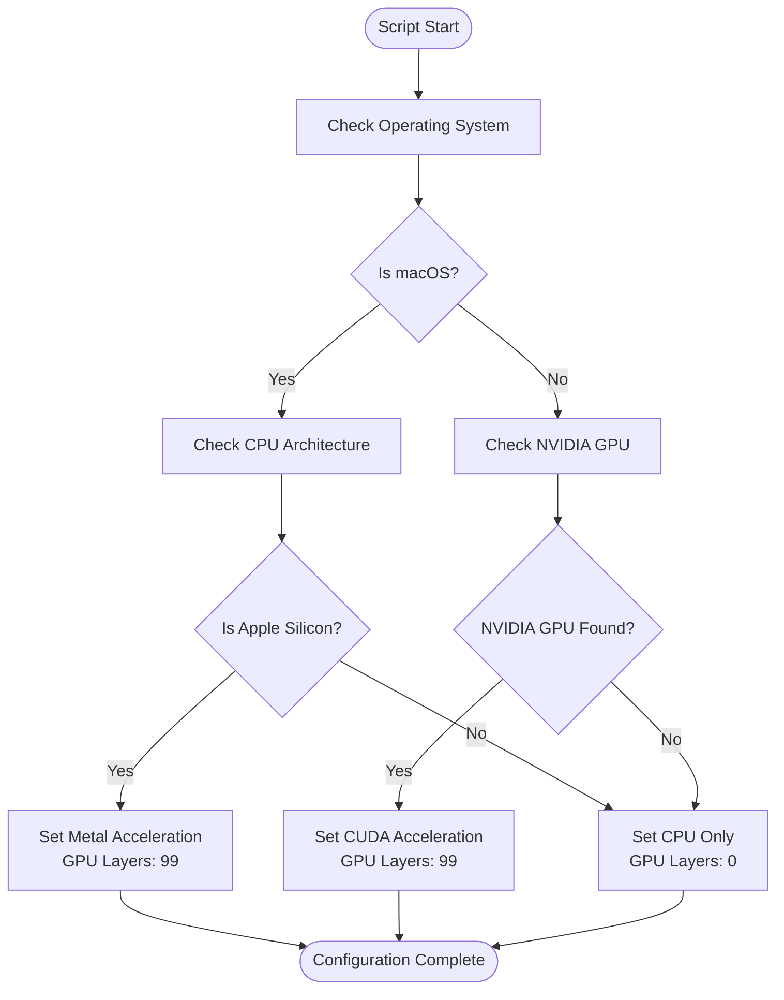
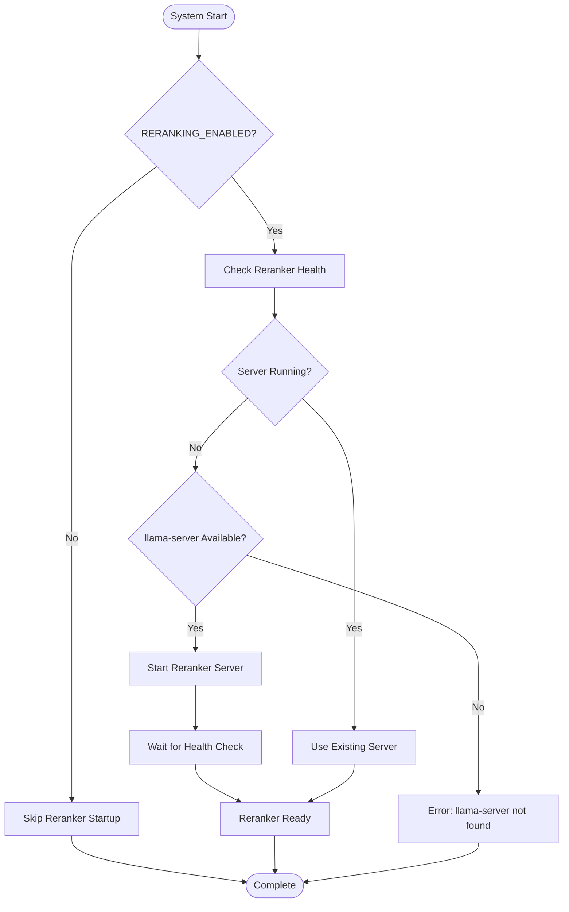
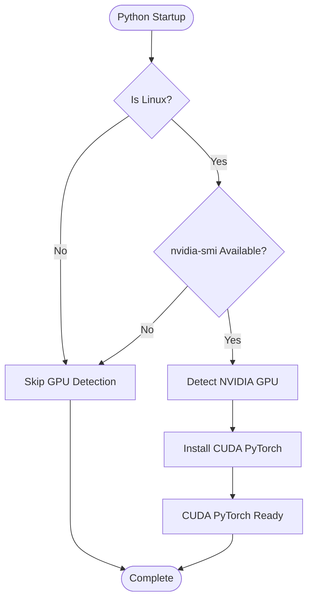
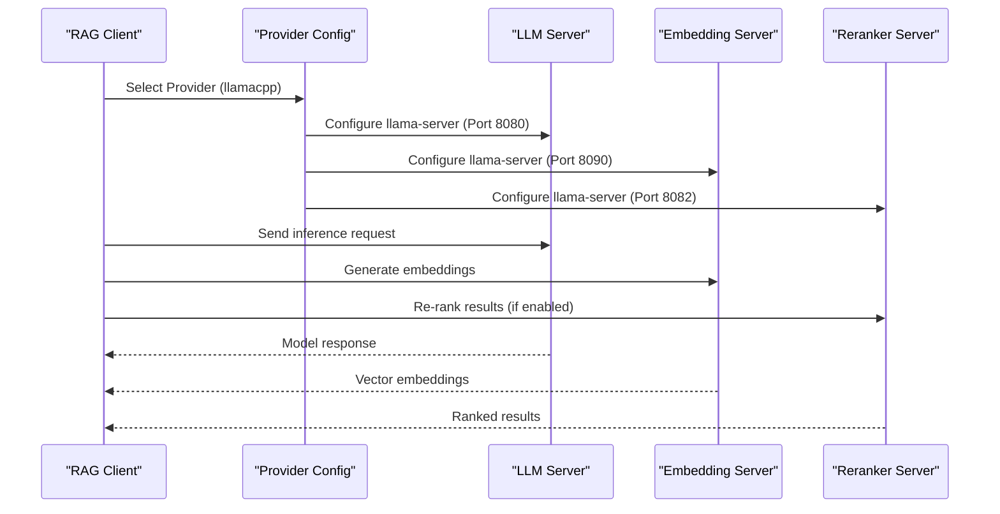

# Llama.cpp Installation and Configuration

<cite>
**Referenced Files in This Document**
- [llamacpp.md](file://docs/llamacpp.md)
- [run_llama_llm.sh](file://scripts/run_llama_llm.sh)
- [run_llama_embeddings.sh](file://scripts/run_llama_embeddings.sh)
- [run_llama_reranker.sh](file://scripts/run_llama_reranker.sh)
- [run_all.sh](file://scripts/run_all.sh)
- [run_admin.sh](file://scripts/run_admin.sh)
- [docker-compose.yml](file://docker-compose.yml)
- [pyproject.toml](file://pyproject.toml)
- [packages/rag_service/pyproject.toml](file://packages/rag_service/pyproject.toml)
- [packages/rag_service/src/cafetera_rag_service/rag/chain.py](file://packages/rag_service/src/cafetera_rag_service/rag/chain.py)
</cite>

## Table of Contents
1. [Introduction](#introduction)
2. [Installation Methods](#installation-methods)
3. [Model Management](#model-management)
4. [GPU Acceleration Setup](#gpu-acceleration-setup)
5. [Manual Server Configuration](#manual-server-configuration)
6. [Reranker Configuration](#reranker-configuration)
7. [PyTorch GPU Acceleration](#pytorch-gpu-acceleration)
8. [Integration with RAG Pipeline](#integration-with-rag-pipeline)
9. [Troubleshooting Guide](#troubleshooting-guide)
10. [Best Practices](#best-practices)

## Introduction

This document provides comprehensive installation and configuration guidance for llama.cpp within the Cafetera HR Bot ecosystem. Llama.cpp offers advanced local AI model deployment with fine-grained control over memory consumption and performance, making it ideal for organizations requiring maximum control over their AI infrastructure.

Unlike Ollama or OpenAI providers, llama.cpp requires manual model file management and direct server control, but provides superior resource optimization capabilities. The system supports three distinct server roles: Language Model (LLM), Embedding generation, and Reranking services, each with specific GPU acceleration capabilities.

## Installation Methods

### macOS Installation via Homebrew

The simplest installation method for macOS users involves the Homebrew package manager:

```bash
brew install llama.cpp
```

**Section sources**
- [llamacpp.md:11-17](file://docs/llamacpp.md#L11-L17)

### Linux Installation from Source

For Linux systems, compilation from source provides maximum flexibility:

```bash
# Install build dependencies
sudo apt-get install -y build-essential cmake

# Clone and build llama.cpp
git clone https://github.com/ggerganov/llama.cpp
cd llama.cpp
cmake -B build
cmake --build build --config Release -j$(nproc)
sudo cp build/bin/llama-server /usr/local/bin/
```

**Section sources**
- [llamacpp.md:19-28](file://docs/llamacpp.md#L19-L28)

### Verification

Confirm successful installation by checking the llama-server version:

```bash
llama-server --version
```

**Section sources**
- [llamacpp.md:30-34](file://docs/llamacpp.md#L30-L34)

## Model Management

### Required Model Files

The system expects three specific model files in the `models/` directory:

| Model Type | Filename | Purpose | Size | Required For |
|------------|----------|---------|------|--------------|
| LLM | `Qwen3.5-4B-Q4_K_M.gguf` | Language model inference | ~2.5 GB | Always (when LLM_PROVIDER=llamacpp) |
| Embedding | `Qwen3-Embedding-4B-Q4_K_M.gguf` | Document similarity search | ~2.4 GB | Always (when EMBEDDING_PROVIDER=llamacpp) |
| Reranker | `Qwen3-Reranker-0.6B-Q4_K_M.gguf` | Result ranking | ~0.4 GB | Only when RERANKING_ENABLED=true |

**Section sources**
- [llamacpp.md:42-48](file://docs/llamacpp.md#L42-L48)

### Automatic Download Process

The system automatically downloads missing models during first run:

```bash
# Manual download commands
curl -L -o models/Qwen3.5-4B-Q4_K_M.gguf \
  https://huggingface.co/unsloth/Qwen3.5-4B-GGUF/resolve/main/Qwen3.5-4B-Q4_K_M.gguf

curl -L -o models/Qwen3-Embedding-4B-Q4_K_M.gguf \
  https://huggingface.co/Qwen/Qwen3-Embedding-4B-GGUF/resolve/main/Qwen3-Embedding-4B-Q4_K_M.gguf

curl -L -o models/Qwen3-Reranker-0.6B-Q4_K_M.gguf \
  https://huggingface.co/mradermacher/Qwen3-Reranker-0.6B-GGUF/resolve/main/Qwen3-Reranker-0.6B.Q4_K_M.gguf
```

**Section sources**
- [llamacpp.md:50-66](file://docs/llamacpp.md#L50-L66)

### Environment Variable Overrides

Customize model locations and sources using environment variables:

```bash
# Override model paths and URLs
LLM_MODEL_PATH=./models/custom-llm.gguf bash scripts/run_llama_llm.sh
LLM_MODEL_URL=https://custom-server.com/model.gguf bash scripts/run_llama_llm.sh

EMBED_MODEL_PATH=./models/custom-embed.gguf bash scripts/run_llama_embeddings.sh
EMBED_MODEL_URL=https://custom-server.com/embed.gguf bash scripts/run_llama_embeddings.sh

RERANKER_MODEL_PATH=./models/custom-reranker.gguf bash scripts/run_llama_reranker.sh
RERANKER_MODEL_URL=https://custom-server.com/reranker.gguf bash scripts/run_llama_reranker.sh
```

**Section sources**
- [llamacpp.md:118-139](file://docs/llamacpp.md#L118-L139)

## GPU Acceleration Setup

### Automatic GPU Detection

The system automatically detects hardware and applies appropriate acceleration:

| Hardware | Detected Acceleration | Configuration |
|----------|----------------------|---------------|
| Apple Silicon (M1-M4) | Metal | All model layers on GPU |
| NVIDIA GPUs (Linux) | CUDA | All model layers on GPU |
| Other Systems | CPU | No GPU acceleration |

**Section sources**
- [llamacpp.md:72-78](file://docs/llamacpp.md#L72-L78)

### Manual GPU Layer Control

Override automatic detection by setting GPU layer counts:

```bash
# Force full GPU acceleration
LLM_N_GPU_LAYERS=99 bash scripts/run_llama_llm.sh
EMBED_N_GPU_LAYERS=99 bash scripts/run_llama_embeddings.sh

# Force CPU-only operation
LLM_N_GPU_LAYERS=0 bash scripts/run_llama_llm.sh
EMBED_N_GPU_LAYERS=0 bash scripts/run_llama_embeddings.sh
```

**Section sources**
- [llamacpp.md:80-85](file://docs/llamacpp.md#L80-L85)

### GPU Detection Implementation

The automatic detection logic follows this pattern:



**Diagram sources**
- [run_llama_llm.sh:23-43](file://scripts/run_llama_llm.sh#L23-L43)
- [run_llama_embeddings.sh:23-43](file://scripts/run_llama_embeddings.sh#L23-L43)
- [run_llama_reranker.sh:22-42](file://scripts/run_llama_reranker.sh#L22-L42)

**Section sources**
- [run_llama_llm.sh:23-43](file://scripts/run_llama_llm.sh#L23-L43)
- [run_llama_embeddings.sh:23-43](file://scripts/run_llama_embeddings.sh#L23-L43)
- [run_llama_reranker.sh:22-42](file://scripts/run_llama_reranker.sh#L22-L42)

## Manual Server Configuration

### Individual Server Startup

Each service can be started independently for development and debugging:

#### LLM Server (Port 8080)
```bash
bash scripts/run_llama_llm.sh
```

#### Embedding Server (Port 8090)
```bash
bash scripts/run_llama_embeddings.sh
```

#### Reranker Server (Port 8082)
```bash
bash scripts/run_llama_reranker.sh
```

**Section sources**
- [llamacpp.md:93-109](file://docs/llamacpp.md#L93-L109)

### Server Configuration Parameters

Each server accepts specific configuration parameters:

#### LLM Server Parameters
- **Context Size**: Default 8192 tokens
- **Thread Count**: Auto-detected CPU cores
- **GPU Layers**: Auto-detected or manual override
- **Reasoning Budget**: Controlled by `LLM_DISABLE_THINKING`

#### Embedding Server Parameters
- **Context Size**: Default 2048 tokens
- **Micro-batch Size**: Default 1024
- **Pooling Method**: Mean pooling for embeddings

#### Reranker Server Parameters
- **Context Size**: Default 8192 tokens
- **Pooling Method**: Rank pooling for relevance scoring

**Section sources**
- [run_llama_llm.sh:45-50](file://scripts/run_llama_llm.sh#L45-L50)
- [run_llama_embeddings.sh:45-51](file://scripts/run_llama_embeddings.sh#L45-L51)
- [run_llama_reranker.sh:44-49](file://scripts/run_llama_reranker.sh#L44-L49)

## Reranker Configuration

### Reranking System Overview

The reranker provides post-search result ranking to improve retrieval quality. It operates as a separate model that re-scores candidate documents based on their relevance to the query.

### Enabling Reranking

Enable reranking through environment variables:

```bash
RERANKING_ENABLED=true
RERANKER_URL=http://localhost:8082
RERANKER_TOP_N=5
RERANKER_PREFETCH_LIMIT=20
RERANKER_TIMEOUT=30.0
```

**Section sources**
- [llamacpp.md:147-160](file://docs/llamacpp.md#L147-L160)

### Reranker Server Configuration

The reranker server uses specialized parameters optimized for ranking tasks:

```bash
# Model path and URL
RERANKER_MODEL_PATH=./models/Qwen3-Reranker-0.6B-Q4_K_M.gguf
RERANKER_CTX_SIZE=8192

# GPU acceleration (empty = auto-detect)
RERANKER_N_GPU_LAYERS=

# Health check endpoint
curl http://localhost:8082/health
```

**Section sources**
- [llamacpp.md:156-173](file://docs/llamacpp.md#L156-L173)

### Conditional Server Startup

The system automatically starts reranker servers when enabled:



**Diagram sources**
- [run_all.sh:419-439](file://scripts/run_all.sh#L419-L439)

**Section sources**
- [run_all.sh:419-439](file://scripts/run_all.sh#L419-L439)

## PyTorch GPU Acceleration

### CPU vs GPU PyTorch Configuration

The RAG service uses PyTorch for document processing. Configuration varies by platform:

| Platform | PyTorch Configuration | GPU Support |
|----------|----------------------|-------------|
| macOS Apple Silicon | Automatic MPS support | Native Metal acceleration |
| Linux (CPU) | CPU-only installation | No GPU acceleration |
| Linux (NVIDIA) | Manual CUDA installation | CUDA 12.8 support |

**Section sources**
- [llamacpp.md:178-188](file://docs/llamacpp.md#L178-L188)

### NVIDIA GPU CUDA Installation

For Linux systems with NVIDIA GPUs, install CUDA-enabled PyTorch:

```bash
uv pip install torch torchvision --index-url https://download.pytorch.org/whl/cu128 --reinstall
```

**Section sources**
- [llamacpp.md:184-188](file://docs/llamacpp.md#L184-L188)

### Automatic GPU Detection

The system automatically detects NVIDIA GPUs and installs appropriate drivers:



**Diagram sources**
- [run_admin.sh:262-269](file://scripts/run_admin.sh#L262-L269)

**Section sources**
- [run_admin.sh:262-269](file://scripts/run_admin.sh#L262-L269)

## Integration with RAG Pipeline

### Provider Selection Architecture

The system supports multiple AI providers with llama.cpp as one option. Provider selection affects both server configuration and client library usage.



**Diagram sources**
- [run_all.sh:218-303](file://scripts/run_all.sh#L218-L303)
- [packages/rag_service/src/cafetera_rag_service/rag/chain.py:122-159](file://packages/rag_service/src/cafetera_rag_service/rag/chain.py#L122-L159)

### Llama.cpp Specific Configuration

When llama.cpp is selected as the provider, the system configures OpenAI-compatible clients:

```python
# Llama.cpp provider configuration
ChatOpenAI(
    model=settings.llm_model,
    api_key="no-key",  # llama.cpp doesn't require API keys
    base_url="http://localhost:8080/v1",  # Standard OpenAI API endpoint
    temperature=settings.llm_temperature,
    extra_body={
        "n_ctx": settings.llm_num_ctx,  # Context window size
        "chat_template_kwargs": {"enable_thinking": False},  # Disable reasoning
    },
)
```

**Section sources**
- [packages/rag_service/src/cafetera_rag_service/rag/chain.py:122-141](file://packages/rag_service/src/cafetera_rag_service/rag/chain.py#L122-L141)

### Environment Variable Integration

The provider selection integrates with Docker Compose for containerized deployments:

```yaml
services:
  rag-service:
    environment:
      LLM_PROVIDER: "llamacpp"
      LLM_BASE_URL: "http://host.docker.internal:8080"
      EMBEDDING_BASE_URL: "http://host.docker.internal:8090/v1"
      RERANKER_URL: "http://host.docker.internal:8082"
```

**Section sources**
- [docker-compose.yml:70-75](file://docker-compose.yml#L70-L75)

## Troubleshooting Guide

### Common Installation Issues

#### llama-server Not Found
**Symptoms**: Installation fails with "llama-server not found" error
**Solution**: Verify installation path and add to system PATH
```bash
which llama-server
export PATH=$PATH:/usr/local/bin
```

#### Model Download Failures
**Symptoms**: Model files not downloading or corrupted
**Solution**: Manually download using curl or wget
```bash
# Check connectivity
curl -I https://huggingface.co
wget --spider https://huggingface.co

# Manual download with progress
curl -L --progress-bar -o models/Qwen3.5-4B-Q4_K_M.gguf [URL]
```

#### GPU Acceleration Issues
**Symptoms**: Models load but don't utilize GPU
**Solution**: Verify GPU detection and driver installation
```bash
# Check GPU availability
nvidia-smi  # For NVIDIA
system_profiler SPDisplaysDataType  # For Apple Silicon

# Force CPU fallback
LLM_N_GPU_LAYERS=0 bash scripts/run_llama_llm.sh
```

### Performance Optimization

#### Memory Management
Monitor GPU memory usage and adjust layer distribution:
```bash
# Check current memory usage
nvidia-smi  # NVIDIA
top -l 1 | grep "Mem"  # Apple Silicon

# Reduce GPU layers for memory-constrained systems
LLM_N_GPU_LAYERS=50 bash scripts/run_llama_llm.sh
```

#### Threading Configuration
Optimize thread count based on CPU cores:
```bash
# Auto-detect threads
THREADS=$(nproc) bash scripts/run_llama_llm.sh

# Manual thread specification
THREADS=8 bash scripts/run_llama_llm.sh
```

## Best Practices

### Production Deployment

1. **Model Management**: Store models on fast SSD storage for optimal loading times
2. **GPU Monitoring**: Implement regular GPU memory monitoring for resource optimization
3. **Backup Strategy**: Regularly backup model files and configuration
4. **Version Control**: Track model versions and configuration changes

### Development Workflow

1. **Environment Isolation**: Use separate .env files for development and production
2. **Health Checks**: Implement automated health monitoring for all services
3. **Logging**: Enable comprehensive logging for debugging and performance analysis
4. **Testing**: Validate model performance with representative workloads

### Security Considerations

1. **Network Security**: Restrict llama.cpp server access to trusted networks
2. **File Permissions**: Ensure model files have appropriate read permissions
3. **Resource Limits**: Implement CPU and memory limits for server processes
4. **Regular Updates**: Keep llama.cpp and models updated with security patches