# Deployment and Operations

<cite>
**Referenced Files in This Document**
- [docker-compose.yml](file://docker-compose.yml)
- [pyproject.toml](file://pyproject.toml)
- [app/config.py](file://app/config.py)
- [app/main.py](file://app/main.py)
- [app/resources.py](file://app/resources.py)
- [app/storage/database.py](file://app/storage/database.py)
- [app/storage/category_repo.py](file://app/storage/category_repo.py)
- [app/storage/document_repo.py](file://app/storage/document_repo.py)
- [scripts/admin_server.py](file://scripts/admin_server.py)
- [scripts/polling_vk.py](file://scripts/polling_vk.py)
- [scripts/run_admin.sh](file://scripts/run_admin.sh)
- [scripts/run_llama_embeddings.sh](file://scripts/run_llama_embeddings.sh)
- [scripts/run_llama_llm.sh](file://scripts/run_llama_llm.sh)
- [scripts/run_ollama_embeddings.sh](file://scripts/run_ollama_embeddings.sh)
- [scripts/run_ollama_llm.sh](file://scripts/run_ollama_llm.sh)
- [app/integrations/vk/bot.py](file://app/integrations/vk/bot.py)
- [app/integrations/vk/handlers/start.py](file://app/integrations/vk/handlers/start.py)
- [app/integrations/vk/states.py](file://app/integrations/vk/states.py)
- [app/rag/retriever.py](file://app/rag/retriever.py)
- [app/rag/chain.py](file://app/rag/chain.py)
- [app/rag/indexer.py](file://app/rag/indexer.py)
- [app/rag/parser.py](file://app/rag/parser.py)
- [tests/conftest.py](file://tests/conftest.py)
- [AGENTS.md](file://AGENTS.md)
- [PLAN.md](file://PLAN.md)
</cite>

## Update Summary
**Changes Made**
- Added PostgreSQL service definition to Docker Compose configuration with proper environment variables, volume mounting, health checks, and credentials
- Integrated PostgreSQL database initialization and table creation for document metadata storage
- Enhanced orchestration script with PostgreSQL health checking and connection management
- Updated configuration to support PostgreSQL database URL with asyncpg driver
- Added comprehensive database schema initialization with proper table creation and indexing

## Table of Contents
1. [Introduction](#introduction)
2. [Project Structure](#project-structure)
3. [Core Components](#core-components)
4. [Architecture Overview](#architecture-overview)
5. [Detailed Component Analysis](#detailed-component-analysis)
6. [Dependency Analysis](#dependency-analysis)
7. [Performance Considerations](#performance-considerations)
8. [Monitoring and Logging](#monitoring-and-logging)
9. [Security Considerations](#security-considerations)
10. [Scaling Approaches](#scaling-approaches)
11. [Production Deployment Playbooks](#production-deployment-playbooks)
12. [Troubleshooting Guide](#troubleshooting-guide)
13. [Conclusion](#conclusion)

## Introduction
This document provides comprehensive guidance for deploying and operating cafetera_hr_bot in production. It covers containerized infrastructure using Docker Compose, operational controls for VK bot long-polling versus webhook-based production operation, planned Telegram integration, and future webhook deployment. The system now features a PostgreSQL database for storing document metadata alongside the existing Qdrant vector database and MinIO object storage. The production server utilizes Hypercorn with HTTP/2 support, replacing Uvicorn for improved performance and modern protocol support. It also documents monitoring and logging strategies, secrets management, scaling approaches, performance optimization, disaster recovery planning, and practical deployment playbooks.

**Updated**: The system now includes PostgreSQL database integration for persistent document metadata storage, comprehensive database initialization with table creation and indexing, and enhanced orchestration with PostgreSQL health checking and connection management.

## Project Structure
The repository organizes runtime concerns into layered modules with a new centralized orchestration approach and PostgreSQL database integration:
- Integrations: VK bot adapter and handlers
- Domain: States and navigation helpers
- Config: Pydantic-based settings loader with multiple LLM provider support and PostgreSQL database configuration
- Scripts: Centralized orchestration via run_admin.sh with specialized deployment scripts for individual components
- Infrastructure: Docker Compose services for Qdrant, MinIO, and PostgreSQL with health checking
- Storage: PostgreSQL database initialization and repository pattern implementation

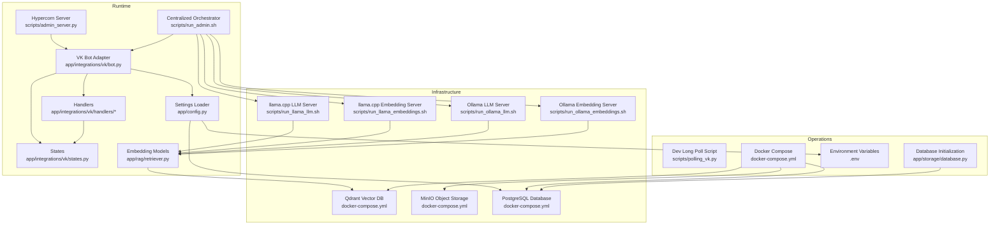

**Diagram sources**
- [app/integrations/vk/bot.py:1-56](file://app/integrations/vk/bot.py#L1-L56)
- [app/integrations/vk/handlers/start.py:1-55](file://app/integrations/vk/handlers/start.py#L1-L55)
- [app/integrations/vk/states.py:1-14](file://app/integrations/vk/states.py#L1-L14)
- [app/config.py:1-62](file://app/config.py#L1-L62)
- [app/storage/database.py:1-58](file://app/storage/database.py#L1-L58)
- [scripts/polling_vk.py:1-38](file://scripts/polling_vk.py#L1-L38)
- [scripts/run_llama_embeddings.sh:1-77](file://scripts/run_llama_embeddings.sh#L1-L77)
- [scripts/run_llama_llm.sh:1-75](file://scripts/run_llama_llm.sh#L1-L75)
- [scripts/run_ollama_embeddings.sh:1-73](file://scripts/run_ollama_embeddings.sh#L1-L73)
- [scripts/run_ollama_llm.sh:1-74](file://scripts/run_ollama_llm.sh#L1-L74)
- [docker-compose.yml:1-53](file://docker-compose.yml#L1-L53)
- [scripts/admin_server.py:1-74](file://scripts/admin_server.py#L1-L74)
- [scripts/run_admin.sh:1-464](file://scripts/run_admin.sh#L1-L464)

**Section sources**
- [docker-compose.yml:1-53](file://docker-compose.yml#L1-L53)
- [pyproject.toml:1-62](file://pyproject.toml#L1-L62)
- [app/config.py:1-62](file://app/config.py#L1-L62)
- [app/storage/database.py:1-58](file://app/storage/database.py#L1-L58)
- [scripts/polling_vk.py:1-38](file://scripts/polling_vk.py#L1-L38)
- [scripts/run_llama_embeddings.sh:1-77](file://scripts/run_llama_embeddings.sh#L1-L77)
- [scripts/run_llama_llm.sh:1-75](file://scripts/run_llama_llm.sh#L1-L75)
- [scripts/run_ollama_embeddings.sh:1-73](file://scripts/run_ollama_embeddings.sh#L1-L73)
- [scripts/run_ollama_llm.sh:1-74](file://scripts/run_ollama_llm.sh#L1-L74)
- [app/integrations/vk/bot.py:1-56](file://app/integrations/vk/bot.py#L1-L56)
- [app/integrations/vk/handlers/start.py:1-55](file://app/integrations/vk/handlers/start.py#L1-L55)
- [app/integrations/vk/states.py:1-14](file://app/integrations/vk/states.py#L1-L14)
- [app/rag/retriever.py:1-103](file://app/rag/retriever.py#L1-L103)
- [scripts/admin_server.py:1-74](file://scripts/admin_server.py#L1-L74)
- [scripts/run_admin.sh:1-464](file://scripts/run_admin.sh#L1-L464)
- [AGENTS.md:1-88](file://AGENTS.md#L1-L88)
- [PLAN.md:1-207](file://PLAN.md#L1-L207)

## Core Components
- VK Bot Adapter: Creates a fully wired vkbottle Bot with registered labelers and logging.
- Handlers: Start/main menu/navigation and fallback handlers.
- States: Multi-step dialog states for HR request scenario.
- Config: Pydantic Settings with environment file support and multiple LLM provider configuration including PostgreSQL database URL.
- Dev Long Poll Script: Local development entry-point for VK bot using long polling.
- Hypercorn Server: Production-grade ASGI server with HTTP/2 support and configurable worker classes.
- Centralized Orchestrator: run_admin.sh manages provider selection, dependency installation, infrastructure provisioning, service coordination with enhanced error handling and PostgreSQL health checking.
- Specialized Deployment Scripts: Separate scripts for LLM and embedding servers for llama.cpp and Ollama providers with automated model downloading and verification.
- Modular Infrastructure: Docker Compose services with comprehensive health checking for Qdrant, MinIO, and PostgreSQL.
- Database Layer: PostgreSQL database initialization with table creation for document metadata storage and category file management.

**Updated**: The centralized orchestrator (run_admin.sh) provides interactive provider selection, automated dependency management, comprehensive service startup with health checks including PostgreSQL readiness, and robust error handling with detailed fix suggestions for seamless deployment across different LLM providers and database configurations.

**Section sources**
- [app/integrations/vk/bot.py:24-56](file://app/integrations/vk/bot.py#L24-L56)
- [app/integrations/vk/handlers/start.py:23-55](file://app/integrations/vk/handlers/start.py#L23-L55)
- [app/integrations/vk/states.py:4-14](file://app/integrations/vk/states.py#L4-L14)
- [app/config.py:15-62](file://app/config.py#L15-L62)
- [scripts/polling_vk.py:25-38](file://scripts/polling_vk.py#L25-L38)
- [scripts/admin_server.py:55-68](file://scripts/admin_server.py#L55-L68)
- [scripts/run_llama_embeddings.sh:39-77](file://scripts/run_llama_embeddings.sh#L39-L77)
- [scripts/run_llama_llm.sh:39-75](file://scripts/run_llama_llm.sh#L39-L75)
- [scripts/run_ollama_embeddings.sh:26-73](file://scripts/run_ollama_embeddings.sh#L26-L73)
- [scripts/run_ollama_llm.sh:26-74](file://scripts/run_ollama_llm.sh#L26-L74)
- [scripts/run_admin.sh:51-70](file://scripts/run_admin.sh#L51-L70)
- [scripts/run_admin.sh:275-281](file://scripts/run_admin.sh#L275-L281)
- [AGENTS.md:16-18](file://AGENTS.md#L16-L18)
- [PLAN.md:132-135](file://PLAN.md#L132-L135)

## Architecture Overview
The system runs a VK bot with optional RAG capabilities backed by PostgreSQL for document metadata storage, Qdrant for vector search, and MinIO for document storage. The RAG system supports multiple embedding providers including llama.cpp with optimized server flags for document embedding tasks. In production, the VK bot operates via FastAPI webhook transport with Hypercorn server supporting HTTP/2; long polling is for local development only. The centralized orchestrator manages all deployment aspects and provider-specific configurations with enhanced error handling, verification, and PostgreSQL database initialization.

**Updated**: The architecture now features modular deployment scripts that separate LLM and embedding server responsibilities, enabling more flexible and maintainable deployment configurations with automated model management, comprehensive verification, and PostgreSQL database integration for persistent document metadata storage.

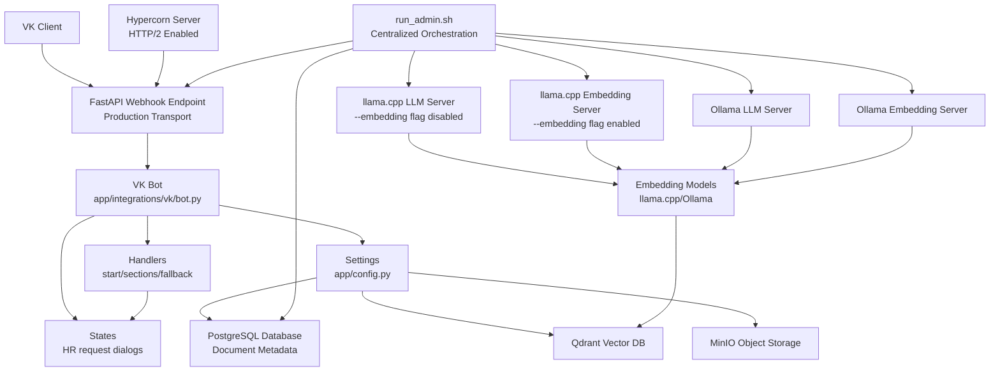

**Diagram sources**
- [app/integrations/vk/bot.py:24-56](file://app/integrations/vk/bot.py#L24-L56)
- [app/integrations/vk/handlers/start.py:23-55](file://app/integrations/vk/handlers/start.py#L23-L55)
- [app/integrations/vk/states.py:4-14](file://app/integrations/vk/states.py#L4-L14)
- [app/config.py:15-62](file://app/config.py#L15-L62)
- [docker-compose.yml:30-47](file://docker-compose.yml#L30-L47)
- [scripts/run_llama_embeddings.sh:68-77](file://scripts/run_llama_embeddings.sh#L68-L77)
- [scripts/run_llama_llm.sh:68-75](file://scripts/run_llama_llm.sh#L68-L75)
- [app/rag/retriever.py:22-62](file://app/rag/retriever.py#L22-L62)
- [scripts/admin_server.py:55-68](file://scripts/admin_server.py#L55-L68)
- [scripts/run_admin.sh:223-356](file://scripts/run_admin.sh#L223-L356)

**Section sources**
- [AGENTS.md:16-18](file://AGENTS.md#L16-L18)
- [PLAN.md:132-135](file://PLAN.md#L132-L135)
- [docker-compose.yml:30-47](file://docker-compose.yml#L30-L47)
- [scripts/run_llama_embeddings.sh:68-77](file://scripts/run_llama_embeddings.sh#L68-L77)
- [scripts/run_llama_llm.sh:68-75](file://scripts/run_llama_llm.sh#L68-L75)
- [app/rag/retriever.py:22-62](file://app/rag/retriever.py#L22-L62)
- [scripts/admin_server.py:55-68](file://scripts/admin_server.py#L55-L68)
- [scripts/run_admin.sh:223-356](file://scripts/run_admin.sh#L223-L356)

## Detailed Component Analysis

### PostgreSQL Database Integration and Schema Management
The system now includes PostgreSQL database integration for persistent document metadata storage with comprehensive table creation and indexing.

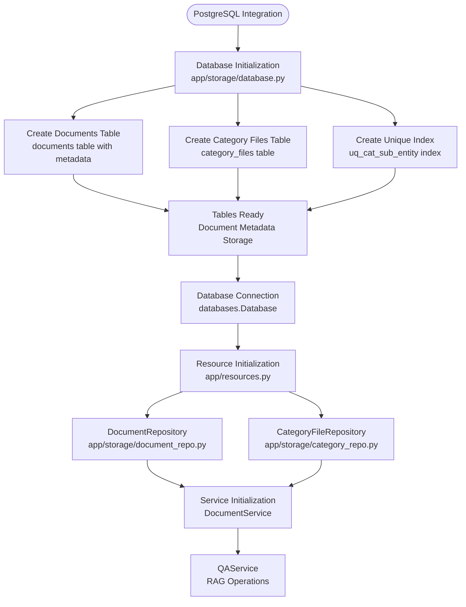

**Diagram sources**
- [app/storage/database.py:11-58](file://app/storage/database.py#L11-L58)
- [app/storage/document_repo.py:64-70](file://app/storage/document_repo.py#L64-L70)
- [app/storage/category_repo.py:48-61](file://app/storage/category_repo.py#L48-L61)
- [app/resources.py:208-252](file://app/resources.py#L208-L252)

**Section sources**
- [app/storage/database.py:1-58](file://app/storage/database.py#L1-L58)
- [app/storage/document_repo.py:64-70](file://app/storage/document_repo.py#L64-L70)
- [app/storage/category_repo.py:48-61](file://app/storage/category_repo.py#L48-L61)
- [app/resources.py:208-252](file://app/resources.py#L208-L252)

### Centralized Orchestrator and Enhanced Provider Management
The run_admin.sh script serves as the central orchestration point, providing interactive provider selection, automated dependency management, comprehensive service startup with health checks including PostgreSQL readiness, and robust error handling with detailed fix suggestions.

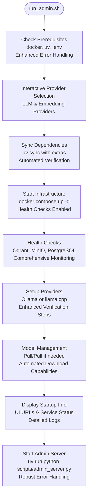

**Diagram sources**
- [scripts/run_admin.sh:69-98](file://scripts/run_admin.sh#L69-L98)
- [scripts/run_admin.sh:100-181](file://scripts/run_admin.sh#L100-L181)
- [scripts/run_admin.sh:183-200](file://scripts/run_admin.sh#L183-L200)
- [scripts/run_admin.sh:202-221](file://scripts/run_admin.sh#L202-L221)
- [scripts/run_admin.sh:275-281](file://scripts/run_admin.sh#L275-L281)
- [scripts/run_admin.sh:365-385](file://scripts/run_admin.sh#L365-L385)

**Section sources**
- [scripts/run_admin.sh:1-464](file://scripts/run_admin.sh#L1-L464)

### Enhanced Error Handling and Verification in Administration Scripts
The administration scripts now feature comprehensive error handling, model verification, automated cleanup procedures, and PostgreSQL health checking to ensure reliable deployment and operation.

**Updated**: The run_admin.sh script includes enhanced error handling with detailed fix suggestions, comprehensive health checks including PostgreSQL readiness, and automated model verification for both Ollama and llama.cpp providers.

**Section sources**
- [scripts/run_admin.sh:243-321](file://scripts/run_admin.sh#L243-L321)
- [scripts/run_admin.sh:323-347](file://scripts/run_admin.sh#L323-L347)
- [scripts/run_ollama_embeddings.sh:26-73](file://scripts/run_ollama_embeddings.sh#L26-L73)
- [scripts/run_ollama_llm.sh:26-74](file://scripts/run_ollama_llm.sh#L26-L74)
- [scripts/run_llama_embeddings.sh:39-77](file://scripts/run_llama_embeddings.sh#L39-L77)
- [scripts/run_llama_llm.sh:39-75](file://scripts/run_llama_llm.sh#L39-L75)

### Automated Model Downloading Capabilities for llama.cpp Providers
The llama.cpp deployment scripts now include intelligent model downloading with fallback mechanisms and progress indicators for improved user experience.

**Updated**: Both run_llama_embeddings.sh and run_llama_llm.sh scripts now feature automated model downloading capabilities with curl/wget fallback support, progress indicators, and comprehensive error handling for model acquisition failures.

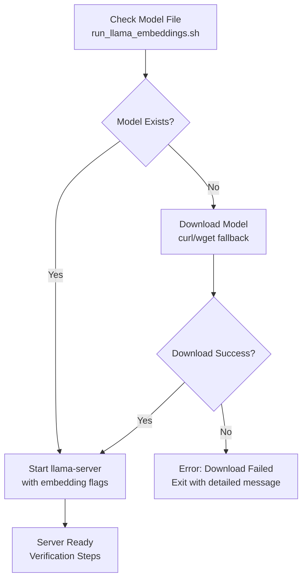

**Diagram sources**
- [scripts/run_llama_embeddings.sh:39-77](file://scripts/run_llama_embeddings.sh#L39-L77)
- [scripts/run_llama_llm.sh:39-75](file://scripts/run_llama_llm.sh#L39-L75)

**Section sources**
- [scripts/run_llama_embeddings.sh:39-77](file://scripts/run_llama_embeddings.sh#L39-L77)
- [scripts/run_llama_llm.sh:39-75](file://scripts/run_llama_llm.sh#L39-L75)

### Enhanced Provider Verification Steps for Ollama and llamacpp
Both Ollama and llama.cpp providers now include comprehensive verification steps with health checks, model validation, and smoke tests to ensure reliable operation.

**Updated**: The provider verification system now includes health checks, model validation, and smoke tests for both Ollama and llama.cpp providers, with detailed error reporting and fix suggestions.

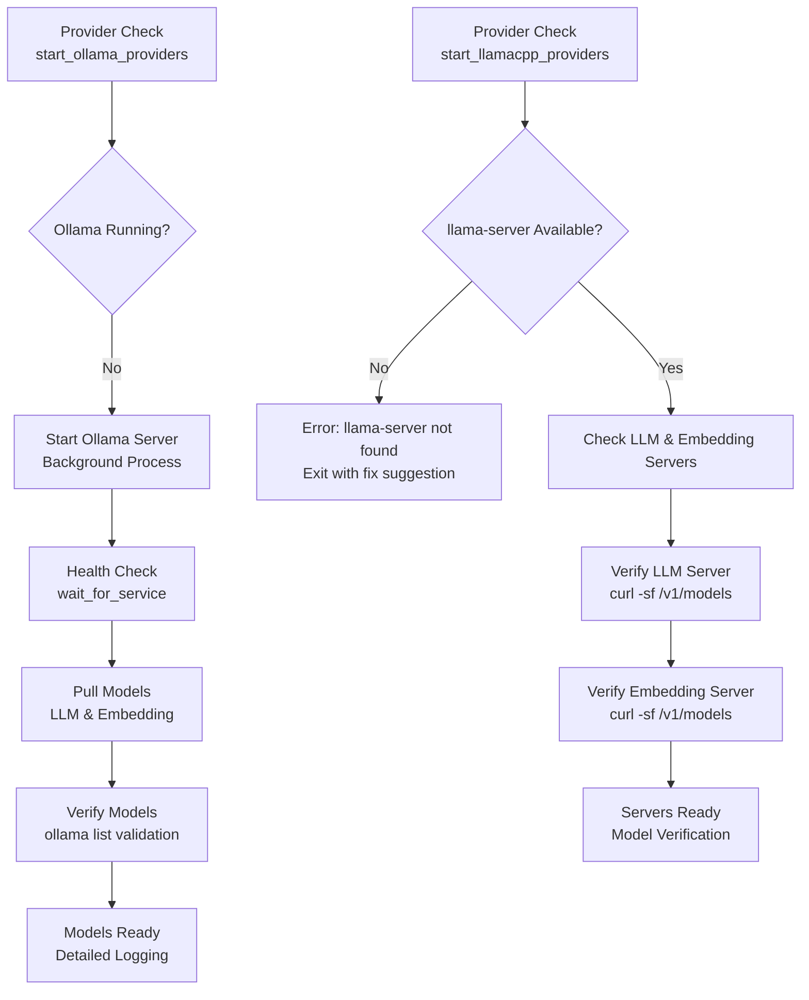

**Diagram sources**
- [scripts/run_admin.sh:223-286](file://scripts/run_admin.sh#L223-L286)
- [scripts/run_admin.sh:288-347](file://scripts/run_admin.sh#L288-L347)

**Section sources**
- [scripts/run_admin.sh:223-286](file://scripts/run_admin.sh#L223-L286)
- [scripts/run_admin.sh:288-347](file://scripts/run_admin.sh#L288-L347)

### VK Bot Factory and Handler Registration
The VK bot factory constructs a Bot instance and loads labelers in a specific order to ensure the fallback handler captures unmatched messages last.

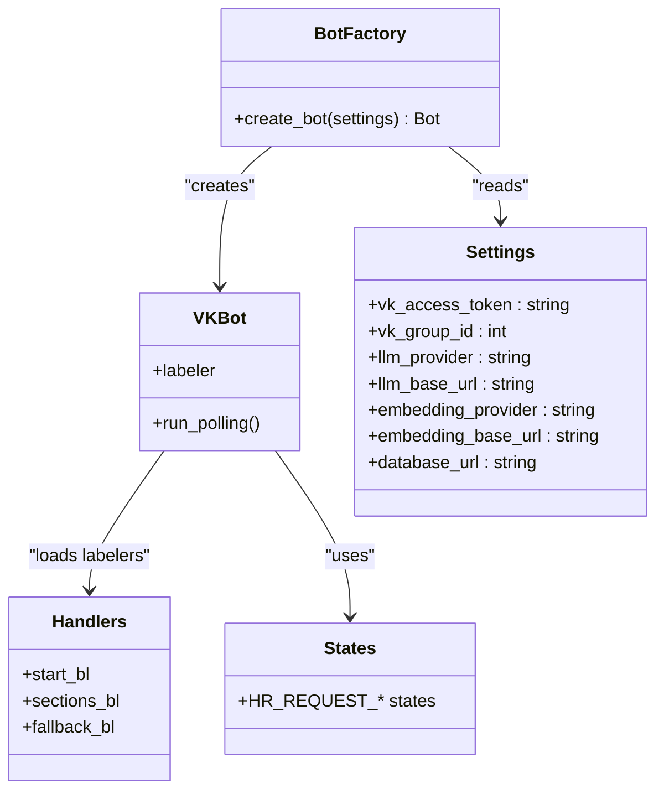

**Diagram sources**
- [app/integrations/vk/bot.py:24-56](file://app/integrations/vk/bot.py#L24-L56)
- [app/integrations/vk/handlers/start.py:12-55](file://app/integrations/vk/handlers/start.py#L12-L55)
- [app/integrations/vk/states.py:4-14](file://app/integrations/vk/states.py#L4-L14)
- [app/config.py:15-62](file://app/config.py#L15-L62)

**Section sources**
- [app/integrations/vk/bot.py:14-56](file://app/integrations/vk/bot.py#L14-L56)
- [app/integrations/vk/handlers/start.py:12-55](file://app/integrations/vk/handlers/start.py#L12-L55)
- [app/integrations/vk/states.py:4-14](file://app/integrations/vk/states.py#L4-L14)
- [app/config.py:15-62](file://app/config.py#L15-L62)

### Hypercorn Server Configuration and HTTP/2 Support
The production server uses Hypercorn with HTTP/2 support, providing improved performance and modern protocol features compared to Uvicorn.

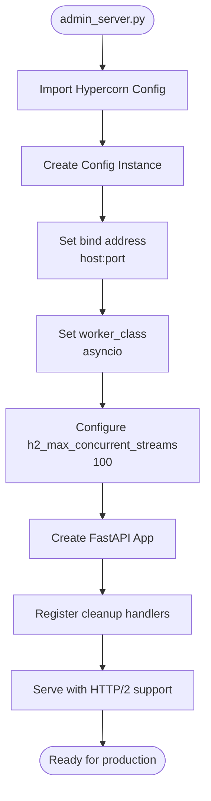

**Diagram sources**
- [scripts/admin_server.py:28-68](file://scripts/admin_server.py#L28-L68)

**Section sources**
- [scripts/admin_server.py:1-74](file://scripts/admin_server.py#L1-L74)

### Modular Llama.cpp Deployment Architecture with Enhanced Features
The llama.cpp deployment now uses specialized scripts for LLM and embedding servers, each with optimized configurations, automated model downloading, and comprehensive verification capabilities.

**Updated**: The llama.cpp deployment scripts now include automated model downloading with curl/wget fallback support, progress indicators, and comprehensive error handling for improved user experience and reliability.

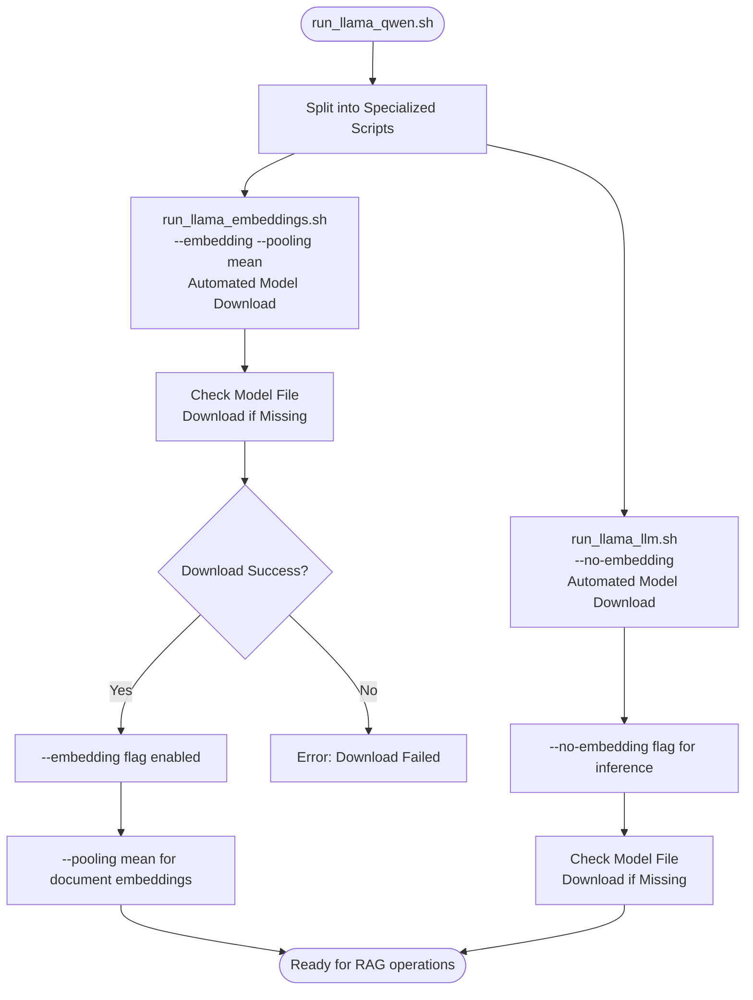

**Diagram sources**
- [scripts/run_llama_qwen.sh:1-11](file://scripts/run_llama_qwen.sh#L1-L11)
- [scripts/run_llama_embeddings.sh:39-77](file://scripts/run_llama_embeddings.sh#L39-L77)
- [scripts/run_llama_llm.sh:39-75](file://scripts/run_llama_llm.sh#L39-L75)

**Section sources**
- [scripts/run_llama_qwen.sh:1-11](file://scripts/run_llama_qwen.sh#L1-L11)
- [scripts/run_llama_embeddings.sh:1-77](file://scripts/run_llama_embeddings.sh#L1-L77)
- [scripts/run_llama_llm.sh:1-75](file://scripts/run_llama_llm.sh#L1-L75)

### Modular Ollama Deployment Architecture with Comprehensive Verification
The Ollama deployment uses specialized scripts for LLM and embedding servers, with automatic model management, verification, and comprehensive error handling.

**Updated**: The Ollama deployment scripts now include comprehensive model verification, health checks, and detailed error reporting with fix suggestions for improved reliability and user experience.

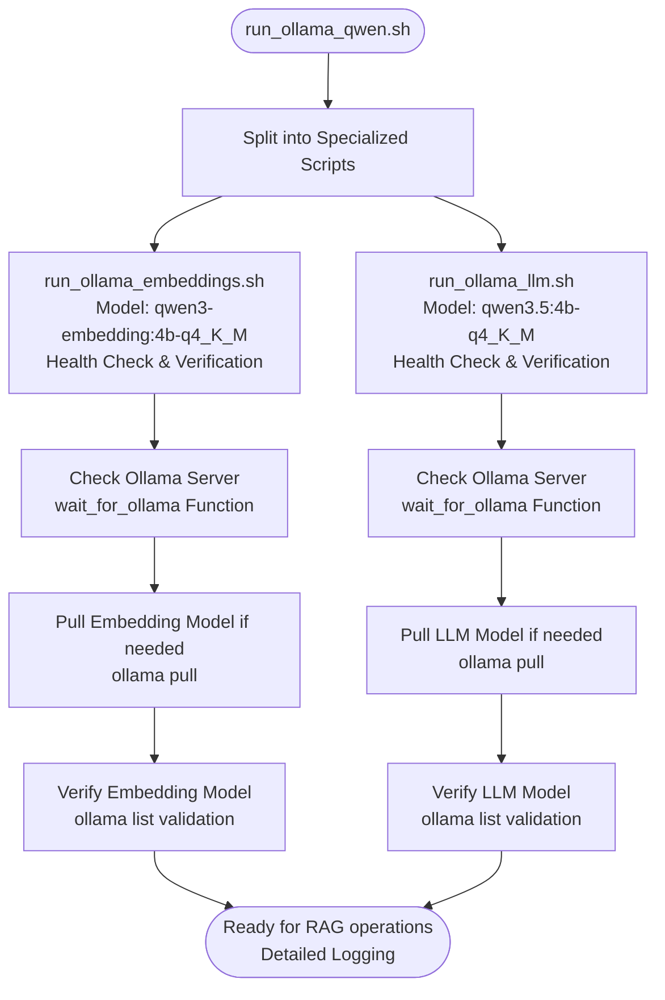

**Diagram sources**
- [scripts/run_ollama_qwen.sh:1-11](file://scripts/run_ollama_qwen.sh#L1-L11)
- [scripts/run_ollama_embeddings.sh:12-73](file://scripts/run_ollama_embeddings.sh#L12-L73)
- [scripts/run_ollama_llm.sh:12-74](file://scripts/run_ollama_llm.sh#L12-L74)

**Section sources**
- [scripts/run_ollama_qwen.sh:1-11](file://scripts/run_ollama_qwen.sh#L1-L11)
- [scripts/run_ollama_embeddings.sh:1-73](file://scripts/run_ollama_embeddings.sh#L1-L73)
- [scripts/run_ollama_llm.sh:1-74](file://scripts/run_ollama_llm.sh#L1-L74)

### LLM Provider Configuration and Enhanced Embedding Selection
The system supports multiple LLM providers with automatic embedding model selection based on configuration. The default embedding model is now 'qwen3-embedding:4b-q4_K_M' with enhanced verification capabilities.

**Updated**: The embedding configuration now includes enhanced verification steps and comprehensive error handling for model validation and provider compatibility.

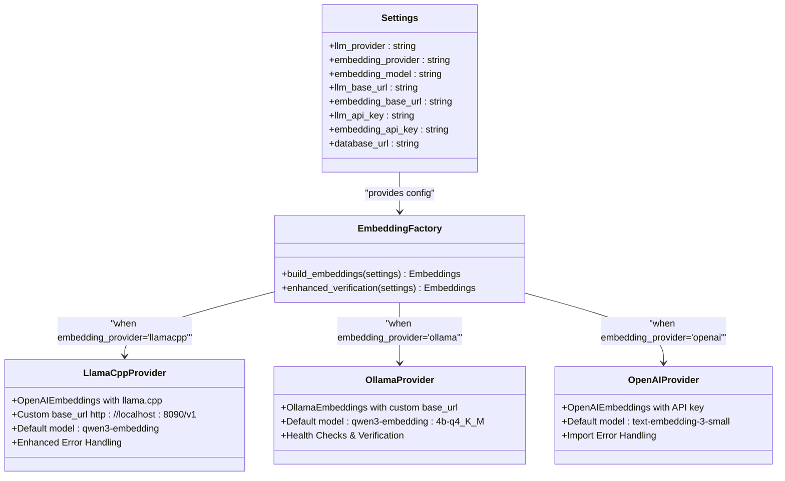

**Diagram sources**
- [app/config.py:15-62](file://app/config.py#L15-L62)
- [app/rag/retriever.py:22-62](file://app/rag/retriever.py#L22-L62)

**Section sources**
- [app/config.py:15-62](file://app/config.py#L15-L62)
- [app/rag/retriever.py:22-62](file://app/rag/retriever.py#L22-L62)

### VK Long Polling Development Flow
Local development uses a script that loads settings and starts the VK bot in long-polling mode.

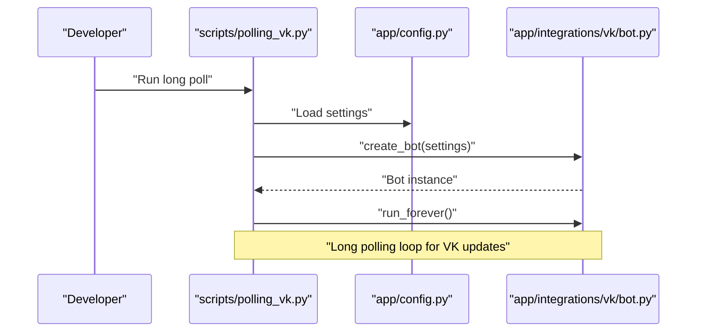

**Diagram sources**
- [scripts/polling_vk.py:25-38](file://scripts/polling_vk.py#L25-L38)
- [app/config.py:15-62](file://app/config.py#L15-L62)
- [app/integrations/vk/bot.py:24-56](file://app/integrations/vk/bot.py#L24-L56)

**Section sources**
- [scripts/polling_vk.py:1-38](file://scripts/polling_vk.py#L1-L38)
- [app/config.py:15-62](file://app/config.py#L15-L62)
- [app/integrations/vk/bot.py:24-56](file://app/integrations/vk/bot.py#L24-L56)

### Enhanced Containerized Infrastructure Setup
Docker Compose provisions Qdrant, MinIO, and PostgreSQL with comprehensive health checks and persistent volumes.

**Updated**: The Docker Compose configuration now includes PostgreSQL service definition with proper environment variables, volume mounting, health checks, and credentials, along with comprehensive health checking for all infrastructure components.

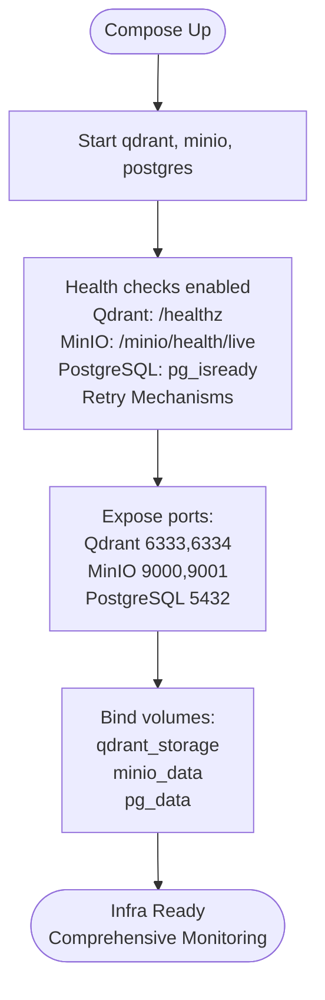

**Diagram sources**
- [docker-compose.yml:2-53](file://docker-compose.yml#L2-L53)

**Section sources**
- [docker-compose.yml:1-53](file://docker-compose.yml#L1-L53)

### PostgreSQL Database Initialization and Schema Management
The PostgreSQL database is initialized with comprehensive table creation and indexing for document metadata storage.

**Updated**: The database initialization process now includes proper table creation for documents and category_files, unique indexing for category file management, and asyncpg driver configuration for production deployments.

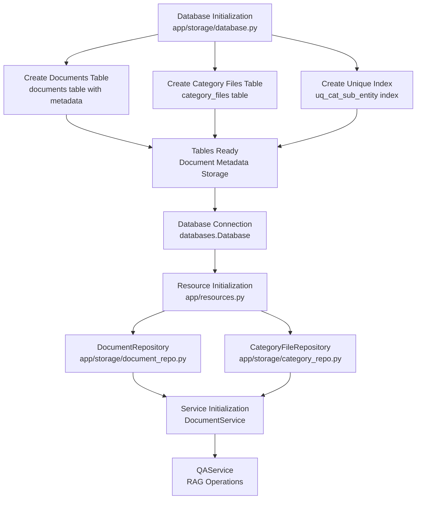

**Diagram sources**
- [app/storage/database.py:11-58](file://app/storage/database.py#L11-L58)
- [app/storage/document_repo.py:64-70](file://app/storage/document_repo.py#L64-L70)
- [app/storage/category_repo.py:48-61](file://app/storage/category_repo.py#L48-L61)
- [app/resources.py:208-252](file://app/resources.py#L208-L252)

**Section sources**
- [app/storage/database.py:1-58](file://app/storage/database.py#L1-L58)
- [app/storage/document_repo.py:64-70](file://app/storage/document_repo.py#L64-L70)
- [app/storage/category_repo.py:48-61](file://app/storage/category_repo.py#L48-L61)
- [app/resources.py:208-252](file://app/resources.py#L208-L252)

### Enhanced PostgreSQL Health Checking in Orchestrator
The centralized orchestrator now includes comprehensive PostgreSQL health checking with retry mechanisms and detailed error reporting.

**Updated**: The orchestrator includes a dedicated wait_for_postgres function with configurable retries and intervals, detailed error messages with fix suggestions, and integration with the Docker Compose PostgreSQL service for reliable database startup verification.

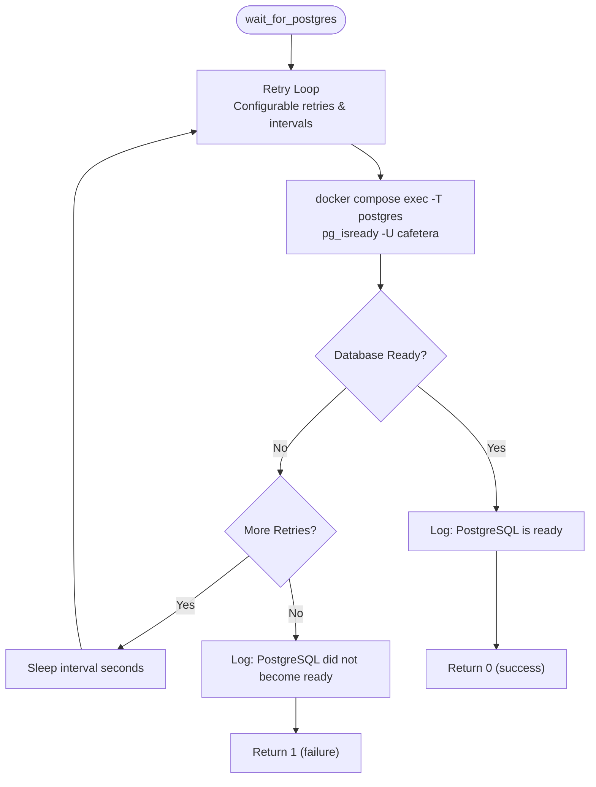

**Diagram sources**
- [scripts/run_admin.sh:52-70](file://scripts/run_admin.sh#L52-L70)

**Section sources**
- [scripts/run_admin.sh:52-70](file://scripts/run_admin.sh#L52-L70)
- [scripts/run_admin.sh:275-281](file://scripts/run_admin.sh#L275-L281)

## Dependency Analysis
External dependencies include FastAPI, Hypercorn, LangChain stack, Qdrant client, VK and Telegram adapters, PostgreSQL asyncpg driver, and testing tools. Optional extras enable Ollama or OpenAI-compatible LLMs. The system now supports llama.cpp with optimized embedding server flags and uses Hypercorn as the production ASGI server instead of Uvicorn. PostgreSQL integration adds asyncpg driver for database connectivity.

**Updated**: The centralized orchestrator manages dependency installation through uv sync with provider-specific extras, eliminates manual dependency management complexity, and includes comprehensive error handling for dependency resolution failures. The PostgreSQL integration adds asyncpg driver for production database connectivity.

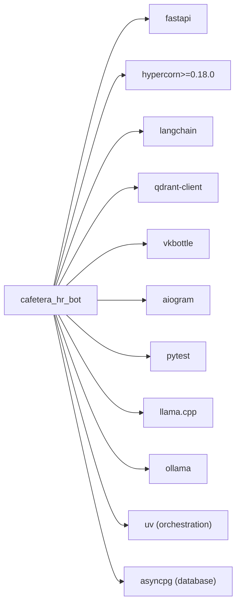

**Diagram sources**
- [pyproject.toml:7-29](file://pyproject.toml#L7-L29)

**Section sources**
- [pyproject.toml:1-62](file://pyproject.toml#L1-L62)

## Performance Considerations
- Use production-grade webhook transport instead of long polling to reduce resource overhead and latency.
- Tune Qdrant shard and index parameters for retrieval performance; monitor vector search latency.
- Use MinIO in-cluster for low-latency document ingestion and retrieval.
- Enable FastAPI lifespan initialization for shared resources to avoid cold-starts during requests.
- Apply async I/O patterns and keep handler logic lightweight to maximize throughput.
- **Updated**: Configure Hypercorn with HTTP/2 support and adjustable max concurrent streams (default: 100) for improved connection multiplexing and reduced latency.
- **Updated**: Use asyncio worker class for better performance with HTTP/2 multiplexing capabilities.
- **Updated**: Monitor HTTP/2 connection metrics including stream concurrency, connection reuse, and multiplexing efficiency.
- **Updated**: The modular llama.cpp deployment allows separate optimization of LLM inference and embedding servers for better resource utilization.
- **Updated**: Enhanced Docker Compose health checking ensures reliable infrastructure provisioning and faster failure detection.
- **Updated**: Centralized orchestrator provides optimized startup sequences, comprehensive dependency management, and robust error handling for improved deployment performance.
- **Updated**: Automated model downloading capabilities eliminate manual intervention and reduce deployment downtime.
- **Updated**: PostgreSQL database integration provides persistent storage for document metadata with proper indexing and connection pooling for improved performance.
- **Updated**: Database initialization with proper table creation and unique indexes ensures efficient metadata queries and prevents data integrity issues.

## Monitoring and Logging
- Logging: Configure structured logging at INFO level for operational visibility. Use consistent log formatting and include correlation IDs where applicable.
- Health checks: Leverage Qdrant's health endpoint, MinIO console, and PostgreSQL pg_isready for availability monitoring.
- Metrics: Expose Prometheus metrics via FastAPI middleware and scrape with Prometheus.
- Alerting: Forward logs to centralized logging (e.g., ELK or Loki) and set alerts for error spikes and slow response times.
- Log rotation: Use OS-native log rotation (logrotate) or container logging drivers with size/time limits.
- **Updated**: Monitor Hypercorn HTTP/2 performance metrics including active connections, concurrent streams, and connection pooling efficiency.
- **Updated**: Track HTTP/2 stream statistics and connection reuse rates to optimize server configuration.
- **Updated**: Monitor llama.cpp embedding server performance including memory usage, GPU utilization, and embedding throughput for RAG operations.
- **Updated**: The centralized orchestrator provides comprehensive service status monitoring, automated cleanup on shutdown, and detailed error reporting with fix suggestions.
- **Updated**: Enhanced provider verification includes health checks, model validation, and smoke tests for improved observability.
- **Updated**: PostgreSQL database monitoring includes connection pool metrics, query performance, and table statistics for optimal database performance.

## Security Considerations
- Secrets management: Store all secrets in environment variables managed by pydantic-settings. Provide a template file with placeholders (.env.example) and never commit secrets.
- VK webhook security: Use secret and confirmation tokens; validate signatures and enforce HTTPS for webhook URLs.
- Network exposure: Restrict port exposure to internal networks; use reverse proxies with TLS termination.
- Least privilege: Run containers with non-root users and minimal capabilities; mount volumes with appropriate permissions.
- Backup and audit: Regularly snapshot Qdrant and MinIO; maintain audit trails for sensitive operations.
- **Updated**: Secure Hypercorn server with proper TLS configuration and HTTP/2 security headers for production deployments.
- **Updated**: Monitor HTTP/2 connections for security compliance and detect potential abuse patterns.
- **Updated**: Secure llama.cpp embedding server with proper network isolation and access controls for production deployments.
- **Updated**: The centralized orchestrator enforces ADMIN_API_KEY requirement, provides secure service coordination, and includes comprehensive error handling for security-related issues.
- **Updated**: Enhanced provider verification includes health checks and model validation to prevent deployment of compromised or incompatible models.
- **Updated**: PostgreSQL database security includes proper credential management, network isolation, and connection pooling with appropriate security settings.

## Scaling Approaches
- Horizontal scaling: Run multiple replicas behind a load balancer; ensure stateless workers and shared storage/backends.
- Vertical scaling: Increase CPU/RAM for replicas and tune Qdrant shards and MinIO resources.
- Queueing: Offload heavy tasks (document ingestion) to background workers with retry policies.
- Caching: Cache frequently accessed KB articles and bot responses to reduce LLM calls.
- **Updated**: Scale Hypercorn instances horizontally for HTTP/2 multiplexing benefits; monitor stream concurrency across instances.
- **Updated**: Configure appropriate h2_max_concurrent_streams values based on workload characteristics and available resources.
- **Updated**: Scale llama.cpp embedding server horizontally if embedding workload exceeds single instance capacity; monitor embedding queue depth and processing latency.
- **Updated**: The modular deployment architecture enables independent scaling of LLM and embedding services based on workload characteristics.
- **Updated**: Enhanced error handling and verification capabilities enable more reliable scaling operations with automated failover and recovery.
- **Updated**: PostgreSQL database scaling includes connection pooling, read replicas, and proper indexing strategies for optimal performance under load.

## Production Deployment Playbooks

### Deploying VK Bot with Webhooks
- Prepare environment variables for VK webhook (tokens, confirmation, and webhook URL).
- Build and run the FastAPI service with Hypercorn in production mode.
- Configure reverse proxy (nginx/caddy) with TLS and rate limiting.
- Register VK webhook endpoint and confirm subscription.

**Section sources**
- [AGENTS.md:16-18](file://AGENTS.md#L16-L18)
- [PLAN.md:132-135](file://PLAN.md#L132-L135)

### Running Qdrant, MinIO, and PostgreSQL in Docker
- Use the provided compose file to start services with health checks and persistent volumes.
- Secure MinIO with strong credentials and restrict network access.
- Monitor Qdrant disk usage and configure backups.
- **Updated**: Configure PostgreSQL with proper credentials and volume mounting for persistent storage.
- **Updated**: Monitor PostgreSQL health using pg_isready and configure appropriate connection limits.
- **Updated**: The orchestrator includes comprehensive PostgreSQL health checking with retry mechanisms and detailed error reporting.

**Section sources**
- [docker-compose.yml:1-53](file://docker-compose.yml#L1-L53)
- [scripts/run_admin.sh:52-70](file://scripts/run_admin.sh#L52-L70)

### Managing Secrets and Configuration
- Define canonical settings fields and load from .env using pydantic-settings.
- Provide .env.example with placeholders; never commit real secrets.
- Rotate secrets regularly and invalidate old keys after migration.
- **Updated**: Configure llamacpp provider settings including llm_provider='llamacpp', llm_base_url='http://localhost:8080', and embedding_model='qwen3-embedding'.
- **Updated**: Set up Hypercorn configuration with appropriate worker class and HTTP/2 settings for production deployment.
- **Updated**: Configure PostgreSQL database URL with asyncpg driver for production deployments.
- **Updated**: The centralized orchestrator manages provider-specific configurations, ensures proper model setup, and includes comprehensive error handling.
- **Updated**: Enhanced error handling includes detailed fix suggestions and automated recovery procedures for common configuration issues.

**Section sources**
- [app/config.py:15-62](file://app/config.py#L15-L62)
- [AGENTS.md:20-50](file://AGENTS.md#L20-L50)
- [scripts/admin_server.py:55-68](file://scripts/admin_server.py#L55-L68)
- [scripts/run_admin.sh:100-181](file://scripts/run_admin.sh#L100-L181)

### Handling Operational Tasks
- Log rotation: Configure logrotate or container logging driver with max-size and max-file.
- Backups: Snapshot Qdrant storage and MinIO buckets; automate and test restore procedures.
- Maintenance windows: Schedule updates during low-traffic periods; use blue/green deployments.
- **Updated**: Monitor and manage Hypercorn server lifecycle, including automatic restarts, HTTP/2 connection monitoring, and worker class optimization.
- **Updated**: Monitor and manage llama.cpp embedding server lifecycle, including automatic restarts, resource monitoring, and model verification.
- **Updated**: Monitor and manage PostgreSQL database lifecycle, including connection pool monitoring, backup procedures, and performance tuning.
- **Updated**: The centralized orchestrator provides automated cleanup, graceful shutdown procedures, and comprehensive error handling for operational tasks.
- **Updated**: Enhanced provider verification includes health checks, model validation, and automated recovery procedures for improved operational reliability.

### Centralized Orchestrator Deployment
- Install prerequisites: Docker, uv, and Python 3.11+.
- Configure .env file with required settings including ADMIN_API_KEY.
- Run the centralized orchestrator: `./scripts/run_admin.sh`.
- The orchestrator will handle provider selection, dependency management, infrastructure provisioning, service coordination, PostgreSQL health checking, and comprehensive error handling.

**Updated**: The centralized orchestrator now includes enhanced error handling with detailed fix suggestions, comprehensive health checks including PostgreSQL readiness, automated model verification, and robust cleanup procedures for reliable production operations.

**Section sources**
- [scripts/run_admin.sh:69-98](file://scripts/run_admin.sh#L69-L98)
- [scripts/run_admin.sh:183-200](file://scripts/run_admin.sh#L183-L200)
- [scripts/run_admin.sh:202-221](file://scripts/run_admin.sh#L202-L221)
- [scripts/run_admin.sh:275-281](file://scripts/run_admin.sh#L275-L281)
- [scripts/run_admin.sh:365-385](file://scripts/run_admin.sh#L365-L385)

### Enhanced Error Handling and Verification Procedures
- Implement comprehensive error handling with detailed fix suggestions for common deployment issues.
- Configure health checks for all services with appropriate retry mechanisms and timeouts.
- Set up automated model verification for Ollama and llama.cpp providers.
- Establish monitoring and alerting for critical system components.
- **Updated**: The orchestrator now includes enhanced error handling with detailed fix suggestions, comprehensive health checks including PostgreSQL readiness, and automated recovery procedures.
- **Updated**: Provider verification includes health checks, model validation, and smoke tests for improved reliability.
- **Updated**: Automated model downloading capabilities eliminate manual intervention and reduce deployment downtime.
- **Updated**: PostgreSQL health checking includes detailed error reporting with fix suggestions and integration with Docker Compose services.

**Section sources**
- [scripts/run_admin.sh:243-321](file://scripts/run_admin.sh#L243-L321)
- [scripts/run_admin.sh:323-347](file://scripts/run_admin.sh#L323-L347)
- [scripts/run_ollama_embeddings.sh:26-73](file://scripts/run_ollama_embeddings.sh#L26-L73)
- [scripts/run_ollama_llm.sh:26-74](file://scripts/run_ollama_llm.sh#L26-L74)
- [scripts/run_llama_embeddings.sh:39-77](file://scripts/run_llama_embeddings.sh#L39-L77)
- [scripts/run_llama_llm.sh:39-75](file://scripts/run_llama_llm.sh#L39-L75)

### Hypercorn Server Configuration
- Install Hypercorn as the production ASGI server (version >= 0.18.0).
- Configure worker class as "asyncio" for optimal HTTP/2 performance.
- Set h2_max_concurrent_streams to control HTTP/2 stream concurrency (default: 100).
- Use asyncio event loop for better performance with HTTP/2 multiplexing.
- Monitor server performance and adjust configuration based on workload characteristics.

**Section sources**
- [pyproject.toml:9](file://pyproject.toml#L9)
- [scripts/admin_server.py:55-68](file://scripts/admin_server.py#L55-L68)

### Enhanced Modular Llama.cpp Deployment
- Install llama.cpp and ensure llama-server binary is available in PATH.
- Use specialized scripts for LLM and embedding servers:
  - LLM inference: `./scripts/run_llama_llm.sh`
  - Embedding: `./scripts/run_llama_embeddings.sh`
- Configure HOST, PORT, CTX_SIZE, N_GPU_LAYERS, and THREADS environment variables as needed.
- Start servers with optimized flags for their specific roles.
- **Updated**: The scripts now include automated model downloading with curl/wget fallback support, progress indicators, and comprehensive error handling.
- **Updated**: Enhanced verification includes model validation and smoke tests for improved reliability.

**Section sources**
- [scripts/run_llama_llm.sh:1-75](file://scripts/run_llama_llm.sh#L1-L75)
- [scripts/run_llama_embeddings.sh:1-77](file://scripts/run_llama_embeddings.sh#L1-L77)

### Enhanced Modular Ollama Deployment
- Install Ollama and ensure it's available in PATH.
- Use specialized scripts for LLM and embedding servers:
  - LLM inference: `./scripts/run_ollama_llm.sh`
  - Embedding: `./scripts/run_ollama_embeddings.sh`
- The scripts automatically handle model pulling, verification, and comprehensive error handling.
- Configure OLLAMA_HOST environment variable if using a different host/port.
- **Updated**: The scripts now include comprehensive health checks, model verification, and detailed error reporting with fix suggestions.
- **Updated**: Enhanced verification includes model validation and smoke tests for improved reliability.

**Section sources**
- [scripts/run_ollama_llm.sh:1-74](file://scripts/run_ollama_llm.sh#L1-L74)
- [scripts/run_ollama_embeddings.sh:1-73](file://scripts/run_ollama_embeddings.sh#L1-L73)

### PostgreSQL Database Deployment and Management
- Configure PostgreSQL service in Docker Compose with proper environment variables and volume mounting.
- Set up database credentials and ensure proper network isolation.
- Monitor PostgreSQL health using pg_isready and configure appropriate connection limits.
- **Updated**: The orchestrator includes comprehensive PostgreSQL health checking with retry mechanisms and detailed error reporting.
- **Updated**: Database initialization includes proper table creation for documents and category_files with unique indexing.
- **Updated**: Connection management uses asyncpg driver for production deployments with proper connection pooling.

**Section sources**
- [docker-compose.yml:30-47](file://docker-compose.yml#L30-L47)
- [app/storage/database.py:11-58](file://app/storage/database.py#L11-L58)
- [app/resources.py:208-252](file://app/resources.py#L208-L252)
- [scripts/run_admin.sh:52-70](file://scripts/run_admin.sh#L52-L70)

## Troubleshooting Guide
- VK webhook not responding:
  - Verify secret and confirmation tokens match VK settings.
  - Confirm HTTPS endpoint is reachable and TLS certificate is valid.
  - Check FastAPI logs for incoming webhook events and error responses.
- Long polling fails locally:
  - Ensure VK access token is set in environment.
  - Confirm script runs from project root and imports are resolvable.
- Qdrant or MinIO unhealthy:
  - Review health check endpoints and logs.
  - Check volume mounts and disk space.
  - Verify Docker Compose health checks are functioning properly.
- Slow responses:
  - Profile vector search and LLM calls; optimize prompts and chunk sizes.
- **Updated**: Hypercorn HTTP/2 connection issues:
  - Verify Hypercorn version >= 0.18.0 is installed.
  - Check worker class configuration (should be "asyncio").
  - Monitor h2_max_concurrent_streams setting for optimal performance.
  - Review HTTP/2 connection logs for protocol-level errors.
- **Updated**: Llama.cpp embedding server issues:
  - Verify llama-server binary is available in PATH.
  - Check model file exists at specified MODEL_PATH or default location.
  - Monitor server logs for embedding initialization errors.
  - Ensure sufficient memory allocation for embedding operations.
  - Verify --embedding and --pooling mean flags are properly configured.
  - Check automated model download logs for download failures.
- **Updated**: Centralized orchestrator issues:
  - Check prerequisite installation (docker, uv).
  - Verify .env file exists and contains required settings.
  - Review orchestrator logs for detailed error messages with fix suggestions.
  - Ensure proper provider selection and dependency installation.
  - Check automated cleanup procedures for proper shutdown.
  - **Updated**: Verify PostgreSQL health checking is functioning properly.
- **Updated**: Enhanced provider-specific deployment issues:
  - For Ollama: Verify server is running and models are properly pulled with verification.
  - For llama.cpp: Check model file downloads and server startup logs.
  - Ensure separate LLM and embedding servers are properly configured.
  - Verify automated model verification and health checks are functioning.
- **Updated**: Automated model downloading failures:
  - Check curl/wget availability for model downloads.
  - Verify network connectivity to model repositories.
  - Check disk space for model storage.
  - Review download logs for specific error messages.
- **Updated**: PostgreSQL database issues:
  - Verify PostgreSQL service is running and accessible.
  - Check database credentials and connection URL format.
  - Monitor PostgreSQL logs for initialization errors.
  - Verify table creation and indexing completed successfully.
  - Check connection pool configuration and limits.
  - Review database backup and recovery procedures.

**Section sources**
- [scripts/polling_vk.py:17-38](file://scripts/polling_vk.py#L17-L38)
- [docker-compose.yml:11-16](file://docker-compose.yml#L11-L16)
- [AGENTS.md:16-18](file://AGENTS.md#L16-L18)
- [scripts/run_llama_embeddings.sh:39-77](file://scripts/run_llama_embeddings.sh#L39-L77)
- [scripts/run_ollama_embeddings.sh:26-73](file://scripts/run_ollama_embeddings.sh#L26-L73)
- [scripts/admin_server.py:55-68](file://scripts/admin_server.py#L55-L68)
- [scripts/run_admin.sh:69-98](file://scripts/run_admin.sh#L69-L98)
- [scripts/run_admin.sh:52-70](file://scripts/run_admin.sh#L52-L70)

## Conclusion
cafetera_hr_bot is designed for production-grade operations with a clear separation between VK bot orchestration, RAG infrastructure, and storage. The system now features a centralized orchestration approach through run_admin.sh that manages provider selection, dependency installation, infrastructure provisioning, service coordination, PostgreSQL database initialization, and comprehensive error handling. The system supports multiple LLM providers including llama.cpp with optimized embedding capabilities for enhanced RAG functionality. The production server utilizes Hypercorn with HTTP/2 support, providing improved performance and modern protocol features compared to traditional ASGI servers. The modular deployment architecture enables flexible and maintainable configurations for different provider setups. The PostgreSQL database integration provides persistent storage for document metadata with proper table creation and indexing. By adopting webhook-based transport, securing secrets, monitoring health, implementing robust scaling and backup strategies, properly managing the llama.cpp embedding server with automated model downloading, optimizing Hypercorn HTTP/2 configuration, and implementing comprehensive PostgreSQL database management, teams can operate the bot reliably in production while preparing for future Telegram integration and advanced webhook deployments.

**Updated**: The centralized orchestrator significantly simplifies deployment complexity, automates provider-specific configurations, provides comprehensive service management capabilities including PostgreSQL health checking, and includes enhanced error handling with detailed fix suggestions for reliable production operations. The enhanced error handling, verification, automated model downloading capabilities, and PostgreSQL database integration ensure improved deployment reliability and operational efficiency.