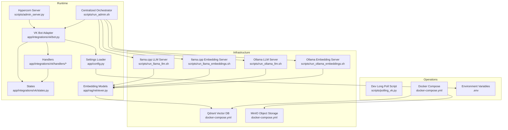
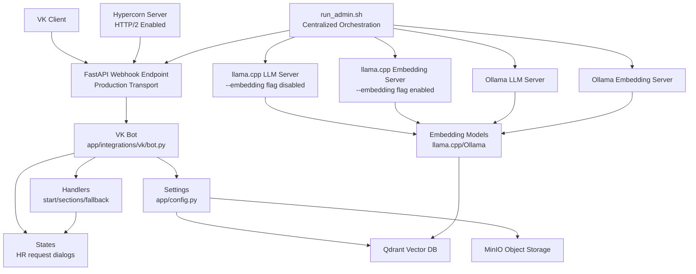
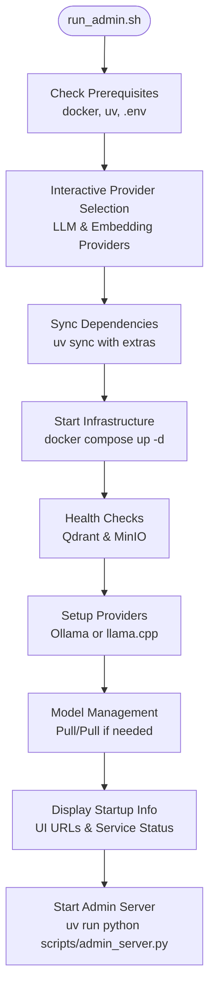
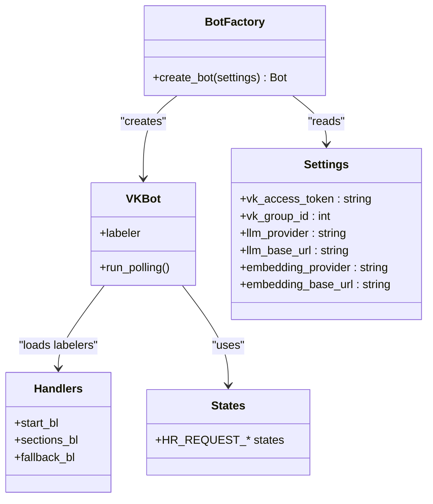
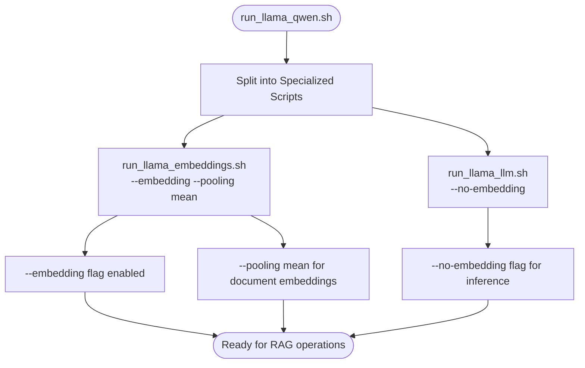
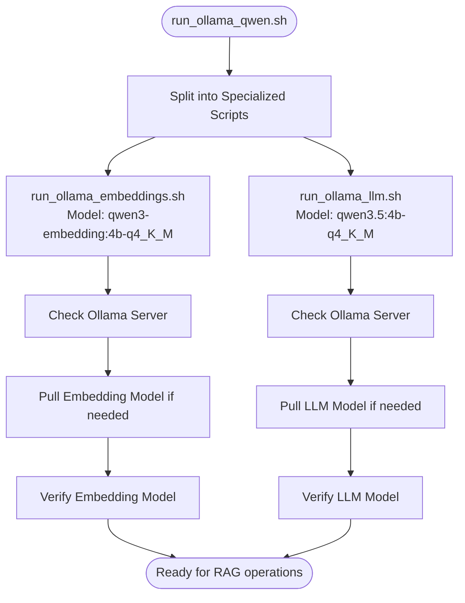
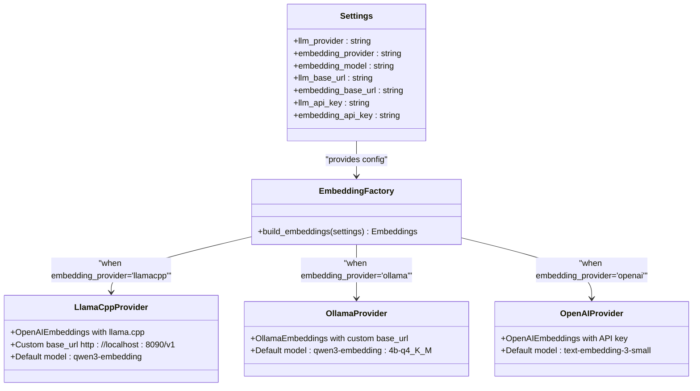
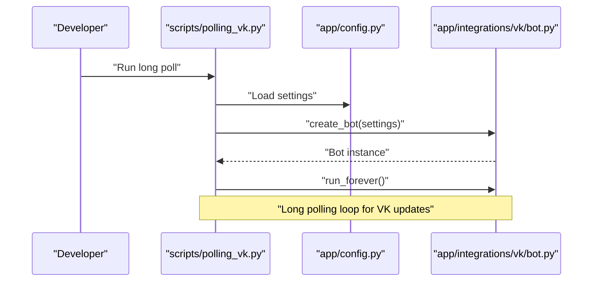
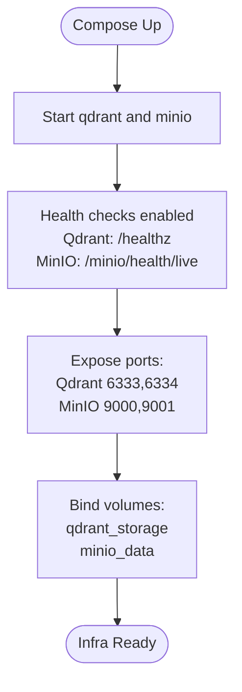
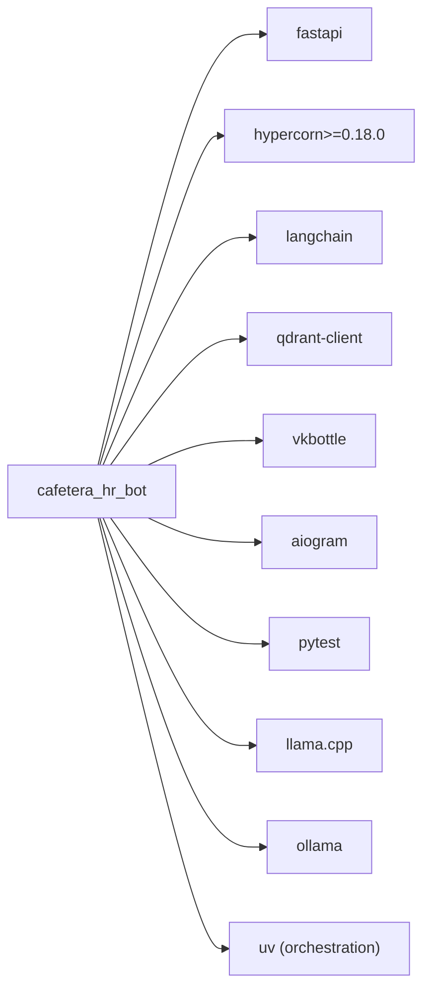

# Deployment and Operations

<cite>
**Referenced Files in This Document**
- [docker-compose.yml](file://docker-compose.yml)
- [pyproject.toml](file://pyproject.toml)
- [app/config.py](file://app/config.py)
- [app/main.py](file://app/main.py)
- [scripts/admin_server.py](file://scripts/admin_server.py)
- [scripts/polling_vk.py](file://scripts/polling_vk.py)
- [scripts/run_admin.sh](file://scripts/run_admin.sh)
- [scripts/run_llama_embeddings.sh](file://scripts/run_llama_embeddings.sh)
- [scripts/run_llama_llm.sh](file://scripts/run_llama_llm.sh)
- [scripts/run_ollama_embeddings.sh](file://scripts/run_ollama_embeddings.sh)
- [scripts/run_ollama_llm.sh](file://scripts/run_ollama_llm.sh)
- [app/integrations/vk/bot.py](file://app/integrations/vk/bot.py)
- [app/integrations/vk/handlers/start.py](file://app/integrations/vk/handlers/start.py)
- [app/integrations/vk/states.py](file://app/integrations/vk/states.py)
- [app/rag/retriever.py](file://app/rag/retriever.py)
- [app/rag/chain.py](file://app/rag/chain.py)
- [app/rag/indexer.py](file://app/rag/indexer.py)
- [app/rag/parser.py](file://app/rag/parser.py)
- [AGENTS.md](file://AGENTS.md)
- [PLAN.md](file://PLAN.md)
</cite>

## Update Summary
**Changes Made**
- Updated to reflect new modular script architecture with run_admin.sh as centralized orchestration script
- Updated llama.cpp and Ollama deployment scripts to specialized components (separate LLM and embeddings scripts)
- Enhanced Docker Compose integration with comprehensive health checking
- Updated embedding model configuration to use 'qwen3-embedding:4b-q4_K_M' default
- Improved provider selection and dependency management through centralized orchestration

## Table of Contents
1. [Introduction](#introduction)
2. [Project Structure](#project-structure)
3. [Core Components](#core-components)
4. [Architecture Overview](#architecture-overview)
5. [Detailed Component Analysis](#detailed-component-analysis)
6. [Dependency Analysis](#dependency-analysis)
7. [Performance Considerations](#performance-considerations)
8. [Monitoring and Logging](#monitoring-and-logging)
9. [Security Considerations](#security-considerations)
10. [Scaling Approaches](#scaling-approaches)
11. [Production Deployment Playbooks](#production-deployment-playbooks)
12. [Troubleshooting Guide](#troubleshooting-guide)
13. [Conclusion](#conclusion)

## Introduction
This document provides comprehensive guidance for deploying and operating cafetera_hr_bot in production. It covers containerized infrastructure using Docker Compose, operational controls for VK bot long-polling versus webhook-based production operation, planned Telegram integration, and future webhook deployment. The system now supports multiple LLM providers including llama.cpp with optimized embedding capabilities crucial for Retrieval-Augmented Generation (RAG) functionality. The production server utilizes Hypercorn with HTTP/2 support, replacing Uvicorn for improved performance and modern protocol support. It also documents monitoring and logging strategies, secrets management, scaling approaches, performance optimization, disaster recovery planning, and practical deployment playbooks.

**Updated**: The system now features a centralized orchestration script (run_admin.sh) that manages all deployment aspects including provider selection, dependency installation, infrastructure provisioning, and service coordination.

## Project Structure
The repository organizes runtime concerns into layered modules with a new centralized orchestration approach:
- Integrations: VK bot adapter and handlers
- Domain: States and navigation helpers
- Config: Pydantic-based settings loader with multiple LLM provider support
- Scripts: Centralized orchestration via run_admin.sh with specialized deployment scripts for individual components
- Infrastructure: Docker Compose services for Qdrant and MinIO with health checking

**Diagram sources**
- [app/integrations/vk/bot.py:1-56](file://app/integrations/vk/bot.py#L1-L56)
- [app/integrations/vk/handlers/start.py:1-55](file://app/integrations/vk/handlers/start.py#L1-L55)
- [app/integrations/vk/states.py:1-14](file://app/integrations/vk/states.py#L1-L14)
- [app/config.py:1-39](file://app/config.py#L1-L39)
- [app/rag/retriever.py:1-103](file://app/rag/retriever.py#L1-L103)
- [scripts/polling_vk.py:1-38](file://scripts/polling_vk.py#L1-L38)
- [scripts/run_llama_embeddings.sh:1-77](file://scripts/run_llama_embeddings.sh#L1-L77)
- [scripts/run_llama_llm.sh:1-75](file://scripts/run_llama_llm.sh#L1-L75)
- [scripts/run_ollama_embeddings.sh:1-73](file://scripts/run_ollama_embeddings.sh#L1-L73)
- [scripts/run_ollama_llm.sh:1-74](file://scripts/run_ollama_llm.sh#L1-L74)
- [docker-compose.yml:1-34](file://docker-compose.yml#L1-L34)
- [scripts/admin_server.py:1-74](file://scripts/admin_server.py#L1-L74)
- [scripts/run_admin.sh:1-386](file://scripts/run_admin.sh#L1-L386)

**Section sources**
- [docker-compose.yml:1-34](file://docker-compose.yml#L1-L34)
- [pyproject.toml:1-62](file://pyproject.toml#L1-L62)
- [app/config.py:1-39](file://app/config.py#L1-L39)
- [scripts/polling_vk.py:1-38](file://scripts/polling_vk.py#L1-L38)
- [scripts/run_llama_embeddings.sh:1-77](file://scripts/run_llama_embeddings.sh#L1-L77)
- [scripts/run_llama_llm.sh:1-75](file://scripts/run_llama_llm.sh#L1-L75)
- [scripts/run_ollama_embeddings.sh:1-73](file://scripts/run_ollama_embeddings.sh#L1-L73)
- [scripts/run_ollama_llm.sh:1-74](file://scripts/run_ollama_llm.sh#L1-L74)
- [app/integrations/vk/bot.py:1-56](file://app/integrations/vk/bot.py#L1-L56)
- [app/integrations/vk/handlers/start.py:1-55](file://app/integrations/vk/handlers/start.py#L1-L55)
- [app/integrations/vk/states.py:1-14](file://app/integrations/vk/states.py#L1-L14)
- [app/rag/retriever.py:1-103](file://app/rag/retriever.py#L1-L103)
- [scripts/admin_server.py:1-74](file://scripts/admin_server.py#L1-L74)
- [scripts/run_admin.sh:1-386](file://scripts/run_admin.sh#L1-L386)
- [AGENTS.md:1-88](file://AGENTS.md#L1-L88)
- [PLAN.md:1-207](file://PLAN.md#L1-L207)

## Core Components
- VK Bot Adapter: Creates a fully wired vkbottle Bot with registered labelers and logging.
- Handlers: Start/main menu/navigation and fallback handlers.
- States: Multi-step dialog states for HR request scenario.
- Config: Pydantic Settings with environment file support and multiple LLM provider configuration.
- Dev Long Poll Script: Local development entry-point for VK bot using long polling.
- Hypercorn Server: Production-grade ASGI server with HTTP/2 support and configurable worker classes.
- Centralized Orchestrator: run_admin.sh manages provider selection, dependency installation, infrastructure provisioning, and service coordination.
- Specialized Deployment Scripts: Separate scripts for LLM and embedding servers for llama.cpp and Ollama providers.
- Modular Infrastructure: Docker Compose services with comprehensive health checking for Qdrant and MinIO.

**Updated**: The centralized orchestrator (run_admin.sh) provides interactive provider selection, automated dependency management, and coordinated service startup for seamless deployment across different LLM providers.

**Section sources**
- [app/integrations/vk/bot.py:24-56](file://app/integrations/vk/bot.py#L24-L56)
- [app/integrations/vk/handlers/start.py:23-55](file://app/integrations/vk/handlers/start.py#L23-L55)
- [app/integrations/vk/states.py:4-14](file://app/integrations/vk/states.py#L4-L14)
- [app/config.py:15-39](file://app/config.py#L15-L39)
- [scripts/polling_vk.py:25-38](file://scripts/polling_vk.py#L25-L38)
- [scripts/admin_server.py:55-68](file://scripts/admin_server.py#L55-L68)
- [scripts/run_llama_embeddings.sh:68-77](file://scripts/run_llama_embeddings.sh#L68-L77)
- [scripts/run_llama_llm.sh:68-75](file://scripts/run_llama_llm.sh#L68-L75)
- [scripts/run_ollama_embeddings.sh:64-73](file://scripts/run_ollama_embeddings.sh#L64-L73)
- [scripts/run_ollama_llm.sh:64-74](file://scripts/run_ollama_llm.sh#L64-L74)
- [scripts/run_admin.sh:100-181](file://scripts/run_admin.sh#L100-L181)
- [AGENTS.md:16-18](file://AGENTS.md#L16-L18)
- [PLAN.md:132-135](file://PLAN.md#L132-L135)

## Architecture Overview
The system runs a VK bot with optional RAG capabilities backed by Qdrant and MinIO. The RAG system supports multiple embedding providers including llama.cpp with optimized server flags for document embedding tasks. In production, the VK bot operates via FastAPI webhook transport with Hypercorn server supporting HTTP/2; long polling is for local development only. The centralized orchestrator manages all deployment aspects and provider-specific configurations.

**Updated**: The architecture now features modular deployment scripts that separate LLM and embedding server responsibilities, enabling more flexible and maintainable deployment configurations.

**Diagram sources**
- [app/integrations/vk/bot.py:24-56](file://app/integrations/vk/bot.py#L24-L56)
- [app/integrations/vk/handlers/start.py:23-55](file://app/integrations/vk/handlers/start.py#L23-L55)
- [app/integrations/vk/states.py:4-14](file://app/integrations/vk/states.py#L4-L14)
- [app/config.py:15-39](file://app/config.py#L15-L39)
- [docker-compose.yml:2-34](file://docker-compose.yml#L2-L34)
- [scripts/run_llama_embeddings.sh:68-77](file://scripts/run_llama_embeddings.sh#L68-L77)
- [scripts/run_llama_llm.sh:68-75](file://scripts/run_llama_llm.sh#L68-L75)
- [app/rag/retriever.py:22-62](file://app/rag/retriever.py#L22-L62)
- [scripts/admin_server.py:55-68](file://scripts/admin_server.py#L55-L68)
- [scripts/run_admin.sh:223-356](file://scripts/run_admin.sh#L223-L356)

**Section sources**
- [AGENTS.md:16-18](file://AGENTS.md#L16-L18)
- [PLAN.md:132-135](file://PLAN.md#L132-L135)
- [docker-compose.yml:2-34](file://docker-compose.yml#L2-L34)
- [scripts/run_llama_embeddings.sh:68-77](file://scripts/run_llama_embeddings.sh#L68-L77)
- [scripts/run_llama_llm.sh:68-75](file://scripts/run_llama_llm.sh#L68-L75)
- [app/rag/retriever.py:22-62](file://app/rag/retriever.py#L22-L62)
- [scripts/admin_server.py:55-68](file://scripts/admin_server.py#L55-L68)
- [scripts/run_admin.sh:223-356](file://scripts/run_admin.sh#L223-L356)

## Detailed Component Analysis

### Centralized Orchestrator and Provider Management
The run_admin.sh script serves as the central orchestration point, providing interactive provider selection, automated dependency management, and coordinated service startup.

**Diagram sources**
- [scripts/run_admin.sh:69-98](file://scripts/run_admin.sh#L69-L98)
- [scripts/run_admin.sh:100-181](file://scripts/run_admin.sh#L100-L181)
- [scripts/run_admin.sh:183-200](file://scripts/run_admin.sh#L183-L200)
- [scripts/run_admin.sh:202-221](file://scripts/run_admin.sh#L202-L221)
- [scripts/run_admin.sh:223-356](file://scripts/run_admin.sh#L223-L356)
- [scripts/run_admin.sh:365-385](file://scripts/run_admin.sh#L365-L385)

**Section sources**
- [scripts/run_admin.sh:1-386](file://scripts/run_admin.sh#L1-L386)

### VK Bot Factory and Handler Registration
The VK bot factory constructs a Bot instance and loads labelers in a specific order to ensure the fallback handler captures unmatched messages last.

**Diagram sources**
- [app/integrations/vk/bot.py:24-56](file://app/integrations/vk/bot.py#L24-L56)
- [app/integrations/vk/handlers/start.py:12-55](file://app/integrations/vk/handlers/start.py#L12-L55)
- [app/integrations/vk/states.py:4-14](file://app/integrations/vk/states.py#L4-L14)
- [app/config.py:15-39](file://app/config.py#L15-L39)

**Section sources**
- [app/integrations/vk/bot.py:14-56](file://app/integrations/vk/bot.py#L14-L56)
- [app/integrations/vk/handlers/start.py:12-55](file://app/integrations/vk/handlers/start.py#L12-L55)
- [app/integrations/vk/states.py:4-14](file://app/integrations/vk/states.py#L4-L14)
- [app/config.py:15-39](file://app/config.py#L15-L39)

### Hypercorn Server Configuration and HTTP/2 Support
The production server uses Hypercorn with HTTP/2 support, providing improved performance and modern protocol features compared to Uvicorn.

**Diagram sources**
- [scripts/admin_server.py:28-68](file://scripts/admin_server.py#L28-L68)

**Section sources**
- [scripts/admin_server.py:1-74](file://scripts/admin_server.py#L1-L74)

### Modular Llama.cpp Deployment Architecture
The llama.cpp deployment now uses specialized scripts for LLM and embedding servers, each with optimized configurations for their specific roles.

**Diagram sources**
- [scripts/run_llama_qwen.sh:1-11](file://scripts/run_llama_qwen.sh#L1-L11)
- [scripts/run_llama_embeddings.sh:68-77](file://scripts/run_llama_embeddings.sh#L68-L77)
- [scripts/run_llama_llm.sh:68-75](file://scripts/run_llama_llm.sh#L68-L75)

**Section sources**
- [scripts/run_llama_qwen.sh:1-11](file://scripts/run_llama_qwen.sh#L1-L11)
- [scripts/run_llama_embeddings.sh:1-77](file://scripts/run_llama_embeddings.sh#L1-L77)
- [scripts/run_llama_llm.sh:1-75](file://scripts/run_llama_llm.sh#L1-L75)

### Modular Ollama Deployment Architecture
The Ollama deployment uses specialized scripts for LLM and embedding servers, with automatic model management and verification.

**Diagram sources**
- [scripts/run_ollama_qwen.sh:1-11](file://scripts/run_ollama_qwen.sh#L1-L11)
- [scripts/run_ollama_embeddings.sh:54-61](file://scripts/run_ollama_embeddings.sh#L54-L61)
- [scripts/run_ollama_llm.sh:54-61](file://scripts/run_ollama_llm.sh#L54-L61)

**Section sources**
- [scripts/run_ollama_qwen.sh:1-11](file://scripts/run_ollama_qwen.sh#L1-L11)
- [scripts/run_ollama_embeddings.sh:1-73](file://scripts/run_ollama_embeddings.sh#L1-L73)
- [scripts/run_ollama_llm.sh:1-74](file://scripts/run_ollama_llm.sh#L1-L74)

### LLM Provider Configuration and Embedding Selection
The system supports multiple LLM providers with automatic embedding model selection based on configuration. The default embedding model is now 'qwen3-embedding:4b-q4_K_M'.

**Diagram sources**
- [app/config.py:15-39](file://app/config.py#L15-L39)
- [app/rag/retriever.py:22-62](file://app/rag/retriever.py#L22-L62)

**Section sources**
- [app/config.py:15-39](file://app/config.py#L15-L39)
- [app/rag/retriever.py:22-62](file://app/rag/retriever.py#L22-L62)

### VK Long Polling Development Flow
Local development uses a script that loads settings and starts the VK bot in long-polling mode.

**Diagram sources**
- [scripts/polling_vk.py:25-38](file://scripts/polling_vk.py#L25-L38)
- [app/config.py:15-39](file://app/config.py#L15-L39)
- [app/integrations/vk/bot.py:24-56](file://app/integrations/vk/bot.py#L24-L56)

**Section sources**
- [scripts/polling_vk.py:1-38](file://scripts/polling_vk.py#L1-L38)
- [app/config.py:15-39](file://app/config.py#L15-L39)
- [app/integrations/vk/bot.py:24-56](file://app/integrations/vk/bot.py#L24-L56)

### Enhanced Containerized Infrastructure Setup
Docker Compose provisions Qdrant and MinIO with comprehensive health checks and persistent volumes.

**Diagram sources**
- [docker-compose.yml:2-34](file://docker-compose.yml#L2-L34)

**Section sources**
- [docker-compose.yml:1-34](file://docker-compose.yml#L1-L34)

## Dependency Analysis
External dependencies include FastAPI, Hypercorn, LangChain stack, Qdrant client, VK and Telegram adapters, and testing tools. Optional extras enable Ollama or OpenAI-compatible LLMs. The system now supports llama.cpp with optimized embedding server flags and uses Hypercorn as the production ASGI server instead of Uvicorn.

**Updated**: The centralized orchestrator manages dependency installation through uv sync with provider-specific extras, eliminating manual dependency management complexity.

**Diagram sources**
- [pyproject.toml:7-29](file://pyproject.toml#L7-L29)

**Section sources**
- [pyproject.toml:1-62](file://pyproject.toml#L1-L62)

## Performance Considerations
- Use production-grade webhook transport instead of long polling to reduce resource overhead and latency.
- Tune Qdrant shard and index parameters for retrieval performance; monitor vector search latency.
- Use MinIO in-cluster for low-latency document ingestion and retrieval.
- Enable FastAPI lifespan initialization for shared resources to avoid cold-starts during requests.
- Apply async I/O patterns and keep handler logic lightweight to maximize throughput.
- **Updated**: Configure Hypercorn with HTTP/2 support and adjustable max concurrent streams (default: 100) for improved connection multiplexing and reduced latency.
- **Updated**: Use asyncio worker class for better performance with HTTP/2 multiplexing capabilities.
- **Updated**: Monitor HTTP/2 connection metrics including stream concurrency, connection reuse, and multiplexing efficiency.
- **Updated**: The modular llama.cpp deployment allows separate optimization of LLM inference and embedding servers for better resource utilization.
- **Updated**: Enhanced Docker Compose health checking ensures reliable infrastructure provisioning and faster failure detection.
- **Updated**: Centralized orchestrator provides optimized startup sequences and dependency management for improved deployment performance.

## Monitoring and Logging
- Logging: Configure structured logging at INFO level for operational visibility. Use consistent log formatting and include correlation IDs where applicable.
- Health checks: Leverage Qdrant's health endpoint and MinIO console for availability monitoring.
- Metrics: Expose Prometheus metrics via FastAPI middleware and scrape with Prometheus.
- Alerting: Forward logs to centralized logging (e.g., ELK or Loki) and set alerts for error spikes and slow response times.
- Log rotation: Use OS-native log rotation (logrotate) or container logging drivers with size/time limits.
- **Updated**: Monitor Hypercorn HTTP/2 performance metrics including active connections, concurrent streams, and connection pooling efficiency.
- **Updated**: Track HTTP/2 stream statistics and connection reuse rates to optimize server configuration.
- **Updated**: Monitor llama.cpp embedding server performance including memory usage, GPU utilization, and embedding throughput for RAG operations.
- **Updated**: The centralized orchestrator provides comprehensive service status monitoring and automated cleanup on shutdown.

## Security Considerations
- Secrets management: Store all secrets in environment variables managed by pydantic-settings. Provide a template file with placeholders (.env.example) and never commit secrets.
- VK webhook security: Use secret and confirmation tokens; validate signatures and enforce HTTPS for webhook URLs.
- Network exposure: Restrict port exposure to internal networks; use reverse proxies with TLS termination.
- Least privilege: Run containers with non-root users and minimal capabilities; mount volumes with appropriate permissions.
- Backup and audit: Regularly snapshot Qdrant and MinIO; maintain audit trails for sensitive operations.
- **Updated**: Secure Hypercorn server with proper TLS configuration and HTTP/2 security headers for production deployments.
- **Updated**: Monitor HTTP/2 connections for security compliance and detect potential abuse patterns.
- **Updated**: Secure llama.cpp embedding server with proper network isolation and access controls for production deployments.
- **Updated**: The centralized orchestrator enforces ADMIN_API_KEY requirement and provides secure service coordination.

## Scaling Approaches
- Horizontal scaling: Run multiple replicas behind a load balancer; ensure stateless workers and shared storage/backends.
- Vertical scaling: Increase CPU/RAM for replicas and tune Qdrant shards and MinIO resources.
- Queueing: Offload heavy tasks (document ingestion) to background workers with retry policies.
- Caching: Cache frequently accessed KB articles and bot responses to reduce LLM calls.
- **Updated**: Scale Hypercorn instances horizontally for HTTP/2 multiplexing benefits; monitor stream concurrency across instances.
- **Updated**: Configure appropriate h2_max_concurrent_streams values based on workload characteristics and available resources.
- **Updated**: Scale llama.cpp embedding server horizontally if embedding workload exceeds single instance capacity; monitor embedding queue depth and processing latency.
- **Updated**: The modular deployment architecture enables independent scaling of LLM and embedding services based on workload characteristics.

## Production Deployment Playbooks

### Deploying VK Bot with Webhooks
- Prepare environment variables for VK webhook (tokens, confirmation, and webhook URL).
- Build and run the FastAPI service with Hypercorn in production mode.
- Configure reverse proxy (nginx/caddy) with TLS and rate limiting.
- Register VK webhook endpoint and confirm subscription.

**Section sources**
- [AGENTS.md:16-18](file://AGENTS.md#L16-L18)
- [PLAN.md:132-135](file://PLAN.md#L132-L135)

### Running Qdrant and MinIO in Docker
- Use the provided compose file to start services with health checks and persistent volumes.
- Secure MinIO with strong credentials and restrict network access.
- Monitor Qdrant disk usage and configure backups.

**Section sources**
- [docker-compose.yml:1-34](file://docker-compose.yml#L1-L34)

### Managing Secrets and Configuration
- Define canonical settings fields and load from .env using pydantic-settings.
- Provide .env.example with placeholders; never commit real secrets.
- Rotate secrets regularly and invalidate old keys after migration.
- **Updated**: Configure llamacpp provider settings including llm_provider='llamacpp', llm_base_url='http://localhost:8080', and embedding_model='qwen3-embedding'.
- **Updated**: Set up Hypercorn configuration with appropriate worker class and HTTP/2 settings for production deployment.
- **Updated**: The centralized orchestrator manages provider-specific configurations and ensures proper model setup.

**Section sources**
- [app/config.py:15-39](file://app/config.py#L15-L39)
- [AGENTS.md:20-50](file://AGENTS.md#L20-L50)
- [scripts/admin_server.py:55-68](file://scripts/admin_server.py#L55-L68)
- [scripts/run_admin.sh:100-181](file://scripts/run_admin.sh#L100-L181)

### Handling Operational Tasks
- Log rotation: Configure logrotate or container logging driver with max-size and max-file.
- Backups: Snapshot Qdrant storage and MinIO buckets; automate and test restore procedures.
- Maintenance windows: Schedule updates during low-traffic periods; use blue/green deployments.
- **Updated**: Monitor and manage Hypercorn server lifecycle, including automatic restarts, HTTP/2 connection monitoring, and worker class optimization.
- **Updated**: Monitor and manage llama.cpp embedding server lifecycle, including automatic restarts and resource monitoring.
- **Updated**: The centralized orchestrator provides automated cleanup and graceful shutdown procedures.

### Centralized Orchestrator Deployment
- Install prerequisites: Docker, uv, and Python 3.11+.
- Configure .env file with required settings including ADMIN_API_KEY.
- Run the centralized orchestrator: `./scripts/run_admin.sh`.
- The orchestrator will handle provider selection, dependency management, infrastructure provisioning, and service coordination.

**Section sources**
- [scripts/run_admin.sh:69-98](file://scripts/run_admin.sh#L69-L98)
- [scripts/run_admin.sh:183-200](file://scripts/run_admin.sh#L183-L200)
- [scripts/run_admin.sh:202-221](file://scripts/run_admin.sh#L202-L221)
- [scripts/run_admin.sh:365-385](file://scripts/run_admin.sh#L365-L385)

### Hypercorn Server Configuration
- Install Hypercorn as the production ASGI server (version >= 0.18.0).
- Configure worker class as "asyncio" for optimal HTTP/2 performance.
- Set h2_max_concurrent_streams to control HTTP/2 stream concurrency (default: 100).
- Use asyncio event loop for better performance with HTTP/2 multiplexing.
- Monitor server performance and adjust configuration based on workload characteristics.

**Section sources**
- [pyproject.toml:9](file://pyproject.toml#L9)
- [scripts/admin_server.py:55-68](file://scripts/admin_server.py#L55-L68)

### Modular Llama.cpp Deployment
- Install llama.cpp and ensure llama-server binary is available in PATH.
- Use specialized scripts for LLM and embedding servers:
  - LLM inference: `./scripts/run_llama_llm.sh`
  - Embedding: `./scripts/run_llama_embeddings.sh`
- Configure HOST, PORT, CTX_SIZE, N_GPU_LAYERS, and THREADS environment variables as needed.
- Start servers with optimized flags for their specific roles.

**Section sources**
- [scripts/run_llama_llm.sh:1-75](file://scripts/run_llama_llm.sh#L1-L75)
- [scripts/run_llama_embeddings.sh:1-77](file://scripts/run_llama_embeddings.sh#L1-L77)

### Modular Ollama Deployment
- Install Ollama and ensure it's available in PATH.
- Use specialized scripts for LLM and embedding servers:
  - LLM inference: `./scripts/run_ollama_llm.sh`
  - Embedding: `./scripts/run_ollama_embeddings.sh`
- The scripts automatically handle model pulling and verification.
- Configure OLLAMA_HOST environment variable if using a different host/port.

**Section sources**
- [scripts/run_ollama_llm.sh:1-74](file://scripts/run_ollama_llm.sh#L1-L74)
- [scripts/run_ollama_embeddings.sh:1-73](file://scripts/run_ollama_embeddings.sh#L1-L73)

## Troubleshooting Guide
- VK webhook not responding:
  - Verify secret and confirmation tokens match VK settings.
  - Confirm HTTPS endpoint is reachable and TLS certificate is valid.
  - Check FastAPI logs for incoming webhook events and error responses.
- Long polling fails locally:
  - Ensure VK access token is set in environment.
  - Confirm script runs from project root and imports are resolvable.
- Qdrant or MinIO unhealthy:
  - Review health check endpoints and logs.
  - Check volume mounts and disk space.
- Slow responses:
  - Profile vector search and LLM calls; optimize prompts and chunk sizes.
- **Updated**: Hypercorn HTTP/2 connection issues:
  - Verify Hypercorn version >= 0.18.0 is installed.
  - Check worker class configuration (should be "asyncio").
  - Monitor h2_max_concurrent_streams setting for optimal performance.
  - Review HTTP/2 connection logs for protocol-level errors.
- **Updated**: Llama.cpp embedding server issues:
  - Verify llama-server binary is available in PATH.
  - Check model file exists at specified MODEL_PATH or default location.
  - Monitor server logs for embedding initialization errors.
  - Ensure sufficient memory allocation for embedding operations.
  - Verify --embedding and --pooling mean flags are properly configured.
- **Updated**: Centralized orchestrator issues:
  - Check prerequisite installation (docker, uv).
  - Verify .env file exists and contains required settings.
  - Review orchestrator logs for detailed error messages.
  - Ensure proper provider selection and dependency installation.
- **Updated**: Provider-specific deployment issues:
  - For Ollama: Verify server is running and models are properly pulled.
  - For llama.cpp: Check model file downloads and server startup logs.
  - Ensure separate LLM and embedding servers are properly configured.

**Section sources**
- [scripts/polling_vk.py:17-38](file://scripts/polling_vk.py#L17-L38)
- [docker-compose.yml:11-16](file://docker-compose.yml#L11-L16)
- [AGENTS.md:16-18](file://AGENTS.md#L16-L18)
- [scripts/run_llama_embeddings.sh:33-57](file://scripts/run_llama_embeddings.sh#L33-L57)
- [scripts/run_ollama_embeddings.sh:26-52](file://scripts/run_ollama_embeddings.sh#L26-L52)
- [scripts/admin_server.py:55-68](file://scripts/admin_server.py#L55-L68)
- [scripts/run_admin.sh:69-98](file://scripts/run_admin.sh#L69-L98)

## Conclusion
cafetera_hr_bot is designed for production-grade operations with a clear separation between VK bot orchestration, RAG infrastructure, and storage. The system now features a centralized orchestration approach through run_admin.sh that manages provider selection, dependency installation, infrastructure provisioning, and service coordination. The system supports multiple LLM providers including llama.cpp with optimized embedding capabilities for enhanced RAG functionality. The production server utilizes Hypercorn with HTTP/2 support, providing improved performance and modern protocol features compared to traditional ASGI servers. The modular deployment architecture enables flexible and maintainable configurations for different provider setups. By adopting webhook-based transport, securing secrets, monitoring health, implementing robust scaling and backup strategies, properly managing the llama.cpp embedding server, and optimizing Hypercorn HTTP/2 configuration, teams can operate the bot reliably in production while preparing for future Telegram integration and advanced webhook deployments.

**Updated**: The centralized orchestrator significantly simplifies deployment complexity, automates provider-specific configurations, and provides comprehensive service management capabilities for reliable production operations.