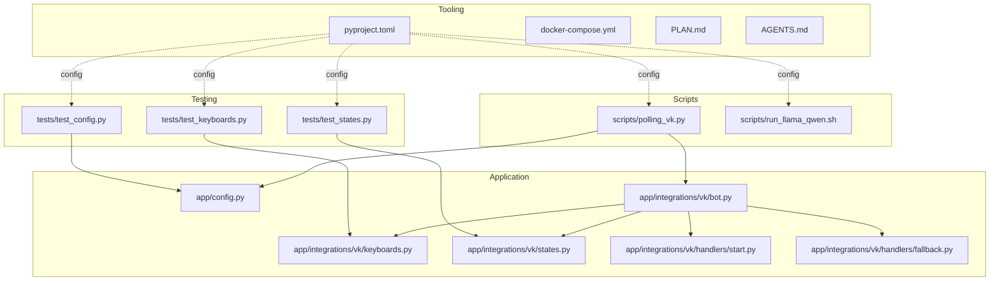
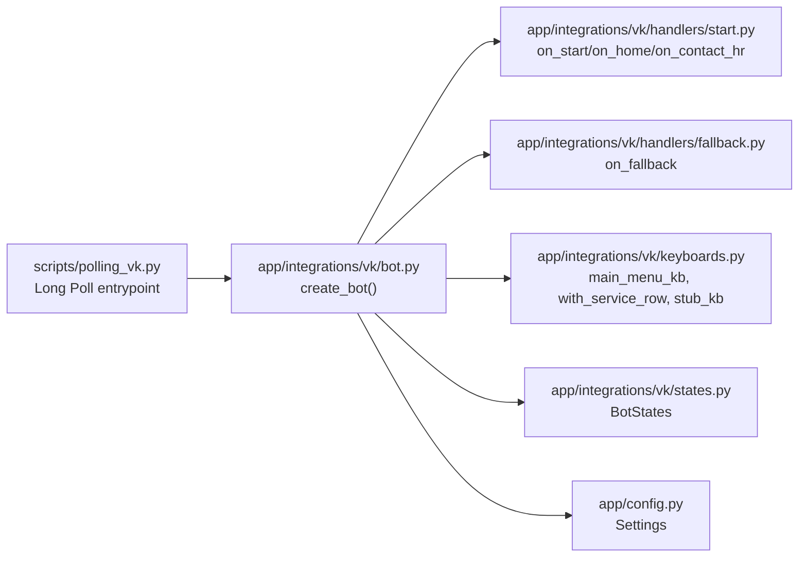
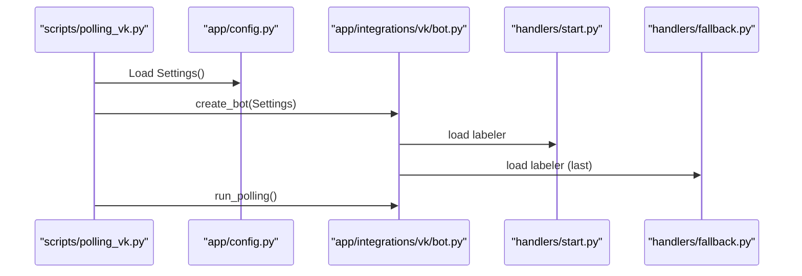
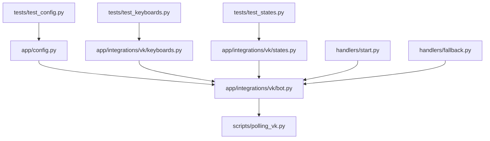

# Development Workflow

<cite>
**Referenced Files in This Document**
- [pyproject.toml](file://pyproject.toml)
- [docker-compose.yml](file://docker-compose.yml)
- [PLAN.md](file://PLAN.md)
- [AGENTS.md](file://AGENTS.md)
- [app/config.py](file://app/config.py)
- [app/integrations/vk/bot.py](file://app/integrations/vk/bot.py)
- [app/integrations/vk/keyboards.py](file://app/integrations/vk/keyboards.py)
- [app/integrations/vk/states.py](file://app/integrations/vk/states.py)
- [app/integrations/vk/handlers/start.py](file://app/integrations/vk/handlers/start.py)
- [app/integrations/vk/handlers/fallback.py](file://app/integrations/vk/handlers/fallback.py)
- [scripts/polling_vk.py](file://scripts/polling_vk.py)
- [scripts/run_llama_qwen.sh](file://scripts/run_llama_qwen.sh)
- [tests/test_config.py](file://tests/test_config.py)
- [tests/test_keyboards.py](file://tests/test_keyboards.py)
- [tests/test_states.py](file://tests/test_states.py)
</cite>

## Table of Contents
1. [Introduction](#introduction)
2. [Project Structure](#project-structure)
3. [Core Components](#core-components)
4. [Architecture Overview](#architecture-overview)
5. [Detailed Component Analysis](#detailed-component-analysis)
6. [Dependency Analysis](#dependency-analysis)
7. [Performance Considerations](#performance-considerations)
8. [Troubleshooting Guide](#troubleshooting-guide)
9. [Conclusion](#conclusion)
10. [Appendices](#appendices)

## Introduction
This document describes the development workflow and best practices for cafetera_hr_bot. It covers environment setup, code quality tools (Ruff, MyPy), testing procedures, validation commands, and code review guidelines. It also documents development standards, commit conventions, and contribution workflow, with practical examples for local development, running checks, executing tests, and preparing changes for review. Debugging techniques, performance profiling, and maintaining code quality throughout the lifecycle are addressed.

## Project Structure
The repository follows a layered structure:
- app/: Application code organized by domain and integrations
- app/config.py: Pydantic settings loader
- app/integrations/vk/: VK bot implementation (handlers, keyboards, states, bot factory)
- scripts/: Local development and auxiliary scripts
- tests/: Unit tests for configuration, keyboards, states, and bot factory
- pyproject.toml: Project metadata, dependencies, dev tool configuration
- docker-compose.yml: Local infrastructure (Qdrant, MinIO)
- PLAN.md: Development plan and acceptance criteria
- AGENTS.md: Coding standards, validation commands, and contribution workflow

**Diagram sources**
- [app/config.py:1-9](file://app/config.py#L1-L9)
- [app/integrations/vk/bot.py:1-32](file://app/integrations/vk/bot.py#L1-L32)
- [app/integrations/vk/keyboards.py:1-108](file://app/integrations/vk/keyboards.py#L1-L108)
- [app/integrations/vk/states.py:1-14](file://app/integrations/vk/states.py#L1-L14)
- [app/integrations/vk/handlers/start.py:1-55](file://app/integrations/vk/handlers/start.py#L1-L55)
- [app/integrations/vk/handlers/fallback.py:1-18](file://app/integrations/vk/handlers/fallback.py#L1-L18)
- [scripts/polling_vk.py:1-33](file://scripts/polling_vk.py#L1-L33)
- [scripts/run_llama_qwen.sh:1-59](file://scripts/run_llama_qwen.sh#L1-L59)
- [tests/test_config.py:1-28](file://tests/test_config.py#L1-L28)
- [tests/test_keyboards.py:1-192](file://tests/test_keyboards.py#L1-L192)
- [tests/test_states.py:1-31](file://tests/test_states.py#L1-L31)
- [pyproject.toml:1-56](file://pyproject.toml#L1-L56)
- [docker-compose.yml:1-34](file://docker-compose.yml#L1-L34)

**Section sources**
- [pyproject.toml:1-56](file://pyproject.toml#L1-L56)
- [docker-compose.yml:1-34](file://docker-compose.yml#L1-L34)
- [PLAN.md:1-207](file://PLAN.md#L1-L207)
- [AGENTS.md:1-95](file://AGENTS.md#L1-L95)

## Core Components
- Settings loader: Loads environment variables into a typed Settings model for VK and related integrations.
- VK bot factory: Creates a vkbottle Bot, registers labelers in order, and prepares it for long polling or callbacks.
- Keyboard builders: Provide standardized keyboards and service buttons (Back/Home/Contact HR) used across screens.
- States: Multi-step dialog states for HR request flow.
- Handlers: Start/home navigation and fallback for unmatched text.
- Scripts: Local VK long polling entrypoint and optional local LLM server runner.
- Tests: Configuration defaults/env, keyboard layout and payload correctness, and state enumeration.

**Section sources**
- [app/config.py:1-9](file://app/config.py#L1-L9)
- [app/integrations/vk/bot.py:1-32](file://app/integrations/vk/bot.py#L1-L32)
- [app/integrations/vk/keyboards.py:1-108](file://app/integrations/vk/keyboards.py#L1-L108)
- [app/integrations/vk/states.py:1-14](file://app/integrations/vk/states.py#L1-L14)
- [app/integrations/vk/handlers/start.py:1-55](file://app/integrations/vk/handlers/start.py#L1-L55)
- [app/integrations/vk/handlers/fallback.py:1-18](file://app/integrations/vk/handlers/fallback.py#L1-L18)
- [scripts/polling_vk.py:1-33](file://scripts/polling_vk.py#L1-L33)
- [scripts/run_llama_qwen.sh:1-59](file://scripts/run_llama_qwen.sh#L1-L59)
- [tests/test_config.py:1-28](file://tests/test_config.py#L1-L28)
- [tests/test_keyboards.py:1-192](file://tests/test_keyboards.py#L1-L192)
- [tests/test_states.py:1-31](file://tests/test_states.py#L1-L31)

## Architecture Overview
The VK integration is structured around a bot factory that loads labelers in a specific order. Handlers are registered top-down, with the fallback labeler last to catch unmatched messages. Keyboard builders centralize UX patterns and service actions. States manage multi-step dialogs.

**Diagram sources**
- [scripts/polling_vk.py:1-33](file://scripts/polling_vk.py#L1-L33)
- [app/integrations/vk/bot.py:1-32](file://app/integrations/vk/bot.py#L1-L32)
- [app/integrations/vk/handlers/start.py:1-55](file://app/integrations/vk/handlers/start.py#L1-L55)
- [app/integrations/vk/handlers/fallback.py:1-18](file://app/integrations/vk/handlers/fallback.py#L1-L18)
- [app/integrations/vk/keyboards.py:1-108](file://app/integrations/vk/keyboards.py#L1-L108)
- [app/integrations/vk/states.py:1-14](file://app/integrations/vk/states.py#L1-L14)
- [app/config.py:1-9](file://app/config.py#L1-L9)

## Detailed Component Analysis

### Settings and Environment
- Settings class loads environment variables with UTF-8 encoding and supports VK tokens and group ID.
- AGENTS.md specifies environment variable names and constraints for VK, Telegram (post-MVP), RAG, and storage.

Best practices:
- Use pydantic-settings for type-safe configuration.
- Provide .env.example with placeholders; never hardcode secrets.
- Validate required keys during startup.

**Section sources**
- [app/config.py:1-9](file://app/config.py#L1-L9)
- [AGENTS.md:20-48](file://AGENTS.md#L20-L48)

### VK Bot Factory
- create_bot registers labelers in order: start, sections, fallback (last).
- Logging indicates successful handler registration.

**Diagram sources**
- [scripts/polling_vk.py:24-28](file://scripts/polling_vk.py#L24-L28)
- [app/config.py:4-9](file://app/config.py#L4-L9)
- [app/integrations/vk/bot.py:23-31](file://app/integrations/vk/bot.py#L23-L31)
- [app/integrations/vk/handlers/start.py:31-41](file://app/integrations/vk/handlers/start.py#L31-L41)
- [app/integrations/vk/handlers/fallback.py:15-17](file://app/integrations/vk/handlers/fallback.py#L15-L17)

**Section sources**
- [app/integrations/vk/bot.py:14-31](file://app/integrations/vk/bot.py#L14-L31)
- [scripts/polling_vk.py:24-28](file://scripts/polling_vk.py#L24-L28)

### Keyboard Builders and Payloads
- Payload constants define navigation commands.
- with_service_row adds Back/Home/Contact HR buttons consistently.
- main_menu_kb builds the primary menu with seven functional sections plus Contact HR.
- stub_kb provides minimal keyboard with service row.

Validation focuses on:
- Number of rows/buttons
- Presence of expected payloads
- Service-row visibility controls
- Inline/one-time flags
- Payload shape and uniqueness

**Section sources**
- [app/integrations/vk/keyboards.py:11-108](file://app/integrations/vk/keyboards.py#L11-L108)
- [tests/test_keyboards.py:49-150](file://tests/test_keyboards.py#L49-L150)

### States for Multi-Step Dialogs
- BotStates enumerates six HR-request states for a structured dialog.
- Tests verify subclassing, uniqueness, and presence of expected state names.

**Section sources**
- [app/integrations/vk/states.py:4-14](file://app/integrations/vk/states.py#L4-L14)
- [tests/test_states.py:8-30](file://tests/test_states.py#L8-L30)

### Handlers: Start, Home, and Fallback
- Start handler responds to /start and Home payload with the main menu.
- Fallback handler answers unmatched text with a guided prompt and main menu.

**Section sources**
- [app/integrations/vk/handlers/start.py:23-54](file://app/integrations/vk/handlers/start.py#L23-L54)
- [app/integrations/vk/handlers/fallback.py:9-17](file://app/integrations/vk/handlers/fallback.py#L9-L17)

### Testing Procedures
- pytest configuration runs tests under tests/ with asyncio mode enabled.
- Tests cover Settings defaults/env, keyboard layouts, and state enumeration.

Recommended test coverage:
- Handler logic for each section
- State transitions and persistence
- Keyboard rendering and payload correctness
- Integration with Settings and bot wiring

**Section sources**
- [pyproject.toml:40-42](file://pyproject.toml#L40-L42)
- [tests/test_config.py:6-27](file://tests/test_config.py#L6-L27)
- [tests/test_keyboards.py:49-191](file://tests/test_keyboards.py#L49-L191)
- [tests/test_states.py:8-30](file://tests/test_states.py#L8-L30)

### Code Quality Tools: Ruff and MyPy
- Ruff configuration enforces style and lint rules with a line length limit and target Python version.
- MyPy configuration sets Python version and strictness flags.

Validation commands:
- Run linter and type checker before review per AGENTS.md.

**Section sources**
- [pyproject.toml:44-56](file://pyproject.toml#L44-L56)
- [AGENTS.md:82-88](file://AGENTS.md#L82-L88)

### Local Infrastructure: Docker Compose
- Qdrant and MinIO services are defined with healthchecks and persistent volumes.
- Useful for local RAG ingestion and storage testing.

**Section sources**
- [docker-compose.yml:1-34](file://docker-compose.yml#L1-L34)

### Optional Local LLM Server
- run_llama_qwen.sh starts llama.cpp’s llama-server with configurable model path, host, port, context size, threads, and GPU layers.

**Section sources**
- [scripts/run_llama_qwen.sh:1-59](file://scripts/run_llama_qwen.sh#L1-L59)

## Dependency Analysis
- The VK bot depends on Settings for credentials and on keyboard/state modules for UX and state machine.
- Handlers depend on keyboard builders for consistent UI.
- Tests depend on the module under test and vkbottle Keyboard type.

**Diagram sources**
- [app/config.py:4-9](file://app/config.py#L4-L9)
- [app/integrations/vk/bot.py:23-31](file://app/integrations/vk/bot.py#L23-L31)
- [app/integrations/vk/keyboards.py:56-98](file://app/integrations/vk/keyboards.py#L56-L98)
- [app/integrations/vk/states.py:4-14](file://app/integrations/vk/states.py#L4-L14)
- [app/integrations/vk/handlers/start.py:31-41](file://app/integrations/vk/handlers/start.py#L31-L41)
- [app/integrations/vk/handlers/fallback.py:15-17](file://app/integrations/vk/handlers/fallback.py#L15-L17)
- [scripts/polling_vk.py:24-28](file://scripts/polling_vk.py#L24-L28)
- [tests/test_config.py:7-13](file://tests/test_config.py#L7-L13)
- [tests/test_keyboards.py:8-21](file://tests/test_keyboards.py#L8-L21)
- [tests/test_states.py:5-10](file://tests/test_states.py#L5-L10)

**Section sources**
- [app/integrations/vk/bot.py:14-31](file://app/integrations/vk/bot.py#L14-L31)
- [app/integrations/vk/keyboards.py:29-50](file://app/integrations/vk/keyboards.py#L29-L50)
- [app/integrations/vk/states.py:4-14](file://app/integrations/vk/states.py#L4-L14)
- [app/integrations/vk/handlers/start.py:31-41](file://app/integrations/vk/handlers/start.py#L31-L41)
- [app/integrations/vk/handlers/fallback.py:15-17](file://app/integrations/vk/handlers/fallback.py#L15-L17)

## Performance Considerations
- Keep handler logic synchronous where possible; defer heavy work to background tasks.
- Minimize keyboard rebuilds; reuse keyboard instances where safe.
- Use stateless helpers for pure transformations to improve cacheability.
- Profile async bottlenecks using Python’s async profiler and monitor network latency to VK and external APIs.

[No sources needed since this section provides general guidance]

## Troubleshooting Guide
Common issues and remedies:
- Missing VK credentials: Ensure environment variables are set and Settings loads them correctly.
- Handler not triggered: Verify labeler registration order and payload matching.
- Keyboard mismatch: Validate payload shapes and service-row additions.
- Type-check failures: Align function signatures with MyPy expectations.
- Lint errors: Fix style issues reported by Ruff.

Validation checklist:
- Run tests for affected modules.
- Execute linter and type checker.
- Confirm environment variables are present and correct.

**Section sources**
- [app/config.py:4-9](file://app/config.py#L4-L9)
- [app/integrations/vk/bot.py:23-31](file://app/integrations/vk/bot.py#L23-L31)
- [app/integrations/vk/keyboards.py:29-50](file://app/integrations/vk/keyboards.py#L29-L50)
- [tests/test_keyboards.py:49-150](file://tests/test_keyboards.py#L49-L150)
- [AGENTS.md:82-88](file://AGENTS.md#L82-L88)

## Conclusion
This guide consolidates the development workflow for cafetera_hr_bot, from environment setup to validation and code review. By following the documented standards, using the provided scripts and configurations, and adhering to the validation commands, contributors can maintain high-quality code and a smooth development lifecycle.

[No sources needed since this section summarizes without analyzing specific files]

## Appendices

### Development Environment Setup
- Install Python 3.11+ and uv package manager.
- Create a virtual environment via uv and install dependencies.
- Configure environment variables according to AGENTS.md.
- Start local VK long polling with the provided script.

Practical steps:
- Install dependencies including dev extras for testing and linting.
- Set VK-related environment variables.
- Launch long polling to verify the bot responds to /start and navigates to the main menu.

**Section sources**
- [AGENTS.md:7-14](file://AGENTS.md#L7-L14)
- [pyproject.toml:33-38](file://pyproject.toml#L33-L38)
- [scripts/polling_vk.py:24-28](file://scripts/polling_vk.py#L24-L28)

### Running Code Quality Checks
- Lint: run the linter as specified in AGENTS.md.
- Type-check: run the type checker as specified in AGENTS.md.

**Section sources**
- [AGENTS.md:82-88](file://AGENTS.md#L82-L88)
- [pyproject.toml:44-56](file://pyproject.toml#L44-L56)

### Executing Tests
- Run the test suite with the configured pytest settings.
- Focus on tests for modules you modified.

**Section sources**
- [pyproject.toml:40-42](file://pyproject.toml#L40-L42)
- [tests/test_config.py:6-27](file://tests/test_config.py#L6-L27)
- [tests/test_keyboards.py:49-150](file://tests/test_keyboards.py#L49-L150)
- [tests/test_states.py:8-30](file://tests/test_states.py#L8-L30)

### Preparing Changes for Review
- Implement small, reviewable changes aligned with the development plan.
- Validate with tests, linter, and type checker.
- Summarize what passed, what failed, and remaining risks as per AGENTS.md.

**Section sources**
- [PLAN.md:113-120](file://PLAN.md#L113-L120)
- [AGENTS.md:62-64](file://AGENTS.md#L62-L64)
- [AGENTS.md:82-95](file://AGENTS.md#L82-L95)

### Debugging Techniques
- Enable INFO logs for the bot and handlers.
- Inspect keyboard JSON payloads and state transitions.
- Use pytest with verbose output and breakpoints for targeted debugging.

**Section sources**
- [scripts/polling_vk.py:17-21](file://scripts/polling_vk.py#L17-L21)
- [app/integrations/vk/keyboards.py:29-50](file://app/integrations/vk/keyboards.py#L29-L50)
- [app/integrations/vk/states.py:4-14](file://app/integrations/vk/states.py#L4-L14)

### Commit Conventions and Contribution Workflow
- Follow the contribution workflow: inspect, plan, implement small changes, validate, report.
- Adhere to hard constraints: reuse existing patterns, avoid unnecessary changes, preserve contracts.

**Section sources**
- [AGENTS.md:58-74](file://AGENTS.md#L58-L74)