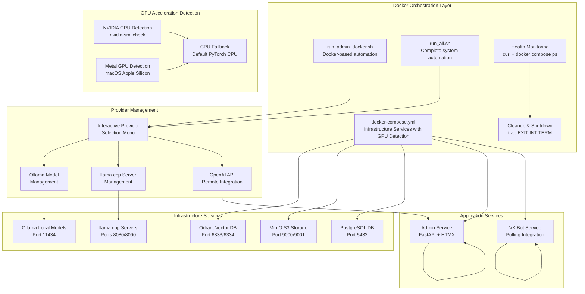

# Development Workflow

<cite>
**Referenced Files in This Document**
- [pyproject.toml](file://pyproject.toml)
- [uv.lock](file://uv.lock)
- [packages/core/pyproject.toml](file://packages/core/pyproject.toml)
- [packages/admin/pyproject.toml](file://packages/admin/pyproject.toml)
- [packages/vk_bot/pyproject.toml](file://packages/vk_bot/pyproject.toml)
- [packages/core/src/cafetera_core/config.py](file://packages/core/src/cafetera_core/config.py)
- [packages/admin/src/cafetera_admin/main.py](file://packages/admin/src/cafetera_admin/main.py)
- [packages/vk_bot/src/cafetera_vk_bot/bot.py](file://packages/vk_bot/src/cafetera_vk_bot/bot.py)
- [scripts/run_all.sh](file://scripts/run_all.sh)
- [scripts/run_admin_docker.sh](file://scripts/run_admin_docker.sh)
- [scripts/run_admin.sh](file://scripts/run_admin.sh)
- [scripts/run_llama_embeddings.sh](file://scripts/run_llama_embeddings.sh)
- [scripts/run_llama_llm.sh](file://scripts/run_llama_llm.sh)
- [docker-compose.yml](file://docker-compose.yml)
- [Dockerfile.admin](file://Dockerfile.admin)
- [Dockerfile.polling_vk](file://Dockerfile.polling_vk)
- [tests/conftest.py](file://tests/conftest.py)
- [tests/test_config.py](file://tests/test_config.py)
- [tests/test_keyboards.py](file://tests/test_keyboards.py)
- [tests/test_states.py](file://tests/test_states.py)
- [AGENTS.md](file://AGENTS.md)
- [README.md](file://README.md)
</cite>

## Update Summary
**Changes Made**
- Enhanced Docker initialization build logic with uv-based dependency management
- Simplified PyTorch installation process with automatic GPU acceleration detection
- Improved GPU acceleration support detection for NVIDIA CUDA and macOS Metal
- Streamlined dependency management system with workspace-aware package resolution
- Updated Docker build stages with optimized multi-stage architecture

## Table of Contents
1. [Introduction](#introduction)
2. [Project Structure](#project-structure)
3. [Docker-Based Development Orchestration](#docker-based-development-orchestration)
4. [Core Components](#core-components)
5. [Development Environment Setup](#development-environment-setup)
6. [Docker-Based Development Workflow](#docker-based-development-workflow)
7. [Package-Specific Development](#package-specific-development)
8. [Testing in Docker Architecture](#testing-in-docker-architecture)
9. [Code Quality Tools](#code-quality-tools)
10. [Validation Commands and Workspace Management](#validation-commands-and-workspace-management)
11. [Running Services and Scripts](#running-services-and-scripts)
12. [GPU Acceleration and Hardware Optimization](#gpu-acceleration-and-hardware-optimization)
13. [Troubleshooting Guide](#troubleshooting-guide)
14. [Best Practices](#best-practices)
15. [Conclusion](#conclusion)

## Introduction
This document describes the development workflow and best practices for cafetera_hr_bot, a comprehensive Docker-based development environment featuring sophisticated automation scripts and modern workspace architecture using uv. The project has been restructured into separate packages for core functionality, admin interface, and VK bot integration, each with dedicated development workflows while maintaining tight integration through uv workspace management and Docker-based orchestration.

The Docker-based architecture provides enhanced development experience with automated infrastructure provisioning, interactive provider selection, workspace-aware imports, package-based module execution patterns, and streamlined dependency management across multiple Python packages. Recent enhancements include improved Docker initialization build logic with uv-based dependency management, simplified PyTorch installation process with automatic GPU acceleration detection, and streamlined dependency management system that optimizes build performance and resource utilization.

**Updated** Enhanced with comprehensive documentation for Docker-based development orchestration, sophisticated automation scripts, workspace-based package architecture with uv sync validation commands, and advanced GPU acceleration support detection.

## Project Structure
The repository follows a modern monorepo architecture with Docker-based development orchestration, organizing functionality into distinct packages with comprehensive automation:

```
cafetera_hr_bot/
├── pyproject.toml                    # Workspace root configuration with uv dependency management
├── uv.lock                          # Workspace dependency lock file with optimized resolution
├── docker-compose.yml               # Docker orchestration configuration with GPU-aware services
├── Dockerfile.admin                 # Admin service Docker build with uv-based initialization
├── Dockerfile.polling_vk            # VK bot Docker build with uv-based initialization
├── packages/
│   ├── core/                        # Core domain logic and RAG pipeline
│   │   ├── pyproject.toml           # Core package configuration
│   │   └── src/cafetera_core/       # Core implementation
│   ├── admin/                       # Admin web interface (FastAPI + HTMX)
│   │   ├── pyproject.toml           # Admin package configuration
│   │   └── src/cafetera_admin/      # Admin implementation
│   └── vk_bot/                      # VK Bot integration
│       ├── pyproject.toml           # VK Bot package configuration
│       └── src/cafetera_vk_bot/     # VK Bot implementation
├── scripts/                         # Development automation scripts with GPU detection
├── tests/                           # Shared test suite with Docker awareness
├── static/                          # Static assets
├── templates/                       # HTML templates
└── .env.example                     # Environment configuration template
```

**Updated** Added comprehensive project structure documentation reflecting the new Docker-based monorepo organization with sophisticated automation scripts, uv workspace management, and GPU acceleration support.

**Section sources**
- [pyproject.toml:22-28](file://pyproject.toml#L22-L28)
- [docker-compose.yml:1-120](file://docker-compose.yml#L1-L120)
- [Dockerfile.admin:1-116](file://Dockerfile.admin#L1-L116)
- [Dockerfile.polling_vk:1-87](file://Dockerfile.polling_vk#L1-L87)

## Docker-Based Development Orchestration
The Docker-based architecture leverages sophisticated automation scripts to manage complex development environments with interactive provider selection, automated dependency management, and intelligent GPU acceleration detection:



**Diagram sources**
- [docker-compose.yml:1-120](file://docker-compose.yml#L1-L120)
- [scripts/run_all.sh:1-443](file://scripts/run_all.sh#L1-L443)
- [scripts/run_admin_docker.sh:1-473](file://scripts/run_admin_docker.sh#L1-L473)
- [scripts/run_admin.sh:252-260](file://scripts/run_admin.sh#L252-L260)

**Section sources**
- [docker-compose.yml:1-120](file://docker-compose.yml#L1-L120)
- [scripts/run_all.sh:208-292](file://scripts/run_all.sh#L208-L292)
- [scripts/run_admin_docker.sh:192-276](file://scripts/run_admin_docker.sh#L192-L276)
- [scripts/run_admin.sh:252-260](file://scripts/run_admin.sh#L252-L260)

## Core Components
The Docker-based architecture organizes functionality into three primary packages, each with distinct responsibilities and Docker integration with enhanced GPU acceleration support:

### Core Package (`cafetera-core`)
- **Domain Logic**: Centralized business logic, entity definitions, and service implementations
- **RAG Pipeline**: Complete Retrieval-Augmented Generation system with indexing, retrieval, and generation
- **Storage Abstractions**: Database and S3 storage implementations with dependency injection
- **Configuration Management**: Unified settings management with environment variable support
- **GPU Optimization**: Automatic GPU acceleration detection and fallback mechanisms

### Admin Package (`cafetera-admin`)
- **Web Interface**: FastAPI-based admin interface with HTMX partials and interactive elements
- **Document Management**: Full CRUD operations for document management with background processing
- **Authentication**: API key-based authentication for admin access
- **Template System**: Jinja2 templates with static asset serving
- **Docker Integration**: Built via Dockerfile.admin with optimized multi-stage build and GPU acceleration
- **Model Caching**: Pre-downloaded model caches for improved startup performance

### VK Bot Package (`cafetera-vk-bot`)
- **Bot Integration**: VKontakte bot implementation with vkbottle framework
- **Handler System**: Modular handler architecture with state management
- **Interactive UI**: Keyboard-based navigation and service actions
- **Polling Mechanism**: Background polling for message processing
- **Docker Integration**: Built via Dockerfile.polling_vk with optimized multi-stage build
- **Model Optimization**: Pre-configured model caching for efficient inference

**Updated** Enhanced with comprehensive coverage of all three workspace packages, Docker-specific development workflows, and GPU acceleration support detection.

**Section sources**
- [packages/core/pyproject.toml:6-24](file://packages/core/pyproject.toml#L6-L24)
- [packages/admin/pyproject.toml:6-12](file://packages/admin/pyproject.toml#L6-L12)
- [packages/vk_bot/pyproject.toml:6-9](file://packages/vk_bot/pyproject.toml#L6-L9)
- [Dockerfile.admin:1-116](file://Dockerfile.admin#L1-L116)
- [Dockerfile.polling_vk:1-87](file://Dockerfile.polling_vk#L1-L87)

## Development Environment Setup
Setting up the development environment requires understanding the Docker-based orchestration, uv's dependency management, and GPU acceleration detection:

### Prerequisites
- **Python 3.13+**: Required for all packages with uv workspace support
- **uv**: Modern Python package manager with workspace support and GPU detection
- **Docker**: Essential for infrastructure services (PostgreSQL, Qdrant, MinIO)
- **Optional**: Ollama for local LLM/embedding services
- **Optional**: llama.cpp for custom local inference servers
- **GPU Hardware**: NVIDIA GPU for CUDA acceleration, macOS Apple Silicon for Metal

### Docker Environment Installation Process
1. **Clone Repository**: `git clone <repository-url>`
2. **Navigate to Project Root**: `cd cafetera_hr_bot`
3. **Install Dependencies**: `uv sync --all-packages`
4. **Configure Environment**: Copy `.env.example` to `.env` and configure service URLs
5. **Start Infrastructure**: Choose development script approach with GPU detection

### Environment Configuration
- **Environment Variables**: Copy `.env.example` to `.env` and configure service URLs
- **Service Dependencies**: Docker Compose handles infrastructure services automatically
- **Workspace Sources**: uv automatically resolves workspace package dependencies
- **Docker Networking**: Services communicate via Docker network names
- **GPU Detection**: Automatic hardware acceleration detection and configuration

**Updated** Added comprehensive development environment setup covering Docker-based infrastructure management, workspace-specific requirements with uv sync as the primary validation step, and GPU acceleration support detection.

**Section sources**
- [pyproject.toml:30-53](file://pyproject.toml#L30-L53)
- [pyproject.toml:36-49](file://pyproject.toml#L36-L49)
- [docker-compose.yml:64-76](file://docker-compose.yml#L64-L76)
- [scripts/run_admin.sh:252-260](file://scripts/run_admin.sh#L252-L260)

## Docker-Based Development Workflow
The Docker-based architecture enables sophisticated development patterns with automated infrastructure provisioning, interactive service management, and intelligent GPU acceleration detection:

### Automated Infrastructure Provisioning
Each development script orchestrates the complete system startup with sophisticated health monitoring and GPU detection:

```bash
# Complete system startup with all services and GPU detection
./scripts/run_all.sh

# Admin-only development with selective infrastructure and GPU support
./scripts/run_admin_docker.sh

# Local development without Docker orchestration
./scripts/run_admin.sh
```

### Interactive Provider Selection
Both run_all.sh and run_admin_docker.sh provide comprehensive provider selection:

```bash
# LLM Provider Selection
Select LLM provider:
  1) ollama (default)
  2) openai
  3) llamacpp
Enter choice [1-3, Enter=1]: 

# Embedding Provider Selection  
Select Embedding provider:
  1) ollama (default)
  2) openai
  3) llamacpp
Enter choice [1-3, Enter=1]:
```

### Automated Dependency Management
Scripts handle complex dependency scenarios with enhanced GPU acceleration support:
- **Ollama Model Management**: Automatic model pulling and verification
- **llama.cpp Server Management**: Background server startup and health checks
- **Environment Variable Loading**: Priority handling between .env and environment variables
- **Health Monitoring**: Comprehensive service readiness validation
- **GPU Detection**: Automatic hardware acceleration detection and configuration

**Updated** Added detailed coverage of Docker-based development patterns, automated infrastructure management, interactive service configuration, and GPU acceleration detection.

**Section sources**
- [scripts/run_all.sh:208-292](file://scripts/run_all.sh#L208-L292)
- [scripts/run_admin_docker.sh:192-276](file://scripts/run_admin_docker.sh#L192-L276)
- [scripts/run_all.sh:320-389](file://scripts/run_all.sh#L320-L389)
- [scripts/run_admin_docker.sh:304-368](file://scripts/run_admin_docker.sh#L304-L368)
- [scripts/run_admin.sh:252-260](file://scripts/run_admin.sh#L252-L260)

## Package-Specific Development
Each package maintains its own development workflow while benefiting from Docker-based orchestration and GPU acceleration support:

### Core Package Development
- **Domain Development**: Work on core business logic and RAG pipeline with GPU optimization
- **Testing**: Package-specific unit tests in `tests/` directory
- **Documentation**: Internal API documentation for core components
- **Integration**: Provides foundation for other packages
- **Docker Build**: Optimized multi-stage build with model caching and GPU acceleration

### Admin Package Development  
- **Web Development**: FastAPI routes, templates, and static assets with GPU acceleration
- **UI Development**: HTMX partials and interactive components
- **API Development**: REST endpoints for document management
- **Deployment**: Hypercorn ASGI server configuration with optimized model caching
- **Docker Optimization**: Pre-downloaded model caching for faster startup with GPU support

### VK Bot Package Development
- **Bot Development**: Handler registration and state management with GPU acceleration
- **UI Development**: Keyboard components and navigation
- **Integration**: VK API integration and polling mechanisms
- **Testing**: Message handling and state transition testing
- **Docker Efficiency**: Optimized build with pre-downloaded models and GPU optimization

**Updated** Enhanced with package-specific development workflows, Docker-specific optimizations, and GPU acceleration support.

**Section sources**
- [packages/core/src/cafetera_core/config.py:1-50](file://packages/core/src/cafetera_core/config.py#L1-L50)
- [packages/admin/src/cafetera_admin/main.py:1-50](file://packages/admin/src/cafetera_admin/main.py#L1-L50)
- [packages/vk_bot/src/cafetera_vk_bot/bot.py:1-32](file://packages/vk_bot/src/cafetera_vk_bot/bot.py#L1-L32)
- [Dockerfile.admin:44-50](file://Dockerfile.admin#L44-L50)
- [Dockerfile.polling_vk:40-46](file://Dockerfile.polling_vk#L40-L46)

## Testing in Docker Architecture
The Docker-based architecture supports comprehensive testing across all packages with workspace-aware import resolution, Docker-aware test configuration, and GPU acceleration testing:

### Test Configuration
- **pytest Configuration**: Workspace-aware test discovery and import resolution
- **Source Paths**: Tests target workspace package source directories
- **Shared Utilities**: Common test utilities available across packages
- **Docker Awareness**: Test fixtures detect and handle Docker availability
- **GPU Testing**: Tests can validate GPU acceleration functionality

### Package-Specific Testing
- **Core Tests**: Domain logic, RAG pipeline, storage functionality with GPU acceleration
- **Admin Tests**: API endpoints, authentication, document operations with GPU support
- **VK Bot Tests**: Handler logic, state management, keyboard interactions with GPU optimization

### Docker-Aware Testing
```bash
# Run all workspace tests with Docker awareness
uv run pytest

# Run tests with Docker requirement markers
uv run pytest -m "requires_docker"

# Skip Docker-dependent tests when Docker unavailable
uv run pytest --disable-warnings

# Test GPU acceleration functionality
uv run pytest -m "gpu_acceleration"
```

**Updated** Added comprehensive testing documentation for Docker-based package structure with Docker-aware test configuration, uv workspace integration, and GPU acceleration testing capabilities.

**Section sources**
- [pyproject.toml:30-33](file://pyproject.toml#L30-L33)
- [pyproject.toml:36-49](file://pyproject.toml#L36-L49)
- [tests/conftest.py:23-42](file://tests/conftest.py#L23-L42)

## Code Quality Tools
The Docker-based architecture integrates code quality tools with workspace-aware configuration, Docker optimization, and GPU acceleration support:

### Ruff Configuration
- **Workspace-wide Linting**: Single configuration targets all workspace packages
- **Source Directories**: Configured for workspace package source locations
- **Linting Rules**: Comprehensive rule set including error detection, formatting, and style
- **Docker Optimization**: Optimized for Docker build environments
- **GPU Code Support**: Linting rules for GPU-accelerated code patterns

### MyPy Configuration  
- **Type Checking**: Workspace-aware type checking across package boundaries
- **Python Version**: Configured for Python 3.13 compatibility
- **Strict Mode**: Flexible strictness settings for gradual adoption
- **Docker Caching**: Efficient caching in Docker build environments
- **GPU Type Support**: Enhanced type checking for GPU acceleration code

### Tool Integration
```bash
# Run workspace-wide linting
uv run ruff check

# Run type checking
uv run mypy packages/

# Fix common issues
uv run ruff check --fix

# Docker-optimized linting
docker compose run admin ruff check

# GPU acceleration validation
uv run ruff check --select GPU
```

**Updated** Enhanced with comprehensive code quality tool configuration for Docker-based workspace architecture and GPU acceleration support.

**Section sources**
- [pyproject.toml:36-49](file://pyproject.toml#L36-L49)
- [pyproject.toml:44-49](file://pyproject.toml#L44-L49)

## Validation Commands and Workspace Management
The project emphasizes uv-based validation commands as the primary development workflow validation approach with enhanced GPU acceleration support:

### Workspace Validation Commands
The AGENTS.md documentation defines comprehensive validation commands for ensuring code quality and workspace integrity:

```bash
# Install all workspace packages and dependencies with GPU detection
uv sync

# Run tests relevant to changed code
uv run pytest

# Linting with comprehensive rules
uv run ruff check .

# Type checking across all packages
uv run mypy packages/

# Import validation to catch early errors
uv run python -c 'import cafetera_core; import cafetera_admin; import cafetera_vk_bot'

# GPU acceleration validation
uv run python -c 'import torch; print(f"GPU Available: {torch.cuda.is_available()}")'
```

### Workspace Management Benefits
- **Dependency Resolution**: uv resolves workspace dependencies automatically with GPU optimization
- **Package Imports**: Validates that all workspace packages can be imported successfully
- **Testing Coverage**: Ensures test runner can discover and execute all tests
- **Linting Scope**: Applies linting rules consistently across all workspace packages
- **Type Checking**: Performs type checking across the entire workspace
- **GPU Validation**: Validates GPU acceleration support and configuration

### Integration with Development Scripts
Development scripts integrate uv sync validation with GPU detection:

```bash
# run_admin.sh includes uv sync validation with GPU detection
if ! uv sync; then
  log "Failed to sync dependencies"
  log "Try: uv lock --upgrade && uv sync"
  exit 1
fi

# Auto-detect NVIDIA GPU and install CUDA-enabled PyTorch on Linux
if [[ "$(uname -s)" == "Linux" ]] && command_exists nvidia-smi && nvidia-smi >/dev/null 2>&1; then
  log "NVIDIA GPU detected — installing CUDA-enabled PyTorch..."
  if uv pip install torch torchvision --index-url https://download.pytorch.org/whl/cu128 --reinstall; then
    log "CUDA PyTorch installed successfully"
  else
    log "WARNING: Failed to install CUDA PyTorch, continuing with CPU version"
  fi
fi
```

**Updated** Added comprehensive coverage of uv-based validation commands, workspace management, GPU acceleration detection, and enhanced validation processes.

**Section sources**
- [AGENTS.md:91-100](file://AGENTS.md#L91-L100)
- [scripts/run_admin.sh:243-246](file://scripts/run_admin.sh#L243-L246)
- [scripts/run_admin.sh:252-260](file://scripts/run_admin.sh#L252-L260)

## Running Services and Scripts
The Docker-based architecture provides comprehensive automation through sophisticated development scripts with GPU acceleration support:

### Complete System Startup (`run_all.sh`)
The comprehensive orchestration script manages the entire development environment with GPU detection:

```bash
./scripts/run_all.sh
```

**Features:**
- **Infrastructure Setup**: PostgreSQL, Qdrant, MinIO containers with health monitoring
- **Interactive Provider Selection**: LLM and embedding provider configuration
- **Service Health Checks**: Automated health monitoring with detailed error reporting
- **Background Processing**: Concurrent service startup with cleanup handling
- **Docker Integration**: Seamless Docker Compose integration with GPU detection
- **GPU Acceleration**: Automatic hardware acceleration detection and configuration

### Admin Service Only (`run_admin_docker.sh`)
Focused development on the admin interface with Docker orchestration and GPU support:

```bash
./scripts/run_admin_docker.sh
```

**Features:**
- **Selective Startup**: Only admin-related infrastructure (qdrant, minio, postgres)
- **Provider Management**: Local Ollama and llama.cpp server startup
- **Health Monitoring**: Comprehensive service readiness validation
- **Docker Optimization**: Optimized Docker build and deployment with GPU acceleration
- **Model Caching**: Pre-downloaded model caches for improved performance

### Local Development (`run_admin.sh`)
Alternative local development without Docker orchestration with GPU detection:

```bash
./scripts/run_admin.sh
```

**Features:**
- **Direct uv execution**: No Docker orchestration overhead
- **Local provider management**: Direct Ollama and llama.cpp control
- **Workspace-aware**: Full uv workspace integration
- **Dependency sync**: Automatic dependency management with uv sync validation
- **GPU Detection**: Automatic hardware acceleration detection and configuration

### Provider Management Scripts
Additional scripts support specialized AI provider configurations:
- **Ollama Management**: `run_ollama_embeddings.sh`, `run_ollama_llm.sh`
- **llama.cpp Management**: `run_llama_embeddings.sh`, `run_llama_llm.sh`
- **Polling Integration**: `run_polling_vk.sh` for VK bot development

**Updated** Added comprehensive coverage of Docker-based service management, automation scripts with GPU acceleration support, and enhanced development workflow options.

**Section sources**
- [scripts/run_all.sh:1-443](file://scripts/run_all.sh#L1-L443)
- [scripts/run_admin_docker.sh:1-473](file://scripts/run_admin_docker.sh#L1-L473)
- [scripts/run_admin.sh:1-455](file://scripts/run_admin.sh#L1-L455)

## GPU Acceleration and Hardware Optimization
The enhanced Docker-based architecture provides comprehensive GPU acceleration support with automatic hardware detection and optimized configuration:

### Automatic GPU Detection
The system automatically detects available hardware acceleration:

```bash
# NVIDIA GPU Detection (Linux)
if [[ "$(uname -s)" == "Linux" ]] && command_exists nvidia-smi && nvidia-smi >/dev/null 2>&1; then
  log "NVIDIA GPU detected — installing CUDA-enabled PyTorch..."
  if uv pip install torch torchvision --index-url https://download.pytorch.org/whl/cu128 --reinstall; then
    log "CUDA PyTorch installed successfully"
  else
    log "WARNING: Failed to install CUDA PyTorch, continuing with CPU version"
  fi
fi

# macOS Apple Silicon Detection
# Torch automatically includes MPS (Metal) GPU support from PyPI
```

### PyTorch Installation Optimization
The system uses optimized PyTorch installation strategies:

```bash
# Default CPU-only installation for Docker/Linux
# Controlled via [tool.uv.sources] in pyproject.toml
torch = [
  { index = "pytorch-cpu", marker = "sys_platform == 'linux'" },
]

# Manual CUDA installation for NVIDIA GPUs
uv pip install torch torchvision --index-url https://download.pytorch.org/whl/cu128 --reinstall

# Automatic MPS support for macOS Apple Silicon
# Torch from PyPI includes Metal Performance Shaders (MPS) GPU support
```

### Docker Build Optimization
Docker builds are optimized for GPU acceleration:

```dockerfile
# Stage 1: Builder with uv-based dependency management
FROM python:3.13-slim AS builder

# Copy uv binary from official image
COPY --from=docker.io/astral/uv:latest /uv /uvx /bin/

# Set uv environment variables
ENV UV_PYTHON_DOWNLOADS=never \
    UV_LINK_MODE=copy \
    UV_COMPILE_BYTECODE=1

# GPU optimization: CPU-only PyTorch for Docker containers
# torch/torchvision locked to CPU-only via [tool.uv.sources] in pyproject.toml
RUN uv venv .venv && \
    uv export --format=requirements-txt --package=cafetera-admin --no-dev --locked > requirements.txt && \
    uv pip install -r requirements.txt

# Stage 2: Runtime with optimized GPU configuration
FROM python:3.13-slim AS runtime

# GPU acceleration: Automatic detection and configuration
# CUDA-enabled PyTorch installation handled by development scripts
```

### Model Caching and Performance Optimization
The system implements comprehensive model caching for GPU-accelerated operations:

```bash
# Pre-download ML models during Docker build
# BM25 sparse embedding model
ENV FASTEMBED_CACHE_PATH=/app/.cache/fastembed
RUN .venv/bin/python -c "from langchain_qdrant import FastEmbedSparse; FastEmbedSparse(model_name='Qdrant/bm25')"

# ColBERT rerank model for GPU acceleration
RUN .venv/bin/python -c "from fastembed import LateInteractionTextEmbedding; LateInteractionTextEmbedding(model_name='${COLBERT_RERANK_MODEL}')"

# Docling ML models for layout analysis
RUN .venv/bin/python -c "from docling.document_converter import DocumentConverter; DocumentConverter()"
```

**Updated** Added comprehensive GPU acceleration support documentation covering automatic hardware detection, optimized PyTorch installation, Docker build optimization, and model caching strategies.

**Section sources**
- [pyproject.toml:25-39](file://pyproject.toml#L25-L39)
- [scripts/run_admin.sh:252-260](file://scripts/run_admin.sh#L252-L260)
- [Dockerfile.admin:36-63](file://Dockerfile.admin#L36-L63)
- [Dockerfile.polling_vk:33-48](file://Dockerfile.polling_vk#L33-L48)
- [README.md:621-629](file://README.md#L621-L629)

## Troubleshooting Guide
Docker-based development environment troubleshooting with comprehensive error handling, GPU acceleration issues, and hardware optimization problems:

### Docker Infrastructure Issues
- **Docker Not Found**: Ensure Docker Desktop is installed and in PATH
- **Port Conflicts**: Check for conflicting service ports (5432, 6333, 9000, 11434)
- **Volume Permissions**: Verify Docker has access to project directory
- **Network Issues**: Check Docker network connectivity between services

### Service Health Problems
- **PostgreSQL Ready**: Use `docker compose exec postgres pg_isready` to verify
- **Qdrant Healthy**: Check `docker compose ps qdrant` for health status
- **MinIO Ready**: Verify `mc ready local` health check
- **Service Logs**: Use `docker compose logs service_name` for detailed errors

### GPU Acceleration Issues
- **NVIDIA GPU Detection**: Verify `nvidia-smi` command works and GPU is available
- **CUDA Installation**: Check CUDA-enabled PyTorch installation with `torch.cuda.is_available()`
- **macOS Metal Support**: Verify MPS (Metal) GPU support for Apple Silicon
- **PyTorch Index Issues**: Ensure correct PyTorch index URL for GPU installation

### Provider Selection Issues
- **Ollama Models**: Verify model availability with `ollama list`
- **llama.cpp Servers**: Check server responsiveness at localhost ports
- **API Keys**: Ensure OpenAI API keys are properly configured
- **Model Names**: Verify exact model name spelling with quantization suffixes

### Development Script Issues
- **Script Permissions**: Ensure scripts are executable (`chmod +x scripts/*.sh`)
- **Environment Variables**: Verify .env file contains required configuration
- **uv Installation**: Check uv version compatibility with workspace
- **Docker Compose**: Verify docker-compose.yml syntax and service definitions

### Testing Problems
- **Docker Availability**: Scripts detect Docker presence and skip tests when unavailable
- **Test Container Issues**: PostgreSQL test containers may fail to start
- **Import Resolution**: Verify PYTHONPATH configuration for workspace packages
- **Dependency Issues**: Re-run `uv sync` to refresh workspace dependencies
- **GPU Testing**: Validate GPU acceleration with `torch.cuda.is_available()` in tests

### Validation Command Issues
- **uv sync Failures**: Check workspace dependencies and lock file integrity
- **Package Import Errors**: Verify workspace package installation and import paths
- **Test Discovery**: Ensure pytest can discover tests in workspace packages
- **Linting Issues**: Verify ruff configuration targets all workspace packages
- **GPU Validation**: Test GPU acceleration with validation commands

### GPU-Specific Troubleshooting
- **CUDA Installation Failures**: Check network connectivity to PyTorch index URL
- **Driver Compatibility**: Verify NVIDIA driver version compatibility
- **Memory Issues**: Monitor GPU memory usage during model loading
- **Performance Issues**: Validate GPU acceleration effectiveness with benchmark tests

**Updated** Enhanced troubleshooting guide covering Docker-based development environment issues, validation command problems, workspace-specific troubleshooting, and comprehensive GPU acceleration support issues.

**Section sources**
- [scripts/run_all.sh:129-163](file://scripts/run_all.sh#L129-L163)
- [scripts/run_admin_docker.sh:125-147](file://scripts/run_admin_docker.sh#L125-L147)
- [docker-compose.yml:11-16](file://docker-compose.yml#L11-L16)
- [tests/conftest.py:23-42](file://tests/conftest.py#L23-L42)
- [scripts/run_admin.sh:252-260](file://scripts/run_admin.sh#L252-L260)

## Best Practices
Docker-based development best practices for cafetera_hr_bot with enhanced GPU acceleration support:

### Docker Development Workflow
- **Service Selection**: Use `run_admin_docker.sh` for focused admin development with GPU support
- **Full Stack Development**: Use `run_all.sh` for complete system development with GPU acceleration
- **Local Development**: Use `run_admin.sh` for direct uv workspace development with GPU detection
- **Provider Management**: Leverage interactive provider selection for optimal development
- **GPU Optimization**: Always consider GPU acceleration when developing AI-intensive features

### Package Organization
- **Clear Boundaries**: Maintain distinct responsibilities for each package
- **Minimal Dependencies**: Keep cross-package dependencies to essential minimum
- **Namespace Consistency**: Use consistent import namespaces across packages
- **Docker Optimization**: Utilize pre-downloaded models and optimized builds with GPU acceleration
- **GPU Considerations**: Design packages with GPU acceleration in mind

### Development Workflow
- **Docker Awareness**: Always develop within the Docker context when using Docker scripts
- **Dependency Management**: Use workspace sources for inter-package dependencies
- **Testing Strategy**: Develop and test each package independently while validating Docker integration
- **Health Monitoring**: Monitor service health during development
- **GPU Validation**: Regularly test GPU acceleration functionality during development

### Code Quality
- **Consistent Formatting**: Use Ruff for workspace-wide formatting consistency
- **Type Safety**: Leverage MyPy for comprehensive type checking
- **Documentation**: Maintain clear documentation for Docker-specific package interfaces
- **Performance**: Utilize Docker build optimizations, model caching, and GPU acceleration
- **GPU Code**: Write GPU-accelerated code with proper fallback mechanisms

### Validation and Testing
- **Workspace Validation**: Always run `uv sync` before development to validate workspace integrity
- **Package Testing**: Use `uv run pytest` to test workspace packages comprehensively
- **Import Validation**: Run import validation to catch workspace import errors early
- **Linting Integration**: Use `uv run ruff check` for workspace-wide linting
- **GPU Testing**: Include GPU acceleration validation in testing workflows

### Deployment Considerations
- **Workspace Packaging**: Ensure workspace packages can be built independently with GPU support
- **Dependency Resolution**: Verify uv.lock provides reproducible builds with GPU optimization
- **Environment Configuration**: Maintain environment variable documentation for all packages
- **Docker Optimization**: Leverage multi-stage builds, model caching, and GPU acceleration
- **Hardware Compatibility**: Ensure deployments can handle various GPU configurations

### GPU Acceleration Best Practices
- **Automatic Detection**: Always use automatic GPU detection in development scripts
- **Fallback Mechanisms**: Implement CPU fallback when GPU acceleration fails
- **Memory Management**: Monitor GPU memory usage during development
- **Performance Testing**: Regularly test GPU acceleration effectiveness
- **Driver Updates**: Keep GPU drivers updated for optimal performance

**Updated** Added comprehensive best practices for Docker-based development workflow with emphasis on uv sync validation, workspace management, GPU acceleration support, and hardware optimization.

## Conclusion
The Docker-based development architecture significantly enhances the development workflow for cafetera_hr_bot by providing sophisticated automation, interactive service management, optimized Docker integration, and comprehensive GPU acceleration support. The new architecture with comprehensive automation scripts enables better code organization, improved maintainability, streamlined development processes across multiple Python packages with Docker-based orchestration and intelligent hardware acceleration detection.

Key benefits of the enhanced Docker-based architecture include:
- **Enhanced Automation**: Sophisticated scripts (~441-473 lines) with interactive provider selection and GPU detection
- **Comprehensive Orchestration**: Automated infrastructure provisioning with health monitoring and hardware optimization
- **Flexible Development Options**: Multiple development approaches (Docker, local, hybrid) with GPU acceleration support
- **Optimized Performance**: Multi-stage Docker builds with model caching and GPU acceleration
- **Robust Error Handling**: Comprehensive troubleshooting and cleanup mechanisms with GPU-specific diagnostics
- **Intelligent Hardware Detection**: Automatic GPU acceleration detection and configuration for NVIDIA CUDA and macOS Metal
- **Streamlined Dependency Management**: uv-based workspace management with optimized dependency resolution

The introduction of uv sync validation commands as the primary validation approach ensures workspace integrity and provides a standardized development workflow across all team members. The enhanced GPU acceleration support detection system automatically configures hardware acceleration for optimal performance. This approach replaces previous layered architecture validation processes with a more efficient, workspace-aware validation strategy that leverages uv's superior dependency management capabilities and intelligent hardware optimization.

By leveraging Docker-based development orchestration with GPU acceleration support, developers can efficiently work with multiple packages while maintaining clean import boundaries, proper dependency resolution, comprehensive service management, and optimized hardware utilization. The enhanced development environment setup, testing procedures, validation commands, GPU acceleration detection, and troubleshooting guidance ensure a smooth development experience across all Docker-based development scenarios with comprehensive hardware optimization support.

**Updated** Enhanced conclusion reflecting the benefits and advantages of the Docker-based architecture for cafetera_hr_bot development with sophisticated automation capabilities, uv-based validation commands, GPU acceleration support detection, and comprehensive hardware optimization features.