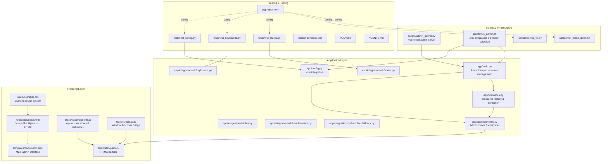
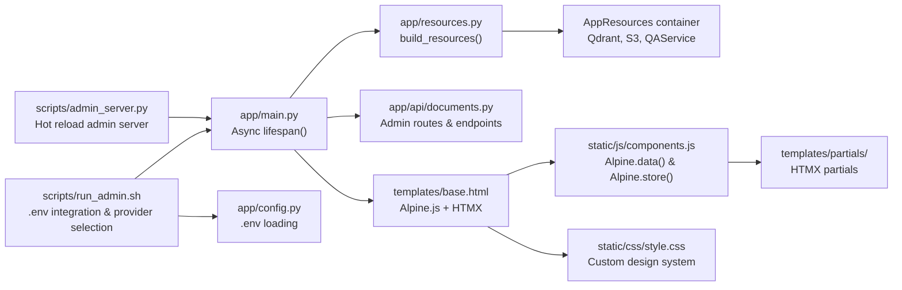
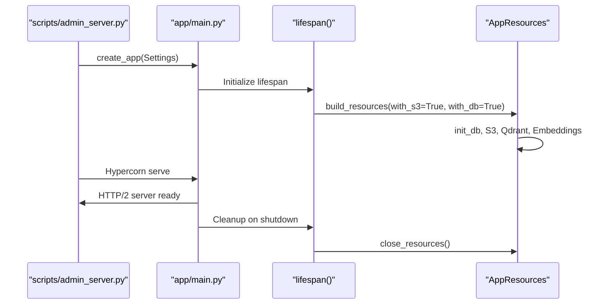
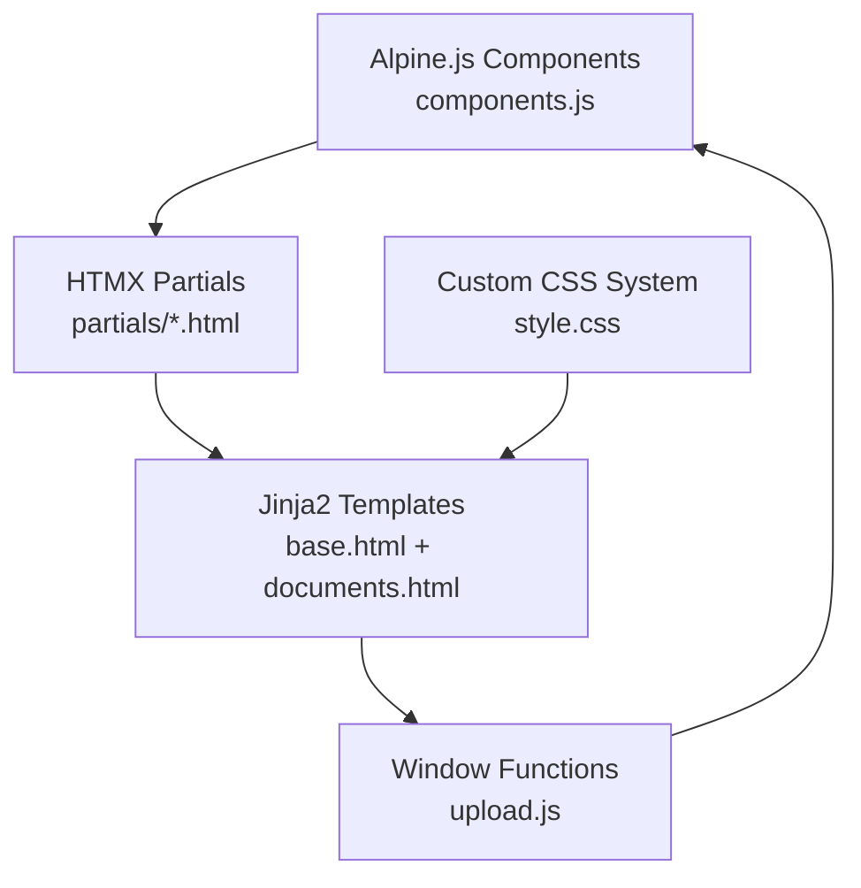
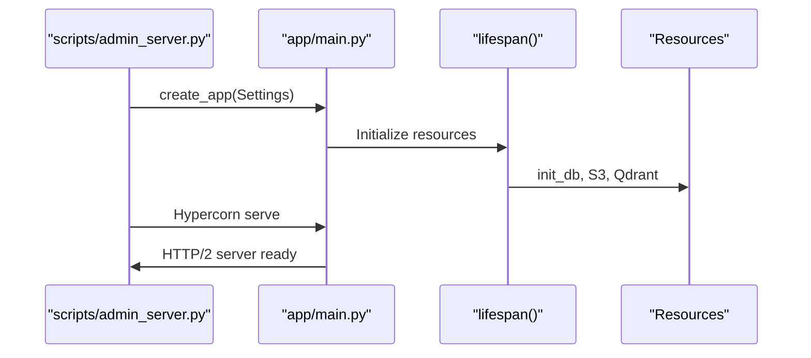
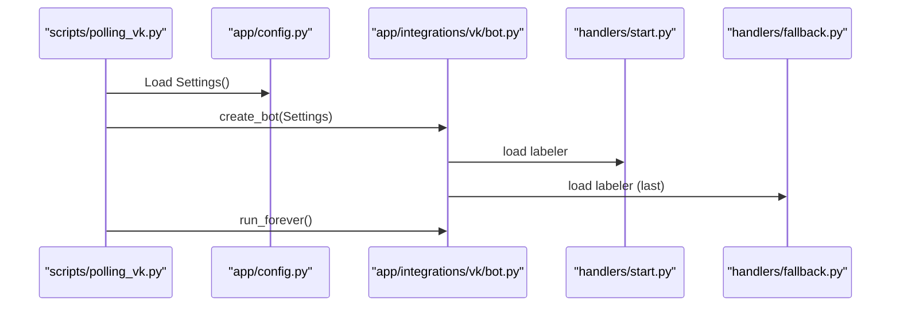
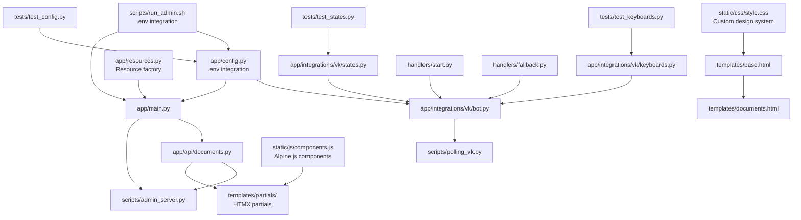

# Development Workflow

<cite>
**Referenced Files in This Document**
- [pyproject.toml](file://pyproject.toml)
- [docker-compose.yml](file://docker-compose.yml)
- [PLAN.md](file://PLAN.md)
- [AGENTS.md](file://AGENTS.md)
- [app/config.py](file://app/config.py)
- [app/main.py](file://app/main.py)
- [app/resources.py](file://app/resources.py)
- [app/integrations/vk/bot.py](file://app/integrations/vk/bot.py)
- [app/integrations/vk/keyboards.py](file://app/integrations/vk/keyboards.py)
- [app/integrations/vk/states.py](file://app/integrations/vk/states.py)
- [app/integrations/vk/handlers/start.py](file://app/integrations/vk/handlers/start.py)
- [app/integrations/vk/handlers/fallback.py](file://app/integrations/vk/handlers/fallback.py)
- [app/api/documents.py](file://app/api/documents.py)
- [scripts/admin_server.py](file://scripts/admin_server.py)
- [scripts/run_admin.sh](file://scripts/run_admin.sh)
- [scripts/polling_vk.py](file://scripts/polling_vk.py)
- [scripts/run_llama_qwen.sh](file://scripts/run_llama_qwen.sh)
- [scripts/run_admin.sh](file://scripts/run_admin.sh)
- [tests/test_config.py](file://tests/test_config.py)
- [tests/test_keyboards.py](file://tests/test_keyboards.py)
- [tests/test_states.py](file://tests/test_states.py)
- [static/js/components.js](file://static/js/components.js)
- [static/js/upload.js](file://static/js/upload.js)
- [static/css/style.css](file://static/css/style.css)
- [templates/base.html](file://templates/base.html)
- [templates/documents.html](file://templates/documents.html)
- [templates/partials/document_table.html](file://templates/partials/document_table.html)
</cite>

## Update Summary
**Changes Made**
- Enhanced Main Application Entry Point section with modern async resource management using lifespan context managers
- Updated Frontend Architecture section to document Vue.js-like Alpine.js components and comprehensive CSS styling system
- Added new section on Streamlined Template Architecture with HTMX partials for client-side rendering
- Updated Development Environment Setup to include the modernized run_admin.sh script with interactive provider selection
- Enhanced Configuration Management section with intelligent .env integration and provider selection workflow
- Added comprehensive documentation for the new frontend architecture with Alpine.js, HTMX, and custom CSS design system

## Table of Contents
1. [Introduction](#introduction)
2. [Project Structure](#project-structure)
3. [Core Components](#core-components)
4. [Architecture Overview](#architecture-overview)
5. [Detailed Component Analysis](#detailed-component-analysis)
6. [Dependency Analysis](#dependency-analysis)
7. [Performance Considerations](#performance-considerations)
8. [Troubleshooting Guide](#troubleshooting-guide)
9. [Conclusion](#conclusion)
10. [Appendices](#appendices)

## Introduction
This document describes the development workflow and best practices for cafetera_hr_bot. It covers environment setup, code quality tools (Ruff, MyPy), testing procedures, validation commands, and code review guidelines. It also documents development standards, commit conventions, and contribution workflow, with practical examples for local development, running checks, executing tests, and preparing changes for review. Debugging techniques, performance profiling, and maintaining code quality throughout the lifecycle are addressed.

**Updated** Enhanced with comprehensive documentation for the modernized application entry point with async resource management, Vue.js-like frontend architecture with Alpine.js, and streamlined template architecture for client-side rendering.

## Project Structure
The repository follows a layered structure with modernized frontend architecture:
- app/: Application code organized by domain and integrations
- app/config.py: Pydantic settings loader with .env file integration
- app/main.py: FastAPI application factory with lifespan resource management
- app/resources.py: Shared resource container and factory for RAG application
- app/integrations/vk/: VK bot implementation (handlers, keyboards, states, bot factory)
- app/api/documents.py: Admin interface routes and document management
- static/: Modern frontend assets with Alpine.js components and CSS styling
- templates/: Jinja2 templates with HTMX partials for client-side rendering
- scripts/: Local development and auxiliary scripts with enhanced .env integration
- tests/: Unit tests for configuration, keyboards, states, and bot factory
- pyproject.toml: Project metadata, dependencies, dev tool configuration
- docker-compose.yml: Local infrastructure (Qdrant, MinIO)
- PLAN.md: Development plan and acceptance criteria
- AGENTS.md: Coding standards, validation commands, and contribution workflow

**Diagram sources**
- [app/config.py:14-15](file://app/config.py#L14-L15)
- [app/main.py:22-49](file://app/main.py#L22-L49)
- [app/resources.py:104-303](file://app/resources.py#L104-L303)
- [app/integrations/vk/bot.py:1-32](file://app/integrations/vk/bot.py#L1-L32)
- [app/integrations/vk/keyboards.py:1-108](file://app/integrations/vk/keyboards.py#L1-L108)
- [app/integrations/vk/states.py:1-14](file://app/integrations/vk/states.py#L1-L14)
- [app/integrations/vk/handlers/start.py:1-55](file://app/integrations/vk/handlers/start.py#L1-L55)
- [app/integrations/vk/handlers/fallback.py:1-18](file://app/integrations/vk/handlers/fallback.py#L1-L18)
- [app/api/documents.py:1-531](file://app/api/documents.py#L1-L531)
- [templates/base.html:1-213](file://templates/base.html#L1-L213)
- [templates/documents.html:1-432](file://templates/documents.html#L1-L432)
- [templates/partials/document_table.html:1-64](file://templates/partials/document_table.html#L1-L64)
- [static/js/components.js:1-623](file://static/js/components.js#L1-L623)
- [static/js/upload.js:1-83](file://static/js/upload.js#L1-L83)
- [static/css/style.css:1-171](file://static/css/style.css#L1-L171)
- [scripts/admin_server.py:1-66](file://scripts/admin_server.py#L1-L66)
- [scripts/run_admin.sh:96-123](file://scripts/run_admin.sh#L96-L123)
- [scripts/polling_vk.py:1-38](file://scripts/polling_vk.py#L1-L38)
- [scripts/run_llama_qwen.sh:1-59](file://scripts/run_llama_qwen.sh#L1-L59)
- [tests/test_config.py:1-27](file://tests/test_config.py#L1-L27)
- [tests/test_keyboards.py:1-192](file://tests/test_keyboards.py#L1-L192)
- [tests/test_states.py:1-31](file://tests/test_states.py#L1-L31)
- [pyproject.toml:1-66](file://pyproject.toml#L1-L66)
- [docker-compose.yml:1-34](file://docker-compose.yml#L1-L34)

**Section sources**
- [pyproject.toml:1-66](file://pyproject.toml#L1-L66)
- [docker-compose.yml:1-34](file://docker-compose.yml#L1-L34)
- [PLAN.md:1-295](file://PLAN.md#L1-L295)
- [AGENTS.md:1-95](file://AGENTS.md#L1-L95)

## Core Components
- Settings loader: Loads environment variables into a typed Settings model with .env file integration and UTF-8 encoding support.
- Async FastAPI application factory: Creates a configurable FastAPI app with lifespan resource management for admin interface.
- Resource factory: Consolidates initialization of RAG resources (Qdrant client, embeddings, LLM, retriever, chain, QAService, S3, DocumentRepository, DocumentService) with graceful degradation.
- Vue.js-like frontend architecture: Alpine.js components with reactive data stores, HTMX partials for client-side rendering, and comprehensive CSS styling system.
- VK bot factory: Creates a vkbottle Bot, registers labelers in order, and prepares it for long polling or callbacks.
- Admin server: Provides hot-reloading development server with comprehensive logging and authentication for document management.
- Enhanced .env integration: Intelligent configuration loading with environment variable precedence over .env file values.
- Keyboard builders: Provide standardized keyboards and service buttons (Back/Home/Contact HR) used across screens.
- States: Multi-step dialog states for HR request flow.
- Handlers: Start/home navigation and fallback for unmatched text.
- Scripts: Local VK long polling entrypoint, admin server with .env integration, and optional local LLM server runner.
- Tests: Configuration defaults/env, keyboard layout and payload correctness, and state enumeration.

**Updated** Added comprehensive documentation for async resource management, Vue.js-like frontend architecture, and resource factory consolidation.

**Section sources**
- [app/config.py:14-15](file://app/config.py#L14-L15)
- [app/main.py:22-49](file://app/main.py#L22-L49)
- [app/resources.py:104-303](file://app/resources.py#L104-L303)
- [app/integrations/vk/bot.py:1-32](file://app/integrations/vk/bot.py#L1-L32)
- [app/integrations/vk/keyboards.py:1-108](file://app/integrations/vk/keyboards.py#L1-L108)
- [app/integrations/vk/states.py:1-14](file://app/integrations/vk/states.py#L1-L14)
- [app/integrations/vk/handlers/start.py:1-55](file://app/integrations/vk/handlers/start.py#L1-L55)
- [app/integrations/vk/handlers/fallback.py:1-18](file://app/integrations/vk/handlers/fallback.py#L1-L18)
- [app/api/documents.py:1-531](file://app/api/documents.py#L1-L531)
- [scripts/admin_server.py:1-66](file://scripts/admin_server.py#L1-L66)
- [scripts/run_admin.sh:96-123](file://scripts/run_admin.sh#L96-L123)
- [scripts/polling_vk.py:1-38](file://scripts/polling_vk.py#L1-L38)
- [scripts/run_llama_qwen.sh:1-59](file://scripts/run_llama_qwen.sh#L1-L59)
- [tests/test_config.py:1-27](file://tests/test_config.py#L1-L27)
- [tests/test_keyboards.py:1-192](file://tests/test_keyboards.py#L1-L192)
- [tests/test_states.py:1-31](file://tests/test_states.py#L1-L31)

## Architecture Overview
The VK integration is structured around a bot factory that loads labelers in a specific order. Handlers are registered top-down, with the fallback labeler last to catch unmatched messages. Keyboard builders centralize UX patterns and service actions. States manage multi-step dialogs. The admin interface provides a FastAPI-based document management system with authentication and hot reloading. The modernized frontend architecture uses Vue.js-like Alpine.js components with reactive data stores, HTMX partials for client-side rendering, and a comprehensive CSS styling system with custom design tokens. Enhanced .env integration provides intelligent configuration loading with environment variable precedence.

**Updated** Added modernized frontend architecture with Alpine.js components, HTMX partials, and resource factory consolidation.

**Diagram sources**
- [scripts/admin_server.py:37-60](file://scripts/admin_server.py#L37-L60)
- [app/main.py:22-49](file://app/main.py#L22-L49)
- [app/resources.py:127-303](file://app/resources.py#L127-L303)
- [app/api/documents.py:1-531](file://app/api/documents.py#L1-L531)
- [templates/base.html:1-213](file://templates/base.html#L1-L213)
- [static/js/components.js:23-623](file://static/js/components.js#L23-L623)
- [static/css/style.css:104-171](file://static/css/style.css#L104-L171)
- [scripts/run_admin.sh:96-123](file://scripts/run_admin.sh#L96-L123)
- [app/config.py:14-15](file://app/config.py#L14-L15)

## Detailed Component Analysis

### Async Resource Management and Application Entry Point
- The main application entry point uses lifespan context managers for async resource initialization and cleanup.
- Resources are consolidated in AppResources container with graceful degradation when services are unavailable.
- build_resources() factory replicates initialization logic from lifespan with proper error handling.
- close_resources() ensures all resources are properly closed in the correct order.

**Updated** Added comprehensive documentation for async resource management with lifespan context managers and resource factory consolidation.

**Diagram sources**
- [scripts/admin_server.py:57-60](file://scripts/admin_server.py#L57-L60)
- [app/main.py:22-49](file://app/main.py#L22-L49)
- [app/resources.py:127-303](file://app/resources.py#L127-L303)

**Section sources**
- [app/main.py:22-49](file://app/main.py#L22-L49)
- [app/resources.py:104-303](file://app/resources.py#L104-L303)
- [scripts/admin_server.py:37-60](file://scripts/admin_server.py#L37-L60)

### Modernized Frontend Architecture with Alpine.js and HTMX
- Vue.js-like Alpine.js components provide reactive data stores and behaviors.
- Components.js defines Alpine.data() and Alpine.store() for state management.
- HTMX partials enable client-side rendering with server-side data fetching.
- Comprehensive CSS styling system with custom design tokens and semantic theming.
- Window functions bridge template interactions with Alpine.js components.

**New Section**

**Diagram sources**
- [static/js/components.js:23-623](file://static/js/components.js#L23-L623)
- [templates/base.html:1-213](file://templates/base.html#L1-L213)
- [templates/documents.html:1-432](file://templates/documents.html#L1-L432)
- [templates/partials/document_table.html:1-64](file://templates/partials/document_table.html#L1-L64)
- [static/css/style.css:104-171](file://static/css/style.css#L104-L171)
- [static/js/upload.js:1-83](file://static/js/upload.js#L1-L83)

**Section sources**
- [static/js/components.js:1-623](file://static/js/components.js#L1-L623)
- [static/js/upload.js:1-83](file://static/js/upload.js#L1-L83)
- [static/css/style.css:1-171](file://static/css/style.css#L1-L171)
- [templates/base.html:1-213](file://templates/base.html#L1-L213)
- [templates/documents.html:1-432](file://templates/documents.html#L1-L432)
- [templates/partials/document_table.html:1-64](file://templates/partials/document_table.html#L1-L64)

### Streamlined Template Architecture for Client-Side Rendering
- Base template provides layout with Alpine.js integration and HTMX support.
- Main documents page uses Alpine.js data store for state management.
- HTMX partials enable dynamic content updates without full page reloads.
- Template inheritance with modular partials for maintainability.
- Responsive design with custom CSS classes and design tokens.

**New Section**

**Section sources**
- [templates/base.html:1-213](file://templates/base.html#L1-L213)
- [templates/documents.html:1-432](file://templates/documents.html#L1-L432)
- [templates/partials/document_table.html:1-64](file://templates/partials/document_table.html#L1-L64)

### Settings and Environment
- Settings class loads environment variables with UTF-8 encoding and supports VK tokens, group ID, and comprehensive RAG configuration.
- Enhanced .env integration provides intelligent configuration loading with environment variable precedence over .env file values.
- AGENTS.md specifies environment variable names and constraints for VK, Telegram (post-MVP), RAG, and storage.
- Admin server requires ADMIN_API_KEY for authentication and supports comprehensive environment configuration.

Best practices:
- Use pydantic-settings for type-safe configuration with .env file integration.
- Provide .env.example with placeholders; never hardcode secrets.
- Validate required keys during startup.
- Environment variables take precedence over .env file values for flexible deployment scenarios.

**Updated** Added comprehensive .env file integration with environment variable precedence and enhanced configuration management.

**Section sources**
- [app/config.py:14-15](file://app/config.py#L14-L15)
- [app/config.py:16-62](file://app/config.py#L16-L62)
- [AGENTS.md:20-48](file://AGENTS.md#L20-L48)
- [scripts/admin_server.py:40-42](file://scripts/admin_server.py#L40-L42)
- [scripts/run_admin.sh:96-123](file://scripts/run_admin.sh#L96-L123)

### Enhanced Configuration Management
- Intelligent .env loading with load_env_var() function that only sets variables when they're not already defined.
- Environment variable precedence ensures runtime overrides take priority over .env file values.
- Comprehensive RAG configuration including LLM providers, embedding models, and storage settings.
- Interactive provider selection for LLM and embedding providers with default values.
- Default values are applied after .env loading for robust configuration management.

Configuration precedence:
1. Environment variables (highest priority)
2. .env file values (lower priority)
3. Application defaults (lowest priority)

**New Section**

**Section sources**
- [scripts/run_admin.sh:96-123](file://scripts/run_admin.sh#L96-L123)
- [app/config.py:14-15](file://app/config.py#L14-L15)
- [app/config.py:16-62](file://app/config.py#L16-L62)

### FastAPI Application Factory Pattern
- create_app builds a configurable FastAPI application with lifespan resource management.
- Lifespan handles initialization of SQLite, S3 storage, Qdrant client, and document service.
- Supports hot reloading through uvicorn factory pattern.
- Mounts static files and templates for admin interface.

**Updated** Added comprehensive documentation for the FastAPI application factory pattern and resource management.

**Diagram sources**
- [scripts/admin_server.py:57-60](file://scripts/admin_server.py#L57-L60)
- [app/main.py:24-83](file://app/main.py#L24-L83)
- [app/main.py:99-124](file://app/main.py#L99-L124)

**Section sources**
- [app/main.py:24-83](file://app/main.py#L24-L83)
- [app/main.py:99-124](file://app/main.py#L99-L124)
- [scripts/admin_server.py:37-60](file://scripts/admin_server.py#L37-L60)

### Admin Server Development Environment
- Hot-reloading FastAPI server for document administration with HTTP/2 support.
- Comprehensive logging with timestamp formatting and structured output.
- Authentication via ADMIN_API_KEY for secure admin interface access.
- Development server runs on localhost:8000 with automatic reload on code changes.
- Integrates with existing document management infrastructure.
- Enhanced .env integration for comprehensive configuration management.

Key features:
- Automatic code reloading during development
- Structured logging with INFO level by default
- Admin authentication via API key
- HTTP/2 support for improved performance
- Integration with document upload, management, and search functionality
- Comprehensive .env file integration with environment variable precedence

**Updated** Enhanced with HTTP/2 support and comprehensive .env integration.

**Section sources**
- [scripts/admin_server.py:1-66](file://scripts/admin_server.py#L1-L66)
- [app/main.py:1-124](file://app/main.py#L1-L124)
- [app/api/documents.py:1-531](file://app/api/documents.py#L1-L531)

### Enhanced .env Integration and Provider Selection
- Intelligent configuration loading with load_env_var() function that respects environment variable precedence.
- Interactive provider selection for LLM and embedding providers with default values.
- Comprehensive environment variable loading for RAG configuration including URLs, API keys, and model settings.
- Graceful handling of missing .env files with clear error messages.
- Dynamic dependency synchronization based on provider selection.

Provider selection workflow:
1. Check for existing environment variables
2. Load missing values from .env file if present
3. Apply defaults for any remaining unset variables
4. Present interactive selection for provider configuration
5. Sync Python dependencies with provider-specific extras

**New Section**

**Section sources**
- [scripts/run_admin.sh:96-123](file://scripts/run_admin.sh#L96-L123)
- [scripts/run_admin.sh:130-209](file://scripts/run_admin.sh#L130-L209)

### VK Bot Factory
- create_bot registers labelers in order: start, sections, fallback (last).
- Logging indicates successful handler registration.

**Diagram sources**
- [scripts/polling_vk.py:25-34](file://scripts/polling_vk.py#L25-L34)
- [app/config.py:14-15](file://app/config.py#L14-L15)
- [app/integrations/vk/bot.py:23-31](file://app/integrations/vk/bot.py#L23-L31)
- [app/integrations/vk/handlers/start.py:31-41](file://app/integrations/vk/handlers/start.py#L31-L41)
- [app/integrations/vk/handlers/fallback.py:15-17](file://app/integrations/vk/handlers/fallback.py#L15-L17)

**Section sources**
- [app/integrations/vk/bot.py:14-31](file://app/integrations/vk/bot.py#L14-L31)
- [scripts/polling_vk.py:25-34](file://scripts/polling_vk.py#L25-L34)

### Keyboard Builders and Payloads
- Payload constants define navigation commands.
- with_service_row adds Back/Home/Contact HR buttons consistently.
- main_menu_kb builds the primary menu with seven functional sections plus Contact HR.
- stub_kb provides minimal keyboard with service row.

Validation focuses on:
- Number of rows/buttons
- Presence of expected payloads
- Service-row visibility controls
- Inline/one-time flags
- Payload shape and uniqueness

**Section sources**
- [app/integrations/vk/keyboards.py:11-108](file://app/integrations/vk/keyboards.py#L11-L108)
- [tests/test_keyboards.py:49-150](file://tests/test_keyboards.py#L49-L150)

### States for Multi-Step Dialogs
- BotStates enumerates six HR-request states for a structured dialog.
- Tests verify subclassing, uniqueness, and presence of expected state names.

**Section sources**
- [app/integrations/vk/states.py:4-14](file://app/integrations/vk/states.py#L4-L14)
- [tests/test_states.py:8-30](file://tests/test_states.py#L8-L30)

### Handlers: Start, Home, and Fallback
- Start handler responds to /start and Home payload with the main menu.
- Fallback handler answers unmatched text with a guided prompt and main menu.

**Section sources**
- [app/integrations/vk/handlers/start.py:23-54](file://app/integrations/vk/handlers/start.py#L23-L54)
- [app/integrations/vk/handlers/fallback.py:9-17](file://app/integrations/vk/handlers/fallback.py#L9-L17)

### Admin Interface Routes and Endpoints
- Login page with admin authentication via API key
- Main documents page with upload zone and document table
- RESTful API endpoints for document management
- HTMX partials for dynamic UI updates
- File upload with validation and background indexing
- Document search enable/disable functionality

Key endpoints:
- GET /login, POST /login - Admin authentication
- GET /logout - Logout and cookie cleanup
- GET /documents - Main admin page
- POST /api/documents/upload - Upload files with validation
- GET/PUT/PATCH/DELETE /api/documents/{id} - Document management
- GET /partials/document-table - Dynamic table updates
- GET /partials/document-row/{id} - Individual row updates

**Section sources**
- [app/api/documents.py:1-531](file://app/api/documents.py#L1-L531)

### Testing Procedures
- pytest configuration runs tests under tests/ with asyncio mode enabled.
- Tests cover Settings defaults/env, keyboard layouts, and state enumeration.
- Admin interface testing includes authentication, upload validation, and document management.
- Configuration tests validate environment variable precedence and .env file loading.

Recommended test coverage:
- Handler logic for each section
- State transitions and persistence
- Keyboard rendering and payload correctness
- Integration with Settings and bot wiring
- Admin interface authentication and authorization
- Document upload validation and background processing
- Configuration loading with environment variable precedence
- Alpine.js component state management and HTMX partials

**Updated** Added testing recommendations for Alpine.js components, HTMX partials, and modernized frontend architecture.

**Section sources**
- [pyproject.toml:45-47](file://pyproject.toml#L45-L47)
- [tests/test_config.py:1-27](file://tests/test_config.py#L1-L27)
- [tests/test_keyboards.py:49-191](file://tests/test_keyboards.py#L49-L191)
- [tests/test_states.py:8-30](file://tests/test_states.py#L8-L30)

### Code Quality Tools: Ruff and MyPy
- Ruff configuration enforces style and lint rules with a line length limit and target Python version.
- MyPy configuration sets Python version and strictness flags.

Validation commands:
- Run linter and type checker before review per AGENTS.md.

**Section sources**
- [pyproject.toml:49-66](file://pyproject.toml#L49-L66)
- [AGENTS.md:82-88](file://AGENTS.md#L82-L88)

### Local Infrastructure: Docker Compose
- Qdrant and MinIO services are defined with healthchecks and persistent volumes.
- Useful for local RAG ingestion and storage testing.

**Section sources**
- [docker-compose.yml:1-34](file://docker-compose.yml#L1-L34)

### Optional Local LLM Server
- run_llama_qwen.sh starts llama.cpp's llama-server with configurable model path, host, port, context size, threads, and GPU layers.

**Section sources**
- [scripts/run_llama_qwen.sh:1-59](file://scripts/run_llama_qwen.sh#L1-L59)

## Dependency Analysis
- The VK bot depends on Settings for credentials and on keyboard/state modules for UX and state machine.
- Admin server depends on FastAPI application factory and document management services.
- Enhanced .env integration provides configuration precedence for flexible deployment scenarios.
- Handlers depend on keyboard builders for consistent UI.
- Tests depend on the module under test and vkbottle Keyboard type.
- Modernized frontend architecture depends on Alpine.js, HTMX, and custom CSS system.
- Resource factory consolidates initialization logic from main.py lifespan.

**Updated** Added modernized frontend architecture dependencies and resource factory consolidation.

**Diagram sources**
- [app/config.py:14-15](file://app/config.py#L14-L15)
- [app/main.py:22-49](file://app/main.py#L22-L49)
- [app/resources.py:127-303](file://app/resources.py#L127-L303)
- [app/integrations/vk/bot.py:23-31](file://app/integrations/vk/bot.py#L23-L31)
- [app/api/documents.py:1-531](file://app/api/documents.py#L1-L531)
- [app/integrations/vk/keyboards.py:56-98](file://app/integrations/vk/keyboards.py#L56-L98)
- [app/integrations/vk/states.py:4-14](file://app/integrations/vk/states.py#L4-L14)
- [app/integrations/vk/handlers/start.py:31-41](file://app/integrations/vk/handlers/start.py#L31-L41)
- [app/integrations/vk/handlers/fallback.py:15-17](file://app/integrations/vk/handlers/fallback.py#L15-L17)
- [scripts/polling_vk.py:25-34](file://scripts/polling_vk.py#L25-L34)
- [scripts/admin_server.py:37-60](file://scripts/admin_server.py#L37-L60)
- [scripts/run_admin.sh:96-123](file://scripts/run_admin.sh#L96-L123)
- [static/js/components.js:23-623](file://static/js/components.js#L23-L623)
- [static/css/style.css:104-171](file://static/css/style.css#L104-L171)
- [templates/base.html:1-213](file://templates/base.html#L1-L213)
- [templates/documents.html:1-432](file://templates/documents.html#L1-L432)
- [tests/test_config.py:7-13](file://tests/test_config.py#L7-L13)
- [tests/test_keyboards.py:8-21](file://tests/test_keyboards.py#L8-L21)
- [tests/test_states.py:5-10](file://tests/test_states.py#L5-L10)

**Section sources**
- [app/integrations/vk/bot.py:14-31](file://app/integrations/vk/bot.py#L14-L31)
- [app/integrations/vk/keyboards.py:29-50](file://app/integrations/vk/keyboards.py#L29-L50)
- [app/integrations/vk/states.py:4-14](file://app/integrations/vk/states.py#L4-L14)
- [app/integrations/vk/handlers/start.py:31-41](file://app/integrations/vk/handlers/start.py#L31-L41)
- [app/integrations/vk/handlers/fallback.py:15-17](file://app/integrations/vk/handlers/fallback.py#L15-L17)

## Performance Considerations
- Keep handler logic synchronous where possible; defer heavy work to background tasks.
- Minimize keyboard rebuilds; reuse keyboard instances where safe.
- Use stateless helpers for pure transformations to improve cacheability.
- Profile async bottlenecks using Python's async profiler and monitor network latency to VK and external APIs.
- Admin interface should leverage HTMX partials to minimize full page reloads.
- Hot reloading in development should be disabled in production environments.
- HTTP/2 support in admin server improves connection multiplexing and performance.
- Efficient .env loading with environment variable precedence reduces configuration overhead.
- Alpine.js reactive data stores minimize DOM manipulation overhead.
- Custom CSS design system reduces style calculation complexity.

**Updated** Added performance considerations for Alpine.js components, HTMX partials, and custom CSS design system.

## Troubleshooting Guide
Common issues and remedies:
- Missing VK credentials: Ensure environment variables are set and Settings loads them correctly.
- Handler not triggered: Verify labeler registration order and payload matching.
- Keyboard mismatch: Validate payload shapes and service-row additions.
- Type-check failures: Align function signatures with MyPy expectations.
- Lint errors: Fix style issues reported by Ruff.
- Admin server startup failures: Check ADMIN_API_KEY configuration and logging output.
- Hot reload not working: Verify uvicorn installation and factory pattern usage.
- Document upload errors: Check S3 connectivity and file validation rules.
- .env file loading issues: Verify .env file syntax and load_env_var() function execution.
- Configuration precedence problems: Check environment variable vs .env file conflicts.
- Provider selection errors: Verify provider-specific environment variables and model availability.
- Alpine.js component not responding: Check Alpine.js initialization and data binding.
- HTMX partial not updating: Verify partial endpoint and data attributes.
- CSS styling issues: Check custom design tokens and theme configuration.

Validation checklist:
- Run tests for affected modules.
- Execute linter and type checker.
- Confirm environment variables are present and correct.
- Test admin interface authentication and document operations.
- Verify hot reload functionality during development.
- Validate .env file loading and configuration precedence.
- Check provider selection and model availability.
- Test Alpine.js component state management.
- Verify HTMX partial functionality and data updates.
- Validate custom CSS design system and responsive behavior.

**Updated** Added troubleshooting guidance for Alpine.js components, HTMX partials, and custom CSS design system.

**Section sources**
- [app/config.py:14-15](file://app/config.py#L14-L15)
- [app/integrations/vk/bot.py:23-31](file://app/integrations/vk/bot.py#L23-L31)
- [app/integrations/vk/keyboards.py:29-50](file://app/integrations/vk/keyboards.py#L29-L50)
- [tests/test_keyboards.py:49-150](file://tests/test_keyboards.py#L49-L150)
- [AGENTS.md:82-88](file://AGENTS.md#L82-L88)
- [scripts/admin_server.py:40-42](file://scripts/admin_server.py#L40-L42)
- [scripts/run_admin.sh:96-123](file://scripts/run_admin.sh#L96-L123)

## Conclusion
This guide consolidates the development workflow for cafetera_hr_bot, from environment setup to validation and code review. The modernization of the main application entry point with async resource management, the enhanced frontend architecture with Vue.js-like Alpine.js components and comprehensive CSS styling system, and the streamlined template architecture for client-side rendering significantly enhance the development experience. The addition of the admin server with hot reloading capabilities and comprehensive .env integration with interactive provider selection provides a robust development environment. The intelligent configuration loading with environment variable precedence offers flexible deployment scenarios while maintaining robust defaults. By following the documented standards, using the provided scripts and configurations, and adhering to the validation commands, contributors can maintain high-quality code and a smooth development lifecycle.

**Updated** Enhanced conclusion to reflect the modernized application architecture with async resource management, Vue.js-like frontend components, and streamlined template architecture.

## Appendices

### Development Environment Setup
- Install Python 3.13+ and uv package manager.
- Create a virtual environment via uv and install dependencies.
- Configure environment variables according to AGENTS.md.
- Start local VK long polling with the provided script.
- **Alternative**: Start admin server with hot reloading for document management development.
- **Enhanced**: Use run_admin.sh for comprehensive .env integration, provider selection, and interactive configuration.

Practical steps:
- Install dependencies including dev extras for testing and linting.
- Set VK-related environment variables.
- Launch long polling to verify the bot responds to /start and navigates to the main menu.
- **Alternative**: Set ADMIN_API_KEY and launch admin server for document management interface.
- **Enhanced**: Use run_admin.sh to automatically load .env configuration, select providers, and start local infrastructure.

**Updated** Added run_admin.sh option with comprehensive .env integration and enhanced development environment setup.

**Section sources**
- [AGENTS.md:7-14](file://AGENTS.md#L7-L14)
- [pyproject.toml:31-43](file://pyproject.toml#L31-L43)
- [scripts/polling_vk.py:25-34](file://scripts/polling_vk.py#L25-L34)
- [scripts/admin_server.py:37-60](file://scripts/admin_server.py#L37-L60)
- [scripts/run_admin.sh:81-92](file://scripts/run_admin.sh#L81-L92)

### Running Code Quality Checks
- Lint: run the linter as specified in AGENTS.md.
- Type-check: run the type checker as specified in AGENTS.md.

**Section sources**
- [AGENTS.md:82-88](file://AGENTS.md#L82-L88)
- [pyproject.toml:49-66](file://pyproject.toml#L49-L66)

### Executing Tests
- Run the test suite with the configured pytest settings.
- Focus on tests for modules you modified.
- **New**: Include admin interface tests for document management functionality.
- **Enhanced**: Include configuration tests for .env file loading and environment variable precedence.
- **New**: Include Alpine.js component tests for frontend state management.
- **New**: Include HTMX partial tests for client-side rendering functionality.

**Updated** Added recommendation for admin interface testing, configuration testing, and modernized frontend testing.

**Section sources**
- [pyproject.toml:45-47](file://pyproject.toml#L45-L47)
- [tests/test_config.py:1-27](file://tests/test_config.py#L1-L27)
- [tests/test_keyboards.py:49-150](file://tests/test_keyboards.py#L49-L150)
- [tests/test_states.py:8-30](file://tests/test_states.py#L8-L30)

### Preparing Changes for Review
- Implement small, reviewable changes aligned with the development plan.
- Validate with tests, linter, and type checker.
- Summarize what passed, what failed, and remaining risks as per AGENTS.md.
- **New**: Ensure admin interface changes include proper authentication and security validation.
- **Enhanced**: Validate .env integration and configuration precedence behavior.
- **New**: Ensure Alpine.js component changes include proper state management and data binding.
- **New**: Validate HTMX partial functionality and client-side rendering behavior.

**Updated** Added requirement for admin interface security validation, .env integration testing, and modernized frontend component validation.

**Section sources**
- [PLAN.md:113-120](file://PLAN.md#L113-L120)
- [AGENTS.md:62-64](file://AGENTS.md#L62-L64)
- [AGENTS.md:82-95](file://AGENTS.md#L82-L95)

### Debugging Techniques
- Enable INFO logs for the bot and handlers.
- Inspect keyboard JSON payloads and state transitions.
- Use pytest with verbose output and breakpoints for targeted debugging.
- **New**: Monitor admin server logs for authentication and document operations.
- **New**: Use browser developer tools for HTMX partial updates and admin interface debugging.
- **Enhanced**: Debug .env loading issues and configuration precedence problems.
- **New**: Debug Alpine.js component state management and reactive data binding.
- **New**: Debug HTMX partials and client-side rendering functionality.

**Updated** Added debugging techniques for Alpine.js components, HTMX partials, and modernized frontend architecture.

**Section sources**
- [scripts/polling_vk.py:18-22](file://scripts/polling_vk.py#L18-L22)
- [app/integrations/vk/keyboards.py:29-50](file://app/integrations/vk/keyboards.py#L29-L50)
- [app/integrations/vk/states.py:4-14](file://app/integrations/vk/states.py#L4-L14)
- [scripts/admin_server.py:31-35](file://scripts/admin_server.py#L31-L35)

### Commit Conventions and Contribution Workflow
- Follow the contribution workflow: inspect, plan, implement small changes, validate, report.
- Adhere to hard constraints: reuse existing patterns, avoid unnecessary changes, preserve contracts.
- **New**: Admin interface changes should include proper authentication and authorization validation.
- **Enhanced**: Configuration changes should include .env integration and environment variable precedence validation.
- **New**: Frontend changes should include Alpine.js component validation and HTMX partial testing.
- **New**: Resource management changes should include async context manager validation and graceful degradation testing.

**Updated** Added security validation requirement for admin interface contributions, configuration validation requirements, and modernized frontend component validation.

**Section sources**
- [AGENTS.md:58-74](file://AGENTS.md#L58-L74)

### Admin Server Usage Guide
- Start development server: `uv run python scripts/admin_server.py`
- Access admin interface: Navigate to `http://localhost:8000/documents`
- Authentication: Submit ADMIN_API_KEY on login page
- Hot reloading: Server automatically restarts on code changes
- Logging: INFO level logging with timestamp formatting
- Environment variables: Configure all RAG and storage settings for full functionality
- HTTP/2 support: Enhanced performance with HTTP/2 multiplexing
- Interactive provider selection: Choose LLM and embedding providers during startup

**Enhanced** Added HTTP/2 support, interactive provider selection, and comprehensive environment variable configuration.

**Section sources**
- [scripts/admin_server.py:1-66](file://scripts/admin_server.py#L1-L66)
- [app/api/documents.py:133-174](file://app/api/documents.py#L133-L174)

### .env Integration and Configuration Management
- Use load_env_var() function for intelligent configuration loading with environment variable precedence.
- .env file provides default values while environment variables override them at runtime.
- Comprehensive RAG configuration including LLM providers, embedding models, and storage settings.
- Interactive provider selection for flexible development and deployment scenarios.
- Dynamic dependency synchronization based on provider selection.

Configuration loading workflow:
1. Check if environment variable is already set
2. If not set, check .env file for the variable
3. If found in .env, export it as environment variable
4. Apply application defaults if still not set

**New Section**

**Section sources**
- [scripts/run_admin.sh:96-123](file://scripts/run_admin.sh#L96-L123)
- [app/config.py:14-15](file://app/config.py#L14-L15)
- [app/config.py:16-62](file://app/config.py#L16-L62)

### Modernized Frontend Architecture Guide
- Alpine.js components provide reactive data stores with Alpine.data() and Alpine.store()
- HTMX partials enable client-side rendering with server-side data fetching
- Custom CSS design system with semantic tokens and theme customization
- Window functions bridge template interactions with Alpine.js components
- Responsive design with mobile-first approach and adaptive layouts

Frontend development workflow:
1. Define Alpine.js data stores for component state management
2. Create HTMX partials for dynamic content updates
3. Implement custom CSS classes with design tokens
4. Use window functions for template-to-component communication
5. Test responsive behavior across different screen sizes

**New Section**

**Section sources**
- [static/js/components.js:1-623](file://static/js/components.js#L1-L623)
- [static/js/upload.js:1-83](file://static/js/upload.js#L1-L83)
- [static/css/style.css:1-171](file://static/css/style.css#L1-L171)
- [templates/base.html:1-213](file://templates/base.html#L1-L213)
- [templates/documents.html:1-432](file://templates/documents.html#L1-L432)