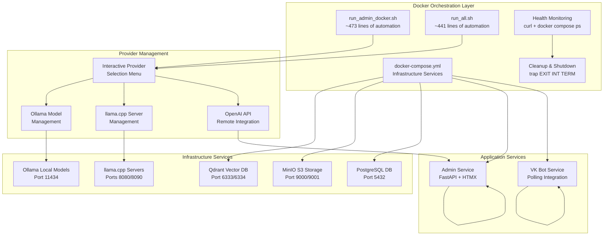

# Development Workflow

<cite>
**Referenced Files in This Document**
- [pyproject.toml](file://pyproject.toml)
- [uv.lock](file://uv.lock)
- [packages/core/pyproject.toml](file://packages/core/pyproject.toml)
- [packages/admin/pyproject.toml](file://packages/admin/pyproject.toml)
- [packages/vk_bot/pyproject.toml](file://packages/vk_bot/pyproject.toml)
- [packages/core/src/cafetera_core/config.py](file://packages/core/src/cafetera_core/config.py)
- [packages/admin/src/cafetera_admin/main.py](file://packages/admin/src/cafetera_admin/main.py)
- [packages/vk_bot/src/cafetera_vk_bot/bot.py](file://packages/vk_bot/src/cafetera_vk_bot/bot.py)
- [scripts/run_all.sh](file://scripts/run_all.sh)
- [scripts/run_admin_docker.sh](file://scripts/run_admin_docker.sh)
- [scripts/run_admin.sh](file://scripts/run_admin.sh)
- [scripts/run_llama_embeddings.sh](file://scripts/run_llama_embeddings.sh)
- [scripts/run_llama_llm.sh](file://scripts/run_llama_llm.sh)
- [scripts/run_ollama_embeddings.sh](file://scripts/run_ollama_embeddings.sh)
- [scripts/run_ollama_llm.sh](file://scripts/run_ollama_llm.sh)
- [docker-compose.yml](file://docker-compose.yml)
- [Dockerfile.admin](file://Dockerfile.admin)
- [Dockerfile.polling_vk](file://Dockerfile.polling_vk)
- [tests/conftest.py](file://tests/conftest.py)
- [tests/test_config.py](file://tests/test_config.py)
- [tests/test_keyboards.py](file://tests/test_keyboards.py)
- [tests/test_states.py](file://tests/test_states.py)
</cite>

## Update Summary
**Changes Made**
- Updated to reflect comprehensive Docker-based development orchestration with sophisticated automation scripts
- Enhanced documentation for run_all.sh (~441 lines) and run_admin_docker.sh (~473 lines) providing advanced Docker orchestration capabilities
- Added detailed coverage of interactive provider selection for LLM and embedding services
- Updated development environment setup procedures for Docker-based infrastructure management
- Enhanced testing procedures with Docker-aware test configuration
- Added comprehensive troubleshooting guide for Docker-based development environments

## Table of Contents
1. [Introduction](#introduction)
2. [Project Structure](#project-structure)
3. [Docker-Based Development Orchestration](#docker-based-development-orchestration)
4. [Core Components](#core-components)
5. [Development Environment Setup](#development-environment-setup)
6. [Docker-Based Development Workflow](#docker-based-development-workflow)
7. [Package-Specific Development](#package-specific-development)
8. [Testing in Docker Architecture](#testing-in-docker-architecture)
9. [Code Quality Tools](#code-quality-tools)
10. [Running Services and Scripts](#running-services-and-scripts)
11. [Troubleshooting Guide](#troubleshooting-guide)
12. [Best Practices](#best-practices)
13. [Conclusion](#conclusion)

## Introduction
This document describes the development workflow and best practices for cafetera_hr_bot, a comprehensive Docker-based development environment featuring sophisticated automation scripts and modern workspace architecture using uv. The project has been restructured into separate packages for core functionality, admin interface, and VK bot integration, each with dedicated development workflows while maintaining tight integration through uv workspace management and Docker-based orchestration.

The Docker-based architecture provides enhanced development experience with automated infrastructure provisioning, interactive provider selection, workspace-aware imports, package-based module execution patterns, and streamlined dependency management across multiple Python packages. This documentation covers environment setup, code quality tools (Ruff, MyPy), testing procedures, validation commands, and code review guidelines tailored for the new Docker-based development workflow.

**Updated** Enhanced with comprehensive documentation for Docker-based development orchestration, sophisticated automation scripts, and workspace-based package architecture.

## Project Structure
The repository follows a modern monorepo architecture with Docker-based development orchestration, organizing functionality into distinct packages with comprehensive automation:

```
cafetera_hr_bot/
├── pyproject.toml                    # Workspace root configuration
├── uv.lock                          # Workspace dependency lock file
├── docker-compose.yml               # Docker orchestration configuration
├── Dockerfile.admin                 # Admin service Docker build
├── Dockerfile.polling_vk            # VK bot Docker build
├── packages/
│   ├── core/                        # Core domain logic and RAG pipeline
│   │   ├── pyproject.toml           # Core package configuration
│   │   └── src/cafetera_core/       # Core implementation
│   ├── admin/                       # Admin web interface (FastAPI + HTMX)
│   │   ├── pyproject.toml           # Admin package configuration
│   │   └── src/cafetera_admin/      # Admin implementation
│   └── vk_bot/                      # VK Bot integration
│       ├── pyproject.toml           # VK Bot package configuration
│       └── src/cafetera_vk_bot/     # VK Bot implementation
├── scripts/                         # Development automation scripts (~441-473 lines each)
├── tests/                           # Shared test suite with Docker awareness
├── static/                          # Static assets
├── templates/                       # HTML templates
└── .env.example                     # Environment configuration template
```

**Updated** Added comprehensive project structure documentation reflecting the new Docker-based monorepo organization with sophisticated automation scripts.

**Section sources**
- [pyproject.toml:22-28](file://pyproject.toml#L22-L28)
- [docker-compose.yml:1-115](file://docker-compose.yml#L1-L115)
- [Dockerfile.admin:1-96](file://Dockerfile.admin#L1-L96)
- [Dockerfile.polling_vk:1-84](file://Dockerfile.polling_vk#L1-L84)

## Docker-Based Development Orchestration
The Docker-based architecture leverages sophisticated automation scripts to manage complex development environments with interactive provider selection and automated dependency management:



**Diagram sources**
- [docker-compose.yml:1-115](file://docker-compose.yml#L1-L115)
- [scripts/run_all.sh:1-441](file://scripts/run_all.sh#L1-L441)
- [scripts/run_admin_docker.sh:1-473](file://scripts/run_admin_docker.sh#L1-L473)

**Section sources**
- [docker-compose.yml:1-115](file://docker-compose.yml#L1-L115)
- [scripts/run_all.sh:208-292](file://scripts/run_all.sh#L208-L292)
- [scripts/run_admin_docker.sh:192-276](file://scripts/run_admin_docker.sh#L192-L276)

## Core Components
The Docker-based architecture organizes functionality into three primary packages, each with distinct responsibilities and Docker integration:

### Core Package (`cafetera-core`)
- **Domain Logic**: Centralized business logic, entity definitions, and service implementations
- **RAG Pipeline**: Complete Retrieval-Augmented Generation system with indexing, retrieval, and generation
- **Storage Abstractions**: Database and S3 storage implementations with dependency injection
- **Configuration Management**: Unified settings management with environment variable support

### Admin Package (`cafetera-admin`)
- **Web Interface**: FastAPI-based admin interface with HTMX partials and interactive elements
- **Document Management**: Full CRUD operations for document management with background processing
- **Authentication**: API key-based authentication for admin access
- **Template System**: Jinja2 templates with static asset serving
- **Docker Integration**: Built via Dockerfile.admin with optimized multi-stage build

### VK Bot Package (`cafetera-vk-bot`)
- **Bot Integration**: VKontakte bot implementation with vkbottle framework
- **Handler System**: Modular handler architecture with state management
- **Interactive UI**: Keyboard-based navigation and service actions
- **Polling Mechanism**: Background polling for message processing
- **Docker Integration**: Built via Dockerfile.polling_vk with optimized multi-stage build

**Updated** Enhanced with comprehensive coverage of all three workspace packages and their Docker-specific development workflows.

**Section sources**
- [packages/core/pyproject.toml:6-24](file://packages/core/pyproject.toml#L6-L24)
- [packages/admin/pyproject.toml:6-12](file://packages/admin/pyproject.toml#L6-L12)
- [packages/vk_bot/pyproject.toml:6-9](file://packages/vk_bot/pyproject.toml#L6-L9)
- [Dockerfile.admin:1-96](file://Dockerfile.admin#L1-L96)
- [Dockerfile.polling_vk:1-84](file://Dockerfile.polling_vk#L1-L84)

## Development Environment Setup
Setting up the development environment requires understanding the Docker-based orchestration and uv's dependency management:

### Prerequisites
- **Python 3.13+**: Required for all packages
- **uv**: Modern Python package manager with workspace support
- **Docker**: Essential for infrastructure services (PostgreSQL, Qdrant, MinIO)
- **Optional**: Ollama for local LLM/embedding services
- **Optional**: llama.cpp for custom local inference servers

### Docker Environment Installation Process
1. **Clone Repository**: `git clone <repository-url>`
2. **Navigate to Project Root**: `cd cafetera_hr_bot`
3. **Install Dependencies**: `uv sync --all-packages`
4. **Configure Environment**: Copy `.env.example` to `.env` and configure service URLs
5. **Start Infrastructure**: Choose development script approach

### Environment Configuration
- **Environment Variables**: Copy `.env.example` to `.env` and configure service URLs
- **Service Dependencies**: Docker Compose handles infrastructure services automatically
- **Workspace Sources**: uv automatically resolves workspace package dependencies
- **Docker Networking**: Services communicate via Docker network names

**Updated** Added comprehensive development environment setup covering Docker-based infrastructure management and workspace-specific requirements.

**Section sources**
- [pyproject.toml:30-53](file://pyproject.toml#L30-L53)
- [pyproject.toml:36-49](file://pyproject.toml#L36-L49)
- [docker-compose.yml:64-76](file://docker-compose.yml#L64-L76)

## Docker-Based Development Workflow
The Docker-based architecture enables sophisticated development patterns with automated infrastructure provisioning and interactive service management:

### Automated Infrastructure Provisioning
Each development script orchestrates the complete system startup with sophisticated health monitoring:

```bash
# Complete system startup with all services
./scripts/run_all.sh

# Admin-only development with selective infrastructure
./scripts/run_admin_docker.sh

# Local development without Docker orchestration
./scripts/run_admin.sh
```

### Interactive Provider Selection
Both run_all.sh and run_admin_docker.sh provide comprehensive provider selection:

```bash
# LLM Provider Selection
Select LLM provider:
  1) ollama (default)
  2) openai
  3) llamacpp
Enter choice [1-3, Enter=1]: 

# Embedding Provider Selection  
Select Embedding provider:
  1) ollama (default)
  2) openai
  3) llamacpp
Enter choice [1-3, Enter=1]:
```

### Automated Dependency Management
Scripts handle complex dependency scenarios:
- **Ollama Model Management**: Automatic model pulling and verification
- **llama.cpp Server Management**: Background server startup and health checks
- **Environment Variable Loading**: Priority handling between .env and environment variables
- **Health Monitoring**: Comprehensive service readiness validation

**Updated** Added detailed coverage of Docker-based development patterns, automated infrastructure management, and interactive service configuration.

**Section sources**
- [scripts/run_all.sh:208-292](file://scripts/run_all.sh#L208-L292)
- [scripts/run_admin_docker.sh:192-276](file://scripts/run_admin_docker.sh#L192-L276)
- [scripts/run_all.sh:320-389](file://scripts/run_all.sh#L320-L389)
- [scripts/run_admin_docker.sh:304-368](file://scripts/run_admin_docker.sh#L304-L368)

## Package-Specific Development
Each package maintains its own development workflow while benefiting from Docker-based orchestration:

### Core Package Development
- **Domain Development**: Work on core business logic and RAG pipeline
- **Testing**: Package-specific unit tests in `tests/` directory
- **Documentation**: Internal API documentation for core components
- **Integration**: Provides foundation for other packages
- **Docker Build**: Optimized multi-stage build with model caching

### Admin Package Development  
- **Web Development**: FastAPI routes, templates, and static assets
- **UI Development**: HTMX partials and interactive components
- **API Development**: REST endpoints for document management
- **Deployment**: Hypercorn ASGI server configuration
- **Docker Optimization**: Pre-downloaded model caching for faster startup

### VK Bot Package Development
- **Bot Development**: Handler registration and state management
- **UI Development**: Keyboard components and navigation
- **Integration**: VK API integration and polling mechanisms
- **Testing**: Message handling and state transition testing
- **Docker Efficiency**: Optimized build with pre-downloaded models

**Updated** Enhanced with package-specific development workflows and Docker-specific optimizations.

**Section sources**
- [packages/core/src/cafetera_core/config.py:1-50](file://packages/core/src/cafetera_core/config.py#L1-L50)
- [packages/admin/src/cafetera_admin/main.py:1-50](file://packages/admin/src/cafetera_admin/main.py#L1-L50)
- [packages/vk_bot/src/cafetera_vk_bot/bot.py:1-32](file://packages/vk_bot/src/cafetera_vk_bot/bot.py#L1-L32)
- [Dockerfile.admin:44-50](file://Dockerfile.admin#L44-L50)
- [Dockerfile.polling_vk:40-46](file://Dockerfile.polling_vk#L40-L46)

## Testing in Docker Architecture
The Docker-based architecture supports comprehensive testing across all packages with workspace-aware import resolution and Docker-aware test configuration:

### Test Configuration
- **pytest Configuration**: Workspace-aware test discovery and import resolution
- **Source Paths**: Tests target workspace package source directories
- **Shared Utilities**: Common test utilities available across packages
- **Docker Awareness**: Test fixtures detect and handle Docker availability

### Package-Specific Testing
- **Core Tests**: Domain logic, RAG pipeline, and storage functionality
- **Admin Tests**: API endpoints, authentication, and document operations
- **VK Bot Tests**: Handler logic, state management, and keyboard interactions

### Docker-Aware Testing
```bash
# Run all workspace tests with Docker awareness
uv run pytest

# Run tests with Docker requirement markers
uv run pytest -m "requires_docker"

# Skip Docker-dependent tests when Docker unavailable
uv run pytest --disable-warnings
```

**Updated** Added comprehensive testing documentation for Docker-based package structure with Docker-aware test configuration.

**Section sources**
- [pyproject.toml:30-33](file://pyproject.toml#L30-L33)
- [pyproject.toml:36-49](file://pyproject.toml#L36-L49)
- [tests/conftest.py:23-42](file://tests/conftest.py#L23-L42)

## Code Quality Tools
The Docker-based architecture integrates code quality tools with workspace-aware configuration and Docker optimization:

### Ruff Configuration
- **Workspace-wide Linting**: Single configuration targets all workspace packages
- **Source Directories**: Configured for workspace package source locations
- **Linting Rules**: Comprehensive rule set including error detection, formatting, and style
- **Docker Optimization**: Optimized for Docker build environments

### MyPy Configuration  
- **Type Checking**: Workspace-aware type checking across package boundaries
- **Python Version**: Configured for Python 3.13 compatibility
- **Strict Mode**: Flexible strictness settings for gradual adoption
- **Docker Caching**: Efficient caching in Docker build environments

### Tool Integration
```bash
# Run workspace-wide linting
uv run ruff check

# Run type checking
uv run mypy packages/

# Fix common issues
uv run ruff check --fix

# Docker-optimized linting
docker compose run admin ruff check
```

**Updated** Enhanced with comprehensive code quality tool configuration for Docker-based workspace architecture.

**Section sources**
- [pyproject.toml:36-49](file://pyproject.toml#L36-L49)
- [pyproject.toml:44-49](file://pyproject.toml#L44-L49)

## Running Services and Scripts
The Docker-based architecture provides comprehensive automation through sophisticated development scripts:

### Complete System Startup (`run_all.sh`)
The comprehensive orchestration script manages the entire development environment:

```bash
./scripts/run_all.sh
```

**Features:**
- **Infrastructure Setup**: PostgreSQL, Qdrant, MinIO containers with health monitoring
- **Interactive Provider Selection**: LLM and embedding provider configuration
- **Service Health Checks**: Automated health monitoring with detailed error reporting
- **Background Processing**: Concurrent service startup with cleanup handling
- **Docker Integration**: Seamless Docker Compose integration

### Admin Service Only (`run_admin_docker.sh`)
Focused development on the admin interface with Docker orchestration:

```bash
./scripts/run_admin_docker.sh
```

**Features:**
- **Selective Startup**: Only admin-related infrastructure (qdrant, minio, postgres)
- **Provider Management**: Local Ollama and llama.cpp server startup
- **Health Monitoring**: Comprehensive service readiness validation
- **Docker Optimization**: Optimized Docker build and deployment

### Local Development (`run_admin.sh`)
Alternative local development without Docker orchestration:

```bash
./scripts/run_admin.sh
```

**Features:**
- **Direct uv execution**: No Docker orchestration overhead
- **Local provider management**: Direct Ollama and llama.cpp control
- **Workspace-aware**: Full uv workspace integration
- **Dependency sync**: Automatic dependency management

### Provider Management Scripts
Additional scripts support specialized AI provider configurations:
- **Ollama Management**: `run_ollama_embeddings.sh`, `run_ollama_llm.sh`
- **llama.cpp Management**: `run_llama_embeddings.sh`, `run_llama_llm.sh`
- **Polling Integration**: `run_polling_vk.sh` for VK bot development

**Updated** Added comprehensive coverage of Docker-based service management and automation scripts.

**Section sources**
- [scripts/run_all.sh:1-441](file://scripts/run_all.sh#L1-L441)
- [scripts/run_admin_docker.sh:1-473](file://scripts/run_admin_docker.sh#L1-L473)
- [scripts/run_admin.sh:1-445](file://scripts/run_admin.sh#L1-L445)

## Troubleshooting Guide
Docker-based development environment troubleshooting with comprehensive error handling:

### Docker Infrastructure Issues
- **Docker Not Found**: Ensure Docker Desktop is installed and in PATH
- **Port Conflicts**: Check for conflicting service ports (5432, 6333, 9000, 11434)
- **Volume Permissions**: Verify Docker has access to project directory
- **Network Issues**: Check Docker network connectivity between services

### Service Health Problems
- **PostgreSQL Ready**: Use `docker compose exec postgres pg_isready` to verify
- **Qdrant Healthy**: Check `docker compose ps qdrant` for health status
- **MinIO Ready**: Verify `mc ready local` health check
- **Service Logs**: Use `docker compose logs service_name` for detailed errors

### Provider Selection Issues
- **Ollama Models**: Verify model availability with `ollama list`
- **llama.cpp Servers**: Check server responsiveness at localhost ports
- **API Keys**: Ensure OpenAI API keys are properly configured
- **Model Names**: Verify exact model name spelling with quantization suffixes

### Development Script Issues
- **Script Permissions**: Ensure scripts are executable (`chmod +x scripts/*.sh`)
- **Environment Variables**: Verify .env file contains required configuration
- **uv Installation**: Check uv version compatibility with workspace
- **Docker Compose**: Verify docker-compose.yml syntax and service definitions

### Testing Problems
- **Docker Availability**: Scripts detect Docker presence and skip tests when unavailable
- **Test Container Issues**: PostgreSQL test containers may fail to start
- **Import Resolution**: Verify PYTHONPATH configuration for workspace packages
- **Dependency Issues**: Re-run `uv sync` to refresh workspace dependencies

**Updated** Enhanced troubleshooting guide covering Docker-based development environment issues and solutions.

**Section sources**
- [scripts/run_all.sh:129-163](file://scripts/run_all.sh#L129-L163)
- [scripts/run_admin_docker.sh:125-147](file://scripts/run_admin_docker.sh#L125-L147)
- [docker-compose.yml:11-16](file://docker-compose.yml#L11-L16)
- [tests/conftest.py:23-42](file://tests/conftest.py#L23-L42)

## Best Practices
Docker-based development best practices for cafetera_hr_bot:

### Docker Development Workflow
- **Service Selection**: Use `run_admin_docker.sh` for focused admin development
- **Full Stack Development**: Use `run_all.sh` for complete system development
- **Local Development**: Use `run_admin.sh` for direct uv workspace development
- **Provider Management**: Leverage interactive provider selection for optimal development

### Package Organization
- **Clear Boundaries**: Maintain distinct responsibilities for each package
- **Minimal Dependencies**: Keep cross-package dependencies to essential minimum
- **Namespace Consistency**: Use consistent import namespaces across packages
- **Docker Optimization**: Utilize pre-downloaded models and optimized builds

### Development Workflow
- **Docker Awareness**: Always develop within the Docker context when using Docker scripts
- **Dependency Management**: Use workspace sources for inter-package dependencies
- **Testing Strategy**: Develop and test each package independently while validating Docker integration
- **Health Monitoring**: Monitor service health during development

### Code Quality
- **Consistent Formatting**: Use Ruff for workspace-wide formatting consistency
- **Type Safety**: Leverage MyPy for comprehensive type checking
- **Documentation**: Maintain clear documentation for Docker-specific package interfaces
- **Performance**: Utilize Docker build optimizations and model caching

### Deployment Considerations
- **Workspace Packaging**: Ensure workspace packages can be built independently
- **Dependency Resolution**: Verify uv.lock provides reproducible builds
- **Environment Configuration**: Maintain environment variable documentation for all packages
- **Docker Optimization**: Leverage multi-stage builds and model caching

**Updated** Added comprehensive best practices for Docker-based development workflow.

## Conclusion
The Docker-based development architecture significantly enhances the development workflow for cafetera_hr_bot by providing sophisticated automation, interactive service management, and optimized Docker integration. The new architecture with comprehensive automation scripts enables better code organization, improved maintainability, and streamlined development processes across multiple Python packages with Docker-based orchestration.

Key benefits of the Docker-based architecture include:
- **Enhanced Automation**: Sophisticated scripts (~441-473 lines) with interactive provider selection
- **Comprehensive Orchestration**: Automated infrastructure provisioning with health monitoring
- **Flexible Development Options**: Multiple development approaches (Docker, local, hybrid)
- **Optimized Performance**: Multi-stage Docker builds with model caching
- **Robust Error Handling**: Comprehensive troubleshooting and cleanup mechanisms

By leveraging Docker-based development orchestration, developers can efficiently work with multiple packages while maintaining clean import boundaries, proper dependency resolution, and comprehensive service management. The enhanced development environment setup, testing procedures, and troubleshooting guidance ensure a smooth development experience across all Docker-based development scenarios.

**Updated** Enhanced conclusion reflecting the benefits and advantages of the Docker-based architecture for cafetera_hr_bot development with sophisticated automation capabilities.