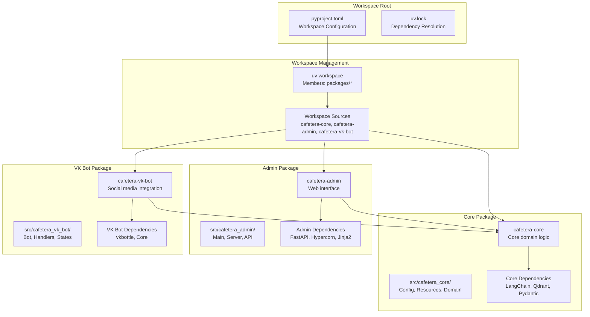

# Development Workflow

<cite>
**Referenced Files in This Document**
- [pyproject.toml](file://pyproject.toml)
- [uv.lock](file://uv.lock)
- [packages/core/pyproject.toml](file://packages/core/pyproject.toml)
- [packages/admin/pyproject.toml](file://packages/admin/pyproject.toml)
- [packages/vk_bot/pyproject.toml](file://packages/vk_bot/pyproject.toml)
- [packages/core/src/cafetera_core/config.py](file://packages/core/src/cafetera_core/config.py)
- [packages/admin/src/cafetera_admin/main.py](file://packages/admin/src/cafetera_admin/main.py)
- [packages/vk_bot/src/cafetera_vk_bot/bot.py](file://packages/vk_bot/src/cafetera_vk_bot/bot.py)
- [scripts/run_all.sh](file://scripts/run_all.sh)
- [scripts/run_admin.sh](file://scripts/run_admin.sh)
- [tests/test_config.py](file://tests/test_config.py)
- [tests/test_keyboards.py](file://tests/test_keyboards.py)
- [tests/test_states.py](file://tests/test_states.py)
</cite>

## Update Summary
**Changes Made**
- Updated to reflect comprehensive monorepo restructuring with uv workspace architecture
- Enhanced development workflow documentation for workspace-based package management
- Added detailed coverage of workspace-aware package organization (core, admin, vk_bot)
- Updated development environment setup procedures for uv workspace support
- Enhanced testing procedures for workspace-based package structure
- Added comprehensive troubleshooting guide for workspace-specific issues

## Table of Contents
1. [Introduction](#introduction)
2. [Project Structure](#project-structure)
3. [Workspace Architecture](#workspace-architecture)
4. [Core Components](#core-components)
5. [Development Environment Setup](#development-environment-setup)
6. [Workspace-Based Development Workflow](#workspace-based-development-workflow)
7. [Package-Specific Development](#package-specific-development)
8. [Testing in Workspace Architecture](#testing-in-workspace-architecture)
9. [Code Quality Tools](#code-quality-tools)
10. [Running Services and Scripts](#running-services-and-scripts)
11. [Troubleshooting Guide](#troubleshooting-guide)
12. [Best Practices](#best-practices)
13. [Conclusion](#conclusion)

## Introduction
This document describes the development workflow and best practices for cafetera_hr_bot, a comprehensive monorepo project featuring a modern workspace-based architecture using uv. The project has been restructured into separate packages for core functionality, admin interface, and VK bot integration, each with dedicated development workflows while maintaining tight integration through uv workspace management.

The workspace architecture provides enhanced development experience with workspace-aware imports, package-based module execution patterns, and streamlined dependency management across multiple Python packages. This documentation covers environment setup, code quality tools (Ruff, MyPy), testing procedures, validation commands, and code review guidelines tailored for the new workspace structure.

**Updated** Enhanced with comprehensive documentation for workspace-based package architecture, uv workspace management, and package-specific development workflows.

## Project Structure
The repository follows a modern monorepo architecture with uv workspace management, organizing functionality into distinct packages:

```
cafetera_hr_bot/
├── pyproject.toml                    # Workspace root configuration
├── uv.lock                          # Workspace dependency lock file
├── packages/
│   ├── core/                        # Core domain logic and RAG pipeline
│   │   ├── pyproject.toml           # Core package configuration
│   │   └── src/cafetera_core/       # Core implementation
│   ├── admin/                       # Admin web interface (FastAPI + HTMX)
│   │   ├── pyproject.toml           # Admin package configuration
│   │   └── src/cafetera_admin/      # Admin implementation
│   └── vk_bot/                      # VK Bot integration
│       ├── pyproject.toml           # VK Bot package configuration
│       └── src/cafetera_vk_bot/     # VK Bot implementation
├── scripts/                         # Development automation scripts
├── tests/                           # Shared test suite
├── static/                          # Static assets
├── templates/                       # HTML templates
└── docker-compose.yml              # Infrastructure orchestration
```

**Updated** Added comprehensive project structure documentation reflecting the new workspace-based monorepo organization.

**Section sources**
- [pyproject.toml:22-28](file://pyproject.toml#L22-L28)
- [packages/core/pyproject.toml:1-29](file://packages/core/pyproject.toml#L1-L29)
- [packages/admin/pyproject.toml:1-20](file://packages/admin/pyproject.toml#L1-L20)
- [packages/vk_bot/pyproject.toml:1-17](file://packages/vk_bot/pyproject.toml#L1-L17)

## Workspace Architecture
The workspace-based architecture leverages uv's advanced workspace management to coordinate multiple Python packages with shared dependencies and workspace-aware imports:



**Diagram sources**
- [pyproject.toml:22-28](file://pyproject.toml#L22-L28)
- [pyproject.toml:25-28](file://pyproject.toml#L25-L28)
- [packages/admin/pyproject.toml:14-15](file://packages/admin/pyproject.toml#L14-L15)
- [packages/vk_bot/pyproject.toml:11-12](file://packages/vk_bot/pyproject.toml#L11-L12)

**Section sources**
- [pyproject.toml:22-28](file://pyproject.toml#L22-L28)
- [pyproject.toml:25-28](file://pyproject.toml#L25-L28)

## Core Components
The workspace architecture organizes functionality into three primary packages, each with distinct responsibilities:

### Core Package (`cafetera-core`)
- **Domain Logic**: Centralized business logic, entity definitions, and service implementations
- **RAG Pipeline**: Complete Retrieval-Augmented Generation system with indexing, retrieval, and generation
- **Storage Abstractions**: Database and S3 storage implementations with dependency injection
- **Configuration Management**: Unified settings management with environment variable support

### Admin Package (`cafetera-admin`)
- **Web Interface**: FastAPI-based admin interface with HTMX partials and interactive elements
- **Document Management**: Full CRUD operations for document management with background processing
- **Authentication**: API key-based authentication for admin access
- **Template System**: Jinja2 templates with static asset serving

### VK Bot Package (`cafetera-vk-bot`)
- **Bot Integration**: VKontakte bot implementation with vkbottle framework
- **Handler System**: Modular handler architecture with state management
- **Interactive UI**: Keyboard-based navigation and service actions
- **Polling Mechanism**: Background polling for message processing

**Updated** Enhanced with comprehensive coverage of all three workspace packages and their specific responsibilities.

**Section sources**
- [packages/core/pyproject.toml:6-24](file://packages/core/pyproject.toml#L6-L24)
- [packages/admin/pyproject.toml:6-12](file://packages/admin/pyproject.toml#L6-L12)
- [packages/vk_bot/pyproject.toml:6-9](file://packages/vk_bot/pyproject.toml#L6-L9)

## Development Environment Setup
Setting up the development environment requires understanding the workspace-based architecture and uv's dependency management:

### Prerequisites
- **Python 3.13+**: Required for all packages
- **uv**: Modern Python package manager with workspace support
- **Docker**: For infrastructure services (PostgreSQL, Qdrant, MinIO)
- **Optional**: Ollama for local LLM/embedding services

### Workspace Installation Process
1. **Clone Repository**: `git clone <repository-url>`
2. **Navigate to Project Root**: `cd cafetera_hr_bot`
3. **Install Dependencies**: `uv sync --all-packages`
4. **Verify Installation**: `uv pip list` should show all workspace packages

### Environment Configuration
- **Environment Variables**: Copy `.env.example` to `.env` and configure service URLs
- **Service Dependencies**: Docker Compose handles infrastructure services
- **Workspace Sources**: uv automatically resolves workspace package dependencies

**Updated** Added comprehensive development environment setup covering workspace-specific requirements.

**Section sources**
- [pyproject.toml:30-53](file://pyproject.toml#L30-L53)
- [pyproject.toml:36-49](file://pyproject.toml#L36-L49)

## Workspace-Based Development Workflow
The workspace architecture enables sophisticated development patterns with workspace-aware imports and package coordination:

### Module Execution Patterns
Each package can be executed independently using Python's module execution syntax:

```bash
# Execute admin package
uv run python -m cafetera_admin.main

# Execute VK bot package  
uv run python -m cafetera_vk_bot.bot

# Execute core functionality
uv run python -m cafetera_core.resources
```

### Workspace-Aware Imports
Internal imports use consistent namespace patterns:
- `cafetera_core.*` for core functionality
- `cafetera_admin.*` for admin features  
- `cafetera_vk_bot.*` for VK bot features

### Package Dependencies
Cross-package dependencies are managed through workspace sources:
- `cafetera-admin` depends on `cafetera-core`
- `cafetera-vk-bot` depends on `cafetera-core`
- Workspace sources ensure proper import resolution

**Updated** Added detailed coverage of workspace-based development patterns and module execution.

**Section sources**
- [packages/admin/src/cafetera_admin/main.py:1-50](file://packages/admin/src/cafetera_admin/main.py#L1-L50)
- [packages/vk_bot/src/cafetera_vk_bot/bot.py:1-32](file://packages/vk_bot/src/cafetera_vk_bot/bot.py#L1-L32)

## Package-Specific Development
Each package maintains its own development workflow while benefiting from workspace coordination:

### Core Package Development
- **Domain Development**: Work on core business logic and RAG pipeline
- **Testing**: Package-specific unit tests in `tests/` directory
- **Documentation**: Internal API documentation for core components
- **Integration**: Provides foundation for other packages

### Admin Package Development  
- **Web Development**: FastAPI routes, templates, and static assets
- **UI Development**: HTMX partials and interactive components
- **API Development**: REST endpoints for document management
- **Deployment**: Hypercorn ASGI server configuration

### VK Bot Package Development
- **Bot Development**: Handler registration and state management
- **UI Development**: Keyboard components and navigation
- **Integration**: VK API integration and polling mechanisms
- **Testing**: Message handling and state transition testing

**Updated** Enhanced with package-specific development workflows and responsibilities.

**Section sources**
- [packages/core/src/cafetera_core/config.py:1-50](file://packages/core/src/cafetera_core/config.py#L1-L50)
- [packages/admin/src/cafetera_admin/main.py:1-50](file://packages/admin/src/cafetera_admin/main.py#L1-L50)
- [packages/vk_bot/src/cafetera_vk_bot/bot.py:1-32](file://packages/vk_bot/src/cafetera_vk_bot/bot.py#L1-L32)

## Testing in Workspace Architecture
The workspace architecture supports comprehensive testing across all packages with workspace-aware import resolution:

### Test Configuration
- **pytest Configuration**: Workspace-aware test discovery and import resolution
- **Source Paths**: Tests target workspace package source directories
- **Shared Utilities**: Common test utilities available across packages

### Package-Specific Testing
- **Core Tests**: Domain logic, RAG pipeline, and storage functionality
- **Admin Tests**: API endpoints, authentication, and document operations
- **VK Bot Tests**: Handler logic, state management, and keyboard interactions

### Test Execution
```bash
# Run all workspace tests
uv run pytest

# Run specific package tests
uv run pytest packages/core/tests/

# Run tests with markers
uv run pytest -m "requires_docker"
```

**Updated** Added comprehensive testing documentation for workspace-based package structure.

**Section sources**
- [pyproject.toml:30-33](file://pyproject.toml#L30-L33)
- [pyproject.toml:36-49](file://pyproject.toml#L36-L49)

## Code Quality Tools
The workspace architecture integrates code quality tools with workspace-aware configuration:

### Ruff Configuration
- **Workspace-wide Linting**: Single configuration targets all workspace packages
- **Source Directories**: Configured for workspace package source locations
- **Linting Rules**: Comprehensive rule set including error detection, formatting, and style

### MyPy Configuration  
- **Type Checking**: Workspace-aware type checking across package boundaries
- **Python Version**: Configured for Python 3.13 compatibility
- **Strict Mode**: Flexible strictness settings for gradual adoption

### Tool Integration
```bash
# Run workspace-wide linting
uv run ruff check

# Run type checking
uv run mypy packages/

# Fix common issues
uv run ruff check --fix
```

**Updated** Enhanced with comprehensive code quality tool configuration for workspace architecture.

**Section sources**
- [pyproject.toml:36-49](file://pyproject.toml#L36-L49)
- [pyproject.toml:44-49](file://pyproject.toml#L44-L49)

## Running Services and Scripts
The workspace architecture provides comprehensive automation through development scripts:

### Complete System Startup
The `run_all.sh` script orchestrates the complete system startup:

```bash
./scripts/run_all.sh
```

Features:
- **Infrastructure Setup**: PostgreSQL, Qdrant, MinIO containers
- **Provider Selection**: Interactive LLM and embedding provider configuration
- **Service Health Checks**: Automated health monitoring
- **Background Processing**: Concurrent service startup

### Admin Service Only
For focused development on the admin interface:

```bash
./scripts/run_admin.sh
```

Features:
- **Selective Startup**: Only admin-related infrastructure
- **Dependency Sync**: Workspace-aware dependency management
- **Local Providers**: Optional local LLM/embedding server startup

### Provider Management
Scripts support multiple AI provider configurations:
- **Ollama**: Local model serving with automatic model pulling
- **OpenAI**: Remote API integration
- **Llama.cpp**: Custom local inference servers

**Updated** Added comprehensive coverage of workspace-based service management and automation.

**Section sources**
- [scripts/run_all.sh:1-441](file://scripts/run_all.sh#L1-L441)
- [scripts/run_admin.sh:1-445](file://scripts/run_admin.sh#L1-L445)

## Troubleshooting Guide
Workspace-specific issues and their solutions:

### Workspace Installation Issues
- **uv Not Found**: Ensure uv is installed and in PATH
- **Workspace Members**: Verify `members = ["packages/*"]` configuration
- **Package Resolution**: Check workspace sources configuration

### Import Resolution Problems
- **Package Names**: Verify workspace package names match source configuration
- **Import Paths**: Ensure imports use correct workspace namespace
- **Dependency Conflicts**: Check uv.lock for dependency resolution issues

### Development Script Issues
- **Docker Connectivity**: Verify Docker daemon is running
- **Port Conflicts**: Check for conflicting service ports
- **Environment Variables**: Ensure .env file contains required configuration

### Testing Problems
- **Workspace Discovery**: Verify pytest configuration targets workspace packages
- **Import Resolution**: Check PYTHONPATH configuration for workspace packages
- **Dependency Issues**: Re-run `uv sync` to refresh workspace dependencies

**Updated** Enhanced troubleshooting guide covering workspace-specific issues and solutions.

**Section sources**
- [pyproject.toml:22-28](file://pyproject.toml#L22-L28)
- [uv.lock:1-12](file://uv.lock#L1-L12)

## Best Practices
Workspace-based development best practices for cafetera_hr_bot:

### Package Organization
- **Clear Boundaries**: Maintain distinct responsibilities for each package
- **Minimal Dependencies**: Keep cross-package dependencies to essential minimum
- **Namespace Consistency**: Use consistent import namespaces across packages

### Development Workflow
- **Workspace Awareness**: Always develop within the workspace context
- **Dependency Management**: Use workspace sources for inter-package dependencies
- **Testing Strategy**: Develop and test each package independently while validating workspace integration

### Code Quality
- **Consistent Formatting**: Use Ruff for workspace-wide formatting consistency
- **Type Safety**: Leverage MyPy for comprehensive type checking
- **Documentation**: Maintain clear documentation for workspace package interfaces

### Deployment Considerations
- **Workspace Packaging**: Ensure workspace packages can be built independently
- **Dependency Resolution**: Verify uv.lock provides reproducible builds
- **Environment Configuration**: Maintain environment variable documentation for all packages

**Updated** Added comprehensive best practices for workspace-based development.

## Conclusion
The workspace-based package architecture significantly enhances the development workflow for cafetera_hr_bot by providing clear separation of concerns, efficient dependency management, and workspace-aware development patterns. The new architecture with uv workspace support enables better code organization, improved maintainability, and streamlined development processes across multiple Python packages.

Key benefits of the workspace architecture include:
- **Enhanced Modularity**: Clear package boundaries with workspace-aware imports
- **Efficient Dependency Management**: Shared dependency resolution across packages
- **Streamlined Development**: Workspace-aware development tools and scripts
- **Improved Testing**: Comprehensive test coverage across all packages
- **Better Collaboration**: Clear package responsibilities and interfaces

By leveraging uv workspace management, developers can efficiently work with multiple packages while maintaining clean import boundaries and proper dependency resolution. The enhanced development environment setup, testing procedures, and troubleshooting guidance ensure a smooth development experience across all workspace packages.

**Updated** Enhanced conclusion reflecting the benefits and advantages of the workspace-based architecture for cafetera_hr_bot development.