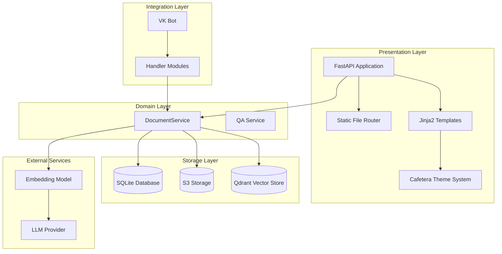
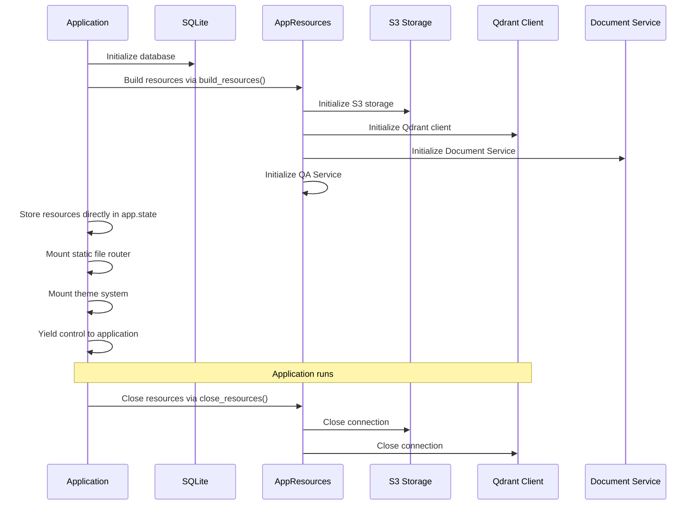
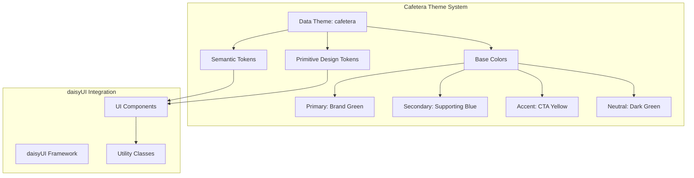
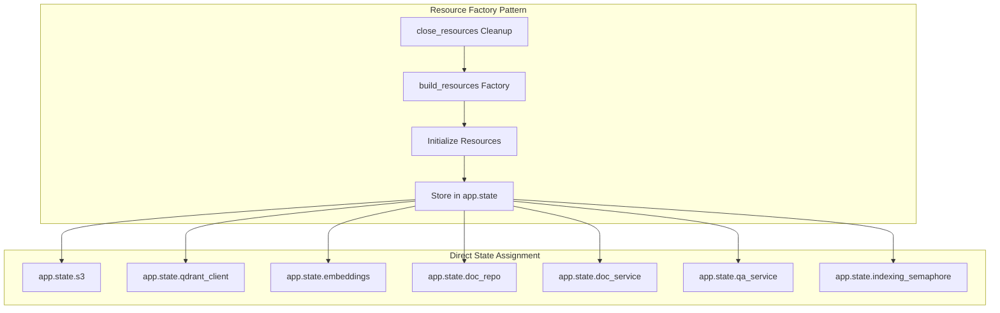
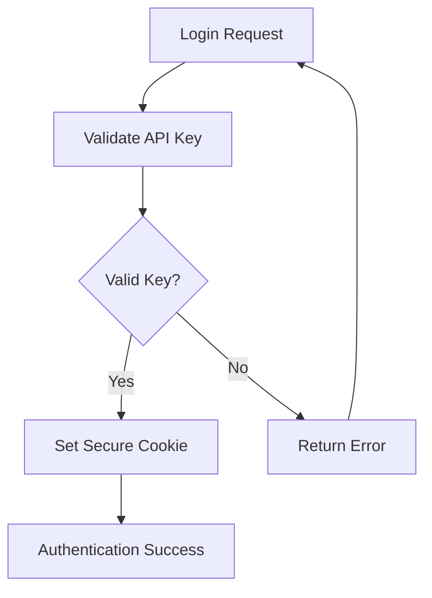
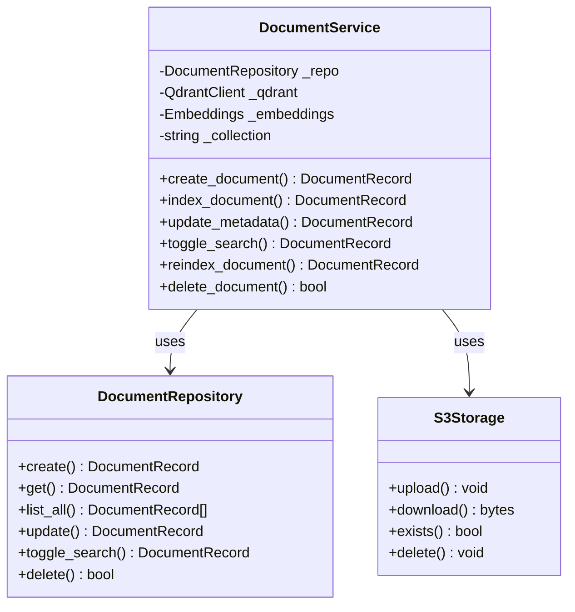
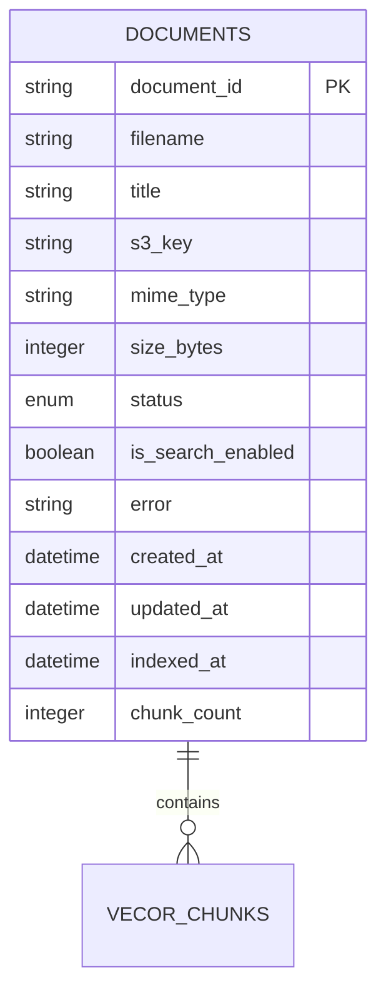
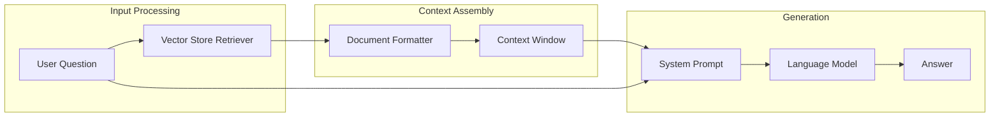
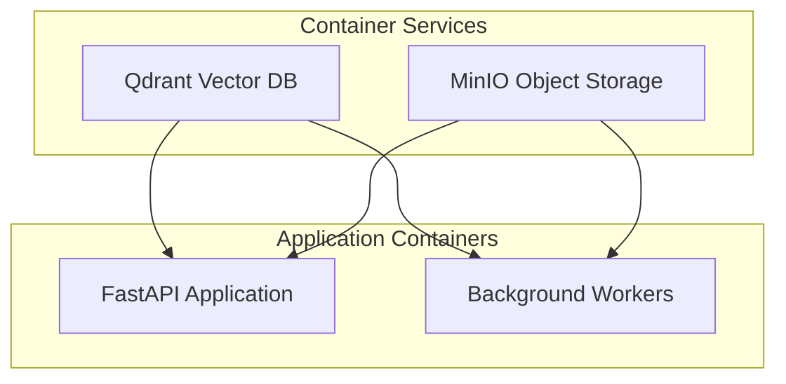

# Main Application Entry Point

<cite>
**Referenced Files in This Document**
- [main.py](file://app/main.py)
- [resources.py](file://app/resources.py)
- [config.py](file://app/config.py)
- [documents.py](file://app/api/documents.py)
- [deps.py](file://app/api/deps.py)
- [document_service.py](file://app/domain/document_service.py)
- [document_repo.py](file://app/storage/document_repo.py)
- [indexer.py](file://app/rag/indexer.py)
- [chain.py](file://app/rag/chain.py)
- [bot.py](file://app/integrations/vk/bot.py)
- [handlers/__init__.py](file://app/integrations/vk/handlers/__init__.py)
- [admin_server.py](file://scripts/admin_server.py)
- [docker-compose.yml](file://docker-compose.yml)
- [pyproject.toml](file://pyproject.toml)
- [base.html](file://templates/base.html)
- [documents.html](file://templates/documents.html)
- [login.html](file://templates/login.html)
- [daisyui.css](file://static/css/daisyui.css)
</cite>

## Update Summary
**Changes Made**
- Updated Resource Lifecycle Management section to reflect streamlined FastAPI application initialization
- Removed references to the complex AppState dataclass and replaced with direct state assignment
- Updated lifespan manager documentation to reflect new build_resources() factory usage
- Enhanced dependency injection system documentation to reflect direct app.state storage
- Updated troubleshooting guide to address new resource management patterns

## Table of Contents
1. [Introduction](#introduction)
2. [Application Architecture Overview](#application-architecture-overview)
3. [Entry Point Analysis](#entry-point-analysis)
4. [CSS Design System Implementation](#css-design-system-implementation)
5. [Static File Serving Infrastructure](#static-file-serving-infrastructure)
6. [Configuration Management](#configuration-management)
7. [Resource Lifecycle Management](#resource-lifecycle-management)
8. [API Integration](#api-integration)
9. [Dependency Injection System](#dependency-injection-system)
10. [Domain Service Layer](#domain-service-layer)
11. [Storage Layer](#storage-layer)
12. [RAG Pipeline Components](#rag-pipeline-components)
13. [Development Server Setup](#development-server-setup)
14. [Production Deployment](#production-deployment)
15. [Troubleshooting Guide](#troubleshooting-guide)

## Introduction

The Cafetera HR Bot is a comprehensive RAG (Retrieval-Augmented Generation) application designed to manage HR-related documents and provide intelligent Q&A capabilities through VKontakte integration. This document focuses specifically on the main application entry point and its surrounding infrastructure, explaining how the FastAPI application is initialized, configured, and integrated with various services.

The application serves as both a document management system for HR policies and procedures, and an AI-powered assistant that can answer employee questions about company policies using a Retrieval-Augmented Generation pipeline.

## Application Architecture Overview

The application follows a layered architecture pattern with clear separation of concerns:



**Diagram sources**
- [main.py:98-119](file://app/main.py#L98-L119)
- [document_service.py:35-53](file://app/domain/document_service.py#L35-L53)

## Entry Point Analysis

The main application entry point is defined in the `app/main.py` file, which serves as the central factory for creating and configuring the FastAPI application instance.

### Application Factory Pattern

The application uses a factory pattern with the `create_app()` function, which encapsulates all initialization logic and configuration. This approach provides several benefits:

- **Testability**: Different configurations can be easily injected for testing
- **Flexibility**: The application can be configured differently for various environments
- **Separation of Concerns**: Initialization logic is isolated from the main application logic

### Streamlined Lifespan Management

**Updated** The application implements streamlined lifespan management through the `lifespan` async context manager, which now uses the new `build_resources()` factory to initialize all components and stores them directly in `app.state` rather than maintaining separate typed attributes.

The lifespan manager follows a simplified initialization pattern:



**Diagram sources**
- [main.py:22-46](file://app/main.py#L22-L46)
- [resources.py:51-165](file://app/resources.py#L51-L165)

**Section sources**
- [main.py:22-75](file://app/main.py#L22-L75)

## CSS Design System Implementation

**Updated** The application now features a comprehensive CSS design system with a custom 'cafetera' theme replacing the previous 'corporate' theme. This implementation leverages daisyUI components with a custom color palette optimized for the Cafetera brand identity.

### Theme Architecture

The design system centers around the `cafetera` theme with a carefully crafted color palette that reflects the brand's warm, earthy aesthetic:



**Diagram sources**
- [base.html:26-80](file://templates/base.html#L26-L80)

### Custom Color Palette

The 'cafetera' theme implements a sophisticated color system using OKLCH color space for optimal color accuracy:

| Color Category | OKLCH Value | HEX Equivalent | Usage |
|----------------|-------------|----------------|-------|
| **Base-100** | oklch(93.51% 0.014 67.7) | #F0E8E0 | Warm beige background |
| **Base-200** | oklch(92.88% 0.011 106.6) | #E8E8E0 | Secondary surface |
| **Base-300** | oklch(86.46% 0.015 70.9) | #D9D1C8 | Borders and dividers |
| **Primary** | oklch(37.83% 0.103 148.6) | #085020 | Brand green (primary) |
| **Secondary** | oklch(73.68% 0.091 245.3) | #78B0E0 | Supporting blue |
| **Accent** | oklch(78.99% 0.167 74.8) | #F8A800 | CTA yellow |
| **Neutral** | oklch(30.70% 0.067 143.7) | #183818 | Dark green |

### Design Token System

The theme implements a dual-token system combining primitive and semantic design tokens:

**Primitive Tokens** (Direct color values):
- `--green-900`: #085020 (brand primary)
- `--green-700`: #183818 (dark green)
- `--beige-100`: #F0E8E0 (warm background)
- `--white-50`: #F8F8F8 (light surface)
- `--yellow-500`: #F8A800 (accent)
- `--blue-300`: #78B0E0 (secondary)
- `--gray-900`: #282828 (text)
- `--black`: #000000

**Semantic Tokens** (Brand-specific values):
- `--color-bg`: var(--beige-100)
- `--color-surface`: var(--white-50)
- `--color-text`: var(--gray-900)
- `--color-primary-dark`: var(--green-700)
- `--color-border`: #D9D1C8

### daisyUI Integration

The theme seamlessly integrates with daisyUI components through CSS custom properties:

```css
[data-theme=cafetera] {
  color-scheme: light;
  --color-base-100: oklch(93.51% 0.014 67.7);
  --color-base-200: oklch(92.88% 0.011 106.6);
  --color-base-300: oklch(86.46% 0.015 70.9);
  --color-primary: oklch(37.83% 0.103 148.6);
  --color-secondary: oklch(73.68% 0.091 245.3);
  --color-accent: oklch(78.99% 0.167 74.8);
  --color-neutral: oklch(30.70% 0.067 143.7);
  --radius-selector: .5rem;
  --radius-field: .25rem;
  --radius-box: .75rem;
}
```

### Component Styling Examples

The theme system enables consistent styling across all UI components:

**Navigation Elements**:
- Sidebar active state: `bg-primary text-primary-content`
- Hover effects: `hover:bg-base-200`
- Disabled states: `text-base-content/40`

**Form Elements**:
- Input fields: `bg-base-100 border border-base-300`
- Buttons: `btn btn-sm btn-primary`
- Modals: `modal-box max-w-lg`

**Status Indicators**:
- Success: `alert-success`
- Error: `alert-error`
- Warning: `alert-warning`
- Info: `alert-info`

**Section sources**
- [base.html:26-80](file://templates/base.html#L26-L80)
- [base.html:14-24](file://templates/base.html#L14-L24)
- [daisyui.css](file://static/css/daisyui.css)

## Static File Serving Infrastructure

**Updated** The application now includes comprehensive static file serving infrastructure with theme-specific styling to replace CDN-based asset loading with local static file hosting.

The FastAPI application mounts a static file router at the '/static' endpoint, enabling local hosting of CSS and JavaScript resources for improved reliability and offline accessibility.

### Static File Router Configuration

The static file serving is implemented through FastAPI's built-in StaticFiles middleware:

```python
# Static files
static_dir = Path(__file__).resolve().parent.parent / "static"
app.mount("/static", StaticFiles(directory=str(static_dir)), name="static")
```

This configuration creates a route handler that serves files from the `static/` directory located at the application root level.

### Asset Organization

Static assets are organized in a structured directory hierarchy:

```
static/
├── css/
│   └── daisyui.css          # UI framework stylesheet
└── js/
    ├── htmx.js              # HTMX AJAX library
    └── alpinejs.js          # Alpine.js reactive framework
```

### Template Integration

Templates reference static assets using the mounted route prefix:

```html
<link href="/static/css/daisyui.css" rel="stylesheet" type="text/css" />
<script src="/static/js/tailwindcss.js"></script>
<script src="/static/js/htmx.js"></script>
<script defer src="/static/js/alpinejs.js"></script>
```

### Theme Integration

The base template integrates the cafetera theme system:

```html
<html lang="ru" data-theme="cafetera">
<head>
  <link href="/static/css/daisyui.css" rel="stylesheet" type="text/css" />
  <!-- Custom theme styles -->
  <style>
    [data-theme=cafetera] {
      --color-base-100: oklch(93.51% 0.014 67.7);
      --color-primary: oklch(37.83% 0.103 148.6);
      --color-accent: oklch(78.99% 167 74.8);
      /* ... theme variables ... */
    }
  </style>
</head>
```

### Benefits Over CDN Approach

- **Reliability**: Eliminates dependency on external CDNs that may be blocked or slow
- **Offline Access**: Assets remain accessible even without internet connectivity
- **Performance**: Reduces latency by serving assets locally
- **Security**: Prevents mixed-content warnings and security policy violations
- **Control**: Full control over asset versions and caching strategies

**Section sources**
- [main.py:61-67](file://app/main.py#L61-L67)
- [base.html:7-10](file://templates/base.html#L7-L10)
- [base.html:26-80](file://templates/base.html#L26-L80)

## Configuration Management

The application uses Pydantic's BaseSettings for robust configuration management through environment variables and `.env` files.

### Configuration Structure

The `Settings` class defines all configurable parameters organized into logical groups:

| Category | Parameters | Purpose |
|----------|------------|---------|
| **VK Integration** | `vk_access_token`, `vk_group_id` | VKontakte bot authentication |
| **RAG/Qdrant** | `qdrant_url`, `qdrant_api_key`, `qdrant_collection` | Vector database configuration |
| **LLM** | `llm_provider`, `llm_model`, `llm_base_url`, `llm_api_key` | Language model settings |
| **Embeddings** | `embedding_model` | Text embedding configuration |
| **Storage** | `db_path`, `s3_endpoint_url`, `s3_access_key`, `s3_secret_key`, `s3_bucket` | Storage backend configuration |
| **Admin** | `admin_api_key` | Administrative access control |

### Environment Variable Loading

Configuration is loaded from `.env` files with UTF-8 encoding support, allowing for flexible deployment across different environments.

**Section sources**
- [config.py:14-53](file://app/config.py#L14-L53)

## Resource Lifecycle Management

**Updated** The application now implements streamlined resource lifecycle management through a consolidated `build_resources()` factory that initializes all components and stores them directly in `app.state`.

### Streamlined Resource Initialization

The new resource management approach eliminates the complex `AppState` dataclass and replaces it with direct state assignment:



**Diagram sources**
- [main.py:29-46](file://app/main.py#L29-L46)
- [resources.py:51-165](file://app/resources.py#L51-L165)

### Resource Initialization Process

1. **Database Initialization**: SQLite database is initialized first to ensure persistent storage is available
2. **Resource Building**: `build_resources()` factory creates and initializes all components
3. **Direct State Assignment**: Resources are stored directly in `app.state` attributes
4. **VK Handler Integration**: QA service is passed to VK handlers via global setter
5. **Static File Router**: Local static file serving is mounted for asset delivery
6. **Theme System**: Custom CSS theme is integrated for consistent styling

### Error Handling Strategy

Each resource initialization includes comprehensive error handling:
- Non-critical failures (like S3 unavailability) log warnings but don't prevent application startup
- Critical failures (like database initialization) would prevent the application from starting
- Graceful degradation allows partial functionality when some services are unavailable

**Section sources**
- [main.py:22-46](file://app/main.py#L22-L46)
- [resources.py:51-165](file://app/resources.py#L51-L165)

## API Integration

The application exposes a comprehensive REST API for document management through the `documents.py` router.

### Authentication System

The API implements cookie-based authentication with secure session management:



**Diagram sources**
- [documents.py:146-173](file://app/api/documents.py#L146-L173)

### Document Management Operations

The API supports complete document lifecycle management:

| Operation | Endpoint | Method | Description |
|-----------|----------|--------|-------------|
| Upload | `/api/documents/upload` | POST | Upload documents to S3 storage |
| List | `/api/documents` | GET | Retrieve all documents |
| Detail | `/api/documents/{id}` | GET | Get document metadata |
| Update Title | `/api/documents/{id}/title` | PATCH | Modify document title |
| Toggle Search | `/api/documents/{id}/search` | PATCH | Enable/disable RAG search |
| Reindex | `/api/documents/{id}/reindex` | POST | Rebuild vector embeddings |
| Delete | `/api/documents/{id}` | DELETE | Remove document completely |

**Section sources**
- [documents.py:1-531](file://app/api/documents.py#L1-L531)

## Dependency Injection System

**Updated** The application implements a comprehensive dependency injection system through FastAPI's dependency mechanism, now utilizing the streamlined resource management approach.

### Direct State-Based Dependencies

All dependencies now access resources directly from `app.state`:

| Dependency Type | Purpose | Implementation |
|----------------|---------|----------------|
| `AdminDep` | Authentication | Validates admin session cookie |
| `SettingsDep` | Configuration | Provides application settings |
| `TemplatesDep` | Template Rendering | Jinja2 template engine |
| `RepoDep` | Data Access | DocumentRepository instance |
| `ServiceDep` | Business Logic | DocumentService instance |
| `S3Dep` | Storage Access | S3Storage instance |
| `IndexingSemaphoreDep` | Concurrency Control | asyncio.Semaphore instance |
| `QAServiceDep` | RAG Service | QAService instance |

### Security Considerations

All dependencies implement proper error handling:
- Missing or invalid admin sessions return 403 Forbidden
- Unavailable services return 503 Service Unavailable
- Sensitive operations require proper authentication

**Section sources**
- [deps.py:39-109](file://app/api/deps.py#L39-L109)

## Domain Service Layer

The `DocumentService` class serves as the central coordinator for all document-related operations, implementing the domain service pattern.

### Service Responsibilities



**Diagram sources**
- [document_service.py:35-280](file://app/domain/document_service.py#L35-L280)
- [document_repo.py:61-202](file://app/storage/document_repo.py#L61-L202)

### Business Logic Orchestration

The service coordinates between three distinct systems:
1. **Metadata Management**: SQLite for document records and status tracking
2. **File Storage**: S3-compatible storage for document files
3. **Vector Indexing**: Qdrant for semantic search capabilities

**Section sources**
- [document_service.py:35-280](file://app/domain/document_service.py#L35-L280)

## Storage Layer

The storage layer implements a clean separation between metadata persistence and file storage.

### Document Repository Pattern

The `DocumentRepository` implements the repository pattern for SQLite operations:



**Diagram sources**
- [document_repo.py:14-47](file://app/storage/document_repo.py#L14-L47)

### Status Management

Documents progress through four distinct states during processing:

1. **Pending**: Document registered but not processed
2. **Processing**: Active indexing operation
3. **Completed**: Successfully indexed and searchable
4. **Failed**: Processing encountered errors

**Section sources**
- [document_repo.py:61-202](file://app/storage/document_repo.py#L61-L202)

## RAG Pipeline Components

The RAG pipeline integrates multiple components to provide intelligent document search and retrieval.

### Chain Architecture



**Diagram sources**
- [chain.py:76-95](file://app/rag/chain.py#L76-L95)

### Provider Support

The system supports multiple LLM providers through a unified interface:
- **Ollama**: Local model inference
- **OpenAI**: Cloud-based API
- **Llama.cpp**: Alternative local inference

**Section sources**
- [chain.py:30-95](file://app/rag/chain.py#L30-L95)

## Development Server Setup

The application includes a dedicated development server script for local testing and development.

### Development Features

The `admin_server.py` script provides:

- **Hot Reloading**: Automatic restarts on code changes
- **Debug Logging**: Comprehensive logging for development
- **Local Configuration**: Easy setup for local development
- **Health Checks**: Built-in server health monitoring
- **Static File Serving**: Local hosting of CSS and JavaScript assets
- **Theme Integration**: Real-time theme preview and testing

### Environment Configuration

Development requires minimal setup with the following environment variables:

| Variable | Purpose | Default Value |
|----------|---------|---------------|
| `ADMIN_API_KEY` | Admin authentication | Required |
| `DB_PATH` | SQLite database location | `data/cafetera.db` |
| `S3_ENDPOINT_URL` | MinIO/S3 endpoint | `http://localhost:9000` |
| `QDRANT_URL` | Qdrant service URL | `http://localhost:6333` |

### Static File Access in Development

During development, static assets are served from the local filesystem:
- CSS files: `http://localhost:8000/static/css/daisyui.css`
- JavaScript files: `http://localhost:8000/static/js/htmx.js`
- Alpine.js: `http://localhost:8000/static/js/alpinejs.js`

**Section sources**
- [admin_server.py:1-63](file://scripts/admin_server.py#L1-L63)

## Production Deployment

The application is designed for containerized deployment using Docker Compose.

### Container Configuration

The `docker-compose.yml` defines two essential services:



**Diagram sources**
- [docker-compose.yml:1-34](file://docker-compose.yml#L1-L34)

### Service Dependencies

| Service | Port | Purpose | Persistence |
|---------|------|---------|-------------|
| Qdrant | 6333/tcp, 6334/tcp | Vector database | Volume mounted |
| MinIO | 9000/tcp, 9001/tcp | Object storage | Volume mounted |
| FastAPI | 8000/tcp | Web application | No persistence |
| Background Workers | N/A | Document processing | No persistence |

### Static File Deployment

In production deployments, static files are served efficiently through:
- Nginx or similar reverse proxy for static asset optimization
- Proper caching headers for improved performance
- CDN integration for global distribution (optional)

**Section sources**
- [docker-compose.yml:1-34](file://docker-compose.yml#L1-L34)

## Troubleshooting Guide

### Common Startup Issues

**Database Connection Problems**
- Verify SQLite file permissions
- Check database path configuration
- Ensure write permissions for data directory

**S3 Storage Issues**
- Confirm endpoint URL and credentials
- Verify bucket existence and permissions
- Check network connectivity to storage service

**Qdrant Connection Failures**
- Verify service availability on configured port
- Check API key configuration (if required)
- Ensure sufficient memory allocation

**Static File Access Issues**
- **404 Not Found**: Verify static directory exists and contains required files
- **Permission Denied**: Check file permissions for static directory
- **Route Conflicts**: Ensure no other routes conflict with `/static` prefix
- **Asset Loading Errors**: Verify template references match actual file paths

### CSS Theme Issues

**Theme Not Applying**
- Verify `data-theme="cafetera"` attribute in HTML tag
- Check browser developer tools for CSS loading errors
- Ensure daisyUI CSS file loads successfully
- Verify custom theme variables are properly defined

**Color Inconsistencies**
- Check OKLCH color values are supported by target browsers
- Verify theme variable precedence in CSS cascade
- Ensure custom design tokens override daisyUI defaults correctly

**Component Styling Problems**
- Verify daisyUI utility classes are applied correctly
- Check component-specific theme overrides
- Ensure responsive design breakpoints work with custom theme

### Resource Management Issues

**Resource Initialization Failures**
- **503 Service Unavailable**: Verify all required services are running
- **Missing Dependencies**: Check that `build_resources()` completes successfully
- **State Attribute Errors**: Ensure resources are properly assigned to `app.state`

**Streamlined Resource Patterns**
- **Direct State Access**: All dependencies now access resources via `request.app.state.attribute_name`
- **Graceful Degradation**: Failed resource initialization logs warnings but doesn't crash the app
- **Cleanup Verification**: Ensure `close_resources()` properly closes all connections

### Performance Optimization

**Memory Management**
- Monitor Qdrant memory usage
- Optimize embedding model selection
- Implement proper connection pooling

**Database Performance**
- Regular maintenance of SQLite database
- Optimize queries for large document collections
- Consider database vacuum operations

**Background Processing**
- Monitor background task queue
- Implement proper error handling for failed tasks
- Set appropriate retry limits for failed operations

**Static File Optimization**
- Enable compression for CSS and JavaScript files
- Configure appropriate cache headers
- Consider bundling and minification for production
- Implement versioning for cache busting

### Monitoring and Logging

The application provides comprehensive logging at multiple levels:
- **Startup/Shutdown**: Resource initialization and cleanup
- **API Operations**: Request processing and response generation
- **Background Tasks**: Document processing status
- **Error Conditions**: Exception handling and recovery
- **Static File Access**: Asset loading and serving statistics
- **Theme System**: CSS loading and theme application status
- **Resource Management**: Direct state assignment and cleanup verification

**Section sources**
- [main.py:22-46](file://app/main.py#L22-L46)
- [admin_server.py:31-36](file://scripts/admin_server.py#L31-L36)
- [base.html:26-80](file://templates/base.html#L26-L80)
- [resources.py:168-202](file://app/resources.py#L168-L202)