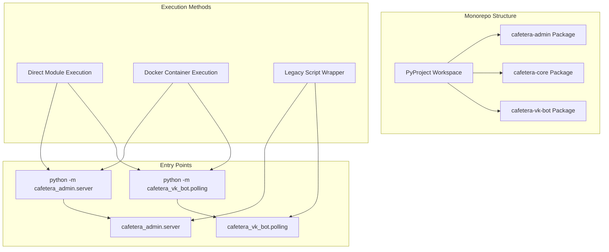
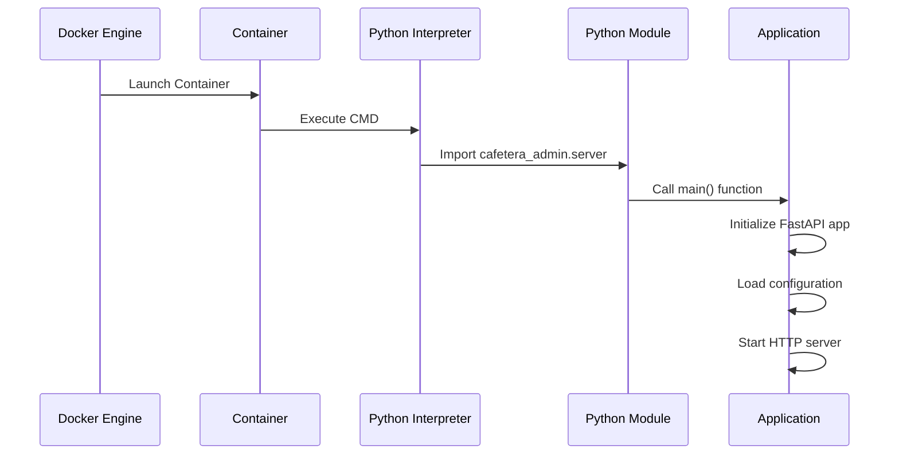

# Main Application Entry Point

<cite>
**Referenced Files in This Document**
- [main.py](file://packages/admin/src/cafetera_admin/main.py)
- [server.py](file://packages/admin/src/cafetera_admin/server.py)
- [polling.py](file://packages/vk_bot/src/cafetera_vk_bot/polling.py)
- [bot.py](file://packages/vk_bot/src/cafetera_vk_bot/bot.py)
- [config.py](file://packages/core/src/cafetera_core/config.py)
- [pyproject.toml](file://pyproject.toml)
- [packages/admin/pyproject.toml](file://packages/admin/pyproject.toml)
- [packages/vk_bot/pyproject.toml](file://packages/vk_bot/pyproject.toml)
- [packages/core/pyproject.toml](file://packages/core/pyproject.toml)
- [Dockerfile.admin](file://Dockerfile.admin)
- [Dockerfile.polling_vk](file://Dockerfile.polling_vk)
- [scripts/admin_server.py](file://scripts/admin_server.py)
- [scripts/polling_vk.py](file://scripts/polling_vk.py)
</cite>

## Update Summary
**Changes Made**
- Updated entry point documentation to reflect replacement of legacy script-based entry points with proper package module execution
- Added comprehensive coverage of new package-based module execution using python -m cafetera_admin.server and python -m cafetera_vk_bot.polling
- Updated development and production deployment sections to reflect new Docker-based execution patterns
- Enhanced troubleshooting guide to address package module execution differences
- Updated Python project configuration to reflect monorepo package structure

## Table of Contents
1. [Introduction](#introduction)
2. [Application Architecture Overview](#application-architecture-overview)
3. [Entry Point Analysis](#entry-point-analysis)
4. [Package Module Execution](#package-module-execution)
5. [Development Server Setup](#development-server-setup)
6. [Production Deployment](#production-deployment)
7. [Python Project Configuration](#python-project-configuration)
8. [Legacy Script Migration](#legacy-script-migration)
9. [Troubleshooting Guide](#troubleshooting-guide)

## Introduction

The Cafetera HR Bot is a comprehensive RAG (Retrieval-Augmented Generation) application designed to manage HR-related documents and provide intelligent Q&A capabilities through VKontakte integration. This document focuses specifically on the main application entry points and their modernized package-based execution patterns, explaining how the FastAPI application and VK bot are initialized, configured, and executed as proper Python packages.

The application has been modernized to use proper package module execution instead of legacy script-based entry points, providing better dependency management, cleaner imports, and more reliable deployment across different environments.

## Application Architecture Overview

The application follows a monorepo architecture with three main packages: admin (FastAPI web interface), vk_bot (VKontakte bot), and core (shared domain logic and utilities). Each package is independently executable as a Python module.



**Diagram sources**
- [pyproject.toml:22-23](file://pyproject.toml#L22-L23)
- [packages/admin/pyproject.toml:1-20](file://packages/admin/pyproject.toml#L1-L20)
- [packages/vk_bot/pyproject.toml:1-17](file://packages/vk_bot/pyproject.toml#L1-L17)
- [packages/core/pyproject.toml:1-29](file://packages/core/pyproject.toml#L1-L29)

## Entry Point Analysis

The main application entry points have been restructured to use proper package module execution patterns instead of standalone script files.

### Admin Application Entry Point

The admin application entry point is now properly packaged as `cafetera_admin.server` with comprehensive module execution support.

**Updated** The admin server now uses proper package module execution with the following command structure:
```bash
uv run python -m cafetera_admin.server
```

The server module provides:
- HTTP/2 support with Hypercorn
- Comprehensive logging configuration
- Environment variable validation
- Proper async context management

### VK Bot Entry Point

The VK bot entry point has been similarly modernized to use proper package execution:
```bash
uv run python -m cafetera_vk_bot.polling
```

The polling module provides:
- Long polling mode for VK bot operations
- Resource initialization within vkbottle's event loop
- Proper cleanup and shutdown handling
- Settings-based configuration

**Section sources**
- [server.py:1-66](file://packages/admin/src/cafetera_admin/server.py#L1-L66)
- [polling.py:1-71](file://packages/vk_bot/src/cafetera_vk_bot/polling.py#L1-L71)

## Package Module Execution

**Updated** The application now uses proper Python package module execution patterns that provide better dependency resolution and import management.

### Module Execution Commands

Both applications now support direct module execution:

**Admin Server:**
```bash
# Development
uv run python -m cafetera_admin.server

# With custom host binding
BIND_HOST=0.0.0.0 uv run python -m cafetera_admin.server
```

**VK Bot:**
```bash
# Development
uv run python -m cafetera_vk_bot.polling
```

### Module Structure

Each package maintains a clean module structure:

**Admin Package Structure:**
```
packages/admin/src/cafetera_admin/
├── __init__.py
├── main.py          # FastAPI application factory
├── server.py        # HTTP server entry point
├── config.py        # Admin-specific settings
└── api/             # API routers and handlers
```

**VK Bot Package Structure:**
```
packages/vk_bot/src/cafetera_vk_bot/
├── __init__.py
├── polling.py       # Long polling entry point
├── bot.py           # Bot factory and configuration
├── config.py        # VK-specific settings
└── handlers/        # Message handlers
```

### Import Resolution

The new package structure provides better import resolution:
- Direct imports from `cafetera_admin.*` and `cafetera_vk_bot.*`
- Proper dependency isolation between packages
- Cleaner namespace management
- Better IDE support and autocompletion

**Section sources**
- [packages/admin/pyproject.toml:1-20](file://packages/admin/pyproject.toml#L1-L20)
- [packages/vk_bot/pyproject.toml:1-17](file://packages/vk_bot/pyproject.toml#L1-L17)
- [packages/core/pyproject.toml:1-29](file://packages/core/pyproject.toml#L1-L29)

## Development Server Setup

**Updated** The development server setup now emphasizes proper package module execution over legacy script wrappers.

### Modern Development Workflow

**Recommended Development Commands:**

**Admin Interface Development:**
```bash
# Start admin server with hot reload
uv run python -m cafetera_admin.server

# With custom configuration
ADMIN_API_KEY=your_key BIND_HOST=0.0.0.0 uv run python -m cafetera_admin.server
```

**VK Bot Development:**
```bash
# Start VK bot in long polling mode
uv run python -m cafetera_vk_bot.polling
```

### Environment Configuration

Development environment variables are now handled consistently:

| Variable | Purpose | Default | Package |
|----------|---------|---------|---------|
| `ADMIN_API_KEY` | Admin authentication | Required | cafetera_admin |
| `BIND_HOST` | Server binding address | `127.0.0.1` | cafetera_admin |
| `VK_ACCESS_TOKEN` | VK bot token | Required | cafetera_vk_bot |
| `QDRANT_URL` | Vector database URL | `http://localhost:6333` | cafetera_core |
| `S3_ENDPOINT_URL` | Object storage endpoint | `http://localhost:9000` | cafetera_core |

### Hot Reload and Debugging

The new package structure supports:
- Standard Python debugging tools
- IDE integration with proper module resolution
- Consistent logging across all packages
- Better error reporting with full stack traces

**Section sources**
- [server.py:37-65](file://packages/admin/src/cafetera_admin/server.py#L37-L65)
- [polling.py:50-66](file://packages/vk_bot/src/cafetera_vk_bot/polling.py#L50-L66)

## Production Deployment

**Updated** Production deployment now uses Docker containers that execute the applications as proper Python modules.

### Docker Container Configuration

**Admin Container:**
```dockerfile
# Dockerfile.admin
CMD ["python", "-m", "cafetera_admin.server"]
```

**VK Bot Container:**
```dockerfile
# Dockerfile.polling_vk
CMD ["python", "-m", "cafetera_vk_bot.polling"]
```

### Container Execution Flow



**Diagram sources**
- [Dockerfile.admin:80](file://Dockerfile.admin#L80)
- [Dockerfile.polling_vk:68](file://Dockerfile.polling_vk#L68)

### Production Environment Variables

**Admin Container Environment:**
- `BIND_HOST=0.0.0.0` (bound to all interfaces)
- `FASTEMBED_CACHE_PATH=/app/.cache/fastembed`
- Pre-downloaded model caches for performance

**VK Bot Container Environment:**
- `FASTEMBED_CACHE_PATH=/app/.cache/fastembed`
- Pre-configured model caches for vector operations

### Health Checking and Monitoring

Containers support:
- Standard container health checks
- Application-level logging to stdout/stderr
- Graceful shutdown handling
- Resource cleanup on container termination

**Section sources**
- [Dockerfile.admin:61-80](file://Dockerfile.admin#L61-L80)
- [Dockerfile.polling_vk:55-68](file://Dockerfile.polling_vk#L55-L68)

## Python Project Configuration

**Updated** The Python project configuration has been modernized to support the new monorepo structure with proper workspace management.

### Workspace Configuration

The main `pyproject.toml` defines a workspace with three packages:

```toml
[tool.uv.workspace]
members = ["packages/*"]

[tool.pytest.ini_options]
pythonpath = ["packages/core/src", "packages/admin/src", "packages/vk_bot/src"]
```

### Package Dependencies

**Core Package (cafetera-core):**
- Shared domain logic and utilities
- RAG pipeline components
- Storage abstractions
- Configuration management

**Admin Package (cafetera-admin):**
- FastAPI web application
- Admin interface and API
- Document management UI
- Static file serving

**VK Bot Package (cafetera-vk-bot):**
- VKontakte bot integration
- Message handlers and flows
- Long polling implementation
- VK-specific configuration

### Development Dependencies

The workspace includes comprehensive development tooling:
- Type checking with mypy
- Code linting with ruff
- Testing with pytest
- Monorepo development with uv

**Section sources**
- [pyproject.toml:1-49](file://pyproject.toml#L1-L49)
- [packages/admin/pyproject.toml:1-20](file://packages/admin/pyproject.toml#L1-L20)
- [packages/vk_bot/pyproject.toml:1-17](file://packages/vk_bot/pyproject.toml#L1-L17)
- [packages/core/pyproject.toml:1-29](file://packages/core/pyproject.toml#L1-L29)

## Legacy Script Migration

**Updated** The legacy script-based entry points have been replaced with proper package module execution, but thin wrapper scripts are maintained for backward compatibility.

### Migration Path

**Old Scripts (Deprecated):**
```python
# scripts/admin_server.py
from cafetera_admin.server import main
```

**New Direct Execution:**
```bash
uv run python -m cafetera_admin.server
```

### Wrapper Scripts

Thin wrapper scripts are maintained for backward compatibility:

**Admin Server Wrapper:**
```python
# scripts/admin_server.py
from cafetera_admin.server import main

if __name__ == "__main__":
    import asyncio
    asyncio.run(main())
```

**VK Bot Wrapper:**
```python
# scripts/polling_vk.py
from cafetera_vk_bot.polling import main

if __name__ == "__main__":
    main()
```

### Migration Benefits

**Direct Module Execution Advantages:**
- Better dependency resolution
- Cleaner import paths
- Improved IDE support
- Consistent execution environment
- Reduced script maintenance overhead

**Wrapper Script Benefits:**
- Backward compatibility
- Gradual migration path
- Familiar command structure
- Simple transition for existing users

**Section sources**
- [scripts/admin_server.py:1-12](file://scripts/admin_server.py#L1-L12)
- [scripts/polling_vk.py:1-11](file://scripts/polling_vk.py#L1-L11)

## Troubleshooting Guide

### Module Execution Issues

**Import Errors**
- Verify Python path includes package directories
- Check that packages are properly installed in development mode
- Ensure workspace packages are accessible to the Python interpreter

**Package Not Found Errors**
- Confirm package names match directory structure
- Verify `__init__.py` files exist in package directories
- Check that package names in `pyproject.toml` match directory names

**Environment Variable Issues**
- **ADMIN_API_KEY not set**: Configure admin authentication key
- **VK access token missing**: Set VK bot token for bot operations
- **Database connection failures**: Verify database URL and credentials
- **S3 storage issues**: Check endpoint URL and bucket configuration

### Docker Execution Problems

**Container Startup Failures**
- **Module not found**: Verify package installation in container
- **Port binding issues**: Check container port mappings
- **Volume mounting errors**: Verify static file and template paths
- **Environment variable conflicts**: Ensure proper environment configuration

**Application Crashes**
- **Import errors in container**: Verify package dependencies are installed
- **Missing static files**: Check that static and template directories are copied
- **Model cache issues**: Verify FastEmbed cache is properly mounted

### Development Environment Issues

**uv Tool Issues**
- **uv not found**: Install uv package manager
- **Virtual environment problems**: Recreate virtual environment
- **Workspace package resolution**: Verify workspace configuration

**IDE Integration Problems**
- **Module not found**: Add package directories to Python path
- **Import suggestions missing**: Restart IDE after workspace changes
- **Debugging issues**: Ensure proper module execution configuration

### Performance and Optimization

**Memory Usage**
- Monitor container memory limits
- Optimize FastEmbed model caching
- Implement proper resource cleanup
- Use appropriate concurrency settings

**Startup Time**
- Pre-download model caches during build
- Optimize static file serving
- Reduce unnecessary logging in production
- Implement lazy initialization where appropriate

**Logging and Monitoring**
- Configure structured logging for containers
- Implement health check endpoints
- Monitor resource utilization
- Set up proper error reporting

**Section sources**
- [server.py:40-42](file://packages/admin/src/cafetera_admin/server.py#L40-L42)
- [polling.py:53-54](file://packages/vk_bot/src/cafetera_vk_bot/polling.py#L53-L54)
- [Dockerfile.admin:28-33](file://Dockerfile.admin#L28-L33)
- [Dockerfile.polling_vk:24-29](file://Dockerfile.polling_vk#L24-L29)