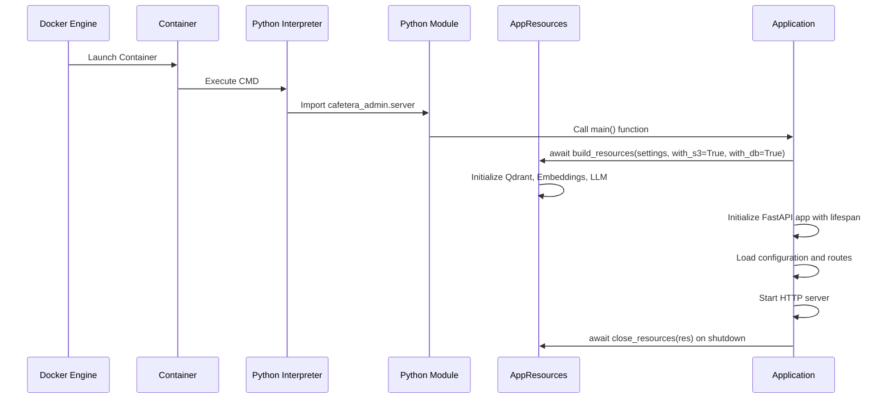

# Main Application Entry Point

<cite>
**Referenced Files in This Document**
- [main.py](file://packages/admin/src/cafetera_admin/main.py)
- [server.py](file://packages/admin/src/cafetera_admin/server.py)
- [polling.py](file://packages/vk_bot/src/cafetera_vk_bot/polling.py)
- [bot.py](file://packages/vk_bot/src/cafetera_vk_bot/bot.py)
- [config.py](file://packages/core/src/cafetera_core/config.py)
- [resources.py](file://packages/core/src/cafetera_core/resources.py)
- [config.py](file://packages/admin/src/cafetera_admin/config.py)
- [config.py](file://packages/vk_bot/src/cafetera_vk_bot/config.py)
- [staleness.py](file://packages/admin/src/cafetera_admin/domain/staleness.py)
- [pyproject.toml](file://pyproject.toml)
- [packages/admin/pyproject.toml](file://packages/admin/pyproject.toml)
- [packages/vk_bot/pyproject.toml](file://packages/vk_bot/pyproject.toml)
- [packages/core/pyproject.toml](file://packages/core/pyproject.toml)
- [Dockerfile.admin](file://Dockerfile.admin)
- [Dockerfile.polling_vk](file://Dockerfile.polling_vk)
- [scripts/admin_server.py](file://scripts/admin_server.py)
- [scripts/polling_vk.py](file://scripts/polling_vk.py)
</cite>

## Update Summary
**Changes Made**
- Updated to reflect the simplified application startup process that removes stale document detection from main.py entry point
- Documented the streamlined resource management approach that focuses on core dependencies
- Updated troubleshooting guide to address the simplified startup workflow
- Enhanced package-based architecture documentation to show the current centralized resource initialization without stale detection

## Table of Contents
1. [Introduction](#introduction)
2. [Application Architecture Overview](#application-architecture-overview)
3. [Centralized Resource Management](#centralized-resource-management)
4. [Entry Point Analysis](#entry-point-analysis)
5. [Package Module Execution](#package-module-execution)
6. [Development Server Setup](#development-server-setup)
7. [Production Deployment](#production-deployment)
8. [Python Project Configuration](#python-project-configuration)
9. [Legacy Script Migration](#legacy-script-migration)
10. [Troubleshooting Guide](#troubleshooting-guide)

## Introduction

The Cafetera HR Bot is a comprehensive RAG (Retrieval-Augmented Generation) application designed to manage HR-related documents and provide intelligent Q&A capabilities through VKontakte integration. This document focuses specifically on the main application entry points and their modernized package-based execution patterns, explaining how the FastAPI application and VK bot are initialized, configured, and executed as proper Python packages with centralized resource management.

The application has been modernized to use a centralized resource management architecture with build_resources()/close_resources() functions, replacing the previous layered architecture approach. This provides better dependency isolation, cleaner resource lifecycle management, and more reliable deployment across different environments. The startup process has been simplified to focus on core resource management and dependency injection without stale document detection overhead.

## Application Architecture Overview

The application follows a monorepo architecture with three main packages: admin (FastAPI web interface), vk_bot (VKontakte bot), and core (shared domain logic and utilities). Each package is independently executable as a Python module with centralized resource management through the core package.

```mermaid
graph TB
subgraph "Monorepo Structure"
AdminPkg[cafetera-admin Package]
CorePkg[cafetera-core Package]
VkBotPkg[cafetera-vk-bot Package]
Workspace[PyProject Workspace]
end
subgraph "Resource Management"
ResourceFactory[build_resources()]
ResourceContainer[AppResources Container]
ResourceCleanup[close_resources()]
end
subgraph "Entry Points"
AdminServer[python -m cafetera_admin.server]
AdminLifespan[lifespan manager]
VkPolling[python -m cafetera_vk_bot.polling]
VkLoop[Event Loop Handlers]
end
Workspace --> AdminPkg
Workspace --> CorePkg
Workspace --> VkBotPkg
AdminPkg --> ResourceFactory
VkBotPkg --> ResourceFactory
ResourceFactory --> ResourceContainer
ResourceContainer --> AdminLifespan
ResourceContainer --> VkLoop
AdminLifespan --> ResourceCleanup
VkLoop --> ResourceCleanup
AdminServer --> AdminLifespan
VkPolling --> VkLoop
```

**Diagram sources**
- [resources.py:255-402](file://packages/core/src/cafetera_core/resources.py#L255-L402)
- [main.py:41-88](file://packages/admin/src/cafetera_admin/main.py#L41-L88)
- [polling.py:21-56](file://packages/vk_bot/src/cafetera_vk_bot/polling.py#L21-L56)

## Centralized Resource Management

**Updated** The application now uses a centralized resource management system that provides consistent initialization and cleanup across all packages, with a simplified startup process that focuses on essential dependencies.

### AppResources Container

The AppResources dataclass serves as a centralized container for all shared application resources:

```python
@dataclass
class AppResources:
    """Container for all shared application resources.
    
    All attributes are optional (None) by default and are initialized
    by build_resources(). This allows graceful degradation when
    certain services are unavailable.
    
    Use ``build_qa_service()`` to create a QAService with a
    package-specific system prompt.
    """
    
    settings: CoreSettings
    qdrant_client: AsyncQdrantClient | None = None
    embeddings: Embeddings | None = None
    llm: BaseChatModel | None = None
    s3: S3Storage | None = None
    db: Database | None = None
    doc_repo: DocumentRepository | None = None
    sparse_embeddings: object | None = None
    colbert_embeddings: object | None = None
    category_file_repo: CategoryFileRepository | None = None
    category_file_service: CategoryFileService | None = None
```

### Resource Lifecycle Functions

**Resource Initialization:**
```python
async def build_resources(
    settings: CoreSettings, *, with_s3: bool = False, with_db: bool = False
) -> AppResources:
    """Build and initialize all application resources with graceful degradation."""
```

**Resource Cleanup:**
```python
async def close_resources(res: AppResources) -> None:
    """Close all resources in the correct order with error handling."""
```

### Resource Building Process

The build_resources() function orchestrates resource initialization with try/except blocks for graceful degradation:

1. **S3 Storage** (optional) - Configured when with_s3=True
2. **Qdrant Client & Embeddings** - Required for document operations
3. **Sparse Embeddings** (optional) - Enables hybrid search
4. **ColBERT Embeddings** (optional) - Enables reranking
5. **Database** (optional) - Configured when with_db=True
6. **LLM** - Required for QA service creation

**Section sources**
- [resources.py:189-252](file://packages/core/src/cafetera_core/resources.py#L189-L252)
- [resources.py:255-402](file://packages/core/src/cafetera_core/resources.py#L255-L402)
- [resources.py:405-449](file://packages/core/src/cafetera_core/resources.py#L405-L449)

## Entry Point Analysis

**Updated** The main application entry points have been restructured to use proper package module execution patterns with centralized resource management, with a simplified startup process that removes stale document detection overhead.

### Admin Application Entry Point

The admin application entry point now uses centralized resource management through the lifespan context manager, with a streamlined startup process.

**Updated** The admin server uses the FastAPI lifespan mechanism with centralized resource initialization:

```python
@asynccontextmanager
async def lifespan(app: FastAPI):
    settings: AdminSettings = app.state.settings
    
    # Ensure models are cached before any document processing
    await asyncio.to_thread(ensure_models_cached, settings.chunker_tokenizer_model)
    
    # Build resources with S3 and DB enabled
    res = await build_resources(settings, with_s3=True, with_db=True)
    
    # Store resources in app.state for dependency injection
    app.state.s3 = res.s3
    app.state.qdrant_client = res.qdrant_client
    app.state.embeddings = res.embeddings
    app.state.doc_repo = res.doc_repo
    
    # Initialize services if resources are available
    if res.doc_repo is not None and res.qdrant_client is not None and res.embeddings is not None:
        app.state.doc_service = DocumentService(...)
    
    if res.qdrant_client is not None and res.embeddings is not None and res.llm is not None:
        app.state.qa_service = res.build_qa_service(GLOBAL_EXPERTS_PROMPT)
    
    # Store category file service
    app.state.category_file_service = res.category_file_service
    app.state.indexing_semaphore = asyncio.Semaphore(settings.max_concurrent_indexing)
    
    yield
    
    # Cleanup resources on shutdown
    await close_resources(res)
```

### VK Bot Entry Point

The VK bot entry point uses centralized resource management within vkbottle's event loop handlers.

**Updated** The VK bot uses event loop handlers for resource management:

```python
async def _setup(bot) -> None:
    """Initialize resources inside vkbottle's event loop."""
    settings = bot._settings
    res = await build_resources(settings, with_s3=True, with_db=True)
    
    # Store resources on bot for cleanup access
    bot._app_resources = res
    
    # Initialize services if resources are available
    if res.qdrant_client is not None and res.embeddings is not None and res.llm is not None:
        set_qa_service(res.build_qa_service(SYSTEM_PROMPT, include_metadata=True))
    
    if res.category_file_service:
        set_category_file_service(res.category_file_service)

async def _cleanup(bot) -> None:
    """Close resources on shutdown."""
    res = getattr(bot, "_app_resources", None)
    if res is not None:
        await close_resources(res)
```

**Section sources**
- [main.py:41-88](file://packages/admin/src/cafetera_admin/main.py#L41-L88)
- [polling.py:21-56](file://packages/vk_bot/src/cafetera_vk_bot/polling.py#L21-L56)

## Package Module Execution

**Updated** The application now uses proper Python package module execution patterns with centralized resource management that provides better dependency resolution and import management, with a simplified startup process.

### Module Execution Commands

Both applications now support direct module execution with centralized resource management:

**Admin Server:**
```bash
# Development
uv run python -m cafetera_admin.server

# With custom host binding
BIND_HOST=0.0.0.0 uv run python -m cafetera_admin.server
```

**VK Bot:**
```bash
# Development
uv run python -m cafetera_vk_bot.polling
```

### Module Structure

Each package maintains a clean module structure with centralized resource management:

**Admin Package Structure:**
```
packages/admin/src/cafetera_admin/
├── __init__.py
├── main.py          # FastAPI application factory with lifespan
├── server.py        # HTTP server entry point
├── config.py        # Admin-specific settings
├── api/             # API routers and handlers
└── domain/          # Business logic with dependency injection
```

**VK Bot Package Structure:**
```
packages/vk_bot/src/cafetera_vk_bot/
├── __init__.py
├── polling.py       # Long polling entry point with event loop handlers
├── bot.py           # Bot factory and configuration
├── config.py        # VK-specific settings
└── handlers/        # Message handlers with dependency injection
```

### Import Resolution

The new package structure provides better import resolution with centralized resource management:
- Direct imports from `cafetera_admin.*`, `cafetera_vk_bot.*`, and `cafetera_core.*`
- Proper dependency isolation between packages
- Cleaner namespace management
- Better IDE support and autocompletion
- Centralized resource access through AppResources container

**Section sources**
- [packages/admin/pyproject.toml:1-20](file://packages/admin/pyproject.toml#L1-L20)
- [packages/vk_bot/pyproject.toml:1-17](file://packages/vk_bot/pyproject.toml#L1-L17)
- [packages/core/pyproject.toml:1-29](file://packages/core/pyproject.toml#L1-L29)

## Development Server Setup

**Updated** The development server setup now emphasizes proper package module execution with centralized resource management over legacy script wrappers, with a simplified startup process.

### Modern Development Workflow

**Recommended Development Commands:**

**Admin Interface Development:**
```bash
# Start admin server with hot reload
uv run python -m cafetera_admin.server

# With custom configuration
ADMIN_API_KEY=your_key BIND_HOST=0.0.0.0 uv run python -m cafetera_admin.server
```

**VK Bot Development:**
```bash
# Start VK bot in long polling mode
uv run python -m cafetera_vk_bot.polling
```

### Environment Configuration

Development environment variables are now handled consistently with centralized resource management:

| Variable | Purpose | Default | Package |
|----------|---------|---------|---------|
| `ADMIN_API_KEY` | Admin authentication | Required | cafetera_admin |
| `BIND_HOST` | Server binding address | `127.0.0.1` | cafetera_admin |
| `VK_ACCESS_TOKEN` | VK bot token | Required | cafetera_vk_bot |
| `VK_GROUP_ID` | VK group identifier | `0` | cafetera_vk_bot |
| `QDRANT_URL` | Vector database URL | `http://localhost:6333` | cafetera_core |
| `DATABASE_URL` | PostgreSQL connection | `postgresql://...` | cafetera_core |
| `S3_ENDPOINT_URL` | Object storage endpoint | `http://localhost:9000` | cafetera_core |

### Hot Reload and Debugging

The new package structure supports:
- Standard Python debugging tools with centralized resource inspection
- IDE integration with proper module resolution and resource management
- Consistent logging across all packages with resource lifecycle tracking
- Better error reporting with full stack traces and resource state information

**Section sources**
- [server.py:37-65](file://packages/admin/src/cafetera_admin/server.py#L37-L65)
- [polling.py:58-74](file://packages/vk_bot/src/cafetera_vk_bot/polling.py#L58-L74)

## Production Deployment

**Updated** Production deployment now uses Docker containers that execute the applications as proper Python modules with centralized resource management, with a simplified startup process.

### Docker Container Configuration

**Admin Container:**
```dockerfile
# Dockerfile.admin
CMD ["python", "-m", "cafetera_admin.server"]
```

**VK Bot Container:**
```dockerfile
# Dockerfile.polling_vk
CMD ["python", "-m", "cafetera_vk_bot.polling"]
```

### Container Execution Flow



**Diagram sources**
- [Dockerfile.admin:115](file://Dockerfile.admin#L115)
- [Dockerfile.polling_vk:83](file://Dockerfile.polling_vk#L83)
- [resources.py:255-402](file://packages/core/src/cafetera_core/resources.py#L255-L402)

### Production Environment Variables

**Admin Container Environment:**
- `BIND_HOST=0.0.0.0` (bound to all interfaces)
- `FASTEMBED_CACHE_PATH=/app/.cache/fastembed`
- Pre-downloaded model caches for performance
- Centralized resource initialization with graceful degradation

**VK Bot Container Environment:**
- `FASTEMBED_CACHE_PATH=/app/.cache/fastembed`
- Pre-configured model caches for vector operations
- Event loop resource management with proper cleanup

### Health Checking and Monitoring

Containers support:
- Standard container health checks
- Application-level logging to stdout/stderr with resource state
- Graceful shutdown handling with resource cleanup
- Resource monitoring and cleanup on container termination

**Section sources**
- [Dockerfile.admin:94-115](file://Dockerfile.admin#L94-L115)
- [Dockerfile.polling_vk:70-83](file://Dockerfile.polling_vk#L70-L83)

## Python Project Configuration

**Updated** The Python project configuration has been modernized to support the new monorepo structure with centralized workspace management and resource management, with a simplified package structure.

### Workspace Configuration

The main `pyproject.toml` defines a workspace with three packages and centralized dependencies:

```toml
[tool.uv.workspace]
members = ["packages/*"]

[tool.uv.sources]
cafetera-core = { workspace = true }
cafetera-admin = { workspace = true }
cafetera-vk-bot = { workspace = true }

[tool.pytest.ini_options]
pythonpath = ["packages/core/src", "packages/admin/src", "packages/vk_bot/src"]
```

### Package Dependencies

**Core Package (cafetera-core):**
- Shared domain logic and utilities
- RAG pipeline components with centralized resource management
- Storage abstractions with AppResources container
- Configuration management with CoreSettings inheritance
- Centralized resource factory functions

**Admin Package (cafetera-admin):**
- FastAPI web application with streamlined lifespan resource management
- Admin interface and API with dependency injection
- Document management UI with centralized resource access
- Static file serving with repository root resolution

**VK Bot Package (cafetera-vk-bot):**
- VKontakte bot integration with event loop resource management
- Message handlers and flows with dependency injection
- Long polling implementation with centralized resource lifecycle
- VK-specific configuration with CoreSettings inheritance

### Development Dependencies

The workspace includes comprehensive development tooling:
- Type checking with mypy
- Code linting with ruff
- Testing with pytest
- Monorepo development with uv
- Centralized resource testing and validation

**Section sources**
- [pyproject.toml:22-34](file://pyproject.toml#L22-L34)
- [packages/admin/pyproject.toml:1-20](file://packages/admin/pyproject.toml#L1-L20)
- [packages/vk_bot/pyproject.toml:1-17](file://packages/vk_bot/pyproject.toml#L1-L17)
- [packages/core/pyproject.toml:1-29](file://packages/core/pyproject.toml#L1-L29)

## Legacy Script Migration

**Updated** The legacy script-based entry points have been replaced with proper package module execution with centralized resource management, but thin wrapper scripts are maintained for backward compatibility, with a simplified startup process.

### Migration Path

**Old Scripts (Deprecated):**
```python
# scripts/admin_server.py
from cafetera_admin.server import main
```

**New Direct Execution:**
```bash
uv run python -m cafetera_admin.server
```

### Wrapper Scripts

Thin wrapper scripts are maintained for backward compatibility with centralized resource management:

**Admin Server Wrapper:**
```python
# scripts/admin_server.py
from cafetera_admin.server import main

if __name__ == "__main__":
    import asyncio
    asyncio.run(main())
```

**VK Bot Wrapper:**
```python
# scripts/polling_vk.py
from cafetera_vk_bot.polling import main

if __name__ == "__main__":
    main()
```

### Migration Benefits

**Direct Module Execution Advantages:**
- Better dependency resolution with centralized resource management
- Cleaner import paths with AppResources container
- Improved IDE support with resource lifecycle tracking
- Consistent execution environment with resource factory functions
- Reduced script maintenance overhead with centralized resource management

**Wrapper Script Benefits:**
- Backward compatibility with existing workflows
- Gradual migration path for existing users
- Familiar command structure
- Simple transition for existing users while benefiting from centralized resource management

**Section sources**
- [scripts/admin_server.py:1-12](file://scripts/admin_server.py#L1-L12)
- [scripts/polling_vk.py:1-11](file://scripts/polling_vk.py#L1-L11)

## Troubleshooting Guide

### Module Execution Issues

**Import Errors**
- Verify Python path includes package directories with centralized resource access
- Check that packages are properly installed in development mode with resource management
- Ensure workspace packages are accessible to the Python interpreter with AppResources container

**Package Not Found Errors**
- Confirm package names match directory structure with centralized resource management
- Verify `__init__.py` files exist in package directories
- Check that package names in `pyproject.toml` match directory names with resource dependencies

**Environment Variable Issues**
- **ADMIN_API_KEY not set**: Configure admin authentication key for admin package
- **VK access token missing**: Set VK bot token for bot operations with resource management
- **Database connection failures**: Verify database URL and credentials for centralized resource initialization
- **S3 storage issues**: Check endpoint URL and bucket configuration for resource initialization

### Resource Management Issues

**Resource Initialization Failures**
- **Qdrant client connection**: Verify Qdrant URL and API key for centralized resource initialization
- **Embedding model loading**: Check model availability and FastEmbed cache configuration
- **LLM initialization**: Verify LLM provider settings and model availability
- **Database connection**: Check database URL and credentials for DocumentRepository initialization

**Resource Cleanup Issues**
- **Graceful shutdown**: Ensure close_resources() is called on application shutdown
- **Resource leaks**: Verify all resources are properly cleaned up in close_resources()
- **Event loop cleanup**: Check that VK bot resources are cleaned up in event loop handlers

### Docker Execution Problems

**Container Startup Failures**
- **Module not found**: Verify package installation in container with resource dependencies
- **Port binding issues**: Check container port mappings with centralized resource configuration
- **Volume mounting errors**: Verify static file and template paths are copied with resource access
- **Environment variable conflicts**: Ensure proper environment configuration with resource settings

**Application Crashes**
- **Import errors in container**: Verify package dependencies are installed with resource management
- **Missing static files**: Check that static and template directories are copied with resource access
- **Model cache issues**: Verify FastEmbed cache is properly mounted with resource initialization

### Development Environment Issues

**uv Tool Issues**
- **uv not found**: Install uv package manager
- **Virtual environment problems**: Recreate virtual environment with resource dependencies
- **Workspace package resolution**: Verify workspace configuration with centralized resource management

**IDE Integration Problems**
- **Module not found**: Add package directories to Python path with resource access
- **Import suggestions missing**: Restart IDE after workspace changes with resource management
- **Debugging issues**: Ensure proper module execution configuration with resource lifecycle tracking

### Performance and Optimization

**Memory Usage**
- Monitor container memory limits with resource management overhead
- Optimize FastEmbed model caching with centralized resource initialization
- Implement proper resource cleanup with close_resources() function
- Use appropriate concurrency settings with centralized resource access

**Startup Time**
- Pre-download model caches during build with resource initialization
- Optimize static file serving with repository root resolution
- Reduce unnecessary logging in production with resource state tracking
- Implement lazy initialization where appropriate with resource management

**Logging and Monitoring**
- Configure structured logging for containers with resource state information
- Implement health check endpoints with resource availability monitoring
- Monitor resource utilization with centralized resource tracking
- Set up proper error reporting with resource lifecycle context

**Section sources**
- [server.py:40-42](file://packages/admin/src/cafetera_admin/server.py#L40-L42)
- [polling.py:58-74](file://packages/vk_bot/src/cafetera_vk_bot/polling.py#L58-L74)
- [resources.py:405-449](file://packages/core/src/cafetera_core/resources.py#L405-L449)
- [Dockerfile.admin:94-115](file://Dockerfile.admin#L94-L115)
- [Dockerfile.polling_vk:70-83](file://Dockerfile.polling_vk#L70-L83)