# Document Management System

<cite>
**Referenced Files in This Document**
- [pyproject.toml](file://pyproject.toml)
- [config.py](file://packages/core/src/cafetera_core/config.py)
- [bot.py](file://packages/vk_bot/src/cafetera_vk_bot/bot.py)
- [states.py](file://packages/vk_bot/src/cafetera_vk_bot/states.py)
- [keyboards.py](file://packages/vk_bot/src/cafetera_vk_bot/keyboards.py)
- [start.py](file://packages/vk_bot/src/cafetera_vk_bot/handlers/start.py)
- [fallback.py](file://packages/vk_bot/src/cafetera_vk_bot/handlers/fallback.py)
- [sections.py](file://packages/vk_bot/src/cafetera_vk_bot/handlers/sections.py)
- [config.py](file://packages/admin/src/cafetera_admin/config.py)
- [main.py](file://packages/admin/src/cafetera_admin/main.py)
- [staleness.py](file://packages/admin/src/cafetera_admin/domain/staleness.py)
- [indexer.py](file://packages/admin/src/cafetera_admin/indexer.py)
- [document_service.py](file://packages/admin/src/cafetera_admin/domain/document_service.py)
- [qa_service.py](file://packages/core/src/cafetera_core/domain/qa_service.py)
- [documents_qa.py](file://packages/admin/src/cafetera_admin/api/documents_qa.py)
- [parser.py](file://packages/admin/src/cafetera_admin/parser.py)
- [test_indexer.py](file://tests/test_indexer.py)
- [run_all.sh](file://scripts/run_all.sh)
- [run_admin_docker.sh](file://scripts/run_admin_docker.sh)
- [docker-compose.yml](file://docker-compose.yml)
- [Dockerfile.admin](file://Dockerfile.admin)
- [Dockerfile.polling_vk](file://Dockerfile.polling_vk)
- [documents.html](file://templates/documents.html)
- [components.js](file://static/js/components.js)
- [upload.js](file://static/js/upload.js)
- [style.css](file://static/css/style.css)
- [parser.py](file://packages/rag_service/src/cafetera_rag_service/parser.py)
- [resources.py](file://packages/rag_service/src/cafetera_rag_service/resources.py)
- [chain.py](file://packages/rag_service/src/cafetera_rag_service/rag/chain.py)
- [indexing.py](file://packages/rag_service/src/cafetera_rag_service/api/indexing.py)
- [test_parser.py](file://tests/test_parser.py)
- [database.py](file://packages/core/src/cafetera_core/storage/database.py)
- [document_repo.py](file://packages/core/src/cafetera_core/storage/document_repo.py)
- [models.py](file://packages/core/src/cafetera_core/storage/models.py)
- [category_models.py](file://packages/core/src/cafetera_core/storage/category_models.py)
- [category_repo.py](file://packages/core/src/cafetera_core/storage/category_repo.py)
- [schemas.py](file://packages/admin/src/cafetera_admin/api/schemas.py)
</cite>

## Update Summary
**Changes Made**
- Enhanced PostgreSQL database schema with JSONB indexing_config column for improved document metadata handling and structured storage capabilities
- Updated document storage layer to support structured indexing configuration persistence
- Added comprehensive indexing configuration management for document processing workflows
- Enhanced database initialization with conditional column addition for backward compatibility
- Updated document models and repositories to handle JSONB indexing configuration data

## Table of Contents
1. [Introduction](#introduction)
2. [Project Structure](#project-structure)
3. [Core Components](#core-components)
4. [Architecture Overview](#architecture-overview)
5. [Detailed Component Analysis](#detailed-component-analysis)
6. [Enhanced PostgreSQL Database Schema](#enhanced-postgresql-database-schema)
7. [JSONB Indexing Configuration Management](#jsonb-indexing-configuration-management)
8. [Document Storage Layer Enhancements](#document-storage-layer-enhancements)
9. [Database Migration and Compatibility](#database-migration-and-compatibility)
10. [Enhanced Modal Window System](#enhanced-modal-window-system)
11. [Streaming Question Answering](#streaming-question-answering)
12. [Enhanced Docling Integration](#enhanced-docling-integration)
13. [ONNX-Based Document Processing Pipeline](#onnx-based-document-processing-pipeline)
14. [Enhanced Docker Deployment](#enhanced-docker-deployment)
15. [Testing Coverage](#testing-coverage)
16. [Performance Considerations](#performance-considerations)
17. [Troubleshooting Guide](#troubleshooting-guide)
18. [Conclusion](#conclusion)

## Introduction
This document describes the Document Management System built around a VKontakte (VK) bot integrated with a Retrieval-Augmented Generation (RAG) backend. The system manages HR-related documents and provides conversational access to policies, procedures, and templates through an intuitive chat interface. It leverages configurable settings for LLM providers, vector storage, and document chunking, while offering modular handlers for different HR workflows such as hiring, termination, vacation, payroll, and general questions.

**Updated** The system now features an enhanced PostgreSQL database schema with JSONB indexing_config column for improved document metadata handling and structured storage capabilities. This enhancement enables sophisticated indexing configuration management, allowing for flexible document processing workflows with persistent configuration storage. The database layer now supports structured indexing configurations that can be queried and filtered, providing better control over document processing pipelines and metadata extraction strategies.

## Project Structure
The project follows a monorepo workspace managed by uv, with three main packages:
- core: Shared RAG and infrastructure settings, including enhanced database schema
- vk_bot: VK bot implementation with handlers and UI keyboards
- admin: Admin web UI settings extending core configuration
- rag_service: Enhanced RAG service with comprehensive Docling integration

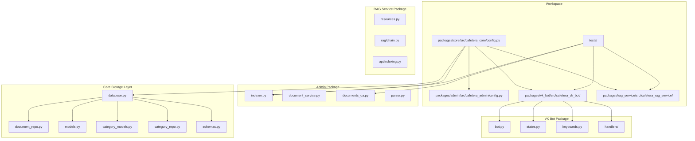
```mermaid
graph TB
subgraph "Workspace"
CORE["packages/core/src/cafetera_core/config.py"]
ADMIN["packages/admin/src/cafetera_admin/config.py"]
VKBOT["packages/vk_bot/src/cafetera_vk_bot/"]
TESTS["tests/"]
RAGSERVICE["packages/rag_service/src/cafetera_rag_service/"]
end
subgraph "VK Bot Package"
BOT["bot.py"]
STATES["states.py"]
KEYBOARDS["keyboards.py"]
HANDLERS["handlers/"]
end
subgraph "Admin Package"
INDEXER["indexer.py"]
DOC_SERVICE["document_service.py"]
QA_API["documents_qa.py"]
PARSER["parser.py"]
end
subgraph "RAG Service Package"
PARSER["parser.py"]
RESOURCES["resources.py"]
CHAIN["rag/chain.py"]
INDEXING["api/indexing.py"]
end
subgraph "Core Storage Layer"
DATABASE["database.py"]
DOCUMENT_REPO["document_repo.py"]
MODELS["models.py"]
CATEGORY_MODELS["category_models.py"]
CATEGORY_REPO["category_repo.py"]
SCHEMAS["schemas.py"]
end
CORE --> ADMIN
CORE --> VKBOT
CORE --> INDEXER
CORE --> RAGSERVICE
CORE --> DATABASE
VKBOT --> BOT
VKBOT --> STATES
VKBOT --> KEYBOARDS
VKBOT --> HANDLERS
TESTS --> VKBOT
TESTS --> INDEXER
TESTS --> QA_API
TESTS --> RAGSERVICE
DATABASE --> DOCUMENT_REPO
DATABASE --> MODELS
DATABASE --> CATEGORY_MODELS
DATABASE --> CATEGORY_REPO
DATABASE --> SCHEMAS
```

**Diagram sources**
- [pyproject.toml:22-28](file://pyproject.toml#L22-L28)
- [config.py:15-68](file://packages/core/src/cafetera_core/config.py#L15-L68)
- [bot.py:42-56](file://packages/vk_bot/src/cafetera_vk_bot/bot.py#L42-L56)
- [keyboards.py:1-263](file://packages/vk_bot/src/cafetera_vk_bot/keyboards.py#L1-L263)
- [indexer.py:1-325](file://packages/admin/src/cafetera_admin/indexer.py#L1-325)
- [document_service.py:1-402](file://packages/admin/src/cafetera_admin/domain/document_service.py#L1-402)
- [qa_service.py:1-303](file://packages/core/src/cafetera_core/domain/qa_service.py#L1-303)
- [documents_qa.py:1-90](file://packages/admin/src/cafetera_admin/api/documents_qa.py#L1-90)
- [parser.py:1-111](file://packages/admin/src/cafetera_admin/parser.py#L1-111)
- [parser.py:1-164](file://packages/rag_service/src/cafetera_rag_service/parser.py#L1-164)
- [resources.py:1-345](file://packages/rag_service/src/cafetera_rag_service/resources.py#L1-345)
- [chain.py:1-192](file://packages/rag_service/src/cafetera_rag_service/rag/chain.py#L1-192)
- [indexing.py:1-222](file://packages/rag_service/src/cafetera_rag_service/api/indexing.py#L1-222)
- [database.py:1-65](file://packages/core/src/cafetera_core/storage/database.py#L1-65)
- [document_repo.py:1-329](file://packages/core/src/cafetera_core/storage/document_repo.py#L1-329)
- [models.py:1-40](file://packages/core/src/cafetera_core/storage/models.py#L1-40)
- [category_models.py:1-64](file://packages/core/src/cafetera_core/storage/category_models.py#L1-64)
- [category_repo.py:1-140](file://packages/core/src/cafetera_core/storage/category_repo.py#L1-140)
- [schemas.py:1-83](file://packages/admin/src/cafetera_admin/api/schemas.py#L1-83)

**Section sources**
- [pyproject.toml:1-49](file://pyproject.toml#L1-L49)

## Core Components
- Core Settings: Centralized configuration for RAG, LLM, embeddings, storage, chunking, hybrid search, and reranking. Includes helpers to serialize indexing configuration.
- VK Bot Factory: Creates a configured VK bot instance, registers handlers in priority order, and wires a shared state dispenser.
- VK Handlers: Modular handlers for start/home navigation, fallback responses, and section entry points (including RAG-powered flows).
- VK Keyboards: Builder functions for main menu, entity selection, and contextual sub-menus with standardized service buttons.
- VK States: Multi-step dialog states, currently focused on free-text questions.
- **Updated** Enhanced PostgreSQL Database Schema: JSONB indexing_config column for structured document metadata storage and configuration persistence.
- **Updated** Document Storage Layer: Repository pattern implementation with JSONB configuration handling and comprehensive CRUD operations.
- **Updated** Enhanced Modal System: Improved layout with fixed headers and footers, scrollable content areas, and automatic scrolling for streaming responses.
- **Updated** Streaming QA Service: Real-time question answering with SSE streaming and automatic content updates.
- **Updated** Enhanced Docling Integration: Advanced document processing with comprehensive metadata extraction including page numbers, headings, captions, content types, and structural paths.
- **Updated** ONNX Document Parser: Advanced document processing pipeline using Docling with ONNX runtime for layout analysis and table extraction.

**Section sources**
- [config.py:15-93](file://packages/core/src/cafetera_core/config.py#L15-L93)
- [bot.py:42-56](file://packages/vk_bot/src/cafetera_vk_bot/bot.py#L42-L56)
- [keyboards.py:78-263](file://packages/vk_bot/src/cafetera_vk_bot/keyboards.py#L78-L263)
- [states.py:4-9](file://packages/vk_bot/src/cafetera_vk_bot/states.py#L4-L9)
- [start.py:31-42](file://packages/vk_bot/src/cafetera_vk_bot/handlers/start.py#L31-L42)
- [fallback.py:15-18](file://packages/vk_bot/src/cafetera_vk_bot/handlers/fallback.py#L15-L18)
- [sections.py:24-39](file://packages/vk_bot/src/cafetera_vk_bot/handlers/sections.py#L24-L39)
- [indexer.py:29-54](file://packages/admin/src/cafetera_admin/indexer.py#L29-L54)
- [parser.py:19-45](file://packages/admin/src/cafetera_admin/parser.py#L19-L45)
- [parser.py:129-164](file://packages/rag_service/src/cafetera_rag_service/parser.py#L129-L164)
- [database.py:11-29](file://packages/core/src/cafetera_core/storage/database.py#L11-L29)
- [document_repo.py:69-116](file://packages/core/src/cafetera_core/storage/document_repo.py#L69-L116)
- [models.py:22-40](file://packages/core/src/cafetera_core/storage/models.py#L22-L40)

## Architecture Overview
The system integrates VK bot routing with RAG-powered responses. Handlers trigger RAG queries and present templated answers with navigation back to relevant sections. Configuration is shared across packages to maintain consistent behavior for indexing and retrieval. **Updated** The enhanced PostgreSQL database schema now includes JSONB indexing_config column for structured document metadata storage, enabling sophisticated configuration management and querying capabilities. The document storage layer provides comprehensive CRUD operations with JSONB configuration handling, supporting flexible indexing workflows and metadata persistence.

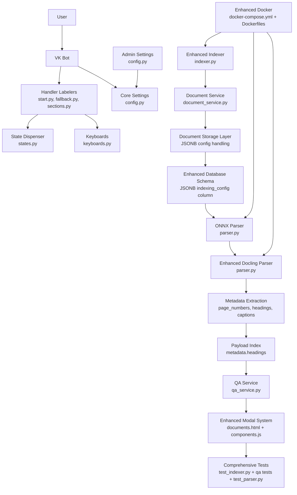
```mermaid
graph TB
USER["User"]
BOT["VK Bot"]
LABELERS["Handler Labelers<br/>start.py, fallback.py, sections.py"]
STATE["State Dispenser<br/>states.py"]
KB["Keyboards<br/>keyboards.py"]
CORECFG["Core Settings<br/>config.py"]
ADMINCFG["Admin Settings<br/>config.py"]
INDEXER["Enhanced Indexer<br/>indexer.py"]
DOCSVC["Document Service<br/>document_service.py"]
QA_SERVICE["QA Service<br/>qa_service.py"]
PARSER["ONNX Parser<br/>parser.py"]
DOCLET_PARSER["Enhanced Docling Parser<br/>parser.py"]
METADATA_EXTRACTOR["Metadata Extraction<br/>page_numbers, headings, captions"]
PAYLOAD_INDEX["Payload Index<br/>metadata.headings"]
MODAL_SYS["Enhanced Modal System<br/>documents.html + components.js"]
TESTS["Comprehensive Tests<br/>test_indexer.py + qa tests + test_parser.py"]
DOCKER["Enhanced Docker<br/>docker-compose.yml + Dockerfiles"]
DATABASE["Enhanced Database Schema<br/>JSONB indexing_config column"]
STORAGE_LAYER["Document Storage Layer<br/>JSONB config handling"]
USER --> BOT
BOT --> LABELERS
LABELERS --> STATE
LABELERS --> KB
BOT --> CORECFG
ADMINCFG --> CORECFG
INDEXER --> DOCSVC
DOCSVC --> STORAGE_LAYER
STORAGE_LAYER --> DATABASE
DATABASE --> PARSER
PARSER --> DOCLET_PARSER
DOCLET_PARSER --> METADATA_EXTRACTOR
METADATA_EXTRACTOR --> PAYLOAD_INDEX
PAYLOAD_INDEX --> QA_SERVICE
QA_SERVICE --> MODAL_SYS
MODAL_SYS --> TESTS
DOCKER --> INDEXER
DOCKER --> PARSER
DOCKER --> DOCLET_PARSER
```

**Diagram sources**
- [bot.py:30-56](file://packages/vk_bot/src/cafetera_vk_bot/bot.py#L30-L56)
- [start.py:12-42](file://packages/vk_bot/src/cafetera_vk_bot/handlers/start.py#L12-L42)
- [fallback.py:7-18](file://packages/vk_bot/src/cafetera_vk_bot/handlers/fallback.py#L7-L18)
- [sections.py:18-39](file://packages/vk_bot/src/cafetera_vk_bot/handlers/sections.py#L18-L39)
- [states.py:4-9](file://packages/vk_bot/src/cafetera_vk_bot/states.py#L4-L9)
- [keyboards.py:1-263](file://packages/vk_bot/src/cafetera_vk_bot/keyboards.py#L1-L263)
- [config.py:15-93](file://packages/core/src/cafetera_core/config.py#L15-L93)
- [config.py:6-20](file://packages/admin/src/cafetera_admin/config.py#L6-L20)
- [indexer.py:93-206](file://packages/admin/src/cafetera_admin/indexer.py#L93-L206)
- [document_service.py:113-182](file://packages/admin/src/cafetera_admin/domain/document_service.py#L113-L182)
- [qa_service.py:217-280](file://packages/core/src/cafetera_core/domain/qa_service.py#L217-L280)
- [parser.py:19-110](file://packages/admin/src/cafetera_admin/parser.py#L19-L110)
- [parser.py:129-164](file://packages/rag_service/src/cafetera_rag_service/parser.py#L129-L164)
- [resources.py:137-148](file://packages/rag_service/src/cafetera_rag_service/resources.py#L137-148)
- [documents.html:270-371](file://templates/documents.html#L270-L371)
- [components.js:417-558](file://static/js/components.js#L417-L558)
- [test_indexer.py:1-618](file://tests/test_indexer.py#L1-618)
- [docker-compose.yml:1-120](file://docker-compose.yml#L1-120)
- [database.py:11-29](file://packages/core/src/cafetera_core/storage/database.py#L11-L29)
- [document_repo.py:69-116](file://packages/core/src/cafetera_core/storage/document_repo.py#L69-L116)

## Detailed Component Analysis

### VK Bot Factory
The bot factory constructs a VK bot with a shared state dispenser and loads labelers in a specific order to ensure proper routing. It logs successful initialization with the number of loaded labelers.

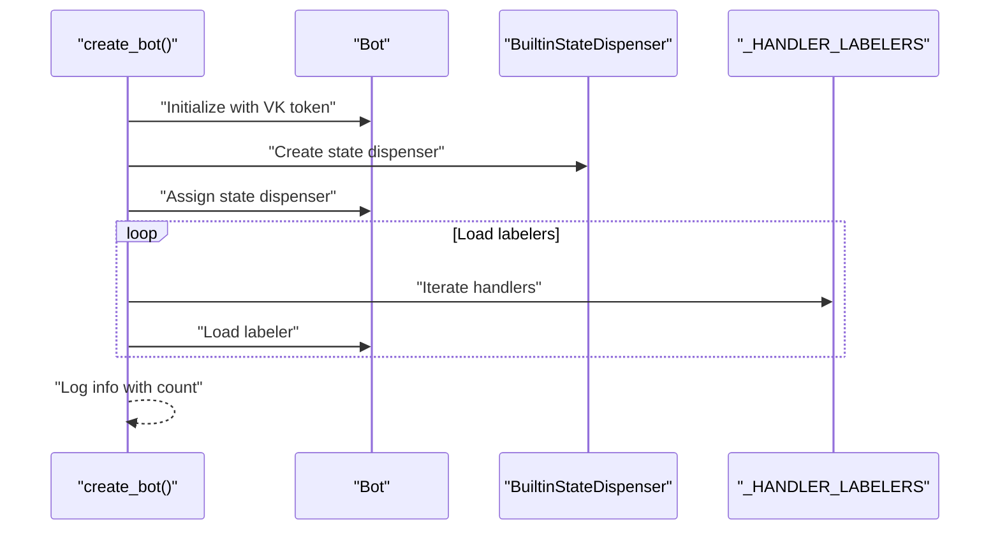
```mermaid
sequenceDiagram
participant Creator as "create_bot()"
participant Bot as "Bot"
participant SD as "BuiltinStateDispenser"
participant Labelers as "_HANDLER_LABELERS"
Creator->>Bot : "Initialize with VK token"
Creator->>SD : "Create state dispenser"
Creator->>Bot : "Assign state dispenser"
loop Load labelers
Creator->>Labelers : "Iterate handlers"
Creator->>Bot : "Load labeler"
end
Creator-->>Creator : "Log info with count"
```

**Diagram sources**
- [bot.py:42-56](file://packages/vk_bot/src/cafetera_vk_bot/bot.py#L42-L56)

**Section sources**
- [bot.py:42-56](file://packages/vk_bot/src/cafetera_vk_bot/bot.py#L42-L56)

### Handler Routing and Priority
Handlers are registered in a specific order to ensure deterministic matching:
1. Start handler responds to initial commands and home navigation
2. Free-text ask handler (state-based) precedes fallback
3. Dedicated action handlers (hire, fire, vacation, pay)
4. Sections handler for RAG-powered stubs
5. Fallback handler as a catch-all

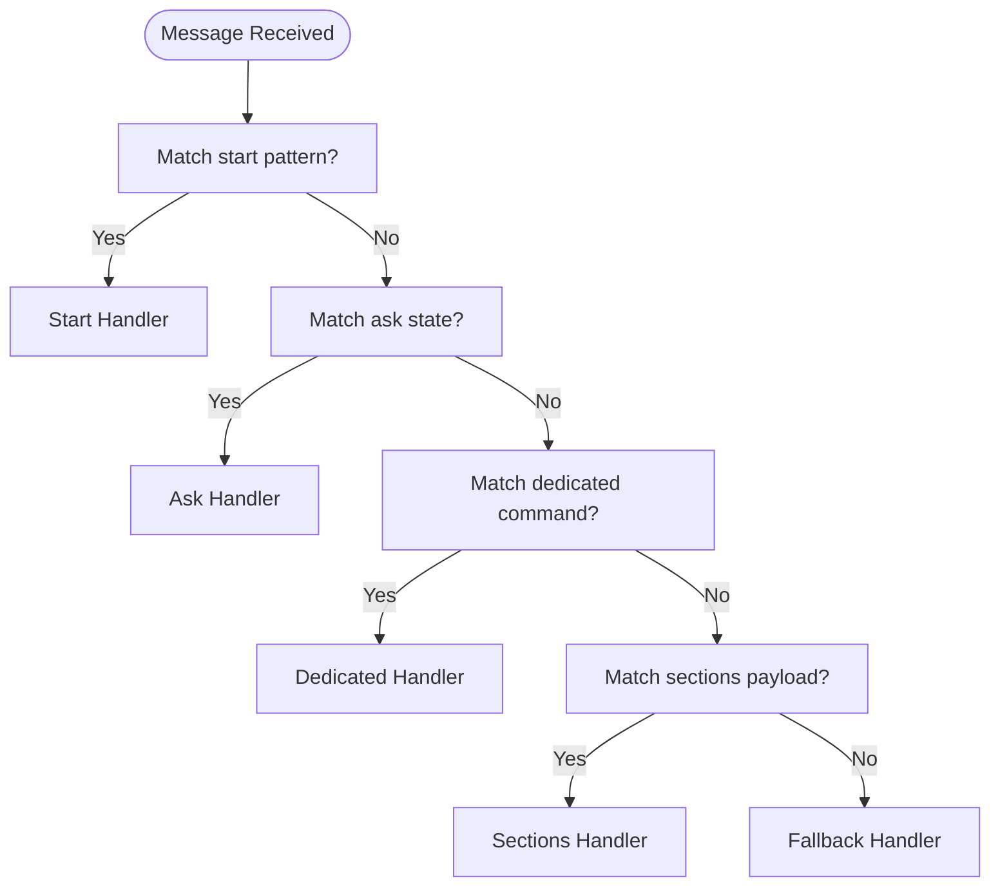
```mermaid
flowchart TD
Start(["Message Received"]) --> CheckStart["Match start pattern?"]
CheckStart --> |Yes| StartHandler["Start Handler"]
CheckStart --> |No| CheckAsk["Match ask state?"]
CheckAsk --> |Yes| AskHandler["Ask Handler"]
CheckAsk --> |No| CheckDedicated["Match dedicated command?"]
CheckDedicated --> |Yes| DedicatedHandler["Dedicated Handler"]
CheckDedicated --> |No| CheckSections["Match sections payload?"]
CheckSections --> |Yes| SectionsHandler["Sections Handler"]
CheckSections --> |No| FallbackHandler["Fallback Handler"]
```

**Diagram sources**
- [bot.py:24-39](file://packages/vk_bot/src/cafetera_vk_bot/bot.py#L24-L39)
- [start.py:31-42](file://packages/vk_bot/src/cafetera_vk_bot/handlers/start.py#L31-L42)
- [fallback.py:15-18](file://packages/vk_bot/src/cafetera_vk_bot/handlers/fallback.py#L15-L18)
- [sections.py:24-39](file://packages/vk_bot/src/cafetera_vk_bot/handlers/sections.py#L24-L39)

**Section sources**
- [bot.py:24-39](file://packages/vk_bot/src/cafetera_vk_bot/bot.py#L24-L39)

### Keyboard Builders and Navigation
The keyboard module provides builders for:
- Main menu with seven HR sections
- Entity selection across legal entities
- Hire, fire, vacation, and pay sub-menus
- Service row with Back/Home buttons
- Ask question input and result suggestion keyboards

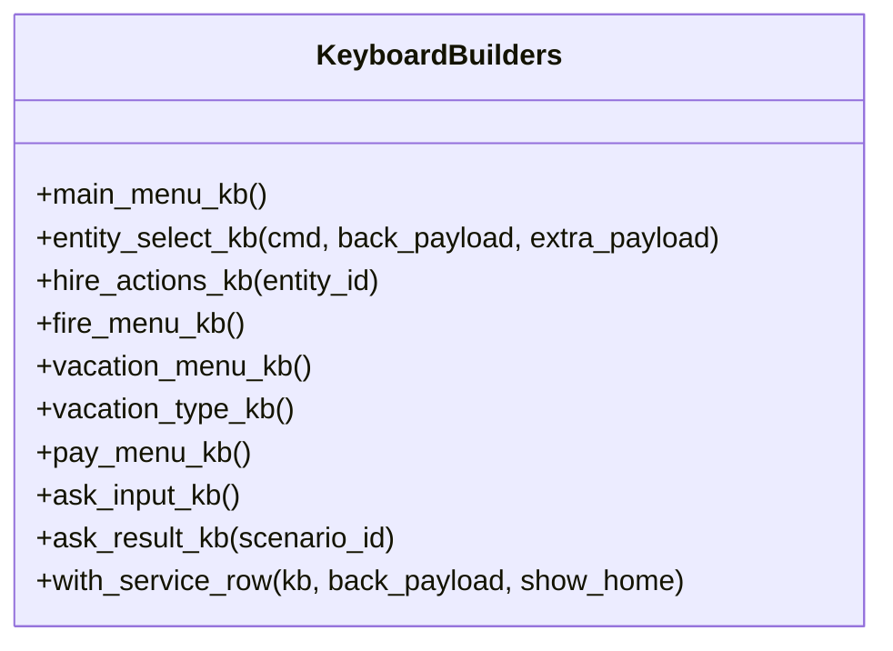
```mermaid
classDiagram
class KeyboardBuilders {
+main_menu_kb()
+entity_select_kb(cmd, back_payload, extra_payload)
+hire_actions_kb(entity_id)
+fire_menu_kb()
+vacation_menu_kb()
+vacation_type_kb()
+pay_menu_kb()
+ask_input_kb()
+ask_result_kb(scenario_id)
+with_service_row(kb, back_payload, show_home)
}
```

**Diagram sources**
- [keyboards.py:78-263](file://packages/vk_bot/src/cafetera_vk_bot/keyboards.py#L78-L263)

**Section sources**
- [keyboards.py:1-263](file://packages/vk_bot/src/cafetera_vk_bot/keyboards.py#L1-L263)

### Configuration Model and Indexing
Core settings encapsulate RAG, LLM, embeddings, storage, chunking, hybrid search, and reranking parameters. A helper extracts indexing configuration for document metadata. **Updated** Enhanced with new indexing parameters for batch processing and parallel operations, now including JSONB configuration support for structured indexing workflows.

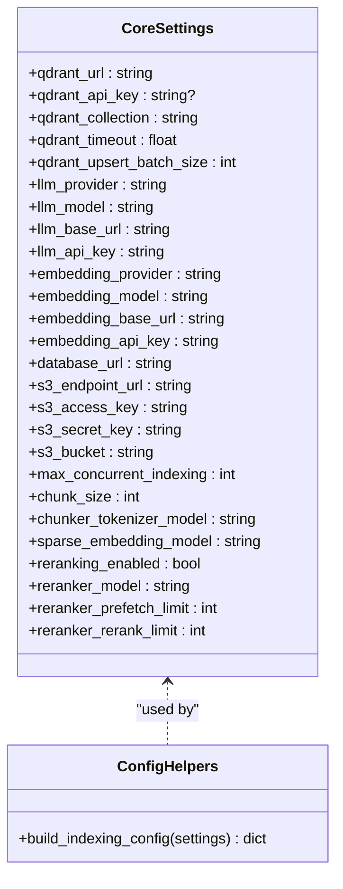
```mermaid
classDiagram
class CoreSettings {
+qdrant_url : string
+qdrant_api_key : string?
+qdrant_collection : string
+qdrant_timeout : float
+qdrant_upsert_batch_size : int
+llm_provider : string
+llm_model : string
+llm_base_url : string
+llm_api_key : string
+embedding_provider : string
+embedding_model : string
+embedding_base_url : string
+embedding_api_key : string
+database_url : string
+s3_endpoint_url : string
+s3_access_key : string
+s3_secret_key : string
+s3_bucket : string
+max_concurrent_indexing : int
+chunk_size : int
+chunker_tokenizer_model : string
+sparse_embedding_model : string
+reranking_enabled : bool
+reranker_model : string
+reranker_prefetch_limit : int
+reranker_rerank_limit : int
}
class ConfigHelpers {
+build_indexing_config(settings) dict
}
CoreSettings <.. ConfigHelpers : "used by"
```

**Diagram sources**
- [config.py:15-93](file://packages/core/src/cafetera_core/config.py#L15-L93)

**Section sources**
- [config.py:15-93](file://packages/core/src/cafetera_core/config.py#L15-L93)

### Admin Settings Extension
Admin settings extend core settings and add admin-specific fields while ignoring extra environment variables to coexist with other packages using the same environment file.

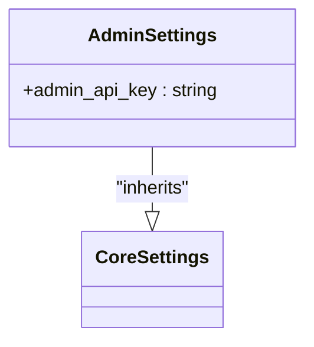
```mermaid
classDiagram
class CoreSettings
class AdminSettings {
+admin_api_key : string
}
AdminSettings --|> CoreSettings : "inherits"
```

**Diagram sources**
- [config.py:6-20](file://packages/admin/src/cafetera_admin/config.py#L6-L20)
- [config.py:15-93](file://packages/core/src/cafetera_core/config.py#L15-L93)

**Section sources**
- [config.py:6-20](file://packages/admin/src/cafetera_admin/config.py#L6-L20)

## Enhanced PostgreSQL Database Schema

### JSONB Column Implementation
The PostgreSQL database schema has been enhanced with a JSONB indexing_config column to support structured document metadata storage and configuration persistence. This column enables sophisticated indexing workflows with flexible configuration management.

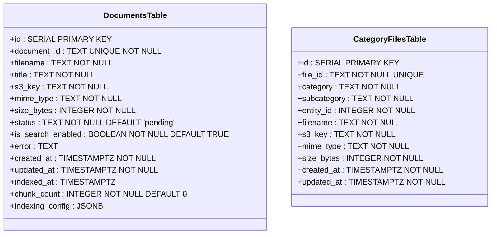
```mermaid
classDiagram
class DocumentsTable {
+id : SERIAL PRIMARY KEY
+document_id : TEXT UNIQUE NOT NULL
+filename : TEXT NOT NULL
+title : TEXT NOT NULL
+s3_key : TEXT NOT NULL
+mime_type : TEXT NOT NULL
+size_bytes : INTEGER NOT NULL
+status : TEXT NOT NULL DEFAULT 'pending'
+is_search_enabled : BOOLEAN NOT NULL DEFAULT TRUE
+error : TEXT
+created_at : TIMESTAMPTZ NOT NULL
+updated_at : TIMESTAMPTZ NOT NULL
+indexed_at : TIMESTAMPTZ
+chunk_count : INTEGER NOT NULL DEFAULT 0
+indexing_config : JSONB
}
class CategoryFilesTable {
+id : SERIAL PRIMARY KEY
+file_id : TEXT NOT NULL UNIQUE
+category : TEXT NOT NULL
+subcategory : TEXT NOT NULL
+entity_id : INTEGER NOT NULL
+filename : TEXT NOT NULL
+s3_key : TEXT NOT NULL
+mime_type : TEXT NOT NULL
+size_bytes : INTEGER NOT NULL
+created_at : TIMESTAMPTZ NOT NULL
+updated_at : TIMESTAMPTZ NOT NULL
}
```

**Diagram sources**
- [database.py:11-29](file://packages/core/src/cafetera_core/storage/database.py#L11-L29)
- [database.py:31-45](file://packages/core/src/cafetera_core/storage/database.py#L31-L45)

### Conditional Column Addition
The database initialization includes conditional column addition to ensure backward compatibility with existing installations while adding the new JSONB indexing_config column.

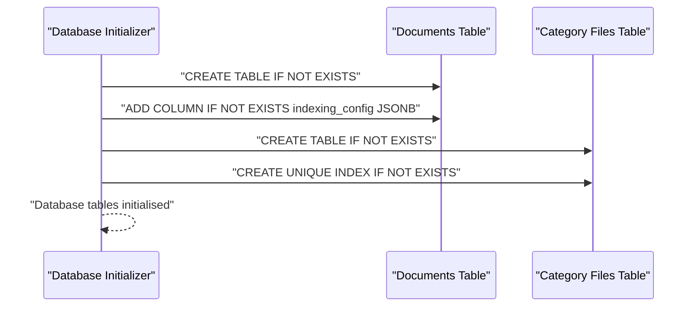
```mermaid
sequenceDiagram
participant DBInit as "Database Initializer"
participant DocumentsTable as "Documents Table"
participant CategoryFilesTable as "Category Files Table"
DBInit->>DocumentsTable : "CREATE TABLE IF NOT EXISTS"
DBInit->>DocumentsTable : "ADD COLUMN IF NOT EXISTS indexing_config JSONB"
DBInit->>CategoryFilesTable : "CREATE TABLE IF NOT EXISTS"
DBInit->>CategoryFilesTable : "CREATE UNIQUE INDEX IF NOT EXISTS"
DBInit-->>DBInit : "Database tables initialised"
```

**Diagram sources**
- [database.py:58-64](file://packages/core/src/cafetera_core/storage/database.py#L58-L64)

**Section sources**
- [database.py:11-29](file://packages/core/src/cafetera_core/storage/database.py#L11-L29)
- [database.py:53-55](file://packages/core/src/cafetera_core/storage/database.py#L53-L55)
- [database.py:58-64](file://packages/core/src/cafetera_core/storage/database.py#L58-L64)

## JSONB Indexing Configuration Management

### Structured Configuration Storage
The JSONB indexing_config column enables structured storage of indexing configurations, allowing for flexible document processing workflows with persistent configuration data.

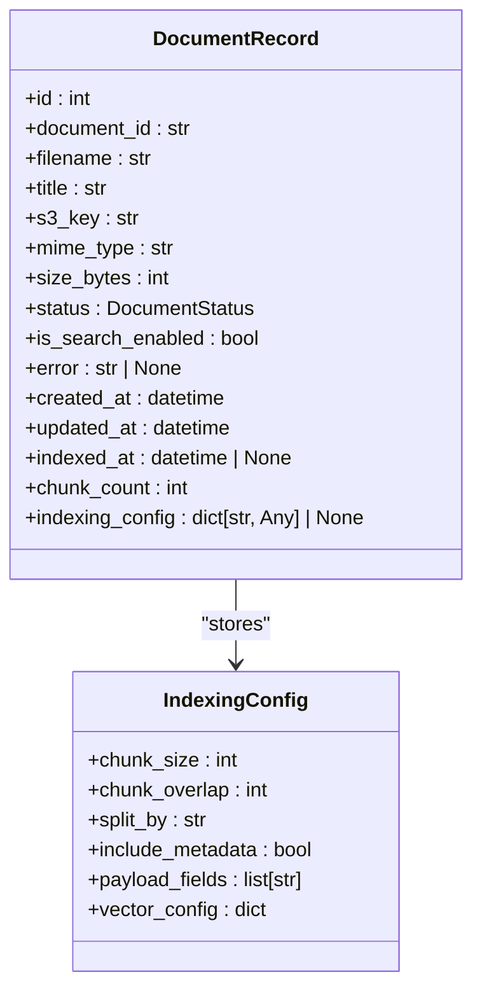
```mermaid
classDiagram
class DocumentRecord {
+id : int
+document_id : str
+filename : str
+title : str
+s3_key : str
+mime_type : str
+size_bytes : int
+status : DocumentStatus
+is_search_enabled : bool
+error : str | None
+created_at : datetime
+updated_at : datetime
+indexed_at : datetime | None
+chunk_count : int
+indexing_config : dict[str, Any] | None
}
class IndexingConfig {
+chunk_size : int
+chunk_overlap : int
+split_by : str
+include_metadata : bool
+payload_fields : list[str]
+vector_config : dict
}
DocumentRecord --> IndexingConfig : "stores"
```

**Diagram sources**
- [models.py:22-40](file://packages/core/src/cafetera_core/storage/models.py#L22-L40)

### JSON Serialization and Deserialization
The document repository handles JSON serialization and deserialization for the indexing_config column, ensuring proper data persistence and retrieval.

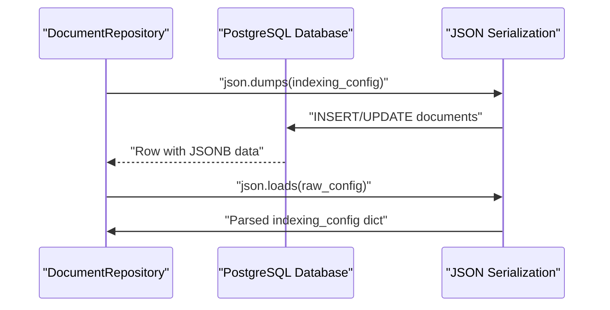
```mermaid
sequenceDiagram
participant Repo as "DocumentRepository"
participant DB as "PostgreSQL Database"
participant JSON as "JSON Serialization"
Repo->>JSON : "json.dumps(indexing_config)"
JSON->>DB : "INSERT/UPDATE documents"
DB-->>Repo : "Row with JSONB data"
Repo->>JSON : "json.loads(raw_config)"
JSON->>Repo : "Parsed indexing_config dict"
```

**Diagram sources**
- [document_repo.py:77-116](file://packages/core/src/cafetera_core/storage/document_repo.py#L77-L116)
- [document_repo.py:223-288](file://packages/core/src/cafetera_core/storage/document_repo.py#L223-L288)

**Section sources**
- [models.py:22-40](file://packages/core/src/cafetera_core/storage/models.py#L22-L40)
- [document_repo.py:35-55](file://packages/core/src/cafetera_core/storage/document_repo.py#L35-L55)
- [document_repo.py:107-113](file://packages/core/src/cafetera_core/storage/document_repo.py#L107-L113)
- [document_repo.py:269-274](file://packages/core/src/cafetera_core/storage/document_repo.py#L269-L274)

## Document Storage Layer Enhancements

### Repository Pattern Implementation
The document storage layer implements a comprehensive repository pattern with JSONB configuration handling, providing full CRUD operations for document metadata with indexing configuration support.

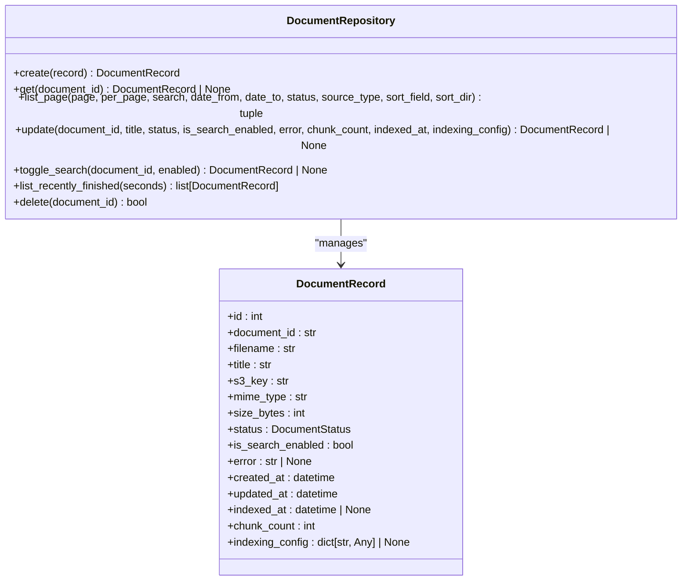
```mermaid
classDiagram
class DocumentRepository {
+create(record) DocumentRecord
+get(document_id) DocumentRecord | None
+list_page(page, per_page, search, date_from, date_to, status, source_type, sort_field, sort_dir) tuple
+update(document_id, title, status, is_search_enabled, error, chunk_count, indexed_at, indexing_config) DocumentRecord | None
+toggle_search(document_id, enabled) DocumentRecord | None
+list_recently_finished(seconds) list[DocumentRecord]
+delete(document_id) bool
}
class DocumentRecord {
+id : int
+document_id : str
+filename : str
+title : str
+s3_key : str
+mime_type : str
+size_bytes : int
+status : DocumentStatus
+is_search_enabled : bool
+error : str | None
+created_at : datetime
+updated_at : datetime
+indexed_at : datetime | None
+chunk_count : int
+indexing_config : dict[str, Any] | None
}
DocumentRepository --> DocumentRecord : "manages"
```

**Diagram sources**
- [document_repo.py:69-329](file://packages/core/src/cafetera_core/storage/document_repo.py#L69-L329)
- [models.py:22-40](file://packages/core/src/cafetera_core/storage/models.py#L22-L40)

### Enhanced CRUD Operations
The repository provides enhanced CRUD operations with comprehensive indexing configuration management, supporting flexible document processing workflows.

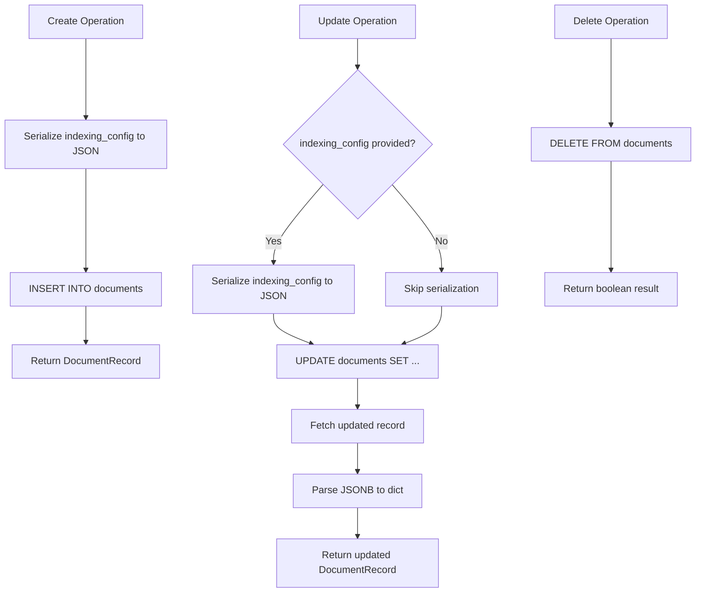
```mermaid
flowchart TD
CreateOperation["Create Operation"] --> SerializeConfig["Serialize indexing_config to JSON"]
SerializeConfig --> InsertQuery["INSERT INTO documents"]
InsertQuery --> ReturnRecord["Return DocumentRecord"]
UpdateOperation["Update Operation"] --> CheckConfig{"indexing_config provided?"}
CheckConfig --> |Yes| SerializeUpdate["Serialize indexing_config to JSON"]
CheckConfig --> |No| SkipSerialize["Skip serialization"]
SerializeUpdate --> UpdateQuery["UPDATE documents SET ..."]
SkipSerialize --> UpdateQuery
UpdateQuery --> FetchUpdated["Fetch updated record"]
FetchUpdated --> ParseConfig["Parse JSONB to dict"]
ParseConfig --> ReturnUpdated["Return updated DocumentRecord"]
DeleteOperation["Delete Operation"] --> DeleteQuery["DELETE FROM documents"]
DeleteQuery --> ReturnBool["Return boolean result"]
```

**Diagram sources**
- [document_repo.py:77-116](file://packages/core/src/cafetera_core/storage/document_repo.py#L77-L116)
- [document_repo.py:223-288](file://packages/core/src/cafetera_core/storage/document_repo.py#L223-L288)

**Section sources**
- [document_repo.py:69-329](file://packages/core/src/cafetera_core/storage/document_repo.py#L69-L329)
- [schemas.py:13-31](file://packages/admin/src/cafetera_admin/api/schemas.py#L13-L31)

## Database Migration and Compatibility

### Backward Compatibility Strategy
The database migration strategy ensures backward compatibility by using conditional column addition, allowing existing installations to upgrade without data loss.

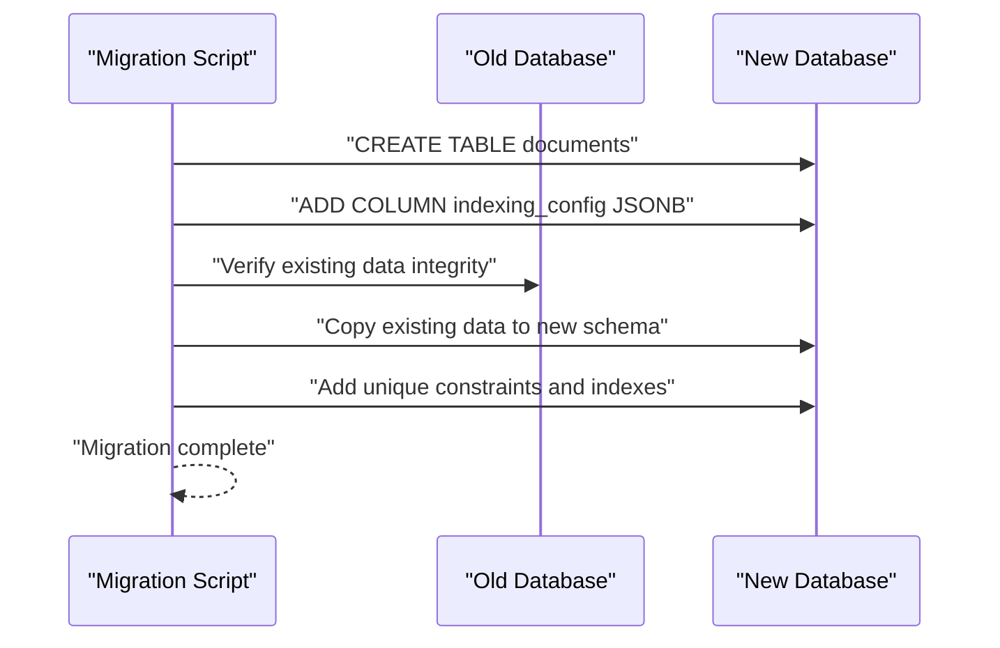
```mermaid
sequenceDiagram
participant Migration as "Migration Script"
participant OldDB as "Old Database"
participant NewDB as "New Database"
Migration->>NewDB : "CREATE TABLE documents"
Migration->>NewDB : "ADD COLUMN indexing_config JSONB"
Migration->>OldDB : "Verify existing data integrity"
Migration->>NewDB : "Copy existing data to new schema"
Migration->>NewDB : "Add unique constraints and indexes"
Migration-->>Migration : "Migration complete"
```

**Diagram sources**
- [database.py:58-64](file://packages/core/src/cafetera_core/storage/database.py#L58-L64)

### Data Integrity and Validation
The enhanced schema maintains data integrity through proper validation and constraint enforcement, ensuring consistent document metadata storage across the system.

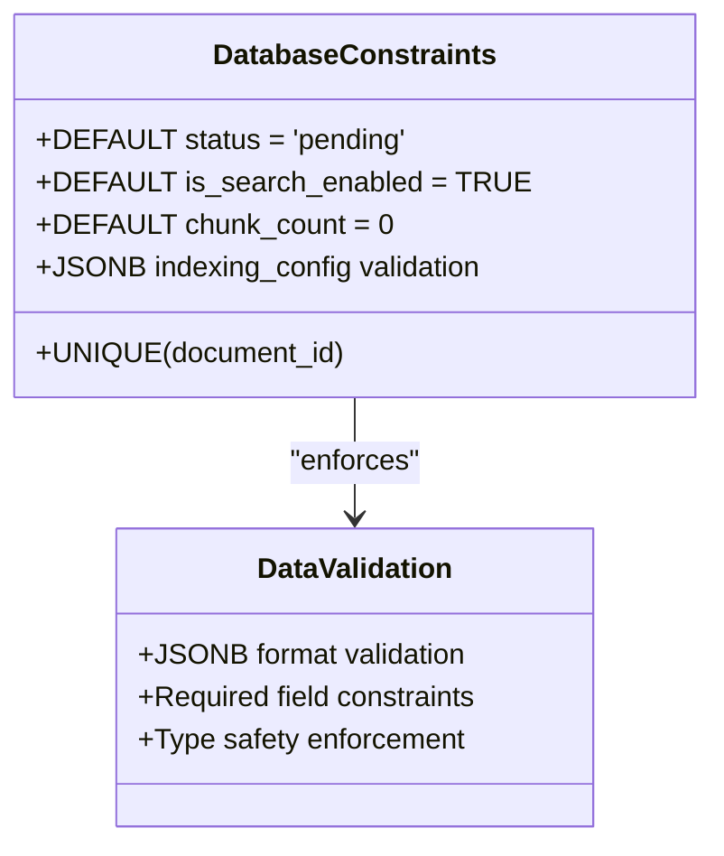
```mermaid
classDiagram
class DatabaseConstraints {
+UNIQUE(document_id)
+DEFAULT status = 'pending'
+DEFAULT is_search_enabled = TRUE
+DEFAULT chunk_count = 0
+JSONB indexing_config validation
}
class DataValidation {
+JSONB format validation
+Required field constraints
+Type safety enforcement
}
DatabaseConstraints --> DataValidation : "enforces"
```

**Diagram sources**
- [database.py:11-29](file://packages/core/src/cafetera_core/storage/database.py#L11-L29)

**Section sources**
- [database.py:53-55](file://packages/core/src/cafetera_core/storage/database.py#L53-L55)
- [database.py:58-64](file://packages/core/src/cafetera_core/storage/database.py#L58-L64)

## Enhanced Modal Window System

### Improved Layout Architecture
The enhanced modal system now features a sophisticated layout architecture with fixed headers, scrollable content areas, and fixed footers to provide better user experience.

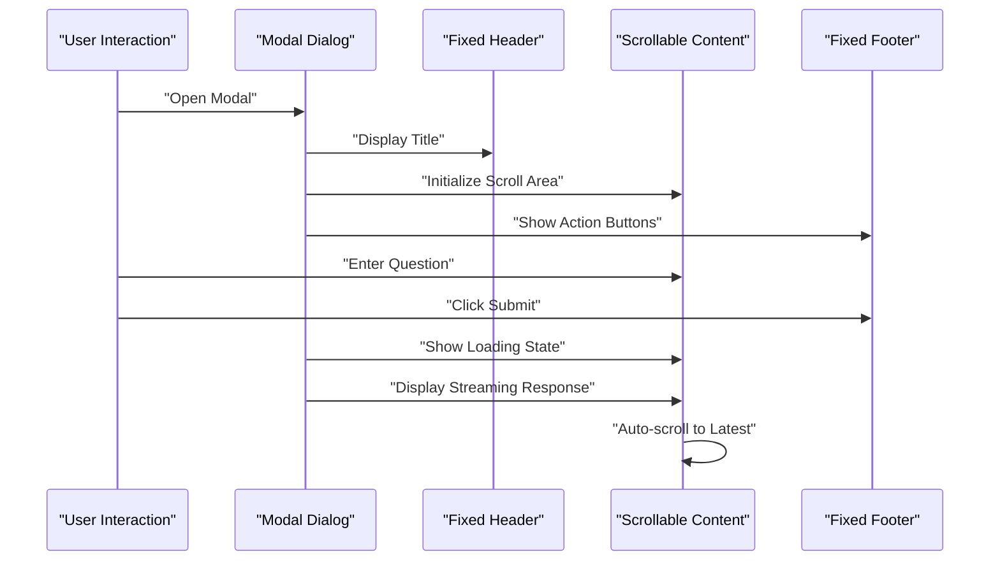
```mermaid
sequenceDiagram
participant User as "User Interaction"
participant Modal as "Modal Dialog"
participant Header as "Fixed Header"
participant Content as "Scrollable Content"
participant Footer as "Fixed Footer"
User->>Modal : "Open Modal"
Modal->>Header : "Display Title"
Modal->>Content : "Initialize Scroll Area"
Modal->>Footer : "Show Action Buttons"
User->>Content : "Enter Question"
User->>Footer : "Click Submit"
Modal->>Content : "Show Loading State"
Modal->>Content : "Display Streaming Response"
Content->>Content : "Auto-scroll to Latest"
```

**Diagram sources**
- [documents.html:270-371](file://templates/documents.html#L270-L371)
- [components.js:417-558](file://static/js/components.js#L417-L558)

### Fixed Header and Footer Pattern
The modal system implements a three-section layout pattern:
- Fixed header section for titles and metadata
- Scrollable content area for questions and answers
- Fixed footer with action buttons

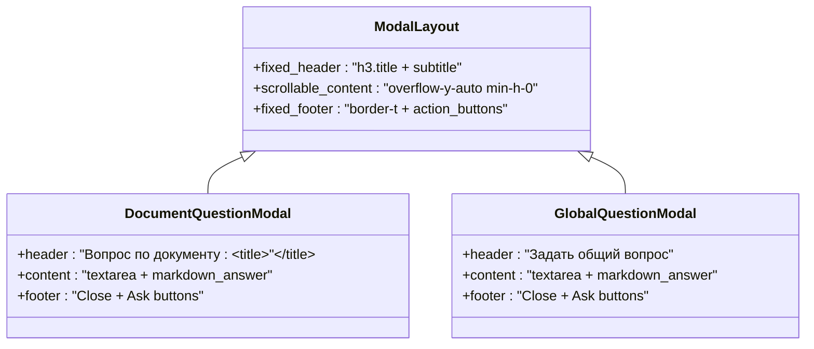
```mermaid
classDiagram
class ModalLayout {
+fixed_header : "h3.title + subtitle"
+scrollable_content : "overflow-y-auto min-h-0"
+fixed_footer : "border-t + action_buttons"
}
class DocumentQuestionModal {
+header : "Вопрос по документу : <title>"
+content : "textarea + markdown_answer"
+footer : "Close + Ask buttons"
}
class GlobalQuestionModal {
+header : "Задать общий вопрос"
+content : "textarea + markdown_answer"
+footer : "Close + Ask buttons"
}
ModalLayout <|-- DocumentQuestionModal
ModalLayout <|-- GlobalQuestionModal
```

**Diagram sources**
- [documents.html:270-371](file://templates/documents.html#L270-L371)

**Section sources**
- [documents.html:270-371](file://templates/documents.html#L270-L371)

### Automatic Scrolling Implementation
The system implements automatic scrolling to the latest content during streaming responses using Alpine.js reactive properties and DOM manipulation.

```mermaid
flowchart TD
Start(["Receive Stream Token"]) --> Append["Append Token to Answer"]
Append --> NextTick["Alpine $nextTick()"]
NextTick --> GetElement["Get Scroll Container Ref"]
GetElement --> CheckElement{"Element Exists?"}
CheckElement --> |Yes| AutoScroll["el.scrollTop = el.scrollHeight"]
CheckElement --> |No| Skip["Skip Scrolling"]
AutoScroll --> Complete["Continue Streaming"]
Skip --> Complete
```

**Diagram sources**
- [components.js:477-481](file://static/js/components.js#L477-L481)
- [components.js:539-543](file://static/js/components.js#L539-L543)

**Section sources**
- [components.js:477-481](file://static/js/components.js#L477-L481)
- [components.js:539-543](file://static/js/components.js#L539-L543)

## Streaming Question Answering

### Real-Time Response Streaming
The system now supports real-time streaming of question answers using Server-Sent Events (SSE) with automatic content updates and scrolling.

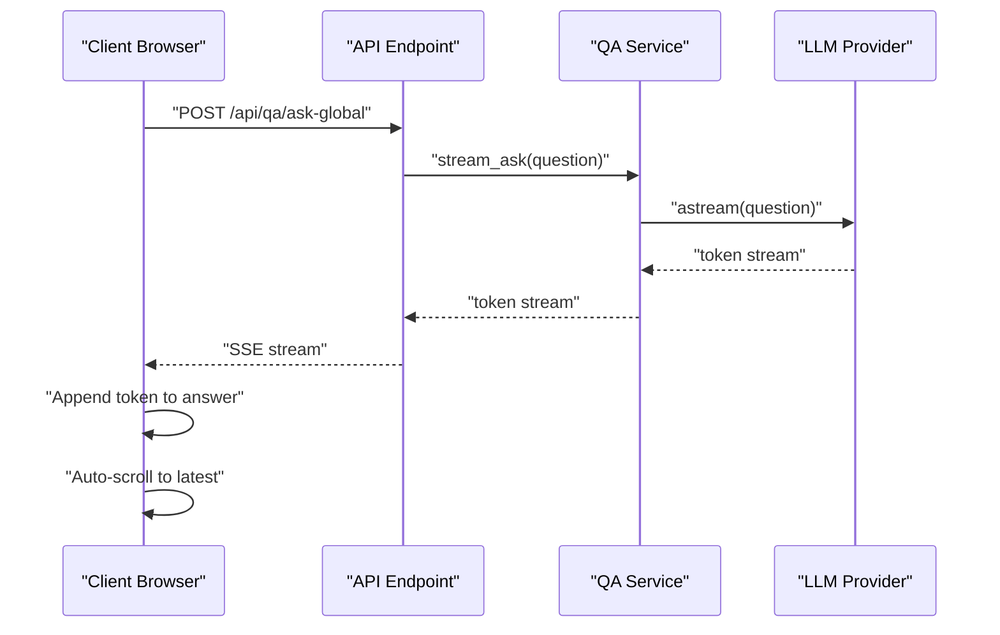
```mermaid
sequenceDiagram
participant Client as "Client Browser"
participant API as "API Endpoint"
participant QA as "QA Service"
participant LLM as "LLM Provider"
Client->>API : "POST /api/qa/ask-global"
API->>QA : "stream_ask(question)"
QA->>LLM : "astream(question)"
LLM-->>QA : "token stream"
QA-->>API : "token stream"
API-->>Client : "SSE stream"
Client->>Client : "Append token to answer"
Client->>Client : "Auto-scroll to latest"
```

**Diagram sources**
- [documents_qa.py:26-52](file://packages/admin/src/cafetera_admin/api/documents_qa.py#L26-L52)
- [qa_service.py:217-249](file://packages/core/src/cafetera_core/domain/qa_service.py#L217-L249)
- [components.js:436-496](file://static/js/components.js#L436-L496)

### Document-Specific Streaming
The system also supports document-specific streaming responses with enhanced error handling and validation.

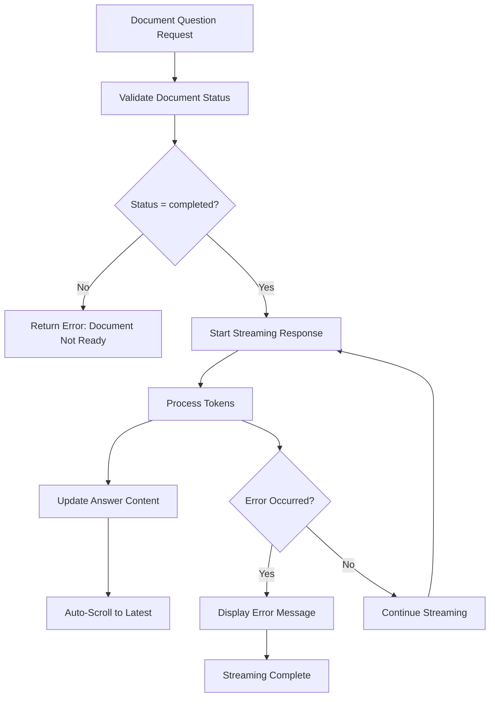
```mermaid
flowchart TD
DocumentRequest["Document Question Request"] --> Validate["Validate Document Status"]
Validate --> Ready{"Status = completed?"}
Ready --> |No| Error["Return Error: Document Not Ready"]
Ready --> |Yes| Stream["Start Streaming Response"]
Stream --> Process["Process Tokens"]
Process --> Update["Update Answer Content"]
Update --> Scroll["Auto-Scroll to Latest"]
Process --> ErrorCheck{"Error Occurred?"}
ErrorCheck --> |Yes| ShowError["Display Error Message"]
ErrorCheck --> |No| Continue["Continue Streaming"]
ShowError --> Complete["Streaming Complete"]
Continue --> Stream
```

**Diagram sources**
- [documents_qa.py:55-90](file://packages/admin/src/cafetera_admin/api/documents_qa.py#L55-L90)
- [components.js:498-558](file://static/js/components.js#L498-L558)

**Section sources**
- [documents_qa.py:26-90](file://packages/admin/src/cafetera_admin/api/documents_qa.py#L26-L90)
- [qa_service.py:217-280](file://packages/core/src/cafetera_core/domain/qa_service.py#L217-L280)
- [components.js:436-558](file://static/js/components.js#L436-L558)

## Enhanced Docling Integration

### Comprehensive Metadata Extraction
The enhanced Docling integration provides comprehensive metadata extraction capabilities including page numbers, headings, captions, content types, and structural paths for improved document understanding and filtering.

```mermaid
sequenceDiagram
participant Docling as "Docling Engine"
participant HybridChunker as "HybridChunker"
participant MetadataExtractor as "Metadata Extractors"
participant Qdrant as "Qdrant Collection"
Docling->>HybridChunker : "Parse Document"
HybridChunker->>MetadataExtractor : "Extract Metadata"
MetadataExtractor->>MetadataExtractor : "_extract_page_numbers()"
MetadataExtractor->>MetadataExtractor : "_extract_captions()"
MetadataExtractor->>MetadataExtractor : "_detect_content_type()"
MetadataExtractor->>Qdrant : "Store with metadata.headings index"
```

**Diagram sources**
- [parser.py:94-164](file://packages/rag_service/src/cafetera_rag_service/parser.py#L94-L164)
- [resources.py:137-148](file://packages/rag_service/src/cafetera_rag_service/resources.py#L137-L148)

### Advanced Document Parsing Architecture
The system now implements an ONNX-based document processing pipeline using Docling for advanced PDF, DOCX, and XLSX parsing capabilities with comprehensive metadata extraction.

```mermaid
sequenceDiagram
participant Parser as "Document Parser"
participant Cache as "Model Cache"
participant Docling as "Docling Engine"
participant ONNX as "ONNX Runtime"
participant Chunker as "HybridChunker"
participant MetadataExtractor as "Metadata Extractors"
Parser->>Cache : "ensure_models_cached()"
Cache->>ONNX : "LayoutPredictor (Layout Analysis)"
Cache->>ONNX : "DocumentConverter (TableFormer)"
Cache->>Cache : "Enable Offline Mode"
Parser->>Docling : "Create DocumentConverter()"
Docling->>ONNX : "Load ONNX Models"
Parser->>Chunker : "Create HybridChunker"
Chunker->>ONNX : "Load Tokenizer"
Parser->>Docling : "Parse Document"
Docling->>ONNX : "Extract Layout & Tables"
ONNX-->>Docling : "Structured Content"
Docling-->>MetadataExtractor : "Chunk with Metadata"
MetadataExtractor-->>Parser : "Extracted Metadata"
Parser-->>Parser : "Store with metadata.headings index"
```

**Diagram sources**
- [parser.py:19-45](file://packages/admin/src/cafetera_admin/parser.py#L19-L45)
- [parser.py:77-91](file://packages/admin/src/cafetera_admin/parser.py#L77-L91)
- [parser.py:94-110](file://packages/admin/src/cafetera_admin/parser.py#L94-L110)
- [parser.py:129-164](file://packages/rag_service/src/cafetera_rag_service/parser.py#L129-L164)

### Enhanced Metadata Extraction Functions
The system implements specialized functions for extracting comprehensive document metadata:

```mermaid
classDiagram
class MetadataExtractors {
+_extract_page_numbers(chunk) list[int]
+_extract_captions(chunk) list[str]
+_detect_content_type(chunk) str
}
class DocumentMetadata {
+source : str
+headings : list[str]
+captions : list[str]
+page_numbers : list[int]
+content_type : str
+section_path : str
}
MetadataExtractors --> DocumentMetadata : "creates"
```

**Diagram sources**
- [parser.py:94-127](file://packages/rag_service/src/cafetera_rag_service/parser.py#L94-L127)

### New Payload Index for Headings
The system now includes a dedicated payload index for metadata.headings field in Qdrant collection to enable efficient filtering and searching of documents by their headings.

```mermaid
classDiagram
class QdrantCollection {
+metadata.document_id : KEYWORD
+metadata.filename : KEYWORD
+metadata.headings : KEYWORD
+is_search_enabled : BOOL
}
class PayloadIndex {
+field_name : "metadata.headings"
+field_schema : KEYWORD
+logging : "Created KEYWORD payload indexes"
}
QdrantCollection --> PayloadIndex : "indexes"
```

**Diagram sources**
- [resources.py:137-148](file://packages/rag_service/src/cafetera_rag_service/resources.py#L137-L148)

**Section sources**
- [parser.py:94-164](file://packages/rag_service/src/cafetera_rag_service/parser.py#L94-L164)
- [resources.py:137-148](file://packages/rag_service/src/cafetera_rag_service/resources.py#L137-L148)
- [test_parser.py:27-89](file://tests/test_parser.py#L27-L89)

## ONNX-Based Document Processing Pipeline

### Advanced Document Parsing Architecture
The system now implements an ONNX-based document processing pipeline using Docling for advanced PDF, DOCX, and XLSX parsing capabilities. This architecture ensures reliable document processing with pre-downloaded ML models for improved performance.

```mermaid
sequenceDiagram
participant Parser as "Document Parser"
participant Cache as "Model Cache"
participant Docling as "Docling Engine"
participant ONNX as "ONNX Runtime"
participant Chunker as "HybridChunker"
participant Loader as "DoclingLoader"
Parser->>Cache : "ensure_models_cached()"
Cache->>ONNX : "LayoutPredictor (Layout Analysis)"
Cache->>ONNX : "DocumentConverter (TableFormer)"
Cache->>Cache : "Enable Offline Mode"
Parser->>Docling : "Create DocumentConverter()"
Docling->>ONNX : "Load ONNX Models"
Parser->>Chunker : "Create HybridChunker"
Chunker->>ONNX : "Load Tokenizer"
Parser->>Loader : "Load Documents"
Loader->>Docling : "Parse with ONNX Backend"
Docling->>ONNX : "Extract Layout & Tables"
ONNX-->>Loader : "Structured Content"
Loader-->>Parser : "Chunked Documents"
```

**Diagram sources**
- [parser.py:19-45](file://packages/admin/src/cafetera_admin/parser.py#L19-L45)
- [parser.py:77-91](file://packages/admin/src/cafetera_admin/parser.py#L77-L91)
- [parser.py:94-110](file://packages/admin/src/cafetera_admin/parser.py#L94-L110)

### Pre-Downloaded ML Models Architecture
The ONNX pipeline includes comprehensive pre-download of all required ML models during Docker build time to ensure zero-latency document processing.

```mermaid
classDiagram
class ModelPreDownloader {
+BM25_Sparse_Embedding : "Qdrant/bm25"
+Docling_ONNX_Models : "LayoutPredictor + DocumentConverter"
+TableFormer_Models : "ONNX Backend"
+HybridChunker_Tokenizer : "Qwen/Qwen3-Embedding-0.6B"
}
class OfflineMode {
+HF_HUB_OFFLINE : "1"
+TRANSFORMERS_OFFLINE : "1"
}
class DocumentConverter {
+LayoutAnalysis()
+TableExtraction()
+TextRecognition()
}
ModelPreDownloader --> DocumentConverter : "pre-downloads"
ModelPreDownloader --> OfflineMode : "enables"
```

**Diagram sources**
- [Dockerfile.admin:50-63](file://Dockerfile.admin#L50-L63)
- [parser.py:19-45](file://packages/admin/src/cafetera_admin/parser.py#L19-L45)

### Enhanced Document Processing Workflow
The system processes documents through a sophisticated pipeline that leverages ONNX runtime for optimal performance and reliability.

```mermaid
flowchart TD
FileInput["Document File Input"] --> TypeCheck{"File Type?"}
TypeCheck --> |PDF/DOCX/XLSX| ONNXProcessing["ONNX Processing Pipeline"]
TypeCheck --> |DOC| LegacyError["Legacy Format Error"]
TypeCheck --> |Other| UnsupportedError["Unsupported Format"]
ONNXProcessing --> LayoutAnalysis["Layout Analysis"]
LayoutAnalysis --> TableExtraction["Table Extraction"]
TableExtraction --> TextRecognition["Text Recognition"]
TextRecognition --> HybridChunking["Hybrid Chunking"]
HybridChunking --> MetadataExtraction["Metadata Extraction"]
MetadataExtraction --> StructuredOutput["Structured Document Chunks"]
LegacyError --> ErrorHandler["Error Handler"]
UnsupportedError --> ErrorHandler
ErrorHandler --> ReturnEmpty["Return Empty List"]
```

**Diagram sources**
- [parser.py:48-74](file://packages/admin/src/cafetera_admin/parser.py#L48-L74)
- [parser.py:94-110](file://packages/admin/src/cafetera_admin/parser.py#L94-L110)

**Section sources**
- [parser.py:1-111](file://packages/admin/src/cafetera_admin/parser.py#L1-L111)
- [Dockerfile.admin:50-63](file://Dockerfile.admin#L50-L63)

## Enhanced Docker Deployment

### Optimized Image Building with Pre-Downloaded Models
Docker images now pre-download ML models during build time to reduce runtime startup delays and improve reliability. The system preserves essential packages like Torch while optimizing for headless environments.

```mermaid
flowchart TD
Builder["Builder Stage"] --> PreDownload["Pre-download ML Models"]
PreDownload --> CacheModels["Cache Models in /app/.cache"]
CacheModels --> PreservePackages["Preserve Torch Packages"]
PreservePackages --> Cleanup["Cleanup Test Files & Docs"]
Cleanup --> Runtime["Runtime Stage"]
Runtime --> CopyCache["Copy Cached Models"]
CopyCache --> RunApp["Run Application"]
```

**Diagram sources**
- [Dockerfile.admin:50-75](file://Dockerfile.admin#L50-L75)
- [Dockerfile.admin:101-107](file://Dockerfile.admin#L101-L107)
- [Dockerfile.polling_vk:43-48](file://Dockerfile.polling_vk#L43-L48)

### Enhanced Model Caching Strategy
Both admin and VK bot Dockerfiles implement sophisticated model caching strategies for optimal performance with headless OpenCV support.

```mermaid
classDiagram
class AdminDockerfile {
+FASTEMBED_CACHE_PATH : /app/.cache/fastembed
+HF_HOME : /app/.cache/huggingface
+Pre-download BM25 sparse embedding
+Pre-download Docling models
+Pre-download HybridChunker tokenizer
+Preserve Torch packages
+Headless OpenCV support
}
class VKBotDockerfile {
+FASTEMBED_CACHE_PATH : /app/.cache/fastembed
+Pre-download BM25 sparse embedding
+Pre-download ColBERT rerank model
+Preserve Torch packages
+Headless OpenCV support
}
class TorchPreservation {
+Linux PyTorch CPU-only
+macOS MPS support
+CUDA acceleration (optional)
}
AdminDockerfile --> ModelCaching : "implements"
VKBotDockerfile --> ModelCaching : "implements"
AdminDockerfile --> TorchPreservation : "uses"
VKBotDockerfile --> TorchPreservation : "uses"
```

**Diagram sources**
- [Dockerfile.admin:50-63](file://Dockerfile.admin#L50-L63)
- [Dockerfile.polling_vk:43-48](file://Dockerfile.polling_vk#L43-L48)
- [pyproject.toml:27-46](file://pyproject.toml#L27-L46)

### Headless OpenCV Integration
The system includes explicit headless OpenCV support to eliminate GUI dependencies in Docker environments while maintaining full functionality.

```mermaid
flowchart TD
DependencyOverride["Dependency Override"] --> ExcludeGUI["Exclude opencv-python (GUI)"]
ExcludeGUI --> IncludeHeadless["Include opencv-python-headless"]
IncludeHeadless --> RuntimeUsage["Runtime Usage"]
RuntimeUsage --> NoX11["No X11 Libraries Required"]
NoX11 --> FullFunctionality["Full Computer Vision Functionality"]
```

**Diagram sources**
- [pyproject.toml:28-32](file://pyproject.toml#L28-L32)

**Section sources**
- [docker-compose.yml:56-87](file://docker-compose.yml#L56-L87)
- [docker-compose.yml:88-114](file://docker-compose.yml#L88-L114)
- [Dockerfile.admin:50-75](file://Dockerfile.admin#L50-L75)
- [Dockerfile.polling_vk:43-48](file://Dockerfile.polling_vk#L43-L48)
- [pyproject.toml:27-46](file://pyproject.toml#L27-L46)

## Testing Coverage

### Comprehensive Indexing Tests
Extensive test coverage validates all new indexing functionality including batch processing, parallel embeddings, and retry mechanisms.

```mermaid
graph TB
TestSuite["Test Suite"]
ParallelTests["Parallel Embeddings Tests"]
BatchTests["Batch Processing Tests"]
RetryTests["Retry Mechanism Tests"]
OptimizeTests["Collection Optimization Tests"]
ModalTests["Modal System Tests"]
StreamingTests["Streaming Response Tests"]
ONNXTests["ONNX Pipeline Tests"]
DoclingTests["Enhanced Docling Tests"]
DatabaseTests["Database Schema Tests"]
JSONBTests["JSONB Configuration Tests"]
TestSuite --> ParallelTests
TestSuite --> BatchTests
TestSuite --> RetryTests
TestSuite --> OptimizeTests
TestSuite --> ModalTests
TestSuite --> StreamingTests
TestSuite --> ONNXTests
TestSuite --> DoclingTests
TestSuite --> DatabaseTests
TestSuite --> JSONBTests
ParallelTests --> DenseSparseColBERT["Dense + Sparse + ColBERT"]
BatchTests --> BatchUpsert["Batched Upserts"]
BatchTests --> DeferredIndexing["Deferred Indexing"]
RetryTests --> ExponentialBackoff["Exponential Backoff"]
RetryTests --> MaxRetries["Max Retries Handling"]
OptimizeTests --> ThresholdManagement["Threshold Management"]
ModalTests --> LayoutStructure["Layout Structure Tests"]
ModalTests --> AutoScrolling["Auto-Scrolling Tests"]
StreamingTests --> SSEIntegration["SSE Integration Tests"]
StreamingTests --> ErrorHandling["Error Handling Tests"]
ONNXTests --> ModelCaching["Model Caching Tests"]
ONNXTests --> DocumentParsing["Document Parsing Tests"]
ONNXTests --> OfflineMode["Offline Mode Tests"]
DoclingTests --> MetadataExtraction["Metadata Extraction Tests"]
DoclingTests --> HeadingIndexing["Heading Indexing Tests"]
DoclingTests --> PageNumberExtraction["Page Number Extraction Tests"]
DatabaseTests --> SchemaCompatibility["Schema Compatibility Tests"]
JSONBTests --> ConfigSerialization["Configuration Serialization Tests"]
JSONBTests --> ConfigDeserialization["Configuration Deserialization Tests"]
```

**Diagram sources**
- [test_indexer.py:481-516](file://tests/test_indexer.py#L481-L516)
- [test_indexer.py:400-456](file://tests/test_indexer.py#L400-L456)
- [test_indexer.py:518-595](file://tests/test_indexer.py#L518-L595)
- [test_indexer.py:304-368](file://tests/test_indexer.py#L304-L368)
- [test_parser.py:22-120](file://tests/test_parser.py#L22-L120)

### Test Categories
- **Parallel Embeddings**: Validates concurrent execution of dense, sparse, and ColBERT embeddings
- **Batch Processing**: Tests batched upsert operations and deferred indexing functionality
- **Retry Mechanisms**: Ensures exponential backoff and proper error handling
- **Collection Optimization**: Verifies threshold management and segment optimization
- **Modal System**: Tests layout structure, auto-scrolling functionality, and user interaction patterns
- **Streaming Responses**: Validates SSE integration, error handling, and real-time content updates
- **ONNX Pipeline**: Tests model caching, document parsing, and offline mode functionality
- **Enhanced Docling Integration**: Tests comprehensive metadata extraction including page numbers, headings, captions, and content types
- **Database Schema**: Tests PostgreSQL schema compatibility and JSONB column functionality
- **JSONB Configuration**: Tests serialization, deserialization, and querying of indexing configurations

**Section sources**
- [test_indexer.py:1-618](file://tests/test_indexer.py#L1-618)
- [test_parser.py:1-120](file://tests/test_parser.py#L1-120)

## Performance Considerations
- Concurrency: The maximum concurrent indexing is configurable to balance throughput and resource usage.
- Chunking: Token-based chunk sizing ensures optimal embedding quality and retrieval performance.
- Hybrid Search: Sparse BM25 embeddings can improve recall for keyword-heavy HR documents.
- Reranking: Optional ColBERT reranking enhances precision but adds latency; tune prefetch and rerank limits accordingly.
- Storage: S3-compatible storage and PostgreSQL-backed metadata enable scalable document management.
- **Updated** Batch Processing: Large document sets are processed in configurable batch sizes to optimize memory usage and indexing performance.
- **Updated** Parallel Embeddings: Multiple embedding types are generated concurrently, reducing overall indexing time for complex document sets.
- **Updated** Retry Mechanisms: Exponential backoff ensures reliable Qdrant operations under transient network failures.
- **Updated** Docker Optimization: Pre-downloaded ML models and optimized caching reduce container startup times and improve reliability.
- **Updated** Deferred Indexing: Large batch operations temporarily disable indexing threshold to improve batch processing performance.
- **Updated** Modal Layout Optimization: Fixed header/footer layout reduces layout shift and improves perceived performance.
- **Updated** Auto-Scrolling Performance: Efficient DOM manipulation with Alpine.js reactive properties minimizes layout thrashing.
- **Updated** Streaming Efficiency: SSE streaming with incremental content updates provides responsive user experience without full page reloads.
- **Updated** ONNX Performance: Pre-downloaded Docling models with ONNX runtime provide zero-latency document processing with improved accuracy.
- **Updated** Torch Preservation: Essential Torch packages are preserved during cleanup to maintain GPU acceleration capabilities.
- **Updated** Headless Optimization: Headless OpenCV eliminates GUI dependencies while maintaining full computer vision functionality.
- **Updated** Enhanced Metadata Extraction: Comprehensive metadata extraction including page numbers, headings, captions, and content types improves document understanding and filtering performance.
- **Updated** Payload Indexing: Dedicated metadata.headings payload index enables efficient filtering and searching of documents by their headings.
- **Updated** JSONB Configuration Performance: JSONB indexing_config column provides efficient storage and querying of structured indexing configurations with minimal overhead.
- **Updated** Database Schema Optimization: Proper indexing and constraint enforcement ensure optimal query performance for document metadata operations.

## Troubleshooting Guide
- Logging: Configure global logging for consistent log formatting across the system.
- Environment Variables: Ensure .env contains required keys for VK token, LLM provider, Qdrant, and storage credentials.
- Handler Order: Verify handler registration order remains unchanged to prevent unexpected routing.
- State Dispenser: Confirm the shared state dispenser is assigned before loading labelers.
- Keyboard Payloads: Validate payload constants and service rows to avoid navigation errors.
- Admin Coexistence: Use separate admin API key configuration to avoid conflicts with VK bot settings.
- **Updated** Indexing Performance: Monitor batch processing logs and adjust qdrant_upsert_batch_size based on document size and available resources.
- **Updated** Parallel Embeddings: Ensure sufficient CPU resources for concurrent embedding generation, especially with ColBERT models.
- **Updated** Retry Failures: Check Qdrant connectivity and network stability if retry mechanisms are triggered frequently.
- **Updated** Docker Issues: Verify ML model caches are properly mounted and accessible in Docker containers.
- **Updated** Model Loading: Ensure pre-downloaded models are available in the cached directories within Docker containers.
- **Updated** Modal Layout Issues: Check CSS classes for proper modal layout and ensure Alpine.js reactive properties are properly initialized.
- **Updated** Auto-Scrolling Problems: Verify that scroll container references are correctly set and DOM elements exist before attempting to scroll.
- **Updated** Streaming Response Errors: Monitor SSE connection status and validate that server-side streaming endpoints are properly configured.
- **Updated** ONNX Model Issues: Verify that Docling ONNX models are properly cached and offline mode is enabled in production environments.
- **Updated** Torch Compatibility: Ensure Torch packages are preserved during Docker build process for GPU acceleration support.
- **Updated** Headless OpenCV Problems: Verify that opencv-python-headless is properly installed and functioning in Docker containers.
- **Updated** Enhanced Docling Integration: Verify that metadata extraction functions are properly extracting page numbers, headings, captions, and content types from parsed documents.
- **Updated** Payload Index Issues: Check that metadata.headings payload index is properly created and accessible in Qdrant collection for efficient document filtering.
- **Updated** Database Schema Issues: Verify that JSONB indexing_config column exists and is properly indexed for optimal query performance.
- **Updated** JSONB Configuration Problems: Check that indexing_config data is properly serialized/deserialized and stored/retrieved from the database.
- **Updated** Document Repository Issues: Verify that DocumentRepository methods properly handle JSONB configuration data during CRUD operations.

**Section sources**
- [config.py:7-12](file://packages/core/src/cafetera_core/config.py#L7-L12)
- [bot.py:47-49](file://packages/vk_bot/src/cafetera_vk_bot/bot.py#L47-L49)
- [keyboards.py:15-53](file://packages/vk_bot/src/cafetera_vk_bot/keyboards.py#L15-L53)
- [config.py:17-19](file://packages/admin/src/cafetera_admin/config.py#L17-L19)
- [indexer.py:182-203](file://packages/admin/src/cafetera_admin/indexer.py#L182-L203)
- [docker-compose.yml:178-187](file://docker-compose.yml#L178-L187)
- [documents.html:270-371](file://templates/documents.html#L270-L371)
- [components.js:417-558](file://static/js/components.js#L417-L558)
- [parser.py:19-45](file://packages/admin/src/cafetera_admin/parser.py#L19-L45)
- [parser.py:129-164](file://packages/rag_service/src/cafetera_rag_service/parser.py#L129-L164)
- [resources.py:137-148](file://packages/rag_service/src/cafetera_rag_service/resources.py#L137-L148)
- [pyproject.toml:28-32](file://pyproject.toml#L28-L32)
- [database.py:53-55](file://packages/core/src/cafetera_core/storage/database.py#L53-L55)
- [document_repo.py:35-55](file://packages/core/src/cafetera_core/storage/document_repo.py#L35-L55)

## Conclusion
The Document Management System provides a robust, extensible foundation for HR document access via a VK bot. Its modular design, centralized configuration, and structured handler routing enable efficient development and maintenance. **Updated** The system now features significant enhancements to the PostgreSQL database schema with JSONB indexing_config column for improved document metadata handling and structured storage capabilities. This enhancement enables sophisticated indexing configuration management, allowing for flexible document processing workflows with persistent configuration storage and efficient querying capabilities.

The enhanced modal window system, including improved layout architecture, automatic scrolling functionality, and better user experience for document questions and global questions, provides a more responsive and engaging user interface. Combined with real-time streaming responses and SSE integration, the system delivers a modern, efficient user experience for HR document management.

The ONNX-based document processing pipeline represents a major advancement in document handling capabilities, providing reliable and efficient processing of PDF, DOCX, and XLSX files with pre-downloaded ML models for zero-latency performance. The enhanced Docker deployment strategy with Torch package preservation and headless OpenCV support ensures optimal performance across different environments while maintaining full functionality.

The enhanced Docling integration provides comprehensive metadata extraction capabilities including page numbers, headings, captions, content types, and structural paths, significantly improving document understanding and filtering. The new payload index for metadata.headings field in Qdrant collection enables efficient filtering and searching of documents by their headings, making the system more powerful and user-friendly.

The comprehensive testing coverage ensures these new features function correctly under various conditions, making the system more robust and maintainable. The system's architecture supports future enhancements while maintaining backward compatibility and operational reliability. The enhanced database schema with JSONB indexing_config column provides a solid foundation for advanced document management capabilities and future scalability requirements.