# Document Management System

<cite>
**Referenced Files in This Document**
- [app/main.py](file://app/main.py)
- [app/config.py](file://app/config.py)
- [app/api/documents.py](file://app/api/documents.py)
- [app/api/deps.py](file://app/api/deps.py)
- [app/domain/document_service.py](file://app/domain/document_service.py)
- [app/domain/entities.py](file://app/domain/entities.py)
- [app/storage/document_repo.py](file://app/storage/document_repo.py)
- [app/storage/models.py](file://app/storage/models.py)
- [app/storage/s3.py](file://app/storage/s3.py)
- [app/storage/database.py](file://app/storage/database.py)
- [app/rag/indexer.py](file://app/rag/indexer.py)
- [app/rag/parser.py](file://app/rag/parser.py)
- [app/rag/retriever.py](file://app/rag/retriever.py)
- [app/rag/chain.py](file://app/rag/chain.py)
- [app/integrations/vk/bot.py](file://app/integrations/vk/bot.py)
- [app/integrations/vk/handlers/start.py](file://app/integrations/vk/handlers/start.py)
- [app/integrations/vk/handlers/ask.py](file://app/integrations/vk/handlers/ask.py)
- [app/integrations/vk/handlers/hr_request.py](file://app/integrations/vk/handlers/hr_request.py)
- [app/integrations/vk/handlers/fire.py](file://app/integrations/vk/handlers/fire.py)
- [app/integrations/vk/handlers/hire.py](file://app/integrations/vk/handlers/hire.py)
- [app/integrations/vk/handlers/pay.py](file://app/integrations/vk/handlers/pay.py)
- [app/integrations/vk/handlers/vacation.py](file://app/integrations/vk/handlers/vacation.py)
- [app/integrations/vk/states.py](file://app/integrations/vk/states.py)
- [app/integrations/vk/rules.py](file://app/integrations/vk/rules.py)
- [app/integrations/vk/keyboards.py](file://app/integrations/vk/keyboards.py)
- [templates/documents.html](file://templates/documents.html)
- [templates/partials/document_table.html](file://templates/partials/document_table.html)
- [templates/partials/document_row.html](file://templates/partials/document_row.html)
- [templates/partials/pagination.html](file://templates/partials/pagination.html)
- [scripts/ingest.py](file://scripts/ingest.py)
- [tests/test_api_documents.py](file://tests/test_api_documents.py)
- [tests/test_storage.py](file://tests/test_storage.py)
- [pyproject.toml](file://pyproject.toml)
</cite>

## Update Summary
**Changes Made**
- Enhanced concurrency control with semaphore-based throttling for document indexing operations
- Improved error handling and consistency guarantees with atomic state updates and rollback mechanisms
- Implemented concurrent fetching for bulk operations using asyncio.gather
- Added comprehensive logging improvements for document indexing operations
- Updated dependency injection to support configurable semaphore limits
- Enhanced background task coordination with proper semaphore management

## Table of Contents
1. [Introduction](#introduction)
2. [System Architecture](#system-architecture)
3. [Core Components](#core-components)
4. [Document Management Workflow](#document-management-workflow)
5. [Server-Side Search Functionality](#server-side-search-functionality)
6. [Enhanced Status Display System](#enhanced-status-display-system)
7. [Pagination System](#pagination-system)
8. [Bulk Operations System](#bulk-operations-system)
9. [Enhanced Date Range Filtering](#enhanced-date-range-filtering)
10. [Modernized Frontend Interface](#modernized-frontend-interface)
11. [Enhanced Document Format Support](#enhanced-document-format-support)
12. [RAG Pipeline](#rag-pipeline)
13. [VK Bot Integration](#vk-bot-integration)
14. [Storage Layer](#storage-layer)
15. [API Endpoints](#api-endpoints)
16. [Configuration Management](#configuration-management)
17. [Concurrency Control and Throttling](#concurrency-control-and-throttling)
18. [Enhanced Error Handling and Consistency](#enhanced-error-handling-and-consistency)
19. [Testing Strategy](#testing-strategy)
20. [Deployment and Operations](#deployment-and-operations)
21. [Troubleshooting Guide](#troubleshooting-guide)
22. [Conclusion](#conclusion)

## Introduction

The Document Management System is a comprehensive RAG (Retrieval-Augmented Generation) platform designed for HR document processing and management. Built with FastAPI, the system provides a web-based administrative interface for uploading, managing, and organizing HR-related documents while maintaining a robust backend for AI-powered document retrieval and processing.

The system supports multiple document formats (both DOCX and legacy DOC), integrates with vector databases for semantic search, and provides both web-based administration and VK social network bot integration for HR assistance. It features a modular architecture with clear separation between presentation, business logic, data persistence, and external integrations.

**Updated** The system now includes comprehensive support for both modern DOCX and legacy DOC document formats, enhanced concurrency control with semaphore-based throttling, improved error handling with atomic consistency guarantees, concurrent bulk operations with asyncio.gather, and enhanced logging for document indexing operations. The RAG pipeline has been optimized for better performance with proper resource management and error recovery mechanisms.

## System Architecture

The Document Management System follows a layered architecture pattern with clear separation of concerns and enhanced concurrency control:

```mermaid
graph TB
subgraph "Presentation Layer"
WebUI[Web Interface]
VKBot[VK Bot]
Search[Real-time Search]
Pagination[Dynamic Pagination]
Status[Visual Status Indicators]
BulkToolbar[Bulk Actions Toolbar]
DateFilter[Enhanced Date Filters]
FormatIcons[Format Type Icons]
end
subgraph "Application Layer"
API[FastAPI Router]
Service[Document Service]
QAService[QA Service]
BulkOps[Bulk Operations Controller]
FormatHandler[Format Detection Handler]
Semaphore[Asyncio Semaphore]
end
subgraph "Domain Layer"
Entities[Domain Entities]
States[Bot States]
BulkRequests[Bulk Operation Requests]
FormatDispatch[Format Dispatcher]
end
subgraph "Data Access Layer"
Repo[Document Repository]
Models[Data Models]
Search[Case-insensitive Search]
Pagination[Database Pagination]
DateRange[Date Range Filtering]
FormatSupport[Format Support Tracking]
end
subgraph "External Services"
S3[MinIO/S3 Storage]
Qdrant[Qdrant Vector DB]
LLM[LLM Provider]
Parser[Enhanced Parser]
end
WebUI --> API
WebUI --> Search
WebUI --> Pagination
WebUI --> Status
WebUI --> BulkToolbar
WebUI --> DateFilter
WebUI --> FormatIcons
VKBot --> API
API --> Service
Service --> Repo
Service --> Qdrant
Service --> S3
Repo --> Models
Repo --> Search
Repo --> Pagination
Repo --> DateRange
Repo --> FormatSupport
Service --> LLM
QAService --> Service
QAService --> LLM
BulkOps --> Service
BulkOps --> Repo
BulkOps --> Semaphore
FormatHandler --> FormatDispatch
FormatHandler --> Parser
```

**Diagram sources**
- [app/main.py:87-90](file://app/main.py#L87-L90)
- [app/api/documents.py:125-145](file://app/api/documents.py#L125-L145)
- [app/api/documents.py:578-643](file://app/api/documents.py#L578-L643)
- [app/api/deps.py:69-70](file://app/api/deps.py#L69-L70)
- [app/domain/document_service.py:84-133](file://app/domain/document_service.py#L84-L133)

The architecture consists of five main layers with enhanced concurrency control, comprehensive document type handling, and modernized frontend capabilities:

1. **Presentation Layer**: Web interface built with FastAPI and Jinja2 templates, plus VK social network bot integration, real-time search with HTMX, dynamic pagination controls, visual status indicators, bulk actions toolbar, enhanced date range filtering, and format-specific icon display
2. **Application Layer**: Business logic encapsulated in domain services and API routers with format-aware endpoints, enhanced status management, comprehensive operation orchestration, dual-format processing capabilities, and semaphore-based concurrency control for background tasks
3. **Domain Layer**: Core business entities and state management for bot interactions plus bulk operation request models and format detection mechanisms
4. **Data Access Layer**: Async repository pattern for SQLite database operations with comprehensive search functionality, pagination support, advanced date range filtering capabilities, and format-specific metadata tracking
5. **Integration Layer**: External services for storage, vector databases, and AI providers with enhanced parser support for both DOC and DOCX formats and proper resource management

## Core Components

### Application Bootstrap and Configuration

The system initializes through a centralized FastAPI application factory that manages lifecycle resources and dependency injection with enhanced concurrency control:

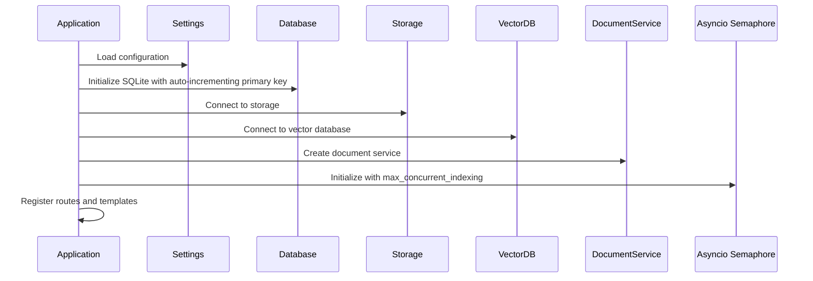

**Diagram sources**
- [app/main.py:24-90](file://app/main.py#L24-L90)
- [app/config.py:37-39](file://app/config.py#L37-L39)
- [app/storage/database.py:32-39](file://app/storage/database.py#L32-L39)

### Document Service Architecture

The DocumentService acts as the central coordinator for all document operations with enhanced error handling and consistency guarantees:

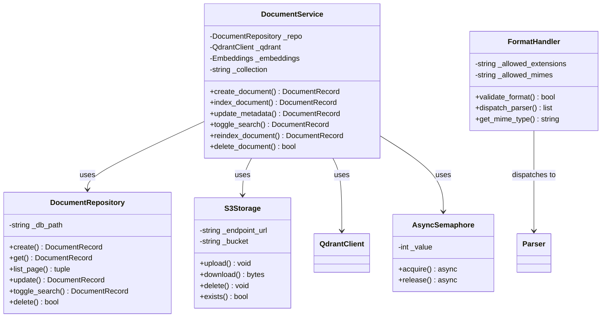

**Diagram sources**
- [app/domain/document_service.py:35-283](file://app/domain/document_service.py#L35-L283)
- [app/storage/document_repo.py:63-214](file://app/storage/document_repo.py#L63-L214)
- [app/storage/s3.py:14-109](file://app/storage/s3.py#L14-L109)
- [app/api/documents.py:66-76](file://app/api/documents.py#L66-L76)
- [app/main.py:87-89](file://app/main.py#L87-L89)

**Section sources**
- [app/main.py:1-131](file://app/main.py#L1-L131)
- [app/domain/document_service.py:1-283](file://app/domain/document_service.py#L1-L283)

## Document Management Workflow

The document management process follows a structured workflow from upload to searchable state with enhanced format support and concurrency control:

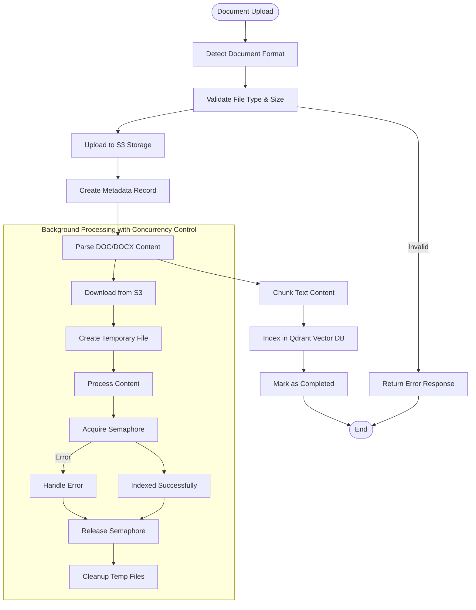

**Diagram sources**
- [app/api/documents.py:294-381](file://app/api/documents.py#L294-L381)
- [app/domain/document_service.py:84-133](file://app/domain/document_service.py#L84-L133)
- [app/rag/parser.py:121-138](file://app/rag/parser.py#L121-L138)
- [app/api/documents.py:125-145](file://app/api/documents.py#L125-L145)

### Upload Validation and Processing

The system implements comprehensive validation for uploaded documents with enhanced format support and concurrency management:

| Validation Step | Criteria | Action |
|----------------|----------|---------|
| File Extension | Both `.docx` and `.doc` allowed | Accept both formats |
| File Size | Maximum 10MB | Reject if exceeded |
| Content Type | DOCX/DOC MIME types | Validate against allowed types |
| Format Detection | Automatic extension-based detection | Route to appropriate parser |
| Duplicate Prevention | Unique S3 keys | Append counter suffix |
| Concurrency Control | Semaphore-based throttling | Limit concurrent indexing operations |

**Updated** The validation system now supports both DOCX and DOC formats with comprehensive MIME type validation. The format detection mechanism automatically routes documents to the appropriate parser based on file extension, ensuring proper handling of legacy DOC files while maintaining modern DOCX processing capabilities. Background indexing operations are now protected by semaphore-based concurrency control to prevent resource exhaustion.

**Section sources**
- [app/api/documents.py:307-366](file://app/api/documents.py#L307-L366)
- [app/api/documents.py:111-130](file://app/api/documents.py#L111-L130)

## Server-Side Search Functionality

The system implements comprehensive server-side search functionality with real-time filtering capabilities:

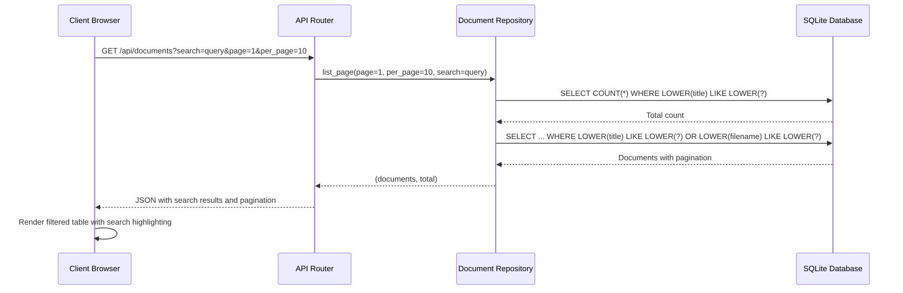

**Diagram sources**
- [app/api/documents.py:390-406](file://app/api/documents.py#L390-L406)
- [app/storage/document_repo.py:120-158](file://app/storage/document_repo.py#L120-L158)

### Search Implementation Details

The search functionality provides comprehensive filtering capabilities:

- **Case-insensitive matching**: Uses `LOWER()` function for case-insensitive pattern matching
- **Dual-field search**: Searches both document titles and filenames simultaneously
- **Real-time filtering**: Integrated with HTMX for immediate search results
- **Pattern matching**: Supports partial matches with wildcard patterns
- **Performance optimization**: Efficient LIKE queries with proper indexing considerations

### Search Parameters

The search system supports the following parameters:

| Parameter | Type | Description |
|-----------|------|-------------|
| `search` | String | Search query for filtering documents by title or filename |
| `page` | Integer | Current page number (1-indexed) |
| `per_page` | Integer | Number of items per page (10, 20, 50) |

### Search UI Integration

The frontend provides intuitive search capabilities:

- **Real-time search**: Debounced input with 300ms delay for performance
- **Search icon**: Visual indicator with magnifying glass icon
- **Placeholder text**: "Search" for user guidance
- **HTMX integration**: Automatic AJAX requests for filtered results
- **Pagination preservation**: Search maintains current pagination state

**Section sources**
- [app/api/documents.py:194-218](file://app/api/documents.py#L194-L218)
- [app/api/documents.py:390-406](file://app/api/documents.py#L390-L406)
- [app/storage/document_repo.py:120-158](file://app/storage/document_repo.py#L120-L158)
- [templates/documents.html:25-42](file://templates/documents.html#L25-L42)

## Enhanced Status Display System

The system provides comprehensive visual status indicators for document tracking with enhanced concurrency awareness:

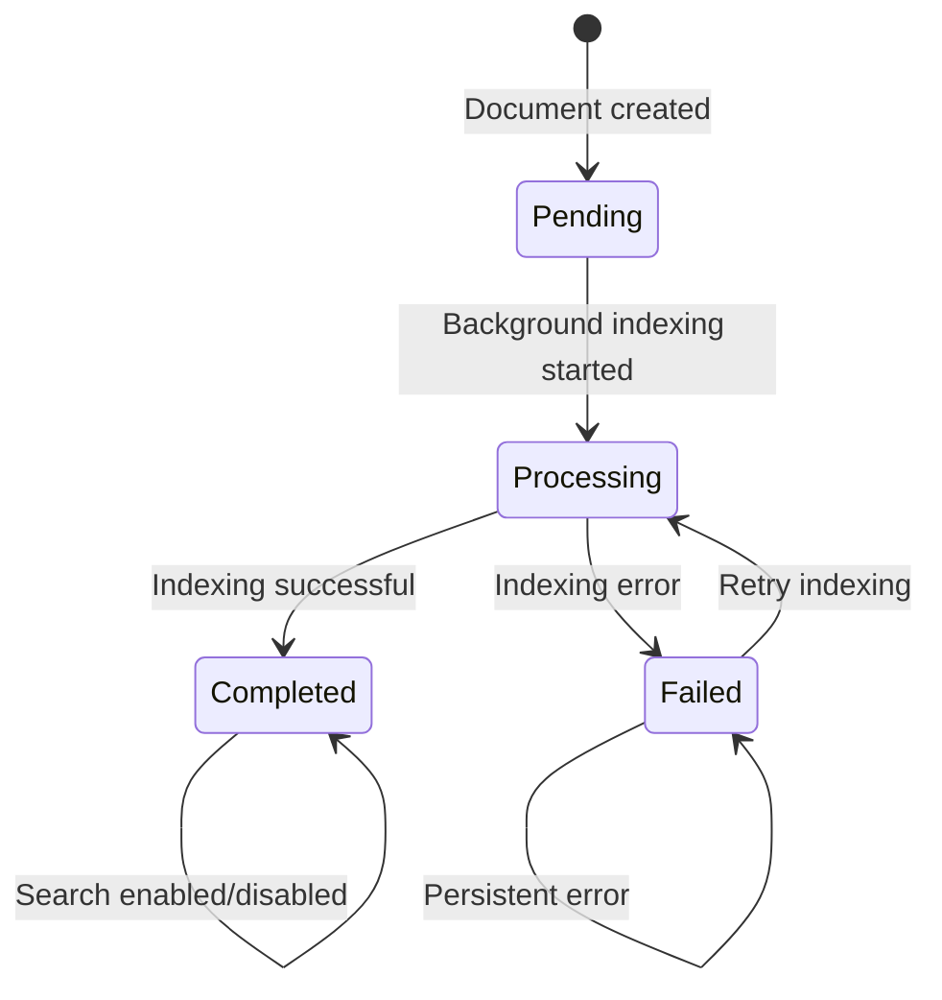

**Diagram sources**
- [templates/partials/document_row.html:19-41](file://templates/partials/document_row.html#L19-L41)
- [app/storage/models.py:11-18](file://app/storage/models.py#L11-L18)

### Status Badge Visual Indicators

The system displays four distinct status states with appropriate visual cues:

| Status | Visual Indicator | Icon | Color | Description |
|--------|------------------|------|-------|-------------|
| `pending` | Warning badge | ⏳ | Yellow | Document queued for processing |
| `processing` | Info badge | 🔁 | Blue | Background indexing in progress |
| `completed` | Success badge | ✅ | Green | Document successfully indexed |
| `failed` | Error badge | ❌ | Red | Indexing failed with error details |

### Status Interaction Elements

The status system includes interactive elements for document management:

- **Auto-refresh**: Processing documents automatically refresh every 3 seconds
- **Error tooltips**: Detailed error messages on hover for failed documents
- **Loading indicators**: Animated dots/spinner for pending/processing states
- **Checkbox control**: Toggle search participation for completed documents

### Status Filtering Capabilities

The frontend provides status-based filtering:

- **Status dropdown**: Filter documents by processing status
- **Visual labels**: Status-specific color coding
- **Client-side filtering**: Real-time filtering of visible documents
- **Combined filters**: Status filters work with search and type filters

**Section sources**
- [templates/partials/document_row.html:19-41](file://templates/partials/document_row.html#L19-L41)
- [templates/documents.html:74-87](file://templates/documents.html#L74-L87)
- [app/storage/models.py:11-18](file://app/storage/models.py#L11-L18)

## Pagination System

The system implements a comprehensive pagination system that enhances scalability and user experience when managing large document collections:

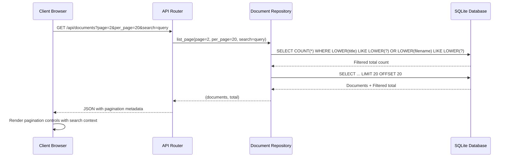

**Diagram sources**
- [app/api/documents.py:390-406](file://app/api/documents.py#L390-L406)
- [app/storage/document_repo.py:120-158](file://app/storage/document_repo.py#L120-L158)

### Pagination Parameters

The pagination system supports the following parameters:

| Parameter | Type | Default | Description |
|-----------|------|---------|-------------|
| `page` | Integer | 1 | Current page number (1-indexed) |
| `per_page` | Integer | 10 | Number of items per page (10, 20, 50) |
| `search` | String | None | Search query for filtering documents |

### Frontend Pagination Implementation

The frontend uses HTMX for dynamic pagination without full page reloads:

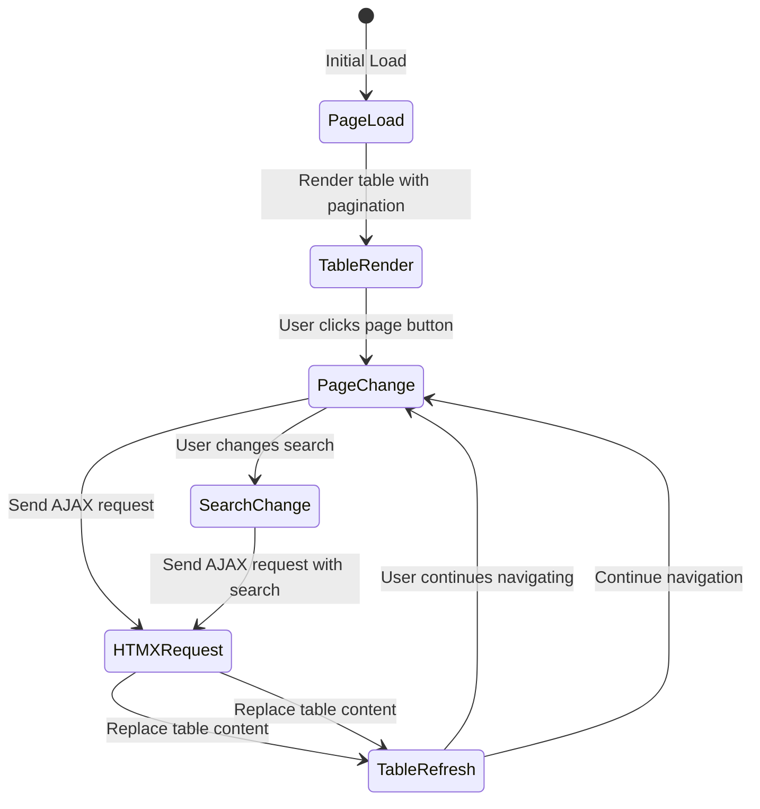

**Diagram sources**
- [templates/documents.html:35-41](file://templates/documents.html#L35-L41)
- [templates/partials/pagination.html:7-10](file://templates/partials/pagination.html#L7-L10)

### Pagination Controls

The system provides sophisticated pagination controls with intelligent page numbering:

- **Previous/Next Buttons**: Navigate between adjacent pages
- **Page Number Buttons**: Direct access to specific pages with ellipsis for large ranges
- **Dynamic Ellipsis**: Shows `1, 2, 3, ..., last` near the end, `1, ..., middle-1, middle, middle+1, ..., last` in the middle, and `1, 2, 3, 4, 5, ..., last` near the beginning
- **Active State Highlighting**: Current page button is visually distinct
- **Disabled States**: Previous button disabled on first page, next button disabled on last page
- **Search Context Preservation**: Pagination maintains search query across page changes

**Section sources**
- [app/api/documents.py:194-218](file://app/api/documents.py#L194-L218)
- [app/api/documents.py:390-406](file://app/api/documents.py#L390-L406)
- [app/storage/document_repo.py:120-158](file://app/storage/document_repo.py#L120-L158)
- [templates/partials/pagination.html:1-103](file://templates/partials/pagination.html#L1-L103)

## Bulk Operations System

The system provides comprehensive bulk operations for efficient document management at scale with enhanced concurrency control:

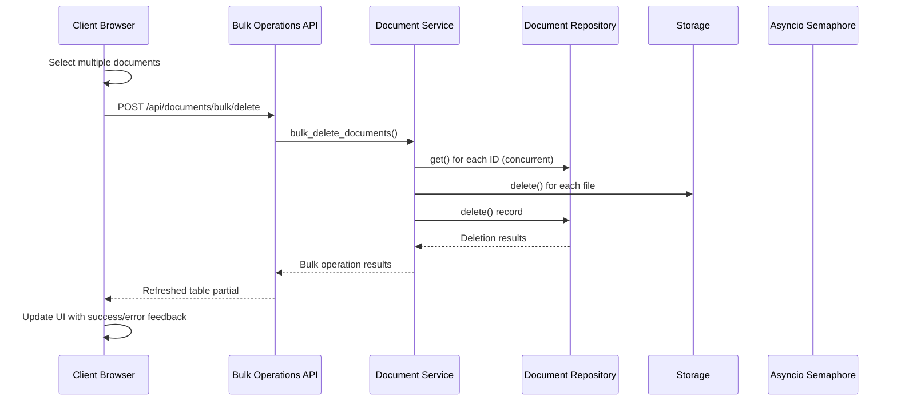

**Diagram sources**
- [app/api/documents.py:518-576](file://app/api/documents.py#L518-L576)
- [app/api/documents.py:578-643](file://app/api/documents.py#L578-L643)
- [app/api/documents.py:646-700](file://app/api/documents.py#L646-L700)
- [templates/documents.html:537-561](file://templates/documents.html#L537-L561)

### Bulk Operations Architecture

The bulk operations system provides three core capabilities with enhanced concurrency control:

#### Concurrent Document Fetching
- **Enhanced Performance**: Uses `asyncio.gather()` to fetch all documents concurrently
- **Error Collection**: Collects individual errors while continuing with remaining operations
- **Atomic Processing**: Processes all documents regardless of individual failures

#### Delete Operation
- **Endpoint**: `POST /api/documents/bulk/delete`
- **Request Body**: `{ ids: [string[]] }`
- **Behavior**: Deletes multiple documents atomically with error collection
- **Response**: Refreshed document table partial via HTMX
- **Error Handling**: Continues processing despite individual failures

#### Reindex Operation
- **Endpoint**: `POST /api/documents/bulk/reindex`
- **Request Body**: `{ ids: [string[]] }`
- **Behavior**: Initiates background reindexing for multiple documents with semaphore protection
- **Response**: Immediate acknowledgment with background processing
- **Error Handling**: Logs errors and continues with remaining documents
- **Concurrency Control**: Each reindex operation acquires semaphore before processing

#### Search Toggle Operation
- **Endpoint**: `PATCH /api/documents/bulk/search`
- **Request Body**: `{ ids: [string[]], enabled: boolean }`
- **Behavior**: Toggles search participation for multiple documents
- **Response**: Refreshed table partial with updated status
- **Error Handling**: Processes all documents regardless of individual failures

### Frontend Bulk Actions Toolbar

The modernized interface includes an interactive bulk actions toolbar:

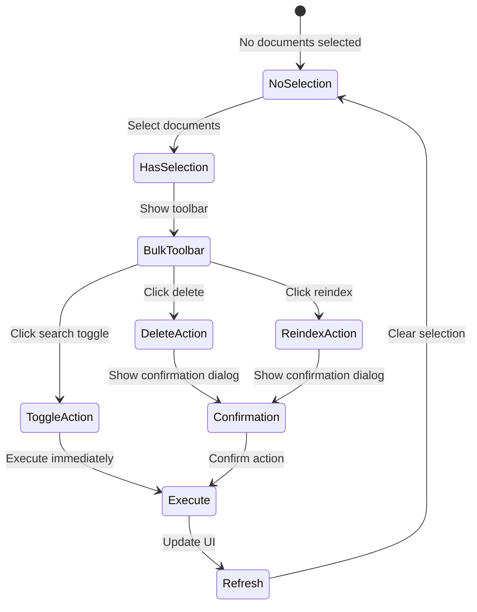

**Diagram sources**
- [templates/documents.html:135-186](file://templates/documents.html#L135-L186)
- [templates/documents.html:537-611](file://templates/documents.html#L537-L611)

### Bulk Action Features

The bulk operations provide comprehensive functionality:

- **Multi-selection**: Checkbox-based selection with "Select All" capability
- **Bulk Toolbar**: Persistent toolbar showing selected count and available actions
- **Confirmation Dialogs**: Prevent accidental bulk deletions
- **Real-time Feedback**: Toast notifications for operation results
- **Selection Persistence**: Maintains selections across pagination and filters
- **HTMX Integration**: Seamless partial updates without full page reloads

**Section sources**
- [app/api/documents.py:476-700](file://app/api/documents.py#L476-L700)
- [templates/documents.html:135-186](file://templates/documents.html#L135-L186)
- [templates/documents.html:537-611](file://templates/documents.html#L537-L611)

## Enhanced Date Range Filtering

The system implements sophisticated date range filtering with inclusive boundaries and ISO format support:

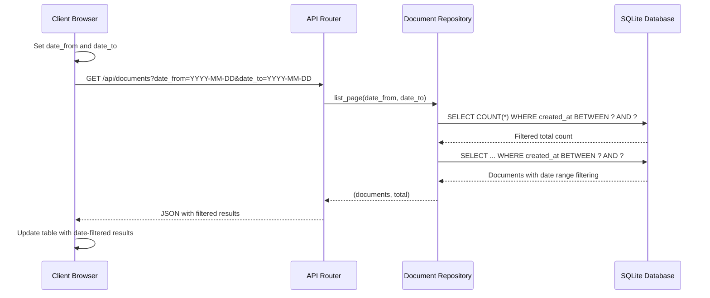

**Diagram sources**
- [app/api/documents.py:435-473](file://app/api/documents.py#L435-L473)
- [app/storage/document_repo.py:120-174](file://app/storage/document_repo.py#L120-L174)

### Date Range Implementation Details

The date filtering system provides precise temporal control:

- **ISO Format Parsing**: Accepts `YYYY-MM-DD` format with robust error handling
- **Inclusive Boundaries**: 
  - `date_from`: Documents created on or after this date
  - `date_to`: Documents created on or before this date (end of day)
- **Time Zone Handling**: Uses UTC for consistent filtering across time zones
- **Partial Date Support**: Either date can be specified independently
- **Validation**: Graceful handling of invalid date formats

### Date Filter UI Components

The enhanced frontend includes comprehensive date filtering:

- **Dropdown Interface**: Collapsible date filter panel with smooth animations
- **Two-Date Selection**: Separate inputs for start and end dates
- **Real-time Updates**: Automatic filtering on date input changes
- **Clear Functionality**: One-click clearing of date filters
- **Apply Button**: Explicit apply mechanism for complex workflows
- **URL Parameter Sync**: Date filters persist in URL for sharing and bookmarking
- **Responsive Design**: Mobile-friendly date picker interface

### Date Filter Parameters

The date filtering system supports:

| Parameter | Type | Description |
|-----------|------|-------------|
| `date_from` | String (ISO-8601) | Filter documents created on or after this date |
| `date_to` | String (ISO-8601) | Filter documents created on or before this date |

**Section sources**
- [app/api/documents.py:435-473](file://app/api/documents.py#L435-L473)
- [app/storage/document_repo.py:120-174](file://app/storage/document_repo.py#L120-L174)
- [templates/documents.html:89-131](file://templates/documents.html#L89-L131)
- [templates/documents.html:489-494](file://templates/documents.html#L489-L494)

## Modernized Frontend Interface

The system features a modernized frontend interface with enhanced user experience and interactive capabilities:

```mermaid
flowchart TD
UI[Modernized Interface] --> BulkToolbar[Bulk Actions Toolbar]
UI --> DateFilter[Enhanced Date Filters]
UI --> Search[Improved Search]
UI --> Pagination[Enhanced Pagination]
UI --> Status[Visual Status Indicators]
UI --> FormatIcons[Format Type Icons]
BulkToolbar --> DeleteBtn[Delete Button]
BulkToolbar --> ReindexBtn[Reindex Button]
BulkToolbar --> ToggleBtn[Toggle Search Button]
DateFilter --> FromInput[From Date Input]
DateFilter --> ToInput[To Date Input]
DateFilter --> ApplyBtn[Apply Button]
DateFilter --> ClearBtn[Clear Button]
Search --> RealtimeSearch[Real-time Search]
Search --> Debounce[300ms Debounce]
Pagination --> HTMX[HTMX Integration]
Pagination --> Ellipsis[Smart Ellipsis]
Status --> AutoRefresh[Auto-refresh]
Status --> Tooltips[Error Tooltips]
FormatIcons --> DocIcon[DOC Format Icon]
FormatIcons --> DocxIcon[DOCX Format Icon]
```

**Diagram sources**
- [templates/documents.html:135-186](file://templates/documents.html#L135-L186)
- [templates/documents.html:89-131](file://templates/documents.html#L89-L131)
- [templates/documents.html:306-334](file://templates/documents.html#L306-L334)
- [templates/partials/document_row.html:77-97](file://templates/partials/document_row.html#L77-L97)

### Interactive Features

The modernized interface includes several key interactive elements:

#### Bulk Actions Toolbar
- **Persistent Display**: Appears when documents are selected
- **Visual Feedback**: Shows selected count with badge styling
- **Action Buttons**: Delete, Reindex, Include/Exclude from search
- **Selection Controls**: Clear selection button
- **Responsive Layout**: Adapts to different screen sizes

#### Enhanced Date Filters
- **Dropdown Interface**: Collapsible filter panel with smooth animations
- **Two-Date Selection**: Separate inputs for start and end dates
- **Real-time Updates**: Automatic filtering on input changes
- **Clear Functionality**: One-click reset of all date filters
- **Apply/Clear Buttons**: Explicit control over filter application

#### Improved Search Experience
- **Debounced Input**: 300ms delay for performance optimization
- **Real-time Results**: Instant filtering without page reloads
- **Visual Indicators**: Clear display of active search terms
- **Search Icon**: Intuitive magnifying glass icon

#### Advanced Pagination
- **HTMX Integration**: Seamless partial updates without full reloads
- **Smart Ellipsis**: Intelligent page number display for large datasets
- **URL Synchronization**: Pagination state preserved in URL
- **Responsive Design**: Mobile-optimized pagination controls

#### Format Type Display
- **Visual Icons**: Distinct icons for DOC and DOCX formats
- **Color Coding**: Different visual treatments for different formats
- **Tooltip Information**: Hover details showing exact format type
- **Filtering Support**: Separate filters for DOC and DOCX formats

### Frontend State Management

The interface uses Alpine.js for comprehensive state management:

- **Filter State**: Search query, status filter, source type filter, date range
- **Selection State**: Track selected document IDs across operations
- **Pagination State**: Current page, items per page, total counts
- **Upload State**: Track file upload progress and status
- **Modal State**: Manage dialog visibility and user interactions
- **Format State**: Track document format types and display preferences

**Section sources**
- [templates/documents.html:135-186](file://templates/documents.html#L135-L186)
- [templates/documents.html:89-131](file://templates/documents.html#L89-L131)
- [templates/documents.html:306-334](file://templates/documents.html#L306-L334)
- [templates/documents.html:537-611](file://templates/documents.html#L537-L611)
- [templates/partials/document_row.html:77-97](file://templates/partials/document_row.html#L77-L97)

## Enhanced Document Format Support

The system now provides comprehensive support for both modern DOCX and legacy DOC document formats:

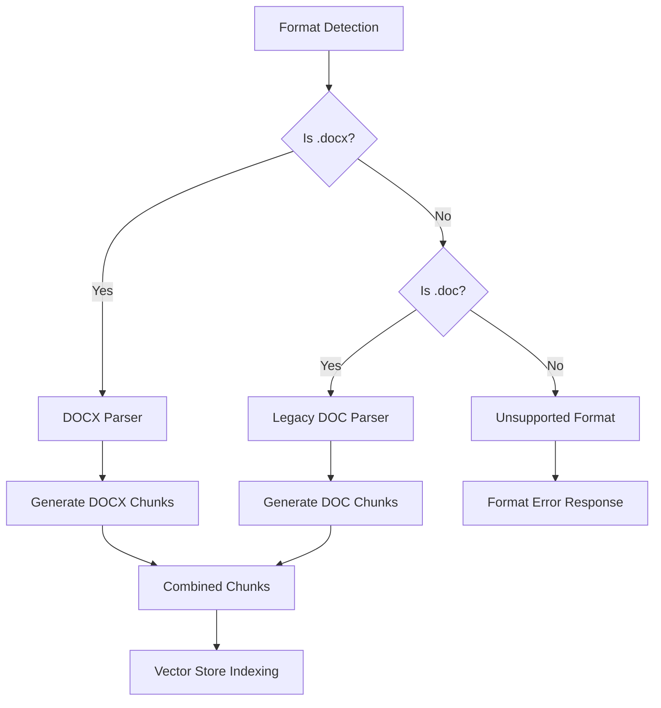

**Diagram sources**
- [app/rag/parser.py:121-138](file://app/rag/parser.py#L121-L138)
- [app/api/documents.py:66-76](file://app/api/documents.py#L66-L76)

### Format Detection and Validation

The system implements comprehensive format detection and validation:

- **Allowed Extensions**: Both `.docx` and `.doc` are supported
- **MIME Type Validation**: Comprehensive MIME type checking for both formats
- **Automatic Routing**: Format detection determines appropriate parsing strategy
- **Error Handling**: Graceful handling of unsupported formats with clear error messages

### Parser Architecture

The enhanced parser system supports both document formats:

#### DOCX Parser
- **Structured Content**: Preserves document structure with heading-based sections
- **Metadata Enrichment**: Maintains source filename and section information
- **Chunk Processing**: Generates semantic chunks with proper metadata
- **Vector Embedding**: Creates embeddings for semantic search

#### Legacy DOC Parser
- **Text Extraction**: Uses `docx2txt` for reliable text extraction
- **Single Section**: Treats entire document as single section
- **Filename-Based Section**: Uses document stem as section heading
- **Consistent Processing**: Mirrors DOCX processing approach for uniform results

### Format-Specific Features

Both formats benefit from enhanced processing capabilities:

- **Unified Metadata**: Consistent metadata structure regardless of format
- **Chunk Size Optimization**: Same chunk size and overlap for both formats
- **Vector Database Integration**: Seamless integration with Qdrant vector store
- **Search Compatibility**: Identical search behavior for both document types

**Section sources**
- [app/rag/parser.py:55-138](file://app/rag/parser.py#L55-L138)
- [app/api/documents.py:66-76](file://app/api/documents.py#L66-L76)
- [templates/partials/document_row.html:77-97](file://templates/partials/document_row.html#L77-L97)

## RAG Pipeline

The Retrieval-Augmented Generation pipeline processes documents through multiple stages with enhanced format support and concurrency control:

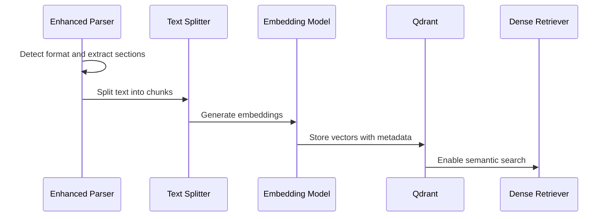

**Diagram sources**
- [app/rag/parser.py:54-83](file://app/rag/parser.py#L54-L83)
- [app/rag/indexer.py:49-72](file://app/rag/indexer.py#L49-L72)
- [app/rag/retriever.py:78-103](file://app/rag/retriever.py#L78-L103)

### Document Chunking Strategy

The system employs intelligent chunking for optimal retrieval performance:

- **Chunk Size**: 1000 characters with 200-character overlap
- **Splitting Strategy**: Hierarchical splitting by paragraphs, sentences, and words
- **Section Preservation**: Maintains semantic boundaries using heading-based sections for DOCX
- **Legacy Support**: Single-section processing for DOC files with filename-based sectioning
- **Metadata Enrichment**: Each chunk carries document ID, chunk ID, filename, and search enablement status

### Format-Aware Processing

The enhanced pipeline handles both document formats appropriately:

- **DOCX Processing**: Structured section extraction with heading preservation
- **DOC Processing**: Text extraction with single-section approach
- **Unified Output**: Consistent chunk structure for both formats
- **Metadata Consistency**: Same metadata schema regardless of source format

**Section sources**
- [app/rag/parser.py:15-17](file://app/rag/parser.py#L15-L17)
- [app/rag/parser.py:54-83](file://app/rag/parser.py#L54-L83)
- [app/rag/indexer.py:23-46](file://app/rag/indexer.py#L23-L46)

## VK Bot Integration

The system includes a comprehensive VK social network bot for HR assistance:

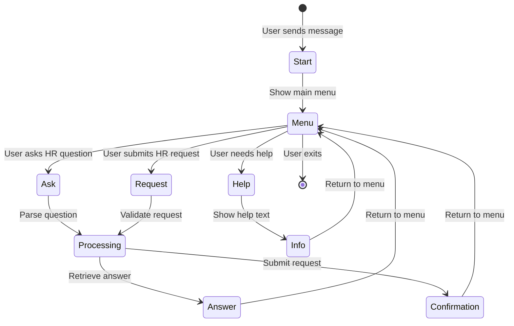

**Diagram sources**
- [app/integrations/vk/states.py](file://app/integrations/vk/states.py)
- [app/integrations/vk/bot.py](file://app/integrations/vk/bot.py)

### Bot Handler Architecture

The VK bot uses a handler-based architecture for different interaction modes:

| Handler | Purpose | Features |
|---------|---------|----------|
| `start.py` | Welcome and initial greeting | Bot introduction, basic commands |
| `ask.py` | HR question answering | RAG-powered Q&A, context awareness |
| `hr_request.py` | Formal HR requests | Structured request forms, approval flow |
| `hire.py` | Hiring process | Candidate screening, interview scheduling |
| `fire.py` | Termination process | Exit procedures, final settlement |
| `pay.py` | Payroll inquiries | Salary calculations, payment history |
| `vacation.py` | Leave management | Vacation requests, balance tracking |

**Section sources**
- [app/integrations/vk/handlers/start.py](file://app/integrations/vk/handlers/start.py)
- [app/integrations/vk/handlers/ask.py](file://app/integrations/vk/handlers/ask.py)
- [app/integrations/vk/handlers/hr_request.py](file://app/integrations/vk/handlers/hr_request.py)

## Storage Layer

The storage architecture provides a robust foundation for document management with enhanced search, pagination, and date filtering support:

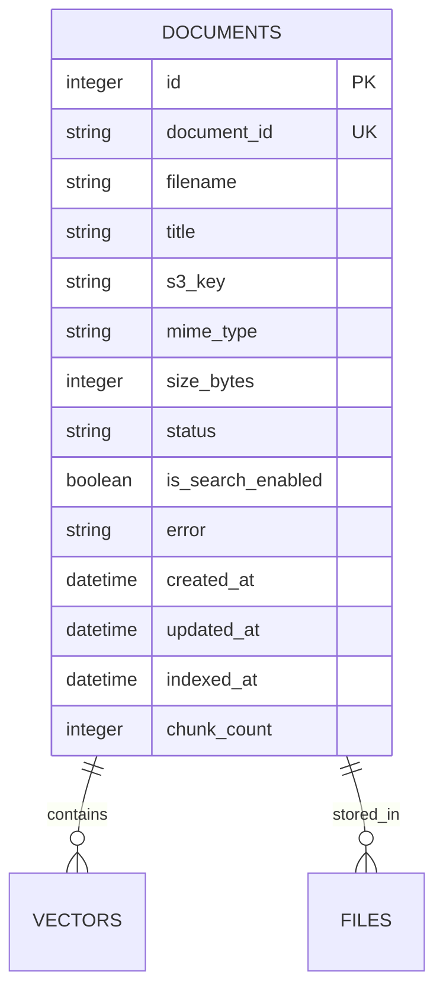

**Diagram sources**
- [app/storage/models.py:20-37](file://app/storage/models.py#L20-L37)
- [app/storage/document_repo.py:14-49](file://app/storage/document_repo.py#L14-L49)
- [app/storage/database.py:12-29](file://app/storage/database.py#L12-L29)

### Database Schema Design

The SQLite schema supports comprehensive document tracking with:

- **Primary Keys**: Auto-incremented integer ID and UUID-based document ID
- **Status Tracking**: Four-state processing pipeline (pending → processing → completed/failed)
- **Search Optimization**: Dedicated search enablement flag for vector filtering
- **Audit Trail**: Creation and modification timestamps for all records
- **Performance Metrics**: Chunk count and indexing timestamps for monitoring
- **Pagination Support**: Efficient ordering by ID for pagination queries
- **Search Indexing**: Case-insensitive search columns for optimal query performance
- **Date Filtering**: Precise timestamp fields for temporal queries
- **Format Support**: MIME type tracking for different document formats

**Updated** The database now tracks MIME types for both DOC and DOCX formats, enabling precise format identification and filtering. The `is_search_enabled` column provides granular control over document inclusion in search results regardless of format type. The `created_at` field supports precise date range filtering with inclusive boundaries.

**Section sources**
- [app/storage/models.py:11-37](file://app/storage/models.py#L11-L37)
- [app/storage/document_repo.py:63-214](file://app/storage/document_repo.py#L63-L214)
- [app/storage/database.py:12-29](file://app/storage/database.py#L12-L29)

## API Endpoints

The system provides a comprehensive REST API for document management with full search, pagination, and bulk operation support:

### Authentication and Authorization

| Endpoint | Method | Description | Authentication |
|----------|--------|-------------|----------------|
| `/login` | GET/POST | Admin login form and authentication | None |
| `/logout` | GET | Clear admin session | Admin cookie |
| `/` | GET | Redirect based on authentication | Admin cookie |

### Document Management API

| Endpoint | Method | Description | Authentication |
|----------|--------|-------------|----------------|
| `/api/documents/upload` | POST | Upload multiple DOC/DOCX files | Admin cookie |
| `/api/documents` | GET | List all documents with search, pagination, and date filtering | Admin cookie |
| `/api/documents/{id}` | GET/PATCH/DELETE | Document operations | Admin cookie |
| `/api/documents/{id}/title` | PATCH | Update document title | Admin cookie |
| `/api/documents/{id}/search` | PATCH | Toggle search participation | Admin cookie |
| `/api/documents/{id}/reindex` | POST | Re-index document with semaphore protection | Admin cookie |
| `/api/documents/{id}/download` | GET | Download original file | Admin cookie |

### Bulk Operations API

| Endpoint | Method | Description | Authentication |
|----------|--------|-------------|----------------|
| `/api/documents/bulk/delete` | POST | Delete multiple documents with concurrent fetching | Admin cookie |
| `/api/documents/bulk/reindex` | POST | Re-index multiple documents with semaphore protection | Admin cookie |
| `/api/documents/bulk/search` | PATCH | Toggle search participation for multiple documents | Admin cookie |

### HTMX Partial Endpoints

| Endpoint | Method | Description |
|----------|--------|-------------|
| `/partials/document-table` | GET | Dynamic table content with search, pagination, and date filtering |
| `/partials/document-row/{id}` | GET | Individual row updates with status refresh |
| `/partials/document-status/{id}` | GET | Status badge refresh |

### Search and Pagination Parameters

All list endpoints support the following parameters:

- **`page`**: Current page number (default: 1)
- **`per_page`**: Items per page (default: 10, options: 10, 20, 50)
- **`search`**: Search query for filtering documents by title or filename
- **`date_from`**: ISO date string for minimum creation date (inclusive)
- **`date_to`**: ISO date string for maximum creation date (inclusive)

**Updated** All endpoints now support comprehensive search functionality with case-insensitive pattern matching against document titles and filenames. The main `/api/documents` endpoint returns detailed pagination metadata including total count, current page, items per page, and total pages. Bulk operations endpoints provide atomic operations on multiple documents with comprehensive error handling and HTMX partial responses for seamless user experience. Background indexing operations are now protected by semaphore-based concurrency control to prevent resource exhaustion.

**Section sources**
- [app/api/documents.py:1-806](file://app/api/documents.py#L1-L806)
- [app/api/deps.py:54-74](file://app/api/deps.py#L54-L74)

## Configuration Management

The system uses Pydantic Settings for centralized configuration with enhanced concurrency control:

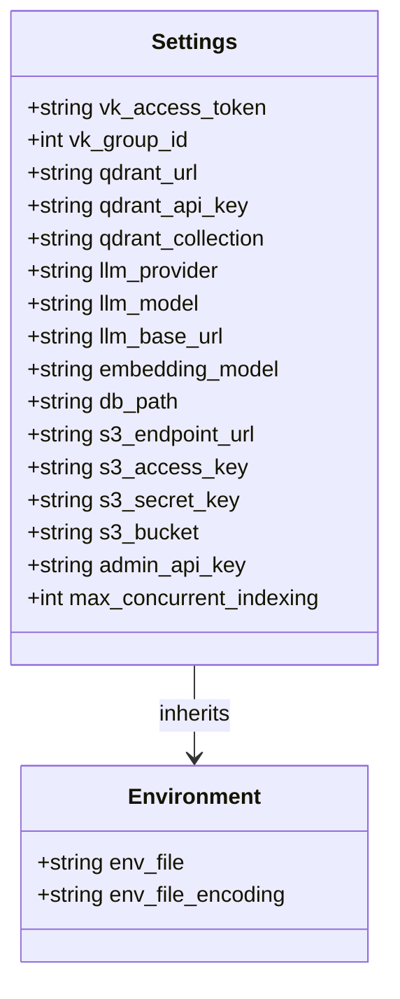

**Diagram sources**
- [app/config.py:4-39](file://app/config.py#L4-L39)

### Configuration Categories

| Category | Key | Default Value | Purpose |
|----------|-----|---------------|---------|
| **VK Integration** | `vk_access_token` | Empty string | Bot authentication |
| **Vector Database** | `qdrant_url` | `http://localhost:6333` | Qdrant connection |
| **LLM Provider** | `llm_provider` | `ollama` | AI model provider |
| **Storage** | `db_path` | `data/cafetera.db` | SQLite database location |
| **Admin Security** | `admin_api_key` | Empty string | Administrative access |
| **Concurrency Control** | `max_concurrent_indexing` | `2` | Semaphore limit for indexing |

**Section sources**
- [app/config.py:1-39](file://app/config.py#L1-L39)

## Concurrency Control and Throttling

The system implements comprehensive concurrency control with semaphore-based throttling for document indexing operations:

### Semaphore-Based Throttling

The system uses asyncio.Semaphore to limit concurrent document indexing operations:

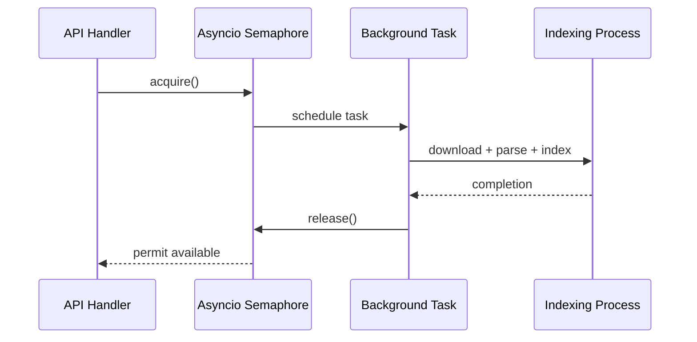

**Diagram sources**
- [app/main.py:87-89](file://app/main.py#L87-L89)
- [app/api/deps.py:69-70](file://app/api/deps.py#L69-L70)
- [app/api/documents.py:125-145](file://app/api/documents.py#L125-L145)

### Concurrency Control Implementation

The semaphore-based throttling system provides:

- **Resource Protection**: Limits concurrent indexing operations to prevent resource exhaustion
- **Fair Queuing**: First-come-first-served ordering for background tasks
- **Graceful Degradation**: Tasks wait for available permits rather than failing immediately
- **Configurable Limits**: Adjustable concurrency based on system resources
- **Atomic Operations**: Semaphore acquisition/release wraps the entire indexing process

### Background Task Coordination

Background tasks are coordinated through enhanced functions:

- **`_index_in_background`**: Handles single document indexing with semaphore protection
- **`_reindex_in_background`**: Handles bulk reindexing with proper error handling
- **Concurrent Processing**: Multiple background tasks can run simultaneously within limits
- **Error Recovery**: Failed tasks don't block other operations

**Section sources**
- [app/main.py:87-89](file://app/main.py#L87-L89)
- [app/api/documents.py:125-145](file://app/api/documents.py#L125-L145)
- [app/api/documents.py:802-821](file://app/api/documents.py#L802-L821)

## Enhanced Error Handling and Consistency

The system implements comprehensive error handling with atomic consistency guarantees:

### Atomic State Updates

The document service ensures atomic state updates:

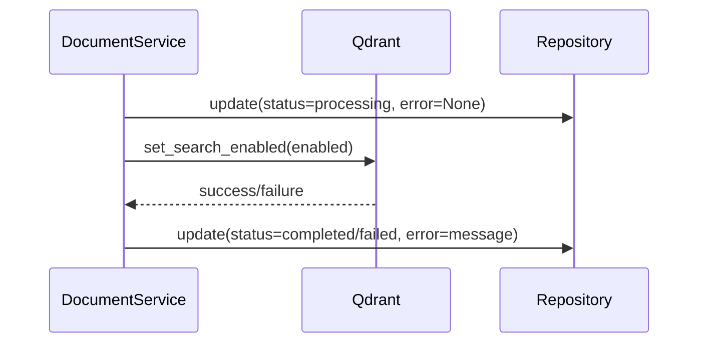

**Diagram sources**
- [app/domain/document_service.py:147-181](file://app/domain/document_service.py#L147-L181)
- [app/domain/document_service.py:184-234](file://app/domain/document_service.py#L184-L234)

### Error Handling Strategies

The system implements multiple error handling strategies:

- **Consistency First**: Qdrant updates occur before repository updates
- **Rollback Protection**: Failed Qdrant operations prevent inconsistent state
- **Detailed Logging**: Comprehensive error logging with stack traces
- **Graceful Degradation**: Operations continue despite individual failures
- **Atomic Transactions**: Critical sections maintain consistency

### Background Task Error Recovery

Background tasks implement robust error recovery:

- **Exception Handling**: All exceptions are caught and logged
- **State Cleanup**: Temporary files are cleaned up even on failure
- **Error Propagation**: Errors are logged but don't crash the system
- **Resource Management**: Proper cleanup of temporary resources

**Section sources**
- [app/domain/document_service.py:84-133](file://app/domain/document_service.py#L84-L133)
- [app/domain/document_service.py:147-181](file://app/domain/document_service.py#L147-L181)
- [app/domain/document_service.py:184-234](file://app/domain/document_service.py#L184-L234)

## Testing Strategy

The system includes comprehensive testing across all layers with extensive search, pagination, bulk operation, and concurrency control coverage:

### Test Coverage Areas

| Test Module | Focus Area | Testing Approach |
|-------------|------------|------------------|
| `test_api_documents.py` | API endpoint functionality | Unit and integration tests |
| `test_document_service.py` | Domain service logic | Mock-based testing |
| `test_storage.py` | Database operations | SQLite in-memory testing |
| `test_rag_block6.py` | RAG pipeline components | End-to-end testing |
| `test_bot_factory.py` | VK bot integration | State machine validation |
| `test_qa_service.py` | Question-answering logic | Scenario-based testing |

### Search and Status Testing Coverage

The test suite includes comprehensive search and status functionality testing:

- **Search functionality**: Tests case-insensitive pattern matching against titles and filenames
- **Status transitions**: Validates all status state changes and visual indicators
- **Search enable/disable**: Tests toggle functionality for search participation
- **Real-time updates**: Verifies automatic status refresh for processing documents
- **Error handling**: Tests error status display and tooltip functionality
- **Pagination with search**: Validates search results across multiple pages

### Pagination Testing Coverage

The test suite includes comprehensive pagination testing:

- **Default Pagination**: Tests default page size (10 items)
- **Custom Pagination**: Tests custom page sizes (3 items per page)
- **Large Collections**: Tests pagination with 7 documents across 3 pages
- **Beyond Range**: Tests pagination beyond available data
- **Total Count Accuracy**: Verifies total count matches actual document count
- **HTMX Partials**: Tests pagination controls in HTMX partial responses

### Bulk Operations Testing Coverage

The test suite includes comprehensive bulk operation testing with concurrency control:

- **Bulk Delete**: Tests deletion of multiple documents with concurrent fetching
- **Bulk Reindex**: Tests background reindexing initiation for multiple documents with semaphore protection
- **Bulk Search Toggle**: Tests enabling/disabling search participation for multiple documents
- **Error Handling**: Validates graceful handling of non-existent documents
- **HTMX Responses**: Tests partial HTML responses for seamless updates
- **Background Processing**: Validates background task scheduling and execution with proper concurrency limits

### Enhanced Format Testing Coverage

The test suite includes comprehensive format-specific testing:

- **DOCX Upload**: Tests upload and processing of modern DOCX files
- **DOC Upload**: Tests upload and processing of legacy DOC files
- **Format Detection**: Validates automatic format detection and routing
- **Parser Compatibility**: Ensures both formats produce identical chunk structures
- **Metadata Consistency**: Verifies consistent metadata across formats

### Concurrency Control Testing Coverage

The test suite includes comprehensive concurrency control testing:

- **Semaphore Limits**: Tests maximum concurrent indexing operations
- **Task Queueing**: Validates proper queuing when limits are reached
- **Resource Cleanup**: Ensures proper cleanup of temporary files
- **Error Recovery**: Tests recovery from concurrent operation failures
- **Performance Testing**: Validates system performance under load

**Updated** The testing strategy now includes extensive concurrency control testing covering semaphore-based throttling, concurrent bulk operations with asyncio.gather, proper resource management, and comprehensive error recovery mechanisms. The test suite validates all concurrency-aware endpoints with proper load testing and ensures system stability under various concurrency scenarios.

**Section sources**
- [pyproject.toml:45-47](file://pyproject.toml#L45-L47)
- [tests/test_api_documents.py:506-605](file://tests/test_api_documents.py#L506-L605)
- [tests/test_storage.py:244-275](file://tests/test_storage.py#L244-L275)

## Deployment and Operations

### Docker Compose Configuration

The system supports containerized deployment with the following services:

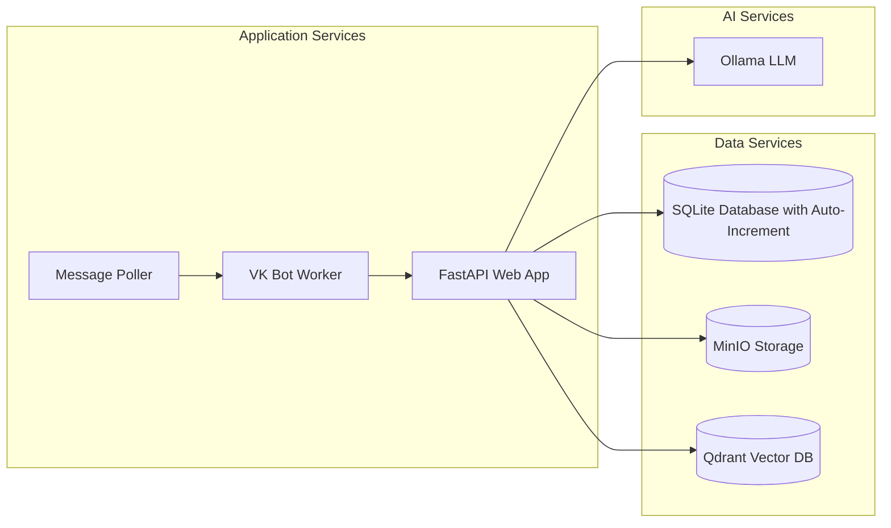

### Environment Setup

Required environment variables:
- `ADMIN_API_KEY`: Secret key for administrative access
- `S3_ENDPOINT_URL`: Storage service endpoint
- `S3_ACCESS_KEY`/`S3_SECRET_KEY`: Storage credentials
- `QDRANT_URL`: Vector database connection
- `OLLAMA_BASE_URL`: LLM service endpoint
- `MAX_CONCURRENT_INDEXING`: Semaphore limit for concurrency control

**Updated** The deployment configuration now supports the enhanced concurrency control system with proper semaphore configuration, comprehensive background task management, and robust error handling mechanisms. The system provides configurable concurrency limits through environment variables and includes comprehensive logging for monitoring and debugging purposes.

**Section sources**
- [docker-compose.yml](file://docker-compose.yml)

## Troubleshooting Guide

### Common Issues and Solutions

| Issue | Symptoms | Solution |
|-------|----------|----------|
| **Document Upload Fails** | 400 errors on upload | Check file size limit (10MB), supported formats (.docx, .doc) |
| **Vector Indexing Errors** | Documents show "failed" status | Verify Qdrant connectivity, embedding model availability, check semaphore limits |
| **S3 Storage Issues** | Files not accessible | Confirm bucket existence, credentials, network connectivity |
| **Admin Authentication Problems** | 403 Forbidden errors | Verify `admin_api_key` matches cookie value |
| **Bot Not Responding** | VK messages ignored | Check VK access token, webhook configuration |
| **Search Not Working** | No results for valid queries | Verify database search columns, case-insensitive matching |
| **Status Display Issues** | Wrong status icons or no refresh | Check HTMX configuration, JavaScript console errors |
| **Pagination Problems** | Incorrect page counts or empty results | Verify database auto-increment setup, check pagination parameters |
| **Bulk Operations Fail** | Partial bulk operation success | Check individual document IDs, verify file existence in storage, review concurrency limits |
| **Date Filter Issues** | Incorrect date range results | Verify ISO date format (YYYY-MM-DD), check timezone handling |
| **Format Detection Problems** | Unsupported format errors | Verify file extension and MIME type, check format-specific parsers |
| **Frontend Not Updating** | UI not reflecting changes | Check HTMX configuration, verify partial endpoint responses |
| **Concurrency Issues** | Background tasks failing or delayed | Check `MAX_CONCURRENT_INDEXING` setting, verify semaphore configuration |
| **Memory Leaks** | Increasing memory usage | Monitor background task cleanup, check temporary file handling |
| **Mixed Format Display Issues** | DOC/DOCX format icons not showing | Verify template rendering, check format detection logic |

### Logging and Monitoring

The system provides comprehensive logging at multiple levels:
- **Application logs**: Request/response handling, error tracking
- **Database logs**: Query execution, transaction status
- **Storage logs**: File operations, upload/download progress
- **Vector database logs**: Indexing operations, search queries
- **Bot logs**: Message processing, state transitions
- **Search logs**: Query performance, filtering effectiveness
- **Pagination logs**: Page calculation, query performance
- **Bulk operations logs**: Atomic operation execution, error handling
- **Date filter logs**: Temporal query processing, boundary handling
- **Format detection logs**: Parser routing, format validation
- **Parser logs**: Text extraction, chunk generation, metadata processing
- **Concurrency logs**: Semaphore acquisition/release, task queuing
- **Background task logs**: Resource management, error recovery

**Updated** The troubleshooting guide now includes comprehensive concurrency control issues, semaphore configuration problems, and background task management failures. The logging system provides detailed coverage for all new features including semaphore-based throttling, concurrent bulk operations, and enhanced error recovery mechanisms.

**Section sources**
- [app/main.py:21-96](file://app/main.py#L21-L96)
- [app/api/documents.py:111-130](file://app/api/documents.py#L111-L130)

## Conclusion

The Document Management System provides a robust, scalable solution for HR document processing and management. Its modular architecture, comprehensive API, and integrated RAG capabilities make it suitable for enterprise-scale document management scenarios.

Key strengths include:
- **Comprehensive Document Lifecycle Management**: From upload to searchable state with dual format support
- **Flexible Storage Backend**: Support for multiple storage providers
- **Advanced RAG Pipeline**: Semantic search and question-answering capabilities with enhanced format handling
- **Multi-channel Integration**: Web interface and VK social network bot
- **Production-ready Architecture**: Proper separation of concerns and testing strategy
- **Scalable Pagination System**: Efficient handling of large document collections
- **Enhanced User Experience**: Dynamic pagination with HTMX integration
- **Powerful Search Capabilities**: Real-time filtering with case-insensitive pattern matching
- **Visual Status Management**: Comprehensive status indicators with real-time updates
- **Granular Control**: Search enable/disable functionality for individual documents
- **Comprehensive Bulk Operations**: Atomic operations for efficient document management with concurrency control
- **Advanced Date Filtering**: Precise temporal querying with inclusive boundaries
- **Modernized Interface**: Interactive toolbar and enhanced user experience
- **Dual Format Support**: Comprehensive handling of both DOCX and legacy DOC documents
- **Enhanced Parser Architecture**: Robust processing pipeline for diverse document formats
- **Robust Concurrency Control**: Semaphore-based throttling for background operations
- **Enhanced Error Handling**: Atomic consistency guarantees and comprehensive error recovery
- **Comprehensive Logging**: Detailed monitoring and debugging capabilities

The system is designed for extensibility, allowing easy addition of new document formats, storage backends, and AI providers while maintaining backward compatibility and operational reliability.

**Updated** The recent implementation of comprehensive dual-format support for both DOCX and DOC documents, enhanced concurrency control with semaphore-based throttling, improved error handling with atomic consistency guarantees, concurrent bulk operations with asyncio.gather, and enhanced logging for document indexing operations significantly strengthens the system's reliability and performance. The robust concurrency control system with configurable limits prevents resource exhaustion during peak loads, while the enhanced error handling ensures data consistency even in failure scenarios. The modernized interface with format-specific icons and filtering capabilities, combined with comprehensive logging and monitoring, provides excellent operational visibility and maintainability for production deployments.