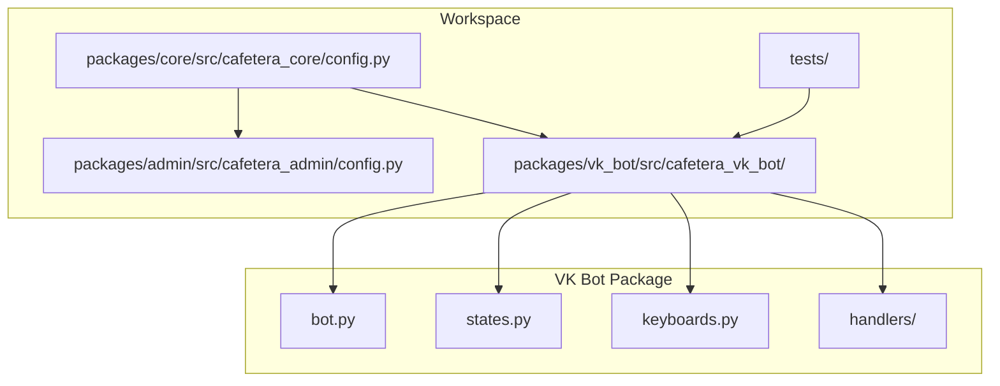
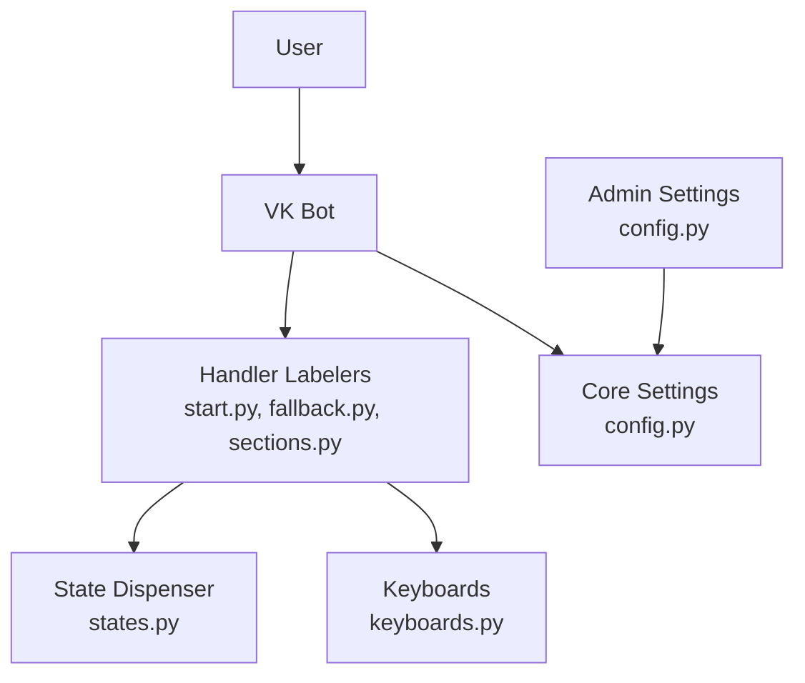
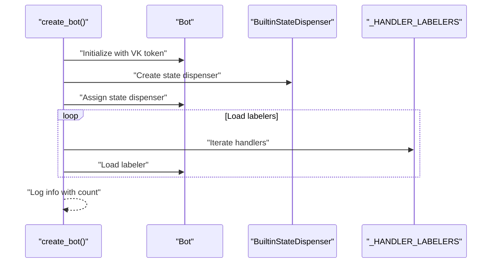
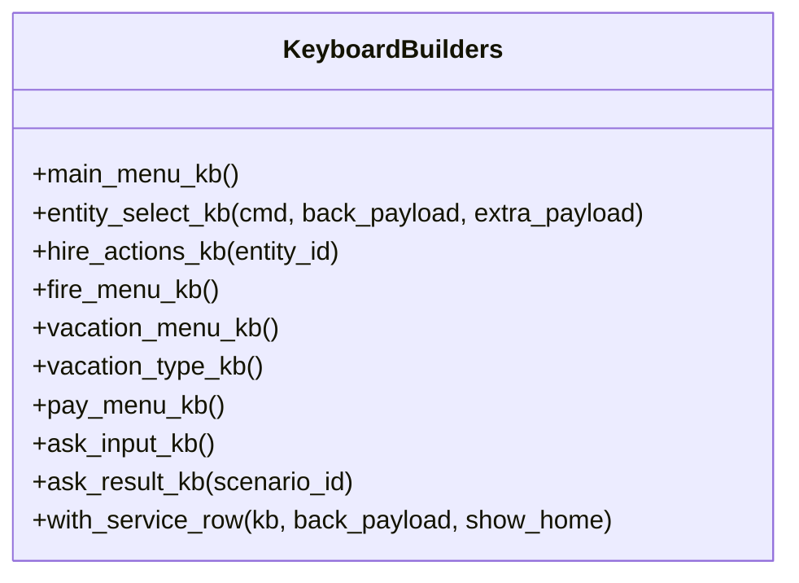
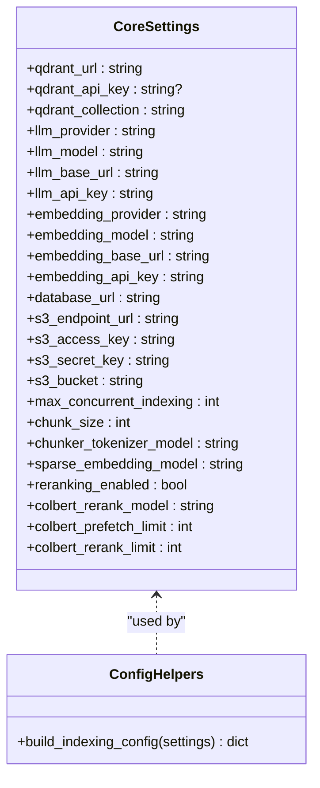
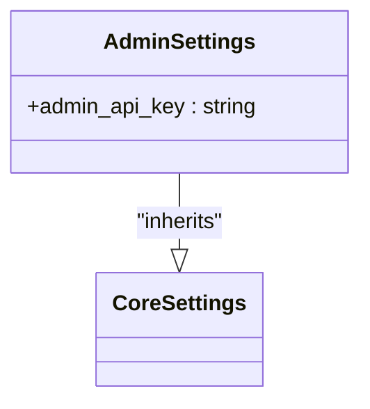
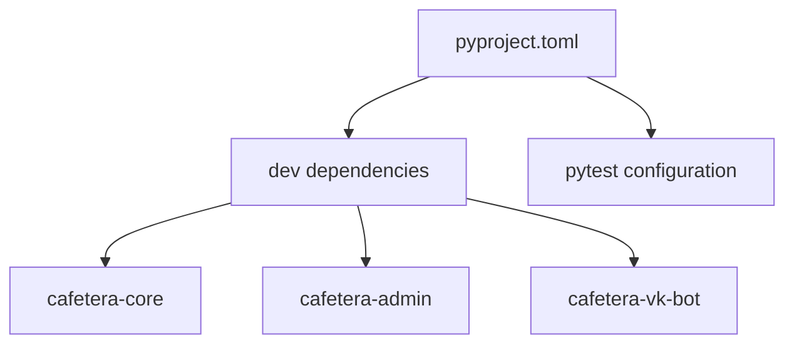

# Document Management System

<cite>
**Referenced Files in This Document**
- [pyproject.toml](file://pyproject.toml)
- [config.py](file://packages/core/src/cafetera_core/config.py)
- [bot.py](file://packages/vk_bot/src/cafetera_vk_bot/bot.py)
- [states.py](file://packages/vk_bot/src/cafetera_vk_bot/states.py)
- [keyboards.py](file://packages/vk_bot/src/cafetera_vk_bot/keyboards.py)
- [start.py](file://packages/vk_bot/src/cafetera_vk_bot/handlers/start.py)
- [fallback.py](file://packages/vk_bot/src/cafetera_vk_bot/handlers/fallback.py)
- [sections.py](file://packages/vk_bot/src/cafetera_vk_bot/handlers/sections.py)
- [config.py](file://packages/admin/src/cafetera_admin/config.py)
- [main.py](file://packages/admin/src/cafetera_admin/main.py)
- [staleness.py](file://packages/admin/src/cafetera_admin/domain/staleness.py)
- [indexer.py](file://packages/admin/src/cafetera_admin/indexer.py)
- [document_service.py](file://packages/admin/src/cafetera_admin/domain/document_service.py)
</cite>

## Update Summary
**Changes Made**
- Updated Configuration Model and Indexing section to remove references to automatic staleness detection
- Removed documentation about startup staleness detection during application lifecycle
- Updated troubleshooting guide to reflect manual document management processes
- Revised performance considerations to remove automatic cleanup procedures
- Updated conclusion to reflect current manual document management approach

## Table of Contents
1. [Introduction](#introduction)
2. [Project Structure](#project-structure)
3. [Core Components](#core-components)
4. [Architecture Overview](#architecture-overview)
5. [Detailed Component Analysis](#detailed-component-analysis)
6. [Dependency Analysis](#dependency-analysis)
7. [Performance Considerations](#performance-considerations)
8. [Troubleshooting Guide](#troubleshooting-guide)
9. [Conclusion](#conclusion)

## Introduction
This document describes the Document Management System built around a VKontakte (VK) bot integrated with a Retrieval-Augmented Generation (RAG) backend. The system manages HR-related documents and provides conversational access to policies, procedures, and templates through an intuitive chat interface. It leverages configurable settings for LLM providers, vector storage, and document chunking, while offering modular handlers for different HR workflows such as hiring, termination, vacation, payroll, and general questions.

**Updated** Removed automatic staleness detection and management system. The system now operates with manual document management processes where administrators manually handle document updates and reindexing when configuration changes occur.

## Project Structure
The project follows a monorepo workspace managed by uv, with three main packages:
- core: Shared RAG and infrastructure settings
- vk_bot: VK bot implementation with handlers and UI keyboards
- admin: Admin web UI settings extending core configuration

**Diagram sources**
- [pyproject.toml:22-28](file://pyproject.toml#L22-L28)
- [config.py:15-68](file://packages/core/src/cafetera_core/config.py#L15-L68)
- [bot.py:42-56](file://packages/vk_bot/src/cafetera_vk_bot/bot.py#L42-L56)
- [keyboards.py:1-263](file://packages/vk_bot/src/cafetera_vk_bot/keyboards.py#L1-L263)

**Section sources**
- [pyproject.toml:1-49](file://pyproject.toml#L1-L49)

## Core Components
- Core Settings: Centralized configuration for RAG, LLM, embeddings, storage, chunking, hybrid search, and reranking. Includes helpers to serialize indexing configuration.
- VK Bot Factory: Creates a configured VK bot instance, registers handlers in priority order, and wires a shared state dispenser.
- VK Handlers: Modular handlers for start/home navigation, fallback responses, and section entry points (including RAG-powered flows).
- VK Keyboards: Builder functions for main menu, entity selection, and contextual sub-menus with standardized service buttons.
- VK States: Multi-step dialog states, currently focused on free-text questions.

**Section sources**
- [config.py:15-93](file://packages/core/src/cafetera_core/config.py#L15-L93)
- [bot.py:42-56](file://packages/vk_bot/src/cafetera_vk_bot/bot.py#L42-L56)
- [keyboards.py:78-263](file://packages/vk_bot/src/cafetera_vk_bot/keyboards.py#L78-L263)
- [states.py:4-9](file://packages/vk_bot/src/cafetera_vk_bot/states.py#L4-L9)
- [start.py:31-42](file://packages/vk_bot/src/cafetera_vk_bot/handlers/start.py#L31-L42)
- [fallback.py:15-18](file://packages/vk_bot/src/cafetera_vk_bot/handlers/fallback.py#L15-L18)
- [sections.py:24-39](file://packages/vk_bot/src/cafetera_vk_bot/handlers/sections.py#L24-L39)

## Architecture Overview
The system integrates VK bot routing with RAG-powered responses. Handlers trigger RAG queries and present templated answers with navigation back to relevant sections. Configuration is shared across packages to maintain consistent behavior for indexing and retrieval.

**Diagram sources**
- [bot.py:30-56](file://packages/vk_bot/src/cafetera_vk_bot/bot.py#L30-L56)
- [start.py:12-42](file://packages/vk_bot/src/cafetera_vk_bot/handlers/start.py#L12-L42)
- [fallback.py:7-18](file://packages/vk_bot/src/cafetera_vk_bot/handlers/fallback.py#L7-L18)
- [sections.py:18-39](file://packages/vk_bot/src/cafetera_vk_bot/handlers/sections.py#L18-L39)
- [states.py:4-9](file://packages/vk_bot/src/cafetera_vk_bot/states.py#L4-L9)
- [keyboards.py:1-263](file://packages/vk_bot/src/cafetera_vk_bot/keyboards.py#L1-L263)
- [config.py:15-93](file://packages/core/src/cafetera_core/config.py#L15-L93)
- [config.py:6-20](file://packages/admin/src/cafetera_admin/config.py#L6-L20)

## Detailed Component Analysis

### VK Bot Factory
The bot factory constructs a VK bot with a shared state dispenser and loads labelers in a specific order to ensure proper routing. It logs successful initialization with the number of loaded labelers.

**Diagram sources**
- [bot.py:42-56](file://packages/vk_bot/src/cafetera_vk_bot/bot.py#L42-L56)

**Section sources**
- [bot.py:42-56](file://packages/vk_bot/src/cafetera_vk_bot/bot.py#L42-L56)

### Handler Routing and Priority
Handlers are registered in a specific order to ensure deterministic matching:
1. Start handler responds to initial commands and home navigation
2. Free-text ask handler (state-based) precedes fallback
3. Dedicated action handlers (hire, fire, vacation, pay)
4. Sections handler for RAG-powered stubs
5. Fallback handler as a catch-all

**Diagram sources**
- [bot.py:24-39](file://packages/vk_bot/src/cafetera_vk_bot/bot.py#L24-L39)
- [start.py:31-42](file://packages/vk_bot/src/cafetera_vk_bot/handlers/start.py#L31-L42)
- [fallback.py:15-18](file://packages/vk_bot/src/cafetera_vk_bot/handlers/fallback.py#L15-L18)
- [sections.py:24-39](file://packages/vk_bot/src/cafetera_vk_bot/handlers/sections.py#L24-L39)

**Section sources**
- [bot.py:24-39](file://packages/vk_bot/src/cafetera_vk_bot/bot.py#L24-L39)

### Keyboard Builders and Navigation
The keyboard module provides builders for:
- Main menu with seven HR sections
- Entity selection across legal entities
- Hire, fire, vacation, and pay sub-menus
- Service row with Back/Home buttons
- Ask question input and result suggestion keyboards

**Diagram sources**
- [keyboards.py:78-263](file://packages/vk_bot/src/cafetera_vk_bot/keyboards.py#L78-L263)

**Section sources**
- [keyboards.py:1-263](file://packages/vk_bot/src/cafetera_vk_bot/keyboards.py#L1-L263)

### Configuration Model and Indexing
Core settings encapsulate RAG, LLM, embeddings, storage, chunking, hybrid search, and reranking parameters. A helper extracts indexing configuration for document metadata. **Updated** Automatic staleness detection during startup has been removed in favor of manual document management processes.

**Diagram sources**
- [config.py:15-93](file://packages/core/src/cafetera_core/config.py#L15-L93)

**Section sources**
- [config.py:15-93](file://packages/core/src/cafetera_core/config.py#L15-L93)

### Admin Settings Extension
Admin settings extend core settings and add admin-specific fields while ignoring extra environment variables to coexist with other packages using the same environment file.

**Diagram sources**
- [config.py:6-20](file://packages/admin/src/cafetera_admin/config.py#L6-L20)
- [config.py:15-93](file://packages/core/src/cafetera_core/config.py#L15-L93)

**Section sources**
- [config.py:6-20](file://packages/admin/src/cafetera_admin/config.py#L6-L20)

## Dependency Analysis
The workspace uses uv with a dev dependency group that includes the core, admin, and VK bot packages. Tests are configured to run against the workspace members and use pytest markers for Docker-dependent tests.

**Diagram sources**
- [pyproject.toml:9-34](file://pyproject.toml#L9-L34)

**Section sources**
- [pyproject.toml:9-34](file://pyproject.toml#L9-L34)

## Performance Considerations
- Concurrency: The maximum concurrent indexing is configurable to balance throughput and resource usage.
- Chunking: Token-based chunk sizing ensures optimal embedding quality and retrieval performance.
- Hybrid Search: Sparse BM25 embeddings can improve recall for keyword-heavy HR documents.
- Reranking: Optional ColBERT reranking enhances precision but adds latency; tune prefetch and rerank limits accordingly.
- Storage: S3-compatible storage and PostgreSQL-backed metadata enable scalable document management.
- **Updated** Manual document management: Administrators manually handle document updates and reindexing when configuration changes occur, providing more control over document lifecycle management.

## Troubleshooting Guide
- Logging: Configure global logging for consistent log formatting across the system.
- Environment Variables: Ensure .env contains required keys for VK token, LLM provider, Qdrant, and storage credentials.
- Handler Order: Verify handler registration order remains unchanged to prevent unexpected routing.
- State Dispenser: Confirm the shared state dispenser is assigned before loading labelers.
- Keyboard Payloads: Validate payload constants and service rows to avoid navigation errors.
- Admin Coexistence: Use separate admin API key configuration to avoid conflicts with VK bot settings.
- **Updated** Manual document management: When configuration changes occur, administrators must manually reindex documents through the admin interface. The system no longer automatically detects and marks stale documents during startup.
- **Updated** Document status monitoring: Use the admin interface to monitor document statuses and manually trigger reindexing for documents that need updates after configuration changes.

**Section sources**
- [config.py:7-12](file://packages/core/src/cafetera_core/config.py#L7-L12)
- [bot.py:47-49](file://packages/vk_bot/src/cafetera_vk_bot/bot.py#L47-L49)
- [keyboards.py:15-53](file://packages/vk_bot/src/cafetera_vk_bot/keyboards.py#L15-L53)
- [config.py:17-19](file://packages/admin/src/cafetera_admin/config.py#L17-L19)

## Conclusion
The Document Management System provides a robust, extensible foundation for HR document access via a VK bot. Its modular design, centralized configuration, and structured handler routing enable efficient development and maintenance. **Updated** The system now operates with manual document management processes, where administrators manually handle document updates and reindexing when configuration changes occur. By tuning RAG parameters and leveraging hybrid search capabilities, the system delivers accurate and relevant information to users while maintaining operational simplicity and giving administrators full control over document lifecycle management.