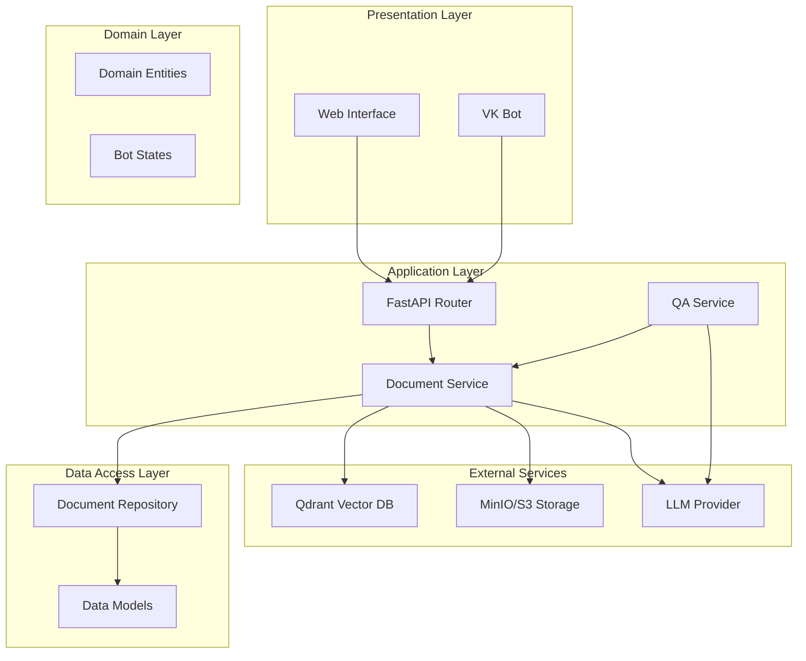
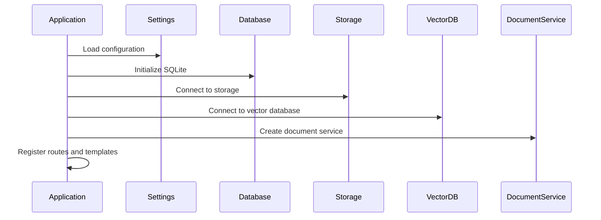
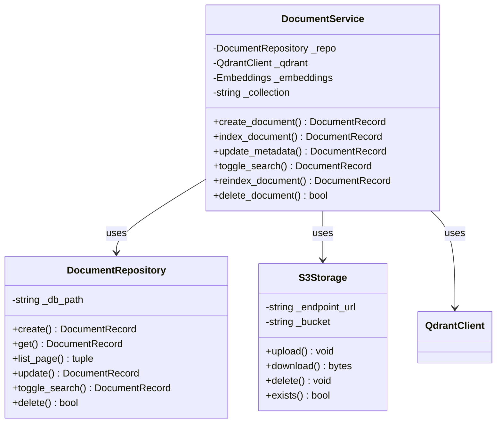
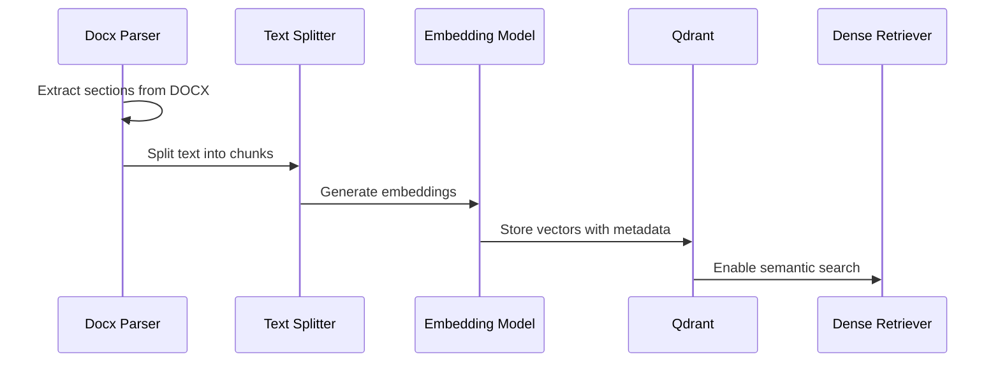
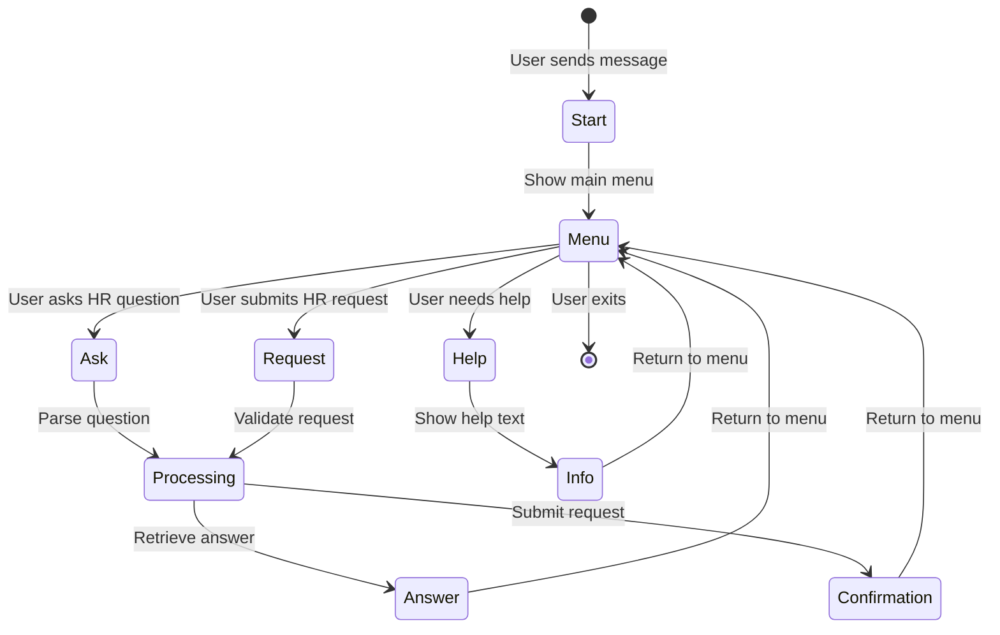
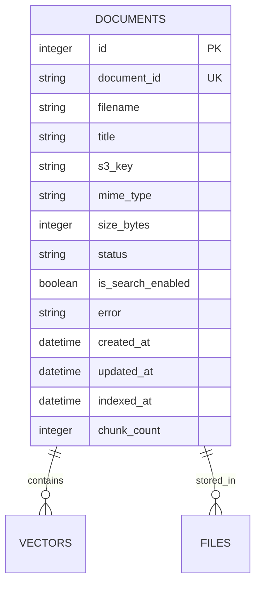
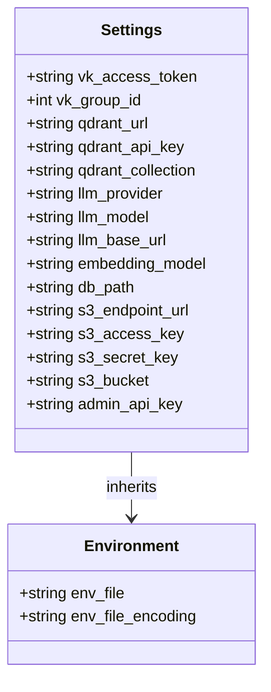
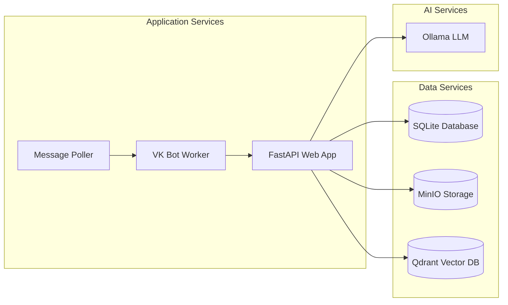

# Document Management System

<cite>
**Referenced Files in This Document**
- [app/main.py](file://app/main.py)
- [app/config.py](file://app/config.py)
- [app/api/documents.py](file://app/api/documents.py)
- [app/api/deps.py](file://app/api/deps.py)
- [app/domain/document_service.py](file://app/domain/document_service.py)
- [app/domain/entities.py](file://app/domain/entities.py)
- [app/storage/document_repo.py](file://app/storage/document_repo.py)
- [app/storage/models.py](file://app/storage/models.py)
- [app/storage/s3.py](file://app/storage/s3.py)
- [app/rag/indexer.py](file://app/rag/indexer.py)
- [app/rag/parser.py](file://app/rag/parser.py)
- [app/rag/retriever.py](file://app/rag/retriever.py)
- [app/rag/chain.py](file://app/rag/chain.py)
- [app/integrations/vk/bot.py](file://app/integrations/vk/bot.py)
- [app/integrations/vk/handlers/start.py](file://app/integrations/vk/handlers/start.py)
- [app/integrations/vk/handlers/ask.py](file://app/integrations/vk/handlers/ask.py)
- [app/integrations/vk/handlers/hr_request.py](file://app/integrations/vk/handlers/hr_request.py)
- [app/integrations/vk/handlers/fire.py](file://app/integrations/vk/handlers/fire.py)
- [app/integrations/vk/handlers/hire.py](file://app/integrations/vk/handators/hire.py](file://app/integrations/vk/handlers/hire.py)
- [app/integrations/vk/handlers/pay.py](file://app/integrations/vk/handlers/pay.py)
- [app/integrations/vk/handlers/vacation.py](file://app/integrations/vk/handlers/vacation.py)
- [app/integrations/vk/states.py](file://app/integrations/vk/states.py)
- [app/integrations/vk/rules.py](file://app/integrations/vk/rules.py)
- [app/integrations/vk/keyboards.py](file://app/integrations/vk/keyboards.py)
- [templates/documents.html](file://templates/documents.html)
- [scripts/ingest.py](file://scripts/ingest.py)
- [pyproject.toml](file://pyproject.toml)
</cite>

## Table of Contents
1. [Introduction](#introduction)
2. [System Architecture](#system-architecture)
3. [Core Components](#core-components)
4. [Document Management Workflow](#document-management-workflow)
5. [RAG Pipeline](#rag-pipeline)
6. [VK Bot Integration](#vk-bot-integration)
7. [Storage Layer](#storage-layer)
8. [API Endpoints](#api-endpoints)
9. [Configuration Management](#configuration-management)
10. [Testing Strategy](#testing-strategy)
11. [Deployment and Operations](#deployment-and-operations)
12. [Troubleshooting Guide](#troubleshooting-guide)
13. [Conclusion](#conclusion)

## Introduction

The Document Management System is a comprehensive RAG (Retrieval-Augmented Generation) platform designed for HR document processing and management. Built with FastAPI, the system provides a web-based administrative interface for uploading, managing, and organizing HR-related documents while maintaining a robust backend for AI-powered document retrieval and processing.

The system supports multiple document formats (primarily DOCX), integrates with vector databases for semantic search, and provides both web-based administration and VK social network bot integration for HR assistance. It features a modular architecture with clear separation between presentation, business logic, data persistence, and external integrations.

## System Architecture

The Document Management System follows a layered architecture pattern with clear separation of concerns:

**Diagram sources**
- [app/main.py:99-124](file://app/main.py#L99-L124)
- [app/api/documents.py:1-571](file://app/api/documents.py#L1-L571)
- [app/domain/document_service.py:35-281](file://app/domain/document_service.py#L35-L281)

The architecture consists of five main layers:

1. **Presentation Layer**: Web interface built with FastAPI and Jinja2 templates, plus VK social network bot integration
2. **Application Layer**: Business logic encapsulated in domain services and API routers
3. **Domain Layer**: Core business entities and state management for bot interactions
4. **Data Access Layer**: Async repository pattern for SQLite database operations
5. **Integration Layer**: External services for storage, vector databases, and AI providers

## Core Components

### Application Bootstrap and Configuration

The system initializes through a centralized FastAPI application factory that manages lifecycle resources and dependency injection:

**Diagram sources**
- [app/main.py:24-82](file://app/main.py#L24-L82)
- [app/config.py:4-33](file://app/config.py#L4-L33)

### Document Service Architecture

The DocumentService acts as the central coordinator for all document operations:

**Diagram sources**
- [app/domain/document_service.py:35-281](file://app/domain/document_service.py#L35-L281)
- [app/storage/document_repo.py:63-214](file://app/storage/document_repo.py#L63-L214)
- [app/storage/s3.py:14-109](file://app/storage/s3.py#L14-L109)

**Section sources**
- [app/main.py:1-124](file://app/main.py#L1-L124)
- [app/domain/document_service.py:1-281](file://app/domain/document_service.py#L1-L281)

## Document Management Workflow

The document management process follows a structured workflow from upload to searchable state:

**Diagram sources**
- [app/api/documents.py:294-381](file://app/api/documents.py#L294-L381)
- [app/domain/document_service.py:84-133](file://app/domain/document_service.py#L84-L133)

### Upload Validation and Processing

The system implements comprehensive validation for uploaded documents:

| Validation Step | Criteria | Action |
|----------------|----------|---------|
| File Extension | Only `.docx` allowed | Reject with error |
| File Size | Maximum 10MB | Reject if exceeded |
| Content Type | DOCX MIME type | Validate against allowed types |
| Duplicate Prevention | Unique S3 keys | Append counter suffix |

**Section sources**
- [app/api/documents.py:307-366](file://app/api/documents.py#L307-L366)
- [app/api/documents.py:111-130](file://app/api/documents.py#L111-L130)

## RAG Pipeline

The Retrieval-Augmented Generation pipeline processes documents through multiple stages:

**Diagram sources**
- [app/rag/parser.py:54-83](file://app/rag/parser.py#L54-L83)
- [app/rag/indexer.py:49-72](file://app/rag/indexer.py#L49-L72)
- [app/rag/retriever.py:78-103](file://app/rag/retriever.py#L78-L103)

### Document Chunking Strategy

The system employs intelligent chunking for optimal retrieval performance:

- **Chunk Size**: 1000 characters with 200-character overlap
- **Splitting Strategy**: Hierarchical splitting by paragraphs, sentences, and words
- **Section Preservation**: Maintains semantic boundaries using heading-based sections
- **Metadata Enrichment**: Each chunk carries document ID, chunk ID, filename, and search enablement status

**Section sources**
- [app/rag/parser.py:15-17](file://app/rag/parser.py#L15-L17)
- [app/rag/parser.py:54-83](file://app/rag/parser.py#L54-L83)
- [app/rag/indexer.py:23-46](file://app/rag/indexer.py#L23-L46)

## VK Bot Integration

The system includes a comprehensive VK social network bot for HR assistance:

**Diagram sources**
- [app/integrations/vk/states.py](file://app/integrations/vk/states.py)
- [app/integrations/vk/bot.py](file://app/integrations/vk/bot.py)

### Bot Handler Architecture

The VK bot uses a handler-based architecture for different interaction modes:

| Handler | Purpose | Features |
|---------|---------|----------|
| `start.py` | Welcome and initial greeting | Bot introduction, basic commands |
| `ask.py` | HR question answering | RAG-powered Q&A, context awareness |
| `hr_request.py` | Formal HR requests | Structured request forms, approval flow |
| `hire.py` | Hiring process | Candidate screening, interview scheduling |
| `fire.py` | Termination process | Exit procedures, final settlement |
| `pay.py` | Payroll inquiries | Salary calculations, payment history |
| `vacation.py` | Leave management | Vacation requests, balance tracking |

**Section sources**
- [app/integrations/vk/handlers/start.py](file://app/integrations/vk/handlers/start.py)
- [app/integrations/vk/handlers/ask.py](file://app/integrations/vk/handlers/ask.py)
- [app/integrations/vk/handlers/hr_request.py](file://app/integrations/vk/handlers/hr_request.py)

## Storage Layer

The storage architecture provides a robust foundation for document management:

**Diagram sources**
- [app/storage/models.py:20-37](file://app/storage/models.py#L20-L37)
- [app/storage/document_repo.py:14-49](file://app/storage/document_repo.py#L14-L49)

### Database Schema Design

The SQLite schema supports comprehensive document tracking with:

- **Primary Keys**: Auto-incremented integer ID and UUID-based document ID
- **Status Tracking**: Four-state processing pipeline (pending → processing → completed/failed)
- **Search Optimization**: Dedicated search enablement flag for vector filtering
- **Audit Trail**: Creation and modification timestamps for all records
- **Performance Metrics**: Chunk count and indexing timestamps for monitoring

**Section sources**
- [app/storage/models.py:11-37](file://app/storage/models.py#L11-L37)
- [app/storage/document_repo.py:63-214](file://app/storage/document_repo.py#L63-L214)

## API Endpoints

The system provides a comprehensive REST API for document management:

### Authentication and Authorization

| Endpoint | Method | Description | Authentication |
|----------|--------|-------------|----------------|
| `/login` | GET/POST | Admin login form and authentication | None |
| `/logout` | GET | Clear admin session | Admin cookie |
| `/` | GET | Redirect based on authentication | Admin cookie |

### Document Management API

| Endpoint | Method | Description | Authentication |
|----------|--------|-------------|----------------|
| `/api/documents/upload` | POST | Upload multiple DOCX files | Admin cookie |
| `/api/documents` | GET | List all documents with pagination | Admin cookie |
| `/api/documents/{id}` | GET/PATCH/DELETE | Document operations | Admin cookie |
| `/api/documents/{id}/title` | PATCH | Update document title | Admin cookie |
| `/api/documents/{id}/search` | PATCH | Toggle search participation | Admin cookie |
| `/api/documents/{id}/reindex` | POST | Re-index document content | Admin cookie |
| `/api/documents/{id}/download` | GET | Download original file | Admin cookie |

### HTMX Partial Endpoints

| Endpoint | Method | Description |
|----------|--------|-------------|
| `/partials/document-table` | GET | Dynamic table content |
| `/partials/document-row/{id}` | GET | Individual row updates |
| `/partials/document-status/{id}` | GET | Status badge refresh |

**Section sources**
- [app/api/documents.py:1-571](file://app/api/documents.py#L1-L571)
- [app/api/deps.py:54-74](file://app/api/deps.py#L54-L74)

## Configuration Management

The system uses Pydantic Settings for centralized configuration:

**Diagram sources**
- [app/config.py:4-33](file://app/config.py#L4-L33)

### Configuration Categories

| Category | Key | Default Value | Purpose |
|----------|-----|---------------|---------|
| **VK Integration** | `vk_access_token` | Empty string | Bot authentication |
| **Vector Database** | `qdrant_url` | `http://localhost:6333` | Qdrant connection |
| **LLM Provider** | `llm_provider` | `ollama` | AI model provider |
| **Storage** | `db_path` | `data/cafetera.db` | SQLite database location |
| **Admin Security** | `admin_api_key` | Empty string | Administrative access |

**Section sources**
- [app/config.py:1-33](file://app/config.py#L1-L33)

## Testing Strategy

The system includes comprehensive testing across all layers:

### Test Coverage Areas

| Test Module | Focus Area | Testing Approach |
|-------------|------------|------------------|
| `test_api_documents.py` | API endpoint functionality | Unit and integration tests |
| `test_document_service.py` | Domain service logic | Mock-based testing |
| `test_storage.py` | Database operations | SQLite in-memory testing |
| `test_rag_block6.py` | RAG pipeline components | End-to-end testing |
| `test_bot_factory.py` | VK bot integration | State machine validation |
| `test_qa_service.py` | Question-answering logic | Scenario-based testing |

### Testing Dependencies

The test suite leverages:
- **pytest-asyncio**: Asynchronous test execution
- **Mock objects**: External service mocking
- **Test fixtures**: Shared test infrastructure
- **Coverage reporting**: Test coverage analysis

**Section sources**
- [pyproject.toml:45-47](file://pyproject.toml#L45-L47)

## Deployment and Operations

### Docker Compose Configuration

The system supports containerized deployment with the following services:

### Environment Setup

Required environment variables:
- `ADMIN_API_KEY`: Secret key for administrative access
- `S3_ENDPOINT_URL`: Storage service endpoint
- `S3_ACCESS_KEY`/`S3_SECRET_KEY`: Storage credentials
- `QDRANT_URL`: Vector database connection
- `OLLAMA_BASE_URL`: LLM service endpoint

**Section sources**
- [docker-compose.yml](file://docker-compose.yml)

## Troubleshooting Guide

### Common Issues and Solutions

| Issue | Symptoms | Solution |
|-------|----------|----------|
| **Document Upload Fails** | 400 errors on upload | Check file size limit (10MB), supported formats (.docx) |
| **Vector Indexing Errors** | Documents show "failed" status | Verify Qdrant connectivity, embedding model availability |
| **S3 Storage Issues** | Files not accessible | Confirm bucket existence, credentials, network connectivity |
| **Admin Authentication Problems** | 403 Forbidden errors | Verify `admin_api_key` matches cookie value |
| **Bot Not Responding** | VK messages ignored | Check VK access token, webhook configuration |

### Logging and Monitoring

The system provides comprehensive logging at multiple levels:
- **Application logs**: Request/response handling, error tracking
- **Database logs**: Query execution, transaction status
- **Storage logs**: File operations, upload/download progress
- **Vector database logs**: Indexing operations, search queries
- **Bot logs**: Message processing, state transitions

**Section sources**
- [app/main.py:21-96](file://app/main.py#L21-L96)
- [app/api/documents.py:111-130](file://app/api/documents.py#L111-L130)

## Conclusion

The Document Management System provides a robust, scalable solution for HR document processing and management. Its modular architecture, comprehensive API, and integrated RAG capabilities make it suitable for enterprise-scale document management scenarios.

Key strengths include:
- **Comprehensive Document Lifecycle Management**: From upload to searchable state
- **Flexible Storage Backend**: Support for multiple storage providers
- **Advanced RAG Pipeline**: Semantic search and question-answering capabilities
- **Multi-channel Integration**: Web interface and VK social network bot
- **Production-ready Architecture**: Proper separation of concerns and testing strategy

The system is designed for extensibility, allowing easy addition of new document formats, storage backends, and AI providers while maintaining backward compatibility and operational reliability.