# Document Management System

<cite>
**Referenced Files in This Document**
- [pyproject.toml](file://pyproject.toml)
- [config.py](file://packages/core/src/cafetera_core/config.py)
- [bot.py](file://packages/vk_bot/src/cafetera_vk_bot/bot.py)
- [states.py](file://packages/vk_bot/src/cafetera_vk_bot/states.py)
- [keyboards.py](file://packages/vk_bot/src/cafetera_vk_bot/keyboards.py)
- [start.py](file://packages/vk_bot/src/cafetera_vk_bot/handlers/start.py)
- [fallback.py](file://packages/vk_bot/src/cafetera_vk_bot/handlers/fallback.py)
- [sections.py](file://packages/vk_bot/src/cafetera_vk_bot/handlers/sections.py)
- [config.py](file://packages/admin/src/cafetera_admin/config.py)
- [main.py](file://packages/admin/src/cafetera_admin/main.py)
- [staleness.py](file://packages/admin/src/cafetera_admin/domain/staleness.py)
- [indexer.py](file://packages/admin/src/cafetera_admin/indexer.py)
- [document_service.py](file://packages/admin/src/cafetera_admin/domain/document_service.py)
- [qa_service.py](file://packages/core/src/cafetera_core/domain/qa_service.py)
- [documents_qa.py](file://packages/admin/src/cafetera_admin/api/documents_qa.py)
- [test_indexer.py](file://tests/test_indexer.py)
- [run_all.sh](file://scripts/run_all.sh)
- [run_admin_docker.sh](file://scripts/run_admin_docker.sh)
- [docker-compose.yml](file://docker-compose.yml)
- [Dockerfile.admin](file://Dockerfile.admin)
- [Dockerfile.polling_vk](file://Dockerfile.polling_vk)
- [documents.html](file://templates/documents.html)
- [components.js](file://static/js/components.js)
- [upload.js](file://static/js/upload.js)
- [style.css](file://static/css/style.css)
</cite>

## Update Summary
**Changes Made**
- Enhanced modal window system with improved layout, automatic scrolling functionality, and better user experience for document questions and global questions
- Implemented streaming response support for real-time question answering with automatic content scrolling
- Added fixed header and footer layout patterns for modal dialogs with scrollable content areas
- Improved user experience with automatic scrolling to latest content during streaming responses
- Enhanced modal accessibility with proper backdrop handling and keyboard navigation support

## Table of Contents
1. [Introduction](#introduction)
2. [Project Structure](#project-structure)
3. [Core Components](#core-components)
4. [Architecture Overview](#architecture-overview)
5. [Detailed Component Analysis](#detailed-component-analysis)
6. [Enhanced Modal Window System](#enhanced-modal-window-system)
7. [Streaming Question Answering](#streaming-question-answering)
8. [Docker Deployment Improvements](#docker-deployment-improvements)
9. [Testing Coverage](#testing-coverage)
10. [Performance Considerations](#performance-considerations)
11. [Troubleshooting Guide](#troubleshooting-guide)
12. [Conclusion](#conclusion)

## Introduction
This document describes the Document Management System built around a VKontakte (VK) bot integrated with a Retrieval-Augmented Generation (RAG) backend. The system manages HR-related documents and provides conversational access to policies, procedures, and templates through an intuitive chat interface. It leverages configurable settings for LLM providers, vector storage, and document chunking, while offering modular handlers for different HR workflows such as hiring, termination, vacation, payroll, and general questions.

**Updated** The system now features an enhanced modal window system with improved layout, automatic scrolling functionality, and better user experience for document questions and global questions. The modal system now supports streaming responses with automatic content scrolling, providing a more responsive and engaging user experience.

## Project Structure
The project follows a monorepo workspace managed by uv, with three main packages:
- core: Shared RAG and infrastructure settings
- vk_bot: VK bot implementation with handlers and UI keyboards
- admin: Admin web UI settings extending core configuration

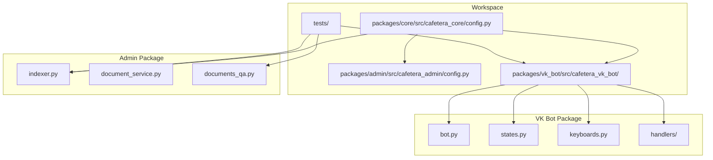

**Diagram sources**
- [pyproject.toml:22-28](file://pyproject.toml#L22-L28)
- [config.py:15-68](file://packages/core/src/cafetera_core/config.py#L15-L68)
- [bot.py:42-56](file://packages/vk_bot/src/cafetera_vk_bot/bot.py#L42-L56)
- [keyboards.py:1-263](file://packages/vk_bot/src/cafetera_vk_bot/keyboards.py#L1-L263)
- [indexer.py:1-325](file://packages/admin/src/cafetera_admin/indexer.py#L1-325)
- [document_service.py:1-402](file://packages/admin/src/cafetera_admin/domain/document_service.py#L1-402)
- [qa_service.py:1-303](file://packages/core/src/cafetera_core/domain/qa_service.py#L1-303)
- [documents_qa.py:1-90](file://packages/admin/src/cafetera_admin/api/documents_qa.py#L1-90)

**Section sources**
- [pyproject.toml:1-49](file://pyproject.toml#L1-L49)

## Core Components
- Core Settings: Centralized configuration for RAG, LLM, embeddings, storage, chunking, hybrid search, and reranking. Includes helpers to serialize indexing configuration.
- VK Bot Factory: Creates a configured VK bot instance, registers handlers in priority order, and wires a shared state dispenser.
- VK Handlers: Modular handlers for start/home navigation, fallback responses, and section entry points (including RAG-powered flows).
- VK Keyboards: Builder functions for main menu, entity selection, and contextual sub-menus with standardized service buttons.
- VK States: Multi-step dialog states, currently focused on free-text questions.
- **Updated** Enhanced Modal System: Improved layout with fixed headers and footers, scrollable content areas, and automatic scrolling for streaming responses.
- **Updated** Streaming QA Service: Real-time question answering with SSE streaming and automatic content updates.

**Section sources**
- [config.py:15-93](file://packages/core/src/cafetera_core/config.py#L15-L93)
- [bot.py:42-56](file://packages/vk_bot/src/cafetera_vk_bot/bot.py#L42-L56)
- [keyboards.py:78-263](file://packages/vk_bot/src/cafetera_vk_bot/keyboards.py#L78-L263)
- [states.py:4-9](file://packages/vk_bot/src/cafetera_vk_bot/states.py#L4-L9)
- [start.py:31-42](file://packages/vk_bot/src/cafetera_vk_bot/handlers/start.py#L31-L42)
- [fallback.py:15-18](file://packages/vk_bot/src/cafetera_vk_bot/handlers/fallback.py#L15-L18)
- [sections.py:24-39](file://packages/vk_bot/src/cafetera_vk_bot/handlers/sections.py#L24-L39)
- [indexer.py:29-54](file://packages/admin/src/cafetera_admin/indexer.py#L29-L54)

## Architecture Overview
The system integrates VK bot routing with RAG-powered responses. Handlers trigger RAG queries and present templated answers with navigation back to relevant sections. Configuration is shared across packages to maintain consistent behavior for indexing and retrieval. **Updated** The enhanced modal system now supports streaming responses with automatic content scrolling, providing a more responsive user experience.

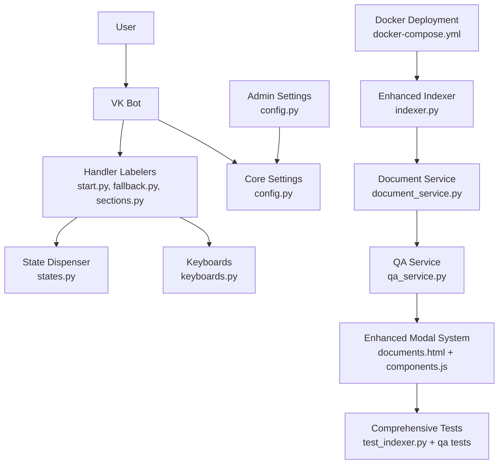

**Diagram sources**
- [bot.py:30-56](file://packages/vk_bot/src/cafetera_vk_bot/bot.py#L30-L56)
- [start.py:12-42](file://packages/vk_bot/src/cafetera_vk_bot/handlers/start.py#L12-L42)
- [fallback.py:7-18](file://packages/vk_bot/src/cafetera_vk_bot/handlers/fallback.py#L7-L18)
- [sections.py:18-39](file://packages/vk_bot/src/cafetera_vk_bot/handlers/sections.py#L18-L39)
- [states.py:4-9](file://packages/vk_bot/src/cafetera_vk_bot/states.py#L4-L9)
- [keyboards.py:1-263](file://packages/vk_bot/src/cafetera_vk_bot/keyboards.py#L1-L263)
- [config.py:15-93](file://packages/core/src/cafetera_core/config.py#L15-L93)
- [config.py:6-20](file://packages/admin/src/cafetera_admin/config.py#L6-L20)
- [indexer.py:93-206](file://packages/admin/src/cafetera_admin/indexer.py#L93-L206)
- [document_service.py:113-182](file://packages/admin/src/cafetera_admin/domain/document_service.py#L113-L182)
- [qa_service.py:217-280](file://packages/core/src/cafetera_core/domain/qa_service.py#L217-L280)
- [documents.html:270-371](file://templates/documents.html#L270-L371)
- [components.js:417-558](file://static/js/components.js#L417-L558)
- [test_indexer.py:1-618](file://tests/test_indexer.py#L1-618)
- [docker-compose.yml:1-120](file://docker-compose.yml#L1-120)

## Detailed Component Analysis

### VK Bot Factory
The bot factory constructs a VK bot with a shared state dispenser and loads labelers in a specific order to ensure proper routing. It logs successful initialization with the number of loaded labelers.

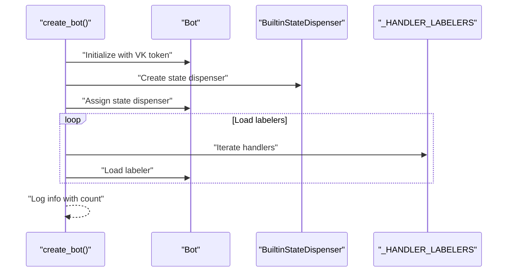

**Diagram sources**
- [bot.py:42-56](file://packages/vk_bot/src/cafetera_vk_bot/bot.py#L42-L56)

**Section sources**
- [bot.py:42-56](file://packages/vk_bot/src/cafetera_vk_bot/bot.py#L42-L56)

### Handler Routing and Priority
Handlers are registered in a specific order to ensure deterministic matching:
1. Start handler responds to initial commands and home navigation
2. Free-text ask handler (state-based) precedes fallback
3. Dedicated action handlers (hire, fire, vacation, pay)
4. Sections handler for RAG-powered stubs
5. Fallback handler as a catch-all

**Diagram sources**
- [bot.py:24-39](file://packages/vk_bot/src/cafetera_vk_bot/bot.py#L24-L39)
- [start.py:31-42](file://packages/vk_bot/src/cafetera_vk_bot/handlers/start.py#L31-L42)
- [fallback.py:15-18](file://packages/vk_bot/src/cafetera_vk_bot/handlers/fallback.py#L15-L18)
- [sections.py:24-39](file://packages/vk_bot/src/cafetera_vk_bot/handlers/sections.py#L24-L39)

**Section sources**
- [bot.py:24-39](file://packages/vk_bot/src/cafetera_vk_bot/bot.py#L24-L39)

### Keyboard Builders and Navigation
The keyboard module provides builders for:
- Main menu with seven HR sections
- Entity selection across legal entities
- Hire, fire, vacation, and pay sub-menus
- Service row with Back/Home buttons
- Ask question input and result suggestion keyboards

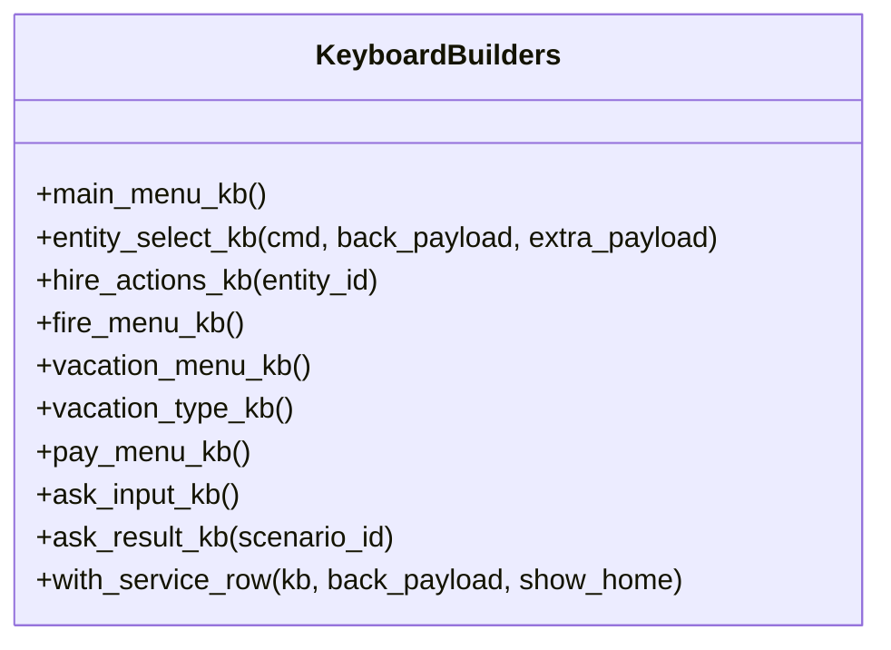

**Diagram sources**
- [keyboards.py:78-263](file://packages/vk_bot/src/cafetera_vk_bot/keyboards.py#L78-L263)

**Section sources**
- [keyboards.py:1-263](file://packages/vk_bot/src/cafetera_vk_bot/keyboards.py#L1-L263)

### Configuration Model and Indexing
Core settings encapsulate RAG, LLM, embeddings, storage, chunking, hybrid search, and reranking parameters. A helper extracts indexing configuration for document metadata. **Updated** Enhanced with new indexing parameters for batch processing and parallel operations.

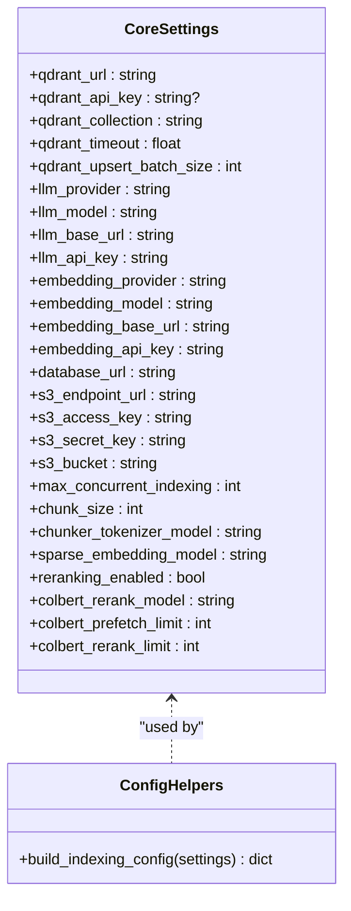

**Diagram sources**
- [config.py:15-93](file://packages/core/src/cafetera_core/config.py#L15-L93)

**Section sources**
- [config.py:15-93](file://packages/core/src/cafetera_core/config.py#L15-L93)

### Admin Settings Extension
Admin settings extend core settings and add admin-specific fields while ignoring extra environment variables to coexist with other packages using the same environment file.

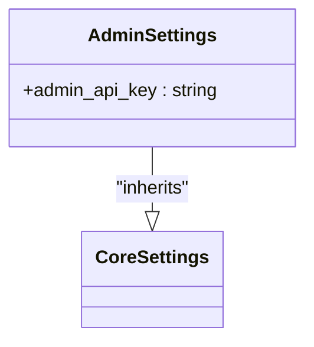

**Diagram sources**
- [config.py:6-20](file://packages/admin/src/cafetera_admin/config.py#L6-L20)
- [config.py:15-93](file://packages/core/src/cafetera_core/config.py#L15-L93)

**Section sources**
- [config.py:6-20](file://packages/admin/src/cafetera_admin/config.py#L6-L20)

## Enhanced Modal Window System

### Improved Layout Architecture
The enhanced modal system now features a sophisticated layout architecture with fixed headers, scrollable content areas, and fixed footers to provide better user experience.

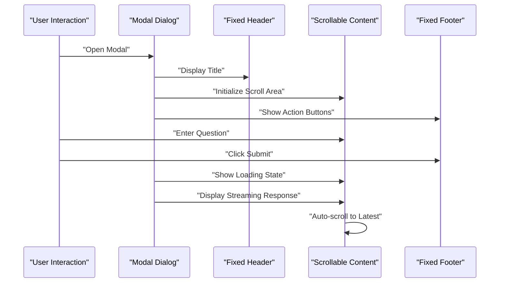

**Diagram sources**
- [documents.html:270-371](file://templates/documents.html#L270-L371)
- [components.js:417-558](file://static/js/components.js#L417-L558)

### Fixed Header and Footer Pattern
The modal system implements a three-section layout pattern:
- Fixed header section for titles and metadata
- Scrollable content area for questions and answers
- Fixed footer with action buttons

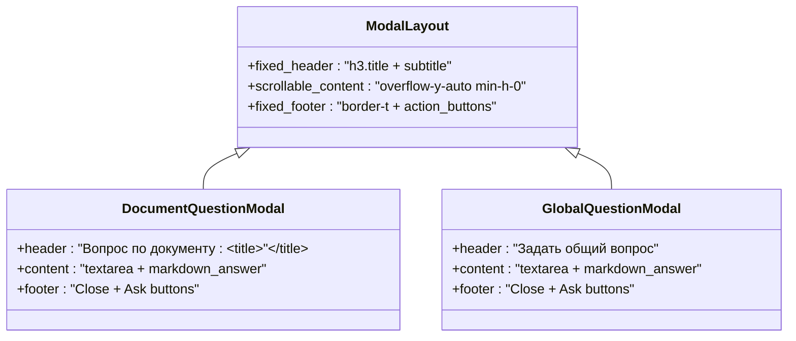

**Diagram sources**
- [documents.html:270-371](file://templates/documents.html#L270-L371)

**Section sources**
- [documents.html:270-371](file://templates/documents.html#L270-L371)

### Automatic Scrolling Implementation
The system implements automatic scrolling to the latest content during streaming responses using Alpine.js reactive properties and DOM manipulation.

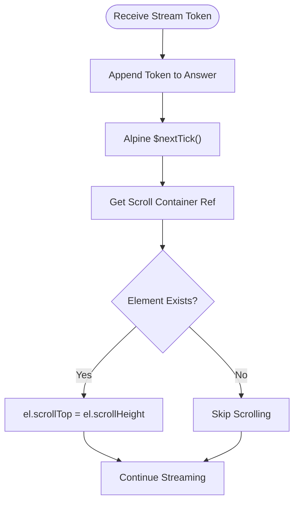

**Diagram sources**
- [components.js:477-481](file://static/js/components.js#L477-L481)
- [components.js:539-543](file://static/js/components.js#L539-L543)

**Section sources**
- [components.js:477-481](file://static/js/components.js#L477-L481)
- [components.js:539-543](file://static/js/components.js#L539-L543)

## Streaming Question Answering

### Real-Time Response Streaming
The system now supports real-time streaming of question answers using Server-Sent Events (SSE) with automatic content updates and scrolling.

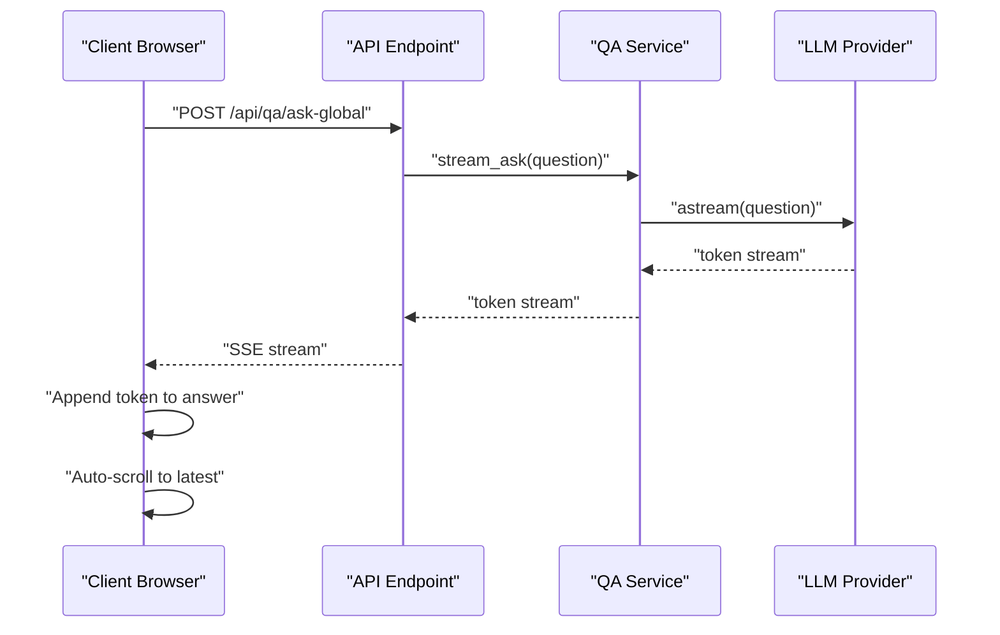

**Diagram sources**
- [documents_qa.py:26-52](file://packages/admin/src/cafetera_admin/api/documents_qa.py#L26-L52)
- [qa_service.py:217-249](file://packages/core/src/cafetera_core/domain/qa_service.py#L217-L249)
- [components.js:436-496](file://static/js/components.js#L436-L496)

### Document-Specific Streaming
The system also supports document-specific streaming responses with enhanced error handling and validation.

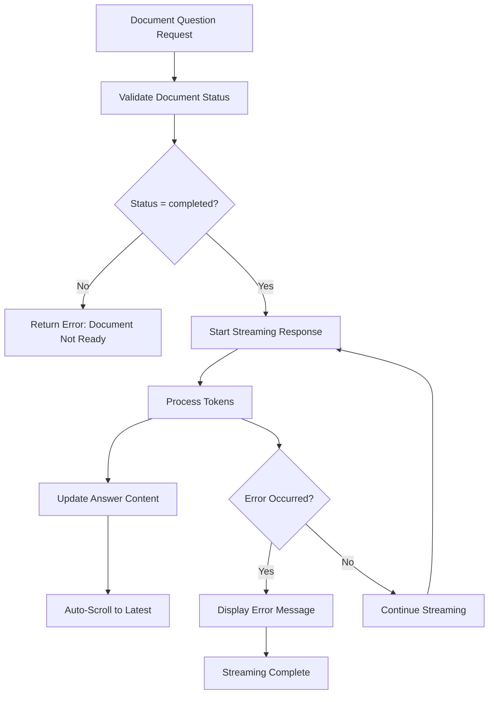

**Diagram sources**
- [documents_qa.py:55-90](file://packages/admin/src/cafetera_admin/api/documents_qa.py#L55-L90)
- [components.js:498-558](file://static/js/components.js#L498-L558)

**Section sources**
- [documents_qa.py:26-90](file://packages/admin/src/cafetera_admin/api/documents_qa.py#L26-L90)
- [qa_service.py:217-280](file://packages/core/src/cafetera_core/domain/qa_service.py#L217-L280)
- [components.js:436-558](file://static/js/components.js#L436-L558)

## Docker Deployment Improvements

### Optimized Image Building
Docker images now pre-download ML models during build time to reduce runtime startup delays and improve reliability.

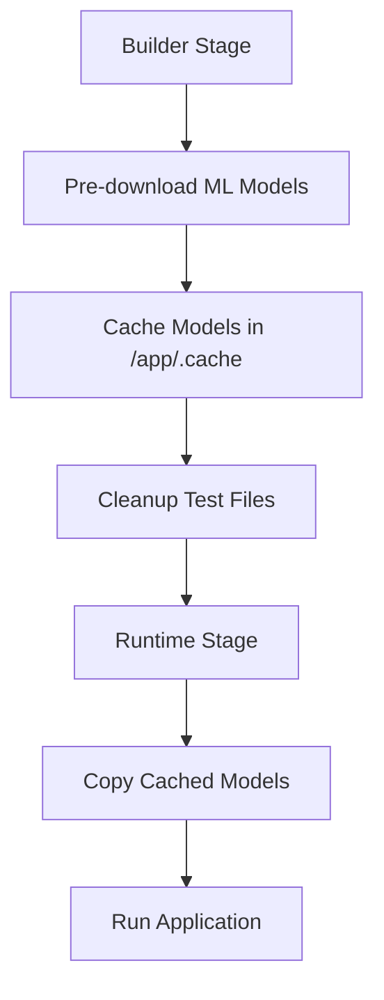

**Diagram sources**
- [Dockerfile.admin:50-75](file://Dockerfile.admin#L50-L75)
- [Dockerfile.admin:101-107](file://Dockerfile.admin#L101-L107)

### Enhanced Model Caching
Both admin and VK bot Dockerfiles implement sophisticated model caching strategies for optimal performance.

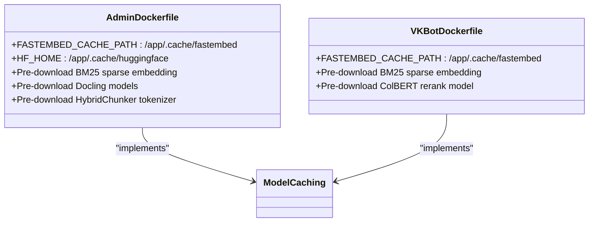

**Diagram sources**
- [Dockerfile.admin:50-63](file://Dockerfile.admin#L50-L63)
- [Dockerfile.polling_vk:43-48](file://Dockerfile.polling_vk#L43-L48)

**Section sources**
- [docker-compose.yml:56-87](file://docker-compose.yml#L56-L87)
- [docker-compose.yml:88-114](file://docker-compose.yml#L88-L114)
- [Dockerfile.admin:50-75](file://Dockerfile.admin#L50-L75)
- [Dockerfile.polling_vk:43-48](file://Dockerfile.polling_vk#L43-L48)

## Testing Coverage

### Comprehensive Indexing Tests
Extensive test coverage validates all new indexing functionality including batch processing, parallel embeddings, and retry mechanisms.

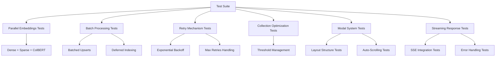

**Diagram sources**
- [test_indexer.py:481-516](file://tests/test_indexer.py#L481-L516)
- [test_indexer.py:400-456](file://tests/test_indexer.py#L400-L456)
- [test_indexer.py:518-595](file://tests/test_indexer.py#L518-L595)
- [test_indexer.py:304-368](file://tests/test_indexer.py#L304-L368)

### Test Categories
- **Parallel Embeddings**: Validates concurrent execution of dense, sparse, and ColBERT embeddings
- **Batch Processing**: Tests batched upsert operations and deferred indexing functionality
- **Retry Mechanisms**: Ensures exponential backoff and proper error handling
- **Collection Optimization**: Verifies threshold management and segment optimization
- **Modal System**: Tests layout structure, auto-scrolling functionality, and user interaction patterns
- **Streaming Responses**: Validates SSE integration, error handling, and real-time content updates

**Section sources**
- [test_indexer.py:1-618](file://tests/test_indexer.py#L1-618)

## Performance Considerations
- Concurrency: The maximum concurrent indexing is configurable to balance throughput and resource usage.
- Chunking: Token-based chunk sizing ensures optimal embedding quality and retrieval performance.
- Hybrid Search: Sparse BM25 embeddings can improve recall for keyword-heavy HR documents.
- Reranking: Optional ColBERT reranking enhances precision but adds latency; tune prefetch and rerank limits accordingly.
- Storage: S3-compatible storage and PostgreSQL-backed metadata enable scalable document management.
- **Updated** Batch Processing: Large document sets are processed in configurable batch sizes to optimize memory usage and indexing performance.
- **Updated** Parallel Embeddings: Multiple embedding types are generated concurrently, reducing overall indexing time for complex document sets.
- **Updated** Retry Mechanisms: Exponential backoff ensures reliable Qdrant operations under transient network failures.
- **Updated** Docker Optimization: Pre-downloaded ML models and optimized caching reduce container startup times and improve reliability.
- **Updated** Deferred Indexing: Large batch operations temporarily disable indexing threshold to improve batch processing performance.
- **Updated** Modal Layout Optimization: Fixed header/footer layout reduces layout shift and improves perceived performance.
- **Updated** Auto-Scrolling Performance: Efficient DOM manipulation with Alpine.js reactive properties minimizes layout thrashing.
- **Updated** Streaming Efficiency: SSE streaming with incremental content updates provides responsive user experience without full page reloads.

## Troubleshooting Guide
- Logging: Configure global logging for consistent log formatting across the system.
- Environment Variables: Ensure .env contains required keys for VK token, LLM provider, Qdrant, and storage credentials.
- Handler Order: Verify handler registration order remains unchanged to prevent unexpected routing.
- State Dispenser: Confirm the shared state dispenser is assigned before loading labelers.
- Keyboard Payloads: Validate payload constants and service rows to avoid navigation errors.
- Admin Coexistence: Use separate admin API key configuration to avoid conflicts with VK bot settings.
- **Updated** Indexing Performance: Monitor batch processing logs and adjust qdrant_upsert_batch_size based on document size and available resources.
- **Updated** Parallel Embeddings: Ensure sufficient CPU resources for concurrent embedding generation, especially with ColBERT models.
- **Updated** Retry Failures: Check Qdrant connectivity and network stability if retry mechanisms are triggered frequently.
- **Updated** Docker Issues: Verify ML model caches are properly mounted and accessible in Docker containers.
- **Updated** Model Loading: Ensure pre-downloaded models are available in the cached directories within Docker containers.
- **Updated** Modal Layout Issues: Check CSS classes for proper modal layout and ensure Alpine.js reactive properties are properly initialized.
- **Updated** Auto-Scrolling Problems: Verify that scroll container references are correctly set and DOM elements exist before attempting to scroll.
- **Updated** Streaming Response Errors: Monitor SSE connection status and validate that server-side streaming endpoints are properly configured.

**Section sources**
- [config.py:7-12](file://packages/core/src/cafetera_core/config.py#L7-L12)
- [bot.py:47-49](file://packages/vk_bot/src/cafetera_vk_bot/bot.py#L47-L49)
- [keyboards.py:15-53](file://packages/vk_bot/src/cafetera_vk_bot/keyboards.py#L15-L53)
- [config.py:17-19](file://packages/admin/src/cafetera_admin/config.py#L17-L19)
- [indexer.py:182-203](file://packages/admin/src/cafetera_admin/indexer.py#L182-L203)
- [docker-compose.yml:178-187](file://docker-compose.yml#L178-L187)
- [documents.html:270-371](file://templates/documents.html#L270-L371)
- [components.js:417-558](file://static/js/components.js#L417-L558)

## Conclusion
The Document Management System provides a robust, extensible foundation for HR document access via a VK bot. Its modular design, centralized configuration, and structured handler routing enable efficient development and maintenance. **Updated** The system now features significant enhancements to the modal window system, including improved layout architecture, automatic scrolling functionality, and better user experience for document questions and global questions. The enhanced modal system with fixed headers, scrollable content areas, and automatic scrolling provides a more responsive and engaging user interface. Combined with real-time streaming responses and SSE integration, the system delivers a modern, efficient user experience for HR document management. The comprehensive testing coverage ensures these new features function correctly under various conditions, making the system more robust and maintainable.