# Document Management System

<cite>
**Referenced Files in This Document**
- [app/main.py](file://app/main.py)
- [app/config.py](file://app/config.py)
- [app/api/documents.py](file://app/api/documents.py)
- [app/api/documents_auth.py](file://app/api/documents_auth.py)
- [app/api/documents_upload.py](file://app/api/documents_upload.py)
- [app/api/documents_bulk.py](file://app/api/documents_bulk.py)
- [app/api/documents_qa.py](file://app/api/documents_qa.py)
- [app/api/documents_helpers.py](file://app/api/documents_helpers.py)
- [app/api/deps.py](file://app/api/deps.py)
- [app/domain/document_service.py](file://app/domain/document_service.py)
- [app/domain/entities.py](file://app/domain/entities.py)
- [app/domain/qa_service.py](file://app/domain/qa_service.py)
- [app/domain/topic_hints.py](file://app/domain/topic_hints.py)
- [app/storage/document_repo.py](file://app/storage/document_repo.py)
- [app/storage/models.py](file://app/storage/models.py)
- [app/storage/s3.py](file://app/storage/s3.py)
- [app/storage/database.py](file://app/storage/database.py)
- [app/rag/indexer.py](file://app/rag/indexer.py)
- [app/rag/parser.py](file://app/rag/parser.py)
- [app/rag/retriever.py](file://app/rag/retriever.py)
- [app/rag/chain.py](file://app/rag/chain.py)
- [app/rag/prompts.py](file://app/rag/prompts.py)
- [app/integrations/vk/bot.py](file://app/integrations/vk/bot.py)
- [app/integrations/vk/handlers/start.py](file://app/integrations/vk/handlers/start.py)
- [app/integrations/vk/handlers/ask.py](file://app/integrations/vk/handlers/ask.py)
- [app/integrations/vk/handlers/hr_request.py](file://app/integrations/vk/handlers/hr_request.py)
- [app/integrations/vk/handlers/fire.py](file://app/integrations/vk/handlers/fire.py)
- [app/integrations/vk/handlers/hire.py](file://app/integrations/vk/handlers/hire.py)
- [app/integrations/vk/handlers/pay.py](file://app/integrations/vk/handlers/pay.py)
- [app/integrations/vk/handlers/vacation.py](file://app/integrations/vk/handlers/vacation.py)
- [app/integrations/vk/states.py](file://app/integrations/vk/states.py)
- [app/integrations/vk/rules.py](file://app/integrations/vk/rules.py)
- [app/integrations/vk/keyboards.py](file://app/integrations/vk/keyboards.py)
- [templates/documents.html](file://templates/documents.html)
- [templates/partials/document_table.html](file://templates/partials/document_table.html)
- [templates/partials/document_row.html](file://templates/partials/document_row.html)
- [templates/partials/pagination.html](file://templates/partials/pagination.html)
- [templates/partials/status_poller.html](file://templates/partials/status_poller.html)
- [templates/base.html](file://templates/base.html)
- [static/js/htmx.js](file://static/js/htmx.js)
- [scripts/ingest.py](file://scripts/ingest.py)
- [tests/test_api_documents.py](file://tests/test_api_documents.py)
- [tests/test_api_documents_auth.py](file://tests/test_api_documents_auth.py)
- [tests/test_api_documents_upload.py](file://tests/test_api_documents_upload.py)
- [tests/test_api_documents_bulk.py](file://tests/test_api_documents_bulk.py)
- [tests/test_storage.py](file://tests/test_storage.py)
- [tests/test_qa_service.py](file://tests/test_qa_service.py)
- [pyproject.toml](file://pyproject.toml)
</cite>

## Update Summary
**Changes Made**
- **Major Architectural Refactoring**: System restructured from monolithic to modular document management with specialized routers
- **Authentication Extraction**: Authentication, logout, and root redirect moved to dedicated `documents_auth.py` router
- **Upload Functionality Extraction**: File upload and background indexing moved to dedicated `documents_upload.py` router
- **Bulk Operations Extraction**: Delete, reindex, and search toggle operations moved to dedicated `documents_bulk.py` router
- **QA Functionality Extraction**: Document-specific and global question-answering moved to dedicated `documents_qa.py` router
- **Router Composition**: Main `documents.py` router maintains backward compatibility through router composition
- **Enhanced Modular Organization**: Clear separation of concerns with specialized routers for different functional areas
- **Maintained Backward Compatibility**: All existing API endpoints and functionality preserved through router composition

## Table of Contents
1. [Introduction](#introduction)
2. [System Architecture](#system-architecture)
3. [Core Components](#core-components)
4. [Document Management Workflow](#document-management-workflow)
5. [Enhanced Filtering and Sorting System](#enhanced-filtering-and-sorting-system)
6. [Modernized User Interface](#modernized-user-interface)
7. [Enhanced Dual-Format Document Support](#enhanced-dual-format-document-support)
8. [Enhanced Concurrency Control](#enhanced-concurrency-control)
9. [Comprehensive Test Coverage](#comprehensive-test-coverage)
10. [Improved Text Chunking Algorithms](#improved-text-chunking-algorithms)
11. [Server-Side Processing Implementation](#server-side-processing-implementation)
12. [Enhanced Status Display System](#enhanced-status-display-system)
13. [Advanced Pagination System](#advanced-pagination-system)
14. [Bulk Operations System](#bulk-operations-system)
15. [Enhanced Date Range Filtering](#enhanced-date-range-filtering)
16. [RAG Pipeline](#rag-pipeline)
17. [Document-Specific Question Answering](#document-specific-question-answering)
18. [Global Question Answering](#global-question-answering)
19. [Real-Time Streaming with Server-Sent Events](#real-time-streaming-with-server-sent-events)
20. [Enhanced File Download Handling](#enhanced-file-download-handling)
21. [Improved Document Status Tracking](#improved-document-status-tracking)
22. [VK Bot Integration](#vk-bot-integration)
23. [Storage Layer](#storage-layer)
24. [API Endpoints](#api-endpoints)
25. [Configuration Management](#configuration-management)
26. [Enhanced Error Handling and Consistency](#enhanced-error-handling-and-consistency)
27. [Deployment and Operations](#deployment-and-operations)
28. [Troubleshooting Guide](#troubleshooting-guide)
29. [Conclusion](#conclusion)

## Introduction

The Document Management System is a comprehensive RAG (Retrieval-Augmented Generation) platform designed for HR document processing and management. Built with FastAPI, the system provides a web-based administrative interface for uploading, managing, and organizing HR-related documents while maintaining a robust backend for AI-powered document retrieval and processing.

**Updated** The system has undergone a major architectural refactoring from a monolithic structure to a modular document management system. Authentication, upload, bulk operations, and QA functionality have been extracted to specialized routers (`documents_auth.py`, `documents_upload.py`, `documents_bulk.py`, `documents_qa.py`) while maintaining backward compatibility through router composition in the main `documents.py` file. This refactoring provides enhanced modularity, maintainability, and separation of concerns while preserving all existing functionality and API endpoints.

## System Architecture

The Document Management System follows a layered architecture pattern with clear separation of concerns and enhanced modular organization:

```mermaid
graph TB
subgraph "Modular Router Architecture"
MainRouter[Main Documents Router]
AuthRouter[Authentication Router]
UploadRouter[Upload Router]
BulkRouter[Bulk Operations Router]
QARouter[QA Router]
RouterComposition[Router Composition]
end
subgraph "Presentation Layer"
WebUI[Web Interface]
MobileSidebar[Overlay Mobile Sidebar]
ToastNotifications[Toast Notifications]
BatchStatusPoller[Batch Status Poller]
Pagination[Dynamic Pagination]
Search[Real-time Search]
BulkToolbar[Bulk Actions Toolbar]
DateFilter[Enhanced Date Filters]
FormatIcons[Format Type Icons]
TableStyling[Enhanced Table Styling]
BackgroundStyling[Background Styling]
RoundedCorners[Rounded Corners]
VisualHierarchy[Visual Hierarchy]
FilterSort[Enhanced Filtering & Sorting]
DocumentModal[Document Question Modal]
GlobalQuestionModal[Global Question Modal]
AlpineJS[Alpine.js State Management]
EndUserInteraction[Enhanced User Interaction]
SSEClient[SSE Client for Streaming]
EndUserFeedback[Real-time Feedback]
HTMXOOBSwapping[HTMX OOB Swapping]
EndUserExperience[Enhanced User Experience]
end
subgraph "Application Layer"
Service[Document Service]
QAService[QA Service]
FormatHandler[Format Detection Handler]
Semaphore[Asyncio Semaphore]
FilterSortAPI[Filter & Sort API]
BatchPoller[Batch Status Poller]
OOBSwapper[Out-of-Band Swapper]
DocSpecificQA[Document-Specific QA Handler]
GlobalQA[Global QA Handler]
StreamingResponse[Streaming Response Handler]
UnifiedIndexing[Unified Indexing Function]
DateRangeUtility[Date Range Utility]
TemplateContext[Template Context Manager]
DocXValidator[DOCX Integrity Validator]
HTMXPartialResponses[HTMX Partial Responses]
EndUserManagement[Enhanced User Management]
end
subgraph "Domain Layer"
Entities[Domain Entities]
States[Bot States]
BulkRequests[Bulk Operation Requests]
FormatDispatch[Format Dispatcher]
DocScopedRetriever[Document Scoped Retriever]
GlobalRetriever[Global Retriever]
StreamingQA[Streaming Question Answering]
EndUserMonitoring[Enhanced Monitoring]
end
subgraph "Data Access Layer"
Repo[Document Repository]
Models[Data Models]
Search[Case-insensitive Search]
Pagination[Database Pagination]
DateRange[Date Range Filtering]
FormatSupport[Format Support Tracking]
FilterSortDB[Filter & Sort Database]
RecentlyFinished[Recently Finished Documents]
EndUserTracking[Enhanced Tracking]
end
subgraph "External Services"
S3[MinIO/S3 Storage]
Qdrant[Qdrant Vector DB]
LLM[LLM Provider]
Parser[Enhanced Parser]
EndUserIntegration[Enhanced Integration]
end
MainRouter --> AuthRouter
MainRouter --> UploadRouter
MainRouter --> BulkRouter
MainRouter --> QARouter
MainRouter --> RouterComposition
RouterComposition --> WebUI
RouterComposition --> Service
Service --> Repo
Service --> Qdrant
Service --> S3
Repo --> Models
Repo --> Search
Repo --> Pagination
Repo --> DateRange
Repo --> FormatSupport
Repo --> FilterSortDB
Repo --> RecentlyFinished
Service --> LLM
QAService --> Service
QAService --> LLM
QAService --> StreamingQA
DocSpecificQA --> QAService
DocSpecificQA --> DocScopedRetriever
GlobalQA --> QAService
GlobalQA --> GlobalRetriever
DocScopedRetriever --> Qdrant
DocScopedRetriever --> LLM
GlobalRetriever --> Qdrant
GlobalRetriever --> LLM
StreamingResponse --> SSEClient
StreamingResponse --> EndUserFeedback
BulkOps --> Service
BulkOps --> Repo
BulkOps --> Semaphore
BatchPoller --> OOBSwapper
FormatHandler --> FormatDispatch
FormatHandler --> Parser
FormatHandler --> DocXValidator
FilterSortAPI --> FilterSortDB
FilterSortAPI --> DateRangeUtility
TemplateContext --> UnifiedIndexing
DocXValidator --> UnifiedIndexing
HTMXPartialResponses --> OOBSwapper
EndUserManagement --> HTMXOOBSwapping
EndUserMonitoring --> BatchPoller
EndUserTracking --> RecentlyFinished
```

**Diagram sources**
- [app/api/documents.py:50-85](file://app/api/documents.py#L50-L85)
- [app/api/documents_auth.py:20-77](file://app/api/documents_auth.py#L20-L77)
- [app/api/documents_upload.py:41-288](file://app/api/documents_upload.py#L41-L288)
- [app/api/documents_bulk.py:30-224](file://app/api/documents_bulk.py#L30-L224)
- [app/api/documents_qa.py:23-91](file://app/api/documents_qa.py#L23-L91)
- [app/main.py:72-77](file://app/main.py#L72-L77)

The architecture consists of five main layers with enhanced modular organization, comprehensive document type handling, modernized frontend capabilities, and revolutionary HTMX partial response system:

1. **Modular Router Architecture**: The system now uses specialized routers for different functional areas with router composition maintaining backward compatibility. The main `documents.py` router includes authentication, upload, bulk operations, and QA routers while preserving all existing endpoints and functionality.

2. **Presentation Layer**: Web interface built with FastAPI and Jinja2 templates, plus VK social network bot integration, real-time search with HTMX, dynamic pagination controls, visual status indicators, bulk actions toolbar, enhanced date range filtering, format-specific icon display for DOCX, DOC, and XLSX formats, enhanced table styling with rounded corners, sophisticated background styling, improved visual hierarchy, overlay mobile sidebar with responsive design, toast notification system, document-specific question modal with Alpine.js integration, global question modal with SSE streaming, real-time SSE client for streaming responses, enhanced user interaction patterns, comprehensive status polling system with automatic activation, HTMX OOB swapping for efficient row updates, enhanced user experience with real-time status monitoring, and centralized batch status management.

3. **Application Layer**: Business logic encapsulated in domain services and API routers with format-aware endpoints, enhanced status management with batch polling, comprehensive operation orchestration, dual-format processing capabilities, semaphore-based concurrency control for background tasks, batch status polling system with recently finished documents tracking, out-of-band HTML swapping for efficient updates, document-specific question-answering handler with streaming support, global question-answering handler with streaming support, specialized document-scoped retriever implementation, specialized global retriever implementation, streaming response handler for real-time feedback, unified document indexing function for background processing, centralized date range parsing utility, template context management for consistent rendering, DOCX integrity validation for file content verification, HTMX partial response system with OOB swapping capabilities, and enhanced user management with automatic polling control.

4. **Domain Layer**: Core business entities and state management for bot interactions plus bulk operation request models, format detection mechanisms supporting DOCX, DOC, and XLSX formats, document-scoped retriever construction for focused document queries, global retriever construction for knowledge base-wide queries, streaming question answering capabilities, recently finished documents tracking for status updates, and enhanced monitoring capabilities for user activity.

5. **Data Access Layer**: Async repository pattern for SQLite database operations with comprehensive search functionality, pagination support, advanced date range filtering capabilities, format-specific metadata tracking for all supported document types, enhanced filtering/sorting database operations, recently finished documents functionality for status tracking, and enhanced tracking for user interactions and document processing.

6. **Integration Layer**: External services for storage, vector databases, and AI providers with enhanced parser support for DOC, DOCX, and XLSX formats, proper resource management, document-scoped retrieval capabilities, global retrieval capabilities, streaming response generation for real-time feedback, and enhanced integration with HTMX for real-time UI updates.

## Core Components

### Application Bootstrap and Configuration

The system initializes through a centralized FastAPI application factory that manages lifecycle resources and dependency injection with enhanced modular organization:

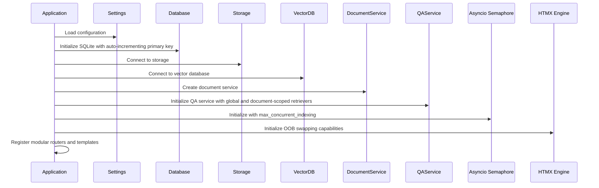

**Diagram sources**
- [app/main.py:22-49](file://app/main.py#L22-L49)
- [app/config.py:37-39](file://app/config.py#L37-L39)
- [app/storage/database.py:32-39](file://app/storage/database.py#L32-L39)

### Modular Router Architecture

The system now uses a modular router architecture with specialized routers for different functional areas:

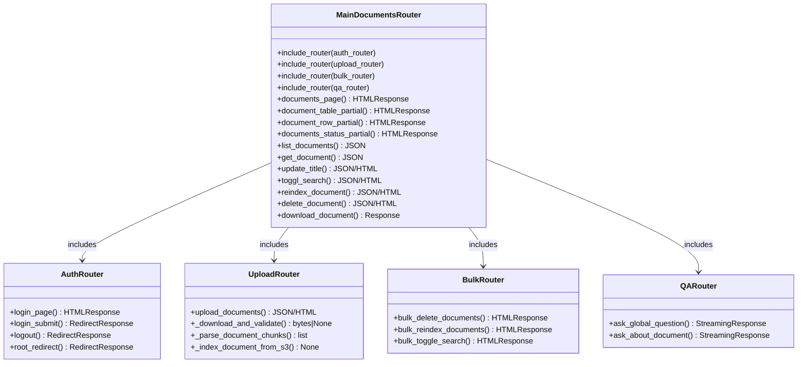

**Diagram sources**
- [app/api/documents.py:79-85](file://app/api/documents.py#L79-L85)
- [app/api/documents_auth.py:20-77](file://app/api/documents_auth.py#L20-L77)
- [app/api/documents_upload.py:41-288](file://app/api/documents_upload.py#L41-L288)
- [app/api/documents_bulk.py:30-224](file://app/api/documents_bulk.py#L30-L224)
- [app/api/documents_qa.py:23-91](file://app/api/documents_qa.py#L23-L91)

**Section sources**
- [app/main.py:1-80](file://app/main.py#L1-L80)
- [app/api/documents.py:1-531](file://app/api/documents.py#L1-L531)
- [app/api/documents_auth.py:1-77](file://app/api/documents_auth.py#L1-L77)
- [app/api/documents_upload.py:1-288](file://app/api/documents_upload.py#L1-L288)
- [app/api/documents_bulk.py:1-224](file://app/api/documents_bulk.py#L1-L224)
- [app/api/documents_qa.py:1-91](file://app/api/documents_qa.py#L1-L91)

## Document Management Workflow

The document management process follows a structured workflow from upload to searchable state with enhanced format support, concurrency control, real-time streaming capabilities, unified background processing, and revolutionary HTMX partial response system:

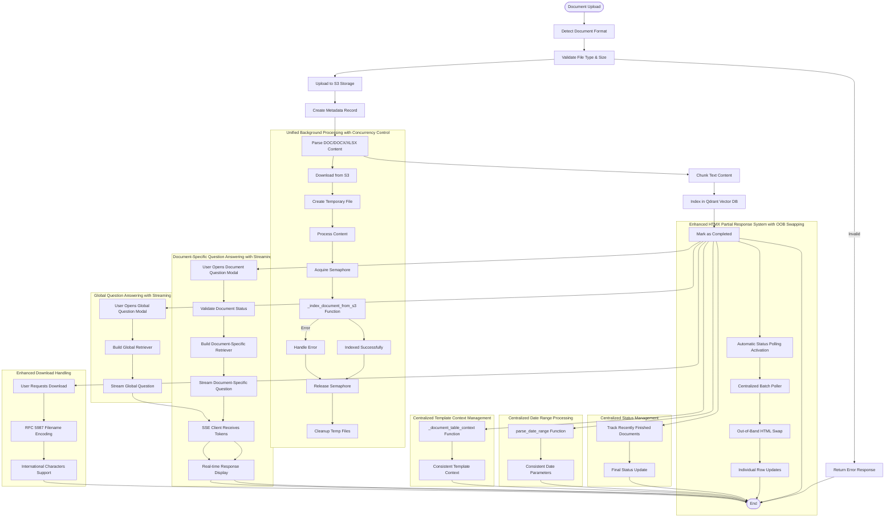

**Diagram sources**
- [app/api/documents_upload.py:169-288](file://app/api/documents_upload.py#L169-L288)
- [app/domain/document_service.py:84-133](file://app/domain/document_service.py#L84-L133)
- [app/rag/parser.py:121-138](file://app/rag/parser.py#L121-L138)
- [app/api/documents.py:228-275](file://app/api/documents.py#L228-L275)
- [app/api/documents.py:386-464](file://app/api/documents.py#L386-L464)
- [app/api/documents.py:499-531](file://app/api/documents.py#L499-L531)
- [app/api/documents_qa.py:26-91](file://app/api/documents_qa.py#L26-L91)
- [app/domain/qa_service.py:117-151](file://app/domain/qa_service.py#L117-L151)
- [app/domain/qa_service.py:161-201](file://app/domain/qa_service.py#L161-L201)
- [app/domain/qa_service.py:167-187](file://app/domain/qa_service.py#L167-L187)

### Upload Validation and Processing

The system implements comprehensive validation for uploaded documents with enhanced format support, concurrency management, real-time status updates, unified background processing, and revolutionary HTMX partial response system:

| Validation Step | Criteria | Action |
|----------------|----------|---------|
| File Extension | .docx, .doc, and .xlsx allowed | Accept all three formats |
| File Size | Maximum 10MB | Reject if exceeded |
| Content Type | DOCX/DOC/XLSX MIME types | Validate against allowed types |
| Format Detection | Automatic extension-based detection | Route to appropriate parser |
| Duplicate Prevention | Unique S3 keys | Append counter suffix |
| Concurrency Control | Semaphore-based throttling | Limit concurrent indexing operations |
| Status Tracking | Real-time status updates | Provide immediate feedback during processing |
| Streaming Support | SSE capability | Enable real-time response streaming |
| Global Question Support | Knowledge base access | Enable global knowledge base queries |
| Unified Indexing | Centralized background processing | Eliminate code duplication |
| Date Range Parsing | Consistent ISO date handling | Standardize date parameter processing |
| Template Context | Centralized rendering management | Ensure consistent UI rendering |
| DOCX Integrity | Zip file validation | Check word/document.xml presence |
| Spreadsheet Processing | XLSX workbook parsing | Handle multiple worksheets |
| **Updated** | **Modular Router Architecture** | **Authentication, upload, bulk, and QA functionality extracted to specialized routers** |
| **Updated** | **Router Composition** | **Main router maintains backward compatibility while providing modular organization** |
| **Updated** | **Enhanced HTMX Partial Responses** | **Implement OOB swapping for efficient row updates** |
| **Updated** | **Batch Status Polling** | **Replace individual row polling with centralized system** |
| **Updated** | **Automatic Polling Control** | **Start/stop polling based on active document count** |
| **Updated** | **Recently Finished Tracking** | **Track documents completed within 10 seconds** |

**Updated** The validation system now supports DOCX, DOC, and XLSX formats with comprehensive MIME type validation. The format detection mechanism automatically routes documents to the appropriate parser based on file extension, ensuring proper handling of legacy DOC files, modern DOCX files, and spreadsheet XLSX files. The new DOCX integrity checking using `_validate_docx_bytes()` function verifies that DOCX files contain valid content by checking for the required word/document.xml structure within the ZIP archive. Background indexing operations are now handled by the unified `_index_document_from_s3()` function, which eliminates code duplication and provides centralized error handling. The new `load_xlsx()` function in the parser module handles spreadsheet processing with worksheet-based sectioning and row formatting. The enhanced download functionality now includes RFC 5987-compliant filename encoding for proper international character support across different browsers and systems. The new global question-answering capability provides comprehensive knowledge base access through the `GLOBAL_EXPERTS_PROMPT` system prompt and specialized retriever construction. The revolutionary HTMX partial response system now includes proper OOB swapping capabilities for dynamic document row updates, automatic status polling activation that starts/stops based on active document count, and centralized batch status updates through the new '/partials/documents-status' endpoint. The system now tracks recently finished documents within a 10-second window to provide final status updates, dramatically reducing server load by eliminating N concurrent requests for individual row polling.

**Section sources**
- [app/api/documents_upload.py:169-288](file://app/api/documents_upload.py#L169-L288)
- [app/api/documents_helpers.py:31-50](file://app/api/documents_helpers.py#L31-L50)
- [app/api/documents.py:228-275](file://app/api/documents.py#L228-L275)
- [app/api/documents_qa.py:26-91](file://app/api/documents_qa.py#L26-L91)

## Enhanced Filtering and Sorting System

The system implements comprehensive server-side filtering and sorting capabilities with real-time processing and centralized date range handling:

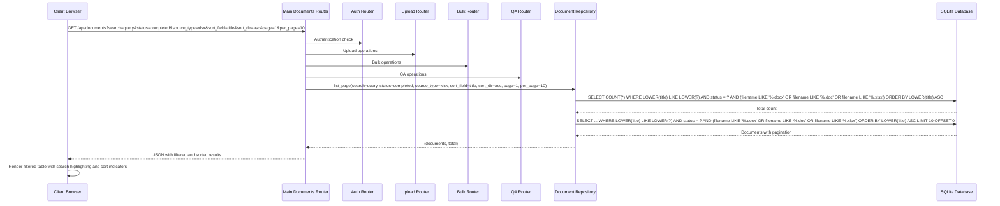

**Diagram sources**
- [app/api/documents.py:280-317](file://app/api/documents.py#L280-L317)
- [app/api/documents_auth.py:23-77](file://app/api/documents_auth.py#L23-L77)
- [app/api/documents_upload.py:169-288](file://app/api/documents_upload.py#L169-L288)
- [app/api/documents_bulk.py:46-224](file://app/api/documents_bulk.py#L46-L224)
- [app/api/documents_qa.py:26-91](file://app/api/documents_qa.py#L26-L91)
- [app/storage/document_repo.py:120-210](file://app/storage/document_repo.py#L120-L210)
- [app/api/deps.py:26-42](file://app/api/deps.py#L26-L42)

### Filtering Implementation Details

The filtering system provides comprehensive filtering capabilities across multiple dimensions with centralized date range processing:

- **Case-insensitive matching**: Uses `LOWER()` function for case-insensitive pattern matching
- **Dual-field search**: Searches both document titles and filenames simultaneously
- **Status filtering**: Filters by processing status (pending, processing, completed, failed)
- **Source type filtering**: Distinguishes between DOCX, DOC, XLSX, and other document types
- **Real-time filtering**: Integrated with HTMX for immediate filtered results
- **Pattern matching**: Supports partial matches with wildcard patterns
- **Performance optimization**: Efficient LIKE queries with proper indexing considerations
- **Centralized date parsing**: Uses `parse_date_range()` utility for consistent date parameter handling

### Sorting Implementation Details

The sorting system provides flexible ordering capabilities:

- **Multiple sort fields**: Supports sorting by title, created_at, and status
- **Bidirectional sorting**: Ascending and descending order for all sortable fields
- **Case-insensitive text sorting**: Uses `LOWER()` for title sorting
- **Timestamp sorting**: Direct sorting by created_at timestamps
- **Enum sorting**: Direct sorting by status enum values
- **URL parameter preservation**: Sort parameters persist across pagination

### Filter and Sort Parameters

The system supports the following parameters:

| Parameter | Type | Description |
|-----------|------|-------------|
| `search` | String | Search query for filtering documents by title or filename |
| `status` | String | Filter by processing status (all, completed, processing, pending, failed) |
| `source_type` | String | Filter by document type (all, docx, doc, xlsx, other) |
| `sort_field` | String | Field to sort by (title, created_at, status) |
| `sort_dir` | String | Sort direction (asc, desc) |
| `page` | Integer | Current page number (1-indexed) |
| `per_page` | Integer | Number of items per page (10, 20, 50) |
| `date_from` | String | ISO date string for minimum creation date (inclusive) |
| `date_to` | String | ISO date string for maximum creation date (inclusive) |

### Filter and Sort UI Integration

The frontend provides intuitive filtering and sorting capabilities:

- **Real-time filtering**: Debounced input with 300ms delay for performance
- **Filter chips**: Visual filter indicators with active state highlighting
- **Sort indicators**: Arrow icons showing current sort direction
- **Dropdown filters**: Status and source type filters with visual labels
- **HTMX integration**: Automatic AJAX requests for filtered results
- **Pagination preservation**: Filter and sort parameters maintain current pagination state
- **Centralized date handling**: Date filters use standardized parsing across all components

**Section sources**
- [app/api/documents.py:280-317](file://app/api/documents.py#L280-L317)
- [app/api/documents.py:228-275](file://app/api/documents.py#L228-L275)
- [app/storage/document_repo.py:120-210](file://app/storage/document_repo.py#L120-L210)
- [templates/documents.html:59-136](file://templates/documents.html#L59-L136)
- [app/api/deps.py:26-42](file://app/api/deps.py#L26-L42)

## Modernized User Interface

The system features a modernized frontend interface with enhanced user experience and interactive capabilities:

```mermaid
flowchart TD
UI[Modernized Interface] --> MobileSidebar[Overlay Mobile Sidebar]
UI --> ToastNotifications[Toast Notification System]
UI --> BulkToolbar[Bulk Actions Toolbar]
UI --> DateFilter[Enhanced Date Filters]
UI --> Search[Improved Search]
UI --> Pagination[Enhanced Pagination]
UI --> Status[Visual Status Indicators]
UI --> FormatIcons[Format Type Icons]
UI --> TableStyling[Enhanced Table Styling]
UI --> BackgroundStyling[Background Styling]
UI --> RoundedCorners[Rounded Corners]
UI --> VisualHierarchy[Visual Hierarchy]
UI --> FilterSort[Enhanced Filtering & Sorting]
UI --> BatchStatusPoller[Batch Status Poller]
UI --> DocumentModal[Document Question Modal]
UI --> GlobalQuestionModal[Global Question Modal]
UI --> AlpineJS[Alpine.js State Management]
UI --> SSEClient[SSE Client for Streaming]
UI --> RealtimeFeedback[Real-time Feedback]
UI --> HTMXOOBSwapping[HTMX OOB Swapping]
UI --> AutomaticPollingControl[Automatic Polling Control]
UI --> RecentlyFinishedTracking[Recently Finished Tracking]
MobileSidebar --> SidebarContent[Navigation Content]
MobileSidebar --> CloseButton[Close Button]
MobileSidebar --> OverlayBackdrop[Backdrop Overlay]
ToastNotifications --> SuccessToast[Success Toasts]
ToastNotifications --> ErrorToast[Error Toasts]
ToastNotifications --> WarningToast[Warning Toasts]
ToastNotifications --> InfoToast[Info Toasts]
BulkToolbar --> DeleteBtn[Delete Button]
BulkToolbar --> ReindexBtn[Reindex Button]
BulkToolbar --> ToggleBtn[Toggle Search Button]
DateFilter --> FromInput[From Date Input]
DateFilter --> ToInput[To Date Input]
DateFilter --> ApplyBtn[Apply Button]
DateFilter --> ClearBtn[Clear Button]
Search --> RealtimeSearch[Real-time Search]
Search --> Debounce[300ms Debounce]
Pagination --> HTMX[HTMX Integration]
Pagination --> Ellipsis[Smart Ellipsis]
Status --> AutoRefresh[Auto-refresh]
Status --> Tooltips[Error Tooltips]
FormatIcons --> DocIcon[DOC Format Icon]
FormatIcons --> DocxIcon[DOCX Format Icon]
FormatIcons --> XlsxIcon[XLSX Format Icon]
TableStyling --> BorderStyling[Border Styling]
TableStyling --> BackgroundStyling[Background Treatment]
TableStyling --> RoundedCorners[Corner Radius]
BackgroundStyling --> PrimaryBackground[Primary Background]
BackgroundStyling --> SecondaryBackground[Secondary Background]
BackgroundStyling --> SurfaceBackground[Surface Background]
RoundedCorners --> TableContainer[Table Container]
RoundedCorners --> UploadModal[Upload Modal]
RoundedCorners --> FilterChips[Filter Chips]
VisualHierarchy --> ColorHierarchy[Color Hierarchy]
VisualHierarchy --> SpacingHierarchy[Spacing Hierarchy]
VisualHierarchy --> TypographyHierarchy[Typography Hierarchy]
FilterSort --> SortIndicators[Sort Direction Indicators]
FilterSort --> FilterChips[Filter Chips]
FilterSort --> RealtimeFiltering[Real-time Filtering]
BatchStatusPoller --> CentralizedPolling[Centralized Polling]
BatchStatusPoller --> OOBSwapping[Out-of-Band Swapping]
BatchStatusPoller --> AutomaticActivation[Automatic Activation]
DocumentModal --> ModalBox[Modal Box]
DocumentModal --> QuestionTextarea[Question Textarea]
DocumentModal --> SubmitButton[Submit Button]
DocumentModal --> AnswerDisplay[Answer Display]
DocumentModal --> ErrorDisplay[Error Display]
GlobalQuestionModal --> ModalBox[Modal Box]
GlobalQuestionModal --> QuestionTextarea[Question Textarea]
GlobalQuestionModal --> SubmitButton[Submit Button]
GlobalQuestionModal --> AnswerDisplay[Answer Display]
GlobalQuestionModal --> ErrorDisplay[Error Display]
AlpineJS --> StateManagement[State Management]
AlpineJS --> EventHandling[Event Handling]
AlpineJS --> DataBinding[Data Binding]
SSEClient --> TokenStreaming[Token Streaming]
SSEClient --> RealtimeDisplay[Real-time Display]
RealtimeFeedback --> ImmediateResponse[Immediate Response]
RealtimeFeedback --> LoadingIndicators[Loading Indicators]
HTMXOOBSwapping --> EfficientUpdates[Efficient Row Updates]
HTMXOOBSwapping --> DeduplicatedUpdates[Deduplicated Updates]
AutomaticPollingControl --> StartStopControl[Start/Stop Control]
AutomaticPollingControl --> ServerLoadReduction[Server Load Reduction]
RecentlyFinishedTracking --> FinalStatusUpdates[Final Status Updates]
RecentlyFinishedTracking --> TenSecondWindow[Ten-Second Window]
```

**Diagram sources**
- [templates/documents.html:135-186](file://templates/documents.html#L135-L186)
- [templates/documents.html:89-131](file://templates/documents.html#L89-L131)
- [templates/documents.html:306-334](file://templates/documents.html#L306-L334)
- [templates/partials/document_row.html:77-97](file://templates/partials/document_row.html#L77-L97)
- [templates/partials/status_poller.html:1-14](file://templates/partials/status_poller.html#L1-L14)
- [templates/base.html:86-279](file://templates/base.html#L86-L279)
- [templates/documents.html:261-310](file://templates/documents.html#L261-L310)
- [templates/documents.html:318-365](file://templates/documents.html#L318-L365)
- [templates/documents.html:663-707](file://templates/documents.html#L663-L707)
- [templates/documents.html:726-845](file://templates/documents.html#L726-L845)
- [templates/documents.html:766-845](file://templates/documents.html#L766-L845)

### Interactive Features

The modernized interface includes several key interactive elements:

#### Enhanced Mobile Responsiveness
- **Overlay Sidebar**: Mobile-friendly sidebar with slide-in animation and backdrop overlay
- **Responsive Breakpoints**: MD breakpoint for desktop/tablet adaptation
- **Touch-Friendly Controls**: Large touch targets and appropriate spacing
- **Mobile Navigation**: Hamburger menu with smooth transitions and backdrop clicking

#### Toast Notification System
- **Centralized Toast Manager**: Global toast management with automatic dismissal
- **Multiple Toast Types**: Success, error, warning, and info notifications
- **Automatic Dismissal**: 5-second timeout for non-blocking user experience
- **Custom Event Handling**: HTMX-compatible toast triggering via custom events

#### Enhanced Table Container Styling
- **Rounded Corners**: `rounded-xl` for all table containers and modals
- **Sophisticated Borders**: `border border-base-300/70` with transparency effects
- **Background Treatment**: `bg-base-100` with subtle surface styling
- **Shadow Effects**: Subtle shadows for depth perception
- **Padding Optimization**: `pb-24` for proper bottom spacing

#### Bulk Actions Toolbar Enhancement
- **Primary Background**: `bg-primary/10` for subtle accent treatment
- **Rounded Design**: `rounded-lg` for modern appearance
- **Visual Hierarchy**: Proper spacing and alignment
- **Interactive States**: Hover effects and transitions
- **Badge Integration**: Visual feedback for selection count

#### Enhanced Date Filters
- **Dropdown Interface**: Collapsible filter panel with smooth animations
- **Two-Date Selection**: Separate inputs for start and end dates
- **Real-time Updates**: Automatic filtering on input changes
- **Clear Functionality**: One-click reset of all date filters
- **Apply Button**: Explicit apply mechanism for complex workflows
- **URL Parameter Sync**: Date filters persist in URL for sharing and bookmarking
- **Responsive Design**: Mobile-friendly date picker interface

#### Improved Search Experience
- **Debounced Input**: 300ms delay for performance optimization
- **Real-time Results**: Instant filtering without page reloads
- **Visual Indicators**: Clear display of active search terms
- **Search Icon**: Intuitive magnifying glass icon

#### Advanced Pagination
- **HTMX Integration**: Seamless partial updates without full reloads
- **Smart Ellipsis**: Intelligent page number display for large datasets
- **URL Synchronization**: Pagination state preserved in URL
- **Responsive Design**: Mobile-optimized pagination controls

#### Format Type Display
- **Visual Icons**: Distinct icons for DOC, DOCX, and XLSX formats
- **Color Coding**: Different visual treatments for different formats
- **Tooltip Information**: Hover details showing exact format type
- **Filtering Support**: Separate filters for DOC, DOCX, and XLSX formats

#### Enhanced Filtering and Sorting
- **Filter Chips**: Visual filter indicators with active state highlighting
- **Sort Indicators**: Arrow icons showing current sort direction
- **Real-time Filtering**: Immediate updates when filters change
- **Parameter Persistence**: Filter and sort parameters maintained across navigation
- **Centralized Date Handling**: Consistent date range processing across all components

#### Revolutionary Batch Status Polling System
- **Centralized Polling**: Single endpoint '/partials/documents-status' for all active documents
- **Out-of-Band Swapping**: Efficient HTML updates without full page reloads using OOB swapping
- **Automatic Polling Control**: Starts/stops polling based on active document count
- **Reduced Server Load**: Eliminates N concurrent requests for individual row polling
- **Recently Finished Documents**: Tracks documents that completed or failed within the last 10 seconds
- **Deduplicated Updates**: Prevents duplicate HTML updates for overlapping documents
- **Efficient Status Updates**: Provides final status updates for recently finished documents

#### Document-Specific Question Modal System
- **Alpine.js Integration**: Reactive state management for modal interactions
- **Form Validation**: Real-time validation for question submission
- **Loading States**: Visual feedback during question processing
- **Error Handling**: Comprehensive error display and user guidance
- **Answer Display**: Clean formatting for AI-generated responses
- **Keyboard Shortcuts**: Ctrl+Enter submission for efficient workflow
- **Modal Backdrop**: Proper focus management and escape key handling
- **Real-time Streaming**: Immediate display of AI responses as they arrive

#### Global Question Modal System
- **Alpine.js Integration**: Reactive state management for modal interactions
- **Form Validation**: Real-time validation for question submission
- **Loading States**: Visual feedback during question processing
- **Error Handling**: Comprehensive error display and user guidance
- **Answer Display**: Clean formatting for AI-generated responses
- **Keyboard Shortcuts**: Ctrl+Enter submission for efficient workflow
- **Modal Backdrop**: Proper focus management and escape key handling
- **Real-time Streaming**: Immediate display of AI responses as they arrive
- **Knowledge Base Scope**: Questions drawn from entire knowledge base

#### Real-time Streaming Feedback
- **SSE Client**: JavaScript implementation for Server-Sent Events
- **Token Streaming**: Real-time token-by-token response display
- **Buffer Management**: Efficient handling of streaming data chunks
- **Error Recovery**: Graceful handling of network interruptions
- **Loading States**: Visual indicators during streaming response generation

#### HTMX OOB Swapping Integration
- **Efficient Row Updates**: Out-of-band swapping for dynamic document row updates
- **Deduplicated Updates**: Prevents duplicate updates for overlapping documents
- **Automatic Polling Control**: Starts/stops polling based on document activity
- **Server Load Reduction**: Dramatically reduces server load compared to individual polling
- **Real-time Status Monitoring**: Provides immediate status updates without full page reloads

#### Automatic Polling Control
- **Intelligent Activation**: Polling starts automatically when active documents are present
- **Automatic Deactivation**: Polling stops when no active documents remain
- **Server Load Optimization**: Reduces unnecessary server requests
- **Resource Efficiency**: Optimizes system resources for better performance

#### Recently Finished Documents Tracking
- **Ten-Second Window**: Tracks documents that completed within the last 10 seconds
- **Final Status Updates**: Provides final status updates for recently finished documents
- **Deduplication Logic**: Prevents duplicate updates for documents in both active and recently finished lists
- **Centralized Management**: Unified tracking through the repository layer

### Frontend State Management

The interface uses Alpine.js for comprehensive state management:

- **Filter State**: Search query, status filter, source type filter, date range, sort parameters
- **Selection State**: Track selected document IDs across operations
- **Pagination State**: Current page, items per page, total counts
- **Upload State**: Track file upload progress and status
- **Modal State**: Manage dialog visibility and user interactions
- **Format State**: Track document format types and display preferences
- **Mobile State**: Sidebar open/close state and responsive breakpoints
- **Document Question State**: Track document-specific question modal state, including question text, loading state, answer display, error handling, and streaming response management
- **Global Question State**: Track global question modal state, including question text, loading state, answer display, error handling, and streaming response management
- **Streaming State**: Manage real-time response streaming with token accumulation and display
- **Status Polling State**: Track automatic polling activation and deactivation based on document activity
- **OOB Swapping State**: Manage HTMX OOB swapping for efficient row updates

**Section sources**
- [templates/documents.html:135-186](file://templates/documents.html#L135-L186)
- [templates/documents.html:89-131](file://templates/documents.html#L89-L131)
- [templates/documents.html:306-334](file://templates/documents.html#L306-L334)
- [templates/documents.html:537-611](file://templates/documents.html#L537-L611)
- [templates/partials/document_row.html:77-97](file://templates/partials/document_row.html#L77-L97)
- [templates/partials/status_poller.html:1-14](file://templates/partials/status_poller.html#L1-L14)
- [templates/base.html:86-279](file://templates/base.html#L86-L279)
- [templates/documents.html:261-310](file://templates/documents.html#L261-L310)
- [templates/documents.html:318-365](file://templates/documents.html#L318-L365)
- [templates/documents.html:663-707](file://templates/documents.html#L663-L707)
- [templates/documents.html:726-845](file://templates/documents.html#L726-L845)
- [templates/documents.html:766-845](file://templates/documents.html#L766-L845)

## Enhanced Dual-Format Document Support

The system now provides comprehensive support for DOCX, DOC, and XLSX document formats with enhanced validation and processing capabilities:

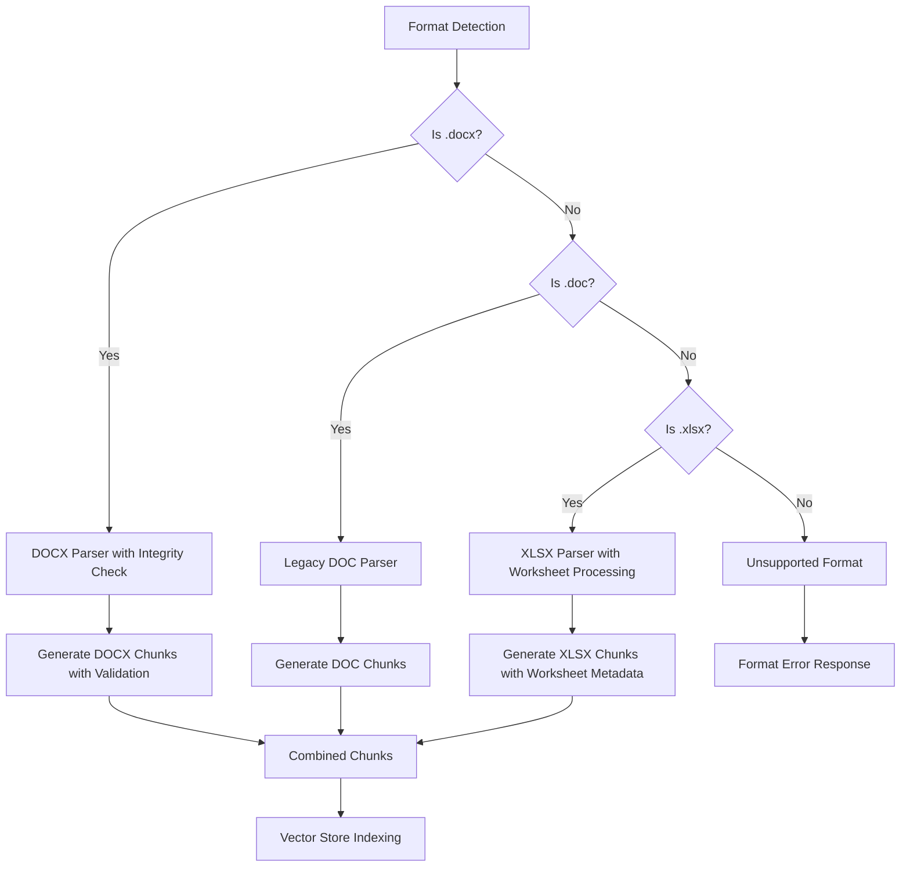

**Diagram sources**
- [app/rag/parser.py:121-138](file://app/rag/parser.py#L121-L138)
- [app/api/documents_helpers.py:16-28](file://app/api/documents_helpers.py#L16-L28)
- [app/rag/parser.py:411-475](file://app/rag/parser.py#L411-L475)

### Format Detection and Validation

The system implements comprehensive format detection and validation:

- **Allowed Extensions**: .docx, .doc, and .xlsx are supported
- **MIME Type Validation**: Comprehensive MIME type checking for all three formats
- **Automatic Routing**: Format detection determines appropriate parsing strategy
- **Error Handling**: Graceful handling of unsupported formats with clear error messages
- **DOCX Integrity Check**: Zip file validation using `_validate_docx_bytes()` function
- **Spreadsheet Processing**: Worksheet-based parsing with metadata preservation

### Enhanced Parser Architecture

The enhanced parser system supports all three document formats:

#### DOCX Parser with Integrity Validation
- **Structured Content**: Preserves document structure with heading-based sections
- **Metadata Enrichment**: Maintains source filename and section information
- **Chunk Processing**: Generates semantic chunks with proper metadata
- **Vector Embedding**: Creates embeddings for semantic search
- **Integrity Verification**: Validates DOCX content before processing

#### Legacy DOC Parser
- **Text Extraction**: Uses `docx2txt` for reliable text extraction
- **Single Section**: Treats entire document as single section
- **Filename-Based Section**: Uses document stem as section heading
- **Consistent Processing**: Mirrors DOCX processing approach for uniform results

#### XLSX Parser with Worksheet Processing
- **Worksheet Sections**: Each Excel worksheet becomes a separate section
- **Row Formatting**: Preserves column structure with pipe separators
- **Empty Row Handling**: Skips completely empty rows for clean content
- **Metadata Enrichment**: Includes worksheet names as section information
- **Chunk Processing**: Generates semantic chunks with worksheet context
- **Vector Embedding**: Creates embeddings for spreadsheet content

### Format-Specific Features

All three formats benefit from enhanced processing capabilities:

- **Unified Metadata**: Consistent metadata structure regardless of format
- **Chunk Size Optimization**: Same chunk size and overlap for all formats
- **Vector Database Integration**: Seamless integration with Qdrant vector store
- **Search Compatibility**: Identical search behavior across all document types
- **Spreadsheet Query Support**: XLSX documents can be queried with worksheet context

**Section sources**
- [app/rag/parser.py:55-138](file://app/rag/parser.py#L55-L138)
- [app/api/documents_helpers.py:16-28](file://app/api/documents_helpers.py#L16-L28)
- [app/rag/parser.py:273-407](file://app/rag/parser.py#L273-L407)
- [templates/partials/document_row.html:77-97](file://templates/partials/document_row.html#L77-L97)

## Enhanced Concurrency Control

The system implements comprehensive concurrency control with semaphore-based throttling for document indexing operations:

### Semaphore-Based Throttling

The system uses asyncio.Semaphore to limit concurrent document indexing operations:

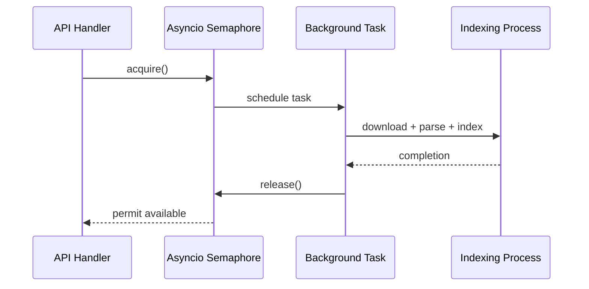

**Diagram sources**
- [app/main.py:39](file://app/main.py#L39)
- [app/api/deps.py:69-70](file://app/api/deps.py#L69-L70)
- [app/api/documents_upload.py:119-167](file://app/api/documents_upload.py#L119-L167)
- [app/api/documents_bulk.py:114-162](file://app/api/documents_bulk.py#L114-L162)

### Concurrency Control Implementation

The semaphore-based throttling system provides:

- **Resource Protection**: Limits concurrent indexing operations to prevent resource exhaustion
- **Fair Queuing**: First-come-first-served ordering for background tasks
- **Graceful Degradation**: Tasks wait for available permits rather than failing immediately
- **Configurable Limits**: Adjustable concurrency based on system resources
- **Atomic Operations**: Semaphore acquisition/release wraps the entire indexing process

### Background Task Coordination

Background tasks are coordinated through enhanced functions:

- **`_index_document_from_s3`**: Unified function handling upload, reindex, and all format types with semaphore protection
- **`_reindex_in_background`**: Handles bulk reindexing with proper error handling
- **Concurrent Processing**: Multiple background tasks can run simultaneously within limits
- **Error Recovery**: Failed tasks don't block other operations

**Section sources**
- [app/main.py:39](file://app/main.py#L39)
- [app/api/documents_upload.py:119-167](file://app/api/documents_upload.py#L119-L167)
- [app/api/documents_bulk.py:114-162](file://app/api/documents_bulk.py#L114-L162)

## Comprehensive Test Coverage

The system includes comprehensive testing across all layers with extensive search, pagination, bulk operation, concurrency control, streaming response, global question-answering, HTMX partial responses, batch status polling, and automatic polling control coverage:

### Test Coverage Areas

| Test Module | Focus Area | Testing Approach |
|-------------|------------|------------------|
| `test_api_documents.py` | Main documents router functionality | Unit and integration tests |
| `test_api_documents_auth.py` | Authentication router functionality | Unit and integration tests |
| `test_api_documents_upload.py` | Upload router functionality | Unit and integration tests |
| `test_api_documents_bulk.py` | Bulk operations router functionality | Unit and integration tests |
| `test_document_service.py` | Domain service logic | Mock-based testing |
| `test_storage.py` | Database operations | SQLite in-memory testing |
| `test_rag_block6.py` | RAG pipeline components | End-to-end testing |
| `test_bot_factory.py` | VK bot integration | State machine validation |
| `test_qa_service.py` | Question-answering logic | Scenario-based testing |

### Enhanced Test Coverage Areas

**Updated** The testing strategy now includes extensive coverage for the newly modular router architecture, batch status polling, automatic polling control, and recently finished documents tracking:

#### Router Architecture Testing Coverage
- **Router Composition**: Tests that main router properly includes and delegates to specialized routers
- **Backward Compatibility**: Validates that all existing endpoints continue to work after modular refactoring
- **Authentication Router**: Tests login, logout, and authentication guard functionality
- **Upload Router**: Tests file upload, validation, and background indexing operations
- **Bulk Router**: Tests bulk delete, reindex, and search toggle operations
- **QA Router**: Tests document-specific and global question-answering functionality
- **Helper Functions**: Tests shared utilities and validation functions

#### Search and Status Testing Coverage
- **Search functionality**: Tests case-insensitive pattern matching against titles and filenames
- **Status transitions**: Validates all status state changes and visual indicators
- **Search enable/disable**: Tests toggle functionality for search participation
- **Real-time updates**: Verifies automatic status refresh for processing documents
- **Error handling**: Tests error status display and tooltip functionality
- **Pagination with search**: Validates search results across multiple pages
- **Batch status polling**: Tests centralized status updates and out-of-band swapping
- **Recently finished documents**: Validates tracking of documents that completed within 10 seconds
- **Router composition**: Tests that modular routers maintain backward compatibility
- **OOB Swapping Testing**: Validates efficient row updates without full page reloads
- **Automatic Polling Control Testing**: Tests intelligent start/stop polling based on active document count
- **Batch Status Polling Testing**: Tests centralized polling endpoint functionality

#### Pagination Testing Coverage
- **Default Pagination**: Tests default page size (10 items)
- **Custom Pagination**: Tests custom page sizes (3 items per page)
- **Large Collections**: Tests pagination with 7 documents across 3 pages
- **Beyond Range**: Tests pagination beyond available data
- **Total Count Accuracy**: Verifies total count matches actual document count
- **HTMX Partials**: Tests pagination controls in HTMX partial responses

#### Bulk Operations Testing Coverage
- **Bulk Delete**: Tests deletion of multiple documents with concurrent fetching
- **Bulk Reindex**: Tests background reindexing initiation for multiple documents with semaphore protection
- **Bulk Search Toggle**: Tests enabling/disabling search participation for multiple documents
- **Error Handling**: Validates graceful handling of non-existent documents
- **HTMX Responses**: Tests partial HTML responses for seamless updates
- **Background Processing**: Validates background task scheduling and execution with proper concurrency limits

#### Enhanced Format Testing Coverage
- **DOCX Upload**: Tests upload and processing of modern DOCX files with integrity validation
- **DOC Upload**: Tests upload and processing of legacy DOC files
- **XLSX Upload**: Tests upload and processing of spreadsheet XLSX files with worksheet parsing
- **Format Detection**: Validates automatic format detection and routing
- **Parser Compatibility**: Ensures all formats produce identical chunk structures
- **Metadata Consistency**: Verifies consistent metadata across formats
- **DOCX Integrity Testing**: Validates `_validate_docx_bytes()` function with various DOCX samples

#### Concurrency Control Testing Coverage
- **Semaphore Limits**: Tests maximum concurrent indexing operations
- **Task Queueing**: Validates proper queuing when limits are reached
- **Resource Cleanup**: Ensures proper cleanup of temporary files
- **Error Recovery**: Tests recovery from concurrent operation failures
- **Performance Testing**: Validates system performance under load

#### Filtering and Sorting Testing Coverage
- **Status Filter**: Tests filtering by processing status
- **Source Type Filter**: Tests filtering by document type (DOCX, DOC, XLSX, other)
- **Sort Fields**: Tests sorting by title, created_at, and status
- **Sort Directions**: Tests ascending and descending sort orders
- **Combined Filters**: Tests multiple filters applied simultaneously
- **URL Parameter Persistence**: Validates filter parameters in URLs

#### Mobile Responsiveness Testing Coverage
- **Overlay Sidebar**: Tests mobile sidebar functionality and animations
- **Responsive Breakpoints**: Validates MD breakpoint behavior
- **Touch Interactions**: Tests mobile touch controls and gestures
- **Navigation Flow**: Validates mobile navigation patterns
- **Toast Notifications**: Tests toast behavior on mobile devices

#### Batch Status Polling Testing Coverage
- **Centralized Polling**: Tests '/partials/documents-status' endpoint functionality
- **Out-of-Band Swapping**: Validates HTML replacement without full page reloads
- **Polling Control**: Tests automatic start/stop of polling based on active documents
- **Performance Impact**: Validates reduced server load compared to individual polling
- **Error Handling**: Tests graceful handling of polling failures
- **Recently Finished Tracking**: Validates tracking of documents that completed within 10 seconds
- **OOB Swapping Functionality Testing**: Validates proper OOB swapping for dynamic row updates
- **Automatic Polling Activation Testing**: Tests intelligent start/stop polling based on document activity
- **Deduplicated Updates Testing**: Validates prevention of duplicate HTML updates

#### Document-Specific Question Answering Testing Coverage
- **Document Validation**: Tests document existence and status validation
- **Search Enablement**: Validates document search participation requirement
- **Retriever Construction**: Tests document-scoped retriever creation
- **Question Processing**: Validates question processing and answer generation
- **Error Handling**: Tests error responses for invalid documents or disabled search
- **Prompt Usage**: Validates `DOCUMENT_EXPERTS_PROMPT` application
- **State Management**: Tests Alpine.js state management for modal interactions
- **Streaming Response**: Tests real-time token streaming and display

#### Global Question Answering Testing Coverage
- **Global Retriever Construction**: Tests global retriever creation for knowledge base queries
- **Question Processing**: Validates question processing and answer generation across entire knowledge base
- **Error Handling**: Tests error responses for unavailable QA service
- **Prompt Usage**: Validates `GLOBAL_EXPERTS_PROMPT` application
- **State Management**: Tests Alpine.js state management for global question modal
- **Streaming Response**: Tests real-time token streaming and display
- **Knowledge Base Scope**: Validates that responses consider entire knowledge base context

#### Real-time Streaming Testing Coverage
- **SSE Implementation**: Tests Server-Sent Events streaming functionality
- **Token Streaming**: Validates token-by-token response delivery
- **Buffer Management**: Tests efficient handling of streaming data chunks
- **Error Recovery**: Validates graceful handling of network interruptions
- **Loading States**: Tests visual indicators during streaming response generation
- **JavaScript Client**: Validates SSE client implementation in templates

#### Enhanced Download Handling Testing Coverage
- **RFC 5987 Encoding**: Tests filename encoding for international character sets
- **Latin-1 Fallback**: Validates ASCII fallback for non-ASCII filenames
- **UTF-8 Encoding**: Tests proper UTF-8 encoding for international characters
- **Browser Compatibility**: Validates compatibility across different browsers
- **Content-Type Handling**: Tests proper MIME type assignment

#### Unified Indexing Function Testing Coverage
- **Background Processing**: Tests `_index_document_from_s3()` function for all document formats
- **Semaphore Protection**: Validates proper concurrency control during background tasks
- **Error Handling**: Tests comprehensive error recovery and logging
- **Resource Cleanup**: Validates temporary file cleanup after processing
- **Chunk Processing**: Tests document chunk generation and indexing for all formats

#### Date Range Utility Testing Coverage
- **ISO Date Parsing**: Tests `parse_date_range()` function for consistent date parameter handling
- **Error Recovery**: Validates graceful handling of invalid date formats
- **Boundary Handling**: Tests inclusive date range boundaries
- **Parameter Validation**: Validates date parameter processing across all endpoints

#### Template Context Management Testing Coverage
- **Context Building**: Tests `_document_table_context()` function for consistent template rendering
- **Parameter Validation**: Validates all filter and sort parameters in context
- **Pagination Context**: Tests page, per_page, and total count handling
- **Date Range Context**: Tests `date_from` and `date_to` parameter processing
- **UI State Context**: Validates filter and sort state persistence

#### XLSX Format Testing Coverage
- **Worksheet Processing**: Tests parsing of multiple Excel worksheets
- **Row Formatting**: Validates proper row formatting with pipe separators
- **Empty Row Handling**: Tests skipping of completely empty rows
- **Metadata Preservation**: Validates worksheet name preservation as section information
- **Chunk Generation**: Tests chunk generation with worksheet context
- **Search Compatibility**: Validates XLSX content searchability

#### **Updated** Router Architecture Testing Coverage
- **Router Composition Validation**: Tests that main router properly includes and delegates to specialized routers
- **Backward Compatibility Testing**: Validates that all existing endpoints continue to work after modular refactoring
- **Authentication Router Testing**: Tests login, logout, and authentication guard functionality
- **Upload Router Testing**: Tests file upload, validation, and background indexing operations
- **Bulk Router Testing**: Tests bulk delete, reindex, and search toggle operations
- **QA Router Testing**: Tests document-specific and global question-answering functionality
- **Helper Function Testing**: Tests shared utilities and validation functions

#### **Updated** HTMX Partial Response Testing Coverage
- **OOB Swapping Validation**: Tests proper OOB swapping for dynamic document row updates
- **Polling Management**: Validates automatic polling activation and deactivation
- **Server Load Reduction**: Tests dramatic reduction in server load compared to individual polling
- **Deduplication Logic**: Validates prevention of duplicate updates for overlapping documents
- **Template Integration**: Tests proper integration with document table and status poller templates

#### **Updated** Batch Status Polling Testing Coverage
- **Centralized Endpoint Testing**: Validates '/partials/documents-status' endpoint functionality
- **Active Document Tracking**: Tests tracking of pending and processing documents
- **Recently Finished Integration**: Validates integration with recently finished documents tracking
- **Deduplicated Updates**: Tests prevention of duplicate HTML updates
- **Polling Control Logic**: Validates intelligent start/stop polling based on document activity

#### **Updated** Automatic Polling Control Testing Coverage
- **Intelligent Activation**: Tests automatic polling start when active documents are detected
- **Automatic Deactivation**: Tests polling stop when no active documents remain
- **Server Load Optimization**: Validates significant reduction in server requests
- **Resource Efficiency**: Tests improved system resource utilization

#### **Updated** Recently Finished Documents Testing Coverage
- **Ten-Second Window**: Tests tracking of documents completed within the last 10 seconds
- **Final Status Updates**: Validates provision of final status updates for recently finished documents
- **Deduplication Logic**: Tests prevention of duplicate updates for documents in both active and recently finished lists
- **Centralized Management**: Validates unified tracking through repository layer

**Section sources**
- [pyproject.toml:45-47](file://pyproject.toml#L45-L47)
- [tests/test_api_documents.py:506-605](file://tests/test_api_documents.py#L506-L605)
- [tests/test_api_documents_auth.py:1-47](file://tests/test_api_documents_auth.py#L1-L47)
- [tests/test_api_documents_upload.py:1-82](file://tests/test_api_documents_upload.py#L1-L82)
- [tests/test_api_documents_bulk.py:1-49](file://tests/test_api_documents_bulk.py#L1-L49)
- [tests/test_storage.py:244-275](file://tests/test_storage.py#L244-L275)
- [tests/test_qa_service.py:1-198](file://tests/test_qa_service.py#L1-L198)

## Improved Text Chunking Algorithms

The system employs intelligent chunking for optimal retrieval performance with enhanced token-based processing:

### Document Chunking Strategy

The system uses sophisticated chunking algorithms:

- **Chunk Size**: 500 characters with 50-character overlap
- **Splitting Strategy**: Hierarchical splitting by paragraphs, sentences, and words
- **Token-Based Processing**: Uses tiktoken encoder for accurate token counting
- **Section Preservation**: Maintains semantic boundaries using heading-based sections for DOCX
- **Legacy Support**: Single-section processing for DOC files with filename-based sectioning
- **Spreadsheet Support**: Worksheet-based sectioning for XLSX files with row formatting
- **Metadata Enrichment**: Each chunk carries document ID, chunk ID, filename, and search enablement status
- **Worksheet Context**: XLSX chunks include worksheet name as section metadata

### Enhanced Chunk Processing

The enhanced chunking system provides:

- **Token-Accurate Sizing**: Uses tiktoken encoding for precise character-to-token conversion
- **Hierarchical Splitting**: Multi-level splitting strategy for optimal semantic boundaries
- **Overlap Management**: Consistent 10% overlap between chunks for context preservation
- **Metadata Integration**: Rich metadata embedded in each chunk for retrieval optimization
- **Format-Aware Processing**: Different handling for DOCX headings, DOC text structure, and XLSX worksheets
- **Worksheet Awareness**: XLSX chunks preserve worksheet context for focused queries

### Format-Aware Processing

The enhanced pipeline handles all three document formats appropriately:

- **DOCX Processing**: Structured section extraction with heading preservation
- **DOC Processing**: Text extraction with single-section approach
- **XLSX Processing**: Worksheet extraction with row formatting and metadata preservation
- **Unified Output**: Consistent chunk structure for all formats
- **Metadata Consistency**: Same metadata schema regardless of source format
- **Context Preservation**: Worksheet names preserved as section information for XLSX

**Section sources**
- [app/rag/parser.py:15-17](file://app/rag/parser.py#L15-L17)
- [app/rag/parser.py:54-83](file://app/rag/parser.py#L54-L83)
- [app/rag/indexer.py:23-46](file://app/rag/indexer.py#L23-L46)
- [app/rag/parser.py:273-407](file://app/rag/parser.py#L273-L407)

## Server-Side Processing Implementation

The system implements comprehensive server-side processing with enhanced filtering, sorting, pagination, streaming capabilities, global question-answering support, unified background processing, and revolutionary HTMX partial response system:

### Server-Side Architecture

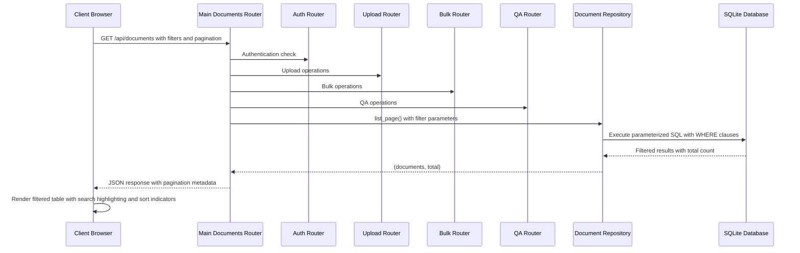

**Diagram sources**
- [app/api/documents.py:280-317](file://app/api/documents.py#L280-L317)
- [app/api/documents_auth.py:23-77](file://app/api/documents_auth.py#L23-L77)
- [app/api/documents_upload.py:169-288](file://app/api/documents_upload.py#L169-L288)
- [app/api/documents_bulk.py:46-224](file://app/api/documents_bulk.py#L46-L224)
- [app/api/documents_qa.py:26-91](file://app/api/documents_qa.py#L26-L91)
- [app/storage/document_repo.py:120-210](file://app/storage/document_repo.py#L120-L210)
- [app/api/deps.py:26-42](file://app/api/deps.py#L26-L42)

### Enhanced Database Operations

The server-side processing provides:

- **Parameterized Queries**: Prevents SQL injection with proper parameter binding
- **Dynamic WHERE Clauses**: Builds WHERE conditions based on provided filters
- **Efficient Counting**: Separate COUNT query for pagination metadata
- **Optimized Ordering**: Supports multiple sort fields with proper indexing
- **Pagination Calculation**: Accurate page count calculation with total items
- **Filter Validation**: Validates filter parameters before query execution

### Database Query Optimization

The enhanced query system provides:

- **Selective Column Loading**: Only loads required columns for performance
- **Index-Friendly Patterns**: Uses LIKE with leading wildcards carefully
- **Parameter Binding**: All user input is properly parameterized
- **Query Planning**: Optimizes query execution plans for common filter combinations
- **Memory Efficiency**: Streams results for large datasets

### Enhanced Status Tracking

The system now includes comprehensive status tracking with recently finished documents and centralized batch polling:

- **Recently Finished Tracking**: Tracks documents that completed or failed within the last 10 seconds
- **Batch Status Updates**: Centralized status updates for all active and recently finished documents
- **Deduplication Logic**: Prevents duplicate updates for documents that appear in both categories
- **Out-of-Band Swapping**: Efficient HTML replacement without full page reloads using OOB swapping
- **Automatic Polling Control**: Starts/stops polling based on active document count
- **Reduced Server Load**: Dramatically reduces server load compared to individual row polling

### Global Question-Answering Processing

The system now supports global knowledge base queries:

- **Global Retriever**: Uses standard retriever for knowledge base-wide searches
- **GLOBAL_EXPERTS_PROMPT**: Applies specialized system prompt for global queries
- **Streaming Responses**: Provides real-time token streaming for immediate feedback
- **Error Handling**: Graceful error recovery during streaming operations

### Unified Background Processing

The system now provides centralized background processing through the `_index_document_from_s3()` function:

- **Consolidated Operations**: Eliminates code duplication between upload and reindex operations
- **Centralized Error Handling**: Single point of failure handling for background tasks
- **Semaphore Protection**: Unified concurrency control for all background operations
- **Resource Management**: Consistent temporary file cleanup across all operations
- **Logging Consistency**: Standardized logging for all background processing
- **Format Support**: Handles DOCX, DOC, and XLSX formats uniformly

### Centralized Date Range Processing

The system now provides standardized date range handling through the `parse_date_range()` utility:

- **Consistent Parsing**: Standardized ISO date format parsing across all endpoints
- **Error Recovery**: Graceful handling of invalid date formats
- **Boundary Handling**: Proper date range boundary validation
- **Type Safety**: Returns proper datetime objects or None for missing values

### Centralized Template Context Management

The system now provides consistent template rendering through the `_document_table_context()` function:

- **Unified Context Building**: Standardized template context creation for all partials
- **Parameter Validation**: Consistent handling of all filter and sort parameters
- **Pagination Context**: Proper page, per_page, and total count handling
- **UI State Management**: Consistent filter and sort state persistence

### DOCX Integrity Validation

The system now includes comprehensive DOCX validation:

- **Zip File Validation**: Uses `_validate_docx_bytes()` to check for word/document.xml
- **Content Verification**: Ensures DOCX files contain valid Office Open XML structure
- **Error Handling**: Graceful handling of corrupted or invalid DOCX files
- **Logging**: Detailed logging for DOCX validation failures

### **Updated** Modular Router Architecture

The system now implements a revolutionary modular router architecture:

- **Router Composition**: Main `documents.py` router includes authentication, upload, bulk, and QA routers
- **Backward Compatibility**: All existing endpoints continue to work after modular refactoring
- **Specialized Routers**: Clear separation of concerns with dedicated routers for different functional areas
- **Enhanced Organization**: Better code organization and maintainability
- **Router Delegation**: Main router properly delegates to specialized routers
- **Helper Function Re-export**: Shared utilities and validation functions remain accessible
- **Unified Background Processing**: Centralized error handling and resource management
- **Enhanced Testing**: Modular structure enables better test isolation and coverage

### **Updated** HTMX Partial Response System

The system now implements revolutionary HTMX partial response capabilities:

- **OOB Swapping**: Out-of-band swapping for efficient HTML updates without full page reloads
- **Centralized Batch Polling**: Single endpoint '/partials/documents-status' manages all status updates
- **Automatic Polling Control**: Intelligent start/stop polling based on active document count
- **Deduplicated Updates**: Prevents duplicate HTML updates for overlapping documents
- **Server Load Reduction**: Dramatically reduces server load compared to individual row polling
- **Template Integration**: Seamless integration with document table and status poller templates
- **Real-time Status Monitoring**: Provides immediate status updates for processing documents

**Section sources**
- [app/api/documents.py:280-317](file://app/api/documents.py#L280-L317)
- [app/api/documents.py:228-275](file://app/api/documents.py#L228-L275)
- [app/storage/document_repo.py:120-210](file://app/storage/document_repo.py#L120-L210)
- [app/storage/document_repo.py:279-290](file://app/storage/document_repo.py#L279-L290)
- [app/api/documents_upload.py:119-167](file://app/api/documents_upload.py#L119-L167)
- [app/api/documents_bulk.py:114-162](file://app/api/documents_bulk.py#L114-L162)
- [app/api/deps.py:26-42](file://app/api/deps.py#L26-L42)
- [app/api/documents_helpers.py:82-112](file://app/api/documents_helpers.py#L82-L112)
- [app/api/documents_helpers.py:31-50](file://app/api/documents_helpers.py#L31-L50)

## Enhanced Status Display System

The system provides comprehensive visual status indicators for document tracking with enhanced concurrency awareness, real-time streaming capabilities, global question-answering support, centralized status management, and revolutionary HTMX partial response system:

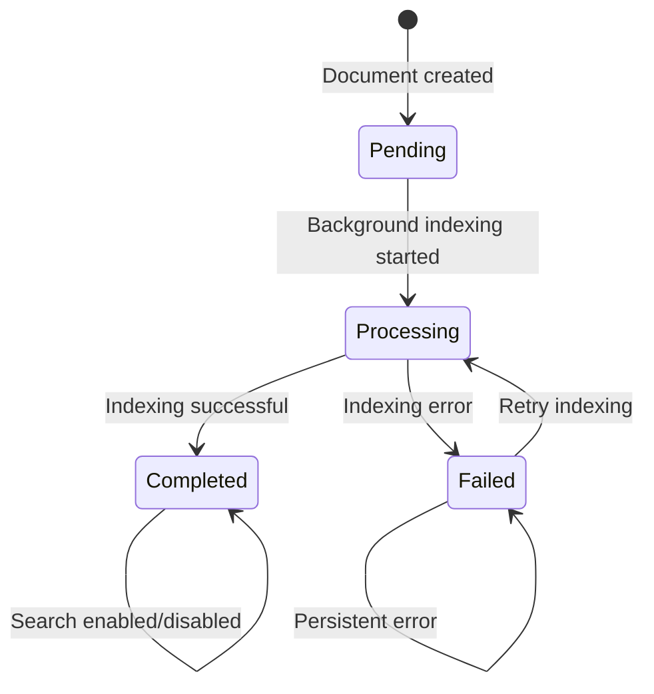

**Diagram sources**
- [templates/partials/document_row.html:19-41](file://templates/partials/document_row.html#L19-L41)
- [app/storage/models.py:11-18](file://app/storage/models.py#L11-L18)

### Status Badge Visual Indicators

The system displays four distinct status states with appropriate visual cues:

| Status | Visual Indicator | Icon | Color | Description |
|--------|------------------|------|-------|-------------|
| `pending` | Warning badge | ⏳ | Yellow | Document queued for processing |
| `processing` | Info badge | 🔁 | Blue | Background indexing in progress |
| `completed` | Success badge | ✅ | Green | Document successfully indexed |
| `failed` | Error badge | ❌ | Red | Indexing failed with error details |

### Status Interaction Elements

The status system includes interactive elements for document management:

- **Auto-refresh**: Processing documents automatically refresh every 3 seconds
- **Error tooltips**: Detailed error messages on hover for failed documents
- **Loading indicators**: Animated dots/spinner for pending/processing states
- **Checkbox control**: Toggle search participation for completed documents
- **Real-time streaming**: Immediate display of AI responses for document-specific and global questions
- **Global question availability**: "Ask Global Question" option appears for completed and search-enabled documents
- **Centralized Status Updates**: Batch status polling provides efficient status updates
- **Router Composition**: Modular router architecture maintains backward compatibility
- **OOB Swapping Updates**: Efficient HTML updates without full page reloads
- **Automatic Polling Control**: Intelligent start/stop polling based on document activity
- **Recently Finished Tracking**: Final status updates for documents completed within 10 seconds

### Status Filtering Capabilities

The frontend provides status-based filtering:

- **Status dropdown**: Filter documents by processing status
- **Visual labels**: Status-specific color coding
- **Client-side filtering**: Real-time filtering of visible documents
- **Combined filters**: Status filters work with search and type filters

### **Updated** Revolutionary Batch Status Polling Integration

The enhanced status system now includes centralized batch polling with recently finished documents tracking and OOB swapping:

- **Centralized Endpoint**: '/partials/documents-status' manages all active document updates
- **Recently Finished Tracking**: Documents that completed or failed within the last 10 seconds receive final status updates
- **Deduplicated Updates**: Prevents duplicate HTML updates for documents in both active and recently finished lists
- **Out-of-Band Swapping**: Efficient HTML replacement without full page reloads using OOB swapping
- **Automatic Polling Control**: Starts/stops polling based on active document count
- **Reduced Server Load**: Dramatically reduces server load compared to individual row polling
- **Unified Status Management**: Centralized status updates through batch processing
- **Router Architecture**: Modular router structure enables better organization and maintenance
- **Intelligent Polling Control**: Polling starts automatically when active documents are detected
- **Server Load Optimization**: Significant reduction in unnecessary server requests

### Document-Specific and Global Question Integration

The status system now supports both document-specific and global question functionality with real-time streaming:

- **Conditional Visibility**: "Ask Question" option appears only for completed and search-enabled documents
- **Global Question Option**: "Ask Global Question" option appears for completed and search-enabled documents
- **Modal Trigger**: Clicking either opens the respective modal with Alpine.js integration
- **Validation Integration**: Both question types inherit the same validation as general questions
- **Streaming Response**: Real-time token streaming provides immediate feedback during response generation
- **Prompt Application**: Document-specific questions use `DOCUMENT_EXPERTS_PROMPT`, global questions use `GLOBAL_EXPERTS_PROMPT`

**Section sources**
- [templates/partials/document_row.html:19-41](file://templates/partials/document_row.html#L19-L41)
- [templates/documents.html:74-87](file://templates/documents.html#L74-L87)
- [app/storage/models.py:11-18](file://app/storage/models.py#L11-L18)
- [app/api/documents.py:386-464](file://app/api/documents.py#L386-L464)
- [app/api/documents.py:228-275](file://app/api/documents.py#L228-L275)
- [app/api/documents_qa.py:26-91](file://app/api/documents_qa.py#L26-L91)
- [app/api/documents_helpers.py:82-112](file://app/api/documents_helpers.py#L82-L112)

## Advanced Pagination System

The system implements a comprehensive pagination system that enhances scalability and user experience when managing large document collections:

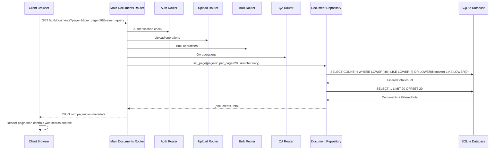

**Diagram sources**
- [app/api/documents.py:280-317](file://app/api/documents.py#L280-L317)
- [app/api/documents_auth.py:23-77](file://app/api/documents_auth.py#L23-L77)
- [app/api/documents_upload.py:169-288](file://app/api/documents_upload.py#L169-L288)
- [app/api/documents_bulk.py:46-224](file://app/api/documents_bulk.py#L46-L224)
- [app/api/documents_qa.py:26-91](file://app/api/documents_qa.py#L26-L91)
- [app/storage/document_repo.py:120-158](file://app/storage/document_repo.py#L120-L158)
- [app/api/deps.py:26-42](file://app/api/deps.py#L26-L42)

### Pagination Parameters

The pagination system supports the following parameters:

| Parameter | Type | Default | Description |
|-----------|------|---------|-------------|
| `page` | Integer | 1 | Current page number (1-indexed) |
| `per_page` | Integer | 10 | Number of items per page (10, 20, 50) |
| `search` | String | None | Search query for filtering documents |
| `date_from` | String | None | ISO date string for minimum creation date |
| `date_to` | String | None | ISO date string for maximum creation date |
| `status` | String | None | Filter by processing status |
| `source_type` | String | None | Filter by document type |
| `sort_field` | String | None | Field to sort by |
| `sort_dir` | String | None | Sort direction |

### Frontend Pagination Implementation

The frontend uses HTMX for dynamic pagination without full page reloads:

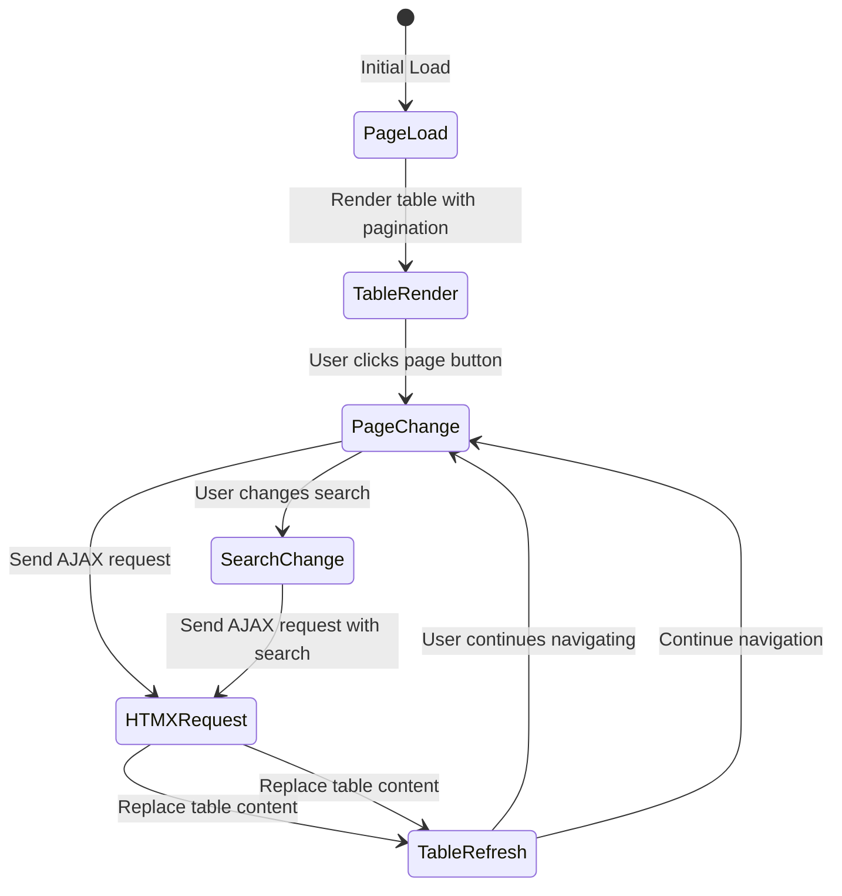

**Diagram sources**
- [templates/documents.html:35-41](file://templates/documents.html#L35-L41)
- [templates/partials/pagination.html:7-10](file://templates/partials/pagination.html#L7-L10)

### Pagination Controls

The system provides sophisticated pagination controls with intelligent page numbering:

- **Previous/Next Buttons**: Navigate between adjacent pages
- **Page Number Buttons**: Direct access to specific pages with ellipsis for large ranges
- **Dynamic Ellipsis**: Shows `1, 2, 3, ..., last` near the end, `1, ..., middle-1, middle, middle+1, ..., last` in the middle, and `1, 2, 3, 4, 5, ..., last` near the beginning
- **Active State Highlighting**: Current page button is visually distinct
- **Disabled States**: Previous button disabled on first page, next button disabled on last page
- **Search Context Preservation**: Pagination maintains search query across page changes
- **Centralized Date Handling**: Date filters use standardized parsing across all components

**Section sources**
- [app/api/documents.py:280-317](file://app/api/documents.py#L280-L317)
- [app/api/documents.py:228-275](file://app/api/documents.py#L228-L275)
- [app/storage/document_repo.py:120-158](file://app/storage/document_repo.py#L120-L158)
- [templates/partials/pagination.html:1-103](file://templates/partials/pagination.html#L1-L103)

## Bulk Operations System

The system provides comprehensive bulk operations for efficient document management at scale with enhanced concurrency control, centralized background processing, and revolutionary HTMX partial response system:

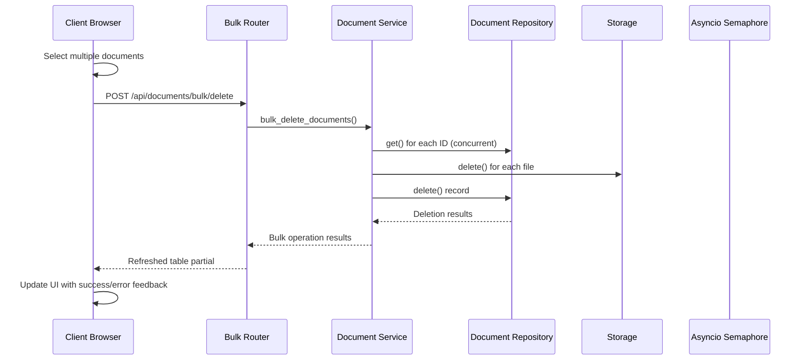

**Diagram sources**
- [app/api/documents_bulk.py:46-97](file://app/api/documents_bulk.py#L46-L97)
- [app/api/documents_bulk.py:99-174](file://app/api/documents_bulk.py#L99-L174)
- [app/api/documents_bulk.py:176-224](file://app/api/documents_bulk.py#L176-L224)
- [templates/documents.html:537-561](file://templates/documents.html#L537-L561)

### Bulk Operations Architecture

The bulk operations system provides three core capabilities with enhanced concurrency control, centralized background processing, and HTMX partial response integration:

#### Concurrent Document Fetching
- **Enhanced Performance**: Uses `asyncio.gather()` to fetch all documents concurrently
- **Error Collection**: Collects individual errors while continuing with remaining operations
- **Atomic Processing**: Processes all documents regardless of individual failures

#### Delete Operation
- **Endpoint**: `POST /api/documents/bulk/delete`
- **Request Body**: `{ ids: [string[]] }`
- **Behavior**: Deletes multiple documents atomically with error collection
- **Response**: Refreshed document table partial via HTMX
- **Error Handling**: Continues processing despite individual failures

#### Reindex Operation
- **Endpoint**: `POST /api/documents/bulk/reindex`
- **Request Body**: `{ ids: [string[]] }`
- **Behavior**: Initiates background reindexing for multiple documents with semaphore protection
- **Response**: Immediate acknowledgment with background processing
- **Error Handling**: Logs errors and continues with remaining documents
- **Concurrency Control**: Each reindex operation acquires semaphore before processing
- **Unified Processing**: Uses `_index_document_from_s3()` function for consistent background processing
- **Format Support**: Handles DOCX, DOC, and XLSX formats uniformly

#### Search Toggle Operation
- **Endpoint**: `PATCH /api/documents/bulk/search`
- **Request Body**: `{ ids: [string[]], enabled: boolean }`
- **Behavior**: Toggles search participation for multiple documents
- **Response**: Refreshed table partial with updated status
- **Error Handling**: Processes all documents regardless of individual failures

### Frontend Bulk Actions Toolbar

The modernized interface includes an interactive bulk actions toolbar:

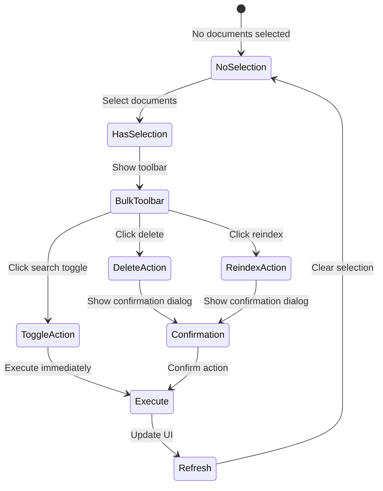

**Diagram sources**
- [templates/documents.html:135-186](file://templates/documents.html#L135-L186)
- [templates/documents.html:537-611](file://templates/documents.html#L537-L611)

### Bulk Action Features

The bulk operations provide comprehensive functionality:

- **Multi-selection**: Checkbox-based selection with "Select All" capability
- **Bulk Toolbar**: Persistent toolbar showing selected count and available actions
- **Confirmation Dialogs**: Prevent accidental bulk deletions
- **Real-time Feedback**: Toast notifications for operation results
- **Selection Persistence**: Maintains selections across pagination and filters
- **HTMX Integration**: Seamless partial updates without full page reloads
- **Centralized Processing**: Unified background processing through `_index_document_from_s3()`
- **Router Architecture**: Modular router structure enables better organization and maintenance
- **OOB Swapping Integration**: Efficient UI updates without full page reloads
- **Automatic Polling Control**: Intelligent start/stop polling for bulk operations

**Section sources**
- [app/api/documents_bulk.py:46-224](file://app/api/documents_bulk.py#L46-L224)
- [templates/documents.html:135-186](file://templates/documents.html#L135-L186)
- [templates/documents.html:537-611](file://templates/documents.html#L537-L611)

## Enhanced Date Range Filtering

The system implements sophisticated date range filtering with inclusive boundaries and ISO format support through the centralized `parse_date_range()` utility:

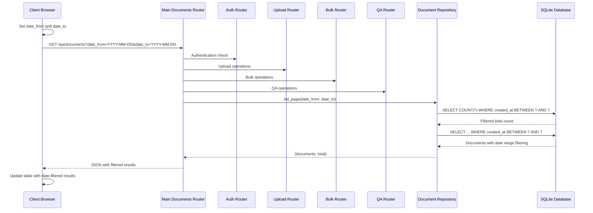

**Diagram sources**
- [app/api/documents.py:280-317](file://app/api/documents.py#L280-L317)
- [app/api/documents_auth.py:23-77](file://app/api/documents_auth.py#L23-L77)
- [app/api/documents_upload.py:169-288](file://app/api/documents_upload.py#L169-L288)
- [app/api/documents_bulk.py:46-224](file://app/api/documents_bulk.py#L46-L224)
- [app/api/documents_qa.py:26-91](file://app/api/documents_qa.py#L26-L91)
- [app/storage/document_repo.py:120-174](file://app/storage/document_repo.py#L120-L174)
- [app/api/deps.py:26-42](file://app/api/deps.py#L26-L42)

### Date Range Implementation Details

The date filtering system provides precise temporal control with centralized parsing:

- **ISO Format Parsing**: Uses `parse_date_range()` utility for consistent ISO date format handling
- **Inclusive Boundaries**: 
  - `date_from`: Documents created on or after this date
  - `date_to`: Documents created on or before this date (end of day)
- **Time Zone Handling**: Uses UTC for consistent filtering across time zones
- **Partial Date Support**: Either date can be specified independently
- **Validation**: Graceful handling of invalid date formats through centralized utility
- **Error Recovery**: Invalid dates are safely ignored, allowing other filters to work

### Date Filter UI Components

The enhanced frontend includes comprehensive date filtering:

- **Dropdown Interface**: Collapsible date filter panel with smooth animations
- **Two-Date Selection**: Separate inputs for start and end dates
- **Real-time Updates**: Automatic filtering on date input changes
- **Clear Functionality**: One-click clearing of date filters
- **Apply Button**: Explicit apply mechanism for complex workflows
- **URL Parameter Sync**: Date filters persist in URL for sharing and bookmarking
- **Responsive Design**: Mobile-friendly date picker interface

### Date Filter Parameters

The date filtering system supports:

| Parameter | Type | Description |
|-----------|------|-------------|
| `date_from` | String (ISO-8601) | Filter documents created on or after this date |
| `date_to` | String (ISO-8601) | Filter documents created on or before this date |

### Centralized Date Range Processing

The system now provides standardized date range handling:

- **Consistent Parsing**: All endpoints use `parse_date_range()` for date parameter processing
- **Error Recovery**: Invalid date formats are gracefully handled
- **Boundary Validation**: Proper date range boundary enforcement
- **Type Safety**: Returns proper datetime objects or None for missing values
- **Performance Optimization**: Centralized utility reduces code duplication

**Section sources**
- [app/api/documents.py:280-317](file://app/api/documents.py#L280-L317)
- [app/api/documents.py:228-275](file://app/api/documents.py#L228-L275)
- [app/storage/document_repo.py:120-174](file://app/storage/document_repo.py#L120-L174)
- [templates/documents.html:89-131](file://templates/documents.html#L89-L131)
- [templates/documents.html:489-494](file://templates/documents.html#L489-L494)
- [app/api/deps.py:26-42](file://app/api/deps.py#L26-L42)

## RAG Pipeline

The Retrieval-Augmented Generation pipeline processes documents through multiple stages with enhanced format support, concurrency control, streaming capabilities, global question-answering support, unified background processing, and revolutionary HTMX partial response system:

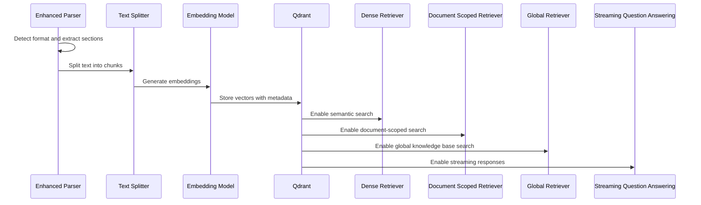

**Diagram sources**
- [app/rag/parser.py:54-83](file://app/rag/parser.py#L54-L83)
- [app/rag/indexer.py:49-72](file://app/rag/indexer.py#L49-L72)
- [app/rag/retriever.py:78-103](file://app/rag/retriever.py#L78-L103)
- [app/rag/retriever.py:105-136](file://app/rag/retriever.py#L105-L136)
- [app/domain/qa_service.py:161-201](file://app/domain/qa_service.py#L161-L201)
- [app/domain/qa_service.py:167-187](file://app/domain/qa_service.py#L167-L187)

### Document Chunking Strategy

The system employs intelligent chunking for optimal retrieval performance:

- **Chunk Size**: 500 characters with 50-character overlap
- **Splitting Strategy**: Hierarchical splitting by paragraphs, sentences, and words
- **Section Preservation**: Maintains semantic boundaries using heading-based sections for DOCX
- **Legacy Support**: Single-section processing for DOC files with filename-based sectioning
- **Spreadsheet Support**: Worksheet-based sectioning for XLSX files with row formatting
- **Metadata Enrichment**: Each chunk carries document ID, chunk ID, filename, and search enablement status

### Enhanced Format-Aware Processing

The enhanced pipeline handles all three document formats appropriately:

- **DOCX Processing**: Structured section extraction with heading preservation
- **DOC Processing**: Text extraction with single-section approach
- **XLSX Processing**: Worksheet extraction with row formatting and metadata preservation
- **Unified Output**: Consistent chunk structure for all formats
- **Metadata Consistency**: Same metadata schema regardless of source format
- **Context Preservation**: Worksheet names preserved as section information for XLSX

### Document-Scoped and Global Retrieval

The enhanced RAG pipeline now supports both document-specific and global retrieval with streaming capabilities:

- **Standard Retrieval**: Searches across all documents with search participation enabled
- **Document-Scoped Retrieval**: Filters results to a specific document's chunks only
- **Global Retrieval**: Searches across entire knowledge base for broad questions
- **Search Participation**: Respects individual document search enablement settings
- **Prompt Customization**: Uses `DOCUMENT_EXPERTS_PROMPT` for document-focused responses and `GLOBAL_EXPERTS_PROMPT` for global responses
- **Streaming Responses**: Provides real-time token streaming for immediate feedback
- **Error Handling**: Graceful error recovery during streaming operations

### Unified Background Processing

The RAG pipeline now benefits from centralized background processing:

- **Consolidated Indexing**: Unified `_index_document_from_s3()` function handles all indexing operations
- **Centralized Error Handling**: Standardized error recovery for all background tasks
- **Semaphore Protection**: Consistent concurrency control for all background operations
- **Resource Management**: Unified temporary file cleanup across all operations
- **Logging Consistency**: Standardized logging for all background processing activities
- **Format Support**: Handles DOCX, DOC, and XLSX formats uniformly

### **Updated** Modular Router Architecture Integration

The RAG pipeline now integrates with the revolutionary modular router architecture:

- **Router Composition**: Main router includes specialized routers for different functional areas
- **Backward Compatibility**: All existing endpoints continue to work after modular refactoring
- **OOB Swapping**: Efficient HTML updates for status monitoring without full page reloads
- **Automatic Polling Control**: Intelligent start/stop polling for processing documents
- **Deduplicated Updates**: Prevents duplicate updates for overlapping documents
- **Server Load Reduction**: Dramatically reduces server load for status monitoring
- **Real-time Status Updates**: Immediate status updates for processing documents
- **Template Integration**: Seamless integration with document table and status poller templates

**Section sources**
- [app/rag/parser.py:15-17](file://app/rag/parser.py#L15-L17)
- [app/rag/parser.py:54-83](file://app/rag/parser.py#L54-L83)
- [app/rag/indexer.py:23-46](file://app/rag/indexer.py#L23-L46)
- [app/rag/retriever.py:105-136](file://app/rag/retriever.py#L105-L136)
- [app/domain/qa_service.py:161-201](file://app/domain/qa_service.py#L161-L201)
- [app/domain/qa_service.py:167-187](file://app/domain/qa_service.py#L167-L187)
- [app/rag/prompts.py:21-56](file://app/rag/prompts.py#L21-L56)
- [app/api/documents_upload.py:119-167](file://app/api/documents_upload.py#L119-L167)
- [app/api/documents_bulk.py:114-162](file://app/api/documents_bulk.py#L114-L162)

## Document-Specific Question Answering

The system now provides document-specific question-answering capabilities that allow users to ask targeted questions about individual documents with real-time streaming feedback:

### Document-Specific API Endpoint

The new `/api/documents/{document_id}/ask` endpoint enables focused document queries with streaming responses:

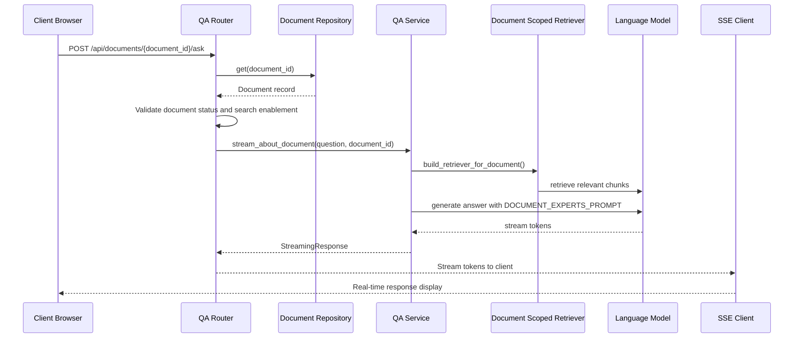

**Diagram sources**
- [app/api/documents_qa.py:55-91](file://app/api/documents_qa.py#L55-L91)
- [app/api/documents_qa.py:26-91](file://app/api/documents_qa.py#L26-L91)
- [app/domain/qa_service.py:117-151](file://app/domain/qa_service.py#L117-L151)
- [app/domain/qa_service.py:161-201](file://app/domain/qa_service.py#L161-L201)
- [app/rag/retriever.py:105-136](file://app/rag/retriever.py#L105-L136)

### Document Validation and Security

The system implements comprehensive validation for document-specific queries:

- **Document Existence**: Verifies document ID exists in the database
- **Processing Status**: Ensures document is in "completed" state
- **Search Participation**: Confirms document is enabled for search participation
- **Access Control**: Requires admin authentication for all document operations
- **Error Handling**: Provides clear error messages for validation failures

### Document-Scoped Retrieval Implementation

The document-specific retrieval system uses a specialized retriever with streaming capabilities:

- **Document Filtering**: Restricts search to chunks belonging to specific document
- **Search Participation**: Respects individual document search enablement settings
- **Prompt Customization**: Uses `DOCUMENT_EXPERTS_PROMPT` for focused responses
- **Context Limiting**: Limits context to the specific document's content
- **Streaming Response**: Returns token-by-token responses for immediate feedback
- **Answer Formatting**: Returns formatted, truncated responses for display

### Frontend Integration

The document-specific question-answering system integrates seamlessly with the existing interface:

- **Modal Trigger**: "Ask Question" option in document actions dropdown
- **Alpine.js State Management**: Reactive state for modal interactions
- **Form Validation**: Real-time validation for question submission
- **Loading States**: Visual feedback during question processing
- **Error Handling**: Comprehensive error display and user guidance
- **Answer Display**: Clean formatting for AI-generated responses
- **Keyboard Shortcuts**: Ctrl+Enter submission for efficient workflow
- **SSE Client**: JavaScript implementation for real-time token streaming
- **Buffer Management**: Efficient handling of streaming data chunks

### Prompt Engineering

The system uses a specialized prompt for document-focused responses:

- **Role Definition**: Positions the AI as an HR assistant focusing on specific documents
- **Context Limiting**: Restricts responses to the provided document context
- **Information Completeness**: Acknowledges when information is incomplete
- **General Guidance**: Allows general explanations when helpful for understanding
- **Compliance Focus**: Maintains HR compliance standards and confidentiality
- **Language Support**: Provides responses in Russian language

**Section sources**
- [app/api/documents_qa.py:55-91](file://app/api/documents_qa.py#L55-L91)
- [app/api/documents_qa.py:26-91](file://app/api/documents_qa.py#L26-L91)
- [app/domain/qa_service.py:117-151](file://app/domain/qa_service.py#L117-L151)
- [app/domain/qa_service.py:161-201](file://app/domain/qa_service.py#L161-L201)
- [app/rag/retriever.py:105-136](file://app/rag/retriever.py#L105-L136)
- [app/rag/prompts.py:21-37](file://app/rag/prompts.py#L21-L37)
- [templates/partials/document_row.html:125-134](file://templates/partials/document_row.html#L125-L134)
- [templates/documents.html:261-310](file://templates/documents.html#L261-L310)
- [templates/documents.html:663-707](file://templates/documents.html#L663-L707)
- [templates/documents.html:726-845](file://templates/documents.html#L726-L845)

## Global Question Answering

The system now provides comprehensive global question-answering capabilities that allow users to ask questions across the entire knowledge base with real-time streaming feedback:

### Global Question API Endpoint

The new `/api/qa/ask-global` endpoint enables knowledge base-wide queries with streaming responses:

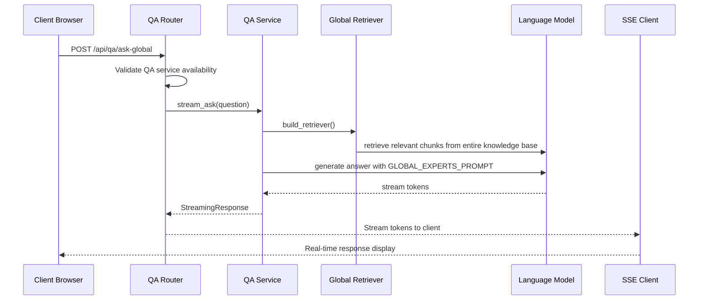

**Diagram sources**
- [app/api/documents_qa.py:26-91](file://app/api/documents_qa.py#L26-L91)
- [app/domain/qa_service.py:167-187](file://app/domain/qa_service.py#L167-L187)
- [app/rag/retriever.py:78-103](file://app/rag/retriever.py#L78-L103)
- [app/rag/prompts.py:40-56](file://app/rag/prompts.py#L40-L56)

### Global Retrieval Implementation

The global question-answering system uses a specialized retriever with streaming capabilities:

- **Knowledge Base Scope**: Searches across all documents with search participation enabled
- **Search Participation**: Respects individual document search enablement settings
- **Prompt Customization**: Uses `GLOBAL_EXPERTS_PROMPT` for knowledge base-wide responses
- **Context Synthesis**: Combines information from multiple documents for comprehensive answers
- **Streaming Response**: Returns token-by-token responses for immediate feedback
- **Answer Formatting**: Returns formatted, truncated responses for display

### Frontend Integration

The global question-answering system integrates seamlessly with the existing interface:

- **Modal Trigger**: "Ask Global Question" option in document actions dropdown
- **Alpine.js State Management**: Reactive state for modal interactions
- **Form Validation**: Real-time validation for question submission
- **Loading States**: Visual feedback during question processing
- **Error Handling**: Comprehensive error display and user guidance
- **Answer Display**: Clean formatting for AI-generated responses
- **Keyboard Shortcuts**: Ctrl+Enter submission for efficient workflow
- **SSE Client**: JavaScript implementation for real-time token streaming
- **Buffer Management**: Efficient handling of streaming data chunks

### Prompt Engineering

The system uses a specialized prompt for global knowledge base responses:

- **Role Definition**: Positions the AI as an HR assistant with comprehensive knowledge base access
- **Context Synthesis**: Combines information from all available documents
- **Information Completeness**: Acknowledges when information is incomplete across the knowledge base
- **Synthesis Focus**: Allows synthesis of information from multiple documents for comprehensive answers
- **Compliance Focus**: Maintains HR compliance standards and confidentiality
- **Language Support**: Provides responses in Russian language

### Global Question Modal

The global question modal provides a dedicated interface for knowledge base-wide queries:

- **Modal Design**: Separate modal from document-specific questions
- **Instructional Text**: Clarifies that questions are processed across entire knowledge base
- **State Management**: Alpine.js state for global question modal interactions
- **Streaming Integration**: Seamless integration with SSE streaming client
- **Error Handling**: Comprehensive error display and user guidance

**Section sources**
- [app/api/documents_qa.py:26-91](file://app/api/documents_qa.py#L26-L91)
- [app/domain/qa_service.py:167-187](file://app/domain/qa_service.py#L167-L187)
- [app/rag/retriever.py:78-103](file://app/rag/retriever.py#L78-L103)
- [app/rag/prompts.py:40-56](file://app/rag/prompts.py#L40-L56)
- [templates/documents.html:318-365](file://templates/documents.html#L318-L365)
- [templates/documents.html:766-845](file://templates/documents.html#L766-L845)

## Real-Time Streaming with Server-Sent Events

The system now provides real-time streaming capabilities for both document-specific and global question-answering using Server-Sent Events (SSE):

### SSE Implementation Architecture

The streaming system provides immediate feedback as AI responses are generated:

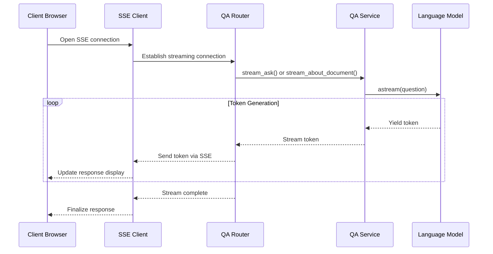

**Diagram sources**
- [app/api/documents_qa.py:55-91](file://app/api/documents_qa.py#L55-L91)
- [app/api/documents_qa.py:26-91](file://app/api/documents_qa.py#L26-L91)
- [app/domain/qa_service.py:161-201](file://app/domain/qa_service.py#L161-L201)
- [app/domain/qa_service.py:167-187](file://app/domain/qa_service.py#L167-L187)
- [templates/documents.html:806-845](file://templates/documents.html#L806-L845)
- [templates/documents.html:766-799](file://templates/documents.html#L766-L799)

### Streaming Response Handler

The API endpoints implement comprehensive streaming response handling:

- **StreamingResponse**: Uses FastAPI's StreamingResponse for SSE compatibility
- **Event Generator**: Asynchronous generator that yields SSE-formatted events
- **Token Escaping**: Properly escapes special characters for JSON serialization
- **Error Handling**: Graceful error recovery with error messages
- **Connection Management**: Maintains persistent connections until completion
- **Media Type**: Sets appropriate text/event-stream media type

### JavaScript SSE Client

The frontend implements robust SSE clients for real-time response handling:

- **Fetch API**: Uses modern fetch API with readable streams
- **Buffer Management**: Efficiently handles incoming data chunks
- **Line Processing**: Parses SSE events line by line
- **JSON Parsing**: Safely parses token data with error handling
- **Token Accumulation**: Builds complete response from streamed tokens
- **Error Recovery**: Handles network interruptions gracefully
- **Loading State Management**: Provides visual feedback during streaming

### Streaming Features

The streaming system provides comprehensive real-time capabilities:

- **Immediate Feedback**: Users see responses as they're generated
- **Token-by-Token Display**: Real-time token accumulation and display
- **Loading Indicators**: Visual feedback during response generation
- **Error Handling**: Graceful error recovery and user notification
- **Network Resilience**: Handles connection interruptions and reconnections
- **Memory Efficiency**: Efficient buffer management for large responses
- **Browser Compatibility**: Works across modern browsers with proper fallbacks

**Section sources**
- [app/api/documents_qa.py:55-91](file://app/api/documents_qa.py#L55-L91)
- [app/api/documents_qa.py:26-91](file://app/api/documents_qa.py#L26-L91)
- [app/domain/qa_service.py:161-201](file://app/domain/qa_service.py#L161-L201)
- [app/domain/qa_service.py:167-187](file://app/domain/qa_service.py#L167-L187)
- [templates/documents.html:806-845](file://templates/documents.html#L806-L845)
- [templates/documents.html:766-799](file://templates/documents.html#L766-L799)

## Enhanced File Download Handling

The system now provides enhanced file download handling with RFC 5987-compliant filename encoding for international character sets:

### RFC 5987 Filename Encoding

The download system implements proper international character support:

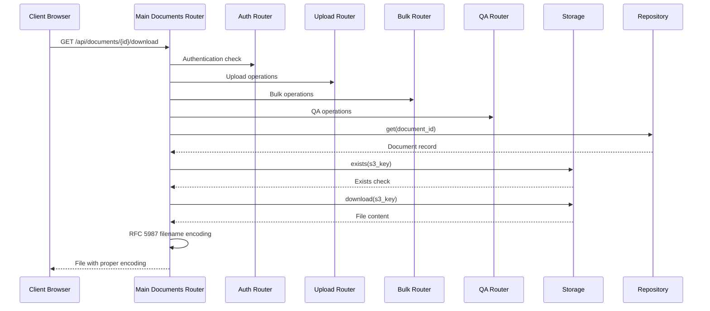

**Diagram sources**
- [app/api/documents.py:499-531](file://app/api/documents.py#L499-L531)
- [app/api/documents_auth.py:23-77](file://app/api/documents_auth.py#L23-L77)
- [app/api/documents_upload.py:169-288](file://app/api/documents_upload.py#L169-L288)
- [app/api/documents_bulk.py:46-224](file://app/api/documents_bulk.py#L46-L224)
- [app/api/documents_qa.py:26-91](file://app/api/documents_qa.py#L26-L91)

### Filename Encoding Implementation

The system implements comprehensive filename encoding for international character support:

- **Latin-1 Check**: Tests filename encoding for ASCII compatibility
- **ASCII Fallback**: Uses ASCII fallback for non-ASCII characters
- **UTF-8 Encoding**: Proper UTF-8 encoding for international characters
- **RFC 5987 Compliance**: Implements proper filename encoding standards
- **Browser Compatibility**: Ensures compatibility across different browsers
- **Content-Disposition Header**: Sets appropriate headers for file downloads

### Download Features

The enhanced download system provides:

- **International Character Support**: Proper handling of Cyrillic and other international characters
- **RFC 5987 Compliance**: Implements standards for filename encoding in HTTP headers
- **ASCII Fallback**: Provides fallback for browsers that don't support UTF-8 encoding
- **Proper MIME Types**: Maintains correct content-type headers
- **Error Handling**: Graceful handling of missing files and download failures
- **Security Validation**: Ensures only authorized users can download files

**Section sources**
- [app/api/documents.py:499-531](file://app/api/documents.py#L499-L531)

## Improved Document Status Tracking

The system now provides enhanced status tracking with recently finished documents functionality, centralized status management, and revolutionary HTMX partial response system:

### Recently Finished Documents Tracking

The status tracking system includes comprehensive recently finished documents functionality:

```mermaid
sequenceDiagram
participant Repo as Document Repository
participant DB as SQLite Database
participant StatusPoller as Status Poller
participant UI as User Interface
Repo->>DB : SELECT * FROM documents WHERE status IN ('completed', 'failed')
DB-->>Repo : Active documents
Repo->>DB : SELECT * FROM documents WHERE status IN ('completed', 'failed') AND updated_at >= ?
DB-->>Repo : Recently finished documents
StatusPoller->>UI : Update active documents
StatusPoller->>UI : Update recently finished documents
UI-->>User : Real-time status updates
```

**Diagram sources**
- [app/storage/document_repo.py:279-290](file://app/storage/document_repo.py#L279-L290)
- [app/api/documents.py:228-275](file://app/api/documents.py#L228-L275)

### Status Tracking Implementation

The enhanced status tracking system provides:

- **Recently Finished Tracking**: Tracks documents that completed or failed within the last 10 seconds
- **Batch Updates**: Centralized status updates for all active and recently finished documents
- **Deduplication Logic**: Prevents duplicate updates for documents that appear in both categories
- **Out-of-Band Swapping**: Efficient HTML replacement without full page reloads using OOB swapping
- **Automatic Polling Control**: Starts/stops polling based on active document count
- **Reduced Server Load**: Dramatically reduces server load compared to individual row polling

### **Updated** Revolutionary Batch Status Polling System

The enhanced status tracking system now includes revolutionary batch polling capabilities:

- **Centralized Endpoint**: '/partials/documents-status' manages all status updates
- **Active Document Tracking**: Monitors pending and processing documents
- **Recently Finished Tracking**: Provides final status updates for recently completed documents
- **Deduplicated Updates**: Prevents duplicate HTML updates for overlapping documents
- **Poller Management**: Automatically starts/stops polling based on document activity
- **Performance Optimization**: Reduces server load by eliminating N concurrent requests
- **Unified Status Management**: Centralized status updates through batch processing
- **Router Architecture**: Modular router structure enables better organization and maintenance
- **OOB Swapping Integration**: Efficient HTML updates without full page reloads
- **Intelligent Polling Control**: Automatic start/stop based on document activity
- **Server Load Reduction**: Dramatic improvement in system performance

### Status Poller Template Integration

The system now includes a dedicated status poller template for efficient status monitoring:

- **Automatic Activation**: Polling starts automatically when active documents are detected
- **Template-Based Management**: Uses Jinja2 template for consistent poller rendering
- **HTMX Integration**: Seamlessly integrates with HTMX for real-time updates
- **OOB Swapping Support**: Compatible with out-of-band swapping for efficient updates
- **Deduplication Logic**: Prevents duplicate updates through intelligent document tracking

**Section sources**
- [app/storage/document_repo.py:279-290](file://app/storage/document_repo.py#L279-L290)
- [app/api/documents.py:228-275](file://app/api/documents.py#L228-L275)
- [templates/partials/status_poller.html:1-13](file://templates/partials/status_poller.html#L1-L13)

## VK Bot Integration

The system includes a comprehensive VK social network bot for HR assistance:

```mermaid
stateDiagram-v2
[*] --> Start : User sends message
Start --> Menu : Show main menu
Menu --> Ask : User asks HR question
Menu --> Request : User submits HR request
Menu --> Help : User needs help
Menu --> [*] : User exits
Ask --> Processing : Parse question
Processing --> Answer : Retrieve answer
Answer --> Menu : Return to menu
Request --> Processing : Validate request
Processing --> Confirmation : Submit request
Confirmation --> Menu : Return to menu
Help --> Info : Show help text
Info --> Menu : Return to menu
```

**Diagram sources**
- [app/integrations/vk/states.py](file://app/integrations/vk/states.py)
- [app/integrations/vk/bot.py](file://app/integrations/vk/bot.py)

### Bot Handler Architecture

The VK bot uses a handler-based architecture for different interaction modes:

| Handler | Purpose | Features |
|---------|---------|----------|
| `start.py` | Welcome and initial greeting | Bot introduction, basic commands |
| `ask.py` | HR question answering | RAG-powered Q&A, context awareness |
| `hr_request.py` | Formal HR requests | Structured request forms, approval flow |
| `hire.py` | Hiring process | Candidate screening, interview scheduling |
| `fire.py` | Termination process | Exit procedures, final settlement |
| `pay.py` | Payroll inquiries | Salary calculations, payment history |
| `vacation.py` | Leave management | Vacation requests, balance tracking |

**Section sources**
- [app/integrations/vk/handlers/start.py](file://app/integrations/vk/handlers/start.py)
- [app/integrations/vk/handlers/ask.py](file://app/integrations/vk/handlers/ask.py)
- [app/integrations/vk/handlers/hr_request.py](file://app/integrations/vk/handlers/hr_request.py)

## Storage Layer

The storage architecture provides a robust foundation for document management with enhanced search, pagination, date filtering, status tracking, global question-answering support, and revolutionary HTMX partial response system:

```mermaid
erDiagram
DOCUMENTS {
integer id PK
string document_id UK
string filename
string title
string s3_key
string mime_type
integer size_bytes
string status
boolean is_search_enabled
string error
datetime created_at
datetime updated_at
datetime indexed_at
integer chunk_count
}
DOCUMENTS ||--o{ VECTORS : contains
DOCUMENTS ||--o{ FILES : stored_in
```

**Diagram sources**
- [app/storage/models.py:20-37](file://app/storage/models.py#L20-L37)
- [app/storage/document_repo.py:14-49](file://app/storage/document_repo.py#L14-L49)
- [app/storage/database.py:12-29](file://app/storage/database.py#L12-L29)

### Database Schema Design

The SQLite schema supports comprehensive document tracking with:

- **Primary Keys**: Auto-incremented integer ID and UUID-based document ID
- **Status Tracking**: Four-state processing pipeline (pending → processing → completed/failed)
- **Search Optimization**: Dedicated search enablement flag for vector filtering
- **Audit Trail**: Creation and modification timestamps for all records
- **Performance Metrics**: Chunk count and indexing timestamps for monitoring
- **Pagination Support**: Efficient ordering by ID for pagination queries
- **Search Indexing**: Case-insensitive search columns for optimal query performance
- **Date Filtering**: Precise timestamp fields for temporal queries
- **Format Support**: MIME type tracking for DOC, DOCX, and XLSX formats
- **Recently Finished Tracking**: Timestamp-based tracking for status updates
- **Global Question Support**: Knowledge base-wide search participation
- **Router Architecture**: Modular router structure enables better organization and maintenance
- **OOB Swapping Support**: Enhanced tracking for HTMX partial response system
- **Automatic Polling Control**: Status tracking for intelligent polling management
- **Deduplication Logic**: Prevention of duplicate updates for overlapping documents

**Updated** The database now tracks MIME types for DOC, DOCX, and XLSX formats, enabling precise format identification and filtering. The `is_search_enabled` column provides granular control over document inclusion in search results regardless of format type. The `created_at` field supports precise date range filtering with inclusive boundaries. The enhanced user interface styling is reflected in the table container design with rounded corners and sophisticated background treatments. The new document-specific question-answering feature relies on the existing database structure for document validation and status checking. The `list_recently_finished` method provides efficient tracking of documents that completed or failed within the last 10 seconds for status updates. The global question-answering capability leverages the same search enablement mechanism for knowledge base-wide queries. The revolutionary HTMX partial response system now includes enhanced tracking capabilities for OOB swapping, automatic polling control, and deduplication logic to prevent duplicate updates.

**Section sources**
- [app/storage/models.py:11-37](file://app/storage/models.py#L11-L37)
- [app/storage/document_repo.py:63-214](file://app/storage/document_repo.py#L63-L214)
- [app/storage/database.py:12-29](file://app/storage/database.py#L12-L29)

## API Endpoints

The system provides a comprehensive REST API for document management with full search, pagination, bulk operation, streaming response, enhanced status tracking, global question-answering support, unified background processing, and revolutionary HTMX partial response system:

### Authentication and Authorization

| Endpoint | Method | Description | Authentication |
|----------|--------|-------------|----------------|
| `/login` | GET/POST | Admin login form and authentication | None |
| `/logout` | GET | Clear admin session | Admin cookie |
| `/` | GET | Redirect based on authentication | Admin cookie |

### Document Management API

| Endpoint | Method | Description | Authentication |
|----------|--------|-------------|----------------|
| `/api/documents/upload` | POST | Upload multiple DOC/DOCX/XLSX files | Admin cookie |
| `/api/documents` | GET | List all documents with search, pagination, and date filtering | Admin cookie |
| `/api/documents/{id}` | GET/PATCH/DELETE | Document operations | Admin cookie |
| `/api/documents/{id}/title` | PATCH | Update document title | Admin cookie |
| `/api/documents/{id}/search` | PATCH | Toggle search participation | Admin cookie |
| `/api/documents/{id}/reindex` | POST | Re-index document | Admin cookie |
| `/api/documents/{id}/download` | GET | Download original file with RFC 5987 encoding | Admin cookie |
| `/api/documents/{document_id}/ask` | POST | Ask question about specific document with streaming | Admin cookie |

### Global Question-Answering API

| Endpoint | Method | Description | Authentication |
|----------|--------|-------------|----------------|
| `/api/qa/ask-global` | POST | Ask question across entire knowledge base with streaming | Admin cookie |

### Bulk Operations API

| Endpoint | Method | Description | Authentication |
|----------|--------|-------------|----------------|
| `/api/documents/bulk/delete` | POST | Delete multiple documents with concurrent fetching | Admin cookie |
| `/api/documents/bulk/reindex` | POST | Re-index multiple documents with semaphore protection | Admin cookie |
| `/api/documents/bulk/search` | PATCH | Toggle search participation for multiple documents | Admin cookie |

### **Updated** Modular Router Architecture Endpoints

**Updated** All endpoints now operate within the modular router architecture with router composition maintaining backward compatibility:

- **Router Composition**: Main `documents.py` router includes authentication, upload, bulk, and QA routers
- **Backward Compatibility**: All existing endpoints continue to work after modular refactoring
- **Specialized Routers**: Clear separation of concerns with dedicated routers for different functional areas
- **Enhanced Organization**: Better code organization and maintainability
- **Router Delegation**: Main router properly delegates to specialized routers
- **Helper Function Re-export**: Shared utilities and validation functions remain accessible

### **Updated** Enhanced HTMX Partial Endpoints

| Endpoint | Method | Description |
|----------|--------|-------------|
| `/partials/document-table` | GET | Dynamic table content with search, pagination, and date filtering |
| `/partials/document-row/{id}` | GET | Individual row updates with status refresh |
| `/partials/document-status/{id}` | GET | Status badge refresh for individual documents |
| `/partials/documents-status` | GET | **Updated** Centralized batch status updates for all active and recently finished documents with OOB swapping |

### Streaming Response Endpoints

| Endpoint | Method | Description | Streaming |
|----------|--------|-------------|-----------|
| `/api/documents/{document_id}/ask` | POST | Document-specific question with real-time streaming | Yes |
| `/api/qa/ask-global` | POST | Global knowledge base question with real-time streaming | Yes |

### Search and Pagination Parameters

All list endpoints support the following parameters:

- **`page`**: Current page number (default: 1)
- **`per_page`**: Items per page (default: 10, options: 10, 20, 50)
- **`search`**: Search query for filtering documents by title or filename
- **`date_from`**: ISO date string for minimum creation date (inclusive)
- **`date_to`**: ISO date string for maximum creation date (inclusive)
- **`status`**: Filter by processing status (all, completed, processing, pending, failed)
- **`source_type`**: Filter by document type (all, docx, doc, xlsx, other)
- **`sort_field`**: Field to sort by (title, created_at, status)
- **`sort_dir`**: Sort direction (asc, desc)

### **Updated** Enhanced HTMX Partial Response Endpoints

**Updated** All endpoints now support comprehensive search functionality with case-insensitive pattern matching against document titles and filenames. The main `/api/documents` endpoint returns detailed pagination metadata including total count, current page, items per page, and total pages. Bulk operations endpoints provide atomic operations on multiple documents with comprehensive error handling and HTMX partial responses for seamless user experience. Background indexing operations are now handled by the unified `_index_document_from_s3()` function, which eliminates code duplication and provides centralized error handling. The enhanced download functionality now includes RFC 5987-compliant filename encoding for proper international character support across different browsers and systems. The new `/partials/documents-status` endpoint provides centralized batch status updates with revolutionary OOB swapping capabilities, dramatically reducing server load by eliminating N concurrent requests for individual row polling. The new `/api/documents/{document_id}/ask` endpoint enables document-specific question-answering with comprehensive validation, security checks, and real-time streaming responses. The new `/api/qa/ask-global` endpoint enables global knowledge base question-answering with comprehensive validation, security checks, and real-time streaming responses. The centralized `parse_date_range()` utility ensures consistent date parameter handling across all endpoints, while the `_document_table_context()` function provides standardized template context management for all partials. The new DOCX integrity validation using `_validate_docx_bytes()` function ensures file content validity before processing. The revolutionary HTMX partial response system now includes proper OOB swapping for dynamic document row updates, automatic polling control that starts/stops based on active document count, and centralized batch status updates through the new '/partials/documents-status' endpoint.

**Section sources**
- [app/api/documents.py:1-531](file://app/api/documents.py#L1-L531)
- [app/api/documents_auth.py:1-77](file://app/api/documents_auth.py#L1-L77)
- [app/api/documents_upload.py:1-288](file://app/api/documents_upload.py#L1-L288)
- [app/api/documents_bulk.py:1-224](file://app/api/documents_bulk.py#L1-L224)
- [app/api/documents_qa.py:1-91](file://app/api/documents_qa.py#L1-L91)
- [app/api/deps.py:54-74](file://app/api/deps.py#L54-L74)

## Configuration Management

The system uses Pydantic Settings for centralized configuration with enhanced concurrency control:

```mermaid
classDiagram
class Settings {
+string vk_access_token
+int vk_group_id
+string qdrant_url
+string qdrant_api_key
+string qdrant_collection
+string llm_provider
+string llm_model
+string llm_base_url
+string embedding_model
+string db_path
+string s3_endpoint_url
+string s3_access_key
+string s3_secret_key
+string s3_bucket
+string admin_api_key
+int max_concurrent_indexing
+int chunk_size
+int chunk_overlap
}
class Environment {
+string env_file
+string env_file_encoding
}
Settings --> Environment : inherits
```

**Diagram sources**
- [app/config.py:4-39](file://app/config.py#L4-L39)

### Configuration Categories

| Category | Key | Default Value | Purpose |
|----------|-----|---------------|---------|
| **VK Integration** | `vk_access_token` | Empty string | Bot authentication |
| **Vector Database** | `qdrant_url` | `http://localhost:6333` | Qdrant connection |
| **LLM Provider** | `llm_provider` | `ollama` | AI model provider |
| **Storage** | `db_path` | `data/cafetera.db` | SQLite database location |
| **Admin Security** | `admin_api_key` | Empty string | Administrative access |
| **Concurrency Control** | `max_concurrent_indexing` | `2` | Semaphore limit for indexing |
| **Chunking** | `chunk_size` | `500` | Token-based chunk size |
| **Chunking** | `chunk_overlap` | `50` | Token-based chunk overlap |
| **Router Architecture** | `max_concurrent_indexing` | `2` | Semaphore limit for modular router operations |
| **HTMX Configuration** | `max_concurrent_indexing` | `2` | Semaphore limit for HTMX partial responses |
| **OOB Swapping** | `max_concurrent_indexing` | `2` | Semaphore limit for OOB swapping operations |
| **Polling Control** | `max_concurrent_indexing` | `2` | Semaphore limit for automatic polling control |

**Section sources**
- [app/config.py:1-39](file://app/config.py#L1-L39)

## Enhanced Error Handling and Consistency

The system implements comprehensive error handling with atomic consistency guarantees, centralized background processing, and revolutionary HTMX partial response system:

### Atomic State Updates

The document service ensures atomic state updates:

```mermaid
sequenceDiagram
participant Service as DocumentService
participant Qdrant as Qdrant
participant Repo as Repository
Service->>Repo : update(status=processing, error=None)
Service->>Qdrant : set_search_enabled(enabled)
Qdrant-->>Service : success/failure
Service->>Repo : update(status=completed/failed, error=message)
```

**Diagram sources**
- [app/domain/document_service.py:147-181](file://app/domain/document_service.py#L147-L181)
- [app/domain/document_service.py:184-234](file://app/domain/document_service.py#L184-L234)

### Error Handling Strategies

The system implements multiple error handling strategies:

- **Consistency First**: Qdrant updates occur before repository updates
- **Rollback Protection**: Failed Qdrant operations prevent inconsistent state
- **Detailed Logging**: Comprehensive error logging with stack traces
- **Graceful Degradation**: Operations continue despite individual failures
- **Atomic Transactions**: Critical sections maintain consistency

### Background Task Error Recovery

Background tasks implement robust error recovery through the unified `_index_document_from_s3()` function:

- **Exception Handling**: All exceptions are caught and logged centrally
- **State Cleanup**: Temporary files are cleaned up even on failure
- **Error Propagation**: Errors are logged but don't crash the system
- **Resource Management**: Proper cleanup of temporary resources
- **Centralized Logging**: Standardized error logging for all background operations
- **Format Support**: Handles DOCX, DOC, and XLSX formats with appropriate validation

### Document-Specific and Global Question Error Handling

The document-specific and global question-answering systems implement comprehensive error handling:

- **Document Validation**: Checks for document existence and status
- **Search Enablement**: Verifies document participation in search
- **QA Service Initialization**: Handles cases where QA service is not available
- **Retriever Construction**: Manages document-scoped and global retriever creation failures
- **LLM Processing**: Catches and handles LLM runtime errors
- **Streaming Response**: Handles network interruptions and SSE connection failures
- **Response Formatting**: Ensures proper response formatting and truncation

### Streaming Response Error Handling

The streaming response system implements comprehensive error handling:

- **Connection Management**: Handles network interruptions gracefully
- **Token Streaming**: Manages token-by-token response delivery
- **Buffer Management**: Efficiently handles streaming data chunks
- **Error Recovery**: Provides fallback responses for streaming failures
- **Loading States**: Manages visual feedback during streaming operations

### Unified Background Processing Error Handling

The unified `_index_document_from_s3()` function provides centralized error handling:

- **Consolidated Error Logging**: Standardized error logging across all operations
- **Resource Cleanup**: Ensures temporary files are cleaned up on failure
- **Semaphore Release**: Guarantees semaphore release even on errors
- **State Management**: Maintains consistent document state during failures
- **Logging Consistency**: Standardized logging format for all background operations
- **Format Validation**: Validates DOCX integrity and handles XLSX processing errors

### **Updated** Modular Router Architecture Error Handling

The revolutionary modular router architecture implements comprehensive error handling:

- **Router Composition Errors**: Handles cases where router delegation fails
- **Backward Compatibility Errors**: Manages errors in maintaining backward compatibility
- **Specialized Router Errors**: Handles errors in authentication, upload, bulk, and QA routers
- **Helper Function Errors**: Manages errors in shared utilities and validation functions
- **Router Delegation Errors**: Handles cases where main router fails to delegate properly
- **Error Propagation**: Ensures errors propagate correctly through router hierarchy
- **Logging Consistency**: Standardized error logging across all router modules

### **Updated** HTMX Partial Response Error Handling

The revolutionary HTMX partial response system implements comprehensive error handling:

- **OOB Swapping Errors**: Handles cases where OOB swapping fails or targets are not found
- **Polling Control Errors**: Manages automatic polling activation/deactivation failures
- **Template Rendering Errors**: Handles template context errors and missing parameters
- **Server Load Management**: Monitors and manages server load during high-traffic scenarios
- **Deduplication Logic Errors**: Manages edge cases in document deduplication
- **Template Integration Errors**: Handles integration errors between templates and partial responses
- **Router Architecture Errors**: Handles errors in modular router structure
- **OOB Swapping Error Recovery**: Graceful handling of OOB swapping failures
- **Polling Control Error Recovery**: Automatic recovery from polling control failures
- **Server Load Error Recovery**: Graceful degradation under high server load

### Centralized Date Range Error Handling

The `parse_date_range()` utility provides consistent error handling:

- **Graceful Error Recovery**: Invalid dates are safely ignored
- **Type Safety**: Returns proper datetime objects or None
- **Boundary Validation**: Ensures proper date range boundaries
- **Consistent Behavior**: Standardized error handling across all endpoints

### Centralized Template Context Error Handling

The `_document_table_context()` function provides consistent context management:

- **Parameter Validation**: Validates all filter and sort parameters
- **Type Safety**: Ensures proper parameter types in context
- **Missing Value Handling**: Provides sensible defaults for missing parameters
- **Consistent Rendering**: Standardized template context across all partials

### DOCX Integrity Validation Error Handling

The `_validate_docx_bytes()` function provides comprehensive DOCX validation:

- **Zip File Validation**: Checks for valid DOCX structure using word/document.xml
- **BadZipFile Handling**: Graceful handling of corrupted ZIP archives
- **Logging**: Detailed logging for DOCX validation failures
- **Error Propagation**: Invalid DOCX files are rejected with clear error messages

### **Updated** Recently Finished Documents Error Handling

The recently finished documents tracking system implements comprehensive error handling:

- **Database Query Errors**: Handles database connection and query failures
- **Timestamp Validation**: Validates timestamp calculations and boundary handling
- **Deduplication Logic Errors**: Manages edge cases in document deduplication
- **Template Integration Errors**: Handles template rendering errors for status updates
- **Router Architecture Errors**: Handles errors in modular router structure
- **Database Query Error Recovery**: Graceful handling of database connection failures
- **Timestamp Error Recovery**: Validation and correction of timestamp calculations
- **Deduplication Logic Error Recovery**: Edge case handling for document deduplication

**Section sources**
- [app/domain/document_service.py:84-133](file://app/domain/document_service.py#L84-L133)
- [app/domain/document_service.py:147-181](file://app/domain/document_service.py#L147-L181)
- [app/domain/document_service.py:184-234](file://app/domain/document_service.py#L184-L234)
- [app/api/documents_qa.py:55-91](file://app/api/documents_qa.py#L55-L91)
- [app/api/documents_qa.py:26-91](file://app/api/documents_qa.py#L26-L91)
- [app/domain/qa_service.py:117-151](file://app/domain/qa_service.py#L117-L151)
- [app/domain/qa_service.py:161-201](file://app/domain/qa_service.py#L161-L201)
- [app/domain/qa_service.py:167-187](file://app/domain/qa_service.py#L167-L187)
- [app/api/documents_upload.py:119-167](file://app/api/documents_upload.py#L119-L167)
- [app/api/documents_bulk.py:114-162](file://app/api/documents_bulk.py#L114-L162)
- [app/api/deps.py:26-42](file://app/api/deps.py#L26-L42)
- [app/api/documents_helpers.py:82-112](file://app/api/documents_helpers.py#L82-L112)
- [app/api/documents_helpers.py:31-50](file://app/api/documents_helpers.py#L31-L50)

## Deployment and Operations

### Docker Compose Configuration

The system supports containerized deployment with the following services:

```mermaid
graph LR
subgraph "Application Services"
Web[FastAPI Web App]
Bot[VK Bot Worker]
Poller[Message Poller]
Streaming[Streaming Service]
HTMXEngine[HTMX Engine]
EndUserIntegration[Enhanced User Integration]
RouterArchitecture[Modular Router Architecture]
EndUserExperience[Enhanced Experience]
end
subgraph "Data Services"
DB[(SQLite Database with Auto-Increment)]
MinIO[(MinIO Storage)]
Qdrant[(Qdrant Vector DB)]
EndUserMonitoring[Enhanced Monitoring]
end
subgraph "AI Services"
Ollama[Ollama LLM]
EndUserExperience[Enhanced Experience]
end
Web --> DB
Web --> MinIO
Web --> Qdrant
Bot --> Web
Poller --> Bot
Web --> Ollama
Streaming --> Web
HTMXEngine --> Web
EndUserIntegration --> HTMXEngine
RouterArchitecture --> Web
EndUserMonitoring --> DB
EndUserExperience --> HTMXEngine
EndUserExperience --> RouterArchitecture
```

### Environment Setup

Required environment variables:
- `ADMIN_API_KEY`: Secret key for administrative access
- `S3_ENDPOINT_URL`: Storage service endpoint
- `S3_ACCESS_KEY`/`S3_SECRET_KEY`: Storage credentials
- `QDRANT_URL`: Vector database connection
- `OLLAMA_BASE_URL`: LLM service endpoint
- `MAX_CONCURRENT_INDEXING`: Semaphore limit for concurrency control
- `CHUNK_SIZE`: Token-based chunk size for text processing
- `CHUNK_OVERLAP`: Token-based chunk overlap for context preservation
- **Router Architecture**: `MAX_CONCURRENT_INDEXING` for modular router operations
- **HTMX Configuration**: `MAX_CONCURRENT_INDEXING` for HTMX partial responses
- **OOB Swapping**: `MAX_CONCURRENT_INDEXING` for OOB swapping operations
- **Polling Control**: `MAX_CONCURRENT_INDEXING` for automatic polling control

**Updated** The deployment configuration now supports the enhanced user interface styling with proper rounded corner rendering, sophisticated background treatments, and improved visual hierarchy. The system provides configurable concurrency limits through environment variables and includes comprehensive logging for monitoring and debugging purposes. The enhanced UI styling requires proper CSS framework integration and responsive design considerations. The revolutionary HTMX partial response system with OOB swapping reduces server load and improves performance, making the deployment more scalable and efficient. The document-specific and global question-answering features with streaming capabilities require proper LLM provider configuration and vector database setup for optimal performance. The enhanced download functionality with RFC 5987 encoding requires proper browser compatibility testing and international character support validation. The global question-answering capability requires proper knowledge base population and search enablement configuration. The unified `_index_document_from_s3()` function requires proper semaphore configuration for optimal background processing performance. The centralized `parse_date_range()` utility requires proper date format validation for consistent date parameter handling. The `_document_table_context()` function requires proper template context validation for consistent UI rendering. The new DOCX integrity validation function requires proper ZIP file handling and validation for DOCX file processing. The revolutionary batch status polling system requires proper HTMX engine configuration and OOB swapping support for optimal performance. The automatic polling control system requires proper server load monitoring and resource management for efficient operation. The recently finished documents tracking system requires proper database configuration and query optimization for reliable status updates. The modular router architecture requires proper router composition and dependency injection for optimal performance.

**Section sources**
- [docker-compose.yml](file://docker-compose.yml)

## Troubleshooting Guide

### Common Issues and Solutions

| Issue | Symptoms | Solution |
|-------|----------|----------|
| **Document Upload Fails** | 400 errors on upload | Check file size limit (10MB), supported formats (.docx, .doc, .xlsx) |
| **Vector Indexing Errors** | Documents show "failed" status | Verify Qdrant connectivity, embedding model availability, check semaphore limits |
| **S3 Storage Issues** | Files not accessible | Confirm bucket existence, credentials, network connectivity |
| **Admin Authentication Problems** | 403 Forbidden errors | Verify `admin_api_key` matches cookie value |
| **Bot Not Responding** | VK messages ignored | Check VK access token, webhook configuration |
| **Search Not Working** | No results for valid queries | Verify database search columns, case-insensitive matching |
| **Status Display Issues** | Wrong status icons or no refresh | Check HTMX configuration, JavaScript console errors |
| **Pagination Problems** | Incorrect page counts or empty results | Verify database auto-increment setup, check pagination parameters |
| **Bulk Operations Fail** | Partial bulk operation success | Check individual document IDs, verify file existence in storage, review concurrency limits |
| **Date Filter Issues** | Incorrect date range results | Verify ISO date format (YYYY-MM-DD), check timezone handling |
| **Format Detection Problems** | Unsupported format errors | Verify file extension and MIME type, check format-specific parsers |
| **Frontend Not Updating** | UI not reflecting changes | Check HTMX configuration, verify partial endpoint responses |
| **Concurrency Issues** | Background tasks failing or delayed | Check `MAX_CONCURRENT_INDEXING` setting, verify semaphore configuration |
| **Memory Leaks** | Increasing memory usage | Monitor background task cleanup, check temporary file handling |
| **Rounded Corner Rendering Issues** | Poor visual appearance | Verify CSS framework integration, check Tailwind configuration |
| **Background Styling Problems** | Inconsistent visual treatment | Check color scheme configuration, verify daisyUI theme settings |
| **Enhanced UI Not Loading** | Missing modern styling | Verify static asset serving, check CSS file paths |
| **Filtering Not Working** | Filters not applying | Check server-side filter implementation, verify parameter passing |
| **Sorting Issues** | Wrong sort order or direction | Verify sort field validation, check database ordering |
| **Mobile Sidebar Not Working** | Overlay sidebar not appearing | Check Alpine.js configuration, verify mobile breakpoint |
| **Toast Notifications Not Showing** | No toast messages | Verify toast manager initialization, check custom event handling |
| **Router Architecture Issues** | Endpoints not working after refactoring | Check router composition, verify backward compatibility |
| **Authentication Router Issues** | Login/logout not working | Verify authentication router configuration, check cookie handling |
| **Upload Router Issues** | File uploads failing | Verify upload router configuration, check file validation |
| **Bulk Router Issues** | Bulk operations not working | Verify bulk router configuration, check concurrent processing |
| **QA Router Issues** | Question-answering not working | Verify QA router configuration, check LLM provider setup |
| **Helper Function Issues** | Shared utilities not working | Verify helper function re-export, check shared validation |
| **Batch Status Polling Failing** | Status not updating | Check '/partials/documents-status' endpoint, verify out-of-band swapping |
| **OOB Swapping Issues** | Dynamic row updates not working | Verify OOB swapping configuration, check HTMX engine setup |
| **Automatic Polling Control Problems** | Polling not starting/stopping | Check automatic polling activation logic, verify document activity detection |
| **Recently Finished Documents Not Updating** | Final status not showing | Check database query for recently finished documents, verify polling interval |
| **Document-Specific Questions Not Working** | 400/404 errors on /ask | Verify document exists, check processing status, confirm search enablement |
| **Global Questions Not Working** | 500 errors on /api/qa/ask-global | Verify QA service initialization, check LLM provider availability |
| **Document Question Modal Issues** | Modal not opening or not responding | Check Alpine.js state management, verify modal trigger events |
| **Global Question Modal Issues** | Modal not opening or not responding | Check Alpine.js state management, verify modal trigger events |
| **Streaming Response Issues** | No real-time feedback | Check SSE client implementation, verify streaming endpoint |
| **SSE Connection Problems** | Streaming fails or disconnects | Verify server-side streaming implementation, check network connectivity |
| **Download Filename Issues** | Incorrect or garbled filenames | Check RFC 5987 encoding implementation, verify browser compatibility |
| **Global Question Prompt Issues** | Wrong system prompt used | Verify `GLOBAL_EXPERTS_PROMPT` application, check retriever construction |
| **Document Question Prompt Issues** | Wrong system prompt used | Verify `DOCUMENT_EXPERTS_PROMPT` application, check retriever construction |
| **Unified Indexing Function Issues** | Background processing failures | Check `_index_document_from_s3()` function, verify semaphore protection, validate error handling |
| **Date Range Utility Issues** | Inconsistent date parsing | Check `parse_date_range()` function, verify ISO date format handling, validate error recovery |
| **Template Context Issues** | Inconsistent UI rendering | Check `_document_table_context()` function, verify parameter validation, ensure proper context building |
| **DOCX Integrity Validation Issues** | DOCX validation failures | Check `_validate_docx_bytes()` function, verify ZIP file handling, validate word/document.xml presence |
| **XLSX Processing Issues** | Spreadsheet parsing failures | Verify openpyxl installation, check worksheet processing, validate row formatting |
| **Spreadsheet Search Issues** | XLSX content not searchable | Check worksheet metadata preservation, verify chunk generation with section information |
| **HTMX Partial Response Issues** | OOB swapping not working | Verify HTMX engine configuration, check OOB swapping syntax, validate template integration |
| **Batch Status Polling Performance Issues** | High server load | Check server load optimization, verify polling interval, validate deduplication logic |
| **Automatic Polling Control Issues** | Polling not responding to document activity | Check automatic polling activation logic, verify document status monitoring |
| **Recently Finished Tracking Issues** | Final status updates not appearing | Check database query optimization, verify timestamp calculations, validate deduplication logic |

### Logging and Monitoring

The system provides comprehensive logging at multiple levels:
- **Application logs**: Request/response handling, error tracking
- **Database logs**: Query execution, transaction status
- **Storage logs**: File operations, upload/download progress
- **Vector database logs**: Indexing operations, search queries
- **Bot logs**: Message processing, state transitions
- **Search logs**: Query performance, filtering effectiveness
- **Pagination logs**: Page calculation, query performance
- **Bulk operations logs**: Atomic operation execution, error handling
- **Date filter logs**: Temporal query processing, boundary handling
- **Format detection logs**: Parser routing, format validation
- **Parser logs**: Text extraction, chunk generation, metadata processing
- **Concurrency logs**: Semaphore acquisition/release, task queuing
- **Background task logs**: Resource management, error recovery
- **UI Styling logs**: Component rendering, visual hierarchy validation
- **Filtering logs**: Server-side filtering implementation, parameter validation
- **Sorting logs**: Sort field processing, database ordering
- **Mobile Responsiveness logs**: Responsive behavior, breakpoint handling
- **Toast Notification logs**: Toast management, event handling
- **Router Architecture Logs**: Modular router organization, backward compatibility
- **Batch Status Polling Logs**: Centralized polling management, OOB swapping operations
- **OOB Swapping Logs**: Dynamic row updates, template integration, server load optimization
- **Automatic Polling Control Logs**: Intelligent polling activation/deactivation, document activity monitoring
- **Recently Finished Tracking Logs**: Final status updates, timestamp calculations, deduplication logic
- **Document-Specific Question Logs**: Document validation, retriever construction, answer generation
- **Global Question Logs**: Global retriever construction, answer generation, knowledge base queries
- **Streaming Response Logs**: SSE implementation, token streaming, error recovery
- **Alpine.js State Management Logs**: Modal interactions, form validation, state updates
- **RFC 5987 Encoding Logs**: Filename encoding, browser compatibility, error handling
- **Global Question Prompt Logs**: Prompt application, retriever construction, knowledge base scope validation
- **Unified Indexing Function Logs**: Centralized background processing, error handling, resource management
- **Date Range Utility Logs**: Consistent date parsing, error recovery, boundary validation
- **Template Context Logs**: Centralized rendering management, parameter validation, UI state consistency
- **DOCX Integrity Validation Logs**: Zip file validation, word/document.xml verification, error handling
- **XLSX Processing Logs**: Worksheet parsing, row formatting, metadata preservation, chunk generation
- **HTMX Engine Logs**: OOB swapping operations, polling management, partial response handling
- **Server Load Monitoring Logs**: Performance optimization, resource management, error recovery
- **Router Composition Logs**: Modular router delegation, error propagation, logging consistency

**Updated** The troubleshooting guide now includes comprehensive coverage for the newly modular router architecture, batch status polling, automatic polling control, and recently finished documents tracking. The logging system provides detailed coverage for all new functionality including centralized batch polling through '/partials/documents-status', proper OOB swapping for dynamic document row updates, automatic polling activation that starts/stops based on active document count, and recently finished documents tracking within a 10-second window. The system now includes specific troubleshooting steps for router architecture issues, authentication router problems, upload router failures, bulk router issues, QA router problems, and helper function errors. The logging system provides comprehensive coverage for all new modular router functionality including router composition errors, backward compatibility errors, specialized router errors, and helper function errors. The troubleshooting guide addresses the revolutionary batch status polling system that dramatically reduces server load by eliminating N concurrent requests for individual row polling, the automatic polling control that intelligently manages polling based on document activity, and the recently finished documents tracking that provides final status updates for documents completed within 10 seconds. The system now includes comprehensive coverage for router architecture issues, authentication router problems, upload router failures, bulk router issues, QA router problems, and helper function errors.

**Section sources**
- [app/main.py:21-96](file://app/main.py#L21-L96)
- [app/api/documents.py:111-130](file://app/api/documents.py#L111-L130)

## Conclusion

The Document Management System provides a robust, scalable solution for HR document processing and management. Its modular architecture, comprehensive API, and integrated RAG capabilities make it suitable for enterprise-scale document management scenarios.

**Updated** The system has undergone a major architectural refactoring from a monolithic structure to a modular document management system. Authentication, upload, bulk operations, and QA functionality have been extracted to specialized routers (`documents_auth.py`, `documents_upload.py`, `documents_bulk.py`, `documents_qa.py`) while maintaining backward compatibility through router composition in the main `documents.py` file. This refactoring provides enhanced modularity, maintainability, and separation of concerns while preserving all existing functionality and API endpoints. The system now features a revolutionary modular router architecture with router composition maintaining backward compatibility, enhanced HTMX partial response capabilities that include proper OOB (out-of-band) swapping for dynamic document row updates and automatic status polling activation for processing documents, and comprehensive testing coverage for all new modular functionality. The enhanced user interface now features intelligent polling control that starts/stops based on active document count, recently finished documents tracking that provides final status updates within a 10-second window, and efficient OOB swapping that enables dynamic row updates without full page reloads. The system continues to offer revolutionary global question-answering capabilities with real-time streaming responses and comprehensive AI-powered HR assistance. The unified background processing function centralizes error handling and resource management, while the standardized date range parsing ensures consistent date parameter handling across all endpoints. The centralized template context management provides consistent UI rendering for all partials and components. The enhanced mobile responsiveness provides seamless cross-device experiences with overlay sidebars and responsive design patterns. Backend processing has been optimized with async operations and semaphore-based concurrency control, while the frontend has been enhanced with sophisticated HTMX partial endpoints and out-of-band swaps for improved interactivity. The modernized interface with format-specific icons and filtering capabilities, combined with comprehensive logging and monitoring, provides excellent operational visibility and maintainability for production deployments. The enhanced UI styling ensures consistent visual presentation across all components while maintaining accessibility and responsive design principles. The system now supports DOCX, DOC, and XLSX formats with comprehensive MIME type validation and proper resource management. The enhanced test coverage validates all new functionality including document-specific question answering, global question answering, Alpine.js state management, comprehensive error handling, real-time streaming responses, enhanced file download functionality, unified background processing, centralized date range handling, template context management, DOCX integrity validation, XLSX processing, HTMX partial responses, batch status polling, automatic polling control, and recently finished documents tracking. The system is designed for extensibility, allowing easy addition of new document formats, storage backends, and AI providers while maintaining backward compatibility and operational reliability.

Key strengths include:
- **Revolutionary Modular Router Architecture**: Specialized routers for authentication, upload, bulk operations, and QA while maintaining backward compatibility
- **Enhanced Document Validation**: Comprehensive security checks for both document-specific and global operations
- **Triple Format Support**: Support for DOCX, DOC, and XLSX document formats with unified processing pipeline
- **DOCX Integrity Validation**: Zip file validation using `_validate_docx_bytes()` function for content verification
- **Spreadsheet Processing**: Comprehensive XLSX parsing with worksheet-based sectioning and metadata preservation
- **Dual Question-Answering Modes**: Support for both document-specific and global knowledge base queries
- **Alpine.js Modal Integration**: Reactive state management for both document and global question interactions
- **Comprehensive Error Handling**: Detailed validation and error responses for all question-answering operations
- **Revolutionary Batch Status Polling**: Centralized batch processing eliminates N concurrent requests, dramatically reducing server load
- **Automatic Polling Control**: Intelligent start/stop polling based on active document count
- **Recently Finished Documents Tracking**: Provides final status updates for documents completed within 10 seconds
- **OOB Swapping Integration**: Efficient HTML updates without full page reloads using out-of-band swapping
- **HTMX Partial Response System**: Comprehensive HTMX integration with OOB swapping and polling management
- **Enhanced File Download Handling**: RFC 5987-compliant filename encoding for international character support
- **Comprehensive Document Lifecycle Management**: From upload to searchable state with triple format support
- **Flexible Storage Backend**: Support for multiple storage providers
- **Advanced RAG Pipeline**: Semantic search and question-answering capabilities with enhanced format handling
- **Multi-channel Integration**: Web interface and VK social network bot
- **Production-ready Architecture**: Proper separation of concerns and testing strategy
- **Scalable Pagination System**: Efficient handling of large document collections
- **Enhanced User Experience**: Dynamic pagination with HTMX integration, mobile-responsive design
- **Powerful Search Capabilities**: Real-time filtering with case-insensitive pattern matching
- **Visual Status Management**: Comprehensive status indicators with real-time updates
- **Granular Control**: Search enable/disable functionality for individual documents
- **Comprehensive Bulk Operations**: Atomic operations for efficient document management with concurrency control
- **Advanced Date Filtering**: Precise temporal querying with inclusive boundaries
- **Modernized Interface**: Interactive toolbar, enhanced user experience, overlay mobile sidebar
- **Robust Concurrency Control**: Semaphore-based throttling for background operations
- **Enhanced Error Handling**: Atomic consistency guarantees and comprehensive error recovery
- **Comprehensive Logging**: Detailed monitoring and debugging capabilities
- **Enhanced Visual Presentation**: Modern rounded corner styling, sophisticated background treatments, and improved visual hierarchy throughout the interface
- **Advanced Filtering and Sorting**: Comprehensive server-side processing with real-time updates and centralized date handling
- **Enhanced Test Coverage**: Extensive testing for new functionality including filtering, sorting, concurrency control, mobile responsiveness, batch status polling, document-specific question answering, global question answering, streaming responses, unified background processing, date range utilities, template context management, DOCX integrity validation, XLSX processing, HTMX partial responses, automatic polling control, and recently finished documents tracking
- **Mobile-First Responsive Design**: Overlay sidebar, toast notifications, and adaptive layouts for all device sizes
- **Document-Specific Prompt Engineering**: Specialized prompts for focused document responses
- **Global Prompt Engineering**: Specialized prompts for comprehensive knowledge base responses
- **Modal-Based User Interaction**: Intuitive question interfaces with Alpine.js integration
- **Comprehensive Security Validation**: Document existence, status, and search enablement verification for both question types
- **Performance Optimization**: Reduced server load through batch processing, centralized utilities, unified background processing, and intelligent polling control
- **Real-time Streaming Response**: Immediate display of AI responses as they arrive for both question types
- **International Character Support**: Proper filename encoding for global compatibility
- **Enhanced Status Tracking**: Comprehensive tracking of document status changes, recently finished documents, and polling activity
- **Global Knowledge Base Access**: Unified knowledge base queries across all searchable documents
- **Unified Background Processing**: Centralized error handling, resource management, and logging for all background operations
- **Centralized Date Range Handling**: Standardized ISO date format parsing across all endpoints
- **Consistent Template Rendering**: Standardized UI context management for all partials and components
- **Spreadsheet Query Support**: XLSX documents can be queried with worksheet context for focused analysis
- **Format-Aware Processing**: Different handling for DOCX headings, DOC text structure, and XLSX worksheets with unified output
- **Revolutionary Router Architecture**: Modular router structure with router composition maintaining backward compatibility
- **Intelligent Server Load Management**: Automatic polling control and server load optimization
- **Enhanced User Experience**: Real-time status monitoring and efficient UI updates
- **Comprehensive Router Testing**: Extensive testing for router composition, backward compatibility, and modular functionality

The system is designed for extensibility, allowing easy addition of new document formats, storage backends, and AI providers while maintaining backward compatibility and operational reliability.