# Document Management System

<cite>
**Referenced Files in This Document**
- [app/main.py](file://app/main.py)
- [app/config.py](file://app/config.py)
- [app/api/documents.py](file://app/api/documents.py)
- [app/api/deps.py](file://app/api/deps.py)
- [app/domain/document_service.py](file://app/domain/document_service.py)
- [app/domain/entities.py](file://app/domain/entities.py)
- [app/storage/document_repo.py](file://app/storage/document_repo.py)
- [app/storage/models.py](file://app/storage/models.py)
- [app/storage/s3.py](file://app/storage/s3.py)
- [app/storage/database.py](file://app/storage/database.py)
- [app/rag/indexer.py](file://app/rag/indexer.py)
- [app/rag/parser.py](file://app/rag/parser.py)
- [app/rag/retriever.py](file://app/rag/retriever.py)
- [app/rag/chain.py](file://app/rag/chain.py)
- [app/integrations/vk/bot.py](file://app/integrations/vk/bot.py)
- [app/integrations/vk/handlers/start.py](file://app/integrations/vk/handlers/start.py)
- [app/integrations/vk/handlers/ask.py](file://app/integrations/vk/handlers/ask.py)
- [app/integrations/vk/handlers/hr_request.py](file://app/integrations/vk/handlers/hr_request.py)
- [app/integrations/vk/handlers/fire.py](file://app/integrations/vk/handlers/fire.py)
- [app/integrations/vk/handlers/hire.py](file://app/integrations/vk/handlers/hire.py)
- [app/integrations/vk/handlers/pay.py](file://app/integrations/vk/handlers/pay.py)
- [app/integrations/vk/handlers/vacation.py](file://app/integrations/vk/handlers/vacation.py)
- [app/integrations/vk/states.py](file://app/integrations/vk/states.py)
- [app/integrations/vk/rules.py](file://app/integrations/vk/rules.py)
- [app/integrations/vk/keyboards.py](file://app/integrations/vk/keyboards.py)
- [templates/documents.html](file://templates/documents.html)
- [templates/partials/document_table.html](file://templates/partials/document_table.html)
- [templates/partials/document_row.html](file://templates/partials/document_row.html)
- [templates/partials/pagination.html](file://templates/partials/pagination.html)
- [scripts/ingest.py](file://scripts/ingest.py)
- [tests/test_api_documents.py](file://tests/test_api_documents.py)
- [tests/test_storage.py](file://tests/test_storage.py)
- [pyproject.toml](file://pyproject.toml)
</cite>

## Update Summary
**Changes Made**
- Added comprehensive bulk operations system supporting delete, reindex, and search toggle operations
- Enhanced date range filtering capabilities with inclusive date boundaries and ISO format parsing
- Modernized frontend interface with bulk actions toolbar, interactive features, and improved user experience
- Implemented HTMX-driven partial updates for seamless bulk operation feedback
- Added comprehensive bulk operation endpoints with error handling and background processing support

## Table of Contents
1. [Introduction](#introduction)
2. [System Architecture](#system-architecture)
3. [Core Components](#core-components)
4. [Document Management Workflow](#document-management-workflow)
5. [Server-Side Search Functionality](#server-side-search-functionality)
6. [Enhanced Status Display System](#enhanced-status-display-system)
7. [Pagination System](#pagination-system)
8. [Bulk Operations System](#bulk-operations-system)
9. [Enhanced Date Range Filtering](#enhanced-date-range-filtering)
10. [Modernized Frontend Interface](#modernized-frontend-interface)
11. [RAG Pipeline](#rag-pipeline)
12. [VK Bot Integration](#vk-bot-integration)
13. [Storage Layer](#storage-layer)
14. [API Endpoints](#api-endpoints)
15. [Configuration Management](#configuration-management)
16. [Testing Strategy](#testing-strategy)
17. [Deployment and Operations](#deployment-and-operations)
18. [Troubleshooting Guide](#troubleshooting-guide)
19. [Conclusion](#conclusion)

## Introduction

The Document Management System is a comprehensive RAG (Retrieval-Augmented Generation) platform designed for HR document processing and management. Built with FastAPI, the system provides a web-based administrative interface for uploading, managing, and organizing HR-related documents while maintaining a robust backend for AI-powered document retrieval and processing.

The system supports multiple document formats (primarily DOCX), integrates with vector databases for semantic search, and provides both web-based administration and VK social network bot integration for HR assistance. It features a modular architecture with clear separation between presentation, business logic, data persistence, and external integrations.

**Updated** The system now includes comprehensive bulk operations system with delete, reindex, and search toggle capabilities, enhanced date range filtering with inclusive boundaries, and modernized frontend interface featuring bulk actions toolbar and interactive features. These enhancements significantly improve operational efficiency and user experience for managing large document collections.

## System Architecture

The Document Management System follows a layered architecture pattern with clear separation of concerns:

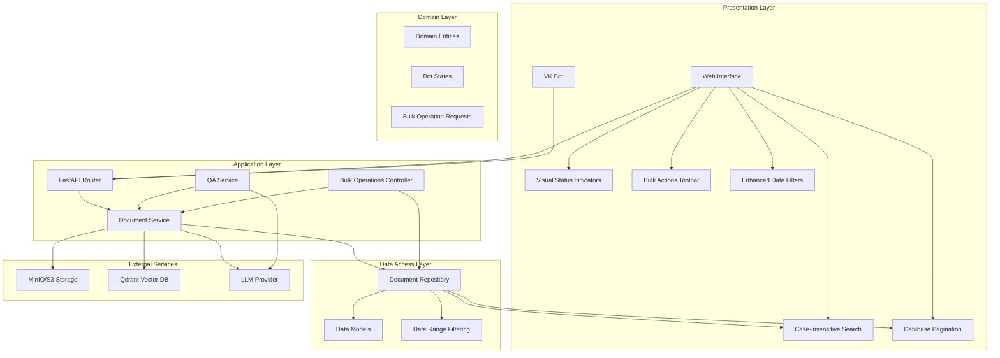

**Diagram sources**
- [app/main.py:99-124](file://app/main.py#L99-L124)
- [app/api/documents.py:1-806](file://app/api/documents.py#L1-L806)
- [app/domain/document_service.py:35-281](file://app/domain/document_service.py#L35-L281)
- [templates/partials/pagination.html:1-103](file://templates/partials/pagination.html#L1-L103)
- [templates/documents.html:135-186](file://templates/documents.html#L135-L186)

The architecture consists of five main layers with enhanced bulk operations, date filtering, and modernized frontend capabilities:

1. **Presentation Layer**: Web interface built with FastAPI and Jinja2 templates, plus VK social network bot integration, real-time search with HTMX, dynamic pagination controls, visual status indicators, bulk actions toolbar, and enhanced date range filtering
2. **Application Layer**: Business logic encapsulated in domain services and API routers with bulk-aware endpoints, enhanced status management, and comprehensive operation orchestration
3. **Domain Layer**: Core business entities and state management for bot interactions plus bulk operation request models
4. **Data Access Layer**: Async repository pattern for SQLite database operations with comprehensive search functionality, pagination support, and advanced date range filtering capabilities
5. **Integration Layer**: External services for storage, vector databases, and AI providers

## Core Components

### Application Bootstrap and Configuration

The system initializes through a centralized FastAPI application factory that manages lifecycle resources and dependency injection:

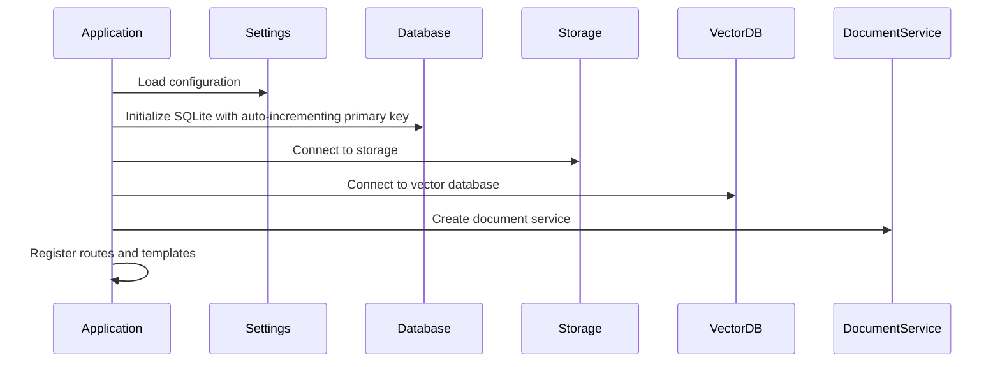

**Diagram sources**
- [app/main.py:24-82](file://app/main.py#L24-L82)
- [app/config.py:4-33](file://app/config.py#L4-L33)
- [app/storage/database.py:32-39](file://app/storage/database.py#L32-L39)

### Document Service Architecture

The DocumentService acts as the central coordinator for all document operations:

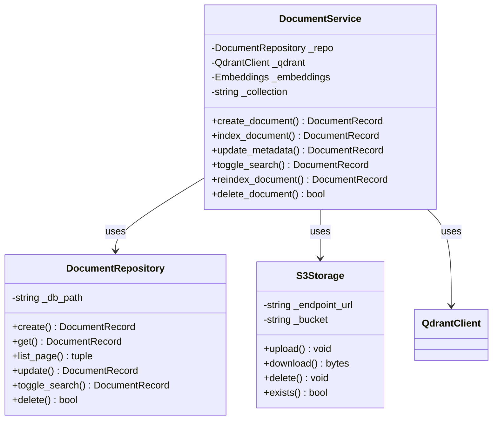

**Diagram sources**
- [app/domain/document_service.py:35-281](file://app/domain/document_service.py#L35-L281)
- [app/storage/document_repo.py:63-214](file://app/storage/document_repo.py#L63-L214)
- [app/storage/s3.py:14-109](file://app/storage/s3.py#L14-L109)

**Section sources**
- [app/main.py:1-124](file://app/main.py#L1-L124)
- [app/domain/document_service.py:1-281](file://app/domain/document_service.py#L1-L281)

## Document Management Workflow

The document management process follows a structured workflow from upload to searchable state:

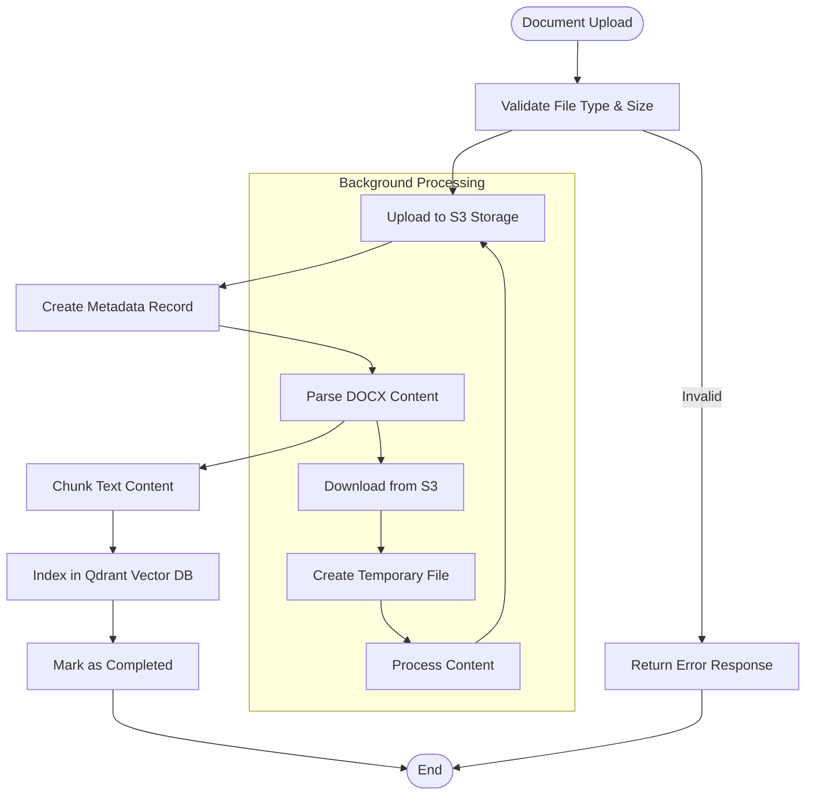

**Diagram sources**
- [app/api/documents.py:294-381](file://app/api/documents.py#L294-L381)
- [app/domain/document_service.py:84-133](file://app/domain/document_service.py#L84-L133)

### Upload Validation and Processing

The system implements comprehensive validation for uploaded documents:

| Validation Step | Criteria | Action |
|----------------|----------|---------|
| File Extension | Only `.docx` allowed | Reject with error |
| File Size | Maximum 10MB | Reject if exceeded |
| Content Type | DOCX MIME type | Validate against allowed types |
| Duplicate Prevention | Unique S3 keys | Append counter suffix |

**Section sources**
- [app/api/documents.py:307-366](file://app/api/documents.py#L307-L366)
- [app/api/documents.py:111-130](file://app/api/documents.py#L111-L130)

## Server-Side Search Functionality

The system implements comprehensive server-side search functionality with real-time filtering capabilities:

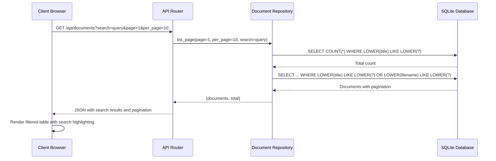

**Diagram sources**
- [app/api/documents.py:390-406](file://app/api/documents.py#L390-L406)
- [app/storage/document_repo.py:120-158](file://app/storage/document_repo.py#L120-L158)

### Search Implementation Details

The search functionality provides comprehensive filtering capabilities:

- **Case-insensitive matching**: Uses `LOWER()` function for case-insensitive pattern matching
- **Dual-field search**: Searches both document titles and filenames simultaneously
- **Real-time filtering**: Integrated with HTMX for immediate search results
- **Pattern matching**: Supports partial matches with wildcard patterns
- **Performance optimization**: Efficient LIKE queries with proper indexing considerations

### Search Parameters

The search system supports the following parameters:

| Parameter | Type | Description |
|-----------|------|-------------|
| `search` | String | Search query for filtering documents by title or filename |
| `page` | Integer | Current page number (1-indexed) |
| `per_page` | Integer | Number of items per page (10, 20, 50) |

### Search UI Integration

The frontend provides intuitive search capabilities:

- **Real-time search**: Debounced input with 300ms delay for performance
- **Search icon**: Visual indicator with magnifying glass icon
- **Placeholder text**: "Search" for user guidance
- **HTMX integration**: Automatic AJAX requests for filtered results
- **Pagination preservation**: Search maintains current pagination state

**Section sources**
- [app/api/documents.py:194-218](file://app/api/documents.py#L194-L218)
- [app/api/documents.py:390-406](file://app/api/documents.py#L390-L406)
- [app/storage/document_repo.py:120-158](file://app/storage/document_repo.py#L120-L158)
- [templates/documents.html:25-42](file://templates/documents.html#L25-L42)

## Enhanced Status Display System

The system provides comprehensive visual status indicators for document tracking:

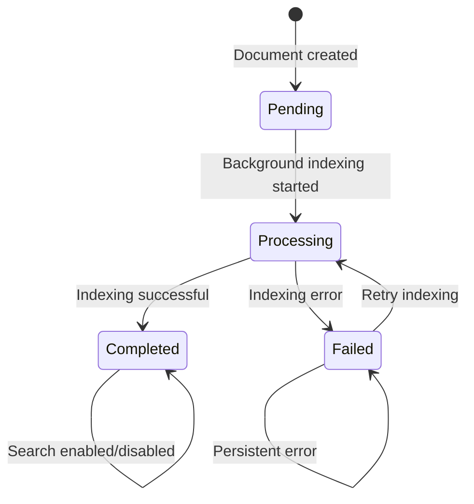

**Diagram sources**
- [templates/partials/document_row.html:19-41](file://templates/partials/document_row.html#L19-L41)
- [app/storage/models.py:11-18](file://app/storage/models.py#L11-L18)

### Status Badge Visual Indicators

The system displays four distinct status states with appropriate visual cues:

| Status | Visual Indicator | Icon | Color | Description |
|--------|------------------|------|-------|-------------|
| `pending` | Warning badge | ⏳ | Yellow | Document queued for processing |
| `processing` | Info badge | 🔁 | Blue | Background indexing in progress |
| `completed` | Success badge | ✅ | Green | Document successfully indexed |
| `failed` | Error badge | ❌ | Red | Indexing failed with error details |

### Status Interaction Elements

The status system includes interactive elements for document management:

- **Auto-refresh**: Processing documents automatically refresh every 3 seconds
- **Error tooltips**: Detailed error messages on hover for failed documents
- **Loading indicators**: Animated dots/spinner for pending/processing states
- **Checkbox control**: Toggle search participation for completed documents

### Status Filtering Capabilities

The frontend provides status-based filtering:

- **Status dropdown**: Filter documents by processing status
- **Visual labels**: Status-specific color coding
- **Client-side filtering**: Real-time filtering of visible documents
- **Combined filters**: Status filters work with search and type filters

**Section sources**
- [templates/partials/document_row.html:19-41](file://templates/partials/document_row.html#L19-L41)
- [templates/documents.html:74-87](file://templates/documents.html#L74-L87)
- [app/storage/models.py:11-18](file://app/storage/models.py#L11-L18)

## Pagination System

The system implements a comprehensive pagination system that enhances scalability and user experience when managing large document collections:

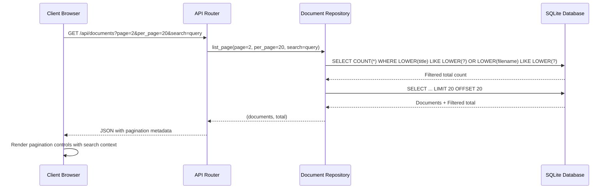

**Diagram sources**
- [app/api/documents.py:390-406](file://app/api/documents.py#L390-L406)
- [app/storage/document_repo.py:120-158](file://app/storage/document_repo.py#L120-L158)

### Pagination Parameters

The pagination system supports the following parameters:

| Parameter | Type | Default | Description |
|-----------|------|---------|-------------|
| `page` | Integer | 1 | Current page number (1-indexed) |
| `per_page` | Integer | 10 | Number of items per page (10, 20, 50) |
| `search` | String | None | Search query for filtering documents |

### Frontend Pagination Implementation

The frontend uses HTMX for dynamic pagination without full page reloads:

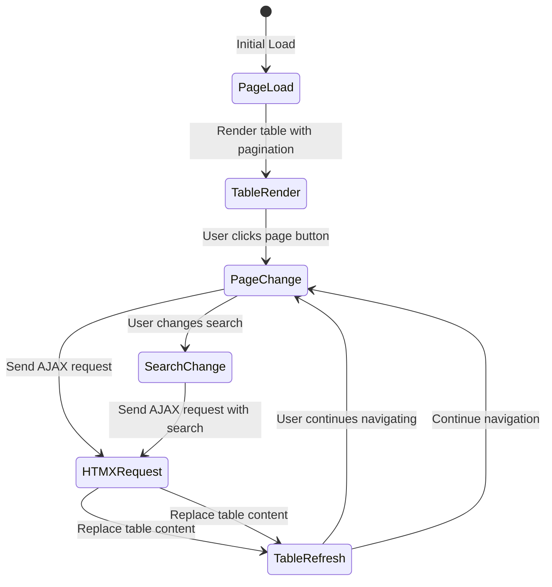

**Diagram sources**
- [templates/documents.html:35-41](file://templates/documents.html#L35-L41)
- [templates/partials/pagination.html:7-10](file://templates/partials/pagination.html#L7-L10)

### Pagination Controls

The system provides sophisticated pagination controls with intelligent page numbering:

- **Previous/Next Buttons**: Navigate between adjacent pages
- **Page Number Buttons**: Direct access to specific pages with ellipsis for large ranges
- **Dynamic Ellipsis**: Shows `1, 2, 3, ..., last` near the end, `1, ..., middle-1, middle, middle+1, ..., last` in the middle, and `1, 2, 3, 4, 5, ..., last` near the beginning
- **Active State Highlighting**: Current page button is visually distinct
- **Disabled States**: Previous button disabled on first page, next button disabled on last page
- **Search Context Preservation**: Pagination maintains search query across page changes

**Section sources**
- [app/api/documents.py:194-218](file://app/api/documents.py#L194-L218)
- [app/api/documents.py:390-406](file://app/api/documents.py#L390-L406)
- [app/storage/document_repo.py:120-158](file://app/storage/document_repo.py#L120-L158)
- [templates/partials/pagination.html:1-103](file://templates/partials/pagination.html#L1-L103)

## Bulk Operations System

The system provides comprehensive bulk operations for efficient document management at scale:

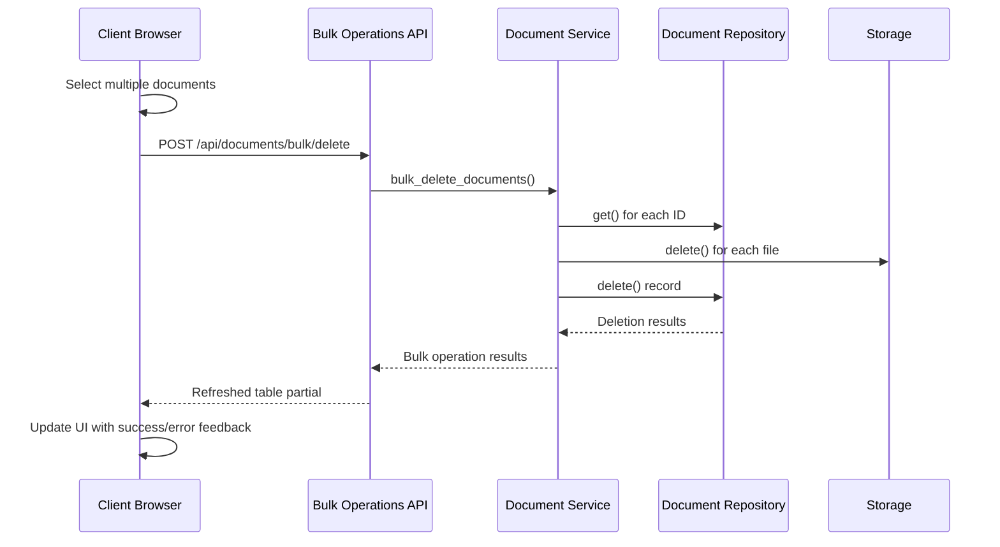

**Diagram sources**
- [app/api/documents.py:492-538](file://app/api/documents.py#L492-L538)
- [templates/documents.html:537-561](file://templates/documents.html#L537-L561)

### Bulk Operations Architecture

The bulk operations system provides three core capabilities:

#### Delete Operation
- **Endpoint**: `POST /api/documents/bulk/delete`
- **Request Body**: `{ ids: [string[]] }`
- **Behavior**: Deletes multiple documents atomically with error collection
- **Response**: Refreshed document table partial via HTMX
- **Error Handling**: Continues processing despite individual failures

#### Reindex Operation
- **Endpoint**: `POST /api/documents/bulk/reindex`
- **Request Body**: `{ ids: [string[]] }`
- **Behavior**: Initiates background reindexing for multiple documents
- **Response**: Immediate acknowledgment with background processing
- **Error Handling**: Logs errors and continues with remaining documents

#### Search Toggle Operation
- **Endpoint**: `PATCH /api/documents/bulk/search`
- **Request Body**: `{ ids: [string[]], enabled: boolean }`
- **Behavior**: Toggles search participation for multiple documents
- **Response**: Refreshed table partial with updated status
- **Error Handling**: Processes all documents regardless of individual failures

### Frontend Bulk Actions Toolbar

The modernized interface includes an interactive bulk actions toolbar:

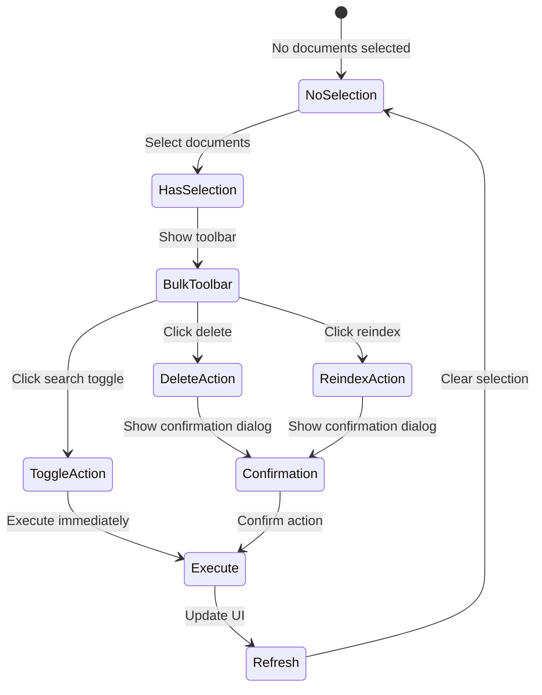

**Diagram sources**
- [templates/documents.html:135-186](file://templates/documents.html#L135-L186)
- [templates/documents.html:537-611](file://templates/documents.html#L537-L611)

### Bulk Action Features

The bulk operations provide comprehensive functionality:

- **Multi-selection**: Checkbox-based selection with "Select All" capability
- **Bulk Toolbar**: Persistent toolbar showing selected count and available actions
- **Confirmation Dialogs**: Prevent accidental bulk deletions
- **Real-time Feedback**: Toast notifications for operation results
- **Selection Persistence**: Maintains selections across pagination and filters
- **HTMX Integration**: Seamless partial updates without full page reloads

**Section sources**
- [app/api/documents.py:476-635](file://app/api/documents.py#L476-L635)
- [templates/documents.html:135-186](file://templates/documents.html#L135-L186)
- [templates/documents.html:537-611](file://templates/documents.html#L537-L611)

## Enhanced Date Range Filtering

The system implements sophisticated date range filtering with inclusive boundaries and ISO format support:

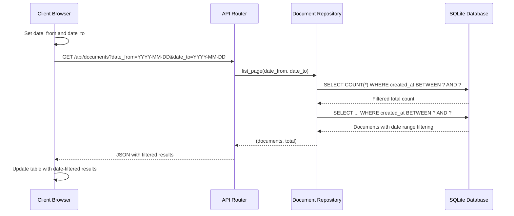

**Diagram sources**
- [app/api/documents.py:435-473](file://app/api/documents.py#L435-L473)
- [app/storage/document_repo.py:120-174](file://app/storage/document_repo.py#L120-L174)

### Date Range Implementation Details

The date filtering system provides precise temporal control:

- **ISO Format Parsing**: Accepts `YYYY-MM-DD` format with robust error handling
- **Inclusive Boundaries**: 
  - `date_from`: Documents created on or after this date
  - `date_to`: Documents created on or before this date (end of day)
- **Time Zone Handling**: Uses UTC for consistent filtering across time zones
- **Partial Date Support**: Either date can be specified independently
- **Validation**: Graceful handling of invalid date formats

### Date Filter UI Components

The enhanced frontend includes comprehensive date filtering:

- **Dropdown Interface**: Collapsible date filter panel with two date inputs
- **Real-time Updates**: Automatic filtering on date input changes
- **Clear Functionality**: One-click clearing of date filters
- **Apply Button**: Explicit apply mechanism for complex workflows
- **URL Parameter Sync**: Date filters persist in URL for sharing and bookmarking
- **Responsive Design**: Mobile-friendly date picker interface

### Date Filter Parameters

The date filtering system supports:

| Parameter | Type | Description |
|-----------|------|-------------|
| `date_from` | String (ISO-8601) | Filter documents created on or after this date |
| `date_to` | String (ISO-8601) | Filter documents created on or before this date |

**Section sources**
- [app/api/documents.py:435-473](file://app/api/documents.py#L435-L473)
- [app/storage/document_repo.py:120-174](file://app/storage/document_repo.py#L120-L174)
- [templates/documents.html:89-131](file://templates/documents.html#L89-L131)
- [templates/documents.html:489-494](file://templates/documents.html#L489-L494)

## Modernized Frontend Interface

The system features a modernized frontend interface with enhanced user experience and interactive capabilities:

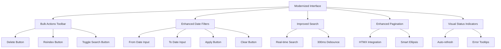

**Diagram sources**
- [templates/documents.html:135-186](file://templates/documents.html#L135-L186)
- [templates/documents.html:89-131](file://templates/documents.html#L89-L131)
- [templates/documents.html:306-334](file://templates/documents.html#L306-L334)

### Interactive Features

The modernized interface includes several key interactive elements:

#### Bulk Actions Toolbar
- **Persistent Display**: Appears when documents are selected
- **Visual Feedback**: Shows selected count with badge styling
- **Action Buttons**: Delete, Reindex, Include/Exclude from search
- **Selection Controls**: Clear selection button
- **Responsive Layout**: Adapts to different screen sizes

#### Enhanced Date Filters
- **Dropdown Interface**: Collapsible filter panel with smooth animations
- **Two-Date Selection**: Separate inputs for start and end dates
- **Real-time Updates**: Automatic filtering on input changes
- **Clear Functionality**: One-click reset of all date filters
- **Apply/Clear Buttons**: Explicit control over filter application

#### Improved Search Experience
- **Debounced Input**: 300ms delay for performance optimization
- **Real-time Results**: Instant filtering without page reloads
- **Visual Indicators**: Clear display of active search terms
- **Search Icon**: Intuitive magnifying glass icon

#### Advanced Pagination
- **HTMX Integration**: Seamless partial updates without full reloads
- **Smart Ellipsis**: Intelligent page number display for large datasets
- **URL Synchronization**: Pagination state preserved in URL
- **Responsive Design**: Mobile-optimized pagination controls

### Frontend State Management

The interface uses Alpine.js for comprehensive state management:

- **Filter State**: Search query, status filter, source type filter, date range
- **Selection State**: Track selected document IDs across operations
- **Pagination State**: Current page, items per page, total counts
- **Upload State**: Track file upload progress and status
- **Modal State**: Manage dialog visibility and user interactions

**Section sources**
- [templates/documents.html:135-186](file://templates/documents.html#L135-L186)
- [templates/documents.html:89-131](file://templates/documents.html#L89-L131)
- [templates/documents.html:306-334](file://templates/documents.html#L306-L334)
- [templates/documents.html:537-611](file://templates/documents.html#L537-L611)

## RAG Pipeline

The Retrieval-Augmented Generation pipeline processes documents through multiple stages:

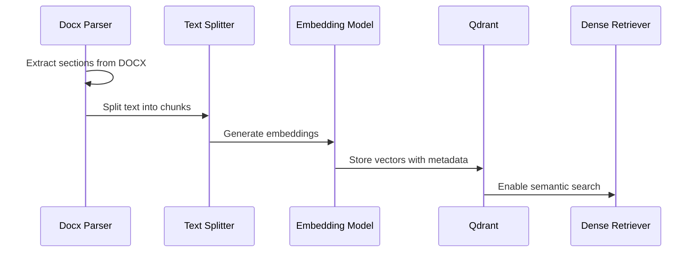

**Diagram sources**
- [app/rag/parser.py:54-83](file://app/rag/parser.py#L54-L83)
- [app/rag/indexer.py:49-72](file://app/rag/indexer.py#L49-L72)
- [app/rag/retriever.py:78-103](file://app/rag/retriever.py#L78-L103)

### Document Chunking Strategy

The system employs intelligent chunking for optimal retrieval performance:

- **Chunk Size**: 1000 characters with 200-character overlap
- **Splitting Strategy**: Hierarchical splitting by paragraphs, sentences, and words
- **Section Preservation**: Maintains semantic boundaries using heading-based sections
- **Metadata Enrichment**: Each chunk carries document ID, chunk ID, filename, and search enablement status

**Section sources**
- [app/rag/parser.py:15-17](file://app/rag/parser.py#L15-L17)
- [app/rag/parser.py:54-83](file://app/rag/parser.py#L54-L83)
- [app/rag/indexer.py:23-46](file://app/rag/indexer.py#L23-L46)

## VK Bot Integration

The system includes a comprehensive VK social network bot for HR assistance:

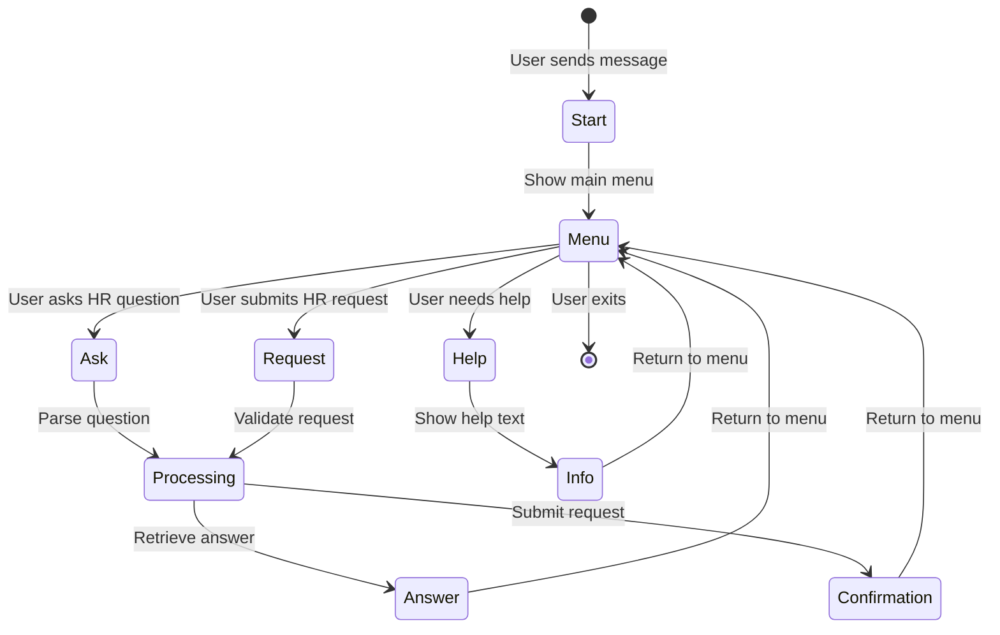

**Diagram sources**
- [app/integrations/vk/states.py](file://app/integrations/vk/states.py)
- [app/integrations/vk/bot.py](file://app/integrations/vk/bot.py)

### Bot Handler Architecture

The VK bot uses a handler-based architecture for different interaction modes:

| Handler | Purpose | Features |
|---------|---------|----------|
| `start.py` | Welcome and initial greeting | Bot introduction, basic commands |
| `ask.py` | HR question answering | RAG-powered Q&A, context awareness |
| `hr_request.py` | Formal HR requests | Structured request forms, approval flow |
| `hire.py` | Hiring process | Candidate screening, interview scheduling |
| `fire.py` | Termination process | Exit procedures, final settlement |
| `pay.py` | Payroll inquiries | Salary calculations, payment history |
| `vacation.py` | Leave management | Vacation requests, balance tracking |

**Section sources**
- [app/integrations/vk/handlers/start.py](file://app/integrations/vk/handlers/start.py)
- [app/integrations/vk/handlers/ask.py](file://app/integrations/vk/handlers/ask.py)
- [app/integrations/vk/handlers/hr_request.py](file://app/integrations/vk/handlers/hr_request.py)

## Storage Layer

The storage architecture provides a robust foundation for document management with enhanced search, pagination, and date filtering support:

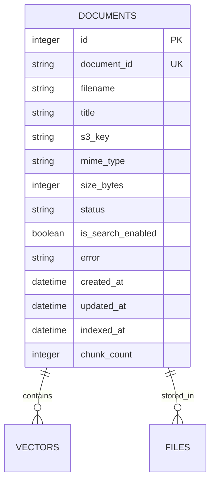

**Diagram sources**
- [app/storage/models.py:20-37](file://app/storage/models.py#L20-L37)
- [app/storage/document_repo.py:14-49](file://app/storage/document_repo.py#L14-L49)
- [app/storage/database.py:12-29](file://app/storage/database.py#L12-L29)

### Database Schema Design

The SQLite schema supports comprehensive document tracking with:

- **Primary Keys**: Auto-incremented integer ID and UUID-based document ID
- **Status Tracking**: Four-state processing pipeline (pending → processing → completed/failed)
- **Search Optimization**: Dedicated search enablement flag for vector filtering
- **Audit Trail**: Creation and modification timestamps for all records
- **Performance Metrics**: Chunk count and indexing timestamps for monitoring
- **Pagination Support**: Efficient ordering by ID for pagination queries
- **Search Indexing**: Case-insensitive search columns for optimal query performance
- **Date Filtering**: Precise timestamp fields for temporal queries

**Updated** The database now uses an auto-incrementing primary key (`id INTEGER PRIMARY KEY AUTOINCREMENT`) which enables efficient pagination through `ORDER BY id DESC LIMIT ? OFFSET ?` queries. The `is_search_enabled` column provides granular control over document inclusion in search results. The `created_at` field supports precise date range filtering with inclusive boundaries.

**Section sources**
- [app/storage/models.py:11-37](file://app/storage/models.py#L11-L37)
- [app/storage/document_repo.py:63-214](file://app/storage/document_repo.py#L63-L214)
- [app/storage/database.py:12-29](file://app/storage/database.py#L12-L29)

## API Endpoints

The system provides a comprehensive REST API for document management with full search, pagination, and bulk operation support:

### Authentication and Authorization

| Endpoint | Method | Description | Authentication |
|----------|--------|-------------|----------------|
| `/login` | GET/POST | Admin login form and authentication | None |
| `/logout` | GET | Clear admin session | Admin cookie |
| `/` | GET | Redirect based on authentication | Admin cookie |

### Document Management API

| Endpoint | Method | Description | Authentication |
|----------|--------|-------------|----------------|
| `/api/documents/upload` | POST | Upload multiple DOCX files | Admin cookie |
| `/api/documents` | GET | List all documents with search, pagination, and date filtering | Admin cookie |
| `/api/documents/{id}` | GET/PATCH/DELETE | Document operations | Admin cookie |
| `/api/documents/{id}/title` | PATCH | Update document title | Admin cookie |
| `/api/documents/{id}/search` | PATCH | Toggle search participation | Admin cookie |
| `/api/documents/{id}/reindex` | POST | Re-index document content | Admin cookie |
| `/api/documents/{id}/download` | GET | Download original file | Admin cookie |

### Bulk Operations API

| Endpoint | Method | Description | Authentication |
|----------|--------|-------------|----------------|
| `/api/documents/bulk/delete` | POST | Delete multiple documents | Admin cookie |
| `/api/documents/bulk/reindex` | POST | Re-index multiple documents | Admin cookie |
| `/api/documents/bulk/search` | PATCH | Toggle search participation for multiple documents | Admin cookie |

### HTMX Partial Endpoints

| Endpoint | Method | Description |
|----------|--------|-------------|
| `/partials/document-table` | GET | Dynamic table content with search, pagination, and date filtering |
| `/partials/document-row/{id}` | GET | Individual row updates with status refresh |
| `/partials/document-status/{id}` | GET | Status badge refresh |

### Search and Pagination Parameters

All list endpoints support the following parameters:

- **`page`**: Current page number (default: 1)
- **`per_page`**: Items per page (default: 10, options: 10, 20, 50)
- **`search`**: Search query for filtering documents by title or filename
- **`date_from`**: ISO date string for minimum creation date (inclusive)
- **`date_to`**: ISO date string for maximum creation date (inclusive)

**Updated** All endpoints now support comprehensive search functionality with case-insensitive pattern matching against document titles and filenames. The main `/api/documents` endpoint returns detailed pagination metadata including total count, current page, items per page, and total pages. Bulk operations endpoints provide atomic operations on multiple documents with comprehensive error handling and HTMX partial responses for seamless user experience.

**Section sources**
- [app/api/documents.py:1-806](file://app/api/documents.py#L1-L806)
- [app/api/deps.py:54-74](file://app/api/deps.py#L54-L74)

## Configuration Management

The system uses Pydantic Settings for centralized configuration:

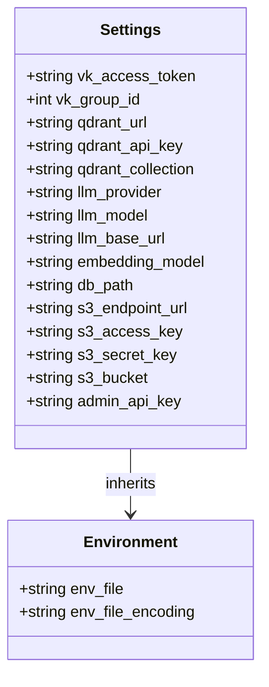

**Diagram sources**
- [app/config.py:4-33](file://app/config.py#L4-L33)

### Configuration Categories

| Category | Key | Default Value | Purpose |
|----------|-----|---------------|---------|
| **VK Integration** | `vk_access_token` | Empty string | Bot authentication |
| **Vector Database** | `qdrant_url` | `http://localhost:6333` | Qdrant connection |
| **LLM Provider** | `llm_provider` | `ollama` | AI model provider |
| **Storage** | `db_path` | `data/cafetera.db` | SQLite database location |
| **Admin Security** | `admin_api_key` | Empty string | Administrative access |

**Section sources**
- [app/config.py:1-33](file://app/config.py#L1-L33)

## Testing Strategy

The system includes comprehensive testing across all layers with extensive search, pagination, and bulk operation coverage:

### Test Coverage Areas

| Test Module | Focus Area | Testing Approach |
|-------------|------------|------------------|
| `test_api_documents.py` | API endpoint functionality | Unit and integration tests |
| `test_document_service.py` | Domain service logic | Mock-based testing |
| `test_storage.py` | Database operations | SQLite in-memory testing |
| `test_rag_block6.py` | RAG pipeline components | End-to-end testing |
| `test_bot_factory.py` | VK bot integration | State machine validation |
| `test_qa_service.py` | Question-answering logic | Scenario-based testing |

### Search and Status Testing Coverage

The test suite includes comprehensive search and status functionality testing:

- **Search functionality**: Tests case-insensitive pattern matching against titles and filenames
- **Status transitions**: Validates all status state changes and visual indicators
- **Search enable/disable**: Tests toggle functionality for search participation
- **Real-time updates**: Verifies automatic status refresh for processing documents
- **Error handling**: Tests error status display and tooltip functionality
- **Pagination with search**: Validates search results across multiple pages

### Pagination Testing Coverage

The test suite includes comprehensive pagination testing:

- **Default Pagination**: Tests default page size (10 items)
- **Custom Pagination**: Tests custom page sizes (3 items per page)
- **Large Collections**: Tests pagination with 7 documents across 3 pages
- **Beyond Range**: Tests pagination beyond available data
- **Total Count Accuracy**: Verifies total count matches actual document count
- **HTMX Partials**: Tests pagination controls in HTMX partial responses

### Bulk Operations Testing Coverage

The test suite includes comprehensive bulk operation testing:

- **Bulk Delete**: Tests deletion of multiple documents with error collection
- **Bulk Reindex**: Tests background reindexing initiation for multiple documents
- **Bulk Search Toggle**: Tests enabling/disabling search participation for multiple documents
- **Error Handling**: Validates graceful handling of non-existent documents
- **HTMX Responses**: Tests partial HTML responses for seamless updates
- **Background Processing**: Validates background task scheduling and execution

**Updated** The testing strategy now includes extensive bulk operations testing covering atomic operations, error handling, background processing, and HTMX partial responses. The test suite validates all bulk endpoints with comprehensive error scenarios and ensures proper user feedback mechanisms.

**Section sources**
- [pyproject.toml:45-47](file://pyproject.toml#L45-L47)
- [tests/test_api_documents.py:506-605](file://tests/test_api_documents.py#L506-L605)
- [tests/test_storage.py:244-275](file://tests/test_storage.py#L244-L275)

## Deployment and Operations

### Docker Compose Configuration

The system supports containerized deployment with the following services:

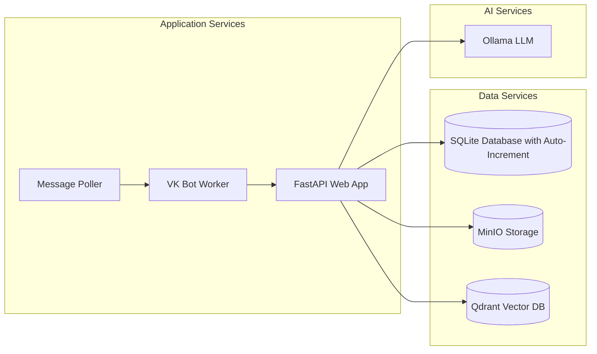

### Environment Setup

Required environment variables:
- `ADMIN_API_KEY`: Secret key for administrative access
- `S3_ENDPOINT_URL`: Storage service endpoint
- `S3_ACCESS_KEY`/`S3_SECRET_KEY`: Storage credentials
- `QDRANT_URL`: Vector database connection
- `OLLAMA_BASE_URL`: LLM service endpoint

**Updated** The deployment configuration now supports the enhanced bulk operations system with proper background task handling, comprehensive date range filtering, and modernized frontend interface with HTMX integration for seamless user experience.

**Section sources**
- [docker-compose.yml](file://docker-compose.yml)

## Troubleshooting Guide

### Common Issues and Solutions

| Issue | Symptoms | Solution |
|-------|----------|----------|
| **Document Upload Fails** | 400 errors on upload | Check file size limit (10MB), supported formats (.docx) |
| **Vector Indexing Errors** | Documents show "failed" status | Verify Qdrant connectivity, embedding model availability |
| **S3 Storage Issues** | Files not accessible | Confirm bucket existence, credentials, network connectivity |
| **Admin Authentication Problems** | 403 Forbidden errors | Verify `admin_api_key` matches cookie value |
| **Bot Not Responding** | VK messages ignored | Check VK access token, webhook configuration |
| **Search Not Working** | No results for valid queries | Verify database search columns, case-insensitive matching |
| **Status Display Issues** | Wrong status icons or no refresh | Check HTMX configuration, JavaScript console errors |
| **Pagination Problems** | Incorrect page counts or empty results | Verify database auto-increment setup, check pagination parameters |
| **Bulk Operations Fail** | Partial bulk operation success | Check individual document IDs, verify file existence in storage |
| **Date Filter Issues** | Incorrect date range results | Verify ISO date format (YYYY-MM-DD), check timezone handling |
| **Frontend Not Updating** | UI not reflecting changes | Check HTMX configuration, verify partial endpoint responses |

### Logging and Monitoring

The system provides comprehensive logging at multiple levels:
- **Application logs**: Request/response handling, error tracking
- **Database logs**: Query execution, transaction status
- **Storage logs**: File operations, upload/download progress
- **Vector database logs**: Indexing operations, search queries
- **Bot logs**: Message processing, state transitions
- **Search logs**: Query performance, filtering effectiveness
- **Pagination logs**: Page calculation, query performance
- **Bulk operations logs**: Atomic operation execution, error handling
- **Date filter logs**: Temporal query processing, boundary handling

**Updated** The troubleshooting guide now includes bulk operations issues, date range filtering problems, and frontend update failures. The logging system provides comprehensive coverage for all new features including bulk operation execution, date range query processing, and HTMX partial response handling.

**Section sources**
- [app/main.py:21-96](file://app/main.py#L21-L96)
- [app/api/documents.py:111-130](file://app/api/documents.py#L111-L130)

## Conclusion

The Document Management System provides a robust, scalable solution for HR document processing and management. Its modular architecture, comprehensive API, and integrated RAG capabilities make it suitable for enterprise-scale document management scenarios.

Key strengths include:
- **Comprehensive Document Lifecycle Management**: From upload to searchable state
- **Flexible Storage Backend**: Support for multiple storage providers
- **Advanced RAG Pipeline**: Semantic search and question-answering capabilities
- **Multi-channel Integration**: Web interface and VK social network bot
- **Production-ready Architecture**: Proper separation of concerns and testing strategy
- **Scalable Pagination System**: Efficient handling of large document collections
- **Enhanced User Experience**: Dynamic pagination with HTMX integration
- **Powerful Search Capabilities**: Real-time filtering with case-insensitive pattern matching
- **Visual Status Management**: Comprehensive status indicators with real-time updates
- **Granular Control**: Search enable/disable functionality for individual documents
- **Comprehensive Bulk Operations**: Atomic operations for efficient document management
- **Advanced Date Filtering**: Precise temporal querying with inclusive boundaries
- **Modernized Interface**: Interactive toolbar and enhanced user experience

The system is designed for extensibility, allowing easy addition of new document formats, storage backends, and AI providers while maintaining backward compatibility and operational reliability.

**Updated** The recent implementation of comprehensive bulk operations system, enhanced date range filtering capabilities, and modernized frontend interface with bulk actions toolbar and interactive features significantly enhances the system's operational efficiency and user experience. The atomic bulk operations provide reliable mass document management, while the precise date filtering enables sophisticated temporal queries. The modernized interface with HTMX integration delivers seamless user interactions and real-time feedback for all document management tasks.