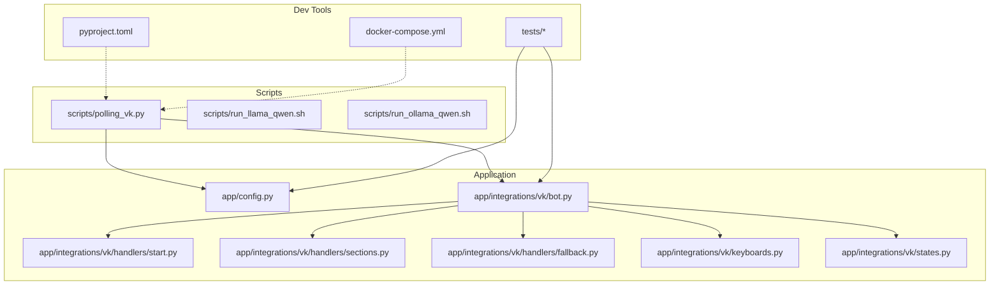

# Getting Started

<cite>
**Referenced Files in This Document**
- [pyproject.toml](file://pyproject.toml)
- [docker-compose.yml](file://docker-compose.yml)
- [app/config.py](file://app/config.py)
- [scripts/polling_vk.py](file://scripts/polling_vk.py)
- [app/integrations/vk/bot.py](file://app/integrations/vk/bot.py)
- [app/integrations/vk/handlers/start.py](file://app/integrations/vk/handlers/start.py)
- [app/integrations/vk/handlers/sections.py](file://app/integrations/vk/handlers/sections.py)
- [app/integrations/vk/handlers/fallback.py](file://app/integrations/vk/handlers/fallback.py)
- [app/integrations/vk/keyboards.py](file://app/integrations/vk/keyboards.py)
- [app/integrations/vk/states.py](file://app/integrations/vk/states.py)
- [tests/test_config.py](file://tests/test_config.py)
- [tests/test_bot_factory.py](file://tests/test_bot_factory.py)
- [AGENTS.md](file://AGENTS.md)
- [PLAN.md](file://PLAN.md)
- [scripts/run_llama_qwen.sh](file://scripts/run_llama_qwen.sh)
- [scripts/run_ollama_qwen.sh](file://scripts/run_ollama_qwen.sh)
</cite>

## Table of Contents
1. [Introduction](#introduction)
2. [Project Structure](#project-structure)
3. [Prerequisites](#prerequisites)
4. [Installation](#installation)
5. [Environment Setup](#environment-setup)
6. [Local Development](#local-development)
7. [Docker Containers for Development](#docker-containers-for-development)
8. [Running the Bot Locally](#running-the-bot-locally)
9. [Testing the Bot Functionality](#testing-the-bot-functionality)
10. [Verification Checklist](#verification-checklist)
11. [Development Workflow Basics](#development-workflow-basics)
12. [Next Steps for Contributors](#next-steps-for-contributors)
13. [Troubleshooting Guide](#troubleshooting-guide)
14. [Conclusion](#conclusion)

## Introduction
This guide helps you set up cafetera_hr_bot for local development, focusing on VK integration with polling mode, environment configuration, and basic verification. The project uses Python 3.11+, uv for package management, and supports local RAG experimentation via optional LLM servers.

## Project Structure
The repository is organized into:
- app/: Application code (domain, integrations, config)
- scripts/: Local development helpers (polling entry-points, optional LLM launchers)
- tests/: Unit tests for configuration and bot wiring
- docker-compose.yml: Local infrastructure (Qdrant, MinIO)

**Diagram sources**
- [app/config.py:1-9](file://app/config.py#L1-L9)
- [app/integrations/vk/bot.py:1-32](file://app/integrations/vk/bot.py#L1-L32)
- [app/integrations/vk/handlers/start.py:1-55](file://app/integrations/vk/handlers/start.py#L1-L55)
- [app/integrations/vk/handlers/sections.py:1-82](file://app/integrations/vk/handlers/sections.py#L1-L82)
- [app/integrations/vk/handlers/fallback.py:1-18](file://app/integrations/vk/handlers/fallback.py#L1-L18)
- [app/integrations/vk/keyboards.py:1-108](file://app/integrations/vk/keyboards.py#L1-L108)
- [app/integrations/vk/states.py:1-14](file://app/integrations/vk/states.py#L1-L14)
- [scripts/polling_vk.py:1-33](file://scripts/polling_vk.py#L1-L33)
- [scripts/run_llama_qwen.sh:1-59](file://scripts/run_llama_qwen.sh#L1-L59)
- [scripts/run_ollama_qwen.sh:1-74](file://scripts/run_ollama_qwen.sh#L1-L74)
- [pyproject.toml:1-56](file://pyproject.toml#L1-L56)
- [docker-compose.yml:1-34](file://docker-compose.yml#L1-L34)
- [tests/test_config.py:1-28](file://tests/test_config.py#L1-L28)
- [tests/test_bot_factory.py:1-45](file://tests/test_bot_factory.py#L1-L45)

**Section sources**
- [pyproject.toml:1-56](file://pyproject.toml#L1-L56)
- [docker-compose.yml:1-34](file://docker-compose.yml#L1-L34)
- [AGENTS.md:16-18](file://AGENTS.md#L16-L18)

## Prerequisites
- Python 3.11+ (package requirements specify >=3.11)
- uv package manager (recommended)
- VKontakte development account and group for bot testing
- Optional: Local LLM server (llama.cpp or Ollama) for RAG experimentation

Key facts from the codebase:
- Python version requirement is enforced in project metadata.
- VK bot uses vkbottle 4.x and runs in polling mode for local development.
- Optional dependencies exist for LLM providers (Ollama, OpenAI-compatible).

**Section sources**
- [pyproject.toml:6](file://pyproject.toml#L6)
- [AGENTS.md:7-8](file://AGENTS.md#L7-L8)
- [AGENTS.md:17](file://AGENTS.md#L17)

## Installation
Follow these steps to install and prepare the environment:

1. Install dependencies
   - Use uv to install project dependencies and optional groups.
   - Example commands:
     - Install base dependencies: uv pip install .
     - Install dev dependencies: uv pip install ".[dev]"
     - Install optional LLM provider extras: uv pip install ".[ollama]" or ".[openai_compatible]"

2. Verify installation
   - Run tests to confirm environment readiness:
     - uv run pytest

Notes:
- The project uses pyproject.toml for dependency management and pytest configuration.
- Tests are configured to run automatically from the tests/ directory.

**Section sources**
- [pyproject.toml:40-42](file://pyproject.toml#L40-L42)
- [pyproject.toml:33-38](file://pyproject.toml#L33-L38)
- [tests/test_config.py:1-28](file://tests/test_config.py#L1-L28)
- [tests/test_bot_factory.py:1-45](file://tests/test_bot_factory.py#L1-L45)

## Environment Setup
Configure environment variables via pydantic-settings. The Settings class loads from a .env file.

Required VK variables (as per current config):
- VK_ACCESS_TOKEN
- VK_GROUP_ID

Optional VK variables (per AGENTS.md canonical list):
- VK_SECRET
- VK_CONFIRMATION_TOKEN
- VK_WEBHOOK_URL

RAG and storage variables (per AGENTS.md canonical list):
- QDRANT_URL
- QDRANT_API_KEY
- LLM_API_KEY
- S3_ENDPOINT_URL
- S3_ACCESS_KEY
- S3_SECRET_KEY
- S3_BUCKET

Notes:
- The current Settings class defines VK-specific fields; additional fields are documented in AGENTS.md for completeness.
- Provide a .env file with placeholders; do not hardcode secrets.

**Section sources**
- [app/config.py:1-9](file://app/config.py#L1-L9)
- [AGENTS.md:20-48](file://AGENTS.md#L20-L48)

## Local Development
Local development uses polling mode for VK. The polling entry-point script initializes settings, builds the bot, and starts long polling.

Key files:
- scripts/polling_vk.py: Local VK polling entry-point
- app/integrations/vk/bot.py: Bot factory that registers handlers
- app/integrations/vk/handlers/start.py, sections.py, fallback.py: Message handlers
- app/integrations/vk/keyboards.py: Keyboard builders
- app/integrations/vk/states.py: Multi-step dialog states

Workflow:
- The polling script loads Settings, creates a Bot via create_bot(), and runs run_polling().
- Handlers are registered in a specific order to ensure fallback behavior.

**Section sources**
- [scripts/polling_vk.py:1-33](file://scripts/polling_vk.py#L1-L33)
- [app/integrations/vk/bot.py:1-32](file://app/integrations/vk/bot.py#L1-L32)
- [app/integrations/vk/handlers/start.py:1-55](file://app/integrations/vk/handlers/start.py#L1-L55)
- [app/integrations/vk/handlers/sections.py:1-82](file://app/integrations/vk/handlers/sections.py#L1-L82)
- [app/integrations/vk/handlers/fallback.py:1-18](file://app/integrations/vk/handlers/fallback.py#L1-L18)
- [app/integrations/vk/keyboards.py:1-108](file://app/integrations/vk/keyboards.py#L1-L108)
- [app/integrations/vk/states.py:1-14](file://app/integrations/vk/states.py#L1-L14)

## Docker Containers for Development
The repository includes docker-compose.yml with two services:
- Qdrant: vector database for RAG
- MinIO: S3-compatible object storage

Ports and volumes:
- Qdrant: exposes 6333 and 6334; persists data in a named volume
- MinIO: exposes 9000 (S3 API) and 9001 (web console); persists data in a named volume
- Healthcheck for Qdrant ensures readiness

Run:
- docker compose up -d
- docker compose down

Notes:
- These services support RAG ingestion and document storage during development.
- MinIO credentials are provided for local testing.

**Section sources**
- [docker-compose.yml:1-34](file://docker-compose.yml#L1-L34)

## Running the Bot Locally
To run the VK bot in polling mode:

1. Prepare environment
   - Set VK_ACCESS_TOKEN and VK_GROUP_ID in .env
   - Optionally set RAG and storage variables if integrating with Qdrant/MinIO

2. Start polling
   - From the project root, run:
     - uv run python scripts/polling_vk.py

3. Interact
   - Send /start or “Start” to the bot
   - Use the main menu to navigate sections

Verification:
- The bot answers with greeting text and displays the main menu keyboard.
- Payload actions route to section stubs.
- Unmatched text falls back to the main menu.

**Section sources**
- [scripts/polling_vk.py:24-28](file://scripts/polling_vk.py#L24-L28)
- [app/integrations/vk/handlers/start.py:31-33](file://app/integrations/vk/handlers/start.py#L31-L33)
- [app/integrations/vk/handlers/sections.py:28-81](file://app/integrations/vk/handlers/sections.py#L28-L81)
- [app/integrations/vk/handlers/fallback.py:15-17](file://app/integrations/vk/handlers/fallback.py#L15-L17)

## Testing the Bot Functionality
Automated tests validate configuration and bot wiring:

- Configuration tests
  - Confirm default values and environment overrides for VK settings
  - See: tests/test_config.py

- Bot factory tests
  - Verify handler registration order and count
  - Verify token forwarding to the underlying VK API client
  - See: tests/test_bot_factory.py

Run:
- uv run pytest

What to expect:
- Tests pass if Settings reads .env correctly and create_bot wires 11 handlers (start: 3, sections: 7, fallback: 1).
- The fallback handler must be last to avoid intercepting intended routes.

**Section sources**
- [tests/test_config.py:1-28](file://tests/test_config.py#L1-L28)
- [tests/test_bot_factory.py:1-45](file://tests/test_bot_factory.py#L1-L45)

## Verification Checklist
- Environment variables present and correct
  - VK_ACCESS_TOKEN, VK_GROUP_ID
  - Optional: VK_SECRET, VK_CONFIRMATION_TOKEN, VK_WEBHOOK_URL
  - Optional: QDRANT_URL, QDRANT_API_KEY, LLM_API_KEY, S3_* variables
- Docker services running (if using Qdrant/MinIO)
  - docker compose ps shows healthy Qdrant and MinIO
- Bot responds to /start and main menu
- Payload actions open section stubs
- Unmatched text falls back to main menu

**Section sources**
- [app/config.py:1-9](file://app/config.py#L1-L9)
- [docker-compose.yml:11-16](file://docker-compose.yml#L11-L16)
- [app/integrations/vk/handlers/start.py:31-33](file://app/integrations/vk/handlers/start.py#L31-L33)
- [app/integrations/vk/handlers/sections.py:28-81](file://app/integrations/vk/handlers/sections.py#L28-L81)
- [app/integrations/vk/handlers/fallback.py:15-17](file://app/integrations/vk/handlers/fallback.py#L15-L17)

## Development Workflow Basics
- Use uv for running commands and managing dependencies
- Follow repository conventions:
  - Prefer explicitness over cleverness
  - Keep functions small and readable
  - Add or update tests for behavior changes
- Validate changes with:
  - uv run pytest
  - uv run ruff check .
  - uv run mypy app/

Reference:
- AGENTS.md outlines validation and quality expectations.

**Section sources**
- [AGENTS.md:82-88](file://AGENTS.md#L82-L88)

## Next Steps for Contributors
- Explore the phased development plan:
  - Phase 1: Clickable navigator + Long Polling + RAG stubs
  - Phase 2: Basic RAG with Qdrant ingestion and LangChain chain
- Implement features incrementally:
  - Start with clickable scenarios (S-01, S-10, S-20, etc.)
  - Replace stubs with RAG responses
- Integrate Qdrant and MinIO:
  - Use docker compose to provision services
  - Prepare ingestion pipeline for Word documents

**Section sources**
- [PLAN.md:5-121](file://PLAN.md#L5-L121)
- [PLAN.md:137-151](file://PLAN.md#L137-L151)

## Troubleshooting Guide
Common issues and resolutions:

- Python version mismatch
  - Ensure Python 3.11+ is installed and active in your environment.
  - The project requires Python >=3.11.

- Missing VK credentials
  - Provide VK_ACCESS_TOKEN and VK_GROUP_ID in .env.
  - If using webhooks, also set VK_SECRET, VK_CONFIRMATION_TOKEN, VK_WEBHOOK_URL.

- Bot does not respond in polling mode
  - Confirm the polling script runs from the project root.
  - Ensure logging shows “Starting VK bot in Long Poll mode …”.

- Handler routing issues
  - The fallback handler must be last; tests enforce this ordering.
  - Verify handler count equals 11 (start: 3, sections: 7, fallback: 1).

- Docker services not ready
  - Check healthcheck for Qdrant and ensure ports 6333/6334 are free.
  - Confirm MinIO console at port 9001 and API at 9000.

- Optional LLM servers
  - For llama.cpp: ensure llama-server is installed and MODEL_PATH points to a valid GGUF file.
  - For Ollama: ensure ollama is installed and the model is pulled; the script waits for the server.

**Section sources**
- [pyproject.toml:6](file://pyproject.toml#L6)
- [app/config.py:1-9](file://app/config.py#L1-L9)
- [scripts/polling_vk.py:24-28](file://scripts/polling_vk.py#L24-L28)
- [tests/test_bot_factory.py:8-21](file://tests/test_bot_factory.py#L8-L21)
- [docker-compose.yml:11-16](file://docker-compose.yml#L11-L16)
- [scripts/run_llama_qwen.sh:32-41](file://scripts/run_llama_qwen.sh#L32-L41)
- [scripts/run_ollama_qwen.sh:26-34](file://scripts/run_ollama_qwen.sh#L26-L34)

## Conclusion
You now have the essentials to run cafetera_hr_bot locally with VK polling, configure environment variables, and validate the setup. Proceed with the phased development plan to implement clickable scenarios and integrate RAG capabilities using Qdrant and MinIO.