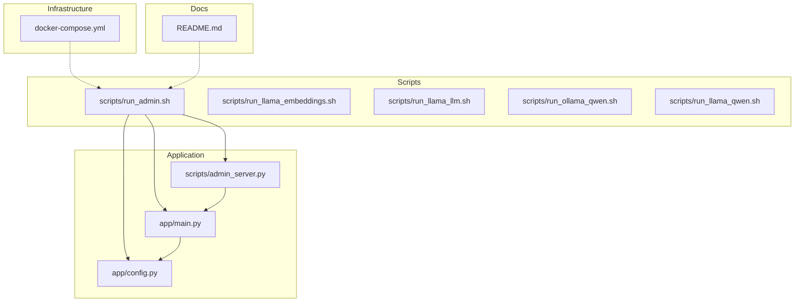

# Getting Started

<cite>
**Referenced Files in This Document**
- [README.md](file://README.md)
- [scripts/run_admin.sh](file://scripts/run_admin.sh)
- [scripts/admin_server.py](file://scripts/admin_server.py)
- [app/main.py](file://app/main.py)
- [app/config.py](file://app/config.py)
- [docker-compose.yml](file://docker-compose.yml)
- [pyproject.toml](file://pyproject.toml)
- [scripts/run_llama_embeddings.sh](file://scripts/run_llama_embeddings.sh)
- [scripts/run_llama_llm.sh](file://scripts/run_llama_llm.sh)
- [scripts/run_ollama_qwen.sh](file://scripts/run_ollama_qwen.sh)
- [scripts/run_llama_qwen.sh](file://scripts/run_llama_qwen.sh)
- [AGENTS.md](file://AGENTS.md)
- [PLAN.md](file://PLAN.md)
</cite>

## Update Summary
**Changes Made**
- Added comprehensive English-language README.md setup guide covering Docker installation, Python package manager setup with uv, Ollama AI model installation, project download procedures, environment variable configuration, automated server startup using run_admin.sh script, and troubleshooting common issues
- Updated prerequisites section to reflect new Docker-based admin panel setup
- Enhanced installation section with uv package manager requirements and optional LLM provider extras
- Expanded environment setup section with new ADMIN_API_KEY requirement and comprehensive variable configuration
- Added new section for automated admin panel setup using run_admin.sh script
- Updated troubleshooting section with new common issues specific to the admin panel setup
- Revised development workflow to include admin panel development alongside VK bot development

## Table of Contents
1. [Introduction](#introduction)
2. [Project Structure](#project-structure)
3. [Prerequisites](#prerequisites)
4. [Installation](#installation)
5. [Environment Setup](#environment-setup)
6. [Automated Admin Panel Setup](#automated-admin-panel-setup)
7. [Manual Development Setup](#manual-development-setup)
8. [Testing the Admin Panel](#testing-the-admin-panel)
9. [Verification Checklist](#verification-checklist)
10. [Development Workflow Basics](#development-workflow-basics)
11. [Next Steps for Contributors](#next-steps-for-contributors)
12. [Troubleshooting Guide](#troubleshooting-guide)
13. [Conclusion](#conclusion)

## Introduction
This guide helps you set up cafetera_hr_bot for local development with two primary approaches: the automated admin panel setup using run_admin.sh script or manual development setup for VK integration. The project uses Python 3.13+, uv for package management, Docker for infrastructure services, and supports local RAG experimentation via optional LLM servers.

**Updated** Added comprehensive English-language README.md setup guide covering Docker installation, Python package manager setup with uv, Ollama AI model installation, project download procedures, environment variable configuration, automated server startup using run_admin.sh script, and troubleshooting common issues.

## Project Structure
The repository is organized into:
- app/: Application code (FastAPI backend, domain services, integrations)
- scripts/: Automated setup and development helpers (admin server, LLM launchers)
- tests/: Unit tests for configuration and bot wiring
- docker-compose.yml: Local infrastructure (Qdrant, MinIO)
- README.md: Comprehensive English setup guide



**Diagram sources**
- [app/main.py:1-80](file://app/main.py#L1-L80)
- [app/config.py:1-62](file://app/config.py#L1-L62)
- [scripts/admin_server.py:1-66](file://scripts/admin_server.py#L1-L66)
- [scripts/run_admin.sh:1-427](file://scripts/run_admin.sh#L1-L427)
- [scripts/run_llama_embeddings.sh:1-103](file://scripts/run_llama_embeddings.sh#L1-L103)
- [scripts/run_llama_llm.sh:1-98](file://scripts/run_llama_llm.sh#L1-L98)
- [scripts/run_ollama_qwen.sh:1-11](file://scripts/run_ollama_qwen.sh#L1-L11)
- [scripts/run_llama_qwen.sh:1-11](file://scripts/run_llama_qwen.sh#L1-L11)
- [docker-compose.yml:1-34](file://docker-compose.yml#L1-L34)
- [README.md:1-249](file://README.md#L1-L249)

**Section sources**
- [README.md:1-249](file://README.md#L1-L249)
- [app/main.py:1-80](file://app/main.py#L1-L80)
- [app/config.py:1-62](file://app/config.py#L1-L62)
- [scripts/run_admin.sh:1-427](file://scripts/run_admin.sh#L1-L427)
- [docker-compose.yml:1-34](file://docker-compose.yml#L1-L34)

## Prerequisites
- **Python 3.13+** (required for project, uv will manage Python versions)
- **uv package manager** (recommended for dependency management)
- **Docker** (for infrastructure services)
- **Ollama** (for local AI models, optional)
- **Git** (for cloning the repository)
- **Terminal access** (macOS Terminal or Linux shell)

**Updated** Enhanced prerequisites to include Docker for infrastructure services and Ollama for local AI models, reflecting the new automated admin panel setup approach.

Key facts from the codebase:
- Python version requirement is 3.13+ as specified in pyproject.toml
- Docker Compose manages Qdrant and MinIO services
- uv handles dependency installation and project management
- Ollama provides local LLM and embedding models

**Section sources**
- [pyproject.toml:6](file://pyproject.toml#L6)
- [README.md:7-58](file://README.md#L7-L58)
- [README.md:86-108](file://README.md#L86-L108)

## Installation
Follow these steps to install and prepare the environment:

### Automated Setup (Recommended)
1. **Install Docker** (macOS or Linux)
   - macOS: Download Docker Desktop from docker.com
   - Linux: Use the provided installation commands

2. **Install uv** (Python package manager)
   - Run: `curl -LsSf https://astral.sh/uv/install.sh | sh`
   - Restart terminal after installation

3. **Install Ollama** (optional, for local AI models)
   - macOS: Download from ollama.com/download
   - Linux: `curl -fsSL https://ollama.com/install.sh | sh`

4. **Clone the repository**
   - `cd ~/Projects`
   - `git clone <repository-url> cafetera_hr_bot`
   - `cd cafetera_hr_bot`

5. **Run the automated setup script**
   - `bash scripts/run_admin.sh`

### Manual Setup
1. **Install dependencies**
   - Use uv to install project dependencies and optional groups
   - Example commands:
     - Install base dependencies: `uv pip install .`
     - Install dev dependencies: `uv pip install ".[dev]"`
     - Install optional LLM provider extras: `uv pip install ".[ollama]"` or ".[openai_compatible]"

2. **Verify installation**
   - Run tests to confirm environment readiness: `uv run pytest`

**Updated** Added comprehensive automated setup process using run_admin.sh script, which handles Docker setup, dependency installation, service orchestration, and AI model provisioning.

**Section sources**
- [README.md:7-126](file://README.md#L7-L126)
- [README.md:165-198](file://README.md#L165-L198)
- [pyproject.toml:32-43](file://pyproject.toml#L32-L43)
- [scripts/run_admin.sh:66-94](file://scripts/run_admin.sh#L66-L94)

## Environment Setup
Configure environment variables via pydantic-settings. The Settings class loads from a .env file.

### Required Variables
- **ADMIN_API_KEY** (required for admin authentication)
- **VK_ACCESS_TOKEN** (optional, for VK bot functionality)
- **VK_GROUP_ID** (optional, for VK bot functionality)

### Infrastructure Variables
- **QDRANT_URL** (default: http://localhost:6333)
- **S3_ENDPOINT_URL** (default: http://localhost:9000)
- **OLLAMA_URL** (default: http://localhost:11434)

### LLM Provider Configuration
- **LLM_PROVIDER** (default: ollama)
- **LLM_MODEL** (default: qwen3.5:4b-q4_K_M)
- **LLM_BASE_URL** (default: http://localhost:11434)
- **EMBEDDING_PROVIDER** (default: ollama)
- **EMBEDDING_MODEL** (default: qwen3-embedding:4b-q4_K_M)
- **EMBEDDING_BASE_URL** (default: http://localhost:11434)

**Updated** Added comprehensive environment variable configuration including new ADMIN_API_KEY requirement and expanded LLM provider options.

**Section sources**
- [app/config.py:14-62](file://app/config.py#L14-L62)
- [scripts/run_admin.sh:96-123](file://scripts/run_admin.sh#L96-L123)
- [README.md:129-162](file://README.md#L129-L162)

## Automated Admin Panel Setup
The run_admin.sh script provides a complete automated setup experience:

### What the Script Does
1. **Checks Prerequisites**: Verifies Docker, uv, and .env file existence
2. **Provider Selection**: Interactive choice between Ollama, OpenAI, or llama.cpp
3. **Dependency Sync**: Installs Python dependencies with appropriate extras
4. **Infrastructure Start**: Launches Qdrant and MinIO via Docker Compose
5. **AI Model Setup**: Starts Ollama and downloads required models
6. **Server Launch**: Starts the admin panel on http://127.0.0.1:8000

### Usage
```bash
cd ~/Projects/cafetera_hr_bot
bash scripts/run_admin.sh
```

### Customization Options
- **Custom Port**: `ADMIN_PORT=8080 bash scripts/run_admin.sh`
- **Custom Host**: `ADMIN_HOST=0.0.0.0 bash scripts/run_admin.sh`

**Updated** Added comprehensive documentation for the new automated admin panel setup script, which replaces manual development setup for most use cases.

**Section sources**
- [scripts/run_admin.sh:1-427](file://scripts/run_admin.sh#L1-L427)
- [README.md:165-198](file://README.md#L165-L198)

## Manual Development Setup
For developers who prefer manual control over the development environment:

### Local Development with VK Integration
Local development uses polling mode for VK. The polling entry-point script initializes settings, builds the bot, and starts long polling.

Key files:
- **scripts/polling_vk.py**: Local VK polling entry-point
- **app/integrations/vk/bot.py**: Bot factory that registers handlers
- **app/integrations/vk/handlers/start.py, sections.py, fallback.py**: Message handlers
- **app/integrations/vk/keyboards.py**: Keyboard builders
- **app/integrations/vk/states.py**: Multi-step dialog states

### Workflow
- The polling script loads Settings, creates a Bot via create_bot(), and runs run_polling()
- Handlers are registered in a specific order to ensure fallback behavior

**Section sources**
- [scripts/polling_vk.py:1-33](file://scripts/polling_vk.py#L1-L33)
- [app/integrations/vk/bot.py:1-32](file://app/integrations/vk/bot.py#L1-L32)
- [app/integrations/vk/handlers/start.py:1-55](file://app/integrations/vk/handlers/start.py#L1-L55)
- [app/integrations/vk/handlers/sections.py:1-82](file://app/integrations/vk/handlers/sections.py#L1-L82)
- [app/integrations/vk/handlers/fallback.py:1-18](file://app/integrations/vk/handlers/fallback.py#L1-L18)
- [app/integrations/vk/keyboards.py:1-108](file://app/integrations/vk/keyboards.py#L1-L108)
- [app/integrations/vk/states.py:1-14](file://app/integrations/vk/states.py#L1-L14)

## Testing the Admin Panel
The admin panel provides a comprehensive interface for document management and RAG administration:

### Access the Admin Interface
1. **Start the Admin Server**: `bash scripts/run_admin.sh`
2. **Open Browser**: Navigate to `http://127.0.0.1:8000/documents`
3. **Authentication**: Enter ADMIN_API_KEY from .env file

### Key Features
- **Document Upload**: Drag-and-drop or browse to upload Word documents
- **Document Management**: View, edit, and manage document metadata
- **Search Toggle**: Enable/disable documents from RAG search results
- **Reindex Documents**: Recreate vector embeddings for updated documents
- **Bulk Operations**: Manage multiple documents simultaneously

### Backend Endpoints
- **GET /documents**: List all documents with pagination
- **POST /documents**: Upload new documents
- **GET /documents/{id}**: Get document details
- **PUT /documents/{id}**: Update document metadata
- **PATCH /documents/{id}/toggle-search**: Enable/disable search participation
- **POST /documents/{id}/reindex**: Rebuild vector embeddings
- **DELETE /documents/{id}**: Remove document and associated data

**Updated** Added comprehensive documentation for the new admin panel functionality, replacing the previous VK bot testing approach.

**Section sources**
- [scripts/admin_server.py:1-66](file://scripts/admin_server.py#L1-L66)
- [app/main.py:72-79](file://app/main.py#L72-L79)
- [README.md:201-209](file://README.md#L201-L209)

## Verification Checklist
### Automated Setup Verification
- **Docker Services**: `docker compose ps` shows healthy Qdrant and MinIO
- **Admin Panel**: Browser access to `http://127.0.0.1:8000/documents`
- **Authentication**: ADMIN_API_KEY successfully validates
- **AI Models**: Ollama models downloaded and ready
- **Dependencies**: uv sync completes without errors

### Manual Setup Verification
- **Environment variables**: All required variables present in .env
- **Docker services**: Qdrant and MinIO running on correct ports
- **Bot functionality**: VK bot responds to /start and main menu
- **Handler routing**: Correct handler registration order
- **Database**: SQLite database initialized at data/cafetera.db

**Updated** Added new verification criteria for the automated admin panel setup, including Docker service health, admin panel accessibility, and AI model availability.

**Section sources**
- [scripts/run_admin.sh:244-261](file://scripts/run_admin.sh#L244-L261)
- [scripts/run_admin.sh:406-421](file://scripts/run_admin.sh#L406-L421)
- [README.md:217-249](file://README.md#L217-L249)
- [app/config.py:14-62](file://app/config.py#L14-L62)

## Development Workflow Basics
### Automated Development Flow
1. **Start Services**: `bash scripts/run_admin.sh`
2. **Access UI**: Open `http://127.0.0.1:8000/documents`
3. **Upload Documents**: Use drag-and-drop interface
4. **Monitor Processing**: Watch status indicators and logs
5. **Test RAG**: Query documents through admin interface
6. **Iterate**: Make changes, reindex, test again

### Manual Development Flow
- Use uv for running commands and managing dependencies
- Follow repository conventions:
  - Prefer explicitness over cleverness
  - Keep functions small and readable
  - Add or update tests for behavior changes
- Validate changes with:
  - `uv run pytest`
  - `uv run ruff check .`
  - `uv run mypy app/`

**Updated** Added new automated development workflow using the admin panel, which simplifies the development process compared to manual VK bot setup.

**Section sources**
- [scripts/run_admin.sh:130-213](file://scripts/run_admin.sh#L130-L213)
- [AGENTS.md:82-88](file://AGENTS.md#L82-L88)

## Next Steps for Contributors
### Phase 1: Admin Panel Foundation
- **Complete Admin UI**: Implement full CRUD operations for documents
- **Enhance Upload Flow**: Add validation, progress tracking, and error handling
- **Security Hardening**: Implement proper authentication and authorization
- **Performance Optimization**: Add pagination, filtering, and search capabilities

### Phase 2: RAG Integration
- **Document Processing**: Implement Word document parsing and chunking
- **Vector Indexing**: Set up Qdrant collection and embedding pipeline
- **Query Processing**: Build RAG chain with retrieval and generation
- **Result Ranking**: Implement relevance scoring and answer validation

### Phase 3: Advanced Features
- **Multi-tenant Support**: Add workspace isolation and permission management
- **Audit Logging**: Track all document and query activities
- **Analytics Dashboard**: Monitor usage patterns and performance metrics
- **API Exposure**: Expose RAG capabilities to external applications

**Updated** Added new development phases focused on the admin panel and RAG integration, replacing the previous VK bot-centric approach.

**Section sources**
- [PLAN.md:190-282](file://PLAN.md#L190-L282)
- [PLAN.md:5-121](file://PLAN.md#L5-L121)

## Troubleshooting Guide
### Common Issues and Resolutions

#### Automated Setup Issues
- **Docker Not Found**: Install Docker Desktop or Docker Engine
- **uv Command Not Found**: Restart terminal after uv installation
- **ADMIN_API_KEY Missing**: Add ADMIN_API_KEY to .env file
- **Port Conflicts**: Use `ADMIN_PORT=8080` for custom port assignment

#### Service Issues
- **Qdrant Failed to Start**: Check Docker logs, ensure port 6333 is free
- **MinIO Failed to Start**: Verify Docker logs, check port 9000 availability
- **Ollama Not Responding**: Ensure Ollama is installed and models are downloaded

#### Dependency Issues
- **uv Sync Failed**: Check pyproject.toml validity, run `uv lock --upgrade`
- **Missing Extras**: Install optional dependencies: `uv pip install ".[ollama]"` or `".[openai_compatible]"`
- **Python Version Mismatch**: Use uv to manage Python 3.13+ environment

#### Performance Issues
- **Slow Model Loading**: Ensure sufficient disk space for model downloads
- **Memory Usage**: Adjust chunk sizes and concurrent indexing limits
- **Network Latency**: Use local Ollama instance instead of remote APIs

**Updated** Added comprehensive troubleshooting for the new automated admin panel setup, including Docker service issues, AI model problems, and dependency conflicts.

**Section sources**
- [README.md:217-249](file://README.md#L217-L249)
- [scripts/run_admin.sh:69-92](file://scripts/run_admin.sh#L69-L92)
- [scripts/run_admin.sh:247-261](file://scripts/run_admin.sh#L247-L261)
- [scripts/run_admin.sh:264-327](file://scripts/run_admin.sh#L264-L327)

## Conclusion
You now have multiple pathways to set up cafetera_hr_bot locally:

### Automated Path (Recommended)
Use `bash scripts/run_admin.sh` for a complete, turnkey setup with Docker, AI models, and admin panel in minutes.

### Manual Path
Follow the traditional VK bot development approach with polling mode and manual environment configuration.

Both approaches provide access to the same core functionality: document management, RAG processing, and admin interface. Choose the automated path for rapid prototyping and the manual path for deep customization and learning.

Proceed with the phased development plan to implement the admin panel features and integrate RAG capabilities using Qdrant and MinIO infrastructure.