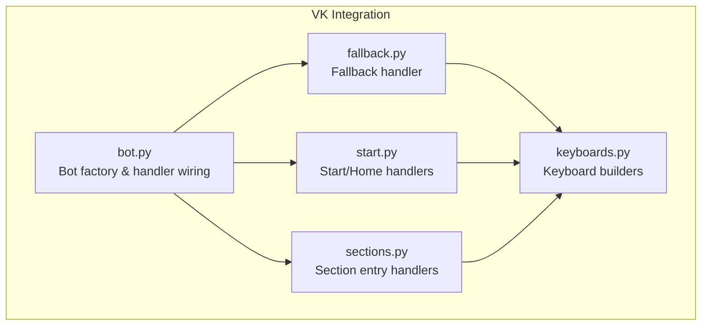
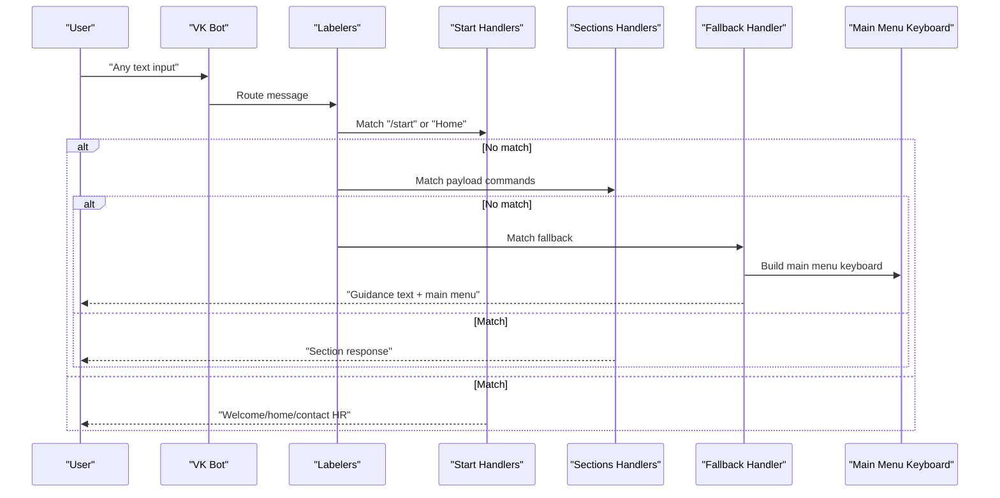
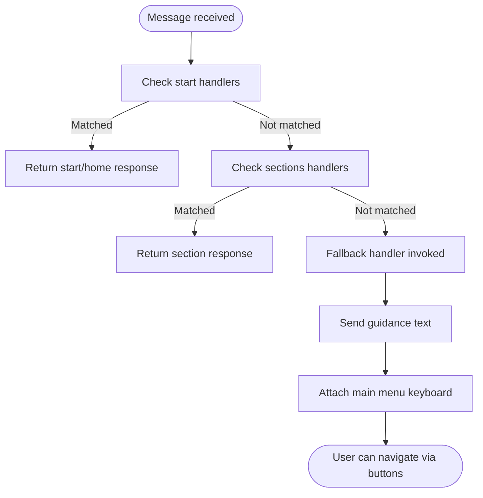
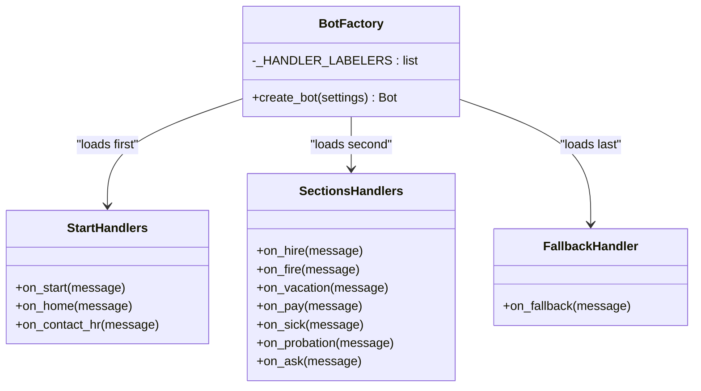
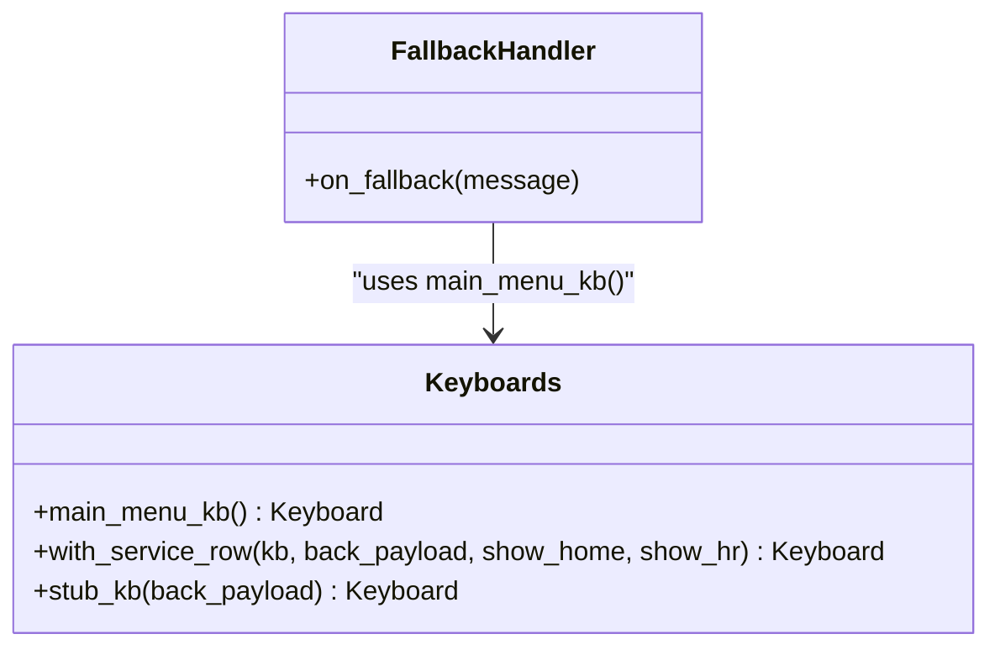
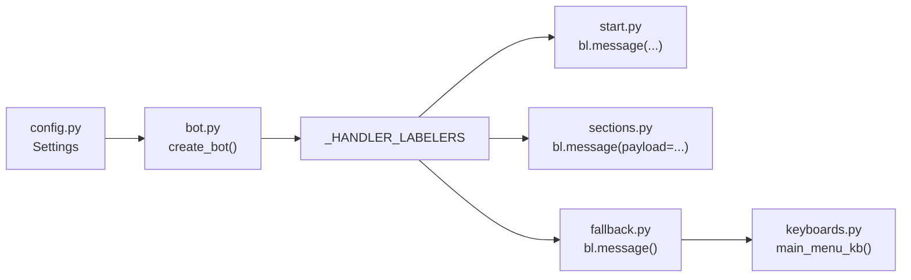

# Fallback Handler

<cite>
**Referenced Files in This Document**
- [fallback.py](file://app/integrations/vk/handlers/fallback.py)
- [bot.py](file://app/integrations/vk/bot.py)
- [keyboards.py](file://app/integrations/vk/keyboards.py)
- [start.py](file://app/integrations/vk/handlers/start.py)
- [sections.py](file://app/integrations/vk/handlers/sections.py)
- [states.py](file://app/integrations/vk/states.py)
- [polling_vk.py](file://scripts/polling_vk.py)
- [test_bot_factory.py](file://tests/test_bot_factory.py)
- [config.py](file://app/config.py)
</cite>

## Table of Contents
1. [Introduction](#introduction)
2. [Project Structure](#project-structure)
3. [Core Components](#core-components)
4. [Architecture Overview](#architecture-overview)
5. [Detailed Component Analysis](#detailed-component-analysis)
6. [Dependency Analysis](#dependency-analysis)
7. [Performance Considerations](#performance-considerations)
8. [Troubleshooting Guide](#troubleshooting-guide)
9. [Conclusion](#conclusion)

## Introduction
This document explains the fallback handler module responsible for managing unrecognized input and error handling in the VK bot. It covers the fallback message implementation, user guidance patterns, navigation back to the main menu, integration with the overall message routing system, and graceful error handling. Practical examples demonstrate how to customize fallback responses, implement help functionality, and extend error handling capabilities. Debugging techniques for message routing issues and evaluating fallback handler effectiveness are included.

## Project Structure
The fallback handler resides within the VK integration package and participates in a layered message routing system:
- The bot factory loads handler labelers in a specific order to ensure the fallback handler runs last.
- The fallback handler responds to any unmatched text input and guides users back to the main menu.
- Keyboard builders provide consistent navigation across all screens, including a main menu keyboard used by the fallback handler.

**Diagram sources**
- [bot.py:14-31](file://app/integrations/vk/bot.py#L14-L31)
- [fallback.py:15-17](file://app/integrations/vk/handlers/fallback.py#L15-L17)
- [start.py:31-54](file://app/integrations/vk/handlers/start.py#L31-L54)
- [sections.py:28-81](file://app/integrations/vk/handlers/sections.py#L28-L81)
- [keyboards.py:56-98](file://app/integrations/vk/keyboards.py#L56-L98)

**Section sources**
- [bot.py:14-31](file://app/integrations/vk/bot.py#L14-L31)
- [fallback.py:15-17](file://app/integrations/vk/handlers/fallback.py#L15-L17)
- [keyboards.py:56-98](file://app/integrations/vk/keyboards.py#L56-L98)

## Core Components
- Fallback handler: Catches any unmatched text input and responds with a guidance message and a main menu keyboard.
- Bot factory: Registers handler labelers in order, ensuring the fallback handler is last.
- Keyboard builders: Provide consistent navigation, including the main menu keyboard used by the fallback handler.
- Start and sections handlers: Define primary routes and navigation commands that the fallback handler can guide users back to.

Key responsibilities:
- Graceful handling of unrecognized input.
- Clear user guidance back to actionable menu options.
- Consistent keyboard UX across the bot.

**Section sources**
- [fallback.py:9-17](file://app/integrations/vk/handlers/fallback.py#L9-L17)
- [bot.py:14-31](file://app/integrations/vk/bot.py#L14-L31)
- [keyboards.py:56-98](file://app/integrations/vk/keyboards.py#L56-L98)
- [start.py:31-54](file://app/integrations/vk/handlers/start.py#L31-L54)
- [sections.py:28-81](file://app/integrations/vk/handlers/sections.py#L28-L81)

## Architecture Overview
The fallback handler is part of a top-to-bottom ordered handler chain. The bot factory ensures that:
- Start handlers match initial commands and home navigation.
- Section handlers match payload-driven navigation.
- The fallback handler matches any remaining messages and redirects users to the main menu.

**Diagram sources**
- [bot.py:16-20](file://app/integrations/vk/bot.py#L16-L20)
- [start.py:31-54](file://app/integrations/vk/handlers/start.py#L31-L54)
- [sections.py:28-81](file://app/integrations/vk/handlers/sections.py#L28-L81)
- [fallback.py:15-17](file://app/integrations/vk/handlers/fallback.py#L15-L17)
- [keyboards.py:56-98](file://app/integrations/vk/keyboards.py#L56-L98)

## Detailed Component Analysis

### Fallback Handler
The fallback handler:
- Uses a catch-all message matcher to intercept any unmatched text input.
- Sends a localized guidance message instructing users to use menu buttons.
- Attaches the main menu keyboard to enable immediate navigation back to the main menu.

Implementation highlights:
- Message matcher: Matches any incoming text not handled by earlier handlers.
- Guidance text: Friendly, non-technical message guiding users to use buttons.
- Keyboard attachment: Ensures users can navigate immediately without re-typing commands.

**Diagram sources**
- [bot.py:16-20](file://app/integrations/vk/bot.py#L16-L20)
- [fallback.py:15-17](file://app/integrations/vk/handlers/fallback.py#L15-L17)
- [keyboards.py:56-98](file://app/integrations/vk/keyboards.py#L56-L98)

**Section sources**
- [fallback.py:9-17](file://app/integrations/vk/handlers/fallback.py#L9-L17)

### Bot Factory and Handler Wiring
The bot factory registers labelers in a strict order:
- Start handlers first to capture initial commands and home navigation.
- Section handlers next to handle payload-driven navigation.
- Fallback handler last to ensure it only matches messages not caught by earlier handlers.

This ordering guarantees that:
- Users receive contextual responses for known commands.
- Unrecognized input is gracefully handled with clear guidance.
- The fallback handler acts as a safety net for all unexpected inputs.

**Diagram sources**
- [bot.py:16-20](file://app/integrations/vk/bot.py#L16-L20)
- [start.py:31-54](file://app/integrations/vk/handlers/start.py#L31-L54)
- [sections.py:28-81](file://app/integrations/vk/handlers/sections.py#L28-L81)
- [fallback.py:15-17](file://app/integrations/vk/handlers/fallback.py#L15-L17)

**Section sources**
- [bot.py:14-31](file://app/integrations/vk/bot.py#L14-L31)
- [test_bot_factory.py:8-21](file://tests/test_bot_factory.py#L8-L21)

### Keyboard Builders and Navigation
The keyboard builders provide consistent navigation patterns:
- Main menu keyboard: Seven functional sections plus a contact HR button.
- Service row: Back, Home, and Contact HR buttons available on most screens.
- Stub keyboard: Minimal keyboard for placeholder screens with optional Back button.

The fallback handler attaches the main menu keyboard to guide users back to actionable options.

**Diagram sources**
- [keyboards.py:56-98](file://app/integrations/vk/keyboards.py#L56-L98)
- [fallback.py:17](file://app/integrations/vk/handlers/fallback.py#L17)

**Section sources**
- [keyboards.py:56-98](file://app/integrations/vk/keyboards.py#L56-L98)
- [fallback.py:17](file://app/integrations/vk/handlers/fallback.py#L17)

### Start and Sections Handlers
Start handlers manage initial commands and home navigation:
- Responds to "/start" and "Начать" variants.
- Provides greeting text and the main menu keyboard.
- Handles Home payload to return users to the main menu.

Sections handlers manage payload-driven navigation:
- Each section command triggers a stub response with a keyboard that includes a Back payload pointing to Home.
- Ensures users can navigate back to the main menu from any section.

These handlers complement the fallback handler by providing structured navigation and clear exit points.

**Section sources**
- [start.py:31-54](file://app/integrations/vk/handlers/start.py#L31-L54)
- [sections.py:28-81](file://app/integrations/vk/handlers/sections.py#L28-L81)

### States Management
States define multi-step dialog scenarios:
- Named states for HR request dialogs (e.g., name, topic, details, entity, urgency, confirmation).
- States support structured flows for complex user interactions.

While the fallback handler does not directly use states, consistent state transitions rely on clear navigation back to the main menu, which the fallback handler facilitates.

**Section sources**
- [states.py:4-13](file://app/integrations/vk/states.py#L4-L13)

## Dependency Analysis
The fallback handler depends on:
- The VK bot framework’s message routing mechanism.
- The main menu keyboard builder for consistent navigation.
- The bot factory’s handler registration order to remain last in the chain.

Integration points:
- Handler registration order in the bot factory ensures the fallback handler is loaded after start and sections handlers.
- Keyboard builders provide reusable navigation patterns across the application.

Potential issues:
- Incorrect handler order can cause the fallback handler to match before intended handlers.
- Missing keyboard attachment can leave users without navigation options.

**Diagram sources**
- [config.py:4-9](file://app/config.py#L4-L9)
- [bot.py:16-20](file://app/integrations/vk/bot.py#L16-L20)
- [start.py:31-54](file://app/integrations/vk/handlers/start.py#L31-L54)
- [sections.py:28-81](file://app/integrations/vk/handlers/sections.py#L28-L81)
- [fallback.py:15-17](file://app/integrations/vk/handlers/fallback.py#L15-L17)
- [keyboards.py:56-98](file://app/integrations/vk/keyboards.py#L56-L98)

**Section sources**
- [bot.py:16-20](file://app/integrations/vk/bot.py#L16-L20)
- [fallback.py:5](file://app/integrations/vk/handlers/fallback.py#L5)
- [keyboards.py:56-98](file://app/integrations/vk/keyboards.py#L56-L98)

## Performance Considerations
- Handler order: Maintaining the correct load order prevents unnecessary message processing and reduces latency.
- Keyboard reuse: Using pre-built keyboards avoids runtime construction overhead.
- Message routing: Catch-all handlers should be lightweight to minimize impact on throughput.

## Troubleshooting Guide
Common issues and resolutions:
- Fallback handler not triggered:
  - Verify the bot factory loads the fallback labeler last.
  - Confirm that earlier handlers do not inadvertently match the user’s input.
  - Check that the message routing order is preserved during updates.

- Users cannot navigate back to the main menu:
  - Ensure the fallback handler attaches the main menu keyboard.
  - Verify that the main menu keyboard is correctly constructed and returned as JSON.

- Unexpected behavior with payload commands:
  - Review payload constants and ensure they match between handlers and keyboards.
  - Confirm that payload-driven handlers are registered before the fallback handler.

Debugging techniques:
- Logging: Add logs in the bot factory to confirm handler registration order and count.
- Manual testing: Send various inputs to verify routing behavior and fallback activation.
- Unit tests: Use existing tests to validate handler order and handler counts.

Practical examples:
- Customizing fallback responses:
  - Modify the guidance text to include contextual hints based on recent actions.
  - Add quick action buttons alongside the main menu to reduce navigation steps.

- Implementing help functionality:
  - Extend the fallback handler to detect help-related keywords and provide targeted help text.
  - Attach a help keyboard with links to FAQs or contact options.

- Extending error handling capabilities:
  - Introduce state-aware fallbacks that preserve user context when returning to the main menu.
  - Add analytics hooks to track fallback-triggered interactions for improvement.

**Section sources**
- [test_bot_factory.py:8-21](file://tests/test_bot_factory.py#L8-L21)
- [bot.py:23-31](file://app/integrations/vk/bot.py#L23-L31)
- [polling_vk.py:24-28](file://scripts/polling_vk.py#L24-L28)

## Conclusion
The fallback handler plays a critical role in maintaining a smooth user experience by gracefully handling unrecognized input and guiding users back to the main menu. Its integration with the bot factory’s handler registration order ensures predictable routing behavior. By leveraging consistent keyboard patterns and complementary start and sections handlers, the fallback handler contributes to a robust, navigable interface. Extending the fallback handler with contextual guidance, help functionality, and state-awareness can further enhance user satisfaction and system reliability.