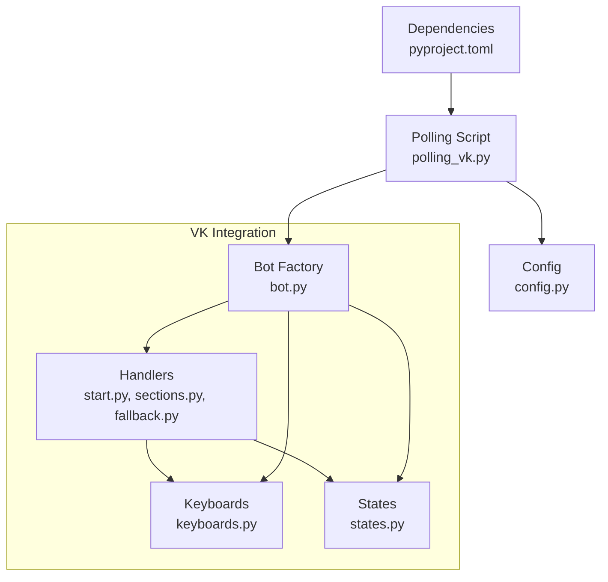
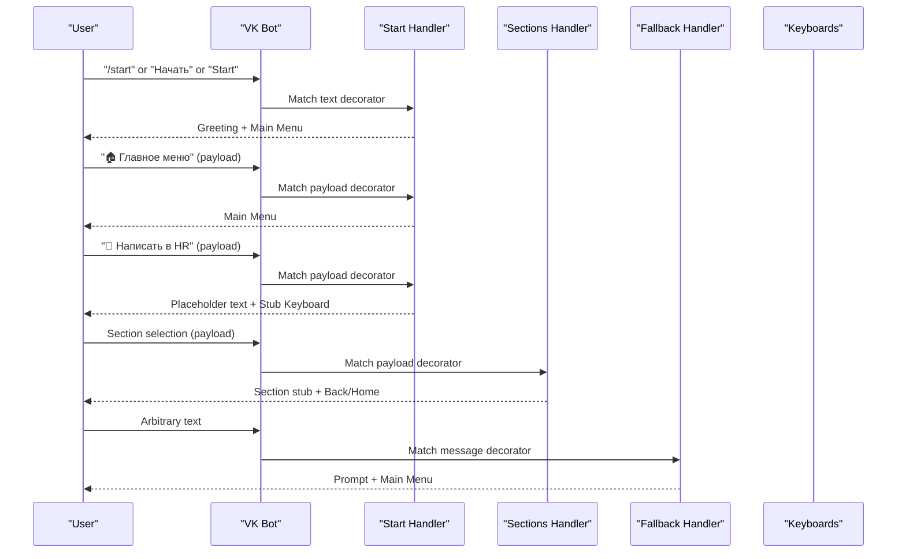
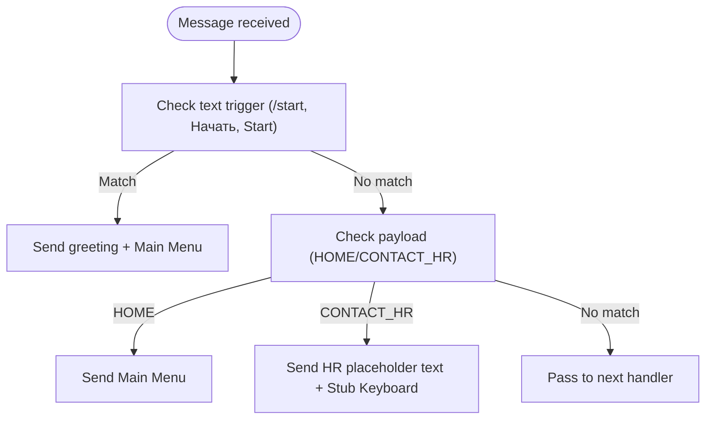
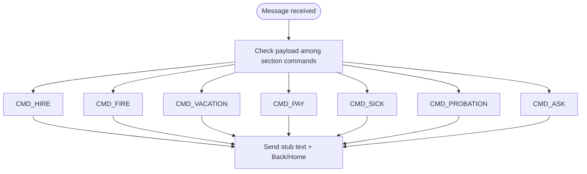
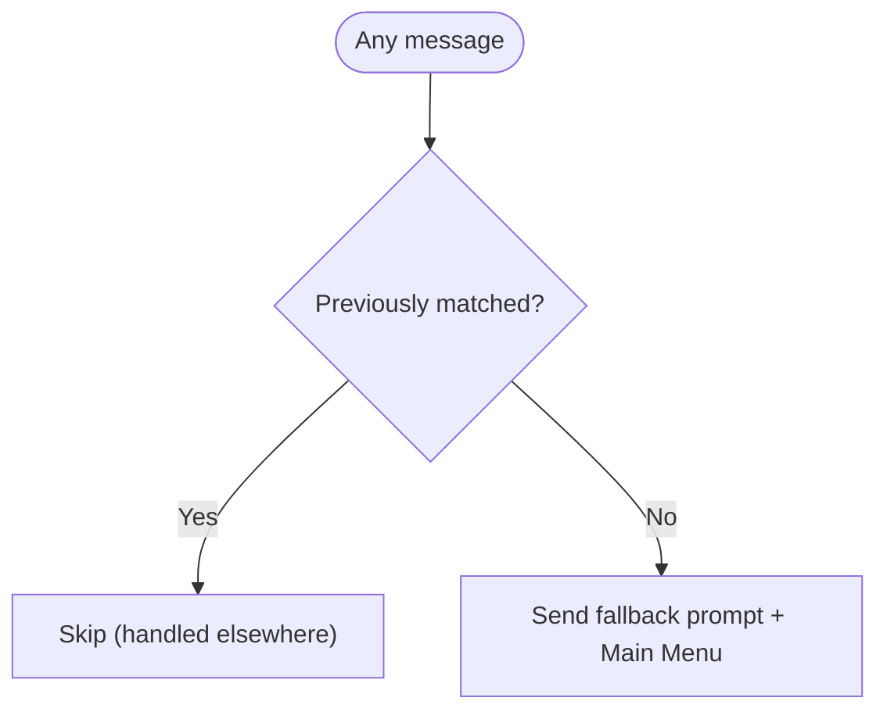
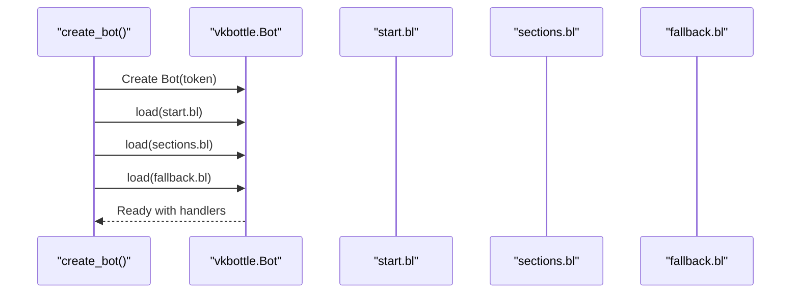
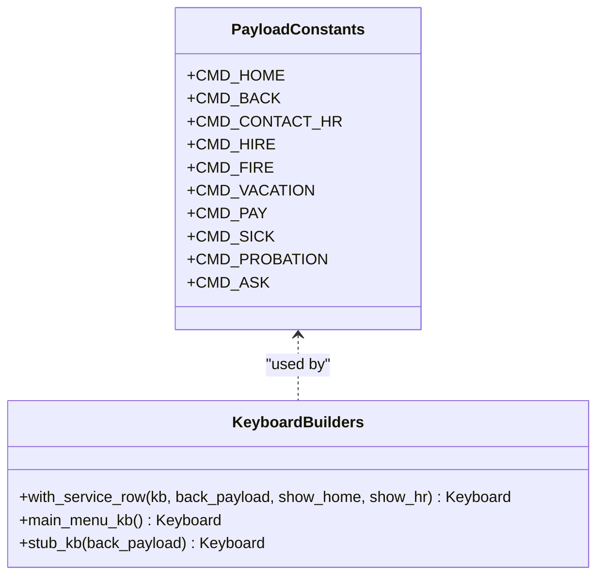
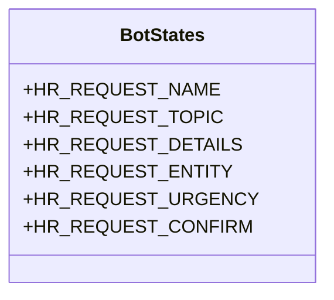
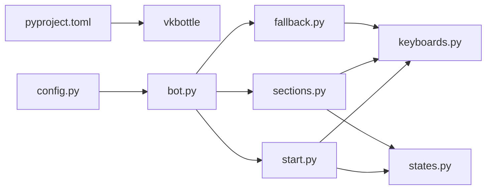

# Handler System

<cite>
**Referenced Files in This Document**
- [start.py](file://app/integrations/vk/handlers/start.py)
- [sections.py](file://app/integrations/vk/handlers/sections.py)
- [fallback.py](file://app/integrations/vk/handlers/fallback.py)
- [bot.py](file://app/integrations/vk/bot.py)
- [keyboards.py](file://app/integrations/vk/keyboards.py)
- [states.py](file://app/integrations/vk/states.py)
- [polling_vk.py](file://scripts/polling_vk.py)
- [config.py](file://app/config.py)
- [test_bot_factory.py](file://tests/test_bot_factory.py)
- [test_keyboards.py](file://tests/test_keyboards.py)
- [test_states.py](file://tests/test_states.py)
- [pyproject.toml](file://pyproject.toml)
</cite>

## Table of Contents
1. [Introduction](#introduction)
2. [Project Structure](#project-structure)
3. [Core Components](#core-components)
4. [Architecture Overview](#architecture-overview)
5. [Detailed Component Analysis](#detailed-component-analysis)
6. [Dependency Analysis](#dependency-analysis)
7. [Performance Considerations](#performance-considerations)
8. [Troubleshooting Guide](#troubleshooting-guide)
9. [Conclusion](#conclusion)
10. [Appendices](#appendices)

## Introduction
This document explains the modular handler system that powers the VK bot’s message processing and bot behavior. It covers how handlers are organized, registered, and executed in order, how payload-based routing works, and how the fallback handler ensures robustness against unrecognized input. You will learn how the start handler initializes conversations, how the sections handler organizes the main menu, and how the fallback handler gracefully handles unexpected messages. Practical guidance is included for adding new handlers, extending functionality, and debugging routing issues.

## Project Structure
The handler system resides under the VK integration module and is composed of:
- Handler modules that define message routes using a BotLabeler
- A bot factory that wires handlers in a specific order
- Keyboard builders that provide payload constants and navigation controls
- States for multi-step dialogs
- Tests validating handler wiring and keyboard behavior

**Diagram sources**
- [bot.py:14-31](file://app/integrations/vk/bot.py#L14-L31)
- [polling_vk.py:14-28](file://scripts/polling_vk.py#L14-L28)
- [keyboards.py:11-24](file://app/integrations/vk/keyboards.py#L11-L24)
- [states.py:4-14](file://app/integrations/vk/states.py#L4-L14)
- [pyproject.toml:7-22](file://pyproject.toml#L7-L22)

**Section sources**
- [bot.py:14-31](file://app/integrations/vk/bot.py#L14-L31)
- [polling_vk.py:14-28](file://scripts/polling_vk.py#L14-L28)
- [pyproject.toml:7-22](file://pyproject.toml#L7-L22)

## Core Components
- Handler modules:
  - Start handler: responds to initial commands and home navigation
  - Sections handler: routes to main menu subsections via payload
  - Fallback handler: catches unmatched text input
- Bot factory: loads handlers in a strict order to ensure correct precedence
- Keyboard builders: define payload constants and service buttons for navigation
- States: define multi-step dialog states for complex flows

Key responsibilities:
- Routing: text-based and payload-based routing via vkbottle decorators
- Navigation: consistent service buttons (Back/Home/Contact HR) across screens
- Cohesion: each handler module encapsulates a functional area
- Extensibility: new handlers can be added by creating a new module and updating the loader order

**Section sources**
- [start.py:12-55](file://app/integrations/vk/handlers/start.py#L12-L55)
- [sections.py:17-82](file://app/integrations/vk/handlers/sections.py#L17-L82)
- [fallback.py:7-18](file://app/integrations/vk/handlers/fallback.py#L7-L18)
- [bot.py:14-31](file://app/integrations/vk/bot.py#L14-L31)
- [keyboards.py:11-108](file://app/integrations/vk/keyboards.py#L11-L108)
- [states.py:4-14](file://app/integrations/vk/states.py#L4-L14)

## Architecture Overview
The handler architecture follows a layered, modular design:
- Handlers are grouped by functional areas (start, sections, fallback)
- Each handler module defines a BotLabeler and registers message handlers
- The bot factory loads labelers in a fixed order to ensure:
  - Start handlers match before sections
  - Sections match before fallback
- Payload constants drive navigation and section entry points
- States enable multi-step dialogs

**Diagram sources**
- [start.py:31-55](file://app/integrations/vk/handlers/start.py#L31-L55)
- [sections.py:28-82](file://app/integrations/vk/handlers/sections.py#L28-L82)
- [fallback.py:15-18](file://app/integrations/vk/handlers/fallback.py#L15-L18)
- [keyboards.py:13-24](file://app/integrations/vk/keyboards.py#L13-L24)

## Detailed Component Analysis

### Start Handler
Purpose:
- Initialize conversations with greeting and main menu
- Provide home navigation and contact HR placeholder

Key behaviors:
- Responds to multiple text triggers for “start”
- Sends main menu with service buttons
- Handles home navigation via payload
- Provides a placeholder for contacting HR

Routing mechanism:
- Text-based routing for start commands
- Payload-based routing for home navigation
- Payload-based routing for contact HR placeholder

**Diagram sources**
- [start.py:31-55](file://app/integrations/vk/handlers/start.py#L31-L55)
- [keyboards.py:13-24](file://app/integrations/vk/keyboards.py#L13-L24)

**Section sources**
- [start.py:12-55](file://app/integrations/vk/handlers/start.py#L12-L55)
- [keyboards.py:13-24](file://app/integrations/vk/keyboards.py#L13-L24)

### Sections Handler
Purpose:
- Route users to main menu subsections
- Provide placeholders for each section

Key behaviors:
- Routes via payload constants for each section
- Sends a stub response with a back button to the main menu
- Maintains consistent navigation across screens

Routing mechanism:
- Payload-based routing for each section command
- Uses shared stub response builder

**Diagram sources**
- [sections.py:28-82](file://app/integrations/vk/handlers/sections.py#L28-L82)
- [keyboards.py:17-23](file://app/integrations/vk/keyboards.py#L17-L23)

**Section sources**
- [sections.py:17-82](file://app/integrations/vk/handlers/sections.py#L17-L82)
- [keyboards.py:17-23](file://app/integrations/vk/keyboards.py#L17-L23)

### Fallback Handler
Purpose:
- Catch any unmatched text input
- Guide users back to the main menu

Key behaviors:
- Matches any message not handled by previous handlers
- Sends a friendly prompt and main menu keyboard

**Diagram sources**
- [fallback.py:15-18](file://app/integrations/vk/handlers/fallback.py#L15-L18)
- [keyboards.py:13](file://app/integrations/vk/keyboards.py#L13)

**Section sources**
- [fallback.py:7-18](file://app/integrations/vk/handlers/fallback.py#L7-L18)
- [keyboards.py:13](file://app/integrations/vk/keyboards.py#L13)

### Bot Factory and Handler Registration
Purpose:
- Wire up all handlers in a deterministic order
- Ensure fallback runs last to catch unmatched messages

Key behaviors:
- Defines the ordered list of labelers
- Loads each labeler into the bot’s labeler
- Logs successful loading

**Diagram sources**
- [bot.py:23-31](file://app/integrations/vk/bot.py#L23-L31)

**Section sources**
- [bot.py:14-31](file://app/integrations/vk/bot.py#L14-L31)
- [test_bot_factory.py:8-44](file://tests/test_bot_factory.py#L8-L44)

### Keyboard Builders and Payload Constants
Purpose:
- Define payload constants for navigation and sections
- Build keyboards with consistent service buttons

Key behaviors:
- Expose payload constants for HOME, BACK, CONTACT_HR, and sections
- Provide helpers to add a service row with configurable buttons
- Build the main menu keyboard with section buttons and a dedicated HR button

**Diagram sources**
- [keyboards.py:13-24](file://app/integrations/vk/keyboards.py#L13-L24)
- [keyboards.py:29-108](file://app/integrations/vk/keyboards.py#L29-L108)

**Section sources**
- [keyboards.py:11-108](file://app/integrations/vk/keyboards.py#L11-L108)
- [test_keyboards.py:49-92](file://tests/test_keyboards.py#L49-L92)
- [test_keyboards.py:176-192](file://tests/test_keyboards.py#L176-L192)

### States for Multi-Step Dialogs
Purpose:
- Define states for complex, multi-step flows (e.g., HR request wizard)

Key behaviors:
- Enum-like state names for each step
- Unique values to prevent conflicts
- Integration with vkbottle’s state management

**Diagram sources**
- [states.py:4-14](file://app/integrations/vk/states.py#L4-L14)

**Section sources**
- [states.py:4-14](file://app/integrations/vk/states.py#L4-L14)
- [test_states.py:8-31](file://tests/test_states.py#L8-L31)

## Dependency Analysis
The handler system depends on:
- vkbottle for message routing and bot lifecycle
- Keyboard builders for consistent UI and payload-driven navigation
- Pydantic settings for configuration
- Tests validating wiring and keyboard behavior

**Diagram sources**
- [pyproject.toml:7-22](file://pyproject.toml#L7-L22)
- [config.py:4-9](file://app/config.py#L4-L9)
- [bot.py:10-31](file://app/integrations/vk/bot.py#L10-L31)
- [keyboards.py:9-108](file://app/integrations/vk/keyboards.py#L9-L108)
- [states.py:1-14](file://app/integrations/vk/states.py#L1-L14)

**Section sources**
- [pyproject.toml:7-22](file://pyproject.toml#L7-L22)
- [bot.py:10-31](file://app/integrations/vk/bot.py#L10-L31)
- [keyboards.py:9-108](file://app/integrations/vk/keyboards.py#L9-L108)

## Performance Considerations
- Handler order is critical: keep fallback last to minimize unnecessary checks
- Payload-based routing is efficient and predictable
- Keyboard building is lightweight; avoid excessive re-computation
- Logging in the bot factory helps diagnose wiring issues early

## Troubleshooting Guide
Common issues and resolutions:
- Unexpected fallback activation:
  - Verify handler order in the bot factory
  - Confirm payload constants are consistent across keyboards and handlers
- Missing navigation buttons:
  - Ensure service row is appended to keyboards
  - Validate payload values and labels
- State transitions not working:
  - Confirm state names and values are unique
  - Check that state decorators are applied correctly in handlers

Debugging steps:
- Run the local polling script to observe logs and confirm handler loading
- Inspect handler counts and order via tests
- Validate keyboard payloads and labels with keyboard tests

**Section sources**
- [polling_vk.py:24-28](file://scripts/polling_vk.py#L24-L28)
- [test_bot_factory.py:23-44](file://tests/test_bot_factory.py#L23-L44)
- [test_keyboards.py:49-92](file://tests/test_keyboards.py#L49-L92)
- [test_keyboards.py:176-192](file://tests/test_keyboards.py#L176-L192)
- [test_states.py:8-31](file://tests/test_states.py#L8-L31)

## Conclusion
The modular handler system provides a clean, extensible foundation for the VK bot. By organizing functionality into focused handler modules, enforcing a strict registration order, and leveraging payload-based routing, the system delivers predictable and maintainable bot behavior. The fallback handler ensures graceful handling of unrecognized input, while keyboard builders and states support consistent navigation and complex workflows.

## Appendices

### Creating a New Handler Module
Steps:
- Create a new handler module under the VK handlers directory
- Define a BotLabeler instance
- Register message handlers using text or payload decorators
- Add the new labeler to the bot factory’s ordered list
- Re-run tests to verify wiring and handler count

References:
- [bot.py:16-20](file://app/integrations/vk/bot.py#L16-L20)
- [test_bot_factory.py:11-21](file://tests/test_bot_factory.py#L11-L21)

### Extending Existing Functionality
Examples:
- Add a new section:
  - Define a new payload constant
  - Add a handler in sections.py
  - Update main menu keyboard if needed
- Enhance start handler:
  - Add new text triggers
  - Introduce new navigation flows
- Improve fallback:
  - Customize fallback text
  - Add contextual suggestions

References:
- [keyboards.py:13-24](file://app/integrations/vk/keyboards.py#L13-L24)
- [sections.py:28-82](file://app/integrations/vk/handlers/sections.py#L28-L82)
- [start.py:31-55](file://app/integrations/vk/handlers/start.py#L31-L55)
- [fallback.py:15-18](file://app/integrations/vk/handlers/fallback.py#L15-L18)

### Debugging Message Routing Issues
Checklist:
- Confirm handler order in bot factory
- Validate payload constants and keyboard payloads
- Ensure service buttons are present on all screens
- Review logs from the polling script
- Run keyboard and state tests to validate assumptions

References:
- [bot.py:23-31](file://app/integrations/vk/bot.py#L23-L31)
- [polling_vk.py:24-28](file://scripts/polling_vk.py#L24-L28)
- [test_keyboards.py:49-92](file://tests/test_keyboards.py#L49-L92)
- [test_states.py:8-31](file://tests/test_states.py#L8-L31)