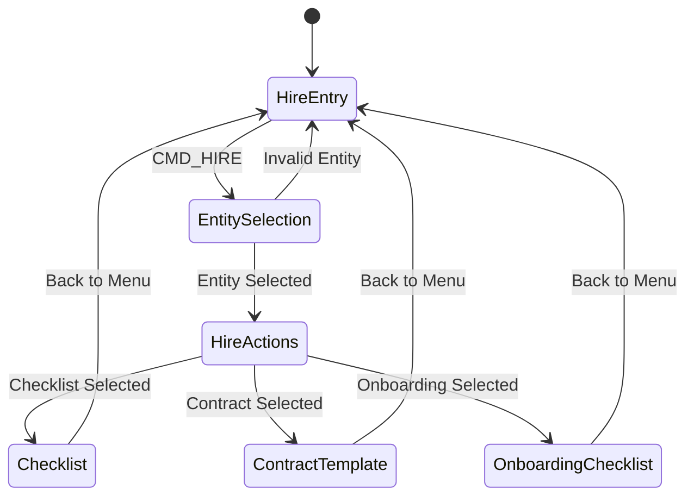
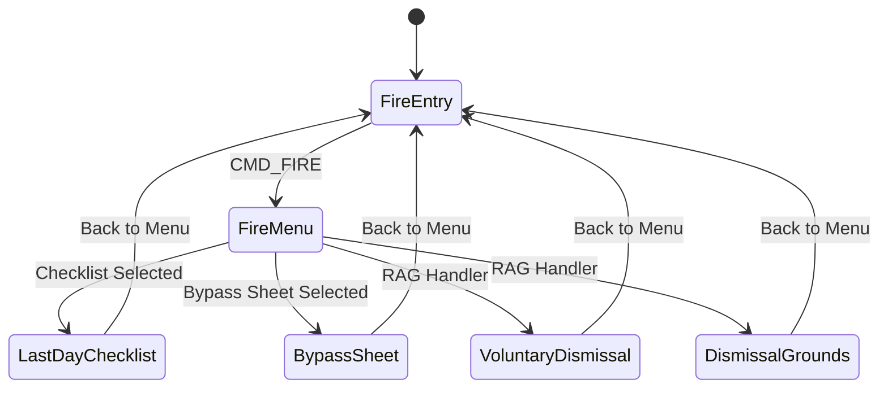
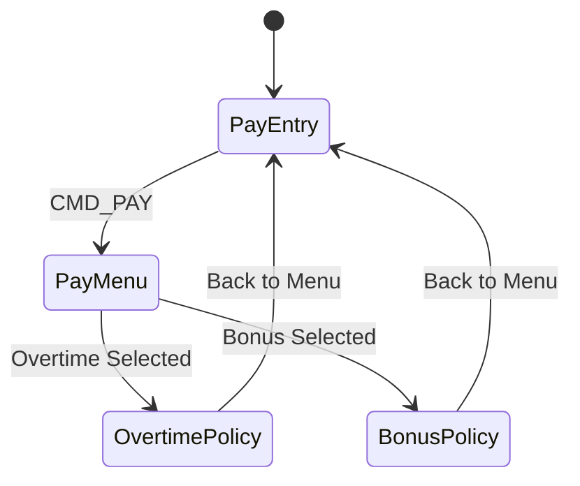
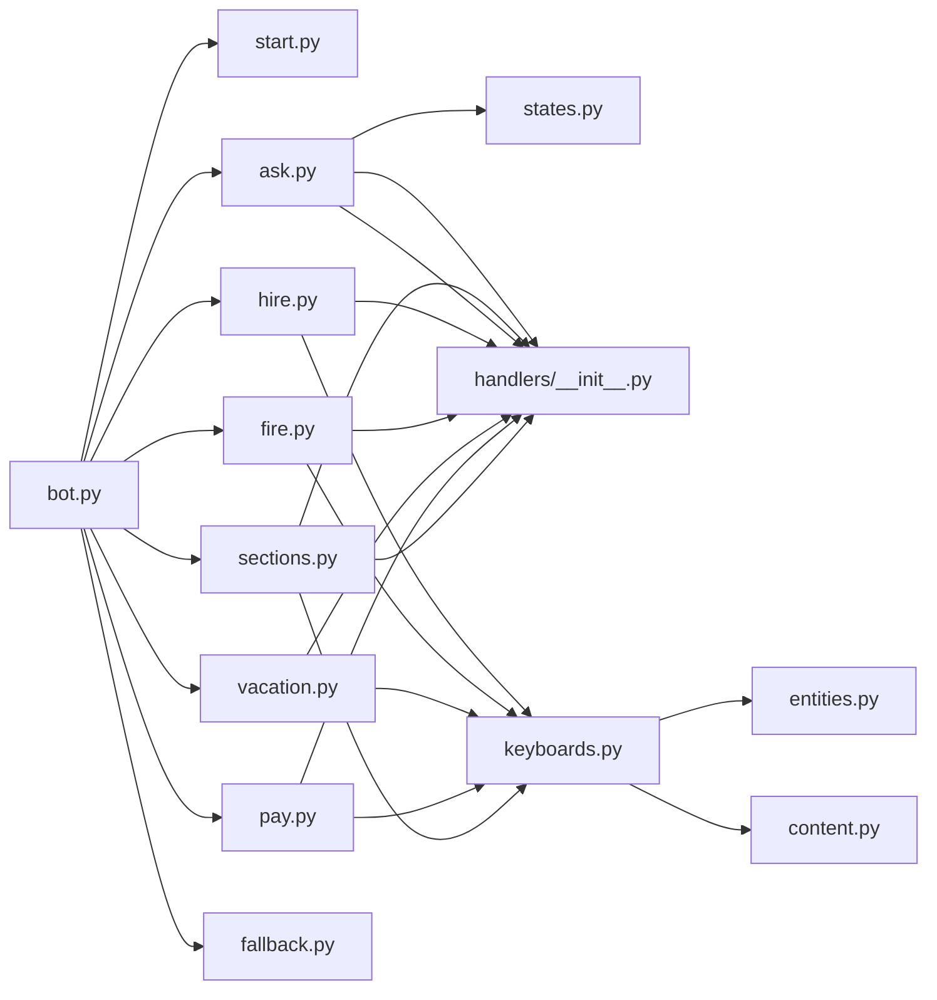

# Sections Handler

<cite>
**Referenced Files in This Document**
- [sections.py](file://app/integrations/vk/handlers/sections.py)
- [hire.py](file://app/integrations/vk/handlers/hire.py)
- [fire.py](file://app/integrations/vk/handlers/fire.py)
- [vacation.py](file://app/integrations/vk/handlers/vacation.py)
- [pay.py](file://app/integrations/vk/handlers/pay.py)
- [ask.py](file://app/integrations/vk/handlers/ask.py)
- [keyboards.py](file://app/integrations/vk/keyboards.py)
- [states.py](file://app/integrations/vk/states.py)
- [bot.py](file://app/integrations/vk/bot.py)
- [start.py](file://app/integrations/vk/handlers/start.py)
- [fallback.py](file://app/integrations/vk/handlers/fallback.py)
- [handlers/__init__.py](file://app/integrations/vk/handlers/__init__.py)
- [test_keyboards.py](file://tests/test_keyboards.py)
- [test_states.py](file://tests/test_states.py)
</cite>

## Update Summary
**Changes Made**
- Updated sections handler to reflect the removal of HR request multi-step dialog system
- Simplified documentation to focus on current RAG-powered handlers for sick leave and probation
- Removed extensive documentation about six-step HR request workflow and state management
- Updated handler loading order and integration patterns to reflect current architecture
- Documented payload routing system for remaining HR categories (hiring, termination, vacation, payment, ask question)

## Table of Contents
1. [Introduction](#introduction)
2. [Project Structure](#project-structure)
3. [Core Components](#core-components)
4. [Architecture Overview](#architecture-overview)
5. [Detailed Component Analysis](#detailed-component-analysis)
6. [Dependency Analysis](#dependency-analysis)
7. [Performance Considerations](#performance-considerations)
8. [Troubleshooting Guide](#troubleshooting-guide)
9. [Conclusion](#conclusion)

## Introduction
This document explains the sections handler module that implements the current HR categories functionality for the VK bot. The system has been simplified from a complex multi-step dialog system to focused RAG-powered handlers for specific HR categories. The documentation covers the seven-section HR menu, payload routing system, and integration patterns for hiring, termination, vacation, payment, sick leave, probation, and question handling scenarios.

## Project Structure
The sections handler now serves as a streamlined RAG-powered handler for remaining HR categories, while dedicated modules handle the major employment lifecycle management. The bot wiring maintains a specific order to ensure proper routing and state management across all handlers.

```mermaid
graph TB
subgraph "Streamlined VK Integration System"
BOT["bot.py<br/>Bot factory and handler loader"]
START["start.py<br/>Start/home/contact handlers"]
ASK["ask.py<br/>Free-text question handler"]
HIRE["hire.py<br/>S-10/S-11 multi-step flow"]
FIRE["fire.py<br/>S-20/S-21b multi-step flow"]
VACATION["vacation.py<br/>S-30 multi-step flow"]
PAY["pay.py<br/>S-40 multi-step flow"]
SECTIONS["sections.py<br/>RAG handlers for sick/probation"]
FALLBACK["fallback.py<br/>Unmatched message handler"]
KEYBOARDS["keyboards.py<br/>Comprehensive keyboard builders"]
STATES["states.py<br/>Simple state management"]
END
BOT --> START
BOT --> ASK
BOT --> HIRE
BOT --> FIRE
BOT --> VACATION
BOT --> PAY
BOT --> SECTIONS
BOT --> FALLBACK
HIRE --> KEYBOARDS
FIRE --> KEYBOARDS
VACATION --> KEYBOARDS
PAY --> KEYBOARDS
ASK --> KEYBOARDS
SECTIONS --> KEYBOARDS
START --> KEYBOARDS
START --> STATES
```

**Diagram sources**
- [bot.py:24-41](file://app/integrations/vk/bot.py#L24-L41)
- [hire.py:1-98](file://app/integrations/vk/handlers/hire.py#L1-L98)
- [fire.py:1-74](file://app/integrations/vk/handlers/fire.py#L1-L74)
- [vacation.py:1-80](file://app/integrations/vk/handlers/vacation.py#L1-L80)
- [pay.py:1-46](file://app/integrations/vk/handlers/pay.py#L1-L46)
- [ask.py:1-90](file://app/integrations/vk/handlers/ask.py#L1-L90)
- [sections.py:1-35](file://app/integrations/vk/handlers/sections.py#L1-L35)

**Section sources**
- [bot.py:24-41](file://app/integrations/vk/bot.py#L24-L41)
- [keyboards.py:13-26](file://app/integrations/vk/keyboards.py#L13-L26)

## Core Components
The streamlined sections handler system consists of several focused components working together to provide comprehensive HR functionality:

- **RAG-Powered Handlers**: Specialized modules for sick leave and probation with Retrieval-Augmented Generation
- **Payload Routing System**: Comprehensive payload-based routing for all HR categories
- **State Management**: Simple finite state machine for free-text question handling
- **Keyboard Builders**: Advanced keyboard construction with service rows and specialized layouts
- **Handler Loading Order**: Strategic ordering to ensure proper message routing and state preservation

Key responsibilities:
- **Seven-section HR Menu**: Hiring (S-10), Termination (S-20), Vacation (S-30), Payment (S-40), Sick Leave (S-50), Probation (S-60), Ask Question (S-ASK)
- **RAG Integration**: Context-aware content delivery for specific HR categories
- **State-based Processing**: Persistent user context for free-text question handling
- **Advanced Navigation**: Back/Home/Contact HR buttons with intelligent routing logic

**Section sources**
- [sections.py:1-35](file://app/integrations/vk/handlers/sections.py#L1-L35)
- [hire.py:1-98](file://app/integrations/vk/handlers/hire.py#L1-L98)
- [fire.py:1-74](file://app/integrations/vk/handlers/fire.py#L1-L74)
- [vacation.py:1-80](file://app/integrations/vk/handlers/vacation.py#L1-L80)
- [pay.py:1-46](file://app/integrations/vk/handlers/pay.py#L1-L46)
- [ask.py:1-90](file://app/integrations/vk/handlers/ask.py#L1-L90)
- [keyboards.py:13-26](file://app/integrations/vk/keyboards.py#L13-L26)
- [states.py:4-9](file://app/integrations/vk/states.py#L4-L9)

## Architecture Overview
The streamlined sections handler participates in a focused handler chain with strategic ordering to support RAG-powered content delivery for specific HR categories. The system uses a shared state dispenser to maintain user context for free-text questions, enabling seamless transitions between different HR categories.

```mermaid
sequenceDiagram
participant User as "User"
participant Bot as "VK Bot"
participant Hire as "Hire Flow"
participant Fire as "Fire Flow"
participant Vacation as "Vacation Flow"
participant Pay as "Pay Flow"
participant Sections as "Sections Handler"
participant Ask as "Ask Handler"
participant Keyboards as "Keyboard Builders"
participant Fallback as "Fallback Handler"
User->>Bot : "Message with payload"
Bot->>Hire : Entity selection
Hire->>Keyboards : Build entity selection keyboard
Hire-->>User : Multi-step response
else Fire Flow
Fire->>Keyboards : Build fire menu keyboard
Fire-->>User : Multi-step response
else Vacation Flow
Vacation->>Keyboards : Build vacation menu keyboard
Vacation-->>User : Multi-step response
else Pay Flow
Pay->>Keyboards : Build pay menu keyboard
Pay-->>User : Multi-step response
else Ask Handler
Ask->>Keyboards : Build ask input keyboard
Ask-->>User : Stateful free-text input
else Sections Handler
Sections->>Keyboards : Build RAG-powered response
Sections-->>User : Context-aware content delivery
end
```

**Diagram sources**
- [bot.py:24-41](file://app/integrations/vk/bot.py#L24-L41)
- [hire.py:32-56](file://app/integrations/vk/handlers/hire.py#L32-L56)
- [fire.py:28-33](file://app/integrations/vk/handlers/fire.py#L28-L33)
- [vacation.py:30-35](file://app/integrations/vk/handlers/vacation.py#L30-L35)
- [pay.py:24-29](file://app/integrations/vk/handlers/pay.py#L24-L29)
- [ask.py:38-45](file://app/integrations/vk/handlers/ask.py#L38-L45)
- [sections.py:24-34](file://app/integrations/vk/handlers/sections.py#L24-L34)

## Detailed Component Analysis

### Streamlined Sections Handler: RAG-Powered Handlers
The sections handler now focuses on RAG-powered handlers for remaining HR categories, specifically sick leave and probation. The handler maintains backward compatibility while supporting the current streamlined system.

**Updated** The sections handler now provides focused RAG-powered content delivery for sick leave (S-50) and probation (S-60) categories, while dedicated modules handle the major HR categories.

- **Sick Leave (S-50)**: RAG-powered handler with entity-aware content delivery
- **Probation (S-60)**: RAG-powered handler with contextual responses
- **Remaining Categories**: Integrated into the main menu but handled by dedicated flow modules

Routing mechanism:
- Payload-based matching routes messages to appropriate handlers
- Dedicated flow handlers manage complex multi-step conversations
- RAG-powered handlers provide context-aware responses with navigation options

Navigation:
- Each response includes intelligent service row with Back/Home/Contact HR buttons
- Context-aware back navigation preserves user progress in multi-step flows

**Section sources**
- [sections.py:1-35](file://app/integrations/vk/handlers/sections.py#L1-L35)
- [sections.py:24-34](file://app/integrations/vk/handlers/sections.py#L24-L34)

### Comprehensive Employment Lifecycle Management

#### Hire Flow (S-10/S-11)
The hire flow implements a sophisticated two-step process with entity selection and action menu, providing dynamic content delivery based on selected entities.

**Updated** Enhanced from simple stub to comprehensive multi-step flow with entity-aware content delivery.



**Diagram sources**
- [hire.py:32-52](file://app/integrations/vk/handlers/hire.py#L32-L52)
- [hire.py:58-67](file://app/integrations/vk/handlers/hire.py#L58-L67)
- [hire.py:73-82](file://app/integrations/vk/handlers/hire.py#L73-L82)
- [hire.py:88-97](file://app/integrations/vk/handlers/hire.py#L88-L97)

Key features:
- **Entity Selection**: Legal entity selection with validation and error handling
- **Action Menu**: Context-aware action selection based on entity type
- **Content Delivery**: Dynamic content generation based on selected entity
- **Navigation**: Intelligent back navigation preserving user context

#### Fire Flow (S-20/S-21b)
The fire flow manages termination processes with specialized checklists, bypass sheets, and RAG-powered handlers for voluntary dismissals and dismissal grounds.

**Updated** Enhanced from simple stub to comprehensive multi-step flow with specialized content delivery.



**Diagram sources**
- [fire.py:28-33](file://app/integrations/vk/handlers/fire.py#L28-L33)
- [fire.py:39-44](file://app/integrations/vk/handlers/fire.py#L39-L44)
- [fire.py:50-55](file://app/integrations/vk/handlers/fire.py#L50-L55)
- [fire.py:61-73](file://app/integrations/vk/handlers/fire.py#L61-L73)

#### Vacation Flow (S-30)
The vacation flow handles leave applications with entity selection for template generation and RAG-powered handlers for procedural information.

**Updated** Enhanced from simple stub to comprehensive multi-step flow with template generation.


**Diagram sources**
- [vacation.py:30-35](file://app/integrations/vk/handlers/vacation.py#L30-L35)
- [vacation.py:41-46](file://app/integrations/vk/handlers/vacation.py#L41-L46)
- [vacation.py:52-61](file://app/integrations/vk/handlers/vacation.py#L52-L61)
- [vacation.py:67-79](file://app/integrations/vk/handlers/vacation.py#L67-L79)

#### Pay Flow (S-40)
The pay flow manages overtime and bonus inquiries with RAG-powered handlers for policy information.

**Updated** Enhanced from simple stub to comprehensive multi-step flow with specialized content delivery.



**Diagram sources**
- [pay.py:24-29](file://app/integrations/vk/handlers/pay.py#L24-L29)
- [pay.py:35-37](file://app/integrations/vk/handlers/pay.py#L35-L37)
- [pay.py:43-45](file://app/integrations/vk/handlers/pay.py#L43-L45)

### Simple State-Based Dialog Management
The streamlined system features straightforward state management supporting free-text question handling with comprehensive user context preservation.

**Updated** Simplified from complex multi-step dialogs to focused state management for free-text question handling.

States:
- **ASK_QUESTION**: Capture free-text questions with validation and RAG processing

Integration points:
- Shared state dispenser across ask handler
- Context preservation through state management
- Restart functionality for session recovery

**Section sources**
- [states.py:4-9](file://app/integrations/vk/states.py#L4-L9)
- [ask.py:40-45](file://app/integrations/vk/handlers/ask.py#L40-L45)
- [ask.py:51-59](file://app/integrations/vk/handlers/ask.py#L51-L59)

### Comprehensive Keyboard Builders and Payload System
The keyboard system has been enhanced with specialized builders for each HR category, comprehensive payload constants, and intelligent service row management.

**Updated** Maintained comprehensive keyboard builders with entity awareness and service row integration.

Payload constants:
- **Basic Commands**: Home, Back, Contact HR, Ask Question
- **Category Commands**: Hire, Fire, Vacation, Pay, Sick, Probation
- **Sub-action Commands**: Entity-specific actions within each category
- **Dialog Commands**: Navigation and confirmation commands

Keyboard builders:
- **Main Menu**: Seven-section layout with Contact HR button
- **Entity Selection**: Legal entity buttons with validation
- **Action Menus**: Context-aware action selection
- **Specialized Layouts**: Topic, entity, urgency, and confirmation keyboards
- **Service Rows**: Intelligent navigation with back payload management

**Section sources**
- [keyboards.py:13-55](file://app/integrations/vk/keyboards.py#L13-L55)
- [keyboards.py:87-129](file://app/integrations/vk/keyboards.py#L87-L129)
- [keyboards.py:144-156](file://app/integrations/vk/keyboards.py#L144-L156)
- [keyboards.py:162-177](file://app/integrations/vk/keyboards.py#L162-L177)
- [keyboards.py:209-215](file://app/integrations/vk/keyboards.py#L209-L215)

### Enhanced Bot Factory and Handler Loading Order
The bot factory maintains strategic handler loading order to support focused state management and multi-step dialogs across all HR categories.

**Updated** Enhanced loading order to support shared state dispenser and streamlined routing logic.

Handler loading order:
1. **Start Handler**: `/start` command and home navigation
2. **Ask Handler**: Free-text question processing with state preservation
3. **Flow Handlers**: Hire, Fire, Vacation, Pay with multi-step dialogs
4. **Sections Handler**: RAG-powered handlers for remaining categories
5. **Fallback Handler**: Unmatched message processing

State management integration:
- Shared state dispenser assignment
- Cross-handler state preservation
- Session recovery and error handling

**Section sources**
- [bot.py:24-41](file://app/integrations/vk/bot.py#L24-L41)
- [bot.py:48-49](file://app/integrations/vk/bot.py#L48-L49)

### Practical Examples

#### Adding a New HR Category
To add a new HR category to the streamlined system:

1. **Define Payload Constants**: Add new payload dictionary in keyboards module
2. **Create Handler Module**: Implement multi-step dialog with appropriate state management
3. **Add Keyboard Builders**: Create specialized keyboards for the new category
4. **Integrate into Main Menu**: Add button to main menu keyboard builder
5. **Update Handler Loading**: Add new handler to bot factory loading order
6. **Test Integration**: Verify payload routing and state management

**Section sources**
- [keyboards.py:13-26](file://app/integrations/vk/keyboards.py#L13-L26)
- [bot.py:24-41](file://app/integrations/vk/bot.py#L24-L41)

#### Implementing Multi-Step Dialogs
To implement sophisticated multi-step dialogs for HR scenarios:

1. **Define State Names**: Add new states to BotStates class
2. **Create Handler Chain**: Implement sequential step handlers
3. **Manage State Transitions**: Use state dispenser for context preservation
4. **Implement Navigation**: Add back/restart functionality
5. **Handle Validation**: Implement input validation and error handling
6. **Design Keyboard Layouts**: Create specialized keyboards for each step

**Section sources**
- [states.py:4-9](file://app/integrations/vk/states.py#L4-L9)
- [ask.py:51-59](file://app/integrations/vk/handlers/ask.py#L51-L59)

#### Extending Existing Scenarios
To extend existing streamlined HR scenarios:

1. **Modify State Definitions**: Add new state fields for additional context
2. **Update Handler Logic**: Extend multi-step flows with new steps
3. **Enhance Keyboard Builders**: Add new button combinations and layouts
4. **Preserve Back Navigation**: Maintain intelligent state restoration
5. **Test Error Handling**: Validate edge cases and invalid inputs
6. **Update Documentation**: Reflect new functionality and user experience

**Section sources**
- [hire.py:43-52](file://app/integrations/vk/handlers/hire.py#L43-L52)
- [vacation.py:52-61](file://app/integrations/vk/handlers/vacation.py#L52-L61)
- [fire.py:39-44](file://app/integrations/vk/handlers/fire.py#L39-L44)

### Advanced Clickable Scenario Handling
The streamlined system supports focused clickable scenarios with intelligent state management and context preservation across all HR categories.

**Updated** Simplified to support focused multi-step dialogs with entity awareness and state persistence.

Key features:
- **Entity-Aware Content**: Dynamic content generation based on selected legal entities
- **Context Preservation**: State management across multiple conversation steps
- **Intelligent Navigation**: Back buttons with automatic state restoration
- **Error Handling**: Robust validation and recovery mechanisms
- **Service Integration**: Seamless integration with Contact HR functionality

**Section sources**
- [hire.py:43-52](file://app/integrations/vk/handlers/hire.py#L43-L52)
- [vacation.py:52-61](file://app/integrations/vk/handlers/vacation.py#L52-L61)
- [fire.py:39-44](file://app/integrations/vk/handlers/fire.py#L39-L44)
- [pay.py:35-37](file://app/integrations/vk/handlers/pay.py#L35-L37)

### Integration with State Management and Keyboard Systems
The streamlined system provides seamless integration between state management, keyboard builders, and handler logic to support focused multi-step HR scenarios.

**Updated** Enhanced integration patterns supporting focused state persistence and dynamic content delivery.

Integration patterns:
- **Shared State Dispenser**: Cross-handler state management for ask handler
- **Dynamic Keyboard Generation**: Context-aware keyboard construction
- **Entity-Aware Content**: Dynamic content based on user selections
- **Intelligent Navigation**: Back buttons with automatic state restoration
- **Error Recovery**: Graceful handling of invalid inputs and session timeouts

**Section sources**
- [bot.py:48-49](file://app/integrations/vk/bot.py#L48-L49)
- [ask.py:40-45](file://app/integrations/vk/handlers/ask.py#L40-L45)
- [keyboards.py:144-156](file://app/integrations/vk/keyboards.py#L144-L156)
- [keyboards.py:162-177](file://app/integrations/vk/keyboards.py#L162-L177)

## Dependency Analysis
The streamlined sections handler system features focused interdependencies between handlers, state management, and keyboard builders, supporting comprehensive HR scenarios.



**Diagram sources**
- [bot.py:24-41](file://app/integrations/vk/bot.py#L24-L41)
- [hire.py:10-21](file://app/integrations/vk/handlers/hire.py#L10-L21)
- [fire.py:10-18](file://app/integrations/vk/handlers/fire.py#L10-L18)
- [vacation.py:10-20](file://app/integrations/vk/handlers/vacation.py#L10-L20)
- [pay.py:10-17](file://app/integrations/vk/handlers/pay.py#L10-L17)
- [ask.py:22-28](file://app/integrations/vk/handlers/ask.py#L22-L28)

**Section sources**
- [bot.py:24-41](file://app/integrations/vk/bot.py#L24-L41)
- [keyboards.py:11-11](file://app/integrations/vk/keyboards.py#L11-L11)
- [states.py:1-1](file://app/integrations/vk/states.py#L1-L1)

## Performance Considerations
The streamlined sections handler system incorporates several performance optimizations to support focused multi-step dialogs and state management across all HR categories.

Optimization strategies:
- **Handler Ordering**: Strategic loading order prevents unnecessary fallback processing
- **State Persistence**: Efficient state management minimizes memory overhead
- **Keyboard Reuse**: Shared keyboard builders reduce construction overhead
- **Payload Optimization**: Structured payload dictionaries improve matching performance
- **Entity Caching**: Cached entity lookups reduce database/API calls
- **Error Recovery**: Efficient error handling prevents cascading failures

## Troubleshooting Guide
The streamlined system includes comprehensive troubleshooting mechanisms for focused multi-step dialogs and state management scenarios.

Common issues and resolutions:
- **State Corruption**: Verify state dispenser configuration and cross-handler state sharing
- **Navigation Errors**: Check back payload configuration and state restoration logic
- **Entity Validation**: Validate entity selection and error handling in multi-step flows
- **Keyboard Construction**: Ensure proper keyboard builder usage and service row integration
- **Payload Conflicts**: Verify unique payload command values across all handlers
- **Session Timeouts**: Implement proper state cleanup and recovery mechanisms

Validation references:
- Keyboard tests confirm comprehensive payload constants and menu layouts
- State tests verify multi-step dialog functionality and state persistence
- Integration tests validate handler loading order and cross-handler communication

**Section sources**
- [test_keyboards.py:59-74](file://tests/test_keyboards.py#L59-L74)
- [test_keyboards.py:176-192](file://tests/test_keyboards.py#L176-L192)
- [test_states.py:12-31](file://tests/test_states.py#L12-L31)

## Conclusion
The streamlined sections handler module represents a focused transformation from complex multi-step dialog systems to specialized RAG-powered handlers for specific HR categories. The system now supports streamlined workflows for hiring, termination, vacation, and payment processes while maintaining focused handlers for remaining categories. Through strategic handler loading, shared state management, and sophisticated keyboard builders, the system provides a robust foundation for comprehensive HR request processing with intelligent navigation and context preservation across all user interactions.