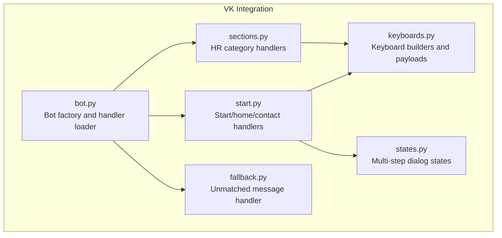
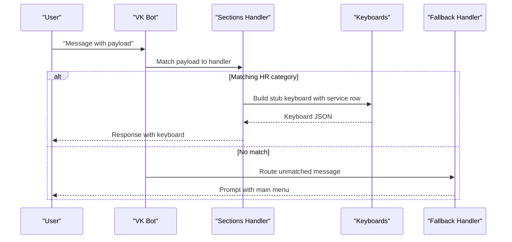
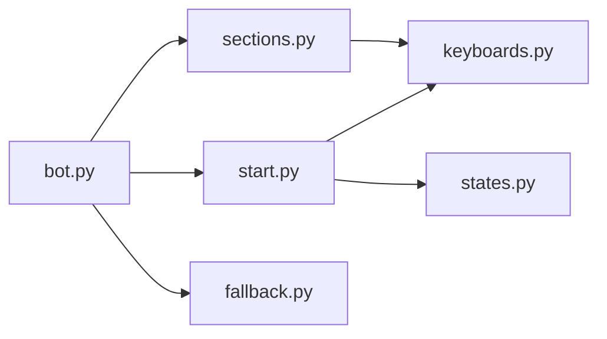

# Sections Handler

<cite>
**Referenced Files in This Document**
- [sections.py](file://app/integrations/vk/handlers/sections.py)
- [keyboards.py](file://app/integrations/vk/keyboards.py)
- [states.py](file://app/integrations/vk/states.py)
- [bot.py](file://app/integrations/vk/bot.py)
- [start.py](file://app/integrations/vk/handlers/start.py)
- [fallback.py](file://app/integrations/vk/handlers/fallback.py)
- [test_keyboards.py](file://tests/test_keyboards.py)
- [test_states.py](file://tests/test_states.py)
</cite>

## Table of Contents
1. [Introduction](#introduction)
2. [Project Structure](#project-structure)
3. [Core Components](#core-components)
4. [Architecture Overview](#architecture-overview)
5. [Detailed Component Analysis](#detailed-component-analysis)
6. [Dependency Analysis](#dependency-analysis)
7. [Performance Considerations](#performance-considerations)
8. [Troubleshooting Guide](#troubleshooting-guide)
9. [Conclusion](#conclusion)

## Introduction
This document explains the sections handler module that implements the main HR categories functionality for the VK bot. It covers the seven-section HR menu, payload routing for hiring, termination, vacation, payment, sick leave, probation, and asking questions, as well as the state-based dialog management for multi-step scenarios. It also documents how to add new HR categories, implement multi-step dialogs, and extend existing scenarios while integrating with state management and keyboard systems.

## Project Structure
The sections handler resides in the VK integration layer and works alongside keyboard builders and state definitions. The bot wiring loads handlers in a specific order to ensure proper routing.

**Diagram sources**
- [bot.py:14-31](file://app/integrations/vk/bot.py#L14-L31)
- [start.py:12-55](file://app/integrations/vk/handlers/start.py#L12-L55)
- [sections.py:17-82](file://app/integrations/vk/handlers/sections.py#L17-L82)
- [fallback.py:7-18](file://app/integrations/vk/handlers/fallback.py#L7-L18)
- [keyboards.py:11-108](file://app/integrations/vk/keyboards.py#L11-L108)
- [states.py:4-14](file://app/integrations/vk/states.py#L4-L14)

**Section sources**
- [bot.py:14-31](file://app/integrations/vk/bot.py#L14-L31)
- [keyboards.py:11-108](file://app/integrations/vk/keyboards.py#L11-L108)

## Core Components
- Sections handler: Routes incoming messages to HR categories using payload-based matching.
- Keyboard builders: Define payload constants and build main menu and service rows.
- States: Define multi-step dialog states for complex HR scenarios.
- Bot factory: Wires handlers in the correct order for routing.

Key responsibilities:
- Seven-section HR menu: Hiring, Termination, Vacation, Payment, Sick Leave, Probation, Ask Question.
- Payload routing: Each section mapped to a unique payload constant.
- State-based dialogs: Multi-step flows for complex HR requests.
- Service buttons: Back/Home/Contact HR available on every screen.

**Section sources**
- [sections.py:28-82](file://app/integrations/vk/handlers/sections.py#L28-L82)
- [keyboards.py:13-24](file://app/integrations/vk/keyboards.py#L13-L24)
- [states.py:7-13](file://app/integrations/vk/states.py#L7-L13)

## Architecture Overview
The sections handler participates in a top-to-bottom handler chain. The fallback handler must be loaded last to catch unmatched messages. Each HR category handler responds to a specific payload and returns a standardized response with a service row keyboard.

**Diagram sources**
- [bot.py:16-20](file://app/integrations/vk/bot.py#L16-L20)
- [sections.py:28-82](file://app/integrations/vk/handlers/sections.py#L28-L82)
- [keyboards.py:29-51](file://app/integrations/vk/keyboards.py#L29-L51)
- [fallback.py:15-18](file://app/integrations/vk/handlers/fallback.py#L15-L18)

## Detailed Component Analysis

### Sections Handler: Seven-Section HR Menu
The sections handler defines seven handlers, each responding to a distinct payload representing an HR category. Each handler returns a standardized stub response and a keyboard with a Back/Home/Contact HR service row.

- Hiring: Responds to the hire payload.
- Termination: Responds to the fire payload.
- Vacation: Responds to the vacation payload.
- Payment: Responds to the pay payload.
- Sick Leave: Responds to the sick payload.
- Probation: Responds to the probation payload.
- Ask Question: Responds to the ask payload.

Routing mechanism:
- Handlers use payload-based matching to route messages to the correct section.
- Each handler constructs a stub response indicating the section is under development and offers a back navigation to the main menu.

Navigation:
- Each response includes a service row keyboard configured with a back payload pointing to the main menu.

**Section sources**
- [sections.py:28-82](file://app/integrations/vk/handlers/sections.py#L28-L82)
- [keyboards.py:104-108](file://app/integrations/vk/keyboards.py#L104-L108)

### Keyboard Builders: Payload Constants and Service Rows
The keyboard module centralizes payload constants and keyboard construction helpers. It ensures consistent navigation across screens.

Payload constants:
- Home, Back, Contact HR, and the seven HR categories are defined as payload dictionaries.

Main menu keyboard:
- Builds the S-01 main menu with seven HR sections plus a Contact HR button.
- Uses a two-row layout for HR sections and a dedicated row for Contact HR.

Service row:
- Provides Back/Home/Contact HR buttons with configurable visibility and back payload.
- Used by stub keyboards and other screens to maintain consistent UX.

Stub keyboard:
- Minimal keyboard for placeholder screens, always includes Home and Contact HR, and optionally Back.

**Section sources**
- [keyboards.py:13-24](file://app/integrations/vk/keyboards.py#L13-L24)
- [keyboards.py:56-98](file://app/integrations/vk/keyboards.py#L56-L98)
- [keyboards.py:29-51](file://app/integrations/vk/keyboards.py#L29-L51)
- [keyboards.py:104-108](file://app/integrations/vk/keyboards.py#L104-L108)

### State-Based Dialog Management
The states module defines a multi-step dialog group for HR requests. The states are intended to support a six-step dialog flow for complex HR scenarios.

States:
- Name, Topic, Details, Entity, Urgency, Confirm.

Integration points:
- The start handler demonstrates how to wire service buttons and navigate to the main menu.
- The states module provides the foundation for multi-step flows that can be integrated with the sections handler.

**Section sources**
- [states.py:7-13](file://app/integrations/vk/states.py#L7-L13)
- [start.py:39-54](file://app/integrations/vk/handlers/start.py#L39-L54)

### Bot Factory and Handler Loading Order
The bot factory loads handlers in a specific order to ensure correct routing:
- Start handler first.
- Sections handler second.
- Fallback handler last (catches unmatched messages).

This ordering guarantees that payload-matched messages reach the sections handler before falling back to the fallback handler.

**Section sources**
- [bot.py:16-20](file://app/integrations/vk/bot.py#L16-L20)

### Practical Examples

#### Adding a New HR Category
To add a new HR category:
1. Define a new payload constant in the keyboard module.
2. Add a new handler in the sections module that responds to the new payload.
3. Include a service row keyboard with a back payload to the main menu.
4. Ensure the main menu keyboard includes the new category button.

Verification:
- Tests confirm payload constants include the new category and that the main menu contains the expected buttons.

**Section sources**
- [keyboards.py:13-24](file://app/integrations/vk/keyboards.py#L13-L24)
- [keyboards.py:56-98](file://app/integrations/vk/keyboards.py#L56-L98)
- [test_keyboards.py:59-74](file://tests/test_keyboards.py#L59-L74)

#### Implementing a Multi-Step Dialog
To implement a multi-step dialog for an HR scenario:
1. Use the states module to define the dialog steps.
2. In the sections handler, transition from a stub response to a stateful flow.
3. Use the service row to provide Back/Home navigation during the dialog.
4. Persist state transitions and collect user input across steps.

Integration:
- The states module provides the state names; integrate them with the sections handler to manage dialog progression.

**Section sources**
- [states.py:7-13](file://app/integrations/vk/states.py#L7-L13)
- [keyboards.py:29-51](file://app/integrations/vk/keyboards.py#L29-L51)

#### Extending Existing Scenarios
To extend an existing scenario:
1. Modify the sections handler to move from a stub response to a multi-step flow.
2. Add state transitions for each step in the scenario.
3. Ensure the service row remains available for navigation.
4. Update tests to reflect new behavior.

**Section sources**
- [sections.py:28-82](file://app/integrations/vk/handlers/sections.py#L28-L82)
- [test_keyboards.py:97-150](file://tests/test_keyboards.py#L97-L150)

### Clickable Scenario Handling
The current sections handler routes messages to stub responses with a service row keyboard. To implement clickable scenarios:
- Replace stub responses with stateful handlers that manage multi-step flows.
- Use the states module to track progress and collect user input.
- Provide Back/Home navigation at each step.

**Section sources**
- [sections.py:28-82](file://app/integrations/vk/handlers/sections.py#L28-L82)
- [keyboards.py:29-51](file://app/integrations/vk/keyboards.py#L29-L51)

### Integration with State Management and Keyboard Systems
- State management: The states module defines the multi-step dialog states; integrate them with sections handler logic to manage flow progression.
- Keyboard systems: Use the keyboard builders to ensure consistent navigation across screens, including service rows and main menu layouts.

**Section sources**
- [states.py:7-13](file://app/integrations/vk/states.py#L7-L13)
- [keyboards.py:29-51](file://app/integrations/vk/keyboards.py#L29-L51)
- [keyboards.py:56-98](file://app/integrations/vk/keyboards.py#L56-L98)

## Dependency Analysis
The sections handler depends on keyboard builders for payload constants and keyboard construction. The bot factory loads handlers in a specific order to ensure proper routing.

**Diagram sources**
- [sections.py:5-15](file://app/integrations/vk/handlers/sections.py#L5-L15)
- [keyboards.py:11-15](file://app/integrations/vk/keyboards.py#L11-L15)
- [bot.py:16-20](file://app/integrations/vk/bot.py#L16-L20)
- [start.py:5-10](file://app/integrations/vk/handlers/start.py#L5-L10)
- [states.py:4-14](file://app/integrations/vk/states.py#L4-L14)

**Section sources**
- [sections.py:5-15](file://app/integrations/vk/handlers/sections.py#L5-L15)
- [bot.py:16-20](file://app/integrations/vk/bot.py#L16-L20)

## Performance Considerations
- Handler order: Maintaining the correct load order prevents unnecessary fallback handling and reduces latency.
- Keyboard reuse: Reuse keyboard builders to minimize construction overhead and ensure consistency.
- Payload matching: Using payload dictionaries avoids string parsing overhead and improves reliability.

## Troubleshooting Guide
Common issues and resolutions:
- Messages not routed to sections: Verify the payload constants and handler registration order.
- Missing service buttons: Ensure the service row is appended to keyboards consistently.
- Duplicate payloads: Tests validate uniqueness of payload command values; ensure new payloads are unique.

Validation references:
- Keyboard tests confirm the presence of all seven HR sections and the Contact HR button.
- State tests confirm the multi-step dialog states are defined and unique.

**Section sources**
- [test_keyboards.py:59-74](file://tests/test_keyboards.py#L59-L74)
- [test_keyboards.py:176-192](file://tests/test_keyboards.py#L176-L192)
- [test_states.py:12-31](file://tests/test_states.py#L12-L31)

## Conclusion
The sections handler module provides a clean, payload-driven routing mechanism for the seven-section HR menu. By leveraging keyboard builders and state definitions, it supports consistent navigation and paves the way for multi-step dialogs. Extending the system involves adding payload constants, handlers, and integrating state management while preserving the established handler loading order and keyboard patterns.