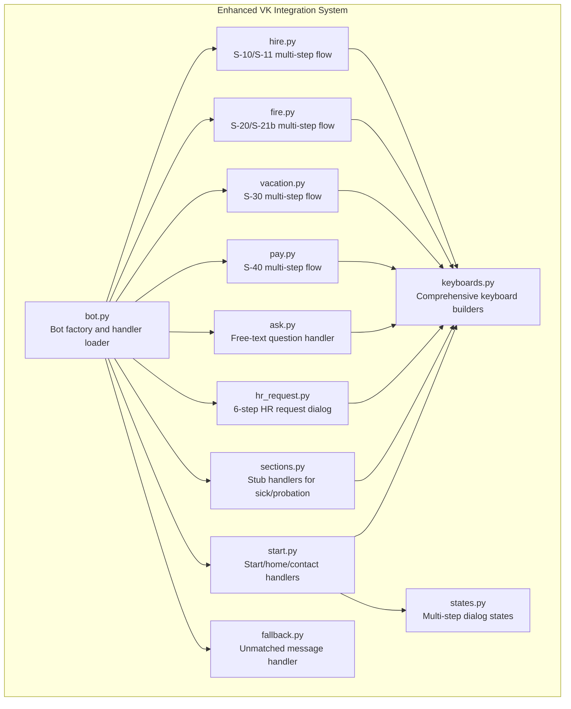
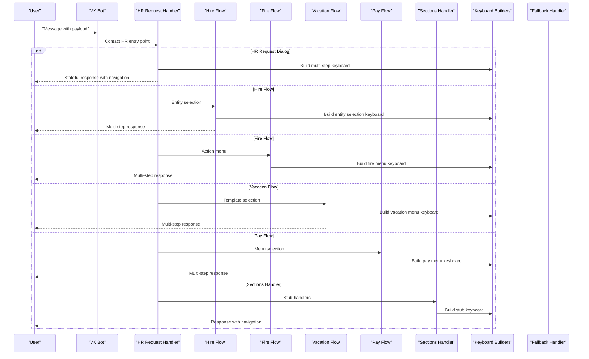
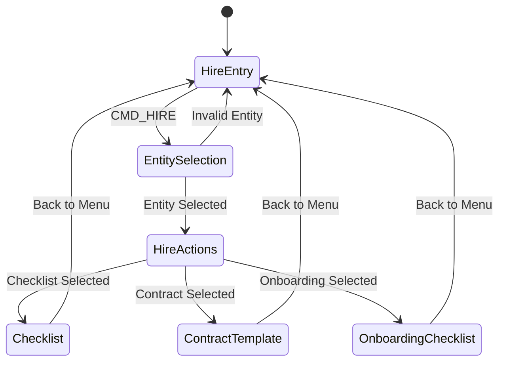
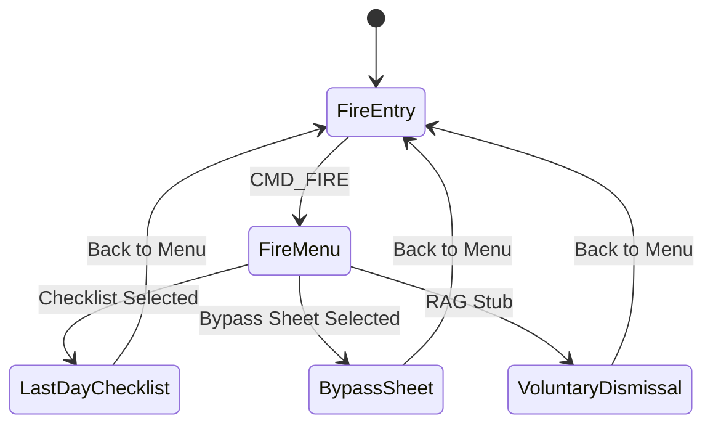
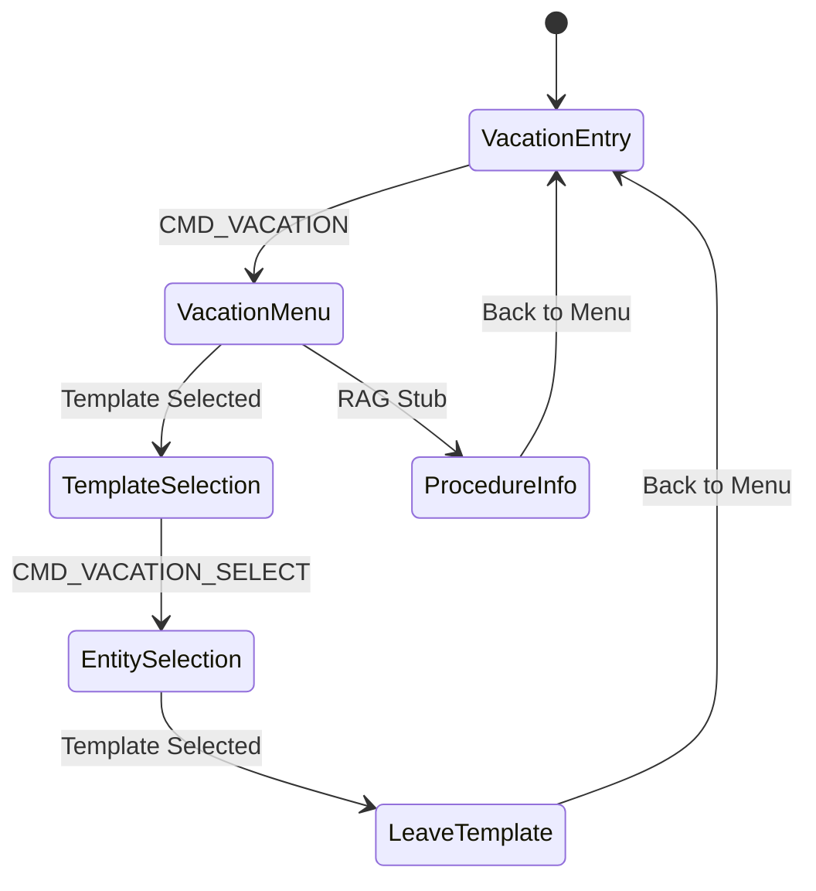
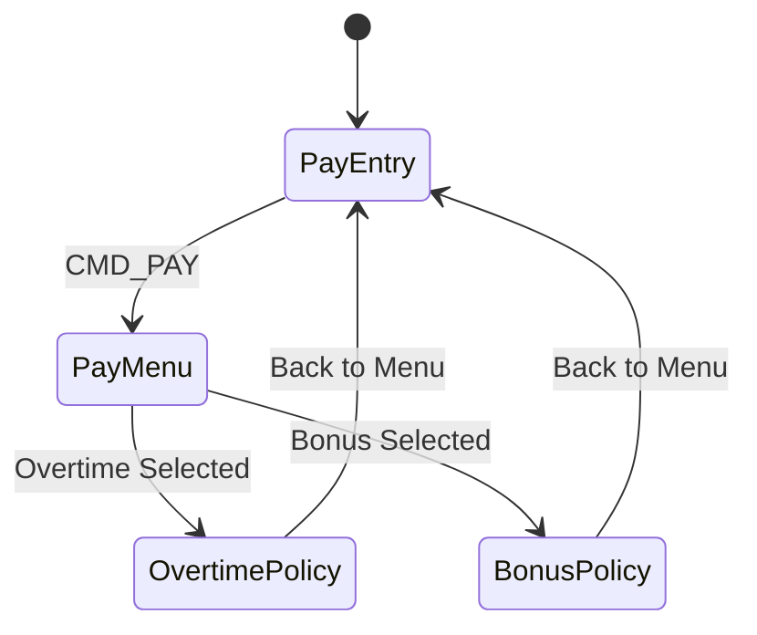
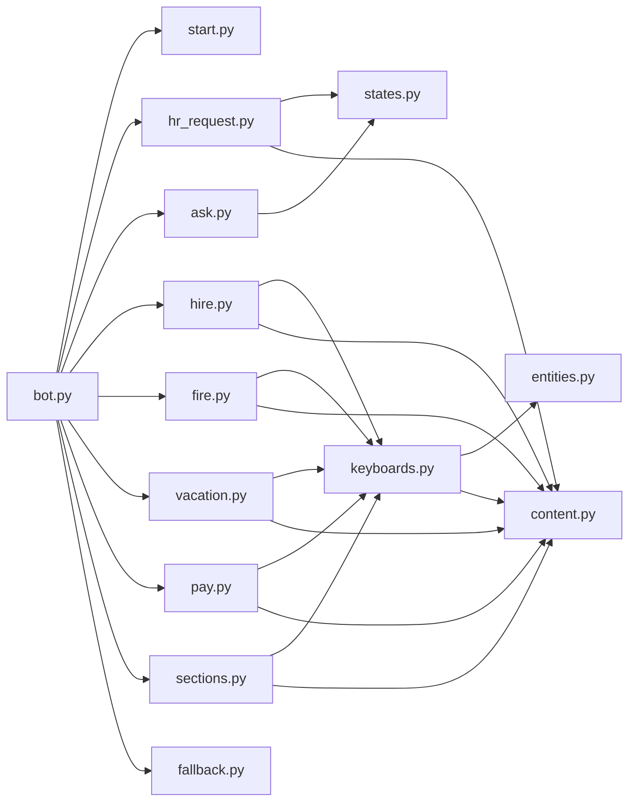

# Sections Handler

<cite>
**Referenced Files in This Document**
- [sections.py](file://app/integrations/vk/handlers/sections.py)
- [hire.py](file://app/integrations/vk/handlers/hire.py)
- [fire.py](file://app/integrations/vk/handlers/fire.py)
- [vacation.py](file://app/integrations/vk/handlers/vacation.py)
- [pay.py](file://app/integrations/vk/handlers/pay.py)
- [ask.py](file://app/integrations/vk/handlers/ask.py)
- [hr_request.py](file://app/integrations/vk/handlers/hr_request.py)
- [keyboards.py](file://app/integrations/vk/keyboards.py)
- [states.py](file://app/integrations/vk/states.py)
- [bot.py](file://app/integrations/vk/bot.py)
- [start.py](file://app/integrations/vk/handlers/start.py)
- [fallback.py](file://app/integrations/vk/handlers/fallback.py)
- [test_keyboards.py](file://tests/test_keyboards.py)
- [test_states.py](file://tests/test_states.py)
</cite>

## Update Summary
**Changes Made**
- Updated sections handler to reflect new sophisticated multi-step dialog flows for employment lifecycle management
- Added comprehensive documentation for hire, fire, vacation, and pay modules
- Enhanced state-based dialog management with six-step HR request processing
- Updated handler loading order and integration patterns
- Documented payload routing system for all HR categories

## Table of Contents
1. [Introduction](#introduction)
2. [Project Structure](#project-structure)
3. [Core Components](#core-components)
4. [Architecture Overview](#architecture-overview)
5. [Detailed Component Analysis](#detailed-component-analysis)
6. [Dependency Analysis](#dependency-analysis)
7. [Performance Considerations](#performance-considerations)
8. [Troubleshooting Guide](#troubleshooting-guide)
9. [Conclusion](#conclusion)

## Introduction
This document explains the enhanced sections handler module that implements comprehensive HR categories functionality for the VK bot. The system now features sophisticated multi-step dialog flows for employment lifecycle management, replacing simple stub implementations with robust HR request processing capabilities. The documentation covers the seven-section HR menu, advanced payload routing, state-based dialog management, and integration patterns for hiring, termination, vacation, payment, sick leave, probation, and question handling scenarios.

## Project Structure
The sections handler has evolved into a comprehensive HR management system with dedicated modules for each employment lifecycle stage. The bot wiring maintains a specific order to ensure proper routing and state management across all handlers.

**Diagram sources**
- [bot.py:24-41](file://app/integrations/vk/bot.py#L24-L41)
- [hire.py:1-108](file://app/integrations/vk/handlers/hire.py#L1-L108)
- [fire.py:1-65](file://app/integrations/vk/handlers/fire.py#L1-L65)
- [vacation.py:1-76](file://app/integrations/vk/handlers/vacation.py#L1-L76)
- [pay.py:1-53](file://app/integrations/vk/handlers/pay.py#L1-L53)
- [ask.py:1-63](file://app/integrations/vk/handlers/ask.py#L1-L63)
- [hr_request.py:1-305](file://app/integrations/vk/handlers/hr_request.py#L1-L305)
- [sections.py:1-42](file://app/integrations/vk/handlers/sections.py#L1-L42)

**Section sources**
- [bot.py:24-41](file://app/integrations/vk/bot.py#L24-L41)
- [keyboards.py:13-26](file://app/integrations/vk/keyboards.py#L13-L26)

## Core Components
The enhanced sections handler system consists of several sophisticated components working together to provide comprehensive HR functionality:

- **Dedicated Flow Handlers**: Specialized modules for hire, fire, vacation, and pay with multi-step dialog management
- **HR Request Dialog**: Six-step form processing for complex HR requests with state persistence
- **Payload Routing System**: Comprehensive payload-based routing for all HR categories
- **State Management**: Sophisticated finite state machine for multi-step conversations
- **Keyboard Builders**: Advanced keyboard construction with service rows and specialized layouts
- **Handler Loading Order**: Strategic ordering to ensure proper message routing and state preservation

Key responsibilities:
- **Seven-section HR Menu**: Hiring (S-10), Termination (S-20), Vacation (S-30), Payment (S-40), Sick Leave (S-50), Probation (S-60), Ask Question (S-ASK)
- **Multi-step Dialog Flows**: Complex workflows with entity selection, action menus, and content delivery
- **State-based Processing**: Persistent user context across multiple conversation steps
- **Advanced Navigation**: Back/Home/Contact HR buttons with intelligent routing logic

**Section sources**
- [hire.py:1-108](file://app/integrations/vk/handlers/hire.py#L1-L108)
- [fire.py:1-65](file://app/integrations/vk/handlers/fire.py#L1-L65)
- [vacation.py:1-76](file://app/integrations/vk/handlers/vacation.py#L1-L76)
- [pay.py:1-53](file://app/integrations/vk/handlers/pay.py#L1-L53)
- [hr_request.py:1-305](file://app/integrations/vk/handlers/hr_request.py#L1-L305)
- [keyboards.py:13-26](file://app/integrations/vk/keyboards.py#L13-L26)
- [states.py:4-17](file://app/integrations/vk/states.py#L4-L17)

## Architecture Overview
The enhanced sections handler participates in a sophisticated handler chain with strategic ordering to support complex multi-step dialogs. The system uses a shared state dispenser to maintain user context across all handlers, enabling seamless transitions between different HR categories.

**Diagram sources**
- [bot.py:24-41](file://app/integrations/vk/bot.py#L24-L41)
- [hr_request.py:69-77](file://app/integrations/vk/handlers/hr_request.py#L69-L77)
- [hire.py:32-37](file://app/integrations/vk/handlers/hire.py#L32-L37)
- [fire.py:26-31](file://app/integrations/vk/handlers/fire.py#L26-L31)
- [vacation.py:29-34](file://app/integrations/vk/handlers/vacation.py#L29-L34)
- [pay.py:25-30](file://app/integrations/vk/handlers/pay.py#L25-L30)
- [sections.py:25-30](file://app/integrations/vk/handlers/sections.py#L25-L30)

## Detailed Component Analysis

### Enhanced Sections Handler: Seven-Section HR Menu
The sections handler now serves as a specialized stub handler for remaining HR categories, while sophisticated multi-step flows handle the core employment lifecycle management. The handler maintains backward compatibility while supporting the new comprehensive system.

**Updated** The sections handler now focuses on sick leave and probation categories with RAG (Retrieval-Augmented Generation) stub implementations, while dedicated modules handle the major HR categories.

- **Sick Leave (S-50)**: RAG stub implementation with entity-aware content delivery
- **Probation (S-60)**: RAG stub implementation with contextual responses
- **Remaining Categories**: Integrated into the main menu but handled by dedicated flow modules

Routing mechanism:
- Payload-based matching routes messages to appropriate handlers
- Dedicated flow handlers manage complex multi-step conversations
- Stub handlers provide fallback responses with navigation options

Navigation:
- Each response includes intelligent service row with Back/Home/Contact HR buttons
- Context-aware back navigation preserves user progress in multi-step flows

**Section sources**
- [sections.py:1-42](file://app/integrations/vk/handlers/sections.py#L1-L42)
- [sections.py:25-30](file://app/integrations/vk/handlers/sections.py#L25-L30)
- [sections.py:36-41](file://app/integrations/vk/handlers/sections.py#L36-L41)

### Comprehensive Employment Lifecycle Management

#### Hire Flow (S-10/S-11)
The hire flow implements a sophisticated four-step process with entity selection, action menu, and content delivery. This represents the most complex multi-step dialog in the system.

**Updated** Complete rewrite from simple stub to comprehensive multi-step dialog with entity-aware content delivery.

**Diagram sources**
- [hire.py:32-56](file://app/integrations/vk/handlers/hire.py#L32-L56)
- [hire.py:62-73](file://app/integrations/vk/handlers/hire.py#L62-L73)
- [hire.py:79-90](file://app/integrations/vk/handlers/hire.py#L79-L90)
- [hire.py:96-107](file://app/integrations/vk/handlers/hire.py#L96-L107)

Key features:
- **Entity Selection**: Legal entity selection with validation and error handling
- **Action Menu**: Context-aware action selection based on entity type
- **Content Delivery**: Dynamic content generation based on selected entity
- **Navigation**: Intelligent back navigation preserving user context

#### Fire Flow (S-20/S-21b)
The fire flow manages termination processes with specialized checklists, bypass sheets, and RAG stub implementations for voluntary dismissals.

**Updated** Enhanced from simple stub to comprehensive multi-step flow with specialized content delivery.

**Diagram sources**
- [fire.py:26-31](file://app/integrations/vk/handlers/fire.py#L26-L31)
- [fire.py:37-42](file://app/integrations/vk/handlers/fire.py#L37-L42)
- [fire.py:48-53](file://app/integrations/vk/handlers/fire.py#L48-L53)
- [fire.py:59-64](file://app/integrations/vk/handlers/fire.py#L59-L64)

#### Vacation Flow (S-30)
The vacation flow handles leave applications with entity selection for template generation and RAG stub implementations for procedural information.

**Updated** Enhanced from simple stub to comprehensive multi-step flow with template generation.

**Diagram sources**
- [vacation.py:29-34](file://app/integrations/vk/handlers/vacation.py#L29-L34)
- [vacation.py:40-45](file://app/integrations/vk/handlers/vacation.py#L40-L45)
- [vacation.py:51-64](file://app/integrations/vk/handlers/vacation.py#L51-L64)
- [vacation.py:70-75](file://app/integrations/vk/handlers/vacation.py#L70-L75)

#### Pay Flow (S-40)
The pay flow manages overtime and bonus inquiries with RAG stub implementations for policy information.

**Updated** Enhanced from simple stub to comprehensive multi-step flow with specialized content delivery.

**Diagram sources**
- [pay.py:25-30](file://app/integrations/vk/handlers/pay.py#L25-L30)
- [pay.py:36-41](file://app/integrations/vk/handlers/pay.py#L36-L41)
- [pay.py:47-52](file://app/integrations/vk/handlers/pay.py#L47-L52)

### Advanced State-Based Dialog Management
The enhanced system features sophisticated state management supporting six-step HR request processing with comprehensive user context preservation.

**Updated** Complete rewrite to support complex multi-step dialogs with persistent state across all handlers.

States:
- **HR_REQUEST_NAME**: Capture employee name with validation
- **HR_REQUEST_TOPIC**: Topic selection from predefined options
- **HR_REQUEST_DETAILS**: Detailed description with character limits
- **HR_REQUEST_ENTITY**: Entity selection with validation
- **HR_REQUEST_URGENCY**: Urgency level selection
- **HR_REQUEST_CONFIRM**: Final confirmation step

Integration points:
- Shared state dispenser across all handlers
- Context preservation through payload data
- Back navigation with intelligent state restoration
- Restart functionality for session recovery

**Section sources**
- [states.py:4-17](file://app/integrations/vk/states.py#L4-L17)
- [hr_request.py:69-77](file://app/integrations/vk/handlers/hr_request.py#L69-L77)
- [hr_request.py:137-149](file://app/integrations/vk/handlers/hr_request.py#L137-L149)
- [hr_request.py:277-303](file://app/integrations/vk/handlers/hr_request.py#L277-L303)

### Comprehensive Keyboard Builders and Payload System
The keyboard system has been enhanced with specialized builders for each HR category, comprehensive payload constants, and intelligent service row management.

**Updated** Expanded from basic stub keyboards to sophisticated specialized layouts with entity awareness.

Payload constants:
- **Basic Commands**: Home, Back, Contact HR, Ask Question
- **Category Commands**: Hire, Fire, Vacation, Pay, Sick, Probation
- **Sub-action Commands**: Entity-specific actions within each category
- **Dialog Commands**: HR request navigation and confirmation

Keyboard builders:
- **Main Menu**: Seven-section layout with Contact HR button
- **Entity Selection**: Legal entity buttons with validation
- **Action Menus**: Context-aware action selection
- **Specialized Layouts**: Topic, entity, urgency, and confirmation keyboards
- **Service Rows**: Intelligent navigation with back payload management

**Section sources**
- [keyboards.py:13-55](file://app/integrations/vk/keyboards.py#L13-L55)
- [keyboards.py:87-129](file://app/integrations/vk/keyboards.py#L87-L129)
- [keyboards.py:144-156](file://app/integrations/vk/keyboards.py#L144-L156)
- [keyboards.py:162-177](file://app/integrations/vk/keyboards.py#L162-L177)
- [keyboards.py:209-215](file://app/integrations/vk/keyboards.py#L209-L215)

### Enhanced Bot Factory and Handler Loading Order
The bot factory maintains strategic handler loading order to support complex state management and multi-step dialogs across all HR categories.

**Updated** Enhanced loading order to support shared state dispenser and sophisticated routing logic.

Handler loading order:
1. **Start Handler**: `/start` command and home navigation
2. **HR Request Handler**: Contact HR entry and state management
3. **Ask Handler**: Free-text question processing with state preservation
4. **Flow Handlers**: Hire, Fire, Vacation, Pay with multi-step dialogs
5. **Sections Handler**: Stub handlers for remaining categories
6. **Fallback Handler**: Unmatched message processing

State management integration:
- Shared state dispenser assignment
- Cross-handler state preservation
- Session recovery and error handling

**Section sources**
- [bot.py:24-41](file://app/integrations/vk/bot.py#L24-L41)
- [bot.py:48-49](file://app/integrations/vk/bot.py#L48-L49)

### Practical Examples

#### Adding a New HR Category
To add a new HR category to the enhanced system:

1. **Define Payload Constants**: Add new payload dictionary in keyboards module
2. **Create Handler Module**: Implement multi-step dialog with appropriate state management
3. **Add Keyboard Builders**: Create specialized keyboards for the new category
4. **Integrate into Main Menu**: Add button to main menu keyboard builder
5. **Update Handler Loading**: Add new handler to bot factory loading order
6. **Test Integration**: Verify payload routing and state management

**Section sources**
- [keyboards.py:13-26](file://app/integrations/vk/keyboards.py#L13-L26)
- [bot.py:24-41](file://app/integrations/vk/bot.py#L24-L41)

#### Implementing Multi-Step Dialogs
To implement sophisticated multi-step dialogs for HR scenarios:

1. **Define State Names**: Add new states to BotStates class
2. **Create Handler Chain**: Implement sequential step handlers
3. **Manage State Transitions**: Use state dispenser for context preservation
4. **Implement Navigation**: Add back/restart functionality
5. **Handle Validation**: Implement input validation and error handling
6. **Design Keyboard Layouts**: Create specialized keyboards for each step

**Section sources**
- [states.py:4-17](file://app/integrations/vk/states.py#L4-L17)
- [hr_request.py:137-149](file://app/integrations/vk/handlers/hr_request.py#L137-L149)
- [hr_request.py:277-303](file://app/integrations/vk/handlers/hr_request.py#L277-L303)

#### Extending Existing Scenarios
To extend existing sophisticated HR scenarios:

1. **Modify State Definitions**: Add new state fields for additional context
2. **Update Handler Logic**: Extend multi-step flows with new steps
3. **Enhance Keyboard Builders**: Add new button combinations and layouts
4. **Preserve Back Navigation**: Maintain intelligent state restoration
5. **Test Error Handling**: Validate edge cases and invalid inputs
6. **Update Documentation**: Reflect new functionality and user experience

**Section sources**
- [hire.py:43-56](file://app/integrations/vk/handlers/hire.py#L43-L56)
- [vacation.py:51-64](file://app/integrations/vk/handlers/vacation.py#L51-L64)
- [fire.py:37-42](file://app/integrations/vk/handlers/fire.py#L37-L42)

### Advanced Clickable Scenario Handling
The enhanced system supports sophisticated clickable scenarios with intelligent state management and context preservation across all HR categories.

**Updated** Complete rewrite to support complex multi-step dialogs with entity awareness and state persistence.

Key features:
- **Entity-Aware Content**: Dynamic content generation based on selected legal entities
- **Context Preservation**: State management across multiple conversation steps
- **Intelligent Navigation**: Back buttons with automatic state restoration
- **Error Handling**: Robust validation and recovery mechanisms
- **Service Integration**: Seamless integration with Contact HR functionality

**Section sources**
- [hire.py:43-56](file://app/integrations/vk/handlers/hire.py#L43-L56)
- [vacation.py:51-64](file://app/integrations/vk/handlers/vacation.py#L51-L64)
- [fire.py:37-42](file://app/integrations/vk/handlers/fire.py#L37-L42)
- [pay.py:36-41](file://app/integrations/vk/handlers/pay.py#L36-L41)

### Integration with State Management and Keyboard Systems
The enhanced system provides seamless integration between state management, keyboard builders, and handler logic to support complex multi-step HR scenarios.

**Updated** Enhanced integration patterns supporting sophisticated state persistence and dynamic content delivery.

Integration patterns:
- **Shared State Dispenser**: Cross-handler state management
- **Dynamic Keyboard Generation**: Context-aware keyboard construction
- **Entity-Aware Content**: Dynamic content based on user selections
- **Intelligent Navigation**: Back buttons with automatic state restoration
- **Error Recovery**: Graceful handling of invalid inputs and session timeouts

**Section sources**
- [bot.py:48-49](file://app/integrations/vk/bot.py#L48-L49)
- [hr_request.py:69-77](file://app/integrations/vk/handlers/hr_request.py#L69-L77)
- [keyboards.py:144-156](file://app/integrations/vk/keyboards.py#L144-L156)
- [keyboards.py:162-177](file://app/integrations/vk/keyboards.py#L162-L177)

## Dependency Analysis
The enhanced sections handler system features sophisticated interdependencies between handlers, state management, and keyboard builders, supporting complex multi-step dialog flows.

**Diagram sources**
- [bot.py:24-41](file://app/integrations/vk/bot.py#L24-L41)
- [hire.py:10-21](file://app/integrations/vk/handlers/hire.py#L10-L21)
- [fire.py:10-18](file://app/integrations/vk/handlers/fire.py#L10-L18)
- [vacation.py:10-20](file://app/integrations/vk/handlers/vacation.py#L10-L20)
- [pay.py:10-17](file://app/integrations/vk/handlers/pay.py#L10-L17)
- [hr_request.py:14-34](file://app/integrations/vk/handlers/hr_request.py#L14-L34)

**Section sources**
- [bot.py:24-41](file://app/integrations/vk/bot.py#L24-L41)
- [keyboards.py:11-11](file://app/integrations/vk/keyboards.py#L11-L11)
- [states.py:1-1](file://app/integrations/vk/states.py#L1-L1)

## Performance Considerations
The enhanced sections handler system incorporates several performance optimizations to support complex multi-step dialogs and state management across all HR categories.

Optimization strategies:
- **Handler Ordering**: Strategic loading order prevents unnecessary fallback processing
- **State Persistence**: Efficient state management minimizes memory overhead
- **Keyboard Reuse**: Shared keyboard builders reduce construction overhead
- **Payload Optimization**: Structured payload dictionaries improve matching performance
- **Entity Caching**: Cached entity lookups reduce database/API calls
- **Error Recovery**: Efficient error handling prevents cascading failures

## Troubleshooting Guide
The enhanced system includes comprehensive troubleshooting mechanisms for complex multi-step dialogs and state management scenarios.

Common issues and resolutions:
- **State Corruption**: Verify state dispenser configuration and cross-handler state sharing
- **Navigation Errors**: Check back payload configuration and state restoration logic
- **Entity Validation**: Validate entity selection and error handling in multi-step flows
- **Keyboard Construction**: Ensure proper keyboard builder usage and service row integration
- **Payload Conflicts**: Verify unique payload command values across all handlers
- **Session Timeouts**: Implement proper state cleanup and recovery mechanisms

Validation references:
- Keyboard tests confirm comprehensive payload constants and menu layouts
- State tests verify multi-step dialog functionality and state persistence
- Integration tests validate handler loading order and cross-handler communication

**Section sources**
- [test_keyboards.py:59-74](file://tests/test_keyboards.py#L59-L74)
- [test_keyboards.py:176-192](file://tests/test_keyboards.py#L176-L192)
- [test_states.py:12-31](file://tests/test_states.py#L12-L31)

## Conclusion
The enhanced sections handler module represents a comprehensive transformation from simple stub implementations to sophisticated multi-step dialog management for employment lifecycle HR categories. The system now supports complex workflows for hiring, termination, vacation, and payment processes while maintaining backward compatibility for remaining categories. Through strategic handler loading, shared state management, and sophisticated keyboard builders, the system provides a robust foundation for comprehensive HR request processing with intelligent navigation and context preservation across all user interactions.