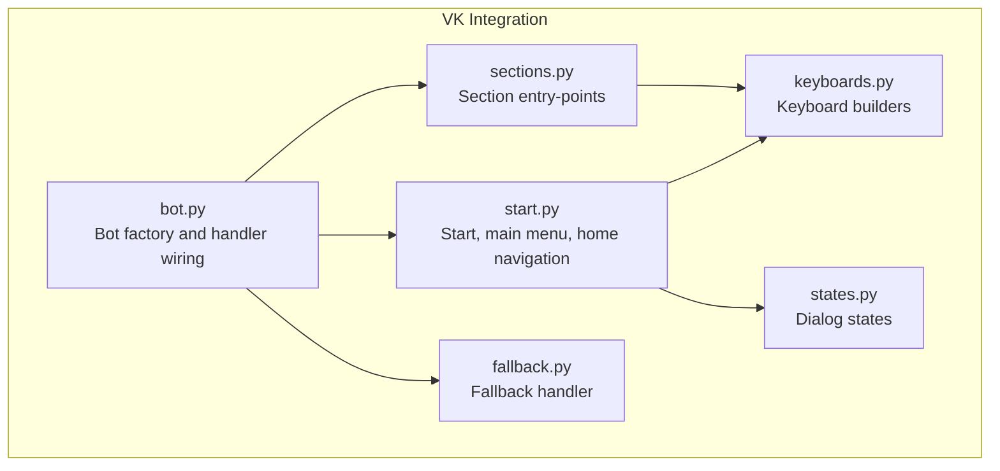
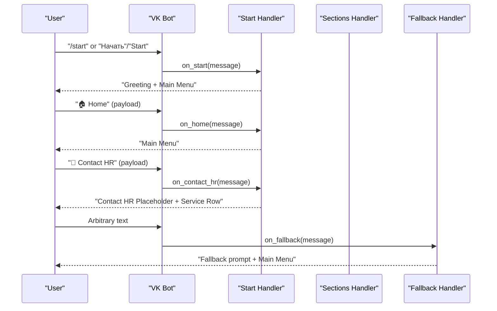
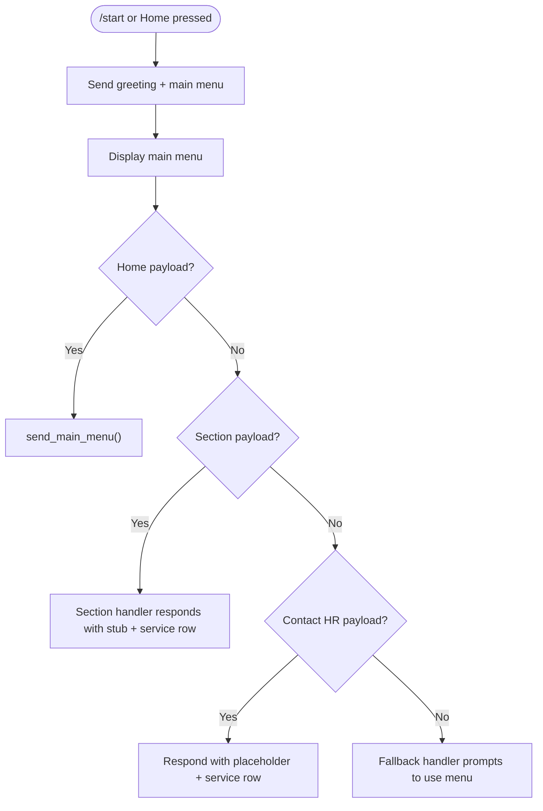
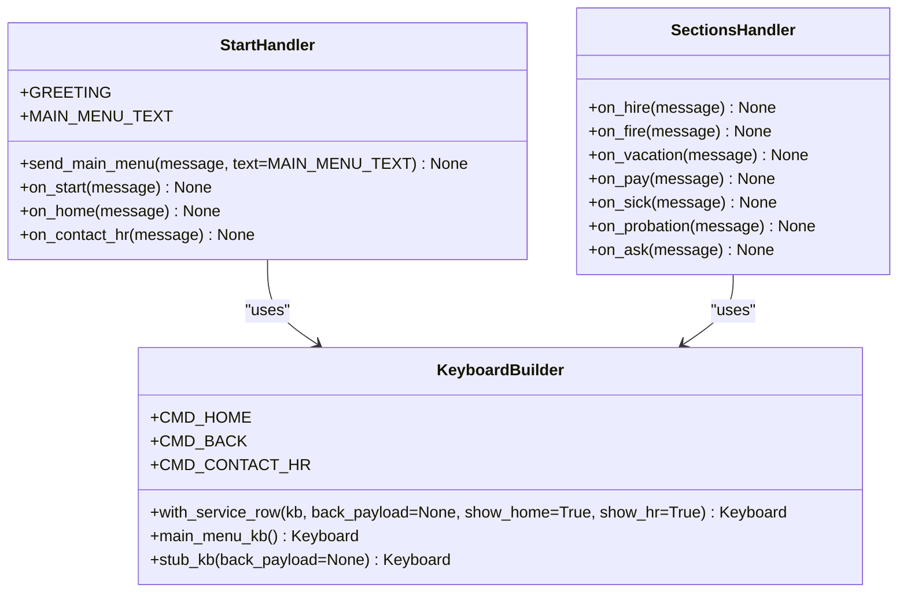
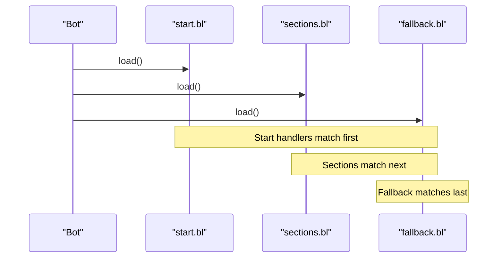
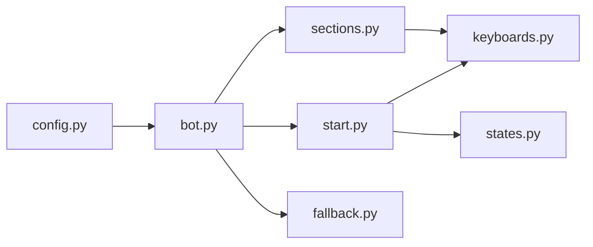

# Start Handler

<cite>
**Referenced Files in This Document**
- [start.py](file://app/integrations/vk/handlers/start.py)
- [keyboards.py](file://app/integrations/vk/keyboards.py)
- [bot.py](file://app/integrations/vk/bot.py)
- [fallback.py](file://app/integrations/vk/handlers/fallback.py)
- [sections.py](file://app/integrations/vk/handlers/sections.py)
- [states.py](file://app/integrations/vk/states.py)
- [test_keyboards.py](file://tests/test_keyboards.py)
- [test_bot_factory.py](file://tests/test_bot_factory.py)
- [polling_vk.py](file://scripts/polling_vk.py)
- [config.py](file://app/config.py)
</cite>

## Table of Contents
1. [Introduction](#introduction)
2. [Project Structure](#project-structure)
3. [Core Components](#core-components)
4. [Architecture Overview](#architecture-overview)
5. [Detailed Component Analysis](#detailed-component-analysis)
6. [Dependency Analysis](#dependency-analysis)
7. [Performance Considerations](#performance-considerations)
8. [Troubleshooting Guide](#troubleshooting-guide)
9. [Conclusion](#conclusion)
10. [Appendices](#appendices)

## Introduction
This document explains the start handler module responsible for bot initialization and welcome functionality in the VK integration. It covers:
- Greeting message implementation
- Main menu display logic
- Home navigation functionality
- Payload-based routing for home button clicks and contact HR placeholder
- Practical customization examples for welcome messages, main menu text, and extending the start command
- Integration with keyboard builders and message routing patterns

The start handler ensures users receive a friendly welcome and can navigate to the main menu and back to it using a standardized service row.

## Project Structure
The start handler resides within the VK integration and collaborates with keyboard builders, bot factory, and other handler modules.

**Diagram sources**
- [start.py:1-55](file://app/integrations/vk/handlers/start.py#L1-L55)
- [keyboards.py:1-108](file://app/integrations/vk/keyboards.py#L1-L108)
- [bot.py:1-32](file://app/integrations/vk/bot.py#L1-L32)
- [fallback.py:1-18](file://app/integrations/vk/handlers/fallback.py#L1-L18)
- [sections.py:1-82](file://app/integrations/vk/handlers/sections.py#L1-L82)
- [states.py:1-14](file://app/integrations/vk/states.py#L1-L14)

**Section sources**
- [start.py:1-55](file://app/integrations/vk/handlers/start.py#L1-L55)
- [keyboards.py:1-108](file://app/integrations/vk/keyboards.py#L1-L108)
- [bot.py:1-32](file://app/integrations/vk/bot.py#L1-L32)

## Core Components
- Start handler module: Implements greeting, main menu display, and home navigation via payload routing.
- Keyboard builders: Provide reusable keyboard construction utilities and payload constants.
- Bot factory: Wires handlers in the correct order to ensure proper routing.
- Fallback handler: Ensures unmatched text inputs route back to the main menu.
- Section handlers: Placeholder implementations for menu sections, demonstrating payload-driven routing.

Key responsibilities:
- Initialize conversation with a greeting and main menu
- Route home button clicks to the main menu
- Provide a contact HR placeholder with a service row
- Maintain consistent payload-based navigation across the bot

**Section sources**
- [start.py:14-54](file://app/integrations/vk/handlers/start.py#L14-L54)
- [keyboards.py:13-24](file://app/integrations/vk/keyboards.py#L13-L24)
- [bot.py:14-31](file://app/integrations/vk/bot.py#L14-L31)
- [fallback.py:9-17](file://app/integrations/vk/handlers/fallback.py#L9-L17)
- [sections.py:20-81](file://app/integrations/vk/handlers/sections.py#L20-L81)

## Architecture Overview
The start handler participates in a top-down handler registration order. The bot loads start handlers first, then section handlers, and finally the fallback handler last. This ensures that:
- Start commands and home navigation take precedence
- Section payloads are matched before falling back to the fallback handler

**Diagram sources**
- [start.py:31-54](file://app/integrations/vk/handlers/start.py#L31-L54)
- [sections.py:28-81](file://app/integrations/vk/handlers/sections.py#L28-L81)
- [fallback.py:15-17](file://app/integrations/vk/handlers/fallback.py#L15-L17)

## Detailed Component Analysis

### Start Handler: Greeting, Main Menu, and Home Navigation
- Greeting message: Defined as a constant and sent on start commands.
- Main menu text: Centralized constant for consistent UX.
- Main menu display: Reusable function that answers with the main menu keyboard.
- Home navigation: Payload-based handler routes users back to the main menu.
- Contact HR placeholder: Payload-based handler responds with a placeholder message and a minimal keyboard with service row.

**Diagram sources**
- [start.py:14-54](file://app/integrations/vk/handlers/start.py#L14-L54)
- [sections.py:28-81](file://app/integrations/vk/handlers/sections.py#L28-L81)
- [fallback.py:15-17](file://app/integrations/vk/handlers/fallback.py#L15-L17)

**Section sources**
- [start.py:14-54](file://app/integrations/vk/handlers/start.py#L14-L54)

### Keyboard Builders and Payload Routing
- Payload constants: Standardized payload dictionaries enable consistent routing across handlers.
- Service row builder: Adds Back/Home/Contact HR buttons with configurable visibility and payloads.
- Main menu keyboard: Builds the primary menu with seven sections plus a dedicated Contact HR button.
- Stub keyboard: Minimal keyboard for placeholder screens, always including a service row.

**Diagram sources**
- [keyboards.py:13-107](file://app/integrations/vk/keyboards.py#L13-L107)
- [start.py:14-54](file://app/integrations/vk/handlers/start.py#L14-L54)
- [sections.py:28-81](file://app/integrations/vk/handlers/sections.py#L28-L81)

**Section sources**
- [keyboards.py:13-107](file://app/integrations/vk/keyboards.py#L13-L107)

### Bot Factory and Handler Registration Order
- Handler order: Start handlers are loaded first, sections second, and fallback last.
- This ordering ensures start commands and home navigation are prioritized over arbitrary text.
- The fallback handler only triggers when no other handler matches.

**Diagram sources**
- [bot.py:16-20](file://app/integrations/vk/bot.py#L16-L20)

**Section sources**
- [bot.py:14-31](file://app/integrations/vk/bot.py#L14-L31)

### States and Multi-step Dialogs
- States module defines state names for multi-step dialogs (e.g., HR request workflow).
- While the start handler does not directly manage states, it integrates with the overall navigation pattern used across the bot.

**Section sources**
- [states.py:4-13](file://app/integrations/vk/states.py#L4-L13)

## Dependency Analysis
The start handler depends on keyboard builders for menu construction and payload routing. The bot factory orchestrates handler loading order to ensure predictable routing.

**Diagram sources**
- [config.py:4-9](file://app/config.py#L4-L9)
- [bot.py:9-31](file://app/integrations/vk/bot.py#L9-L31)
- [start.py:5-10](file://app/integrations/vk/handlers/start.py#L5-L10)
- [sections.py:5-15](file://app/integrations/vk/handlers/sections.py#L5-L15)

**Section sources**
- [bot.py:9-31](file://app/integrations/vk/bot.py#L9-L31)
- [start.py:5-10](file://app/integrations/vk/handlers/start.py#L5-L10)
- [sections.py:5-15](file://app/integrations/vk/handlers/sections.py#L5-L15)

## Performance Considerations
- Keyboard construction is lightweight and reused across handlers.
- Payload-based routing avoids expensive text parsing and reduces ambiguity.
- Consistent handler order prevents unnecessary fallback processing for known commands.

## Troubleshooting Guide
Common issues and resolutions:
- Start command not recognized: Verify the start handler is loaded first and the command variants are included in the message filter.
- Home button not working: Confirm the payload constant matches the service row payload.
- Contact HR placeholder not responding: Ensure the payload constant is consistent with the keyboard builder.
- Unexpected fallback behavior: Check that the fallback handler is last and that no earlier handler intercepts the message.

Validation references:
- Handler order and counts verified by tests.
- Keyboard builder behavior validated by keyboard tests.

**Section sources**
- [test_bot_factory.py:8-45](file://tests/test_bot_factory.py#L8-L45)
- [test_keyboards.py:49-192](file://tests/test_keyboards.py#L49-L192)

## Conclusion
The start handler provides a robust foundation for bot initialization and navigation. Its payload-based routing, centralized keyboard builders, and strict handler registration order ensure predictable user experiences. Extending the start command involves adding new payload handlers and updating the main menu accordingly.

## Appendices

### Practical Customization Examples
- Customize welcome message:
  - Modify the greeting constant in the start handler to change the initial message text.
  - Reference: [start.py:14-18](file://app/integrations/vk/handlers/start.py#L14-L18)

- Modify main menu text:
  - Adjust the main menu text constant to update the prompt above the main menu.
  - Reference: [start.py:20](file://app/integrations/vk/handlers/start.py#L20)

- Extend start command functionality:
  - Add new message filters to the start command handler to support additional triggers.
  - Reference: [start.py:31](file://app/integrations/vk/handlers/start.py#L31)

- Add new section entries:
  - Define a new payload constant and a corresponding handler in the sections module.
  - Reference: [keyboards.py:17-24](file://app/integrations/vk/keyboards.py#L17-L24), [sections.py:28-81](file://app/integrations/vk/handlers/sections.py#L28-L81)

- Integrate with keyboard builders:
  - Use the main menu builder to construct the primary menu and the service row builder to add Back/Home/Contact HR buttons.
  - Reference: [keyboards.py:56-98](file://app/integrations/vk/keyboards.py#L56-L98), [keyboards.py:29-50](file://app/integrations/vk/keyboards.py#L29-L50)

- Message routing pattern:
  - Follow the payload-based routing pattern demonstrated by the start and sections handlers.
  - Reference: [start.py:39-41](file://app/integrations/vk/handlers/start.py#L39-L41), [sections.py:28-81](file://app/integrations/vk/handlers/sections.py#L28-L81)

- Local development startup:
  - Run the polling script to start the bot in long poll mode.
  - Reference: [polling_vk.py:24-28](file://scripts/polling_vk.py#L24-L28)