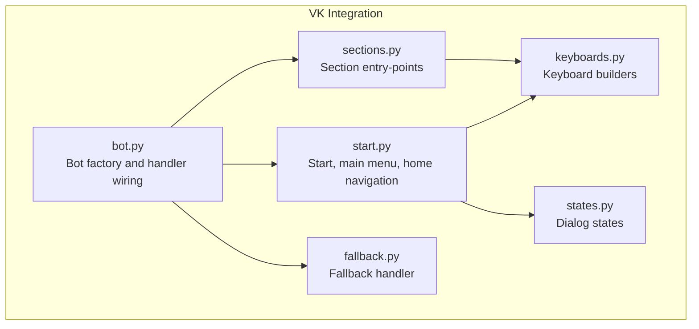
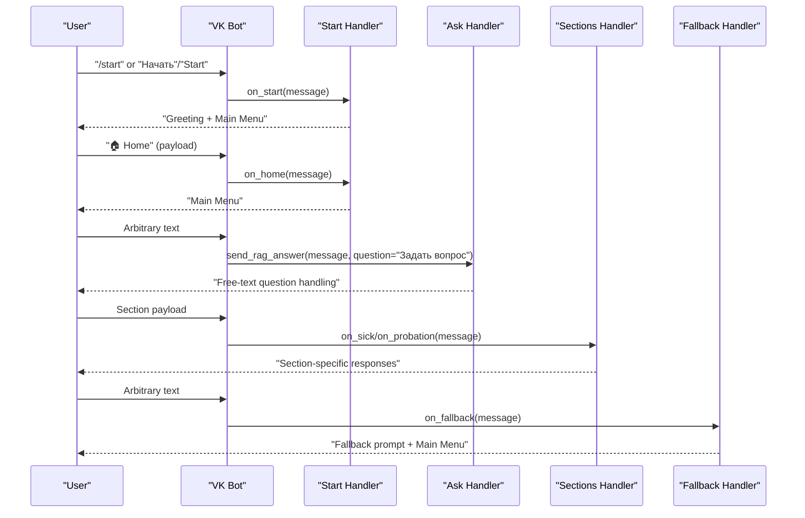
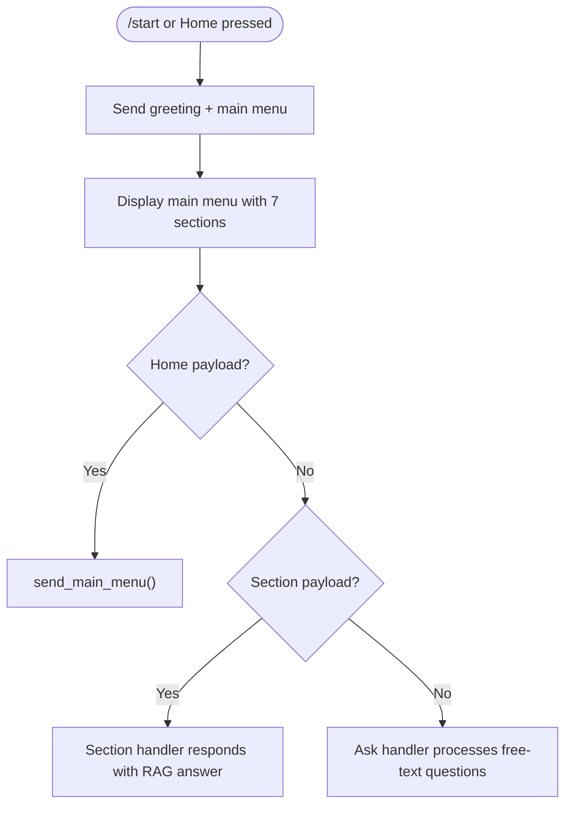
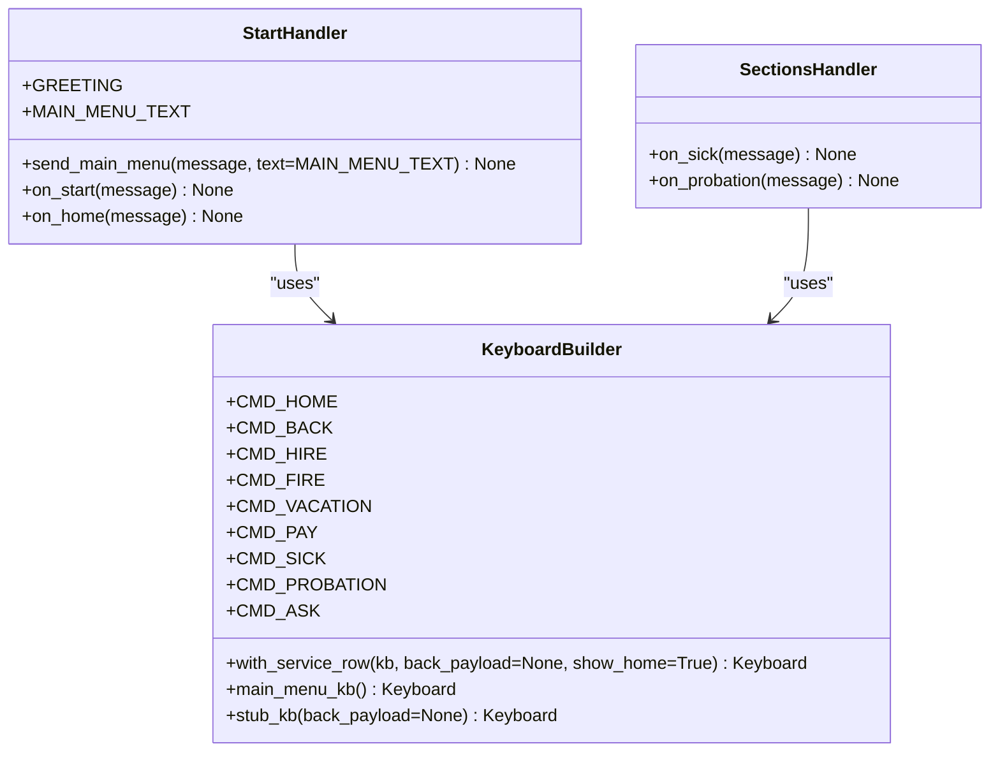
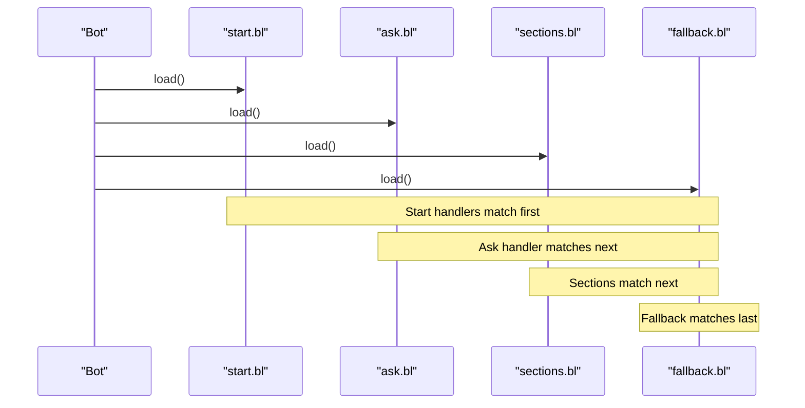
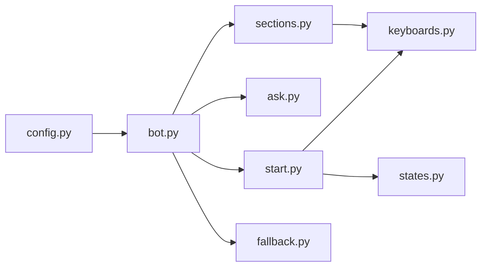

# Start Handler

<cite>
**Referenced Files in This Document**
- [start.py](file://app/integrations/vk/handlers/start.py)
- [keyboards.py](file://app/integrations/vk/keyboards.py)
- [bot.py](file://app/integrations/vk/bot.py)
- [fallback.py](file://app/integrations/vk/handlers/fallback.py)
- [sections.py](file://app/integrations/vk/handlers/sections.py)
- [states.py](file://app/integrations/vk/states.py)
- [test_keyboards.py](file://tests/test_keyboards.py)
- [test_bot_factory.py](file://tests/test_bot_factory.py)
- [polling_vk.py](file://scripts/polling_vk.py)
- [config.py](file://app/config.py)
</cite>

## Update Summary
**Changes Made**
- Updated start handler to reflect simplified implementation without HR request cleanup functionality
- Removed references to contact HR placeholder and HR request state cleanup
- Updated architecture overview to reflect current handler registration order
- Revised practical examples to match simplified functionality
- Updated troubleshooting guide to reflect current capabilities

## Table of Contents
1. [Introduction](#introduction)
2. [Project Structure](#project-structure)
3. [Core Components](#core-components)
4. [Architecture Overview](#architecture-overview)
5. [Detailed Component Analysis](#detailed-component-analysis)
6. [Dependency Analysis](#dependency-analysis)
7. [Performance Considerations](#performance-considerations)
8. [Troubleshooting Guide](#troubleshooting-guide)
9. [Conclusion](#conclusion)
10. [Appendices](#appendices)

## Introduction
This document explains the start handler module responsible for bot initialization and welcome functionality in the VK integration. The start handler has been simplified to focus on core greeting and navigation functionality without HR request cleanup or contact HR placeholder features.

Key capabilities:
- Greeting message implementation with customizable welcome text
- Main menu display logic with seven-section navigation
- Home navigation functionality via payload routing
- Integration with keyboard builders and message routing patterns
- Practical customization examples for welcome messages and main menu text

**Updated** Simplified to remove HR request cleanup functionality and contact HR placeholder, focusing purely on basic bot initialization and navigation.

## Project Structure
The start handler resides within the VK integration and collaborates with keyboard builders, bot factory, and other handler modules. The current structure maintains the same organizational pattern but with simplified functionality.

**Diagram sources**
- [start.py:1-42](file://app/integrations/vk/handlers/start.py#L1-L42)
- [keyboards.py:1-234](file://app/integrations/vk/keyboards.py#L1-L234)
- [bot.py:1-56](file://app/integrations/vk/bot.py#L1-L56)
- [fallback.py:1-18](file://app/integrations/vk/handlers/fallback.py#L1-L18)
- [sections.py:1-35](file://app/integrations/vk/handlers/sections.py#L1-L35)
- [states.py:1-9](file://app/integrations/vk/states.py#L1-L9)

**Section sources**
- [start.py:1-42](file://app/integrations/vk/handlers/start.py#L1-L42)
- [keyboards.py:1-234](file://app/integrations/vk/keyboards.py#L1-L234)
- [bot.py:1-56](file://app/integrations/vk/bot.py#L1-L56)

## Core Components
- **Start handler module**: Implements greeting and main menu display functionality. Now simplified to focus on basic bot initialization without HR request cleanup.
- **Keyboard builders**: Provide reusable keyboard construction utilities and payload constants for seven-section main menu.
- **Bot factory**: Wires handlers in the correct order to ensure proper routing.
- **Fallback handler**: Ensures unmatched text inputs route back to the main menu.
- **Section handlers**: Placeholder implementations for menu sections, demonstrating payload-driven routing.

Key responsibilities:
- Initialize conversation with a greeting and main menu
- Route home button clicks to the main menu
- Maintain consistent payload-based navigation across the bot
- Support free-text question handling through dedicated ask handler

**Updated** Removed HR request cleanup functionality and contact HR placeholder features. Start handler now focuses solely on greeting and navigation.

**Section sources**
- [start.py:14-42](file://app/integrations/vk/handlers/start.py#L14-L42)
- [keyboards.py:15-111](file://app/integrations/vk/keyboards.py#L15-L111)
- [bot.py:24-39](file://app/integrations/vk/bot.py#L24-L39)
- [fallback.py:9-17](file://app/integrations/vk/handlers/fallback.py#L9-L17)
- [sections.py:24-34](file://app/integrations/vk/handlers/sections.py#L24-L34)

## Architecture Overview
The start handler participates in a top-down handler registration order. The bot loads start handlers first, then section handlers, and finally the fallback handler last. This ensures that:
- Start commands and home navigation take precedence
- Section payloads are matched before falling back to the fallback handler
- Free-text questions are handled by the dedicated ask handler

**Updated** Handler registration order now includes ask handler for free-text question processing.

**Diagram sources**
- [start.py:31-42](file://app/integrations/vk/handlers/start.py#L31-L42)
- [sections.py:24-34](file://app/integrations/vk/handlers/sections.py#L24-L34)
- [fallback.py:15-17](file://app/integrations/vk/handlers/fallback.py#L15-L17)

## Detailed Component Analysis

### Start Handler: Greeting and Main Menu
The start handler now focuses on core greeting and main menu functionality without HR request cleanup or contact HR placeholder features.

- **Greeting message**: Defined as a constant with customizable welcome text.
- **Main menu text**: Centralized constant for consistent UX.
- **Main menu display**: Reusable function that answers with the main menu keyboard containing seven sections.
- **Home navigation**: Payload-based handler routes users back to the main menu.

**Updated** Removed contact HR placeholder functionality and HR request cleanup. Start handler now focuses purely on greeting and main menu navigation.

**Diagram sources**
- [start.py:14-42](file://app/integrations/vk/handlers/start.py#L14-L42)
- [sections.py:24-34](file://app/integrations/vk/handlers/sections.py#L24-L34)
- [fallback.py:15-17](file://app/integrations/vk/handlers/fallback.py#L15-L17)

**Section sources**
- [start.py:14-42](file://app/integrations/vk/handlers/start.py#L14-L42)

### Keyboard Builders and Payload Routing
- **Payload constants**: Standardized payload dictionaries enable consistent routing across handlers.
- **Service row builder**: Adds Back/Home buttons with configurable visibility and payloads.
- **Main menu keyboard**: Builds the primary menu with seven sections plus service row.
- **Stub keyboard**: Minimal keyboard for placeholder screens, always including a service row.

**Updated** Main menu now contains seven sections instead of eight, reflecting the removal of contact HR functionality.

**Diagram sources**
- [keyboards.py:15-121](file://app/integrations/vk/keyboards.py#L15-L121)
- [start.py:14-42](file://app/integrations/vk/handlers/start.py#L14-L42)
- [sections.py:24-34](file://app/integrations/vk/handlers/sections.py#L24-L34)

**Section sources**
- [keyboards.py:15-121](file://app/integrations/vk/keyboards.py#L15-L121)

### Bot Factory and Handler Registration Order
- **Handler order**: Start handlers are loaded first, ask handler second, then section handlers, and fallback last.
- This ordering ensures start commands and home navigation are prioritized over arbitrary text.
- The fallback handler only triggers when no other handler matches.

**Updated** Added ask handler to the registration order for free-text question processing.

**Diagram sources**
- [bot.py:30-39](file://app/integrations/vk/bot.py#L30-L39)

**Section sources**
- [bot.py:24-39](file://app/integrations/vk/bot.py#L24-L39)

### States and Multi-step Dialogs
- **States module**: Defines state names for multi-step dialogs, currently only ASK_QUESTION state for free-text questions.
- The start handler integrates with the overall navigation pattern used across the bot.

**Section sources**
- [states.py:4-9](file://app/integrations/vk/states.py#L4-L9)

## Dependency Analysis
The start handler depends on keyboard builders for menu construction and payload routing. The bot factory orchestrates handler loading order to ensure predictable routing.

**Diagram sources**
- [config.py:4-9](file://app/config.py#L4-L9)
- [bot.py:9-56](file://app/integrations/vk/bot.py#L9-L56)
- [start.py:7-10](file://app/integrations/vk/handlers/start.py#L7-L10)
- [sections.py:12-16](file://app/integrations/vk/handlers/sections.py#L12-L16)

**Section sources**
- [bot.py:9-56](file://app/integrations/vk/bot.py#L9-L56)
- [start.py:7-10](file://app/integrations/vk/handlers/start.py#L7-L10)
- [sections.py:12-16](file://app/integrations/vk/handlers/sections.py#L12-L16)

## Performance Considerations
- Keyboard construction is lightweight and reused across handlers.
- Payload-based routing avoids expensive text parsing and reduces ambiguity.
- Consistent handler order prevents unnecessary fallback processing for known commands.

## Troubleshooting Guide
Common issues and resolutions:
- **Start command not recognized**: Verify the start handler is loaded first and the command variants are included in the message filter.
- **Home button not working**: Confirm the payload constant matches the service row payload.
- **Unexpected fallback behavior**: Check that the fallback handler is last and that no earlier handler intercepts the message.
- **Free-text questions not processed**: Ensure the ask handler is properly loaded and positioned correctly in the handler order.

**Updated** Added guidance for free-text question processing through the ask handler.

Validation references:
- Handler order and counts verified by tests.
- Keyboard builder behavior validated by keyboard tests.

**Section sources**
- [test_bot_factory.py:8-45](file://tests/test_bot_factory.py#L8-L45)
- [test_keyboards.py:49-192](file://tests/test_keyboards.py#L49-L192)

## Conclusion
The start handler provides a robust foundation for bot initialization and navigation. Its payload-based routing, centralized keyboard builders, and strict handler registration order ensure predictable user experiences. The simplified implementation focuses on core greeting and navigation functionality without HR request cleanup, making it more maintainable and efficient.

**Updated** The handler is now simpler and more focused, removing unnecessary complexity while maintaining essential functionality.

## Appendices

### Practical Customization Examples
- **Customize welcome message**:
  - Modify the greeting constant in the start handler to change the initial message text.
  - Reference: [start.py:14-18](file://app/integrations/vk/handlers/start.py#L14-L18)

- **Modify main menu text**:
  - Adjust the main menu text constant to update the prompt above the main menu.
  - Reference: [start.py:20](file://app/integrations/vk/handlers/start.py#L20)

- **Extend start command functionality**:
  - Add new message filters to the start command handler to support additional triggers.
  - Reference: [start.py:31](file://app/integrations/vk/handlers/start.py#L31)

- **Add new section entries**:
  - Define a new payload constant and a corresponding handler in the sections module.
  - Reference: [keyboards.py:18-25](file://app/integrations/vk/keyboards.py#L18-L25), [sections.py:24-34](file://app/integrations/vk/handlers/sections.py#L24-L34)

- **Integrate with keyboard builders**:
  - Use the main menu builder to construct the primary menu and the service row builder to add Back/Home buttons.
  - Reference: [keyboards.py:75-111](file://app/integrations/vk/keyboards.py#L75-L111), [keyboards.py:54-69](file://app/integrations/vk/keyboards.py#L54-L69)

- **Message routing pattern**:
  - Follow the payload-based routing pattern demonstrated by the start and sections handlers.
  - Reference: [start.py:39-41](file://app/integrations/vk/handlers/start.py#L39-L41), [sections.py:24-34](file://app/integrations/vk/handlers/sections.py#L24-L34)

- **Local development startup**:
  - Run the polling script to start the bot in long poll mode.
  - Reference: [polling_vk.py:24-28](file://scripts/polling_vk.py#L24-L28)

**Updated** Removed examples related to contact HR placeholder and HR request cleanup functionality, focusing on current capabilities.