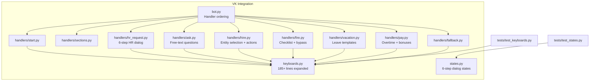
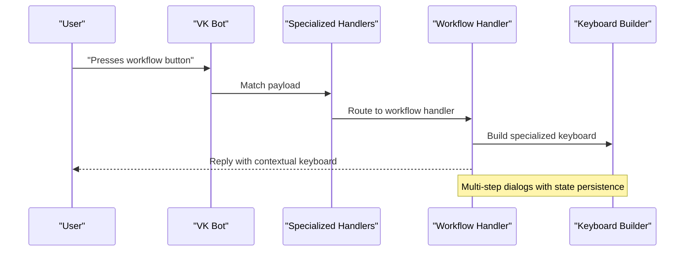
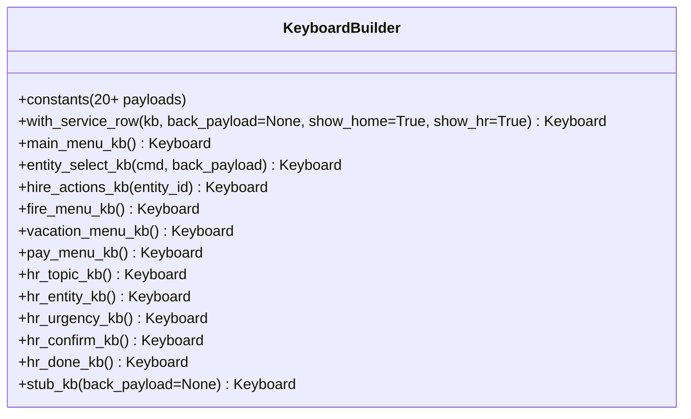
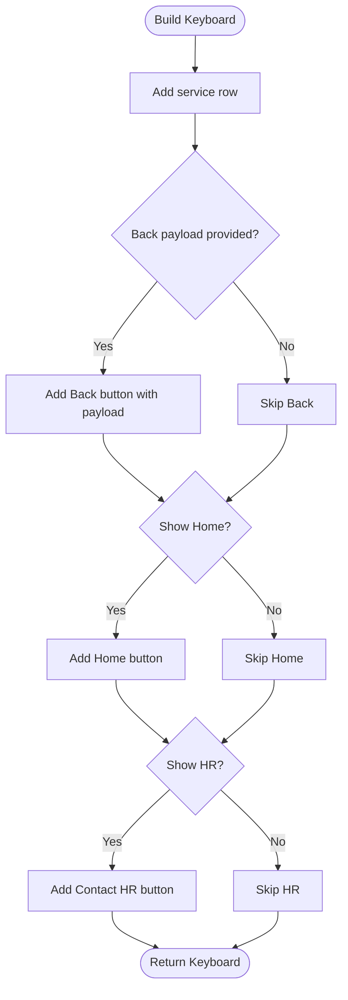
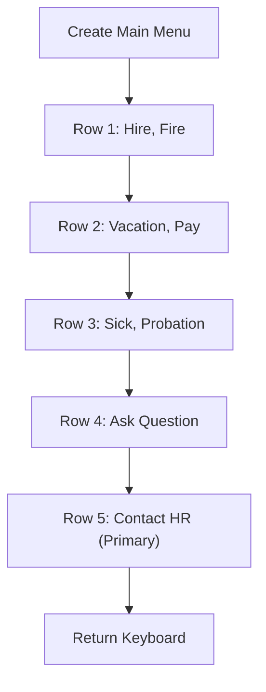
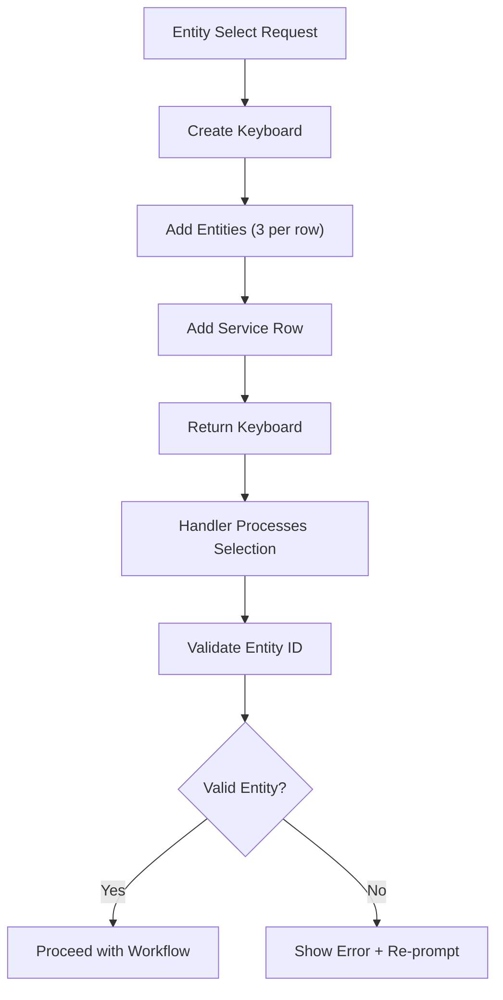
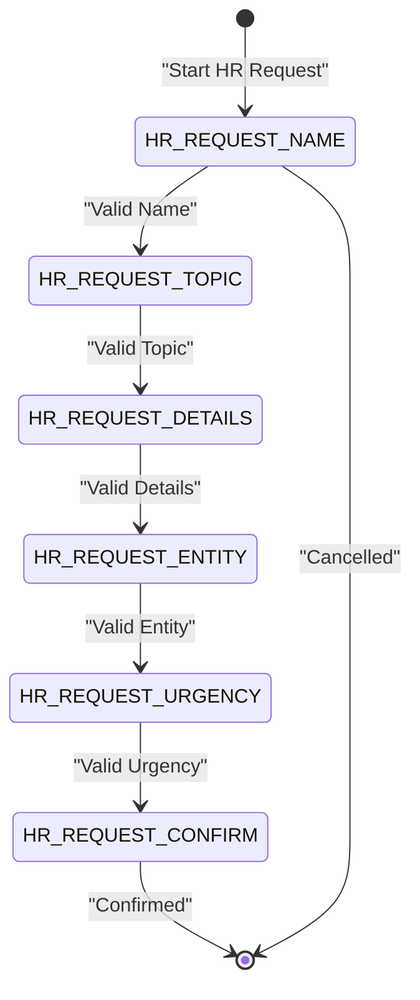
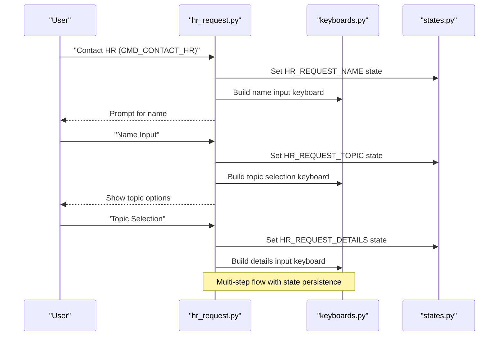
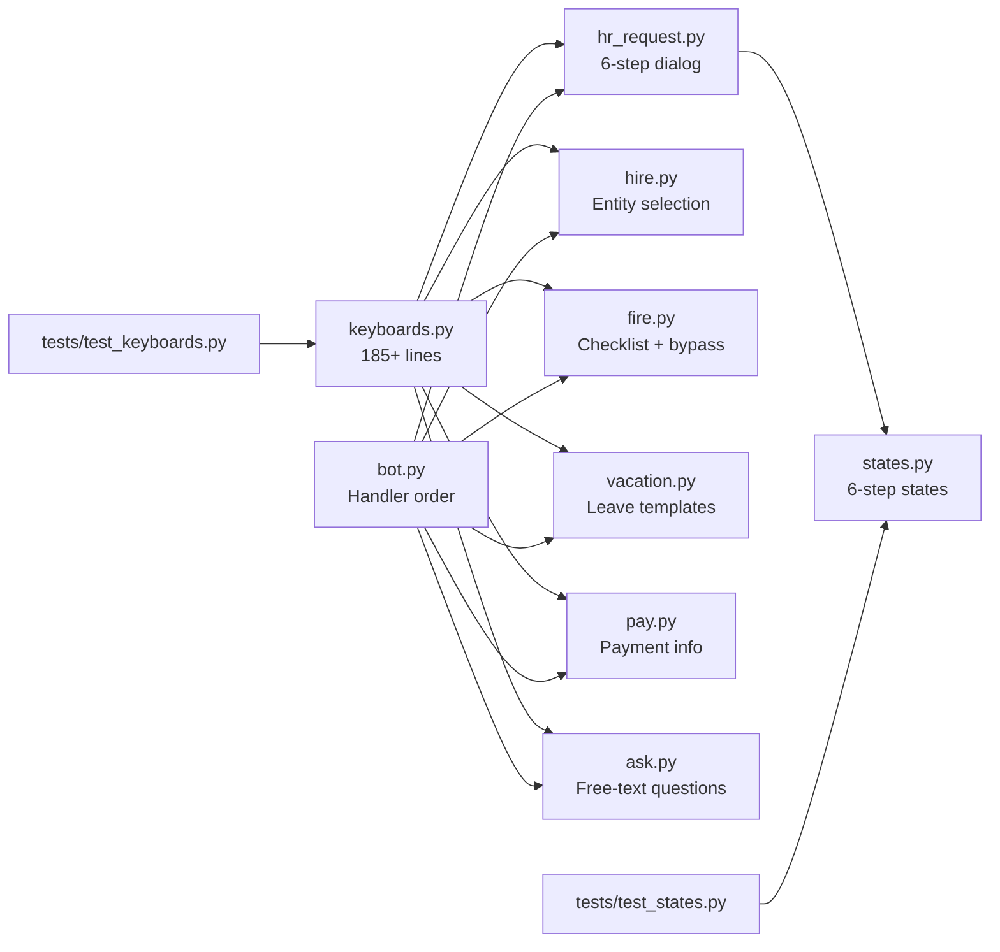
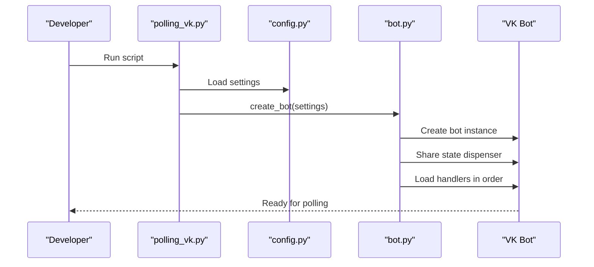

# Keyboard System

<cite>
**Referenced Files in This Document**
- [keyboards.py](file://app/integrations/vk/keyboards.py)
- [states.py](file://app/integrations/vk/states.py)
- [bot.py](file://app/integrations/vk/bot.py)
- [start.py](file://app/integrations/vk/handlers/start.py)
- [sections.py](file://app/integrations/vk/handlers/sections.py)
- [fallback.py](file://app/integrations/vk/handlers/fallback.py)
- [hr_request.py](file://app/integrations/vk/handlers/hr_request.py)
- [hire.py](file://app/integrations/vk/handlers/hire.py)
- [fire.py](file://app/integrations/vk/handlers/fire.py)
- [vacation.py](file://app/integrations/vk/handlers/vacation.py)
- [pay.py](file://app/integrations/vk/handlers/pay.py)
- [ask.py](file://app/integrations/vk/handlers/ask.py)
- [test_keyboards.py](file://tests/test_keyboards.py)
- [test_states.py](file://tests/test_states.py)
- [polling_vk.py](file://scripts/polling_vk.py)
- [config.py](file://app/config.py)
</cite>

## Update Summary
**Changes Made**
- Expanded keyboard system with over 185 new lines of keyboard builders and payload constants
- Added comprehensive multi-step dialog support for HR requests with 6-step flow
- Enhanced navigation patterns with entity selection and back navigation capabilities
- Introduced specialized keyboards for hire, fire, vacation, and pay workflows
- Added HR-request specific keyboards with topic selection, entity selection, urgency options, and confirmation steps
- Implemented complex payload-based routing with contextual navigation

## Table of Contents
1. [Introduction](#introduction)
2. [Project Structure](#project-structure)
3. [Core Components](#core-components)
4. [Architecture Overview](#architecture-overview)
5. [Detailed Component Analysis](#detailed-component-analysis)
6. [Enhanced Keyboard Builders](#enhanced-keyboard-builders)
7. [Multi-Step Dialog System](#multi-step-dialog-system)
8. [Specialized Workflows](#specialized-workflows)
9. [Navigation Patterns and Payload-Based Routing](#navigation-patterns-and-payload-based-routing)
10. [Dependency Analysis](#dependency-analysis)
11. [Performance Considerations](#performance-considerations)
12. [Accessibility and Responsive Design](#accessibility-and-responsive-design)
13. [Troubleshooting Guide](#troubleshooting-guide)
14. [Conclusion](#conclusion)
15. [Appendices](#appendices)

## Introduction
This document explains the comprehensive keyboard system used in VK bot interactions. The system has been significantly expanded with over 185 new lines of keyboard builders, payload constants, and enhanced navigation patterns. It covers standardized keyboard builders, service button implementation (Back, Home, Contact HR), complex multi-step dialog flows, specialized workflow keyboards, and sophisticated payload-based navigation systems. The system now supports intricate business processes including HR request workflows, entity selection, and contextual navigation with proper back button capabilities.

## Project Structure
The VK integration is organized under app/integrations/vk with dedicated modules for keyboards, states, and specialized handlers. The bot factory composes labelers in a specific order to ensure proper routing and fallback handling. The expanded system now includes dedicated handlers for complex workflows like HR requests, hiring, firing, vacations, and payments.

**Diagram sources**
- [bot.py:24-41](file://app/integrations/vk/bot.py#L24-L41)
- [hr_request.py:1-305](file://app/integrations/vk/handlers/hr_request.py#L1-L305)
- [hire.py:1-108](file://app/integrations/vk/handlers/hire.py#L1-L108)
- [fire.py:1-65](file://app/integrations/vk/handlers/fire.py#L1-L65)
- [vacation.py:1-76](file://app/integrations/vk/handlers/vacation.py#L1-L76)
- [pay.py:1-53](file://app/integrations/vk/handlers/pay.py#L1-L53)
- [ask.py:1-63](file://app/integrations/vk/handlers/ask.py#L1-L63)
- [keyboards.py:1-293](file://app/integrations/vk/keyboards.py#L1-L293)
- [states.py:1-17](file://app/integrations/vk/states.py#L1-L17)

**Section sources**
- [bot.py:24-41](file://app/integrations/vk/bot.py#L24-L41)
- [keyboards.py:1-293](file://app/integrations/vk/keyboards.py#L1-L293)
- [states.py:1-17](file://app/integrations/vk/states.py#L1-L17)

## Core Components
The expanded keyboard system now includes comprehensive payload constants, specialized keyboard builders for different workflows, and sophisticated multi-step dialog management. Key components include:

- **Payload Constants**: Over 20 centralized command identifiers for navigation and workflow control
- **Service Row Builder**: Enhanced with configurable Back/Home/Contact HR buttons
- **Main Menu**: Five-row layout with eight specialized buttons plus Contact HR
- **Entity Selection**: Context-aware entity selection with proper back navigation
- **Multi-Step Dialogs**: Complete HR request workflow with six distinct steps
- **Workflow-Specific Keyboards**: Hire, fire, vacation, and pay action menus
- **HR-Request Specific Keyboards**: Topic selection, entity selection, urgency options, and confirmation screens

**Section sources**
- [keyboards.py:13-55](file://app/integrations/vk/keyboards.py#L13-L55)
- [keyboards.py:57-139](file://app/integrations/vk/keyboards.py#L57-L139)
- [keyboards.py:141-293](file://app/integrations/vk/keyboards.py#L141-L293)

## Architecture Overview
The keyboard system integrates with specialized handlers via payload-based routing. Each workflow handler manages its own keyboard builders and state transitions. The system now supports complex multi-step dialogs with proper entity context preservation and back navigation capabilities.

**Diagram sources**
- [bot.py:24-41](file://app/integrations/vk/bot.py#L24-L41)
- [hr_request.py:69-78](file://app/integrations/vk/handlers/hr_request.py#L69-L78)
- [hire.py:32-37](file://app/integrations/vk/handlers/hire.py#L32-L37)
- [keyboards.py:144-156](file://app/integrations/vk/keyboards.py#L144-L156)

## Detailed Component Analysis

### Enhanced Keyboard Builders
The system now includes comprehensive keyboard builders for different workflow contexts:

- **Payload Constants**: 20+ centralized command identifiers covering all major workflows
- **with_service_row**: Enhanced service row builder with configurable buttons
- **main_menu_kb**: Five-row main menu with eight specialized buttons plus Contact HR
- **entity_select_kb**: Context-aware entity selection with proper back navigation
- **Workflow-specific keyboards**: Hire actions, fire menu, vacation menu, pay menu
- **HR-request keyboards**: Topic selection, entity selection, urgency options, confirmation screens

**Diagram sources**
- [keyboards.py:13-55](file://app/integrations/vk/keyboards.py#L13-L55)
- [keyboards.py:57-293](file://app/integrations/vk/keyboards.py#L57-L293)

**Section sources**
- [keyboards.py:13-293](file://app/integrations/vk/keyboards.py#L13-L293)

### Service Buttons: Back, Home, Contact HR
The service row system has been enhanced with configurable button visibility and proper payload handling:

- **Back Button**: Conditionally shown with custom payload for returning to previous contexts
- **Home Button**: Always present to return to the main menu
- **Contact HR Button**: Prominent button for initiating HR requests
- **Configurable Visibility**: Buttons can be hidden based on context requirements

**Diagram sources**
- [keyboards.py:60-81](file://app/integrations/vk/keyboards.py#L60-L81)

**Section sources**
- [keyboards.py:60-81](file://app/integrations/vk/keyboards.py#L60-L81)

### Main Menu Layout and Specialized Buttons
The main menu has been expanded to five rows with eight specialized buttons plus Contact HR:

- **First Row**: Primary actions (Hire, Fire)
- **Second Row**: Secondary actions (Vacation, Pay)
- **Third Row**: Additional services (Sick, Probation)
- **Fourth Row**: Direct question interface (Ask)
- **Fifth Row**: Prominent Contact HR button

**Diagram sources**
- [keyboards.py:87-129](file://app/integrations/vk/keyboards.py#L87-L129)

**Section sources**
- [keyboards.py:87-129](file://app/integrations/vk/keyboards.py#L87-L129)

## Enhanced Keyboard Builders

### Entity Selection System
The entity selection system provides context-aware selection with proper back navigation:

- **Context Preservation**: Entities passed as context in payload
- **Grid Layout**: Three-column entity display with row breaks
- **Service Row Integration**: Automatic service row addition
- **Error Handling**: Graceful handling of invalid selections

**Diagram sources**
- [keyboards.py:144-156](file://app/integrations/vk/keyboards.py#L144-L156)
- [hire.py:43-56](file://app/integrations/vk/handlers/hire.py#L43-L56)

**Section sources**
- [keyboards.py:144-156](file://app/integrations/vk/keyboards.py#L144-L156)
- [hire.py:43-56](file://app/integrations/vk/handlers/hire.py#L43-L56)

### Workflow-Specific Keyboards
Each major workflow has dedicated keyboard builders:

- **Hire Actions**: Checklist, contract template, onboarding checklist
- **Fire Menu**: Last day checklist, bypass sheet, voluntary dismissal
- **Vacation Menu**: Leave application template, leave procedure
- **Pay Menu**: Overtime payment, bonus conditions

**Section sources**
- [keyboards.py:162-215](file://app/integrations/vk/keyboards.py#L162-L215)
- [hire.py:62-107](file://app/integrations/vk/handlers/hire.py#L62-L107)
- [fire.py:37-64](file://app/integrations/vk/handlers/fire.py#L37-L64)
- [vacation.py:51-64](file://app/integrations/vk/handlers/vacation.py#L51-L64)
- [pay.py:36-52](file://app/integrations/vk/handlers/pay.py#L36-L52)

## Multi-Step Dialog System

### HR Request Workflow
The HR request system implements a comprehensive six-step dialog with state persistence:

- **Step 1**: Name input with validation
- **Step 2**: Topic selection from predefined categories
- **Step 3**: Details input with validation
- **Step 4**: Entity selection with context preservation
- **Step 5**: Urgency selection from priority options
- **Step 6**: Confirmation with final preview

**Diagram sources**
- [states.py:8-13](file://app/integrations/vk/states.py#L8-L13)
- [hr_request.py:137-271](file://app/integrations/vk/handlers/hr_request.py#L137-L271)

**Section sources**
- [states.py:8-13](file://app/integrations/vk/states.py#L8-L13)
- [hr_request.py:137-271](file://app/integrations/vk/handlers/hr_request.py#L137-L271)

### Back Navigation System
The system provides sophisticated back navigation within multi-step dialogs:

- **Context-Aware Back**: Returns to appropriate previous step
- **State Preservation**: Maintains user input across navigation
- **Payload-Based Navigation**: Uses structured payloads for navigation control
- **Step-Specific Logic**: Different back behavior based on current step

**Section sources**
- [hr_request.py:83-120](file://app/integrations/vk/handlers/hr_request.py#L83-L120)
- [keyboards.py:52](file://app/integrations/vk/keyboards.py#L52)

## Specialized Workflows

### Hire Flow System
The hire workflow provides comprehensive onboarding support:

- **Entity Selection**: Choose legal entity for hire process
- **Action Menu**: Access checklist, contracts, and onboarding resources
- **Resource Delivery**: Direct access to templates and checklists
- **Context Preservation**: Entity context maintained throughout workflow

**Section sources**
- [hire.py:32-107](file://app/integrations/vk/handlers/hire.py#L32-L107)
- [keyboards.py:162-177](file://app/integrations/vk/keyboards.py#L162-L177)

### Vacation Template System
The vacation system provides leave application templates:

- **Template Selection**: Entity-specific leave application templates
- **Disclaimer Integration**: Legal disclaimers with template delivery
- **RAG Integration**: Knowledge base integration for leave procedures
- **Back Navigation**: Contextual navigation to previous screens

**Section sources**
- [vacation.py:40-75](file://app/integrations/vk/handlers/vacation.py#L40-L75)
- [keyboards.py:197-203](file://app/integrations/vk/keyboards.py#L197-L203)

### Payment Information System
The payment system provides access to compensation information:

- **Overtime Information**: Working hours and payment calculations
- **Bonus Conditions**: Performance-based compensation criteria
- **RAG Integration**: Knowledge base integration for policy details
- **Contextual Navigation**: Back navigation to payment menu

**Section sources**
- [pay.py:25-52](file://app/integrations/vk/handlers/pay.py#L25-L52)
- [keyboards.py:209-215](file://app/integrations/vk/keyboards.py#L209-L215)

## Navigation Patterns and Payload-Based Routing

### Enhanced Payload System
The system uses sophisticated payload-based routing with context preservation:

- **Command-Based Navigation**: Structured payload commands for navigation
- **Context Preservation**: Entity and workflow context in payloads
- **Back Navigation**: Step-specific back navigation with state restoration
- **Restart Capability**: Complete workflow restart from any point

**Diagram sources**
- [hr_request.py:69-78](file://app/integrations/vk/handlers/hr_request.py#L69-L78)
- [hr_request.py:137-175](file://app/integrations/vk/handlers/hr_request.py#L137-L175)
- [keyboards.py:230-242](file://app/integrations/vk/keyboards.py#L230-L242)

### Handler Registration Order
The bot factory ensures proper handler registration order for optimal routing:

- **Start Handler**: Primary entry point and home navigation
- **HR Request Handler**: Complex multi-step dialog with state management
- **Ask Handler**: Free-text question handling with state preservation
- **Workflow Handlers**: Specialized handlers for hire, fire, vacation, pay
- **Sections Handler**: Remaining section stubs
- **Fallback Handler**: Must be last to catch unmatched messages

**Section sources**
- [bot.py:24-41](file://app/integrations/vk/bot.py#L24-L41)

## Dependency Analysis
The expanded keyboard system creates comprehensive dependencies across modules:

- **keyboards.py**: Defines all payload constants and keyboard builders used by handlers
- **handlers**: Import specific keyboard builders and payload constants for their workflows
- **states.py**: Defines multi-step dialog states for complex workflows
- **bot.py**: Composes handlers in specific order for proper routing
- **tests**: Validate keyboard layouts, payload constants, and state definitions

**Diagram sources**
- [keyboards.py:13-293](file://app/integrations/vk/keyboards.py#L13-L293)
- [hr_request.py:20-34](file://app/integrations/vk/handlers/hr_request.py#L20-L34)
- [hire.py:12-21](file://app/integrations/vk/handlers/hire.py#L12-L21)
- [fire.py:10-18](file://app/integrations/vk/handlers/fire.py#L10-L18)
- [vacation.py:10-20](file://app/integrations/vk/handlers/vacation.py#L10-L20)
- [pay.py:10-17](file://app/integrations/vk/handlers/pay.py#L10-L17)
- [ask.py:12-18](file://app/integrations/vk/handlers/ask.py#L12-L18)
- [bot.py:31-41](file://app/integrations/vk/bot.py#L31-L41)

**Section sources**
- [keyboards.py:13-293](file://app/integrations/vk/keyboards.py#L13-L293)
- [bot.py:31-41](file://app/integrations/vk/bot.py#L31-L41)

## Performance Considerations
The expanded keyboard system maintains performance through several optimizations:

- **Keyboard Construction**: Lightweight construction with minimal overhead
- **State Persistence**: Efficient state management for multi-step dialogs
- **Payload Optimization**: Minimal payload size with structured data
- **Reusability**: Shared keyboard builders reduce code duplication
- **Memory Management**: Proper cleanup of state data after completion
- **Error Handling**: Graceful error handling prevents memory leaks

## Accessibility and Responsive Design
The system addresses accessibility and responsive design through:

- **Clear Button Labels**: Descriptive labels for all buttons and actions
- **Consistent Navigation**: Back/Home/Contact HR buttons in predictable locations
- **Touch-Friendly Layout**: Appropriate button sizing for mobile interaction
- **Visual Hierarchy**: Primary actions highlighted with positive colors
- **Contextual Feedback**: Clear indication of current workflow step
- **Responsive Grid**: Adaptive layout for different screen sizes
- **Contrast and Readability**: High contrast colors for accessibility compliance

## Troubleshooting Guide
Common issues and resolutions for the expanded keyboard system:

- **Buttons Not Appearing**:
  - Verify service row is properly appended with correct flags
  - Check payload constants are properly imported and accessible
  - Reference: [keyboards.py:60-81](file://app/integrations/vk/keyboards.py#L60-L81)

- **Back Button Missing**:
  - Ensure back payload is provided when calling service row builder
  - Verify payload structure matches expected format
  - Reference: [keyboards.py:60-81](file://app/integrations/vk/keyboards.py#L60-L81)

- **Entity Selection Errors**:
  - Validate entity ID exists in ENTITY_BY_ID mapping
  - Check payload contains proper entity context
  - Reference: [hire.py:45-52](file://app/integrations/vk/handlers/hire.py#L45-L52)

- **HR Dialog State Issues**:
  - Confirm state dispenser is properly shared between handlers
  - Verify state names match BotStates class definitions
  - Reference: [hr_request.py:41](file://app/integrations/vk/handlers/hr_request.py#L41)

- **Handler Registration Order**:
  - Ensure hr_request handler loads before fallback handler
  - Verify all handlers are properly registered in bot factory
  - Reference: [bot.py:31-41](file://app/integrations/vk/bot.py#L31-L41)

- **Keyboard Layout Inconsistencies**:
  - Validate payload constants and ensure handlers use correct builders
  - Check entity selection grids and row break logic
  - Reference: [test_keyboards.py:49-92](file://tests/test_keyboards.py#L49-L92)

- **Multi-Step Dialog State Errors**:
  - Confirm state names and values are unique and match expected patterns
  - Verify state transitions follow proper sequence
  - Reference: [states.py:8-13](file://app/integrations/vk/states.py#L8-L13)

**Section sources**
- [keyboards.py:60-81](file://app/integrations/vk/keyboards.py#L60-L81)
- [hire.py:45-52](file://app/integrations/vk/handlers/hire.py#L45-L52)
- [hr_request.py:41](file://app/integrations/vk/handlers/hr_request.py#L41)
- [bot.py:31-41](file://app/integrations/vk/bot.py#L31-L41)
- [test_keyboards.py:49-92](file://tests/test_keyboards.py#L49-L92)
- [states.py:8-13](file://app/integrations/vk/states.py#L8-L13)

## Conclusion
The expanded VK bot keyboard system provides a comprehensive, payload-driven navigation framework supporting complex multi-step workflows. The system now includes over 185 lines of enhanced keyboard builders, sophisticated entity selection, and complete HR request dialog management. Standardized builders ensure uniformity across all workflows, while service buttons offer reliable navigation. The integration of state management enables complex business processes with proper context preservation and back navigation capabilities.

## Appendices

### Initialization and Running the Bot
The bot initialization process coordinates all specialized handlers and keyboard builders:

- **Factory Creation**: Creates bot with all handler labelers loaded in proper order
- **State Dispenser Sharing**: Shares state dispenser between HR request handlers
- **Handler Registration**: Ensures proper loading order for optimal routing
- **Local Development**: Runs bot in Long Poll mode using polling script

**Diagram sources**
- [polling_vk.py:24-28](file://scripts/polling_vk.py#L24-L28)
- [config.py:4-9](file://app/config.py#L4-L9)
- [bot.py:44-56](file://app/integrations/vk/bot.py#L44-L56)

**Section sources**
- [polling_vk.py:24-28](file://scripts/polling_vk.py#L24-L28)
- [config.py:4-9](file://app/config.py#L4-L9)
- [bot.py:44-56](file://app/integrations/vk/bot.py#L44-L56)