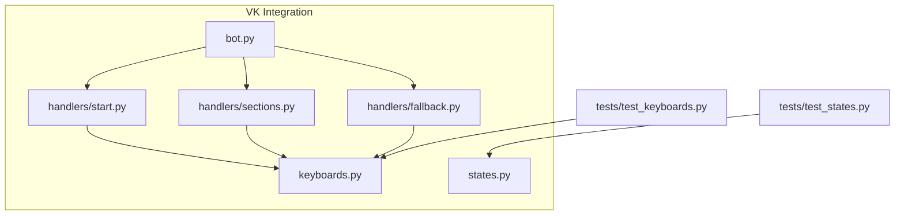
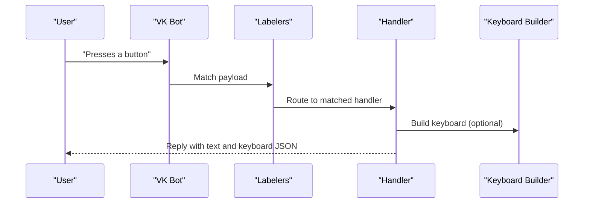
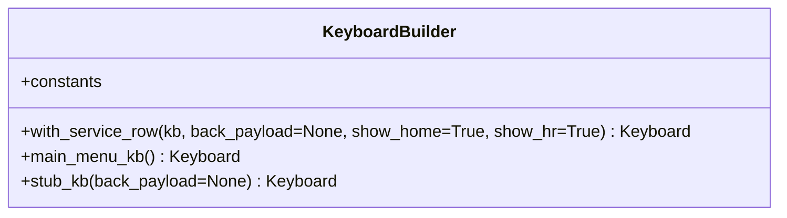
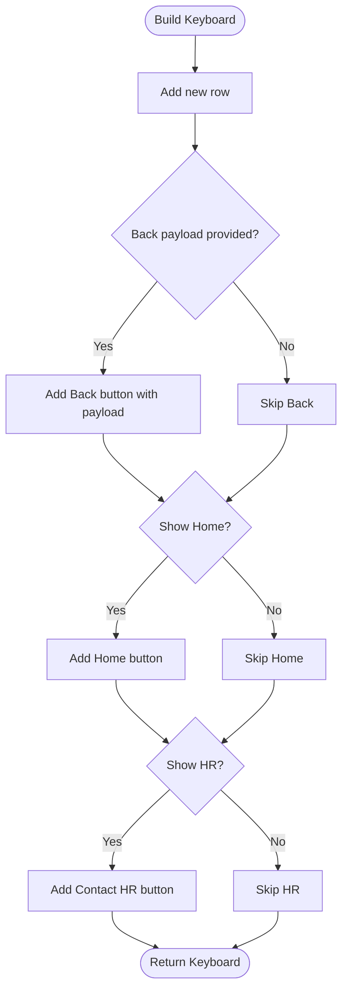
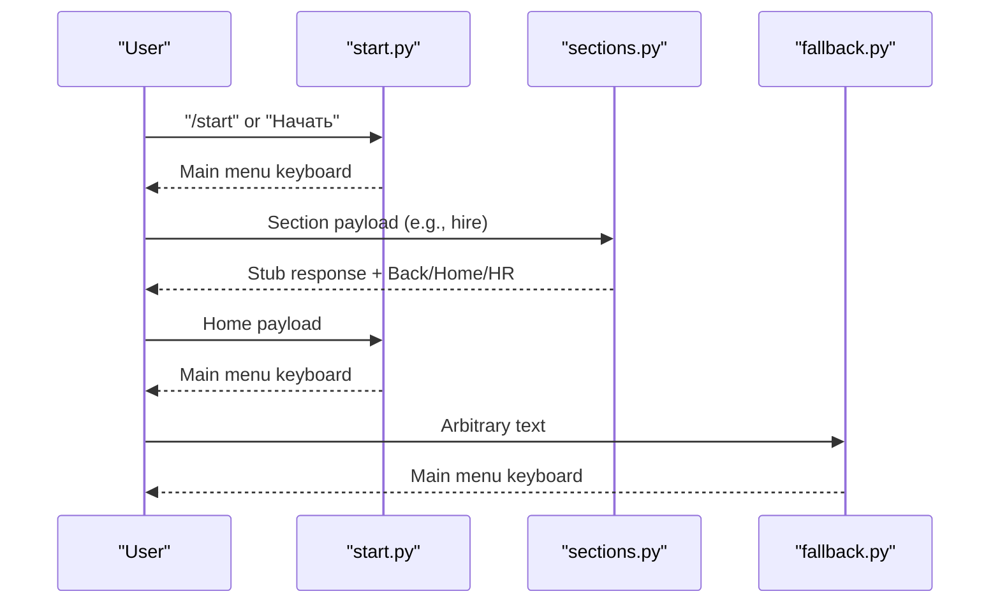
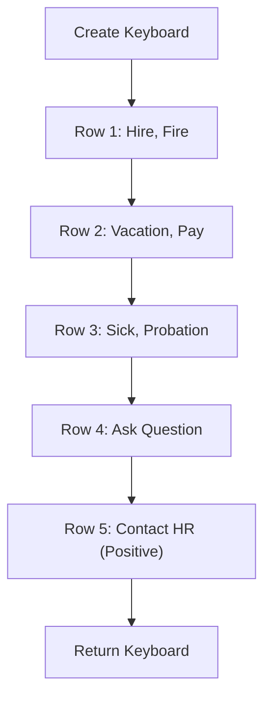
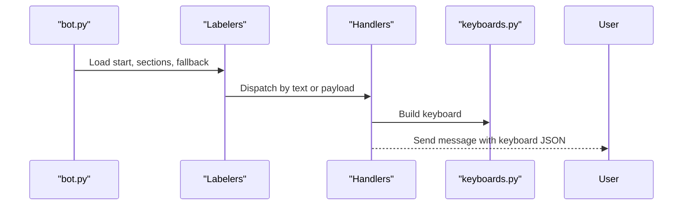
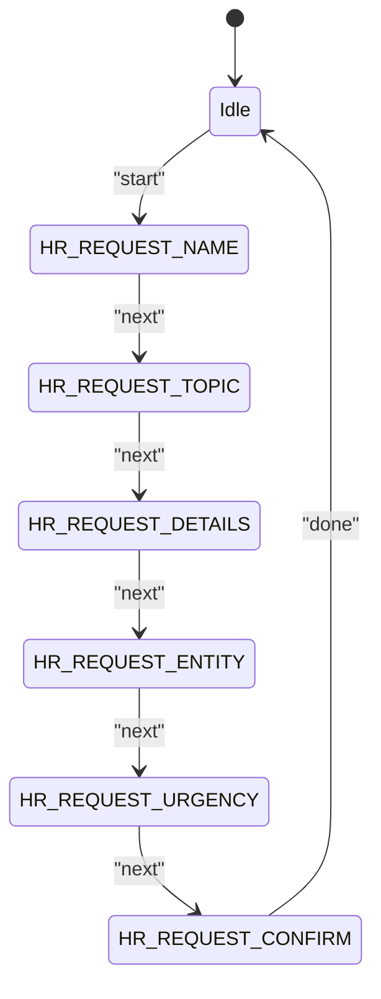
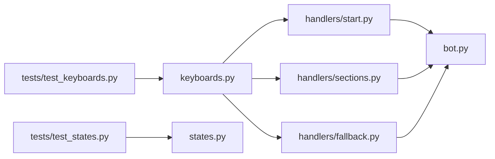
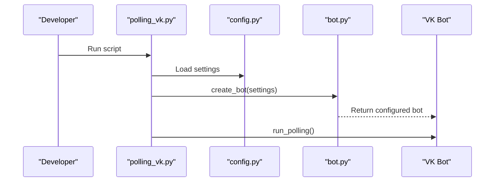

# Keyboard System

<cite>
**Referenced Files in This Document**
- [keyboards.py](file://app/integrations/vk/keyboards.py)
- [states.py](file://app/integrations/vk/states.py)
- [bot.py](file://app/integrations/vk/bot.py)
- [start.py](file://app/integrations/vk/handlers/start.py)
- [sections.py](file://app/integrations/vk/handlers/sections.py)
- [fallback.py](file://app/integrations/vk/handlers/fallback.py)
- [test_keyboards.py](file://tests/test_keyboards.py)
- [test_states.py](file://tests/test_states.py)
- [polling_vk.py](file://scripts/polling_vk.py)
- [config.py](file://app/config.py)
</cite>

## Table of Contents
1. [Introduction](#introduction)
2. [Project Structure](#project-structure)
3. [Core Components](#core-components)
4. [Architecture Overview](#architecture-overview)
5. [Detailed Component Analysis](#detailed-component-analysis)
6. [Dependency Analysis](#dependency-analysis)
7. [Performance Considerations](#performance-considerations)
8. [Accessibility and Responsive Design](#accessibility-and-responsive-design)
9. [Troubleshooting Guide](#troubleshooting-guide)
10. [Conclusion](#conclusion)
11. [Appendices](#appendices)

## Introduction
This document explains the keyboard system used in VK bot interactions. It covers the keyboard builder utilities, service button implementation (Back, Home, Contact HR), navigation patterns, and custom keyboard creation. It documents the payload-based navigation system, keyboard layout patterns, and how keyboards integrate with the handler system. Practical examples demonstrate creating custom keyboards, implementing complex navigation flows, and maintaining consistency across different bot states. Accessibility considerations and responsive design patterns for VK keyboards are addressed.

## Project Structure
The VK integration is organized under app/integrations/vk with dedicated modules for keyboards, states, and handlers. The bot factory composes labelers and registers them in order. Tests validate keyboard layouts and state definitions.

**Diagram sources**
- [bot.py:14-31](file://app/integrations/vk/bot.py#L14-L31)
- [start.py:1-55](file://app/integrations/vk/handlers/start.py#L1-L55)
- [sections.py:1-82](file://app/integrations/vk/handlers/sections.py#L1-L82)
- [fallback.py:1-18](file://app/integrations/vk/handlers/fallback.py#L1-L18)
- [keyboards.py:1-108](file://app/integrations/vk/keyboards.py#L1-L108)
- [states.py:1-14](file://app/integrations/vk/states.py#L1-L14)
- [test_keyboards.py:1-192](file://tests/test_keyboards.py#L1-L192)
- [test_states.py:1-31](file://tests/test_states.py#L1-L31)

**Section sources**
- [bot.py:14-31](file://app/integrations/vk/bot.py#L14-L31)
- [keyboards.py:1-108](file://app/integrations/vk/keyboards.py#L1-L108)
- [states.py:1-14](file://app/integrations/vk/states.py#L1-L14)
- [start.py:1-55](file://app/integrations/vk/handlers/start.py#L1-L55)
- [sections.py:1-82](file://app/integrations/vk/handlers/sections.py#L1-L82)
- [fallback.py:1-18](file://app/integrations/vk/handlers/fallback.py#L1-L18)
- [test_keyboards.py:1-192](file://tests/test_keyboards.py#L1-L192)
- [test_states.py:1-31](file://tests/test_states.py#L1-L31)

## Core Components
- Payload constants define navigation commands used by buttons.
- Keyboard builders construct standardized layouts and append service rows.
- Handlers respond to payload events and send appropriate keyboards.
- States define multi-step dialog scenarios.

Key responsibilities:
- keyboards.py: Defines payload constants, service row builder, main menu, and stub keyboard.
- handlers/start.py: Starts the bot, sends the main menu, handles Home and Contact HR payloads.
- handlers/sections.py: Handles section payloads with stub responses and service rows.
- handlers/fallback.py: Redirects unrecognized text to the main menu.
- states.py: Declares multi-step dialog states.

**Section sources**
- [keyboards.py:12-108](file://app/integrations/vk/keyboards.py#L12-L108)
- [start.py:23-55](file://app/integrations/vk/handlers/start.py#L23-L55)
- [sections.py:28-82](file://app/integrations/vk/handlers/sections.py#L28-L82)
- [fallback.py:15-18](file://app/integrations/vk/handlers/fallback.py#L15-L18)
- [states.py:4-14](file://app/integrations/vk/states.py#L4-L14)

## Architecture Overview
The keyboard system integrates with the handler system via payload-based routing. Handlers register message listeners for specific payloads and respond with keyboards built by the keyboard utilities. The bot factory loads labelers in a specific order to ensure the fallback handler captures unmatched messages last.

**Diagram sources**
- [bot.py:14-31](file://app/integrations/vk/bot.py#L14-L31)
- [start.py:31-55](file://app/integrations/vk/handlers/start.py#L31-L55)
- [sections.py:28-82](file://app/integrations/vk/handlers/sections.py#L28-L82)
- [keyboards.py:56-98](file://app/integrations/vk/keyboards.py#L56-L98)

## Detailed Component Analysis

### Keyboard Builders
- Payload constants: Centralized command identifiers for navigation.
- with_service_row: Adds Back/Home/Contact HR buttons to an existing keyboard.
- main_menu_kb: Builds the primary menu with seven sections plus Contact HR.
- stub_kb: Minimal keyboard containing only the service row.

**Diagram sources**
- [keyboards.py:12-108](file://app/integrations/vk/keyboards.py#L12-L108)

**Section sources**
- [keyboards.py:12-108](file://app/integrations/vk/keyboards.py#L12-L108)

### Service Buttons: Back, Home, Contact HR
- Back: Conditionally shown with a custom payload for returning to previous contexts.
- Home: Always present to return to the main menu.
- Contact HR: Prominent button for initiating HR requests.

**Diagram sources**
- [keyboards.py:29-50](file://app/integrations/vk/keyboards.py#L29-L50)

**Section sources**
- [keyboards.py:29-50](file://app/integrations/vk/keyboards.py#L29-L50)

### Navigation Patterns and Payload-Based Routing
- Handlers listen for specific payloads and respond with contextual keyboards.
- Home payload routes back to the main menu.
- Section payloads trigger stub responses with a Back button pointing to Home.
- Fallback handler ensures users always see a menu when text is sent.

**Diagram sources**
- [start.py:31-55](file://app/integrations/vk/handlers/start.py#L31-L55)
- [sections.py:28-82](file://app/integrations/vk/handlers/sections.py#L28-L82)
- [fallback.py:15-18](file://app/integrations/vk/handlers/fallback.py#L15-L18)

**Section sources**
- [start.py:31-55](file://app/integrations/vk/handlers/start.py#L31-L55)
- [sections.py:28-82](file://app/integrations/vk/handlers/sections.py#L28-L82)
- [fallback.py:15-18](file://app/integrations/vk/handlers/fallback.py#L15-L18)

### Main Menu Layout and Section Buttons
- The main menu is a five-row grid with eight buttons: seven sections plus Contact HR.
- First row contains two primary buttons.
- Last row contains the prominent Contact HR button.

**Diagram sources**
- [keyboards.py:56-98](file://app/integrations/vk/keyboards.py#L56-L98)

**Section sources**
- [keyboards.py:56-98](file://app/integrations/vk/keyboards.py#L56-L98)

### Integration with Handler System
- Handlers import keyboard builders and payload constants.
- They build keyboards and send them via message.answer with keyboard JSON.
- The bot factory loads labelers in order to ensure fallback is last.

**Diagram sources**
- [bot.py:14-31](file://app/integrations/vk/bot.py#L14-L31)
- [start.py:5-10](file://app/integrations/vk/handlers/start.py#L5-L10)
- [sections.py:5-15](file://app/integrations/vk/handlers/sections.py#L5-L15)
- [keyboards.py:56-98](file://app/integrations/vk/keyboards.py#L56-L98)

**Section sources**
- [bot.py:14-31](file://app/integrations/vk/bot.py#L14-L31)
- [start.py:5-10](file://app/integrations/vk/handlers/start.py#L5-L10)
- [sections.py:5-15](file://app/integrations/vk/handlers/sections.py#L5-L15)
- [keyboards.py:56-98](file://app/integrations/vk/keyboards.py#L56-L98)

### Multi-Step Dialog States
- States define a six-step HR request dialog group.
- These states can be used to manage transitions and maintain consistency across bot states.

**Diagram sources**
- [states.py:4-14](file://app/integrations/vk/states.py#L4-L14)

**Section sources**
- [states.py:4-14](file://app/integrations/vk/states.py#L4-L14)

### Practical Examples

- Creating a custom keyboard with a service row:
  - Build a keyboard and append the service row with optional Back payload.
  - Reference: [keyboards.py:29-50](file://app/integrations/vk/keyboards.py#L29-L50)

- Building a main menu:
  - Use the main menu builder to get a standardized five-row layout.
  - Reference: [keyboards.py:56-98](file://app/integrations/vk/keyboards.py#L56-L98)

- Implementing a section handler with Back/Home/HR:
  - Use stub_kb with a Back payload pointing to Home.
  - Reference: [sections.py:28-82](file://app/integrations/vk/handlers/sections.py#L28-L82)

- Handling Home navigation:
  - Respond to Home payload with the main menu keyboard.
  - Reference: [start.py:39-42](file://app/integrations/vk/handlers/start.py#L39-L42)

- Handling Contact HR:
  - Respond to Contact HR payload with a placeholder keyboard.
  - Reference: [start.py:47-55](file://app/integrations/vk/handlers/start.py#L47-L55)

- Fallback behavior:
  - On arbitrary text, redirect to the main menu.
  - Reference: [fallback.py:15-18](file://app/integrations/vk/handlers/fallback.py#L15-L18)

**Section sources**
- [keyboards.py:29-50](file://app/integrations/vk/keyboards.py#L29-L50)
- [keyboards.py:56-98](file://app/integrations/vk/keyboards.py#L56-L98)
- [sections.py:28-82](file://app/integrations/vk/handlers/sections.py#L28-L82)
- [start.py:39-55](file://app/integrations/vk/handlers/start.py#L39-L55)
- [fallback.py:15-18](file://app/integrations/vk/handlers/fallback.py#L15-L18)

## Dependency Analysis
- keyboards.py defines payload constants and keyboard builders used by handlers.
- handlers depend on keyboards for building keyboards and on payload constants for routing.
- bot.py composes labelers and registers them in a specific order to ensure fallback is last.
- tests validate keyboard layouts and state definitions.

**Diagram sources**
- [keyboards.py:12-108](file://app/integrations/vk/keyboards.py#L12-L108)
- [start.py:5-10](file://app/integrations/vk/handlers/start.py#L5-L10)
- [sections.py:5-15](file://app/integrations/vk/handlers/sections.py#L5-L15)
- [fallback.py:5](file://app/integrations/vk/handlers/fallback.py#L5)
- [bot.py:14-31](file://app/integrations/vk/bot.py#L14-L31)
- [test_keyboards.py:8-21](file://tests/test_keyboards.py#L8-L21)
- [test_states.py:5](file://tests/test_states.py#L5)

**Section sources**
- [keyboards.py:12-108](file://app/integrations/vk/keyboards.py#L12-L108)
- [start.py:5-10](file://app/integrations/vk/handlers/start.py#L5-L10)
- [sections.py:5-15](file://app/integrations/vk/handlers/sections.py#L5-L15)
- [fallback.py:5](file://app/integrations/vk/handlers/fallback.py#L5)
- [bot.py:14-31](file://app/integrations/vk/bot.py#L14-L31)
- [test_keyboards.py:8-21](file://tests/test_keyboards.py#L8-L21)
- [test_states.py:5](file://tests/test_states.py#L5)

## Performance Considerations
- Keyboard construction is lightweight; reuse builders to minimize overhead.
- Avoid excessive rows/columns to keep interactions fast and responsive.
- Keep payload keys minimal and consistent to reduce parsing overhead.
- Prefer stub keyboards for placeholder screens to reduce complexity.

## Accessibility and Responsive Design
- Use clear, concise labels for buttons.
- Maintain consistent placement of Back/Home/Contact HR across screens.
- Ensure sufficient contrast and readable font sizes on mobile devices.
- Limit the number of buttons per row to improve touch target size.
- Provide fallback navigation (Home) to prevent users from getting stuck.

## Troubleshooting Guide
Common issues and resolutions:
- Buttons not appearing:
  - Verify the service row is appended and flags are set correctly.
  - Reference: [keyboards.py:29-50](file://app/integrations/vk/keyboards.py#L29-L50)

- Back button missing:
  - Ensure a Back payload is provided when calling the service row builder.
  - Reference: [keyboards.py:29-50](file://app/integrations/vk/keyboards.py#L29-L50)

- Unexpected fallback behavior:
  - Confirm the fallback handler is loaded last and not intercepting intended payloads.
  - Reference: [bot.py:14-31](file://app/integrations/vk/bot.py#L14-L31)

- Keyboard layout inconsistencies:
  - Validate payload constants and ensure handlers use the correct builders.
  - Reference: [test_keyboards.py:49-92](file://tests/test_keyboards.py#L49-L92)

- State definition errors:
  - Confirm state names and values are unique and match expected patterns.
  - Reference: [test_states.py:8-31](file://tests/test_states.py#L8-L31)

**Section sources**
- [keyboards.py:29-50](file://app/integrations/vk/keyboards.py#L29-L50)
- [bot.py:14-31](file://app/integrations/vk/bot.py#L14-L31)
- [test_keyboards.py:49-92](file://tests/test_keyboards.py#L49-L92)
- [test_states.py:8-31](file://tests/test_states.py#L8-L31)

## Conclusion
The VK bot keyboard system provides a consistent, payload-driven navigation framework. Standardized builders ensure uniformity across screens, while service buttons offer reliable navigation. Handlers route messages based on payloads and return appropriate keyboards. The system supports multi-step dialogs and maintains accessibility and responsiveness through thoughtful layout and fallback mechanisms.

## Appendices

### Initialization and Running the Bot
- The bot is created via a factory that loads labelers in a specific order.
- Local development runs the bot in Long Poll mode using the polling script.

**Diagram sources**
- [polling_vk.py:24-28](file://scripts/polling_vk.py#L24-L28)
- [config.py:4-9](file://app/config.py#L4-L9)
- [bot.py:23-31](file://app/integrations/vk/bot.py#L23-L31)

**Section sources**
- [polling_vk.py:24-28](file://scripts/polling_vk.py#L24-L28)
- [config.py:4-9](file://app/config.py#L4-L9)
- [bot.py:23-31](file://app/integrations/vk/bot.py#L23-L31)