# Keyboard System

<cite>
**Referenced Files in This Document**
- [keyboards.py](file://app/integrations/vk/keyboards.py)
- [states.py](file://app/integrations/vk/states.py)
- [bot.py](file://app/integrations/vk/bot.py)
- [start.py](file://app/integrations/vk/handlers/start.py)
- [sections.py](file://app/integrations/vk/handlers/sections.py)
- [fallback.py](file://app/integrations/vk/handlers/fallback.py)
- [hire.py](file://app/integrations/vk/handlers/hire.py)
- [fire.py](file://app/integrations/vk/handlers/fire.py)
- [vacation.py](file://app/integrations/vk/handlers/vacation.py)
- [pay.py](file://app/integrations/vk/handlers/pay.py)
- [ask.py](file://app/integrations/vk/handlers/ask.py)
- [test_keyboards.py](file://tests/test_keyboards.py)
- [test_keyboards_block2.py](file://tests/test_keyboards_block2.py)
- [test_states.py](file://tests/test_states.py)
- [polling_vk.py](file://scripts/polling_vk.py)
- [config.py](file://app/config.py)
</cite>

## Update Summary
**Changes Made**
- Added new `vacation_type_kb()` function for vacation type selection keyboard with paid/unpaid vacation options
- Enhanced `entity_select_kb()` with `extra_payload` parameter for context passing between workflow steps
- Updated payload constants to support the new vacation workflow with `CMD_VACATION_SELECT`, `CMD_VACATION_TYPE`, and `CMD_VACATION_TEMPLATE`
- Integrated vacation workflow into the main navigation system with proper back navigation and state management
- Added comprehensive testing for the new vacation keyboard builders and payload constants

## Table of Contents
1. [Introduction](#introduction)
2. [Project Structure](#project-structure)
3. [Core Components](#core-components)
4. [Architecture Overview](#architecture-overview)
5. [Detailed Component Analysis](#detailed-component-analysis)
6. [Enhanced Keyboard Builders](#enhanced-keyboard-builders)
7. [Multi-Step Dialog System](#multi-step-dialog-system)
8. [Specialized Workflows](#specialized-workflows)
9. [Navigation Patterns and Payload-Based Routing](#navigation-patterns-and-payload-based-routing)
10. [Dynamic Scenario Navigation System](#dynamic-scenario-navigation-system)
11. [Dependency Analysis](#dependency-analysis)
12. [Performance Considerations](#performance-considerations)
13. [Accessibility and Responsive Design](#accessibility-and-responsive-design)
14. [Troubleshooting Guide](#troubleshooting-guide)
15. [Conclusion](#conclusion)
16. [Appendices](#appendices)

## Introduction
This document explains the comprehensive keyboard system used in VK bot interactions. The system has been enhanced to support a sophisticated vacation workflow with type selection, context preservation, and seamless integration with the existing navigation framework. It covers standardized keyboard builders, service button implementation (Back, Home), complex multi-step dialog flows, specialized workflow keyboards, and sophisticated payload-based navigation systems. The system now supports business processes including hiring, firing, vacations, payments, and the new Block 9 question-answering system with intelligent scenario linking. The simplified main menu provides seven primary section buttons plus Home navigation, with the vacation workflow featuring a three-step process: type selection → entity selection → template delivery.

## Project Structure
The VK integration is organized under app/integrations/vk with dedicated modules for keyboards, states, and specialized handlers. The bot factory composes labelers in a specific order to ensure proper routing and fallback handling. The system includes dedicated handlers for core workflows like hiring, firing, vacations, payments, and the new Block 9 question-answering system with intelligent scenario linking.

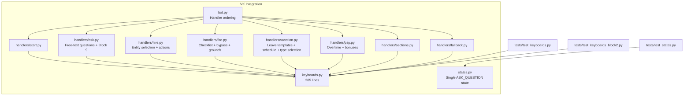

**Diagram sources**
- [bot.py:24-41](file://app/integrations/vk/bot.py#L24-L41)
- [hire.py:1-98](file://app/integrations/vk/handlers/hire.py#L1-L98)
- [fire.py:1-74](file://app/integrations/vk/handlers/fire.py#L1-L74)
- [vacation.py:1-105](file://app/integrations/vk/handlers/vacation.py#L1-L105)
- [pay.py:1-46](file://app/integrations/vk/handlers/pay.py#L1-L46)
- [ask.py:1-90](file://app/integrations/vk/handlers/ask.py#L1-L90)
- [keyboards.py:1-265](file://app/integrations/vk/keyboards.py#L1-L265)
- [states.py:1-9](file://app/integrations/vk/states.py#L1-L9)

**Section sources**
- [bot.py:24-41](file://app/integrations/vk/bot.py#L24-L41)
- [keyboards.py:1-265](file://app/integrations/vk/keyboards.py#L1-L265)
- [states.py:1-9](file://app/integrations/vk/states.py#L1-L9)

## Core Components
The keyboard system now includes comprehensive payload constants, specialized keyboard builders for different workflows, sophisticated multi-step dialog management, and the new dynamic scenario navigation system. Key components include:

- **Payload Constants**: 10 centralized command identifiers for navigation and workflow control, including new vacation workflow constants
- **Service Row Builder**: Enhanced with configurable Back/Home buttons
- **Main Menu**: Seven-row layout with seven specialized buttons plus Home
- **Entity Selection**: Context-aware entity selection with proper back navigation and enhanced `extra_payload` parameter for context passing
- **Multi-Step Dialogs**: Core workflow dialogs with state persistence
- **Workflow-Specific Keyboards**: Hire, fire, vacation, and pay action menus
- **Dynamic Scenario Navigation**: Intelligent scenario-specific buttons for Block 9 functionality
- **State Management**: Single ASK_QUESTION state for free-text question handling
- **Vacation Type Selection**: Dedicated keyboard for paid/unpaid vacation type selection

**Section sources**
- [keyboards.py:13-55](file://app/integrations/vk/keyboards.py#L13-L55)
- [keyboards.py:57-139](file://app/integrations/vk/keyboards.py#L57-L139)
- [keyboards.py:141-265](file://app/integrations/vk/keyboards.py#L141-L265)

## Architecture Overview
The keyboard system integrates with specialized handlers via payload-based routing. Each workflow handler manages its own keyboard builders and state transitions. The system now supports complex multi-step dialogs with proper entity context preservation, back navigation capabilities, and the new Block 9 dynamic scenario navigation system that intelligently suggests relevant sections based on user questions. The vacation workflow demonstrates advanced context preservation through the `extra_payload` parameter.

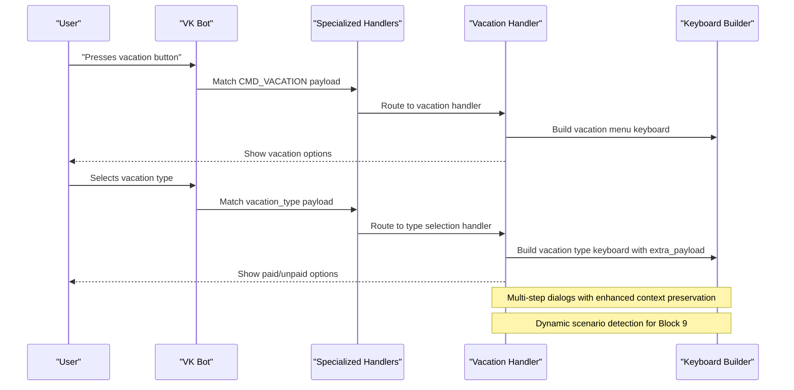

**Diagram sources**
- [bot.py:24-41](file://app/integrations/vk/bot.py#L24-L41)
- [vacation.py:31-47](file://app/integrations/vk/handlers/vacation.py#L31-L47)
- [keyboards.py:204-221](file://app/integrations/vk/keyboards.py#L204-L221)
- [ask.py:72-85](file://app/integrations/vk/handlers/ask.py#L72-L85)

## Detailed Component Analysis

### Enhanced Keyboard Builders
The system now includes comprehensive keyboard builders for different workflow contexts:

- **Payload Constants**: 10 centralized command identifiers covering all major workflows, including new vacation workflow constants
- **with_service_row**: Enhanced service row builder with configurable buttons
- **main_menu_kb**: Seven-row main menu with seven specialized buttons plus Home
- **entity_select_kb**: Context-aware entity selection with proper back navigation and enhanced `extra_payload` parameter for context passing
- **vacation_type_kb**: Dedicated keyboard for paid/unpaid vacation type selection
- **Workflow-specific keyboards**: Hire actions, fire menu, vacation menu, pay menu
- **Dynamic scenario keyboards**: ask_result_kb for Block 9 scenario-specific navigation

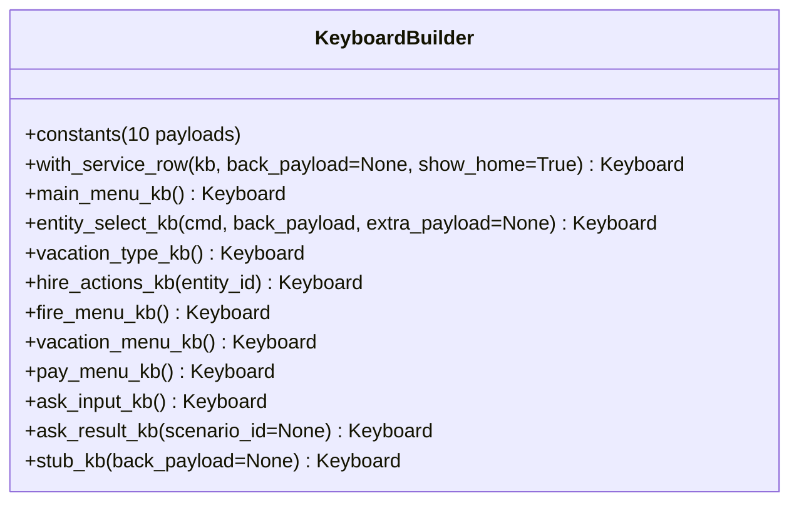

**Diagram sources**
- [keyboards.py:13-55](file://app/integrations/vk/keyboards.py#L13-L55)
- [keyboards.py:57-265](file://app/integrations/vk/keyboards.py#L57-L265)

**Section sources**
- [keyboards.py:13-265](file://app/integrations/vk/keyboards.py#L13-L265)

### Service Buttons: Back, Home
The service row system has been enhanced with configurable button visibility and proper payload handling:

- **Back Button**: Conditionally shown with custom payload for returning to previous contexts
- **Home Button**: Always present to return to the main menu
- **Configurable Visibility**: Buttons can be hidden based on context requirements

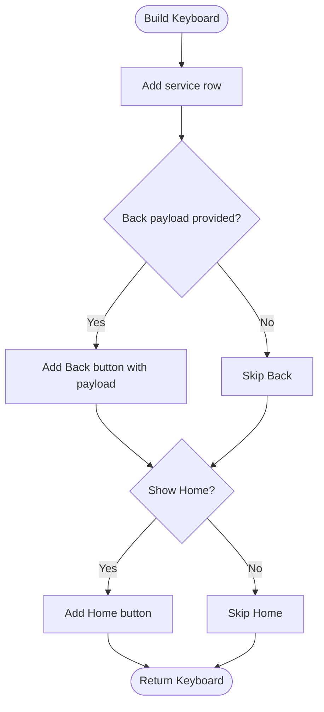

**Diagram sources**
- [keyboards.py:54-70](file://app/integrations/vk/keyboards.py#L54-L70)

**Section sources**
- [keyboards.py:54-70](file://app/integrations/vk/keyboards.py#L54-L70)

### Main Menu Layout and Specialized Buttons
The main menu has been simplified to seven rows with seven specialized buttons plus Home:

- **First Row**: Primary actions (Hire, Fire)
- **Second Row**: Secondary actions (Vacation, Pay)
- **Third Row**: Additional services (Sick, Probation)
- **Fourth Row**: Direct question interface (Ask)

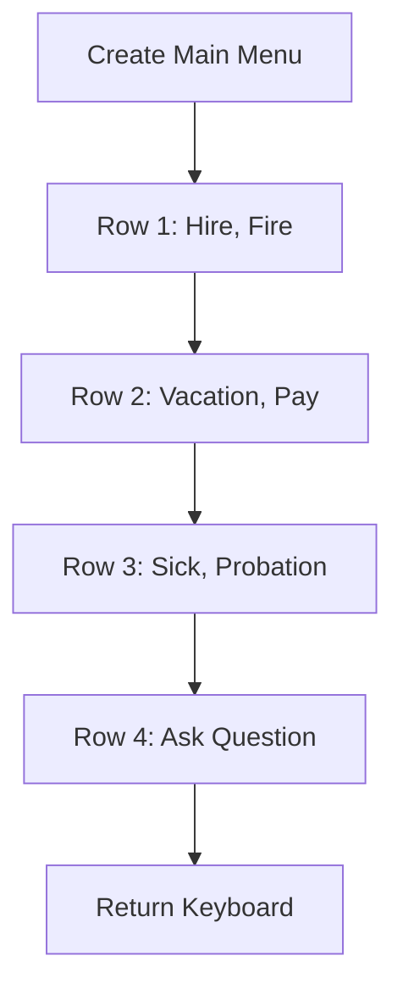

**Diagram sources**
- [keyboards.py:76-112](file://app/integrations/vk/keyboards.py#L76-L112)

**Section sources**
- [keyboards.py:76-112](file://app/integrations/vk/keyboards.py#L76-L112)

## Enhanced Keyboard Builders

### Entity Selection System
The entity selection system provides context-aware selection with proper back navigation and enhanced context preservation:

- **Context Preservation**: Entities passed as context in payload
- **Enhanced Context Passing**: `extra_payload` parameter allows additional context (like vacation type) to be carried through the workflow
- **Grid Layout**: Three-column entity display with row breaks
- **Service Row Integration**: Automatic service row addition
- **Error Handling**: Graceful handling of invalid selections

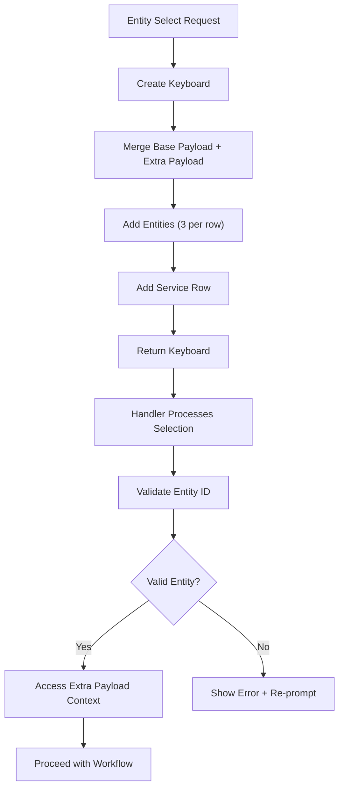

**Diagram sources**
- [keyboards.py:127-150](file://app/integrations/vk/keyboards.py#L127-L150)
- [vacation.py:63-68](file://app/integrations/vk/handlers/vacation.py#L63-L68)

**Section sources**
- [keyboards.py:127-150](file://app/integrations/vk/keyboards.py#L127-L150)
- [vacation.py:63-68](file://app/integrations/vk/handlers/vacation.py#L63-L68)

### Vacation Type Selection System
The new vacation type selection system provides specialized keyboard for paid/unpaid vacation type selection:

- **Type Selection**: Dedicated keyboard with paid/unpaid vacation options
- **Context Preservation**: Carries type information through the workflow
- **Service Row Integration**: Automatic service row with back navigation
- **Back Navigation**: Returns to previous selection step

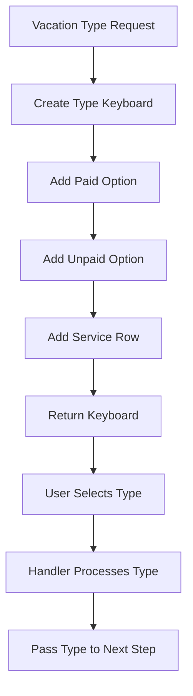

**Diagram sources**
- [keyboards.py:204-221](file://app/integrations/vk/keyboards.py#L204-L221)
- [vacation.py:42-47](file://app/integrations/vk/handlers/vacation.py#L42-L47)

**Section sources**
- [keyboards.py:204-221](file://app/integrations/vk/keyboards.py#L204-L221)
- [vacation.py:42-47](file://app/integrations/vk/handlers/vacation.py#L42-L47)

### Workflow-Specific Keyboards
Each major workflow has dedicated keyboard builders:

- **Hire Actions**: Checklist, contract template, onboarding checklist
- **Fire Menu**: Last day checklist, bypass sheet, voluntary dismissal, dismissal grounds
- **Vacation Menu**: Leave application template, leave procedure, vacation schedule navigator
- **Pay Menu**: Overtime payment, bonus conditions

**Section sources**
- [keyboards.py:156-232](file://app/integrations/vk/keyboards.py#L156-L232)
- [hire.py:58-97](file://app/integrations/vk/handlers/hire.py#L58-L97)
- [fire.py:39-73](file://app/integrations/vk/handlers/fire.py#L39-L73)
- [vacation.py:92-104](file://app/integrations/vk/handlers/vacation.py#L92-L104)
- [pay.py:24-45](file://app/integrations/vk/handlers/pay.py#L24-L45)

### Dynamic Scenario Navigation System
The new Block 9 functionality provides intelligent scenario-specific navigation based on user questions:

- **Scenario Detection**: Keyword-based detection of relevant scenarios
- **Dynamic Button Generation**: Adds scenario-specific buttons when applicable
- **Context Preservation**: Maintains proper back navigation to question interface
- **Integration**: Seamlessly integrated with the existing keyboard system

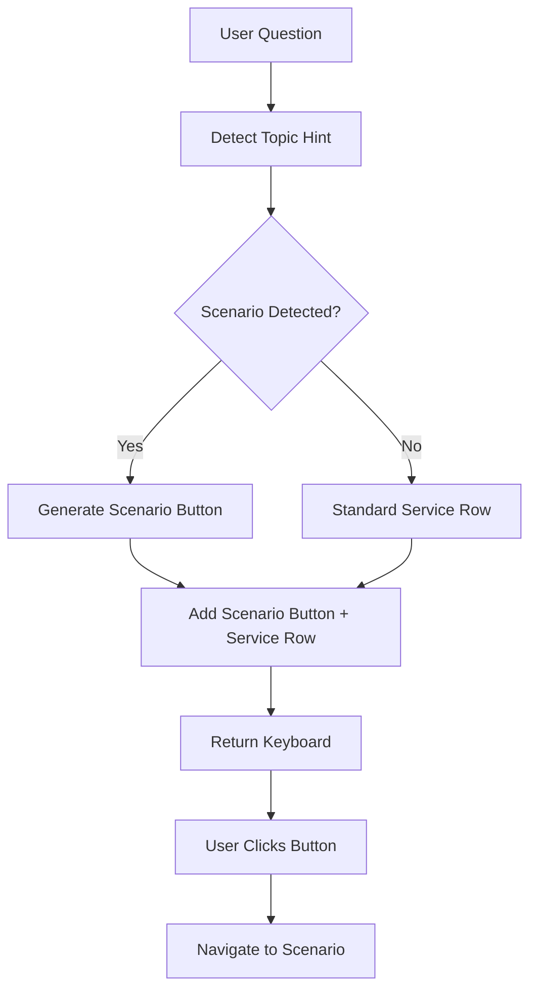

**Diagram sources**
- [ask.py:72-85](file://app/integrations/vk/handlers/ask.py#L72-L85)
- [keyboards.py:254-265](file://app/integrations/vk/keyboards.py#L254-L265)

**Section sources**
- [keyboards.py:254-265](file://app/integrations/vk/keyboards.py#L254-L265)
- [ask.py:72-85](file://app/integrations/vk/handlers/ask.py#L72-L85)

## Multi-Step Dialog System

### State Management
The system provides sophisticated state management for multi-step dialogs:

- **Single State**: ASK_QUESTION state for free-text question handling
- **State Preservation**: Maintains user input across navigation
- **Payload-Based Navigation**: Uses structured payloads for navigation control
- **State Cleanup**: Proper cleanup after processing

**Section sources**
- [states.py:4-8](file://app/integrations/vk/states.py#L4-L8)

### Back Navigation System
The system provides sophisticated back navigation within multi-step dialogs:

- **Context-Aware Back**: Returns to appropriate previous step
- **State Preservation**: Maintains user input across navigation
- **Payload-Based Navigation**: Uses structured payloads for navigation control
- **Step-Specific Logic**: Different back behavior based on current step

**Section sources**
- [keyboards.py:52](file://app/integrations/vk/keyboards.py#L52)

## Specialized Workflows

### Hire Flow System
The hire workflow provides comprehensive onboarding support:

- **Entity Selection**: Choose legal entity for hire process
- **Action Menu**: Access checklist, contracts, and onboarding resources
- **Resource Delivery**: Direct access to templates and checklists
- **Context Preservation**: Entity context maintained throughout workflow

**Section sources**
- [hire.py:32-97](file://app/integrations/vk/handlers/hire.py#L32-L97)
- [keyboards.py:156-171](file://app/integrations/vk/keyboards.py#L156-L171)

### Vacation Template System
The vacation system provides comprehensive leave application support with enhanced type selection:

- **Type Selection**: Paid/unpaid vacation type selection with dedicated keyboard
- **Template Selection**: Entity-specific leave application templates
- **Context Preservation**: Type information passed through the workflow using `extra_payload`
- **Disclaimer Integration**: Legal disclaimers with template delivery
- **RAG Integration**: Knowledge base integration for leave procedures
- **Back Navigation**: Contextual navigation to previous screens

**Updated** The vacation workflow now includes a sophisticated three-step process: type selection → entity selection → template delivery, with proper context preservation throughout the flow.

**Section sources**
- [vacation.py:31-86](file://app/integrations/vk/handlers/vacation.py#L31-L86)
- [keyboards.py:193-221](file://app/integrations/vk/keyboards.py#L193-L221)

### Payment Information System
The payment system provides access to compensation information:

- **Overtime Information**: Working hours and payment calculations
- **Bonus Conditions**: Performance-based compensation criteria
- **RAG Integration**: Knowledge base integration for policy details
- **Contextual Navigation**: Back navigation to payment menu

**Section sources**
- [pay.py:24-45](file://app/integrations/vk/handlers/pay.py#L24-L45)
- [keyboards.py:226-232](file://app/integrations/vk/keyboards.py#L226-L232)

### Question-Answering System (Block 9)
The new Block 9 system provides intelligent question-answering with scenario-specific navigation:

- **Free-Text Questions**: Users can ask questions in natural language
- **RAG Integration**: Knowledge base integration for accurate answers
- **Scenario Detection**: Keyword-based identification of relevant scenarios
- **Intelligent Navigation**: Direct links to relevant sections when applicable

**Section sources**
- [ask.py:1-90](file://app/integrations/vk/handlers/ask.py#L1-L90)

## Navigation Patterns and Payload-Based Routing

### Enhanced Payload System
The system uses sophisticated payload-based routing with context preservation:

- **Command-Based Navigation**: Structured payload commands for navigation
- **Context Preservation**: Entity and workflow context in payloads
- **Enhanced Context Passing**: `extra_payload` parameter for additional context (like vacation type)
- **Back Navigation**: Step-specific back navigation with state restoration
- **Restart Capability**: Complete workflow restart from any point

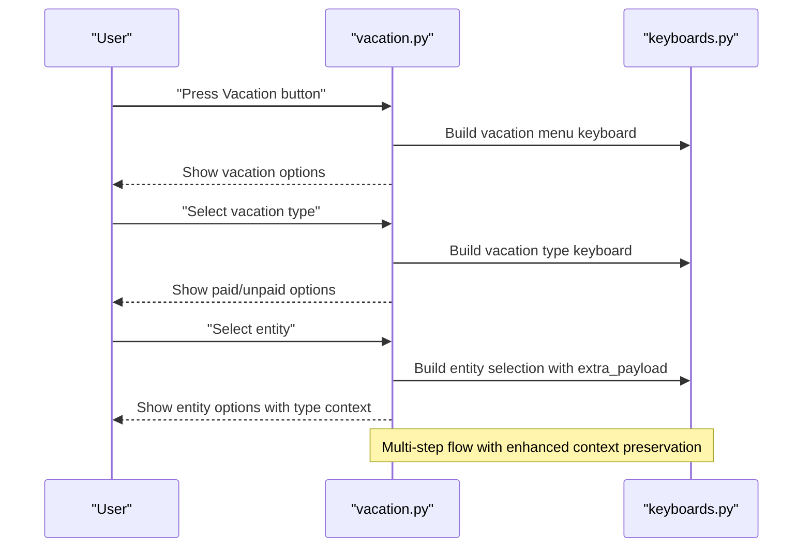

**Diagram sources**
- [vacation.py:31-68](file://app/integrations/vk/handlers/vacation.py#L31-L68)
- [keyboards.py:127-150](file://app/integrations/vk/keyboards.py#L127-L150)

### Handler Registration Order
The bot factory ensures proper handler registration order for optimal routing:

- **Start Handler**: Primary entry point and home navigation
- **Ask Handler**: Free-text question handling with state preservation and scenario detection
- **Workflow Handlers**: Specialized handlers for hire, fire, vacation, pay
- **Sections Handler**: Remaining section stubs
- **Fallback Handler**: Must be last to catch unmatched messages

**Section sources**
- [bot.py:24-41](file://app/integrations/vk/bot.py#L24-L41)

## Dynamic Scenario Navigation System

### Scenario Detection Engine
The system uses keyword-based detection to identify relevant scenarios from user questions:

- **Keyword Matching**: Comprehensive keyword lists for each scenario type
- **Priority Handling**: Background topics take precedence over scenario links
- **Case-Insensitive Matching**: Robust detection regardless of input case
- **Deterministic Results**: Pure keyword-based approach ensures consistent results

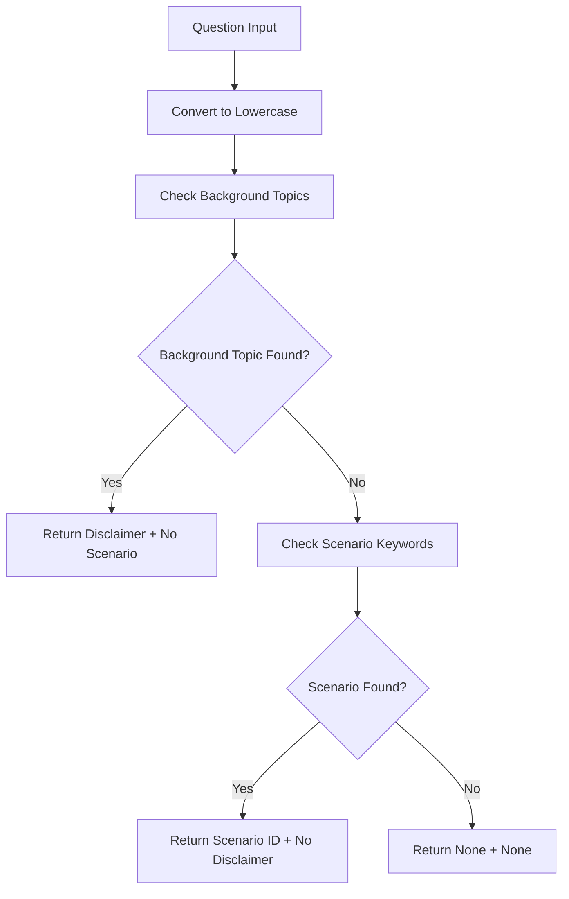

**Diagram sources**
- [ask.py:72-85](file://app/integrations/vk/handlers/ask.py#L72-L85)

**Section sources**
- [ask.py:72-85](file://app/integrations/vk/handlers/ask.py#L72-L85)

### Dynamic Keyboard Generation
The ask_result_kb function generates contextually appropriate keyboards:

- **Conditional Button Addition**: Only adds scenario-specific buttons when detected
- **Service Row Integration**: Always includes standard service buttons
- **Back Navigation**: Proper back navigation to question interface
- **Fallback Handling**: Graceful handling of unknown scenarios

**Section sources**
- [keyboards.py:254-265](file://app/integrations/vk/keyboards.py#L254-L265)

## Dependency Analysis
The keyboard system creates comprehensive dependencies across modules:

- **keyboards.py**: Defines all payload constants, keyboard builders, and scenario detection integration used by handlers
- **handlers**: Import specific keyboard builders and payload constants for their workflows, with ask handler integrating topic hints
- **states.py**: Defines single ASK_QUESTION state for question handling
- **bot.py**: Composes handlers in specific order for proper routing
- **tests**: Validate keyboard layouts, payload constants, state definitions, and scenario detection

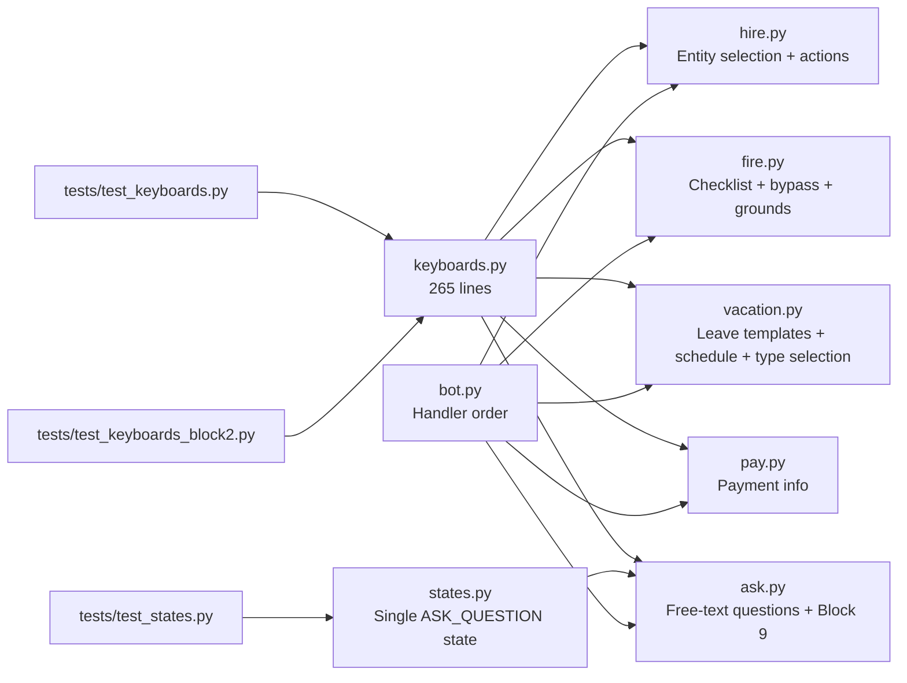

**Diagram sources**
- [keyboards.py:13-265](file://app/integrations/vk/keyboards.py#L13-L265)
- [hire.py:12-21](file://app/integrations/vk/handlers/hire.py#L12-L21)
- [fire.py:10-18](file://app/integrations/vk/handlers/fire.py#L10-L18)
- [vacation.py:12-22](file://app/integrations/vk/handlers/vacation.py#L12-L22)
- [pay.py:10-17](file://app/integrations/vk/handlers/pay.py#L10-L17)
- [ask.py:12-26](file://app/integrations/vk/handlers/ask.py#L12-L26)
- [bot.py:31-41](file://app/integrations/vk/bot.py#L31-L41)
- [states.py:4-8](file://app/integrations/vk/states.py#L4-L8)

**Section sources**
- [keyboards.py:13-265](file://app/integrations/vk/keyboards.py#L13-L265)
- [bot.py:31-41](file://app/integrations/vk/bot.py#L31-L41)
- [states.py:4-8](file://app/integrations/vk/states.py#L4-L8)

## Performance Considerations
The keyboard system maintains performance through several optimizations:

- **Keyboard Construction**: Lightweight construction with minimal overhead
- **State Persistence**: Efficient state management for multi-step dialogs
- **Payload Optimization**: Minimal payload size with structured data
- **Enhanced Context Passing**: Efficient `extra_payload` parameter for context preservation
- **Reusability**: Shared keyboard builders reduce code duplication
- **Memory Management**: Proper cleanup of state data after completion
- **Error Handling**: Graceful error handling prevents memory leaks
- **Keyword Processing**: Efficient keyword matching for scenario detection
- **Lazy Loading**: Domain-specific imports only when needed

## Accessibility and Responsive Design
The system addresses accessibility and responsive design through:

- **Clear Button Labels**: Descriptive labels for all buttons and actions
- **Consistent Navigation**: Back/Home buttons in predictable locations
- **Touch-Friendly Layout**: Appropriate button sizing for mobile interaction
- **Visual Hierarchy**: Primary actions highlighted with positive colors
- **Contextual Feedback**: Clear indication of current workflow step
- **Responsive Grid**: Adaptive layout for different screen sizes
- **Contrast and Readability**: High contrast colors for accessibility compliance
- **Dynamic Content**: Scenario-specific buttons adapt to user needs
- **Enhanced Context Preservation**: Improved user experience through better context handling

## Troubleshooting Guide
Common issues and resolutions for the keyboard system:

- **Buttons Not Appearing**:
  - Verify service row is properly appended with correct flags
  - Check payload constants are properly imported and accessible
  - Reference: [keyboards.py:54-70](file://app/integrations/vk/keyboards.py#L54-L70)

- **Back Button Missing**:
  - Ensure back payload is provided when calling service row builder
  - Verify payload structure matches expected format
  - Reference: [keyboards.py:54-70](file://app/integrations/vk/keyboards.py#L54-L70)

- **Entity Selection Errors**:
  - Validate entity ID exists in ENTITY_BY_ID mapping
  - Check payload contains proper entity context
  - Verify `extra_payload` parameter is properly handled
  - Reference: [vacation.py:63-68](file://app/integrations/vk/handlers/vacation.py#L63-L68)

- **Vacation Type Selection Issues**:
  - Verify `vacation_type_kb()` function is properly imported
  - Check that `extra_payload` parameter is correctly passed to `entity_select_kb()`
  - Ensure `vtype` context is preserved in subsequent steps
  - Reference: [keyboards.py:204-221](file://app/integrations/vk/keyboards.py#L204-L221)
  - Reference: [vacation.py:53-68](file://app/integrations/vk/handlers/vacation.py#L53-L68)

- **Handler Registration Order**:
  - Ensure handlers are properly registered in bot factory
  - Verify all handlers are properly ordered for optimal routing
  - Reference: [bot.py:31-41](file://app/integrations/vk/bot.py#L31-L41)

- **Keyboard Layout Inconsistencies**:
  - Validate payload constants and ensure handlers use correct builders
  - Check entity selection grids and row break logic
  - Verify `extra_payload` parameter handling in `entity_select_kb()`
  - Reference: [test_keyboards.py:49-92](file://tests/test_keyboards.py#L49-L92)
  - Reference: [test_keyboards_block2.py:48-83](file://tests/test_keyboards_block2.py#L48-L83)

- **Dynamic Scenario Navigation Issues**:
  - Verify scenario detection keywords are properly configured
  - Check that ask_result_kb function receives correct scenario_id
  - Ensure _SCENARIO_BUTTONS mapping includes all supported scenarios
  - Reference: [keyboards.py:238-245](file://app/integrations/vk/keyboards.py#L238-L245)
  - Reference: [keyboards.py:254-265](file://app/integrations/vk/keyboards.py#L254-L265)

- **Block 9 Functionality Issues**:
  - Verify ask handler properly imports detect_topic_hint
  - Check that scenario_id is correctly passed to ask_result_kb
  - Ensure topic hints are properly detected and processed
  - Reference: [ask.py:21-22](file://app/integrations/vk/handlers/ask.py#L21-L22)
  - Reference: [ask.py:72-85](file://app/integrations/vk/handlers/ask.py#L72-L85)

**Section sources**
- [keyboards.py:54-70](file://app/integrations/vk/keyboards.py#L54-L70)
- [vacation.py:63-68](file://app/integrations/vk/handlers/vacation.py#L63-L68)
- [bot.py:31-41](file://app/integrations/vk/bot.py#L31-L41)
- [test_keyboards.py:49-92](file://tests/test_keyboards.py#L49-L92)
- [test_keyboards_block2.py:48-83](file://tests/test_keyboards_block2.py#L48-L83)
- [keyboards.py:238-245](file://app/integrations/vk/keyboards.py#L238-L245)
- [keyboards.py:254-265](file://app/integrations/vk/keyboards.py#L254-L265)
- [ask.py:21-22](file://app/integrations/vk/handlers/ask.py#L21-L22)
- [ask.py:72-85](file://app/integrations/vk/handlers/ask.py#L72-L85)

## Conclusion
The VK bot keyboard system provides a comprehensive, payload-driven navigation framework supporting core workflows and intelligent scenario-specific navigation. The system now includes 265 lines of keyboard builders, sophisticated entity selection with enhanced context preservation, complete workflow dialogs, and the new Block 9 dynamic scenario navigation system. The addition of the vacation workflow demonstrates advanced context handling through the `extra_payload` parameter, enabling seamless type selection → entity selection → template delivery processes. Standardized builders ensure uniformity across all workflows, while service buttons offer reliable navigation. The integration of state management enables complex business processes with proper context preservation and back navigation capabilities. The simplified main menu with seven primary section buttons plus Home provides clear navigation without overwhelming users. The new dynamic scenario navigation system enhances user experience by providing intelligent links to relevant sections based on question content, making the bot more intuitive and efficient for HR-related inquiries.

**Updated** Recent enhancements include the addition of the `vacation_type_kb()` function for dedicated vacation type selection, the enhancement of `entity_select_kb()` with the `extra_payload` parameter for improved context passing, and the expansion of payload constants to support the new vacation workflow. These changes streamline the user experience by providing focused, context-aware navigation while maintaining the sophisticated navigation patterns that make the bot effective for HR support.

## Appendices

### Initialization and Running the Bot
The bot initialization process coordinates all specialized handlers and keyboard builders:

- **Factory Creation**: Creates bot with all handler labelers loaded in proper order
- **State Dispenser Sharing**: Shares state dispenser between bot and handlers
- **Handler Registration**: Ensures proper loading order for optimal routing
- **Local Development**: Runs bot in Long Poll mode using polling script

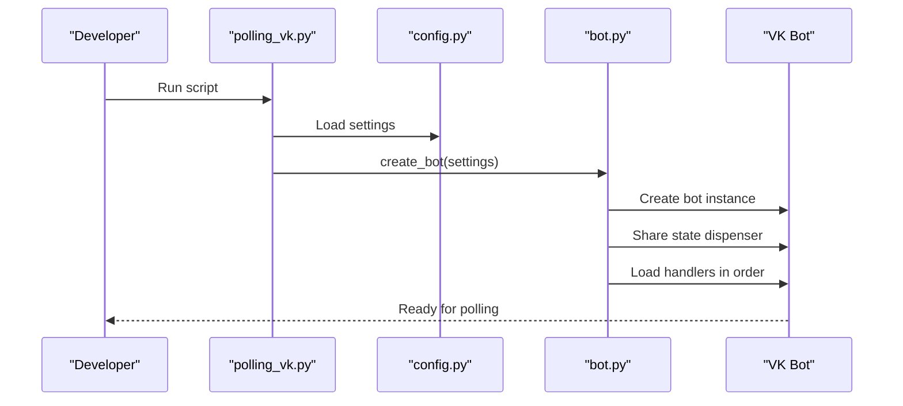

**Diagram sources**
- [polling_vk.py:24-28](file://scripts/polling_vk.py#L24-L28)
- [config.py:4-9](file://app/config.py#L4-L9)
- [bot.py:42-56](file://app/integrations/vk/bot.py#L42-L56)

**Section sources**
- [polling_vk.py:24-28](file://scripts/polling_vk.py#L24-L28)
- [config.py:4-9](file://app/config.py#L4-L9)
- [bot.py:42-56](file://app/integrations/vk/bot.py#L42-L56)